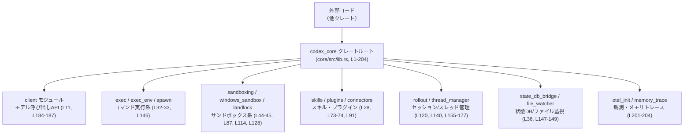

# core/src/lib.rs コード解説

## 0. ざっくり一言

このファイルは `codex-core` クレートのルート（クレートルート）であり、**多数の内部モジュールを定義しつつ、外部から利用される公開 API をまとめて再エクスポートするハブ**として機能します（`mod` / `pub mod` / `pub use` 群が並んでいることから読み取れます: `core/src/lib.rs:L8-204`）。  

---

## 1. このモジュールの役割

### 1.1 概要

- `#![deny(clippy::print_stdout, clippy::print_stderr)]` により、ライブラリコードからの標準出力・標準エラーへの直接書き込みを禁止し、**出力が必ず TUI やトレーススタックなどの抽象化を経由する**ようにしています（`core/src/lib.rs:L3-6`）。
- `mod` 宣言で多くのサブモジュールを宣言し（`core/src/lib.rs:L8-204`）、`pub mod` と `pub use` により、**外部クレートに見せるインターフェイスを整理して提供**しています。
- 自身では関数やロジックを持たず、**実装はすべて別モジュール側**にあり、このファイルは**名前空間の整形と API のゲートウェイ**に特化しています。

### 1.2 アーキテクチャ内での位置づけ

このファイルは、以下のように外部コードと各機能モジュールの間に位置します。



- 外部コードは原則として **`codex_core::...` の API のみを import し、直接内部モジュールに触れない**ような構成になっています（多くのモジュールが `pub(crate)` や非公開で宣言されていることから: 例 `core/src/lib.rs:L13, L43-44, L51, L63-65, L76, L121-122, L135, L141, L145, L147, L152, L179-181, L201`）。
- `pub use` による再エクスポートが多用されており、外部コードからは「フラットな API 面」に見えるよう整理されています（例: モデルクライアント関連 `core/src/lib.rs:L184-191`、ロールアウト関連 `core/src/lib.rs:L155-177`）。

### 1.3 設計上のポイント

コードから読み取れる設計上の特徴は次のとおりです。

- **責務分割**
  - 実際の処理は `client`, `exec`, `sandboxing`, `skills`, `rollout` などのモジュールに分離され、このファイルはそれらを束ねる役割に限定されています（`core/src/lib.rs:L8-204`）。
- **公開 API の集約**
  - 外部に見せる API は `pub mod` と `pub use` のみによって提供されており、**クレートの外から見ると「入口が一か所」**になるよう整理されています。
- **安全性・セキュリティ志向**
  - 標準出力/エラーへの直接出力禁止（`core/src/lib.rs:L3-6`）。
  - サンドボックス関連モジュールや関数の再エクスポート（`landlock`, `sandboxing`, `windows_sandbox`, `windows_sandbox_read_grants`, `seatbelt` など: `core/src/lib.rs:L44-45, L87, L114, L122, L142, L128`）。
- **後方互換性**
  - `ConversationManager` / `NewConversation` / `CodexConversation` など、旧名から新 API への移行を支える `#[deprecated]` な型エイリアスが定義されています（`core/src/lib.rs:L129-134`）。
- **並行性**
  - `thread_manager`, `codex_thread`, `arc_monitor` などのモジュール名から、スレッドや並行実行を扱うコンポーネントが存在することは分かりますが、**実装は本ファイルにはなく、並行性制御の詳細はこのチャンクからは不明**です（`core/src/lib.rs:L10, L18, L120`）。

---

## 2. 主要な機能一覧（コンポーネントインベントリー）

この節では、lib.rs が外部に公開している主要コンポーネントを、機能別に整理します。種別は「このファイルで確定できる範囲」で記載します。

### 2.1 公開モジュール

| モジュール | 役割 / 用途（名前と再エクスポートから推測） | 根拠 |
|-----------|------------------------------------------|------|
| `config` | 設定関連機能一式（内容は別ファイル） | `core/src/lib.rs:L26` |
| `config_loader` | 設定ファイルのロード・パース処理 | `core/src/lib.rs:L27` |
| `connectors` | 外部サービスとのコネクタ群 | `core/src/lib.rs:L28` |
| `exec` | コマンド実行・プロセス関連機能 | `core/src/lib.rs:L32` |
| `exec_env` | 実行環境（環境変数など）の管理 | `core/src/lib.rs:L33` |
| `external_agent_config` | 外部エージェント設定 | `core/src/lib.rs:L35` |
| `file_watcher` | ファイル変更監視ロジック | `core/src/lib.rs:L36` |
| `personality_migration` | パーソナリティ設定の移行 | `core/src/lib.rs:L73` |
| `plugins` | プラグインの管理・呼び出し | `core/src/lib.rs:L74` |
| `sandboxing` | サンドボックス機能（OS 非依存層） | `core/src/lib.rs:L87` |
| `skills` | スキル・ツール群の管理 | `core/src/lib.rs:L91` |
| `test_support` | テスト支援用ユーティリティ | `core/src/lib.rs:L112` |
| `windows_sandbox` | Windows 向けサンドボックス | `core/src/lib.rs:L114` |
| `review_format` | レビュー出力フォーマット | `core/src/lib.rs:L118` |
| `review_prompts` | レビュー用プロンプト定義 | `core/src/lib.rs:L119` |
| `seatbelt` | セーフティ関連（名前から推測） | `core/src/lib.rs:L142` |
| `shell` | シェル統合機能 | `core/src/lib.rs:L144` |
| `spawn` | プロセス spawn 周りのラッパー | `core/src/lib.rs:L146` |
| `util` | 共通ユーティリティ群 | `core/src/lib.rs:L182` |
| `compact` | コンテンツの compact 表現変換など | `core/src/lib.rs:L200` |
| `otel_init` | OpenTelemetry 初期化（観測性） | `core/src/lib.rs:L204` |

> これらのモジュールの中身はこのチャンクには現れず、詳細な API や挙動は各モジュールファイル側で確認する必要があります。

### 2.2 主要な公開型・ハンドル

| 名前 | 種別（このファイルで分かる範囲） | 概要 / 用途 | 根拠 |
|------|----------------------------------|-------------|------|
| `ModelClient` | 型（具体種別は別モジュール） | モデルとの対話を行うクライアント（`client` から再エクスポート） | `core/src/lib.rs:L11, L184` |
| `ModelClientSession` | 型 | モデルクライアントのセッションハンドル | `core/src/lib.rs:L185` |
| `SteerInputError` | 型（エラー型名） | コード生成/ステア入力に関連するエラー | `core/src/lib.rs:L13, L17` |
| `CodexThread` | 型 | 会話スレッド／セッション単位のオブジェクト | `core/src/lib.rs:L18, L20` |
| `ThreadConfigSnapshot` | 型 | スレッド設定のスナップショット | `core/src/lib.rs:L21` |
| `ThreadManager` | 型 | スレッド／会話の管理コンポーネント | `core/src/lib.rs:L120, L125` |
| `NewThread` | 型 | 新規スレッド作成用の設定/ハンドル | `core/src/lib.rs:L124` |
| `ForkSnapshot` | 型 | スレッド分岐のスナップショット | `core/src/lib.rs:L123` |
| `SandboxState` | 型 | MCP サンドボックスの状態表現 | `core/src/lib.rs:L57-59` |
| `McpManager` | 型 | MCP 関連の管理コンポーネント | `core/src/lib.rs:L46, L52` |
| `StateDbHandle` | 型 | 状態 DB へのハンドル | `core/src/lib.rs:L147-148` |
| `Cursor` | 型 | ロールアウトのページングカーソル | `core/src/lib.rs:L156` |
| `EventPersistenceMode` | 型 | イベント永続化モード | `core/src/lib.rs:L157` |
| `RolloutRecorder` | 型 | セッション・イベントのロールアウト記録 | `core/src/lib.rs:L159` |
| `RolloutRecorderParams` | 型 | ロールアウト記録のパラメータ | `core/src/lib.rs:L160` |
| `SessionMeta` | 型 | セッションメタデータ表現 | `core/src/lib.rs:L162` |
| `ThreadsPage` | 型 | スレッド一覧ページング結果 | `core/src/lib.rs:L165` |
| `ThreadItem` | 型 | スレッド一覧要素 | `core/src/lib.rs:L163` |
| `ThreadSortKey` | 型 | スレッドソートキー | `core/src/lib.rs:L164` |
| `MessageHistoryEntry` | 型 | メッセージ履歴の 1 エントリ (`HistoryEntry` の別名) | `core/src/lib.rs:L64, L68` |
| `FileWatcherEvent` | 型 | ファイル監視イベント | `core/src/lib.rs:L36, L198` |
| `ExecPolicyError` | 型（エラー） | 実行ポリシー関連のエラー | `core/src/lib.rs:L34, L194` |
| `BuiltMemory` | 型 | メモリトレースから構築されたメモリ | `core/src/lib.rs:L201-202` |
| `ModelProviderAuthInfo` | 型 | モデルプロバイダ認証情報（外部クレートから） | `core/src/lib.rs:L116` |
| `ConversationManager` | 型エイリアス（deprecated） | `ThreadManager` への後方互換エイリアス | `core/src/lib.rs:L129-130` |
| `NewConversation` | 型エイリアス（deprecated） | `NewThread` への後方互換エイリアス | `core/src/lib.rs:L131-132` |
| `CodexConversation` | 型エイリアス（deprecated） | `CodexThread` への後方互換エイリアス | `core/src/lib.rs:L133-134` |

> 「構造体か列挙体か」といったより細かい種別は、このファイルだけからは判別できません。定義モジュール側のコード参照が必要です。

### 2.3 主要な関数・ユーティリティ（再エクスポート）

ここでは「明らかに関数または関数群と思われる名前」のみを列挙します（実体は別モジュールにあり、このファイルにはシグネチャは現れません）。

| 名前 | 機能（名前からの推測、実装は不明） | 出所モジュール | 根拠 |
|------|------------------------------------|----------------|------|
| `spawn_command_under_linux_sandbox` | Linux サンドボックス下でコマンドを spawn する関数 | `landlock` | `core/src/lib.rs:L44-45` |
| `build_network_proxy_state` | ネットワークプロキシ状態を構築 | `network_proxy_loader` | `core/src/lib.rs:L51, L54` |
| `build_network_proxy_state_and_reloader` | 状態構築とリローダを同時に構築 | `network_proxy_loader` | `core/src/lib.rs:L51, L55` |
| `build_prompt_input` | デバッグ用プロンプト入力構築（doc hidden） | `prompt_debug` | `core/src/lib.rs:L76-78` |
| `build_skill_injections` ほか多数 | スキル関連の内部ユーティリティ（いずれも `pub(crate)`） | `skills` | `core/src/lib.rs:L91-109` |
| `web_search_action_detail` / `web_search_detail` | Web 検索アクションの詳細を取得 | `web_search` | `core/src/lib.rs:L121, L126-127` |
| `grant_read_root_non_elevated` | 非管理者でのルート読み取り許可設定 | `windows_sandbox_read_grants` | `core/src/lib.rs:L122, L128` |
| `discover_project_doc_paths` / `read_project_docs` | プロジェクトドキュメントの探索と読み込み | `project_doc` | `core/src/lib.rs:L135-139` |
| `append_thread_name` / `find_thread_*` / `parse_cursor` など | セッション/スレッドメタ情報の検索・パース | `rollout` | `core/src/lib.rs:L140, L166-177` |
| `get_state_db` | 状態 DB への接続取得 | `state_db_bridge` | `core/src/lib.rs:L147-149` |
| `content_items_to_text` | コンテンツ項目をテキストに変換 | `compact` | `core/src/lib.rs:L192` |
| `parse_turn_item` | ターンアイテムのパース | `event_mapping` | `core/src/lib.rs:L117, L193` |
| `check_execpolicy_for_warnings` / `format_exec_policy_error_with_source` / `load_exec_policy` | 実行ポリシーのロード・検査・フォーマット | `exec_policy` | `core/src/lib.rs:L34, L194-197` |
| `append_message_history_entry` / `lookup_message_history_entry` など | メッセージ履歴操作 | `message_history` | `core/src/lib.rs:L64, L69-71` |
| `build_turn_metadata_header` | HTTP ヘッダ用のターンメタデータ構築 | `turn_metadata` | `core/src/lib.rs:L153, L199` |
| `build_memories_from_trace_files` | トレースファイルからメモリ構築 | `memory_trace` | `core/src/lib.rs:L201-203` |

---

## 3. 公開 API と詳細解説

### 3.1 型一覧（主要な公開型）

上の 2.2 の表が、このファイルから分かる範囲での公開型の一覧です。  
ここでは補足として、**エラー型** と **ハンドル型** を意識した分類を示します。

| カテゴリ | 名前 | 説明（このファイルから分かる範囲） | 根拠 |
|---------|------|------------------------------------|------|
| エラー系 | `SteerInputError` | プロンプト／ステア入力関連エラーを表す型 | `core/src/lib.rs:L13, L17` |
|         | `ExecPolicyError` | 実行ポリシーの検証や適用時のエラー | `core/src/lib.rs:L34, L194` |
| ハンドル/マネージャ系 | `ModelClient` / `ModelClientSession` | モデルとの通信と、そのセッション単位の操作ハンドル | `core/src/lib.rs:L11, L184-185` |
|         | `ThreadManager` / `NewThread` / `ForkSnapshot` | 会話スレッドの作成・管理・分岐 | `core/src/lib.rs:L120, L123-125` |
|         | `CodexThread` / `ThreadConfigSnapshot` | 個々のスレッドとその設定スナップショット | `core/src/lib.rs:L18, L20-21` |
|         | `McpManager` | MCP スキル／ツールの管理 | `core/src/lib.rs:L46, L52` |
|         | `StateDbHandle` | 状態 DB へのハンドル | `core/src/lib.rs:L147-148` |
| 設定・メタ情報 | `ModelProviderAuthInfo` | モデルプロバイダ向け認証情報 | `core/src/lib.rs:L116` |
|         | `SessionMeta` / `ThreadsPage` / `ThreadItem` / `ThreadSortKey` | セッション／スレッドのメタ情報構造 | `core/src/lib.rs:L162-165` |
| トレース/メモリ | `BuiltMemory` | トレースから構築されたメモリ表現 | `core/src/lib.rs:L201-202` |

> いずれも実際のフィールドやメソッドはこのファイルには現れません。

### 3.2 関数詳細（例示的に 4 件）

実装は別モジュールにあるため、**シグネチャや内部処理はこのファイル単独では不明**です。その点を明示した上で、名前と出所に基づく最小限の情報を整理します。

#### `spawn_command_under_linux_sandbox(...) -> ...`

**概要**

- `landlock` モジュールから再エクスポートされており（`core/src/lib.rs:L44-45`）、Linux のサンドボックス（Landlock）環境下でコマンドを実行（spawn）する関数であると名前から推測されます。
- このファイルにはシグネチャがないため、**正確な引数・戻り値・エラー条件は分かりません**。

**引数**

| 引数名 | 型 | 説明 |
|--------|----|------|
| （不明） | （不明） | このチャンクには引数定義が存在しません。`landlock` モジュール側の定義を参照する必要があります。 |

**戻り値**

- 型・意味とも、このファイルからは取得できません。

**内部処理の流れ**

- lib.rs では `pub use landlock::spawn_command_under_linux_sandbox;` という再エクスポートのみが行われており（`core/src/lib.rs:L45`）、**実装は完全に `landlock` モジュール側に存在します**。
- したがって、サンドボックスの設定内容やセキュリティポリシーの詳細は、このチャンクからは分かりません。

**Examples（使用例：擬似コード）**

```rust
use codex_core::spawn_command_under_linux_sandbox;

fn example() {
    // 実際のシグネチャは landlock モジュール側を確認する必要があります。
    // 以下はコンパイル不能な擬似コード例です。
    // let child = spawn_command_under_linux_sandbox(cmd, args, sandbox_options)
    //     .expect("サンドボックス化されたコマンドの起動に失敗");
}
```

**Errors / Panics**

- エラー型や panic 条件は、このファイルからは不明です。

**Edge cases / 使用上の注意点**

- サンドボックスの名前から、**Linux 専用である可能性**が高いこと以外は、このチャンクからは判定できません。
- OS 依存の制約・権限要件などは `landlock` の実装とドキュメントを確認する必要があります。

---

#### `build_network_proxy_state_and_reloader(...) -> ...`

**概要**

- `network_proxy_loader` モジュールから再エクスポートされています（`core/src/lib.rs:L51, L55`）。
- 名前から、「ネットワークプロキシ設定の現在状態」と「その状態を更新するリローダ」をまとめて構築する関数であると想像できますが、**詳細は不明**です。

**引数 / 戻り値 / 内部処理**

- すべて `network_proxy_loader` 側に実装されており、このファイルには一切現れません。

**使用上の注意点**

- ネットワークやプロキシ設定など、環境依存の要素を扱うと考えられるため、**エラー時の扱い（接続不可、設定ファイル欠如など）を呼び出し側で確認する必要がある**点のみ、一般論として注意できます。

---

#### `load_exec_policy(...) -> ...`

**概要**

- 実行ポリシー関連の関数群の一つとして `exec_policy` モジュールから再エクスポートされています（`core/src/lib.rs:L34, L197`）。
- 名前から、ファイルや設定から「実行ポリシー」をロードする処理であることが示唆されます。

**その他**

- シグネチャ、戻り値（おそらく `Result<_, ExecPolicyError>` のような形である可能性はありますが、**このファイルからは断定できません**）・内部処理はいずれも不明です。

---

#### `build_memories_from_trace_files(...) -> ...`

**概要**

- `memory_trace` モジュールから再エクスポートされており（`core/src/lib.rs:L201-203`）、トレースファイル群から `BuiltMemory` を構築する関数であることが名前から読み取れます。
- 観測データやログから長期メモリを生成するような用途が考えられますが、**実際のアルゴリズムやフォーマットは不明**です。

**その他**

- 引数、戻り値の具体的な型・エラー条件は `memory_trace` モジュール側の実装に依存します。

---

### 3.3 その他の関数・ユーティリティ

このファイルから再エクスポートされるその他の関数群は、以下のように分類できます（いずれも実体は別モジュールです）。

| 関数名 | 役割（名前からの要約、挙動詳細は不明） | 出所モジュール | 根拠 |
|--------|----------------------------------------|----------------|------|
| `content_items_to_text` | コンテンツ項目群をテキストに変換 | `compact` | `core/src/lib.rs:L192` |
| `parse_turn_item` | 「ターン」単位のアイテムをパース | `event_mapping` | `core/src/lib.rs:L117, L193` |
| `check_execpolicy_for_warnings` | 実行ポリシーに警告がないかチェック | `exec_policy` | `core/src/lib.rs:L34, L195` |
| `format_exec_policy_error_with_source` | エラーをソース付きで整形 | `exec_policy` | `core/src/lib.rs:L34, L196` |
| `append_message_history_entry` | メッセージ履歴へのエントリ追加 | `message_history` | `core/src/lib.rs:L64, L69` |
| `lookup_message_history_entry` | 履歴からエントリを検索 | `message_history` | `core/src/lib.rs:L64, L71` |
| `build_turn_metadata_header` | HTTP ヘッダ用ターンメタデータ構築 | `turn_metadata` | `core/src/lib.rs:L153, L199` |
| `discover_project_doc_paths` | プロジェクトドキュメントの探索 | `project_doc` | `core/src/lib.rs:L135-138` |
| `read_project_docs` | プロジェクトドキュメントの読み込み | `project_doc` | `core/src/lib.rs:L135, L139` |
| `append_thread_name` | スレッド名の付加 | `rollout` | `core/src/lib.rs:L140, L166` |
| `find_thread_*` / `find_archived_thread_path_by_id_str` 等 | スレッド情報の検索・パス解決 | `rollout` | `core/src/lib.rs:L167-173` |
| `parse_cursor` | カーソル文字列のパース | `rollout` | `core/src/lib.rs:L174` |
| `read_head_for_summary` / `read_session_meta_line` | ロールアウト情報の読み取り | `rollout` | `core/src/lib.rs:L175-176` |
| `rollout_date_parts` | 日付情報の分解 | `rollout` | `core/src/lib.rs:L177` |
| `get_state_db` | 状態 DB のハンドル取得 | `state_db_bridge` | `core/src/lib.rs:L147-149` |

---

## 4. データフロー

### 4.1 再エクスポートを通じた呼び出しフロー

lib.rs 自体にはロジックがなく、**外部コードからの呼び出しはコンパイル時に直接対応モジュールへ解決される**だけです。その概念的なフローを、`load_exec_policy` を例に示します。

```mermaid
sequenceDiagram
    participant Ext as "外部コード\n(他クレート)"
    participant Root as "codex_core::load_exec_policy\n(lib.rs, L194-197)"
    participant EP as "exec_policy::load_exec_policy\n(別ファイル)"

    Ext->>Root: use codex_core::load_exec_policy;\nload_exec_policy(...)
    Note right of Root: 実際にはコンパイル時に\nEP に直接バインドされる\n(lib.rs は単なる再エクスポート, L34, L197)
    Root-->>EP: （シンボル解決）
    EP-->>Ext: 戻り値（型・内容は不明）
```

- Rust における `pub use` は **ランタイムのラッパーではなく、名前の再公開**であり、この図は**概念的な依存関係**を表しています。
- 同様に、`spawn_command_under_linux_sandbox` など他の関数も、`codex_core` 経由で import されつつ、実体は `landlock` などのモジュールにあります（`core/src/lib.rs:L44-45`）。

### 4.2 データフローの要点

- **lib.rs は状態を持たず、副作用も発生させない**構造になっています（関数や static 変数が定義されていない: `core/src/lib.rs:L1-204`）。
- データは、外部コード →（`use codex_core::...`）→ 実装モジュール、という方向にのみ流れます。
- エラー処理・並行性・I/O などの言語特有のロジックは、すべて各モジュール側にあり、**このファイルからそれらの挙動を読み取ることはできません**。

---

## 5. 使い方（How to Use）

### 5.1 基本的な使用方法（擬似コード）

lib.rs は「入口の統一」を目的としているため、外部クレートからは次のように利用するイメージになります。

```rust
// codex-core の公開 API をインポートする（lib.rs で再エクスポートされている）
use codex_core::{
    ModelClient,                         // モデルクライアント (L184)
    ThreadManager, NewThread,            // スレッド管理 (L123-125)
    load_exec_policy,                    // 実行ポリシーのロード (L197)
    spawn_command_under_linux_sandbox,   // Linux サンドボックス実行 (L45)
};

// 実際のシグネチャは各モジュールの定義を参照する必要があります。
// ここでは概念的な流れのみを示しています。
fn main() {
    // モデルクライアントの初期化（詳細不明）
    // let client = ModelClient::new(...);

    // 実行ポリシーのロード（擬似コード）
    // let policy = load_exec_policy("path/to/exec_policy.toml")?;

    // 新しいスレッドの作成（擬似コード）
    // let tm = ThreadManager::new(...);
    // let thread = tm.create_thread(NewThread { /* ... */ })?;

    // サンドボックス下でコマンド実行（擬似コード）
    // let child = spawn_command_under_linux_sandbox(cmd, args, &policy)?;
}
```

> コメントにもある通り、このコードは **実際にはコンパイルできません**。各関数や型のシグネチャは、このチャンクでは不明であり、対応するモジュール側を参照する必要があります。

### 5.2 よくある使用パターン（想定される組み合わせ）

lib.rs が提供する API 群から、次のような用途ごとの組み合わせが想定されます（あくまで名前に基づく想定であり、実装依存関係はこのチャンクからは確認できません）。

- **モデル対話 + セッション管理**
  - 型: `ModelClient`, `ModelClientSession`, `ThreadManager`, `CodexThread`（`core/src/lib.rs:L18, L20-21, L123-125, L184-185`）
- **安全なコマンド実行**
  - モジュール/関数: `exec`, `exec_env`, `spawn`, `load_exec_policy`, `spawn_command_under_linux_sandbox`, `windows_sandbox`, `seatbelt`（`core/src/lib.rs:L32-33, L114, L142, L146, L45, L197`）
- **スキル・プラグイン連携**
  - モジュール/型: `skills`, `plugins`, `connectors`, `McpManager`, 各種 mention シジル（`core/src/lib.rs:L28, L73-74, L46, L52, L63-67`）
- **観測・トレース**
  - モジュール/関数: `otel_init`, `memory_trace::build_memories_from_trace_files`（`core/src/lib.rs:L201-204`）

### 5.3 よくある間違い（想定される誤用）

このファイルの構造から、次のような誤用が起こり得ます。

```rust
// 間違い例: crate 内部モジュールへ直接アクセスしようとする
// use codex_core::landlock::spawn_command_under_linux_sandbox; // コンパイルエラー（landlock は pub(crate)）
//
// 正しい例: lib.rs が再エクスポートしているトップレベル API を使う
use codex_core::spawn_command_under_linux_sandbox; // OK (core/src/lib.rs:L45)
```

- `landlock`, `mcp`, `mention_syntax`, `message_history` などは `pub(crate)` として宣言されており（`core/src/lib.rs:L13, L43, L46, L63-65`）、**クレート外から直接参照することはできません**。
- 旧 API 名（`ConversationManager` など）に依存すると、将来的に削除される可能性があります（`#[deprecated]` が付与されている: `core/src/lib.rs:L129-134`）。

### 5.4 使用上の注意点（まとめ）

- **出力まわりの制約**
  - `#![deny(clippy::print_stdout, clippy::print_stderr)]` により、ライブラリ側で `println!` や `eprintln!` を使うことは Clippy によって禁止されます（`core/src/lib.rs:L3-6`）。
  - そのため、出力は TUI やトレーススタックなど、専用の抽象化に統一されている前提で設計されていると考えられます。
- **セキュリティ**
  - サンドボックス関連 API（`sandboxing`, `windows_sandbox`, `spawn_command_under_linux_sandbox`, `grant_read_root_non_elevated`, `seatbelt` など）が多数存在し、**コマンド実行やファイルアクセスに対して安全機能を適用する前提**で構成されていると読み取れます（`core/src/lib.rs:L44-45, L87, L114, L122, L128, L142`）。
  - ただし、どのようなセキュリティポリシーがどの条件で適用されるかは、このファイルからは分かりません。
- **並行性**
  - `thread_manager`, `codex_thread`, `arc_monitor` などの存在から、並行性を伴う処理があることは分かりますが、lib.rs では **共有状態やスレッド生成は行っておらず、並行性の問題はすべて各モジュール側に委ねられています**（`core/src/lib.rs:L10, L18, L120`）。

---

## 6. 変更の仕方（How to Modify）

### 6.1 新しい機能を追加する場合

このファイルを変更して新しい機能を追加する場合、おおむね次のステップになります。

1. **新しいモジュールの作成**
   - 例: `core/src/new_feature.rs` もしくは `core/src/new_feature/mod.rs` を作成し、実装を記述する。
   - このチャンクからは具体的なファイル名は分かりませんが、`mod new_feature;` のスタイルに従うと推測できます。

2. **lib.rs へのモジュール宣言**
   - 例えば内部専用なら `mod new_feature;`、外部に公開するなら `pub mod new_feature;` を追加（`mod` 群に倣う: `core/src/lib.rs:L8-12, L26-28, L32-33, L73-74` など）。

3. **公開 API の再エクスポート**
   - 外部に見せたい型・関数だけを `pub use new_feature::SomeType;` のように lib.rs に追加し、API 面を整理する（既存の `pub use` 群に倣う: `core/src/lib.rs:L17, L20-21, L45, L52-55, L66-72, L78, L115-128, L136-139, L148-149, L155-177, L184-203`）。

4. **注意点**
   - 既存の命名規則（例えば、スレッド管理系は `Thread*`、セッション管理系は `Session*`）との整合性を保つ。
   - セキュリティ／サンドボックス関連なら、`sandboxing` や `seatbelt` など既存モジュールとの境界を意識する必要がありますが、その作り方は各モジュールの実装を見て決める必要があります。

### 6.2 既存の機能を変更する場合

lib.rs 側で変更が発生する典型的なケースは次の通りです。

- **API の公開範囲を変える**
  - 例: これまで内部専用だったモジュールを公開したい場合、`mod foo;` を `pub mod foo;` に変える（`core/src/lib.rs:L26-28, L32-33` などを参考）。
  - 逆に、外部に出したくない場合は `pub mod` から `mod` / `pub(crate) mod` に変更する。
- **名前の移行・非推奨化**
  - 現在も `ConversationManager` などが `#[deprecated]` 付きのエイリアスとして提供されています（`core/src/lib.rs:L129-134`）。
  - 新しい名前に移行したい場合、同様に `pub type OldName = NewName;` ＋ `#[deprecated]` を追加することで、段階的な移行を助けるパターンが使われています。
- **影響範囲**
  - lib.rs の `pub use` を変更すると、**外部クレートから見える API が変わる**ため、破壊的変更になり得ます。
  - 変更前後で `rg` や IDE の参照検索を使い、利用箇所を確認する必要があります（この点は一般的な Rust プロジェクトの注意事項であり、このファイルに特有の情報ではありません）。

---

## 7. 関連ファイル

このファイルと密接に関係するモジュール（実際の実装が存在する場所）は次の通りです。  
`mod foo;` の定義先は通常 `core/src/foo.rs` か `core/src/foo/mod.rs` ですが、このチャンクだけからはどちらかは判別できません。

| モジュール / パス（推定） | 役割 / 関係 | 根拠 |
|--------------------------|-------------|------|
| `client` | モデルクライアント `ModelClient`, `ModelClientSession` の実装 | `mod client;` / `pub use client::ModelClient;` など（`core/src/lib.rs:L11, L184-187`） |
| `codex_thread` | `CodexThread`, `ThreadConfigSnapshot`, 旧 `CodexConversation` の定義 | `core/src/lib.rs:L18, L20-21, L133-134` |
| `thread_manager` | `ThreadManager`, `NewThread`, `ForkSnapshot` などスレッド管理の実装 | `core/src/lib.rs:L120, L123-125, L129-132` |
| `landlock` | `spawn_command_under_linux_sandbox` の実装（Linux サンドボックス） | `core/src/lib.rs:L43-45` |
| `exec_policy` | `ExecPolicyError` と exec policy 関数群の実装 | `core/src/lib.rs:L34, L194-197` |
| `web_search` | `web_search_action_detail`, `web_search_detail` の実装 | `core/src/lib.rs:L121, L126-127` |
| `windows_sandbox_read_grants` | `grant_read_root_non_elevated` の実装 | `core/src/lib.rs:L122, L128` |
| `rollout` | セッション・スレッドロールアウト関連の型・関数 | `core/src/lib.rs:L140, L155-177` |
| `state_db_bridge` | 状態 DB ハンドルとアクセサ（`StateDbHandle`, `get_state_db`） | `core/src/lib.rs:L147-149` |
| `memory_trace` | `BuiltMemory`, `build_memories_from_trace_files` の実装 | `core/src/lib.rs:L201-203` |
| `otel_init` | OpenTelemetry 初期化ロジック | `core/src/lib.rs:L204` |

> これらのモジュールの内部で、実際のエラー処理（`Result` / `Option`）、`async` / `await`、スレッドやチャネルなど Rust 特有の並行性機構がどのように使われているかは、この lib.rs からは分かりません。  
> セキュリティ上重要なコンポーネント（サンドボックス・seatbelt・network_proxy_loader 等）についても、**詳細な安全性・エッジケース・テスト方針は各モジュール側のコードを調査する必要があります。**
