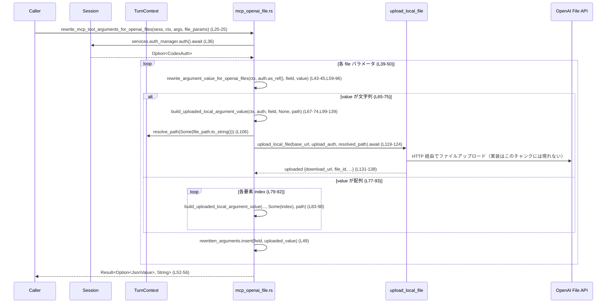

# core/src/mcp_openai_file.rs コード解説

## 0. ざっくり一言

このモジュールは、MCP ツール引数に含まれるローカルファイルパスを OpenAI ファイルストレージにアップロードし、Apps SDK の `openai/fileParams` 形式に合わせて引数 JSON を実行時に書き換える処理を提供します【mcp_openai_file.rs:L1-11,L20-57】。

---

## 1. このモジュールの役割

### 1.1 概要

- このモジュールは **Apps SDK の `openai/fileParams` メタデータにより指定されたツール引数** を検査し、それらが指すローカルファイルを OpenAI のファイルストレージへアップロードするために存在します【L1-7】。
- アップロード後、そのツール引数の値を、Apps 側で期待される「提供済みファイル（download_url / file_id など）」形式の JSON に置き換えます【L1-8,L131-138】。
- モデルに見えるスキーマのマスキングや MCP ツールインベントリの管理は別モジュール (`codex-mcp`) 側の責務であり、このモジュールは **実行時の引数書き換えのみ** を担当します【L10-11】。

### 1.2 アーキテクチャ内での位置づけ

このモジュールは Codex のセッション (`Session`)・ターンコンテキスト (`TurnContext`) から認証情報と環境情報を取得し、`codex_api::upload_local_file` を呼び出してファイルアップロードを行います【L13-18,L36,L99-123】。

Mermaid 図は、本チャンク（= このファイル全体）の範囲での依存関係を示します。

```mermaid
graph TD
    subgraph "mcp_openai_file.rs (L20-139)"
      A[rewrite_mcp_tool_arguments_for_openai_files]
      B[rewrite_argument_value_for_openai_files]
      C[build_uploaded_local_argument_value]
    end

    S[Session<br/>crate::codex] --> A
    T[TurnContext<br/>crate::codex] --> A
    S --> AM[auth_manager.auth()<br/>(Session.services)]
    AM --> A

    A --> B
    B --> C

    C --> U[upload_local_file<br/>codex_api]
```

- `Session` から `auth_manager.auth().await` 経由で `CodexAuth` 相当の認証情報を取得します【L36】。
- `TurnContext` からはカレントディレクトリ (`cwd`) や `config.chatgpt_base_url` を取り出し、ローカルパス解決と API ベース URL の決定に利用します【L100-106,L119-121,L214-225,L407-420】。
- ファイルの実アップロードは `codex_api::upload_local_file` に委譲されます【L119-124】。

### 1.3 設計上のポイント

- **ノーオペレーション・パス（何もしない早期リターン）**
  - `openai_file_input_params` が `None` の場合は引数を書き換えず、そのまま返します【L26-28,L150-167】。
  - 引数 JSON (`arguments_value`) 自体が `None` の場合も `Ok(None)` を返します【L30-32】。
  - `arguments_value` がオブジェクトでない場合（例: 文字列や配列）は、変更せずに返します【L33-35】。
- **フィールド単位での書き換え**
  - メタデータで指定されたフィールド名のみに対して、値の書き換えを試みます【L39-49】。
  - 対象フィールドが存在しない場合はスキップします【L40-41】。
- **値形状に応じた柔軟な処理**
  - 単一の文字列値（ファイルパス）と、文字列の配列（複数ファイル）をサポートします【L65-93】。
  - それ以外の型（オブジェクトや非文字列配列など）は「対象外」とみなし、`Ok(None)` を返して上位でスキップされます【L80-81,L95】。
- **エラーハンドリング**
  - すべてのコア関数は `Result<..., String>` を返し、アップロード失敗や認証取得失敗時にはユーザー向けのエラーメッセージを含む `Err(String)` を返します【L64-65,L105,L108-110,L112-114,L119-130】。
  - 配列要素のアップロード中に 1 件でも失敗した場合、その時点でエラーを返し、それまでの部分成功は破棄されます【L83-90,L124-130】。
- **非同期 I/O**
  - すべての処理は `async fn` として定義されており、`auth_manager.auth().await` や `upload_local_file(...).await` などの非同期 I/O を行います【L20,L36,L59,L99,L124,L150,L169】。
- **テストによる振る舞いの固定**
  - モジュール内に 5 つの `#[tokio::test]` があり、正常系（単一ファイル・複数ファイル）とエラー系（ファイルなし）をカバーしています【L150-167,L169-248,L250-327,L329-451,L453-471】。

---

## 2. 主要な機能一覧 & コンポーネントインベントリー

### 2.1 機能一覧（概要）

- MCP ツール引数のファイルパラメータ書き換え  
  → `rewrite_mcp_tool_arguments_for_openai_files`: ツール全体の引数オブジェクトを走査し、指定されたフィールドをアップロード済みファイル情報に差し替えます【L20-57】。
- 個々の引数値の書き換え  
  → `rewrite_argument_value_for_openai_files`: 単一フィールドの値（文字列または文字列配列）を、アップロード済みファイル JSON に変換します【L59-96】。
- ローカルファイルのアップロード処理  
  → `build_uploaded_local_argument_value`: ローカルパス → 絶対パス解決 → 認証取得 → HTTP 経由アップロード → 応答 JSON に変換、という一連の処理を行います【L99-139】。
- テスト用ユースケース  
  → 5 つの `#[tokio::test]` により、上記 3 関数の振る舞いを検証します【L150-471】。

### 2.2 関数・テスト関数インベントリー

| 名称 | 種別 | 公開範囲 | 役割 / 用途 | 定義位置 |
|------|------|----------|------------|----------|
| `rewrite_mcp_tool_arguments_for_openai_files` | `async fn` | `pub(crate)` | MCP ツール引数 JSON 全体のうち、`openai/fileParams` で指定されたキーをファイルアップロード結果で置き換えるメイン API | `mcp_openai_file.rs:L20-57` |
| `rewrite_argument_value_for_openai_files` | `async fn` | モジュール内 private | 1 つのフィールド値（文字列 or 文字列配列）を解析し、必要に応じてアップロード結果の JSON に変換するヘルパー | `mcp_openai_file.rs:L59-96` |
| `build_uploaded_local_argument_value` | `async fn` | モジュール内 private | ローカルファイルパスを解決し、`upload_local_file` を通じてアップロードし、その結果を JSON オブジェクトにまとめるコア処理 | `mcp_openai_file.rs:L99-139` |
| `openai_file_argument_rewrite_requires_declared_file_params` | `#[tokio::test] async fn` | テスト | `openai_file_input_params` が指定されない場合、引数が一切書き換えられないことを確認 | `mcp_openai_file.rs:L150-167` |
| `build_uploaded_local_argument_value_uploads_local_file_path` | `#[tokio::test] async fn` | テスト | ローカルファイルが正しくアップロードされ、期待どおりの JSON 形式に変換されることを検証 | `mcp_openai_file.rs:L169-248` |
| `rewrite_argument_value_for_openai_files_rewrites_scalar_path` | `#[tokio::test] async fn` | テスト | 単一の文字列ファイルパスが正しくアップロード情報に書き換えられることを検証 | `mcp_openai_file.rs:L250-327` |
| `rewrite_argument_value_for_openai_files_rewrites_array_paths` | `#[tokio::test] async fn` | テスト | 文字列配列（複数ファイル）がそれぞれアップロードされ、配列の JSON に書き換えられることを検証 | `mcp_openai_file.rs:L329-451` |
| `rewrite_mcp_tool_arguments_for_openai_files_surfaces_upload_failures` | `#[tokio::test] async fn` | テスト | 存在しないファイルパスが指定された場合にアップロード失敗エラーが表に出ることを確認 | `mcp_openai_file.rs:L453-471` |

---

## 3. 公開 API と詳細解説

### 3.1 型一覧（構造体・列挙体など）

このモジュール内で新しい構造体や列挙体は定義されていません【L20-139】。  
ただし、外部モジュールから次の型が利用されています。

| 名前 | 種別 | 定義場所（推測範囲） | 役割 / 用途 | 根拠 |
|------|------|----------------------|-------------|------|
| `Session` | 構造体（外部） | `crate::codex`（ファイルパスはこのチャンクには現れません） | Codex のセッション情報。`services.auth_manager.auth()` を通じて認証情報を取得するために使われます【L13,L36】。 | `mcp_openai_file.rs:L13,L36` |
| `TurnContext` | 構造体（外部） | `crate::codex` | 実行時のカレントディレクトリ (`cwd`) や設定 (`config.chatgpt_base_url`) を保持し、パス解決やベース URL 取得に利用されます【L14,L100-106,L119-121,L214-225,L407-420】。 | `L14,L100-106,L119-121` |
| `CodexAuth` | 構造体（外部） | `codex_login` | ChatGPT アカウントのトークン情報を保持し、`get_token_data()` でアクセストークン・アカウント ID を取得します【L17,L112-117,L215-216】。 | `L17,L112-117` |
| `CoreAuthProvider` | 構造体（外部） | `codex_api` | API 呼び出し用にトークンと account_id をまとめるための認証コンテナです【L15,L115-118】。 | `L15,L115-118` |
| `JsonValue` | 型エイリアス（`serde_json::Value`） | `serde_json` | ツール引数やアップロード後のファイル情報を表現する汎用 JSON 値です【L18,L23,L33-35,L59-65,L93,L131-138】。 | `L18,L23,L131-138` |

※ これらの型自体の定義内容は、このチャンクには現れないため詳細は不明です。

---

### 3.2 関数詳細

#### `rewrite_mcp_tool_arguments_for_openai_files(sess: &Session, turn_context: &TurnContext, arguments_value: Option<JsonValue>, openai_file_input_params: Option<&[String]>) -> Result<Option<JsonValue>, String>` （L20-57）

**概要**

- MCP ツールの引数 JSON 全体から、`openai_file_input_params` で指定されたフィールドを探しだし、その値がローカルファイルパス（またはその配列）であれば OpenAI ファイルストレージへアップロードした情報に書き換える関数です【L20-25,L39-50】。
- ファイルパラメータが宣言されていない場合や、引数がオブジェクトでない場合は、引数を変更せずに返します【L26-28,L30-35】。

**引数**

| 引数名 | 型 | 説明 |
|--------|----|------|
| `sess` | `&Session` | Codex セッション。`sess.services.auth_manager.auth().await` を通じて認証情報を取得します【L13,L36】。 |
| `turn_context` | `&TurnContext` | 実行時コンテキスト。後続のアップロード処理に渡されます【L22,L43-44】。 |
| `arguments_value` | `Option<JsonValue>` | MCP ツールに渡す引数全体の JSON。`Some(Object)` である場合のみフィールド書き換えの対象となります【L23,L30-35】。 |
| `openai_file_input_params` | `Option<&[String]>` | Apps SDK の `_meta["openai/fileParams"]` に基づき、「ファイル入力」として扱うべきフィールド名の一覧【L24,L26-28】。`None` の場合は書き換えを行いません【L26-28】。 |

**戻り値**

- `Ok(Some(JsonValue))`  
  - 引数が存在し（`arguments_value` が `Some`）、オブジェクトの場合は JSON オブジェクトを返します【L30-35,L52-56】。
  - いずれかのフィールドが書き換えられた場合は、新しい JSON オブジェクトを返します【L56】。
  - 一切書き換えが行われなかった場合は、元の `arguments_value` をそのまま返します【L52-53】。
- `Ok(None)`  
  - `arguments_value` 自体が `None` の場合に返されます【L30-32】。
- `Err(String)`  
  - 認証情報の取得やファイルアップロードに失敗した場合に、エラーメッセージを含んだ `Err` を返します【L43-45,L119-130,L453-471】。

**内部処理の流れ（アルゴリズム）**

1. `openai_file_input_params` が `Some` でなければ、`arguments_value` をそのまま返して処理終了【L26-28】。
2. `arguments_value` が `None` の場合は `Ok(None)` を返して終了【L30-32】。
3. `arguments_value.as_object()` で JSON オブジェクトへの変換を試み、失敗した場合は JSON を変更せず返す【L33-35】。
4. `sess.services.auth_manager.auth().await` で認証情報（`Option<CodexAuth>` 相当）を取得し、引数オブジェクトを `clone` して `rewritten_arguments` として保持【L36-37】。
5. `openai_file_input_params` 内の各フィールド名について以下を行う【L39-49】：
   - 元の `arguments` から `value` を取り出し（存在しなければ `continue`）【L39-41】。
   - `rewrite_argument_value_for_openai_files(turn_context, auth.as_ref(), field_name, value).await?` を呼び出し【L43-45】。
     - `Err` が返ればそのまま上位へ伝播（`?`）【L45】。
     - `Ok(Some(uploaded_value))` のときのみ、`rewritten_arguments` に `field_name` で挿入【L46-49】。
     - `Ok(None)` の場合は何もせず `continue`【L46-47,L95】。
6. ループ終了後、`rewritten_arguments` が元の `arguments` と完全に同一かどうか比較し、同じなら元の `arguments_value` をそのまま返す【L52-53】。
7. 差分があれば `JsonValue::Object(rewritten_arguments)` として包み直し、`Ok(Some(...))` として返す【L56】。

**Examples（使用例）**

`openai/fileParams` で `"file"` がファイル入力として宣言されている場合の典型的な呼び出し例です。

```rust
// 非同期コンテキスト内の想定コード例です。
// セッションとターンコンテキストの構築は別モジュールに依存するため省略します。
async fn run_tool_with_files() -> Result<(), String> {
    let (session, turn_context) = /* セッションと TurnContext を構築 */; // 例: crate::codex::make_session_and_context()

    // ツールに渡す元の引数 JSON（ローカルファイルパスを含む）
    let args = serde_json::json!({
        "file": "report.csv", // カレントディレクトリ配下のファイルを想定
        "other_arg": 42,
    });

    // Apps メタデータから導かれた「ファイル入力」パラメータ名
    let file_params = vec!["file".to_string()];

    // ファイルパラメータをアップロード済みファイルオブジェクトに書き換える
    let rewritten = rewrite_mcp_tool_arguments_for_openai_files(
        &session,
        &turn_context,
        Some(args),
        Some(&file_params),
    )
    .await?; // エラー時は Err(String) が返る

    // rewritten は Option<JsonValue> で、Some({...}) を想定
    // "file" キーの値が download_url / file_id などを含むオブジェクトになっている
    println!("Rewritten args: {rewritten:?}");

    Ok(())
}
```

**Errors / Panics**

- この関数自身は `panic!` を使用しておらず、正常系/異常系ともに `Result` で表現されています【L20-57】。
- エラー条件（代表例）:
  - 認証情報が取得できない、またはトークンデータの取得に失敗した場合（`auth.get_token_data()` の失敗）【L112-114】。
  - ファイルアップロード (`upload_local_file`) が失敗した場合【L119-130】。
- これらの詳細なエラー文字列は、下位の `build_uploaded_local_argument_value` で整形された `"failed to upload \`...\` for \`...\`"` などを含みます【L125-130】。
- テスト `rewrite_mcp_tool_arguments_for_openai_files_surfaces_upload_failures` では、存在しないファイルを指定した際に `"failed to upload"` と `"file"` を含むエラーメッセージが返ることを確認しています【L453-471】。

**Edge cases（エッジケース）**

- `openai_file_input_params == None`  
  → 引数は一切書き換えられず、元の `arguments_value` がそのまま返されます【L26-28】。テストで検証済み【L150-167】。
- `arguments_value == None`  
  → `Ok(None)` が返ります【L30-32】。
- `arguments_value` がオブジェクトではない (`as_object()` が `None`)  
  → 書き換えを行わず `Ok(Some(arguments_value))` を返します【L33-35】。
- `openai_file_input_params` に含まれるフィールドが `arguments` に存在しない  
  → そのフィールドは単にスキップされ、エラーにはなりません【L39-41】。
- 対象フィールドの値が文字列・文字列配列以外  
  → 下位関数から `Ok(None)` が返り、書き換え対象から外されます【L80-81,L95】。
- ファイルアップロード途中でエラーが発生  
  → 最初のエラー発生時点で `Err(String)` が返り、それまでの部分的な変更は通らない（呼び出し元にはエラーのみが返る）【L43-45,L83-90,L124-130】。

**使用上の注意点**

- **非同期関数** なので、`tokio` などの非同期ランタイム上で `.await` 付きで呼び出す必要があります【L20,L150,L169】。
- `openai_file_input_params` を指定しないと一切アップロードされないため、Apps メタデータから適切にこの配列を構築して渡す前提があります【L1-7,L24-28】。
- エラー時にはローカルファイルパスやフィールド名を含む文字列が返るため、ログ出力時にパス情報の扱いに注意が必要です【L125-130】。
- 引数が大きな JSON オブジェクトの場合でも、実際にアップロード処理を行うのは `openai_file_input_params` に列挙されたフィールドのみです【L39-49】。

---

#### `rewrite_argument_value_for_openai_files(turn_context: &TurnContext, auth: Option<&CodexAuth>, field_name: &str, value: &JsonValue) -> Result<Option<JsonValue>, String>` （L59-96）

**概要**

- 一つのツール引数フィールドの値を解析し、それが
  - 文字列（単一ファイルパス）か、
  - 文字列の配列（複数ファイルパス）
  であればローカルファイルをアップロードし、アップロード後の JSON に書き換えます【L65-93】。
- 対象外の型（オブジェクト、数値、非文字列配列など）の場合は `Ok(None)` を返し、上位呼び出し側で「書き換え不要」と扱われます【L80-81,L95】。

**引数**

| 引数名 | 型 | 説明 |
|--------|----|------|
| `turn_context` | `&TurnContext` | パス解決・設定（ベース URL）などを行う際に使用します。【L60,L83-85】 |
| `auth` | `Option<&CodexAuth>` | ChatGPT アカウントの認証情報（参照）。`None` の場合は、下位のアップロード処理でエラーになります【L61,L107-110】。 |
| `field_name` | `&str` | 現在処理中のフィールド名。エラーメッセージ構築に利用されます【L62,L127-129】。 |
| `value` | `&JsonValue` | フィールドの元の値。文字列または文字列配列であることが期待されます【L63,L65-93】。 |

**戻り値**

- `Ok(Some(JsonValue))`  
  - 文字列または文字列配列がアップロード後の JSON に変換された場合【L66-75,L77-93】。
- `Ok(None)`  
  - 値が対象外の型、または配列内に非文字列要素が含まれていた場合【L80-81,L95】。
- `Err(String)`  
  - 内部で呼び出す `build_uploaded_local_argument_value` が認証エラーやアップロードエラーを返した場合に、それがそのまま伝播します【L67-74,L83-90,L99-130】。

**内部処理の流れ**

1. `match value` によって値の形状を分岐【L65】。
2. `JsonValue::String(path_or_file_ref)` の場合【L66-75】:
   - `build_uploaded_local_argument_value(turn_context, auth, field_name, None, path_or_file_ref).await?` を呼び出す【L67-74】。
   - 成功したら `Ok(Some(rewritten))` を返す【L75】。
3. `JsonValue::Array(values)` の場合【L77-93】:
   - `Vec::with_capacity(values.len())` で結果ベクタを事前確保【L78】。
   - 各要素 `(index, item)` について【L79-92】:
     - `item.as_str()` によって文字列であることを確認し、`None` の場合は `Ok(None)` を返して終了（配列全体が対象外になる）【L80-81】。
     - 文字列なら `build_uploaded_local_argument_value(..., Some(index), path_or_file_ref).await?` を呼び出し【L83-90】。
     - 結果を `rewritten_values` にプッシュ【L91】。
   - すべて成功したら `Ok(Some(JsonValue::Array(rewritten_values)))` を返す【L93】。
4. 上記以外のパターン（`_`）では `Ok(None)` を返す【L95】。

**Examples（使用例）**

単一ファイルパスを扱う場合（テスト `rewrite_argument_value_for_openai_files_rewrites_scalar_path` 相当）【L250-327】:

```rust
async fn rewrite_single_file_value(
    turn_context: &TurnContext,
    auth: &CodexAuth,
) -> Result<(), String> {
    // "file_report.csv" というローカルファイルを想定
    let value = serde_json::json!("file_report.csv"); // JsonValue::String

    let rewritten = rewrite_argument_value_for_openai_files(
        turn_context,
        Some(auth),      // 認証情報を参照で渡す
        "file",         // フィールド名
        &value,
    )
    .await?;            // 失敗時は Err(String)

    println!("Rewritten value: {rewritten:?}");
    Ok(())
}
```

複数ファイルパスを扱う場合（テスト `rewrite_argument_value_for_openai_files_rewrites_array_paths` 相当）【L329-451】:

```rust
async fn rewrite_multi_file_value(
    turn_context: &TurnContext,
    auth: &CodexAuth,
) -> Result<(), String> {
    // 2 つのローカルファイル "one.csv", "two.csv" を想定
    let value = serde_json::json!(["one.csv", "two.csv"]); // JsonValue::Array

    let rewritten = rewrite_argument_value_for_openai_files(
        turn_context,
        Some(auth),
        "files",        // フィールド名
        &value,
    )
    .await?;            // 成功時は Some(Array(...)) が返る

    println!("Rewritten array: {rewritten:?}");
    Ok(())
}
```

**Errors / Panics**

- 自身は `panic!` を使用していません【L59-96】。
- エラーはすべて `build_uploaded_local_argument_value` からの伝播です【L67-74,L83-90,L99-130】。
  - 認証情報が無い (`auth == None`) 場合は `"ChatGPT auth is required..."` というエラー文字列になります【L107-110】。
  - アップロード時のエラーは `"failed to upload \`...\` for \`...\`..."` という形式に整形されます【L125-130】。

**Edge cases（エッジケース）**

- 配列内に 1 つでも非文字列の要素が存在すると、そのフィールドは **丸ごと書き換え対象外** となり、`Ok(None)` が返されます【L80-81】。
- 値が数値、オブジェクト、`null` などの場合も `Ok(None)` となり、上位でスキップされます【L95】。
- `auth == None` の場合でも、この関数内では即エラーにはならず、実際には `build_uploaded_local_argument_value` 呼び出し時にエラーになります【L67-74,L99-110】。

**使用上の注意点**

- この関数単体を直接利用する場合は、`auth` に `Some(&CodexAuth)` を必ず渡す必要があります。`None` を渡すとアップロード失敗エラーになります【L61,L107-110】。
- 値が JSON 配列の場合、全要素が文字列である前提になっているため、それ以外が混入しないように呼び出し側で制約を保つ必要があります【L80-81】。

---

#### `build_uploaded_local_argument_value(turn_context: &TurnContext, auth: Option<&CodexAuth>, field_name: &str, index: Option<usize>, file_path: &str) -> Result<JsonValue, String>` （L99-139）

**概要**

- ローカルファイルパスを `TurnContext` の `cwd` などに基づいて解決し、`codex_api::upload_local_file` を使って OpenAI ファイルストレージにアップロードします【L99-106,L119-124】。
- アップロード結果から `download_url`, `file_id`, `mime_type`, `file_name`, `uri`, `file_size_bytes` を含む JSON オブジェクトを構築して返します【L131-138】。

**引数**

| 引数名 | 型 | 説明 |
|--------|----|------|
| `turn_context` | `&TurnContext` | `resolve_path` と `config.chatgpt_base_url` を通じてパス解決とベース URL 決定に使用されます【L100-106,L119-121】。 |
| `auth` | `Option<&CodexAuth>` | 認証情報。`None` の場合はエラーを返します【L101,L107-110】。 |
| `field_name` | `&str` | エラーメッセージに埋め込むフィールド名（例: `"file"`、`"files"`）【L102,L127-129】。 |
| `index` | `Option<usize>` | 配列の何番目の要素かを示すインデックス。配列でない場合は `None`。エラーメッセージの `"field[index]"` 表記に利用されます【L103,L126-129】。 |
| `file_path` | `&str` | 元のローカルファイルパス（相対または絶対）。`resolve_path` に渡されます【L104,L106】。 |

**戻り値**

- `Ok(JsonValue)`  
  - アップロードに成功した場合、以下のキーを持つ JSON オブジェクトを返します【L131-138,L237-246】:
    - `"download_url"`
    - `"file_id"`
    - `"mime_type"`
    - `"file_name"`
    - `"uri"`
    - `"file_size_bytes"`
- `Err(String)`  
  - 認証情報が無い、トークンデータ取得失敗、HTTP アップロード失敗など、いずれかのステップでエラーが発生した場合にエラーメッセージを含む `Err` を返します【L107-110,L112-114,L119-130】。

**内部処理の流れ**

1. `turn_context.resolve_path(Some(file_path.to_string()))` でローカルパスを解決し、`resolved_path` を得ます【L106】。
2. `auth` が `Some` でなければ `"ChatGPT auth is required..."` というエラーを返します【L107-110】。
3. `auth.get_token_data()` でトークンデータを取得し、エラー時には `"failed to read ChatGPT auth for file upload: {error}"` という文字列に変換します【L112-114】。
4. `CoreAuthProvider` を構築し、`token_data.access_token` と `token_data.account_id` を設定します【L115-118】。
5. `upload_local_file` を以下の引数で呼び出します【L119-123】:
   - `turn_context.config.chatgpt_base_url.trim_end_matches('/')`  
     → ベース URL（末尾のスラッシュを削除）【L119-121,L223-225,L304-306,L418-420】。
   - `&upload_auth`
   - `&resolved_path`
6. `.await` の結果がエラーの場合、`index` の有無に応じてエラーメッセージを構築し、`Err` として返します【L124-130】。
7. 成功した場合、`uploaded` 構造体から各フィールドを取り出し、`serde_json::json!` で結果 JSON を組み立てて返します【L131-138】。

**Examples（使用例）**

テスト `build_uploaded_local_argument_value_uploads_local_file_path` では、モックサーバを使ってこの関数の挙動を検証しています【L169-248】。概略は次のとおりです。

```rust
async fn upload_local_file_via_helper(
    turn_context: &TurnContext,
    auth: &CodexAuth,
) -> Result<(), String> {
    // 事前に turn_context.cwd をローカルの作業ディレクトリに設定し、
    // そこに "file_report.csv" を作成しておく前提です【L214-221】。

    let json = build_uploaded_local_argument_value(
        turn_context,
        Some(auth),       // 認証情報
        "file",           // ツール引数のフィールド名
        None,             // 配列ではないため index は None
        "file_report.csv" // cwd からの相対パス
    )
    .await?;             // エラー時は Err(String)

    println!("Uploaded file json: {json:?}");
    Ok(())
}
```

**Errors / Panics**

- 認証情報が存在しない (`auth == None`) 場合は `Err("ChatGPT auth is required ...")` を返します【L107-110】。
- `get_token_data()` に失敗した場合は `"failed to read ChatGPT auth for file upload: {error}"` という文字列でエラーを返します【L112-114】。
- `upload_local_file` のエラーは、以下のようにフィールド名・インデックス・ファイルパスを含む文字列に変換されます【L125-130】:
  - 単一値: `"failed to upload`{file_path}` for `{field_name}`: {error}"`【L129】。
  - 配列要素: `"failed to upload`{file_path}` for `{field_name}[{index}]`: {error}"`【L126-127】。
- この関数自身は `panic!` を使用していません【L99-139】。

**Edge cases（エッジケース）**

- `turn_context.config.chatgpt_base_url` の末尾にスラッシュが付いている場合でも、`trim_end_matches('/')` により二重スラッシュにならないようにしています【L120】。
- ローカルファイルが存在しない場合の扱いは、このファイル内には `upload_local_file` の実装がないため詳細不明ですが、`rewrite_mcp_tool_arguments_for_openai_files_surfaces_upload_failures` ではエラー文字列に `"failed to upload"` が含まれることが確認されています【L453-471】。

**使用上の注意点**

- `auth` に `Some(&CodexAuth)` を渡さないと処理が継続できない設計になっています【L107-110】。
- ファイルパスは `turn_context.cwd` からの相対パスとして解釈される前提が、テストコードから読み取れます【L214-221,L295-303,L407-416】。
- エラー文字列には `file_path` と `field_name`（および `index`）が含まれるため、ログに出力されると具体的なパス情報が記録されます【L125-129】。

---

### 3.3 その他の関数（テスト）

実装ロジック以外に、テスト用の非公開関数が存在します【L141-471】。

| 関数名 | 役割（1 行） | 定義位置 |
|--------|--------------|----------|
| `openai_file_argument_rewrite_requires_declared_file_params` | `openai_file_input_params == None` の場合に引数が書き換えられないことを検証します【L150-167】。 | `mcp_openai_file.rs:L150-167` |
| `build_uploaded_local_argument_value_uploads_local_file_path` | ローカルファイルのアップロードと結果 JSON のフィールドが期待どおりであることを検証します【L169-248】。 | `mcp_openai_file.rs:L169-248` |
| `rewrite_argument_value_for_openai_files_rewrites_scalar_path` | 単一ファイルパスの書き換えが正しく行われることを検証します【L250-327】。 | `mcp_openai_file.rs:L250-327` |
| `rewrite_argument_value_for_openai_files_rewrites_array_paths` | 配列形式の複数ファイルパスの書き換えが正しく行われることを検証します【L329-451】。 | `mcp_openai_file.rs:L329-451` |
| `rewrite_mcp_tool_arguments_for_openai_files_surfaces_upload_failures` | ファイルアップロードの失敗が呼び出し元に `Err` として伝わることを確認します【L453-471】。 | `mcp_openai_file.rs:L453-471` |

---

## 4. データフロー

ここでは、単一ファイルパス `"file": "report.csv"` を書き換える典型的なフローを説明します。

1. 呼び出し元が `rewrite_mcp_tool_arguments_for_openai_files` に `arguments_value = Some({"file": "report.csv"})` と `openai_file_input_params = Some(&["file"])` を渡します【L20-25,L39-41】。
2. 関数内で `Session` から認証情報を取得し【L36】、`arguments_value` から `arguments` オブジェクトを取り出します【L33-35】。
3. `"file"` フィールドの値 `"report.csv"` が見つかり、`rewrite_argument_value_for_openai_files` が呼ばれます【L39-45】。
4. `rewrite_argument_value_for_openai_files` は値が文字列であることを検出し【L65-66】、`build_uploaded_local_argument_value` を呼び出します【L67-74】。
5. `build_uploaded_local_argument_value` はパス解決【L106】、認証取得【L107-118】、`upload_local_file` でのアップロード【L119-124】を行い、アップロード結果から JSON オブジェクトを構築して返します【L131-138】。
6. 書き換えられた JSON は `rewritten_arguments["file"]` にセットされ【L49】、結果として新しい `arguments_value` が呼び出し元に返されます【L56】。

これを Mermaid のシーケンス図で表すと次のようになります（本チャンク全体に対応）。



---

## 5. 使い方（How to Use）

### 5.1 基本的な使用方法

典型的なフローは「セッションとコンテキストを用意 → ツール引数 JSON を準備 → `rewrite_mcp_tool_arguments_for_openai_files` を呼ぶ」です。

```rust
use crate::codex::{Session, TurnContext};
use serde_json::json;

async fn prepare_tool_args_with_openai_files(
    sess: &Session,
    ctx: &TurnContext,
) -> Result<Option<serde_json::Value>, String> {
    // 1. 元のツール引数 JSON（ローカルファイルパスを含む）
    let original_args = json!({
        "file": "report.csv",  // cwd 配下にある CSV ファイルを想定
        "threshold": 0.8,
    });

    // 2. Apps メタデータから得られるファイル入力フィールド名
    let file_params = vec!["file".to_string()];

    // 3. 書き換え実行（非同期）
    let rewritten_args = rewrite_mcp_tool_arguments_for_openai_files(
        sess,
        ctx,
        Some(original_args),
        Some(&file_params),
    )
    .await?; // 失敗時は Err(String)

    Ok(rewritten_args)
}
```

この関数呼び出し後、`rewritten_args`（`Some` の場合）には `"file"` キーの値としてアップロード済みファイルの JSON オブジェクトが入ります【L20-25,L39-49,L131-138】。

### 5.2 よくある使用パターン

1. **単一ファイル引数を扱うツール**

   - 例: `"file": "report.csv"` のようなフィールドを持つツール。
   - `openai_file_input_params = ["file"]` として呼び出します【L24,L39-49】。

2. **複数ファイルを配列で受け取るツール**

   - 例: `"files": ["one.csv", "two.csv"]` のような配列フィールド【L329-451】。
   - `openai_file_input_params = ["files"]` としたうえで、`rewrite_mcp_tool_arguments_for_openai_files` を呼ぶと `"files"` の値が配列のままアップロード済みファイルオブジェクトに置き換わります【L77-93,L329-451】。

3. **ファイル以外の引数と混在させる**

   - ファイルパラメータ以外のフィールド（数値・文字列・オブジェクト等）は一切変更されず、そのまま引き継がれます【L39-49,L52-56】。

### 5.3 よくある間違い

```rust
// 間違い例 1: ファイルパラメータ名を指定しない
let rewritten = rewrite_mcp_tool_arguments_for_openai_files(
    &session,
    &turn_context,
    Some(json!({ "file": "report.csv" })),
    None, // openai_file_input_params を渡していない
)
.await?;
// → 引数は一切書き換えられず、"file" は文字列のまま【L26-28,L150-167】


// 正しい例 1: ファイルパラメータ名を指定する
let rewritten = rewrite_mcp_tool_arguments_for_openai_files(
    &session,
    &turn_context,
    Some(json!({ "file": "report.csv" })),
    Some(&["file".to_string()]),
)
.await?;
// → "file" の値がアップロード済みファイル JSON に変換される【L39-49,L131-138】
```

```rust
// 間違い例 2: ファイルパスを非文字列で渡す
let rewritten = rewrite_argument_value_for_openai_files(
    &turn_context,
    Some(&auth),
    "file",
    &json!({ "path": "report.csv" }), // オブジェクト
)
.await?;
// → Ok(None) となり、上位では「書き換え不要」として扱われる【L65-66,L95】


// 正しい例 2: 純粋な文字列または文字列配列で渡す
let rewritten = rewrite_argument_value_for_openai_files(
    &turn_context,
    Some(&auth),
    "file",
    &json!("report.csv"), // 文字列
)
.await?;
```

```rust
// 間違い例 3: 認証情報が存在しないまま upload を呼ぶ
let json = build_uploaded_local_argument_value(
    &turn_context,
    None,              // auth を渡していない
    "file",
    None,
    "report.csv",
)
.await?;
// → "ChatGPT auth is required..." という Err(String) になる【L107-110】


// 正しい例 3: CodexAuth を取得して渡す
let auth = /* CodexAuth を取得 */;
let json = build_uploaded_local_argument_value(
    &turn_context,
    Some(&auth),
    "file",
    None,
    "report.csv",
)
.await?;
```

### 5.4 使用上の注意点（まとめ）

- **非同期 I/O**: すべてのコア関数は `async fn` であり、ネットワーク I/O（OpenAI ファイル API）を伴います【L20,L59,L99,L119-124】。ツール実行のクリティカルパスに組み込む場合は、レイテンシを考慮する必要があります。
- **認証必須**: ファイルアップロードには `CodexAuth` ベースの認証が必須であり、`auth_manager` の設定やトークン状態が正しく維持されている前提です【L36,L101,L107-118,L455-458】。
- **型の前提**: ファイルパラメータ値は必ず文字列、または文字列配列である必要があります【L65-93】。
- **エラー処理**: エラーはすべて `Err(String)` で返されるため、呼び出し側は `match` や `?` を通じて確実にハンドリングする必要があります【L20-25,L43-45,L67-74,L83-90,L99-130】。

---

## 6. 変更の仕方（How to Modify）

### 6.1 新しい機能を追加する場合

このモジュールの構造から、代表的な拡張ポイントは次のとおりです【L59-96,L99-139】。

1. **対応する値の形状を増やす**
   - 例として、現在は
     - 文字列 (`JsonValue::String`)
     - 配列 (`JsonValue::Array`)
     のみを処理しています【L65-95】。
   - 新しい形状（例えばオブジェクト `{ "path": "...", "mime": "..." }`）に対応したい場合は、`rewrite_argument_value_for_openai_files` の `match value` に分岐を追加する形が自然です【L65-95】。

2. **アップロード結果の JSON 形式を拡張する**
   - 返却する JSON オブジェクトのフィールド追加は `build_uploaded_local_argument_value` の `serde_json::json!` 部分を修正することで行えます【L131-138】。
   - その際、既存のテストの期待値も合わせて更新する必要があります【L237-246,L316-325,L432-449】。

3. **エラーメッセージの変更**
   - エラーメッセージのフォーマットは `build_uploaded_local_argument_value` 内の `map_err` に集中しています【L125-130】。
   - メッセージ仕様を変更する場合は、テスト `rewrite_mcp_tool_arguments_for_openai_files_surfaces_upload_failures` などのアサーションも更新する必要があります【L453-471】。

### 6.2 既存の機能を変更する場合

変更前に確認すべき契約や影響範囲は次のとおりです。

- **上位 API の契約**
  - `rewrite_mcp_tool_arguments_for_openai_files` は「`openai_file_input_params` が `None` なら何もしない」「`arguments_value` がオブジェクトでない場合はそのまま返す」という契約を前提にテストが書かれています【L26-35,L150-167】。
- **エラー伝播**
  - 下位の `build_uploaded_local_argument_value` からの `Err(String)` は、`rewrite_argument_value_for_openai_files` と `rewrite_mcp_tool_arguments_for_openai_files` によってそのまま伝播されます【L43-45,L67-74,L83-90】。
  - この挙動を変える場合、エラーが tests でどのように検査されているか（特に `"failed to upload"` の部分）を確認する必要があります【L453-471】。
- **テストコード**
  - すべての主要な振る舞い（No-op, 単一ファイル, 複数ファイル, 失敗時）がテストでカバーされているため、既存挙動を変える際には該当テストの修正が必要です【L150-167,L169-248,L250-327,L329-451,L453-471】。

---

## 7. 関連ファイル

このモジュールと密接に関係する外部モジュール・ユーティリティは次のとおりです。

| パス（モジュール名） | 役割 / 関係 |
|----------------------|------------|
| `crate::codex::Session` | セッション全体を表す構造体。`services.auth_manager.auth().await` を通じて `CodexAuth` を取得するために使用されています【L13,L36】。ファイルパスはこのチャンクには現れません。 |
| `crate::codex::TurnContext` | 実行中のツール呼び出しに関する情報（`cwd`, `config.chatgpt_base_url` など）を保持し、`resolve_path` やアップロード先 URL の決定に利用されます【L14,L100-106,L119-121,L214-225,L407-420】。 |
| `codex_api::upload_local_file` | 実際の HTTP アップロードを行う関数です【L16,L119-124】。このファイルには実装が現れませんが、テストでは Wiremock を用いてその HTTP インタラクションがモックされています【L169-212,L260-293,L339-405】。 |
| `codex_login::CodexAuth` | ChatGPT アカウントの認証情報を保持し、`get_token_data()` によりアクセストークンとアカウント ID を提供します【L17,L112-117,L215-216,L296,L408】。 |
| `crate::codex::make_session_and_context` | テスト内でセッションとターンコンテキストを生成するヘルパー関数です【L144,L152,L214,L295,L407,L455】。実装はこのチャンクには現れません。 |
| `crate::test_support::auth_manager_from_auth` | テスト用に `Session.services.auth_manager` を差し替えるためのユーティリティです【L456-458】。 |
| `codex_utils_absolute_path::AbsolutePathBuf` | テストで `turn_context.cwd` を設定するために利用される絶対パス型です【L145,L221,L302,L416】。 |
| `wiremock` 関連モジュール | HTTP 通信をモックし、`upload_local_file` の振る舞いをテストするために利用されています【L169-177,L179-212,L250-258,L260-293,L329-337,L339-405】。 |
| `tempfile::tempdir` | テスト用の一時ディレクトリを作成し、ローカルファイルを配置するために利用されています【L148,L216,L297,L409】。 |

これらのモジュールや関数の具体的な実装内容は、このチャンクには現れないため詳細は不明ですが、テストコードを通じてインターフェースと期待挙動が推測できる構造になっています【L141-471】。
