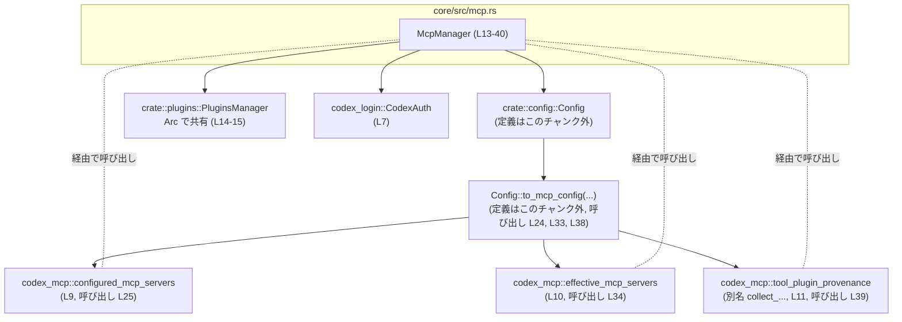
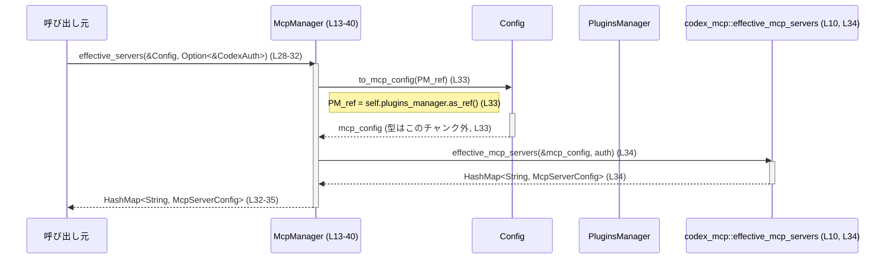

# core/src/mcp.rs コード解説

## 0. ざっくり一言

`McpManager` は、アプリケーション側の `Config` とプラグイン管理 (`PluginsManager`) から MCP 用の設定を組み立て、`codex_mcp` クレートのユーティリティ関数に橋渡しする薄いファサードです（`McpManager` 定義: `core/src/mcp.rs:L13-40`）。

---

## 1. このモジュールの役割

### 1.1 概要

- このモジュールは **MCP サーバー設定の取得とツールプラグイン由来情報の収集** を行うために存在し、`McpManager` 経由で高レベル API を提供します（`core/src/mcp.rs:L13-40`）。
- 呼び出し側は `Config` と `CodexAuth` を渡すだけで、`codex_mcp` クレートの `configured_mcp_servers` / `effective_mcp_servers` / `tool_plugin_provenance` を間接的に利用できます（`core/src/mcp.rs:L9-11, L23-40`）。

### 1.2 アーキテクチャ内での位置づけ

このモジュールがどのコンポーネントと連携しているかを簡略化した依存関係図です。



### 1.3 設計上のポイント

- **薄いラッパー / ファサード**  
  - すべてのメソッドは `Config::to_mcp_config` を呼び出して MCP 向け設定を生成し（`core/src/mcp.rs:L24, L33, L38`）、その結果を `codex_mcp` の関数に渡すだけです（`L25, L34, L39`）。
- **状態の最小化と共有**  
  - 内部状態は `Arc<PluginsManager>` のみで、MCP 設定生成時に `Config` へ渡すために保持しています（`core/src/mcp.rs:L14-15, L24, L33, L38`）。
  - `Arc` により `PluginsManager` の所有権を複数の `McpManager` やスレッド間で共有可能です（共有所有権の仕組み: `std::sync::Arc`, `L2`）。
- **エラーハンドリングの委譲**  
  - このモジュールの公開メソッドはすべて `HashMap` や `ToolPluginProvenance` を直接返し、`Result` や `Option` を返しません（`core/src/mcp.rs:L23-40`）。
  - したがって、エラー処理は `Config::to_mcp_config` や `codex_mcp` 側に隠蔽されており、このモジュール側で追加のエラー制御は行っていません。
- **並行性**  
  - メソッドはすべて `&self` を受け取り内部で可変状態に触れないため、`McpManager` 自体は複数スレッドから同時呼び出ししてもレースコンディションを生じにくい構造になっています（`core/src/mcp.rs:L18-40`）。
  - ただし `PluginsManager` のスレッド安全性はこのチャンクには現れず不明です。

---

## 2. 主要な機能一覧

このモジュール（`McpManager`）が提供する主な機能は次の通りです。

- MCP サーバーの構成一覧取得: `configured_servers` – 設定に基づく MCP サーバー定義を `HashMap` で取得します（`core/src/mcp.rs:L23-26`）。
- MCP サーバーの有効一覧取得（認証考慮）: `effective_servers` – `CodexAuth` を考慮した「有効な」 MCP サーバー設定一覧を取得します（`core/src/mcp.rs:L28-35`）。
- MCP ツールプラグインの出自情報取得: `tool_plugin_provenance` – MCP ツールプラグインの由来情報を取得します（`core/src/mcp.rs:L37-40`）。
- マネージャの生成: `McpManager::new` – 共有可能な `PluginsManager` を保持する `McpManager` を生成します（`core/src/mcp.rs:L19-21`）。

---

## 3. 公開 API と詳細解説

### 3.1 型一覧（構造体・列挙体など）

#### 構造体

| 名前         | 種別   | 役割 / 用途                                                                 | フィールド / 概要                                   | 定義位置 |
|--------------|--------|------------------------------------------------------------------------------|------------------------------------------------------|----------|
| `McpManager` | 構造体 | MCP サーバー設定およびツールプラグイン情報を取得するためのファサードです。 | `plugins_manager: Arc<PluginsManager>` – MCP 設定生成時に参照されるプラグイン管理（`L14-15`）。 | `core/src/mcp.rs:L13-16` |

#### 他モジュールから利用している型（定義はこのチャンク外）

| 名前                    | 種別   | 役割 / 用途                                               | 参照位置 |
|-------------------------|--------|------------------------------------------------------------|----------|
| `crate::config::Config` | 構造体 | アプリケーション全体の設定。MCP 向け設定生成に使用。       | `L4, L23, L28-31, L37` |
| `crate::plugins::PluginsManager` | 構造体 | プラグイン管理。`Config::to_mcp_config` に渡される。 | `L5, L14-15, L24, L33, L38` |
| `codex_config::McpServerConfig` | 構造体 | 個々の MCP サーバー設定。`HashMap<String, McpServerConfig>` として返却。 | `L6, L23, L32` |
| `codex_login::CodexAuth` | 構造体 | 認証情報。`effective_servers` でオプションとして渡される。 | `L7, L31` |
| `codex_mcp::ToolPluginProvenance` | 構造体 or 型エイリアス | MCP ツールプラグインの由来情報。 | `L8, L37` |

### 3.2 関数詳細

#### `McpManager::new(plugins_manager: Arc<PluginsManager>) -> McpManager`

**概要**

- 共有所有権を持つ `PluginsManager` を受け取り、それを内部に保持する `McpManager` インスタンスを生成します（`core/src/mcp.rs:L19-21`）。

**引数**

| 引数名           | 型                            | 説明 |
|------------------|-------------------------------|------|
| `plugins_manager` | `Arc<PluginsManager>`         | 共有可能なプラグイン管理インスタンス。所有権は `Arc` によって共有されます（`L19`）。 |

**戻り値**

- `McpManager` – 内部に `plugins_manager` を保持した新しいマネージャです（`Self { plugins_manager }`, `L20`）。

**内部処理の流れ**

1. フィールド `plugins_manager` に引数をそのまま格納して `McpManager` を構築します（`core/src/mcp.rs:L19-20`）。

**Errors / Panics**

- このコンストラクタ自体には明示的なエラー処理や panic はありません（単純な構造体初期化のみ: `L19-20`）。

**Edge cases（エッジケース）**

- `plugins_manager` が `Arc` のみであり、`None` を許容しないため、不正な状態で初期化される可能性は型レベルで抑制されています。

**使用上の注意点**

- `PluginsManager` を共有したい場合は、呼び出し側で `Arc::new` と `Arc::clone` を用いて `plugins_manager` を作成・複製する必要があります。  
  Rust の所有権システムの観点では、`McpManager` は `PluginsManager` の所有権を「共有」するだけで、単独の所有権を奪うことはありません。

---

#### `McpManager::configured_servers(&self, config: &Config) -> HashMap<String, McpServerConfig>`

**概要**

- アプリケーションの `Config` と `PluginsManager` から MCP 用設定を生成し、それに基づく「構成された」 MCP サーバー一覧を取得します（`core/src/mcp.rs:L23-26`）。

**引数**

| 引数名  | 型                | 説明 |
|---------|-------------------|------|
| `config` | `&Config`         | アプリケーション設定への参照。`to_mcp_config` 呼び出しに使用されます（`L23-24`）。 |

**戻り値**

- `HashMap<String, McpServerConfig>` – サーバー名（と推測される文字列キー）から `McpServerConfig` へのマップです。`configured_mcp_servers` の戻り値をそのまま返します（`core/src/mcp.rs:L23, L25`）。  
  ※ キーの意味は関数名から「サーバー識別子」と推測できますが、このチャンクだけでは断定できません。

**内部処理の流れ**

1. `Config::to_mcp_config` を呼び出し、`PluginsManager` の参照を引数として渡して MCP 用の設定を生成します（`mcp_config`, `core/src/mcp.rs:L24`）。  
   - `self.plugins_manager.as_ref()` により `Arc<PluginsManager>` から `&PluginsManager` を取得しています（`L24`）。
2. 生成された `mcp_config` を `codex_mcp::configured_mcp_servers` に渡し、その戻り値をそのまま返します（`core/src/mcp.rs:L25`）。

**Errors / Panics**

- この関数自身は `Result` を返さず、`?` 演算子や `unwrap` なども使っていないため、明示的なエラー伝播や panic は記述されていません（`L23-26`）。
- 実際にエラーや panic が起こりうるかどうかは、
  - `Config::to_mcp_config` の実装、
  - `codex_mcp::configured_mcp_servers` の実装  
  に依存しており、このチャンクには現れず不明です。

**Edge cases（エッジケース）**

- `config` がどのような内容であっても、この関数内で特定のパターンを判別して分岐するコードは存在しません（`core/src/mcp.rs:L23-26`）。
  - たとえば「MCP 関連の設定が空」の場合の扱いは、`configured_mcp_servers` の実装に依存し、このチャンクでは不明です。

**使用上の注意点**

- 毎回 `Config::to_mcp_config` を呼び出しているため（`L24`）、この処理が高コストな場合は、呼び出し頻度やキャッシュ戦略を上位レイヤーで検討する必要がある可能性があります。  
  ただし `to_mcp_config` のコスト自体はこのチャンクからは不明です。
- 並行性の観点では、`&self` と `&Config` しか取らないため、この関数は複数スレッドから安全に呼び出せる前提で設計されています。ただし `Config` と `PluginsManager` のスレッド安全性はこのチャンクには現れません。

---

#### `McpManager::effective_servers(&self, config: &Config, auth: Option<&CodexAuth>) -> HashMap<String, McpServerConfig>`

**概要**

- `Config` と `PluginsManager` から生成した MCP 用設定に対し、`CodexAuth`（認証情報）をオプションで渡して、「有効な」 MCP サーバー一覧を取得します（`core/src/mcp.rs:L28-35`）。

**引数**

| 引数名  | 型                    | 説明 |
|---------|-----------------------|------|
| `config` | `&Config`             | MCP 設定生成のベースとなるアプリケーション設定（`L29-31, L33`）。 |
| `auth`   | `Option<&CodexAuth>`  | 認証情報。`Some` の場合は `effective_mcp_servers` に渡され、`None` の場合は認証なしとして扱われます（`L31-32, L34`）。実際の扱いの詳細はこのチャンクには現れません。 |

**戻り値**

- `HashMap<String, McpServerConfig>` – 認証情報を考慮して「有効」と判断された MCP サーバー設定のマップを返します（`core/src/mcp.rs:L32-35`）。  
  ※ 「有効」の詳細な定義は `effective_mcp_servers` の実装に依存し、このチャンクには現れません。

**内部処理の流れ**

1. `Config::to_mcp_config` で MCP 用設定を生成します（`core/src/mcp.rs:L33`）。
2. 生成された `mcp_config` と `auth` を `codex_mcp::effective_mcp_servers` に渡し、その戻り値をそのまま返します（`core/src/mcp.rs:L34`）。

**Errors / Panics**

- この関数自身には `Result` や `panic!` 呼び出しはなく、エラー伝播も行っていません（`L28-35`）。
- 実際のエラーや panic の可能性は `Config::to_mcp_config` と `effective_mcp_servers` の実装に依存し、このチャンクからは分かりません。

**Edge cases（エッジケース）**

- `auth` が `None` の場合: そのまま `effective_mcp_servers(&mcp_config, None)` に渡されます（`L34`）。`None` をどう扱うかは `effective_mcp_servers` の実装次第であり、このチャンクには挙動が現れません。
- `auth` が `Some` の場合: `Some(&CodexAuth)` が渡されるだけで、この関数内では値の内容を参照・検証していません（`L31-34`）。

**使用上の注意点**

- セキュリティ／認可の観点では、この関数は認証情報 `CodexAuth` をただ渡すだけで、認可ロジックを実装していません。  
  認可の仕様は `codex_mcp::effective_mcp_servers` 側に集約されていると考えられますが、具体的な契約はこのチャンクには記述されていません。
- 認証が不要な場合は `auth` に `None` を渡すインターフェースになっていますが、それが「すべてのサーバーが有効になる」ことを意味するかどうかは、このチャンクからは判断できません。

---

#### `McpManager::tool_plugin_provenance(&self, config: &Config) -> ToolPluginProvenance`

**概要**

- `Config` と `PluginsManager` から生成した MCP 用設定を基に、MCP ツールプラグインの「由来情報（provenance）」を収集して返します（`core/src/mcp.rs:L37-40`）。

**引数**

| 引数名  | 型        | 説明 |
|---------|-----------|------|
| `config` | `&Config` | MCP プラグインに関する情報を含む設定（と推測される）。実際のフィールドはこのチャンクには現れません（`L37-38`）。 |

**戻り値**

- `ToolPluginProvenance` – `codex_mcp::tool_plugin_provenance` の戻り値をそのまま返します（`core/src/mcp.rs:L8, L11, L39`）。
  - 具体的な構造やフィールド内容は、このチャンクには定義がなく不明です。

**内部処理の流れ**

1. `Config::to_mcp_config` で MCP 用設定を生成します（`core/src/mcp.rs:L38`）。
2. それを `codex_mcp::tool_plugin_provenance`（`collect_tool_plugin_provenance` としてインポート）に渡し、その結果を返します（`core/src/mcp.rs:L11, L39`）。

**Errors / Panics**

- この関数自体にはエラー処理や panic は記述されていません（`L37-40`）。
- 実際のエラー発生可能性は `to_mcp_config` と `collect_tool_plugin_provenance` 依存であり、このチャンクからは不明です。

**Edge cases（エッジケース）**

- MCP 関連設定が空の場合やツールプラグインが 1 つも存在しない場合の扱いは、このチャンクでは分かりません。`collect_tool_plugin_provenance(&mcp_config)` の実装に委ねられています（`L39`）。

**使用上の注意点**

- ログや監査の目的で「どのプラグインがどこから来たか」を把握する用途に適していると考えられますが（名称「provenance」からの推測）、実際のフィールド内容や形式は、このチャンクには現れません。
- この関数も `Config::to_mcp_config` を毎回呼んでいるため、頻繁に呼び出す場合のコストには注意が必要になる可能性があります。

---

### 3.3 その他の関数

- このモジュール内には、上記以外の補助関数やラッパー関数は存在しません（`impl McpManager` ブロック内は 3 メソッド＋コンストラクタのみ: `core/src/mcp.rs:L18-40`）。

---

## 4. データフロー

ここでは、`effective_servers` を呼び出して「有効な」 MCP サーバー一覧を取得する典型的なデータフローを示します。

1. 呼び出し元が `McpManager::effective_servers` に `&Config` と `Option<&CodexAuth>` を渡します（`core/src/mcp.rs:L28-32`）。
2. `McpManager` は内部で `Config::to_mcp_config(self.plugins_manager.as_ref())` を呼び出し、MCP 向け設定 `mcp_config` を生成します（`L33`）。
3. 生成された `mcp_config` と `auth` が `codex_mcp::effective_mcp_servers` に渡され、`HashMap<String, McpServerConfig>` が返されます（`L34`）。



- `configured_servers` や `tool_plugin_provenance` も同様に、
  1. `Config::to_mcp_config` で `mcp_config` を生成し、
  2. 対応する `codex_mcp` 関数に渡して結果を返す  
  という 2 ステップのデータフローになっています（`core/src/mcp.rs:L23-26, L37-40`）。

---

## 5. 使い方（How to Use）

### 5.1 基本的な使用方法

`McpManager` を使って有効な MCP サーバー一覧を取得し、その中身を列挙する典型的な例です。`Config` や `PluginsManager`、`CodexAuth` の生成方法はこのチャンクには現れないため、コメントで省略します。

```rust
use std::sync::Arc;
use std::collections::HashMap;

use crate::config::Config;                 // L4
use crate::plugins::PluginsManager;        // L5
use crate::mcp::McpManager;                // 本モジュール
use codex_login::CodexAuth;                // L7
use codex_config::McpServerConfig;         // L6

fn example_usage() {
    // PluginsManager の具体的な作成方法はこのチャンクには現れません。
    let plugins_manager: Arc<PluginsManager> = /* Arc::new(PluginsManager::new(...)) など */ unimplemented!();

    // Config の具体的な作成方法もこのチャンクには現れません。
    let config: Config = /* Config::load(...)? など */ unimplemented!();

    // 認証情報（任意）。不要なら None を渡す。
    let auth: Option<CodexAuth> = None; // または Some(CodexAuth { ... })

    // McpManager を生成する（L19-21）。
    let mcp_manager = McpManager::new(Arc::clone(&plugins_manager));

    // 構成されている MCP サーバー一覧を取得（L23-26）。
    let configured: HashMap<String, McpServerConfig> =
        mcp_manager.configured_servers(&config);

    // 認証情報を考慮した「有効」な MCP サーバー一覧を取得（L28-35）。
    let effective: HashMap<String, McpServerConfig> =
        mcp_manager.effective_servers(&config, auth.as_ref());

    // ツールプラグインの由来情報を取得（L37-40）。
    let provenance = mcp_manager.tool_plugin_provenance(&config);

    // 結果の利用（例: サーバー名を列挙）。
    for (name, server_cfg) in effective {
        println!("MCP server: {name} -> {:?}", server_cfg);
    }

    println!("Provenance: {:?}", provenance);
}
```

### 5.2 よくある使用パターン

1. **設定のみを確認したい場合**  
   - 認証情報に関係なく、設定上「定義されている」 MCP サーバーを知りたい場合は `configured_servers` を使います（`core/src/mcp.rs:L23-26`）。
2. **現在のユーザーコンテキストで利用可能なサーバーを知りたい場合**  
   - `CodexAuth` を用意し、`effective_servers(&config, Some(&auth))` を呼び出すことで、認証情報に応じた有効サーバー一覧を取得します（`L28-35`）。
3. **プラグインの追跡・監査**  
   - `tool_plugin_provenance(&config)` で MCP ツールプラグインの由来情報を取得し、ログ出力や監査用データとして利用できます（`L37-40`）。

### 5.3 よくある間違い

```rust
// 間違い例: PluginsManager を Arc で包まずに渡そうとする
// let plugins_manager = PluginsManager::new(...);
// let mcp_manager = McpManager::new(plugins_manager); // コンパイルエラー: 型が一致しない

// 正しい例: Arc<PluginsManager> を渡す（L19）。
let plugins_manager = Arc::new(PluginsManager::new(/* ... */));
let mcp_manager = McpManager::new(Arc::clone(&plugins_manager));
```

```rust
// 間違い例: effective_servers に auth の所有権を渡してしまう
// let auth = CodexAuth::new(...);
// let effective = mcp_manager.effective_servers(&config, Some(auth));
//                          //           ^^^^^ 所有権が Move し、以降 auth が使えない

// 正しい例: &auth（参照）を Option に包んで渡す（L31-32）。
let auth = CodexAuth::new(/* ... */);
let effective = mcp_manager.effective_servers(&config, Some(&auth));
```

### 5.4 使用上の注意点（まとめ）

- **所有権と借用**  
  - `McpManager` は `Arc<PluginsManager>` を所有することで、複数箇所から安全に共有できるように設計されています（`core/src/mcp.rs:L14-15, L19-20`）。
  - `effective_servers` の `auth` は `Option<&CodexAuth>` であり、所有権を move する必要はありません（`L31-32`）。
- **スレッド安全性**  
  - メソッドはすべて `&self` を取り、内部に可変状態を持たないため、このモジュール内のコードはデータ競合を起こしにくい構造です（`L18-40`）。
  - ただし、`PluginsManager` と `Config` が `Send + Sync` であることは、このチャンクからは不明です。
- **セキュリティ**  
  - 認証情報 `CodexAuth` を考慮したロジックは `effective_mcp_servers` 内にあると考えられ、このモジュール自体には入力検証や認可判定は含まれていません（`core/src/mcp.rs:L28-35`）。
- **パフォーマンス**  
  - 各メソッドが都度 `Config::to_mcp_config` を呼び出す設計になっているため、`to_mcp_config` が重い場合は呼び出し頻度に注意が必要です（`L24, L33, L38`）。

---

## 6. 変更の仕方（How to Modify）

### 6.1 新しい機能を追加する場合

たとえば、`codex_mcp` に新たな関数 `list_mcp_tools` が追加された場合、それをラップするメソッドを `McpManager` に追加する流れは次のようになります。

1. **必要な関数のインポート**  
   - ファイル先頭の `use codex_mcp::...;` に対象関数を追加します（`core/src/mcp.rs:L8-11` と同様）。
2. **`impl McpManager` ブロックにメソッドを追加**  
   - 既存メソッドと同じパターンで、`Config::to_mcp_config(self.plugins_manager.as_ref())` を呼び、生成された `mcp_config` を新しい `codex_mcp` 関数に渡します（`L24, L33, L38` を参考）。
3. **戻り値・引数の契約確認**  
   - 新関数のシグネチャに応じて、`Result` を返す必要があるかどうかを検討します。  
     このモジュール内では現在すべてのメソッドが非 `Result` ですが、一貫性を保つかどうかは設計方針次第です。

### 6.2 既存の機能を変更する場合

- **影響範囲の確認**
  - `configured_servers` / `effective_servers` / `tool_plugin_provenance` はそれぞれ `codex_mcp` の関数を直接ラップしているだけなので、仕様変更時は:
    - それぞれの `codex_mcp` 関数の仕様、
    - `Config::to_mcp_config` の仕様  
    を合わせて確認する必要があります（`core/src/mcp.rs:L24-25, L33-34, L38-39`）。
- **契約（前提条件・戻り値）への注意**
  - このモジュールは現在、エラーを外に出さない設計のため、挙動を変更して `Result` を返すようにすると、呼び出し元のコードに影響が出ます。  
    互換性を保つ必要がある場合は、別メソッドとして追加するなどの対応が考えられます（ただし、このチャンクでは具体的な呼び出し元は不明です）。
- **テストと使用箇所**
  - このファイル内にはテストコードは含まれていないため（`core/src/mcp.rs` には `#[cfg(test)]` などが現れません）、プロジェクト全体で該当メソッドを使用している箇所を検索し、挙動変更の影響を確認する必要があります。

---

## 7. 関連ファイル・モジュール

このモジュールと密接に関係する外部モジュール・クレートをまとめます。ファイルパスそのものはこのチャンクには現れないため、モジュールパスで記載します。

| パス / モジュール                       | 役割 / 関係 |
|-----------------------------------------|-------------|
| `crate::config::Config`                 | アプリケーション設定を表す型です。`Config::to_mcp_config(self.plugins_manager.as_ref())` により MCP 用設定を生成するため、このモジュールのすべてのメソッドの入口になっています（`core/src/mcp.rs:L4, L23-24, L29-31, L33, L37-38`）。 |
| `crate::plugins::PluginsManager`        | プラグインの管理を行う型です。`Arc` で共有され、`Config::to_mcp_config` へ参照が渡されます（`core/src/mcp.rs:L5, L14-15, L24, L33, L38`）。 |
| `codex_config::McpServerConfig`         | MCP サーバー設定を表現する型です。`configured_servers` / `effective_servers` の戻り値の要素型です（`core/src/mcp.rs:L6, L23, L32`）。 |
| `codex_login::CodexAuth`                | 認証情報を表す型です。`effective_servers` の引数としてオプションで渡されます（`core/src/mcp.rs:L7, L31`）。 |
| `codex_mcp::configured_mcp_servers`     | MCP 用設定から「構成された」 MCP サーバー一覧を生成する関数です。`configured_servers` 内で呼び出されます（`core/src/mcp.rs:L9, L25`）。 |
| `codex_mcp::effective_mcp_servers`      | MCP 用設定と `CodexAuth` から「有効な」 MCP サーバー一覧を生成する関数です。`effective_servers` 内で呼び出されます（`core/src/mcp.rs:L10, L34`）。 |
| `codex_mcp::tool_plugin_provenance`（`collect_tool_plugin_provenance` としてインポート） | MCP ツールプラグインの由来情報を収集する関数です。`tool_plugin_provenance` 内で呼び出されます（`core/src/mcp.rs:L11, L39`）。 |

---

### Bugs / Security / Observability に関する補足

- **Bugs**  
  - このチャンクの範囲では、明白なロジックバグや所有権違反、未初期化使用などは確認できません（すべてコンパイル時に検出されるシンプルなコード: `core/src/mcp.rs:L13-40`）。
- **Security**  
  - ネットワークアクセスやファイルアクセスなどの I/O 処理はこのモジュールには現れず、セキュリティクリティカルな処理は主に `codex_mcp` や `Config` 側に存在すると考えられます。
- **Observability（可観測性）**  
  - ログ出力やメトリクス送信などのコードは含まれておらず（`println!` なども無し）、障害解析や計測は呼び出し側または下位レイヤーで行う前提の設計と見られます。
