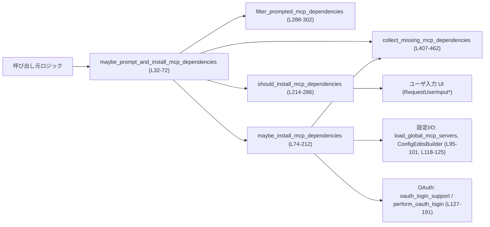
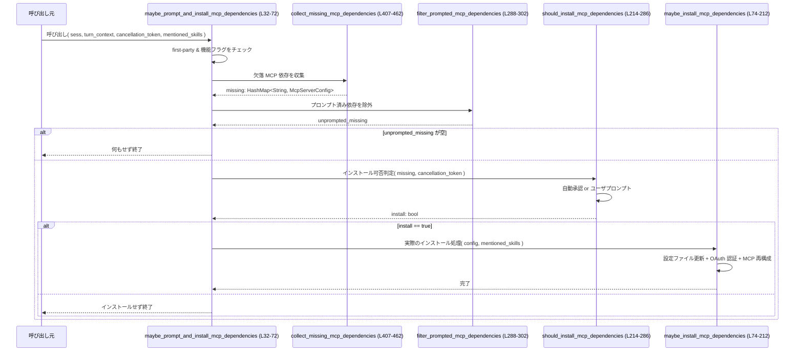

# core/src/mcp_skill_dependencies.rs コード解説

## 0. ざっくり一言

このモジュールは、**スキルが要求する MCP サーバ依存関係を検出し、必要に応じてユーザにインストール可否を確認し、グローバル MCP 設定への追加と OAuth 認証まで自動実行する処理**を提供します（`maybe_prompt_and_install_mcp_dependencies`・`maybe_install_mcp_dependencies`、core/src/mcp_skill_dependencies.rs:L32-72, L74-212）。

---

## 1. このモジュールの役割

### 1.1 概要

- 会話ターンで参照されたスキル (`SkillMetadata`) から MCP 依存関係を抽出し、既に構成済みの MCP サーバと突き合わせて「足りないサーバ」を特定します（`collect_missing_mcp_dependencies`、L407-462）。
- 未インストールの MCP サーバがあり、機能フラグが有効な場合にのみユーザへ確認プロンプトを出し（`should_install_mcp_dependencies`、L214-286）、ユーザが承諾すれば依存サーバをグローバル設定に追加して永続化します（L88-125）。
- OAuth が必要な MCP サーバに対しては、設定追加後に自動で OAuth フローを開始し、必要に応じてスコープ無しでの再試行も行います（L127-191）。
- セッション内で同じ MCP 依存関係について何度も確認プロンプトが出ないよう、**正規化キー（canonical key）に基づく記録**で再提示を抑止します（`canonical_mcp_*` 群と `filter_prompted_mcp_dependencies`、L288-302, L310-347, L319-327）。

### 1.2 アーキテクチャ内での位置づけ

このモジュールは、会話セッション (`Session`) とターンコンテキスト (`TurnContext`) の上で動作する「スキル依存 MCP サーバ管理」のユーティリティです。MCP マネージャ、設定ローダ、OAuth クライアント等に依存しています（L53-56, L88-90, L95-101, L145-161）。

主要な依存関係の関係図（このファイルだけを対象）を示します。



### 1.3 設計上のポイント

- **責務の分離**
  - 依存関係の検出・構成生成: `collect_missing_mcp_dependencies`, `canonical_mcp_dependency_key`, `mcp_dependency_to_server_config`（L407-462, L330-347, L349-405）。
  - プロンプト制御・ユーザ応答処理: `should_install_mcp_dependencies`, `filter_prompted_mcp_dependencies`（L214-286, L288-302）。
  - 実際のインストールと永続化・OAuth: `maybe_install_mcp_dependencies`（L74-212）。
  - 全体オーケストレーション: `maybe_prompt_and_install_mcp_dependencies`（L32-72）。
- **状態管理**
  - 永続状態は `load_global_mcp_servers` と `ConfigEditsBuilder::replace_mcp_servers().apply()` 経由でディスク上のグローバル設定に保持されます（L95-101, L118-125）。
  - セッションレベルの「既にプロンプトした依存関係」は `Session::record_mcp_dependency_prompted` / `mcp_dependency_prompted` で管理されます（L280-283, L292-295）。
- **エラーハンドリング**
  - 多くの I/O や変換エラーは `Result` を `match` して `warn!` ログを出しつつ「スキップ」で処理し、呼び出し側にはエラーを伝播しません（例: `load_global_mcp_servers`, `mcp_dependency_to_server_config` の利用箇所、L95-101, L118-125, L427-452）。
  - 依存情報が不正な場合もスキップし、サービス全体を停止させない方針です（L427-437, L444-453）。
- **並行性・キャンセル**
  - すべて `async fn` と `await` で非同期処理されます。
  - ユーザプロンプト待ちでは `tokio::select!` と `CancellationToken` を用い、キャンセル時には空回答を通知したうえで処理を打ち切ります（L214-219, L255-268）。
- **安全性（Rust 言語特性）**
  - このファイル内に `unsafe` ブロックは存在しません。
  - 外部との境界は `Result` とログを通じて扱われ、パニックを意図的に起こすコードはありません。
  - 所有権は `HashMap` 等の標準コレクションと文字列クローンによるシンプルな管理です（L105-112, L356-361, L384-391）。

---

## 2. 主要な機能一覧（＋コンポーネントインベントリー）

### 2.1 機能の概要一覧

- **MCP 依存関係の検出**: スキルの依存定義から MCP 型の依存だけを抽出し、既存 MCP サーバ設定と照合して未インストール分を求めます（`collect_missing_mcp_dependencies`, L407-462）。
- **依存インストール可否のプロンプト**: 初回のみユーザに「必要な MCP サーバをインストールするか」を問い合わせ、答えを基にインストールを行うかを決定します（`should_install_mcp_dependencies`, L214-286）。
- **セッション内の再プロンプト抑止**: 一度プロンプトした MCP 依存は、セッション中は再度尋ねないようにフィルタリングします（`filter_prompted_mcp_dependencies`, L288-302）。
- **MCP サーバ設定の自動生成と永続化**: スキル依存から `McpServerConfig` を構築し、グローバル MCP サーバ設定に追加して保存します（`mcp_dependency_to_server_config`, `maybe_install_mcp_dependencies`, L349-405, L88-125）。
- **OAuth 認証の自動実行**: OAuth が必要な MCP サーバについて自動的にログインを試行し、スコープの再試行ロジックも備えます（L127-191）。
- **依存関係キーの正規化**: 異なる表現の MCP 依存関係を一意に識別するため、transport + URL/コマンドから canonical key を生成し、インストール済み判定やプロンプト済み管理に用います（L310-327, L330-347, L412-417）。

### 2.2 コンポーネントインベントリー（関数・定数）

| 名前 | 種別 | 可視性 | 定義位置 | 役割 / 用途 |
|------|------|--------|----------|-------------|
| `SKILL_MCP_DEPENDENCY_PROMPT_ID` | 定数 `&'static str` | モジュール内 | core/src/mcp_skill_dependencies.rs:L28 | ユーザ入力回答マップ中で MCP 依存プロンプトの回答を特定するための ID。 |
| `MCP_DEPENDENCY_OPTION_INSTALL` | 定数 `&'static str` | モジュール内 | core/src/mcp_skill_dependencies.rs:L29 | プロンプトの選択肢ラベル「Install」。 |
| `MCP_DEPENDENCY_OPTION_SKIP` | 定数 `&'static str` | モジュール内 | core/src/mcp_skill_dependencies.rs:L30 | プロンプトの選択肢ラベル「Continue anyway」。 |
| `maybe_prompt_and_install_mcp_dependencies` | `async fn` | `pub(crate)` | core/src/mcp_skill_dependencies.rs:L32-72 | 起点となる関数。スキル群から欠落 MCP 依存を検出し、必要ならプロンプト＋インストールまで行う。 |
| `maybe_install_mcp_dependencies` | `async fn` | `pub(crate)` | core/src/mcp_skill_dependencies.rs:L74-212 | ユーザ承諾済み前提で MCP 依存サーバをグローバル設定に追加し、OAuth 認証とリフレッシュを行う。 |
| `should_install_mcp_dependencies` | `async fn` | モジュール内 | core/src/mcp_skill_dependencies.rs:L214-286 | 自動承認ポリシーまたはユーザプロンプトの結果に基づき、インストールを行うべきか `bool` を返す。 |
| `filter_prompted_mcp_dependencies` | `async fn` | モジュール内 | core/src/mcp_skill_dependencies.rs:L288-302 | セッションで既にプロンプトした MCP 依存を除外したマップを返す。 |
| `format_missing_mcp_dependencies` | `fn` | モジュール内 | core/src/mcp_skill_dependencies.rs:L304-308 | 欠落 MCP サーバ名をソートして表示用文字列に整形する。 |
| `canonical_mcp_key` | `fn` | モジュール内 | core/src/mcp_skill_dependencies.rs:L310-317 | transport + URL/コマンドから、共通形式の canonical key を生成する。 |
| `canonical_mcp_server_key` | `fn` | モジュール内 | core/src/mcp_skill_dependencies.rs:L319-327 | 既存 `McpServerConfig` から canonical key を生成する。 |
| `canonical_mcp_dependency_key` | `fn` | モジュール内 | core/src/mcp_skill_dependencies.rs:L330-347 | `SkillToolDependency` から canonical key を生成する（検証付き）。 |
| `mcp_dependency_to_server_config` | `fn` | モジュール内 | core/src/mcp_skill_dependencies.rs:L349-405 | `SkillToolDependency` を最小限の `McpServerConfig` に変換する。 |
| `collect_missing_mcp_dependencies` | `fn` | モジュール内 | core/src/mcp_skill_dependencies.rs:L407-462 | スキル群とインストール済み MCP サーバの差分から、未構成の MCP 依存サーバ設定マップを構築する。 |

---

## 3. 公開 API と詳細解説

### 3.1 型一覧（このモジュールで主に利用する外部型）

このモジュールは新しい構造体・列挙体を定義していませんが、重要な外部型をまとめます。

| 名前 | 種別 | 出典 / 用途 |
|------|------|------------|
| `Session` | 構造体 | `crate::codex::Session`。MCP マネージャ、認証マネージャ、ユーザ入力 API などへの入口として使用（例: L53-56, L196-201, L255-267）。 |
| `TurnContext` | 構造体 | `crate::codex::TurnContext`。機能フラグ付き設定、承認ポリシー、サブ ID、sandbox ポリシーなどを提供（例: L44-48, L220-223, L253-255）。 |
| `SkillMetadata` | 構造体 | `crate::SkillMetadata`。スキル名と依存情報 (`dependencies`) を持ち、MCP 依存抽出の入力となる（L36, L418-424）。 |
| `SkillToolDependency` | 構造体 | `crate::skills::model::SkillToolDependency`。依存するツールの `type`, `value`, `transport`, `url`, `command` などを保持（L421-427, L330-347, L349-405）。 |
| `McpServerConfig` | 構造体 | `codex_config::McpServerConfig`。MCP サーバ 1 件の設定型。既存サーバ一覧・新規作成時に使用（L5, L89-90, L350-375, L383-401）。 |
| `McpServerTransportConfig` | enum | `codex_config::McpServerTransportConfig`。`Stdio` / `StreamableHttp` など transport 単位の設定。canonical key 生成や config 生成に使用（L6, L320-326, L359-364, L384-390）。 |
| `CancellationToken` | 構造体 | `tokio_util::sync::CancellationToken`。ユーザプロンプト待ちのキャンセル制御に使用（L15, L214-219, L255-268）。 |
| `RequestUserInput*` | 構造体群 | `codex_protocol::request_user_input`。ユーザへの質問・選択肢・回答を表現（L10-13, L227-267）。 |

> これらの型のフィールド詳細や実装は、このチャンクからは分かりません。

---

### 3.2 関数詳細（主要 7 件）

#### `maybe_prompt_and_install_mcp_dependencies(sess: &Session, turn_context: &TurnContext, cancellation_token: &CancellationToken, mentioned_skills: &[SkillMetadata]) -> ()`

**概要**

- 会話ターンで参照されたスキル群から MCP 依存関係を検出し、必要であればユーザにインストール可否を尋ね、承諾されれば実際のインストール処理を呼び出します（L32-72）。
- **first-party クライアント**であり、かつ機能フラグ `SkillMcpDependencyInstall` が有効な場合にのみ動作します（L38-42, L44-51）。

**引数**

| 引数名 | 型 | 説明 |
|--------|----|------|
| `sess` | `&Session` | MCP マネージャやユーザ入力 API 等を提供するセッションオブジェクト（L53-56, L62-62）。 |
| `turn_context` | `&TurnContext` | 設定と承認ポリシー、サブ ID などが入ったターンコンテキスト（L44-48）。 |
| `cancellation_token` | `&CancellationToken` | ユーザプロンプトを待っている間のキャンセル検知に使われます（`should_install_mcp_dependencies` に渡される、L67-68, L214-219）。 |
| `mentioned_skills` | `&[SkillMetadata]` | このターンで参照されたスキル一覧。MCP 依存抽出の対象となります（L36, L45-46）。 |

**戻り値**

- 戻り値は `()` で、直接返される値はありません。
- MCP 依存サーバのインストールや OAuth 認証などは副作用として行われます（L70-71, L74-212）。

**内部処理の流れ**

1. `originator().value` を取得し、`is_first_party_originator` で first-party か確認。そうでなければ即リターンします（L38-42）。  
2. `turn_context.config` をクローンし、`mentioned_skills` が空か、機能フラグ `Feature::SkillMcpDependencyInstall` が無効ならリターンします（L44-51）。
3. MCP マネージャから現在構成済みの MCP サーバ一覧を取得します（`sess.services.mcp_manager.configured_servers`、L53-56）。
4. `collect_missing_mcp_dependencies` で、スキルが要求する MCP 依存のうち未構成のものを収集します（L57-60）。
5. `filter_prompted_mcp_dependencies` を通じて、セッション内で既にプロンプト済みの依存を除外します（L62-65）。
6. `should_install_mcp_dependencies` で自動承認ポリシーまたはユーザ入力に基づき、インストールすべきか判定します（L67-69）。
7. 判定結果が `true` の場合、`maybe_install_mcp_dependencies` を呼び出し、実際のインストールと認証・リフレッシュを行います（L70-71）。

**Examples（使用例）**

この関数は、スキルを選択した後の会話ターン処理の一部として呼び出されることが想定されます。

```rust
use tokio_util::sync::CancellationToken;
// Session, TurnContext, SkillMetadata は他モジュールで定義されていると仮定

async fn handle_turn(
    sess: &Session,                 // 現在のセッション
    ctx: &TurnContext,              // ターンコンテキスト（設定や承認ポリシーを含む）
    skills: Vec<SkillMetadata>,     // このターンで参照されたスキル一覧
) {
    let cancel = CancellationToken::new(); // キャンセル用トークンを生成

    // スキルの MCP 依存が足りていない場合に、必要ならユーザに確認してインストールする
    maybe_prompt_and_install_mcp_dependencies(
        sess,
        ctx,
        &cancel,
        &skills,
    ).await;
}
```

**Errors / Panics**

- この関数自体は `Result` を返さず、パニックを起こす処理も含まれていません。
- 内部で呼ぶ `collect_missing_mcp_dependencies` などが警告ログを出して依存をスキップするケースはありますが（L427-437, L444-453）、呼び出し元には伝播しません。
- `should_install_mcp_dependencies` 内のユーザ入力取得が失敗した場合、空回答として扱われ、インストールされないだけです（L255-267, L270-278）。

**Edge cases（エッジケース）**

- `mentioned_skills` が空の場合: 機能フラグに関係なく即リターンし、何も行いません（L45-46, L80-86）。
- 機能フラグ `SkillMcpDependencyInstall` が無効な場合: 依存検出も行わずにリターンします（L46-51）。
- インストールすべき依存が存在しない場合: `missing.is_empty()` の時点でリターンします（L57-60）。
- 全ての欠落依存が既にプロンプト済みでユーザがスキップを選んでいる場合: `unprompted_missing.is_empty()` でリターンします（L62-65）。
- 非 first-party originator の場合: 冒頭のチェックで常に何もしません（L38-42）。

**使用上の注意点**

- この関数は **first-party originator** に限定されています。別の originator で同等の処理を行いたい場合は、この条件（L38-42）を考慮する必要があります。
- 重い処理（ファイル I/O・ネットワーク通信）が潜在的に走るため、**ターンごとに無条件で繰り返し呼ぶ**場合はインストール済み判定により早期リターンされるとはいえ、全体の遅延に注意が必要です（L95-101, L150-161, L196-211）。
- `maybe_install_mcp_dependencies` を別の箇所から直接呼び出す場合、この関数が行っている originator チェックやプロンプト表示は実行されない点に注意します（L74-86 vs L38-42）。

---

#### `maybe_install_mcp_dependencies(sess: &Session, turn_context: &TurnContext, config: &crate::config::Config, mentioned_skills: &[SkillMetadata]) -> ()`

**概要**

- ユーザから MCP 依存インストールの承諾が得られている前提で、**欠落している MCP サーバをグローバル設定に追加し、必要な OAuth 認証と MCP サーバ一覧のリフレッシュを行う**関数です（L74-212）。

**引数**

| 引数名 | 型 | 説明 |
|--------|----|------|
| `sess` | `&Session` | MCP マネージャ、認証マネージャ、バックグラウンド通知などにアクセスするためのセッション（L88-90, L196-211）。 |
| `turn_context` | `&TurnContext` | バックグラウンド通知やサブ ID などに利用されます（L137-143, L206-211）。 |
| `config` | `&crate::config::Config` | 現在の設定。`codex_home` や OAuth 設定、MCP 関連の設定を含みます（L77-83, L88, L150-160, L173-183, L199-210）。 |
| `mentioned_skills` | `&[SkillMetadata]` | 依存解析の対象スキル一覧（L78-80, L90-92）。 |

**戻り値**

- 戻り値は `()` です。
- 成功・失敗はログや MCP マネージャの状態を通じて観測されます。

**内部処理の流れ**

1. `mentioned_skills` が空か、機能フラグ `SkillMcpDependencyInstall` が無効な場合は即リターンします（L80-86）。
2. `codex_home` と既存 MCP サーバ設定 (`configured_servers`) を取得し、`collect_missing_mcp_dependencies` で未構成 MCP サーバを求めます（L88-92）。
3. 未構成サーバがなければリターンします（L90-93）。
4. `load_global_mcp_servers` でグローバル MCP サーバ設定を読み込みます。失敗したら警告を出して終了します（L95-101）。
5. 既存のグローバル設定に対して、`missing` から **名前がまだ存在しないものだけ**を追加し、そのリストを `added` にも保持します（L103-112）。
6. 新たに追加されたものがなければ何もせず終了します（L114-116）。
7. `ConfigEditsBuilder::new(&codex_home).replace_mcp_servers(&servers).apply().await` で更新済みの MCP 設定を永続化します。失敗したら警告を出して終了します（L118-125）。
8. `added` に含まれる各サーバについて、`oauth_login_support` で OAuth ログインが必要か確認し、必要なら `perform_oauth_login` を使って OAuth 認証を行います。スコープエラー時にはスコープ無しで再試行します（L127-191）。
9. 最後に、`effective_servers` で有効な MCP サーバ一覧を取得し、更新したグローバルサーバをオーバーレイしたうえで `sess.refresh_mcp_servers_now` を呼び、ランタイムの MCP サーバ一覧を更新します（L194-211）。

**Examples（使用例）**

ユーザプロンプトを別の場所で処理済みで、「インストールすべき」と判定済みの場合に直接利用するイメージです。

```rust
async fn install_deps_without_prompt(
    sess: &Session,                   // セッション
    ctx: &TurnContext,                // ターンコンテキスト
    cfg: &crate::config::Config,      // 設定
    skills: &[SkillMetadata],         // 参照スキル
) {
    // この関数はプロンプトを出さずにインストールのみ行う
    maybe_install_mcp_dependencies(sess, ctx, cfg, skills).await;
}
```

**Errors / Panics**

- グローバル MCP 設定の読み込み・保存に失敗した場合、それぞれ `warn!` にログを出して静かに終了します（L95-101, L118-125）。
- OAuth ログインに失敗した場合も `warn!` でエラーを出すのみで、関数自体はパニックもエラー返却もしません（L163-191）。
- サーバの追加処理や OAuth 設定生成において `unwrap` などは使用されていません。

**Edge cases（エッジケース）**

- `missing` が空: 既に全ての MCP 依存が構成済みのため、何も変更されません（L90-93）。
- グローバル MCP 設定に同名サーバが既に存在: `servers.contains_key(&name)` でスキップされ、それ以上の上書きや再認証は行われません（L105-107）。
- OAuth サポートが `Unsupported` もしくは `Unknown` な場合: 対象サーバについては OAuth ログインは行われません（L128-135）。
- OAuth ログインの 1 回目でスコープエラーが発生し、`should_retry_without_scopes` が `true` の場合のみスコープ無し再試行が行われます（L163-171, L173-187）。

**使用上の注意点**

- **first-party originator チェックはここでは行われません**。必要であれば呼び出し側で `maybe_prompt_and_install_mcp_dependencies` と同様のチェックを行うべきです（L38-42 と比較）。
- この関数はディスク I/O（設定ファイル読み書き）とネットワーク通信（OAuth ログイン）を含むため、頻繁な呼び出しはパフォーマンスに影響します（L95-101, L118-125, L150-161, L173-183）。
- 複数の MCP サーバが `added` にある場合、OAuth ログインは **直列に**行われるため、一度に多数のサーバを追加すると時間がかかる可能性があります（L127-191）。
- エラーが呼び出し元に伝播しない設計なので、インストール成否をプログラム的に扱いたい場合は、ログの解析や MCP マネージャ側での状態確認が必要です。

---

#### `should_install_mcp_dependencies(sess: &Session, turn_context: &TurnContext, missing: &HashMap<String, McpServerConfig>, cancellation_token: &CancellationToken) -> bool`

**概要**

- **自動承認ポリシー**と**ユーザ入力**に基づき、欠落 MCP 依存をインストールするべきかどうかを決定し、`bool` で返します（L214-286）。
- 質問 ID `SKILL_MCP_DEPENDENCY_PROMPT_ID` でユーザ入力を問い合わせ、ユーザが「Install」を選択した場合のみ `true` になります（L227-249, L270-278）。

**引数**

| 引数名 | 型 | 説明 |
|--------|----|------|
| `sess` | `&Session` | ユーザ入力要求・応答記録のために使用されます（L255-267, L280-283）。 |
| `turn_context` | `&TurnContext` | 承認ポリシーと sandbox ポリシー、サブ ID を取得し、プロンプトメタデータに使用します（L220-223, L253-255）。 |
| `missing` | `&HashMap<String, McpServerConfig>` | まだ構成されていない MCP サーバのマップ。質問本文の生成とプロンプト済み記録に利用されます（L217-218, L227-233, L280-283）。 |
| `cancellation_token` | `&CancellationToken` | ユーザ入力待ちをキャンセルするために使用されます（L218-219, L255-268）。 |

**戻り値**

- `bool`:
  - `true`: MCP 依存をインストールすべき。
  - `false`: インストールしない（ユーザがスキップ、キャンセル、または回答なしの場合）。

**内部処理の流れ**

1. `mcp_permission_prompt_is_auto_approved` を用いて、承認ポリシーと sandbox ポリシーから自動承認可否を判定し、許可されていれば即 `true` を返します（L220-225）。
2. インストールが自動承認されない場合、`missing` から欠落サーバ名リストを作り、質問テキストを組み立てます（`format_missing_mcp_dependencies` 使用、L227-233）。
3. `RequestUserInputQuestion` を生成し、2 つの選択肢（Install / Continue anyway）を設定します（L227-249）。
4. `RequestUserInputArgs` と `call_id` を構成し、`sess.request_user_input` でユーザ入力を要求する `Future` を作ります（L250-255）。
5. `tokio::select!` で、キャンセルとユーザ応答のどちらかを待ちます。キャンセルが先の場合は空回答を生成し、`notify_user_input_response` で通知します（L255-264）。
6. ユーザ応答 `Option<RequestUserInputResponse>` が得られれば、それを `unwrap_or_else` で空回答にフォールバックしつつ取り出します（L265-267）。
7. 回答マップから `SKILL_MCP_DEPENDENCY_PROMPT_ID` のエントリを取得し、その中に `MCP_DEPENDENCY_OPTION_INSTALL` が含まれるかをチェックして `install` を決定します（L270-278）。
8. `missing` に含まれる全ての MCP 依存について canonical key を生成し、`sess.record_mcp_dependency_prompted` で「このセッションでプロンプト済み」と記録します（L280-283）。
9. `install` を返します（L285）。

**Examples（使用例）**

`maybe_prompt_and_install_mcp_dependencies` 内で実際に使われている形です（L67-69）。

```rust
async fn decide_install(
    sess: &Session,
    ctx: &TurnContext,
    missing: &HashMap<String, McpServerConfig>,
    cancel: &CancellationToken,
) -> bool {
    // ユーザポリシーと対話に基づいてインストール可否を決定する
    let install = should_install_mcp_dependencies(sess, ctx, missing, cancel).await;
    install
}
```

**Errors / Panics**

- `sess.request_user_input` の戻り値が `None` の場合、空回答として扱われます（L265-267）。
- キャンセル発生時には、空回答を `notify_user_input_response` で伝えた後、その空回答を使用します（L258-264）。
- いずれの場合もパニックを起こす処理は含まれていません。

**Edge cases（エッジケース）**

- **自動承認ポリシー**: `mcp_permission_prompt_is_auto_approved` が `true` を返した場合、質問 UI は一切表示されず常に `true` を返します（L220-225）。
- **キャンセル**: `cancellation_token.cancelled()` が先に完了した場合、ユーザに実際の UI が表示されたかどうかに関わらず空回答扱いとなり、`install` は `false` になります（L255-264, L270-278）。
  - それでも `missing` の全ては「プロンプト済み」として記録されるため、同じ依存に対して再度プロンプトは行われません（L280-283）。
- **回答なし / 未知の回答**: 通信エラーなどで `response_fut` が `None` を返した場合も空回答となり、インストールは行われません（L265-267, L270-278）。

**使用上の注意点**

- キャンセル時に依存が「プロンプト済み」と記録される挙動（L258-264, L280-283）が仕様上の意図かどうかは、このチャンクだけからは分かりません。**同じセッション中に再度ユーザへ問い合わせたい場合**には、この振る舞いを考慮する必要があります。
- `tokio::select!` に `biased;` が指定されているため、キャンセルとレスポンスが同時に完了した場合には、左側（キャンセル）ブランチが優先されます（L257-258）。
- インストール可否判定の結果はログ等に直接出力されないため、挙動確認には上位の制御フローとの組み合わせで観察する必要があります。

---

#### `filter_prompted_mcp_dependencies(sess: &Session, missing: &HashMap<String, McpServerConfig>) -> HashMap<String, McpServerConfig>`

**概要**

- セッション中に既にプロンプトした MCP 依存を除外し、まだユーザに尋ねていない依存だけを含むマップを返します（L288-302）。

**引数**

| 引数名 | 型 | 説明 |
|--------|----|------|
| `sess` | `&Session` | 既にプロンプトした canonical key の集合を取得するために使用します（L292-295）。 |
| `missing` | `&HashMap<String, McpServerConfig>` | `collect_missing_mcp_dependencies` が返した「欠落 MCP 依存」のマップ（L289-291）。 |

**戻り値**

- `HashMap<String, McpServerConfig>`:
  - `missing` から、`sess.mcp_dependency_prompted()` に含まれないものだけが残ったマップです（L297-301）。

**内部処理の流れ**

1. `sess.mcp_dependency_prompted().await` で、これまでにプロンプトした canonical key の集合を取得します（L292-293）。
2. もしこの集合が空であれば、`missing.clone()` をそのまま返します（L293-295）。
3. そうでなければ、`missing.iter()` を走査し、`canonical_mcp_server_key` で生成した canonical key が「プロンプト済み集合」に含まれないものだけをフィルタリングします（L297-300）。
4. フィルタ済み要素を `(name.clone(), config.clone())` のペアとして新しい `HashMap` に収集し、それを返します（L297-301）。

**Examples（使用例）**

```rust
async fn get_unprompted_missing(
    sess: &Session,
    missing: &HashMap<String, McpServerConfig>,
) -> HashMap<String, McpServerConfig> {
    // まだユーザにインストール確認を行っていない MCP 依存だけを抽出する
    filter_prompted_mcp_dependencies(sess, missing).await
}
```

**Errors / Panics**

- この関数自体は `Result` を返さず、パニックになるような処理を含んでいません。
- `missing.clone()` など通常の `HashMap` 操作のみです。

**Edge cases（エッジケース）**

- プロンプト済みセットが空の場合: `missing` がそのまま返され、全てがプロンプト対象になります（L292-295）。
- `missing` が空の場合: そのまま空の `HashMap` が返されます。
- canonical key の生成に使う `canonical_mcp_server_key` のロジック上、同じ URL/コマンドを持ちながら名前の異なるサーバは同じ canonical key として扱われるため、一方をプロンプト済みにすると他方もまとめて除外されます（L319-326, L297-300）。

**使用上の注意点**

- `missing` のキー（サーバ名）はそのまま保持されますが、プロンプト済み判定は canonical key で行うため、**名前変更や URL/コマンド変更の影響**を考慮する必要があります。
- セッション管理の詳細（どこで `record_mcp_dependency_prompted` が呼ばれるか）は `should_install_mcp_dependencies` 側の実装に依存します（L280-283）。

---

#### `canonical_mcp_dependency_key(dependency: &SkillToolDependency) -> Result<String, String>`

**概要**

- スキルの MCP 依存定義（`SkillToolDependency`）から、インストール済み判定やプロンプト済み管理に使用する **canonical key** を生成します（L330-347）。
- サポートされない transport や必要フィールド欠如の場合はエラー文字列を返します。

**引数**

| 引数名 | 型 | 説明 |
|--------|----|------|
| `dependency` | `&SkillToolDependency` | `transport`, `url`, `command`, `value` 等を含む MCP 依存定義（L330-331, L333-345）。 |

**戻り値**

- `Result<String, String>`:
  - `Ok(canonical_key)`: `"mcp__{transport}__{identifier}"` 形式のキー（`canonical_mcp_key` を利用、L333-338, L340-345）。
  - `Err(msg)`: URL/コマンド欠如や未サポート transport の場合のエラーメッセージ（L336-337, L343-347）。

**内部処理の流れ**

1. `dependency.transport.as_deref().unwrap_or("streamable_http")` により、transport のデフォルトを `"streamable_http"` として取得します（L331-332）。
2. transport が `"streamable_http"`（大文字小文字無視）なら、`dependency.url` を要求し、存在しなければ `"missing url for streamable_http dependency"` でエラーにします（L332-337）。
3. URL がある場合、`canonical_mcp_key("streamable_http", url, &dependency.value)` で canonical key を生成して `Ok` を返します（L333-338）。
4. transport が `"stdio"` の場合は `dependency.command` を要求し、同様に存在しなければ `"missing command for stdio dependency"` エラーとします（L339-343）。
5. コマンドがある場合、`canonical_mcp_key("stdio", command, &dependency.value)` でキーを生成します（L339-345）。
6. それ以外の transport の場合、`"unsupported transport {transport}"` というメッセージで `Err` を返します（L346-347）。

**Examples（使用例）**

```rust
fn example_key(dep: &SkillToolDependency) -> Result<String, String> {
    // SkillToolDependency から canonical key を生成する
    canonical_mcp_dependency_key(dep)
}
```

**Errors / Panics**

- URL 未指定（`transport = streamable_http`）: `"missing url for streamable_http dependency"`（L333-337）。
- コマンド未指定（`transport = stdio`）: `"missing command for stdio dependency"`（L339-343）。
- 未サポート transport: `"unsupported transport {transport}"`（L346-347）。
- パニックは発生しません（`unwrap` 不使用）。

**Edge cases（エッジケース）**

- `transport` が `None`: デフォルト `"streamable_http"` が選択されるため、URL が必須になります（L331-333）。
- `value` が空文字でも、fallback 引数として `canonical_mcp_key` に渡されます。identifier が空の場合は fallback（= value）がそのままキーになります（L310-315, L333-338, L340-345）。
- URL やコマンドに余分な空白が含まれる場合、`canonical_mcp_key` 内で `trim()` されるため、前後空白は無視されます（L310-313）。

**使用上の注意点**

- スキル定義側で transport と URL/コマンドを正しく指定しないと、この関数は `Err` を返し、上位の `collect_missing_mcp_dependencies` で警告ログを出してスキップされます（L427-437）。
- transport を追加したい場合（例: `"websocket"` など）は、この関数と `mcp_dependency_to_server_config`, `canonical_mcp_server_key` に対応を追加する必要があります（L346-347）。

---

#### `mcp_dependency_to_server_config(dependency: &SkillToolDependency) -> Result<McpServerConfig, String>`

**概要**

- MCP 依存定義（`SkillToolDependency`）から、最小限の `McpServerConfig` を生成する関数です（L349-405）。
- transport ごとに異なる `McpServerTransportConfig` を設定し、それ以外のフィールドはデフォルト値を埋めます。

**引数**

| 引数名 | 型 | 説明 |
|--------|----|------|
| `dependency` | `&SkillToolDependency` | MCP 依存定義。`transport`, `url`, `command`, `value` などを使用します（L349-353, L354-357, L378-383）。 |

**戻り値**

- `Result<McpServerConfig, String>`:
  - `Ok(config)`: 生成された MCP サーバ設定。
  - `Err(msg)`: 必須フィールド欠如や未サポート transport のエラーメッセージ。

**内部処理の流れ**

1. `dependency.transport.as_deref().unwrap_or("streamable_http")` で transport を決定し、デフォルト `"streamable_http"` を使用します（L352-353）。
2. transport が `"streamable_http"` の場合:
   - `dependency.url` が `Some` でない場合、`"missing url for streamable_http dependency"` エラーを返します（L354-357）。
   - URL がある場合、`McpServerConfig` を構築し、`McpServerTransportConfig::StreamableHttp` に URL を設定します。それ以外のフィールドは `enabled: true`, `required: false`, 各種 timeout や tools, scopes は `None`/空に設定します（L359-375）。
3. transport が `"stdio"` の場合:
   - `dependency.command` が `Some` でない場合、`"missing command for stdio dependency"` エラーを返します（L379-383）。
   - コマンドがある場合、`McpServerTransportConfig::Stdio` にコマンド・args・env などを設定し、他のフィールドは同様にデフォルト値を設定します（L383-401）。
4. 上記以外の transport は `"unsupported transport {transport}"` エラーとなります（L404-405）。

**Examples（使用例）**

```rust
fn build_config(dep: &SkillToolDependency) -> Result<McpServerConfig, String> {
    // スキルの MCP 依存定義から MCP サーバの設定を構築する
    mcp_dependency_to_server_config(dep)
}
```

**Errors / Panics**

- URL 未指定（`streamable_http`）: `"missing url for streamable_http dependency"`（L354-357）。
- コマンド未指定（`stdio`）: `"missing command for stdio dependency"`（L379-383）。
- 未サポート transport: `"unsupported transport {transport}"`（L404-405）。
- パニックするコードはありません。

**Edge cases（エッジケース）**

- `transport` が `None` の場合も `"streamable_http"` として扱われるため、URL を必須とする挙動になります（L352-354）。
- OAuth 関連フィールド (`scopes`, `oauth_resource`) は `None` のまま生成されるため、**OAuth が必要なサーバであってもここではスコープ等は設定されません**（L371-373, L397-399）。実際には `oauth_login_support` の結果と `resolve_oauth_scopes` により別途扱われます（L127-149）。
- tools マップは空で生成されるため、ツール単位の細かい制御は別途必要です（L374-375, L400-401）。

**使用上の注意点**

- スキル依存定義から生成される設定は、非常に**ミニマル**な構成です。追加のタイムアウトやツール制限などが必要な場合は、別の手段で設定を補う必要があります。
- 新しい transport をサポートするには、この関数に分岐を追加し、対応する `McpServerTransportConfig` を構築する必要があります（L404-405）。

---

#### `collect_missing_mcp_dependencies(mentioned_skills: &[SkillMetadata], installed: &HashMap<String, McpServerConfig>) -> HashMap<String, McpServerConfig>`

**概要**

- スキル群に定義された MCP 依存と、既存の MCP サーバ設定 (`installed`) を比較し、「まだ構成されていない MCP サーバ」の設定候補を集めて返します（L407-462）。

**引数**

| 引数名 | 型 | 説明 |
|--------|----|------|
| `mentioned_skills` | `&[SkillMetadata]` | 依存情報を持つ可能性のあるスキルの一覧（L408-409, L418-424）。 |
| `installed` | `&HashMap<String, McpServerConfig>` | 既に構成済みの MCP サーバ設定。名前をキーとしたマップ（L409-415）。 |

**戻り値**

- `HashMap<String, McpServerConfig>`:
  - キー: MCP サーバ名（`SkillToolDependency.value` が使われます、L456-457）。
  - 値: 生成された MCP サーバ設定（`mcp_dependency_to_server_config` の結果、L444-453）。

**内部処理の流れ**

1. `installed` に対して canonical key (`canonical_mcp_server_key`) を計算し、その集合を `installed_keys` として保持します（L412-415）。
2. 空の `missing` マップと `seen_canonical_keys` セットを用意します（L411-417）。
3. `mentioned_skills` を順に走査し、`skill.dependencies` が存在しないものはスキップします（`let Some(dependencies) = ... else { continue; }`、L418-421）。
4. 各 `dependencies.tools` の要素について、`tool.r#type` が `"mcp"` でないものはスキップします（L423-425）。
5. `canonical_mcp_dependency_key(tool)` で canonical key を生成し、エラーなら警告ログを出してスキップします（L427-437）。
6. canonical key が既に `installed_keys` または `seen_canonical_keys` に含まれていればスキップします（L438-441）。
7. `mcp_dependency_to_server_config(tool)` で設定を生成し、失敗すれば警告ログを出してスキップします（L444-453）。
8. 成功した場合は `missing.insert(tool.value.clone(), config)` でマップに追加し、canonical key を `seen_canonical_keys` に追加します（L456-457）。

**Examples（使用例）**

```rust
fn find_missing(
    skills: &[SkillMetadata],
    installed: &HashMap<String, McpServerConfig>,
) -> HashMap<String, McpServerConfig> {
    // 参照されたスキルから、まだ構成されていない MCP サーバを抽出する
    collect_missing_mcp_dependencies(skills, installed)
}
```

**Errors / Panics**

- `canonical_mcp_dependency_key` や `mcp_dependency_to_server_config` からのエラーはすべて `warn!` ログとして記録され、該当依存はスキップされます（L427-437, L444-453）。
- パニックを引き起こす処理はありません。

**Edge cases（エッジケース）**

- 複数のスキルが同じ canonical key を持つ MCP 依存を要求する場合:
  - 一つのサーバ設定としてのみ `missing` に登録されます（`seen_canonical_keys` により重複排除、L416-417, L438-441）。
- 既に構成済みの MCP サーバと canonical key が一致する場合:
  - その依存は `missing` に含まれません（L412-415, L438-441）。
- `dependencies` が存在しない、もしくは `tools` が空、あるいは MCP 以外の type しかないスキルは無視されます（L418-425）。
- 依存定義が不完全（URL や command 欠如）または未サポート transport の場合:
  - その依存はスキップされ、警告ログが出ます（L427-437, L444-453）。

**使用上の注意点**

- `missing` のキーとして `tool.value` が使用されているため、**スキル定義側での名称重複**に注意が必要です。canonical key は URL/コマンドで重複排除されていますが、名前の重複は別の問題として残ります（L456-457）。
- canonical key の定義を変更する場合（例: ポート番号やクエリを無視したいなど）は、`canonical_mcp_server_key` と `canonical_mcp_dependency_key` の両方を一貫して更新する必要があります（L412-415, L430-437）。

---

### 3.3 その他の関数

| 関数名 | 定義位置 | 役割（1 行） |
|--------|----------|--------------|
| `format_missing_mcp_dependencies` | core/src/mcp_skill_dependencies.rs:L304-308 | 欠落 MCP サーバ名をソートしてカンマ区切り文字列として整形し、質問文に埋め込むために使用します。 |
| `canonical_mcp_key` | core/src/mcp_skill_dependencies.rs:L310-317 | transport と識別子（URL/コマンド）から `"mcp__{transport}__{identifier}"` または fallback を生成する共通ルーチンです。 |
| `canonical_mcp_server_key` | core/src/mcp_skill_dependencies.rs:L319-327 | 既存の `McpServerConfig` から canonical key を生成し、インストール済み判定やプロンプト済み判定に利用されます。 |

---

## 4. データフロー

### 4.1 代表的なシナリオ概要

「ユーザがある会話ターンで複数のスキルを指定したとき、欠落している MCP 依存サーバを自動的に検出し、ユーザにインストール可否を尋ねてから設定を更新・認証する」シナリオを考えます。

処理の流れは概ね以下のようになります。

1. 呼び出し元が `maybe_prompt_and_install_mcp_dependencies` を呼ぶ（L32-72）。
2. 欠落依存を `collect_missing_mcp_dependencies` で検出し、既にプロンプト済みのものを `filter_prompted_mcp_dependencies` で除外（L57-60, L62-65, L288-302）。
3. `should_install_mcp_dependencies` で自動承認またはユーザプロンプトによりインストール可否を決定（L67-69, L214-286）。
4. `true` の場合、`maybe_install_mcp_dependencies` により設定ファイルの更新と OAuth 認証、MCP マネージャの再構成を行う（L70-71, L74-212）。

### 4.2 シーケンス図



---

## 5. 使い方（How to Use）

### 5.1 基本的な使用方法

典型的には、**会話ターンの処理フローの中で一度だけ**呼び出され、参照スキルの MCP 依存を自動処理します。

```rust
async fn handle_turn(
    sess: &Session,                      // セッション（MCP マネージャ等にアクセス）
    ctx: &TurnContext,                  // ターンコンテキスト（設定・承認ポリシー）
    skills: Vec<SkillMetadata>,         // このターンで利用するスキル一覧
) {
    use tokio_util::sync::CancellationToken;

    let cancel = CancellationToken::new(); // 必要なら外部からキャンセルを伝える

    // first-party クライアントかつ機能フラグが有効なら、
    // 欠落 MCP 依存を検出し、必要に応じてプロンプト＋インストールを行う
    maybe_prompt_and_install_mcp_dependencies(
        sess,
        ctx,
        &cancel,
        &skills,
    ).await;

    // 以降、スキルが MCP サーバに依存していても、
    // 可能な限り自動的に準備された状態で実行できる
}
```

### 5.2 よくある使用パターン

1. **一般的な自動処理パターン（推奨）**

   - `maybe_prompt_and_install_mcp_dependencies` を直接呼び、内部でプロンプトとインストールまで完結させるパターンです（L32-72）。
   - first-party originator チェックと機能フラグチェックが含まれており、安全なデフォルトになります（L38-42, L44-51）。

2. **事前にポリシーで承認された環境での直接インストール**

   - 承認ポリシーにより常に自動承認される環境では、ユーザプロンプトを出さずに `maybe_install_mcp_dependencies` のみを利用することも考えられます（L214-225, L74-212）。
   - その場合、first-party チェックやセッション内再プロンプト抑止といったロジックは呼び出し側が担う必要があります。

### 5.3 よくある間違い

```rust
// 間違い例: second-party クライアントで自動インストールを期待する
async fn bad_example(sess: &Session, ctx: &TurnContext, skills: &[SkillMetadata]) {
    let cancel = CancellationToken::new();
    // originator が first-party でない場合、何も起こらない（L38-42）
    maybe_prompt_and_install_mcp_dependencies(sess, ctx, &cancel, skills).await;
}

// 正しい例: first-party originator かどうかを前提にするか、
// 別経路でインストールを行う（ここでは仮に first-party 前提とする）
async fn good_example(sess: &Session, ctx: &TurnContext, cfg: &crate::config::Config, skills: &[SkillMetadata]) {
    let cancel = CancellationToken::new();
    maybe_prompt_and_install_mcp_dependencies(sess, ctx, &cancel, skills).await;

    // または、ポリシー上常にインストール許可されている環境なら
    // maybe_install_mcp_dependencies を直接呼ぶこともできる（L74-212）
    // maybe_install_mcp_dependencies(sess, ctx, cfg, skills).await;
}
```

他に起こりやすい誤用として:

- **機能フラグ無効時にインストールを期待する**: `SkillMcpDependencyInstall` が有効でないと一切動作しません（L45-51, L80-86）。
- **空の `mentioned_skills` を渡しても何も起きないことを見落とす**（L45-46, L80-86）。

### 5.4 使用上の注意点（まとめ）

- **前提条件**
  - first-party originator であることが `maybe_prompt_and_install_mcp_dependencies` では必須です（L38-42）。
  - 機能フラグ `Feature::SkillMcpDependencyInstall` が有効でないと、欠落検出もインストールも行われません（L45-51, L80-86）。
- **セッション内の挙動**
  - 一度プロンプトした canonical key はセッション中「プロンプト済み」として扱われ、`filter_prompted_mcp_dependencies` によって再度プロンプトされません（L288-302, L280-283）。
  - キャンセル時でも「プロンプト済み」として記録されるため、ユーザがプロンプトを実際に見ていなくても再提示されない可能性があります（L258-264, L280-283）。
- **エラーとログ**
  - 不正な依存定義や設定 I/O エラーはすべて `warn!` ログに記録されるのみで、呼び出し元の挙動は変わらない設計です（L95-101, L118-125, L427-437, L444-453, L186-190）。
  - インストール失敗や OAuth 失敗を厳密に扱いたい場合は、ログ収集・監視が重要です。
- **性能・スケーラビリティ**
  - 各呼び出しで `load_global_mcp_servers` や `ConfigEditsBuilder::apply` を用いたファイル I/O が発生する可能性があります（L95-101, L118-125）。
  - OAuth ログインは外部プロバイダへのネットワーク呼び出しを伴い、サーバ数に比例して時間がかかります（L127-191）。
  - ただし `collect_missing_mcp_dependencies` は単純な `HashMap` と `HashSet` 走査であり、スキル数と依存数に線形なコストです（L412-417, L418-458）。
- **セキュリティ上の観点**
  - first-party originator のチェックにより、自動インストール機能は first-party クライアントに限定されています（L38-42）。
  - OAuth ログインのエラー内容を `warn!` でログ出力するため、ログに機密情報が含まれないことが前提です（L150-161, L163-190）。このチャンクからはヘッダ内容やトークンがログに出ているかどうかは分かりません。

---

## 6. 変更の仕方（How to Modify）

### 6.1 新しい機能を追加する場合

1. **新しい MCP transport をサポートしたい場合**
   - canonical key 生成と config 生成の両方に transport の分岐を追加する必要があります。
     - `canonical_mcp_dependency_key` に `transport.eq_ignore_ascii_case("新transport")` 分岐を追加し、identifier（URL やコマンドに相当するもの）を canonical key に組み込みます（L330-347）。
     - `mcp_dependency_to_server_config` に同じ transport 用の `McpServerTransportConfig` 構築ロジックを追加します（L349-405）。
     - 既存サーバからの canonical key 生成のため `canonical_mcp_server_key` も更新します（L319-327）。
2. **プロンプト内容や選択肢を拡張したい場合**
   - `RequestUserInputQuestion` 構築部分（L227-249）で、`options` に新しい選択肢を追加し、それに対応する解釈ロジックを `should_install_mcp_dependencies` の `install` 判定に追加します（L270-278）。
3. **依存インストールのポリシーを細かく制御したい場合**
   - 自動承認ロジックは `mcp_permission_prompt_is_auto_approved` に委譲されています（L220-223）。ポリシー拡張はこの関数側（別モジュール）で行う必要があります（このチャンクには実装がありません）。
   - セッション内のプロンプト抑止ポリシーは `record_mcp_dependency_prompted` と `mcp_dependency_prompted` に依存します（L280-283, L292-295）。より細かい単位（スキル単位など）で抑止したい場合は、これらの API と canonical key の設計を見直す必要があります。

### 6.2 既存の機能を変更する場合

- **依存検出の条件を変更したい場合**
  - MCP 以外の依存タイプも対象としたい場合は、`collect_missing_mcp_dependencies` の `if !tool.r#type.eq_ignore_ascii_case("mcp") { continue; }` を変更します（L423-425）。
  - ただし、その場合 `canonical_mcp_*` 群は MCP 前提の命名であるため、新種別を扱う別関数に切り出す検討が必要になります。
- **プロンプトの再提示ポリシーを変更したい場合**
  - 現在はインストールの可否に関わらず「プロンプト済み」と記録しています（L280-283）。インストールが行われなかった場合のみ再プロンプトしたいなら、`install` の値に応じた条件付きで `record_mcp_dependency_prompted` を呼ぶよう変更する必要があります。
- **エラーハンドリングを変更したい場合**
  - 現状、多くのエラーは `warn!` ログのみでスキップしています（L95-101, L118-125, L427-437, L444-453）。失敗時に上位へ `Result` として伝播させたい場合は、関数シグネチャを `Result<(), Error>` 等に変更し、各 `Err` 分岐で `return Err(...)` を行う必要があります。
- **設定のマージ戦略を変更したい場合**
  - 現在は `refresh_servers` 生成時に `effective_servers` に `servers`（グローバル設定）を `or_insert_with` でオーバーレイしています（L196-205）。この戦略を変更するには、マージ部分のロジックを調整します。

> 変更時には、canonical key の定義（L310-317, L319-327, L330-347）と、依存検出・プロンプト抑止・インストールの全フローとの整合性を意識する必要があります。

---

## 7. 関連ファイル・モジュール

このモジュールは複数の外部モジュール・型に依存しています。ファイルパスはこのチャンクからは分かりませんが、モジュールパスと役割を整理します。

| パス / モジュール | 役割 / 関係 |
|-------------------|------------|
| `crate::codex::Session` | MCP マネージャ (`mcp_manager`)、認証マネージャ (`auth_manager`)、ユーザ入力 API (`request_user_input`)、バックグラウンド通知などを提供します（L53-56, L196-201, L255-267, L280-283, L292-295）。 |
| `crate::codex::TurnContext` | 現在の設定（`config`）、承認ポリシー（`approval_policy`）、sandbox ポリシー（`sandbox_policy`）、サブ ID (`sub_id`) を保持し、本モジュールの判断材料・メタデータとして使われます（L44-48, L220-223, L253-255）。 |
| `crate::SkillMetadata` | スキル名と依存情報 (`dependencies`) を持ち、MCP 依存抽出の起点になります（L36, L418-424）。 |
| `crate::skills::model::SkillToolDependency` | 個々のツール依存を表現し、本モジュールで canonical key 生成や MCP サーバ設定生成に使用されます（L21, L423-427, L330-347, L349-405）。 |
| `codex_config::{McpServerConfig, McpServerTransportConfig, ConfigEditsBuilder, load_global_mcp_servers}` | MCP サーバ設定の構造と、グローバル設定の読み書き API を提供します（L4-7, L88-90, L95-101, L118-125, L350-375, L383-401）。 |
| `codex_login::default_client::{originator, is_first_party_originator}` | クライアント種別の判定に用いられ、自動インストール機能を first-party クライアントに限定するために使用されます（L8-9, L38-42）。 |
| `codex_mcp::{oauth_login_support, resolve_oauth_scopes, should_retry_without_scopes, McpOAuthLoginSupport, mcp_permission_prompt_is_auto_approved}` | MCP サーバに対する OAuth ログインサポート検出、スコープ解決、再試行ポリシー、自動承認ポリシー判定などを提供します（L22-26, L127-149, L163-165, L220-223）。 |
| `codex_rmcp_client::perform_oauth_login` | MCP サーバ向け OAuth ログインを実行するクライアントです（L14, L150-161, L173-187）。 |
| `codex_protocol::request_user_input::*` | MCP 依存インストールの確認プロンプトを表現し、ユーザからの回答を受け取るためのプロトコル定義です（L10-13, L227-249, L255-267）。 |

### テストについて

- このチャンクにはテストコードは含まれておらず、`#[cfg(test)]` やテストモジュールも存在しません。
- canonical key 生成ロジック（L310-347）や依存収集ロジック（L407-462）は、振る舞いが仕様に近いため、**ユニットテストが存在すると安全に変更しやすい領域**ですが、このリポジトリ内の別ファイルにテストがあるかどうかは、このチャンクからは分かりません。

以上が、このモジュールの構造・データフロー・エッジケース・Rust 言語特有の安全性/並行性観点も含めた解説となります。
