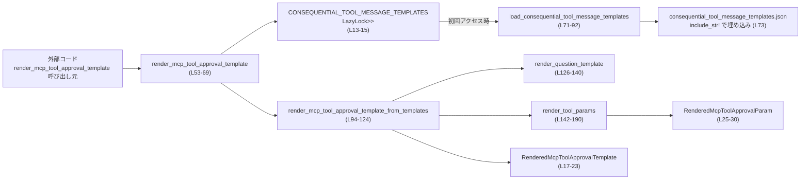
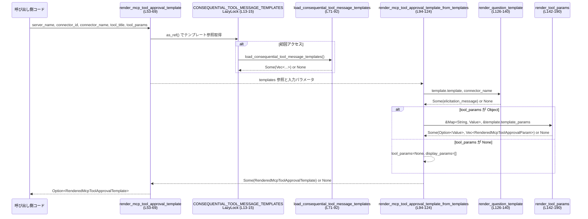

# core/src/mcp_tool_approval_templates.rs コード解説

## 0. ざっくり一言

このモジュールは、バンドルされた JSON テンプレート定義に基づいて、**「MCP ツールの承認用メッセージ」と表示用パラメータ一覧をレンダリングする処理**を提供します（`render_mcp_tool_approval_template` など）（core/src/mcp_tool_approval_templates.rs:L10-15,L53-59,L71-92）。

---

## 1. このモジュールの役割

### 1.1 概要

- コンパイル時に組み込まれた JSON ファイルから **ツール承認メッセージのテンプレート群**を読み込みます（core/src/mcp_tool_approval_templates.rs:L71-75）。
- 呼び出し側から渡された `server_name`・`connector_id`・`tool_title` に一致するテンプレートを探索し、**質問文（question / elicitation_message）とパラメータ表示情報**を生成します（L94-124,L17-23）。
- テンプレート定義やパラメータに不整合がある場合は、**`Option::None` で安全に失敗**し、警告ログのみ出力して処理を中断します（L76-80,L82-89,L94-116,L142-190）。

### 1.2 アーキテクチャ内での位置づけ

主なコンポーネント間の依存関係は以下のようになっています。



- グローバルな `LazyLock` により、テンプレート JSON は最初の呼び出し時に一度だけパースされ、以降は読み取り専用で共有されます（L13-15,L71-92）。
- 公開 API は `render_mcp_tool_approval_template` および結果を表す 2 つの構造体だけで、その他は内部実装です（L17-30,L53-69,L94-190）。

### 1.3 設計上のポイント

- **遅延初期化 + スレッド安全**  
  - `LazyLock<Option<Vec<ConsequentialToolMessageTemplate>>>` を使い、テンプレートファイルの読み込み・パースは最初のアクセス時のみ行われます（L13-15,L71-75）。  
  - `LazyLock` は標準ライブラリの同期プリミティブであり、複数スレッドからの同時アクセスでも一度だけ安全に初期化されます（L13-15）。
- **データ駆動なテンプレート管理**  
  - テンプレート内容は `include_str!("consequential_tool_message_templates.json")` により外部 JSON から読み込まれ、Rust コード側は構造体によるスキーマ定義のみを持ちます（L32-36,L38-45,L47-51,L73）。
- **保守的なエラーハンドリング**  
  - JSON パースエラーまたはスキーマバージョンの不一致時は `warn!` ログを出しつつ `None` を返し、以降のレンダリング処理は呼び出し元に `None` を返すだけで終了します（L76-80,L82-89,L53-61）。
  - パラメータラベルの衝突や不正なラベル（空文字）があっても panic せず `None` で失敗します（L150-154,L158-160,L179-181）。
- **表示用パラメータの一意性保証**  
  - `display_name`（表示名）が重複しないように `HashSet` でチェックし、重複した場合は `None` を返すことで UI 側の混乱を防ぐ設計です（L146-148,L158-160,L179-181）。
- **Rust 言語特有の安全性**  
  - `unsafe` ブロックは存在せず、すべて安全な Rust で記述されています（ファイル全体の定義に `unsafe` 不在）。
  - 可能性のある失敗はすべて `Option` または `Result`（`serde_json::from_str`）で表現され、明示的にハンドリングされています（L71-80,L82-89,L94-116,L142-190）。

---

## 2. コンポーネント一覧と主要な機能

### 2.1 コンポーネントインベントリー

| 名前 | 種別 | 公開範囲 | 役割 / 概要 | 行 |
|------|------|----------|-------------|----|
| `CONSEQUENTIAL_TOOL_MESSAGE_TEMPLATES_SCHEMA_VERSION` | `const u8` | モジュール内 | JSON スキーマバージョンの期待値 | L10 |
| `CONNECTOR_NAME_TEMPLATE_VAR` | `const &str` | モジュール内 | テンプレート内の `{connector_name}` プレースホルダ文字列 | L11 |
| `CONSEQUENTIAL_TOOL_MESSAGE_TEMPLATES` | `static LazyLock<Option<Vec<ConsequentialToolMessageTemplate>>>` | モジュール内 | テンプレート群を遅延初期化で保持 | L13-15 |
| `RenderedMcpToolApprovalTemplate` | 構造体 | `pub(crate)` | レンダリング済みの質問文とパラメータ情報を保持 | L17-23 |
| `RenderedMcpToolApprovalParam` | 構造体 | `pub(crate)` | 個々のツールパラメータの表示用情報 | L25-30 |
| `ConsequentialToolMessageTemplatesFile` | 構造体 | 内部 | JSON ファイルのルート（`schema_version` と `templates`） | L32-36 |
| `ConsequentialToolMessageTemplate` | 構造体 | 内部 | サーバー・コネクタ・ツールごとのテンプレート定義 | L38-45 |
| `ConsequentialToolTemplateParam` | 構造体 | 内部 | 個々のパラメータとそのラベル定義 | L47-51 |
| `render_mcp_tool_approval_template` | 関数 | `pub(crate)` | グローバルにロード済みテンプレートからレンダリングを行うメイン API | L53-69 |
| `load_consequential_tool_message_templates` | 関数 | 内部 | JSON ファイルからテンプレート群を読み込み・検証 | L71-92 |
| `render_mcp_tool_approval_template_from_templates` | 関数 | 内部 | 与えられたテンプレート配列から 1 件を選びレンダリング | L94-124 |
| `render_question_template` | 関数 | 内部 | `{connector_name}` を含む質問テンプレート文字列を実際の文に変換 | L126-140 |
| `render_tool_params` | 関数 | 内部 | JSON パラメータとテンプレート定義から表示用パラメータ一覧を生成 | L142-190 |
| 各種 `#[test]` 関数 | 関数 | テストのみ | 上記ロジックの正常系・異常系を検証 | L199-370 |

### 2.2 主要な機能一覧

- テンプレートファイルの読み込みとスキーマバージョン検証（L71-92）。
- グローバルなテンプレート群の遅延初期化・共有（L13-15,L53-61）。
- サーバー名・コネクタ ID・ツール名に基づくテンプレート選択（L94-108）。
- `{connector_name}` プレースホルダを用いた質問文の生成（L126-137）。
- ツール実行パラメータからの表示用パラメータ一覧の生成とラベル重複検知（L142-190）。
- 異常系（テンプレート不一致、入力不正、ラベル衝突など）の検出と `None` による安全な失敗（L102-116,L150-160,L179-181,L200-260,L262-283,L285-312,L349-369）。

---

## 3. 公開 API と詳細解説

### 3.1 型一覧（構造体・列挙体など）

| 名前 | 種別 | 公開範囲 | フィールド / 概要 | 行 |
|------|------|----------|-------------------|----|
| `RenderedMcpToolApprovalTemplate` | 構造体 | `pub(crate)` | `question: String` – UI 向けの質問文（L19）; `elicitation_message: String` – 質問文と同一値が設定されているテストから推測される（L20,L231-236）; `tool_params: Option<Value>` – 元のツールパラメータ JSON 全体（L21,L236-240）; `tool_params_display: Vec<RenderedMcpToolApprovalParam>` – 表示用に整形されたパラメータ一覧（L22,L241-257）。 | L17-23 |
| `RenderedMcpToolApprovalParam` | 構造体 | `pub(crate)` | `name: String` – 元 JSON のキー名（L27,L242-244）; `value: Value` – 該当パラメータの値（L28,L244-245）; `display_name: String` – UI で表示するラベル名（L29,L245-246）。 | L25-30 |

※ その他の構造体（`ConsequentialToolMessageTemplate` など）は内部用であり、テンプレートファイルのスキーマに対応しています（L32-36,L38-45,L47-51）。

### 3.2 関数詳細（コア 5 件）

#### `render_mcp_tool_approval_template(server_name: &str, connector_id: Option<&str>, connector_name: Option<&str>, tool_title: Option<&str>, tool_params: Option<&Value>) -> Option<RenderedMcpToolApprovalTemplate>`

**概要**

- グローバルにロード済みのテンプレート群から、指定されたサーバー・コネクタ・ツールに一致するテンプレートを探し、**承認メッセージと表示用パラメータ情報を生成**します（L53-69）。
- テンプレートが読み込めなかった場合や一致する定義がない場合は `None` を返します（L60-61,L94-108）。

**引数**

| 引数名 | 型 | 説明 | 行 |
|--------|----|------|----|
| `server_name` | `&str` | テンプレート定義中の `server_name` と一致させるサーバー識別子（L54,L104-106）。 |
| `connector_id` | `Option<&str>` | コネクタ ID。`Some` の場合のみテンプレート検索に使用され、`None` の場合は即座に `None` を返します（L55,L102）。 |
| `connector_name` | `Option<&str>` | 質問文テンプレートの `{connector_name}` プレースホルダを置換するための人間可読名（L56,L126-137）。 |
| `tool_title` | `Option<&str>` | テンプレート定義中の `tool_title`。前後の空白をトリムしたうえで空文字の場合は `None` とみなされます（L57,L103）。 |
| `tool_params` | `Option<&Value>` | 実行しようとしているツールの JSON パラメータ。オブジェクト型のみが受け付けられます（L58,L110-116）。 |

**戻り値**

- `Some(RenderedMcpToolApprovalTemplate)` : テンプレート選択とレンダリングが成功した場合（L118-123）。
- `None` : テンプレート読み込み失敗、マッチするテンプレート不在、入力不正、パラメータラベル衝突など、いずれかの条件に該当する場合（L60-61,L94-116,L142-190）。

**内部処理の流れ**

1. グローバル `CONSEQUENTIAL_TOOL_MESSAGE_TEMPLATES` からテンプレート配列への参照を取得。まだロードされていない場合は `LazyLock` により初期化される（L13-15,L60）。  
   - `as_ref()?` により、テンプレート読み込み自体が `None` の場合は即座に `None` を返し、後続処理は行われません（L60）。
2. `render_mcp_tool_approval_template_from_templates` にテンプレート配列とすべての入力パラメータを渡してレンダリングを行う（L61-68）。

**Examples（使用例）**

基本的な使用例（正常系）です。テスト `renders_exact_match_with_readable_param_labels` を簡略化しています（L199-260）。

```rust
use serde_json::json;
use core::mcp_tool_approval_templates::render_mcp_tool_approval_template;

let server_name = "codex_apps";                         // サーバー識別子
let connector_id = Some("calendar");                    // コネクタID
let connector_name = Some("Calendar");                  // 表示用コネクタ名
let tool_title = Some("create_event");                  // ツールタイトル
let tool_params = json!({
    "title": "Roadmap review",
    "calendar_id": "primary",
    "timezone": "UTC",
});                                                     // ツールに渡すパラメータ

if let Some(rendered) = render_mcp_tool_approval_template(
    server_name,
    connector_id,
    connector_name,
    tool_title,
    Some(&tool_params),
) {
    println!("{}", rendered.question);                  // "Allow Calendar to create an event?" など
    for p in &rendered.tool_params_display {
        println!("{}: {}", p.display_name, p.value);    // "Calendar: "primary"" など
    }
} else {
    // テンプレート不一致や設定不整合などでレンダリングできなかった場合
}
```

**Errors / Panics**

- `Result` ではなく `Option` を返すため、「失敗の理由」は呼び出し側からは直接はわかりません。
- 内部で panic を起こしうるコード（`unwrap` など）は使用されていません。`serde_json` のパースエラーもすべて `Result` として処理され、`None` に変換されます（L71-80）。
- ログは `tracing::warn!` で出力されますが、これは副作用であり戻り値の型には現れません（L76-80,L82-87）。

**Edge cases（エッジケース）**

- `connector_id` が `None` の場合: 冒頭で `let connector_id = connector_id?;` によって `None` が返ります（L102）。  
  → テンプレート探索が行われません。
- `tool_title` が `None` または空文字/空白のみの場合: `map(str::trim).filter(|name| !name.is_empty())?` により `None` が返ります（L103）。
- テンプレート JSON のロードに失敗した場合: グローバル `CONSEQUENTIAL_TOOL_MESSAGE_TEMPLATES` が `None` となり、`as_ref()?` で `None` が返ります（L60,L71-80,L82-89）。
- `tool_params` がオブジェクトでない場合（配列やスカラーなど）: `render_mcp_tool_approval_template_from_templates` 内の `Some(_) => return None` により `None` が返ります（L110-115）。

**使用上の注意点**

- 戻り値が `Option` であるため、呼び出し側で `None` のケースを必ずハンドリングする必要があります（L59,L60）。
- テンプレートは JSON ファイルに依存するため、このファイルが存在しない・不正な形式・想定と異なる `schema_version` の場合、この API は常に `None` を返します（L71-80,L82-89）。
- 複数スレッドから同時に呼び出しても、`LazyLock` によってテンプレートの初期化は一度のみ行われ、以降は読み取り専用のためスレッド安全です（L13-15）。

---

#### `load_consequential_tool_message_templates() -> Option<Vec<ConsequentialToolMessageTemplate>>`

**概要**

- コンパイル時に埋め込まれた JSON 文字列を `serde_json` でパースし、テンプレート配列を返します（L71-75,L91）。
- スキーマバージョンが期待値と異なる場合やパースエラーの場合は警告ログを出し、`None` を返します（L76-80,L82-89）。

**引数**

- 引数なし。

**戻り値**

- `Some(Vec<ConsequentialToolMessageTemplate>)` : パースとスキーマ検証に成功した場合（L91）。
- `None` : パースエラーまたは `schema_version` 不一致時（L76-80,L82-89）。

**内部処理の流れ**

1. `include_str!("consequential_tool_message_templates.json")` により埋め込み済みの JSON 文字列を読み込む（L73）。
2. `serde_json::from_str::<ConsequentialToolMessageTemplatesFile>(...)` でパースし、`schema_version` と `templates` を含む構造体を得る（L71-75,L32-36）。
3. パースに失敗した場合:
   - `Err(err)` ブランチで `warn!(error = %err, ...)` を出力し、`None` を返す（L76-80）。
4. パースに成功した場合:
   - `templates.schema_version` が `CONSEQUENTIAL_TOOL_MESSAGE_TEMPLATES_SCHEMA_VERSION` と一致するか確認（L82-86）。
   - 不一致なら警告を出し、`None` を返す（L82-89）。
   - 一致なら `Some(templates.templates)` を返す（L91）。

**Examples（使用例）**

通常は `LazyLock` 経由で呼ばれ、直接呼び出すことはありません（L13-15）。テストでは `CONSEQUENTIAL_TOOL_MESSAGE_TEMPLATES.is_some()` が真であることのみ確認しています（L314-317）。

**Errors / Panics**

- パースエラーおよびスキーマ不一致は `tracing::warn!` でログされ、`None` が返るだけで panic は発生しません（L76-80,L82-89）。
- `include_str!` はコンパイル時マクロであり、ファイルが存在しない場合はコンパイルエラーになるため、ランタイムパニックにはなりません（L73）。

**Edge cases**

- JSON 中の `schema_version` が `4` 以外の場合（定数 `CONSEQUENTIAL_TOOL_MESSAGE_TEMPLATES_SCHEMA_VERSION` は `4`）には、常に `None` になります（L10,L82-89）。
- JSON の構造が `ConsequentialToolMessageTemplatesFile` に合わない場合も `serde_json::from_str` がエラーを返し、`None` となります（L71-80）。

**使用上の注意点**

- この関数は `LazyLock::new` にのみ渡されており、その他の場所から直接呼ぶ設計にはなっていません（L13-15）。
- 返り値が `Option` であるため、直接使う場合は必ず `None` を考慮する必要があります。

---

#### `render_mcp_tool_approval_template_from_templates(templates: &[ConsequentialToolMessageTemplate], server_name: &str, connector_id: Option<&str>, connector_name: Option<&str>, tool_title: Option<&str>, tool_params: Option<&Value>) -> Option<RenderedMcpToolApprovalTemplate>`

**概要**

- 既にメモリ上にあるテンプレート配列から 1 件を選択し、質問文とパラメータ表示情報を構築します（L94-124）。
- 入力の妥当性チェックと詳細なテンプレート照合ロジックの中心となる関数です（L102-116）。

**引数**

| 引数名 | 型 | 説明 | 行 |
|--------|----|------|----|
| `templates` | `&[ConsequentialToolMessageTemplate]` | 探索対象のテンプレート配列（L95,L104-108）。 |
| `server_name` | `&str` | テンプレートの `server_name` に一致させる値（L96,L104-106）。 |
| `connector_id` | `Option<&str>` | テンプレートの `connector_id` に一致させる値。`None` の場合は即 `None`（L97,L102）。 |
| `connector_name` | `Option<&str>` | `{connector_name}` 置換用。`render_question_template` に渡されます（L98,L109,L126-137）。 |
| `tool_title` | `Option<&str>` | テンプレートの `tool_title` に一致させる値。前後の空白除去＆空チェック付き（L99,L103）。 |
| `tool_params` | `Option<&Value>` | ツールの JSON パラメータ。オブジェクトかどうかを判定し、`render_tool_params` に渡されます（L100-101,L110-116）。 |

**戻り値**

- `Some(RenderedMcpToolApprovalTemplate)` : テンプレート選択とレンダリング成功時（L118-123）。
- `None` : いずれかの前提条件不成立・テンプレート不一致・パラメータ処理失敗時（L102-116,L126-137,L142-190）。

**内部処理の流れ**

1. `connector_id` を `?` で取り出し。`None` なら即 `None`（L102）。
2. `tool_title` をトリムし、空文字なら `None`（L103）。
3. `templates.iter().find(...)` で以下すべてに一致するテンプレートを探索（L104-108）。  
   - `template.server_name == server_name`（L105）。  
   - `template.connector_id == connector_id`（L106）。  
   - `template.tool_title == tool_title`（L107）。
4. 一致するテンプレートがない場合は `?` により `None`（L104-108）。
5. `render_question_template` に `template.template` と `connector_name` を渡し、質問文を生成（L109,L126-139）。
6. `tool_params` の型に応じて分岐（L110-116）。
   - `Some(Value::Object(tool_params))` なら `render_tool_params` を呼び、表示用パラメータ一覧と `tool_params` のコピーを得る（L110-113,L142-190）。
   - `Some(_)`（オブジェクト以外）なら `None` を返す（L114-115）。
   - `None` なら `tool_params` は `None`、表示用配列は空（L115-116）。
7. 以上で得た `elicitation_message` と `tool_params`/`tool_params_display` から `RenderedMcpToolApprovalTemplate` を構築し `Some` で返す（L118-123）。

**Examples（使用例）**

テスト `returns_none_when_no_exact_match_exists` を簡略化した例です（L262-283）。

```rust
use serde_json::json;

let templates = vec![/* ConsequentialToolMessageTemplate を1件用意 */];

let rendered = render_mcp_tool_approval_template_from_templates(
    &templates,
    "codex_apps",
    Some("calendar"),
    Some("Calendar"),
    Some("delete_event"),                               // テンプレート側は "create_event"
    Some(&json!({})),
);

assert!(rendered.is_none());                            // tool_title が一致しないため None
```

**Errors / Panics**

- すべての失敗は `Option::None` で表現され、panic は使用されていません（L102-116）。
- `render_question_template` および `render_tool_params` から `None` が返された場合も、そのまま `None` が伝播します（L109-113,L126-137,L142-190）。

**Edge cases**

- `tool_params` が存在するがオブジェクトでない場合: `Some(_) => return None`（L114-115）。
- テンプレートが存在するが `template.template` が空文字の場合: `render_question_template` が `None` を返し、結果として `None`（L126-130,L109）。
- `{connector_name}` プレースホルダ付きテンプレートなのに `connector_name` が `None` または空白の場合: `render_question_template` 内の `?` により `None`（L132-137）。

**使用上の注意点**

- テストコードではこの関数を直接呼び出しており、**ユニットテスト用の内部 API** としても利用されています（L199-260 など）。
- 呼び出し時には `templates` がスキーマに従っていることが前提であり、本関数内ではスキーマチェックは行いません（L94-101）。

---

#### `render_question_template(template: &str, connector_name: Option<&str>) -> Option<String>`

**概要**

- 質問文テンプレート文字列から、不要な空白除去と `{connector_name}` の置換を行い、実際に表示する文字列を生成します（L126-139）。

**引数**

| 引数名 | 型 | 説明 | 行 |
|--------|----|------|----|
| `template` | `&str` | 生のテンプレート文字列（例: `"Allow {connector_name} to create an event?"`）（L126,L205-206）。 |
| `connector_name` | `Option<&str>` | `{connector_name}` を置換するための文字列。`None` または空白のみの場合、置換が必要なテンプレートでは `None` 扱いとなります（L133-135）。 |

**戻り値**

- `Some(String)` : 成功時の質問文（L136,L139）。
- `None` : テンプレートが空、または `{connector_name}` 置換に失敗した場合（L128-130,L133-135）。

**内部処理の流れ**

1. `template.trim()` で前後の空白を除去（L127）。
2. トリム後が空文字なら `None`（L128-130）。
3. `template.contains(CONNECTOR_NAME_TEMPLATE_VAR)` で `{connector_name}` の有無を判定（L132）。
4. 含まれている場合:
   - `connector_name` を `map(str::trim).filter(|name| !name.is_empty())?` で取り出し、空白のみの場合は `None`（L133-135）。
   - `template.replace(CONNECTOR_NAME_TEMPLATE_VAR, connector_name)` を返す（L136-137）。
5. 含まれていない場合:
   - そのまま `template.to_string()` を返す（L139）。

**Examples（使用例）**

プレースホルダあり・なし両方の例はテストで確認されています（L199-260,L320-347）。

```rust
// プレースホルダあり
let t = "Allow {connector_name} to create an event?";
let q = render_question_template(t, Some("Calendar"));
assert_eq!(q, Some("Allow Calendar to create an event?".to_string()));

// プレースホルダなし
let t2 = "Allow GitHub to add a comment to a pull request?";
let q2 = render_question_template(t2, None);
assert_eq!(q2, Some(t2.to_string()));
```

**Errors / Panics**

- panic を引き起こす操作はありません。すべて失敗は `Option::None` として表現されます（L128-135）。

**Edge cases**

- `template` が空文字または空白のみ: `None`（L127-130）。
- プレースホルダを含むテンプレートで `connector_name` が `None` または空白のみ: `None`（L132-135）。テスト `returns_none_when_connector_placeholder_has_no_value` で検証されています（L350-369）。

**使用上の注意点**

- プレースホルダが存在しないテンプレートでは `connector_name` は無視されるため、`None` を渡しても問題ありません（L132-139,L320-347）。
- プレースホルダありのテンプレートを追加する場合、必ず `connector_name` を提供する呼び出しパスがあることが前提条件になります。

---

#### `render_tool_params(tool_params: &Map<String, Value>, template_params: &[ConsequentialToolTemplateParam]) -> Option<(Option<Value>, Vec<RenderedMcpToolApprovalParam>)>`

**概要**

- ツール実行パラメータ（JSON オブジェクト）とテンプレート側のパラメータ定義から、表示用のパラメータ配列を構築します（L142-190）。
- ラベルの空文字や表示名の重複を検出し、問題があれば `None` を返す保守的な設計です（L150-154,L158-160,L179-181）。

**引数**

| 引数名 | 型 | 説明 | 行 |
|--------|----|------|----|
| `tool_params` | `&Map<String, Value>` | 実際にツールに渡されるパラメータの JSON オブジェクト（L143,L170-171）。 |
| `template_params` | `&[ConsequentialToolTemplateParam]` | パラメータごとの表示名（ラベル）などを含むテンプレート定義（L144,L150-167,L206-215）。 |

**戻り値**

- `Some((Some(Value::Object(...)), Vec<RenderedMcpToolApprovalParam>))` : 正常に表示用配列を構築できた場合。`Value::Object` には `tool_params` のコピーが格納されます（L189）。
- `None` : ラベルが空・ラベルの重複・パラメータ名との衝突などで問題が検出された場合（L150-154,L158-160,L179-181）。

**内部処理の流れ**

1. `display_params: Vec<_>` … 出力用の `RenderedMcpToolApprovalParam` 配列（L146）。
2. `display_names: HashSet<String>` … 既に使われた表示名（ラベル）を追跡（L147,L158-160,L179-181）。
3. `handled_names: HashSet<&str>` … すでに処理済みのパラメータ名を追跡（L148,L166-167,L171-177）。

4. まずテンプレートで明示されたパラメータ（`template_params`）を処理（L150-167）。
   - `label = template_param.label.trim()` を取得し、空文字なら `None`（L151-154）。  
   - `tool_params.get(&template_param.name)` で実際の値を探し、存在しない場合はスキップ（L155-157）。  
   - `display_names.insert(label.to_string())` が既に存在するラベルであれば `None`（L158-160）。  
   - `RenderedMcpToolApprovalParam` を作成し、`display_params` に push（L161-165）。  
   - `handled_names` に `template_param.name.as_str()` を追加（L166-167）。

5. 残りのパラメータ（テンプレートで指定ないもの）を抽出し名前順にソート（L169-173）。
   - `tool_params.iter()` から `handled_names` に含まれないもののみを収集（L170-172）。  
   - キー名でソート（L173）。

6. 残りパラメータを処理（L175-187）。
   - `handled_names.contains(name.as_str())` で二重処理を防止（L176-177）。  
   - `display_names.insert(name.clone())` が重複なら `None`（L179-181）。  
   - ラベルにはキー名そのものを使用し `RenderedMcpToolApprovalParam` を生成（L182-186）。

7. 最後に `Value::Object(tool_params.clone())` を `Some` で包み、`display_params` と共に返す（L189）。

**Examples（使用例）**

テスト `renders_exact_match_with_readable_param_labels` より（L199-260）。

```rust
use serde_json::{json, Map, Value};

let params = json!({
    "title": "Roadmap review",
    "calendar_id": "primary",
    "timezone": "UTC",
});
let obj = params.as_object().unwrap();                  // テストでは直接 &json!({}) を渡している

let template_params = vec![
    ConsequentialToolTemplateParam {
        name: "calendar_id".to_string(),
        label: "Calendar".to_string(),                  // 表示名
    },
    ConsequentialToolTemplateParam {
        name: "title".to_string(),
        label: "Title".to_string(),
    },
];

let (tool_params_value, display) =
    render_tool_params(obj, &template_params).expect("should succeed");

assert_eq!(display[0].display_name, "Calendar");        // ラベル順は template_params の順
assert_eq!(display[2].name, "timezone");                // テンプレート未指定パラメータはキー名がラベルになる
```

**Errors / Panics**

- ラベルが空・重複した場合は `None` を返し、panic は発生しません（L150-154,L158-160）。
- テンプレート側で `label: "timezone"` と定義し、実際のパラメータにも `"timezone"` というキーが存在するケースでは、表示名 `"timezone"` が二度目になるため `None` が返ることがテストで確認されています（L286-312）。

**Edge cases**

- テンプレートパラメータに対応するキーが `tool_params` に存在しない場合: そのパラメータは無視され、エラーにはなりません（L155-157）。
- `template_param.label` が空白のみだった場合: `trim` 後空文字となり、`None`（L151-154）。
- テンプレート側で指定した `label` が、別のパラメータのキー名と同じ場合: 後者を処理する際 `display_names` に既に存在しているため `None`。テスト `returns_none_when_relabeling_would_collide` がこのケースを検証しています（L286-312）。

**使用上の注意点**

- テンプレート定義側でラベルを設計する際、**既存パラメータ名とも衝突しない表示名**にする必要があります（L158-160,L179-181,L286-312）。
- 返り値タプルの第 1 要素は常に `Some(Value::Object(...))` ですが、API 上は `Option<Value>` となっており、将来の拡張で `None` となる可能性も考慮しておくと安全です（L145,L189）。

---

### 3.3 その他の関数

| 関数名 | 役割 | 行 |
|--------|------|----|
| 各種 `#[test]` 関数 | テンプレートマッチング、ラベル衝突、プレースホルダ未指定、Literal テンプレートなど、正常系・異常系ケースを網羅的に検証しています（例: L199-260,L262-283,L285-312,L314-317,L320-347,L349-369）。 |

---

## 4. データフロー

ここでは、代表的なシナリオとして「テンプレートが正しくマッチし、すべての処理が成功するケース」のデータフローを示します（テスト `renders_exact_match_with_readable_param_labels` に対応）（L199-260）。



このフローからわかるポイント（行番号の根拠付き）:

- テンプレートのロードは `LazyLock` 経由で一度だけ行われます（L13-15,L71-92）。
- 途中のいずれかのステップ（テンプレート未マッチ、プレースホルダ展開失敗、パラメータラベル衝突など）で失敗した場合、即座に `Option::None` が伝播します（L60-61,L94-116,L126-137,L142-190）。
- 成功時は `RenderedMcpToolApprovalTemplate` に質問文とパラメータ情報が集約され、呼び出し側に返されます（L118-123,L17-23）。

---

## 5. 使い方（How to Use）

### 5.1 基本的な使用方法

代表的なコードフローは次のとおりです。`render_mcp_tool_approval_template` の戻り値を `if let` で扱う例です（L53-69,L199-260）。

```rust
use serde_json::json;
use core::mcp_tool_approval_templates::{
    render_mcp_tool_approval_template,
    RenderedMcpToolApprovalTemplate,
};

fn build_approval_prompt() -> Option<RenderedMcpToolApprovalTemplate> {
    // サーバー・コネクタ・ツール識別子を用意する
    let server_name = "codex_apps";                  // テンプレート側の server_name と一致させる
    let connector_id = Some("calendar");             // テンプレートの connector_id
    let connector_name = Some("Calendar");           // 表示用のコネクタ名（{connector_name} に展開）
    let tool_title = Some("create_event");           // テンプレートの tool_title

    // ツールに渡すパラメータを JSON として準備する
    let tool_params = json!({
        "title": "Roadmap review",
        "calendar_id": "primary",
        "timezone": "UTC",
    });

    // 承認テンプレートをレンダリングする
    render_mcp_tool_approval_template(
        server_name,
        connector_id,
        connector_name,
        tool_title,
        Some(&tool_params),
    )
}

fn main() {
    if let Some(prompt) = build_approval_prompt() {
        println!("Question: {}", prompt.question);  // UI に表示する質問文
        for p in &prompt.tool_params_display {
            println!("{}: {}", p.display_name, p.value);
        }
    } else {
        // テンプレートが見つからない、設定が不正などの理由でレンダリングできない場合の処理
    }
}
```

### 5.2 よくある使用パターン

1. **テンプレートだけを使い、パラメータを表示しないケース**

   - `tool_params` に `None` を渡すと、`tool_params` フィールドは `None`、`tool_params_display` は空配列になります（L110-116）。

   ```rust
   let rendered = render_mcp_tool_approval_template(
       "codex_apps",
       Some("github"),
       None,                                       // {connector_name} を含まないテンプレートなら不要
       Some("add_comment"),
       None,                                       // パラメータ表示を行わない
   );
   ```

2. **テンプレート配列をテスト用に差し替えて、内部ロジックを直接テストする**

   - テストコードと同様に、`render_mcp_tool_approval_template_from_templates` を直接呼び出すことで、JSON 読み込みに依存しない単体テストが可能です（L199-260,L262-283）。

   ```rust
   let templates = vec![/* ConsequentialToolMessageTemplate を構築 */];
   let rendered = render_mcp_tool_approval_template_from_templates(
       &templates,
       "codex_apps",
       Some("calendar"),
       Some("Calendar"),
       Some("create_event"),
       Some(&json!({ "title": "..." })),
   );
   ```

### 5.3 よくある間違い

```rust
// 間違い例: tool_params にオブジェクト以外を渡している
let rendered = render_mcp_tool_approval_template(
    "codex_apps",
    Some("calendar"),
    Some("Calendar"),
    Some("create_event"),
    Some(&json!("not an object")),               // 文字列など
);
// → render_mcp_tool_approval_template_from_templates 内の
//    `Some(_) => return None` により None になる（L110-115）

// 正しい例: オブジェクトを渡す
let rendered_ok = render_mcp_tool_approval_template(
    "codex_apps",
    Some("calendar"),
    Some("Calendar"),
    Some("create_event"),
    Some(&json!({ "title": "..." })),            // オブジェクト
);
```

```rust
// 間違い例: プレースホルダ付きテンプレートに対して connector_name を渡さない
let rendered = render_mcp_tool_approval_template_from_templates(
    &templates,
    "codex_apps",
    Some("calendar"),
    /* connector_name */ None,                   // {connector_name} を展開できない
    Some("create_event"),
    Some(&json!({})),
);
// → render_question_template 内で None になり、全体として None（L132-135,L349-369）

// 正しい例: connector_name を渡す
let rendered_ok = render_mcp_tool_approval_template_from_templates(
    &templates,
    "codex_apps",
    Some("calendar"),
    Some("Calendar"),
    Some("create_event"),
    Some(&json!({})),
);
```

### 5.4 使用上の注意点（まとめ）

- **前提条件**  
  - `server_name`・`connector_id`・`tool_title` は、テンプレート JSON に定義された値と完全一致している必要があります（L104-108）。  
  - パラメータ表示を行う場合、`tool_params` は JSON オブジェクトである必要があります（L110-115）。
- **エラーハンドリング**  
  - すべての異常系は `Option::None` として返ってくるため、呼び出し側で `None` を必ず扱う必要があります（L59-61,L94-116,L126-137,L142-190）。  
  - ログは `tracing::warn!` によって出力されますが、これはライブラリ内部の責務であり、呼び出し側からは観測されない可能性があります（L76-80,L82-87）。
- **スレッド安全性**  
  - グローバルなテンプレートキャッシュは `LazyLock` によって初期化されるため、複数スレッドから同時に `render_mcp_tool_approval_template` を呼び出してもデータ競合は発生しません（L13-15,L53-61）。
- **セキュリティ面**  
  - テンプレート文字列とパラメータ値はそのまま `String` や `serde_json::Value` として UI に渡される想定に見えます（L17-23,L25-30,L118-123）。このコード自体はエスケープやサニタイズを行っていないため、UI 側で適切なエスケープ処理を行うことが前提条件と考えられます（コードからは UI 層の詳細は不明）。

---

## 6. 変更の仕方（How to Modify）

### 6.1 新しい機能を追加する場合

- **新しいテンプレート種別を追加したい場合**
  1. `consequential_tool_message_templates.json` に新しい `server_name`/`connector_id`/`tool_title` の組み合わせとテンプレートを追加する（L38-45,L73）。  
  2. JSON のスキーマ（`schema_version` とフィールド構成）は `ConsequentialToolMessageTemplatesFile`・`ConsequentialToolMessageTemplate`・`ConsequentialToolTemplateParam` に対応しているため、この構造から外れないようにする（L32-36,L38-45,L47-51）。  
  3. スキーマを変更する場合は `CONSEQUENTIAL_TOOL_MESSAGE_TEMPLATES_SCHEMA_VERSION` を更新し、JSON 側の `schema_version` も合わせる必要があります（L10,L82-89）。
- **ラベルの付いたパラメータ表示形式を増やしたい場合**
  - JSON 側の `template_params` に `name` と `label` を追加することで、`render_tool_params` が自動的に表示用パラメータとして扱います（L144,L150-167,L199-215）。

### 6.2 既存の機能を変更する場合

- **テンプレート選択ロジックの変更**
  - 現在は `server_name`・`connector_id`・`tool_title` の完全一致で 1 件を選ぶ実装です（L104-108）。この条件を変更する場合、`render_mcp_tool_approval_template_from_templates` の `find` 条件を修正します。
  - 変更後はテスト `returns_none_when_no_exact_match_exists` などが想定通りか確認する必要があります（L262-283）。
- **ラベル重複の扱いを緩和・変更したい場合**
  - 現在はラベルまたはキー名の重複を検出すると即 `None` となる実装です（L158-160,L179-181）。挙動を変更する場合、`render_tool_params` 内の `display_names` 使用箇所が変更ポイントになります（L146-148,L158-160,L179-181）。
- **影響範囲の確認方法**
  - このモジュールの公開 API は `render_mcp_tool_approval_template` と 2 つの `RenderedMcpTool...` 構造体のみのため（L17-23,L25-30,L53-59）、変更の影響は主にこの関数を呼び出している箇所とテストコードに現れます（L199-369）。

---

## 7. 関連ファイル

| パス / ライブラリ | 役割 / 関係 | 根拠 |
|------------------|------------|------|
| `core/src/consequential_tool_message_templates.json`（ファイル名のみコードから判明） | テンプレートの JSON 定義を保持し、`include_str!` により本モジュールに埋め込まれます。実際のパスは `include_str!("consequential_tool_message_templates.json")` から同一ディレクトリ内であるとわかります。 | L73 |
| `serde` / `serde_json` | JSON のデシリアライズと `Value` 型・`Map<String, Value>` を提供します。テンプレートファイルの読み込みやツールパラメータの取り扱いに使用されています。 | L4-7,L71-75,L142-145 |
| `tracing` クレート | ログ出力（`warn!` マクロ）に使用されています。テンプレートパース失敗やバージョン不一致時に警告ログを出力します。 | L8,L76-80,L82-87 |
| `std::sync::LazyLock` | テンプレート配列のスレッド安全な遅延初期化に使用されています。 | L2,L13-15 |

以上の情報により、このモジュールの目的・構造・処理フロー・エッジケース・スレッド安全性が把握しやすくなります。
