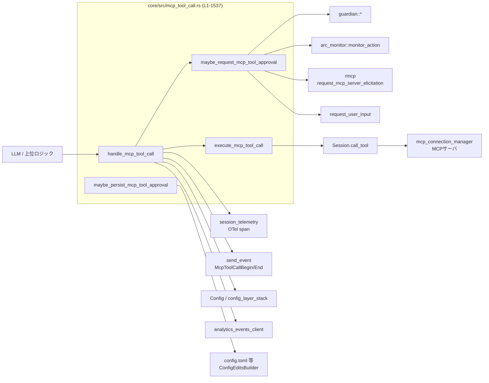
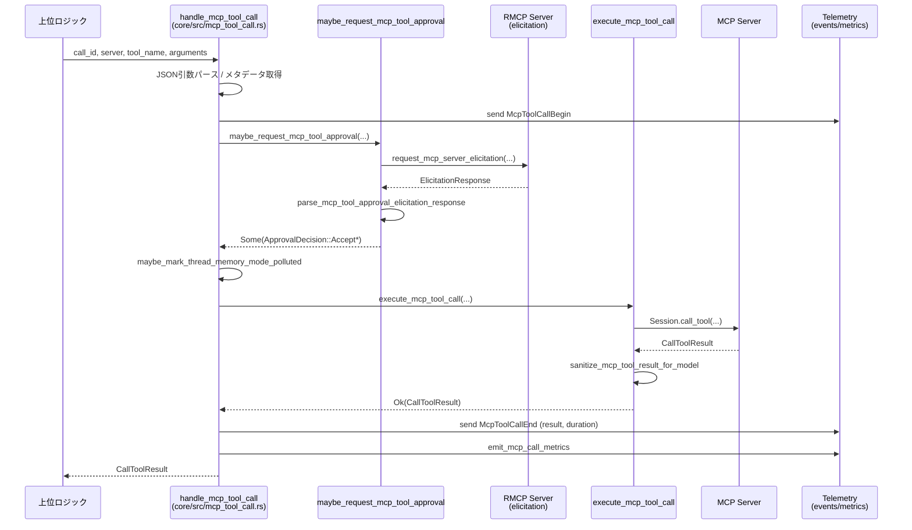

# core/src/mcp_tool_call.rs コード解説

> 対象コード範囲: `core/src/mcp_tool_call.rs:L1-1537`（ファイル全体）  
> 行番号はチャンクに含まれていないため、関数ごとの正確な行番号は特定できません。以下では関数名・構造体名を根拠として記載します。

---

## 0. ざっくり一言

MCP（Model Context Protocol）ツールを呼び出すときに、

- ユーザ／ポリシー／ガーディアンによる **事前承認**
- 実行の **トレース・メトリクス記録**
- ツール結果の **モデル互換性サニタイズ**
- ユーザ設定ファイルへの **承認状態の記録**

を一括で扱うコアモジュールです。

---

## 1. このモジュールの役割

### 1.1 概要

このモジュールは、MCP ツール呼び出しを安全かつ一貫したかたちで実行するためのオーケストレータです。

- 入力された MCP ツール呼び出し（サーバ名・ツール名・引数）を受け取り、  
  **承認フロー → 実行 → 結果サニタイズ → イベント・メトリクス送信** までを担当します。
- ツールごとのアノテーション・アプリ設定・グローバルポリシー・ARC モニタ・Guardian を組み合わせて、  
  **破壊的／危険なツールの実行を制御** します。
- 必要に応じて、承認結果を **セッション内メモリ** および **設定ファイル** に永続化します。

### 1.2 アーキテクチャ内での位置づけ

主な関係モジュールとの依存関係は次のようになります。



- `handle_mcp_tool_call` が外部呼び出しの入口で、ここから承認・実行・記録の各コンポーネントに分岐します。
- `Session` 経由で MCP 接続マネージャにツール実行を依頼し、その前後で Guardian・ARC モニタ・RMCP エリシテーション・ユーザ入力ダイアログを利用します。

### 1.3 設計上のポイント

コードから読み取れる主な設計方針は次の通りです。

- **責務の分割**
  - `handle_mcp_tool_call` は「フロー制御」に専念し、承認・実行・永続化・メトリクスは専用関数に委譲しています。
  - Guardian／ARC モニタ／RMCP エリシテーション／ユーザ入力 UI など、承認ソースごとに専用関数を持ちます。

- **状態管理**
  - セッション単位の承認状態は `sess.services.tool_approvals`（非公開ストア）で管理し、`McpToolApprovalKey` をキーとして記憶します。
  - 永続的な承認は `config.toml` 相当の設定ファイルに書き込み、`sess.reload_user_config_layer().await` で再読み込みします。

- **エラーハンドリング**
  - 公開エントリポイント `handle_mcp_tool_call` は `CallToolResult` を直接返し、内部では `Result<CallToolResult, String>` を用いてエラーを文字列化しています（`execute_mcp_tool_call` など）。
  - ツール呼び出し失敗・承認拒否・監視によるブロックなどを、  
    「ツール実行イベント」として全て `McpToolCallEnd` イベントに反映しつつ、  
    メトリクスにも `status="ok"|"error"` を記録します。

- **並行性 / 非同期**
  - すべての外部 I/O（MCP 呼び出し・RMCP エリシテーション・Guardian・コンフィグ書き込み）は `async` 関数で行っています。
  - セッション内の承認ストアは `lock().await` を使って非同期ロック下で更新しており、  
    **同時ツール呼び出し時も整合性が取れる設計** です。

- **安全性 / セキュリティ**
  - `ToolAnnotations` を用いた破壊的操作・オープンワールド操作の検知 (`requires_mcp_tool_approval`) により、  
    デフォルトは「危険寄りは必ず承認」という保守的な挙動になっています。
  - モデルが画像入力をサポートしない場合、ツール結果中の `{"type": "image", ...}` ブロックを必ずテキストに置き換え、  
    不適切なフォーマットをモデルに渡さないようにしています（`sanitize_mcp_tool_result_for_model`）。

---

## 2. 主要な機能一覧

このモジュールが提供する主な機能を整理します。

- MCP ツール呼び出しの統括 (`handle_mcp_tool_call`)
- MCP ツールごとの承認判定とユーザプロンプト (`maybe_request_mcp_tool_approval`)
- ARC モニタによる自動承認パスの安全検査 (`maybe_monitor_auto_approved_mcp_tool_call`)
- Guardian への承認委譲と結果の反映 (`build_guardian_mcp_tool_review_request`, `mcp_tool_approval_decision_from_guardian`)
- RMCP エリシテーションベースの承認 UI 呼び出し (`build_mcp_tool_approval_elicitation_request`, `parse_mcp_tool_approval_elicitation_response`)
- ツールメタデータの取得と承認ポリシー判定 (`lookup_mcp_tool_metadata`, `custom_mcp_tool_approval_mode`)
- ツール呼び出し結果の取得とモデル互換性サニタイズ (`execute_mcp_tool_call`, `sanitize_mcp_tool_result_for_model`)
- ツール承認のセッション内記憶・設定ファイルへの永続化 (`remember_mcp_tool_approval`, `maybe_persist_mcp_tool_approval`)
- MCP ツール呼び出しのトレース・メトリクス・分析イベント送信 (`mcp_tool_call_span`, `emit_mcp_call_metrics`, `maybe_track_codex_app_used`)
- メモリ汚染フラグの設定によるメモリ機能の制御 (`maybe_mark_thread_memory_mode_polluted`)

---

## 3. 公開 API と詳細解説

### 3.1 型一覧（構造体・列挙体など）

> 定義位置はすべて `core/src/mcp_tool_call.rs` 内です（正確な行番号は不明）。

| 名前 | 種別 | 役割 / 用途 |
|------|------|-------------|
| `McpToolApprovalDecision` | `enum` | MCP ツール承認フローの最終決定を表します。`Accept` / `AcceptForSession` / `AcceptAndRemember` / `Decline` / `Cancel` / `BlockedBySafetyMonitor` など。 |
| `McpToolApprovalMetadata` | `struct` | MCP ツールに付随するメタデータ（アノテーション、コネクタ ID/名前/説明、ツールタイトル・説明、`_codex_apps` メタ、OpenAI ファイル入力パラメータ）を保持します。 |
| `McpToolCallSpanFields<'a>` | `struct` | tracing span (`mcp_tool_call_span`) に埋め込むフィールドセット（サーバ名・ツール名・コネクタ情報など）をまとめた内部用構造体です。 |
| `McpAppUsageMetadata` | `struct` | Codex Apps 向けの分析イベント用メタデータ（コネクタ ID、アプリ名）を保持します。 |
| `McpToolApprovalPromptOptions` | `struct` | 承認プロンプトで「セッション記憶」「永続記憶」の選択肢を出すかどうかを制御するフラグを保持します。 |
| `McpToolApprovalElicitationRequest<'a>` | `struct` | RMCP エリシテーションに渡す MCP ツール承認リクエストのコンテキスト（メタデータ・表示用パラメータ・質問文・メッセージ・プロンプトオプション）をまとめたものです。 |
| `McpToolApprovalKey` | `struct` | MCP ツール承認をセッションストア／永続設定に保存するときのキー（`server`・`connector_id`・`tool_name`）です。 |

### 3.2 関数詳細（重要な 7 件）

#### 1. `handle_mcp_tool_call(sess: Arc<Session>, turn_context: &Arc<TurnContext>, call_id: String, server: String, tool_name: String, arguments: String) -> CallToolResult`

**概要**

MCP ツール呼び出し全体のオーケストレータです。

- 引数文字列の JSON パース
- ツールメタデータと承認モードの取得
- 承認フロー（Guardian / ARC / エリシテーション / ユーザ入力）
- ツール実行、イベント通知、メトリクス記録、分析イベント送信

を一括して行い、最終的な `CallToolResult` を返します。

**引数**

| 引数名 | 型 | 説明 |
|--------|----|------|
| `sess` | `Arc<Session>` | 会話セッションコンテキスト。MCP コネクションマネージャや分析クライアント等のサービスにアクセスします。 |
| `turn_context` | `&Arc<TurnContext>` | 現在のターン（発話）のコンテキスト。モデル情報・設定・テレメトリインターフェースなどを含みます。 |
| `call_id` | `String` | この MCP ツール呼び出しの識別子。イベント・承認プロンプト・エリシテーションの ID に利用されます。 |
| `server` | `String` | 対象 MCP サーバ名。`CODEX_APPS_MCP_SERVER_NAME` の場合は Codex Apps 用の特別扱いがあります。 |
| `tool_name` | `String` | 呼び出す MCP ツール名。 |
| `arguments` | `String` | ツール引数の JSON 文字列。空文字列は「引数なし」として扱われます。 |

**戻り値**

- `CallToolResult`  
  MCP ツールの結果またはエラーを表す構造体です。  
  この関数自身は `Result` ではなく常に `CallToolResult` を返し、内部エラーも `CallToolResult` の形に変換されます（`CallToolResult::from_error_text`, `CallToolResult::from_result` を使用）。

**内部処理の流れ**

1. `arguments` が空白のみなら `None`、それ以外なら `serde_json::from_str` で `serde_json::Value` にパースします。  
   - パース失敗時はログを出力し、`CallToolResult::from_error_text` でエラーを返して終了します。
2. `McpInvocation { server, tool, arguments }` を生成します。
3. `lookup_mcp_tool_metadata` でツールメタデータを取得し、サーバ種別に応じて
   - Codex Apps: `connectors::app_tool_policy`
   - カスタム MCP: `custom_mcp_tool_approval_mode`
   を使って承認モード（`AppToolApproval`）を決定します。
4. Codex Apps かつ `app_tool_policy.enabled == false` の場合、  
   `notify_mcp_tool_call_skip` で Begin/End イベントを送信し、「設定でブロックされた」旨のエラー結果を返します。
5. `build_mcp_tool_call_request_meta` でリクエストメタデータ（ターンメタデータ、`_codex_apps` メタ等）を構築します。
6. `McpToolCallBegin` イベントを `notify_mcp_tool_call_event` で送信します。
7. `maybe_request_mcp_tool_approval` を呼び出し、承認決定（`McpToolApprovalDecision`）を取得します。
   - `None` の場合は「承認不要または自動承認」とみなし、すぐツールを実行します。
   - `Some(decision)` の場合、`decision` に応じて実行 or エラーでスキップします。
8. 承認済みの場合:
   - `maybe_mark_thread_memory_mode_polluted` でメモリモードを汚染済みにマーク（必要な設定の場合のみ）。
   - `mcp_tool_call_span` で tracing span を張り、その中で `execute_mcp_tool_call` を計測付きで `await`。
   - 成否に関わらず `McpToolCallEnd` イベントを送信し、Codex Apps なら `maybe_track_codex_app_used` で分析イベントを送信します。
   - `emit_mcp_call_metrics` でメトリクス送信。
9. 承認拒否／キャンセル／安全モニタによるブロックの場合:
   - `notify_mcp_tool_call_skip` で Begin（必要なら）と End イベントを送り、エラーメッセージ付き `CallToolResult` を構築します。
   - `emit_mcp_call_metrics` でエラーとしてカウントします。

**Examples（使用例）**

最も典型的な呼び出し例です。

```rust
use std::sync::Arc;
use crate::codex::{Session, TurnContext};
use crate::mcp_tool_call::handle_mcp_tool_call;

async fn call_example_tool(sess: Arc<Session>, turn: Arc<TurnContext>) {
    // MCP サーバ "my_server" 上の "list_files" ツールを呼び出す例
    let call_id = "call-123".to_string();
    let server = "my_server".to_string();
    let tool_name = "list_files".to_string();
    let args = r#"{"path": "/tmp"}"#.to_string();

    let result = handle_mcp_tool_call(sess, &turn, call_id, server, tool_name, args).await;

    if result.is_error {
        eprintln!("tool error: {:?}", result);
    } else {
        println!("tool output: {:?}", result.content);
    }
}
```

**Errors / Panics**

- 無効な JSON 引数（`serde_json::from_str` が失敗する場合）は即座にエラーテキスト付き `CallToolResult` を返します。
- MCP ツール呼び出しエラーや承認拒否などは、内部的には `Result<CallToolResult, String>` の `Err` として扱われ、  
  最終的には `CallToolResult` の `is_error` や `content` に反映されます。
- 明示的な `panic!` 呼び出しはこの関数からは行われていません。

**Edge cases（エッジケース）**

- `arguments` が空文字列または空白のみ:  
  → `invocation.arguments == None` として MCP ツールに渡されます。
- MCP サーバやツールメタデータが見つからない場合:  
  → `lookup_mcp_tool_metadata` が `None` を返し、その状態で承認モードやメタは「なし」としてフローが続きます。
- Codex Apps ツールがアプリ設定で `enabled = false` の場合:  
  → 実際にツールは呼び出されず、イベントだけが送信されます。

**使用上の注意点**

- この関数は **内部で承認・実行・メトリクス送信まで完結** しているため、呼び出し側が追加でツール承認フローを実装する必要はありません。
- 戻り値が `Result` ではなく `CallToolResult` である点に注意が必要です。  
  呼び出し側は `is_error` や `content` を見てツールエラーを判定する必要があります。
- 非同期関数のため、必ず `.await` する必要があります。

---

#### 2. `maybe_request_mcp_tool_approval(sess: &Arc<Session>, turn_context: &Arc<TurnContext>, call_id: &str, invocation: &McpInvocation, metadata: Option<&McpToolApprovalMetadata>, approval_mode: AppToolApproval) -> Option<McpToolApprovalDecision>`

**概要**

1 回の MCP ツール呼び出しについて **承認が必要かどうかを判定し**、必要であれば

- ARC モニタ
- Guardian
- RMCP エリシテーション
- 従来の `request_user_input`

のいずれかを用いて承認を取得し、`McpToolApprovalDecision` を返します。  
承認不要の場合は `None` を返します。

**引数**

| 引数名 | 型 | 説明 |
|--------|----|------|
| `sess` | `&Arc<Session>` | セッション。Guardian・ARC モニタ・RMCP への呼び出しに使用します。 |
| `turn_context` | `&Arc<TurnContext>` | ターンコンテキスト。承認ポリシーや機能フラグ・設定にアクセスします。 |
| `call_id` | `&str` | このツール呼び出しの ID。承認リクエスト ID などに使用します。 |
| `invocation` | `&McpInvocation` | MCP サーバ・ツール名・引数を含む呼び出し情報。 |
| `metadata` | `Option<&McpToolApprovalMetadata>` | ツールアノテーションやコネクタ情報など、承認判断に用いるメタデータ。 |
| `approval_mode` | `AppToolApproval` | アプリ／設定で指定された承認モード（`Approve` / `Auto` / `Prompt`）。 |

**戻り値**

- `Some(McpToolApprovalDecision)`  
  承認が必要で、かつ Guardian／ユーザ入力などから何らかの決定が得られた場合。
- `None`  
  承認が不要、またはポリシーにより自動承認された場合。

**内部処理の流れ**

1. グローバルポリシー `mcp_permission_prompt_is_auto_approved` をチェックし、  
   完全自動承認ポリシーであれば `None` を返します。
2. アノテーション `ToolAnnotations` を `requires_mcp_tool_approval` に渡し、  
   ツール自体が承認を要求するかどうかを判定します。
   - ツールが承認不要で、かつ `approval_mode != Prompt` の場合は `None` を返します。
3. `approval_mode == Approve` の場合、ARC モニタ (`maybe_monitor_auto_approved_mcp_tool_call`) による安全監視を実行します。
   - `Ok` → 自動承認として `None` を返す。
   - `AskUser(reason)` → 後続の承認プロンプトで `reason` を表示するために保持。
   - `SteerModel(reason)` → `BlockedBySafetyMonitor` 決定を返します。
4. `session_mcp_tool_approval_key`・`persistent_mcp_tool_approval_key` を計算し、  
   セッションストア `mcp_tool_approval_is_remembered` を確認します。
   - 記憶済みなら `Some(Accept)` を返します。
5. `Feature::ToolCallMcpElicitation` が有効かをチェックします。
6. `routes_approval_to_guardian(turn_context)` が真なら Guardian 経路:
   - `build_guardian_mcp_tool_review_request` で Guardian リクエストを構築し、`review_approval_request` に送信。
   - 結果の `ReviewDecision` を `mcp_tool_approval_decision_from_guardian` で `McpToolApprovalDecision` に変換。
   - `apply_mcp_tool_approval_decision` で記憶／永続化を行い、`Some(decision)` を返します。
7. Guardian 経路でない場合:
   - `mcp_tool_approval_prompt_options` で「セッション記憶」「永続記憶」が許可されるかを決定。
   - `render_mcp_tool_approval_template` により表示テンプレートを構築し、`build_mcp_tool_approval_question` で質問オブジェクトを生成。
   - ARC モニタからの `monitor_reason` があれば `mcp_tool_approval_question_text` で理由付き文言に差し替え。
   - `ToolCallMcpElicitation` 機能が有効なら:
     - `build_mcp_tool_approval_elicitation_request` で RMCP リクエストを生成し、`sess.request_mcp_server_elicitation` で送信。
     - `parse_mcp_tool_approval_elicitation_response` で決定を解釈。
   - 無効なら:
     - `sess.request_user_input` を用いた従来の UX で `parse_mcp_tool_approval_response` による決定を取得。
   - `normalize_approval_decision_for_mode` でモードに応じて「記憶付き Accept」を通常の `Accept` に丸める場合があります。
   - 最後に `apply_mcp_tool_approval_decision` で決定を反映し、`Some(decision)` を返します。

**Errors / Panics**

- Guardian・RMCP・`request_user_input` など外部サービスのエラーは、呼び出し元に `Err` としては返さず、  
  それぞれのサービスが返した `ReviewDecision` / `ElicitationResponse` / `RequestUserInputResponse` の有無に応じて  
  `Cancel` などの決定に畳み込まれます。
- 明示的な `panic!` はありません。

**Edge cases**

- Guardian / RMCP / `request_user_input` が `None` を返す（タイムアウト・ユーザ離脱など）場合は `Cancel` として扱われます。
- `approval_mode == Prompt` の場合、ユーザが「セッション記憶」や「永続記憶」を選択しても、  
  `normalize_approval_decision_for_mode` によって単純な `Accept` として扱われます。

**使用上の注意点**

- この関数は `handle_mcp_tool_call` からのみ直接呼び出される設計です。  
  他の場所から承認フローだけを再利用すると、Guardian や ARC モニタとの整合性が崩れる可能性があります。
- 承認結果のセッション記憶／永続化は内部で行われるため、  
  外部から `McpToolApprovalKey` を直接操作する必要はありませんし、すべきではありません。

---

#### 3. `execute_mcp_tool_call(sess: &Session, turn_context: &TurnContext, server: &str, tool_name: &str, arguments_value: Option<serde_json::Value>, metadata: Option<&McpToolApprovalMetadata>, request_meta: Option<serde_json::Value>) -> Result<CallToolResult, String>`

**概要**

実際に MCP ツールを呼び出し、結果をモデルに渡しやすい形に整形するコアロジックです。

- OpenAI ファイル入力用の引数の書き換え
- `Session.call_tool` を用いた MCP ツールの非同期呼び出し
- モデルの入力モダリティに応じた結果サニタイズ（画像ブロックの除去）

を行い、`Result<CallToolResult, String>` として返します。

**引数**

| 引数名 | 型 | 説明 |
|--------|----|------|
| `sess` | `&Session` | セッション。`call_tool` を通じて MCP サーバに接続します。 |
| `turn_context` | `&TurnContext` | ターンコンテキスト。モデルの入力モダリティ（画像対応かどうか）を参照します。 |
| `server` | `&str` | MCP サーバ名。 |
| `tool_name` | `&str` | MCP ツール名。 |
| `arguments_value` | `Option<serde_json::Value>` | 既にパース済みのツール引数。 |
| `metadata` | `Option<&McpToolApprovalMetadata>` | OpenAI ファイル入力パラメータなど、引数書き換えに利用されるメタデータ。 |
| `request_meta` | `Option<serde_json::Value>` | MCP ツールへの追加メタ情報（ターンメタデータ・`_codex_apps`情報など）。 |

**戻り値**

- `Ok(CallToolResult)`  
  ツールの実行が成功した場合。
- `Err(String)`  
  `call_tool` がエラーを返した場合など。エラー内容は文字列にフォーマットされます（例: `"tool call error: ..."`）。

**内部処理の流れ**

1. `rewrite_mcp_tool_arguments_for_openai_files` を呼び出し、OpenAI ファイル input パラメータに応じて `arguments_value` を再構成します。
   - `metadata.openai_file_input_params` を利用し、ファイル ID から内部表現への変換などを行う前提のユーティリティです。
2. `sess.call_tool(server, tool_name, rewritten_arguments, request_meta).await` を実行し、`CallToolResult` を取得します。
   - エラー時は `format!("tool call error: {e:?}")` で `Err(String)` に変換します。
3. モデルが画像入力をサポートしているかを `turn_context.model_info.input_modalities.contains(&InputModality::Image)` で判定し、  
   `sanitize_mcp_tool_result_for_model` に `supports_image_input` と `Ok(result)` を渡します。
4. `sanitize_mcp_tool_result_for_model` の結果をそのまま返します。

**Errors / Panics**

- `rewrite_mcp_tool_arguments_for_openai_files` が `Err` を返した場合、そのエラーをそのまま上位に伝播します。
- `call_tool` がエラー (`Err`) を返した場合、`"tool call error: {e:?}"` という文字列としてラップされます。
- 明示的な `panic!` はありません。

**Edge cases**

- `metadata` が `None` または `openai_file_input_params` が `None` の場合も、引数書き換え関数内で適切に処理されます（この関数側では特別扱いしません）。
- `request_meta` が `None` の場合、MCP ツールはメタ情報なしで呼び出されます。

**使用上の注意点**

- この関数は `handle_mcp_tool_call` からのみ呼ばれる前提で設計されており、  
  承認フローやメトリクス送信を含みません。単体で使うと、イベントやメトリクスが欠落した状態になります。
- 戻り値が `Result` であるため、そのまま外部 API に公開するとエラーハンドリングの一貫性が崩れます。  
  外部には `CallToolResult` を返すラッパ（`CallToolResult::from_result` など）経由で公開することが前提です。

---

#### 4. `sanitize_mcp_tool_result_for_model(supports_image_input: bool, result: Result<CallToolResult, String>) -> Result<CallToolResult, String>`

**概要**

MCP ツールの結果を、呼び出し元モデルの入力モダリティに合わせてサニタイズします。

- 画像入力をサポートしないモデルに対しては、ツール結果中の `"type": "image"` ブロックをすべてテキストメッセージに置き換えます。

**引数**

| 引数名 | 型 | 説明 |
|--------|----|------|
| `supports_image_input` | `bool` | 呼び出し元モデルが画像入力を受け付けるかどうか。 |
| `result` | `Result<CallToolResult, String>` | MCP ツールの生の結果またはエラー。 |

**戻り値**

- `Result<CallToolResult, String>`  
  - `Err` の場合は一切変更せずそのまま返します。
  - `Ok(CallToolResult)` の場合、`supports_image_input == false` なら `content` 内の `"image"` ブロックをテキストに変換し、それ以外は変更しません。

**内部処理の流れ**

1. `supports_image_input` が `true` の場合、`result` をそのまま返します。
2. そうでない場合、`result.map` で `CallToolResult` を変換:
   - `call_tool_result.content.iter()` を走査し、各ブロックの `"type"` が `"image"` かを判定。
   - `"image"` の場合は以下の JSON に置き換えます。

     ```json
     {
       "type": "text",
       "text": "<image content omitted because you do not support image input>"
     }
     ```

   - それ以外のブロックは `clone()` してそのまま残します。
   - `structured_content`, `is_error`, `meta` は変更しません。

**Errors / Panics**

- 既に `Err(String)` になっている場合は変換せずにそのまま返します。
- 明示的な `panic!` はありません。

**Edge cases**

- `content` が空配列の場合:  
  → 特に何もせず空配列のまま返します。
- `"type"` フィールドが存在しない、または文字列でないブロック:  
  → そのブロックは変換されず、元のまま返されます。

**使用上の注意点**

- この関数は **結果のフォーマットを変える** だけであり、ツールの機能的な意味は変えません。  
  ただし画像情報は完全に失われるため、画像に依存するツールを画像非対応モデルと組み合わせる場合は、  
  上位で適切なユーザメッセージを付加するなどの配慮が必要です。

---

#### 5. `lookup_mcp_tool_metadata(sess: &Session, turn_context: &TurnContext, server: &str, tool_name: &str) -> Option<McpToolApprovalMetadata>`

**概要**

現在の MCP 接続マネージャから指定ツールのメタ情報を検索し、承認フローで利用しやすい形 (`McpToolApprovalMetadata`) に変換します。

- `ToolAnnotations` やツールタイトル・説明、Codex Apps メタ (`_codex_apps`) も含まれます。

**引数**

| 引数名 | 型 | 説明 |
|--------|----|------|
| `sess` | `&Session` | セッション。`mcp_connection_manager` にアクセスするために使用します。 |
| `turn_context` | `&TurnContext` | 設定からコネクタ一覧取得に利用します。 |
| `server` | `&str` | 検索対象 MCP サーバ名。 |
| `tool_name` | `&str` | 検索対象 MCP ツール名。 |

**戻り値**

- `Some(McpToolApprovalMetadata)`  
  該当ツールが見つかった場合。
- `None`  
  ツールが見つからなかった場合。

**内部処理の流れ**

1. `sess.services.mcp_connection_manager.read().await.list_all_tools().await` で全ツール一覧を取得します。
2. `into_values().find(|tool_info| tool_info.server_name == server && tool_info.tool.name == tool_name)` で該当ツールを検索します。
3. Codex Apps MCP サーバ (`server == CODEX_APPS_MCP_SERVER_NAME`) の場合:
   - `connectors::list_cached_accessible_connectors_from_mcp_tools` または  
     `connectors::list_accessible_connectors_from_mcp_tools` でコネクタ一覧を取得。
   - `tool_info.connector_id` に一致するコネクタの `description` を `connector_description` としてセットします。
4. `McpToolApprovalMetadata` を構築:
   - `annotations` = `tool_info.tool.annotations`
   - `connector_id` / `connector_name`
   - `tool_title` / `tool_description`
   - `codex_apps_meta` = `tool_info.tool.meta["_codex_apps"]` を `serde_json::Map` にクローンしたもの
   - `openai_file_input_params` = `declared_openai_file_input_param_names(tool_info.tool.meta.as_deref())` の結果（空なら `None`）

**Errors / Panics**

- `list_accessible_connectors_from_mcp_tools` が `Err` を返した場合、コネクタ一覧取得は諦めて `connector_description = None` とします。
- 明示的な `panic!` はありません。

**Edge cases**

- MCP コネクションマネージャにツール情報がまだロードされていない場合、`None` が返ります。
- Codex Apps 以外のサーバの場合、`connector_description` は常に `None` になります。

**使用上の注意点**

- この関数は `handle_mcp_tool_call` からのみ呼ばれており、メタデータが取得できない場合でもフロー全体は続行されます。  
  呼び出し側は `None` に対して特別なエラーハンドリングを行う必要はありませんが、  
  承認 UI で表示できる情報が減る可能性があります。

---

#### 6. `maybe_persist_mcp_tool_approval(sess: &Session, turn_context: &TurnContext, key: McpToolApprovalKey)`

**概要**

ユーザが「今後も聞かない（Remember）」を選択したときに、MCP ツール承認を設定ファイルに永続化します。

- Codex Apps とカスタム MCP サーバで保存先が異なります。
- 永続化に失敗した場合は、セッション内記憶にフォールバックします。

**引数**

| 引数名 | 型 | 説明 |
|--------|----|------|
| `sess` | `&Session` | セッション。`tool_approvals` ストアと設定再読み込みに利用します。 |
| `turn_context` | `&TurnContext` | `Config` への参照と `codex_home` を取得するために使用します。 |
| `key` | `McpToolApprovalKey` | 承認対象を表すキー（サーバ名・コネクタ ID・ツール名）。 |

**戻り値**

- 返り値は `()`（非公開 async 関数）です。エラー時はログおよびセッション記憶によるフォールバックで対処します。

**内部処理の流れ**

1. `tool_name` を取り出し、ログ用に保持します。
2. `persist_result` を以下のように決定します。
   - `key.server == CODEX_APPS_MCP_SERVER_NAME` の場合:
     - `key.connector_id` が `Some` なら `persist_codex_app_tool_approval(&codex_home, &connector_id, &tool_name)` を呼ぶ。
     - `None` なら永続化せず `remember_mcp_tool_approval(sess, key).await` でセッション内記憶のみ行い、終了します。
   - それ以外（カスタム MCP サーバ）の場合:
     - `persist_custom_mcp_tool_approval(&turn_context.config, &key.server, &tool_name).await` を呼ぶ。
3. `persist_result` が `Err` の場合:
   - エラーをログ出力し、
   - `remember_mcp_tool_approval(sess, key).await` でセッション内記憶にフォールバックして終了します。
4. `persist_result` が `Ok(())` の場合:
   - `sess.reload_user_config_layer().await` で設定を再読み込みします。
   - さらに `remember_mcp_tool_approval(sess, key).await` でセッション内にも承認結果を保存します。

**Errors / Panics**

- 永続化に失敗しても `panic!` はせず、必ずセッション内記憶にフォールバックする設計です。
- 永続化処理（`persist_codex_app_tool_approval`, `persist_custom_mcp_tool_approval`）は `anyhow::Result<()>` を返し、エラー内容はログに記録されます。

**Edge cases**

- Codex Apps で `connector_id` が `None` の場合、永続化は行われずセッション内記憶のみになります。
- カスタム MCP サーバが `config.toml` に未登録の場合、`persist_custom_mcp_tool_approval` 内で `anyhow::bail!` され、  
  ログ出力＋セッション内記憶にフォールバックします。

**使用上の注意点**

- 永続化に成功しても、ユーザが後で設定ファイルを手動編集する可能性があります。  
  実行時には常に `config_layer_stack` を元に承認モードが再計算される点に留意する必要があります。

---

#### 7. `requires_mcp_tool_approval(annotations: Option<&ToolAnnotations>) -> bool`

**概要**

`ToolAnnotations` に基づき、MCP ツールがユーザ承認を要求するかを判定するロジックです。

- 「破壊的操作（destructive）」「オープンワールド（open_world）」「read_only」のヒントを使い、保守的なデフォルトを採用しています。

**引数**

| 引数名 | 型 | 説明 |
|--------|----|------|
| `annotations` | `Option<&ToolAnnotations>` | MCP ツールに付与されたアノテーション。`None` の場合はデフォルトルールが適用されます。 |

**戻り値**

- `true`  
  ツール呼び出し時に承認が必要と判断された場合。
- `false`  
  承認不要と判断された場合。

**内部処理のルール**

1. `destructive_hint` が `Some(true)` の場合 → 常に `true`（承認必須）。
2. `read_only_hint` が `Some(true)` の場合 → 常に `false`（承認不要）。
3. 上記以外の場合（`annotations` が `None` も含む）:

   ```rust
   destructive_hint.unwrap_or(true)
       || annotations
           .and_then(|annotations| annotations.open_world_hint)
           .unwrap_or(true)
   ```

   となっており、

   - `destructive_hint` が `None` の場合は `true` とみなす
   - `open_world_hint` が `None` の場合も `true` とみなす

   ため、**アノテーションが指定されていなければ承認必須** になります。

**セキュリティ上の意味**

- デフォルトで「危険寄りに扱う」ポリシーです。
  - 明示的に `read_only_hint = true` または  
    `destructive_hint = false` かつ `open_world_hint = false` の場合のみ承認不要になります。
- アノテーションの漏れや設定ミスがあっても、危険操作を無承認で実行しにくい設計です。

**使用上の注意点**

- 「安全なので承認不要にしたい」ツールは、`ToolAnnotations` 側で
  - `read_only_hint = true` **または**
  - `destructive_hint = false` かつ `open_world_hint = false`
  を明示的に設定する必要があります。
- アノテーションを追加・変更するときは、この関数のロジックを前提として設計する必要があります。

---

### 3.3 その他の関数一覧

> いずれも `core/src/mcp_tool_call.rs` 内に定義されています。説明は 1 行要約です。

| 関数名 | 役割（1 行） |
|--------|--------------|
| `emit_mcp_call_metrics` | ツール呼び出し回数と所要時間をメトリクスとして記録します。 |
| `mcp_call_metric_tags` | メトリクスタグ（status, tool, connector_id/name）を構築します。 |
| `mcp_tool_call_span` | MCP ツール呼び出し用の tracing span を作成し、OTel 用フィールドを埋めます。 |
| `record_server_fields` | サーバ URL からホスト名・ポートを抽出して span に記録します。 |
| `maybe_mark_thread_memory_mode_polluted` | 設定に応じて、MCP ツール呼び出しによるメモリ汚染フラグを state DB に書き込みます。 |
| `notify_mcp_tool_call_event` | `Session.send_event` で `McpToolCallBegin` / `End` イベントを送信します。 |
| `maybe_track_codex_app_used` | Codex Apps の MCP ツール呼び出しを分析イベント（AppInvocation）としてトラッキングします。 |
| `is_mcp_tool_approval_question_id` | 質問 ID が MCP ツール承認プロンプトかどうかをプレフィックスで判定します。 |
| `mcp_tool_approval_prompt_options` | セッション記憶・永続記憶を承認プロンプトに表示するかどうかを決めます。 |
| `maybe_monitor_auto_approved_mcp_tool_call` | ARC モニタに Guardian 互換 JSON を送り、自動承認の安全性を検査します。 |
| `prepare_arc_request_action` | GuardianApprovalRequest を JSON にシリアライズして ARC モニタ用アクションに変換します。 |
| `session_mcp_tool_approval_key` | `AppToolApproval::Auto` モード時のセッション内承認キーを生成します。 |
| `persistent_mcp_tool_approval_key` | 永続承認用キーを生成します（現状セッションキーと同一）。 |
| `build_guardian_mcp_tool_review_request` | MCP ツール用 Guardian 承認リクエストを構築します。 |
| `mcp_tool_approval_decision_from_guardian` | Guardian の `ReviewDecision` を `McpToolApprovalDecision` に変換し、拒否理由を埋めます。 |
| `mcp_tool_approval_callsite_mode` | ARC モニタの callsite 名（always_allow/default）を承認モードに基づいて返します。 |
| `lookup_mcp_app_usage_metadata` | Codex Apps 用にツールの connector_id と app_name を取得します。 |
| `build_mcp_tool_approval_question` | 従来型ユーザ入力用の承認質問オブジェクトを構築します。 |
| `build_mcp_tool_approval_fallback_message` | 接続先やサーバ名に応じた承認メッセージのフォールバック文言を生成します。 |
| `mcp_tool_approval_question_text` | ARC モニタからの理由文を含めるかどうかを決めて質問文を整形します。 |
| `arc_monitor_interrupt_message` | ARC モニタがツールをブロックしたときのユーザ向けメッセージを組み立てます。 |
| `build_mcp_tool_approval_elicitation_request` | RMCP サーバに送るフォームベース承認リクエストを構築します。 |
| `build_mcp_tool_approval_elicitation_meta` | 承認フォームに渡すメタ情報（persist, connector, tool 情報等）を JSON として構築します。 |
| `build_mcp_tool_approval_display_params` | ツール引数を表示用に整形し、名前順にソートします。 |
| `parse_mcp_tool_approval_elicitation_response` | RMCP エリシテーションの応答を `McpToolApprovalDecision` にマッピングします。 |
| `request_user_input_response_from_elicitation_content` | エリシテーションの content から `RequestUserInputResponse` を組み立てます。 |
| `parse_mcp_tool_approval_response` | `RequestUserInputResponse` から MCP ツール承認決定を抽出します。 |
| `normalize_approval_decision_for_mode` | Prompt モードのときに「記憶付き Accept」を通常の `Accept` に丸めます。 |
| `mcp_tool_approval_is_remembered` | セッション内承認ストアに `ApprovedForSession` として記録済みかを判定します。 |
| `remember_mcp_tool_approval` | セッション内ストアにツール承認を `ApprovedForSession` として保存します。 |
| `apply_mcp_tool_approval_decision` | 承認決定に応じて `remember_mcp_tool_approval` または `maybe_persist_mcp_tool_approval` を呼び出します。 |
| `persist_codex_app_tool_approval` | Codex Apps 用の承認モード `approve` を apps 設定配下に書き込むユーティリティです。 |
| `persist_custom_mcp_tool_approval` | カスタム MCP サーバ用の承認モード `approve` を config.toml 等に書き込むユーティリティです。 |
| `project_mcp_tool_approval_config_folder` | 指定サーバがプロジェクトレイヤ設定に存在するかを探し、そのフォルダパスを返します。 |
| `notify_mcp_tool_call_skip` | ツール呼び出しをスキップする際に Begin/End イベントを送り、エラーメッセージで終了させます。 |

---

## 4. データフロー

### 4.1 代表的な処理シナリオ

ここでは、**Guardian を経由せず RMCP エリシテーションが有効な場合**のフローを示します。

1. 上位ロジックが `handle_mcp_tool_call` を呼び出す。
2. 引数 JSON をパース・メタデータを取得し、`McpToolCallBegin` を送信。
3. `maybe_request_mcp_tool_approval` が呼び出され、
   - ARC モニタ (任意)
   - RMCP エリシテーション（フォームベース承認）
   を通じて `McpToolApprovalDecision` を得る。
4. `Accept*` の場合:
   - メモリ汚染フラグを設定（必要時）。
   - `execute_mcp_tool_call` で MCP サーバにツールを実行させる。
   - `sanitize_mcp_tool_result_for_model` で結果をサニタイズ。
   - `McpToolCallEnd` イベント送信・メトリクス送信・Codex Apps なら分析イベント送信。
5. `Decline` / `Cancel` / `BlockedBySafetyMonitor` の場合:
   - `notify_mcp_tool_call_skip` で Begin（必要なら）と End を送り、エラー結果を返す。

### 4.2 シーケンス図



この図は `core/src/mcp_tool_call.rs:L1-1537` の中で定義されている関数同士のやり取りと、外部コンポーネント（RMCP サーバ・MCP サーバ・テレメトリ）との典型的なデータフローを示しています。

---

## 5. 使い方（How to Use）

### 5.1 基本的な使用方法

典型的には、**モデルが MCP ツール呼び出しを出力したとき**、上位レイヤから `handle_mcp_tool_call` を呼び出します。

```rust
use std::sync::Arc;
use crate::codex::{Session, TurnContext};
use crate::mcp_tool_call::handle_mcp_tool_call;

async fn process_tool_call(sess: Arc<Session>, turn: Arc<TurnContext>) -> anyhow::Result<()> {
    // LLM 出力などから取得した MCP 呼び出しパラメータ
    let call_id = "tool-call-001".to_string();
    let server = "my_mcp_server".to_string();
    let tool = "search".to_string();
    let args = r#"{"query": "rust mcp"}"#.to_string();

    // MCP ツール呼び出し
    let result = handle_mcp_tool_call(sess, &turn, call_id, server, tool, args).await;

    if result.is_error {
        // ユーザ向けにエラーを整形して表示するなど
        eprintln!("MCP tool failed: {:?}", result.content);
    } else {
        // content / structured_content をモデルへの次入力などに利用する
        println!("MCP tool content: {:?}", result.content);
    }

    Ok(())
}
```

### 5.2 よくある使用パターン

1. **Codex Apps MCP サーバ用ツール呼び出し**
   - `server == CODEX_APPS_MCP_SERVER_NAME` の場合、`connectors::app_tool_policy` により
     - アプリごとの `enabled` / `approval` モードが適用されます。
   - アプリ設定で無効化されている場合は、ツールは実行されず `notify_mcp_tool_call_skip` 経由でスキップされます。

2. **カスタム MCP サーバの承認モード**
   - `config.toml` の `mcp_servers.<server>.tools.<tool>.approval_mode` で `Approve` / `Auto` / `Prompt` を設定すると、
     `custom_mcp_tool_approval_mode` 経由で反映されます。
   - `Auto` + `read_only` アノテーションの組み合わせで「静かな自動承認」、  
     `Prompt` で「常に確認」といった使い分けが可能です。

3. **ToolCallMcpElicitation 機能フラグの有無**
   - `Feature::ToolCallMcpElicitation` が有効なら、承認 UI は RMCP を経由したフォームベース承認になります。
   - 無効なら、従来の `request_user_input` ベースのシンプルな選択式プロンプトになります。

### 5.3 よくある間違い

```rust
// 間違い例: arguments を JSON でない文字列にしてしまう
let args = "not-json".to_string();
let result = handle_mcp_tool_call(sess.clone(), &turn, call_id, server, tool, args).await;
// → 内部で JSON パースに失敗し、CallToolResult は is_error = true になる

// 正しい例: JSON 文字列として渡す
let args = r#"{"key": "value"}"#.to_string();
let result = handle_mcp_tool_call(sess.clone(), &turn, call_id, server, tool, args).await;
```

他に起こりやすい誤用として:

- **`CallToolResult` のエラー判定** を `Result` と勘違いして `match` しようとする。  
  → この関数の戻り値は `CallToolResult` であり、`is_error` フィールドや `content` にエラー情報が入ります。
- **承認モードを設定しているのに効かないように見える**  
  → `requires_mcp_tool_approval` がデフォルトで承認必須に寄せているため、アノテーションと設定を整合させる必要があります。

### 5.4 使用上の注意点（まとめ）

- `handle_mcp_tool_call` は **内部でイベント送信・メトリクス記録・分析イベント送信** を行います。  
  上位で二重に同様のメトリクスを取ると重複計測につながります。
- 同一セッション内で複数ツール呼び出しが同時に行われる場合、承認状態は `tool_approvals` ストアにより整合的に扱われますが、  
  設定ファイルの編集などは外部要因として残ります。
- モデルが画像入力に非対応の場合、ツール結果中の画像ブロックは自動的に置き換えられます。  
  画像に依存した回答を期待できない点をユーザに伝える UI 側の配慮が必要です。

---

## 6. 変更の仕方（How to Modify）

### 6.1 新しい機能を追加する場合

例: 「新しい承認ソース（別のセキュリティサービス）を追加したい」ケース。

1. **決定ロジックの挿入ポイントを特定**
   - 事前承認フローの集約ポイントは `maybe_request_mcp_tool_approval` です。
   - 既存の `routes_approval_to_guardian` 分岐や ARC モニタ呼び出しの直後に、新しいソースを追加するのが自然です。

2. **新しいサービスとのインターフェース関数を作成**
   - Guardian と同様に、外部サービスとの通信部分を別関数（もしくは別モジュール）に切り出します。
   - 戻り値は `McpToolApprovalDecision` に変換しやすい `enum` などにします。

3. **決定結果を `McpToolApprovalDecision` にマッピング**
   - `mcp_tool_approval_decision_from_guardian` と同様の変換関数を追加し、  
     承認／拒否／キャンセルを適切にマッピングします。

4. **`apply_mcp_tool_approval_decision` との整合性確認**
   - 新しい決定種別を追加する場合は、`apply_mcp_tool_approval_decision` での扱い（記憶／永続化の有無）も更新します。

### 6.2 既存の機能を変更する場合

- **承認判定のロジックを変える**（例: `requires_mcp_tool_approval` の条件を緩和・強化）
  - 影響範囲:
    - `maybe_request_mcp_tool_approval` の `approval_required` 分岐
    - `AppToolApproval::Prompt` モードとの組み合わせ挙動
  - 変更時には、破壊的操作が無承認で実行されないかどうかを慎重に確認する必要があります。

- **永続化パスを変更する**（例: 別フォーマットの設定ファイルを使う）
  - `persist_codex_app_tool_approval`, `persist_custom_mcp_tool_approval`, `project_mcp_tool_approval_config_folder` を中心に変更します。
  - 設定再読み込み (`sess.reload_user_config_layer().await`) が期待通り動作するか確認が必要です。

- **メトリクス／トレースキーを変更する**
  - `emit_mcp_call_metrics`, `mcp_tool_call_span` を修正します。
  - 既存の監視基盤（ダッシュボード・アラート）への影響を考慮する必要があります。

---

## 7. 関連ファイル

| パス / モジュール | 役割 / 関係 |
|-------------------|------------|
| `core/src/mcp_tool_call_tests.rs` | 本モジュールのテストコード（`#[cfg(test)] mod tests;` で参照）。 |
| `crate::codex::Session` | MCP コネクションマネージャやテレメトリ・分析クライアントを保持するセッションコンテキスト。ツール実行やイベント送信の入口です。 |
| `crate::codex::TurnContext` | モデル情報・承認ポリシー・機能フラグ・設定レイヤスタック等を保持する、1 ターン分のコンテキストです。 |
| `crate::arc_monitor` | ARC モニタ（安全監視）機能。自動承認時の安全判定に使用されます。 |
| `crate::guardian::*` | Guardian 承認システムとのインターフェース。承認リクエスト生成 (`build_guardian_mcp_tool_review_request`) や結果変換に利用されます。 |
| `crate::mcp_openai_file` | `rewrite_mcp_tool_arguments_for_openai_files` を提供し、OpenAI ファイル入力パラメータを MCP ツール引数に反映します。 |
| `crate::mcp_tool_approval_templates` | MCP ツール承認プロンプトのテンプレートレンダリングと、表示用パラメータ型 `RenderedMcpToolApprovalParam` を提供します。 |
| `crate::config::Config` / `config::edit::ConfigEdit`, `ConfigEditsBuilder` | MCP ツール承認モードを設定ファイルに永続化する際に使用します。 |
| `crate::config::load_global_mcp_servers` | カスタム MCP サーバがグローバル設定に登録されているか確認するために利用されます。 |
| `crate::connectors` | Codex Apps MCP サーバに紐づくコネクタ情報や、アプリツールポリシー (`app_tool_policy`) を提供します。 |
| `codex_rmcp_client` | RMCP エリシテーション API (`ElicitationAction`, `ElicitationResponse`) を提供します。 |
| `codex_protocol::*` | MCP ツールイベント (`McpToolCallBeginEvent`, `McpToolCallEndEvent`) や `CallToolResult` などプロトコル型を提供します。 |
| `codex_analytics` | MCP ツール呼び出しをアプリ利用イベント (`AppInvocation`) としてトラッキングするためのクライアントです。 |
| `codex_rollout::state_db` | メモリモード汚染フラグを保存するためのステート DB インターフェースです。 |

以上が、`core/src/mcp_tool_call.rs` における公開 API・コアロジック・データフロー・安全性/エラー/並行性に関する整理です。
