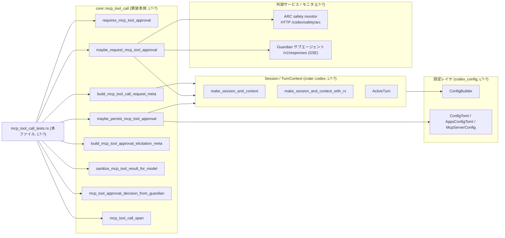
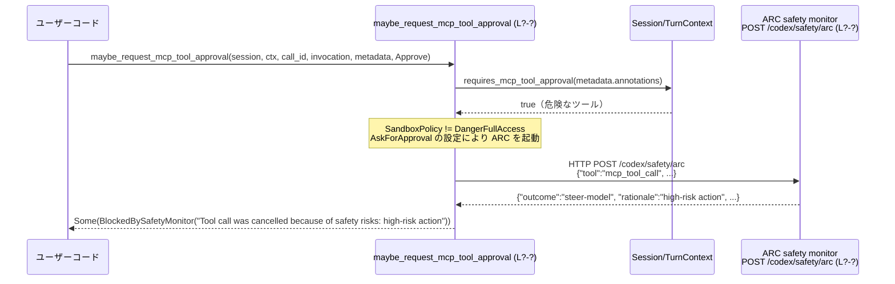
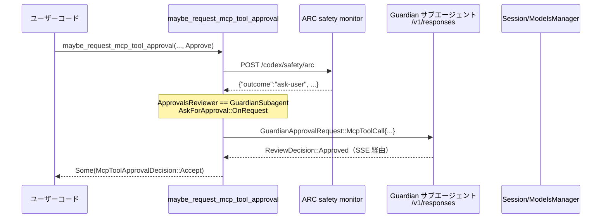

# core/src/mcp_tool_call_tests.rs コード解説

## 0. ざっくり一言

このファイルは、**MCP ツール呼び出しの承認・安全監査・永続化ロジック**まわりの振る舞いを検証する統合テスト群です。ARC セーフティモニタ、Guardian レビューワー、設定ファイル（`config.toml`）との連携まで含めたエンドツーエンドのコントラクトをチェックしています。

> 行番号情報はこのチャンクに含まれていないため、根拠箇所は `core/src/mcp_tool_call_tests.rs:L?-?` のように「?」で表記します。

---

## 1. このモジュールの役割

### 1.1 概要

- このテストモジュールは、`super::*`（おそらく `core::mcp_tool_call` 相当）の **公開 API とコアロジックの契約** を検証しています。
- 主な関心は次の通りです（テスト名より）:
  - ツールの **アノテーション**（read_only / destructive / open_world）から「承認が必要か」を判定するロジック。
  - 「Prompt / Auto / Approve」などの **ツール承認モード**と ARC/Guardian の連携。
  - Guardian サブエージェント・ARC セーフティモニタによる **ブロック/許可/ユーザー確認** の分岐。
  - ツール承認の **永続化（`config.toml` への書き込みとセッション再読み込み）**。
  - MCP サーバーへのリクエスト・エリシテーションの **メタデータ生成**とトレーシングスパンの内容。

### 1.2 アーキテクチャ内での位置づけ

このファイル自体はテスト専用ですが、テストから見えるコンポーネントの関係は概ね次のようになっています。



- この図は、本ファイルに現れる呼び出し関係のみを表現しています（定義本体は `super::*` などにあります）。
- ARC／Guardian との通信は `wiremock` や SSE テストサポートでモックされています。

### 1.3 設計上のポイント（テストから読める範囲）

テストコードから読み取れる設計上の特徴を整理します。

- **責務の分割**
  - 「承認が必要かどうかの判定」（`requires_mcp_tool_approval`）を小さな純粋関数として分離。
  - 「承認フローのオーケストレーション」（`maybe_request_mcp_tool_approval`）はセッション・設定・ARC・Guardian など複数コンポーネントを束ねる役割。
  - 「承認結果の永続化」（`persist_*`, `maybe_persist_mcp_tool_approval`）は設定ファイル編集専用の関数に切り出し。
  - 「UI / MCP サーバー向けのメッセージとメタデータ生成」（`build_mcp_tool_approval_question`, `build_mcp_tool_approval_elicitation_meta` など）も専用関数で扱う。
- **状態管理**
  - セッションやターンコンテキストは `Arc` で共有され、内部で `Mutex` や `RwLock` を用いている（`session.active_turn.lock().await` などの呼び出しから推測, L?-?）。
  - 永続化後は `session.get_config().await` で **最新版の設定が再読み込み**されることがテストで保証されています（`maybe_persist_mcp_tool_approval_*` 系, L?-?）。
- **エラーハンドリング**
  - 永続化関数の多くは `Result` を返し、テストで `.expect("...")` として成功前提で使用されています（`persist_*` テスト, L?-?）。
  - 一方 `maybe_persist_mcp_tool_approval` は `()` 戻り値（エラーを返さない）で、内部でログや無視処理を行っている可能性があります（テストでは `await` するのみ, L?-?）。
  - `sanitize_mcp_tool_result_for_model` は `Result<CallToolResult, E>` の `Result` をそのまま伝播しつつ、中身だけを変換する設計になっています（L?-?）。
- **安全性・ポリシー**
  - ツールの `read_only/destructive/open_world` アノテーションに基づき **「承認必須」かを保守的に判定**（アノテーションが無い場合は承認必須と扱う, L?-?）。
  - ARC セーフティモニタの `steer-model` 結果により、**Approve モードでもツール呼び出しをブロック**する（L?-?）。
  - サンドボックスが `DangerFullAccess` かつ `AskForApproval::Never` のときは ARC も Guardian も一切呼ばずにスキップする（`full_access_mode_skips_arc_monitor_for_all_approval_modes`, L?-?）。
- **並行性**
  - すべての非同期フローは `#[tokio::test]` で検証され、`tokio::spawn` や `tokio::time::timeout` を用いて「待ち続けるべき Future がきちんとブロックしているか」をテストしています（`prompt_mode_waits_for_approval_when_annotations_do_not_require_approval`, L?-?）。
- **観測可能性**
  - `mcp_tool_call_span` により、OTel 互換の属性を持った `tracing` スパンが張られることがテストされています（rpc.system, mcp.server.name など, L?-?）。

---

## 2. 主要な機能一覧（テスト対象の機能）

このファイルが検証している主な機能を列挙します。

- ツールアノテーションからの承認必須判定  
  → `requires_mcp_tool_approval(Option<&ToolAnnotations>) -> bool`
- 承認モードごとの決定正規化  
  → `normalize_approval_decision_for_mode(...)`
- 承認 UI 用の質問文・選択肢生成  
  → `build_mcp_tool_approval_question`, `mcp_tool_approval_question_text`
- MCP ツール承認エリシテーション（フォーム）リクエスト生成  
  → `build_mcp_tool_approval_elicitation_request`, `build_mcp_tool_approval_elicitation_meta`
- Guardian / ARC との連携ロジック  
  → `build_guardian_mcp_tool_review_request`, `mcp_tool_approval_decision_from_guardian`, `prepare_arc_request_action`
- ツール承認結果のパース  
  → `parse_mcp_tool_approval_elicitation_response`, `parse_mcp_tool_approval_response`, `request_user_input_response_from_elicitation_content`
- MCP ツール結果のモデル向けサニタイズ  
  → `sanitize_mcp_tool_result_for_model`
- MCP ツール呼び出しメタデータ生成  
  → `build_mcp_tool_call_request_meta`, `mcp_tool_call_span`
- 承認の永続化と再読込  
  → `persist_codex_app_tool_approval`, `persist_custom_mcp_tool_approval`, `maybe_persist_mcp_tool_approval`, `mcp_tool_approval_is_remembered`
- 承認キーの生成  
  → `session_mcp_tool_approval_key`, `persistent_mcp_tool_approval_key`, `mcp_tool_approval_callsite_mode`
- 承認フロー全体のオーケストレーション  
  → `maybe_request_mcp_tool_approval`

---

## 3. 公開 API と詳細解説

このファイル内にはテスト専用の補助関数（`annotations`, `approval_metadata`, `prompt_options`）しか定義されていません。ここでは **テスト対象となっている主要 API** を対象に説明します（定義本体は `super::*` など別ファイルにあります）。

### 3.1 型一覧（主要な構造体・列挙体）

テストから役割が読み取れる主な型を整理します。

| 名前 | 種別 | 役割 / 用途 | 根拠 |
|------|------|-------------|------|
| `ToolAnnotations` | 構造体 | MCP ツールの `read_only` / `destructive` / `open_world` のヒントを保持します。 | `annotations` ヘルパーのフィールド初期化より（read_only_hint, destructive_hint, open_world_hint, L?-?） |
| `McpToolApprovalMetadata` | 構造体 | コネクタ ID/名称・ツールタイトル/説明・アノテーション・Codex Apps 用メタデータなど、承認に関する追加メタを保持します。 | `approval_metadata` ヘルパーおよび各テストでのフィールド使用, L?-? |
| `McpToolApprovalPromptOptions` | 構造体 | 「セッション記憶を許可するか」「永続的な承認を許可するか」を示すフラグを保持します。 | `prompt_options` ヘルパーと `build_mcp_tool_approval_question` 系テスト, L?-? |
| `McpToolApprovalDecision` | 列挙体 | `Accept`, `AcceptForSession`, `AcceptAndRemember`, `Decline { message: Option<String> }`, `BlockedBySafetyMonitor(String)` など MCP ツール承認の結果を表現します。 | 各種パース・ガーディアン・ARC テストでパターンマッチ, L?-? |
| `McpInvocation` | 構造体 | `server`, `tool`, `arguments` から成る MCP ツール呼び出しの指定です。ARC/Guardian/承認キー生成などで使われます。 | 複数テスト内でインスタンス化, L?-? |
| `McpToolApprovalKey` | 構造体 | `server`, `connector_id`, `tool_name` によって、承認記憶（セッション／永続）のキーを表します。 | `session_mcp_tool_approval_key` / `persistent_mcp_tool_approval_key` テスト, L?-? |
| `CallToolResult` | 構造体 | MCP ツール呼び出し結果。`content: Vec<Value>`, `structured_content`, `is_error`, `meta` を含みます。 | `sanitize_mcp_tool_result_for_model_*` テスト, L?-? |
| `GuardianApprovalRequest` | enum | `McpToolCall { ... }` バリアントを持ち、Guardian サブエージェントへ送るレビューリクエストの内容を表します。 | `guardian_mcp_review_request_includes_invocation_metadata` など, L?-? |
| `GuardianMcpAnnotations` | 構造体 | Guardian 向けに変換された `destructive_hint`, `open_world_hint`, `read_only_hint` を持ちます。 | `guardian_mcp_review_request_includes_annotations_when_present`, L?-? |
| `McpServerElicitationRequestParams` | 構造体 | MCP サーバーへのエリシテーション（フォーム入力要求）パラメータ。`thread_id`, `turn_id`, `server_name`, `request` を含みます。 | `approval_elicitation_request_uses_message_override_and_preserves_tool_params_keys`, L?-? |
| `McpServerElicitationRequest` | enum | `Form { meta, message, requested_schema }` バリアントがテストから確認できます。 | 同上, L?-? |
| `McpElicitationSchema` | 構造体 | `schema_uri`, `type_`, `properties`, `required` から成るスキーマ表現。 | 同上, L?-? |
| `RequestUserInputResponse` | 構造体 | `answers: HashMap<String, RequestUserInputAnswer>` を持ち、フォームの回答を表します。 | `accepted_elicitation_content_converts_to_request_user_input_response` など, L?-? |
| `RequestUserInputAnswer` | 構造体 | `answers: Vec<String>` を持ち、1 質問に対する回答の列を表します。 | 同上, L?-? |
| `ElicitationResponse` | 構造体 | `action: ElicitationAction`, `content: Option<Value>`, `meta: Option<Value>` を持ちます。 | `parse_mcp_tool_approval_elicitation_response` 関連テスト, L?-? |
| `ElicitationAction` | enum | `Accept` / `Decline` などのアクションを表します。 | 同上, L?-? |
| `ReviewDecision` | enum | Guardian からの決定 `Approved` / `Denied` / `Abort` を表します。 | `guardian_review_decision_maps_to_mcp_tool_decision`, L?-? |

※ 型の完全な定義はこのチャンクには含まれていません。上記はテストで実際に使用されているフィールド・バリアントのみを根拠とした説明です。

### 3.2 関数詳細（代表的な 7 件）

以下は **テストから見て中核となる API** です。シグネチャはテストコードから読み取れる範囲で記述しています。

---

#### `requires_mcp_tool_approval(annotations: Option<&ToolAnnotations>) -> bool`

**概要**

- MCP ツールが **ユーザー承認を要するかどうか** を、ツールアノテーションから判定する関数です（定義本体は別ファイル）。
- テストでは、read_only / destructive / open_world の組み合わせに対して `true` / `false` の期待値が検証されています（L?-?）。

**引数**

| 引数名 | 型 | 説明 |
|--------|----|------|
| `annotations` | `Option<&ToolAnnotations>` | ツールの安全性アノテーション。`None` の場合はアノテーションが全く無い状態を表します。 |

**戻り値**

- `bool`  
  - `true` … 承認が必要  
  - `false` … 承認不要

**内部処理の流れ（テストから推測できる契約）**

テストから分かる判定規則は次の通りです（L?-?）。

1. `annotations` が `None` → **必ず `true`**（承認必須）。  
2. `annotations.read_only_hint == Some(true)` かつ `destructive_hint` と `open_world_hint` が `None`  
   → **`false`**（承認不要）。  
3. `destructive_hint == Some(true)` の場合  
   → read_only の値に関わらず **`true`**（承認必須）。  
4. `open_world_hint == Some(true)` かつ `read_only_hint == Some(false)`  
   → **`true`**（承認必須）。  

**Examples（使用例）**

```rust
// 安全な read-only ツール
let annotations = ToolAnnotations {
    read_only_hint: Some(true),
    destructive_hint: None,
    open_world_hint: None,
    idempotent_hint: None,
    title: None,
};
assert_eq!(
    requires_mcp_tool_approval(Some(&annotations)),
    false, // 承認不要
);

// 破壊的なツール
let annotations = ToolAnnotations {
    read_only_hint: Some(true),
    destructive_hint: Some(true),
    open_world_hint: Some(true),
    idempotent_hint: None,
    title: None,
};
assert_eq!(
    requires_mcp_tool_approval(Some(&annotations)),
    true, // 承認必須
);

// アノテーションが無い場合
assert_eq!(
    requires_mcp_tool_approval(None),
    true, // 保守的に承認必須
);
```

**Edge cases（エッジケース）**

- `annotations == None` の場合は常に承認必須（テスト `approval_required_when_annotations_are_absent`, L?-?）。
- `read_only_hint == Some(true)` でも `destructive_hint == Some(true)` なら承認必須（L?-?）。
- `read_only_hint == Some(false)` かつ `open_world_hint == Some(true)` なら承認必須（L?-?）。

**使用上の注意点**

- ここでの判定は「**承認を求めるべきか**」の判断材料であり、ARC や Guardian の呼び出し有無は `maybe_request_mcp_tool_approval` 側でさらにポリシーを加味して決定されます（L?-?）。
- 新しいアノテーションフラグを追加する場合、この関数の仕様への影響を明示的に検討する必要があります（この点はコードからは不明ですが、テストが仕様の一部になっています）。

---

#### `sanitize_mcp_tool_result_for_model(supports_image_input: bool, result: Result<CallToolResult, E>) -> Result<CallToolResult, E>`

**概要**

- MCP ツールの実行結果を **LLM（モデル）へ安全に渡すためにサニタイズ**するユーティリティです。
- 主に「モデルが画像入力をサポートしない場合に画像コンテンツをテキストメッセージに置き換える」役割を持ちます（L?-?）。

**引数**

| 引数名 | 型 | 説明 |
|--------|----|------|
| `supports_image_input` | `bool` | 使用中のモデルが画像入力をサポートしているかどうか。 |
| `result` | `Result<CallToolResult, E>` | MCP ツール呼び出しの結果。エラー型 `E` の詳細はこのチャンクにはありません。 |

**戻り値**

- `Result<CallToolResult, E>`  
  - `Ok(CallToolResult)` の場合、`content` のみが状況に応じて変換されます。  
  - `Err(E)` の場合、エラーはそのまま返されます（テストではエラーケースは登場しませんが、API 形から推測されます）。

**内部処理（テストから分かること）**

1. `supports_image_input == true` のとき:
   - `CallToolResult` は **一切変更されず**に返されます（`sanitize_mcp_tool_result_for_model_preserves_image_when_supported`, L?-?）。
2. `supports_image_input == false` のとき:
   - `content` ベクタ中の `"type": "image"` な要素は
     - `"type": "text"`
     - `"text": "<image content omitted because you do not support image input>"`
     に置き換えられます（L?-?）。
   - `"type": "text"` など他の要素は保持されます。

**Examples（使用例）**

```rust
// モデルが画像を扱えない場合の例
let result = Ok(CallToolResult {
    content: vec![
        serde_json::json!({
            "type": "image",
            "data": "Zm9v",
            "mimeType": "image/png",
        }),
        serde_json::json!({
            "type": "text",
            "text": "hello",
        }),
    ],
    structured_content: None,
    is_error: Some(false),
    meta: None,
});

let sanitized = sanitize_mcp_tool_result_for_model(false, result).unwrap();
assert_eq!(
    sanitized.content,
    vec![
        serde_json::json!({
            "type": "text",
            "text": "<image content omitted because you do not support image input>",
        }),
        serde_json::json!({
            "type": "text",
            "text": "hello",
        }),
    ]
);
```

**Errors / Panics**

- テストからは panic 条件は見えません。`Result` が `Err` の場合にどのように扱うかは、このチャンクには登場しません。

**Edge cases**

- `content` が全て画像の場合、全てテキストメッセージに変換されると想定されますが、その挙動はテストからは部分的にしか確認できません。
- `structured_content` や `meta` は画像有無に関わらず保持されることがテストから分かります（`sanitize_mcp_tool_result_for_model_preserves_image_when_supported`, L?-?）。

**使用上の注意点**

- モデルの能力（画像入力可否）を正しく渡さないと、画像を不必要にマスクしたり、逆にモデルが扱えないデータを渡してしまう可能性があります。
- 画像バイト列自体はモデルに渡されなくなるため、画像内容を元に推論させたい場合は `supports_image_input == true` を保証する必要があります。

---

#### `build_mcp_tool_call_request_meta(turn_context: &TurnContext, server_name: &str, metadata: Option<&McpToolApprovalMetadata>) -> Option<serde_json::Value>`

**概要**

- MCP サーバーへのツール呼び出しに付与する **メタデータ JSON** を構築します。
- 特に以下の 2 系統をテストしています（L?-?）:
  - カスタム MCP サーバー向け: ターンメタデータのみ。
  - Codex Apps MCP サーバー向け: ターンメタデータ + Codex Apps 固有メタ (`MCP_TOOL_CODEX_APPS_META_KEY`)。

**引数**

| 引数名 | 型 | 説明 |
|--------|----|------|
| `turn_context` | `&TurnContext` | 現在のターン情報。`turn_metadata_state` からヘッダ JSON が取り出されます。 |
| `server_name` | `&str` | MCP サーバー名。Codex Apps サーバーかどうかの分岐に使用されます。 |
| `metadata` | `Option<&McpToolApprovalMetadata>` | Codex Apps 用の `_codex_apps_meta` を含む場合に利用されます。 |

**戻り値**

- `Option<serde_json::Value>`  
  - カスタムサーバー: `Some({ X_CODEX_TURN_METADATA_HEADER: <turn_metadata_json> })`  
  - Codex Apps + `codex_apps_meta` あり: さらに `MCP_TOOL_CODEX_APPS_META_KEY` を含むオブジェクト。  
  - それ以外の場合の `None`/`Some` はこのチャンクからは読み取れませんが、Codex Apps では `Some` が返っていることが確認できます。

**内部処理の流れ（テストから）**

1. `turn_context.turn_metadata_state.current_header_value()` から文字列を取得し、JSON として解釈（テストでは `serde_json::from_str` で整合性を確認, L?-?）。
2. ベースとなる JSON オブジェクトに `crate::X_CODEX_TURN_METADATA_HEADER` キーで格納。
3. `server_name` が Codex Apps サーバー名かつ `metadata.codex_apps_meta` が存在する場合:
   - そのオブジェクトを `MCP_TOOL_CODEX_APPS_META_KEY` で追加する（L?-?）。

**Examples**

```rust
let (_, turn_context) = make_session_and_context().await;

// カスタムサーバー
let meta = build_mcp_tool_call_request_meta(
    &turn_context,
    "custom_server",
    None,
).expect("custom servers should receive turn metadata");

// Codex Apps サーバー
let codex_meta = McpToolApprovalMetadata {
    codex_apps_meta: Some(
        serde_json::json!({
            "resource_uri": "connector://calendar/tools/calendar_create_event",
            "contains_mcp_source": true,
            "connector_id": "calendar",
        })
        .as_object()
        .cloned()
        .unwrap(),
    ),
    // 他のフィールドは省略
    annotations: None,
    connector_id: None,
    connector_name: None,
    connector_description: None,
    tool_title: None,
    tool_description: None,
    openai_file_input_params: None,
};

let meta_codex = build_mcp_tool_call_request_meta(
    &turn_context,
    CODEX_APPS_MCP_SERVER_NAME,
    Some(&codex_meta),
).unwrap();
```

**使用上の注意点**

- `turn_metadata_state` のヘッダ値は JSON 文字列である必要があります。テストでは JSON としてパースして比較しています（L?-?）。
- `codex_apps_meta` は JSON オブジェクト (`as_object().cloned()`) であることが期待されています。

---

#### `build_mcp_tool_approval_elicitation_meta(server: &str, metadata: Option<&McpToolApprovalMetadata>, tool_params: Option<&Value>, tool_params_display: Option<&[RenderedMcpToolApprovalParam]>, prompt_options: McpToolApprovalPromptOptions) -> Option<Value>`

**概要**

- MCP サーバー向けの **承認フォーム（エリシテーション）に付与する meta JSON** を構築します。
- 「カスタムサーバー」と「Codex Apps MCP サーバー」で付与されるキーが異なることがテストから分かります（L?-?）。

**引数（テストから見える範囲）**

| 引数名 | 型 | 説明 |
|--------|----|------|
| `server` | `&str` | サーバー名。Codex Apps かどうかの分岐に使われます。 |
| `metadata` | `Option<&McpToolApprovalMetadata>` | コネクタ情報やツールタイトル／説明など。 |
| `tool_params` | `Option<&serde_json::Value>` | 承認対象ツールのパラメータオブジェクト。 |
| `tool_params_display` | `Option<&[RenderedMcpToolApprovalParam]>` | 表示用に整形されたパラメータ。Codex Apps テストでは JSON に変換されています。 |
| `prompt_options` | `McpToolApprovalPromptOptions` | セッション記憶・永続記憶のフラグ。`MCP_TOOL_APPROVAL_PERSIST_KEY` に反映されます。 |

**戻り値**

- `Some(Value::Object)` または `None`。  
  テストでは常に `Some(...)` が返されています。

**内部処理（テストから）**

1. すべてのケースで `MCP_TOOL_APPROVAL_KIND_KEY: MCP_TOOL_APPROVAL_KIND_MCP_TOOL_CALL` を含める（L?-?）。
2. `prompt_options.allow_session_remember` / `allow_persistent_approval` が真の場合:
   - `MCP_TOOL_APPROVAL_PERSIST_KEY: [ "session", "always" ]` のような配列を追加（L?-?）。
3. `metadata.tool_title` / `tool_description` があれば、そのキーを追加（`_TOOL_TITLE_KEY`, `_TOOL_DESCRIPTION_KEY`）。
4. `tool_params` があれば `MCP_TOOL_APPROVAL_TOOL_PARAMS_KEY` で格納。
5. `server` が Codex Apps サーバーかつ `metadata.connector_*` が存在する場合:
   - `MCP_TOOL_APPROVAL_SOURCE_KEY: "connector"` などコネクタ情報を追加（L?-?）。

**Examples**

```rust
// カスタムサーバー + 永続／セッション記憶を許可
let meta = build_mcp_tool_approval_elicitation_meta(
    "custom_server",
    Some(&approval_metadata(
        None,
        None,
        None,
        Some("Run Action"),
        Some("Runs the selected action."),
    )),
    Some(&serde_json::json!({"id": 1})),
    None,
    McpToolApprovalPromptOptions {
        allow_session_remember: true,
        allow_persistent_approval: true,
    },
).unwrap();

// Codex Apps + コネクタ情報付き
let meta = build_mcp_tool_approval_elicitation_meta(
    CODEX_APPS_MCP_SERVER_NAME,
    Some(&approval_metadata(
        Some("calendar"),
        Some("Calendar"),
        Some("Manage events and schedules."),
        Some("Run Action"),
        Some("Runs the selected action."),
    )),
    Some(&serde_json::json!({"calendar_id": "primary"})),
    None,
    McpToolApprovalPromptOptions {
        allow_session_remember: true,
        allow_persistent_approval: true,
    },
).unwrap();
```

**使用上の注意点**

- `prompt_options` に応じて `persist` キーが追加されるため、「常に永続させたい」「セッションだけ記憶したい」といった UI の意図に合わせて設定する必要があります。
- Codex Apps とカスタムサーバーでメタ構造が変わるため、サーバー側の実装と整合しているか確認が必要です。

---

#### `maybe_persist_mcp_tool_approval(session: &Session, turn_context: &TurnContext, key: McpToolApprovalKey) -> ()`

**概要**

- ユーザーが「今後も常に許可する」などの選択をしたあとに、**対応するツール承認設定を config.toml に書き込み、セッション設定を再読込する**関数です。
- Codex Apps（アプリ）とカスタム MCP サーバー、さらにプロジェクトごとの設定ディレクトリを適切に使い分けていることがテストされています（L?-?）。

**引数**

| 引数名 | 型 | 説明 |
|--------|----|------|
| `session` | `&Session` | 現在のセッション。`codex_home`, `get_config`, `mcp_tool_approval_is_remembered` などが使用されます。 |
| `turn_context` | `&TurnContext` | カレントディレクトリや設定解決のコンテキスト。プロジェクトごとの config.toml の解決に利用されます。 |
| `key` | `McpToolApprovalKey` | 永続化対象ツールのキー（server + connector_id + tool_name）。 |

**戻り値**

- `()`（テストから、戻り値を保持していないため）

**内部処理（テストからの推測）**

1. `key.server` が Codex Apps サーバーかつ `connector_id` を持つ場合:
   - `persist_codex_app_tool_approval` 相当のロジックで `apps.<connector>.tools."<tool_name>".approval_mode = Approve` を書き込む（L?-?）。
2. カスタム MCP サーバーの場合:
   - `mcp_servers.<server>.tools.<tool_name>.approval_mode = Approve` を書き込む（`persist_custom_mcp_tool_approval` テストと整合, L?-?）。
3. プロジェクトディレクトリが `TrustLevel::Trusted` かつ `.codex/config.toml` が存在する場合:
   - グローバルではなく **プロジェクト側の config.toml** に追記する（`maybe_persist_mcp_tool_approval_writes_project_config_for_project_server`, L?-?）。
4. 設定を書き換えたあと:
   - `session.get_config().await` 等により、セッション内の設定を再読込（L?-?）。
   - `mcp_tool_approval_is_remembered(&session, &key).await == true` になることがテストされています。

**Examples**

```rust
let (session, turn_context) = make_session_and_context().await;
let key = McpToolApprovalKey {
    server: CODEX_APPS_MCP_SERVER_NAME.to_string(),
    connector_id: Some("calendar".to_string()),
    tool_name: "calendar/list_events".to_string(),
};

// 永続化とセッション設定の再読込
maybe_persist_mcp_tool_approval(&session, &turn_context, key.clone()).await;

// 再読込後、config から当該ツールの approval_mode が Approve になっている
let remembered = mcp_tool_approval_is_remembered(&session, &key).await;
assert!(remembered);
```

**使用上の注意点**

- この関数はエラーを返さないため、内部で失敗した場合の扱い（ログ出力など）は実装側を確認する必要があります。
- プロジェクトごとの設定優先度（グローバル vs プロジェクト `.codex`）は `ConfigBuilder` / `ConfigEditsBuilder` 側の設計に依存しますが、本テストでは「プロジェクト設定が存在すればそちらが書き換えられる」ことを前提にしています。

---

#### `maybe_request_mcp_tool_approval(session: &Session, turn_context: &TurnContext, call_id: &str, invocation: &McpInvocation, metadata: Option<&McpToolApprovalMetadata>, mode: AppToolApproval) -> Option<McpToolApprovalDecision>`

**概要**

- MCP ツール呼び出しの直前に、「**今このツールを実行してよいか**」を決める中核関数です。
- テストから、次のような要素を統合していることが読み取れます（L?-?）。
  - `mode`（`Auto` / `Prompt` / `Approve`）
  - ツールアノテーション（`requires_mcp_tool_approval` の結果）
  - `AskForApproval` ポリシー
  - `SandboxPolicy`（特に `DangerFullAccess`）
  - ARC セーフティモニタの結果（`steer-model` / `ask-user`）
  - Guardian サブエージェントの設定（`ApprovalsReviewer::GuardianSubagent`）

**引数**

| 引数名 | 型 | 説明 |
|--------|----|------|
| `session` | `&Session` | 承認ポリシー・サービス群（auth_manager, models_manager, guardian_rejections など）へのアクセスに使用。 |
| `turn_context` | `&TurnContext` | `approval_policy`, `sandbox_policy`, モデルプロバイダや HTTP ベース URL の取得に使用。 |
| `call_id` | `&str` | 現在のツール呼び出し ID。ARC / Guardian ログ・識別に使用されます。 |
| `invocation` | `&McpInvocation` | `server`, `tool`, `arguments` を含む呼び出し情報。 |
| `metadata` | `Option<&McpToolApprovalMetadata>` | アノテーションや各種メタ情報。 |
| `mode` | `AppToolApproval` | 呼び出し側の希望する承認モード（Auto/Prompt/Approve）。 |

**戻り値**

- `Option<McpToolApprovalDecision>`  
  - `Some(decision)` … ツールを実行する／しないをこの時点で決定。  
  - `None` … 「そのまま実行してよい」（追加の承認は不要）。

**内部処理の分岐（テストから分かる要点）**

1. **フルアクセスモード（DangerFullAccess）**  
   - `turn_context.sandbox_policy == SandboxPolicy::DangerFullAccess` かつ `AskForApproval::Never` のとき  
   → ARC も Guardian も呼ばず、`None` を返す（全 approval_mode で同じ, `full_access_mode_skips_arc_monitor_for_all_approval_modes`, L?-?）。

2. **アノテーションが「承認不要」の場合**
   - `requires_mcp_tool_approval == false` の場合:
     - `mode == AppToolApproval::Approve` → `None`（承認を飛ばして実行, `approve_mode_skips_when_annotations_do_not_require_approval`, L?-?）。
     - `mode == AppToolApproval::Auto` かつ `ApprovalsReviewer::GuardianSubagent` & `AskForApproval::OnRequest` → Guardian も ARC も呼ばずに `None`（L?-?）。
     - `mode == AppToolApproval::Prompt` → **ユーザーの承認待ちで Future が完了しない**（`prompt_mode_waits_for_approval_when_annotations_do_not_require_approval`, L?-?）。

3. **Approve モード + ARC セーフティモニタ**
   - ARC が `{"outcome": "steer-model", "rationale": "high-risk action", ...}` を返す場合:
     - `Some(McpToolApprovalDecision::BlockedBySafetyMonitor("Tool call was cancelled because of safety risks: high-risk action"))` を返す（Codex Apps / カスタムサーバー両方で同じ, L?-?）。
   - ARC が `{"outcome": "ask-user", ...}` を返す場合:
     - `ApprovalsReviewer::GuardianSubagent` が設定されていれば Guardian にレビューを委譲し、その結果に従う（`approve_mode_routes_arc_ask_user_to_guardian_when_guardian_reviewer_is_enabled`, L?-?）。

4. **Guardian モード（ApprovalsReviewer::GuardianSubagent）**
   - アノテーションが承認不要 → `None`（L?-?）。
   - 危険なツール（アノテーションあり）で `AskForApproval::OnRequest` の場合:
     - Guardian への SSE リクエストを発行し、その `ReviewDecision` に応じて `McpToolApprovalDecision` を返す。
     - Denied の場合、メッセージには Guardian の `rationale` が含まれ、「policy circumvention」などの文言が追加される（`guardian_mode_mcp_denial_returns_rationale_message`, L?-?）。

**Examples**

```rust
let (session, turn_context) = make_session_and_context().await;
let session = Arc::new(session);
let turn_context = Arc::new(turn_context);

let invocation = McpInvocation {
    server: "custom_server".to_string(),
    tool: "read_only_tool".to_string(),
    arguments: None,
};
let metadata = McpToolApprovalMetadata {
    annotations: Some(annotations(Some(true), None, None)), // read-only
    connector_id: None,
    connector_name: None,
    connector_description: None,
    tool_title: Some("Read Only Tool".to_string()),
    tool_description: None,
    codex_apps_meta: None,
    openai_file_input_params: None,
};

// Approve モード + read-only → 承認不要
let decision = maybe_request_mcp_tool_approval(
    &session,
    &turn_context,
    "call-1",
    &invocation,
    Some(&metadata),
    AppToolApproval::Approve,
).await;
assert!(decision.is_none());
```

**Edge cases**

- ARC の結果が `steer-model` であれば、アノテーションが無くてもブロックされる（`approve_mode_blocks_when_arc_returns_interrupt_without_annotations`, L?-?）。
- `SandboxPolicy::DangerFullAccess` の場合は ARC を全く呼ばない（`expect(0)` による wiremock 検証, L?-?）。
- Guardian レビュー結果が Denied の場合、拒否メッセージに Guardian 側の rationale が含まれる（L?-?）。

**使用上の注意点**

- 非同期関数であり、tokio ランタイムの中で呼び出す必要があります（すべてのテストが `#[tokio::test]` で実行, L?-?）。
- `mode` を `Prompt` にすると、アノテーションが安全でも **必ずユーザー承認を待つ** 振る舞いになるため、自動実行をしたいケースでは `Approve` か `Auto` を使う必要があります。
- ARC/Guardian 呼び出しには、`auth_manager` やモデルプロバイダの Base URL の設定が必要です（テストでは `config.chatgpt_base_url` や `config.model_provider.base_url` をセット, L?-?）。

---

#### `mcp_tool_approval_decision_from_guardian(session: &Session, review_id: &str, decision: ReviewDecision) -> McpToolApprovalDecision`

**概要**

- Guardian サブエージェントから返ってきた `ReviewDecision`（Approved/Denied/Abort）を、ローカルで使う `McpToolApprovalDecision` に変換します。
- Denied の場合、セッション内に保存されている `GuardianRejection` から rationale を引いてメッセージを作成することがテストされています（L?-?）。

**引数**

| 引数名 | 型 | 説明 |
|--------|----|------|
| `session` | `&Session` | `services.guardian_rejections` に格納されている拒否理由を参照します。 |
| `review_id` | `&str` | Guardian レビューの ID。拒否理由の lookup キーとして使用されます。 |
| `decision` | `ReviewDecision` | Guardian 側の最終判断。`Approved`/`Denied`/`Abort`。 |

**戻り値**

- `McpToolApprovalDecision`  
  - `Approved` → `McpToolApprovalDecision::Accept`  
  - `Denied` → `McpToolApprovalDecision::Decline { message: Some(...)}`
  - `Abort` → `McpToolApprovalDecision::Decline { message: None }`（L?-?）

**内部処理（テストから）**

1. `ReviewDecision::Approved`:
   - 単純に `McpToolApprovalDecision::Accept` を返す（L?-?）。
2. `ReviewDecision::Denied`:
   - `session.services.guardian_rejections.lock().await.get(review_id)` から `GuardianRejection` を取得（テストでは事前に挿入, L?-?）。
   - メッセージには `"Reason: {rationale}"` とともに、`"The agent must not attempt to achieve the same outcome"` という文言が含まれる（L?-?）。
3. `ReviewDecision::Abort`:
   - `McpToolApprovalDecision::Decline { message: None }` を返す（L?-?）。

**使用上の注意点**

- `Denied` であっても `guardian_rejections` にエントリが無い場合の挙動は、このチャンクからは読み取れません（別実装を参照する必要があります）。
- メッセージのフォーマットはテストで固定化されているため、変更する場合はテストの更新が必要になります。

---

### 3.3 このファイル内の補助関数・テスト関数一覧

#### 補助関数

| 関数名 | 役割（1 行） | 根拠 |
|--------|--------------|------|
| `annotations(read_only, destructive, open_world) -> ToolAnnotations` | `ToolAnnotations` を短く構築するためのテスト用ヘルパーです。 | `ToolAnnotations` フィールド初期化, L?-? |
| `approval_metadata(connector_id, connector_name, connector_description, tool_title, tool_description) -> McpToolApprovalMetadata` | `McpToolApprovalMetadata` を構築するテスト用ヘルパーです。 | フィールド初期化, L?-? |
| `prompt_options(allow_session_remember, allow_persistent_approval) -> McpToolApprovalPromptOptions` | `McpToolApprovalPromptOptions` を簡便に生成するヘルパーです。 | フィールド初期化, L?-? |

#### 主なテスト関数（抜粋）

テスト関数は多数あるため、代表的なものを役割とともに列挙します。

| テスト名 | 役割（1 行） | 根拠 |
|----------|--------------|------|
| `approval_required_when_*` 系 | `requires_mcp_tool_approval` の判定条件を検証。 | 冒頭付近, L?-? |
| `prompt_mode_does_not_allow_persistent_remember` | Prompt モード時は永続記憶の選択がすべて `Accept` に正規化されることを検証。 | L?-? |
| `mcp_tool_call_span_records_expected_fields` | `mcp_tool_call_span` が OTel/JSON-RPC に準拠した属性をスパンに付与することを検証。 | L?-? |
| `*_tool_question_*` 系 | `build_mcp_tool_approval_question` の文言・選択肢・永続オプションの挙動を検証。 | L?-? |
| `custom_servers_support_session_and_persistent_approval` 等 | `session_mcp_tool_approval_key` / `persistent_mcp_tool_approval_key` のキー構造を検証。 | L?-? |
| `sanitize_mcp_tool_result_for_model_*` | 画像コンテンツの書き換え／保持を検証。 | L?-? |
| `*_request_meta_*` 系 | MCP ツール呼び出しメタデータの構造を検証。 | L?-? |
| `*_elicitation_*` 系 | 承認フォーム用 meta・リクエスト・レスポンスの変換を検証。 | L?-? |
| `guardian_*` 系 | Guardian 連携とメッセージ生成、decision マッピングを検証。 | L?-? |
| `persist_*` & `maybe_persist_*` 系 | `config.toml` への書き込みとセッション再読込を検証。 | L?-? |
| `approve_mode_*`, `full_access_mode_*` | ARC セーフティモニタと SandboxPolicy / AskForApproval の組み合わせによる挙動を検証。 | L?-? |

---

## 4. データフロー

ここでは、代表的なシナリオとして

- 「Approve モードで危険なツールを呼び出し、ARC が `steer-model` を返してブロックされる」

フローを図示します（`approve_mode_blocks_when_arc_returns_interrupt_for_model`, `custom_approve_mode_blocks_when_arc_returns_interrupt_for_model`, L?-?）。



このフローからわかるポイント:

- Approve モードでも、ARC が「危険」と判断した場合はツール実行をブロックします。
- `SandboxPolicy::DangerFullAccess` の場合はこの ARC 呼び出し自体がスキップされ、`None` が返るフローになります（別テスト, L?-?）。

別のシナリオとして、ARC が `outcome: "ask-user"` を返し、Guardian サブエージェントが有効な場合のフローは次のようになります（`approve_mode_routes_arc_ask_user_to_guardian_when_guardian_reviewer_is_enabled`, L?-?）。



---

## 5. 使い方（How to Use）

このファイルはテストモジュールですが、ここでの「使い方」は **本体モジュール（`super::*`）の API をどう組み合わせるか**という観点で整理します。

### 5.1 基本的な使用方法（ツール呼び出し前の承認チェック）

```rust
use std::sync::Arc;

// セッションとターンコンテキストを用意
let (session, turn_context) = make_session_and_context().await;
let session = Arc::new(session);
let turn_context = Arc::new(turn_context);

// ツール呼び出し内容
let invocation = McpInvocation {
    server: CODEX_APPS_MCP_SERVER_NAME.to_string(),
    tool: "calendar/list_events".to_string(),
    arguments: Some(serde_json::json!({ "calendar_id": "primary" })),
};

// ツールメタ（アノテーションなど）
let metadata = McpToolApprovalMetadata {
    annotations: Some(annotations(
        Some(false), // read_only=false
        Some(true),  // destructive=true
        Some(true),  // open_world=true
    )),
    connector_id: Some("calendar".to_string()),
    connector_name: Some("Calendar".to_string()),
    connector_description: Some("Manage events".to_string()),
    tool_title: Some("List Events".to_string()),
    tool_description: Some("Lists calendar events.".to_string()),
    codex_apps_meta: None,
    openai_file_input_params: None,
};

// Approve モードで承認判定
let decision = maybe_request_mcp_tool_approval(
    &session,
    &turn_context,
    "call-123",
    &invocation,
    Some(&metadata),
    AppToolApproval::Approve,
).await;

match decision {
    None => {
        // 何もブロックされていないので、ツールをそのまま実行する
    }
    Some(McpToolApprovalDecision::Accept) => {
        // 明示的な許可が出たのでツールを実行
    }
    Some(McpToolApprovalDecision::AcceptAndRemember) => {
        // ツールを実行し、maybe_persist_mcp_tool_approval で永続化も行う
    }
    Some(McpToolApprovalDecision::Decline { message }) => {
        // ユーザーや Guardian による拒否
        // message があれば理由を UI に表示する
    }
    Some(McpToolApprovalDecision::BlockedBySafetyMonitor(reason)) => {
        // ARC による安全性ブロック
        // reason をユーザーに表示する
    }
}
```

### 5.2 よくある使用パターン

1. **セッション／永続記憶つきの承認 UI**

   - `build_mcp_tool_approval_question` でユーザー向け質問と選択肢を作成。
   - ユーザーが「セッションのみ記憶」または「常に許可」を選んだら、その `McpToolApprovalDecision` を `normalize_approval_decision_for_mode` で整理してから処理。
   - `AcceptAndRemember` の場合に `maybe_persist_mcp_tool_approval` を呼び、config.toml に書き込む。

2. **Guardian レビュアーを介した承認**

   - 設定で `ApprovalsReviewer::GuardianSubagent` を有効にし、`AskForApproval::OnRequest` にする。
   - 危険なツール（アノテーションで判定）については `maybe_request_mcp_tool_approval` が Guardian を自動的に起動し、その結果を `McpToolApprovalDecision` に変換します（L?-?）。

3. **フルアクセス（開発者向け）モード**

   - `SandboxPolicy::DangerFullAccess` と `AskForApproval::Never` を組み合わせると、ARC / Guardian / 承認 UI すべてがスキップされます（L?-?）。
   - テストでは wiremock に対してリクエスト数 `0` を期待しており、外部監視が完全にオフになることが確認できます。

### 5.3 よくある間違い（テストから推測できるもの）

```rust
// 間違い例: Approve モードにすれば ARC/Guardian も含め一切のチェックが無効になると思い込む
let decision = maybe_request_mcp_tool_approval(
    &session,
    &turn_context,
    "call-1",
    &invocation,
    Some(&metadata),
    AppToolApproval::Approve,
).await;
// decision が Some(BlockedBySafetyMonitor(..)) になりうる

// 正しい理解: Approve は「人間の承認を省く」モードであり、ARC セーフティモニタは引き続き動作する。
// DangerFullAccess + AskForApproval::Never をセットしたときのみ ARC/Guardian のチェックが完全にスキップされる。
```

```rust
// 間違い例: Prompt モードは read_only ツールなら即時許可になると思い込む
let decision = maybe_request_mcp_tool_approval(
    &session,
    &turn_context,
    "call-prompt",
    &invocation_read_only,
    Some(&metadata_read_only),
    AppToolApproval::Prompt,
).await;
// テストでは Future が完了せず、ユーザー承認待ちになることが確認されている

// 正しい理解: Prompt モードは「必ずユーザーに確認する」モードであり、
// アノテーションによる安全判定とは独立に動作する。
```

### 5.4 使用上の注意点（まとめ）

- **並行性**
  - `maybe_request_mcp_tool_approval` はネットワーク I/O（ARC / Guardian）を含む非同期処理であり、UI スレッド上でブロッキング呼び出しをしないように注意が必要です。
  - Prompt モードではユーザー応答を待つため、Future をキャンセルする仕組み（`tokio::time::timeout` やタスク中止）が必要になることがあります（L?-?）。
- **安全性**
  - ARC の `steer-model` 結果は Approve モードでも強制的にブロックされるため、「Approve = 無制限」ではありません。
  - `SandboxPolicy::DangerFullAccess` を使う場合は、ARC/Guardian を通さずにツールが実行されるため、開発用・テスト用など用途を限定する必要があります。
- **設定永続化**
  - `maybe_persist_mcp_tool_approval` はプロジェクト `.codex/config.toml` を優先して書き換えるため、グローバル設定とプロジェクト設定のどちらを編集したいかに注意します。

---

## 6. 変更の仕方（How to Modify）

このファイルはテストですが、「実装をどこをどう変えるときにこのテストを見ればよいか」という観点で整理します。

### 6.1 新しい機能を追加する場合

例: 新しい ARC の `outcome` 種類を追加し、それに応じた挙動を `maybe_request_mcp_tool_approval` に実装する場合。

1. **実装側**
   - `core::mcp_tool_call`（`super::*` 側）の ARC レスポンス解析ロジックに、新しい outcome 分岐を追加する。
2. **テスト側**
   - `wiremock` に新しいレスポンス JSON を返すモックを追加する。
   - その outcome に対する期待される `McpToolApprovalDecision` を新しい `#[tokio::test]` として追加する。
3. **関連テストの確認**
   - 既存の `approve_mode_blocks_when_arc_returns_interrupt_for_model` などと挙動が衝突していないかを確認する（L?-?）。

### 6.2 既存の機能を変更する場合

1. **承認判定ロジック（`requires_mcp_tool_approval`）を変更する場合**
   - 冒頭の `approval_required_when_*` テスト群が仕様を表しているため、変更に合わせて期待値を更新する。
   - `maybe_request_mcp_tool_approval` での分岐（承認不要 → None など）のテストにも影響が出ないか確認する。

2. **永続化のキー構造を変更する場合**
   - `session_mcp_tool_approval_key` / `persistent_mcp_tool_approval_key` のテスト（カスタムサーバーと Codex Apps コネクタ）を修正する。
   - `maybe_persist_mcp_tool_approval_*` 系テストで `approval_is_remembered` が期待通りになるか確認する。

3. **Guardian / ARC とのインターフェースを変える場合**
   - `build_guardian_mcp_tool_review_request` と `mcp_tool_approval_decision_from_guardian` のテストで、フィールド名やメッセージフォーマットが変わるかどうかを慎重に確認する。
   - `approve_mode_routes_arc_ask_user_to_guardian_when_guardian_reviewer_is_enabled` など、ARC と Guardian を両方使う複合シナリオのテストを更新する。

---

## 7. 関連ファイル

本ファイルが依存・連携している主なファイル／モジュールをまとめます（パスは `use` 文などから推定）。

| パス | 役割 / 関係 |
|------|------------|
| `core/src/mcp_tool_call.rs`（推定） | `super::*` でインポートされる本体。承認判定・ARC/Guardian 連携・永続化ロジックの実装があると考えられます。 |
| `crate::codex::make_session_and_context` | テスト用の `Session` と `TurnContext` を生成するヘルパー。承認ポリシーや sandbox 設定の初期値を提供します。 |
| `crate::codex::make_session_and_context_with_rx` | 承認待ちイベントなどを受け取るための RX 付きコンテキストを生成するヘルパー（Prompt モードのテストで使用）。 |
| `crate::config::ConfigBuilder` | `codex_home` やプロジェクトディレクトリから `ConfigToml` を読み込むビルダー。永続化テストで使用。 |
| `codex_config::config_toml::ConfigToml` | TOML ベースの設定構造体。`apps` セクションや `mcp_servers` セクションを含みます。 |
| `codex_config::types::{AppConfig, AppToolsConfig, AppToolConfig, AppsConfigToml}` | アプリケーション単位の設定（ツールごとの `approval_mode` 含む）。 |
| `codex_config::types::{McpServerConfig, McpServerToolConfig}` | MCP サーバーごとの設定（ツールごとの `approval_mode` 含む）。 |
| `codex_protocol::protocol::{AskForApproval, SandboxPolicy}` | 承認ポリシー・サンドボックスポリシーの列挙体。`maybe_request_mcp_tool_approval` の分岐に関与。 |
| `core_test_support::responses::*` | SSE での Guardian 応答モックや SSE サーバー起動ヘルパー。Guardian 関連テストで使用。 |
| `wiremock` 関連モジュール | ARC および Guardian HTTP エンドポイントのモックサーバー実装。 |
| `tracing`, `tracing_subscriber`, `tracing_test::internal::MockWriter` | `mcp_tool_call_span` のトレース内容を検証するためのロギング・トレース基盤。 |

このファイルは、これらのコンポーネントが **期待どおり連携しているかどうか** を横断的に確認する統合テストの役割を担っています。
