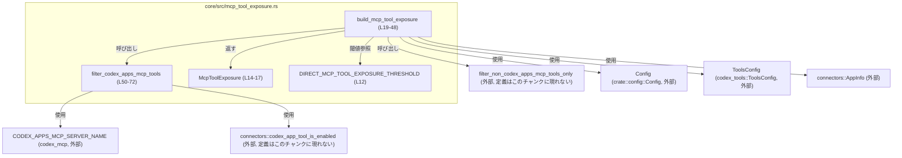
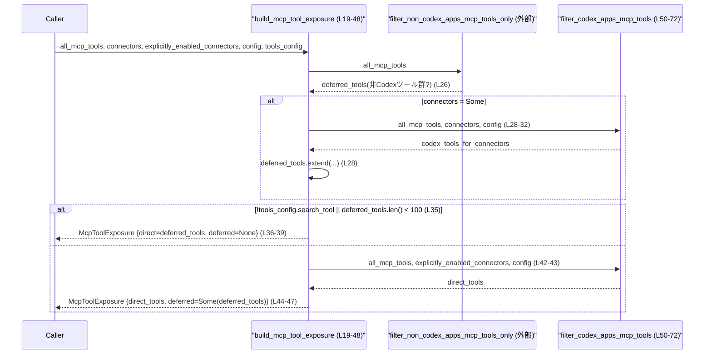
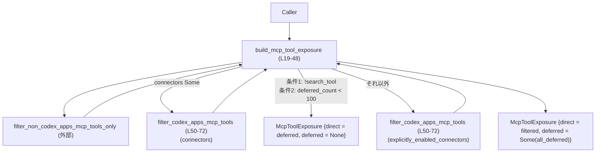

core/src/mcp_tool_exposure.rs

---

## 0. ざっくり一言

MCP ツール一覧から「直接公開するツール」と「遅延的に公開するツール」を振り分けるための、フィルタリング・仕分けロジックを提供するモジュールです（`build_mcp_tool_exposure` / `filter_codex_apps_mcp_tools` が中心、`core/src/mcp_tool_exposure.rs:L19-48,50-72`）。

---

## 1. このモジュールの役割

### 1.1 概要

- このモジュールは、すべての MCP ツール一覧とコネクタ情報を入力として、
  - 直接 UI 等から利用できる「direct_tools」
  - 必要に応じて検索等から利用する「deferred_tools」
  に分類した `McpToolExposure` 構造体を構築します（`core/src/mcp_tool_exposure.rs:L14-17,19-48`）。
- Codex Apps MCP サーバーに属するツールだけを取り出すフィルタ関数 `filter_codex_apps_mcp_tools` を内部ヘルパーとして定義し、コード共有しています（`core/src/mcp_tool_exposure.rs:L50-72`）。

### 1.2 アーキテクチャ内での位置づけ

外部コンポーネントとの依存関係を簡略化して図示します。



- `build_mcp_tool_exposure` が公開 API（crate 内）であり、他モジュールからこの関数を呼び出して `McpToolExposure` を得る構造になっています（`core/src/mcp_tool_exposure.rs:L19-48`）。
- Codex Apps 向けツールの絞り込みは `filter_codex_apps_mcp_tools` に集約し、2 箇所から呼び出されています（`core/src/mcp_tool_exposure.rs:L28-32,42-43,50-72`）。

### 1.3 設計上のポイント

コードから読み取れる特徴は次の通りです。

- **責務の分割**
  - ツールの公開ポリシー（direct/deferred の振り分け）は `build_mcp_tool_exposure` に集約（`core/src/mcp_tool_exposure.rs:L19-48`）。
  - 「Codex Apps MCP サーバーのツールだけを抽出する」ロジックは `filter_codex_apps_mcp_tools` として分離（`core/src/mcp_tool_exposure.rs:L50-72`）。
- **状態管理**
  - `McpToolExposure` は `HashMap<String, McpToolInfo>` を 2 つ保持するだけのシンプルなデータキャリアです（`core/src/mcp_tool_exposure.rs:L14-17`）。
  - 内部でミューテーブルなのは `build_mcp_tool_exposure` 内部のローカル変数 `deferred_tools` のみです（`core/src/mcp_tool_exposure.rs:L26,28`）。
- **エラーハンドリング方針**
  - すべての関数は `Result` を返さず、失敗を表現する分岐はありません。異常な入力（空マップなど）の場合も「空のマップを返す」など、通常の制御フローで扱われます。
- **安全性・並行性**
  - `unsafe` ブロックは使用されておらず、すべて safe Rust です。
  - `HashMap` を所有するシンプルな構造体のみであり、スレッド間共有や非同期処理に関するコードはこのチャンクには現れません。

---

## 2. 主要な機能一覧

### 2.1 コンポーネント一覧（構造体・関数・定数）

| 名前 | 種別 | 役割 / 用途 | 定義位置 |
|------|------|-------------|----------|
| `DIRECT_MCP_TOOL_EXPOSURE_THRESHOLD` | 定数 | deferred ツール数がこの閾値以上かどうかで direct/deferred 分離方針を切り替える（100） | `core/src/mcp_tool_exposure.rs:L12` |
| `McpToolExposure` | 構造体 | 直接公開するツールと、遅延公開するツールの 2 種類のマップをまとめるデータ構造 | `core/src/mcp_tool_exposure.rs:L14-17` |
| `build_mcp_tool_exposure` | 関数 | MCP ツール一覧とコネクタ情報から `McpToolExposure` を構築するメインエントリ | `core/src/mcp_tool_exposure.rs:L19-48` |
| `filter_codex_apps_mcp_tools` | 関数（内部） | Codex Apps MCP サーバー所属で、かつ許可されたコネクタに紐づく MCP ツールのみを抽出するフィルタ | `core/src/mcp_tool_exposure.rs:L50-72` |

### 2.2 機能の概要

- MCP ツール公開ポリシーの構築:
  - 入力ツール一覧を「direct」と「deferred」に振り分ける `McpToolExposure` の構築（`build_mcp_tool_exposure`）。
- Codex Apps MCP ツールのフィルタリング:
  - Codex Apps MCP サーバー (`CODEX_APPS_MCP_SERVER_NAME`) に属し、かつ許可されたコネクタ ID を持ち `codex_app_tool_is_enabled` が真になるツールだけを抽出（`filter_codex_apps_mcp_tools`）。

---

## 3. 公開 API と詳細解説

### 3.1 型一覧（構造体・定数）

| 名前 | 種別 | フィールド / 値 | 役割 / 用途 | 定義位置 |
|------|------|-----------------|-------------|----------|
| `DIRECT_MCP_TOOL_EXPOSURE_THRESHOLD` | 定数 (`usize`) | `100` | `deferred_tools` の件数がこの値以上なら direct/deferred を分離する。未満なら全ツールを direct 扱いとする。 | `core/src/mcp_tool_exposure.rs:L12` |
| `McpToolExposure` | 構造体 | `direct_tools: HashMap<String, McpToolInfo>` / `deferred_tools: Option<HashMap<String, McpToolInfo>>` | direct と deferred の 2 種類の MCP ツール集合を格納する構造体。`deferred_tools` が `None` のときは「全ツール direct」を意味する。 | `core/src/mcp_tool_exposure.rs:L14-17` |

#### `McpToolExposure` 詳細

- `direct_tools`  
  - 直接利用可能・優先的に露出する MCP ツール群（`core/src/mcp_tool_exposure.rs:L15`）。
- `deferred_tools`  
  - direct に乗らなかった「遅延公開」ツール群。`Some(map)` のときは direct 以外のツールがここに含まれる。`None` のときは direct にすべて含まれる設計です（`core/src/mcp_tool_exposure.rs:L16`）。

### 3.2 関数詳細

#### `build_mcp_tool_exposure(...) -> McpToolExposure`

```rust
pub(crate) fn build_mcp_tool_exposure(
    all_mcp_tools: &HashMap<String, McpToolInfo>,
    connectors: Option<&[connectors::AppInfo]>,
    explicitly_enabled_connectors: &[connectors::AppInfo],
    config: &Config,
    tools_config: &ToolsConfig,
) -> McpToolExposure
```

（`core/src/mcp_tool_exposure.rs:L19-25`）

**概要**

- すべての MCP ツール一覧とコネクタ情報・設定を入力として、`McpToolExposure` 構造体を構築します。
- ツール数が少ない場合や検索機能が無効な場合は「全ツールを direct」とし、ツール数が多い場合は「一部のみ direct / 残りは deferred」として返します（`core/src/mcp_tool_exposure.rs:L26-47`）。

**引数**

| 引数名 | 型 | 説明 |
|--------|----|------|
| `all_mcp_tools` | `&HashMap<String, McpToolInfo>` | 利用可能なすべての MCP ツール一覧。キーはツール名（と推測されるが、コードからは厳密な意味は不明）、値は `McpToolInfo`（`core/src/mcp_tool_exposure.rs:L20`）。 |
| `connectors` | `Option<&[connectors::AppInfo]>` | 利用可能なコネクタ（アプリ）一覧。`None` の場合、Codex Apps に紐づくツールは deferred に追加されません（`core/src/mcp_tool_exposure.rs:L21,27-33`）。 |
| `explicitly_enabled_connectors` | `&[connectors::AppInfo]` | 明示的に有効化されたコネクタ一覧。ツールが多い場合、ここに含まれるコネクタに紐づくツールだけが direct になります（`core/src/mcp_tool_exposure.rs:L22,42-43`）。 |
| `config` | `&Config` | アプリケーション全体の設定。Codex Apps ツールが有効かどうかの判定に利用されます（`core/src/mcp_tool_exposure.rs:L23,31-32,53`）。 |
| `tools_config` | `&ToolsConfig` | ツール関連設定。`search_tool` フラグを通じて、direct/deferred 分離方針に影響します（`core/src/mcp_tool_exposure.rs:L24,35`）。 |

**戻り値**

- `McpToolExposure`  
  - `direct_tools`: 直接公開する MCP ツール集合。  
  - `deferred_tools`: 遅延公開する MCP ツール集合。条件によって `None` または `Some(HashMap)` になります（`core/src/mcp_tool_exposure.rs:L36-47`）。

**内部処理の流れ**

1. `all_mcp_tools` から「Codex Apps 以外の MCP ツール」を抽出したマップを `deferred_tools` として初期化します（`filter_non_codex_apps_mcp_tools_only` 呼び出し、`core/src/mcp_tool_exposure.rs:L26`）。  
   - この関数の具体的なフィルタ条件はこのチャンクには現れませんが、戻り値が `HashMap<String, McpToolInfo>` であることは型推論から分かります（`core/src/mcp_tool_exposure.rs:L26,36-38`）。
2. `connectors` が `Some(connectors)` の場合、Codex Apps MCP ツールのうち、これらのコネクタに紐づき `config` によって有効とされているものを `filter_codex_apps_mcp_tools` で抽出し、`deferred_tools` に統合します（`core/src/mcp_tool_exposure.rs:L27-33`）。
3. `tools_config.search_tool` が `false` であるか、または `deferred_tools.len() < DIRECT_MCP_TOOL_EXPOSURE_THRESHOLD` の場合（ツール数が 100 未満）、すべての MCP ツールを direct 扱いとみなし、`deferred_tools: None` で返します（`core/src/mcp_tool_exposure.rs:L35-39`）。
4. 上記以外の場合（検索機能が有効で、かつ deferred ツールが 100 件以上ある場合）、`explicitly_enabled_connectors` を基に `filter_codex_apps_mcp_tools` を再度呼び出し、これに合致する Codex Apps MCP ツールを `direct_tools` として採用し、先ほどの `deferred_tools` 全体を `Some(deferred_tools)` として返します（`core/src/mcp_tool_exposure.rs:L42-47`）。

**処理フロー図（概要）**



**Examples（使用例）**

> 型定義がこのチャンクには現れないため、以下は概念的な例です（そのままではコンパイルできません）。

```rust
use std::collections::HashMap;
use core::mcp_tool_exposure::{build_mcp_tool_exposure, McpToolExposure};
use crate::connectors::AppInfo;
use codex_mcp::ToolInfo;

// all_mcp_tools, connectors, explicitly_enabled_connectors, config, tools_config は
// それぞれ別のモジュールで構築済みと仮定する。
fn setup_tools(
    all_mcp_tools: HashMap<String, ToolInfo>,
    connectors: Vec<AppInfo>,
    explicitly_enabled_connectors: Vec<AppInfo>,
    config: Config,
    tools_config: ToolsConfig,
) -> McpToolExposure {
    // Option<&[AppInfo]> 型に合わせる
    let connectors_opt = if connectors.is_empty() {
        None
    } else {
        Some(connectors.as_slice())
    };

    build_mcp_tool_exposure(
        &all_mcp_tools,
        connectors_opt.as_deref(),              // Option<&[AppInfo]> へ変換
        &explicitly_enabled_connectors,
        &config,
        &tools_config,
    )
}
```

**Errors / Panics**

- この関数自身は `Result` を返さず、`panic!` も使用していません（`core/src/mcp_tool_exposure.rs:L19-48`）。
- `HashMap` 操作（`extend`, `len`）はいずれも通常の safe 操作であり、標準ライブラリの仕様上、通常条件で panic することはありません。
- ただし、外部関数 `filter_non_codex_apps_mcp_tools_only` / `filter_codex_apps_mcp_tools` の内部で panic する可能性は、このチャンクからは分かりません。

**Edge cases（エッジケース）**

- `all_mcp_tools` が空:
  - `deferred_tools` は空の `HashMap` になり、その `len()` は 0 なので、閾値より小さい扱いとなり、`direct_tools` も空の `HashMap` で、`deferred_tools: None` が返ります（`core/src/mcp_tool_exposure.rs:L26,35-39`）。
- `connectors` が `None`:
  - Codex Apps MCP ツールは `deferred_tools` に追加されず、「Codex 以外の MCP ツール」のみが `deferred_tools` に含まれます（`core/src/mcp_tool_exposure.rs:L27-33`）。
- `tools_config.search_tool == false`:
  - deferred ツールの件数に関係なく、常に「全ツール direct」として扱い、`deferred_tools: None` が返ります（`core/src/mcp_tool_exposure.rs:L35-39`）。
- `deferred_tools.len() == DIRECT_MCP_TOOL_EXPOSURE_THRESHOLD`:
  - 条件は `<`（未満）で比較しているため、ちょうど閾値と等しい場合は「ツールが多い」扱いになり、direct/deferred 分離が行われます（`core/src/mcp_tool_exposure.rs:L35`）。

**使用上の注意点**

- `connectors` と `explicitly_enabled_connectors` の整合性:
  - `connectors` は「存在するコネクタ」、`explicitly_enabled_connectors` は「明示的に有効化されたコネクタ」という異なる役割を持っていると考えられますが、その関係はこのチャンクからは断定できません。
  - ただし、direct ツールは `explicitly_enabled_connectors` を基に決まるため（`core/src/mcp_tool_exposure.rs:L42-43`）、ここに漏れがあると direct に出てこないツールが発生します。
- 並行性:
  - 戻り値の `McpToolExposure` は `HashMap` を所有する通常の構造体であり、スレッド安全性は型パラメータの性質と、呼び出し側の共有方法に依存します。マルチスレッドで共有する場合は、`Arc` やロックなどを利用する設計になります（このチャンクには共有方法は現れません）。
- セキュリティ / アクセス制御:
  - 実際のアクセス制御は `connectors::codex_app_tool_is_enabled` や `filter_non_codex_apps_mcp_tools_only` の実装に依存しており、その詳細はこのチャンクには現れません。ツールの露出制御を強化したい場合は、そちらの実装を確認する必要があります。

---

#### `filter_codex_apps_mcp_tools(...) -> HashMap<String, McpToolInfo>`

```rust
fn filter_codex_apps_mcp_tools(
    mcp_tools: &HashMap<String, McpToolInfo>,
    connectors: &[connectors::AppInfo],
    config: &Config,
) -> HashMap<String, McpToolInfo>
```

（`core/src/mcp_tool_exposure.rs:L50-54`）

**概要**

- `mcp_tools` の中から、次の条件をすべて満たす MCP ツールだけを抽出します（`core/src/mcp_tool_exposure.rs:L60-70`）。
  1. `tool.server_name == CODEX_APPS_MCP_SERVER_NAME`
  2. `tool.connector_id` が `Some` である
  3. その `connector_id` が `connectors` 引数に含まれている
  4. `connectors::codex_app_tool_is_enabled(config, tool)` が真である

**引数**

| 引数名 | 型 | 説明 |
|--------|----|------|
| `mcp_tools` | `&HashMap<String, McpToolInfo>` | フィルタ対象となる MCP ツール一覧（`core/src/mcp_tool_exposure.rs:L51`）。 |
| `connectors` | `&[connectors::AppInfo]` | 許可されたコネクタ一覧。この配列中の `id` をもつツールだけが候補になります（`core/src/mcp_tool_exposure.rs:L52,55-58`）。 |
| `config` | `&Config` | 有効・無効判定で使用される設定。`codex_app_tool_is_enabled` に渡されます（`core/src/mcp_tool_exposure.rs:L53,69`）。 |

**戻り値**

- 条件に合致した MCP ツールのみを含む `HashMap<String, McpToolInfo>`（`core/src/mcp_tool_exposure.rs:L71-72`）。
- キーは元の `mcp_tools` のキー（`name.clone()`）、値も元の `McpToolInfo` のクローンです。

**内部処理の流れ**

1. `connectors` の各要素から `id` を取り出し、`&str` の `HashSet` にまとめます（`allowed` セット、`core/src/mcp_tool_exposure.rs:L55-58`）。
2. `mcp_tools` 全体を `iter()` で走査し、次の条件で `filter` します（`core/src/mcp_tool_exposure.rs:L60-70`）。
   - `tool.server_name == CODEX_APPS_MCP_SERVER_NAME` でなければ除外（`core/src/mcp_tool_exposure.rs:L63-64`）。
   - `tool.connector_id.as_deref()` が `Some(connector_id)` でなければ除外（`core/src/mcp_tool_exposure.rs:L66-67`）。
   - `allowed.contains(connector_id)` かつ `connectors::codex_app_tool_is_enabled(config, tool)` の両方が真である場合のみ採用（`core/src/mcp_tool_exposure.rs:L69`）。
3. 条件を満たしたエントリについて、キーと値を `clone` して新しい `HashMap` を `collect()` で構築します（`core/src/mcp_tool_exposure.rs:L71-72`）。

**Examples（使用例）**

> こちらも `McpToolInfo` や `AppInfo` の定義がこのチャンクには現れないため、擬似的な例です。

```rust
use std::collections::HashMap;
use core::mcp_tool_exposure::filter_codex_apps_mcp_tools;

fn extract_enabled_codex_tools(
    all_mcp_tools: &HashMap<String, McpToolInfo>,
    available_connectors: &[connectors::AppInfo],
    config: &Config,
) -> HashMap<String, McpToolInfo> {
    // Codex Apps サーバーに属し、かつ available_connectors に含まれる
    // コネクタに紐づいた有効なツールだけが返る
    filter_codex_apps_mcp_tools(all_mcp_tools, available_connectors, config)
}
```

**Errors / Panics**

- この関数は `Result` を返さず、`panic!` も使用しません。
- `HashSet` や `HashMap` の `collect` はメモリアロケーションに失敗すると panic しうる可能性がありますが、これは標準ライブラリ共通の挙動であり、この関数固有のものではありません。
- `connectors::codex_app_tool_is_enabled` の内部での挙動（panic の有無など）はこのチャンクからは分かりません。

**Edge cases（エッジケース）**

- `connectors` が空:
  - `allowed` セットが空となり、`allowed.contains(connector_id)` は常に false になるため、結果は空の `HashMap` です（`core/src/mcp_tool_exposure.rs:L55-59,69-72`）。
- `mcp_tools` が空:
  - そのまま空のマップが返ります。
- `tool.server_name != CODEX_APPS_MCP_SERVER_NAME` のツール:
  - すべて除外されます（`core/src/mcp_tool_exposure.rs:L63-64`）。
- `tool.connector_id` が `None` のツール:
  - `let Some(connector_id) = ... else { return false; };` により除外されます（`core/src/mcp_tool_exposure.rs:L66-67`）。
- `connector_id` が `connectors` に存在しないツール:
  - `allowed.contains(connector_id)` が false となり除外されます（`core/src/mcp_tool_exposure.rs:L55-58,69`）。

**使用上の注意点**

- `McpToolInfo` が `Clone` である前提:
  - 値を `tool.clone()` して新しいマップを作っているため（`core/src/mcp_tool_exposure.rs:L71`）、`McpToolInfo` の `Clone` 実装が重い場合はパフォーマンスに影響し得ます。
- フィルタ条件の追加・変更時は注意:
  - 現状、サーバー名・コネクタ ID・設定を使った有効判定の 3 つが条件となっています。条件を増やす／減らすと direct/deferred の境界が変わるため、呼び出し側との契約（どのツールが direct になり得るか）に影響します。

### 3.3 その他の関数

- このファイルには上記 2 関数以外の関数定義は存在しません。

---

## 4. データフロー

代表的なシナリオとして、「MCP ツール一覧から `McpToolExposure` を構築する」流れを示します。

1. 呼び出し側が `all_mcp_tools`, `connectors`, `explicitly_enabled_connectors`, `config`, `tools_config` を準備し、`build_mcp_tool_exposure` を呼び出す。
2. `build_mcp_tool_exposure` はまず「非 Codex Apps MCP ツール」を `deferred_tools` として初期化する（`filter_non_codex_apps_mcp_tools_only`）。
3. `connectors` が指定されていれば、Codex Apps MCP ツールのうち、利用可能なコネクタに紐づくものを `filter_codex_apps_mcp_tools` で抽出し、`deferred_tools` に追加。
4. ツール数と `tools_config.search_tool` に応じて、「全 direct」か「一部 direct / 残り deferred」かを判定し、`McpToolExposure` を返す。



- このフローでは、非 Codex ツール + Codex ツール（すべて）を `deferred_tools` 側にまず集約し、その後条件により direct/deferred の境界を決める設計になっている点が特徴です（`core/src/mcp_tool_exposure.rs:L26-47`）。

---

## 5. 使い方（How to Use）

### 5.1 基本的な使用方法

`build_mcp_tool_exposure` を呼び出して、direct/deferred に分けられた MCP ツール集合を取得するのが基本パターンです。

```rust
use std::collections::HashMap;
use core::mcp_tool_exposure::{build_mcp_tool_exposure, McpToolExposure};
use codex_mcp::ToolInfo as McpToolInfo;
use crate::connectors::AppInfo;

// 型定義は別モジュールにある前提
fn build_exposure_example(
    all_mcp_tools: HashMap<String, McpToolInfo>,
    all_connectors: Vec<AppInfo>,
    explicitly_enabled_connectors: Vec<AppInfo>,
    config: Config,
    tools_config: ToolsConfig,
) -> McpToolExposure {
    let connectors_opt = if all_connectors.is_empty() {
        None
    } else {
        Some(all_connectors.as_slice())
    };

    let exposure = build_mcp_tool_exposure(
        &all_mcp_tools,
        connectors_opt.as_deref(),          // Option<&[AppInfo]>
        &explicitly_enabled_connectors,
        &config,
        &tools_config,
    );

    // exposure.direct_tools / exposure.deferred_tools を使って UI や検索機能に接続する
    exposure
}
```

- 戻り値の `McpToolExposure` から、`direct_tools` と `deferred_tools` を見て UI や検索エンジンに渡すのが想定される使用方法です（契約の詳細はこのチャンクには現れません）。

### 5.2 よくある使用パターン

1. **ツール数が少ない環境での利用**
   - `all_mcp_tools` の件数が 100 未満（または `filter_non_codex_apps_mcp_tools_only` + Codex Apps 追加後）の場合、`deferred_tools` は `None` になり、すべて `direct_tools` 側に分布します（`core/src/mcp_tool_exposure.rs:L35-39`）。
   - 呼び出し側は「deferred があれば検索を使う／なければすべて直接」といった分岐が可能です。
2. **ツール数が多い環境での利用**
   - ツール数が多く、`tools_config.search_tool == true` の場合、明示的に有効化されたコネクタのツールのみを direct とし、その他は deferred として検索等に回す構成になります（`core/src/mcp_tool_exposure.rs:L35-47`）。

### 5.3 よくある誤用の可能性

- **`connectors` と `explicitly_enabled_connectors` の混同**

  ```rust
  // 誤りの例: すべてのコネクタを explicitly_enabled_connectors に渡してしまう
  let exposure = build_mcp_tool_exposure(
      &all_mcp_tools,
      Some(all_connectors.as_slice()),
      &all_connectors,         // ← 実際には「明示的に有効化された」ものだけを渡す想定と考えられる
      &config,
      &tools_config,
  );
  ```

  - この場合、ツール数が多いときでも「ほぼすべてのツールが direct」となり、deferred の意味が薄れます。
  - 設計意図はこのチャンクからは断定できませんが、名前からは意味を分ける想定がうかがえます。

- **`tools_config.search_tool` の設定忘れ**

  - `search_tool` が `false` のままだと、ツール数がいくら多くても direct/deferred の分離が行われません（`core/src/mcp_tool_exposure.rs:L35-39`）。

### 5.4 使用上の注意点（まとめ）

- **前提条件**
  - `mcp_tools` / `connectors` / `explicitly_enabled_connectors` の各集合が整合していること（同じ `connector_id` を共有していること）が暗黙の前提です。
- **エッジケースの扱い**
  - 空の入力や `None` の `connectors` は、例外ではなく「空の集合」や「Codex Apps ツールが deferred に入らない」挙動として処理されます。
- **スレッド安全性・並行性**
  - 本モジュールは同期コードのみで構成されており、非同期 I/O や共有状態はこのチャンクには現れません。
  - `McpToolExposure` を複数スレッドから共有する場合は、呼び出し側で適切な同期手段を選択する必要があります。
- **セキュリティ / アクセス制御**
  - 実際にどのツールがユーザに露出されるかは、`connectors::codex_app_tool_is_enabled` や `filter_non_codex_apps_mcp_tools_only` の実装に依存します。権限制御の要件がある場合は、それらの実装も合わせて確認する必要があります。
- **テスト観点**
  - 境界値（ちょうど 100 件のとき）、`tools_config.search_tool` の true/false、`connectors` の None/Some など、条件分岐が変わるケースごとにテストケースを用意するのが有効です。

---

## 6. 変更の仕方（How to Modify）

### 6.1 新しい機能を追加する場合

例: 「別の条件に基づいて direct/deferred を切り替えたい」ケース。

1. **判定ロジックの追加**
   - 閾値や `search_tool` 以外の条件で分岐したい場合、`build_mcp_tool_exposure` 内の `if` 条件（`core/src/mcp_tool_exposure.rs:L35`）を拡張するのが自然です。
2. **フィルタ条件の拡張**
   - Codex Apps MCP ツールの絞り込み条件を増やしたい場合、`filter_codex_apps_mcp_tools` の `filter` クロージャ内に条件を追加します（`core/src/mcp_tool_exposure.rs:L62-70`）。
3. **新たな公開ポリシー構造体の追加**
   - direct/deferred 以外のカテゴリが必要な場合は、`McpToolExposure` にフィールドを追加する、または別の構造体を定義して `build_mcp_tool_exposure` の戻り値を変更することが考えられますが、その場合は呼び出し側への影響が大きくなります。

### 6.2 既存の機能を変更する場合

- **影響範囲の確認**
  - `build_mcp_tool_exposure` は crate 内で広く使われている可能性があるため、その呼び出し箇所を検索してから変更する必要があります。このチャンクには呼び出し元は現れません。
- **契約上の注意**
  - `McpToolExposure` の意味（`deferred_tools == None のときは全 direct` など）は、呼び出し側の期待と一致しているはずなので、この前提を崩す変更は慎重に行う必要があります（`core/src/mcp_tool_exposure.rs:L35-39`）。
  - `filter_codex_apps_mcp_tools` の条件を変えると、「どのツールが direct 候補になるか」という契約が変わるため、ドキュメントやテストの更新が必要です。
- **テスト更新**
  - 条件分岐やフィルタ条件を変更した場合は、境界値テスト・条件組合せテストを見直し、期待される `direct_tools` / `deferred_tools` の内容を再確認する必要があります。

---

## 7. 関連ファイル

このモジュールと密接に関係する外部コンポーネント（このチャンクから参照が分かるもの）の一覧です。

| パス / シンボル | 役割 / 関係 |
|----------------|------------|
| `codex_mcp::ToolInfo` (`McpToolInfo` エイリアス) | MCP ツールのメタ情報を表す型。`McpToolExposure` の値型として利用されます（`core/src/mcp_tool_exposure.rs:L5,15-16,20,51`）。 |
| `codex_mcp::CODEX_APPS_MCP_SERVER_NAME` | Codex Apps MCP サーバーの識別子。Codex Apps 所属ツールの判定に利用されます（`core/src/mcp_tool_exposure.rs:L4,63-64`）。 |
| `codex_mcp::filter_non_codex_apps_mcp_tools_only` | 非 Codex Apps MCP ツールのみを抽出すると推測されるフィルタ関数。`deferred_tools` 初期化に利用されます（`core/src/mcp_tool_exposure.rs:L6,26`）。定義はこのチャンクには現れません。 |
| `codex_tools::ToolsConfig` | ツール関連の設定。`search_tool` フラグを通じて direct/deferred 分離条件に影響します（`core/src/mcp_tool_exposure.rs:L7,24,35`）。 |
| `crate::config::Config` | アプリケーション設定。Codex Apps ツールが有効かどうかの判断に使用されます（`core/src/mcp_tool_exposure.rs:L9,23,32,53,69`）。 |
| `crate::connectors` モジュール | `AppInfo` 型と `codex_app_tool_is_enabled` 関数を提供し、コネクタの情報と有効判定を担います（`core/src/mcp_tool_exposure.rs:L10,21-22,28,42,52,55,69`）。 |
| （テストコード） | このチャンクにはテストファイル・テスト関数は現れません。 |

このレポートに含まれない情報（各外部型・関数の詳細な定義、実際のテストコードなど）は、該当モジュールのソースを直接参照する必要があります。
