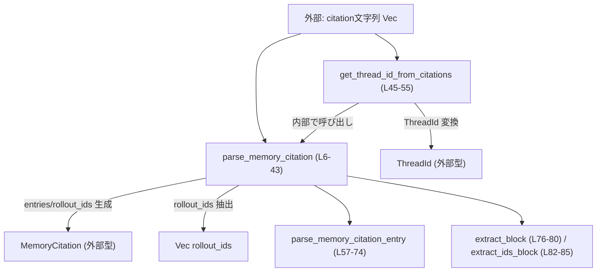
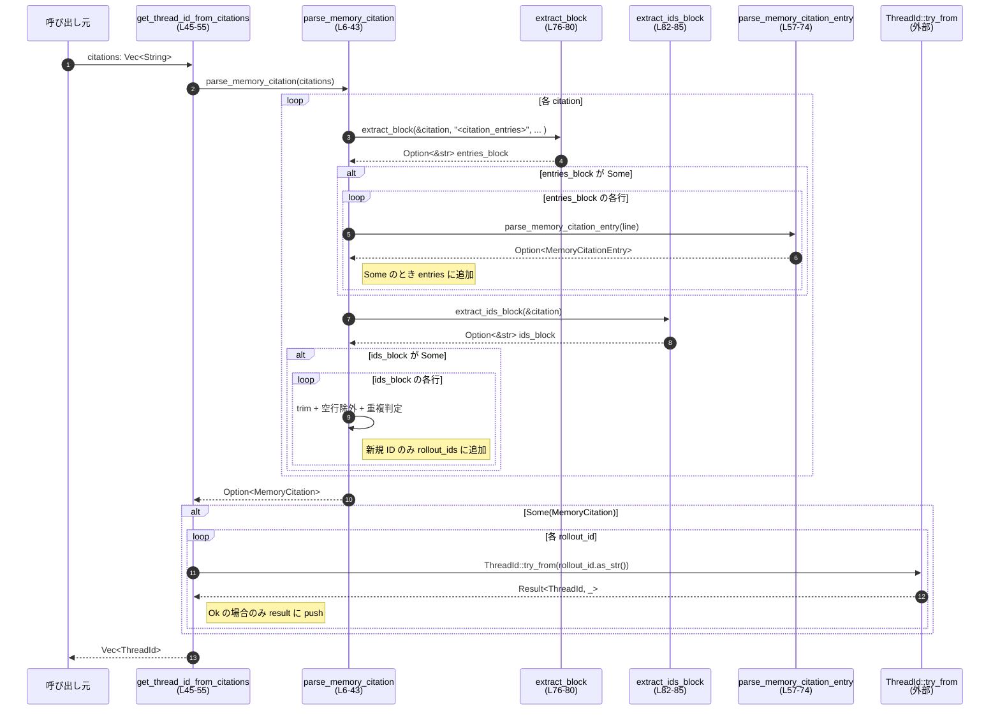

# core/src/memories/citations.rs

（行番号は、このスニペット内で 1 行目から付番しています）

---

## 0. ざっくり一言

`citations.rs` は、文字列として与えられた「メモリ引用情報（citations）」から:

- 構造化された `MemoryCitation`（ファイルパス・行範囲・メモ）  
- `ThreadId` の一覧  

を抽出するためのパーサーモジュールです。

---

## 1. このモジュールの役割

### 1.1 概要

- このモジュールは、`Vec<String>` 形式の citation テキストから `<citation_entries>` や `<rollout_ids>` / `<thread_ids>` で囲まれたブロックを抽出し、構造体に変換するために存在します。[citations.rs:L6-42][citations.rs:L82-85]
- 主な機能は:
  - 生テキスト → `MemoryCitation` への変換
  - 生テキスト → `Vec<ThreadId>` への変換  
 です。[citations.rs:L6-55]

### 1.2 アーキテクチャ内での位置づけ

このモジュールは、プロトコル層の型 (`ThreadId`, `MemoryCitation`, `MemoryCitationEntry`) を利用して、テキストから内部表現への変換を行う「変換ユーティリティ」として位置づけられます。



- `MemoryCitation` / `MemoryCitationEntry` / `ThreadId` は `codex_protocol` クレートからインポートされています。[citations.rs:L1-3]
- このファイルから他の内部モジュールへの依存は見られません。

### 1.3 設計上のポイント

- **責務の分割**
  - 全体のパース制御は `parse_memory_citation` に集中しており、1 行ごとの citation entry パースは `parse_memory_citation_entry` に分離されています。[citations.rs:L6-42][citations.rs:L57-74]
  - タグで囲まれたテキストブロックの抽出は汎用関数 `extract_block` に切り出され、`extract_ids_block` でタグ名の違いを吸収しています。[citations.rs:L76-85]
- **状態管理**
  - すべての状態（entries, rollout_ids, seen_rollout_ids 等）は関数ローカル変数として管理され、グローバル状態は使用していません。[citations.rs:L7-9][citations.rs:L46]
  - そのためスレッドセーフであり、並行に同じ関数を呼び出しても状態が競合することはありません。
- **エラーハンドリング**
  - 文字列パースの失敗は `Option` とイテレータの `filter_map` により「その行/ブロックをスキップする」形で扱われます。[citations.rs:L18][citations.rs:L63-72]
  - 無効な `ThreadId` は `ThreadId::try_from` の `Err` を無視することで、結果から静かに除外されます。[citations.rs:L49-51]
- **重複排除**
  - rollout/thread ID は `HashSet` により一意化され、重複 ID は 1 つにまとめられます。[citations.rs:L8-9][citations.rs:L28-30]

---

## 2. 主要な機能一覧（コンポーネントインベントリー付き）

### 2.1 機能の概要

- `parse_memory_citation`: citation テキスト群から `MemoryCitation` を構築する。
- `get_thread_id_from_citations`: citation テキスト群から `ThreadId` のリストを抽出する。
- `parse_memory_citation_entry`: 1 行の citation entry 文字列を `MemoryCitationEntry` に変換する。
- `extract_block`: 開始タグと終了タグで囲まれたテキストブロックを抽出する。
- `extract_ids_block`: rollout/thread ID ブロック `<rollout_ids>` or `<thread_ids>` を抽出する。

### 2.2 コンポーネントインベントリー（関数・モジュール）

| 名称 | 種別 | 公開 | 役割 / 用途 | 定義位置 |
|------|------|------|-------------|----------|
| `parse_memory_citation` | 関数 | `pub` | citation テキストから `MemoryCitation` を生成するメインパーサー | `citations.rs:L6-43` |
| `get_thread_id_from_citations` | 関数 | `pub` | citation テキストから `ThreadId` の一覧を生成するユーティリティ | `citations.rs:L45-55` |
| `parse_memory_citation_entry` | 関数 | `fn` | `<citation_entries>` 内の 1 行を `MemoryCitationEntry` に変換する | `citations.rs:L57-74` |
| `extract_block` | 関数 | `fn` | 任意の `open`/`close` タグで囲まれたテキストを抽出する | `citations.rs:L76-80` |
| `extract_ids_block` | 関数 | `fn` | `<rollout_ids>` または `<thread_ids>` ブロックを抽出するラッパー | `citations.rs:L82-85` |
| `tests` | モジュール | `mod`（`cfg(test)`） | このファイルに対応するテストコード（内容はこのチャンクには現れない） | `citations.rs:L87-89` |

---

## 3. 公開 API と詳細解説

### 3.1 型一覧（このモジュールが利用する主要型）

このファイル内で定義される構造体・列挙体はありませんが、外部クレート `codex_protocol` の型を公開 API で使用しています。

| 名前 | 種別 | 定義場所 | 役割 / 用途 | 使用箇所 |
|------|------|----------|-------------|----------|
| `MemoryCitation` | 構造体 | `codex_protocol::memory_citation` | citations 全体を表現する構造体。`entries` と `rollout_ids` フィールドが存在することがコードから読み取れます。 | 戻り値・フィールド構築で使用 [citations.rs:L6][citations.rs:L38-41] |
| `MemoryCitationEntry` | 構造体 | `codex_protocol::memory_citation` | 1 つの citation entry（ファイルパス・行範囲・note）を表現する構造体。`path`, `line_start`, `line_end`, `note` フィールドが存在します。 | 構築で使用 [citations.rs:L57][citations.rs:L68-73] |
| `ThreadId` | 構造体/型 | `codex_protocol` | スレッド ID を表す型。`try_from(&str)` による変換が提供されています。 | `get_thread_id_from_citations` の戻り値と変換で使用 [citations.rs:L1][citations.rs:L45-54] |

これらの型の詳細な定義内容は、このチャンクには現れません。

---

### 3.2 関数詳細

#### `parse_memory_citation(citations: Vec<String>) -> Option<MemoryCitation>`

**概要**

- 複数の citation テキストを走査し、`<citation_entries>` ブロックから `MemoryCitationEntry` のリスト、`<rollout_ids>` または `<thread_ids>` ブロックから ID のリストを抽出して `MemoryCitation` を生成します。[citations.rs:L6-42]
- 抽出結果が空（entries と rollout_ids がどちらも空）の場合は `None` を返します。[citations.rs:L35-37]

**引数**

| 引数名 | 型 | 説明 |
|--------|----|------|
| `citations` | `Vec<String>` | メモリ引用情報を含む複数の文字列。各要素内に `<citation_entries>` や `<rollout_ids>` / `<thread_ids>` ブロックが含まれていることが想定されています。[citations.rs:L6][citations.rs:L11] |

**戻り値**

- `Option<MemoryCitation>`  
  - entries または rollout_ids が 1 つ以上見つかった場合: それらを含む `MemoryCitation` を `Some` で返します。[citations.rs:L38-41]
  - どちらも見つからなかった場合: `None` を返します。[citations.rs:L35-37]

**内部処理の流れ（アルゴリズム）**

1. `entries`（`Vec<MemoryCitationEntry>`）、`rollout_ids`（`Vec<String>`）、`seen_rollout_ids`（`HashSet<String>`）を空で初期化します。[citations.rs:L7-9]
2. 引数 `citations` の各 `String` についてループします。[citations.rs:L11]
3. 各 `citation` から `<citation_entries> ... </citation_entries>` ブロックを `extract_block` で抽出します。[citations.rs:L12-14]
   - ブロックが見つかれば、そのブロックを行単位に分割し、各行を `parse_memory_citation_entry` でパースし、`entries` に追加します（パース失敗行は自動的にスキップされます）。[citations.rs:L15-19]
4. 同じ `citation` から ID ブロックを `extract_ids_block` で抽出します。[citations.rs:L22]
   - ブロックが見つかれば、行ごとに:
     - `trim` で前後空白を除去し、空行を除外します。[citations.rs:L23-27]
     - 文字列を `seen_rollout_ids` に挿入し、まだ存在しなかった場合にのみ `rollout_ids` に追加します。これにより重複 ID が排除されます。[citations.rs:L28-30]
5. 全ての `citation` を処理した後、`entries` と `rollout_ids` が両方とも空であれば `None` を返し、そうでなければ `MemoryCitation { entries, rollout_ids }` を `Some` で返します。[citations.rs:L35-42]

**Examples（使用例）**

以下は、1 つの citation テキストから `MemoryCitation` を生成する例です。

```rust
use codex_protocol::memory_citation::MemoryCitation;                 // MemoryCitation 型をインポート
use core::memories::citations::parse_memory_citation;                // 対象関数をインポート

fn example() -> Option<MemoryCitation> {                              // MemoryCitation を返す例示関数
    let citation_text = r#"
<citation_entries>
src/lib.rs:10-20|note=[initial implementation]
</citation_entries>
<rollout_ids>
abc123
abc123  // 重複は除外される
def456
</rollout_ids>
"#.to_string();                                                        // citation テキストを 1 つの String にする

    let citations = vec![citation_text];                              // Vec<String> に詰める
    let result = parse_memory_citation(citations);                    // パースを実行

    result                                                            // Some(MemoryCitation) か None を返す
}
```

この例では:

- `entries` に 1 件の `MemoryCitationEntry` が入り、
- `rollout_ids` には重複排除された `"abc123"`, `"def456"` の 2 件が入ることがコードから読み取れます。

**Errors / Panics**

- この関数自体は `Result` を返さず、パース失敗を `Option` や要素スキップで表現します。
  - `<citation_entries>` ブロックが存在しない場合、その citation から entries は追加されません。[citations.rs:L12-20]
  - 各行のパース失敗は `parse_memory_citation_entry` 側で `None` となり、`filter_map` によりその行が無視されます。[citations.rs:L18][citations.rs:L63-72]
  - `<rollout_ids>` / `<thread_ids>` ブロックがない場合、その citation から ID は追加されません。[citations.rs:L22-32]
- 明示的な `panic!` 呼び出しはありません。
- `split_once` や `parse::<u32>()` などで失敗した場合も `?` や `.ok()?` により `None` を返し、呼び出し元に伝搬されます。[citations.rs:L63-72]
  - ただし、これらは `parse_memory_citation_entry` 内での話であり、本関数内では `filter_map` によって「その行を無視する」挙動になります。

**Edge cases（エッジケース）**

- `citations` が空の `Vec` の場合: ループが 1 度も実行されず、`entries` と `rollout_ids` は空のままなので `None` が返ります。[citations.rs:L11-37]
- すべての citation に `<citation_entries>` / `<rollout_ids>` / `<thread_ids>` が含まれない場合: 同上で `None` になります。
- `<citation_entries>` はあるが、全行がパース失敗する場合: `entries` は空になりますが、`rollout_ids` に何か入っていれば `Some(MemoryCitation)` が返ります。[citations.rs:L35-41]
- rollout/thread ID 行に空白のみが含まれる場合: `trim` 後に空文字となり、`filter(|line| !line.is_empty())` により無視されます。[citations.rs:L23-27]
- 同じ ID が複数回出現する場合: `seen_rollout_ids.insert` による判定で 1 度だけ `rollout_ids` に追加されます。[citations.rs:L28-30]

**使用上の注意点**

- 入力フォーマットの前提:
  - `<citation_entries> ... </citation_entries>` ブロック内の各行は `parse_memory_citation_entry` が解釈可能な形式である必要があります。
  - ID ブロックは `<rollout_ids>` または `<thread_ids>` のどちらか、もしくは両方のタグ名を利用できます。[citations.rs:L82-85]
- パース失敗は「静かに無視」されます。
  - 間違った形式の行や ID はエラーにはならず、結果から消えるだけです。そのため、すべての情報が必ず反映されることを前提にするのは安全ではありません。
- スレッド安全性:
  - すべての状態は関数ローカルの所有データ (`Vec`, `HashSet`) であり、共有可変状態はありません。複数スレッドから同時に呼び出してもデータ競合は発生しません。

---

#### `get_thread_id_from_citations(citations: Vec<String>) -> Vec<ThreadId>`

**概要**

- `parse_memory_citation` を内部で呼び出し、そこから得られる `rollout_ids` を `ThreadId` に変換して返すユーティリティ関数です。[citations.rs:L45-54]
- 変換に失敗した ID は結果から静かに除外されます。[citations.rs:L49-51]

**引数**

| 引数名 | 型 | 説明 |
|--------|----|------|
| `citations` | `Vec<String>` | スレッド ID / rollout ID を含む可能性のある citation テキスト群。[citations.rs:L45] |

**戻り値**

- `Vec<ThreadId>`  
  - 有効な ID 文字列から変換された `ThreadId` のみを含むベクタ。順序は `parse_memory_citation` によって生成された `rollout_ids` の順序を維持します。[citations.rs:L48-54]
  - citation から有効な ID が 1 つも取得できなかった場合は空のベクタを返します。

**内部処理の流れ（アルゴリズム）**

1. 空の `result: Vec<ThreadId>` を初期化します。[citations.rs:L46]
2. `parse_memory_citation` を呼び出し、`MemoryCitation` を取得できた場合のみ処理を続行します。[citations.rs:L47]
3. `memory_citation.rollout_ids` を 1 つずつ取り出し、`ThreadId::try_from(&str)` で変換を試みます。[citations.rs:L48-49]
4. 変換に成功 (`Ok(thread_id)`) した場合のみ `result` に追加します。[citations.rs:L49-51]
5. 最終的な `result` を返します。[citations.rs:L54]

**Examples（使用例）**

```rust
use codex_protocol::ThreadId;                                          // ThreadId 型をインポート
use core::memories::citations::get_thread_id_from_citations;          // 対象関数をインポート

fn example_thread_ids() -> Vec<ThreadId> {                             // ThreadId の一覧を返す例示関数
    let citation_text = r#"
<thread_ids>
thread-1
invalid-id
thread-2
</thread_ids>
"#.to_string();                                                         // thread_ids ブロックを含む文字列

    let citations = vec![citation_text];                               // Vec<String> にする
    let thread_ids = get_thread_id_from_citations(citations);          // ThreadId のベクタを取得

    thread_ids                                                         // 有効な ID だけが含まれる
}
```

この例では:

- `"thread-1"` と `"thread-2"` の形式が `ThreadId::try_from` にとって有効であれば 2 要素のベクタになります。
- `"invalid-id"` が無効な形式であれば結果ベクタには含まれません。

**Errors / Panics**

- 関数自体は常に `Vec<ThreadId>` を返し、エラー用の戻り値はありません。
- `parse_memory_citation` が `None` を返した場合でも、それを検出して空ベクタを返すだけです。[citations.rs:L47-54]
- `ThreadId::try_from` が `Err` を返しても、その ID は無視されるのみでパニックは起きません。[citations.rs:L49-51]
  - `try_from` 内部の挙動はこのチャンクには現れません。

**Edge cases（エッジケース）**

- `citations` が空、または `parse_memory_citation` が `None` を返す場合: 空の `Vec<ThreadId>` が返ります。[citations.rs:L47-55]
- すべての ID が `ThreadId::try_from` で失敗する場合: 同じく空の `Vec<ThreadId>` になります。
- 一部の ID のみが有効な場合: 有効なものだけが保持され、無効なものは静かに削除されます。

**使用上の注意点**

- エラーを検知したい場合には、この関数だけでは「どの ID が無効だったか」を知ることはできません。
  - 必要であれば、ID 文字列レベルでの検証やログ出力を別途実装する必要があります。
- `ThreadId::try_from` の仕様に依存しており、この仕様変更（受け付けるフォーマットの変更など）は結果に影響します。

---

#### `parse_memory_citation_entry(line: &str) -> Option<MemoryCitationEntry>`

**概要**

- `<citation_entries>` ブロック内の 1 行をパースして `MemoryCitationEntry` に変換する関数です。[citations.rs:L57-74]
- 行のフォーマットが期待どおりでない場合は `None` を返し、その行は無視されます。

**引数**

| 引数名 | 型 | 説明 |
|--------|----|------|
| `line` | `&str` | 1 行分の citation entry テキスト。`path:line_start-line_end\|note=[note text]` の形式が想定されています。[citations.rs:L57][citations.rs:L63-66] |

**戻り値**

- `Option<MemoryCitationEntry>`  
  - 期待するフォーマットにしたがって正常にパースできた場合: `Some(MemoryCitationEntry)` を返します。[citations.rs:L68-73]
  - それ以外の場合: `None` を返します。[citations.rs:L59-63][citations.rs:L70-71]

**内部処理の流れ（アルゴリズム）**

1. `line.trim()` を行い、前後の空白を取り除きます。[citations.rs:L58]
2. 空行（長さ 0）の場合は `None` を返します。[citations.rs:L59-60]
3. 右側から `|note=[` を探して `rsplit_once` し、それ以前を `location`、それ以降を `note` 部分として分割します。[citations.rs:L63]
   - `|note=[` が見つからなければ `None` になります。
4. `note` 末尾から `]` を `strip_suffix` で削除し、トリムして `String` に変換します。[citations.rs:L64]
   - `]` が末尾になければ `None` になります。
5. `location` 部分を右側から `:` で分割し、前半を `path`、後半を `line_range` として扱います。[citations.rs:L65]
   - `:` が見つからなければ `None` になります。
6. `line_range` を `-` で分割し、`line_start`, `line_end` を得ます。[citations.rs:L66]
   - `-` が見つからなければ `None` になります。
7. `line_start` と `line_end` を `trim` した上で `parse()` し、数値型に変換します。[citations.rs:L70-71]
   - 変換に失敗すると `.ok()?` により `None` が返ります。
8. 上記で得られた `path`, `line_start`, `line_end`, `note` を用いて `MemoryCitationEntry` を生成し、`Some` で返します。[citations.rs:L68-73]

**Examples（使用例）**

```rust
use codex_protocol::memory_citation::MemoryCitationEntry;             // MemoryCitationEntry 型をインポート
use core::memories::citations::parse_memory_citation_entry;          // 対象関数をインポート

fn example_entry() -> Option<MemoryCitationEntry> {                   // 1 行のエントリをパースする例
    let line = "src/lib.rs:10-20|note=[initial implementation]";      // 期待される形式の文字列
    let entry = parse_memory_citation_entry(line);                    // パースを実行
    entry                                                             // Some(MemoryCitationEntry) か None
}
```

**Errors / Panics**

- フォーマットに関するすべてのエラーは `Option` を通じて `None` として扱われます。
  - 必須の区切り文字列が見つからない場合（`|note=[`, `]`, `:`, `-`）は `None` を返します。[citations.rs:L63-66]
  - 行番号のパースに失敗した場合も `.ok()?` により `None` を返します。[citations.rs:L70-71]
- `panic!` は使用していません。  
  メモリ確保失敗などのランタイムレベルのエラーは Rust ランタイム依存であり、このファイルからは読み取れません。

**Edge cases（エッジケース）**

- 入力が空行または空白のみ: `line.is_empty()` により即座に `None` を返します。[citations.rs:L58-60]
- `|note=[` を含まない行: `rsplit_once` が `None` を返し、関数全体が `None` になります。[citations.rs:L63]
- note 部分の末尾に `]` がない: `strip_suffix(']')` が `None` を返し、関数が `None` になります。[citations.rs:L64]
- `path` 部分に `:` が全く含まれない: `rsplit_once(':')` が失敗し、`None` になります。[citations.rs:L65]
- `line_range` に `-` が含まれない: `split_once('-')` が失敗し、`None` になります。[citations.rs:L66]
- 行番号が整数にパースできない（例: `"start-end"`）: `.parse().ok()?` が失敗し、`None` になります。[citations.rs:L70-71]
- `path` に `:` や `-` が含まれている場合:
  - `rsplit_once` / `split_once` は「最後の 1 つ」だけで分割するため、`path` に含まれる追加の `:` はそのまま `path` に残ります。
  - この仕様が意図されたものかどうかはコードだけでは断定できませんが、Windows パス（`C:\...` など）にも対応しやすい形式と言えます。

**使用上の注意点**

- この関数は外部から直接 `pub` では公開されていませんが、`parse_memory_citation` の挙動を理解する上で重要です。
- エラー原因の詳細は返さず、単に `None` になります。そのため、「どの形式が誤っていたか」を知るにはテストやログなど別の仕組みが必要になります。

---

### 3.3 その他の関数

| 関数名 | 役割（1 行） | 定義位置 |
|--------|--------------|----------|
| `extract_block(text: &str, open: &str, close: &str) -> Option<&str>` | `open` と `close` 文字列で囲まれた最初のブロックの中身を返すユーティリティ関数。`split_once` を使って前方から最初のペアのみを対象にします。 | `citations.rs:L76-80` |
| `extract_ids_block(text: &str) -> Option<&str>` | `extract_block` を使って `<rollout_ids> ... </rollout_ids>` または `<thread_ids> ... </thread_ids>` のどちらか最初に見つかったものを返します。 | `citations.rs:L82-85` |

---

## 4. データフロー

### 4.1 代表的なシナリオ

「citation 文字列から `ThreadId` を取得する」シナリオのデータフローです。

1. 呼び出し元が citation テキストの `Vec<String>` を用意し、`get_thread_id_from_citations` を呼び出します。[citations.rs:L45-47]
2. `get_thread_id_from_citations` は `parse_memory_citation` を呼び出し、`MemoryCitation` を取得しようとします。[citations.rs:L47]
3. `parse_memory_citation` は各 citation から:
   - `<citation_entries>` ブロックを `extract_block` で取り出し、行ごとに `parse_memory_citation_entry` に渡して `entries` を構築します。[citations.rs:L12-20][citations.rs:L57-74]
   - `<rollout_ids>` または `<thread_ids>` ブロックを `extract_ids_block` で取り出し、重複を排除しながら `rollout_ids` を構築します。[citations.rs:L22-32][citations.rs:L82-85]
4. `get_thread_id_from_citations` は得られた `rollout_ids` を 1 つずつ `ThreadId::try_from` に渡して `ThreadId` 型へ変換し、成功したものだけをベクタに詰めて返します。[citations.rs:L48-54]

### 4.2 シーケンス図



---

## 5. 使い方（How to Use）

### 5.1 基本的な使用方法

「citation 文字列から `MemoryCitation` と `ThreadId` を取得する」基本フローです。

```rust
use codex_protocol::{ThreadId};                                         // ThreadId 型をインポート
use codex_protocol::memory_citation::MemoryCitation;                    // MemoryCitation 型をインポート
use core::memories::citations::{                                        // 対象モジュールの関数をインポート
    parse_memory_citation,
    get_thread_id_from_citations,
};

fn main() {                                                             // エントリポイント
    // citation テキストを用意する
    let citation_text = r#"
<citation_entries>
src/lib.rs:10-20|note=[initial implementation]
src/lib.rs:30-35|note=[refinement]
</citation_entries>
<rollout_ids>
thread-1
thread-2
</rollout_ids>
"#.to_string();

    let citations = vec![citation_text];                                // Vec<String> に変換

    // MemoryCitation を取得する
    let maybe_citation: Option<MemoryCitation> =
        parse_memory_citation(citations.clone());                       // クローンして再利用

    // ThreadId を取得する
    let thread_ids: Vec<ThreadId> =
        get_thread_id_from_citations(citations);                        // ThreadId のベクタを取得

    // 結果の利用（ここでは単にデバッグ出力）
    println!("memory_citation: {:?}", maybe_citation);                  // Debug 実装がある前提
    println!("thread_ids: {:?}", thread_ids);                           // ThreadId の一覧を表示
}
```

### 5.2 よくある使用パターン

1. **ThreadId だけ欲しい場合**

   - `get_thread_id_from_citations` だけを使用し、`MemoryCitation` は生成しない。[citations.rs:L45-55]

2. **entries 情報（ファイルパス・行範囲・note）が欲しい場合**

   - `parse_memory_citation` の結果（`MemoryCitation`）から `entries` フィールドを利用する。[citations.rs:L38-41]
   - `rollout_ids` は無視してもよい。

3. **整形検証を兼ねて使う場合**

   - `parse_memory_citation` の戻り値が `None` の場合を「フォーマット不正または対象情報なし」とみなす。
   - 詳細なエラー区別が不要な用途（ログの付加情報など）に適しています。

### 5.3 よくある間違い

```rust
use core::memories::citations::get_thread_id_from_citations;

// 間違い例: citation テキスト全体を 1 行にしてしまう
let bad_citation = "<thread_ids>thread-1\nthread-2</thread_ids>".to_string();
// Vec<String> にするが、改行を適切に入れないと lines() で期待通りに分割されない可能性がある
let thread_ids = get_thread_id_from_citations(vec![bad_citation]);

// 正しい例: 改行を含むブロックとして記述する
let good_citation = r#"
<thread_ids>
thread-1
thread-2
</thread_ids>
"#.to_string();
let thread_ids = get_thread_id_from_citations(vec![good_citation]);
```

- `lines()` ベースで処理しているため、行単位の構造を想定していることに注意が必要です。[citations.rs:L17-18][citations.rs:L23-24]

### 5.4 使用上の注意点（まとめ）

- **フォーマット依存性**
  - `<citation_entries>` / `<rollout_ids>` / `<thread_ids>` といったタグ名や、`path:line_start-line_end|note=[...]` 形式に強く依存しています。
- **エラー検知の粒度**
  - 間違った形式の行や ID は黙って無視されるため、デバッグが難しくなる可能性があります。
  - 必要に応じて、呼び出し側で生テキストを検証したり、ログを追加するなどの対策を検討する余地があります。
- **並行性**
  - このモジュールは pure に近い文字列処理であり、共有可変状態や I/O は使用していません。
  - マルチスレッド環境でも安全に並行利用できます。

---

## 6. 変更の仕方（How to Modify）

### 6.1 新しい機能を追加する場合

- 例: citation entry に新しいフィールドを追加したい場合
  1. `MemoryCitationEntry` 型（`codex_protocol` 側）にフィールドを追加する必要があります（このファイルには定義がありません）。
  2. このモジュールでは `parse_memory_citation_entry` 内で新フィールドのパース処理を追加し、`MemoryCitationEntry` 構築時にそのフィールドを設定します。[citations.rs:L68-73]
  3. `<citation_entries>` の行フォーマットを変更したら、それに合わせてパースロジックとテスト（`citations_tests.rs`）も更新する必要があります。[citations.rs:L63-66][citations.rs:L87-89]

- 例: 別種の ID タグ（`<session_ids>` 等）を扱いたい場合
  1. `extract_ids_block` に新タグを追加し、`or_else` チェーンに組み込むのが自然です。[citations.rs:L82-85]
  2. 既存の挙動（前に見つかったタグを優先する）を維持するかどうかは要件に依存します。

### 6.2 既存の機能を変更する場合

- 影響範囲の確認:
  - `parse_memory_citation` と `get_thread_id_from_citations` はこのモジュールの公開 API なので、署名や戻り値の意味を変える場合は広範な影響が出る可能性があります。[citations.rs:L6-7][citations.rs:L45-46]
- 契約（前提条件・返り値の意味）として重要な点:
  - `parse_memory_citation` が `None` を返す条件（entries と rollout_ids の両方が空）が変わると、呼び出し側の「情報なし」判定ロジックに影響します。[citations.rs:L35-37]
  - `get_thread_id_from_citations` が無効な ID を無視する挙動を変えると、既存コードが期待する「安全なフィルタリング」が失われる可能性があります。[citations.rs:L49-51]
- テストの確認:
  - このファイルには `#[path = "citations_tests.rs"]` によるテストモジュールが存在するため、変更後は当該テストファイルを実行し、期待どおりに動作するか確認する必要があります。[citations.rs:L87-89]
  - テストの具体的な内容はこのチャンクには現れません。

---

## 7. 関連ファイル

| パス | 役割 / 関係 |
|------|------------|
| `core/src/memories/citations.rs` | 本レポートの対象ファイル。citation テキストから `MemoryCitation` および `ThreadId` を抽出するユーティリティを提供します。 |
| `core/src/memories/citations_tests.rs` | `#[path = "citations_tests.rs"]` 属性で参照されるテストコード。`citations.rs` の動作検証を行うと推測されますが、内容はこのチャンクには現れません。[citations.rs:L87-89] |
| `codex_protocol::memory_citation`（外部クレート） | `MemoryCitation` および `MemoryCitationEntry` 型を定義しているモジュールです。[citations.rs:L2-3] |
| `codex_protocol::ThreadId`（外部クレート） | スレッド ID を表す型。`try_from(&str)` による文字列からの変換機能が提供されています。[citations.rs:L1][citations.rs:L49] |

---

### Bugs / Security / Contracts の補足（コードから読み取れる範囲）

- **潜在的なバグ要因**
  - 期待フォーマットから外れた行は黙って無視されるため、「入力がおかしい」ことが気づきにくい可能性があります。
  - 複数の `<citation_entries>` ブロック／ID ブロックが 1 つの `citation` に含まれる場合、`split_once` を使用しているため「最初の 1 組」だけが対象になります。[citations.rs:L77-78]  
    これが仕様かどうかは、このチャンクからは判断できません。
- **セキュリティ上の観点**
  - このモジュール自体は文字列を構造体に変換するだけで、副作用（ファイル I/O やコマンド実行など）はありません。
  - ただし、`path` や `note` は外部入力がそのまま保持されるため、後続処理（ログ表示・UI 表示など）においてはエスケープやサニタイズが必要になる場合があります。
- **契約（Contracts）**
  - 入力文字列に対する事実上の契約は、`parse_memory_citation_entry` で述べたフォーマット制約です。[citations.rs:L63-66]
  - `parse_memory_citation` は「役に立つ情報が一切ない場合には `None` を返す」という契約を持っています。[citations.rs:L35-37]

以上が、`core/src/memories/citations.rs` の構造と挙動の整理です。
