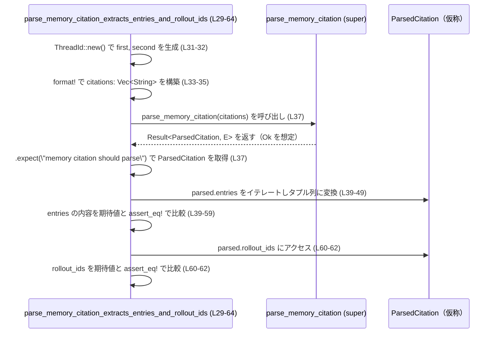

# core/src/memories/citations_tests.rs

## 0. ざっくり一言

`super` モジュールにある `get_thread_id_from_citations` と `parse_memory_citation` が、メモリ引用文字列からスレッド ID やロールアウト ID・引用エントリを正しく抽出できているかを検証するテストモジュールです（citations_tests.rs:L1-3, L6-64）。

---

## 1. このモジュールの役割

### 1.1 概要

- このモジュールは、文字列で表現された `<memory_citation>` / `<citation_entries>` / `<thread_ids>` / `<rollout_ids>` 形式のマークアップから、  
  - 有効な `ThreadId` を抽出する処理（`get_thread_id_from_citations`）  
  - 引用エントリとロールアウト ID 群を構造化して返す処理（`parse_memory_citation`）  
  が想定通りに動くことをテストします（citations_tests.rs:L6-16, L18-27, L29-64）。
- テストから読み取れる範囲で、パーサが
  - 無効な ID 文字列を無視すること（citations_tests.rs:L11-15）
  - 旧形式の `<rollout_ids>` タグもサポートすること（citations_tests.rs:L18-27）
  - `rollout_ids` の重複を除外していること（citations_tests.rs:L33-35, L60-62）
  を確認しています。

### 1.2 アーキテクチャ内での位置づけ

このファイルは **テストモジュール** であり、実装は親モジュール（`super`）側にあります（citations_tests.rs:L1-2）。

```mermaid
graph TD
    subgraph 親モジュール（super, 実装はこのチャンクには現れない）
        A[get_thread_id_from_citations]
        B[parse_memory_citation]
    end

    subgraph テストモジュール core/src/memories/citations_tests.rs
        T1[get_thread_id_from_citations_extracts_thread_ids (L6-16)]
        T2[get_thread_id_from_citations_supports_legacy_rollout_ids (L18-27)]
        T3[parse_memory_citation_extracts_entries_and_rollout_ids (L29-64)]
    end

    ext1[ThreadId (codex_protocol)\n(L3, L8-9, L20, L31-32)]
    ext2[assert_eq! (pretty_assertions)\n(L4, L15, L26, L39-59, L60-63)]

    T1 --> A
    T2 --> A
    T3 --> B

    T1 --> ext1
    T2 --> ext1
    T3 --> ext1

    T1 --> ext2
    T2 --> ext2
    T3 --> ext2
```

親モジュール内の具体的なファイル名（例: `citations.rs` など）は、このチャンクには現れず不明です。

### 1.3 設計上のポイント

- **役割の分離**
  - このファイルは純粋にテストのみを含み、ビジネスロジックや状態は持ちません（citations_tests.rs:L6-64）。
- **外部型と関数への依存**
  - `ThreadId` 型は `codex_protocol` クレートからインポートされています（citations_tests.rs:L3）。
  - テスト対象の関数 `get_thread_id_from_citations` と `parse_memory_citation` は親モジュールからインポートされています（citations_tests.rs:L1-2）。
- **エラーハンドリング方針**
  - `get_thread_id_from_citations` は `Vec<ThreadId>` を直接返し、パース失敗時にもエラーではなく「無視」する挙動がテストから読み取れます（citations_tests.rs:L11-16）。
  - `parse_memory_citation` は `Result` を返し、テストでは `.expect` で成功を前提とした検証をしています（citations_tests.rs:L37）。
- **並行性**
  - このファイル内で `async` やスレッド、`Send`/`Sync` などの並行性に関するコードは一切使われていません（citations_tests.rs:L1-64）。

---

## 2. 主要な機能一覧

このモジュールがテストしている主な機能は次のとおりです。

- `get_thread_id_from_citations`:
  - `<thread_ids>` タグ内の有効な `ThreadId` だけを抽出し、無効な文字列（`not-a-uuid`）は無視する（citations_tests.rs:L6-16）。
  - `<rollout_ids>` タグを用いた旧形式の ID 指定にも対応する（citations_tests.rs:L18-27）。
- `parse_memory_citation`:
  - `<citation_entries>` タグ内の行から、ファイルパス・行範囲・ノートをエントリとして抽出する（citations_tests.rs:L33-35, L39-59）。
  - `<rollout_ids>` タグ内の ID 文字列から、重複を除いたロールアウト ID の一覧を構築する（citations_tests.rs:L33-35, L60-62）。

### コンポーネント一覧（このチャンクに現れるもの）

| 名前 | 種別 | 役割 / 用途 | 行範囲 | 根拠 |
|------|------|------------|--------|------|
| `get_thread_id_from_citations` | 関数（親モジュール） | メモリ citation 文字列群から `ThreadId` の一覧を抽出する | 呼び出し: L15, L26 | citations_tests.rs:L1, L15-16, L22-26 |
| `parse_memory_citation` | 関数（親モジュール） | メモリ citation 文字列群をパースし、引用エントリとロールアウト ID 群を構造化して返す | 呼び出し: L37 | citations_tests.rs:L2, L33-37 |
| `ThreadId` | 構造体（外部クレート） | スレッド ID を表す型。テストデータとして生成され、文字列中に埋め込まれる | L3, L8-9, L20, L31-32 | citations_tests.rs:L3, L8-9, L20, L31-32 |
| `get_thread_id_from_citations_extracts_thread_ids` | 関数（テスト） | `<thread_ids>` ブロックから有効な `ThreadId` だけが抽出されることを検証 | L6-16 | citations_tests.rs:L6-16 |
| `get_thread_id_from_citations_supports_legacy_rollout_ids` | 関数（テスト） | `<rollout_ids>` ブロックのみからも `ThreadId` が抽出されることを検証 | L18-27 | citations_tests.rs:L18-27 |
| `parse_memory_citation_extracts_entries_and_rollout_ids` | 関数（テスト） | `<citation_entries>` と `<rollout_ids>` が正しくパースされ、重複しない ID 一覧になることを検証 | L29-64 | citations_tests.rs:L29-64 |
| `assert_eq!` | マクロ（`pretty_assertions`） | パース結果と期待値の比較に使用 | L4, L15, L26, L39-59, L60-63 | citations_tests.rs:L4, L15, L26, L39-59, L60-63 |

---

## 3. 公開 API と詳細解説

このファイル自体はテストモジュールであり公開 API を定義していませんが、テスト対象である親モジュールの関数挙動が読み取れるため、それを中心に整理します。

### 3.1 型一覧（構造体・列挙体など）

| 名前 | 種別 | 役割 / 用途 | 定義場所 | 根拠 |
|------|------|-------------|----------|------|
| `ThreadId` | 構造体 | スレッド ID を表現する型。`ThreadId::new()` によりテスト用の ID が生成され、文字列内に埋め込まれています。具体的な構造はこのチャンクからは分かりません。 | `codex_protocol` クレート | citations_tests.rs:L3, L8-9, L20, L31-32 |
| （便宜上）`Entry` | 構造体（仮称） | `parse_memory_citation` の戻り値に含まれる `entries` ベクタの要素。`path` / `line_start` / `line_end` / `note` フィールドを持つことがテストから分かります。型名はこのチャンクには現れません。 | 親モジュール（super, 不明） | citations_tests.rs:L40-48 |
| （便宜上）`ParsedCitation` | 構造体（仮称） | `parse_memory_citation` が `Ok` の場合に返す構造体。`entries: Vec<Entry>` と `rollout_ids: Vec<String>` の 2 フィールドがあることが分かります。型名はこのチャンクには現れません。 | 親モジュール（super, 不明） | citations_tests.rs:L37, L40-48, L60-62 |

> 備考: `Entry` と `ParsedCitation` という名前は説明のための便宜上の呼称であり、実際のコード中の型名はこのチャンクからは特定できません。

---

### 3.2 関数詳細（重要な 2 件）

#### `get_thread_id_from_citations(citations: Vec<String>) -> Vec<ThreadId>`

**概要**

- メモリ citation 文字列のリストから、`ThreadId` として解釈できる ID を抽出し、`Vec<ThreadId>` として返す関数です（型はテストから推定できます）（citations_tests.rs:L11-16, L22-27）。
- `<thread_ids>` と `<rollout_ids>` の両方のタグ形式をサポートしていることがテストで確認されています（citations_tests.rs:L11-13, L22-23）。

**引数**

| 引数名 | 型 | 説明 |
|--------|----|------|
| `citations` | `Vec<String>` | 各要素が citation 情報を含む文字列。テストでは `<memory_citation>` ルートタグの中に `<citation_entries>`, `<thread_ids>` または `<rollout_ids>` が含まれています（citations_tests.rs:L11-13, L22-23）。 |

**戻り値**

- `Vec<ThreadId>`  
  - 文字列内から抽出された有効な `ThreadId` の一覧です（citations_tests.rs:L15, L26）。
  - 少なくとも以下はテストで確認できます:
    - `<thread_ids>` 内の有効な ID が順序通り返る（citations_tests.rs:L11-16）。
    - 無効な ID 文字列（`not-a-uuid`）は返り値に含まれない（citations_tests.rs:L11-16）。
    - `<rollout_ids>` 内にある ID も抽出される（citations_tests.rs:L22-27）。

**内部処理の流れ（テストから分かる範囲の推測）**

実装コードはこのチャンクには存在しないため、テストから読み取れる最小限の挙動のみを整理します。

1. 引数 `citations` の各文字列を走査し、`<thread_ids>` タグの中身を探索する（`<memory_citation>` 内に `<thread_ids>` が存在するケースのテストより）（citations_tests.rs:L11-13）。
2. `<thread_ids>` タグ内の各行を `ThreadId` としてパースし、成功したものだけを収集していると考えられます。`not-a-uuid` のような無効な文字列が結果には含まれず、エラーにもなっていないためです（citations_tests.rs:L11-16）。
3. `<thread_ids>` とは別に、`<rollout_ids>` タグのみが存在する場合でも、同様に各行を `ThreadId` としてパースし、結果として返しています（citations_tests.rs:L22-27）。
4. `<thread_ids>` と `<rollout_ids>` が同時に存在する場合の扱いや、複数要素の `citations` を渡した場合のマージ方法などは、このチャンクには現れません。

**Examples（使用例）**

テストから簡略化した使用例です。ここでは `get_thread_id_from_citations` がスコープにある前提です。

```rust
use codex_protocol::ThreadId; // ThreadId 型のインポート（citations_tests.rs:L3 と同様）

fn example_get_thread_ids() {
    // テスト用の ThreadId を 2 つ生成
    let first = ThreadId::new();      // citations_tests.rs:L8 に対応
    let second = ThreadId::new();     // citations_tests.rs:L9 に対応

    // memory_citation 形式の文字列を 1 件だけ含むベクタを作成
    let citations = vec![format!(     // citations_tests.rs:L11 に対応
        "<memory_citation>\n\
         <citation_entries>\n\
         MEMORY.md:1-2|note=[x]\n\
         </citation_entries>\n\
         <thread_ids>\n\
         {first}\n\
         not-a-uuid\n\
         {second}\n\
         </thread_ids>\n\
         </memory_citation>"
    )];

    // 有効な ThreadId だけが抽出されることを期待して呼び出し
    let ids = get_thread_id_from_citations(citations); // citations_tests.rs:L15 に対応

    assert_eq!(ids, vec![first, second]); // テストと同じ検証
}
```

**Errors / Panics**

- この関数自体は `Result` を返さず、テストでもエラー処理をしていないため、少なくとも
  - 無効な ID 文字列（`not-a-uuid`）が含まれていても panic しない
  - エラー値も返さない
  ことが観察できます（citations_tests.rs:L11-16）。
- それ以外の条件（極端に長い文字列、タグ欠落など）でのエラー・panic の有無は、このチャンクからは不明です。

**Edge cases（エッジケース）**

テストから分かる・分からないケースを整理します。

- **無効な ID 文字列**  
  - `not-a-uuid` のような文字列は結果の `Vec<ThreadId>` には含まれません（citations_tests.rs:L11-16）。
  - その際にエラーや panic は発生していません（テストが正常終了する前提）。
- **`<rollout_ids>` のみ存在する場合**  
  - `<rollout_ids>` ブロック内の行からも `ThreadId` が抽出されます（citations_tests.rs:L22-27）。
- **`citations` が空のとき / タグがないとき / 複数の `<memory_citation>` を含むとき**  
  - これらのケースはテストされておらず、このチャンクからは挙動が分かりません。

**使用上の注意点**

- 無効な ID を「無視」する挙動  
  - テストからは、パース不能な ID をエラーとせず結果から除外する方針が読み取れます（citations_tests.rs:L11-16）。  
    入力の完全性を厳密にチェックしたい用途では、この挙動が適切かどうか検討する必要があります。
- エラー情報の欠如  
  - `Result` を返さないため、「何件の ID が無効だったか」「どの行が無効だったか」といった情報は得られない設計になっている可能性があります。  
  - こうした情報が必要な場合、親モジュール側の実装や別 API が存在するかを確認する必要があります（このチャンクには現れません）。
- 並行性  
  - シグネチャからは外部の共有状態を持たない純粋な関数に見えますが、実装は不明です。少なくともこのファイルではスレッドや `unsafe` は使用されていません（citations_tests.rs:L1-64）。

---

#### `parse_memory_citation(citations: Vec<String>) -> Result<ParsedCitation, E>`

> `ParsedCitation` / `E` は便宜上の名称です。実際の型名・エラー型はこのチャンクには現れません。

**概要**

- メモリ citation 文字列のリストから、
  - `entries`: 各引用のファイルパス・行範囲・ノート
  - `rollout_ids`: ロールアウト ID の文字列一覧（重複除去済み）
  をパースして返す関数です（citations_tests.rs:L33-35, L39-59, L60-62）。
- 失敗時には `Result::Err` を返す設計であり、テストでは `.expect("memory citation should parse")` により成功を前提とした検証を行っています（citations_tests.rs:L37）。

**引数**

| 引数名 | 型 | 説明 |
|--------|----|------|
| `citations` | `Vec<String>` | パース対象の文字列群。テストでは `<citation_entries>` と `<rollout_ids>` タグを含む 1 要素だけが渡されています（citations_tests.rs:L33-35）。 |

**戻り値**

- `Result<ParsedCitation, E>`  
  - `Ok(ParsedCitation)` のとき:
    - `ParsedCitation.entries`:  
      - テストでは 2 要素のベクタであり、1 要素ごとに `path` / `line_start` / `line_end` / `note` フィールドを持つ構造体になっています（citations_tests.rs:L39-48, L51-57）。
    - `ParsedCitation.rollout_ids`:  
      - `Vec<String>` であり、`<rollout_ids>` タグ内に出現した ID 文字列から重複を除いたものが格納されています（citations_tests.rs:L33-35, L60-62）。
  - `Err(E)` のとき:
    - 具体的なエラー型やエラー条件はこのチャンクには現れませんが、`.expect` を呼ぶと panic することから、一般的な `Result` ベースのエラー処理になっていると分かります（citations_tests.rs:L37）。

**内部処理の流れ（テストから分かる範囲の推測）**

1. 引数 `citations` の各文字列を走査し、`<citation_entries>` ブロックを探す（citations_tests.rs:L33-35）。
2. `<citation_entries>` 内の各行を
   - `MEMORY.md:1-2|note=[summary]`
   - `rollout_summaries/foo.md:10-12|note=[details]`
   のような形式としてパースし、  
   `path` / `line_start` / `line_end` / `note` に分解して `entries` ベクタに追加していると考えられます（citations_tests.rs:L39-48, L51-57）。
3. 同様に `<rollout_ids>` ブロックを解析し、各行の ID 文字列を収集します（citations_tests.rs:L33-35）。
4. ロールアウト ID の収集時に、重複する ID は除外していることがテストから分かります。入力では `first, second, first` の順に 3 行ありますが、結果は `[first.to_string(), second.to_string()]` の 2 要素です（citations_tests.rs:L33-35, L60-62）。
5. パースに失敗した場合は `Err(E)` を返すと考えられますが、どの条件で `Err` になるかはこのチャンクには現れません。

**Examples（使用例）**

テストに近い形の使用例です。`parse_memory_citation` がスコープにある前提です。

```rust
use codex_protocol::ThreadId; // ThreadId 型（citations_tests.rs:L3 に対応）

fn example_parse_memory_citation() {
    // テスト用の ThreadId を 2 つ生成
    let first = ThreadId::new();   // citations_tests.rs:L31 に対応
    let second = ThreadId::new();  // citations_tests.rs:L32 に対応

    // citation_entries と rollout_ids を含む文字列を 1 件用意
    let citations = vec![format!(  // citations_tests.rs:L33 に対応
        "<citation_entries>\n\
         MEMORY.md:1-2|note=[summary]\n\
         rollout_summaries/foo.md:10-12|note=[details]\n\
         </citation_entries>\n\
         <rollout_ids>\n\
         {first}\n\
         {second}\n\
         {first}\n\
         </rollout_ids>"
    )];

    // パースを実行。ここでは簡便のため expect を使う（テストと同様）
    let parsed = parse_memory_citation(citations)
        .expect("memory citation should parse"); // citations_tests.rs:L37 に対応

    // entries フィールドの内容を確認
    let entries: Vec<(String, i32, i32, String)> = parsed
        .entries
        .iter()
        .map(|entry| (
            entry.path.clone(),
            entry.line_start,    // 整数型（具体的な型はこのチャンクでは不明）
            entry.line_end,
            entry.note.clone(),
        ))
        .collect();

    // rollout_ids の内容を確認
    let rollout_ids = parsed.rollout_ids;

    // entries の検証（型はテストに合わせて String, i32 などにしている）
    assert_eq!(
        entries,
        vec![
            ("MEMORY.md".to_string(), 1, 2, "summary".to_string()),
            ("rollout_summaries/foo.md".to_string(), 10, 12, "details".to_string()),
        ]
    );

    // rollout_ids は重複が除かれていることを確認
    assert_eq!(
        rollout_ids,
        vec![first.to_string(), second.to_string()]
    );
}
```

> 注: `line_start` / `line_end` の具体的な整数型（`u32`, `usize` など）はこのチャンクには現れないため、上記例では説明のために `i32` としています。

**Errors / Panics**

- テストでは `.expect("memory citation should parse")` を使っているため、`parse_memory_citation` が `Err` を返した場合、この箇所で panic します（citations_tests.rs:L37）。
- どのような入力で `Err` になるか（タグ欠落・フォーマット不正など）の詳細は、このチャンクからは読み取れません。

**Edge cases（エッジケース）**

- **ロールアウト ID の重複**  
  - 入力: `<rollout_ids>` 内に `first, second, first` の 3 行（citations_tests.rs:L33-35）  
  - 出力: `vec![first.to_string(), second.to_string()]`（citations_tests.rs:L60-62）  
  → 先に出現した順を保ったまま重複を除いていると解釈できます。
- **`citation_entries` の内容**  
  - `MEMORY.md:1-2|note=[summary]` のような形式から、`path = "MEMORY.md"`, `line_start = 1`, `line_end = 2`, `note = "summary"` が抽出されます（citations_tests.rs:L39-48, L51-57）。
- **`citations` が空 / タグ欠落 / フォーマット不正**  
  - これらのケースについてはテストが存在せず、このチャンクからは挙動が不明です。  
    その場合に `Err` を返すのか、部分的な結果を返すのかも不明です。

**使用上の注意点**

- `Result` の扱い  
  - テストでは `expect` による強制成功前提での利用ですが（citations_tests.rs:L37）、実運用コードで同じようにすると、フォーマット不正などで `Err` が返った際にアプリケーションが panic します。
  - 通常は `match` や `?` 演算子を用いて、呼び出し元でエラー処理を行うほうが安全です。
- 重複 ID の除去  
  - `rollout_ids` が重複除去されることを前提として他の処理を設計する場合は、この仕様が将来も変わらないかどうか、実装側のモジュールを確認する必要があります。
- 並行性 / 安全性  
  - この関数は `Vec<String>` を入力として `Result<ParsedCitation, E>` を返す純粋なパーサ関数に見え、テストからは `unsafe` やスレッド共有のような危険な要素は読み取れません（citations_tests.rs:L29-64）。
  - ただし、実際の実装がファイル I/O やグローバル状態に依存しているかどうかは、このチャンクには現れません。

---

### 3.3 その他の関数（テスト関数）

| 関数名 | 役割（1 行） | 行範囲 | 根拠 |
|--------|--------------|--------|------|
| `get_thread_id_from_citations_extracts_thread_ids` | `<thread_ids>` ブロックから有効な ID のみが抽出されること、および無効な文字列が無視されることを検証するテスト | L6-16 | citations_tests.rs:L6-16 |
| `get_thread_id_from_citations_supports_legacy_rollout_ids` | `<rollout_ids>` ブロックのみからも ID を抽出できる、レガシー形式対応を検証するテスト | L18-27 | citations_tests.rs:L18-27 |
| `parse_memory_citation_extracts_entries_and_rollout_ids` | `<citation_entries>` のパースと、`<rollout_ids>` からの重複除去付き ID 抽出を検証するテスト | L29-64 | citations_tests.rs:L29-64 |

---

## 4. データフロー

ここでは、`parse_memory_citation_extracts_entries_and_rollout_ids` テスト内での代表的なデータフローを示します。

1. テスト関数内で、`ThreadId` を 2 つ生成し（`first`, `second`）、これらを埋め込んだ citation 文字列を `citations: Vec<String>` として構築します（citations_tests.rs:L31-35）。
2. `parse_memory_citation(citations)` を呼び出し、`Result` を `expect` で `ParsedCitation` に変換します（citations_tests.rs:L37）。
3. `parsed.entries` から各エントリの `path` / `line_start` / `line_end` / `note` を取り出し、期待されるタプル列と比較します（citations_tests.rs:L39-59）。
4. `parsed.rollout_ids` を、`first.to_string()`, `second.to_string()` とのベクタと比較し、重複除去が行われていることを確認します（citations_tests.rs:L60-62）。



`get_thread_id_from_citations` を用いる 2 つのテストでも、同様に「テストが文字列を組み立て → 親モジュールの関数を実行 → 結果を `assert_eq!` で検証」という 1 往復の同期的なデータフローになっています（citations_tests.rs:L6-16, L18-27）。

---

## 5. 使い方（How to Use）

このファイルはテストですが、実際に `get_thread_id_from_citations` / `parse_memory_citation` を利用する際の基本的な使い方も、ほぼ同じパターンになります。

### 5.1 基本的な使用方法

#### `get_thread_id_from_citations` の基本的な使い方

```rust
use codex_protocol::ThreadId;          // スレッド ID 型（citations_tests.rs:L3）
                                       // 実際には get_thread_id_from_citations のインポートが別途必要

fn basic_use_get_thread_id_from_citations() {
    let first = ThreadId::new();       // テストと同様に ID を生成 (L8)
    let second = ThreadId::new();      // (L9)

    // メモリ citation 文字列を作成（ここでは 1 件）
    let citations = vec![format!(      // (L11)
        "<memory_citation>\n\
         <citation_entries>\n\
         MEMORY.md:1-2|note=[x]\n\
         </citation_entries>\n\
         <thread_ids>\n\
         {first}\n\
         not-a-uuid\n\
         {second}\n\
         </thread_ids>\n\
         </memory_citation>"
    )];

    // 有効な ID のみを抽出
    let thread_ids = get_thread_id_from_citations(citations); // (L15 と同様)

    // 結果の利用例：最初の ID を取り出す
    if let Some(first_id) = thread_ids.first() {
        println!("最初の ThreadId: {}", first_id);
    }
}
```

#### `parse_memory_citation` の基本的な使い方

```rust
use codex_protocol::ThreadId;          // ThreadId 型

fn basic_use_parse_memory_citation() -> Result<(), Box<dyn std::error::Error>> {
    let first = ThreadId::new();       // (L31)
    let second = ThreadId::new();      // (L32)

    let citations = vec![format!(      // (L33)
        "<citation_entries>\n\
         MEMORY.md:1-2|note=[summary]\n\
         rollout_summaries/foo.md:10-12|note=[details]\n\
         </citation_entries>\n\
         <rollout_ids>\n\
         {first}\n\
         {second}\n\
         {first}\n\
         </rollout_ids>"
    )];

    // expect ではなく ? を使ってエラーを呼び出し元に伝播
    let parsed = parse_memory_citation(citations)?; // テストの L37 と同じ呼び出しだが ? を使用

    for entry in &parsed.entries {
        println!(
            "path={}, lines {}-{}, note={}",
            entry.path, entry.line_start, entry.line_end, entry.note
        );
    }

    println!("rollout_ids: {:?}", parsed.rollout_ids);

    Ok(())
}
```

### 5.2 よくある使用パターン

- **同期的な前処理としての利用**  
  HTTP リクエストやジョブのメタデータとして `Vec<String>` の citation 情報が来た場合に:
  - まず `parse_memory_citation` で構造化し、
  - その後必要に応じて `get_thread_id_from_citations` で `ThreadId` の一覧のみを抽出する
  といった使い方が想定されます（ただし、このファイルにはそのような呼び出し例は現れません）。

- **テスト駆動での拡張**  
  新しいタグ形式やフィールドを追加する場合、
  - 先に本ファイルのようなテストを追加し、
  - それに合わせて親モジュールのパーサを拡張する
  というパターンが適しています（citations_tests.rs:L6-64 全体がその例です）。

### 5.3 よくある間違い

このチャンクから推測される、誤用になりそうなポイントを挙げます。

```rust
// 誤り例: parse_memory_citation の結果を必ず Ok と仮定して expect する
let parsed = parse_memory_citation(citations).expect("must parse"); // (L37 に近い)


// より安全な例: Result をハンドリングする
let parsed = match parse_memory_citation(citations) {
    Ok(p) => p,
    Err(e) => {
        eprintln!("citation parse error: {e}");
        return; // もしくは呼び出し元にエラーを返す
    }
};
```

- **誤りパターン**
  - すべての入力が正しいと仮定し、常に `.expect` や `.unwrap` を使うと、予期しない入力で panic し得ます（citations_tests.rs:L37 のような使い方）。
- **推奨パターン**
  - 上記のように `match` や `?` を用い、`Err` の場合にログを出す・呼び出し元に返すなどのハンドリングを行うことが一般的です。

### 5.4 使用上の注意点（まとめ）

- **安全性**
  - このファイル内には `unsafe` コードがなく、テストから見る限り API はすべて安全な Rust の枠内で利用されています（citations_tests.rs:L1-64）。
- **エラー処理**
  - `get_thread_id_from_citations` は無効な ID を「静かに無視」する設計に見えるため、入力検証というより「利用可能な ID の抽出」に適した API です（citations_tests.rs:L11-16）。
  - `parse_memory_citation` は `Result` ベースであり、実運用では `expect` ではなく適切なエラー処理を行う必要があります（citations_tests.rs:L37）。
- **並行性**
  - 関数自体は純粋なパーサに見え、共有可変状態はテストからは読み取れません。並行利用の安全性は実装次第ですが、このチャンクからは判断できません。
- **パフォーマンス**
  - 入力の文字列長・要素数に比例して処理コストが増えることは自然ですが、実装が見えないため、正確な性能特性（例えば正規表現使用の有無など）は不明です。

---

## 6. 変更の仕方（How to Modify）

### 6.1 新しい機能を追加する場合（テスト観点）

例えば、新しいタグ `<extra_ids>` をサポートする機能を親モジュールに追加したい場合、テスト側では次のようなステップになります。

1. **テストケースの追加**
   - 本ファイルに `get_thread_id_from_citations_supports_extra_ids` のような新しい `#[test]` 関数を追加し、  
     `<extra_ids>` を含む citation 文字列と期待される結果を記述します（既存テストと同様の形式）（citations_tests.rs:L6-27 を参考）。
2. **親モジュールの実装修正**
   - `super::get_thread_id_from_citations` あるいは `super::parse_memory_citation` の実装側で `<extra_ids>` を解釈するロジックを追加します（このファイルからは実装位置は特定できません）。
3. **回帰テスト**
   - 既存のテスト（このファイル内の 3 テスト）をすべて実行し、挙動が変わっていないことを確認します（citations_tests.rs:L6-64）。

### 6.2 既存の機能を変更する場合

- **影響範囲の確認**
  - `get_thread_id_from_citations` の挙動（無効 ID の扱い、`<rollout_ids>` サポートなど）を変更すると、少なくとも本ファイル内の 2 つのテスト（citations_tests.rs:L6-27）に影響します。
  - `parse_memory_citation` のエントリ構造や `rollout_ids` の重複除去仕様を変更すると、`parse_memory_citation_extracts_entries_and_rollout_ids` テストに影響します（citations_tests.rs:L29-64）。
- **契約（前提条件・返り値の意味）**
  - `get_thread_id_from_citations` について:
    - 現状のテストは「無効 ID を無視」「レガシー `<rollout_ids>` をサポート」という契約を暗に示しています。  
      これを変える場合はテスト内容も対応して書き換える必要があります。
  - `parse_memory_citation` について:
    - `rollout_ids` の重複除去をやめたり順序を変えたりする場合、テストの期待値も変える必要があります（citations_tests.rs:L33-35, L60-62）。
- **テストと使用箇所の再確認**
  - 実際の使用箇所（本チャンクには現れません）で、`rollout_ids` の順序や重複除去に依存したロジックがないかを確認することが重要です。

---

## 7. 関連ファイル

このチャンクから直接分かる関連モジュールやファイルは次のとおりです。

| パス / モジュール | 役割 / 関係 |
|------------------|------------|
| 親モジュール（`super`、具体的ファイル名は不明） | `get_thread_id_from_citations` と `parse_memory_citation` の実装を提供します（citations_tests.rs:L1-2）。通常は同じディレクトリ内の `citations.rs` や `mod.rs` などが想定されますが、このチャンクからは特定できません。 |
| `codex_protocol` クレート | `ThreadId` 型を提供し、テスト用の ID 生成に利用されています（citations_tests.rs:L3, L8-9, L20, L31-32）。 |
| `pretty_assertions` クレート | `assert_eq!` マクロを提供し、テスト結果の比較に使用されています（citations_tests.rs:L4, L15, L26, L39-59, L60-63）。 |
| `MEMORY.md`（文字列中に現れるパス） | `<citation_entries>` 内で参照されるパス。実際のファイルかどうか、このチャンクからは不明です（citations_tests.rs:L12, L34, L51）。 |
| `rollout_summaries/foo.md`（文字列中に現れるパス） | 同上。ロールアウトサマリーの一部を指すと推測されますが、コードからは確認できません（citations_tests.rs:L34, L53-56）。 |

このファイルは、これら外部コンポーネントに対する回帰テストとして機能しており、パーサの仕様変更の検出に重要な役割を持ちます。
