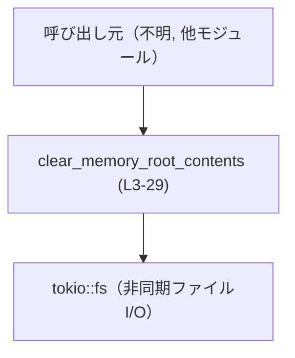
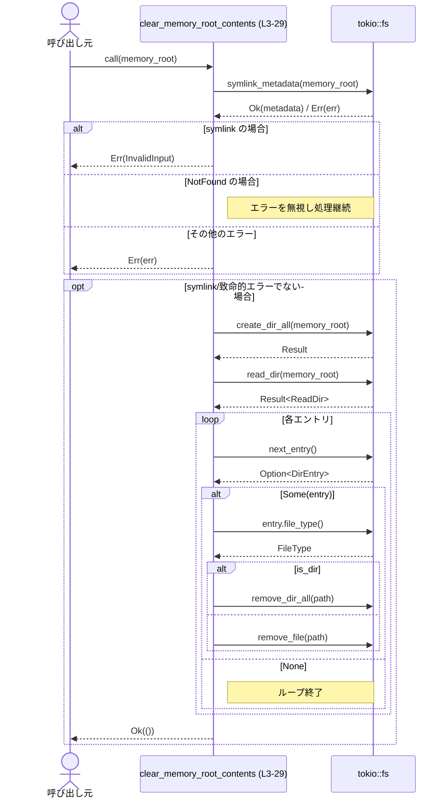
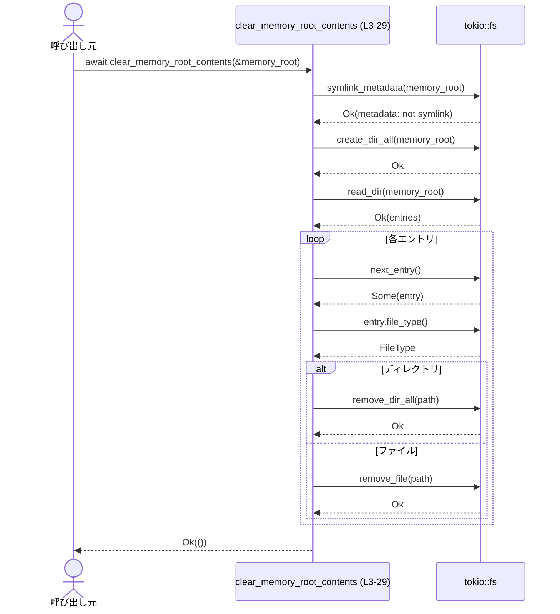

# core\src\memories\control.rs

## 0. ざっくり一言

`memory_root` で指定されたディレクトリ直下の内容（ファイル・サブディレクトリ）を、Tokio の非同期ファイル I/O を使ってすべて削除するユーティリティ関数を提供するファイルです。（根拠: `core\src\memories\control.rs:L3-29`）

---

## 1. このモジュールの役割

### 1.1 概要

- このモジュールは、指定されたディレクトリパス `memory_root` の **中身だけを空にする** 処理を非同期で提供します。（根拠: `read_dir` の反復で中身のみ削除している点 `L21-28`）
- ただし、`memory_root` 自体がシンボリックリンクだった場合は、危険な削除を防ぐためにエラーを返して処理を拒否します。（根拠: `file_type().is_symlink()` の条件分岐 `L4-13`）

### 1.2 アーキテクチャ内での位置づけ

- このファイル自身は 1 つの関数だけを定義しており、新しい型やサブモジュールは定義していません。（根拠: `L1-29`）
- 外部からは `pub(crate)` としてクレート内に公開され、非同期コンテキスト（Tokio ランタイム）から呼び出されることが想定されます。（根拠: `pub(crate) async fn ...` `L3`）
- 内部では `tokio::fs` による非同期ファイルシステム操作に依存しています。（根拠: `tokio::fs::symlink_metadata`, `create_dir_all`, `read_dir`, `remove_dir_all`, `remove_file` `L4,19,21,26,28`）

代表的な依存関係を示す図です（呼び出し元はこのチャンクには存在しないため抽象化しています）。



### 1.3 設計上のポイント

- **非同期設計**  
  - `async fn` と `tokio::fs` を用いた非同期 I/O による実装です。（根拠: `async fn`, `tokio::fs` 呼び出し `L3-4,19,21-28`）
- **安全性（シンボリックリンク防御）**  
  - `memory_root` がシンボリックリンクである場合は、ディレクトリを操作せずに `InvalidInput` エラーを返します。（根拠: `metadata.file_type().is_symlink()` と `ErrorKind::InvalidInput` `L5-7`）
- **存在しないディレクトリの扱い**  
  - パスが存在しない場合（`NotFound`）はエラーにせず、後続の `create_dir_all` でディレクトリを作成します。（根拠: `Err(err) if err.kind() == ... NotFound => {}` と `create_dir_all` `L15,19`）
- **ルートディレクトリの保持**  
  - ルートディレクトリそのものを削除せず、中身のみを削除したあと、空ディレクトリとして残します。（根拠: ルートに対して `remove_*` が呼ばれておらず、代わりに事前に `create_dir_all` している点 `L19-28`）
- **エラー伝播**  
  - 個々の I/O 操作のエラーは `?` 演算子を用いて呼び出し元へそのまま伝播します。（根拠: `await?` が複数箇所にあること `L19,21-22,24,26,28`）

---

## 2. 主要な機能一覧

- `clear_memory_root_contents`: 指定ディレクトリ直下の全ファイルとサブディレクトリを非同期に削除し、ディレクトリを空にする。ただし `memory_root` がシンボリックリンクの場合は削除を拒否する。（根拠: `L3-28`）

---

## 3. 公開 API と詳細解説

### 3.1 型一覧（構造体・列挙体など）

このファイル内で新たに定義されている構造体・列挙体などはありません。（根拠: `L1-29`）

利用している主な外部型：

| 名前 | 種別 | 定義位置 / 役割 |
|------|------|----------------|
| `Path` | 構造体 | `std::path::Path`。ファイルパスを表現する型（所有権を持たないビュー）。`memory_root` のパスに使用。（根拠: `use std::path::Path;` `L1`, 関数引数 `L3`） |
| `std::io::Result<()>` | 型エイリアス | I/O 関連処理の成功/失敗を返す結果型。成功時は `()`、失敗時は `std::io::Error`。（根拠: 関数シグネチャ `L3`） |

### 3.2 関数詳細

#### `clear_memory_root_contents(memory_root: &Path) -> std::io::Result<()>`

**概要**

- 指定された `memory_root` ディレクトリの中身（ファイル・サブディレクトリ）をすべて削除して空にします。（根拠: `read_dir` で列挙し `remove_dir_all` / `remove_file` している点 `L21-28`）
- `memory_root` がシンボリックリンクである場合は、誤って別の場所を削除することを防ぐために処理を拒否し、`InvalidInput` エラーを返します。（根拠: `is_symlink()` 条件と `ErrorKind::InvalidInput` `L5-7`）
- 存在しないパスが渡された場合は、エラーとせずディレクトリを作成した上で、結果として空ディレクトリを用意します。（根拠: `NotFound` を無視し、その後 `create_dir_all` を呼ぶ点 `L15,19`）

**引数**

| 引数名 | 型 | 説明 |
|--------|----|------|
| `memory_root` | `&Path` | 中身を空にしたいディレクトリのパス。借用参照であり、この関数はパスそのものの所有権は取りません。（根拠: 関数シグネチャ `L3`） |

**戻り値**

- 型: `std::io::Result<()>`（`Result<(), std::io::Error>` 相当）。（根拠: `L3`）
- 意味:
  - `Ok(())`: 処理が成功し、`memory_root` ディレクトリが存在し、その直下のファイル・ディレクトリがすべて削除されたことを表します。（根拠: 最終行 `Ok(())` `L31`）
  - `Err(e)`: いずれかの I/O 操作でエラーが発生した、あるいは `memory_root` がシンボリックリンクであったため削除を拒否したことを表します。（根拠: エラーパス `L6-7,16,19,21-22,24,26,28`）

**内部処理の流れ（アルゴリズム）**

1. `memory_root` のメタデータを取得し、パスの種別を確認する。（根拠: `tokio::fs::symlink_metadata(memory_root).await` `L4`）
2. 取得したメタデータのファイル種別がシンボリックリンクであれば、`InvalidInput` エラーを作成して早期に `Err` を返し、それ以上の処理を行わない。（根拠: `is_symlink()` に対する `return Err(...)` `L5-12`）
3. メタデータ取得で `NotFound` エラーが返ってきた場合は、存在しないだけとみなし、そのエラーを無視して継続する。（根拠: `Err(err) if err.kind() == std::io::ErrorKind::NotFound => {}` `L15`）
4. 上記以外のエラーが発生した場合は、そのエラーをそのまま呼び出し元へ返して終了する。（根拠: `Err(err) => return Err(err)` `L16`）
5. `memory_root` ディレクトリを `create_dir_all` で作成（既に存在する場合は何もしない）。（根拠: `tokio::fs::create_dir_all(memory_root).await?;` `L19`）
6. `read_dir` で `memory_root` 直下のエントリを非同期イテレータとして取得する。（根拠: `let mut entries = tokio::fs::read_dir(memory_root).await?;` `L21`）
7. `entries.next_entry().await?` で各エントリを順に取得し、エントリが `None` になるまでループする。（根拠: `while let Some(entry) = entries.next_entry().await? { ... }` `L22`）
8. 各エントリについて、`entry.file_type().await?` で種別を取得し、ディレクトリの場合は `remove_dir_all` でサブディレクトリごと削除し、ディレクトリでない場合（通常はファイル）には `remove_file` で削除する。（根拠: `file_type.is_dir()` による分岐と `remove_dir_all` / `remove_file` の呼び出し `L24-28`）
9. すべてのエントリの削除が完了したら `Ok(())` を返す。（根拠: `Ok(())` `L31`）

このフローをシーケンス図で表現すると次のようになります。



**Examples（使用例）**

この関数を Tokio ランタイム内で使って、`./data/memory` ディレクトリを初期化する例です。

```rust
use std::path::Path;
use core::memories::control::clear_memory_root_contents; // 実際のパスはクレート構成に依存（このチャンクでは不明）

#[tokio::main] // Tokio ランタイムを起動する属性マクロ
async fn main() -> std::io::Result<()> {
    // 初期化したいディレクトリのパスを用意する
    let memory_root = Path::new("./data/memory");

    // ディレクトリ直下のファイルやサブディレクトリをすべて削除する
    clear_memory_root_contents(memory_root).await?;

    // ここまで到達すれば ./data/memory は空のディレクトリとして存在する
    Ok(())
}
```

**Errors / Panics**

`Result` の `Err` になるパターンは、コードから次のように読み取れます。

- **`memory_root` がシンボリックリンクのとき**  
  - `tokio::fs::symlink_metadata` が成功し、`metadata.file_type().is_symlink()` が `true` の場合、明示的に `InvalidInput` エラーを返します。（根拠: `L4-7`）
  - エラーメッセージ: `"refusing to clear symlinked memory root {}"`（`memory_root` の表示付き）。（根拠: `format!(...)` `L8-11`）

- **メタデータ取得時のその他のエラー**  
  - `ErrorKind::NotFound` 以外のエラーは、そのまま `Err(err)` として返されます。（根拠: `Err(err) => return Err(err),` `L16`）

- **後続の I/O 処理のエラー**（すべて `?` により伝播）
  - `create_dir_all(memory_root).await?` の失敗。（根拠: `L19`）
  - `read_dir(memory_root).await?` の失敗。（根拠: `L21`）
  - `entries.next_entry().await?` 内部でのエラー。（根拠: `while let Some(entry) = entries.next_entry().await?` `L22`）
  - `entry.file_type().await?` の失敗。（根拠: `L24`）
  - `remove_dir_all(path).await?` の失敗。（根拠: `L26`）
  - `remove_file(path).await?` の失敗。（根拠: `L28`）

panic を起こすようなコード（`unwrap` や `expect` など）は存在せず、確認できる範囲ではすべて `Result` によるエラー処理になっています。（根拠: `L1-29` に panic 系呼び出しが無い）

**Edge cases（エッジケース）**

- **`memory_root` が存在しないパス**  
  - `symlink_metadata` で `NotFound` エラーになった場合、このエラーは無視されます。（根拠: `Err(err) if err.kind() == ... NotFound => {}` `L15`）
  - その後 `create_dir_all` によりディレクトリが作成され、結果として「空の `memory_root` ディレクトリ」が存在する状態になります。（根拠: `create_dir_all` `L19`）

- **`memory_root` がシンボリックリンク**  
  - 一切削除を行わず `Err(InvalidInput)` を返します。（根拠: `is_symlink()` 分岐 `L5-12`）
  - 呼び出し元はこの場合のエラーを特別扱いしたい可能性があります。

- **`memory_root` は存在するが、ディレクトリでない（通常ファイルなど）の場合**  
  - コード中で「ファイルかディレクトリか」のチェックはメタデータ取得時点ではシンボリックリンクのみです。（根拠: `L4-5`）
  - パスが通常ファイルだった場合、`create_dir_all` は失敗し `Err` が返ることが想定されますが、実際のエラー種別はこのチャンクからは明示されていません。（根拠: ディレクトリであることを保証するコードがない点 `L19`）

- **内部のファイル・ディレクトリに対する権限不足**  
  - 個々の `remove_dir_all` / `remove_file` が権限不足などで失敗した場合、その時点で処理は中断され `Err` が返されます。（根拠: `await?` によるエラー伝播 `L26,28`）

- **並行呼び出し（同じ `memory_root` への複数タスクからの同時実行）**  
  - 同じディレクトリに対して複数のタスクが同時にこの関数を実行した場合、片方が削除したファイルをもう片方が削除しようとして `NotFound` などのエラーになる可能性があります。
  - そのようなエラーに対する特別なリトライや無視の処理は実装されていないため、そのエラーは `Err` として呼び出し元に返されます。（根拠: ループ内で `?` 以外のエラーハンドリングが無い点 `L22-28`）

**使用上の注意点（Rust / 並行性 / セキュリティ的観点を含む）**

- **Tokio ランタイムが必須**  
  - `tokio::fs` の非同期関数を `await` しているため、この関数を使用するには Tokio ランタイム内（`#[tokio::main]` や `#[tokio::test]` など）で実行する必要があります。（根拠: `tokio::fs::*` の `async` 呼び出し `L4,19,21-28`）

- **`memory_root` 自体は削除されない**  
  - ルートディレクトリではなく、その中身のみを削除する挙動です。ルートごと削除したい場合は、別途 `remove_dir_all(memory_root)` 等を呼び出す必要があります。（根拠: ルートに対する `remove_*` 呼び出しが無い `L19-28`）

- **シンボリックリンク防御**  
  - シンボリックリンクに対する削除拒否は、意図しないパス（例えば `/` や重要なディレクトリ）を辿って消してしまうことを防ぐ安全策として機能します。（根拠: symlink 判定とエラーメッセージ `L5-11`）
  - ただし、**TOCTOU（Time-of-check to time-of-use）問題** の観点では、チェックの後に `memory_root` が他のプロセスによってシンボリックリンクに変更される可能性は理論上ありえます。この関数内でその種の攻撃に対する追加対策は確認できません。（根拠: チェックは最初の一度きりで、後続処理では再チェックしていない点 `L4-28`）

- **並行実行時の競合**  
  - 同じ `memory_root` を複数のタスクが同時にクリアしようとした場合、ファイル削除の競合によりエラーが返る可能性があります。排他制御（ロックなど）はこの関数内にはありません。（根拠: グローバルやロックの利用がない `L1-29`）

- **大規模ディレクトリのパフォーマンス**  
  - ディレクトリエントリを逐次的に処理しているため、非常に多くのファイルがあるディレクトリでは時間がかかる可能性があります。ただし `read_dir` のイテレータを一件ずつ処理しているため、メモリ消費はエントリごとの分だけに抑えられます。（根拠: `while let Some(entry) = ...` による逐次処理 `L22-28`）

- **観測性（ログなど）**  
  - ログ出力やメトリクスなどの観測手段はこの関数内にはありません。エラーは `Result` でのみ通知されます。（根拠: ログ出力やトレース関連のコードが見当たらない `L1-29`）

### 3.3 その他の関数

このファイルには `clear_memory_root_contents` 以外の関数は定義されていません。（根拠: `L1-29`）

---

## 4. データフロー

代表的なシナリオとして、「存在する通常のディレクトリをクリアする場合」のデータフローを説明します。

1. 呼び出し元が `memory_root` パスを作成し、`clear_memory_root_contents` を `await` 付きで呼び出します。（根拠: 関数定義 `L3`）
2. 関数内で `symlink_metadata` によりパスのメタデータを取得し、シンボリックリンクでないことを確認します。（根拠: `L4-5`）
3. `create_dir_all` でディレクトリの存在を保証します。（根拠: `L19`）
4. `read_dir` でディレクトリ直下のエントリを取得し、それぞれのファイル種別を確認しながら削除します。（根拠: `L21-28`）
5. すべての削除操作が成功すると `Ok(())` を返します。（根拠: `L31`）

このシナリオをシーケンス図で表します。



---

## 5. 使い方（How to Use）

### 5.1 基本的な使用方法

Tokio ランタイム上で、指定したディレクトリを「空にする」基本的な使い方です。

```rust
use std::path::Path;
use core::memories::control::clear_memory_root_contents; // 実際のモジュールパスはクレート構成に依存（このチャンクからは不明）

#[tokio::main]
async fn main() -> std::io::Result<()> {
    // クリアしたいディレクトリパス
    let memory_root = Path::new("/tmp/app_memory");

    // ディレクトリの中身をすべて削除し、空ディレクトリとして準備する
    clear_memory_root_contents(memory_root).await?;

    // この時点で /tmp/app_memory は存在し、中身は空になっている
    Ok(())
}
```

### 5.2 よくある使用パターン

コードから直接は用途は分かりませんが、一般的なパターンとして次のような使い方が考えられます（推測であることを明示します）。

1. **アプリケーション起動時のワークディレクトリ初期化**（推測）
   - アプリケーションが一時ファイルやキャッシュを保存する「メモリディレクトリ」を、起動時に一度空にする用途。

```rust
async fn init_memory_dir() -> std::io::Result<()> {
    let memory_root = Path::new("./.memory");
    clear_memory_root_contents(memory_root).await
}
```

1. **テスト前後のクリーンアップ**（推測）
   - テストケースで使うディレクトリをテストごとにクリーンな状態にしたい場合。

```rust
#[tokio::test]
async fn test_something_with_memory_dir() -> std::io::Result<()> {
    let memory_root = Path::new("./target/test_memory");

    // テスト開始前にディレクトリをクリーンにする
    clear_memory_root_contents(memory_root).await?;

    // ... テスト本体 ...

    Ok(())
}
```

（用途そのものはこのチャンクからは断定できないため、あくまで一般的な利用例です。）

### 5.3 よくある間違い

この関数の実装から想定される「誤用しやすい」パターンを挙げます。

```rust
// 誤り例: Tokio ランタイム外で async 関数を直接呼び出そうとしている
/*
fn main() {
    let memory_root = Path::new("/tmp/app_memory");
    clear_memory_root_contents(memory_root); // コンパイルエラー: async fn は await が必要
}
*/

// 正しい例: Tokio ランタイム内で await を使う
#[tokio::main]
async fn main() -> std::io::Result<()> {
    let memory_root = Path::new("/tmp/app_memory");
    clear_memory_root_contents(memory_root).await?;
    Ok(())
}
```

```rust
// 誤り例: ディレクトリそのものも削除されると勘違いしているケース（実際には中身だけ）
// この後に memory_root を remove_dir_all しようとすると、
// ディレクトリが空でない前提で書かれたコードだと想定とずれる可能性がある

// 正しい理解:
// - clear_memory_root_contents は「中身だけ」を削除し、ディレクトリ自体は残す
// - ディレクトリごと削除したい場合は、別途 remove_dir_all を使う必要がある
```

### 5.4 使用上の注意点（まとめ）

- `memory_root` は `Path` の参照で渡されますが、その実体は **ディレクトリであること** が前提となっています。ファイルパスが渡されると `create_dir_all` 等がエラーになります。（根拠: ディレクトリであることの検証がない点 `L19`）
- 同じパスに対して複数タスクから同時に呼び出す場合は、削除操作の競合によるエラーが起こりうるため、必要であればアプリケーション側でロックなどの排他制御を行う必要があります。（根拠: 排他制御が無い `L1-29`）
- シンボリックリンクに対しては削除を拒否する設計になっているため、あえてシンボリックリンクをクリアしたいケースではこの関数は使えません。（根拠: `is_symlink()` チェック `L5-7`）

---

## 6. 変更の仕方（How to Modify）

### 6.1 新しい機能を追加する場合

例として、「削除対象をフィルタしたい」「ログを出したい」といった機能を追加したい場合を考えます。

- 削除ポリシーの変更・拡張（例: 特定のファイルを残す）は、`while` ループ内の `if file_type.is_dir()` 分岐部分 (`L25-28`) が主な変更ポイントになります。
- ログやメトリクスの追加は、各削除操作の前後（`remove_dir_all` / `remove_file` 呼び出し箇所）に処理を追加する形になります。（根拠: 実際の削除処理がここに集中している `L25-28`）

### 6.2 既存の機能を変更する場合

- **シンボリックリンクの扱いを変更する場合**  
  - チェックとエラー生成は `match` の最初の分岐に集約されているため（`L4-12`）、ここを修正することで振る舞いを変えられます。
  - ただし、安全性上の意味合いが大きいため、他の呼び出し元がこれを前提にしていないかを確認する必要があります（このチャンクには呼び出し元が現れないため、別ファイルの調査が必要）。

- **エラーを無視したい／リトライしたい場合**  
  - 現状では `?` により即座にエラーが伝播します（`L19,21-22,24,26,28`）。  
    これを変えたい場合は、個々の `await?` を `match` などに書き換え、エラーの扱いを個別に制御する必要があります。

---

## 7. 関連ファイル

このチャンクから直接参照されているのは標準ライブラリと Tokio のみであり、同一クレート内の他のファイルやモジュールは登場しません。

| パス | 役割 / 関係 |
|------|------------|
| `std::path::Path` | ファイル・ディレクトリパスの表現に使用。（根拠: `use std::path::Path;` `L1`） |
| `tokio::fs`（モジュールパスのみ判明、具体ファイルは不明） | 非同期ファイル I/O（メタデータ取得・ディレクトリ作成・列挙・削除）を提供し、本関数から複数回呼び出される。（根拠: `tokio::fs::symlink_metadata`, `create_dir_all`, `read_dir`, `remove_dir_all`, `remove_file` `L4,19,21,26,28`） |

同一ディレクトリ `core\src\memories\` 内の他ファイル（例: `mod.rs` や別のヘルパー）は、このチャンクには現れないため不明です。
