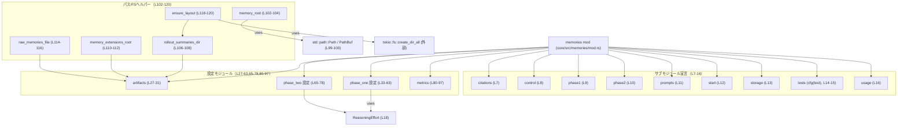
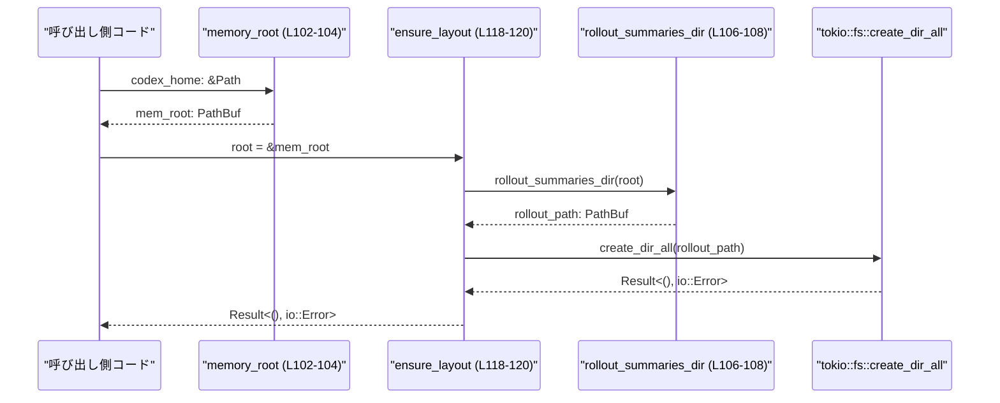

# core/src/memories/mod.rs コード解説

## 0. ざっくり一言

codex の「メモリ起動パイプライン」のエントリポイントと、そのパイプラインで使う **フェーズ別設定値・メトリクス名・ファイルシステムレイアウトヘルパ** をまとめたモジュールです（`core/src/memories/mod.rs:L1-5, L20-25`）。

---

## 1. このモジュールの役割

### 1.1 概要

- このモジュールは、codex の「メモリ起動パイプライン（startup memory pipeline）」を支える共通部分を担います（`mod.rs:L1-5`）。
- 「フェーズ1（起動時抽出）」と「フェーズ2（Consolidation）」という 2 段階の処理のための **モデル名・トークン制限・ジョブ管理設定・メトリクス名** を定義します（`mod.rs:L33-63, L65-78, L80-97`）。
- メモリ関連ディレクトリ（`memories`, `rollout_summaries`, `memories_extensions`）や `raw_memories.md` の **パス組み立てとディレクトリ作成** のヘルパー関数を提供します（`mod.rs:L102-120`）。
- 実際の処理ロジックは `phase1`, `phase2`, `start`, `control` などのサブモジュールにあり、このファイルはそれらの **設定と入口の集約点** になっています（`mod.rs:L7-16, L20-25`）。

### 1.2 アーキテクチャ内での位置づけ

このモジュールは `core::memories` 名前空間のルートとして、複数のサブモジュールと外部依存をまとめています。



> ※ 矢印はこのファイル内でソースコードとして確認できる依存だけを示しています。  
> パイプラインの実際の呼び出し関係（`start_memories_startup_task` がどのモジュールをどう呼ぶか）は、このチャンクには現れません。

### 1.3 設計上のポイント

コードから読み取れる設計上の特徴は次のとおりです。

- **責務の分離**
  - フェーズ1/2の実装モジュール (`phase1`, `phase2`) と、その **設定値モジュール** (`phase_one`, `phase_two`) を分けています（`mod.rs:L9, L10, L33-63, L65-78`）。
  - ファイルシステムパス組み立ては専用ヘルパー関数に集約されています（`mod.rs:L102-116`）。
- **設定の集中管理**
  - モデル名・ReasoningEffort・コンカレンシ制限・トークン制限・リース時間などを **コンパイル時定数** として定義し、パイプライン全体で一貫した設定が使われるようにしています（`mod.rs:L36-62, L68-77`）。
  - フェーズ1のプロンプトは `include_str!` でビルド時に埋め込まれます（`mod.rs:L40`）。
- **エラーハンドリング**
  - このファイル内で実際に I/O を行うのは `ensure_layout` のみで、`std::io::Result<()>` によって **OS 由来のエラーをそのまま呼び出し元へ伝播** します（`mod.rs:L118-120`）。
  - パニックや `unsafe` ブロックは使われておらず、Rust の安全な API のみを利用しています（ファイル全体に `unsafe` なし）。
- **非同期・並行性**
  - ディレクトリ作成は `tokio::fs::create_dir_all` を `async fn ensure_layout` から呼び出す形になっており、**ノンブロッキング I/O** を前提とした設計です（`mod.rs:L118-120`）。
  - フェーズ1の同時実行数は `CONCURRENCY_LIMIT: usize = 8` で制限されています（`mod.rs:L41-42`）。
- **可観測性（Observability）**
  - フェーズ1/2 のジョブ数・レイテンシ・トークン使用量などを記録するためのメトリクス名が集中管理されています（`mod.rs:L80-97`）。

---

## 2. 主要な機能一覧

このモジュールが提供する主な機能を列挙します。

- メモリ起動パイプラインのエントリポイント `start_memories_startup_task` の再公開（実装は `start` モジュール、`mod.rs:L21-25`）。
- メモリルートディレクトリ `memories` のパス生成（`memory_root`, `mod.rs:L102-104`）。
- フェーズ1/2 のモデル・ReasoningEffort・トークン制限・ジョブ管理（リース・リトライ・ハートビート）設定の定数定義（`mod.rs:L36-62, L68-77`）。
- メモリ関連のサブディレクトリ / ファイルパス:
  - `rollout_summaries` ディレクトリ（`rollout_summaries_dir`, `mod.rs:L106-108`）
  - `memories_extensions` ディレクトリ（`memory_extensions_root`, `mod.rs:L110-112`）
  - `raw_memories.md` ファイル（`raw_memories_file`, `mod.rs:L114-116`）
- 起動時に `rollout_summaries` ディレクトリを非同期に作成する `ensure_layout`（`mod.rs:L118-120`）。
- メモリ起動パイプラインのメトリクス名（ジョブ数、レイテンシ、トークン使用量等）の定義（`mod.rs:L80-97`）。

### 2.1 コンポーネントインベントリー（関数・モジュール）

#### モジュール一覧

| 名前 | 種別 | 可視性 | 役割 / 説明 | 定義位置 |
|------|------|--------|------------|----------|
| `citations` | モジュール | `pub(crate)` | メモリ関連の「citation」処理（詳細不明、このチャンクには実装なし） | `core/src/memories/mod.rs:L7` |
| `control` | モジュール | private | メモリルート内容の制御・掃除など（`clear_memory_root_contents` を再公開、実装は別ファイル） | `mod.rs:L8, L20` |
| `phase1` | モジュール | private | フェーズ1（起動時抽出）の実装（詳細不明、このチャンクには実装なし） | `mod.rs:L9` |
| `phase2` | モジュール | private | フェーズ2（Consolidation）の実装（詳細不明） | `mod.rs:L10` |
| `prompts` | モジュール | `pub(crate)` | メモリ関連で利用するプロンプト定義（詳細不明） | `mod.rs:L11` |
| `start` | モジュール | private | メモリ起動パイプラインのエントリポイント実装（`start_memories_startup_task` を提供） | `mod.rs:L12, L21-25` |
| `storage` | モジュール | private | メモリのストレージ周りの実装（詳細不明） | `mod.rs:L13` |
| `tests` | モジュール | private, `cfg(test)` | テストコード（内容不明） | `mod.rs:L14-15` |
| `usage` | モジュール | `pub(crate)` | メモリ機能の利用方法をまとめたモジュール（詳細不明） | `mod.rs:L16` |
| `artifacts` | モジュール | private | メモリ関連ファイル・ディレクトリ名などの定数を定義 | `mod.rs:L27-31` |
| `phase_one` | モジュール | private | フェーズ1の設定定数（モデル、トークン制限、コンカレンシ等） | `mod.rs:L33-63` |
| `phase_two` | モジュール | private | フェーズ2の設定定数（モデル、リース時間、ハートビート等） | `mod.rs:L65-78` |
| `metrics` | モジュール | private | メモリ起動パイプラインのメトリクス名定義 | `mod.rs:L80-97` |

#### 関数・再公開シンボル一覧

| 名前 | 種別 | 可視性 | 概要 | 定義位置 |
|------|------|--------|------|----------|
| `memory_root` | 関数 | `pub` | `codex_home` 直下の `memories` ディレクトリへのパスを返す | `core/src/memories/mod.rs:L102-104` |
| `rollout_summaries_dir` | 関数 | private | ルート配下の `rollout_summaries` ディレクトリへのパスを返す | `mod.rs:L106-108` |
| `memory_extensions_root` | 関数 | private | `root` と同じ親ディレクトリにある `memories_extensions` へのパスを返す | `mod.rs:L110-112` |
| `raw_memories_file` | 関数 | private | ルート配下の `raw_memories.md` ファイルパスを返す | `mod.rs:L114-116` |
| `ensure_layout` | 関数（`async`） | private | `rollout_summaries` ディレクトリを `tokio` で非同期に作成する | `mod.rs:L118-120` |
| `start_memories_startup_task` | 再公開シンボル（おそらく関数） | `pub(crate)` | 「eligible root sessions」のメモリ起動パイプラインを開始するエントリポイント（実体は `start` モジュール） | `mod.rs:L21-25` |
| `clear_memory_root_contents` | 再公開シンボル | `pub(crate)` | メモリルート配下の内容をクリアする処理（実体は `control` モジュール、型はこのチャンクでは不明） | `mod.rs:L20` |

---

## 3. 公開 API と詳細解説

### 3.1 型一覧（構造体・列挙体など）

このファイル内では、新しい構造体・列挙体・トレイトは定義されていません。

外部からインポートしている主な型は次のとおりです。

| 名前 | 種別 | 役割 / 用途 | 定義位置 |
|------|------|-------------|----------|
| `ReasoningEffort` | 列挙体（外部クレート） | OpenAI モデルに対する「推論の強度」（低・中など）を指定するために使用される。フェーズ1/2のデフォルト値として利用 | `mod.rs:L18, L38, L70` |
| `Path` | 構造体（標準ライブラリ） | ファイルシステム上のパスを表す参照型 | `mod.rs:L99` |
| `PathBuf` | 構造体（標準ライブラリ） | 所有権を持つパス型。`Path` の可変・所有バージョン | `mod.rs:L100` |

### 3.2 関数詳細（5件）

#### `memory_root(codex_home: &Path) -> PathBuf`

**定義位置**  
`core/src/memories/mod.rs:L102-104`

**概要**

- codex のホームディレクトリ `codex_home` を基準に、メモリ関連データを格納するルートディレクトリ `memories` のパスを生成します。
- 純粋にパスを連結する関数であり、この関数自体は I/O を行いません。

**引数**

| 引数名 | 型 | 説明 |
|--------|----|------|
| `codex_home` | `&Path` | codex のホームディレクトリを表すパス参照。存在確認などは行われません。 |

**戻り値**

- 型: `PathBuf`
- 意味: `codex_home.join("memories")` の結果、すなわち `codex_home` 直下の `memories` ディレクトリを指すパスです（`mod.rs:L103`）。

**内部処理の流れ**

1. `codex_home.join("memories")` を呼び出し、`codex_home/memories` に相当する `PathBuf` を生成します（`mod.rs:L103`）。
2. 生成した `PathBuf` をそのまま呼び出し元へ返します。

**Examples（使用例）**

```rust
use std::path::PathBuf;
use core::memories::memory_root; // 実際のパスはクレート構成に依存します

fn main() {
    // codex のホームディレクトリを決める（例として固定パスを使用）
    let codex_home = PathBuf::from("/var/lib/codex"); // ホームディレクトリ

    // memories ルートディレクトリのパスを取得する
    let mem_root = memory_root(&codex_home);          // /var/lib/codex/memories を指す PathBuf

    println!("memories root: {}", mem_root.display()); // パスを表示
}
```

**Errors / Panics**

- この関数はファイルシステムアクセスを行わず、`Path::join` もパニックを起こさないため、この関数内でのエラーやパニックは想定されません。

**Edge cases（エッジケース）**

- `codex_home` が相対パスでも問題なく動作し、単に `"memories"` を連結した相対パスを返します。
- `codex_home` が空のパス（`Path::new("")`）でも、結果は `"memories"` という単純なパスになります。
- 返されたパスが存在するかどうかはこの関数では保証されません。存在確認や作成は呼び出し側（または `ensure_layout`）の責任です。

**使用上の注意点**

- 実際にディレクトリへ書き込み・読み込みを行う前に、必要であれば `ensure_layout` 等でレイアウトを作成する必要があります。
- 返されるパスは OS のパス長制限やパーミッションに依存しますが、それらはこの関数の外の問題です。

---

#### `rollout_summaries_dir(root: &Path) -> PathBuf`

**定義位置**  
`core/src/memories/mod.rs:L106-108`

**概要**

- メモリルートディレクトリ `root` 配下にある `rollout_summaries` ディレクトリへのパスを生成します。
- フェーズ1で生成される「ロールアウトの要約」が保存されるディレクトリ名として使われることがコメントから示唆されます（`mod.rs:L29`）。

**引数**

| 引数名 | 型 | 説明 |
|--------|----|------|
| `root` | `&Path` | メモリ機能のルートディレクトリを表すパス参照。通常は `memory_root` の戻り値が使われる想定です。 |

**戻り値**

- 型: `PathBuf`
- 意味: `root.join("rollout_summaries")` の結果（`mod.rs:L107`）。

**内部処理の流れ**

1. `root.join(artifacts::ROLLOUT_SUMMARIES_SUBDIR)` を呼び出します。`ROLLOUT_SUMMARIES_SUBDIR` は `"rollout_summaries"` という定数です（`mod.rs:L27-30`）。
2. 生成されたパスをそのまま返します。

**Examples（使用例）**

```rust
use std::path::PathBuf;
use core::memories::{memory_root}; // rollout_summaries_dir はこのファイル内では private

fn main() {
    let codex_home = PathBuf::from("/var/lib/codex");        // codex ホーム
    let root = memory_root(&codex_home);                     // /var/lib/codex/memories

    // rollout_summaries_dir は private なので、同等の処理を外部で行うなら:
    let rollout_dir = root.join("rollout_summaries");        // /var/lib/codex/memories/rollout_summaries

    println!("rollout summaries: {}", rollout_dir.display());
}
```

**Errors / Panics**

- `Path::join` の呼び出しのみであり、エラーやパニックは発生しません。

**Edge cases**

- `root` が存在しなくてもパスは生成されます。実際のディレクトリ作成は `ensure_layout` に任されています（`mod.rs:L118-120`）。

**使用上の注意点**

- この関数は private のため、このモジュール外から直接呼び出すことはできません。
- 外部から同様のパスを計算する場合は、定数名 `"rollout_summaries"` をハードコードするか、このモジュール内の関数を公開する形に変更する必要があります。

---

#### `memory_extensions_root(root: &Path) -> PathBuf`

**定義位置**  
`core/src/memories/mod.rs:L110-112`

**概要**

- 与えられた `root` と同じ親ディレクトリにある `memories_extensions` という名前のディレクトリパスを生成します。
- `artifacts::EXTENSIONS_SUBDIR` は `"memories_extensions"` です（`mod.rs:L28`）。

**引数**

| 引数名 | 型 | 説明 |
|--------|----|------|
| `root` | `&Path` | 基準となるパス。通常はメモリルートディレクトリを想定していると考えられます。 |

**戻り値**

- 型: `PathBuf`
- 意味: `root.with_file_name("memories_extensions")` の結果（`mod.rs:L111`）。

`with_file_name` は、`root` の最後のコンポーネント（ファイル名やディレクトリ名）を置き換えた新しいパスを返します。

**内部処理の流れ**

1. `root.with_file_name(artifacts::EXTENSIONS_SUBDIR)` を呼び出します（`mod.rs:L111`）。
2. 結果の `PathBuf` を返します。

**Examples（使用例）**

```rust
use std::path::PathBuf;
use core::memories::memory_root;

fn main() {
    let codex_home = PathBuf::from("/var/lib/codex");   // codex ホーム
    let mem_root = memory_root(&codex_home);           // /var/lib/codex/memories

    // memories の「兄弟」として memories_extensions ディレクトリのパスを導出
    let extensions_root = mem_root.with_file_name("memories_extensions");

    println!("extensions root: {}", extensions_root.display());
    // => /var/lib/codex/memories_extensions
}
```

**Errors / Panics**

- `with_file_name` はエラーを返さずパニックもしないため、この関数内でのエラーはありません。

**Edge cases**

- `root` に親ディレクトリがない場合（例: `Path::new("memories")`）、結果は単純に `"memories_extensions"` になります。
- `root` がファイルを指していても、そのファイル名が単に `"memories_extensions"` に置き換わるだけです。

**使用上の注意点**

- `mem_root.join("memories_extensions")` と異なり、**`memories` の「子」ではなく「兄弟」ディレクトリ** を指す点に注意が必要です。
- この関数は private のため、外部から利用するには公開範囲の変更が必要です。

---

#### `raw_memories_file(root: &Path) -> PathBuf`

**定義位置**  
`core/src/memories/mod.rs:L114-116`

**概要**

- メモリルートディレクトリ `root` 配下の `raw_memories.md` ファイルのパスを生成します。
- フェーズ1が生成する「raw memories」を格納するファイル名として使われる想定です（`mod.rs:L30`）。

**引数**

| 引数名 | 型 | 説明 |
|--------|----|------|
| `root` | `&Path` | メモリルートディレクトリを表すパス参照。 |

**戻り値**

- 型: `PathBuf`
- 意味: `root.join("raw_memories.md")` の結果（`mod.rs:L115`）。

**内部処理の流れ**

1. `root.join(artifacts::RAW_MEMORIES_FILENAME)` を呼び出します（`mod.rs:L115`）。
2. 生成された `PathBuf` を返します。

**Examples（使用例）**

```rust
use std::path::PathBuf;
use core::memories::memory_root;

fn main() {
    let codex_home = PathBuf::from("/var/lib/codex");  // codex ホーム
    let mem_root = memory_root(&codex_home);          // /var/lib/codex/memories

    // raw_memories.md のパスを得る（この関数自体は private なので、ここでは等価な処理を記述）
    let raw_memories_path = mem_root.join("raw_memories.md");

    println!("raw memories file: {}", raw_memories_path.display());
}
```

**Errors / Panics**

- パス連結のみでありエラー・パニックはありません。

**Edge cases**

- `root` が存在しない場合でもパスは生成されます。実際のファイル作成は別の処理に委ねられます。

**使用上の注意点**

- この関数は private のため、外部から直接参照できません。
- 実際に書き込む前に、親ディレクトリ（`root` および `memories`）が存在することを確認する必要があります。

---

#### `async fn ensure_layout(root: &Path) -> std::io::Result<()>`

**定義位置**  
`core/src/memories/mod.rs:L118-120`

**概要**

- メモリルートディレクトリ `root` 配下にある `rollout_summaries` ディレクトリを、`tokio` 非同期ランタイム上で作成します。
- すべての親ディレクトリも含めて作成するため、「起動時にディレクトリ構造を準備する」目的に適しています。

**引数**

| 引数名 | 型 | 説明 |
|--------|----|------|
| `root` | `&Path` | メモリルートディレクトリを表すパス参照。通常は `memory_root` の戻り値から取得します。 |

**戻り値**

- 型: `std::io::Result<()>`
- 意味:
  - `Ok(())`: `rollout_summaries` ディレクトリ（および必要な親ディレクトリ）が確保された。
  - `Err(e)`: ディレクトリ作成時に OS 由来のエラー `e` が発生した。

**内部処理の流れ（アルゴリズム）**

1. `rollout_summaries_dir(root)` を呼び出し、`root/rollout_summaries` のパスを得ます（`mod.rs:L118` → `L106-108`）。
2. `tokio::fs::create_dir_all(...)` を `await` します（`mod.rs:L119`）。
   - `create_dir_all` は指定パスおよびその親ディレクトリをすべて作成します。
3. `create_dir_all` の戻り値（`Result<(), std::io::Error>`）がそのまま関数の戻り値になります（`?` は使わず、最後の式として返しています）。

**Examples（使用例）**

`ensure_layout` は `async fn` なので、`tokio` などの非同期ランタイム上で `await` して使用します。

```rust
use std::path::PathBuf;
use core::memories::memory_root;
use core::memories; // ensure_layout は private のため、ここでは同等のロジックを記述

#[tokio::main] // tokio のランタイムを起動
async fn main() -> std::io::Result<()> {
    // codex ホームディレクトリ
    let codex_home = PathBuf::from("/var/lib/codex");

    // memories ルートディレクトリ
    let mem_root = memory_root(&codex_home);

    // rollout_summaries ディレクトリのパス
    let rollout_dir = mem_root.join("rollout_summaries");

    // 実際の ensure_layout と同等の処理
    tokio::fs::create_dir_all(&rollout_dir).await?; // ディレクトリを（存在しなければ）作成

    println!("layout ensured at {}", rollout_dir.display());

    Ok(())
}
```

**Errors / Panics**

- **エラー (`Err`)**:
  - パスの一部にアクセス権がない、ファイルシステムが読み取り専用などの理由で `create_dir_all` が失敗した場合、`std::io::Error` がそのまま返されます（`mod.rs:L119-120`）。
  - `root` に対応する親ディレクトリ自体が存在しない／作成できない場合も同様です。
- **パニック**
  - この関数内では `unwrap` などを使っておらず、`tokio::fs::create_dir_all` も通常はパニックを起こさないため、パニック要因はありません。

**Edge cases（エッジケース）**

- `rollout_summaries` ディレクトリがすでに存在する場合:
  - `create_dir_all` は既存ディレクトリに対しても成功扱いとなるため、そのまま `Ok(())` が返ります（一般的な `create_dir_all` の仕様に基づく挙動）。
- 指定パスの途中に **同名のファイル** が存在する場合:
  - 例えば `root/rollout_summaries` がファイルの場合、`create_dir_all` はディレクトリ作成に失敗し、`Err(std::io::Error)` を返す可能性があります。
- `root` が相対パスであっても問題なく動作し、カレントディレクトリを基準としたディレクトリ作成が行われます。

**使用上の注意点**

- **非同期コンテキスト必須**:
  - `ensure_layout` は `async fn` であり、`await` 呼び出しには `tokio` などの非同期ランタイムが必要です。同期関数から直接 `await` することはできません。
- **エラーハンドリング**:
  - `Result` を直接返すため、呼び出し側で `?` や `match` を使ってエラー処理を行う必要があります。
- **並行性**:
  - 複数のタスクが同時に `ensure_layout` を呼び出した場合でも、`create_dir_all` は一般に冪等なため、致命的な問題にはなりにくい設計です。ただし、細かいファイルシステムの挙動は OS に依存します。

---

### 3.3 その他の関数・再公開 API

このファイルでは、実体が別モジュールにあるシンボルを再公開しています。

| 名前 | 種別 | 可視性 | 説明 | 根拠 |
|------|------|--------|------|------|
| `start_memories_startup_task` | 再公開シンボル（実体は `start` モジュール） | `pub(crate)` | 「eligible root sessions」のメモリ起動パイプラインを開始するエントリポイント。`codex` からメモリ起動をトリガーする唯一の入口であり、このモジュールを理解する際の起点とコメントされています。シグネチャ（引数・戻り値）は、このチャンクには現れません。 | `core/src/memories/mod.rs:L21-25` |
| `clear_memory_root_contents` | 再公開シンボル（実体は `control` モジュール） | `pub(crate)` | メモリルート配下の内容をクリアする処理と推測されますが、シグネチャや詳細な挙動はこのチャンクには現れません。 | `mod.rs:L20` |

---

## 4. データフロー

ここでは、このファイル内で **実際に呼び出し関係が確認できる部分**（レイアウト準備）に絞ってデータフローを示します。

- 呼び出し元はメモリルートパス（`memory_root`）を計算し、それを `ensure_layout` に渡します。
- `ensure_layout` は `rollout_summaries_dir` と `tokio::fs::create_dir_all` を通じてディレクトリを作成します。



> フェーズ1/2の実際の処理フロー（ロールアウト抽出や Consolidation）は `phase1`, `phase2`, `start` モジュール側にあり、このチャンクには現れません。コメントから「2 フェーズ構成」であることのみが分かります（`mod.rs:L3-5`）。

---

## 5. 使い方（How to Use）

### 5.1 基本的な使用方法

典型的には、次のような流れでこのモジュールの機能が利用されることが想定されます。

1. codex ホームディレクトリを決定する。
2. `memory_root` でメモリルートディレクトリを計算する。
3. 起動時に `ensure_layout`（または同等のロジック）で必要なディレクトリを作成しておく。
4. その後のフェーズ1/2 処理がこのレイアウトを前提に動く。

```rust
use std::path::PathBuf;
use core::memories::memory_root;
// ensure_layout は private なので、ここでは等価な tokio コールで示します。

#[tokio::main] // tokio ランタイムを起動
async fn main() -> std::io::Result<()> {
    // 1. codex ホームディレクトリを決める
    let codex_home = PathBuf::from("/var/lib/codex");       // 実環境では設定や環境変数から取得する想定

    // 2. memories ルートディレクトリを計算
    let mem_root = memory_root(&codex_home);                // /var/lib/codex/memories

    // 3. rollout_summaries ディレクトリを事前作成（ensure_layout 相当）
    let rollout_dir = mem_root.join("rollout_summaries");   // パスを構築
    tokio::fs::create_dir_all(&rollout_dir).await?;         // 非同期にディレクトリを作成

    // 4. あとは phase1 / phase2 などがこのレイアウトを前提に動く（このチャンクには実装なし）

    Ok(())
}
```

### 5.2 よくある使用パターン

1. **起動時のレイアウト確保**

   - サービス起動時に一度だけ `ensure_layout` を呼び出し、必要なディレクトリをまとめて作成しておく。
   - その後の処理はディレクトリ存在を前提として実行できるため、I/O エラーを減らせます。

2. **パスの組み立て**

   - メモリ関連ファイルへのアクセスには、必ず `memory_root` を起点に `join` を使用するパターンが推奨されます。
   - 例: `memory_root(&codex_home).join("rollout_summaries").join("some_file.json")` のように、ホームディレクトリからの相対構造を一貫して保つ。

### 5.3 よくある間違い（想定されるもの）

```rust
use std::path::PathBuf;
use core::memories::memory_root;

// 間違い例: 非同期関数を await せずに使おうとしている（ensure_layout のケース）
fn wrong_usage() {
    let codex_home = PathBuf::from("/var/lib/codex");
    let mem_root = memory_root(&codex_home);

    // let result = ensure_layout(&mem_root); // コンパイルエラー: async fn から返るのは Future
}

// 正しい例: 非同期コンテキスト内で await する
#[tokio::main]
async fn correct_usage() -> std::io::Result<()> {
    let codex_home = PathBuf::from("/var/lib/codex");
    let mem_root = memory_root(&codex_home);

    // ensure_layout(&mem_root).await?; // 実際には ensure_layout は private
    tokio::fs::create_dir_all(mem_root.join("rollout_summaries")).await?; // 等価な処理

    Ok(())
}
```

他に起こり得る誤用として:

- `memory_root` を使わず、バラバラの場所にメモリ関連ファイルを作ってしまい、一貫性が崩れる。
- `rollout_summaries` ディレクトリ作成を忘れ、後続の書き込み処理で `No such file or directory` エラーになる。

### 5.4 使用上の注意点（まとめ）

- **非同期ランタイム依存**:
  - このファイルで I/O を行う `ensure_layout` は `tokio` に依存しています（`mod.rs:L118-120`）。非同期処理を行う場合はランタイムの初期化が前提です。
- **安全性（メモリ安全・スレッド安全）**:
  - `unsafe` は一切使われておらず、標準ライブラリ・tokio の安全な API の範囲で実装されています。
  - ファイルパスの計算は純粋関数であり、共有してもスレッド安全です。
- **エラー処理**:
  - I/O エラーはすべて `Result` で表現され、呼び出し元での明示的なエラーハンドリングが必要です。
- **セキュリティ上の注意**:
  - パスに使われるサブディレクトリ名やファイル名はすべて定数であり（`mod.rs:L27-30`）、外部入力を直接連結していないため、パスインジェクションのような問題はこのレベルでは発生しません。
- **設定値の変更リスク**:
  - モデル名やトークン制限などはハードコードされているため、不整合な値に変更すると、外部サービスとの連携でエラーが発生する可能性があります（ただし、その挙動はこのチャンクには現れません）。

---

## 6. 変更の仕方（How to Modify）

### 6.1 新しい機能を追加する場合

このファイルに対して行える代表的な拡張パターンを示します。

1. **新しいアーティファクト用ディレクトリ・ファイルを追加したい場合**
   - `mod artifacts` 内に新しい定数を追加します（`mod.rs:L27-31`）。
   - 必要に応じて、そのパスを組み立てるヘルパー関数（`memory_root` と同様の関数）をこのファイルの末尾に追加します（`mod.rs:L102-116` を参考）。
   - 実際にそのパスを利用するコードは別モジュール（例: `storage`）側になる可能性が高く、そのファイルはこのチャンクには現れません。

2. **フェーズ1/2 の設定値を増やしたい場合**
   - `mod phase_one` または `mod phase_two` に定数を追加します（`mod.rs:L33-63, L65-78`）。
   - その定数を利用するコード（おそらく `phase1` / `phase2` モジュール）は別ファイルにあるため、変更前に「どこから参照されるのか」を検索する必要があります（このチャンクでは参照箇所は分かりません）。

3. **新しいメトリクスを追加したい場合**
   - `mod metrics` にメトリクス名の定数を追加します（`mod.rs:L80-97`）。
   - 実際にメトリクスを emit するコードはこのチャンクには存在せず、`metrics` モジュールの定数を参照する箇所での修正が別途必要です。

### 6.2 既存の機能を変更する場合

- **モデル名 (`MODEL`) や ReasoningEffort の変更**
  - `phase_one::MODEL` や `phase_two::MODEL` の文字列を変更すると、LLM 呼び出しに使われるモデルが変わる可能性があります（`mod.rs:L36, L68`）。
  - `REASONING_EFFORT` の値（Low / Medium）を変更すると、推論コストや応答品質に影響すると考えられます（`mod.rs:L38, L70`）。
  - これらの変更は外部サービスとの接続部分に影響するため、利用箇所を把握した上で慎重に行う必要があります。利用箇所はこのチャンクには現れません。

- **コンカレンシ制限やトークン制限の変更**
  - `CONCURRENCY_LIMIT`, `DEFAULT_STAGE_ONE_ROLLOUT_TOKEN_LIMIT`, `MEMORY_TOOL_DEVELOPER_INSTRUCTIONS_SUMMARY_TOKEN_LIMIT` などを変更すると（`mod.rs:L41-62`）、フェーズ1 のスループットやメモリ使用量、コンテキスト長に影響があります。
  - 「どの程度の値が妥当か」は他のコンポーネント（ジョブスケジューラ、LLM クライアント）とのバランスによるため、このチャンクだけからは判断できません。
  - 変更後はパフォーマンステストや負荷試験で検証することが望ましいです。

- **ジョブリース・リトライ・ハートビート設定の変更**
  - `JOB_LEASE_SECONDS`, `JOB_RETRY_DELAY_SECONDS`, `JOB_HEARTBEAT_SECONDS`（`mod.rs:L55-58, L72-77`）を変更すると、ジョブ実行の信頼性やリカバリ挙動に直接関わります。
  - これらの定数を利用するジョブ管理ロジックは `phase1`, `phase2` モジュール側にあると想定されますが、このチャンクには現れません。

- **パスレイアウトの変更**
  - `artifacts` の定数や `memory_root` のロジックを変更すると、ファイルシステム上のレイアウトが変わります。
  - 既存データや他コンポーネントとの互換性に注意が必要です。特に、過去のデータを参照するコードが古いレイアウトを前提にしている場合、読めなくなる可能性があります。

---

## 7. 関連ファイル

このモジュールと密接に関係するコンポーネントは、`mod` 宣言や `include_str!` から次のように推測できます。

| パス / モジュール | 役割 / 関係 |
|-------------------|------------|
| `memories::start`（ファイルとしては通常 `core/src/memories/start.rs` または `start/mod.rs`） | `start_memories_startup_task` の実装を提供し、メモリ起動パイプライン全体のオーケストレーションを行うとコメントされています（`mod.rs:L21-25`）。実際のファイルパスはこのチャンクからは特定できません。 |
| `memories::control` | `clear_memory_root_contents` の実装があるモジュール。メモリルートへのクリーンアップ処理などを担当すると考えられますが、詳細は不明です（`mod.rs:L8, L20`）。 |
| `memories::phase1` / `memories::phase2` | メモリ起動パイプラインのフェーズ1/2の処理ロジックを含むと考えられるモジュール（`mod.rs:L9-10`）。本チャンクにはその中身は現れません。 |
| `memories::prompts` | メモリ関連で使用するプロンプトやテンプレートをまとめたモジュール（`mod.rs:L11`）。 |
| `memories::storage` | メモリを永続化するストレージレイヤの実装モジュールと推測されます（`mod.rs:L13`）。 |
| `memories::usage` | メモリ機能の利用例や API ラッパーを提供するモジュールと考えられます（`mod.rs:L16`）。 |
| `memories::tests` | このモジュール群のテストコードを含むモジュール。`cfg(test)` 付きで定義されており、ビルド時にはテスト時にのみコンパイルされます（`mod.rs:L14-15`）。ファイルパスはこのチャンクからは不明です。 |
| `../../templates/memories/stage_one_system.md` | フェーズ1で使用するシステムプロンプトのテンプレートファイル。`include_str!` によりビルド時に文字列として埋め込まれます（`mod.rs:L40`）。存在しない場合、ビルド時にエラーとなります。 |
| `codex_protocol::openai_models::ReasoningEffort` | フェーズ1/2 の推論強度設定に使われる外部クレートの型です（`mod.rs:L18, L38, L70`）。 |
| `tokio::fs` | `ensure_layout` で非同期ディレクトリ作成に使用されるファイルシステム API（`mod.rs:L118-120`）。 |

---

このチャンクに含まれる情報からは、メモリ起動パイプラインの詳細なロジック（スケジューリングや Consolidation のアルゴリズムなど）は分かりませんが、**フェーズごとの設定値・メトリクス・ファイルレイアウトと、そのための安全な非同期 I/O ヘルパー** がこのモジュールの中核であることが読み取れます。
