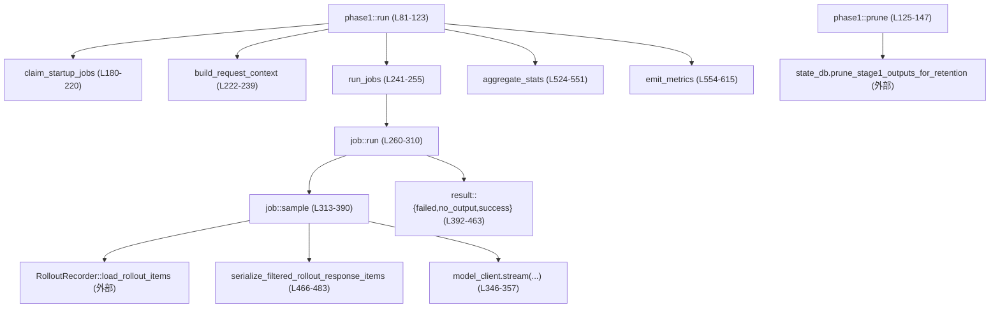
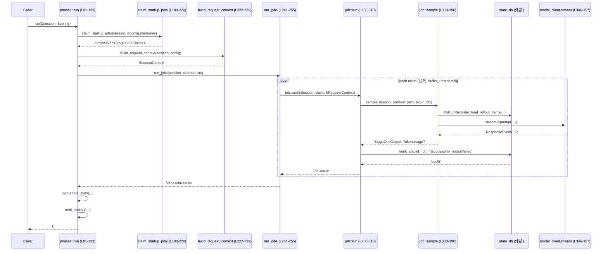

# core/src/memories/phase1.rs コード解説

## 0. ざっくり一言

このモジュールは、「メモリフェーズ1」と呼ばれるバッチ処理を実行し、過去のインタラクション（ロールアウト）から大きな言語モデルを使って長期記憶用の要約・生メモリを抽出し、結果を永続化するとともにメトリクスを発行する役割を持ちます（`core/src/memories/phase1.rs:L81-123`, `L257-521`）。  

あわせて古いメモリの削除（prune）処理と、モデル出力を制約する JSON スキーマの公開も行っています（`L125-147`, `L149-161`）。

---

## 1. このモジュールの役割

### 1.1 概要

- このモジュールは **「ロールアウト履歴から長期メモリ候補を抽出し、DB に保存する」問題** を解決するために存在し、以下の機能を提供します。
  - 起動時に対象ロールアウトを DB からクレームし、並列でフェーズ1抽出ジョブを実行する非同期処理（`run`）。  
  - 使用されていない古いフェーズ1メモリの削除（`prune`）。  
  - LLM の出力フォーマットを縛るための JSON スキーマ（`output_schema`）。  

これらはすべて非同期で実行され、`Session` に束ねられたサービス群（DB、モデルクライアント、テレメトリ）と連携します（`L86-92`, `L126-131`, `L322-356`）。

### 1.2 アーキテクチャ内での位置づけ

このモジュールが他コンポーネントとどう関わるかの概要を示します。



- DB まわり: `session.services.state_db` を通じてジョブのクレーム・成功/失敗の更新・古いメモリの削除を行います（`L184-188`, `L195-207`, `L319-320`, `L395-411`, `L414-432`, `L434-463`, `L126-145`）。
- モデル推論: `session.services.model_client.new_session().stream(...)` によりストリーミングで LLM を呼び出します（`L346-357`）。
- メトリクス: `session.services.session_telemetry` でタイマ計測・カウンタ・ヒストグラムを発行します（`L87-91`, `L98-102`, `L212-216`, `L554-615`）。

### 1.3 設計上のポイント

- **責務分割**
  - 全体オーケストレーション: `run` がフェーズ1一連の流れを制御します（`L81-123`）。
  - ジョブ単位処理: `mod job` 内 `run` が単一スレッド（ロールアウト）に対する抽出・永続化を担当します（`L257-310`）。
  - モデル呼び出しとストリーム処理: `job::sample` が LLM 呼び出しとストリーミングの unwrap を担当します（`L313-390`）。
  - 入力フィルタリング: `serialize_filtered_rollout_response_items` / `sanitize_response_item_for_memories` がメモリ対象とするレスポンスのみを抽出します（`L466-521`）。
- **状態管理**
  - 長期的な状態は DB（`state_db`）にのみ保持し、Rust 側は `Session` を共有しつつ基本的にステートレスな関数で構成されています（`L180-220`, `L395-463`）。
  - `RequestContext` がモデル推論に必要なコンテキスト（モデル情報、テレメトリ、推論設定）を束ねる軽量な不変構造体です（`L36-44`, `L163-177`, `L222-239`）。
- **エラーハンドリング方針**
  - DB 操作やモデル呼び出しの失敗はログ・メトリクスを残した上でジョブを「failed」扱いにし、パニックは避けています（`L209-218`, `L395-411`, `L414-432`, `L434-463`）。
  - モデル出力の JSON パース失敗などは `anyhow::Result` 経由で `job::run` に伝播し、DB 上で失敗マークされます（`L313-320`, `L384-390`, `L266-287`）。
- **並行性**
  - クレームした複数のジョブは `buffer_unordered(phase_one::CONCURRENCY_LIMIT)` で同時並行実行されます（`L241-255`）。
  - 共有リソース `Session` は `Arc` で共有し、不変参照 `&Session` を各タスクに渡すことでスレッドセーフに扱っています（`L86`, `L241-251`, `L260-264`）。

---

## 2. 主要な機能一覧

- フェーズ1バッチ実行: 起動時に DB から対象ロールアウトをクレームし、並行に LLM 抽出ジョブを実行して結果を保存（`run`／`run_jobs`／`job::run`／`job::sample`）。
- 古いメモリの削除: 一定日数使われていない Stage1 出力をバッチ削除（`prune`）。
- モデル出力スキーマの公開: LLM に要求する JSON 形式のスキーマを構築し、プロンプトの `output_schema` に渡す（`output_schema`）。
- モデルコンテキスト構築: 実行時に利用するモデル情報・サービスティア・推論設定をまとめた `RequestContext` を生成（`RequestContext::from_turn_context`, `build_request_context`）。
- ジョブクレーム: DB から処理対象の Stage1 ジョブをクレームし、フィルタ条件を適用（`claim_startup_jobs`）。
- ロールアウトのフィルタ・シリアライズ: メモリ用途に適したレスポンスのみを抽出して JSON シリアル化（`serialize_filtered_rollout_response_items`, `sanitize_response_item_for_memories`）。
- 集計とメトリクス: ジョブ結果とトークン使用量を集計し、メトリクスとログを出力（`aggregate_stats`, `emit_metrics`）。

---

## 3. 公開 API と詳細解説

### 3.1 型一覧（構造体・列挙体など）

| 名前 | 種別 | 可視性 | 役割 / 用途 | 定義位置 |
|------|------|--------|-------------|----------|
| `RequestContext` | 構造体 | `pub(in crate::memories)` | モデル推論に必要な情報（モデル、テレメトリ、推論設定、サービスティア、ヘッダ）をまとめたコンテキスト | `core/src/memories/phase1.rs:L36-44` |
| `JobResult` | 構造体 | `struct`（モジュール内） | 一つのジョブの結果（成功/失敗区分とオプションのトークン使用量） | `core/src/memories/phase1.rs:L46-49` |
| `JobOutcome` | enum | モジュール内 | ジョブ結果のステータス（`SucceededWithOutput` / `SucceededNoOutput` / `Failed`） | `core/src/memories/phase1.rs:L51-55` |
| `Stats` | 構造体 | モジュール内 | 全ジョブの集計結果（件数・合計トークン使用量） | `core/src/memories/phase1.rs:L58-64` |
| `StageOneOutput` | 構造体 | モジュール内 | モデルから返却されるフェーズ1出力（`raw_memory`, `rollout_summary`, `rollout_slug`）を表現 | `core/src/memories/phase1.rs:L66-79` |

### 3.2 関数詳細（重要 7 件）

#### `run(session: &Arc<Session>, config: &Config) -> ()`（非同期）

**概要**

- メモリフェーズ1のメインエントリポイントです。  
- 起動時に DB から Stage1 ジョブをクレームし、並列に処理してメモリを抽出・保存し、メトリクスとログを出力します（`core/src/memories/phase1.rs:L81-123`）。

**引数**

| 引数名 | 型 | 説明 |
|--------|----|------|
| `session` | `&Arc<Session>` | サービス群（DB、モデルクライアント、テレメトリなど）を含むセッションコンテキスト |
| `config` | `&Config` | サーバ全体の設定。特に `config.memories` がジョブクレーム条件やモデル名に利用されます |

**戻り値**

- 戻り値はありません（`()`）。  
  ジョブの結果は DB 更新とメトリクス・ログを通して観測されます。

**内部処理の流れ**

1. E2E 計測タイマを開始します（`start_timer`、失敗は無視）（`L87-91`）。
2. `claim_startup_jobs` を呼んで Stage1 ジョブ候補をクレームします。DB 不在やエラー時は `None` または空リストにより早期 return します（`L93-104`）。
3. クレームされたジョブがなければ `MEMORY_PHASE_ONE_JOBS{status="skipped_no_candidates"}` をインクリメントして終了します（`L97-103`）。
4. `build_request_context` でモデル情報などを含む `RequestContext` を構築します（`L106-107`）。
5. `run_jobs` でジョブごとの処理を並行実行し、結果の `Vec<JobResult>` を受け取ります（`L109-110`）。
6. `aggregate_stats` で集計し、`emit_metrics` でメトリクスを記録し、ログに概要を出力して終了します（`L112-122`）。

**Examples（使用例）**

```rust
// 例: サービス起動時にフェーズ1を一度実行する
async fn run_startup_phase1(session: Arc<Session>, config: Config) {
    crate::memories::phase1::run(&session, &config).await;
}
```

**Errors / Panics**

- 関数自身は `Result` を返さず、内部エラーはすべてログ・メトリクスに反映した上で静かに終了する設計です。
  - DB 不在（`state_db` が `None`）→ `claim_startup_jobs` が `None` を返し、`run` はそのまま return（`L180-188`, `L93-96`）。
  - ジョブ処理中のエラー → `job::run` 内で DB に「failed」として記録され、`JobOutcome::Failed` として集計されます（`L266-287`, `L395-411`）。
- 明示的な `panic!` や `unwrap` は存在せず、`?` での伝播は `anyhow::Result` を返す内部関数に限定されています（`job::sample` 参照）。

**Edge cases（エッジケース）**

- `state_db` が設定されていない:
  - 警告ログを出し、フェーズ1は実行されません（`L184-188`）。
- クレーム対象ジョブが 0 件:
  - メトリクスに「skipped_no_candidates」を記録した上で、何もせず終了します（`L97-103`）。

**使用上の注意点**

- `run` は非同期関数なので、Tokio 等のランタイム上から `.await` して呼び出す必要があります。
- 実際の処理は DB やモデルクライアントに依存するため、テスト時には `Session` のモック実装を用いることが前提になります（このチャンクにはモック実装は現れません）。
- フェーズ1を頻繁に呼び出すと、`run_jobs` によりモデルクライアントへの並行負荷が増えるため、外部リソースの容量に応じたスケジューリングが必要です（`L241-255`）。

---

#### `prune(session: &Arc<Session>, config: &Config) -> ()`（非同期）

**概要**

- Stage1 の生メモリのうち、一定日数使われていない「デッド」メモリを、DB からバッチ削除します（`core/src/memories/phase1.rs:L125-147`）。

**引数**

| 引数名 | 型 | 説明 |
|--------|----|------|
| `session` | `&Arc<Session>` | `state_db` を含むセッション |
| `config` | `&Config` | `config.memories.max_unused_days` に削除条件の閾値が含まれます |

**戻り値**

- 戻り値はありません。

**内部処理の流れ**

1. `state_db` が存在するかをチェック。なければ何もせず return（`L127-146`）。
2. `config.memories.max_unused_days` を読み込む（`L128`）。
3. `db.prune_stage1_outputs_for_retention(max_unused_days, PRUNE_BATCH_SIZE)` を呼び出し（`L129-131`）:
   - 成功: 戻り値 `pruned` が 0 より大きければ、削除件数を info ログに出力（`L133-138`）。
   - エラー: warn ログを出力（`L140-143`）。

**Errors / Panics**

- `state_db` が `None` の場合は静かに何も行いません（`L127-146`）。
- `prune_stage1_outputs_for_retention` のエラーはキャッチされ、warn ログに書き出されますが上位へは伝播しません（`L140-143`）。

**使用上の注意点**

- 削除件数はログにのみ出力され、メトリクスとの連携はこのチャンクには現れません。
- PRUNE_BATCH_SIZE は `phase_one` モジュールの定数に依存しており、大きく設定しすぎると DB 負荷が増大する可能性があります（`L8-9`）。

---

#### `claim_startup_jobs(session: &Arc<Session>, memories_config: &MemoriesConfig) -> Option<Vec<codex_state::Stage1JobClaim>>`（非同期）

**概要**

- フェーズ1起動時に、DB から処理対象の Stage1 ジョブをクレームする内部関数です（`core/src/memories/phase1.rs:L180-220`）。

**引数**

| 引数名 | 型 | 説明 |
|--------|----|------|
| `session` | `&Arc<Session>` | `state_db` とテレメトリを含むセッション |
| `memories_config` | `&MemoriesConfig` | スキャン上限や最大件数、対象年齢などの条件 |

**戻り値**

- `Some(Vec<Stage1JobClaim>)`: クレームに成功。配列が空の場合もあります（「候補なし」）。
- `None`: `state_db` 不在、あるいは DB エラーなどでクレームに失敗した場合。

**内部処理の流れ**

1. `state_db` 存在チェック。なければ warn ログを出し、`None` を返します（`L184-188`）。
2. `INTERACTIVE_SESSION_SOURCES` から許可された source の文字列を作成（`L190-193`）。
3. `state_db.claim_stage1_jobs_for_startup` を、以下のパラメータで呼び出し（`L195-205`）:
   - `scan_limit`: `phase_one::THREAD_SCAN_LIMIT`
   - `max_claimed`: `memories_config.max_rollouts_per_startup`
   - `max_age_days`, `min_rollout_idle_hours`, `allowed_sources`, `lease_seconds` など。
4. 結果が `Ok(claims)` なら `Some(claims)` を返却。
5. `Err(err)` の場合、warn ログと `MEMORY_PHASE_ONE_JOBS{status="failed_claim"}` のインクリメント後、`None` を返却（`L209-218`）。

**Errors / Panics**

- DB 呼び出し時のエラーは warn ログとメトリクス記録のみで終了し、呼び出し側には `None`（失敗扱い）として伝わります。
- `None` を返した場合、上位の `run` はフェーズ1自体をスキップします（`L93-96`）。

**Edge cases**

- 許可された source が空のケース:
  - `INTERACTIVE_SESSION_SOURCES` の中身に依存しますが、このチャンクからは分かりません。
- `max_rollouts_per_startup` が 0 の場合:
  - DB 実装次第ですが、おそらく 0 件が返り、「候補なし」として扱われる想定です（DB 側の振る舞いはこのチャンクには現れません）。

**使用上の注意点**

- `None` と「空の Vec」を明確に使い分けている点が重要です:
  - `None`: システム状態に問題があり、フェーズ1自体をスキップすべき状況。
  - `Some([])`: 健全だが処理対象がないだけ。  
  これを前提に `run` 側のロジックが組まれています（`L93-104`）。

---

#### `build_request_context(session: &Arc<Session>, config: &Config) -> RequestContext`（非同期）

**概要**

- モデル情報やテレメトリ、reasoning 関連設定をまとめた `RequestContext` を構築する内部ヘルパです（`core/src/memories/phase1.rs:L222-239`）。

**引数**

| 引数名 | 型 | 説明 |
|--------|----|------|
| `session` | `&Arc<Session>` | `models_manager` や turn 生成機能を含む |
| `config` | `&Config` | `config.memories.extract_model` などが利用される |

**戻り値**

- `RequestContext`: モデル名に応じた `ModelInfo` と、`TurnContext` からコピーしたテレメトリや reasoning 設定を含む構造体。

**内部処理の流れ**

1. `config.memories.extract_model` が設定されていればその値、なければ `phase_one::MODEL` をモデル名として採用（`L223-227`）。
2. `models_manager.get_model_info` により `ModelInfo` を取得（`L228-232`）。
3. `session.new_default_turn().await` で新規の `TurnContext` を生成（`L233`）。
4. `RequestContext::from_turn_context` に `TurnContext` と `model_info` を渡し、`RequestContext` を生成して返却（`L234-238`）。

**Errors / Panics**

- `get_model_info` や `new_default_turn` は `await` 付きで呼ばれていますが、この関数自体はエラーを返さず、失敗時の挙動はそれぞれの関数内の実装に依存します（このチャンクにはその詳細は現れません）。
- この関数内には `unwrap` などのパニックを起こしうる呼び出しはありません。

**使用上の注意点**

- モデル名を構成する部分は `Config` に依存しており、設定ミス（存在しないモデル名）があると `get_model_info` 側でエラーになる可能性がありますが、その扱いはこのチャンクからは分かりません。
- `RequestContext` の `reasoning_effort` は常に `Some(phase_one::REASONING_EFFORT)` に固定されており、フェーズ1の推論深度はここでは変更されません（`L173`）。

---

#### `run_jobs(session: &Arc<Session>, claimed_candidates: Vec<codex_state::Stage1JobClaim>, stage_one_context: RequestContext) -> Vec<JobResult>`（非同期）

**概要**

- クレームした Stage1 ジョブを、一定数まで並行で処理する関数です（`core/src/memories/phase1.rs:L241-255`）。

**引数**

| 引数名 | 型 | 説明 |
|--------|----|------|
| `session` | `&Arc<Session>` | 共有セッション |
| `claimed_candidates` | `Vec<Stage1JobClaim>` | DB からクレームしたジョブ一覧 |
| `stage_one_context` | `RequestContext` | 全ジョブで共通に使用するモデル推論コンテキスト（`Clone` されて各ジョブに渡される） |

**戻り値**

- `Vec<JobResult>`: すべてのジョブの結果とトークン使用量を含むベクタ。

**内部処理の流れ**

1. `futures::stream::iter` で `claimed_candidates` をストリームに変換（`L246`）。
2. `map` で各要素を非同期タスクに変換:
   - `Arc::clone(session)` で `Session` を共有。
   - `stage_one_context.clone()` でコンテキストをコピー。
   - `job::run(session.as_ref(), claim, &stage_one_context)` を実行（`L247-251`）。
3. `.buffer_unordered(phase_one::CONCURRENCY_LIMIT)` で同時実行数を制限した並列実行を行う（`L252`）。
4. `.collect::<Vec<_>>().await` で全結果を収集し返却（`L253-255`）。

**Errors / Panics**

- 個々のジョブのエラーは `job::run` 内で `JobOutcome::Failed` に変換されるため、この関数は常に `Vec<JobResult>` を返します。
- `buffer_unordered` 自体はエラーを返さず、内部 Future のエラーが `JobResult` に変換されるため、パニックしない設計です。

**並行性・安全性のポイント**

- `Session` は `Arc` 経由で共有され、タスクごとに `&Session` の不変参照が渡されるだけなので、Rust の所有権・借用ルールによりスレッドセーフです（`L247-251`, `L260-264`）。
- 同時実行数は `phase_one::CONCURRENCY_LIMIT` により制御され、外部システムへの過負荷を抑制できます（具体値はこのチャンクには現れません）。

**使用上の注意点**

- `stage_one_context` は `Clone` されてジョブごとに独立コピーが使われるため、内部にミュータブルな状態を持たない前提で設計されています（実際すべて所有 / コピー可能なフィールドです, `L36-44`）。
- DB やモデルクライアントに対する負荷は `CONCURRENCY_LIMIT` に直接依存します。

---

#### `job::run(session: &Session, claim: Stage1JobClaim, stage_one_context: &RequestContext) -> JobResult`（非同期）

**概要**

- 単一の Stage1 ジョブ（1 スレッド / ロールアウト）の処理を行う関数です（`core/src/memories/phase1.rs:L260-310`）。  
- ロールアウトファイルを読み込み、モデルに渡して StageOneOutput を取得し、DB を更新します。

**引数**

| 引数名 | 型 | 説明 |
|--------|----|------|
| `session` | `&Session` | サービス群への参照 |
| `claim` | `codex_state::Stage1JobClaim` | 対象スレッド情報とオーナーシップトークン |
| `stage_one_context` | `&RequestContext` | モデル推論に必要な情報 |

**戻り値**

- `JobResult`: 成功/失敗ステータスとトークン使用量。

**内部処理の流れ**

1. `thread` を `claim.thread` から取り出す（`L265`）。
2. `sample(...)` を呼び出して `(stage_one_output, token_usage)` を取得:
   - エラー時: `result::failed(...)` を呼び出し、`JobOutcome::Failed` で `JobResult` を返す（`L266-287`）。
3. `stage_one_output.raw_memory` または `rollout_summary` が空文字の場合:
   - `result::no_output(...)` を呼び、`SucceededNoOutput` または `Failed` を outcome にして `JobResult` を返す（`L290-295`）。
4. どちらも非空の場合:
   - `result::success(...)` を呼び出し、DB 更新の成否に応じた outcome を設定して `JobResult` を返す（`L297-309`）。

**Errors / Panics**

- `sample` は `anyhow::Result` を返し、エラーは `result::failed` 呼び出しを伴って `JobOutcome::Failed` に変換されます（`L266-287`, `L395-411`）。
- `no_output` と `success` は内部で DB の `mark_stage1_job_*` を呼び出し、`unwrap_or(false)` でエラーを「false（失敗）」として扱いますが、パニックは発生しません（`L414-432`, `L434-463`）。

**Edge cases**

- モデルが空の `raw_memory` や `rollout_summary` を返した場合:
  - DB には「succeeded_no_output」として記録されるか、DB エラー時には `Failed` として扱われます（`L290-295`, `L414-432`）。
- `state_db` が `None` の場合:
  - `no_output` / `success` は `JobOutcome::Failed` を返します（`L419-421`, `L443-445`）。  
  - これにより集計上は失敗扱いとなります。

**使用上の注意点**

- `sample` の結果を必ず DB でマークしてから `JobResult` を返す設計になっており、ジョブの状態と `JobOutcome` の整合性が保たれています。
- `reason.to_string()` をそのまま DB に保存するため、エラーメッセージに機微情報が含まれないよう、上位のエラー生成側で注意が必要です（`L276-281`, `L395-411`）。

---

#### `job::sample(session: &Session, rollout_path: &Path, rollout_cwd: &Path, stage_one_context: &RequestContext) -> anyhow::Result<(StageOneOutput, Option<TokenUsage>)>`（非同期）

**概要**

- ロールアウトファイルからレスポンス項目を読み込み、フィルタ・シリアライズした上でプロンプトを作成し、モデルにストリーミングで問い合わせて `StageOneOutput` を構築する関数です（`core/src/memories/phase1.rs:L313-390`）。

**引数**

| 引数名 | 型 | 説明 |
|--------|----|------|
| `session` | `&Session` | モデルクライアント・テレメトリへのアクセスに使用 |
| `rollout_path` | `&Path` | ロールアウトファイルのパス |
| `rollout_cwd` | `&Path` | ロールアウト時のカレントディレクトリ |
| `stage_one_context` | `&RequestContext` | モデル・テレメトリ・reasoning 設定など |

**戻り値**

- `Ok((StageOneOutput, Option<TokenUsage>))`: 正常にモデル出力をデコードできた場合。トークン使用量が得られない場合は `None`。
- `Err(anyhow::Error)`: ファイル読み込み、シリアライズ、モデル呼び出し、ストリーム処理、JSON パースなどのいずれかでエラーが発生した場合。

**内部処理の流れ**

1. `RolloutRecorder::load_rollout_items(rollout_path).await?` でロールアウトアイテムを読み込む（`L319`）。
2. `serialize_filtered_rollout_response_items(&rollout_items)?` でメモリ対象のレスポンスのみを JSON 文字列にシリアライズ（`L320`）。
3. `Prompt` 構造体を作成:
   - `ResponseItem::Message{ role:"user", content:[InputText{ text: build_stage_one_input_message(...)}] }` を入力とする（`L322-337`）。
   - `BaseInstructions { text: phase_one::PROMPT.to_string() }` をセット（`L339-341`）。
   - `output_schema: Some(output_schema())` で JSON スキーマを付与（`L343-344`）。
4. `model_client.new_session().stream(...)` でストリーミング推論を開始（`L346-357`）。
5. ストリームを unwrap:
   - `ResponseEvent::OutputTextDelta(delta)` → `result` 文字列に追記（`L365`）。
   - `ResponseEvent::OutputItemDone(item)` かつ `result` が空かつ `item` が `ResponseItem::Message` の場合は `content_items_to_text` でテキストに変換して `result` に追加（`L366-372`）。
   - `ResponseEvent::Completed{ token_usage: usage, .. }` で `token_usage` を保存しループを抜ける（`L374-379`）。
   - それ以外は無視（`L380-381`）。
6. `serde_json::from_str(&result)?` で `StageOneOutput` にデコード（`L384`）。
7. `redact_secrets` で `raw_memory` と `rollout_summary`、`rollout_slug`（存在する場合）から秘密情報をマスク（`L385-387`）。
8. `(output, token_usage)` を `Ok` で返却（`L389`）。

**Errors / Panics**

- `load_rollout_items` の I/O エラー、`serialize_filtered_rollout_response_items` のシリアライズエラー、`build_stage_one_input_message` のエラー、モデルクライアントのエラー、ストリーム中のエラー、`serde_json::from_str` のパースエラーはすべて `?` で伝播し、`anyhow::Error` として呼び出し元へ返ります（`L319-320`, `L327-333`, `L346-357`, `L363-364`, `L384`）。
- 明示的な `panic` はありません。

**Edge cases**

- モデルが `Completed` を返す前にストリームが終わる:
  - `while let Some(message) = stream.next().await.transpose()?` なので、`Completed` イベントを受け取らないままループ終了すると `token_usage` は `None` のままですが、`result` が空でない限り JSON パースは試みられます（`L361-383`）。
- モデルからの結果が空文字列:
  - `serde_json::from_str("")` はエラーになり、そのまま `Err` が返され、`job::run` で failed として扱われます（`L384`, `L266-287`）。
- モデル出力に予期せぬフィールドが含まれる:
  - `StageOneOutput` は `#[serde(deny_unknown_fields)]` が付いているため、余計なフィールドがあるとパースエラーとなり、ジョブは失敗扱いになります（`L67-68`, `L384-390`）。

**使用上の注意点**

- `output_schema()` と `StageOneOutput` のスキーマが整合している前提で設計されていますが、実際には Schema に `rollout_slug` が「required」として含まれる一方、`StageOneOutput` 側では `Option` + `default` になっており、「フィールドが存在しない場合」は `None` として扱われます（`L77-78`, `L151-160`）。  
  これは LLM 側に必ず `rollout_slug` キーを出させたいが、Rust 側では欠損にも耐える設計と解釈できます。
- `redact_secrets` はモデル出力に対してのみ適用されており、ロールアウト入力側に含まれる秘密情報の扱いは `build_stage_one_input_message` 側の実装に依存します（このチャンクには現れません）。

---

#### `job::serialize_filtered_rollout_response_items(items: &[RolloutItem]) -> codex_protocol::error::Result<String>`

**概要**

- ロールアウトアイテムの中からメモリ対象とするレスポンスのみを抽出し、JSON 文字列にシリアライズする関数です（`core/src/memories/phase1.rs:L466-483`）。

**引数**

| 引数名 | 型 | 説明 |
|--------|----|------|
| `items` | `&[RolloutItem]` | ロールアウトから読み込んだ全イベント |

**戻り値**

- `Ok(String)`: フィルタ後の `ResponseItem` の配列を JSON にした文字列。
- `Err(CodexErr)`: シリアライズに失敗した場合、`InvalidRequest` エラーでラップして返却。

**内部処理の流れ**

1. `items.iter().filter_map(...)` で `RolloutItem::ResponseItem` のみを対象に `sanitize_response_item_for_memories` を適用（`L470-478`）。
2. `collect::<Vec<_>>()` でフィルタ済みの `ResponseItem` のベクタに変換（`L479`）。
3. `serde_json::to_string(&filtered)` で JSON 文字列にシリアライズ（`L480`）。
   - 成功: `Ok(String)` を返却。
   - 失敗: `CodexErr::InvalidRequest("failed to serialize rollout memory: {err}")` を返却（`L480-482`）。

**Errors / Panics**

- シリアライズ失敗時のみ `CodexErr::InvalidRequest` でエラーが返ります。
- `panic` は発生しません。

**Edge cases / Security**

- 全アイテムがフィルタで落ちた場合:
  - 空配列 `[]` が JSON として返されます。`build_stage_one_input_message` 側がどう扱うかはこのチャンクには現れません。
- `sanitize_response_item_for_memories` によって、以下が除外されます（`L485-521`）:
  - `ResponseItem::Message` 以外で `should_persist_response_item_for_memories` が `false` のもの。
  - `role == "developer"` のメッセージ全体。
  - `role == "user"` のメッセージのうち、`is_memory_excluded_contextual_user_fragment` が `true` を返すコンテンツ。
  - これにより、保存すべきでないメモリ（例: 一時的なコンテキスト情報や開発者メッセージ）が永続化されるのを防いでいます。

**使用上の注意点**

- セキュリティ・プライバシー観点から、「どの `ResponseItem` を保存してよいか」のポリシーは `sanitize_response_item_for_memories` と `should_persist_response_item_for_memories` に集中しています。新しいロールアウトイベント種別を追加する場合はここを更新する必要があります（`L485-521`）。

---

### 3.3 その他の関数

| 関数名 | 役割（1 行） | 定義位置 |
|--------|--------------|----------|
| `output_schema() -> Value` | フェーズ1モデル出力用の JSON スキーマを構築し、プロンプトに渡すために公開します（唯一の `pub` 関数） | `core/src/memories/phase1.rs:L149-161` |
| `RequestContext::from_turn_context(...) -> Self` | `TurnContext` からテレメトリ・reasoning 設定・サービスティアを引き継ぎ、モデル情報と合わせて `RequestContext` を生成します | `core/src/memories/phase1.rs:L163-177` |
| `job::result::failed(...)` | ジョブ失敗時に警告ログと DB 更新（失敗マーク）を行います | `core/src/memories/phase1.rs:L392-411` |
| `job::result::no_output(...) -> JobOutcome` | 有効な出力がないジョブを「succeeded_no_output」としてマークし、結果ステータスを返します | `core/src/memories/phase1.rs:L414-432` |
| `job::result::success(...) -> JobOutcome` | 正常にメモリ出力が得られたジョブを「succeeded_with_output」としてマークし、結果ステータスを返します | `core/src/memories/phase1.rs:L434-463` |
| `sanitize_response_item_for_memories(item: &ResponseItem) -> Option<ResponseItem>` | ロール（developer/user/その他）とフラグに応じてメモリ保存対象をフィルタし、必要に応じて content をトリミングして新しい `ResponseItem` を返します | `core/src/memories/phase1.rs:L485-521` |
| `aggregate_stats(outcomes: Vec<JobResult>) -> Stats` | 各ジョブの outcome を集計し、合計トークン使用量を合算します | `core/src/memories/phase1.rs:L524-551` |
| `emit_metrics(session: &Session, counts: &Stats)` | 集計結果に基づき、ジョブ件数とトークン使用量のメトリクスを発行します | `core/src/memories/phase1.rs:L554-615` |

---

## 4. データフロー

ここでは、`run` を起点とする代表的な処理フローを示します。

### 処理の要点

1. フェーズ1エントリ `run` が DB からジョブをクレームします。
2. `run_jobs` がそれぞれのジョブを `job::run` に渡して並行処理します。
3. `job::run` はロールアウトを読み込み、`job::sample` で LLM からメモリを抽出し、DB に結果を保存します。
4. `aggregate_stats` と `emit_metrics` で結果が集計・メトリクス化されます。



- 並列性は `run_jobs` 内の `buffer_unordered(CONCURRENCY_LIMIT)` によって制御されます（`core/src/memories/phase1.rs:L246-253`）。
- DB への更新は各ジョブごとに一回以上行われ、ジョブ結果との整合性を保ちます（`L395-463`）。

---

## 5. 使い方（How to Use）

### 5.1 基本的な使用方法

このモジュールは、通常サービス起動時などにフェーズ1処理と古いメモリの削除を行うために利用されると想定できます（呼び出し側コードはこのチャンクには現れません）。

```rust
use std::sync::Arc;
use crate::codex::Session;
use crate::config::Config;
use crate::memories::phase1;

// サービスの起動処理などから呼び出す例
#[tokio::main]
async fn main() -> anyhow::Result<()> {
    let session: Arc<Session> = /* Session の初期化 */;
    let config: Config = /* 設定の読み込み */;
    
    // 古いメモリを削除
    phase1::prune(&session, &config).await;

    // フェーズ1メモリ抽出を実行
    phase1::run(&session, &config).await;

    Ok(())
}
```

- `output_schema()` は主に `job::sample` 内で使われており、外部から明示的に呼び出すケースは少ないと思われますが、他のプロンプト構築処理で共通スキーマを使いたい場合に利用できます（`core/src/memories/phase1.rs:L322-344`）。

### 5.2 よくある使用パターン

1. **起動時一括実行**
   - サービスが起動するときに一度 `prune` → `run` を呼び、未処理ロールアウトからメモリを抽出しておく。

2. **周期的バックグラウンドジョブ**
   - 別のスケジューラから定期的に `run` を呼び出し、追加されたロールアウトを段階的に処理する（`claim_startup_jobs` のパラメータにより、対象のロールアウト年齢やアイドル時間が制御されます, `L195-205`）。

### 5.3 よくある間違い

```rust
// 間違い例: ランタイム外から非同期関数を直接呼ぼうとしている
// phase1::run(&session, &config); // コンパイルエラー（.awaitが必要）

// 正しい例: 非同期コンテキスト内で .await する
async fn do_phase1(session: Arc<Session>, config: Config) {
    crate::memories::phase1::run(&session, &config).await;
}
```

```rust
// 間違い例: state_db が設定されていない状態でフェーズ1に依存する
async fn startup(session: Arc<Session>, config: Config) {
    // session.services.state_db が None の場合、フェーズ1はスキップされる（L184-188）
    phase1::run(&session, &config).await;
    // フェーズ1が実行された前提で後続処理を書くと不整合が生じる可能性
}
```

### 5.4 使用上の注意点（まとめ）

- **前提条件**
  - `session.services.state_db` が設定されていることが、フェーズ1の実行とメモリ保存に必須です（`L184-188`, `L395-463`）。
  - `models_manager` と `model_client` も事前に正しく初期化されている必要があります（`L228-232`, `L346-357`）。
- **エラー処理**
  - 多くのエラーは `Result` として外に伝播せず、DB 状態とメトリクスに反映されるだけです。そのため、ジョブの成功/失敗をアプリ側で厳密に扱いたい場合は、別途 DB やメトリクスを参照する必要があります。
- **並行性**
  - `CONCURRENCY_LIMIT` の値によって、モデル推論の並列数が変わります。大きくしすぎると外部 LLM API のレート制限やネットワーク帯域に影響が出ます（`L252`）。
- **セキュリティ / プライバシー**
  - モデル出力は `redact_secrets` でマスクされますが、入力側ロールアウトに含まれる秘密情報の扱いは他モジュールに依存します（`L385-387`）。
  - 保存対象のレスポンスは `sanitize_response_item_for_memories` でフィルタされていますが、新しいイベント種別やロールを導入した場合はフィルタが適切に更新されているか確認が必要です（`L485-521`）。

---

## 6. 変更の仕方（How to Modify）

### 6.1 新しい機能を追加する場合

例: メモリ保存時に追加メタデータ（タグなど）を付与したい場合。

1. **保存パスを特定**
   - Stage1 出力が DB に保存されるのは `job::result::success` 内の `mark_stage1_job_succeeded` 呼び出しです（`core/src/memories/phase1.rs:L434-463`）。
2. **DB インターフェースの拡張**
   - `codex_state::StateDb` 側で `mark_stage1_job_succeeded` のシグネチャを拡張し、追加メタデータを受け取れるようにします（このチャンクには定義は現れません）。
3. **呼び出し側の変更**
   - `result::success` に新しい引数を追加し、`job::run` から渡す値を組み立てます（`L297-307`）。
4. **モデル出力スキーマの更新**
   - 追加メタデータを LLM に生成させる場合は、`StageOneOutput` と `output_schema()` にフィールドを追加し、`serde(deny_unknown_fields)` との整合性を保ちます（`L66-79`, `L149-160`）。

### 6.2 既存の機能を変更する場合

- **ジョブ選択ロジックの変更**
  - `claim_startup_jobs` のパラメータ（`scan_limit`, `max_age_days` など）を変更することで、対象ロールアウトの範囲を調整できます（`L195-205`）。
  - 影響範囲: フェーズ1が処理するロールアウト数・種類が変化し、DB 負荷やモデル呼び出し回数に影響します。
- **並列度の変更**
  - `phase_one::CONCURRENCY_LIMIT` を変更することで、同時実行ジョブ数を制御できます（値定義はこのチャンクには現れません）。
  - 変更時には、モデル API のレート制限や `state_db` の同時接続数制約を確認する必要があります。
- **フィルタポリシーの変更**
  - 保存対象レスポンスの種類を変更したい場合は `sanitize_response_item_for_memories` の条件を編集します（`L485-521`）。
  - たとえば、今後 `assistant` ロールの一部を除外するといった変更はここに追加されます。
- **エラー時のリトライポリシー**
  - ジョブ失敗時のリトライ遅延秒数は `phase_one::JOB_RETRY_DELAY_SECONDS` で指定されており、`result::failed` から `mark_stage1_job_failed` に渡されています（`L405-409`）。  
    これを変更する場合は `phase_one` モジュール側の定数を更新します。

---

## 7. 関連ファイル

このモジュールと密接に関係する外部モジュール・ディレクトリを示します（ファイルパスはモジュール名から推測されますが、正確なパスはこのチャンクには現れません）。

| パス / モジュール | 役割 / 関係 |
|-------------------|------------|
| `crate::memories::phase_one` | モデル名 (`MODEL`)、並列度 (`CONCURRENCY_LIMIT`)、スキャン制限、リトライ秒数、プロンプト文字列 (`PROMPT`) などフェーズ1の定数設定を提供（`L8-9`, `L173`, `L199`, `L205`, `L252`, `L340`, `L408`）。 |
| `crate::memories::prompts::build_stage_one_input_message` | ロールアウト内容とモデル情報から、フェーズ1モデル向けの入力テキストを構築（`L10`, `L327-333`）。 |
| `crate::rollout::INTERACTIVE_SESSION_SOURCES` | フェーズ1対象とするセッション種別のホワイトリスト（`L11`, `L190-193`）。 |
| `crate::rollout::policy::should_persist_response_item_for_memories` | メモリ保存対象とする `ResponseItem` を判定するポリシー関数（`L12`, `L494-495`）。 |
| `codex_state::Stage1JobClaim`, `Stage1StartupClaimParams` | DB との間でフェーズ1ジョブをクレーム・更新するための型（`L182-183`, `L195-205`, `L260-264`）。 |
| `RolloutRecorder` | ロールアウトファイルを読み込み、`RolloutItem` の列として提供（`L2`, `L319`）。 |
| `codex_api::ResponseEvent` | モデルクライアントのストリーミングレスポンスイベント（テキストデルタや完了イベントなど）を表す型（`L13`, `L363-381`）。 |
| `codex_secrets::redact_secrets` | モデル出力中の秘密情報をマスクするユーティリティ（`L26`, `L385-387`）。 |
| `crate::contextual_user_message::is_memory_excluded_contextual_user_fragment` | ユーザーメッセージの一部を「メモリから除外すべきコンテキスト」として判定する関数（`L6`, `L505-508`）。 |
| `core/src/memories/phase1_tests.rs` | このモジュールのテストコード。内容はこのチャンクには現れませんが、`#[path = "phase1_tests.rs"]` で参照されています（`L617-619`）。 |

---

### Bugs / Security についての補足（ヘッダではなく内容として）

- **エラーメッセージの保存**: `result::failed` では `reason.to_string()` をそのまま DB に保存しており（`L276-281`, `L395-411`）、上位から渡されるエラー文字列に秘密情報が含まれていると、そのまま永続化される可能性があります。エラー生成側でメッセージ内容を制限する必要があります。
- **モデル出力の JSON スキーマと構造体の差異**: `output_schema` では `rollout_slug` が required になっている一方で、`StageOneOutput` では `Option` + `default` です（`L66-79`, `L149-160`）。LLM がフィールドを欠落させても Rust 側は `None` で受け取れますが、スキーマとの乖離がある点は認識しておく必要があります。
- **ストリーム終了前に Completed が来ない場合**: `job::sample` は `Completed` イベントを期待していますが、何らかの理由で `Completed` が来ないままストリームが終わると、`token_usage` が `None` のままになります（`L361-383`）。これは安全性の問題ではありませんが、メトリクスの一貫性に影響します。

### Contracts / Edge Cases についてのまとめ

- フェーズ1は `state_db` がない場合に何もしない契約になっており、これを前提に呼び出し側が設計されていると考えられます（`L184-188`, `L93-96`）。
- `StageOneOutput` の各フィールド（`raw_memory`, `rollout_summary`）が空文字の場合は「no_output」として扱う、というビジネスロジック上の契約があります（`L290-295`）。

### Tests

- `#[cfg(test)] mod tests;` により、同ディレクトリの `phase1_tests.rs` をテストモジュールとして参照しています（`core/src/memories/phase1.rs:L617-619`）。
- テストの具体的な内容はこのチャンクには現れないため、不明です。
