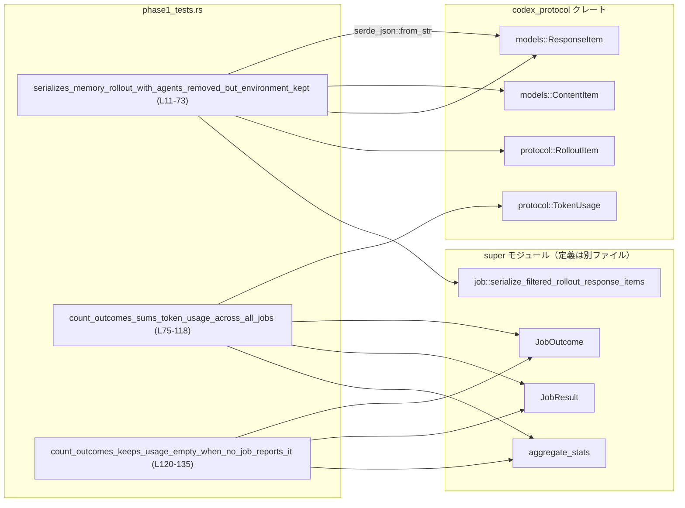
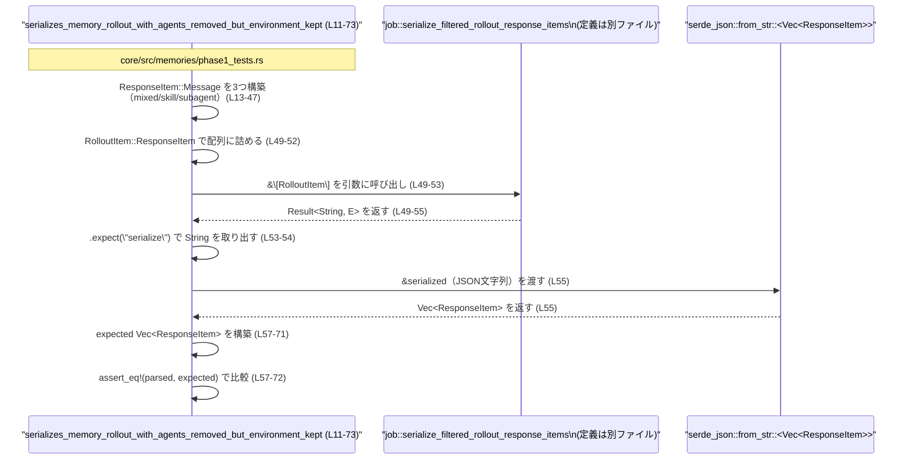

# core/src/memories/phase1_tests.rs コード解説

## 0. ざっくり一言

- メモリ関連の「フェーズ1」処理について、  
  1) ロールアウト結果のシリアライズ時にどのメッセージを残すか、  
  2) 複数ジョブの結果からトークン使用量をどう集計するか、  
  の振る舞いを検証するテストモジュールです（`core/src/memories/phase1_tests.rs:L11-135`）。

---

## 1. このモジュールの役割

### 1.1 概要

- このモジュールは、親モジュール（`super`）で定義されている以下の関数の挙動をテストします。
  - `job::serialize_filtered_rollout_response_items`：ロールアウト結果のフィルタ付きシリアライズ関数（`L49-55`）。
  - `aggregate_stats`：ジョブ結果一覧から統計情報を集計する関数（`L76-102`）。
- 具体的には、どの種類の `ResponseItem` がメモリに残されるか、および `JobResult` 群からのカウント・トークン合計値が期待どおりかを検証します。

### 1.2 アーキテクチャ内での位置づけ

- 依存関係（このファイルから見える範囲）

  - 親モジュール（`super`）  
    - `JobOutcome`（ジョブの結果種別）`L1, L78-101`  
    - `JobResult`（結果とトークン使用量のペア）`L2, L78-101`  
    - `aggregate_stats`（統計集計）`L3, L76-102`  
    - `job::serialize_filtered_rollout_response_items`（ロールアウトアイテムのシリアライズ）`L4, L49-55`
  - 外部クレート `codex_protocol`
    - `models::{ContentItem, ResponseItem}`（メッセージ構造）`L5-6, L13-47, L57-71`
    - `protocol::{RolloutItem, TokenUsage}`（ロールアウト要素・トークン使用量）`L7-8, L49-52, L80-96, L110-116`
  - `serde_json`：JSON 文字列から `Vec<ResponseItem>` へのデシリアライズ（`L55`）
  - `pretty_assertions::assert_eq`：テスト用の比較アサート（`L9, L57-72, L104-117, L133-134`）

- 依存関係を簡略図にすると次のようになります。



> `aggregate_stats` や `serialize_filtered_rollout_response_items` 自体の定義は、このチャンクには含まれていません（`core/src/memories/phase1_tests.rs:L1-8`）。

### 1.3 設計上のポイント（テストから読み取れること）

- **純粋関数的な API 前提**  
  テストでは、入力ベクタから新しい値を計算する形でのみ関数を利用しており、共有状態やグローバルな副作用は前提としていません（`L49-55, L76-102, L121-131`）。
- **JSON シリアライズの契約**  
  - `serialize_filtered_rollout_response_items` の戻り値は `serde_json::from_str::<Vec<ResponseItem>>` でパース可能な JSON 文字列である、という契約が置かれています（`L49-55`）。
- **トークン使用量の扱い**  
  - `aggregate_stats` は `Option<TokenUsage>` を受け取り、`Some` のものだけを合計する一方で、1 つも `Some` がない場合は `total_token_usage: None` を返すという契約がテストで固定されています（`L80-96, L99-101, L108-117, L121-134`）。
- **安全性・並行性**  
  - このファイル内には `unsafe` ブロックやスレッド生成・同期に関わるコードは存在せず、テスト対象 API も同期的に呼び出されています（`L11-135`）。

---

## 2. 主要な機能一覧（このテストモジュールが検証すること）

- メモリロールアウトのシリアライズ時に、  
  - AGENTS 設定 (`# AGENTS.md ... <INSTRUCTIONS> ...`) を除去し（`L17-23`）、  
  - `<environment_context>...</environment_context>` を残すこと（`L21-23, L60-67`）。
- メモリロールアウトから `<skill>...</skill>` のみを含むメッセージを除外すること（`L28-37, L57-72`）。
- `<subagent_notification>...</subagent_notification>` を含むメッセージはそのまま残すこと（`L38-47, L70`）。
- `aggregate_stats` によるジョブ件数・成功/失敗件数のカウント（`L76-107`）。
- `aggregate_stats` による `TokenUsage` 各フィールドの合計値計算、および「全ジョブが `token_usage: None` の場合は合計を `None` にする」ルールの検証（`L80-96, L108-116, L121-134`）。

---

## 3. 公開 API と詳細解説

このファイル自体はテスト用モジュールであり、外部に公開される関数や型は定義していません（`L11, L75, L120` はすべて `#[test]` 関数）。  
ただし、テストから **親モジュールの公開 API の契約** が明確に読み取れるため、ここではそれらを中心に説明します。

### 3.1 型一覧（このファイルで使用している主な型）

> ここに挙げる型はすべて別モジュールで定義されており、このファイル内で新たな型定義は行われていません（`L1-8`）。

| 名前 | 種別 | 定義元 | 役割 / 用途 | 根拠 |
|------|------|--------|-------------|------|
| `JobOutcome` | 列挙体（推定） | `super` | ジョブ結果の状態を表す。少なくとも `SucceededWithOutput`, `SucceededNoOutput`, `Failed` の 3 バリアントを持つ | バリアント使用 `L79, L89, L99` |
| `JobResult` | 構造体（推定） | `super` | 1 件のジョブの結果。`outcome: JobOutcome` と `token_usage: Option<TokenUsage>` フィールドを持つ | フィールド初期化 `L78-80, L88-90, L98-100` |
| `TokenUsage` | 構造体 | `codex_protocol::protocol` | トークン使用量の統計。`input_tokens`, `cached_input_tokens`, `output_tokens`, `reasoning_output_tokens`, `total_tokens` フィールドを持つ | 構造体リテラル `L80-86, L90-96, L110-116` |
| `ResponseItem` | 列挙体（推定） | `codex_protocol::models` | レスポンス要素。少なくとも `Message { id, role, content, end_turn, phase }` バリアントを持つ | パターン `ResponseItem::Message { .. }` 使用 `L13-27, L28-37, L38-47, L60-69` |
| `ContentItem` | 列挙体（推定） | `codex_protocol::models` | メッセージの内容要素。少なくとも `InputText { text: String }` バリアントを持つ | `ContentItem::InputText { text: ... }` 使用 `L17-23, L31-33, L41-43, L63-66` |
| `RolloutItem` | 列挙体（推定） | `codex_protocol::protocol` | ロールアウトを構成する要素。少なくとも `ResponseItem(ResponseItem)` バリアントを持つ | `RolloutItem::ResponseItem(...)` 使用 `L49-52` |

> `aggregate_stats` の戻り値型の名前はこのチャンクには現れませんが、`counts.claimed` などから少なくとも以下のフィールドが存在すると分かります：`claimed`, `succeeded_with_output`, `succeeded_no_output`, `failed`, `total_token_usage`（`L104-110`）。

### 3.2 関数詳細（親モジュールのコア API）

#### `job::serialize_filtered_rollout_response_items(items: &[RolloutItem]) -> Result<String, E>`

※ 戻り値のエラー型 `E` の具体名はこのチャンクには現れません。

**概要**

- 与えられたロールアウトアイテム列を、**特定の種類のメッセージをフィルタした上で JSON 文字列にシリアライズ**する関数です（`L49-55`）。
- テストから分かる範囲では、メモリに保存すべきでない情報（AGENTS 設定や skill 情報）を除去し、環境コンテキストやサブエージェント通知だけを残します（`L13-47, L57-72`）。

**引数**

| 引数名 | 型 | 説明 | 根拠 |
|--------|----|------|------|
| `items` | `&[RolloutItem]` | ロールアウト結果の配列。`RolloutItem::ResponseItem(ResponseItem::Message { .. })` のみがテストでは渡されている | スライスリテラル `&[ ... ]` に `RolloutItem` を渡している `L49-53` |

**戻り値**

- `Result<String, E>` 型であることが推測できます。
  - `let serialized = serialize_filtered_rollout_response_items(&[ ... ])`（`L49-53`）で束縛し、
  - 直後に `.expect("serialize")` を呼んでいるため、この関数は `Result<_, _>` を返しています（`L53-54`）。
  - `serde_json::from_str(&serialized)` の引数にしているため、成功時の値は `String` です（`L55`）。

**内部処理の流れ（テストから分かる契約）**

テスト `serializes_memory_rollout_with_agents_removed_but_environment_kept` の構成から、以下の振る舞いが分かります（`L11-72`）。

1. 入力メッセージの種類：
   - `mixed_contextual_message`  
     - `content` に 2 つの `ContentItem::InputText` を含む（`L16-24`）。  
       1. `# AGENTS.md instructions for /tmp ... <INSTRUCTIONS> ...`（AGENTS 設定と思われる）`L17-20`  
       2. `<environment_context>...</environment_context>`（環境コンテキスト）`L21-23`
   - `skill_message`  
     - `<skill>...</skill>` のみを含むメッセージ（`L28-37`）。
   - `subagent_message`  
     - `<subagent_notification>...` を含むメッセージ（`L38-47`）。
2. この 3 つを `RolloutItem::ResponseItem(...)` として `items` に渡し（`L49-52`）、シリアライズします。
3. シリアライズ結果を `serde_json::from_str::<Vec<ResponseItem>>` でパースすると（`L55`）、次の 2 要素のみが得られます（`L57-72`）。
   - 1番目の要素：`ResponseItem::Message` で、`content` が **環境コンテキストだけ** のメッセージ（`L60-67`）。
     - 元の `mixed_contextual_message` から AGENTS 部分のみが除去されていると解釈できます。
   - 2番目の要素：元の `subagent_message`（`L70`）。
4. `skill_message` に対応する要素は出力に含まれていません（`L28-37` と `L57-72` の期待値比較から判断）。

このことから、少なくとも次の契約が成り立っています。

- `# AGENTS.md ... <INSTRUCTIONS> ...` を含むテキストはメモリ保存から除外される（`L17-23, L60-67`）。
- `<skill>...</skill>` のみを含むメッセージは、ロールアウト保存対象から完全に除外される（`L28-37, L57-72`）。
- `<environment_context>...</environment_context>` を含むテキストは、メモリに保持される（`L21-23, L60-67`）。
- `<subagent_notification>...</subagent_notification>` メッセージは、そのまま保存される（`L38-47, L70`）。

**Examples（使用例）**

テストを簡略化した形の使用例です。実際には、`RolloutItem`, `ResponseItem` などをインポートして使います。

```rust
// RolloutItem, ResponseItem, ContentItem などがインポートされている前提

// メモリ保存対象となる可能性のあるメッセージを作る
let mixed_contextual_message = ResponseItem::Message {
    id: None,
    role: "user".to_string(),
    content: vec![
        // AGENTS 設定（メモリ保存対象外になる）
        ContentItem::InputText {
            text: "# AGENTS.md instructions...\n<INSTRUCTIONS>...</INSTRUCTIONS>".to_string(),
        },
        // 環境コンテキスト（メモリに残る）
        ContentItem::InputText {
            text: "<environment_context>...</environment_context>".to_string(),
        },
    ],
    end_turn: None,
    phase: None,
};

// skill 情報だけのメッセージ（丸ごと落ちる）
let skill_message = ResponseItem::Message {
    id: None,
    role: "user".to_string(),
    content: vec![ContentItem::InputText {
        text: "<skill>...</skill>".to_string(),
    }],
    end_turn: None,
    phase: None,
};

let items = &[
    RolloutItem::ResponseItem(mixed_contextual_message),
    RolloutItem::ResponseItem(skill_message),
];

// フィルタ付きで JSON 文字列にシリアライズする
let serialized = job::serialize_filtered_rollout_response_items(items)?;

// Vec<ResponseItem> に戻せる JSON であることが前提
let parsed: Vec<ResponseItem> = serde_json::from_str(&serialized)?;

// parsed には skill メッセージが含まれず、environment_context や
// subagent_notification のようなメッセージだけが残ることが期待される
```

**Errors / Panics**

- テストでは `.expect("serialize")` で `Result` をアンラップしているため、`Err` のときは panic します（`L53-54`）。
- どのような条件で `Err` を返すかは、このチャンクからは分かりません（実装が別ファイルのため）。

**Edge cases（エッジケース）**

テストから読み取れる範囲でのエッジケースです。

- **AGENTS 情報のみを含むメッセージ**  
  - テストでは「AGENTS + environment_context の混在」というケースしか出てきません（`L13-27`）。  
    「AGENTS のみ」のメッセージがどう扱われるかは、このチャンクからは不明です。
- **複数の environment_context を含む場合**  
  - テストは environment_context が 1 つのケースのみです（`L21-23`）。複数存在する場合の扱いは不明です。
- **その他のタグ `<skill>`, `<subagent_notification>` 以外**  
  - 他のタグを含むメッセージに対する扱いは、このチャンクには現れません。

**使用上の注意点**

- **テキスト構造に依存したフィルタ**  
  - テストからは、特定のタグやプレフィックス（`# AGENTS.md` や `<skill>` など）に依存してフィルタしていることが推測されます（`L17-23, L31-33, L41-43`）。  
    テキスト形式を変更する場合は、このフィルタロジックへの影響に注意が必要です。
- **JSON 互換性の前提**  
  - 戻り値の文字列は `serde_json::from_str::<Vec<ResponseItem>>` でパース可能であることが前提です（`L55`）。  
    `ResponseItem` のシリアライズ形式を変更した場合、この契約が崩れないようにする必要があります。
- **エラー処理**  
  - テストでは `.expect` により失敗時に panic しますが、実運用コードでは `Result` の `Err` を適切に処理することが望ましいです。

---

#### `aggregate_stats(results: Vec<JobResult>) -> StatsType`

※ 戻り値の具体的な型名はこのチャンクには現れません。ここでは便宜的に `StatsType` と呼びます。

**概要**

- 複数の `JobResult` から、ジョブ件数・成功/失敗件数・トークン使用量の合計を計算する関数です（`L76-102`）。
- トークン使用量 (`TokenUsage`) は **値が存在するジョブだけを合計**し、1 件も使用量が報告されない場合は合計を `None` とします（`L80-96, L99-101, L108-116, L121-134`）。

**引数**

| 引数名 | 型 | 説明 | 根拠 |
|--------|----|------|------|
| `results` | `Vec<JobResult>` | 各ジョブの結果およびトークン使用量 | ベクタリテラルを直接渡している `L76-102, L121-131` |

**戻り値**

- 型名は不明ですが、少なくとも以下のフィールドを持つ構造体です。

| フィールド名 | 型 | 説明 | 根拠 |
|--------------|----|------|------|
| `claimed` | `u64` など整数型（推定） | 集計対象としたジョブの総数（`results.len()`） | `3` を期待値として比較 `L76-102, L104` |
| `succeeded_with_output` | 整数型（推定） | `JobOutcome::SucceededWithOutput` のジョブ数 | 期待値 `1` `L79, L105` |
| `succeeded_no_output` | 整数型（推定） | `JobOutcome::SucceededNoOutput` のジョブ数 | 期待値 `1` `L89, L106` |
| `failed` | 整数型（推定） | `JobOutcome::Failed` のジョブ数 | 期待値 `1` `L99, L107` |
| `total_token_usage` | `Option<TokenUsage>` | `Some` の場合、全ジョブの `Some(TokenUsage)` を合計した値。すべて `None` の場合は `None` | テストの期待値 `L80-96, L108-116, L121-134` |

**内部処理の流れ（テストから分かる契約）**

テスト 2 本から推測できる契約です。

1. `results` の全要素に対して、`claimed` を 1 ずつ増加させる（`L76-102, L104`）。
2. 各 `JobResult` の `outcome` に応じて、対応するカウンタを 1 増加させる（`L79, L89, L99` と `L105-107` の対応）。
   - `JobOutcome::SucceededWithOutput` → `succeeded_with_output`  
   - `JobOutcome::SucceededNoOutput` → `succeeded_no_output`  
   - `JobOutcome::Failed` → `failed`
3. `token_usage` が `Some(u)` の場合のみ、各フィールドを加算する（`L80-96, L110-116`）。
   - テストでは 2 件の `Some(TokenUsage)`（`L80-86, L90-96`）に対し、合計がそれぞれ `(10+7, 2+1, 3+2, 1+0, 13+9)` になっています（`L110-116`）。
   - `token_usage: None` のジョブは合計に影響しません（3 件目 `L98-101`）。
4. 少なくとも 1 件 `Some(TokenUsage)` がある場合、`total_token_usage` は `Some(合計値)` になります（`L108-116`）。
5. 1 件も `Some(TokenUsage)` がない場合（`L121-131`）、`total_token_usage` は `None` になります（`L133-134`）。

**Examples（使用例）**

テストに近い形の基本的な使い方です。

```rust
// JobOutcome, JobResult, TokenUsage, aggregate_stats がインポートされている前提

// それぞれのジョブの結果
let jobs = vec![
    JobResult {
        outcome: JobOutcome::SucceededWithOutput,
        token_usage: Some(TokenUsage {
            input_tokens: 10,
            cached_input_tokens: 2,
            output_tokens: 3,
            reasoning_output_tokens: 1,
            total_tokens: 13,
        }),
    },
    JobResult {
        outcome: JobOutcome::SucceededNoOutput,
        token_usage: Some(TokenUsage {
            input_tokens: 7,
            cached_input_tokens: 1,
            output_tokens: 2,
            reasoning_output_tokens: 0,
            total_tokens: 9,
        }),
    },
    JobResult {
        outcome: JobOutcome::Failed,
        token_usage: None, // トークン使用量が報告されていない
    },
];

// 集計
let counts = aggregate_stats(jobs);

// counts.claimed == 3
// counts.succeeded_with_output == 1
// counts.succeeded_no_output == 1
// counts.failed == 1
// counts.total_token_usage は Some(..) で、各フィールドは 2 件の Some(TokenUsage) の和になる
```

**Errors / Panics**

- テストコードからは、`aggregate_stats` 自体が `Result` を返すのではなく、通常の値を返す関数であることが分かります（`let counts = aggregate_stats(vec![ ... ]);` のみで `.unwrap()` などは使っていない `L76-102, L121-131`）。
- どのような入力で panic しうるかは、このチャンクからは分かりません。  
  テストでは通常の `Vec<JobResult>` に対して問題なく動作しています。

**Edge cases（エッジケース）**

- **`results` が空のとき**  
  - テストにこのケースは存在しません（`L76-102, L121-131`）。  
    `claimed` が 0 になることは自然に想定されますが、`total_token_usage` が `None` かどうかは、このチャンクからは不明です。
- **すべての `token_usage` が `None`**  
  - この場合、`total_token_usage` は `None` になります（`L121-131, L133-134`）。
- **一部のみ `Some(TokenUsage)`**  
  - `Some` のものだけを合計し、少なくとも 1 件 `Some` があれば `total_token_usage` は `Some(合計)` になります（`L80-96, L108-116`）。

**使用上の注意点**

- **`None` の意味**  
  - `total_token_usage: None` は「トークン使用量が 0」であることではなく、「どのジョブからも使用量が報告されなかった」ことを意味します（`L121-134`）。  
    この違いは統計の解釈に影響するため、呼び出し側で `None` を 0 と同一視しないほうが安全です。
- **ジョブ件数との整合性**  
  - `claimed` は `results.len()` に一致する前提のようにテストされています（`L76-102, L104`）。  
    呼び出し側で `results` と `counts.claimed` の整合性が崩れている場合は、集計前後で異なる集合を扱っている可能性があります。

---

### 3.3 その他の関数（テスト関数）

このファイル内で定義されるのは、すべて `#[test]` 付きのテスト関数です（`L11, L75, L120`）。

| 関数名 | 役割（1 行） | 根拠 |
|--------|--------------|------|
| `serializes_memory_rollout_with_agents_removed_but_environment_kept` | ロールアウトのシリアライズ時に、AGENTS・skill 情報を除去し、環境コンテキストとサブエージェント通知のみを残すことを検証する | `L11-73` |
| `count_outcomes_sums_token_usage_across_all_jobs` | 成功/失敗件数と、`Some(TokenUsage)` のみを合計した `total_token_usage` が期待どおりになることを検証する | `L75-118` |
| `count_outcomes_keeps_usage_empty_when_no_job_reports_it` | すべてのジョブで `token_usage: None` の場合、`total_token_usage` が `None` になることを検証する | `L120-135` |

---

## 4. データフロー

### 4.1 メモリロールアウトシリアライズのデータフロー

テスト `serializes_memory_rollout_with_agents_removed_but_environment_kept` におけるデータフローを示します。  
AGENTS 設定や skill 情報がフィルタされ、JSON を経由して再び `Vec<ResponseItem>` に戻る流れです（`L11-72`）。



このフローから分かる要点：

- シリアライズ結果は **テスト時点で `Vec<ResponseItem>` に戻せる JSON** である必要があります（`L55`）。
- フィルタリングは JSON 化の前に行われていると考えられますが、内部実装はこのチャンクからは不明です。
- テストでは、**入出力を同じ `ResponseItem` 型で比較することで、フィルタ後の状態を検証**しています（`L57-72`）。

---

## 5. 使い方（How to Use）

このファイル自体はテスト専用ですが、テストコードは `serialize_filtered_rollout_response_items` と `aggregate_stats` の基本的な使い方を示しています。

### 5.1 基本的な使用方法

#### 5.1.1 ロールアウトのシリアライズとフィルタ

```rust
// 必要な型と関数がインポートされている前提
// use crate::memories::job::serialize_filtered_rollout_response_items;
// use codex_protocol::models::{ContentItem, ResponseItem};
// use codex_protocol::protocol::RolloutItem;

// mixed_contextual_message: AGENTS情報 + 環境コンテキスト
let mixed_contextual_message = ResponseItem::Message {
    id: None,
    role: "user".to_string(),
    content: vec![
        ContentItem::InputText {
            // メモリ保存から除外したい AGENTS 設定
            text: "# AGENTS.md instructions...\n<INSTRUCTIONS>...</INSTRUCTIONS>".to_string(),
        },
        ContentItem::InputText {
            // メモリに残したい環境コンテキスト
            text: "<environment_context>\n<cwd>/tmp</cwd>\n</environment_context>".to_string(),
        },
    ],
    end_turn: None,
    phase: None,
};

// skill_message: skill 情報のみ（メモリ保存対象から外れる）
let skill_message = ResponseItem::Message {
    id: None,
    role: "user".to_string(),
    content: vec![ContentItem::InputText {
        text: "<skill>...</skill>".to_string(),
    }],
    end_turn: None,
    phase: None,
};

let items = &[
    RolloutItem::ResponseItem(mixed_contextual_message),
    RolloutItem::ResponseItem(skill_message),
];

// フィルタ付きシリアライズ
let serialized = job::serialize_filtered_rollout_response_items(items)?;

// 後続処理で Vec<ResponseItem> として復元
let parsed: Vec<ResponseItem> = serde_json::from_str(&serialized)?;
```

#### 5.1.2 ジョブ結果の集計

```rust
// use crate::memories::{aggregate_stats, JobOutcome, JobResult};
// use codex_protocol::protocol::TokenUsage;

// ジョブごとの結果
let job_results = vec![
    JobResult {
        outcome: JobOutcome::SucceededWithOutput,
        token_usage: Some(TokenUsage {
            input_tokens: 10,
            cached_input_tokens: 2,
            output_tokens: 3,
            reasoning_output_tokens: 1,
            total_tokens: 13,
        }),
    },
    JobResult {
        outcome: JobOutcome::Failed,
        token_usage: None,
    },
];

// 集計呼び出し
let counts = aggregate_stats(job_results);

// counts.claimed == 2
// counts.succeeded_with_output == 1
// counts.failed == 1
// counts.total_token_usage は Some(..) で、最初のジョブの TokenUsage と一致する
```

### 5.2 よくある使用パターン

- **ログ・メトリクス収集用の集計**  
  - 複数ジョブを一度に実行し、その結果を `Vec<JobResult>` にまとめてから `aggregate_stats` を呼ぶパターンが想定されます（`L76-102, L121-131`）。
- **メモリ保存前のクレンジング**  
  - ロールアウト結果から、メモリに残すべきでない情報（システム/エージェント指示や skill 情報）を除去して保存する前処理として `serialize_filtered_rollout_response_items` を使うパターンが考えられます（`L13-37, L57-72`）。

### 5.3 よくある間違い（想定されるもの）

テストから推測される誤用パターンと、正しい利用方法です。

```rust
// 誤り例: total_token_usage の None を 0 と同一視してしまう
let counts = aggregate_stats(job_results);
let total_tokens = counts.total_token_usage
    .map(|u| u.total_tokens)
    .unwrap_or(0); // ← None を「0トークン」と解釈してしまう

// 正しい扱い方の一例:
// None の場合は「使用量不明」として別扱いにする
let maybe_total_tokens = counts.total_token_usage.map(|u| u.total_tokens);
match maybe_total_tokens {
    Some(total) => {
        // 使用量が集計できている場合の処理
    }
    None => {
        // そもそもどのジョブも token_usage を報告していない場合の処理
    }
}
```

```rust
// 誤り例: serialize_filtered_rollout_response_items の結果を JSON とみなさない
let serialized = job::serialize_filtered_rollout_response_items(items)?;
// ここで serialized を単なる任意の文字列として扱い、
// 後で Vec<ResponseItem> として復元できない形式にしてしまう

// 正しい使い方の一例:
let parsed: Vec<ResponseItem> = serde_json::from_str(&serialized)?;
// parsed をもとにメモリへ保存・再利用する
```

### 5.4 使用上の注意点（まとめ）

- `aggregate_stats` の `total_token_usage: None` は「0トークン」ではなく「使用量が報告されていない」を意味します（`L121-134`）。
- `serialize_filtered_rollout_response_items` は、AGENTS 設定や `<skill>` ブロックなど、**特定のタグ付きテキストをフィルタする前提**があると見られます（`L17-23, L31-33, L41-43`）。テキストフォーマットを変更する場合はこのフィルタロジックへの影響に注意が必要です。
- シリアライズ結果は JSON として扱い、`serde_json::from_str::<Vec<ResponseItem>>` で再構築できることを前提に設計すると、テストで検証されている契約と整合します（`L55, L57-72`）。

---

## 6. 変更の仕方（How to Modify）

このチャンクには実装本体が含まれていないため、変更時のファイル位置は推測になりますが、テストから見える観点で説明します。

### 6.1 新しい機能を追加する場合

- **新しい JobOutcome バリアントを追加する場合**
  1. 親モジュールで `JobOutcome` に新バリアントを追加する（`L79, L89, L99` に既存バリアントが現れる）。
  2. `aggregate_stats` 内で、そのバリアントに対応するカウンタを追加・または既存カウンタに含める。
  3. 本テストファイルに、新バリアントを含むケースを追加し、カウンタや `claimed` の値を検証する。

- **新しい種類のメッセージタグをフィルタしたい場合**
  1. 親モジュールの `job::serialize_filtered_rollout_response_items` に、新タグの検出・除外ロジックを追加する。
  2. 本テストファイルに、新タグを含む `ResponseItem::Message` を追加したテストケースを作成し、期待されるフィルタ結果を `assert_eq!` で検証する。

### 6.2 既存の機能を変更する場合

- **集計の契約を変更する場合（例: `total_token_usage` を常に `Some` にする）**
  - 影響範囲：
    - `aggregate_stats` の実装
    - `total_token_usage` を `None` として扱っているすべての呼び出し側
    - このテストファイルの `count_outcomes_keeps_usage_empty_when_no_job_reports_it`（`L120-135`）
  - 注意点：
    - `None` の意味が変わると、ロギング・メトリクスの解釈も変わるため、ドキュメントとの整合性が必要です。

- **フィルタ対象のタグを変える場合**
  - 影響範囲：
    - `serialize_filtered_rollout_response_items` の実装
    - AGENTS・skill・environment_context・subagent_notification を前提にしている処理
    - 本ファイルの `serializes_memory_rollout_with_agents_removed_but_environment_kept`（`L11-73`）
  - 注意点：
    - テストは現在、具体的なタグ文字列に依存しています（`L17-23, L31-33, L41-43, L63-66`）。タグ仕様を変更する場合はテストも同時に更新する必要があります。

---

## 7. 関連ファイル・モジュール

このチャンクから直接参照されているモジュール・クレートを整理します。

| パス / モジュール | 役割 / 関係 | 根拠 |
|------------------|-------------|------|
| `super`（親モジュール、例: `crate::memories`） | `JobOutcome`, `JobResult`, `aggregate_stats` を定義する。フェーズ1メモリのコアロジックが存在すると考えられる | `use super::JobOutcome; use super::JobResult; use super::aggregate_stats;` `L1-3` |
| `super::job`（サブモジュール） | `serialize_filtered_rollout_response_items` を提供する。ロールアウトアイテムのフィルタリングとシリアライズを担当 | `use super::job::serialize_filtered_rollout_response_items;` `L4` |
| `codex_protocol::models` | `ContentItem`, `ResponseItem` など、メッセージ構造のモデルを提供する | `use codex_protocol::models::ContentItem; use codex_protocol::models::ResponseItem;` `L5-6` |
| `codex_protocol::protocol` | `RolloutItem`, `TokenUsage` など、プロトコルレベルの型を提供する | `use codex_protocol::protocol::RolloutItem; use codex_protocol::protocol::TokenUsage;` `L7-8` |
| `serde_json` | JSON シリアライズ/デシリアライズライブラリ。ここでは `from_str::<Vec<ResponseItem>>` に使用 | `serde_json::from_str(&serialized)` `L55` |
| `pretty_assertions` | テスト用に読みやすい差分を表示する `assert_eq!` マクロを提供 | `use pretty_assertions::assert_eq;` および `assert_eq!(...)` 呼び出し `L9, L57-72, L104-117, L133-134` |

> 親モジュールや `job` モジュールの具体的なファイルパス（`mod.rs` なのか単一の `memories.rs` なのか など）は、このチャンクには現れないため不明です。
