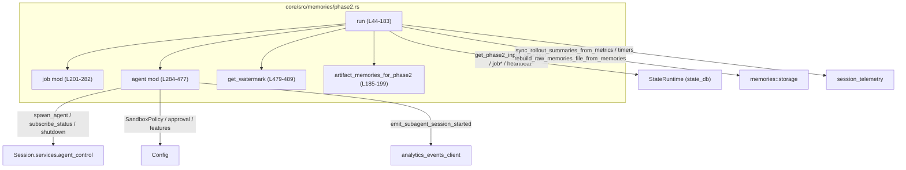
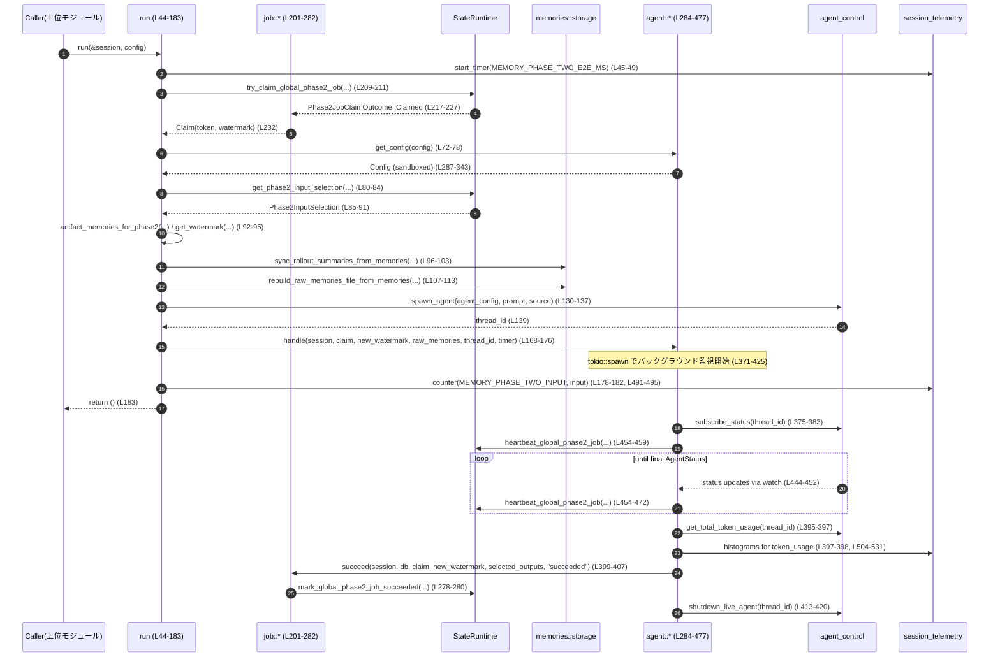

# core/src/memories/phase2.rs コード解説

## 0. ざっくり一言

- グローバルな「メモリフェーズ2（consolidation）」ジョブを **1件だけクレームし、入力メモリをDBから取得 → ファイルシステムへ同期 → 専用サブエージェントを起動し完了を監視 → 成否をDBに反映しつつメトリクスを送信** するモジュールです。  
  （`run` 関数が全体フローを表現します。[根拠: phase2.rs:L42-44, L59-183]）

---

## 1. このモジュールの役割

### 1.1 概要

- このモジュールは **グローバルメモリの「フェーズ2（consolidation）」ジョブ** を処理するために存在し、次の機能を提供します。  
  - ジョブのクレーム／失敗／成功管理（DBのジョブテーブルを操作）[根拠: L59-70, L201-282]  
  - フェーズ2入力として扱う Stage1Output の選定・重複排除と、それに基づくファイルシステム同期 [根拠: L80-115, L185-199]  
  - サンドボックスされた「メモリ統合エージェント」の設定と起動、ステータス監視とハートビート [根拠: L130-176, L284-476]  
  - トークン使用量やジョブ状態などのメトリクス送出 [根拠: L45-49, L63-67, L178-182, L241-245, L273-277, L491-531]

### 1.2 アーキテクチャ内での位置づけ

- 上位のオーケストレータ（ここでは不明）が本モジュールの `run` を呼び出し、`StateRuntime`（state_db）とファイルストレージ（`memories::storage`）を介してグローバルメモリを統合する流れになっています。[根拠: L44-57, L80-115, L201-282]
- 実際の統合処理（LLMによる要約など）は、`Session` の `agent_control` によって起動されるサブエージェントが行い、このモジュールはそのライフサイクル管理に専念しています。[根拠: L130-176, L357-425]



### 1.3 設計上のポイント

- **責務の分割**  
  - `run` がフェーズ2全体の直線的なフロー（クレーム → 入力取得 → FS更新 → エージェント起動 → メトリクス）をまとめています。[根拠: L42-44, L59-183]  
  - ジョブ状態管理は `mod job` に分離されています（claim/failed/succeed）。[根拠: L201-282]  
  - エージェント関連（設定生成・プロンプト生成・ライフサイクル管理）は `mod agent` に分離されています。[根拠: L284-477]
- **状態管理**  
  - ジョブ所有権は DB の `try_claim_global_phase2_job` と `heartbeat_global_phase2_job` を用いて管理し、ハートビートが失敗／所有権喪失時には `AgentStatus::Errored` に変換しています。[根拠: L204-233, L427-476]
- **非同期・並行性**  
  - `run` は async 関数で、DB操作・FS同期・エージェント起動は `await` ベースで行われます。[根拠: L44-183]  
  - エージェントの監視は `tokio::spawn` でバックグラウンドタスクとして実行され、さらに内部でサブタスク（自動シャットダウン）も spawn されています。[根拠: L371-425, L413-420]
- **安全性・サンドボックス**  
  - サブエージェントは `SandboxPolicy::WorkspaceWrite` を用いて `codex_home` 配下のみ書き込み可能、ネットワーク禁止とされています。[根拠: L310-326]  
  - メモリ生成の自己再帰を防ぐため `generate_memories = false` にしています。[根拠: L301-302]  
  - 一部機能（SpawnCsv, Collab, MemoryTool）は明示的に無効化されます。[根拠: L305-308]

---

## 2. コンポーネント一覧（インベントリー）

### 2.1 型一覧

| 名前 | 種別 | 可視性 | 役割 / 用途 | 根拠 |
|------|------|--------|-------------|------|
| `Claim` | 構造体 | モジュール内(private) | ジョブ所有権トークンと入力ウォーターマークを保持する小さな DTO | phase2.rs:L31-35, L204-233 |
| `Counters` | 構造体 | モジュール内(private) | メトリクス送信用の入力件数カウンタ保持 | phase2.rs:L37-40, L178-182 |

### 2.2 関数・モジュール一覧

| 名前 | 種別 | 可視性 | 役割 / 用途 | 根拠 |
|------|------|--------|-------------|------|
| `run` | async fn | `pub(super)` | フェーズ2全体の制御フロー（クレーム～FS更新～エージェント起動～メトリクス） | L42-44, L44-183 |
| `artifact_memories_for_phase2` | fn | private | 入力選択結果から rollout summary 単位で重複しない Stage1Output 一覧を生成 | L185-199 |
| `mod job` | モジュール | private | グローバルフェーズ2ジョブのクレーム・失敗・成功処理をカプセル化 | L201-282 |
| `job::claim` | async fn | `pub(super)` | グローバルフェーズ2ジョブを DB からクレームし、`Claim` を返す | L204-233 |
| `job::failed` | async fn | `pub(super)` | ジョブ失敗時にメトリクスを送信し、DB のジョブ状態を failed に更新 | L235-263 |
| `job::succeed` | async fn | `pub(super)` | ジョブ成功時にメトリクス送信と completion_watermark の記録 | L265-281 |
| `mod agent` | モジュール | private | メモリ統合サブエージェントに関する設定・プロンプト・制御 | L284-477 |
| `agent::get_config` | fn | `pub(super)` | フェーズ2専用のサンドボックス・機能制限を適用した Config を構築 | L287-343 |
| `agent::get_prompt` | fn | `pub(super)` | Phase2InputSelection から統合用プロンプトテキストを構築 | L345-355 |
| `agent::handle` | fn | `pub(super)` | エージェントのステータス監視・ジョブ心拍・成功/失敗処理・自動シャットダウンを行うタスクを spawn | L357-425 |
| `agent::loop_agent` | async fn | `pub(crate)`相当（モジュール内） | watch チャンネルとハートビートを使って最終 `AgentStatus` を待ち受ける | L427-476 |
| `get_watermark` | fn | `pub(super)` | Stage1Output の更新時刻から次のジョブ用ウォーターマーク値を決定 | L479-489 |
| `emit_metrics` | fn | private | 入力件数と「agent_spawned」イベントのメトリクス送信 | L491-502 |
| `emit_token_usage_metrics` | fn | private | トークン使用量（total/input/cached_input/output/reasoning_output）のヒストグラム送信 | L504-531 |

---

## 3. 公開 API と詳細解説

ここでは、外部（同モジュール階層以上）から利用される可能性が高い `pub(super)` 関数を中心に詳しく説明します。

### 3.1 型一覧（構造体）

| 名前 | 種別 | フィールド | 役割 / 用途 | 根拠 |
|------|------|-----------|-------------|------|
| `Claim` | 構造体 | `token: String`, `watermark: i64` | DB 上のフェーズ2ジョブに対する所有権トークンと、クレーム時点の入力ウォーターマーク値を保持 | L31-35, L216-233 |
| `Counters` | 構造体 | `input: i64` | フェーズ2の入力件数を集約し、メトリクス送信に利用 | L37-40, L178-182, L491-495 |

---

### 3.2 重要関数の詳細

#### `run(session: &Arc<Session>, config: Arc<Config>) -> impl Future<Output = ()>`

**概要**

- グローバルメモリのフェーズ2統合処理の **メインエントリーポイント** です。[根拠: L42-44]
- ジョブのクレームから、入力メモリ取得、ファイルシステム同期、サブエージェント起動、メトリクス送信までを直線的なステップとして実行します。[根拠: L59-183]

**引数**

| 引数名 | 型 | 説明 | 根拠 |
|--------|----|------|------|
| `session` | `&Arc<Session>` | 現在の Codex セッション。DB、エージェント制御、テレメトリ等のサービスへのアクセスに使用します。 | L44-47, L51-52, L63-67, L130-176, L147-166, L178-182 |
| `config` | `Arc<Config>` | グローバル設定。フェーズ2用エージェント構成やメモリ関連の閾値/モデル設定を含みます。 | L44, L55-57, L72-78, L130-132 |

**戻り値**

- `()`（ユニット）。  
  完了時に何も返しません。エラーは内部でログ出力・メトリクス・ジョブ状態更新として処理されます。[根拠: `async fn` で Result 等を返していない: L44]

**内部処理の流れ**

1. **E2E タイマー開始**  
   - `session_telemetry.start_timer(MEMORY_PHASE_TWO_E2E_MS)` でフェーズ2全体の処理時間計測を開始します。[根拠: L45-49]

2. **DB ハンドル取得**  
   - `session.services.state_db.as_deref()` から `&StateRuntime` を取得できなければ早期 return（「起こらないはず」とコメント）。[根拠: L51-54]

3. **各種設定値の取得**  
   - `memory_root` からフェーズ2用の作業ディレクトリを決定。[根拠: L55]  
   - `max_raw_memories_for_consolidation` と `max_unused_days` を設定から取得。[根拠: L56-57]

4. **ジョブのクレーム**  
   - `job::claim(session, db).await` を呼び出し、`Claim` を取得。  
   - 失敗時にはメトリクス `MEMORY_PHASE_TWO_JOBS{status=e}` をインクリメントし、即 return。[根拠: L59-70, L204-233]

5. **エージェント用 Config 構築**  
   - `agent::get_config(config.clone())` でフェーズ2専用の制限付き Config を取得。  
   - `None` の場合はエラーをログ出力し、`job::failed(..., "failed_sandbox_policy")` を呼んで return。[根拠: L72-78, L287-343]

6. **フェーズ2入力メモリの取得**  
   - `db.get_phase2_input_selection(max_raw_memories, max_unused_days).await` で `Phase2InputSelection` を取得。[根拠: L80-84]  
   - 失敗時にはログ出力後、`job::failed(..., "failed_load_stage1_outputs")` で return。[根拠: L85-90]  
   - `selection.selected` を `raw_memories` としてコピーし、`artifact_memories_for_phase2` で `previous_selected` を含めた重複なし一覧 `artifact_memories` を作成。[根拠: L92-94, L185-199]  
   - `get_watermark(claim.watermark, &raw_memories)` で新しいウォーターマーク `new_watermark` を計算。[根拠: L94, L479-489]

7. **ファイルシステムの同期**  
   - `sync_rollout_summaries_from_memories` で `rollout_summaries/` を更新。[根拠: L96-103]  
   - `rebuild_raw_memories_file_from_memories` で `raw_memories.md` を再生成。[根拠: L107-113]  
   - いずれかが失敗するとログを出力し、`job::failed` でジョブを `failed_sync_artifacts` または `failed_rebuild_raw_memories` としてマークし return。[根拠: L100-105, L108-115]

8. **入力なしの場合のショートカット成功**  
   - `raw_memories.is_empty()` なら、`job::succeed(..., new_watermark, &[], "succeeded_no_input")` を呼び、return。[根拠: L116-127]

9. **サブエージェントの起動**  
   - `agent::get_prompt(config, &selection)` でプロンプトを構築。[根拠: L130-132, L345-355]  
   - `SessionSource::SubAgent(SubAgentSource::MemoryConsolidation)` を設定し、`spawn_agent(agent_config, prompt.into(), Some(source))` でサブエージェントを起動。[根拠: L132-137]  
   - 失敗時は `job::failed(..., "failed_spawn_agent")` を呼んで return。[根拠: L139-143]

10. **分析用イベントの送信**  
    - `get_agent_config_snapshot(thread_id)` が Some の場合、`Feature::GeneralAnalytics` が有効なら `emit_subagent_session_started` を発行。[根拠: L147-163]

11. **エージェント監視タスクの起動**  
    - `agent::handle(...)` を呼び、エージェント終了とジョブ成否処理を行う非同期タスクを `tokio::spawn` で起動。[根拠: L168-176, L357-425]  
    - この時点で `run` 自体はエージェント完了を待たずに戻ります（バックグラウンド処理）。[根拠: `handle` が `tokio::spawn` するのみで await されていない: L371-425]

12. **メトリクス送信**  
    - 入力件数を `Counters { input: raw_memories.len() as i64 }` に詰めて `emit_metrics` を呼び、入力数と「agent_spawned」イベントを記録。[根拠: L178-182, L491-502]

**Errors / Panics**

- エラーはすべて内部で処理され、`Result` としては外部に返しません。
- エラー時の主なパスとジョブステータス:
  - ジョブクレーム失敗: `job::claim` が `"failed_claim"` などを返し、メトリクス `MEMORY_PHASE_TWO_JOBS{status=<文字列>}` のみ。[根拠: L59-70, L204-233]
  - エージェント Config 構築失敗: `"failed_sandbox_policy"` で `job::failed`。[根拠: L72-78, L287-343]
  - 入力取得失敗: `"failed_load_stage1_outputs"`。[根拠: L80-90]
  - FS 同期失敗: `"failed_sync_artifacts"` または `"failed_rebuild_raw_memories"`。[根拠: L96-115]
  - エージェント起動失敗: `"failed_spawn_agent"`。[根拠: L130-144]

**Edge cases（エッジケース）**

- `state_db` が None の場合: コメントでは「起こらないはず」とありますが、その場合は何もせずに return します。[根拠: L51-54]
- 入力メモリが 0 件: FS 同期までは行った上で、ジョブを `succeeded_no_input` として成功扱いにします。[根拠: L116-127]
- `job::claim` が `"skipped_not_dirty"` や `"skipped_running"` を返す場合: メトリクスのみ送信され、実処理は行われません。[根拠: L59-70, L217-230]

**使用上の注意点**

- `run` はエージェント完了を待たずに戻るため、「フェーズ2の完了」を待ちたい呼び出し側は別途ジョブ状態を DB から監視する必要があります（ここでは提供されていません）。[根拠: L168-176, L371-425]
- `session.services.state_db` が必須依存であり、None の場合は silently return するため、上位層では state_db の初期化が前提になります。[根拠: L51-54, L366-367]

---

#### `job::claim(session: &Arc<Session>, db: &StateRuntime) -> Result<Claim, &'static str>`

**概要**

- グローバルフェーズ2ジョブの所有権を DB からクレームし、トークンとウォーターマークを `Claim` として返します。[根拠: L204-233]

**引数**

| 引数名 | 型 | 説明 |
|--------|----|------|
| `session` | `&Arc<Session>` | session_telemetry を通じてメトリクス送信に利用します。 |
| `db` | `&StateRuntime` | ジョブクレーム操作 `try_claim_global_phase2_job` を提供するランタイムです。 |

**戻り値**

- `Ok(Claim)` — ジョブを正常にクレームし、`ownership_token` と `input_watermark` を格納した `Claim` を返します。[根拠: L216-227, L232]  
- `Err("failed_claim" | "skipped_not_dirty" | "skipped_running")` — DB 呼び出し失敗またはクレーム対象なし／すでに進行中の場合。[根拠: L212-215, L228-229]

**内部処理**

1. `db.try_claim_global_phase2_job(session.conversation_id, phase_two::JOB_LEASE_SECONDS).await` を呼び出し。[根拠: L209-211]
2. エラー時はログ出力し `"failed_claim"` を返す。[根拠: L212-215]
3. 成功時は `Phase2JobClaimOutcome` に応じて分岐:
   - `Claimed` の場合: メトリクス `MEMORY_PHASE_TWO_JOBS{status="claimed"}` をインクリメントし、`Claim { token: ownership_token, watermark: input_watermark }` を返す。[根拠: L217-227, L221-225, L232]
   - `SkippedNotDirty` / `SkippedRunning` の場合: それぞれ `"skipped_not_dirty"` / `"skipped_running"` の Err を返す。[根拠: L228-229]

**Errors / Edge cases**

- DB 呼び出しが失敗した場合は `"failed_claim"` 固定の `&'static str` を返します（詳細なエラー情報はログのみ）。[根拠: L212-215]
- `Phase2JobClaimOutcome` が将来拡張される場合、この `match` に non-exhaustive な変更が必要になる可能性があります（現時点では3パターンのみ）。[根拠: L217-229]

**使用上の注意点**

- `Claim` はその後の `job::failed` / `job::succeed` / `agent::handle` で用いるため、呼び出し側で保持し続ける必要があります。[根拠: L59-70, L72-78, L168-176, L235-281, L357-425]

---

#### `agent::get_config(config: Arc<Config>) -> Option<Config>`

**概要**

- 既存の `Config` を基に、フェーズ2用サブエージェントに適した **サンドボックス・機能制限付き設定** を構築します。[根拠: L287-343]

**引数**

| 引数名 | 型 | 説明 |
|--------|----|------|
| `config` | `Arc<Config>` | ベースとなる設定（呼び出し側の全体設定） |

**戻り値**

- `Some(Config)` — 変更済みの `Config`。  
- `None` — 作業ディレクトリやサンドボックスの設定に失敗した場合。[根拠: L291-300, L327-331, L342-343]

**内部処理**

1. `memory_root(&config.codex_home)` からフェーズ2用のルートパスを計算。[根拠: L288]
2. 元の Config を `clone` して `agent_config` に代入。[根拠: L289]
3. `AbsolutePathBuf::from_absolute_path(root)` で cwd を絶対パス化し、成功すれば `agent_config.cwd` に設定。失敗時は warn ログを出して `None` を返す。[根拠: L291-300]
4. フェーズ1へのフィードバック防止のため `agent_config.memories.generate_memories = false;`。[根拠: L301-302]
5. 承認ポリシーを `AskForApproval::Never` のみに制約（`Constrained::allow_only`）。[根拠: L303-304]
6. 再帰的なサブエージェント起動を防ぐため、`Feature::SpawnCsv`, `Feature::Collab`, `Feature::MemoryTool` を disable。[根拠: L305-308]
7. サンドボックスポリシー構築:
   - `writable_roots` として `codex_home` を AbsolutePathBuf 化して追加（失敗時は warn ログ）。[根拠: L310-318]
   - `SandboxPolicy::WorkspaceWrite` を作成し、`network_access: false` とする。[根拠: L319-326]
   - これを `agent_config.permissions.sandbox_policy.set(...)` で適用し、失敗した場合は `None`。[根拠: L327-331]
8. モデル設定:
   - `agent_config.model` を `config.memories.consolidation_model.unwrap_or(phase_two::MODEL.to_string())` に設定。[根拠: L333-339]
   - `agent_config.model_reasoning_effort` を `phase_two::REASONING_EFFORT` に設定。[根拠: L340]
9. 最終的な `agent_config` を `Some(...)` で返す。[根拠: L342-343]

**Edge cases**

- `memory_root` / `codex_home` の絶対パス化に失敗すると `None` になり、その上位の `run` からは `"failed_sandbox_policy"` としてジョブが失敗扱いになります。[根拠: L291-300, L72-78]
- `sandbox_policy.set(...)` が失敗するケース（例えば既にロック済みなど）が起きると `None` になります。[根拠: L327-331]

**安全性・セキュリティ観点**

- 書き込み可能領域は `codex_home` 配下に限定され、ネットワークアクセスも `false` で無効化されています。[根拠: L319-326]
- メモリ生成や追加サブエージェント起動に関わる機能を無効化することで、フェーズ2エージェントが自己増殖的にリソースを消費したり、フェーズ1パイプラインに影響を与えるリスクを抑えています。[根拠: L301-308]

---

#### `agent::handle(...)`

```rust
pub(super) fn handle(
    session: &Arc<Session>,
    claim: Claim,
    new_watermark: i64,
    selected_outputs: Vec<codex_state::Stage1Output>,
    thread_id: ThreadId,
    phase_two_e2e_timer: Option<codex_otel::Timer>,
)
```

**概要**

- 既に起動されたサブエージェント（`thread_id`）のステータスを監視し、  
  - 完了時にはトークン使用量メトリクス送信 + `job::succeed`  
  - 失敗時やステータス取得失敗時には `job::failed`  
  を実行するバックグラウンドタスクを `tokio::spawn` で起動します。[根拠: L357-425, 特に L371-425]

**引数**

| 引数名 | 型 | 説明 |
|--------|----|------|
| `session` | `&Arc<Session>` | メトリクス送信や agent_control へのアクセスに使用します。 |
| `claim` | `Claim` | 本ジョブの所有権トークン。失敗/成功時の DB 更新に使用します。 |
| `new_watermark` | `i64` | run で計算された次のウォーターマーク値。成功時に DB に記録します。 |
| `selected_outputs` | `Vec<Stage1Output>` | フェーズ2で実際に処理対象となった Stage1Output 一覧。成功時 DB に渡されます。 |
| `thread_id` | `ThreadId` | 対象サブエージェントの識別子。 |
| `phase_two_e2e_timer` | `Option<Timer>` | E2E 計測用タイマー。バックグラウンドタスク内の `_phase_two_e2e_timer` に束縛されて drop されることで計測終了になります。 |

**内部処理**

1. `state_db` が None の場合は何もせず return。[根拠: L366-368]
2. `session` を clone し、`tokio::spawn` で非同期タスクを起動。[根拠: L369-372]
3. タスク内では:
   - `_phase_two_e2e_timer` にタイマーを束縛（値は使用せず、スコープ終了時の drop を狙っていると推測できます）。[根拠: L372]
   - `agent_control.subscribe_status(thread_id).await` で `watch::Receiver<AgentStatus>` を取得。失敗時はログ出力と `job::failed(..., "failed_subscribe_status")`。[根拠: L373-383]
   - `loop_agent(...)` を呼び出して最終的な `AgentStatus` を取得。[根拠: L385-393]
   - `final_status` が `AgentStatus::Completed(_)` の場合:
     - `agent_control.get_total_token_usage(thread_id).await` が Some なら `emit_token_usage_metrics` でメトリクス送信。[根拠: L395-398, L504-531]
     - `job::succeed(&session, &db, &claim, new_watermark, &selected_outputs, "succeeded")`。[根拠: L399-407]
   - それ以外のステータスなら `job::failed(..., "failed_agent")`。[根拠: L408-410]
   - 最後に、`final_status` が `Shutdown` または `NotFound` でなければ、`agent_control.shutdown_live_agent(thread_id).await` を別タスクで実行し、失敗時には warn ログ。[根拠: L412-420]  
     逆に `Shutdown` / `NotFound` の場合は「すでに居ない」と warn ログ。[根拠: L421-423]

**非同期・並行性の観点**

- `handle` 自体は同期関数ですが `tokio::spawn` の中で async ブロックを実行します。[根拠: L371-425]
- タスクは `session` / `db` / `agent_control` を `Arc` 経由で共有しており、所有権の問題は `Arc` によって解決されています。[根拠: L366-369, L373-374]
- `loop_agent` 内でハートビートとステータス受信を `tokio::select!` で同時待機し、ジョブの lease 失効を検知します。[根拠: L427-476]

**Edge cases**

- `subscribe_status` に失敗した場合、ジョブは `"failed_subscribe_status"` としてマークされます。[根拠: L376-383]
- `get_total_token_usage` が None の場合、トークンメトリクスは送信されませんが、`job::succeed` は実行されます。[根拠: L395-407]
- エージェントが既に `Shutdown` / `NotFound` の場合、`shutdown_live_agent` は呼ばれず、warn ログのみ。[根拠: L413-423]

---

#### `agent::loop_agent(...) -> AgentStatus`

```rust
async fn loop_agent(
    db: Arc<StateRuntime>,
    token: String,
    _new_watermark: i64,
    thread_id: ThreadId,
    mut rx: watch::Receiver<AgentStatus>,
) -> AgentStatus
```

**概要**

- `watch::Receiver<AgentStatus>` 経由でエージェントの状態変化を監視しつつ、定期的に DB へハートビートを送り、最終的な `AgentStatus` を返します。[根拠: L427-476]

**主要な処理**

1. ハートビート間隔タイマーを `JOB_HEARTBEAT_SECONDS` で初期化し、`MissedTickBehavior::Skip` に設定。[根拠: L434-436]
2. 無限ループ:
   - 現在のステータス `status = rx.borrow().clone()` を取得。[根拠: L439-440]
   - `is_final_agent_status(&status)` が true なら `status` を返してループ終了。[根拠: L440-442]
   - そうでなければ `tokio::select!`:
     - `rx.changed()` を待ち、エラー（送信側がドロップなど）なら warn ログを出して現在の `status` でループを抜ける。[根拠: L444-451]
     - `heartbeat_interval.tick()` を待ち、`db.heartbeat_global_phase2_job(&token, JOB_LEASE_SECONDS).await` の結果に応じて:
       - `Ok(true)` — 何もせず継続。[根拠: L454-462]
       - `Ok(false)` — 「ownership を失った」として `AgentStatus::Errored` に切り替えてループを抜ける。[根拠: L462-466]
       - `Err(err)` — 「heartbeat update failed」として `AgentStatus::Errored` を返してループ終了。[根拠: L467-471]

**安全性・並行性**

- `db` は `Arc<StateRuntime>` として clone され、複数タスクから安全に共有される前提です。[根拠: L428-429, L386-388]
- watch チャンネルは読み取り専用であり、`rx.changed()` で待機する典型的なパターンです。[根拠: L432-433, L444-452]

---

#### `artifact_memories_for_phase2(selection: &Phase2InputSelection) -> Vec<Stage1Output>`

**概要**

- 現在選択された `selected` と、過去に選択された `previous_selected` から、rollout summary ファイル単位で一意な `Stage1Output` のリストを構築します。[根拠: L185-199]

**処理内容**

1. `seen` という `HashSet` に `rollout_summary_file_stem(memory)` を保存。[根拠: L188-192]
2. まず `selection.selected.clone()` をベースに `memories` を初期化。[根拠: L189]
3. `previous_selected` をループし、`seen.insert(rollout_summary_file_stem(memory))` が `true` の場合にだけ `memories.push(memory.clone())`。[根拠: L193-196]
4. 結果として「selected かつ previous_selected を加えたユニークな一覧」を返します。[根拠: L189-199]

**Edge cases**

- `selected` / `previous_selected` のいずれかが空でも問題なく動作します。
- `rollout_summary_file_stem` が同じ複数の `Stage1Output` がある場合、最初に現れたもののみが `memories` に残ります。[根拠: L190-196]

---

#### `get_watermark(claimed_watermark: i64, latest_memories: &[Stage1Output]) -> i64`

**概要**

- クレーム時のウォーターマークと、今回処理する Stage1Output の `source_updated_at` を比較し、**非減少（monotonic）な次ウォーターマーク** を返します。[根拠: L479-489]

**処理内容**

1. `latest_memories.iter().map(|m| m.source_updated_at.timestamp()).max()` で最新の timestamp（秒）を求めます。[根拠: L483-486]
2. `.unwrap_or(claimed_watermark)` により、入力が空の場合は `claimed_watermark` を採用。[根拠: L486-487]
3. `.max(claimed_watermark)` によって、計算結果がクレーム時より小さくならないようにします（コメントに `todo double check` あり）。[根拠: L488]

**Edge cases**

- `latest_memories` が空の場合: `claimed_watermark` がそのまま返されます。[根拠: L486-488]
- 全ての `source_updated_at` が `claimed_watermark` 未満でも、最終的には `claimed_watermark` 以上になります（`max` により非減少）。[根拠: L483-488]

---

### 3.3 その他の関数

| 関数名 | 役割（1 行） | 根拠 |
|--------|--------------|------|
| `job::failed` | メトリクスを送信し、ジョブを failed にマーク（必要なら unowned の場合も再マーク）します。 | L235-263 |
| `job::succeed` | メトリクス送信後、`mark_global_phase2_job_succeeded` でジョブ成功とウォーターマーク・選択出力を記録します。 | L265-281 |
| `agent::get_prompt` | `build_consolidation_prompt` を用いてフェーズ2入力に基づくテキストプロンプトを構築し `UserInput::Text` にラップします。 | L345-355 |
| `emit_metrics` | 入力件数と「agent_spawned」ステータスのメトリクスを session_telemetry に送信します。 | L491-502 |
| `emit_token_usage_metrics` | エージェントの total/input/cached_input/output/reasoning_output 各トークン数をヒストグラムメトリクスとして送信します。 | L504-531 |

---

## 4. データフロー

### 4.1 代表的な処理シナリオ

- 「フェーズ2ジョブのクレームに成功し、入力メモリが存在し、サブエージェントが正常完了したケース」を例に、データと制御の流れを示します。



---

## 5. 使い方（How to Use）

### 5.1 基本的な使用方法

このファイル自体は `pub(super)` で公開されているため、同じクレート内の上位モジュール（たとえば `memories` モジュール）から呼び出されることを想定できます。

```rust
use std::sync::Arc;
use crate::codex::Session;                     // セッション型（外部定義）
use crate::config::Config;                     // 設定型（外部定義）
use crate::memories::phase2;                   // このモジュール

async fn run_memory_phase2(session: Arc<Session>, config: Arc<Config>) {
    // フェーズ2を起動する。                         // ジョブクレーム〜エージェント起動までを行う
    phase2::run(&session, config).await;            // 完了を待つのは run の開始部分のみで、
                                                    // エージェントの終了はバックグラウンドで監視される
}
```

- この呼び出しでは、フェーズ2ジョブの完了は `run` の戻りをもって保証されません。ジョブ完了を確認したい場合は、`StateRuntime` 側のジョブ状態をポーリング/通知などで確認する必要があります（このファイルにはその API は含まれていません）。[根拠: L168-176, L371-425]

### 5.2 よくある使用パターン（推測レベル）

コードから確実に分かる範囲では、次のような使い分けが想定されます。

- **定期バッチ or スケジューラからの起動**  
  - スケジューラが一定間隔で `run` を呼び出し、`job::claim` によって dirty な状態がある場合だけ実際の処理が行われます。[根拠: L59-70, L204-233]
- **複数インスタンスでの排他制御**  
  - `try_claim_global_phase2_job` と heartbeat によって、複数プロセスが `run` を呼び出しても実際にジョブを実行するのは 1 インスタンスのみになる設計です。[根拠: L209-211, L454-472]

### 5.3 よくある間違い（起こり得る誤用例）

コードから推測できる範囲で、注意が必要な点を挙げます。

```rust
// 誤りの例（推測）: state_db 未初期化の Session で run を呼ぶ
async fn wrong_usage(session: Arc<Session>, config: Arc<Config>) {
    // session.services.state_db が None の場合、run は何もせず return する
    // （エラーログもメトリクスも出ない）
    phase2::run(&session, config).await;
}

// 正しい前提（推測）: state_db をセットアップした Session を渡す
async fn correct_usage(session_with_db: Arc<Session>, config: Arc<Config>) {
    phase2::run(&session_with_db, config).await;
}
```

- 上記のように、`state_db` が None の場合はコメント上「起こらないはず」とされていますが、安全のため上位層で必ず DB を初期化したセッションのみを渡す前提が必要と考えられます。[根拠: L51-54]

### 5.4 使用上の注意点（まとめ）

- **非同期タスクによるバックグラウンド実行**  
  - `agent::handle` が内部で `tokio::spawn` を行うため、フェーズ2エージェントの実行期間は `run` のライフタイムを超えます。呼び出し側でアプリケーションをすぐ終了すると、処理途中でタスクが失われる可能性があります。[根拠: L371-425]
- **ジョブ所有権のハートビート前提**  
  - `loop_agent` は `heartbeat_global_phase2_job` を繰り返し呼び出しており、DB が heartbeat を受け取れない状態になるとジョブは `Errored` とみなされます。[根拠: L454-472]
- **サンドボックス制約**  
  - エージェントは `codex_home` 配下以外への書き込みやネットワークアクセスが禁止されています。統合処理で外部リソースを利用する設計は想定されていません。[根拠: L310-326]

---

## 6. 変更の仕方（How to Modify）

### 6.1 新しい機能を追加する場合

例として、「フェーズ2完了時に追加のロギングや通知を行いたい」場合を考えます。

1. **終了処理のフック位置の特定**  
   - 成功時: `agent::handle` 内の `job::succeed` 呼び出し直前が自然な場所です。[根拠: L395-407]  
   - 失敗時: 同関数内の `job::failed(..., "failed_agent")` の直前。[根拠: L408-410]
2. **追加処理の実装ファイル**  
   - フェーズ2固有の処理であれば、この `phase2.rs` 内、もしくは `crate::memories` 配下の別ユーティリティモジュールにまとめるのが自然です（他ファイルはこのチャンクからは不明）。
3. **依存の確認**  
   - 追加処理に外部 I/O やネットワークが必要な場合、エージェント側ではなく、本モジュールのジョブ確定処理側で行う方がサンドボックス制約の影響を受けません。[根拠: L310-326, L395-410]

### 6.2 既存の機能を変更する場合の注意点

- **ジョブ契約（Contract）**  
  - `job::claim` / `job::failed` / `job::succeed` は、DB のジョブ管理テーブルと密接に結びついています。返すエラー文字列や reason を変更すると、メトリクスや上位の監視システムに影響する可能性があります。[根拠: L204-233, L235-281]
- **ウォーターマークの意味**  
  - `get_watermark` は「次に処理するべき入力の上限」を表しており、非減少であることが前提に見えます。ここを変更するとフェーズ2ジョブの再実行範囲に影響します。[根拠: L479-489]
- **エージェントのサンドボックス**  
  - `agent::get_config` で設定している機能無効化や `SandboxPolicy` は安全性に関する重要な制約です。これらを緩める場合は、セキュリティ上の影響を十分に確認する必要があります。[根拠: L301-308, L310-326]

---

## 7. 関連ファイル

このモジュールから直接参照されている他ファイル・モジュール（このチャンクに出てくるもの）をまとめます。

| パス / モジュール | 役割 / 関係 | 根拠 |
|-------------------|------------|------|
| `crate::memories::memory_root` | `codex_home` からメモリ用ルートディレクトリを求める関数。フェーズ2の作業ディレクトリ指定に利用。 | L6, L55, L288, L349 |
| `crate::memories::metrics` | メモリフェーズ2用のメトリクス名（`MEMORY_PHASE_TWO_*`）を提供。 | L7, L45-49, L63-67, L178-182, L241-245, L273-277, L491-531 |
| `crate::memories::phase_two` | フェーズ2ジョブ関連の定数（`JOB_LEASE_SECONDS`, `JOB_RETRY_DELAY_SECONDS`, `JOB_HEARTBEAT_SECONDS`, `MODEL`, `REASONING_EFFORT` など）を提供。 | L8, L209-211, L247-251, L256-260, L434-435, L456-458, L338-340 |
| `crate::memories::prompts::build_consolidation_prompt` | `Phase2InputSelection` から統合用プロンプト文字列を構築するヘルパー。 | L9, L345-351 |
| `crate::memories::storage::{sync_rollout_summaries_from_memories, rebuild_raw_memories_file_from_memories, rollout_summary_file_stem}` | Stage1Output に基づくファイルシステムとの同期および一意性判定に使用されます。 | L10-12, L99-115, L191, L195 |
| `codex_state::StateRuntime` | フェーズ2ジョブ管理（claim/failed/succeeded/heartbeat）と入力選択 `get_phase2_input_selection` を提供するランタイム。 | L23, L80-84, L204-211, L247-281, L454-459 |
| `codex_state::{Stage1Output, Phase2InputSelection, Phase2JobClaimOutcome}` | フェーズ1出力データ、フェーズ2入力選択、ジョブクレーム結果を表す型。 | L22, L185-199, L216-229 |
| `Session.services.agent_control` | サブエージェントの spawn / status subscribe / token usage 取得 / shutdown を行うコンポーネント。 | L133-137, L147-152, L373-383, L395-397, L413-420 |
| `Session.services.session_telemetry` | カウンタ・ヒストグラム・タイマーを送信するテレメトリ基盤。 | L45-49, L63-67, L178-182, L241-245, L273-277, L491-531 |
| `codex_protocol::protocol::{SessionSource, SubAgentSource, TokenUsage, AskForApproval, SandboxPolicy}` | サブエージェントの起動元種別、トークン使用量、承認ポリシー、サンドボックスポリシーなどのプロトコル定義。 | L16-20, L130-133, L319-326, L504-531 |

---

## Bugs / Security / Contracts / Tests / 性能 について（まとめて言及）

※ これらは専用見出しが禁じられているため、本節で簡潔にまとめます。

- **潜在的なバグ候補（観察のみ）**
  - `loop_agent` の引数 `_new_watermark` が未使用です（プレースホルダとして残っているだけに見えます）。[根拠: L430, 未使用アンダースコア付き]
  - `get_watermark` に `// todo double check the claimed here.` とコメントがあり、ウォーターマーク計算ロジックの妥当性を作者自身が再確認予定であることが示唆されています。[根拠: L488]
- **セキュリティ**
  - サブエージェントは `WorkspaceWrite` サンドボックスでネットワーク禁止・`codex_home` のみ書き込み可能となっており、外部影響の範囲が制限されています。[根拠: L310-326]
  - メモリ生成機能と追加サブエージェント起動関連の feature を無効化しているため、フェーズ2処理が他のフェーズに波及するリスクを抑えています。[根拠: L301-308]
- **Contracts / Edge Cases**
  - `Claim` の `token` は、`job::failed` / `job::succeed` / `heartbeat_global_phase2_job` などの DB 操作のキーとして一貫して使用されます。このトークンの一意性および有効期限は DB 側の契約に依存します。[根拠: L216-233, L247-260, L454-459]
  - `run` はあらゆる異常を内部で完結処理し、呼び出し元には `()` しか返さないため、「成功したかどうか」は DB の状態かメトリクスを通じて知ることになります。
- **テスト観点（このファイル内にはテストコードなし）**
  - このチャンクには単体テストや統合テストは含まれていません。[根拠: 全体に `#[cfg(test)]` 等が存在しない]  
  - テストしやすい対象としては `artifact_memories_for_phase2` と `get_watermark` が挙げられます（純粋関数的で副作用が少ない）。[根拠: L185-199, L479-489]
- **性能・スケーラビリティ**
  - `artifact_memories_for_phase2` は `selected` + `previous_selected` に比例する O(n) の処理で、ハッシュセットによる重複排除を行っています。[根拠: L188-196]
  - `loop_agent` は heartbeat 間隔を `JOB_HEARTBEAT_SECONDS` としており、ジョブ数が増えても DB への負荷は心拍間隔の調整で制御可能です。[根拠: L434-435, L454-459]
- **オブザーバビリティ**
  - メトリクス: ジョブ状態、入力件数、トークン使用量、E2E 処理時間が `session_telemetry` を通じて収集され、監視・分析の基盤となります。[根拠: L45-49, L63-67, L178-182, L241-245, L273-277, L491-531]
  - ログ: ジョブクレーム失敗、入力取得失敗、FS 同期失敗、サブエージェント spawn・subscribe 失敗、サンドボックス設定失敗など、主要な失敗経路で `error!` または `warn!` ログが出力されます。[根拠: L75-76, L87-88, L103-104, L112-113, L141-142, L165-166, L213-214, L294-297, L315-316, L379-380, L447-449, L468-470, L416-419, L421-423]

以上が、このチャンクに基づいて確認できる `core/src/memories/phase2.rs` の構造と挙動の解説です。
