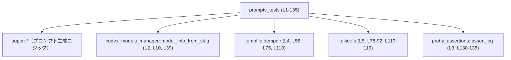
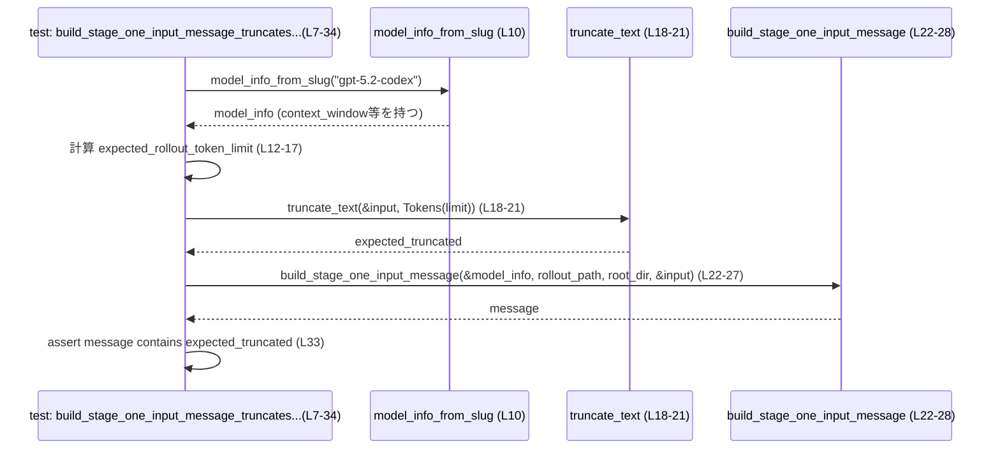

# core/src/memories/prompts_tests.rs コード解説

## 0. ざっくり一言

`core/src/memories/prompts_tests.rs` は、メモリ関連の **プロンプト生成ロジック** の挙動を検証するテスト群を定義するモジュールです。  
ステージ1入力メッセージのトークン制限、メモリ統合プロンプト、メモリツール開発者向けインストラクションの生成仕様を文字列レベルで確認しています。

---

## 1. このモジュールの役割

### 1.1 概要

このモジュールは、次のような振る舞いをテストすることで、上位モジュール（`super::*`）が提供するプロンプト生成 API の契約を固定しています。

- **ステージ1入力メッセージのトークン制限**  
  モデルの `context_window` と `effective_context_window_percent`、さらに `phase_one::CONTEXT_WINDOW_PERCENT` に基づき、ロールアウトテキストが適切にトークン数でトリムされることを確認します（`build_stage_one_input_message_truncates_rollout_using_model_context_window`, `prompts_tests.rs:L7-34`）。

- **`context_window` 未設定時のデフォルト制限**  
  `model_info.context_window = None` の場合に、`phase_one::DEFAULT_STAGE_ONE_ROLLOUT_TOKEN_LIMIT` を用いたトランケーション結果がメッセージに含まれることを確認します（`L36-54`）。

- **メモリ統合プロンプトのテンプレート内容**  
  `build_consolidation_prompt` が、メモリディレクトリ構成や差分情報の説明を含み、拡張が無い場合は「Memory extensions」セクションを出さないことを確認します（`L56-71`）。

- **メモリ拡張の扱い（参照のみでインラインしない）**  
  実ファイルを持つ `memories_extensions` を用意した上で、`build_consolidation_prompt` が拡張の存在とパスを説明しつつ、ファイル中身のテキストはプロンプトに含めないことを確認します（`L73-106`）。

- **メモリツール開発者向けインストラクション**  
  `build_memory_tool_developer_instructions` が `memories/memory_summary.md` の存在を前提にし、その内容を一度だけ埋め込み、二重読み込みを避けることを確認します（`L108-135`）。

### 1.2 アーキテクチャ内での位置づけ

このモジュールは **テスト専用** であり、プロダクションコード（`super::*`）が提供する関数群の上に位置します。

- 直接利用している外部コンポーネント（事実としてコードに現れるもの）:
  - `super::*` から再輸入される関数・型  
    `build_stage_one_input_message`, `build_consolidation_prompt`, `build_memory_tool_developer_instructions`, `truncate_text`, `TruncationPolicy`, `Phase2InputSelection` など（`L18-23, L41-46, L61, L94, L121`）。
  - モデル情報取得: `codex_models_manager::model_info::model_info_from_slug`（`L2, L10, L39`）
  - 一時ディレクトリ: `tempfile::tempdir`（`L4, L58, L75, L110`）
  - 非同期ファイル操作: `tokio::fs`（`L5, L78-92, L113-119`）
  - アサート系: `assert!`（標準）、`pretty_assertions::assert_eq`（`L3, L130-135`）

依存関係のイメージを簡略化すると次のようになります。



`super::*` の具体的なファイル名（例: `prompts.rs` など）は、このチャンクからは分かりませんが、同じディレクトリの親モジュールに定義されていることだけは `use super::*;`（`L1`）から読み取れます。

### 1.3 設計上のポイント

コードから読み取れる設計上の特徴を列挙します。

- **テスト駆動の契約定義**  
  すべての検証は「生成された文字列に特定の部分文字列が含まれる／含まれない」ことを通じて行われています（`L30-33, L53, L63-70, L97-105, L125-134`）。  
  これにより、プロンプトのフォーマットや含まれる情報の有無が暗黙の契約として固定されます。

- **状態を持たないテスト関数**  
  各テストは一時ディレクトリ（`tempdir()`）やローカル変数を通じて必要な状態を構築し、グローバルな状態に依存していません（`L58-60, L75-77, L110-113`）。

- **エラーハンドリング方針（テスト側）**  
  ファイル操作やビルド関数はすべて `unwrap()` で扱われており、エラー時にはテストが panic して失敗します（`L17, L28, L51, L58, L78-80, L85-87, L91-92, L113-119, L121-123`）。  
  プロダクションコード側のエラー型や詳細条件は、このチャンクからは分かりません。

- **非同期 I/O と `#[tokio::test]`**  
  ファイル作成が必要なテストのうち、非同期 API (`tokio::fs`) を使うものは `#[tokio::test]` による非同期テストとして実装されています（`L73, L108`）。  
  すべての `await` は直列であり、複数タスクの並列実行は行っていません（`L78-92, L113-119`）。

- **安全性（Rust 文脈）**  
  `unsafe` ブロックは登場せず、所有権・借用は標準的な範囲で利用されています。巨大な文字列（140万文字）を生成しても、それはローカル変数に所有され、テスト終了とともに解放されます（`L9, L38`）。

---

## 2. 主要な機能一覧（このモジュールが検証する振る舞い）

このファイル自身は公開 API を定義しませんが、テストを通じて次のような機能の契約を検証しています。

- ステージ1入力メッセージのロールアウトテキストのトークン単位トランケーション  
  `build_stage_one_input_message_truncates_rollout_using_model_context_window`（`L7-34`）

- モデルの `context_window` 欠如時にデフォルトトークン上限を利用するステージ1メッセージ生成  
  `build_stage_one_input_message_uses_default_limit_when_model_context_window_missing`（`L36-54`）

- メモリ統合プロンプトにおけるフォルダ構造・差分情報テンプレートのレンダリング  
  `build_consolidation_prompt_renders_embedded_template`（`L56-71`）

- メモリ拡張ディレクトリの存在をプロンプトで案内しつつ、中身のファイルをインラインしない挙動  
  `build_consolidation_prompt_points_to_extensions_without_inlining_them`（`L73-106`）

- メモリツール開発者向けインストラクションにおける `memory_summary.md` の一回限りの埋め込み  
  `build_memory_tool_developer_instructions_renders_embedded_template`（`L108-135`）

---

## 3. 公開 API と詳細解説

このファイルには公開 API 定義はありませんが、**テスト対象となっている関数・型を通じて上位モジュールの API 契約がわかる**ため、それらを中心に整理します。

### 3.1 型一覧（外部依存を含む）

このモジュール内で新しい型定義はありませんが、重要な外部型がいくつか利用されています。

| 名前 | 種別 | 定義元（推定/事実） | 役割 / 用途 | 出現場所 |
|------|------|---------------------|-------------|----------|
| （仮称）ModelInfo | 構造体 | `codex_models_manager::model_info_from_slug` の戻り値（型名はこのチャンクでは不明） | モデルの `context_window` と `effective_context_window_percent` フィールドを持つ（`L10-15`）。ステージ1メッセージのトークン上限算出に利用。 | `L10-15, L39-40` |
| `TruncationPolicy` | 列挙体（推定） | `super::*`（実定義は別ファイル） | テキストのトランケーション方針を表す。ここでは `Tokens(usize)` バリアントが使われている（`L20, L43`）。 | `L20, L43` |
| `Phase2InputSelection` | 構造体/列挙体（不明） | `super::*` | フェーズ2で選択された入力の情報を表す型と考えられる。テストでは `::default()` のみ利用（`L61, L94`）。 | `L61, L94` |
| `Path` | 構造体 | `std::path::Path`（型名のみ利用） | ファイルパス/ディレクトリパスを表す。`Path::new` 経由で `build_stage_one_input_message` に渡される（`L24-25, L47-48`）。 | `L24-25, L47-48` |
| `tempfile::TempDir` | 構造体 | crate `tempfile` | テスト用の一時ディレクトリルート。メモリディレクトリや拡張ディレクトリのルートとして利用（`L58-60, L75-77, L110-113`）。 | `L58-60, L75-77, L110-113` |

> ModelInfo という名称は便宜上の呼び名です。実際の型名はこのチャンクからは分かりませんが、`model_info_from_slug` の戻り値が `context_window` と `effective_context_window_percent` フィールドを持つことだけはコードから分かります（`L10-15, L39-40`）。

### 3.2 関数詳細（テスト対象 API）

ここでは、このモジュールから呼び出されている主要な API を対象に、テストから読み取れる契約・データフローを整理します。

---

#### `build_stage_one_input_message(model_info: &M, rollout_path: &Path, root_dir: &Path, input: &str) -> Result<String, E>`

※ `M` は `model_info_from_slug` の戻り値の型、`E` はエラー型であり、いずれもこのチャンクからは具体名不明（`L10, L22-27`）。

**概要**

- ステージ1の「入力メッセージ」を構築する関数です。  
- 非常に長い `input` テキストに対して、モデルの文脈長設定に基づくトークン上限でトランケーションを行い、その結果をメッセージに含めることが期待されています（`L9-21, L22-33`）。

**引数（テストから分かる範囲）**

| 引数名 | 型 | 説明 |
|--------|----|------|
| `model_info` | `&M` | モデル設定。`context_window` と `effective_context_window_percent` を持つ（`L10-15, L39-40`）。 |
| `rollout_path` | `&Path` | `/tmp/rollout.jsonl` などのロールアウトファイルパス（`L24, L47`）。テストでは中身は使用されない。 |
| `root_dir` | `&Path` | `/tmp` のような作業ディレクトリパス（`L25, L48`）。 |
| `input` | `&str` | 長大な入力文字列（140万文字規模）（`L9, L38`）。 |

**戻り値**

- `Result<String, E>` のような結果型と推測できます（`L28, L51` で `unwrap()` しているため）。  
- 成功時の `Ok` 内部は、プロンプト全体を表す文字列であり、その中にトランケーションされたロールアウトテキストが含まれることが期待されています（`L33, L53`）。

**内部処理の流れ（テストから推測できる契約）**

テストコードから読み取れる契約をステップでまとめます。

1. 呼び出し元で `model_info.context_window` が `Some(…)` に設定される場合（`L11`）、次の式でトークン上限（ロールアウト部分）を計算します（`L12-17`）。

   ```rust
   // prompts_tests.rs:L12-17
   let expected_rollout_token_limit = usize::try_from(
       ((123_000_i64 * model_info.effective_context_window_percent) / 100)
           * phase_one::CONTEXT_WINDOW_PERCENT
           / 100,
   ).unwrap();
   ```

2. 同じテストでは、この上限値を用いて `truncate_text` を呼び出し、期待されるトランケーション結果を得ています（`L18-21`）。

3. `build_stage_one_input_message` を呼び出した結果（`message`）には、少なくともこの `expected_truncated` が **部分文字列として含まれていること** が求められています（`L33`）。

4. `context_window` が `None` の場合は、`phase_one::DEFAULT_STAGE_ONE_ROLLOUT_TOKEN_LIMIT` を用いたトランケーション結果が、同様にメッセージに含まれていることが求められます（`L40-44, L45-53`）。

これらから、「ステージ1入力メッセージの中のロールアウト部分は、`truncate_text` による指定トークン上限のトランケーションと一致する」ことが **型ではなく文字列一致で契約化** されていると解釈できます（`L18-21, L33, L41-44, L53`）。

**Examples（使用例：テストに基づく同期コード）**

```rust
use std::path::Path;                                       // Path型を使う
use codex_models_manager::model_info::model_info_from_slug; // モデル情報を取得

fn build_message_example(input: &str) -> Result<String, Box<dyn std::error::Error>> {
    let mut model_info = model_info_from_slug("gpt-5.2-codex"); // モデル情報を取得（L10, L39）
    model_info.context_window = Some(123_000);                  // 文脈長を明示的に設定（L11）

    // 実際のコードでは適切なパスを渡す
    let message = build_stage_one_input_message(
        &model_info,                            // モデル情報（L22）
        Path::new("/tmp/rollout.jsonl"),        // ロールアウトファイルパス（L24）
        Path::new("/tmp"),                      // ルートディレクトリ（L25）
        input,                                  // 入力テキスト（L26）
    )?;                                         // Result を ? で伝播（テストでは unwrap, L28）

    Ok(message)                                 // プロンプト全体の文字列を返す
}
```

> 上記はテストと同様の引数構成にもとづく例です。戻り値型やエラー型は実装側に依存するため、`Box<dyn std::error::Error>` としています。

**Errors / Panics**

- テストでは `unwrap()` を使っているため、この関数が `Err` を返すとテストは panic します（`L28, L51`）。  
- どの条件で `Err(E)` が返るかは、このチャンクには現れません（不明）。

**Edge cases（エッジケース）**

- **`context_window` が `Some` の場合**  
  モデルの `context_window` および `effective_context_window_percent` と `phase_one::CONTEXT_WINDOW_PERCENT` に応じてトークン上限が変わります（`L11-15`）。  
  テストでは非常に長い入力（700,000 個の 'a' + "middle" + 700,000 個の 'z'）でも動作することを確認しています（`L9`）。
- **`context_window` が `None` の場合**  
  `phase_one::DEFAULT_STAGE_ONE_ROLLOUT_TOKEN_LIMIT` を用いることが期待されます（`L40-44`）。
- **トランケーション表現**  
  メッセージに含まれるトランケーション結果は `"tokens truncated"` という文字列を含み、先頭は 'a'、末尾は 'z' であることが期待されています（`L30-32`）。  
  これは `truncate_text` 側の仕様とも連動した契約です。

**使用上の注意点**

- `rollout_path` や `root_dir` が実際にどのように使われるかはこのチャンクからは分かりませんが、通常は存在するパスを渡す必要があります。
- 非常に長い入力（数十万〜数百万文字）を渡すテストをしているため、呼び出し側でもメモリ使用量に注意する必要があります（`L9, L38`）。
- エラー処理を `unwrap()` に頼ると panic するため、実際の利用コードでは `?` 演算子などでエラーを適切に扱うことが推奨されます。

---

#### `truncate_text(input: &str, policy: TruncationPolicy) -> String`

**概要**

- テキストを与えられたトランケーション方針に従って短くする関数です（`L18-21, L41-44`）。
- `TruncationPolicy::Tokens(n)` を使う場合、**トークン数** に基づいて切り詰めることが想定されます。

**引数**

| 引数名 | 型 | 説明 |
|--------|----|------|
| `input` | `&str` | 元のテキスト。テストでは 140 万文字規模の長い文字列（`L9, L18-19, L38, L41-42`）。 |
| `policy` | `TruncationPolicy` | トランケーション方針。テストでは `TruncationPolicy::Tokens(limit)` のみ利用（`L20, L43`）。 |

**戻り値**

- トランケーションされたテキストを表す文字列（`String` または `impl AsRef<str>`）。  
  テストでは `contains`, `starts_with`, `ends_with` を呼び出しているため、`&str` に自動参照解決できる文字列型であることが分かります（`L30-32`）。

**内部処理の流れ（テストから読み取れる振る舞い）**

1. `policy` が `TruncationPolicy::Tokens(limit)` の場合、`input` をトークン数 `limit` 以内に収まるように短縮する（具体的なトークナイザや境界は不明）。
2. 結果の文字列には `"tokens truncated"` という説明文が含まれます（`L30`）。
3. テストケースでは、先頭文字 'a' と末尾文字 'z' は保持されていることが期待されています（`L31-32`）。

**Examples（使用例：テストからの抜粋）**

```rust
let input = format!("{}{}{}", "a".repeat(700_000), "middle", "z".repeat(700_000)); // 非常に長いテキスト（L9）
let truncated = truncate_text(
    &input,                                                  // 元のテキスト（L18-19）
    TruncationPolicy::Tokens(expected_rollout_token_limit),  // トークン数制限（L20）
);

assert!(truncated.contains("tokens truncated")); // トランケーションされたことを明示（L30）
assert!(truncated.starts_with('a'));             // 先頭は 'a' を保持（L31）
assert!(truncated.ends_with('z'));               // 末尾は 'z' を保持（L32）
```

**Errors / Panics**

- テストでは `truncate_text` の戻り値に対して `unwrap` やエラー分岐がなく、戻り値は非 `Result` 型とみなせます（`L18-21, L41-44`）。  
  エラーを返すかどうかはこのチャンクには定義されていませんが、少なくともテストケースでは panic が発生しません。

**Edge cases**

- 非常に長い文字列に対しても、**先頭・末尾を保つ** 形でトランケーションされることが期待されています（`L31-32`）。
- `"tokens truncated"` が含まれることから、「どれだけ削られたか」をプロンプトに明示する意図があると考えられます（`L30`）。

**使用上の注意点**

- 戻り値には説明文などが付与されるため、元テキストの純粋な部分文字列とは限りません（`L30`）。
- トークン数ベースの制限であるため、単純な文字数ベースとは動きが異なる可能性があります。具体的なトークナイザはこのチャンクからは分かりません。

---

#### `build_consolidation_prompt(memories_dir: &Path, selection: &Phase2InputSelection) -> String`

**概要**

- メモリ統合（consolidation）のためのプロンプト文字列を生成する関数です（`L61, L94`）。
- メモリフォルダの構成や、過去との diff 情報、選択された入力数などを、LLM 向けに説明するテンプレートをレンダリングします（`L63-70`）。

**引数**

| 引数名 | 型 | 説明 |
|--------|----|------|
| `memories_dir` | `&Path` | メモリファイルを格納するルートフォルダのパス。テストでは `<temp>/memories`（`L59, L76, L94`）。 |
| `selection` | `&Phase2InputSelection` | フェーズ2の入力選択情報。ここでは `Phase2InputSelection::default()` のみ使用し、選択数 0 を想定している（`L61, L70, L94`）。 |

**戻り値**

- プロンプト全体を表す文字列。`contains` によってさまざまな部分文字列が検証されています（`L63-70, L97-105`）。

**内部処理の流れ（テストから読み取れる契約）**

1. `memories_dir` を使って、プロンプト内に「フォルダ構造」の説明文を含めます（`L63-66`）。

   ```rust
   assert!(prompt.contains(&format!(
       "Folder structure (under {}/):",         // フォルダ構造の見出し
       memories_dir.display()                   // 実際のパス（L64-65）
   )));
   ```

2. 拡張ディレクトリ (`memories_extensions`) が存在しないケースでは、  
   - `"Memory extensions (under"` を含めない（`L67`）
   - `"<extension_name>/instructions.md"` を含めない（`L68`）

   ことが期待されています。

3. 差分情報に関する見出し `"**Diff since last consolidation:**"` と、  
   `" - selected inputs this run: 0"` を含めることが期待されています（`L69-70`）。  
   これは `Phase2InputSelection::default()` が「選択入力数 0」であることを反映していると考えられます。

4. 拡張ディレクトリが存在するケースでは（`L75-92`）:
   - `"Memory extensions (under {}/)"` のような案内文を含める（`L97-100`）。
   - `"Under`<extensions_dir>`:"` のように、実際のパスをバッククォート付きで示す（`L101`）。
   - `"<extension_name>/instructions.md"` と `"Optional source-specific inputs:"` を含める（`L102-103`）。
   - ただし、 **実際のファイル中身（"source-specific instructions", "source-specific resource"）は含めない**（`L104-105`）。

**Examples（使用例：同期/非同期問わず共通パターン）**

```rust
use std::path::PathBuf;                          // PathBufでパスを扱う

fn build_consolidation_example(memories_root: PathBuf) -> String {
    let selection = Phase2InputSelection::default(); // 選択入力 0 のデフォルト（L61, L94）
    let prompt = build_consolidation_prompt(&memories_root, &selection); // プロンプト生成（L61, L94）

    // 例として、プロンプトの一部をログに出すなど
    // println!("{prompt}");

    prompt
}
```

**Errors / Panics**

- テストでは `build_consolidation_prompt` 呼び出しに `unwrap()` 等は使っておらず、戻り値は直接 `String` であると考えられます（`L61, L94`）。  
- 例外やエラー型は登場しないため、関数内部で panic が起こる条件はこのチャンクからは分かりません。

**Edge cases**

- **拡張ディレクトリが存在しない場合**:  
  `memories_extensions` に関する説明を一切出さないことが期待されます（`L67-68`）。
- **拡張ディレクトリが存在する場合**:  
  拡張の存在とファイルパスは案内するが、ファイルの内容はプロンプトに含めないことが期待されます（`L97-105`）。
- **選択入力数が 0 の場合**:  
  `"selected inputs this run: 0"` と明示されます（`L70`）。

**使用上の注意点**

- `memories_dir` の下にどのような構造が必要かはこのテストからは詳しく分かりませんが、少なくとも `memories` 自体は存在している前提でプロンプトを生成しています（`L59, L76, L112-113`）。
- 拡張の存在チェック方法（ディレクトリ名や場所）は、プロンプト中の `"Memory extensions (under {}/)"` のフォーマットから、`memories_extensions` という名前を使っていることが示唆されます（`L95-100`）。

---

#### `build_memory_tool_developer_instructions(codex_home: &Path) -> impl Future<Output = Result<String, E>>`

**概要**

- メモリツール開発者向けの **操作ガイド/インストラクション** を生成する非同期関数です（`L121-123`）。
- `codex_home` 配下の `memories/memory_summary.md` を読み取り、その内容をプロンプトに一度だけ埋め込みます（`L112-119, L125-134`）。

**引数**

| 引数名 | 型 | 説明 |
|--------|----|------|
| `codex_home` | `&Path` | Codex のホームディレクトリルート。テストでは一時ディレクトリを利用（`L110-112`）。 |

**戻り値**

- `Future` を返す非同期関数であり、`await` すると `Result<String, E>` を返すと考えられます（`L121-123`）。
- 成功時の文字列は、ファイルパスやメモリサマリの内容を含むインストラクションです（`L125-129`）。

**内部処理の流れ（テストから読み取れる契約）**

1. 呼び出し前に `codex_home/memories` ディレクトリを作成し（`L112-113`）、`memory_summary.md` にサマリテキストを書き込んでいます（`L114-119`）。  
   これにより、関数がこのファイルに依存していることが分かります。

2. 関数呼び出し後の文字列 `instructions` には、次の二点が保証されます（`L125-129`）。

   - `"- {memories_dir}/memory_summary.md (already provided below; do NOT open again)"` という文を含む。  
     → ツールが同じファイルを再度開かないようにする契約を明示（`L125-128`）。
   - `"Short memory summary for tests."` というサマリ内容そのものが含まれる（`L129`）。

3. さらに、`"========= MEMORY_SUMMARY BEGINS ========="` というマーカーが **ちょうど 1 回** 現れることがテストされます（`L130-134`）。  
   これにより、メモリサマリの埋め込みが重複しないことが保証されています。

**Examples（使用例：Tokio ランタイム下）**

```rust
use std::path::Path;
use tokio::fs;

#[tokio::main]                                             // Tokioランタイムを起動
async fn main() -> Result<(), Box<dyn std::error::Error>> {
    let codex_home = Path::new("/path/to/codex_home");     // Codexホームディレクトリ

    // 事前に memories/memory_summary.md を用意する必要がある（L112-119）
    fs::create_dir_all(codex_home.join("memories")).await?;
    fs::write(
        codex_home.join("memories/memory_summary.md"),
        "Some memory summary...",
    ).await?;

    let instructions = build_memory_tool_developer_instructions(codex_home).await?; // L121-123

    // instructions をツールに渡すなど
    // println!("{instructions}");

    Ok(())
}
```

**Errors / Panics**

- 戻り値は `Result` であり、テストでは `unwrap()` で取り出しています（`L121-123`）。  
- どの条件で `Err(E)` が返るかはこのチャンクでは分かりませんが、少なくとも `memory_summary.md` が存在しない場合や読み取りに失敗した場合に `Err` になる可能性が考えられます（ただし、この点はコードからは断定できません）。

**Edge cases**

- **`memory_summary.md` 未存在時**:  
  テストでは常に事前作成しているため、このケースの挙動は不明です（`L113-119`）。
- **サマリ内容が空文字列**:  
  サマリに何が書かれているかを問わず、「マーカーが 1 回だけ現れる」ことが重要な契約であると考えられます（`L130-134`）。空サマリの挙動はこのチャンクからは分かりません。

**使用上の注意点**

- 非同期関数なので、`#[tokio::test]` や `#[tokio::main]` のようなランタイム環境が必要です（`L108, L121-123`）。
- `memory_summary.md` を二度開かない契約はプロンプトにも明示されているため（`L125-128`）、ツール側でその指示に従う設計が前提となります。
- 実行時にファイルパスや内容が異なる場合でも、「マーカー 1 回」という制約は守られるようにする必要があります。

---

### 3.3 その他の関数（テスト関数）

このモジュール自身で定義している関数はすべてテスト関数です。

| 関数名 | 種別 | 役割（1 行） | 行範囲 |
|--------|------|--------------|--------|
| `build_stage_one_input_message_truncates_rollout_using_model_context_window` | `#[test]` | モデルの `context_window` とパーセンテージに基づくトークン上限でロールアウトがトランケーションされ、メッセージに含まれることを確認する。 | `L7-34` |
| `build_stage_one_input_message_uses_default_limit_when_model_context_window_missing` | `#[test]` | `context_window` が `None` の場合にデフォルトトークン上限が用いられることを確認する。 | `L36-54` |
| `build_consolidation_prompt_renders_embedded_template` | `#[test]` | 拡張なしの状態で統合プロンプトテンプレートが正しくレンダリングされることを確認する。 | `L56-71` |
| `build_consolidation_prompt_points_to_extensions_without_inlining_them` | `#[tokio::test] async` | メモリ拡張ディレクトリの存在を案内しつつ、ファイル内容をインラインしないことを確認する。 | `L73-106` |
| `build_memory_tool_developer_instructions_renders_embedded_template` | `#[tokio::test] async` | `memory_summary.md` を一度だけ埋め込む開発者向けインストラクション生成を確認する。 | `L108-135` |

---

## 4. データフロー

ここでは代表的なシナリオとして、**ステージ1入力メッセージ生成テスト**（`L7-34`）のデータフローを示します。

### ステージ1メッセージ生成テストのフロー

このテストは、長大な入力文字列からトークン上限付きのロールアウト部分を生成し、その結果がメッセージに含まれることを確認します。



- この図は **テストコード内の呼び出し関係** を表しており、`build_stage_one_input_message` が内部で `truncate_text` を呼んでいるかどうかは、このチャンクからは分かりません（図では表現していません）。
- 重要なのは、**テストが独自に計算した `expected_truncated` と、関数が生成したメッセージ内のロールアウト部分が一致すること**が契約として固定されている点です（`L18-21, L33`）。

同様に、他のテストでは以下のようなデータフローが確認できます。

- `build_consolidation_prompt_*` 系:  
  テストコードで一時ディレクトリと必要ファイルを用意 → `build_consolidation_prompt` 呼び出し → 戻り文字列に対して `contains`/`!contains` で検証（`L56-71, L73-106`）。
- `build_memory_tool_developer_instructions_*`:  
  一時ディレクトリ配下に `memories/memory_summary.md` を作成 → `build_memory_tool_developer_instructions` を `await` → 戻り文字列内のパス・内容・マーカーの個数を検証（`L108-135`）。

---

## 5. 使い方（How to Use）

このファイル自体はテスト専用ですが、**テストでの呼び出し方が実使用のパターンの参考**になります。

### 5.1 基本的な使用方法

#### ステージ1入力メッセージの生成

```rust
use std::path::Path;                                        // パス型を利用
use codex_models_manager::model_info::model_info_from_slug; // モデル情報の取得

fn make_stage_one_message(input: &str) -> Result<String, Box<dyn std::error::Error>> {
    // モデル情報を取得（テストと同様 "gpt-5.2-codex" を使用、L10, L39）
    let mut model_info = model_info_from_slug("gpt-5.2-codex");

    // 必要に応じて context_window を上書き（L11）
    // model_info.context_window = Some(123_000);

    // プロンプト構築（L22-27, L45-50）
    let message = build_stage_one_input_message(
        &model_info,                           // モデル情報
        Path::new("/tmp/rollout.jsonl"),       // ロールアウトファイルパス
        Path::new("/tmp"),                     // ルートディレクトリ
        input,                                 // 長い入力文字列
    )?;                                        // エラーは ? で呼び出し元に返す

    Ok(message)                                // 構築されたプロンプトを返す
}
```

#### メモリ統合プロンプトの生成

```rust
use std::path::PathBuf;                        // 可変なパス型

fn make_consolidation_prompt(memories_dir: PathBuf) -> String {
    let selection = Phase2InputSelection::default(); // フェーズ2の選択情報（L61, L94）

    // 統合プロンプトを生成（L61, L94）
    build_consolidation_prompt(&memories_dir, &selection)
}
```

#### メモリツール開発者インストラクションの生成（非同期）

```rust
use std::path::Path;
use tokio::fs;

#[tokio::main]
async fn main() -> Result<(), Box<dyn std::error::Error>> {
    let codex_home = Path::new("/path/to/codex_home");

    // テスト同様、事前に memories/memory_summary.md を用意（L112-119）
    fs::create_dir_all(codex_home.join("memories")).await?;
    fs::write(
        codex_home.join("memories/memory_summary.md"),
        "Your memory summary...",
    ).await?;

    // インストラクション生成（L121-123）
    let instructions = build_memory_tool_developer_instructions(codex_home).await?;

    // 必要に応じて instructions をツール側に渡す
    // println!("{instructions}");

    Ok(())
}
```

### 5.2 よくある使用パターン

- **`context_window` を指定する/しない**  
  - 指定する: モデル固有の文脈長を尊重したトランケーションを行いたい場合（`L11-15`）。  
  - 指定しない: ランタイム側で用意されたデフォルト上限を使う場合（`L40-44`）。

- **メモリ拡張を使う/使わない**  
  - 拡張なし: `memories_extensions` を用意せず、基本的なフォルダ構造と差分情報だけをプロンプトに含める（`L56-71`）。  
  - 拡張あり: `memories_extensions/<extension_name>` 以下に `instructions.md` や `resources/` を用意し、それらの存在をプロンプトで案内するが、内容はインラインしない（`L75-105`）。

### 5.3 よくある間違い（と考えられるもの）

テストコードから推測される誤用パターンと、その修正例を示します。

```rust
// 誤りの例: 非同期関数を同期コンテキストでawaitせずに呼び出す
// let instructions = build_memory_tool_developer_instructions(codex_home);

// 正しい例: Tokioランタイム内でawaitする
let instructions = build_memory_tool_developer_instructions(codex_home).await?;
```

```rust
// 誤りの例: memory_summary.md を用意せずに呼び出す
//  -> 実際にどうなるかはコードからは分からないが、エラーになる可能性がある
// let instructions = build_memory_tool_developer_instructions(codex_home).await?;

// 正しい例: 事前にファイルを作成してから呼び出す（L112-119）
tokio_fs::create_dir_all(codex_home.join("memories")).await?;
tokio_fs::write(
    codex_home.join("memories/memory_summary.md"),
    "Short memory summary...",
).await?;
let instructions = build_memory_tool_developer_instructions(codex_home).await?;
```

### 5.4 使用上の注意点（まとめ）

- **非同期処理**  
  - `build_consolidation_prompt` は同期関数として利用されていますが（`L61, L94`）、`build_memory_tool_developer_instructions` は非同期関数であり、Tokio などのランタイムが必要です（`L108, L121-123`）。
- **ファイルシステム依存**  
  - `build_consolidation_prompt` は `memories_dir` およびその近傍のディレクトリ構造に依存する設計であると考えられます（`L59-60, L75-77, L95-100`）。  
  - `build_memory_tool_developer_instructions` は `memories/memory_summary.md` の存在を前提にしていると解釈されます（`L112-119`）。
- **エラー処理**  
  - テストでは `unwrap()` が多数使われているため、実際のアプリケーションコードでは `?` 演算子や明示的なエラーハンドリングに置き換えることが望ましいです（`L17, L28, L51, L78-80, L85-87, L91-92, L113-119, L121-123`）。
- **大規模入力の扱い**  
  - ステージ1メッセージ生成では 140 万文字の文字列でも動作するようテストされています（`L9, L38`）。  
    実運用でさらに大きな入力を扱う場合は、メモリ消費やトークナイザの性能に注意が必要です。

---

## 6. 変更の仕方（How to Modify）

### 6.1 新しい機能を追加する場合（テスト視点）

新たなプロンプト生成機能やオプションを追加する場合、このテストモジュールに対応するテストを追加するのが自然です。

1. **テストケースの追加場所**  
   - 機能がステージ1メッセージに関するものであれば、`build_stage_one_input_message_*` 系テストの近くに追加する（`L7-54`）。  
   - メモリ統合プロンプト関連なら `build_consolidation_prompt_*` の近く（`L56-106`）。  
   - メモリツール開発者インストラクション関連なら最後のテスト付近（`L108-135`）。

2. **テストデータの準備**  
   - 一時ディレクトリは `tempdir()` で作成し、`tokio_fs` などで必要なファイル・ディレクトリを用意する（`L58-60, L75-77, L110-119`）。

3. **期待される文字列の検証**  
   - `assert!` / `assert_eq!` を用いて、プロンプト文字列に含まれるべき説明文・パス・マーカーなどを検証する（`L30-33, L63-70, L97-105, L125-134`）。

### 6.2 既存の機能を変更する場合

既存 API の仕様変更に伴い、このモジュールのテストも更新する必要があります。

- **影響範囲の確認**  
  - `build_stage_one_input_message` のトークン上限計算式やトランケーションメッセージの表現を変更する場合、`L12-21, L30-33, L41-44, L53` のテストが影響を受けます。
  - メモリ統合プロンプトのテンプレートを変更する場合、`L63-70, L97-103` の `contains` チェックをすべて見直す必要があります。
  - メモリツールインストラクションのマーカーやファイルパス表現を変える場合、`L125-134` のテストを更新する必要があります。

- **契約の維持/変更方針**  
  - テストが暗黙の契約を表現しているため、仕様変更の前に「どの契約を維持し、どこを変更するか」を整理したうえで、テストの期待値を調整することが重要です。

- **エッジケース対応の追加**  
  - 新たに想定されるエッジケース（例: `memory_summary.md` 不在時の挙動など）に対しては、まずテストを追加し、その後実装を変更する形が安全です。

---

## 7. 関連ファイル

このモジュールと密接に関係するであろうファイル・ディレクトリをまとめます。

| パス / モジュール | 役割 / 関係 |
|-------------------|------------|
| `super` モジュール（具体ファイル名不明） | `use super::*;`（`L1`）から、このテストが対象とするプロダクションコードが親モジュールに定義されていることが分かります。`build_stage_one_input_message`, `build_consolidation_prompt`, `build_memory_tool_developer_instructions`, `truncate_text`, `TruncationPolicy`, `Phase2InputSelection` などがここに含まれます。 |
| `codex_models_manager::model_info` | モデル情報を表す型と `model_info_from_slug` 関数を提供し、ステージ1メッセージのトークン上限計算に利用されています（`L2, L10, L39`）。 |
| `tempfile` | 一時ディレクトリ作成に利用され、テストごとのファイルシステム空間を分離しています（`L4, L58, L75, L110`）。 |
| `tokio::fs` | `create_dir_all`, `write` などの非同期ファイル操作で、拡張ディレクトリや `memory_summary.md` を準備するために用いられます（`L5, L78-92, L113-119`）。 |
| `pretty_assertions` | `assert_eq!` の出力を見やすくするためのテスト専用クレートで、マーカーの出現回数検証に使われています（`L3, L130-135`）。 |

このチャンクでは、これら以外のファイル構成やモジュール階層の詳細は示されていません。
