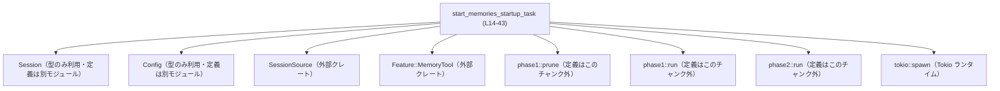
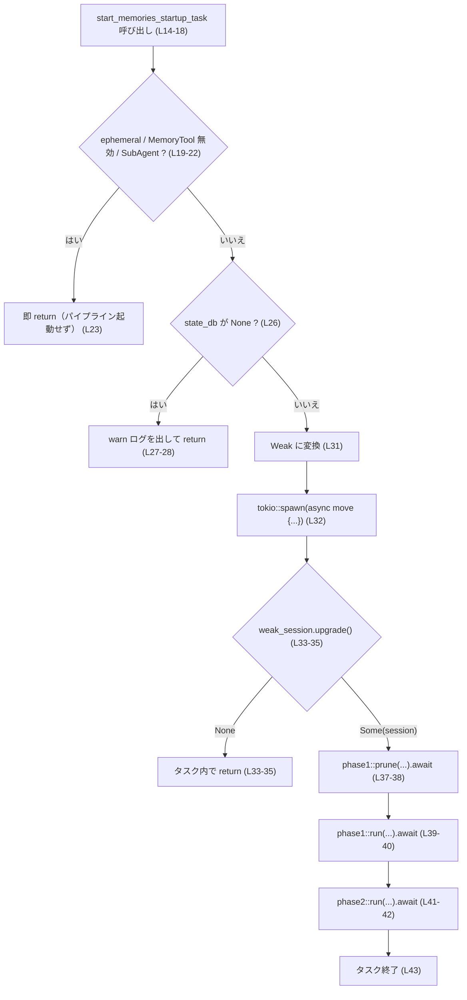

# core/src/memories/start.rs コード解説

## 0. ざっくり一言

セッション起動時に実行される「メモリ初期化パイプライン（phase1/phase2）」を、条件付きで非同期タスクとして起動するためのヘルパー関数を定義しているファイルです  
[core/src/memories/start.rs:L10-L13, L14-L18, L32-L43]。

---

## 1. このモジュールの役割

### 1.1 概要

このモジュールは、**セッションの起動タイミングでバックグラウンドで動作するメモリ関連処理**を開始する役割を持ちます。

- 対象は、エフェメラルでなく、メモリ機能が有効な「ルートセッション」です  
  （ephemeral フラグ＋Feature::MemoryTool＋SessionSource::SubAgent 判定）  
  [core/src/memories/start.rs:L19-L22]。
- セッションが保持する `state_db` が存在する場合にのみ、Tokio の非同期タスクとして  
  `phase1::prune` → `phase1::run` → `phase2::run` を順に実行します  
  [core/src/memories/start.rs:L26-L28, L32-L43]。

### 1.2 アーキテクチャ内での位置づけ

この関数は、設定情報 (`Config`) とセッション (`Session`)、セッションの種別 (`SessionSource`) を受け取り、**メモリパイプラインの開始条件を判定した上で、実際の処理は `memories::phase1` / `memories::phase2` モジュールに委譲**します。

依存関係を簡略化した図は以下の通りです。



- `Session`, `Config` の具体的な定義はこのファイルには現れません。
- `phase1::prune`, `phase1::run`, `phase2::run` の実装もこのチャンクにはないため、処理内容は不明です。

### 1.3 設計上のポイント

コードから読み取れる設計上の特徴です。

- **条件付き起動**  
  - ephemeral セッション、MemoryTool 無効、SubAgent セッションではパイプラインを起動せず即 return します  
    [core/src/memories/start.rs:L19-L23]。
- **依存リソースの事前チェック**  
  - `session.services.state_db` が `None` の場合、warn ログを出した上で処理をスキップします  
    [core/src/memories/start.rs:L26-L28]。
- **非同期・バックグラウンド実行**  
  - `tokio::spawn` でタスクを起動し、呼び出し元はタスク完了を待たずに処理を続行します  
    [core/src/memories/start.rs:L31-L32]。
- **`Arc` / `Weak` によるライフタイム管理**  
  - `session` は `Arc` の弱参照 `Weak` に落としてからタスクに渡し、タスク側では `upgrade` に失敗したら即 return します  
    [core/src/memories/start.rs:L31, L33-L35]。  
  - これにより、**セッションが既に破棄されている場合にメモリアクセスを行わない**ようになっています。
- **フェーズ分割されたメモリ処理**  
  - コメントから、DB サイズ維持のためのクリーンアップ (`prune`)、phase1、phase2 という順序付きパイプラインであることが読み取れます  
    [core/src/memories/start.rs:L37-L42]。

---

## 2. 主要な機能一覧（＆コンポーネントインベントリー）

### 2.1 このファイルで定義される関数

| 名前 | 種別 | シグネチャ（要約） | 定義位置 | 役割 |
|------|------|--------------------|----------|------|
| `start_memories_startup_task` | 関数 | `(&Arc<Session>, Arc<Config>, &SessionSource) -> ()` | `core/src/memories/start.rs:L14-L43` | メモリパイプラインを起動すべき条件を判定し、条件を満たす場合に Tokio タスクとして `phase1`/`phase2` を非同期実行する |

このファイル内で新たに定義されている構造体・列挙体はありません。

### 2.2 利用している外部コンポーネント一覧

このファイルが参照する主な外部型・モジュールです。

| 名前 | 種別 | モジュールパス | 使用箇所 / 役割 | 根拠 |
|------|------|----------------|------------------|------|
| `Session` | 構造体（と推定） | `crate::codex::Session` | セッション状態を表す型。`Arc<Session>` として受け取り、`services.state_db` の有無判定やメモリパイプラインへの入力に利用 | `use crate::codex::Session;` [L1], `session: &Arc<Session>` [L15], `session.services.state_db` [L26] |
| `Config` | 構造体（と推定） | `crate::config::Config` | 設定値保持。`ephemeral` フラグと `features.enabled` による Feature 判定に使用される | `use crate::config::Config;` [L2], `config: Arc<Config>` [L16], `config.ephemeral` [L19], `config.features.enabled(...)` [L20] |
| `phase1` | モジュール | `crate::memories::phase1` | メモリパイプラインの第1段階。`prune` と `run` を提供 | `use crate::memories::phase1;` [L3], `phase1::prune` [L38], `phase1::run` [L40] |
| `phase2` | モジュール | `crate::memories::phase2` | メモリパイプラインの第2段階。`run` を提供 | `use crate::memories::phase2;` [L4], `phase2::run` [L42] |
| `Feature` | 列挙体（と推定） | `codex_features::Feature` | 機能フラグの一種。`MemoryTool` フラグを指定して有効/無効を判定 | `use codex_features::Feature;` [L5], `Feature::MemoryTool` [L20] |
| `SessionSource` | 列挙体（と推定） | `codex_protocol::protocol::SessionSource` | セッションの生成元（ルートか SubAgent かなど）を表し、SubAgent の場合はパイプラインをスキップ | `use codex_protocol::protocol::SessionSource;` [L6], `matches!(source, SessionSource::SubAgent(_))` [L21] |
| `Arc` | スマートポインタ | `std::sync::Arc` | `Session` と `Config` を複数タスク間で共有するために利用 | `use std::sync::Arc;` [L7], 引数の型 [L15-L16], `Arc::downgrade(session)` [L31] |
| `warn` | ログマクロ | `tracing::warn` | `state_db` が無い場合、パイプラインをスキップする旨をログ出力 | `use tracing::warn;` [L8], `warn!(...)` [L27] |

> `Session`, `Config`, `phase1::*`, `phase2::*` などの具体的なフィールド／処理内容は、このチャンクには現れません。

---

## 3. 公開 API と詳細解説

### 3.1 型一覧（構造体・列挙体など）

このファイル内で新しく定義されている構造体・列挙体・型エイリアスはありません。

利用している型はすべて他モジュール・他クレートで定義されているものです（詳細は 2.2 参照）。

---

### 3.2 関数詳細

#### `start_memories_startup_task(session: &Arc<Session>, config: Arc<Config>, source: &SessionSource) -> ()`

**概要**

- セッション・設定・セッションの起源情報を元に、**メモリパイプラインを起動すべきか判定**し、必要であれば **Tokio タスクとして非同期にパイプラインを実行**します  
  [core/src/memories/start.rs:L14-L18, L19-L22, L31-L43]。
- 呼び出し元スレッドは、パイプラインの完了を待ちません（いわゆる「fire-and-forget」な起動）  
  [core/src/memories/start.rs:L31-L32]。

**引数**

| 引数名 | 型 | 説明 | 根拠 |
|--------|----|------|------|
| `session` | `&Arc<Session>` | セッションインスタンスを指す共有スマートポインタへの参照。`state_db` の有無チェックと、非同期パイプライン内でのセッション利用のために使われます。`Arc` で共有し、タスク内では `Weak` を経由してライフタイム管理します。 | シグネチャ [L15], `session.services.state_db` [L26], `Arc::downgrade(session)` [L31], `weak_session.upgrade()` [L33] |
| `config` | `Arc<Config>` | 設定値を共有するための `Arc`。関数呼び出し時に所有権を受け取り、スレッド跨ぎで利用できるように `tokio::spawn` のクロージャにムーブされます。 | シグネチャ [L16], `config.ephemeral` [L19], `config.features.enabled(...)` [L20], `&config` [L38,L40], `config`（値渡し）[L42] |
| `source` | `&SessionSource` | セッションがルートか SubAgent 由来かなどの情報。SubAgent の場合はメモリパイプラインをスキップする判定に利用されます。 | シグネチャ [L17], `matches!(source, SessionSource::SubAgent(_))` [L21] |

**戻り値**

- 戻り値は `()`（ユニット型）で、**起動の成否やパイプライン内でのエラーは返されません**。  
  戻り値の型は明示されていませんが、`->` が無い関数定義は暗黙に `()` を返します  
  [core/src/memories/start.rs:L14-L18]。
- `tokio::spawn` の戻り値 `JoinHandle<_>` も変数に束縛されておらず、すぐに破棄されています  
  [core/src/memories/start.rs:L32]。

**内部処理の流れ（アルゴリズム）**

内部処理をステップに分解すると次のようになります。

1. **起動条件の判定**  
   - 次の条件のいずれかに該当する場合、何もせず return します  
     [core/src/memories/start.rs:L19-L23]。  
     - `config.ephemeral` が `true`（エフェメラルセッション）  
     - `config.features.enabled(Feature::MemoryTool)` が `false`（メモリ機能が無効）  
     - `source` が `SessionSource::SubAgent(_)`（サブエージェントセッション）
2. **`state_db` の存在チェック**  
   - `session.services.state_db.is_none()` の場合、warn ログを出して return します  
     [core/src/memories/start.rs:L26-L28]。  
     - ログメッセージ: `"state db unavailable for memories startup pipeline; skipping"`。
3. **非同期タスクの起動準備**  
   - `Arc::downgrade(session)` により、`Arc<Session>` から `Weak<Session>` へ弱参照化します  
     [core/src/memories/start.rs:L31]。  
   - その `weak_session` と `config` を `async move` ブロックにムーブして `tokio::spawn` します  
     [core/src/memories/start.rs:L31-L32]。
4. **タスク内で `Session` を再取得**  
   - `weak_session.upgrade()` を呼び出し、`Option<Arc<Session>>` を取得します  
     [core/src/memories/start.rs:L33]。  
   - `Some(session)` の場合のみ続行し、`None`（元の `Arc` が全て破棄されている）なら return します  
     [core/src/memories/start.rs:L33-L35]。
5. **メモリパイプラインの実行**  
   - 以降は `async` ブロック内で順次 `await` されます [core/src/memories/start.rs:L37-L42]。  
     1. `phase1::prune(&session, &config).await;`  
        - コメントより、DB サイズ維持のために古いメモリを削除する処理と推測されますが、実装はこのチャンクにありません。  
     2. `phase1::run(&session, &config).await;`  
        - 「Phase 1 の実行」。具体的な処理内容は不明です。  
     3. `phase2::run(&session, config).await;`  
        - 「Phase 2 の実行」。`config` はここで値渡しされる（`Arc<Config>` のクローンではなく、ムーブされたもの）ため、この行以降で `config` は使用されません。

処理フローを簡単なフローチャートで表すと以下のようになります。



**Examples（使用例）**

> 注意: ここでは、この関数が `crate::memories::start` モジュール内に定義されていると仮定したパスを使います。このモジュール構成はこのチャンクだけからは断定できません。

1. **標準的な呼び出し例（セッション起動時）**

```rust
use std::sync::Arc;                                         // Arc を使うのでインポート
use crate::codex::Session;                                  // セッション型（定義は別モジュール）
use crate::config::Config;                                  // 設定型（定義は別モジュール）
use codex_protocol::protocol::SessionSource;                // セッションの起源
use crate::memories::start::start_memories_startup_task;    // 本関数（パスは推定）

fn on_session_ready(session: Arc<Session>,                  // 既に作成済みのセッション
                    config: Arc<Config>,                    // 既に読み込まれている設定
                    source: SessionSource) {                // どこからのセッションか（ルート/SubAgent等）
    // 非同期メモリパイプラインを起動する
    // - ephemeral / MemoryTool 無効 / SubAgent の場合は内部で即 return
    // - それ以外の場合、Tokio タスクとしてバックグラウンドで phase1/phase2 が走る
    start_memories_startup_task(&session, config, &source);

    // ここから先はメモリパイプラインの完了を待たずに処理が続く
    // ...
}
```

1. **ephemeral セッションの場合に何も起きない例**

```rust
fn maybe_start_memories(session: Arc<Session>,
                        config: Arc<Config>,
                        source: SessionSource) {
    // config.ephemeral が true の場合、この呼び出しは内部で即 return する
    // （DB や phase1/phase2 には一切触らない）
    start_memories_startup_task(&session, config, &source);
}
```

この例では `config.ephemeral` を直接操作していませんが、  
`start_memories_startup_task` は内部で `config.ephemeral` をチェックし [L19]、  
`true` なら早期 return する挙動を示します。

**Errors / Panics**

この関数自身について、コードから読み取れるエラー／パニックの挙動は次の通りです。

- **明示的なエラー戻り値はない**  
  - 戻り値が `()` のため、成否は返しません [L14-L18]。
- **panic を直接発生させるコードはない**  
  - `unwrap` や `expect`、`panic!` などは使われていません。
- **`state_db` が `None` の場合**  
  - warn ログを出して return するだけで、panic は発生しません [L26-L28]。
- **`weak_session.upgrade()` が `None` の場合**  
  - そのまま `return;` するのみで、ログもエラーも出しません [L33-L35]。
- **`phase1::prune` / `phase1::run` / `phase2::run` の戻り値**  
  - これらの関数の戻り値は変数に束縛されておらず  
    `phase1::prune(...).await;` のように単に `await` しているだけです [L38-L42]。  
  - 戻り値の型（`Result` かどうか）はこのチャンクには現れないため、  
    エラーがどのように扱われるか（内部でログを出すのか、panic するのかなど）は不明です。

**Edge cases（エッジケース）**

- **ephemeral セッション**  
  - `config.ephemeral == true` の場合、メモリパイプラインは起動されません  
    [core/src/memories/start.rs:L19-L23]。
- **MemoryTool 機能フラグが無効**  
  - `config.features.enabled(Feature::MemoryTool) == false` の場合も同様に起動されません [L20-L22]。
- **SubAgent セッション**  
  - `matches!(source, SessionSource::SubAgent(_))` が真の場合も起動されません [L21-L22]。
- **`state_db` が存在しないセッション**  
  - `session.services.state_db.is_none()` の場合、warn ログを出して起動しません [L26-L28]。
- **セッションがすぐに drop される場合**  
  - `tokio::spawn` された後に、元の `Arc<Session>` が全て drop されると、  
    `weak_session.upgrade()` が `None` になり、タスクは何もせず終了します [L33-L35]。  
  - これにより、不正なメモリアクセスを防いでいます。
- **同じセッションに対して複数回呼び出した場合**  
  - 関数内で「既にパイプラインが走っているか」を判定する仕組みはありません。  
    条件（ephemeral など）を満たしていれば、呼び出しごとに新たな `tokio::spawn` が実行されます [L19-L23, L31-L32]。  
  - その結果、同一セッションに対して複数のパイプラインが並行して動作する可能性があります。

**使用上の注意点**

- **Tokio ランタイムが必要**  
  - `tokio::spawn` を利用しているため、この関数は **Tokio ランタイム上で実行されるコンテキスト** で呼び出される必要があります [L32]。
- **結果を待てない（fire-and-forget）**  
  - 戻り値が `()` であり、`JoinHandle` を保持していないため、  
    **呼び出し側はパイプラインの完了を待ったり、結果・エラーを直接知ることができません** [L32]。  
  - パイプラインの完了を前提とした処理を直後に書くと、レースコンディションを引き起こす可能性があります。
- **スレッド安全性の前提**  
  - `tokio::spawn` に渡す `async move` ブロックは `'static + Send` な Future である必要があります。  
    そのため、`Session` や `Config` が `Send + Sync + 'static` であることが前提になりますが、  
    これらの trait bound はこのチャンクには現れません。
- **セッションライフサイクルとの関係**  
  - `Weak<Session>` を用いているため、セッションが終了（全ての `Arc<Session>` が drop）した後は、  
    パイプラインは自動的に何もせず終了します [L31, L33-L35]。  
    セッション終了後に強制的にパイプラインを完走させたい場合には、この設計では不十分です。
- **セキュリティ／データ保全の観点**  
  - エフェメラルセッションや SubAgent セッションではパイプラインを明示的にスキップしています [L19-L22]。  
    これは、不要なデータ保存を避ける（プライバシーやストレージ保護）意図があると解釈できますが、  
    実際の要件はこのチャンクだけでは断定できません。

---

### 3.3 その他の関数

このファイル内で定義されている関数は `start_memories_startup_task` のみです。

---

## 4. データフロー

ここでは、代表的なシナリオとして「ルートセッションが立ち上がったときにメモリパイプラインを起動する」場合のデータフローを示します。

### 4.1 シーケンス図

```mermaid
sequenceDiagram
  participant Caller as 呼び出し元
  participant F as start_memories_startup_task (L14-43)
  participant RT as Tokioランタイム
  participant P1P as phase1::prune
  participant P1R as phase1::run
  participant P2R as phase2::run

  Caller->>F: (&Arc<Session>, Arc<Config>, &SessionSource)
  alt ephemeral / MemoryTool無効 / SubAgent
    F-->>Caller: 何もせず return (L19-23)
  else 有効なルートセッション
    F->>F: state_db が Some かチェック (L26)
    alt state_db = None
      F->>F: warnログ出力 (L27)
      F-->>Caller: return (L28)
    else state_db = Some(...)
      F->>RT: tokio::spawn(async move { ... }) (L31-32)
      F-->>Caller: 即時 return
      RT->>RT: weak_session.upgrade() (L33-35)
      alt Session がまだ存続
        RT->>P1P: prune(&session, &config).await (L37-38)
        RT->>P1R: run(&session, &config).await (L39-40)
        RT->>P2R: run(&session, config).await (L41-42)
      else Session が既に drop 済み
        RT-->>RT: タスク内で return (L33-35)
      end
  end
```

要点:

- 呼び出し元は、どのパスでも **非常に早く関数から返される**ため、  
  パイプラインは完全にバックグラウンドで動作します [L31-L32]。
- 実際のメモリ処理は `phase1` / `phase2` モジュールに委譲されており、  
  このファイルは **起動判定＋タスク生成のオーケストレーション** に特化しています。

---

## 5. 使い方（How to Use）

### 5.1 基本的な使用方法

最も典型的な利用は、**セッションが準備完了になったタイミングで一度だけ呼び出す**形です。

```rust
use std::sync::Arc;
use crate::codex::Session;
use crate::config::Config;
use codex_protocol::protocol::SessionSource;
use crate::memories::start::start_memories_startup_task;   // パスは構成により異なる可能性があります

fn on_session_ready(session: Arc<Session>,
                    config: Arc<Config>,
                    source: SessionSource) {
    // メモリパイプラインの起動を試みる
    // - 条件を満たさなければ内部で即 return
    // - 条件を満たせば Tokio タスクでバックグラウンド実行
    start_memories_startup_task(&session, config, &source);

    // このあと、通常のセッション処理を続行
    // （メモリパイプラインの完了は待たない）
}
```

このように、「呼び出しておけば、必要な時だけ裏でやってくれる」ヘルパーとして機能します。

### 5.2 よくある使用パターン

1. **ルートセッションでは常に呼び出し、内部で判定に任せる**

   呼び出し側で ephemeral や SubAgent かどうかを判定する必要はなく、  
   常に `start_memories_startup_task` を呼び、要不要の判断は関数に委ねるパターンです。

   ```rust
   fn handle_new_session(session: Arc<Session>,
                         config: Arc<Config>,
                         source: SessionSource) {
       // 条件判定をこの関数に集約
       start_memories_startup_task(&session, config, &source);

       // 以降はセッション処理
   }
   ```

2. **テストや特殊モードで MemoryTool を無効化しておく**

   実際の設定ロード処理側で `Feature::MemoryTool` をオフにしておけば、  
   アプリケーションコード側は通常通り `start_memories_startup_task` を呼び続けても、  
   メモリパイプラインが起動しない状態を作れます [L20]。  
   この挙動はこの関数が `config.features.enabled(Feature::MemoryTool)` を判定していることから読み取れます [L20-L22]。

### 5.3 よくある間違い（推測されるもの）

コードから推測される誤用パターンと、その対策例です。

```rust
// 誤り例: パイプライン完了を前提とした処理をすぐ後ろに書いてしまう
start_memories_startup_task(&session, config.clone(), &source);
// ここで「phase1/phase2 が完了しているはず」と仮定して処理を書くと、
// 実際にはまだタスクが動作中で、レースコンディションになる可能性がある。

// 正しい考え方:
// - この関数はパイプラインの完了を保証しない
// - 完了を待ちたい場合は、別途同期メカニズムや、phase1/phase2 を直接呼ぶ API を検討する
```

```rust
// 誤り例: 同じセッションに対して何度も呼んでしまう
for _ in 0..3 {
    start_memories_startup_task(&session, config.clone(), &source);
}
// 条件を満たしていれば、3つのパイプラインタスクが並行で動いてしまう可能性がある

// 注意:
// - この関数には「重複起動防止」の仕組みはない
// - 一セッションあたり一度だけ呼ぶ、などの制約は呼び出し側で管理する必要がある
```

### 5.4 使用上の注意点（まとめ）

- 非同期タスクとして起動されるため、**関数呼び出し直後にはパイプラインがまだ完了していない**ことを前提とする必要があります。
- エフェメラル／SubAgent／MemoryTool 無効などの条件は、**この関数内部で判定**されるため、  
  呼び出し側で同じ条件判定を重複して書く必要はありません（ただし、あえて外側で制御する設計も可能です）。
- 一つのセッションに対して複数回呼び出すと、その回数分だけタスクが起動しうる点に注意が必要です。
- `tokio::spawn` を使用しているため、**Tokio ランタイムが動作していないコンテキスト**では呼び出すべきではありません。

---

## 6. 変更の仕方（How to Modify）

### 6.1 新しい機能を追加する場合

例として、「phase1 と phase2 の間に新しい phase3 を追加したい」場合の考え方です。

1. **処理本体は別モジュール側に追加する**  
   - `crate::memories::phase3` などの新モジュールを作成し、そこに `run` 関数などを定義する  
     （モジュール構成はこのチャンクからは不明なので、既存の `phase1` / `phase2` に倣う形になります）。
2. **このファイルに `use` を追加する**  
   - 例: `use crate::memories::phase3;` を追記する [L3-L4 にならって追記]。
3. **`tokio::spawn` 内のシーケンスに追加する**  
   - `phase1::run` と `phase2::run` の間に `phase3::run` を挿入する [L39-L42 に倣って追記]。
4. **エッジケースを考慮する**  
   - 追加したフェーズが `Session` や `Config` 以外のリソースに依存する場合、その存在チェックや  
     機能フラグなども、必要であれば最初の条件式 [L19-L22] や `state_db` チェック [L26-L28] に統合するとよいです。

### 6.2 既存の機能を変更する場合

- **起動条件を変える場合**  
  - たとえば「SubAgent でも一部はパイプラインを起動したい」といった場合、  
    最初の `if` 条件式 [L19-L22] を調整することになります。  
  - 変更時は、呼び出し元のコードが「SubAgent では起動しない」という前提で書かれていないか確認する必要があります。
- **`state_db` 依存を緩和／強化する場合**  
  - 「state_db が無くても一部の処理だけは動かしたい」などの場合、  
    `if session.services.state_db.is_none()` ブロック [L26-L28] の条件や中身を調整する必要があります。
- **ログや観測性を高めたい場合**  
  - 現状、`state_db` が無い場合のみ warn ログが出ます [L27]。  
  - パイプライン開始時や完了時、`weak_session.upgrade()` 失敗時などにもログを追加することで、  
    運用時のトラブルシュートが容易になります。

---

## 7. 関連ファイル・モジュール

このモジュールと密接に関係するモジュール（パスはモジュールパスで表記し、実際のファイルパスはこのチャンクからは特定できません）。

| モジュールパス | 役割 / 関係 | 根拠 |
|----------------|------------|------|
| `crate::codex::Session` | セッション状態を表す型。`Arc<Session>` として本関数の引数や `state_db` チェックに使用される。 | `use crate::codex::Session;` [L1], `session: &Arc<Session>` [L15], `session.services.state_db` [L26] |
| `crate::config::Config` | 設定値を表す型。`ephemeral` フラグと機能フラグ判定に用いられ、メモリパイプラインの起動可否を制御する。 | `use crate::config::Config;` [L2], `config.ephemeral` [L19], `config.features.enabled(...)` [L20] |
| `crate::memories::phase1` | メモリパイプライン第1フェーズの実装モジュール。`prune` と `run` を提供し、本モジュールから非同期に呼び出される。 | `use crate::memories::phase1;` [L3], `phase1::prune` [L38], `phase1::run` [L40] |
| `crate::memories::phase2` | メモリパイプライン第2フェーズの実装モジュール。`run` を提供し、本モジュールから非同期に呼び出される。 | `use crate::memories::phase2;` [L4], `phase2::run` [L42] |
| `codex_features::Feature` | 機能フラグ（Feature Flag）の定義モジュール。`Feature::MemoryTool` を通じてメモリ機能の有効/無効を判定する。 | `use codex_features::Feature;` [L5], `Feature::MemoryTool` [L20] |
| `codex_protocol::protocol::SessionSource` | セッションの起源を表す enum。SubAgent 由来のセッションかどうかを判定するのに利用。 | `use codex_protocol::protocol::SessionSource;` [L6], `SessionSource::SubAgent(_)` [L21] |

このチャンクにはテストコードは含まれていません。そのため、この関数の挙動がどのようにテストされているか、あるいはされていないかについては不明です。
