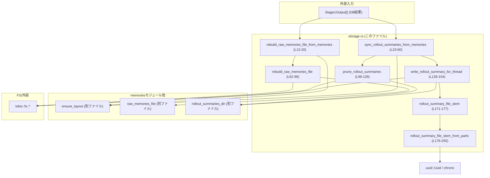
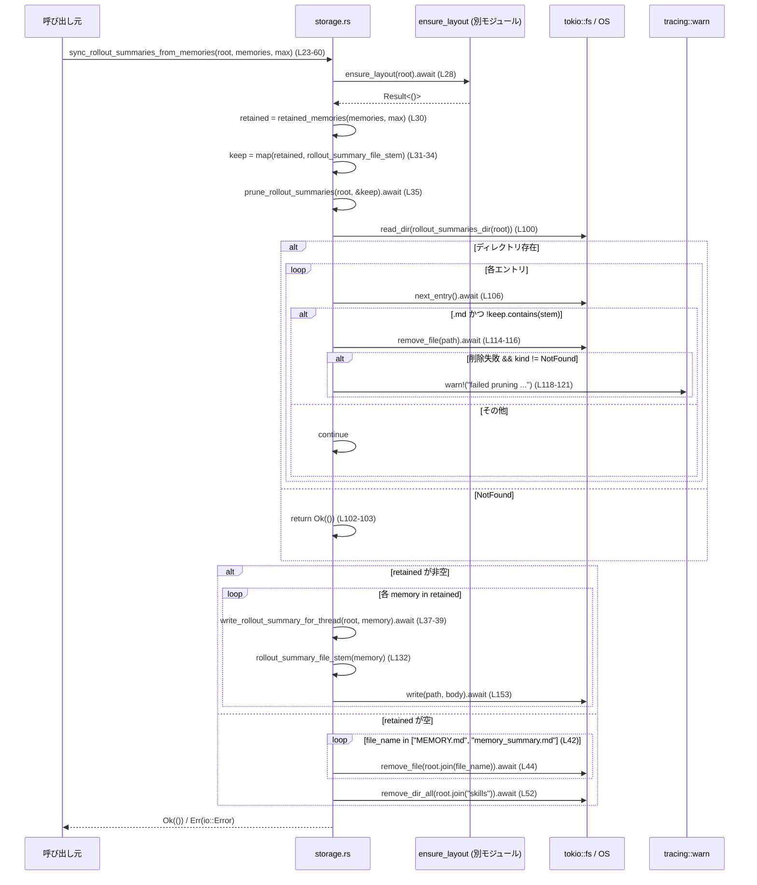

# core/src/memories/storage.rs

## 0. ざっくり一言

`Stage1Output`（DB バックエンドのステージ1結果）から、プロジェクトルート配下の

- `raw_memories.md`
- 各スレッド用のロールアウトサマリ Markdown (`rollouts/*.md` のようなもの)

を非同期に生成・同期するモジュールです。

---

## 1. このモジュールの役割

### 1.1 概要

このモジュールは **DB に保存されたステージ1のメモリ情報** から、ファイルシステム上の「メモリ関連 Markdown ファイル群」を構築・整理する機能を提供します。

- `raw_memories.md` の再生成（全スレッド分の生メモリをまとめたファイル）  
  根拠: `rebuild_raw_memories_file_from_memories` と `rebuild_raw_memories_file` の処理内容  
  `core/src/memories/storage.rs:L12-L20`, `L62-L96`
- スレッド単位ロールアウトサマリの Markdown ファイル群の同期・クリーンアップ  
  根拠: `sync_rollout_summaries_from_memories` と `write_rollout_summary_for_thread`、`prune_rollout_summaries`  
  `core/src/memories/storage.rs:L22-L60`, `L98-L126`, `L128-L154`

### 1.2 アーキテクチャ内での位置づけ

このモジュールは、`Stage1Output`（DB 側の構造体）を入力として受け取り、  
`crate::memories` モジュールが管理するレイアウト配下に Markdown ファイルを生成します。

主な依存関係は次の通りです。

- 入力データ: `codex_state::Stage1Output`  
  `core/src/memories/storage.rs:L1`
- レイアウト/パス関連ヘルパ:
  - `ensure_layout` … ルートディレクトリ配下のディレクトリ構成を保証  
    `core/src/memories/storage.rs:L8`
  - `raw_memories_file` … `raw_memories.md` のパス生成  
    `core/src/memories/storage.rs:L9`
  - `rollout_summaries_dir` … ロールアウトサマリ保存ディレクトリのパス生成  
    `core/src/memories/storage.rs:L10`
- ファイル I/O: `tokio::fs` 系 API  
  （`write`, `read_dir`, `remove_file`, `remove_dir_all` など）  
  例: `core/src/memories/storage.rs:L72`, `L95`, `L100`, `L115`, `L153`
- UUID / 時刻: `uuid::Uuid`, `chrono` を用いたファイル名生成  
  `core/src/memories/storage.rs:L6`, `L180-L199`

簡略化した依存関係図（関数レベル）:



### 1.3 設計上のポイント

コードから読み取れる特徴:

- **非同期 I/O 前提**  
  - すべてのファイル操作は `tokio::fs` の `async` 関数を使用しています。  
    例: `tokio::fs::write`, `read_dir`, `remove_file`, `remove_dir_all`  
    `core/src/memories/storage.rs:L72`, `L95`, `L100`, `L115`, `L153`
  - 上位 API (`rebuild_raw_memories_file_from_memories`, `sync_rollout_summaries_from_memories`) も `async fn` です。  
    `core/src/memories/storage.rs:L13`, `L23`
- **ステートレス設計**  
  - このモジュール内で状態を保持する構造体などは定義されておらず、  
    すべての関数は `root: &Path` と `&[Stage1Output]` のような引数に依存する純粋な処理です。
- **一貫したエラーモデル**  
  - 公開/内部問わず、非同期関数はすべて `std::io::Result<()>` を返します。  
    `core/src/memories/storage.rs:L17`, `L27`, `L66`, `L98`, `L131`, `L163-L168`
  - 文字列フォーマット失敗 (`std::fmt::Error`) を `std::io::Error` に変換するヘルパを通じて、  
    呼び出し側からはすべて `io::Error` として扱えるようになっています。  
    `raw_memories_format_error`, `rollout_summary_format_error`  
    `core/src/memories/storage.rs:L163-L169`
- **ファイル名の安全な生成**  
  - `rollout_summary_file_stem_from_parts` で、UUID（または任意文字列）から短いハッシュを生成し、  
    ロールアウトスラッグは ASCII 英数字以外を `_` に変換、長さも 60 文字に制限しています。  
    `core/src/memories/storage.rs:L184-L187`, `L234-L245`
- **存在しないファイル/ディレクトリはエラーにしない**  
  - `std::io::ErrorKind::NotFound` の場合は、削除失敗をエラーとして扱わずスキップしています。  
    `core/src/memories/storage.rs:L44-L46`, `L52-L53`, `L102-L103`, `L114-L117`

---

## 2. 主要な機能一覧

このモジュールが提供する主要な機能（関数）を列挙します。

| 機能 | 説明 | 定義位置 |
|------|------|----------|
| `rebuild_raw_memories_file_from_memories` | DB バックエンドの `Stage1Output` 一覧から `raw_memories.md` を再構築する非同期 API | `core/src/memories/storage.rs:L13-L20` |
| `sync_rollout_summaries_from_memories` | `Stage1Output` 一覧をもとにロールアウトサマリ Markdown ファイル群を同期・クリーンアップする非同期 API | `core/src/memories/storage.rs:L23-L60` |
| `rebuild_raw_memories_file` | 実際に `raw_memories.md` の内容をフォーマットして書き込む内部実装 | `core/src/memories/storage.rs:L62-L96` |
| `prune_rollout_summaries` | 既存ロールアウトサマリのうち、保持対象に含まれないファイルを削除する | `core/src/memories/storage.rs:L98-L126` |
| `write_rollout_summary_for_thread` | 単一スレッド (`Stage1Output`) 分のロールアウトサマリ Markdown を生成する | `core/src/memories/storage.rs:L128-L154` |
| `retained_memories` | メモリ一覧から最大件数だけを切り出すスライスヘルパ | `core/src/memories/storage.rs:L156-L161` |
| `raw_memories_format_error` | `fmt::Error` を `io::Error` に変換するヘルパ | `core/src/memories/storage.rs:L163-L165` |
| `rollout_summary_format_error` | 同上（ロールアウトサマリ向け） | `core/src/memories/storage.rs:L167-L169` |
| `rollout_summary_file_stem` | 1 スレッド分のロールアウトサマリファイル名（拡張子抜き）を生成する公開ヘルパ | `core/src/memories/storage.rs:L171-L177` |
| `rollout_summary_file_stem_from_parts` | ロールアウトサマリファイル名を、スレッド ID と更新日時・スラッグから生成する中核ロジック | `core/src/memories/storage.rs:L179-L255` |

---

## 3. 公開 API と詳細解説

### 3.1 型一覧（構造体・列挙体など）

このファイル内で新たに定義される型はありませんが、外部の型を利用しています。

| 名前 | 種別 | 定義場所（外部） | 役割 / 用途 | 根拠 |
|------|------|------------------|-------------|------|
| `Stage1Output` | 構造体（と推定） | `codex_state` クレート | スレッドのステージ1結果（スレッド ID、更新日時、カレントディレクトリ、ロールアウトパス、raw_memories、rollout_summary、git_branch、rollout_slug など）を保持 | フィールド利用箇所: `thread_id`, `source_updated_at`, `cwd`, `rollout_path`, `raw_memory`, `rollout_summary`, `git_branch`, `rollout_slug` `core/src/memories/storage.rs:L1`, `L77-L88`, `L135-L151`, `L171-L176` |
| `codex_protocol::ThreadId` | 型 | `codex_protocol` クレート | スレッドを一意に識別する ID。`to_string()` され、UUID として扱われる場合がある | 利用箇所: `rollout_summary_file_stem_from_parts` の引数 `thread_id` `core/src/memories/storage.rs:L179-L183, L189-L190` |
| `chrono::DateTime<chrono::Utc>` | 構造体 | `chrono` クレート | UTC 時刻。Stage1Output の `source_updated_at` に使用され、ファイル名のタイムスタンプ部分に変換される | 利用箇所: `rollout_summary_file_stem_from_parts` 引数 `source_updated_at` `core/src/memories/storage.rs:L180-L183, L200-L201, L215-L216` |

### 3.2 関数詳細（主要 7 件）

#### `rebuild_raw_memories_file_from_memories(root: &Path, memories: &[Stage1Output], max_raw_memories_for_consolidation: usize) -> std::io::Result<()>`

**概要**

DB 由来の `Stage1Output` 配列を受け取り、ルートディレクトリ配下のレイアウトを整えた上で `raw_memories.md` を再生成する公開 API です。  
`ensure_layout` を呼び出した後、内部ヘルパ `rebuild_raw_memories_file` に処理を委譲します。  
根拠: `core/src/memories/storage.rs:L12-L20`

**引数**

| 引数名 | 型 | 説明 |
|--------|----|------|
| `root` | `&Path` | メモリ関連ファイル群を格納するルートディレクトリ |
| `memories` | `&[Stage1Output]` | ステージ1のメモリ結果一覧 |
| `max_raw_memories_for_consolidation` | `usize` | `raw_memories.md` に含める最大件数 |

**戻り値**

- `Ok(())`: レイアウト準備と `raw_memories.md` の書き込みが正常終了した場合
- `Err(std::io::Error)`: レイアウト準備やファイル書き込み、フォーマットでエラーが発生した場合

**内部処理の流れ**

1. `ensure_layout(root).await?` で、`root` 配下のディレクトリ構成を整える。  
   `core/src/memories/storage.rs:L18`
2. `rebuild_raw_memories_file(root, memories, max_raw_memories_for_consolidation).await` を呼び、その結果をそのまま返す。  
   `core/src/memories/storage.rs:L19`

**Examples（使用例）**

概念的な使用例（`Stage1Output` や `ensure_layout` の詳細は簡略化したダミーです）:

```rust
use std::path::Path;
use codex_state::Stage1Output;

async fn sync_raw_memories_example(root: &Path, memories: Vec<Stage1Output>) -> std::io::Result<()> {
    // 最新 N 件だけ raw_memories.md に載せたい
    let max = 50;

    // ルート配下にレイアウトを作りつつ raw_memories.md を再生成
    crate::memories::storage::rebuild_raw_memories_file_from_memories(root, &memories, max).await
}
```

**Errors / Panics**

- エラー:
  - `ensure_layout` の内部で発生する I/O エラーをそのまま `Err` として返します。  
    `core/src/memories/storage.rs:L18`
  - `rebuild_raw_memories_file` 内の `tokio::fs::write` などの失敗、および `writeln!` による `fmt::Error` が `io::Error` に変換されたものが返り得ます。  
    `core/src/memories/storage.rs:L72`, `L95`, `L163-L165`
- パニック:
  - この関数内には明示的な `panic!` 呼び出しや、境界チェックなしスライスなどはありません。  
    （スライス操作は `rebuild_raw_memories_file` → `retained_memories` 内で安全に行われます）

**Edge cases（エッジケース）**

- `memories` が空の場合:
  - 内部で `retained_memories` が空スライスを返し、`raw_memories.md` には  
    `# Raw Memories` と `No raw memories yet.` が書き込まれます。  
    `core/src/memories/storage.rs:L67-L72`
- `max_raw_memories_for_consolidation == 0` の場合:
  - `retained_memories` が `&memories[..0]`（空）を返し、上記と同じ挙動になります。  
    `core/src/memories/storage.rs:L156-L161`
- `root` が存在しない場合:
  - `ensure_layout` がディレクトリを作成する想定です（実装はこのチャンクにはありません）。

**使用上の注意点**

- この関数は `async fn` のため、Tokio などの非同期ランタイム上で `.await` する必要があります。
- `memories` 引数の並び順が `retained_memories` にそのまま渡され、  
  `raw_memories.md` 上の順序もそれに従います。関数内ではソートは行っていません。  
  `core/src/memories/storage.rs:L67-L76`

---

#### `sync_rollout_summaries_from_memories(root: &Path, memories: &[Stage1Output], max_raw_memories_for_consolidation: usize) -> std::io::Result<()>`

**概要**

`Stage1Output` の一覧から、スレッドごとのロールアウトサマリ Markdown を同期します。  
対象とならない古いサマリファイルを削除し、保持対象のスレッド分だけ新しいサマリファイルを書き出します。  
もし保持対象が 0 件なら、いくつかのメモリ関連ファイルやディレクトリも削除します。  
根拠: `core/src/memories/storage.rs:L22-L60`

**引数**

| 引数名 | 型 | 説明 |
|--------|----|------|
| `root` | `&Path` | メモリ・ロールアウト関連ファイル群のルートディレクトリ |
| `memories` | `&[Stage1Output]` | スレッドごとのステージ1結果一覧 |
| `max_raw_memories_for_consolidation` | `usize` | 「保持するスレッド数」の上限（`retained_memories` に渡されます） |

**戻り値**

- `Ok(())`: プルーニングとサマリファイル生成（および必要なら削除）が成功した場合
- `Err(std::io::Error)`: レイアウト準備、ディレクトリ操作、ファイル削除・作成でエラーが発生した場合

**内部処理の流れ**

1. `ensure_layout(root).await?` を呼び、レイアウトを準備する。  
   `core/src/memories/storage.rs:L28`
2. `retained_memories(memories, max_raw_memories_for_consolidation)` で保持対象スレッドのみを切り出す。  
   `core/src/memories/storage.rs:L30`
3. 保持対象ごとに `rollout_summary_file_stem(memory)` を計算し、`HashSet<String>` として `keep` を構築する。  
   `core/src/memories/storage.rs:L31-L34`
4. `prune_rollout_summaries(root, &keep).await?` で、`keep` に含まれないファイルを削除する。  
   `core/src/memories/storage.rs:L35`
5. `retained` の各要素について `write_rollout_summary_for_thread(root, memory).await?` を呼び、  
   個別の Markdown を書き出す。  
   `core/src/memories/storage.rs:L37-L39`
6. もし `retained.is_empty()` なら、以下を削除する（存在しない場合は無視）:
   - `root/MEMORY.md`
   - `root/memory_summary.md`
   - `root/skills` ディレクトリ  
   `core/src/memories/storage.rs:L41-L56`
7. 最後に `Ok(())` を返す。  
   `core/src/memories/storage.rs:L59`

**Examples（使用例）**

```rust
use std::path::Path;
use codex_state::Stage1Output;

async fn sync_rollout_summaries_example(root: &Path, memories: Vec<Stage1Output>) -> std::io::Result<()> {
    // 最新 100 スレッド分のロールアウトサマリだけをファイルとして保持する
    let max_threads = 100;

    crate::memories::storage::sync_rollout_summaries_from_memories(root, &memories, max_threads).await
}
```

**Errors / Panics**

- エラー:
  - `ensure_layout`, `prune_rollout_summaries`, `write_rollout_summary_for_thread` 内での I/O エラーをそのまま伝搬します。  
    `?` 演算子で早期リターンしているため、最初の失敗がそのまま返ります。  
    `core/src/memories/storage.rs:L28`, `L35`, `L38`
  - `tokio::fs::remove_file` / `remove_dir_all` は `NotFound` 以外のエラーであれば即座に `Err` を返します。  
    `core/src/memories/storage.rs:L44-L47`, `L52-L55`
- パニック:
  - `retained_memories` は安全なスライス切り出し (`len().min(...)`) を行っているため、  
    この関数から直接パニックに至る箇所は見当たりません。  
    `core/src/memories/storage.rs:L156-L161`

**Edge cases（エッジケース）**

- `memories` が空、または `max_raw_memories_for_consolidation == 0` の場合:
  - `retained` は空スライスになり、`keep` も空集合となります。  
    `prune_rollout_summaries` はロールアウトサマリディレクトリ内のすべての `.md` を削除しようとします。  
    その後、`MEMORY.md`, `memory_summary.md`, `skills` ディレクトリを削除します。  
    `core/src/memories/storage.rs:L30-L35`, `L41-L56`
- `root` 配下にサマリディレクトリが存在しない場合:
  - `prune_rollout_summaries` 内で `read_dir` が `NotFound` を返した場合は、そのまま `Ok(())` を返します。  
    `core/src/memories/storage.rs:L100-L103`
- 既存のサマリファイル削除時に `PermissionDenied` などが発生した場合:
  - `prune_rollout_summaries` では `NotFound` 以外のエラーを `warn!` ログに記録しつつ処理を継続します。  
    `core/src/memories/storage.rs:L114-L122`
  - 一方で `MEMORY.md`, `memory_summary.md`, `skills` 削除中に `NotFound` 以外のエラーが起これば、関数を `Err` で終了します。  
    `core/src/memories/storage.rs:L44-L47`, `L52-L55`

**使用上の注意点**

- 同じ `root` に対してこの関数を並行に複数回呼び出すと、  
  ファイル削除・作成の競合が発生する可能性があります（ロック等はありません）。  
- サマリファイルのファイル名は `rollout_summary_file_stem` で決まり、  
  外部から直接ファイル名を指定する API はありません。

---

#### `rebuild_raw_memories_file(root: &Path, memories: &[Stage1Output], max_raw_memories_for_consolidation: usize) -> std::io::Result<()>`

**概要**

`rebuild_raw_memories_file_from_memories` から呼ばれる内部関数で、`raw_memories.md` のボディを組み立てて書き込む本体ロジックです。  
根拠: `core/src/memories/storage.rs:L62-L96`

**引数 / 戻り値**

引数・戻り値は `rebuild_raw_memories_file_from_memories` と同じです。

**内部処理の流れ**

1. `retained_memories` で保持対象の `Stage1Output` スライスを得る。  
   `core/src/memories/storage.rs:L67`
2. `body` を `"# Raw Memories\n\n"` で初期化。  
   `core/src/memories/storage.rs:L68`
3. `retained` が空なら:
   - `"No raw memories yet.\n"` を追記し、`raw_memories_file(root)` のパスに書き込んで終了。  
     `core/src/memories/storage.rs:L70-L72`
4. 空でない場合:
   - `"Merged stage-1 raw memories (latest first):\n\n"` を追記し、  
     各 `memory` について以下を順に `writeln!` で書き込む。  
     `core/src/memories/storage.rs:L75-L92`
     - `## Thread`{thread_id}``
     - `updated_at: {ISO8601}` (`to_rfc3339()`)
     - `cwd: {cwd.display()}`
     - `rollout_path: {rollout_path.display()}`
     - `rollout_summary_file: {rollout_summary_file_stem(memory)}.md`
     - 空行
     - `memory.raw_memory.trim()` の内容（トリム済み）と空行
5. 最後に `tokio::fs::write(raw_memories_file(root), body).await` を実行し、結果を返す。  
   `core/src/memories/storage.rs:L95`

**Examples（使用例）**

この関数は `pub` ではないため、外部コードからは直接呼べません。  
使用したい場合は `rebuild_raw_memories_file_from_memories` を利用します。

**Errors / Panics**

- `writeln!` で `fmt::Error` が発生した場合、`raw_memories_format_error` により `io::Error` に変換されます。  
  `core/src/memories/storage.rs:L77-L90`, `L163-L165`
- ファイル書き込み時に `tokio::fs::write` が失敗した場合、その `io::Error` が返ります。  
  `core/src/memories/storage.rs:L72`, `L95`

**Edge cases（エッジケース）**

- `raw_memory` の先頭・末尾の空白は `trim()` で削除され、本文のみが書き込まれます。  
  `core/src/memories/storage.rs:L91`
- `memories` が多くても、すべてを一つの `String` にまとめてから書き出すため、  
  非常に大量のメモリを使用する可能性があります（呼び出し側で `max_raw_memories_for_consolidation` による制限が想定されています）。

**使用上の注意点**

- 文字列フォーマット失敗は通常は起こりませんが、起きた場合は `io::Error` として扱われることに注意が必要です。
- `memories` の順序に依存して「latest first」という文言を出力しますが、  
  この関数自体はソートを行いません。

---

#### `prune_rollout_summaries(root: &Path, keep: &HashSet<String>) -> std::io::Result<()>`

**概要**

ロールアウトサマリディレクトリ内の `.md` ファイルを列挙し、  
`keep` セットに含まれないファイルを削除する内部ヘルパです。  
削除失敗時にはログを出して継続します。  
根拠: `core/src/memories/storage.rs:L98-L126`

**引数**

| 引数名 | 型 | 説明 |
|--------|----|------|
| `root` | `&Path` | ルートディレクトリ |
| `keep` | `&HashSet<String>` | 削除せずに残しておくファイルの stem（拡張子なし）集合 |

**戻り値**

- `Ok(())`: 削除処理が完了（失敗はログとして扱い、NotFound は無視）
- `Err(std::io::Error)`: ディレクトリ読み出し自体に失敗した場合（`NotFound` を除く）

**内部処理の流れ**

1. `rollout_summaries_dir(root)` を呼び出し、サマリディレクトリのパスを取得。  
   `core/src/memories/storage.rs:L99`
2. `tokio::fs::read_dir` でディレクトリを開く:
   - `Ok(dir)` → そのまま進む
   - `Err(NotFound)` → サマリディレクトリがないので `Ok(())` を返す
   - その他のエラー → そのまま `Err` を返す  
   `core/src/memories/storage.rs:L100-L104`
3. `while let Some(entry) = dir.next_entry().await?` で全エントリを走査し、各 `.md` ファイルについて:
   - ファイル名が UTF-8 でない場合や `.md` で終わらない場合はスキップ  
     `core/src/memories/storage.rs:L108-L113`
   - `stem` が `keep` に含まれていなければ `tokio::fs::remove_file(&path).await` を試みる。  
     エラーが `NotFound` なら無視、それ以外なら `warn!` ログを出して継続。  
     `core/src/memories/storage.rs:L114-L122`
4. 最後に `Ok(())` を返す。  
   `core/src/memories/storage.rs:L125`

**Examples（使用例）**

外部から直接呼ぶことは想定されていません。  
`sync_rollout_summaries_from_memories` が内部で利用しています。  
`core/src/memories/storage.rs:L35`

**Errors / Panics**

- `read_dir` 自体が `NotFound` を返した場合は、サマリディレクトリがないものとして `Ok(())` になります。
- `next_entry().await?` は I/O エラーがあれば `Err(io::Error)` を返します。
- 削除時の失敗は `NotFound` 以外でも関数の戻り値には影響せず、`warn!` ログに記録されるだけです。

**Edge cases（エッジケース）**

- `.md` 以外のファイルや、UTF-8 でないファイル名は削除されません。
- `keep` が空集合の場合、ディレクトリ内のすべての `.md` ファイル削除を試みます。

**使用上の注意点**

- 失敗した削除があっても呼び出し元には `Ok` が返るため、  
  「不要ファイルが完全に消えた」ことを厳密に保証したい場合は、  
  ログ (`warn!`) を監視する必要があります。

---

#### `write_rollout_summary_for_thread(root: &Path, memory: &Stage1Output) -> std::io::Result<()>`

**概要**

単一の `Stage1Output` からロールアウトサマリ Markdown ファイルを生成し、  
ロールアウトサマリディレクトリ配下に書き込む内部関数です。  
根拠: `core/src/memories/storage.rs:L128-L154`

**引数**

| 引数名 | 型 | 説明 |
|--------|----|------|
| `root` | `&Path` | ルートディレクトリ |
| `memory` | `&Stage1Output` | 対象スレッドのステージ1結果 |

**戻り値**

- `Ok(())`: サマリファイルの書き込みに成功した場合
- `Err(std::io::Error)`: フォーマット失敗またはファイル書き込み失敗の場合

**内部処理の流れ**

1. `rollout_summary_file_stem(memory)` でファイル名の stem を取得。  
   `core/src/memories/storage.rs:L132`
2. `rollout_summaries_dir(root).join(format!("{file_stem}.md"))` でファイルパスを組み立てる。  
   `core/src/memories/storage.rs:L133`
3. 空の `String` を作成し、以下の情報を順に `writeln!` で書き込む。  
   `core/src/memories/storage.rs:L135-L151`
   - `thread_id: {memory.thread_id}`
   - `updated_at: {memory.source_updated_at.to_rfc3339()}`
   - `rollout_path: {memory.rollout_path.display()}`
   - `cwd: {memory.cwd.display()}`
   - `git_branch: {git_branch}`（`memory.git_branch` が `Some` の場合のみ）
   - 空行
   - `memory.rollout_summary` の内容と末尾の改行
4. `tokio::fs::write(path, body).await` でファイルに書き込む。  
   `core/src/memories/storage.rs:L153`

**Examples（使用例）**

直接利用するのではなく、`sync_rollout_summaries_from_memories` から呼び出されることが想定されています。  
`core/src/memories/storage.rs:L37-L39`

**Errors / Panics**

- `writeln!` が `fmt::Error` を返した場合、`rollout_summary_format_error` によって `io::Error` に変換されます。  
  `core/src/memories/storage.rs:L135-L149`, `L167-L169`
- ファイル書き込み失敗は `io::Error` としてそのまま返されます。

**Edge cases（エッジケース）**

- `git_branch` が `None` の場合は、`git_branch` 行自体が出力されません。  
  `core/src/memories/storage.rs:L146-L148`
- `rollout_summary` は末尾に改行 `'\n'` が 1 つ追加されます。  
  `core/src/memories/storage.rs:L150-L151`

**使用上の注意点**

- ファイル名の stem は `rollout_summary_file_stem` によって決定されるため、  
  スレッド ID やスラッグが変わるとファイル名も変わります。
- 文字列フォーマット失敗は通常起きませんが、起きた場合は `io::Error` として扱われます。

---

#### `rollout_summary_file_stem(memory: &Stage1Output) -> String`

**概要**

`Stage1Output` の `thread_id`, `source_updated_at`, `rollout_slug` から、  
ロールアウトサマリ Markdown のファイル名（拡張子を除いた部分）を生成するヘルパです。  
実際のロジックは `rollout_summary_file_stem_from_parts` に委譲されています。  
根拠: `core/src/memories/storage.rs:L171-L177`

**引数**

| 引数名 | 型 | 説明 |
|--------|----|------|
| `memory` | `&Stage1Output` | 対象スレッドのステージ1結果 |

**戻り値**

- `String`: ロールアウトサマリファイル名の stem（例: `"2024-01-01T12-00-00-abcd-my_slug"`）

**内部処理の流れ**

1. `memory.thread_id`, `memory.source_updated_at`, `memory.rollout_slug.as_deref()` を抽出。  
   `core/src/memories/storage.rs:L172-L175`
2. それらを `rollout_summary_file_stem_from_parts(...)` に渡し、その戻り値をそのまま返す。  
   `core/src/memories/storage.rs:L171-L177`

**Examples（使用例）**

```rust
use codex_state::Stage1Output;

// `memory` からファイル名の stem を取得する
fn debug_file_stem(memory: &Stage1Output) {
    let stem = crate::memories::storage::rollout_summary_file_stem(memory);
    println!("rollout summary file stem: {stem}");
}
```

**Errors / Panics**

- この関数自体はエラーを返しません。
- 内部で `rollout_summary_file_stem_from_parts` を呼びますが、  
  そちらも `Result` ではなく、内部でエラー条件をオプション等で扱っているため、パニックしない設計です。

**Edge cases（エッジケース）**

- `memory.rollout_slug` が `None` の場合は、スラッグなしのプレフィックスだけのファイル名になります。  
  （詳細は `rollout_summary_file_stem_from_parts` を参照）

**使用上の注意点**

- `rollout_slug` が後から変わるとファイル名も変わるため、  
  既存ファイルとの対応関係に注意が必要です。

---

#### `rollout_summary_file_stem_from_parts(thread_id: codex_protocol::ThreadId, source_updated_at: chrono::DateTime<chrono::Utc>, rollout_slug: Option<&str>) -> String`

**概要**

スレッド ID・更新日時・ロールアウトスラッグから、衝突しにくく、かつファイルシステムで扱いやすい  
ロールアウトサマリファイル名の stem を生成する中核関数です。  
根拠: `core/src/memories/storage.rs:L179-L255`

**引数**

| 引数名 | 型 | 説明 |
|--------|----|------|
| `thread_id` | `codex_protocol::ThreadId` | スレッド ID。`to_string` され、UUID として扱われることを試みます。 |
| `source_updated_at` | `chrono::DateTime<chrono::Utc>` | ステージ1結果の更新時刻 |
| `rollout_slug` | `Option<&str>` | 任意のスラッグ文字列（人間向け識別子）。`None` の場合はスラッグなし。 |

**戻り値**

- `String`: `"{timestamp_fragment}-{short_hash}"` もしくは  
  `"{timestamp_fragment}-{short_hash}-{sanitized_slug}"` の形式のファイル名 stem

**内部処理の流れ（アルゴリズム）**

1. 定数定義:
   - `ROLLOUT_SLUG_MAX_LEN = 60`（スラッグ最大長）  
   - `SHORT_HASH_ALPHABET`: 0-9, a-z, A-Z の 62 文字  
   - `SHORT_HASH_SPACE = 14_776_336`（ハッシュ空間サイズ）  
   `core/src/memories/storage.rs:L184-L187`
2. `thread_id.to_string()` を行い、文字列化。  
   `core/src/memories/storage.rs:L189`
3. `Uuid::parse_str(&thread_id)` を試みる。  
   `core/src/memories/storage.rs:L190`
   - **成功 (`Ok(thread_uuid)`) の場合:**
     - `thread_uuid.get_timestamp()` → `.to_unix()` で `(seconds, nanos)` を取得し、  
       それを `chrono::DateTime::from_timestamp` で `timestamp` に変換（失敗時は `None`）。  
       `None` の場合は `source_updated_at` を利用。  
       `core/src/memories/storage.rs:L191-L200`
     - `short_hash_seed` として `thread_uuid.as_u128() & 0xFFFF_FFFF`（下位 32 bit）を利用。  
       `core/src/memories/storage.rs:L201`
     - `timestamp_fragment = timestamp.format("%Y-%m-%dT%H-%M-%S")` を生成。  
       `core/src/memories/storage.rs:L203`
   - **失敗 (`Err(_)`) の場合:**
     - `short_hash_seed` を 0 から始め、`thread_id` 文字列の各バイトについて  
       `short_hash_seed = short_hash_seed.wrapping_mul(31).wrapping_add(byte)` を繰り返す。  
       `core/src/memories/storage.rs:L207-L213`
     - `timestamp_fragment` は `source_updated_at` を同じフォーマットで使用。  
       `core/src/memories/storage.rs:L215-L216`
4. `short_hash_value = short_hash_seed % SHORT_HASH_SPACE` を計算し、4 文字の短いハッシュ文字列を生成する:
   - 末尾インデックスから順番に、`SHORT_HASH_ALPHABET` を基数 62 とした変換を行う。  
     `core/src/memories/storage.rs:L220-L225`
5. `short_hash_chars` を `String` に変換し、`file_prefix = "{timestamp_fragment}-{short_hash}"` を作る。  
   `core/src/memories/storage.rs:L227-L228`
6. `rollout_slug` が `None` の場合は `file_prefix` をそのまま返す。  
   `core/src/memories/storage.rs:L230-L232`
7. `Some(raw_slug)` の場合:
   - 空の `slug` を容量 60 で用意し、`raw_slug.chars()` を走査する。  
     `core/src/memories/storage.rs:L234-L235`
   - `slug.len() >= ROLLOUT_SLUG_MAX_LEN` になったら打ち切り。  
     `core/src/memories/storage.rs:L236-L237`
   - 各文字 `ch` について:
     - `ch.is_ascii_alphanumeric()` なら小文字にして `slug.push()`
     - それ以外は `'_'` を `slug` に追加  
       `core/src/memories/storage.rs:L240-L244`
   - 末尾の `'_'` を `while slug.ends_with('_') { slug.pop(); }` で削除。  
     `core/src/memories/storage.rs:L247-L248`
8. `slug` が空であれば `file_prefix` を返し、空でなければ `format!("{file_prefix}-{slug}")` を返す。  
   `core/src/memories/storage.rs:L251-L255`

**Examples（使用例）**

概念的な例（`ThreadId` を仮に UUID 文字列として考えた場合）:

```rust
use chrono::{TimeZone, Utc};
use codex_protocol::ThreadId; // 実際の型は別クレート定義

fn example_file_stem(thread_id: ThreadId) {
    let source_updated_at = Utc.with_ymd_and_hms(2024, 1, 1, 12, 0, 0).unwrap();
    let slug = Some("My First Rollout!");

    let stem = crate::memories::storage::rollout_summary_file_stem_from_parts(
        thread_id,
        source_updated_at,
        slug,
    );

    // 例: "2024-01-01T12-00-00-0a1b-my_first_rollout"
    println!("file stem = {stem}");
}
```

※ 実際の `ThreadId` 型や値は `codex_protocol` クレートに依存します。

**Errors / Panics**

- この関数は `Result` を返さず、内部でも `unwrap` は `chrono::DateTime::from_timestamp` の `Option` に対しては使っていません（`unwrap_or` によるフォールバックのみ）。  
  `core/src/memories/storage.rs:L200-L201`
- したがって、入力値に依存したパニックは確認できません。

**Edge cases（エッジケース）**

- `thread_id` が UUID 形式でない文字列を返す場合:
  - `Uuid::parse_str` が失敗し、文字列バイト列からハッシュシードを作る経路に入ります。  
    `core/src/memories/storage.rs:L207-L213`
  - タイムスタンプには `source_updated_at` がそのまま使われます。
- `rollout_slug` に ASCII 英数字以外が含まれる場合:
  - その文字はすべて `_` に置き換えられます。  
    `core/src/memories/storage.rs:L240-L244`
- `rollout_slug` の末尾が記号等で `_` に変換された場合:
  - 末尾の `_` はすべて削除されます。  
    `core/src/memories/storage.rs:L247-L248`
- `rollout_slug` が非常に長い場合:
  - 先頭から 60 文字分だけが `slug` に取り込まれます。  
    `core/src/memories/storage.rs:L234-L237`
- `rollout_slug` が空文字列または、すべて非英数字で結果的に空になる場合:
  - スラッグなし（`file_prefix` のみ）のファイル名になります。  
    `core/src/memories/storage.rs:L251-L253`

**使用上の注意点**

- 出力されるファイル名は、タイムスタンプ＋短いハッシュ＋（任意）スラッグに依存するため、  
  同じスレッド ID・更新日時・スラッグ組み合わせなら常に同じファイル名になります。
- スラッグに `/` や `.` などを含めても `_` に変換されるため、  
  ディレクトリトラバーサルなどのリスクはこの関数からは見えません（ファイル名文字種が制限されています）。

---

### 3.3 その他の関数

| 関数名 | 役割（1 行） | 定義位置 |
|--------|--------------|----------|
| `retained_memories(memories: &[Stage1Output], max_raw_memories_for_consolidation: usize) -> &[Stage1Output]` | `memories` から先頭 `min(memories.len(), max_raw_memories_for_consolidation)` 件をスライスとして返すシンプルなヘルパ | `core/src/memories/storage.rs:L156-L161` |
| `raw_memories_format_error(err: std::fmt::Error) -> std::io::Error` | `raw_memories.md` 用の `fmt::Error` を説明付きの `io::Error` に変換 | `core/src/memories/storage.rs:L163-L165` |
| `rollout_summary_format_error(err: std::fmt::Error) -> std::io::Error` | ロールアウトサマリ用の `fmt::Error` を説明付きの `io::Error` に変換 | `core/src/memories/storage.rs:L167-L169` |

---

## 4. データフロー

ここでは代表的なシナリオとして、  
`sync_rollout_summaries_from_memories (L23-60)` の処理フローを示します。

### 4.1 処理の要点

- 入力: `Stage1Output` の一覧とルートディレクトリ
- 手順:
  1. レイアウトを用意 (`ensure_layout`)
  2. 保持対象スレッドの決定 (`retained_memories`)
  3. 保持ファイル集合の構築 (`rollout_summary_file_stem`)
  4. 不要サマリの削除 (`prune_rollout_summaries`)
  5. 各スレッドのサマリファイル生成 (`write_rollout_summary_for_thread`)
  6. 保持対象が 0 件なら旧ファイル/ディレクトリ削除
- 出力: `root` 配下のサマリ関連ファイル群が更新された状態

### 4.2 シーケンス図



---

## 5. 使い方（How to Use）

### 5.1 基本的な使用方法

DB などから `Stage1Output` を取得して、`raw_memories.md` とロールアウトサマリ群を更新する典型的なフローです。

```rust
use std::path::PathBuf;
use codex_state::Stage1Output;

// Tokio ランタイム上で実行する想定
async fn update_memories_from_db() -> std::io::Result<()> {
    let root = PathBuf::from("./.codex"); // メモリファイルのルート

    // ここで DB から Stage1Output の一覧を取得する（詳細は別モジュール）
    let memories: Vec<Stage1Output> = fetch_stage1_outputs_from_db().await?;

    // raw_memories.md の再構築（最新 100 件）
    crate::memories::storage::rebuild_raw_memories_file_from_memories(
        &root,
        &memories,
        100,
    ).await?;

    // ロールアウトサマリファイル群の同期（保持するスレッド数も 100）
    crate::memories::storage::sync_rollout_summaries_from_memories(
        &root,
        &memories,
        100,
    ).await?;

    Ok(())
}
```

### 5.2 よくある使用パターン

1. **raw_memories.md だけを更新したい場合**

```rust
async fn update_raw_only(root: &Path, memories: &[Stage1Output]) -> std::io::Result<()> {
    crate::memories::storage::rebuild_raw_memories_file_from_memories(root, memories, 50).await
}
```

1. **ロールアウトサマリだけを同期したい場合**

```rust
async fn update_rollout_summaries_only(root: &Path, memories: &[Stage1Output]) -> std::io::Result<()> {
    crate::memories::storage::sync_rollout_summaries_from_memories(root, memories, 50).await
}
```

### 5.3 よくある間違い

```rust
// 間違い例: 非同期ランタイム外で .await しようとしている（コンパイルエラー）
fn wrong_usage(root: &Path, memories: &[Stage1Output]) {
    // error: `await` is only allowed inside `async` functions and blocks
    let _ = crate::memories::storage::rebuild_raw_memories_file_from_memories(root, memories, 100).await;
}

// 正しい例: async 関数の中、または tokio::main 上で .await する
async fn correct_usage(root: &Path, memories: &[Stage1Output]) -> std::io::Result<()> {
    crate::memories::storage::rebuild_raw_memories_file_from_memories(root, memories, 100).await
}
```

```rust
// 間違い例: memories に「最新が先頭」でない順序を渡すと、
// raw_memories.md の説明文 ("latest first") と順序が食い違う可能性がある
async fn wrong_order(root: &Path, memories: &mut Vec<Stage1Output>) -> std::io::Result<()> {
    // 例: 古い順にソートしてしまう
    memories.sort_by_key(|m| m.source_updated_at);
    crate::memories::storage::rebuild_raw_memories_file_from_memories(root, memories, 100).await
}

// 正しい例: 呼び出し側で明示的に「最新が先頭」になるようソートしてから渡す
async fn correct_order(root: &Path, memories: &mut Vec<Stage1Output>) -> std::io::Result<()> {
    memories.sort_by_key(|m| m.source_updated_at);
    memories.reverse(); // 最新が先頭
    crate::memories::storage::rebuild_raw_memories_file_from_memories(root, memories, 100).await
}
```

※ ソートの要否について、このファイル自体には明示のコメントはありませんが、  
`"latest first"` という出力文言に整合させたい場合は上記のような配慮が必要です。  
`core/src/memories/storage.rs:L75-L76`

### 5.4 使用上の注意点（まとめ）

- **非同期実行が前提**  
  すべての I/O 関数は `async fn` であり、Tokio などのランタイム内で `.await` する必要があります。
- **同一 root への並行アクセス**  
  同じ `root` に対して複数のタスクから同時に `sync_rollout_summaries_from_memories` を呼び出すと、  
  ファイル削除/作成の競合が発生する可能性があります（このモジュールはロックを行いません）。
- **保持件数の設定**  
  `max_raw_memories_for_consolidation` を極端に大きくすると、`raw_memories.md` が非常に大きくなり、  
  メモリ消費や I/O コストが増加します。
- **ファイル名の安定性**  
  `rollout_summary_file_stem_from_parts` はスレッド ID・更新日時・スラッグに基づいて  
  安定したファイル名を生成しますが、これらの値が変わった場合は別ファイルとして扱われます。

---

## 6. 変更の仕方（How to Modify）

### 6.1 新しい機能を追加する場合

例: ロールアウトサマリに追加のメタデータ（例: `user_id`）を出力したい場合。

1. **`Stage1Output` 側にフィールドがあるか確認**  
   - なければ `codex_state::Stage1Output` 定義の変更が必要です（このファイル外）。
2. **サマリ書式の変更**  
   - `write_rollout_summary_for_thread` に新しい `writeln!` 行を追加する。  
     `core/src/memories/storage.rs:L135-L149`
3. **raw_memories.md にも反映したい場合**  
   - `rebuild_raw_memories_file` で `memory` から新フィールドを参照し、  
     追加の `writeln!` を挿入する。  
     `core/src/memories/storage.rs:L77-L88`
4. **テストの更新**  
   - `#[path = "storage_tests.rs"]` モジュール内のテストケースを、  
     追加フィールドに合わせて更新する必要があります。  
     `core/src/memories/storage.rs:L258-L260`

### 6.2 既存の機能を変更する場合

- **ファイル名フォーマットを変更したい場合**
  - `rollout_summary_file_stem_from_parts` のロジックを修正する。  
    影響範囲:
    - 既存のサマリファイルとの互換性（ファイル名が変わる）
    - `sync_rollout_summaries_from_memories` の `keep` 計算結果  
      `core/src/memories/storage.rs:L184-L228`
- **保持対象の選択ロジックを変えたい場合**
  - 現在は「先頭 N 件」を返す `retained_memories` を利用しています。  
    「更新日時でソートしてから N 件」などに変えたい場合は、  
    呼び出し元（このモジュールの外）でソートしてから渡すか、  
    `retained_memories` を拡張する必要があります。  
    `core/src/memories/storage.rs:L156-L161`
- **削除ポリシーを厳しく/緩くしたい場合**
  - `prune_rollout_summaries` 内の `warn!` ログ出力や `NotFound` の扱いを変更します。  
    ここを変更すると、削除失敗時の挙動が変わります。  
    `core/src/memories/storage.rs:L114-L122`

変更時には、`storage_tests.rs` に既存のテストがあるため、  
テストの更新・追加も必要になる点に注意が必要です。  
`core/src/memories/storage.rs:L258-L260`

---

## 7. 関連ファイル

このモジュールと密接に関係するファイル・モジュール（コードから分かる範囲）です。

| パス / モジュール | 役割 / 関係 | 根拠 |
|------------------|------------|------|
| `crate::memories::ensure_layout` | `root` 配下に必要なディレクトリ等を準備するヘルパ。すべての公開 API から最初に呼ばれる。 | `core/src/memories/storage.rs:L8`, `L18`, `L28` |
| `crate::memories::raw_memories_file` | `raw_memories.md` のファイルパスを生成するヘルパ。 | `core/src/memories/storage.rs:L9`, `L72`, `L95` |
| `crate::memories::rollout_summaries_dir` | ロールアウトサマリ Markdown を格納するディレクトリパスを生成するヘルパ。 | `core/src/memories/storage.rs:L10`, `L99`, `L133` |
| `codex_state::Stage1Output` | このモジュールの主要な入力データ型。スレッドごとのメモリ情報を保持する。 | `core/src/memories/storage.rs:L1`, 複数箇所でフィールド参照 |
| `codex_protocol::ThreadId` | スレッド ID 型。ファイル名生成で使用。 | `core/src/memories/storage.rs:L179-L183` |
| `storage_tests.rs`（テストモジュール） | `#[cfg(test)]` でインポートされるテストコード。`rollout_summary_file_stem_from_parts` などの挙動検証が含まれると推測されますが、このチャンクには内容はありません。 | `core/src/memories/storage.rs:L258-L260` |

---

### 安全性・エラーハンドリング・並行性に関する補足（まとめ）

- **所有権/借用**  
  - `memories` は `&[Stage1Output]` の共有参照であり、このモジュール内では変更されません（イミュータブルな借用）。  
    `core/src/memories/storage.rs:L15`, `L25`, `L64`
  - ファイルパスや文字列はローカルな `String` に構築し、関数終了後には破棄されるため、  
    ライフタイムの扱いは単純です。
- **エラーハンドリング**  
  - すべての非同期関数は `std::io::Result<()>` を返し、  
    `fmt::Error` も `io::Error` にまとめることで、呼び出し側は「I/O エラー」として一元的に扱えます。  
    `core/src/memories/storage.rs:L163-L169`
  - ファイル削除時の `NotFound` は「削除するものがなかった」とみなし、  
    エラーをスローしません。
- **並行性**  
  - このモジュールには共有のミュータブル状態はありませんが、  
    ファイルシステム自体が共有リソースであるため、  
    同じ `root` を対象とした並行呼び出しではファイル競合が起こりうる点に留意が必要です。  
  - そのような競合に対するロックやリトライは、このモジュール内には実装されていません（コード上、そうした処理は見当たりません）。
