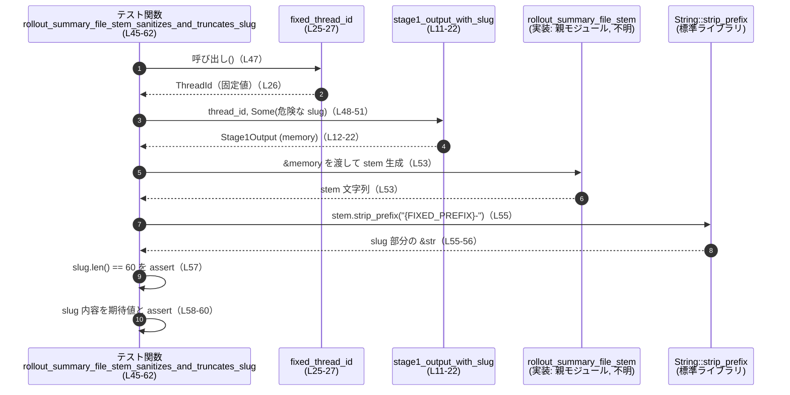

# core/src/memories/storage_tests.rs コード解説

## 0. ざっくり一言

`rollout_summary_file_stem` / `rollout_summary_file_stem_from_parts` が生成する「ロールアウトサマリファイル名のベース（stem）」の仕様をテストで固定化するためのモジュールです。  
特に、**slug がない場合／空文字の場合／長くて危険な文字を含む場合**の挙動を検証します（storage_tests.rs:L29-42, L45-62, L64-70）。

---

## 1. このモジュールの役割

### 1.1 概要

このモジュールは、親モジュール（`super`）に定義されている以下の関数の挙動をテストします。

- `rollout_summary_file_stem`  
- `rollout_summary_file_stem_from_parts`  

テストを通して、**生成されるファイル名（stem）が安全で決定的（deterministic）であり、slug の有無や内容に応じて正しく変換・切り詰められること**を保証します。

### 1.2 アーキテクチャ内での位置づけ

このファイルは「メモリ・ロールアウトのストレージ機構」の一部である親モジュールのテストとして機能します。

```mermaid
graph TD
    subgraph 親モジュール(super, 実装はこのチャンク外)
        R1["rollout_summary_file_stem\n(実装 不明)"]
        R2["rollout_summary_file_stem_from_parts\n(実装 不明)"]
    end

    subgraph storage_tests.rs
        C1["FIXED_PREFIX 定数\n(L9)"]
        F1["fixed_thread_id\n(L25-27)"]
        F2["stage1_output_with_slug\n(L11-22)"]
        T1["test: ..._slug_missing\n(L29-43)"]
        T2["test: ..._sanitizes_and_truncates_slug\n(L45-62)"]
        T3["test: ..._slug_is_empty\n(L64-70)"]
    end

    subgraph 外部依存
        S1["codex_protocol::ThreadId\n(型, 実装は別クレート)"]
        S2["codex_state::Stage1Output\n(型, 実装は別クレート)"]
        S3["chrono::Utc / TimeZone\n(L3-4)"]
        S4["std::path::PathBuf\n(L8)"]
    end

    T1 --> F1
    T1 --> F2
    T1 --> R1
    T1 --> R2
    T2 --> F1
    T2 --> F2
    T2 --> R1
    T3 --> F1
    T3 --> F2
    T3 --> R1

    F1 --> S1
    F2 --> S2
    F2 --> S3
    F2 --> S4
```

※ `R1`, `R2` の実装はこのチャンクには現れません。

### 1.3 設計上のポイント

- **決定的な入力の構築**  
  - `fixed_thread_id` で固定の `ThreadId` を返します（storage_tests.rs:L25-27）。  
  - `stage1_output_with_slug` で固定のタイムスタンプ・パス・内容を持つ `Stage1Output` を生成します（storage_tests.rs:L11-22）。  
  → テスト実行のたびに同じ入力となり、ファイル名の決定的なプレフィックスを検証できます。

- **期待されるプレフィックスを定数で固定**  
  - 期待されるファイル名プレフィックス `"2025-02-11T15-35-19-jqmb"` を `FIXED_PREFIX` として定義しています（storage_tests.rs:L9）。  
  → 実装変更時に、意図せぬ出力変更を検知できます。

- **slug の扱いの仕様化**  
  - slug が `None` の場合（storage_tests.rs:L29-42）と、`Some("")` の場合（storage_tests.rs:L64-70）に、いずれも `FIXED_PREFIX` のみが返ることを確認しています。  
  - slug が長くかつ危険な文字を含む場合も、**サニタイズ（安全な文字列への変換）と長さ制限（60 文字）** が行われることを検証しています（storage_tests.rs:L46-61）。

- **パニックを用いた前提の固定**  
  - テストの補助関数では `expect(...)` を使い、タイムスタンプ変換や ThreadId 生成が失敗した場合に明示的にパニックするようになっています（storage_tests.rs:L14-21, L25-27）。  
  → 入力生成が失敗した状態でテストが進まない前提を固定しています。

---

## 2. コンポーネント一覧（インベントリ）

### 2.1 このファイル内で定義されるコンポーネント

| 名前 | 種別 | 役割 / 用途 | 根拠 |
|------|------|-------------|------|
| `FIXED_PREFIX` | 定数 `&'static str` | 期待されるファイル名プレフィックス `"2025-02-11T15-35-19-jqmb"` を表す | storage_tests.rs:L9 |
| `stage1_output_with_slug` | 関数 | 指定された `ThreadId` とオプションの slug を持つ `Stage1Output` を構築するヘルパー | storage_tests.rs:L11-22 |
| `fixed_thread_id` | 関数 | テスト用に固定の `ThreadId` を生成するヘルパー | storage_tests.rs:L25-27 |
| `rollout_summary_file_stem_uses_uuid_timestamp_and_hash_when_slug_missing` | テスト関数 | slug がないときにプレフィックスのみが使われることを検証 | storage_tests.rs:L29-43 |
| `rollout_summary_file_stem_sanitizes_and_truncates_slug` | テスト関数 | slug がサニタイズされ、60 文字に切り詰められることを検証 | storage_tests.rs:L45-62 |
| `rollout_summary_file_stem_uses_uuid_timestamp_and_hash_when_slug_is_empty` | テスト関数 | slug が空文字のときも slug 無しと同じ扱いになることを検証 | storage_tests.rs:L64-70 |

### 2.2 このファイルが利用する外部コンポーネント

| 名前 | 種別 | 役割 / 用途 | 根拠 |
|------|------|-------------|------|
| `rollout_summary_file_stem` | 関数（親モジュール） | `Stage1Output` からファイル名 stem を生成する。実装はこのチャンク外 | 呼び出し: storage_tests.rs:L34, L53 |
| `rollout_summary_file_stem_from_parts` | 関数（親モジュール） | `thread_id`・時刻・slug から直接 stem を生成する。実装はこのチャンク外 | 呼び出し: storage_tests.rs:L35-41 |
| `ThreadId` | 型（`codex_protocol` クレート） | スレッドを一意に識別する ID | 使用: storage_tests.rs:L5, L11, L25, L31, L37, L47, L49, L66 |
| `Stage1Output` | 型（`codex_state` クレート） | メモリ／ロールアウトに関する出力情報を保持。テストではファイル名生成の入力として使用 | 使用: storage_tests.rs:L6, L11-22, L32, L37-40, L48-51, L67-69 |
| `chrono::Utc`, `chrono::TimeZone` | 型 / トレイト | タイムスタンプの生成に使用 | 使用: storage_tests.rs:L3-4, L14, L21 |
| `std::path::PathBuf` | 型 | `rollout_path`, `cwd` を表現 | 使用: storage_tests.rs:L8, L18-19 |
| `pretty_assertions::assert_eq` | マクロ | 標準の `assert_eq!` と互換の API を持つテスト用アサート | 使用: storage_tests.rs:L7, L34-42, L57-61, L69 |

---

## 3. 公開 API と詳細解説

### 3.1 型一覧（このファイルで新規定義される型）

このファイル内で新たに定義される構造体・列挙体はありません。  
外部型として以下を利用します。

| 名前 | 種別 | 役割 / 用途 | 根拠 |
|------|------|-------------|------|
| `ThreadId` | 外部構造体（詳細不明） | スレッド ID。`ThreadId::try_from(&str)` から生成される | storage_tests.rs:L5, L25 |
| `Stage1Output` | 外部構造体（詳細不明） | メモリ／ロールアウトに関する出力。テスト用にフィールドを直接初期化 | storage_tests.rs:L6, L11-22 |

> フィールド構成や型定義の詳細はこのチャンクには現れません。

### 3.2 関数詳細（重要 7 件）

以下では、ヘルパー関数 2 件とテスト対象の公開関数 2 件、テスト関数 3 件を説明します。

---

#### `stage1_output_with_slug(thread_id, rollout_slug) -> Stage1Output`

**概要**

指定された `thread_id` とオプションの slug を持つ `Stage1Output` インスタンスを、**固定のテスト用値**で組み立てるヘルパーです（storage_tests.rs:L11-22）。

**引数**

| 引数名 | 型 | 説明 | 根拠 |
|--------|----|------|------|
| `thread_id` | `ThreadId` | スレッド ID | storage_tests.rs:L11, L13 |
| `rollout_slug` | `Option<&str>` | 任意の slug。`Some` の場合に文字列へ変換され、`Stage1Output.rollout_slug` に入る | storage_tests.rs:L11, L17 |

**戻り値**

- `Stage1Output`  
  - テストで使うために、以下のフィールドが設定されたインスタンスを返します（storage_tests.rs:L12-22）。  
  - `thread_id`, `source_updated_at`, `raw_memory`, `rollout_summary`, `rollout_slug`, `rollout_path`, `cwd`, `git_branch`, `generated_at`。

**内部処理の流れ**

1. フィールド初期化リテラルで `Stage1Output { ... }` を構築します（storage_tests.rs:L12）。  
2. `thread_id` フィールドに引数 `thread_id` をそのまま設定します（storage_tests.rs:L13）。  
3. `source_updated_at` と `generated_at` を、`Utc.timestamp_opt(...).single().expect("timestamp")` の結果で設定します（storage_tests.rs:L14, L21）。  
4. `raw_memory` と `rollout_summary` に固定の文字列 `"raw memory"`, `"summary"` を設定します（storage_tests.rs:L15-16）。  
5. `rollout_slug` フィールドには、`rollout_slug.map(ToString::to_string)` を使って `Option<String>` として設定します（storage_tests.rs:L17）。  
6. `rollout_path`, `cwd` には `/tmp/...` の固定パスを `PathBuf::from` で設定します（storage_tests.rs:L18-19）。  
7. `git_branch` は `None` に固定します（storage_tests.rs:L20）。

**Examples（使用例）**

```rust
// テスト内での使用例（storage_tests.rs:L31-32）
let thread_id = fixed_thread_id();                       // 固定の ThreadId を取得
let memory = stage1_output_with_slug(thread_id, None);   // slug なしの Stage1Output を生成
```

**Errors / Panics**

- `Utc.timestamp_opt(...).single().expect("timestamp")` により、指定したタイムスタンプが不正で `single()` が `None` を返した場合はパニックになります（storage_tests.rs:L14, L21）。  
  → 現状の定数 `123` / `124` に対しては、テストが通る前提です。

**Edge cases（エッジケース）**

- `rollout_slug == None` の場合  
  → `rollout_slug` フィールドは `None` になります（storage_tests.rs:L17）。  
- `rollout_slug == Some("")` の場合  
  → `Some("".to_string())` となり、空文字を含む `Some` として保存されます（storage_tests.rs:L17, L67）。

**使用上の注意点**

- テスト専用の値（`raw_memory`, `rollout_summary`, パス、時刻）を埋め込んでいるため、本番コードからの直接利用は想定されていないと考えられます。  
  （ただし、その想定自体はコードからは断定できず、`#[cfg(test)]` の記述もこのチャンクにはありません。）

---

#### `fixed_thread_id() -> ThreadId`

**概要**

文字列リテラルから `ThreadId` を生成し、テスト中で一貫して同じ ID を使うためのヘルパーです（storage_tests.rs:L25-27）。

**引数**

- なし。

**戻り値**

- `ThreadId`  
  - `"0194f5a6-89ab-7cde-8123-456789abcdef"` から生成された ID（storage_tests.rs:L26）。

**内部処理の流れ**

1. 文字列リテラル `"0194f5a6-89ab-7cde-8123-456789abcdef"` を `ThreadId::try_from` に渡します（storage_tests.rs:L26）。  
2. その結果に `.expect("valid thread id")` を呼び、不正な場合はパニックします（storage_tests.rs:L26）。  
3. 成功時の `ThreadId` をそのまま返します。

**Examples（使用例）**

```rust
let thread_id = fixed_thread_id();   // 毎回同じ ThreadId を取得（storage_tests.rs:L31, L47, L66）
```

**Errors / Panics**

- 文字列が `ThreadId` として不正な場合、`try_from` が `Err` を返し `.expect` によりパニックします（storage_tests.rs:L26）。  
  → 現在は「valid thread id」とコメントされており、テスト前提として有効な ID であることを期待しています。

**Edge cases**

- 引数を取らないため、エッジケースは主に `ThreadId` 実装側に依存します。このチャンクにはその詳細は現れません。

**使用上の注意点**

- この関数の戻り値に依存して `FIXED_PREFIX` 等が算出されている可能性がありますが、実際の計算ロジックは親モジュール側にあり、このチャンクには現れません。

---

#### `rollout_summary_file_stem(memory: &Stage1Output, ...) -> <文字列型>`

> シグネチャ全体はこのチャンクには現れません。  
> テストから分かる情報のみ記述します。

**概要**

`Stage1Output` から「ロールアウトサマリファイル名の stem（拡張子を除く部分）」を生成する関数です。  
テストから次の仕様が確認できます。

- slug が `None` の場合、出力は `FIXED_PREFIX` と一致します（storage_tests.rs:L34）。  
- slug が `Some("")`（空文字）の場合も、出力は同じく `FIXED_PREFIX` になります（storage_tests.rs:L69）。  
- slug が長く危険な文字を含む場合、`"{FIXED_PREFIX}-{サニタイズ＆切り詰めした slug}"` 形式になり、slug 部分は 60 文字に制限されます（storage_tests.rs:L45-61）。

**引数（テストから分かる範囲）**

| 引数名 | 型（推定） | 説明 | 根拠 |
|--------|------------|------|------|
| `memory` | `&Stage1Output` を受け取れる型 | `&memory` が渡されているため、少なくとも `&Stage1Output` への参照を受け取る | 呼び出し: storage_tests.rs:L34, L53 |

**戻り値**

- `FIXED_PREFIX` や `"{FIXED_PREFIX}-..."` と比較可能な型（`PartialEq<&str>` を満たす）である文字列型（String か &str 等）と考えられます。  
  根拠: `assert_eq!(rollout_summary_file_stem(&memory), FIXED_PREFIX);`（storage_tests.rs:L34, L69）。

**内部処理の流れ（テストから推測できる仕様）**

実装はこのチャンクにはありませんが、テスト名と期待値から次のような仕様が意図されていると考えられます。

1. `memory` からスレッド ID・時刻などを取得し、`FIXED_PREFIX` のような **日時＋ハッシュ** を含むプレフィックスを生成する（テスト名 “uses_uuid_timestamp_and_hash” より、storage_tests.rs:L29, L64）。  
2. `memory.rollout_slug` が  
   - `None` または `Some("")` の場合: プレフィックスのみを返す（storage_tests.rs:L34, L69）。  
   - 上記以外の場合: slug をサニタイズ・切り詰めして `"{prefix}-{slug}"` 形式で返す（storage_tests.rs:L53-61）。  
3. サニタイズの具体的挙動（storage_tests.rs:L50-61）:
   - 英字は小文字化される（ `"Unsafe"` → `"unsafe"` ）。  
   - 空白や `/`, `&`, `+` などは `_` に変換されると推測されます（元文字と期待値の差異より）。  
   - 長さは 60 文字に切り詰められます（`assert_eq!(slug.len(), 60);` より, storage_tests.rs:L57）。

> 上記 1–3 のうち、1 とサニタイズの詳細はテスト名・期待値からの推測を含みます。  
> 正確なアルゴリズムは親モジュールの実装を参照する必要があります。

**Examples（使用例：テスト内）**

```rust
let thread_id = fixed_thread_id();                         // 固定 ThreadId（L47）
let memory = stage1_output_with_slug(
    thread_id,
    Some("Unsafe Slug/With Spaces & Symbols + EXTRA_LONG_12345_67890_ABCDE_fghij_klmno"),
);                                                         // 危険な slug を持つ入力（L48-51）

let stem = rollout_summary_file_stem(&memory);             // ファイル名 stem を生成（L53）
let slug = stem
    .strip_prefix(&format!("{FIXED_PREFIX}-"))             // プレフィックスを取り除く（L55）
    .expect("slug suffix should be present");
assert_eq!(slug.len(), 60);                                // 60 文字に制限されている（L57）
assert_eq!(
    slug,
    "unsafe_slug_with_spaces___symbols___extra_long_12345_67890_a"
);                                                         // サニタイズ結果の検証（L58-60）
```

**Errors / Panics**

- この関数自身がパニックを起こすかどうかは、このチャンクからは分かりません。  
- テスト側では `strip_prefix` の結果に `.expect("slug suffix should be present")` を呼んでいるため、`stem` が期待どおり `"FIXED_PREFIX-"` で始まらない場合にはテストがパニックします（storage_tests.rs:L55-56）。

**Edge cases（テストでカバーされているもの）**

- slug が `None`（storage_tests.rs:L32）  
  → プレフィックスのみ（`FIXED_PREFIX`）を返すことを期待。  
- slug が `Some("")`（空文字, storage_tests.rs:L67）  
  → `None` と同じ扱いになり、`FIXED_PREFIX` のみを返すことを期待。  
- slug が長く、かつ空白・`/`・`&`・`+`・大文字を含む場合（storage_tests.rs:L50）  
  → 60 文字に切り詰められ、小文字化・特殊文字の `_` 置換が行われることを期待。

**使用上の注意点（テストから見える契約）**

- slug の末尾 60 文字より後は情報が失われるため、ファイル名から完全な slug を復元したり、識別に使う設計は危険です。  
- slug にファイルシステム上で問題となる文字（スペースやスラッシュなど）を含めても、サニタイズされる前提で設計されていると考えられますが、**具体的な安全保証は実装を確認する必要があります**。

---

#### `rollout_summary_file_stem_from_parts(thread_id, timestamp, slug_opt) -> <文字列型>`

**概要**

`ThreadId`・時刻・オプションの slug を直接渡してファイル名 stem を生成する関数です。  
`rollout_summary_file_stem` と **同じロジックを別シグネチャで利用できる**ラッパーであることがテストから分かります（storage_tests.rs:L35-41）。

**引数（テストから分かる範囲）**

| 引数名 | 型（テストから分かる情報） | 説明 | 根拠 |
|--------|----------------------------|------|------|
| 第1引数 | `ThreadId` | `memory.thread_id` が渡されている | storage_tests.rs:L37 |
| 第2引数 | 時刻型（詳細不明） | `memory.source_updated_at` が渡されている | storage_tests.rs:L38 |
| 第3引数 | `Option<&str>` 相当 | `memory.rollout_slug.as_deref()` が渡されている | storage_tests.rs:L39 |

**戻り値**

- `rollout_summary_file_stem` と同様に、`FIXED_PREFIX` と比較可能な文字列型（`PartialEq<&str>` を満たす）であることが分かります（storage_tests.rs:L41）。

**内部処理の流れ（テストから推測）**

1. 渡された `thread_id` と時刻・`slug_opt` を元に stem を生成する。  
2. slug が `None` の場合は `FIXED_PREFIX` のみを返す（storage_tests.rs:L36-42）。  
3. `rollout_summary_file_stem` と同じロジックを共有しているか、そのロジックを内部で呼び出している設計である可能性が高いですが、実装はこのチャンクには現れません。

**Examples（使用例：テスト内）**

```rust
let memory = stage1_output_with_slug(thread_id, None);    // slug なし（L32）
assert_eq!(
    rollout_summary_file_stem_from_parts(
        memory.thread_id,
        memory.source_updated_at,
        memory.rollout_slug.as_deref(),
    ),
    FIXED_PREFIX                                          // roll_out_summary_file_stem と同じ結果を期待（L35-41）
);
```

**Errors / Panics**

- 本関数自身がエラーやパニックを起こす条件はこのチャンクには現れません。

**Edge cases**

- slug が `None` のケースを `rollout_summary_file_stem` と同じように扱うことがテストで確認されています（storage_tests.rs:L32-42）。  
- 空文字 slug (`Some("")`) を直接渡すテストはありません。このケースの挙動は不明です。

**使用上の注意点**

- slug が `None` と空文字で同じ扱いになるかどうかは、`rollout_summary_file_stem` ではテストされていますが、本関数ではテストされていません。API の利用側はこの差異がないか確認する必要があります。

---

#### テスト関数 3 件

以降はテスト関数です。API 利用例・仕様の確認という観点で要点のみまとめます。

##### `rollout_summary_file_stem_uses_uuid_timestamp_and_hash_when_slug_missing()`

**役割**

- `rollout_summary_file_stem` と `rollout_summary_file_stem_from_parts` が、slug `None` のときに `FIXED_PREFIX` のみを返すことを検証します（storage_tests.rs:L29-42）。

**ポイント**

- `stage1_output_with_slug(thread_id, None)` で slug なしの `Stage1Output` を生成（storage_tests.rs:L32）。  
- `rollout_summary_file_stem(&memory)` の結果と `FIXED_PREFIX` を比較（storage_tests.rs:L34）。  
- `rollout_summary_file_stem_from_parts(...)` の結果も同じく `FIXED_PREFIX` であることを期待（storage_tests.rs:L35-42）。

##### `rollout_summary_file_stem_sanitizes_and_truncates_slug()`

**役割**

- 危険な文字を含み長い slug が、サニタイズされて 60 文字に切り詰められることを検証します（storage_tests.rs:L45-62）。

**ポイント**

- slug に `"Unsafe Slug/With Spaces & Symbols + EXTRA_LONG_12345_67890_ABCDE_fghij_klmno"` を使用（storage_tests.rs:L50）。  
- 生成された stem から `FIXED_PREFIX-` を取り除き、slug 部分だけを取り出す（storage_tests.rs:L53-56）。  
- 取り出した slug の長さが 60 文字であること（storage_tests.rs:L57）。  
- 内容が `"unsafe_slug_with_spaces___symbols___extra_long_12345_67890_a"` と一致すること（storage_tests.rs:L58-60）。

##### `rollout_summary_file_stem_uses_uuid_timestamp_and_hash_when_slug_is_empty()`

**役割**

- slug が `Some("")`（空文字）であっても、slug なし (`None`) と同等に扱われ、`FIXED_PREFIX` のみが出力されることを確認します（storage_tests.rs:L64-70）。

**ポイント**

- `stage1_output_with_slug(thread_id, Some(""))` で空文字 slug を持つ `Stage1Output` を生成（storage_tests.rs:L66-67）。  
- `rollout_summary_file_stem(&memory) == FIXED_PREFIX` をアサート（storage_tests.rs:L69）。

### 3.3 その他の関数

3.2 でこのファイル内の全関数およびテスト対象 API を説明したため、このセクションで追加説明すべき関数はありません。

---

## 4. データフロー

ここでは、slug がサニタイズされて切り詰められるテストのフローを示します。

### 4.1 slug サニタイズ・切り詰めフロー



このフローにより、

- `rollout_summary_file_stem` が `"{FIXED_PREFIX}-..."` 形式の文字列を返すこと  
- 返された文字列から slug 部分を分解して検査可能であること  

がテストで確認されています。

---

## 5. 使い方（How to Use）

### 5.1 基本的な使用方法（テスト経由で見える API 利用）

本番コードでの典型的な利用イメージを、テストから推測できる範囲で示します。

```rust
use codex_protocol::ThreadId;               // ThreadId 型（本番コード側）
use codex_state::Stage1Output;              // Stage1Output 型
// use crate::memories::storage::rollout_summary_file_stem; // 実際のモジュールパスはこのチャンクには現れない

fn example_use(memory: &Stage1Output) -> String {
    // メモリ情報からファイル名 stem を生成する
    let stem = rollout_summary_file_stem(memory);      // テストで使用されている呼び出し（L34, L53, L69）
    stem.to_string()                                   // 型に応じて String に変換（型はこのチャンクからは不明）
}
```

テストから分かる前提として、

- `memory.rollout_slug == None` または `Some("")` のときは、日時＋ハッシュのようなプレフィックスのみが生成される（storage_tests.rs:L34, L69）。  
- slug を与えると、サニタイズされた slug が 60 文字以内で付加される（storage_tests.rs:L53-61）。

という挙動を利用できます。

### 5.2 よくある使用パターン（推測される）

1. **slug なしでのロールアウトファイル名生成**

```rust
let memory = stage1_output_with_slug(fixed_thread_id(), None);  // テスト例と同じ（L31-32）
let stem = rollout_summary_file_stem(&memory);                  // L34
// 結果は FIXED_PREFIX に一致：タイムスタンプ＋ハッシュのみ
```

1. **slug 付き（人間が読める名前付き）のファイル名生成**

```rust
let memory = stage1_output_with_slug(
    fixed_thread_id(),
    Some("My Feature Rollout"),        // 任意の slug
);
let stem = rollout_summary_file_stem(&memory);
// stem は "{FIXED_PREFIX}-my_feature_rollout" のような形式になることが期待されるが、
// 正確な変換は実装側を確認する必要があります。
```

1. **低レベル API として `rollout_summary_file_stem_from_parts` を使う**

```rust
let memory = stage1_output_with_slug(fixed_thread_id(), None);
let stem = rollout_summary_file_stem_from_parts(
    memory.thread_id,
    memory.source_updated_at,
    memory.rollout_slug.as_deref(),    // Option<&str> へ変換（L39）
);
// テストでは slug が None のとき、rollout_summary_file_stem と同じ結果になることを確認（L35-42）
```

### 5.3 よくある間違い（想定される）

```rust
// 誤りの例: slug が非常に長くても、ファイル名にそのまま使えると期待する
let memory = stage1_output_with_slug(fixed_thread_id(), Some("very_long_and_complex_slug_..."));
let stem = rollout_summary_file_stem(&memory);
// 期待: slug 部分が全部残る
// 実際: テストにより、slug は 60 文字に切り詰められる（L57）

// 正しい理解:
let slug_part = stem.strip_prefix(&format!("{FIXED_PREFIX}-")).unwrap();
// slug_part.len() <= 60 であることを前提とする
```

### 5.4 使用上の注意点（まとめ）

- **slug 長の制限**  
  - slug は 60 文字に切り詰められます（storage_tests.rs:L57）。識別に slug 全体を使いたい場合は別ストレージに保存する必要があります。
- **slug のサニタイズ**  
  - スペース・`/`・`&`・`+` などが `_` に置き換えられることが期待されますが（storage_tests.rs:L50, L58-60）、**どの文字がどう変換されるかの完全な仕様はこのチャンクからは分かりません**。
- **空文字 slug の扱い**  
  - `Some("")` は `None` と同様に扱われ、slug 無しと同じ結果になります（storage_tests.rs:L67-69）。  
  - 「slug を与えたかどうか」を区別したい場合、この仕様は注意が必要です。
- **テストの前提条件**  
  - `ThreadId::try_from` や `Utc.timestamp_opt` が失敗するとパニックするため（storage_tests.rs:L14, L21, L26）、入力が有効であることを前提にテストが書かれています。

---

## 6. 変更の仕方（How to Modify）

### 6.1 新しい機能を追加する場合（例: サニタイズルールを拡張）

1. **親モジュール側の実装変更**  
   - `rollout_summary_file_stem` / `rollout_summary_file_stem_from_parts` に新しいサニタイズルールを追加します（実装ファイルはこのチャンクには出ていませんが、`super::` モジュールになります）。

2. **テストケースの追加**  
   - 対応するテスト関数をこのファイルに追加します。  
   - 例: 新しい禁止文字（例: `?` や `#`）を含む slug に対する期待値を追加。  
   - 既存の `rollout_summary_file_stem_sanitizes_and_truncates_slug` に追記するか、新しいテスト関数として切り出します。

3. **`FIXED_PREFIX` の取り扱い**  
   - プレフィックス生成ロジックを変更した場合、`FIXED_PREFIX` も更新する必要があります（storage_tests.rs:L9）。  
   - 変更後のプレフィックスは、固定の入力（`fixed_thread_id` + タイムスタンプ）から実際に生成してからテストに反映すると安全です。

4. **エッジケースの追加テスト**  
   - 空白のみからなる slug（例: `"   "`）、特殊 Unicode 文字、極端に長い slug などを追加して挙動を固定できます。

### 6.2 既存の機能を変更する場合（契約と潜在バグ・セキュリティ）

- **契約（Contract）を再確認すべき点**

  - slug `None` / `Some("")` → プレフィックスのみ、という挙動はクライアントコードが依存している可能性があります（storage_tests.rs:L34, L69）。  
  - slug 長 60 文字という上限に依存しているコードがある可能性があります（storage_tests.rs:L57）。

- **潜在的なバグ・セキュリティ上の注意**

  - このテストは、特定の危険文字 (`/`, `&`, `+`, 空白) を含む slug のサニタイズを検証していますが、それ以外の文字（例: `\`, `:`, `?`, `*` など OS 依存で禁止される文字）はカバーしていません。  
    → ファイルシステムによっては依然として危険な文字が残る可能性があり、**テストだけでは完全な安全性は保証されません**。  
  - パスインジェクション（例: `../` を含む slug）に対してどのように振る舞うかは、このチャンクからは分かりません。必要なら、追加のサニタイズ／バリデーションとテストを検討するべきです。

- **変更時の影響範囲**

  - `FIXED_PREFIX` が変わると、このファイルのすべてのテストが影響を受けます（storage_tests.rs:L34, L41, L53, L55, L69）。  
  - `Stage1Output` のフィールド構成を変更した場合、`stage1_output_with_slug` の初期化部分も合わせて更新する必要があります（storage_tests.rs:L11-22）。

---

## 7. 関連ファイル

このテストモジュールと密接に関係するのは、`super::` で参照されている親モジュールおよび外部クレートの型です。

| パス / モジュール | 役割 / 関係 | 根拠 |
|-------------------|------------|------|
| 親モジュール（`super`） | `rollout_summary_file_stem` / `rollout_summary_file_stem_from_parts` の実装を持つ。本テストから呼び出される | `use super::rollout_summary_file_stem;`（storage_tests.rs:L1-2） |
| `codex_protocol::ThreadId` | `ThreadId` 型の定義。本テストで固定のスレッド ID を生成するのに使用 | `use codex_protocol::ThreadId;`（storage_tests.rs:L5, L25-26） |
| `codex_state::Stage1Output` | `Stage1Output` 型の定義。ロールアウト情報を保持し、本テストではファイル名生成の入力として利用 | `use codex_state::Stage1Output;`（storage_tests.rs:L6, L11-22） |
| `chrono` クレート | `Utc.timestamp_opt` などを提供し、テスト入力のタイムスタンプを生成 | `use chrono::TimeZone; use chrono::Utc;`（storage_tests.rs:L3-4, L14, L21） |
| 標準ライブラリ `std::path::PathBuf` | ロールアウトファイルパスや作業ディレクトリパスを表現する型 | `use std::path::PathBuf;`（storage_tests.rs:L8, L18-19） |

このチャンク内には、親モジュールや外部クレートの実装詳細は現れません。  
より深く理解するには、それぞれの実装ファイルやクレートドキュメントを参照する必要があります。
