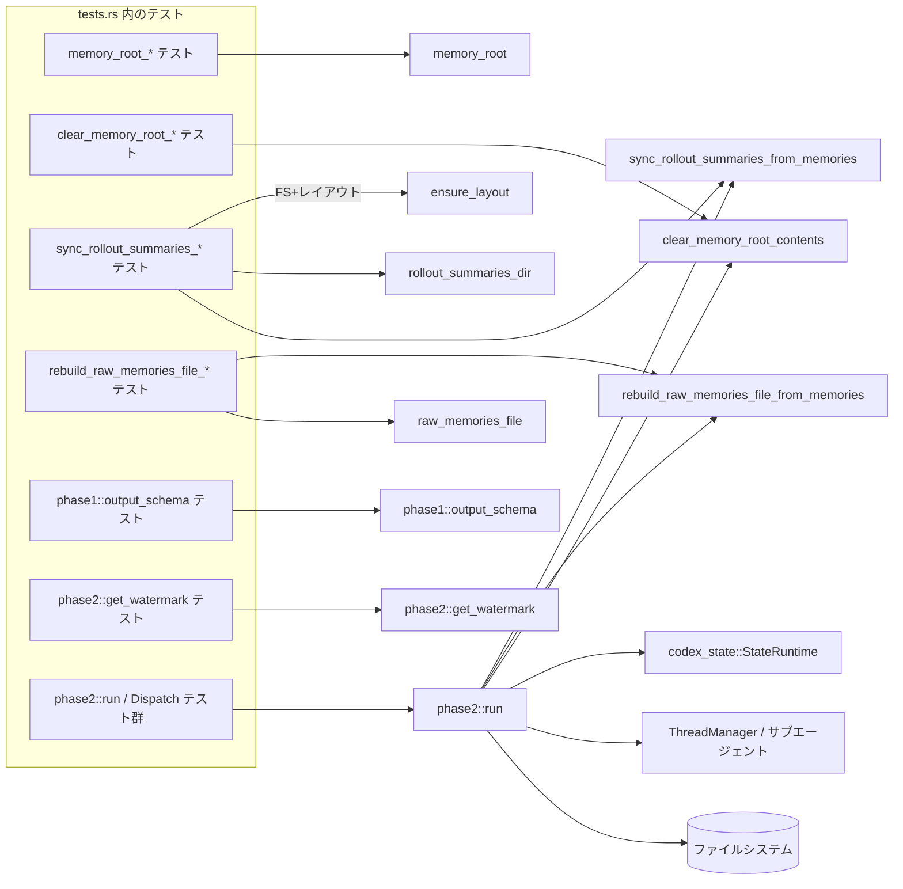
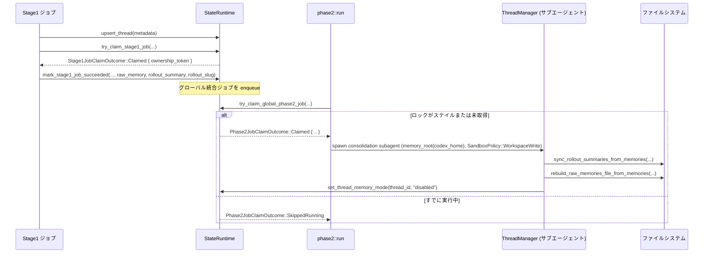

# core/src/memories/tests.rs コード解説

## 0. ざっくり一言

`core/src/memories/tests.rs` は、`crate::memories` サブシステム（メモリ用ディレクトリ構造、ロールアウトサマリ、raw memories ファイル、およびグローバルなメモリ統合ジョブの phase2 処理）の振る舞いを検証する統合テスト群です。

---

## 1. このモジュールの役割

### 1.1 概要

- このテストモジュールは **メモリ用ファイルレイアウトと統合処理の契約 (contract)** を検証します。
- 主に以下を対象としています:
  - メモリルートディレクトリのレイアウト・クリア処理（`memory_root`, `clear_memory_root_contents`, `ensure_layout` など）
  - Stage1 出力スキーマ (`phase1::output_schema`) の JSON Schema 契約
  - Stage1 出力からロールアウトサマリ / raw memories を構築する処理（`sync_rollout_summaries_from_memories`, `rebuild_raw_memories_file_from_memories`）
  - グローバルメモリ統合ジョブの phase2 実行 (`memories::phase2::run`, `get_watermark`) とジョブロック・リトライセマンティクス

### 1.2 アーキテクチャ内での位置づけ

このファイル自体はテストですが、呼び出し関係からメモリサブシステムの構成を読み取れます。



> 行番号はこのチャンクからは取得できないため、ノードは関数名のみで示しています。

### 1.3 設計上のポイント（テストから読み取れること）

- **ファイルシステム安全性**
  - メモリルートのクリアは、ルートがシンボリックリンクである場合に拒否される（`clear_memory_root_contents_rejects_symlinked_root` テスト）。
  - 空のメモリルートはディレクトリ自体を残し、内部だけを安全に削除する。
- **命名・スキーマの安定性**
  - `memory_root(codex_home)` は常に `codex_home/memories` を返すことを契約化。
  - Stage1 出力スキーマは `rollout_slug` を必須フィールドとしつつ `null` も許可する JSON Schema になっている。
  - ロールアウトサマリファイル名は `timestamp-short_hash-sanitized_slug.md` という形式とし、古い形式（`thread_id.md`, `thread_id--slug.md`）をクリーンアップ。
- **グローバルジョブの並行性制御**
  - `Phase2JobClaimOutcome` を用いたグローバルロック（すでに実行中 / ステイル / not dirty）の制御。
  - ステイルロックの再取得と、失敗時の「リトライ可能な状態」保持 (`SkippedNotDirty` として再度クレーム可能にする)。
- **サンドボックスと権限**
  - 統合処理用サブエージェントは `AskForApproval::Never` / `SandboxPolicy::WorkspaceWrite` / `cwd = memory_root` で実行される。
  - サンドボックスポリシーが `Constrained` により上書きできない場合は、ジョブを失敗として再試行状態にする。
- **非同期 I/O と Tokio**
  - すべてのファイル操作・DB操作・スレッド管理は Tokio の async/await で行われる。
  - テストも `#[tokio::test]` を多用しており、実際の運用も非同期前提であることが分かります。

---

## 2. 主要な機能一覧（コンポーネントインベントリー含む）

### 2.1 このファイルでテストしている主な機能

- メモリルート:
  - `memory_root(codex_home: &Path) -> PathBuf`  
    Codex のホームディレクトリからメモリルート (`memories/`) を決定する。
- メモリルートのクリア:
  - `clear_memory_root_contents(root: &Path) -> Result<(), std::io::Error>`（エラー型はテストから推定）
    - ルートディレクトリの中身だけを削除し、ルート自体は残す。
    - ルートが symlink の場合は `InvalidInput` エラーで拒否する。
- メモリレイアウトとファイルパス:
  - `ensure_layout(root: &Path) -> Result<_, _>`  
    必要なディレクトリ構造（`rollout_summaries/` など）を作成する。
  - `rollout_summaries_dir(root: &Path) -> PathBuf`  
    ロールアウトサマリ Markdown ファイルの保存ディレクトリ。
  - `raw_memories_file(root: &Path) -> PathBuf`  
    全スレッドの raw memories をまとめた `raw_memories.md` のパス。
- Stage1 出力とスキーマ:
  - `phase1::output_schema() -> serde_json::Value`  
    Stage1 出力の JSON Schema。`raw_memory`, `rollout_slug`, `rollout_summary` が必須で、`rollout_slug` は `"null" | "string"` を許容。
- ロールアウトサマリ同期と raw memories 再構築:
  - `sync_rollout_summaries_from_memories(root, memories, max)`  
    Stage1Output 一覧から:
    - 古い/不要な `.md` を削除
    - 各メモリのロールアウトサマリ `.md` を `timestamp-shortHash-sanitized_slug.md` 形式で生成
  - `rebuild_raw_memories_file_from_memories(root, memories, max)`  
    `raw_memories.md` を再生成し、各スレッドごとに:
    - `## Thread \`<thread_id>\`` ヘッダ
    - `updated_at`, `cwd`, `rollout_path`, `rollout_summary_file` などのメタデータ
    - `raw_memory` の Markdown 本文
- Phase2（グローバル統合ジョブ）:
  - `phase2::get_watermark(claimed_watermark, outputs: &[Stage1Output]) -> i64`  
    入力ウォーターマークと Stage1Output の `source_updated_at` を比較し、完了ウォーターマークを決定。
  - `phase2::run(session: &Session, config: Arc<Config>)`  
    グローバル統合ジョブを:
    - 「ダーティかどうか」「ロックが既に走っていないか」を確認
    - 必要ならサブエージェントスレッドを起動し、メモリ統合の対話を実行
    - ローカルアーティファクト（サマリファイル・raw memories・skills など）を同期/再構築

### 2.2 このファイル内で定義されている主なコンポーネント

> 行番号はこのインターフェイスでは取得できないため、`行範囲` 列は「不明」と記載します。

#### 構造体・型

| 名前 | 種別 | 役割 / 用途 | 定義場所 | 行範囲 |
|------|------|-------------|----------|--------|
| `DispatchHarness` | 構造体 | phase2::run のテスト用ハーネス。StateRuntime / ThreadManager / Session をまとめてセットアップ。 | このファイル | tests.rs: 不明 |
| `Stage1Output` | 構造体 | Stage1 メモリ生成の出力。thread_id, source_updated_at, raw_memory 等を保持。 | 外部クレート `codex_state` | 不明 |
| `Phase2JobClaimOutcome` | 列挙体 | グローバル phase2 ジョブのクレーム結果（Claimed, SkippedRunning, SkippedNotDirty 等）。 | 外部クレート `codex_state` | 不明 |
| `ThreadManager` | 構造体 | サブエージェントスレッドの生成・管理および送受信した Op の記録。 | 同クレート内 | 不明 |
| `Config` | 構造体 | Codex 全体の設定。`codex_home`, `cwd`, `permissions` など。 | 同クレート内 | 不明 |
| `Session` | 構造体 | Codex セッション。state_db / agent_control などのサービスを内包。 | 同クレート内 | 不明 |

#### 関数（このファイル内に定義）

| 名前 | 種別 | 概要 | 行範囲 |
|------|------|------|--------|
| `memory_root_uses_shared_global_path` | `#[test]` | `memory_root(codex_home) == codex_home.join("memories")` を検証。 | 不明 |
| `stage_one_output_schema_requires_rollout_slug_and_keeps_it_nullable` | `#[test]` | phase1 出力スキーマの `rollout_slug` の存在と `"null" | "string"` 型を検証。 | 不明 |
| `clear_memory_root_contents_preserves_root_directory` | `#[tokio::test]` | メモリルートディレクトリの中身だけが削除され、ディレクトリ自体は残ることを検証。 | 不明 |
| `clear_memory_root_contents_rejects_symlinked_root` | `#[tokio::test]` (Unixのみ) | symlink なメモリルートを `InvalidInput` で拒否し、リンク先が消されないことを検証。 | 不明 |
| `sync_rollout_summaries_and_raw_memories_file_keeps_latest_memories_only` | `#[tokio::test]` | 古いサマリファイルを削除し、raw_memories.md とサマリファイルの整合性を検証。 | 不明 |
| `sync_rollout_summaries_uses_timestamp_hash_and_sanitized_slug_filename` | `#[tokio::test]` | ロールアウトサマリファイル名のフォーマットとスラグのサニタイズを検証。 | 不明 |
| `rebuild_raw_memories_file_adds_canonical_rollout_summary_file_header` | `#[tokio::test]` | raw_memories.md に `rollout_summary_file` ヘッダと raw_memory 本文が含まれることを検証。 | 不明 |
| `stage1_output_with_source_updated_at` | helper | 指定された `source_updated_at` を持つ `Stage1Output` を構築するヘルパ。 | 不明 |
| `DispatchHarness::new` | async 関数 | テスト用に Config / StateRuntime / ThreadManager / Session を構築。 | 不明 |
| `DispatchHarness::seed_stage1_output` | async 関数 | StateRuntime に Stage1 成功結果を流し込み、グローバル統合ジョブをエンキュー。 | 不明 |
| `DispatchHarness::shutdown_threads` | async 関数 | ThreadManager のスレッドをシャットダウンし、失敗/タイムアウトがないことを確認。 | 不明 |
| `DispatchHarness::user_input_ops_count` | 関数 | ThreadManager が捕捉した `Op::UserInput` の数を返す。 | 不明 |
| `completion_watermark_*` 系 3 テスト | `#[test]` | `phase2::get_watermark` のウォーターマーク計算ロジックを検証。 | 不明 |
| `dispatch_*` 系テスト群 | `#[tokio::test]` | `phase2::run` の挙動（ロック状態・失敗時リトライ・空入力時の掃除など）を総合的に検証。 | 不明 |

---

## 3. 公開 API と詳細解説

このファイルには本番用 API の実装はありませんが、テストから **外部 API の期待される契約** を読み取ることができます。ここでは特に重要なものを 7 個まで詳述します。

### 3.1 型一覧（主要な外部型）

| 名前 | 種別 | 役割 / 用途 | 根拠 |
|------|------|-------------|------|
| `Stage1Output` | 構造体 | Stage1 メモリ生成の結果。`thread_id`, `source_updated_at`, `raw_memory`, `rollout_summary`, `rollout_slug`, `rollout_path`, `cwd`, `git_branch`, `generated_at` を保持。 | 直接構築しているコード（`stage1_output_with_source_updated_at` や各テスト内の `Stage1Output { .. }`）から。 |
| `Phase2JobClaimOutcome` | 列挙体 | グローバル phase2 ジョブのクレーム結果。`Claimed { .. }`, `SkippedRunning`, `SkippedNotDirty` など。 | `dispatch_*` テストでマッチングしている。 |
| `ThreadManager` | 構造体 | サブエージェントスレッドの管理と、捕捉した `Op` の記録。 | `DispatchHarness` 内の `ThreadManager::with_models_provider_and_home_for_tests` と `captured_ops`, `list_thread_ids`, `get_thread` から。 |
| `Config` | 構造体 | Codex 全体の設定。`codex_home`, `cwd`, `permissions.sandbox_policy`, `model_provider_id` など。 | `DispatchHarness::new` および sandbox テストで複製・変更している。 |
| `Session` | 構造体 | Codex セッション。`services.state_db`, `services.agent_control`, `conversation_id` を保持。 | `DispatchHarness::new` および spawn 失敗テストから。 |
| `StateRuntime` | 構造体 | `codex_state::StateRuntime`。スレッドメタデータ管理とジョブキュー/ロック (`upsert_thread`, `try_claim_stage1_job`, `enqueue_global_consolidation`, `try_claim_global_phase2_job` 等) を提供。 | `DispatchHarness::new` および各 dispatch テスト内の呼び出しから。 |

### 3.2 主要関数詳細（7 件）

#### 1. `memory_root(codex_home: &Path) -> PathBuf`

**概要**

- Codex のホームディレクトリから、メモリ関連ファイルのルートディレクトリ (`memories/`) を決定するユーティリティです。

**引数**

| 引数名 | 型 | 説明 |
|--------|----|------|
| `codex_home` | `&Path`（と推定） | Codex のホームディレクトリ。 |

**戻り値**

- `PathBuf`: `codex_home.join("memories")` と等しいパス（`memory_root_uses_shared_global_path` テストより）。

**内部処理（推定される範囲）**

- テストから、少なくとも以下が分かります:
  - 文字列 `"memories"` を末尾に付けたパスを生成して返す。

**使用例（テストから）**

```rust
let dir = tempdir().expect("tempdir");                    // 一時ディレクトリを作成
let codex_home = dir.path().join("codex");                // codex_home を決定
assert_eq!(
    memory_root(&codex_home),                             // memory_root を呼び出し
    codex_home.join("memories")                           // 期待されるパスと比較
);
```

**エッジケース / 契約**

- `codex_home` が存在しないディレクトリであっても、単にパスを返すだけと見なせます（テストでは存在確認をしていません）。
- 文字列結合以外のロジック（環境変数や設定による上書きなど）は、このチャンクからは分かりません。

---

#### 2. `clear_memory_root_contents(root: &Path) -> Result<(), std::io::Error>`

**概要**

- メモリルートディレクトリの **中身のみ** を削除し、ルートディレクトリ自体は残す関数です。
- ルートが symlink の場合は安全性のためにエラーを返します。

**引数**

| 引数名 | 型 | 説明 |
|--------|----|------|
| `root` | `&Path`（と推定） | メモリルートディレクトリ。 |

**戻り値**

- `Result<(), std::io::Error>`（テストで `.kind()` を使っているため確定）:
  - `Ok(())`: ルートがディレクトリであり、中身の削除が成功した場合。
  - `Err(e)`: ルートが symlink など、不適切な場合や I/O エラー時。

**内部処理フロー（テストから分かる範囲）**

1. `root` が directory であり、symlink でないことを検証する。
   - symlink の場合、`std::io::ErrorKind::InvalidInput` を返す。  
     （`clear_memory_root_contents_rejects_symlinked_root` テストの `err.kind()` より）
2. ディレクトリの中身を列挙し、全て削除。
3. `root` ディレクトリ自体は残す。

**例: 正常系**

```rust
let dir = tempdir().expect("tempdir");
let root = dir.path().join("memory");

// ルートと中のファイル/ディレクトリを作成
let nested_dir = root.join("rollout_summaries");
tokio::fs::create_dir_all(&nested_dir).await?;
tokio::fs::write(root.join("MEMORY.md"), "stale index\n").await?;
tokio::fs::write(nested_dir.join("rollout.md"), "stale rollout\n").await?;

// クリア処理
clear_memory_root_contents(&root).await?;

// ルートは残るが中身は空
assert!(tokio::fs::try_exists(&root).await?);
let mut entries = tokio::fs::read_dir(&root).await?;
assert!(entries.next_entry().await?.is_none());
```

**例: エラー系（symlink ルート）**

```rust
let dir = tempdir().expect("tempdir");
let target = dir.path().join("outside");
tokio::fs::create_dir_all(&target).await?;
let root = dir.path().join("memory");

// root を target への symlink にする
std::os::unix::fs::symlink(&target, &root)?;

// symlink ルートは拒否
let err = clear_memory_root_contents(&root).await.expect_err("should fail");
assert_eq!(err.kind(), std::io::ErrorKind::InvalidInput);
```

**エッジケース**

- symlink ルート: `InvalidInput` エラーで処理を中止し、リンク先ディレクトリの内容は削除されないことがテストで確認されています。
- ルートが「ディレクトリではない」ケース（例: ファイル）の扱いは、このチャンク内にはテストがなく不明です。

**使用上の注意点**

- ルートが symlink になっている可能性がある場合は、その前に `std::fs::symlink_metadata` などで確認すると安全です。
- 非同期関数であり、Tokio ランタイム上で `.await` する必要があります。

---

#### 3. `sync_rollout_summaries_from_memories(root, memories, max) -> Result<_, _>`

**概要**

- Stage1Output の一覧を元に、`rollout_summaries_dir(root)` 内のロールアウトサマリ `.md` ファイル群を整理・生成する処理です。
- 古いファイル（thread_id のみを名前に持つものや古い slug 付きファイル）を削除し、最新の Stage1Output に対応する「正規化されたファイル名」のサマリを 1 つだけ残します。

**引数（テストから分かる範囲）**

| 引数名 | 型 | 説明 |
|--------|----|------|
| `root` | `&Path` | メモリルート。 |
| `memories` | `&[Stage1Output]` | Stage1 の出力群。 |
| `max` | 数値 (`usize` と推定) | 統合対象とする最大 raw memories 数。定数 `DEFAULT_MEMORIES_MAX_RAW_MEMORIES_FOR_CONSOLIDATION` を渡している。 |

**戻り値**

- `Result<_, _>`: エラー型はテストから確定できませんが、`.await.expect("sync rollout summaries")` の形で使われています。

**内部処理の流れ（テストから読み取れる挙動）**

1. `rollout_summaries_dir(root)` 以下を走査し、**stale ファイル**（以下）を削除:
   - ファイル名が `<thread_id>.md` のもの。
   - ファイル名が `<thread_id>--old-slug.md` のもの。
2. `memories` の各エントリについて、正規化されたファイル名で `.md` を生成:
   - パターン: `YYYY-MM-DDThh-mm-ss-XXXX-sanitized_slug.md`
     - `YYYY-MM-DDThh-mm-ss`: 秒精度のタイムスタンプ。`len() == 19` で `%Y-%m-%dT%H-%M-%S` にパース可能（テストより）。
     - `XXXX`: 4 文字の短いハッシュ。英数字のみ。
     - `sanitized_slug`: 元の `rollout_slug` を小文字化し、英小文字・数字・`_` のみで 60 文字以内に収めたもの。
3. `.md` ファイルの内容に以下を含める（テストより）:
   - `thread_id: <thread_id>`
   - `rollout_path: <rollout_path>`
   - `git_branch: <git_branch>`（存在する場合）

**使用例（テストから）**

```rust
let memories = vec![Stage1Output {
    thread_id,
    source_updated_at: Utc.timestamp_opt(200, 0).single().unwrap(),
    raw_memory: "raw memory".to_string(),
    rollout_summary: "short summary".to_string(),
    rollout_slug: Some("Unsafe Slug/With Spaces & Symbols + EXTRA_LONG_12345".to_string()),
    rollout_path: PathBuf::from("/tmp/rollout-200.jsonl"),
    cwd: PathBuf::from("/tmp/workspace"),
    git_branch: Some("feature/memory-branch".to_string()),
    generated_at: Utc.timestamp_opt(201, 0).single().unwrap(),
}];

sync_rollout_summaries_from_memories(
    &root,
    &memories,
    DEFAULT_MEMORIES_MAX_RAW_MEMORIES_FOR_CONSOLIDATION,
).await.expect("sync rollout summaries");
```

**エッジケース**

- slug が危険な文字を含む場合:
  - `/`, 空白, `&`, `+`, 大文字などを含んでいても、最終的なファイル名の slug 部分は:
    - 長さ ≤ 60
    - `is_ascii_lowercase` 或いは `is_ascii_digit` 或いは `'_'` のみ
- 同一 thread_id の古いファイル:
  - `thread_id.md` / `thread_id--old-slug.md` は新しい slug 付きファイル作成時に削除される（テストメッセージで「stale」と明示）。

**使用上の注意点**

- `ensure_layout(root)` で事前にディレクトリ構造を作っておく前提がテストから読み取れます。
- 大量のファイルがある場合、ファイル走査・削除コストが高くなる可能性があります（テストから性能は読み取れませんが、I/O は同期的ではなく async です）。

---

#### 4. `rebuild_raw_memories_file_from_memories(root, memories, max) -> Result<_, _>`

**概要**

- `memories` の内容に基づき、`raw_memories_file(root)`（通常 `raw_memories.md`）を **全体再生成** する関数です。
- 各スレッドごとに見やすい Markdown セクションを作り、関連するロールアウトサマリファイル名をヘッダに含めます。

**挙動（テストから判明している要素）**

- 少なくとも以下の点が保証されています:
  - コンテンツ中に各スレッドについて:

    ```text
    ## Thread `<thread_id>`
    updated_at: ...
    cwd: /tmp/workspace
    rollout_path: /tmp/rollout-XXX.jsonl
    rollout_summary_file: <canonical_rollout_summary_file>
    ```

    の順に情報が出現する（`sync_rollout_summaries_and_raw_memories_file_keeps_latest_memories_only` テストで順序チェック）。
  - `Stage1Output.raw_memory` の Markdown 本文がそのまま含まれる（`rebuild_raw_memories_file_adds_canonical_rollout_summary_file_header` テストで複数行を確認）。
  - `sync_rollout_summaries_from_memories` と組み合わせて呼び出した場合、`rollout_summary_file` の値は実際に存在する canonical ファイル名と一致。

**例（テストから簡略化）**

```rust
rebuild_raw_memories_file_from_memories(
    &root,
    &memories,
    DEFAULT_MEMORIES_MAX_RAW_MEMORIES_FOR_CONSOLIDATION,
).await.expect("rebuild raw memories");

let raw_memories = tokio::fs::read_to_string(raw_memories_file(&root)).await?;
assert!(raw_memories.contains("## Thread `...`"));
assert!(raw_memories.contains("rollout_summary_file: "));
assert!(raw_memories.contains("description: Added a migration test"));
```

**エッジケース**

- 出力先パスが「ディレクトリ」になっている場合:
  - テスト `dispatch_marks_job_for_retry_when_rebuilding_raw_memories_fails` では、あらかじめ `tokio::fs::create_dir_all(raw_memories_file(&root))` でディレクトリを作成し、これが原因で `phase2::run` 内の再構築が失敗し、ジョブがリトライ状態 (`SkippedNotDirty`) になることが確認されています。
  - したがって、この関数は「既存がディレクトリである」場合にエラーを返すと推測されます。

**使用上の注意点**

- 出力パスにディレクトリを作らないこと（`raw_memories.md` をファイルとして扱う前提）。
- `sync_rollout_summaries_from_memories` が先に走っていると、`rollout_summary_file` の整合性が保たれます。

---

#### 5. `phase1::output_schema() -> serde_json::Value`

**概要**

- Stage1 出力の JSON Schema を返す関数です。
- テストでは、特に `rollout_slug` フィールドに関する契約を検証しています。

**確認されている契約**

- `schema["properties"]` はオブジェクトである。
- `schema["required"]` は配列であり、ソート後に:

  ```text
  ["raw_memory", "rollout_slug", "rollout_summary"]
  ```

  となる（＝この 3 つが必須）。
- `properties["rollout_slug"]["type"]` は配列であり、ソート後に:

  ```text
  ["null", "string"]
  ```

  となる。

**意味**

- Stage1 出力は `rollout_slug` を「必須フィールド」として持つが、その値は `null` または `string` でよい、という契約になっています。  
  → slug が決まっていない段階でも `null` を入れてスキーマ的には有効。

**使用上の注意点**

- 新しいフィールドを Stage1 出力に追加する場合、このスキーマとテストの両方を更新する必要があると考えられます（このファイルだけでは詳細不明）。

---

#### 6. `phase2::get_watermark(claimed_watermark: i64, outputs: &[Stage1Output]) -> i64`

**概要**

- グローバル統合ジョブの「完了ウォーターマーク」を計算する純粋関数です。
- Stage1 ジョブクレーム時の `claimed_watermark` と、Stage1Output 群の `source_updated_at` を比較し、**決して `claimed_watermark` より小さな値には戻らない** ことが保証されています。

**挙動（3 つのテストから）**

1. `outputs` が空のとき:
   - `get_watermark(claimed, &[]) == claimed`
2. `outputs` があり、全ての `source_updated_at` が `claimed_watermark` より古いとき:
   - `get_watermark(claimed, &[older]) == claimed`
3. `outputs` に `claimed_watermark` より新しい `source_updated_at` を持つものがあるとき:
   - `get_watermark(claimed, &[older, newer]) == newer_timestamp`

**推定されるロジック**

- `max(claimed_watermark, max(source_updated_at for outputs))` のような最大値を取る実装と一致しますが、実装はこのチャンクにはありません。

**エッジケース**

- outputs が複数ある場合でも「最新（最大）の source_updated_at」が採用されることが、`older` と `newer` を渡したテストから分かります。
- `source_updated_at` の型は `chrono::DateTime<Utc>` であり、テストでは `from_timestamp(source_updated_at, 0)` から生成しています。

---

#### 7. `phase2::run(session: &Session, config: Arc<Config>) -> impl Future<Output = ()>`

**概要**

- グローバルメモリ統合ジョブ（phase2）を実行するエントリポイントです。
- 状態 DB (`StateRuntime`) のグローバルジョブキュー / ロック情報を見ながら:
  - ジョブが必要かどうかを判定
  - ロックがステイルなら再取得
  - サブエージェントスレッドを立ち上げて統合処理を行い
  - 同期/再構築に失敗した場合は「再試行可能な状態」でジョブを残します。

**引数**

| 引数名 | 型 | 説明 |
|--------|----|------|
| `session` | `&Session` | Codex セッション。内部に `state_db` と `agent_control` を持つ。 |
| `config` | `Arc<Config>` | 実行時設定。`codex_home`, `cwd`, `permissions.sandbox_policy` などを含む。 |

**主要な挙動（テスト群からの総合）**

1. **ジョブが「dirty」でない場合**
   - 前提: `enqueue_global_consolidation` されていない。
   - 結果: `phase2::run` は何もしない。
     - `user_input_ops_count() == 0`
     - `ThreadManager::list_thread_ids().len() == 0`
2. **ジョブが既に実行中（ロック中）の場合**
   - 前提: `enqueue_global_consolidation` + `try_claim_global_phase2_job(..., lease_seconds=3600)` でロック済み。
   - `phase2::run` 実行後も、再度 `try_claim_global_phase2_job` すると `SkippedRunning` が返る。
   - サブエージェントは起動されない（スレッド数 0）。
3. **ステイルロック（lease_seconds=0）を再取得する場合**
   - 前提: Stage1 成功結果があり、グローバル統合ジョブが enqueue 済み、かつステイルなロックが存在。
   - `phase2::run` はステイルロックを再取得し、統合ジョブを開始:
     - `user_input_ops_count() == 1`（サブエージェントへの 1 回の `Op::UserInput`）
     - 新しいスレッドが 1 つ作成され、以下の設定で動作:
       - `approval_policy == AskForApproval::Never`
       - `cwd == memory_root(config.codex_home)`
       - `sandbox_policy` が `WorkspaceWrite { writable_roots, .. }` であり、`codex_home` が `writable_roots` に含まれる
     - 統合スレッドの `memory_mode` は最終的に `"disabled"` になる（DB への反映をポーリングして確認）。
4. **Stage1 出力が空で、ローカルアーティファクトが stale な場合**
   - 前提: `rollout_summaries_dir(root)` に stale `.md`、`raw_memories.md` に stale 内容、`MEMORY.md` / `memory_summary.md`、`skills` ディレクトリとファイルが存在。
   - `phase2::run` 実行後:
     - stale サマリファイルや skill ファイル、skills ディレクトリは削除。
     - `raw_memories.md` は `"# Raw Memories\n\nNo raw memories yet.\n"` に再生成。
     - `MEMORY.md` / `memory_summary.md` は削除。
     - 次の `try_claim_global_phase2_job` で `SkippedNotDirty` が返る。
     - サブエージェントは起動されない。
5. **失敗時（サンドボックス・fs・spawn）**
   - サンドボックスポリシーを `Constrained::allow_only(SandboxPolicy::DangerFullAccess)` にすると、`phase2::run` はサンドボックスの override を行えず、次回クレーム時に `SkippedNotDirty` となる。
   - メモリルートパスが「ディレクトリでなくファイル」である場合、あるいは `raw_memories_file` パスがディレクトリである場合も同様に失敗し、次回クレームでは `SkippedNotDirty`。
   - `session.services.agent_control = AgentControl::default()` にして spawn に失敗させた場合も、ジョブは `SkippedNotDirty` とみなされ、再度クレーム可能な状態に残る。

**Concurrency / Safety**

- グローバルロックは `lease_seconds` に基づいてステイル判定される。
- ステイルロックがある場合でも、新しい実行は安全に開始される（`Phase2JobClaimOutcome::Claimed` を取り直し）。
- 各種失敗（fs/sandbox/spawn）の場合でもジョブ状態が「ロスト」されず、再度 `try_claim_global_phase2_job` で扱えるようにしている点が、耐障害性に関する重要な契約です。

---

### 3.3 その他の関数（このファイル内のヘルパ/テスト）

| 関数名 | 役割（1 行） | 根拠 |
|--------|--------------|------|
| `stage1_output_with_source_updated_at` | 指定した UNIX 秒タイムスタンプの `source_updated_at` を持つ `Stage1Output` を生成するテスト用ヘルパ。 | `phase2` モジュール内先頭で定義。 |
| `DispatchHarness::new` | テスト用に `Config`, `StateRuntime`, `ThreadManager`, `Session` を組み立てる。 | `DispatchHarness` 実装内。 |
| `DispatchHarness::seed_stage1_output` | ThreadMetadata を DB に upsert し、Stage1 ジョブを成功としてマークし、グローバル統合ジョブをキューに積む。 | 同上。 |
| `DispatchHarness::shutdown_threads` | ThreadManager 経由で全スレッドをシャットダウンし、失敗やタイムアウトがないことを検証。 | 同上。 |
| `DispatchHarness::user_input_ops_count` | 捕捉された `Op::UserInput` の数を数えることで、サブエージェントの対話回数を検査。 | 同上。 |
| `completion_watermark_*` | `get_watermark` の挙動（非退行・最新タイムスタンプの採用）を検証。 | `phase2` モジュール内。 |
| `dispatch_*` テスト群 | さまざまなジョブ状態（not dirty, already running, stale lock, 空入力, sandbox/fs/spawn failure）における `phase2::run` の挙動を網羅的に確認。 | `phase2` モジュール内。 |

---

## 4. データフロー

ここでは、代表的なシナリオである「Stage1 成功 → グローバル統合 (phase2::run) → アーティファクト同期」のデータフローをまとめます。

### 4.1 概要

1. Stage1 ジョブが thread ごとに `Stage1Output` を生成し、`StateRuntime` に記録される。
2. Stage1 成功時にグローバル統合ジョブが enqueue される（`mark_stage1_job_succeeded` → `enqueue_global_consolidation`）。
3. `phase2::run` が呼ばれると、グローバルロックをクレームし、必要に応じてサブエージェントを起動して統合処理を実行。
4. 統合処理の結果、`rollout_summaries_dir(root)` と `raw_memories_file(root)` の内容が最新状態に同期され、不要なファイルが削除される。

### 4.2 シーケンス図（メモリ統合の成功パス）



※ 失敗系では `sync_rollout_summaries_from_memories` / `rebuild_raw_memories_file_from_memories` / spawn いずれかでエラーになり、その後 `try_claim_global_phase2_job` が `SkippedNotDirty` を返す状態が維持されることがテストで確認されています。

---

## 5. 使い方（How to Use）

このファイルはテストですが、本番コードの利用方法もある程度読み取れます。

### 5.1 基本的な使用方法（Stage1 → ファイル同期）

Stage1Output を既に持っている場合の、ローカルファイル同期フローの一例です。

```rust
use crate::memories::{
    memory_root,
    ensure_layout,
    rollout_summaries_dir,
    raw_memories_file,
    storage::{sync_rollout_summaries_from_memories, rebuild_raw_memories_file_from_memories},
};
use codex_state::Stage1Output;
use codex_config::types::DEFAULT_MEMORIES_MAX_RAW_MEMORIES_FOR_CONSOLIDATION;
use chrono::Utc;
use std::path::PathBuf;

#[tokio::main]
async fn main() -> anyhow::Result<()> {
    let codex_home = PathBuf::from("/path/to/codex_home");               // Codex のホーム
    let root = memory_root(&codex_home);                                 // メモリルート
    ensure_layout(&root).await?;                                         // ディレクトリ構造を整備

    // どこかから集めてきた Stage1Output 群
    let memories: Vec<Stage1Output> = load_stage1_outputs().await?;

    // ロールアウトサマリを同期
    sync_rollout_summaries_from_memories(
        &root,
        &memories,
        DEFAULT_MEMORIES_MAX_RAW_MEMORIES_FOR_CONSOLIDATION,
    ).await?;

    // raw_memories.md を再構築
    rebuild_raw_memories_file_from_memories(
        &root,
        &memories,
        DEFAULT_MEMORIES_MAX_RAW_MEMORIES_FOR_CONSOLIDATION,
    ).await?;

    println!("Raw memories written to {:?}", raw_memories_file(&root));
    Ok(())
}

// テストに相当するヘルパ（実装はこのチャンクにはありません）
async fn load_stage1_outputs() -> anyhow::Result<Vec<Stage1Output>> {
    // ...
    Ok(vec![])
}
```

### 5.2 Phase2 グローバル統合ジョブの起動

実際にはアプリケーション側で `phase2::run` を定期的に呼び出すことで統合ジョブを処理します（テストの `DispatchHarness` に相当）。

```rust
use crate::memories::phase2;
use crate::config::Config;
use crate::codex::make_session_and_context;
use std::sync::Arc;

#[tokio::main]
async fn main() -> anyhow::Result<()> {
    let config: Arc<Config> = Arc::new(load_config()?);
    let (mut session, _turn_context) = make_session_and_context().await;

    // state_db や agent_control を session.services に設定しておく必要あり
    // session.services.state_db = Some(...);
    // session.services.agent_control = manager.agent_control();

    phase2::run(&session, Arc::clone(&config)).await;
    Ok(())
}
```

テストから分かるように、`phase2::run` 自体は「ジョブが dirty であり、ロックが適切である場合にのみ」実質的な処理を行います。

### 5.3 よくある誤用と正しい例

**誤用 1: symlink なメモリルートに対して `clear_memory_root_contents` を呼ぶ**

```rust
// 誤りの可能性: root が symlink
let root = PathBuf::from("/some/symlink");
clear_memory_root_contents(&root).await?; // InvalidInput エラーになる
```

**正しい例: 実体ディレクトリを指すパスを渡す**

```rust
let codex_home = PathBuf::from("/real/codex_home");
let root = memory_root(&codex_home);           // 実体ディレクトリを前提としたメモリルート
clear_memory_root_contents(&root).await?;      // 正常に中身だけクリアされる
```

---

**誤用 2: `raw_memories_file(root)` にディレクトリを作成してしまう**

```rust
// 誤り: raw_memories.md のパスにディレクトリを作る
tokio::fs::create_dir_all(raw_memories_file(&root)).await?;
rebuild_raw_memories_file_from_memories(&root, &memories, max).await?; // 失敗
```

**正しい例: パスはファイルとして扱う**

```rust
// 何も作らずに直接 rebuild を呼ぶ（内部でファイルを作成する）
rebuild_raw_memories_file_from_memories(&root, &memories, max).await?;
```

---

**誤用 3: サンドボックスポリシーを厳しく固定しすぎて phase2 が上書きできない**

```rust
// 誤り: DangerFullAccess に固定し、WorkspaceWrite への変更を許さない
config.permissions.sandbox_policy = Constrained::allow_only(SandboxPolicy::DangerFullAccess);
phase2::run(&session, Arc::new(config)).await; // ジョブが進まず再試行状態になる
```

**正しい例（テストに沿った前提）**

```rust
// phase2::run が sandbox_policy を WorkspaceWrite に変更できるよう、
// Constrained でガチガチに固定しない設定にしておく必要がある。
```

### 5.4 使用上の注意点（まとめ）

- **ファイルシステム**
  - メモリルート (`memory_root(codex_home)`) はディレクトリとして存在する必要がある。
  - `raw_memories_file(root)` パスにディレクトリを作らないこと。
  - 古いファイル形式（`thread_id.md` など）は `sync_rollout_summaries_from_memories` が自動削除する。
- **サンドボックス / 権限**
  - 統合ジョブは sandbox policy を `WorkspaceWrite` に変更しようとするため、`Constrained` 設定でこれを禁止するとジョブが進まない。
- **並行性**
  - グローバルジョブはロック (`Phase2JobClaimOutcome`) によって制御される。外部から `try_claim_global_phase2_job` を直接操作する場合は、lease の設定とステイル判定を理解しておく必要がある。
- **リトライ戦略**
  - ファイルエラーや spawn エラーが起きても、ジョブは `SkippedNotDirty` として再クレーム可能な状態が保たれることがテストで確認されています。

---

## 6. 変更の仕方（How to Modify）

このファイルはテストファイルなので、「何を変えるとどのテストが関係するか」という観点で整理します。

### 6.1 新しい機能を追加する場合

- **Stage1Output にフィールドを追加する場合**
  - 影響箇所:
    - `core/src/memories/phase1` 側の `output_schema` 実装。
    - 本ファイルの `stage_one_output_schema_requires_rollout_slug_and_keeps_it_nullable` テスト。
  - 手順の一例:
    1. `Stage1Output` にフィールドを追加。
    2. `phase1::output_schema` に新フィールドを反映。
    3. 必要に応じて「required」であるかどうかをテストに追加。
- **ロールアウトサマリファイル名のルールを変える場合**
  - 影響箇所:
    - `sync_rollout_summaries_from_memories` の実装。
    - `sync_rollout_summaries_uses_timestamp_hash_and_sanitized_slug_filename` テスト（ファイル名のパースロジックを変更する必要あり）。
- **raw_memories.md のフォーマット変更**
  - 影響箇所:
    - `rebuild_raw_memories_file_from_memories` の実装。
    - `sync_rollout_summaries_and_raw_memories_file_keeps_latest_memories_only` と `rebuild_raw_memories_file_adds_canonical_rollout_summary_file_header` の「文字列含有/順序」チェック。

### 6.2 既存の機能を変更する場合の注意点

- **グローバルロック・ウォーターマークの契約**
  - `get_watermark` を変更すると、ウォーターマークが `claimed_watermark` より小さくなるような挙動にならないよう、3 つの `completion_watermark_*` テストを参考に注意が必要です。
- **phase2::run のエラー処理**
  - 以下のテストはそれぞれ異なる失敗モードを検証しており、エラー処理を変える際の「契約」として機能します:
    - `dispatch_marks_job_for_retry_when_sandbox_policy_cannot_be_overridden`
    - `dispatch_marks_job_for_retry_when_syncing_artifacts_fails`
    - `dispatch_marks_job_for_retry_when_rebuilding_raw_memories_fails`
    - `dispatch_marks_job_for_retry_when_spawn_agent_fails`
  - これらはすべて、「失敗後に `try_claim_global_phase2_job` が `SkippedNotDirty` を返す」ことを前提にしています。
- **サブエージェントの構成**
  - `dispatch_reclaims_stale_global_lock_and_starts_consolidation` テストはサブエージェントの `config_snapshot` を詳細に検証しており:
    - `approval_policy == AskForApproval::Never`
    - `cwd == memory_root(codex_home)`
    - `sandbox_policy` に `codex_home` が書き込み可能 root として含まれる
  - これを変える場合は、テスト意図（完全自動・メモリディレクトリ直下で実行・必要最小限の権限）を確認した上で修正する必要があります。

---

## 7. 関連ファイル

このテストファイルと密接に関連するモジュール・外部クレートをまとめます（正確なパスはこのチャンクからは一部推測）。

| パス / モジュール | 役割 / 関係 |
|-------------------|------------|
| `core/src/memories/mod.rs` など `crate::memories` | `memory_root`, `clear_memory_root_contents`, `ensure_layout`, `rollout_summaries_dir`, `raw_memories_file`, `phase1`, `phase2` などメモリサブシステム本体を定義していると推定されます。 |
| `core/src/memories/storage.rs`（`super::storage`） | `sync_rollout_summaries_from_memories` と `rebuild_raw_memories_file_from_memories` の実装が存在。 |
| `codex_state` クレート | `Stage1Output`, `StateRuntime`, `Phase2JobClaimOutcome` などの状態管理とジョブキュー機能を提供。 |
| `codex_protocol` クレート | `ThreadId` や `Op`, `SandboxPolicy`, `SessionSource` などのプロトコル型を定義。 |
| `core/src/config.rs` | `Config`, `test_config` の実装。Codex の設定管理。 |
| `core/src/codex/mod.rs` | `Session`, `make_session_and_context` の実装。 |
| `codex_exec_server::EnvironmentManager` | 実行環境を管理し、ThreadManager と統合される。 |
| `core_test_support::PathBufExt` | テスト用の `PathBuf` 拡張トレイト。 |
| `codex_rollout::state_db` | `read_repair_rollout_path` により、rollout ファイルと状態 DB との整合性を補修。 |

このテストファイルは、これらモジュール間の連携が期待通りに動作することを保証する、統合レベルの仕様書的な役割を果たしています。
