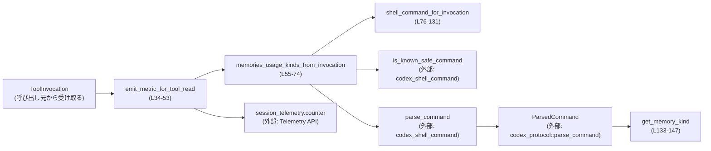
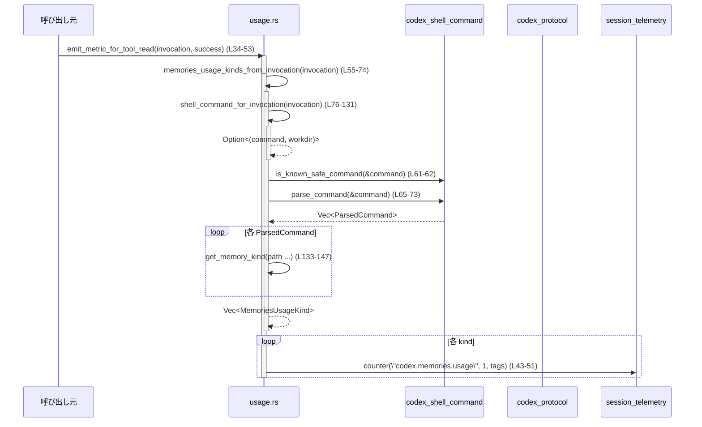

# core/src/memories/usage.rs

## 0. ざっくり一言

ツール呼び出し（主にシェル系ツール）が「memories」系ファイルを読む／検索するコマンドを実行したとき、その利用状況をメトリクスとしてカウントするためのヘルパーモジュールです（`core/src/memories/usage.rs:L11-L53`）。

---

## 1. このモジュールの役割

### 1.1 概要

- このモジュールは、**ツール実行コンテキスト（`ToolInvocation`）からシェルコマンドを抽出し、そのコマンドがどの種類のメモリファイルを扱っているかを判定し、メトリクスを発火する**ために存在します。
- 具体的には、`shell` / `shell_command` / `exec_command` ツールの引数 JSON をパースしてコマンド列を取得し、安全なコマンドか確認したうえで、`memories/MEMORY.md` など特定パスを参照する読み取りコマンドだけをカウントします（`core/src/memories/usage.rs:L55-L74`,`L76-L131`,`L133-L147`）。

### 1.2 アーキテクチャ内での位置づけ

このモジュールは、ツール実行基盤とシェルコマンド解析・テレメトリの間に挟まる「メトリクス記録専用の薄い層」という位置づけです。



- `ToolInvocation` はツール呼び出し全体の情報を保持するコンテキストです（`use crate::tools::context::ToolInvocation;` `L1`）。
- `emit_metric_for_tool_read` がこのモジュールのエントリーポイントで、内部でコマンド抽出・解析・メモリ種別判定を行い、最終的に `session_telemetry.counter` にメトリクス送信を行います（`L34-L53`）。

### 1.3 設計上のポイント

- **完全にステートレス**
  - グローバル変数や内部状態を持たず、`ToolInvocation` から情報を読み取り、メトリクス API を呼ぶだけの構造です。
- **非公開 API（crate 内限定）**
  - 外部クレートには公開されておらず、`pub(crate)` の `emit_metric_for_tool_read` がこのクレート内の呼び出し口です（`L34`）。
- **安全性を考慮したメトリクス発火**
  - `is_known_safe_command` で「安全と判定されたコマンド」のみを対象にします（`L61-L62`）。
- **シェルツール別のコマンド抽出ロジック**
  - `shell` / `shell_command` / `exec_command` の 3 種類で JSON パラメータの型やコマンド生成方法を切り替えています（`L81-L129`）。
- **メモリ種別の分類は文字列パターンマッチ**
  - ファイルパスに `"memories/MEMORY.md"` などの部分文字列が含まれるかどうかで種別を分類します（`L133-L145`）。

---

## 2. 主要な機能一覧

- メトリクス発火: シェル系ツールによるメモリファイル読み取り成功／失敗を `codex.memories.usage` カウンタに記録します（`L11`,`L34-L53`）。
- コマンドからメモリ種別抽出: `ParsedCommand` 列から `MemoriesUsageKind` のリストを生成します（`L55-L74`）。
- `ToolInvocation` からのコマンド抽出: `shell` / `shell_command` / `exec_command` の JSON 引数をパースし、`Vec<String>` コマンドと `PathBuf` 作業ディレクトリを取り出します（`L76-L131`）。
- メモリファイルパスの分類: パス文字列から `MemoryMd` / `MemorySummary` / `RawMemories` / `RolloutSummaries` / `Skills` のいずれかに分類します（`L133-L145`）。
- メモリ種別のタグ文字列化: `MemoriesUsageKind` をメトリクスタグ用の短い文字列に変換します（`L22-L31`）。

### 2.1 コンポーネント一覧（インベントリー）

#### 型

| 名前 | 種別 | 役割 / 用途 | 定義位置 |
|------|------|-------------|----------|
| `MemoriesUsageKind` | enum | メモリ利用メトリクスの「種別」を表現する内部列挙。`MEMORY.md` や `skills` など、どの種類のメモリが読まれたかを分類します。 | `core/src/memories/usage.rs:L13-L20` |

#### メソッド / 関数

| 名前 | 種別 | 役割 / 用途 | 定義位置 |
|------|------|-------------|----------|
| `MemoriesUsageKind::as_tag` | メソッド | 各 `MemoriesUsageKind` をメトリクス用タグ文字列（例: `"memory_md"`）に変換します。 | `core/src/memories/usage.rs:L22-L31` |
| `emit_metric_for_tool_read` | `pub(crate)` async 関数 | `ToolInvocation` に対するメモリ読み取りツール呼び出しの成否に応じ、`codex.memories.usage` カウンタをインクリメントします。 | `core/src/memories/usage.rs:L34-L53` |
| `memories_usage_kinds_from_invocation` | async 関数 | `ToolInvocation` のシェルコマンド（あれば）を解析し、どのメモリ種別が読み取り対象になっているかを `Vec<MemoriesUsageKind>` として返します。 | `core/src/memories/usage.rs:L55-L74` |
| `shell_command_for_invocation` | 関数 | `ToolInvocation` のツール名・引数からシェルコマンド（`Vec<String>`）と作業ディレクトリ（`PathBuf`）を抽出します。 | `core/src/memories/usage.rs:L76-L131` |
| `get_memory_kind` | 関数 | パス文字列からどのメモリ種別に該当するかを判定します。該当しなければ `None` を返します。 | `core/src/memories/usage.rs:L133-L147` |

---

## 3. 公開 API と詳細解説

このファイルには外部クレート向けの公開 API（`pub`）はなく、クレート内限定の `pub(crate)` 関数が 1 つだけ存在します（`emit_metric_for_tool_read`, `L34`）。

### 3.1 型一覧（構造体・列挙体など）

| 名前 | 種別 | 役割 / 用途 | バリアント |
|------|------|-------------|------------|
| `MemoriesUsageKind` | enum | メモリ利用メトリクスのカテゴリを表す内部型です（メトリクスタグ `"kind"` に使用）。`Clone + Copy + Ord` などのトレイトを実装しており、ソートや比較が可能です（`L13-L19`）。 | `MemoryMd`, `MemorySummary`, `RawMemories`, `RolloutSummaries`, `Skills` |

`MemoriesUsageKind::as_tag(self) -> &'static str`（`L22-L31`）

- 各バリアントをメトリクスタグ用の固定文字列にマッピングします。
  - 例: `MemoryMd` → `"memory_md"`（`L25`）。

### 3.2 関数詳細

#### `emit_metric_for_tool_read(invocation: &ToolInvocation, success: bool) -> ()`

**定義位置**: `core/src/memories/usage.rs:L34-L53`  
**可視性**: `pub(crate)`  
**async**: はい（`L34`）

**概要**

- 指定された `ToolInvocation` がメモリ関連ファイルを読む／検索する安全なコマンドを含んでいる場合に限り、`codex.memories.usage` カウンタをインクリメントします。
- メトリクスタグとして、`kind`（メモリ種別）、`tool`（ツール名）、`success`（成否）を付与します（`L40-L51`）。

**引数**

| 引数名 | 型 | 説明 |
|--------|----|------|
| `invocation` | `&ToolInvocation` | ツール呼び出しコンテキスト。ツール名・ペイロード・セッション情報を含みます（`L34`）。|
| `success` | `bool` | 呼び出しが成功したかどうか。`true`/`false` を `"true"`/`"false"` に変換してタグに使います（`L40`）。|

**戻り値**

- `()`（戻り値なし）。メトリクス発火に失敗した場合のエラーはここでは扱っていません（`session_telemetry.counter` の戻り値は無視されています `L43-L51`）。

**内部処理の流れ**

1. `memories_usage_kinds_from_invocation(invocation).await` を呼び出し、`Vec<MemoriesUsageKind>` を取得します（`L35`）。
2. 空であれば（メモリファイルが対象になっていないか、そもそもコマンド抽出に失敗した場合）早期リターンします（`L36-L38`）。
3. `success` フラグを `"true"` / `"false"` の文字列に変換します（`L40`）。
4. `invocation.tool_name.display()` からツール名の表示用文字列を取得します（`L41`）。
5. 各 `kind` についてループし（`L42`）、`session_telemetry.counter` を呼び出してカウンタを 1 増やします（`L43-L51`）。
   - メトリクス名: `"codex.memories.usage"`（`MEMORIES_USAGE_METRIC`, `L11,L44`）。
   - タグ: `("kind", kind.as_tag())`, `("tool", &tool_name)`, `("success", success)`（`L47-L50`）。

**Examples（使用例）**

以下は、`shell` ツールが `cat memories/MEMORY.md` を実行したケースでメトリクスを発火するまでの流れの、概念的な例です。

```rust
// 実際の ToolInvocation や ToolPayload の定義は別モジュールにあります。
// ここでは概念を示すための簡略化した例です。

async fn on_tool_finished(invocation: &ToolInvocation, success: bool) {
    // メモリ読み取りツールの終了時にメトリクスを送信する
    core::memories::usage::emit_metric_for_tool_read(invocation, success).await;
}
```

この例では、`invocation` の中のペイロードが `cat memories/MEMORY.md` を表す安全なシェルコマンドであれば、`kind=memory_md` のカウンタが +1 されます。

**Errors / Panics**

- この関数自体では `Result` を返さず、エラーを外に伝播しません。
- コード内で `unwrap` や `expect` は使用されておらず、この関数の内部で明示的なパニックを発生させる処理はありません（`L34-L53`）。
- ただし、呼び出す外部メソッド（`session_telemetry.counter` など）が内部でパニックする可能性については、このチャンクからは分かりません。

**エッジケース**

- `memories_usage_kinds_from_invocation` が空のベクタを返した場合（対象のメモリファイルがない、またはコマンド抽出／安全チェックに失敗した場合）は、メトリクスは一切送信されません（`L35-L38`）。
- 同じツール実行で複数種類のメモリファイルを扱うコマンドがあった場合、`kind` ごとにカウンタが 1 ずつ増えます（`L42-L52`）。

**使用上の注意点**

- **非同期コンテキスト前提**: `async fn` なので、`tokio` などの非同期ランタイム上で `.await` して呼び出す必要があります。
- **呼び出しタイミング**: `success` の真偽は呼び出し元で決める必要があります。ここでは単にタグとして扱うだけです。
- **スレッド安全性**: 関数自体はステートレスで、`&ToolInvocation` に対する不変参照だけを取るため、この関数を複数タスクから同時に呼び出しても Rust の所有権的には問題ありません。ただし `session_telemetry` 側のスレッド安全性は別モジュールの設計に依存します（`L43-L51`）。

---

#### `memories_usage_kinds_from_invocation(invocation: &ToolInvocation) -> Vec<MemoriesUsageKind>`

**定義位置**: `core/src/memories/usage.rs:L55-L74`  
**可視性**: モジュール内（`pub` なし）  
**async**: はい（`L55`）

**概要**

- `ToolInvocation` からシェルコマンドを抽出し、そのコマンド列を解析して「どの種類のメモリファイルが読み取り対象になっているか」を列挙します。
- 安全と判定されたコマンドだけが解析対象です（`is_known_safe_command`, `L61-L62`）。

**引数**

| 引数名 | 型 | 説明 |
|--------|----|------|
| `invocation` | `&ToolInvocation` | シェル系ツール呼び出しを含んでいる可能性のあるツール呼び出しコンテキスト。|

**戻り値**

- `Vec<MemoriesUsageKind>`  
  - 各 `MemoriesUsageKind` は、シェルコマンド列中の `Read` / `Search` コマンドが参照するメモリファイルパスから抽出されます（`L65-L73`）。
  - 対象が存在しない場合、空のベクタを返します（`L58-L63` の早期リターン、および `filter_map` の結果で判断）。

**内部処理の流れ**

1. `shell_command_for_invocation(invocation)` を呼び出し、`Option<(command, _workdir)>` を取得します（`L58`）。
   - `Some((command, _))` なら続行、`None` なら空の `Vec` を返して終了します（`L58-L60`）。
2. `is_known_safe_command(&command)` で安全性を確認し、安全でなければ空の `Vec` を返します（`L61-L63`）。
3. `parse_command(&command)` で `Vec<ParsedCommand>` にパースします（`L65`）。
4. それぞれの `ParsedCommand` に対して以下のように処理し、`MemoriesUsageKind` に変換します（`L66-L72`）。
   - `ParsedCommand::Read { path, .. }`  
     → `get_memory_kind(path.display().to_string())` で種別判定（`L69`）。
   - `ParsedCommand::Search { path, .. }`  
     → `path.and_then(get_memory_kind)`。`path` が `Option<String>` と想定され、その値を `get_memory_kind` に渡します（`L70`）。
   - `ParsedCommand::ListFiles` / `ParsedCommand::Unknown`  
     → メモリ利用にはカウントしないため `None`（`L71`）。
5. 上記 `filter_map` の結果を `collect()` でベクタにして返します（`L72-L73`）。

**Examples（使用例）**

概念的な使用例として、`emit_metric_for_tool_read` 内での利用が該当します（`L35`）。

```rust
// メモリ利用の種別一覧を取得
let kinds: Vec<MemoriesUsageKind> =
    memories_usage_kinds_from_invocation(invocation).await;

// kinds が空でなければ emit_metric_for_tool_read でメトリクス化される
```

**Errors / Panics**

- この関数自体は `Result` を返しません。
- コマンド抽出（`shell_command_for_invocation`）や安全判定（`is_known_safe_command`）、パース（`parse_command`）が失敗した場合・対応しない場合は、**エラーとしては扱わず空ベクタを返す**設計になっています（`L58-L63`）。
- `unwrap` / `expect` がないため、内部で明示的にパニックを起こすコードはありません。

**エッジケース**

- `ToolInvocation` がシェル系ツール（`shell` / `shell_command` / `exec_command`）でない場合  
  → `shell_command_for_invocation` が `None` を返し、結果として空ベクタになります（`L76-L80`,`L81-L129` → `L58-L60`）。
- シェル系ツールだが、引数 JSON のパースに失敗した場合  
  → `serde_json::from_str(...).ok()` により `None` となり、同様に空ベクタ（`L85-L87`,`L93-L95`,`L114-L116`）。
- コマンドが `is_known_safe_command` で安全と認められない場合  
  → 空ベクタ（`L61-L63`）。
- コマンドがメモリファイルを扱わない場合  
  → `filter_map` の結果がすべて `None` となり、空ベクタ（`L66-L72`）。

**使用上の注意点**

- エラーや未対応ケースを **区別せず「メモリ利用なし」とみなす** 振る舞いである点が重要です。上位層で「メモリ利用があったかどうか」を判断する際は、「空ベクタ＝必ずしもコマンドが存在しないわけではない」ことに注意が必要です。
- `async fn` ですが、現状この関数内部には `await` がなく、同期的な処理のみです（`L55-L74`）。将来の拡張のために `async` とされている可能性があります。

---

#### `shell_command_for_invocation(invocation: &ToolInvocation) -> Option<(Vec<String>, PathBuf)>`

**定義位置**: `core/src/memories/usage.rs:L76-L131`  
**可視性**: モジュール内（`pub` なし）  

**概要**

- `ToolInvocation` のツール種別とペイロードに応じて、実際に実行されるシェルコマンド列と作業ディレクトリを抽出します。
- 対応しているツール名は:
  - `namespace = None, name = "shell"`（`L85-L92`）
  - `namespace = None, name = "shell_command"`（`L93-L113`）
  - `namespace = None, name = "exec_command"`（`L114-L128`）

**引数**

| 引数名 | 型 | 説明 |
|--------|----|------|
| `invocation` | `&ToolInvocation` | ツール呼び出しコンテキスト。ペイロード・ツール名・セッション情報・ツール設定などを含むと想定されます（`L76-L83`）。 |

**戻り値**

- `Option<(Vec<String>, PathBuf)>`
  - `Some((command, workdir))`  
    - `command`: シェルに渡される引数列（`Vec<String>`）  
    - `workdir`: 解決済みの作業ディレクトリ（`PathBuf`）
  - `None`: 対応していないツール種別、あるいは JSON パース失敗、`get_command` 失敗などの場合（`L77-L79`,`L85-L87`,`L93-L95`,`L114-L128`,`L129`）。

**内部処理の流れ**

1. まず、ペイロードが `ToolPayload::Function { arguments }` であることを確認します。そうでない場合は `None` を返します（`L77-L79`）。
2. `(namespace, name)` の組み合わせでツールを判別します（`L81-L84`）。

   **(a) `shell` ツール (`(None, "shell")`, `L85-L92`)**

   - `arguments` を JSON として `ShellToolCallParams` にデシリアライズします（`serde_json::from_str`, `L85-L87`）。
   - 成功した場合、`params.command` をコマンド列に、`invocation.turn.resolve_path(params.workdir)` を作業ディレクトリにして `Some((command, workdir))` を返します（`L88-L91`）。

   **(b) `shell_command` ツール (`(None, "shell_command")`, `L93-L113`)**

   - `arguments` を `ShellCommandToolCallParams` にデシリアライズします（`L93-L95`）。
   - `allow_login_shell` が `false` なのに `params.login == Some(true)` の場合、ログインシェルを禁止するため、空のコマンド列と `workdir` を返します（`L96-L101`）。
     - `return (Vec::new(), resolve_path(params.workdir))`（`L97-L100`）。
   - それ以外の場合は、`use_login_shell` を `params.login.unwrap_or(allow_login_shell)` として決定し（`L102-L104`）、`invocation.session.user_shell().derive_exec_args(&params.command, use_login_shell)` によって最終的なシェルコマンド列を生成します（`L105-L108`）。
   - そのコマンド列と `workdir` を `Some((command, workdir))` として返します（`L109-L112`）。

   **(c) `exec_command` ツール (`(None, "exec_command")`, `L114-L128`)**

   - `arguments` を `ExecCommandArgs` にデシリアライズします（`L114-L116`）。
   - `crate::tools::handlers::unified_exec::get_command(...)` を呼び出し、ユーザシェル・ツール設定に基づきコマンド列を生成します（`L117-L122`）。
   - `get_command` が `Ok` を返した場合のみ `Some((command, workdir))` を返し、`Err` の場合は `None` になります（`L117-L123`）。

3. 上記以外の `(Some(_), _)` または `(None, _)` の場合は `None` を返します（`L129`）。

**Examples（使用例）**

内部利用例として、`memories_usage_kinds_from_invocation` での呼び出しがあります（`L58`）。

```rust
// ToolInvocation からコマンド列と作業ディレクトリを抽出
if let Some((command, workdir)) = shell_command_for_invocation(invocation) {
    // command: Vec<String> を is_known_safe_command / parse_command に渡す
    // workdir: PathBuf はこのファイルでは使われていません
}
```

**Errors / Panics**

- JSON パースに失敗すると `serde_json::from_str(...).ok()` により `None` が返り、そのツール呼び出しは「コマンド無し」と扱われます（`L85-L87`,`L93-L95`,`L114-L116`）。
- `unified_exec::get_command` が `Err` を返した場合も `None` として扱われます（`L117-L123`）。
- ここでも `unwrap` / `expect` は使われておらず、関数内部での明示的なパニックはありません。

**エッジケース**

- ペイロードが `ToolPayload::Function` 以外の場合、どのツール名であっても `None` になります（`L77-L79`）。
- `shell_command` でログインシェルが禁止されているのに `params.login == Some(true)` の場合、**空のコマンド列** が返されます（`L96-L101`）。  
  - 後続の `is_known_safe_command` / `parse_command` は空コマンドをどう扱うかに依存しますが、このモジュールでは特別扱いはせず、そのまま渡します。
- `exec_command` の JSON に `workdir` が含まれていても、このモジュールではワーキングディレクトリを **メトリクスの判定には利用していません**（`L125-L127` → 戻り値の 2 要素目としてのみ返却）。

**使用上の注意点**

- この関数の戻り値が `None` の場合、上位で「メモリ利用なし」と解釈される可能性がありますが、実際には「ツールが未対応」「JSON パース失敗」「get_command 失敗」などの理由も含まれます。
- コマンド列の生成ロジックは、それぞれ外部型 (`ShellToolCallParams`, `ShellCommandToolCallParams`, `ExecCommandArgs`) とユーザシェル実装に依存しています。これらの仕様変更はメモリメトリクスにも影響します。

---

### 3.3 その他の関数

| 関数名 | 役割（1 行） | 定義位置 |
|--------|--------------|----------|
| `MemoriesUsageKind::as_tag(self) -> &'static str` | メモリ種別を `"memory_md"` などのタグ文字列に変換します（`match` で静的文字列を返すのみ） | `core/src/memories/usage.rs:L22-L31` |
| `get_memory_kind(path: String) -> Option<MemoriesUsageKind>` | パス文字列に特定のサブパスが含まれるかチェックして `MemoriesUsageKind` に分類します。該当しない場合は `None` を返します。 | `core/src/memories/usage.rs:L133-L147` |

`get_memory_kind` の分類ロジック（`L133-L145`）:

- `"memories/MEMORY.md"` → `MemoryMd`
- `"memories/memory_summary.md"` → `MemorySummary`
- `"memories/raw_memories.md"` → `RawMemories`
- `"memories/rollout_summaries/"` を含む → `RolloutSummaries`
- `"memories/skills/"` を含む → `Skills`

---

## 4. データフロー

メトリクス発火までの代表的な処理シナリオを示します。

1. 呼び出し元が、ツール実行後に `emit_metric_for_tool_read(invocation, success)` を呼ぶ（`L34`）。
2. この関数が `memories_usage_kinds_from_invocation(invocation)` を通じて、`ToolInvocation` からコマンド列を抽出・解析し、メモリ種別一覧を得る（`L35, L55-L74`）。
3. 得られた各 `MemoriesUsageKind` について `session_telemetry.counter("codex.memories.usage", 1, tags)` を呼び出す（`L42-L51`）。



この図が表しているのは、「ツール呼び出し」→「コマンド抽出」→「コマンド解析」→「メモリ種別抽出」→「メトリクス送信」という一連のデータフローです。

---

## 5. 使い方（How to Use）

### 5.1 基本的な使用方法

クレート内で、ツール実行が完了したタイミングなどで `emit_metric_for_tool_read` を呼び出すことを想定しています。

```rust
use crate::memories::usage::emit_metric_for_tool_read; // モジュールパスは実際の構成に依存
use crate::tools::context::ToolInvocation;

async fn handle_tool_completion(invocation: &ToolInvocation, was_success: bool) {
    // メモリ読み取りに関するメトリクスを記録する
    emit_metric_for_tool_read(invocation, was_success).await;
}
```

- `invocation` には `shell` / `shell_command` / `exec_command` などのツール呼び出し情報が入っている必要があります（`L81-L129`）。
- 実際にメトリクスが発火するかどうかは、コマンドの中身が `memories/...` パスを読む安全なコマンドかどうかに依存します（`L61-L63`,`L65-L73`,`L133-L145`）。

### 5.2 よくある使用パターン

- **成功／失敗結果をタグとして記録**
  - 上位ロジックでツール実行の成否を判定し、その結果を `success` 引数に渡すことで、成功・失敗別の利用状況を後から分析できるようになります（`L40`）。
- **複数コマンドを含むツール呼び出し**
  - 1 回のツール呼び出しが複数 `ParsedCommand::Read` / `Search` を含む場合、各メモリ種別ごとにカウンタが増えます（`L66-L72`）。

### 5.3 よくある間違い（想定されるもの）

このチャンクから推測できる範囲での誤用例です。

```rust
// 誤り例: 非同期コンテキストでない場所から直接呼び出す
fn wrong(invocation: &ToolInvocation) {
    // emit_metric_for_tool_read(invocation, true); // コンパイルエラー: async 関数は .await が必要
}

// 正しい例: async 関数の中で .await する
async fn correct(invocation: &ToolInvocation) {
    emit_metric_for_tool_read(invocation, true).await;
}
```

```rust
// 誤り例: ToolPayload::Function 以外からメトリクスを期待する
async fn wrong(invocation: &ToolInvocation) {
    // invocation.payload が Function でなければ shell_command_for_invocation は None を返し、
    // 結果としてメトリクスは発火しない（L77-L80, L58-L60）
    emit_metric_for_tool_read(invocation, true).await;
}
```

### 5.4 使用上の注意点（まとめ）

- **前提条件**
  - `ToolInvocation` の `payload` が `ToolPayload::Function { arguments }` である必要があります（`L77-L79`）。
  - ツール名は `shell` / `shell_command` / `exec_command` のいずれかである必要があります（`L81-L129`）。
- **メトリクスが発火しないケース**
  - コマンドが安全ではないと判定された場合（`is_known_safe_command` が `false`、`L61-L63`）。
  - JSON パースに失敗した場合（`serde_json::from_str(...).ok()`, `L85-L87`,`L93-L95`,`L114-L116`）。
  - メモリ関連のパスを含む `Read` / `Search` コマンドが存在しない場合（`L66-L72`,`L133-L145`）。
- **パスの扱い**
  - `Read` の場合は `path.display().to_string()` の文字列を `contains` で判定しています（`L69,L133-L145`）。  
    OS によってパス区切り文字や大文字小文字の扱いが異なる場合、この判定が期待通りに動作しない可能性がありますが、詳細はこのチャンクからは分かりません。

---

## 6. 変更の仕方（How to Modify）

### 6.1 新しい機能を追加する場合

- **新しいメモリファイル種別を追加したい場合**
  1. `MemoriesUsageKind` に新しいバリアントを追加します（`L13-L19`）。
  2. `MemoriesUsageKind::as_tag` で対応するタグ文字列を追加します（`L22-L31`）。
  3. `get_memory_kind` に新しいパスパターンとバリアントの対応を追加します（`L133-L145`）。
- **新しいツール種別に対応したい場合**
  1. `shell_command_for_invocation` の `match (namespace, name)` に新しい分岐を追加します（`L81-L129`）。
  2. 新ツールの JSON ペイロードを表す型を `serde_json::from_str` でパースし、`Vec<String>` コマンドと `PathBuf` の作業ディレクトリを返すロジックを実装します。
  3. 既存の `memories_usage_kinds_from_invocation` は `shell_command_for_invocation` の戻り値を使うだけなので、基本的にはそのままで動作します（`L58-L66`）。

### 6.2 既存の機能を変更する場合

- **メモリファイルのパス構造が変わった場合**
  - `get_memory_kind` の `path.contains(...)` 部分を新しいディレクトリ構造に合わせて更新する必要があります（`L133-L145`）。
  - 変更後は、`Read` / `Search` コマンドから期待通りに `MemoriesUsageKind` が得られているかを確認する必要があります（`L69-L71`）。
- **安全判定ポリシーを変えたい場合**
  - `is_known_safe_command` の実装は外部モジュールですが、この関数の挙動を変えると、メトリクス計測対象となるコマンド範囲が変わります（`L61-L62`）。
- **ログインシェル許可ポリシーを変えたい場合**
  - `shell_command_for_invocation` 内の `allow_login_shell` と `params.login` の扱い（`L96-L104`）を変更すると、「どのコマンドが実際に実行され、メトリクスの対象になるか」が変化します。

---

## 7. 関連ファイル・モジュール

このモジュールと密接に関係するものを、インポート文を根拠に列挙します。

| モジュール / 型 | 役割 / 関係 | 根拠 |
|-----------------|------------|------|
| `crate::tools::context::ToolInvocation` | ツール呼び出しのコンテキスト。メトリクス計測の対象となるすべての情報（ツール名・ペイロード・セッション情報など）を提供します。 | `use crate::tools::context::ToolInvocation;`（`core/src/memories/usage.rs:L1`） |
| `crate::tools::context::ToolPayload` | `ToolInvocation.payload` の enum。`Function { arguments }` バリアント経由で JSON 文字列にアクセスします。 | `use crate::tools::context::ToolPayload;`（`L2`）, `match` による利用（`L77-L79`） |
| `crate::tools::handlers::unified_exec::ExecCommandArgs` | `exec_command` ツールの引数を表す型。`serde_json::from_str` でパースされます。 | `use crate::tools::handlers::unified_exec::ExecCommandArgs;`（`L3`）, 利用（`L114-L116`） |
| `crate::tools::handlers::unified_exec::get_command` | `ExecCommandArgs` から実際に実行するコマンド列を生成する関数。`shell_command_for_invocation` 内で利用されます。 | 明示的な `use` はありませんが、`crate::tools::handlers::unified_exec::get_command` の完全修飾名で呼び出し（`L117-L123`） |
| `codex_protocol::models::ShellToolCallParams` | `shell` ツールの JSON 引数を表す型。 | `use codex_protocol::models::ShellToolCallParams;`（`L5`）, `serde_json::from_str::<ShellToolCallParams>`（`L85`） |
| `codex_protocol::models::ShellCommandToolCallParams` | `shell_command` ツールの JSON 引数を表す型。 | `use codex_protocol::models::ShellCommandToolCallParams;`（`L4`）, `serde_json::from_str::<ShellCommandToolCallParams>`（`L93`） |
| `codex_protocol::parse_command::ParsedCommand` | シェルコマンド列を構造化した表現。`Read` / `Search` / `ListFiles` / `Unknown` などのバリアントを持つと推測されますが、詳細はこのチャンクからは分かりません。 | `use codex_protocol::parse_command::ParsedCommand;`（`L6`）, `match` による利用（`L68-L71`） |
| `codex_shell_command::is_safe_command::is_known_safe_command` | コマンド列が安全かどうか判定する関数。メトリクス計測対象を制限するフィルタとして利用されます。 | `use codex_shell_command::is_safe_command::is_known_safe_command;`（`L7`）, 呼び出し（`L61-L62`） |
| `codex_shell_command::parse_command::parse_command` | `Vec<String>` 形式のコマンド列を `Vec<ParsedCommand>` にパースします。 | `use codex_shell_command::parse_command::parse_command;`（`L8`）, 呼び出し（`L65`） |

---

## 実装上の懸念点・セキュリティ観点（このチャンクから分かる範囲）

- **安全なコマンドのみ計測**
  - `is_known_safe_command(&command)` が `false` の場合はメトリクスを計測しません（`L61-L63`）。  
    これにより、危険なコマンドに関する情報をメトリクスとして収集しないポリシーが伺えます。
- **パス判定の単純さ**
  - `get_memory_kind` は単純な `String::contains` に頼っており（`L133-L145`）、パスのフォーマットや OS による違い（パスセパレータや大文字小文字）によっては期待通りにマッチしない可能性があります。  
    ただし、実際にどの OS でどのように使われるかはこのチャンクからは分かりません。
- **エラーサイレンス**
  - JSON パースや `get_command` 失敗をすべて `None`（＝コマンドなし）として扱っているため、メトリクスレベルでは「失敗した呼び出し」が見えにくくなっています（`L85-L87`,`L93-L95`,`L114-L116`,`L117-L123`）。  
    これはメトリクスの目的（成功したメモリ利用の観測）に合っていれば問題ありませんが、デバッグ用途には向きません。

このように、本モジュールはメモリ利用メトリクスに特化した薄いラッパであり、ツール呼び出しとシェルコマンド解析の間をつなぎつつ、安全性とシンプルさを優先した設計になっています。
