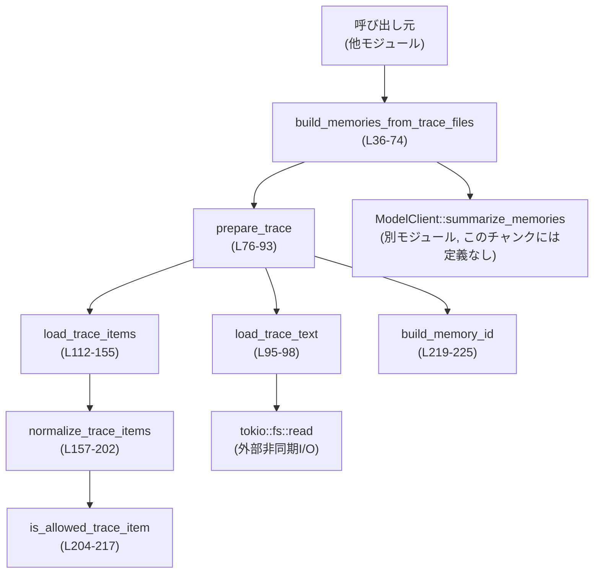
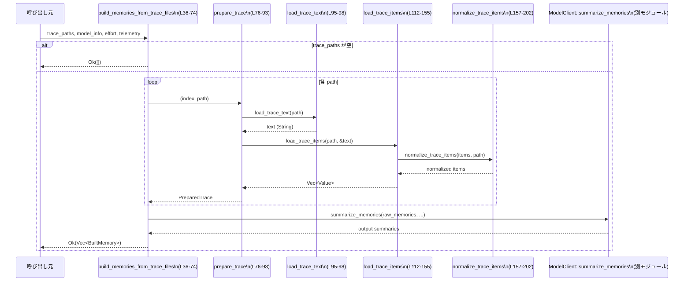

# core/src/memory_trace.rs

## 0. ざっくり一言

トレースファイル（JSON/JSONL）から「生メモリ（RawMemory）」を組み立て、モデルクライアントで要約させた結果を `BuiltMemory` として返すモジュールです（`core/src/memory_trace.rs:L15-21,36-74`）。

---

## 1. このモジュールの役割

### 1.1 概要

- このモジュールは、**トレースファイルからメモリ要約用の入力を構築し、その要約結果を返す**ために存在します。
- ファイルシステムからトレースを読み込み、JSONをパース・正規化し、`ModelClient::summarize_memories` に渡す `ApiRawMemory` の配列を生成します（`core/src/memory_trace.rs:L36-55,76-93,95-155,157-217`）。
- 要約結果と元ファイルパスを紐づけた `BuiltMemory` を呼び出し元に返します（`core/src/memory_trace.rs:L15-21,64-73`）。

### 1.2 アーキテクチャ内での位置づけ

このモジュール内の関数同士、および外部コンポーネントとの依存関係を示します。



- エントリポイントは `build_memories_from_trace_files` であり、ここから `prepare_trace` などの内部ヘルパーが呼ばれます（`core/src/memory_trace.rs:L36-50`）。
- 外部依存としては:
  - `ModelClient::summarize_memories`（型のみ参照、実装はこのチャンクには現れません）
  - 非同期ファイル読み込みのための `tokio::fs::read`（`core/src/memory_trace.rs:L95-97`）

### 1.3 設計上のポイント

コードから読み取れる設計上の特徴は以下のとおりです。

- **責務の分割**
  - トップレベルのオーケストレーション: `build_memories_from_trace_files`（`L36-74`）
  - 1ファイル分の準備（テキスト読込 + JSONパース + ID生成）: `prepare_trace`（`L76-93`）
  - I/O とパースの分離: `load_trace_text` と `load_trace_items`（`L95-98,112-155`）
  - JSON正規化とフィルタリング: `normalize_trace_items`, `is_allowed_trace_item`（`L157-202,204-217`）
  - メモリID生成: `build_memory_id`（`L219-225`）
- **状態管理**
  - すべての関数は引数と戻り値のみを用い、グローバルな可変状態を持ちません。
  - `BuiltMemory` および `PreparedTrace` は単なるデータコンテナです（`L15-21,23-27`）。
- **エラーハンドリング**
  - 戻り値として crate 共通の `Result` を使用し、`?` 演算子でエラーを伝播しています（`L36-42,76-79,95-97,112-124,147-154,195-201`）。
  - 入力不正やパース失敗など論理エラーには `CodexErr::InvalidRequest` が使われています（`L57-61,119-123,148-151,195-199`）。
- **並行性**
  - 非同期関数（`build_memories_from_trace_files`, `prepare_trace`, `load_trace_text`）は `async fn` ですが、`prepare_trace` のループは逐次 `await` しており、同時並行には実行されません（`L47-50`）。
  - 非同期 I/O を使うことでスレッドをブロックせずにファイルを読み込む設計になっています（`L95-97`）。
- **安全性**
  - `unsafe` ブロックは存在せず、すべて安全な Rust のみで実装されています。
  - 非UTF-8データに対してもパニックせず、フォールバックのデコード処理が定義されています（`L100-110`）。

---

## 2. 主要な機能一覧

- トレースファイル群の要約実行:
  - `build_memories_from_trace_files`: ファイル群を読み込み、正規化し、モデルで要約して `BuiltMemory` 配列を返します（`L36-74`）。
- 単一トレースファイルの準備:
  - `prepare_trace`: テキスト読込、アイテム抽出、ID生成を行い `ApiRawMemory` を構築します（`L76-93`）。
- トレースファイルの読み込み:
  - `load_trace_text`: 非同期にファイルを読み込み、バイト列をテキストへ変換します（`L95-98`）。
  - `decode_trace_bytes`: BOM 除去と UTF-8 / バイト→文字列フォールバックを行います（`L100-110`）。
- トレースアイテムの抽出・正規化:
  - `load_trace_items`: JSON / JSONL をパースして `Value::Object` の配列を抽出します（`L112-155`）。
  - `normalize_trace_items`: 特定の構造（`payload` を含む `response_item`）を展開し、許可されたアイテムだけを残します（`L157-202`）。
  - `is_allowed_trace_item`: `type` フィールドおよび `role` をもとにメッセージアイテムをフィルタします（`L204-217`）。
- メモリID生成:
  - `build_memory_id`: ファイル名とインデックスから一意なメモリIDを生成します（`L219-225`）。

---

## 3. 公開 API と詳細解説

### 3.1 型一覧（構造体・列挙体など）

#### コンポーネント・インベントリー（型）

| 名前 | 種別 | 公開 | 行範囲 | 役割 / 用途 |
|------|------|------|--------|-------------|
| `BuiltMemory` | 構造体 | 公開 (`pub`) | `core/src/memory_trace.rs:L15-21` | 要約済みメモリの情報（メモリID、元ファイルパス、元の raw_memory、要約結果）を保持します。 |
| `PreparedTrace` | 構造体 | 非公開 | `core/src/memory_trace.rs:L23-27` | モデル呼び出し前の内部表現として、`ApiRawMemory` と補足情報（ID、パス）を束ねます。 |

`BuiltMemory` のフィールド:

- `memory_id: String`（`L17`）: `build_memory_id` で生成される一意なID。
- `source_path: PathBuf`（`L18`）: 元トレースファイルのパス。
- `raw_memory: String`（`L19`）: モデルから返ってくる生メモリ文字列（入力トレースの正規化結果と解釈できますが、このチャンク単体からは詳細不明）。
- `memory_summary: String`（`L20`）: 要約テキスト。

### 3.2 関数詳細（最大 7 件）

#### 1. `build_memories_from_trace_files(...) -> Result<Vec<BuiltMemory>>`

```rust
pub async fn build_memories_from_trace_files(
    client: &ModelClient,
    trace_paths: &[PathBuf],
    model_info: &ModelInfo,
    effort: Option<ReasoningEffortConfig>,
    session_telemetry: &SessionTelemetry,
) -> Result<Vec<BuiltMemory>> { /* ... */ }
```

**行範囲 / 根拠**: `core/src/memory_trace.rs:L36-74`

**概要**

- トレースファイルのパス配列を受け取り、各ファイルを `PreparedTrace` に変換し、`ModelClient::summarize_memories` で要約を実行し、`BuiltMemory` の配列を返す非同期関数です。
- トレースファイルが空配列の場合はすぐに空のベクタを返します（`L42-45`）。

**引数**

| 引数名 | 型 | 説明 |
|--------|----|------|
| `client` | `&ModelClient` | メモリ要約APIを呼び出すクライアント。セッションスコープで共有されることを意図しています（コメント `L34-35`）。 |
| `trace_paths` | `&[PathBuf]` | 処理対象のトレースファイルパスの配列（`L37-38`）。 |
| `model_info` | `&ModelInfo` | 使用するモデルを指定する情報（`L39`）。 |
| `effort` | `Option<ReasoningEffortConfig>` | 推論強度などの追加設定（指定がない場合は `None`）（`L40`）。 |
| `session_telemetry` | `&SessionTelemetry` | テレメトリ（観測情報）コンテキスト（`L41`）。 |

**戻り値**

- `Result<Vec<BuiltMemory>>`:
  - `Ok(Vec<BuiltMemory>)`: 各トレースファイルに対応する `BuiltMemory` の配列。
  - `Err(CodexErr::...)`: ファイル読み込みエラー、JSONパースエラー、正規化失敗、もしくは要約出力数不一致などの場合（`L57-61` など）。

**内部処理の流れ**

1. `trace_paths` が空であれば `Ok(Vec::new())` を返し、以降の処理を行いません（`L42-45`）。
2. `prepared` ベクタを `trace_paths.len()` 分確保します（`L47`）。
3. 各パスに対してインデックスを付与しながら `prepare_trace(index+1, path).await?` を順序通りに実行し、結果を `prepared` に push します（`L48-50`）。
4. `prepared` の各要素から `payload` (`ApiRawMemory`) を clone し、`raw_memories` ベクタを作成します（`L52`）。
5. `client.summarize_memories(raw_memories, model_info, effort, session_telemetry).await?` を呼び出し、要約結果の配列 `output` を取得します（`L53-55`）。
6. `output.len()` と `prepared.len()` の一致を検証し、一致しなければ `CodexErr::InvalidRequest` を返します（`L56-61`）。
7. `prepared.into_iter().zip(output)` で対応する要約とトレース情報を結合し、`BuiltMemory` にマッピングしてベクタに収集します（`L64-73`）。

**Examples（使用例）**

```rust
use std::path::PathBuf;
use codex_protocol::openai_models::{ModelInfo, ReasoningEffort};
use codex_otel::SessionTelemetry;

// 非同期コンテキスト前提（tokioランタイムなど）
async fn run_example(
    client: &ModelClient,
    model_info: &ModelInfo,
    telemetry: &SessionTelemetry,
) -> Result<(), CodexErr> {
    // トレースファイルの一覧を用意
    let trace_paths = vec![
        PathBuf::from("traces/session1.jsonl"),
        PathBuf::from("traces/session2.jsonl"),
    ];

    // 推論強度は省略（None）
    let memories = build_memories_from_trace_files(
        client,
        &trace_paths,
        model_info,
        None,
        telemetry,
    ).await?; // エラーは ? で伝播

    for mem in memories {
        println!(
            "memory_id={} from {:?}\nsummary={}",
            mem.memory_id, mem.source_path, mem.memory_summary
        );
    }

    Ok(())
}
```

**Errors / Panics**

- `Err(CodexErr::InvalidRequest(...))` となりうる条件:
  - `prepare_trace` 内でのトレース正規化失敗（例: 有効なJSONアイテムが 0 件）（`L119-123,148-151,195-199`）。
  - 要約APIの出力数が入力数と異なる場合（`L56-61`）。
- 他に、`Result` 経由で伝播されるI/Oなどのエラー:
  - `tokio::fs::read` の失敗（ファイル未存在、権限不足など）（`L95-97`）。
  - JSONパース失敗（`serde_json::from_str` が返すエラー）が `load_trace_items` 内で扱われます（行レベルで無視もあり、全体失敗時のみ `CodexErr` に変換、`L112-124,134-136,147-154`）。
- パニックを引き起こすコードは見当たりません（`unwrap` などは不使用）。

**Edge cases（エッジケース）**

- `trace_paths` が空:
  - 即座に `Ok(Vec::new())` を返します（`L42-45`）。
- 一部のトレースファイルのみが不正:
  - `prepare_trace` における `?` により、最初に失敗したファイルのエラーで処理全体が中断されます（`L48-50`）。
- 要約APIが内部でエラー:
  - `await?` により、そのまま `Err` がこの関数から返されます（`L53-55`）。

**使用上の注意点**

- **非同期コンテキスト必須**:
  - `async fn` であり、`tokio` などの非同期ランタイム上で `.await` する必要があります（`L36`）。
- **入力と出力数の対応関係前提**:
  - `ModelClient::summarize_memories` は、入力 `raw_memories` と同じ長さの出力を返すことが契約になっています（`L56-61`）。
- **トレース形式の前提**:
  - 後述の `load_trace_items` が期待する JSON/JSONL 形式に従っていないファイルは `InvalidRequest` になります。

---

#### 2. `prepare_trace(index, path) -> Result<PreparedTrace>`

**シグネチャ**

```rust
async fn prepare_trace(index: usize, path: &Path) -> Result<PreparedTrace> { /* ... */ }
```

**行範囲 / 根拠**: `core/src/memory_trace.rs:L76-93`

**概要**

- 1 つのトレースファイルに対して:
  1. ファイル内容を文字列として読み込み、
  2. JSONアイテム群を抽出・正規化し、
  3. メモリIDを生成して、
  4. `ApiRawMemory` を構築する
  内部ヘルパーです。

**引数**

| 引数名 | 型 | 説明 |
|--------|----|------|
| `index` | `usize` | 呼び出し側で付与した 1 始まりの連番（`L76,79`）。ID生成に使用します。 |
| `path` | `&Path` | 対象トレースファイルのパス（`L76-81`）。 |

**戻り値**

- `Result<PreparedTrace>`:
  - 成功時は `PreparedTrace`（内部で `ApiRawMemory` と ID/パスを含む）。
  - 失敗時は `CodexErr` を含む `Err`。

**内部処理の流れ**

1. `load_trace_text(path).await?` でファイル内容を文字列として取得（`L77`）。
2. `load_trace_items(path, &text)?` で JSON アイテムの配列を取得（`L78`）。
3. `build_memory_id(index, path)` でメモリIDを生成（`L79`）。
4. `path.to_path_buf()` で `source_path` をコピー（`L80`）。
5. `ApiRawMemory { id, metadata, items }` を構築し、`PreparedTrace` に包んで返します（`L82-92`）。

**Examples（使用例）**

通常は外部から直接呼ばれず、`build_memories_from_trace_files` 経由で使用されます（`L48-50`）。テストやデバッグ用途での直接利用例:

```rust
async fn debug_single_trace(path: &Path, client: &ModelClient, model_info: &ModelInfo, tel: &SessionTelemetry) -> Result<(), CodexErr> {
    // index を 1 として単一トレースを準備
    let prep = prepare_trace(1, path).await?;

    // 準備された ApiRawMemory を使って単発の要約を行う（出力数1想定）
    let outputs = client
        .summarize_memories(vec![prep.payload.clone()], model_info, None, tel)
        .await?;

    println!("id={}, items={}", prep.memory_id, prep.payload.items.len());
    println!("summary={}", outputs[0].memory_summary);

    Ok(())
}
```

**Errors / Panics**

- `load_trace_text` からの I/O エラー（`tokio::fs::read`）が `?` で伝播します（`L77,95-97`）。
- `load_trace_items` からの `CodexErr::InvalidRequest` などがそのまま伝播します（`L78,112-155`）。
- パニックを起こしうる `unwrap` や `expect` は使用していません。

**Edge cases**

- ファイルが空または有効な JSON アイテムを含まない場合:
  - `load_trace_items` 内で `InvalidRequest` が返されます（`L119-123,147-151,195-199`）。
- `path.file_stem()` が `None` もしくは空文字列の場合:
  - `build_memory_id` 内で `"memory"` にフォールバックした ID が生成されます（`L219-225`）。

**使用上の注意点**

- `index` は呼び出し側で 1 からの連番になることが想定されており、IDの一意性に関わります（`L48-50,79`）。
- 非同期関数であり、`build_memories_from_trace_files` と同様、非同期コンテキストが必要です。

---

#### 3. `load_trace_items(path, text) -> Result<Vec<Value>>`

**シグネチャ**

```rust
fn load_trace_items(path: &Path, text: &str) -> Result<Vec<Value>> { /* ... */ }
```

**行範囲 / 根拠**: `core/src/memory_trace.rs:L112-155`

**概要**

- トレースファイルの内容（文字列）から JSON アイテム群を抽出し、`serde_json::Value` の配列として返します。
- 入力が:
  - JSON配列全体である場合と、
  - 行ごとに JSON オブジェクト/配列が並ぶ JSONL 的形式
  の両方に対応します。

**引数**

| 引数名 | 型 | 説明 |
|--------|----|------|
| `path` | `&Path` | エラーメッセージ用に使用されるファイルパス（`L112,120-121,149-150`）。 |
| `text` | `&str` | ファイルの内容全体を表す文字列（`L112,128`）。 |

**戻り値**

- `Result<Vec<Value>>`:
  - 成功時は `serde_json::Value::Object` のみから成る配列（`normalize_trace_items` によってさらにフィルタされますが、この関数自体もオブジェクト以外を除外します）。
  - 失敗時は `CodexErr::InvalidRequest`。

**内部処理の流れ**

1. **ファイル全体を JSON としてパース**:
   - `serde_json::from_str::<Value>(text)` を実行し、`Value::Array(items)` であるかをチェック（`L113`）。
   - 配列の各要素から `Value::Object` のみを残した `dict_items` を作成（`L114-117`）。
   - `dict_items` が空なら `InvalidRequest("no object items found ...")`（`L118-123`）。
   - 非空なら `normalize_trace_items(dict_items, path)` を呼んで終了（`L124`）。

2. **上記で配列として解釈できなかった場合**（`if` を抜けた後）:
   - 行ごとに処理するため `text.lines()` を反復（`L127-128`）。
   - 空行、もしくは `{`/`[` で始まらない行はスキップ（`L129-132`）。
   - `serde_json::from_str::<Value>(line)` を試み、失敗した行はスキップ（`L134-136`）。
   - 成功した値が:
     - `Value::Object(_)` の場合: そのまま `parsed_items` に push（`L138-139`）。
     - `Value::Array(inner)` の場合: `inner` の `Value::Object` のみを `parsed_items` に追加（`L140-142`）。
     - その他は無視（`L143-144`）。
   - すべての行処理後、`parsed_items` が空なら `InvalidRequest("no JSON items parsed ...")`（`L147-151`）。
   - 非空なら `normalize_trace_items(parsed_items, path)` を呼ぶ（`L154`）。

**Examples（使用例）**

この関数は内部利用のみ（`prepare_trace` から）ですが、処理対象フォーマットの例:

- 配列形式:

```json
[
  { "type": "message", "role": "user", "content": "hello" },
  { "type": "message", "role": "assistant", "content": "hi" }
]
```

- JSONL / 行ごと形式:

```text
{ "type": "message", "role": "user", "content": "hello" }
{ "type": "message", "role": "assistant", "content": "hi" }
```

いずれも `Value::Object` の配列として `normalize_trace_items` に渡されます（`L114-117,138-142`）。

**Errors**

- `CodexErr::InvalidRequest` となる条件:
  - 配列形式解析で、配列に 1 件もオブジェクト要素がないとき（`L118-123`）。
  - 行ごとの解析でも、1 行も有効な JSON オブジェクト/配列がパースできなかったとき（`L147-151`）。

**Edge cases**

- 非オブジェクト要素（数値、文字列など）の配列:
  - `dict_items` が空となり、`InvalidRequest` になります（`L114-119`）。
- 一部の行だけ JSON として不正:
  - 該当行は `serde_json::from_str` の `Err` として無視され、他の行の結果だけで処理されます（`L134-136`）。
- JSON 配列だが要素がすべて非オブジェクト:
  - エラーになります（`L114-119`）。

**使用上の注意点**

- 行ごと形式では、行頭に `{` または `[` がない行はスキップされるため、プレフィックス付きログ形式などは前処理が必要です（`L130-132`）。
- JSON 配列または JSONL のどちらかに整形しておくことが前提です。

---

#### 4. `normalize_trace_items(items, path) -> Result<Vec<Value>>`

**シグネチャ**

```rust
fn normalize_trace_items(items: Vec<Value>, path: &Path) -> Result<Vec<Value>> { /* ... */ }
```

**行範囲 / 根拠**: `core/src/memory_trace.rs:L157-202`

**概要**

- 各 JSON アイテムについて、以下を行います:
  - オブジェクト以外を除外。
  - `payload` を持つ `response_item` であれば、その `payload` を展開。
  - `is_allowed_trace_item` によるフィルタリング。
- 正規化後に 1 件も有効なアイテムが残らなければエラーを返します。

**引数**

| 引数名 | 型 | 説明 |
|--------|----|------|
| `items` | `Vec<Value>` | トレースから抽出された JSON 値の配列。主に `Value::Object` が期待されます（`L157,160-163`）。 |
| `path` | `&Path` | エラーメッセージ用のファイルパス（`L157,196-199`）。 |

**戻り値**

- `Result<Vec<Value>>`:
  - 成功時は `Value::Object` の配列で、すべて `is_allowed_trace_item` を満たすもの。
  - 失敗時は `CodexErr::InvalidRequest("no valid trace items after normalization: ...")`（`L195-199`）。

**内部処理の流れ**

1. 空の `normalized` ベクタを作成（`L158`）。
2. 各 `item` について:
   - `let Value::Object(obj) = item else { continue; };` でオブジェクト以外をスキップ（`L160-163`）。
   - `obj.get("payload")` をチェック（`L165`）。
     - `payload` が存在し、`obj["type"] == "response_item"` でない場合はスキップ（`L166-168`）。
     - `payload` が:
       - `Value::Object(payload_item)` の場合:
         - `is_allowed_trace_item(payload_item)` が true なら `normalized` に push（`L170-175`）。
       - `Value::Array(payload_items)` の場合:
         - 各要素がオブジェクトかつ `is_allowed_trace_item` を満たすときに push（`L176-183`）。
       - それ以外は無視（`L185`）。
     - `payload` を処理した場合は `continue`（`L187`）。
   - `payload` がない場合:
     - `is_allowed_trace_item(&obj)` が true なら `normalized` に元のオブジェクトを push（`L190-192`）。
3. ループ終了後、`normalized` が空であれば `InvalidRequest("no valid trace items after normalization: ...")` を返す（`L195-199`）。
4. 非空なら `Ok(normalized)`（`L201`）。

**Examples（使用例）**

入力例:

```json
[
  { "type": "response_item", "payload": { "type": "message", "role": "user", "content": "hello" } },
  { "type": "response_item", "payload": [
      { "type": "message", "role": "assistant", "content": "hi" },
      { "type": "log", "message": "debug" }
    ]
  },
  { "type": "message", "role": "system", "content": "sys message" }
]
```

- 1 行目: `payload` オブジェクトが `is_allowed_trace_item` により許可されれば 1 件追加。
- 2 行目: `payload` 配列のうち、許可されたオブジェクトが複数追加。
- 3 行目: `payload` が無く、かつ `is_allowed_trace_item` が true なら追加。

**Errors**

- `normalized.is_empty()` の場合に `CodexErr::InvalidRequest` を返します（`L195-199`）。

**Edge cases**

- すべてのアイテムがオブジェクトでない場合:
  - ループから追加されることがなく `normalized` が空になりエラー（`L160-163,195-199`）。
- `payload` を持つが `type != "response_item"` の場合:
  - 完全にスキップされます（`L165-168`）。
- `payload` 内のオブジェクトがすべて `is_allowed_trace_item` で false の場合:
  - その `payload` は結果に含まれません（`L170-183`）。

**使用上の注意点**

- 呼び出し元は、「正規化後に 1 件も有効なアイテムが残らないケース」がエラーになる契約を前提とする必要があります（`L195-199`）。
- `payload` のないアイテムを通すかどうかは `is_allowed_trace_item` の規則に依存しています。

---

#### 5. `is_allowed_trace_item(item) -> bool`

**シグネチャ**

```rust
fn is_allowed_trace_item(item: &Map<String, Value>) -> bool { /* ... */ }
```

**行範囲 / 根拠**: `core/src/memory_trace.rs:L204-217`

**概要**

- トレースアイテムがメモリとして使用可能かどうかを判定するフィルタ関数です。
- 特に `type == "message"` の場合、`role` が特定の値に制限されています。

**引数**

| 引数名 | 型 | 説明 |
|--------|----|------|
| `item` | `&Map<String, Value>` | `serde_json::Value::Object` の内部マップ（`L204`）。 |

**戻り値**

- `bool`:
  - `true`: 許可されたアイテム。
  - `false`: それ以外。

**内部処理の流れ**

1. `item.get("type").and_then(Value::as_str)` で `type` を取得し、`None` の場合は `false`（`L205-207`）。
2. `item_type == "message"` の場合:
   - `item.get("role").and_then(Value::as_str)` を `matches!(..., Some("assistant" | "system" | "developer" | "user"))` で判定し、その結果を返します（`L209-213`）。
3. `item_type != "message"` の場合:
   - `true` を返します（`L215-216`）。

**Examples（使用例）**

```rust
use serde_json::{Map, Value};

fn user_message() -> Map<String, Value> {
    let mut m = Map::new();
    m.insert("type".into(), Value::String("message".into()));
    m.insert("role".into(), Value::String("user".into()));
    m
}

let msg = user_message();
assert!(is_allowed_trace_item(&msg)); // role が user なので true

let mut bad_msg = msg.clone();
bad_msg.insert("role".into(), Value::String("tool".into()));
assert!(!is_allowed_trace_item(&bad_msg)); // role が許可リスト外なので false
```

**Edge cases**

- `type` フィールドが存在しない、または文字列でない場合:
  - 常に `false`（`L205-207`）。
- `type == "message"` だが `role` が存在しない:
  - `matches!` の結果、`false`（`L210-213`）。
- `type` が `"log"` や `"tool"` など `"message"` 以外:
  - `role` に関係なく `true`（`L215-216`）。

**使用上の注意点**

- この関数は `"message"` 型以外をすべて許可します。そのため、「許可したくない他種別」がある場合は、このロジックを拡張する必要があります。
- `"message"` の `role` 許可リストは固定文字列であり、追加ロールを許可したい場合にはコード変更が必要です（`L210-213`）。

---

#### 6. `decode_trace_bytes(raw) -> String`

**シグネチャ**

```rust
fn decode_trace_bytes(raw: &[u8]) -> String { /* ... */ }
```

**行範囲 / 根拠**: `core/src/memory_trace.rs:L100-110`

**概要**

- トレースファイルのバイト列を文字列に変換します。
- UTF-8 BOM 付き/無しの両方に対応し、UTF-8 として解釈できない場合には各バイトをそのまま `char` に変換して文字列を構築します。

**引数**

| 引数名 | 型 | 説明 |
|--------|----|------|
| `raw` | `&[u8]` | ファイルから読み込んだ生のバイト列（`L100`）。 |

**戻り値**

- `String`: デコードされたテキスト。

**内部処理の流れ**

1. UTF-8 BOM (`EF BB BF`) を strip し、その後 UTF-8 としてパースを試みます（`L101-103`）。
   - 成功した場合はその文字列を返します（`L104`）。
2. BOM を除去しない元のバイト列を UTF-8 としてパースし、成功した場合は返します（`L106-107`）。
3. 両方失敗した場合、`raw.iter().map(|b| char::from(*b)).collect()` で各バイトを `char` に変換して文字列を構築します（`L109`）。

**Examples（使用例）**

```rust
let utf8_bytes = b"{\"type\":\"message\"}";
let text = decode_trace_bytes(utf8_bytes);
assert!(text.contains("\"message\"")); // UTF-8 としてそのまま読める

let bom_prefixed = &[0xEF, 0xBB, 0xBF, b'{', b'}'][..];
let text_bom = decode_trace_bytes(bom_prefixed);
assert_eq!(text_bom, "{}"); // BOMが除去されることを期待
```

**Edge cases**

- UTF-8 でないバイト列:
  - 第三のパスで 1 バイト = 1 文字として構築されます（`L109`）。
  - 0〜255 の値はすべて Unicode スカラ値なので、パニックしません。
- 空のバイト列:
  - `strip_prefix` / `from_utf8` は成功し、結果は空文字列になります。

**使用上の注意点**

- UTF-8 以外のエンコーディングの場合、**バイト列をそのまま 1 バイト1文字として扱う**ため、実際のテキスト表現と異なる可能性があります。
- ただし JSON のシンタックスが 0〜127 の ASCII に収まる場合、多くのケースでは問題なくパースできると考えられます（ただしこれは一般的性質であり、このチャンク単体からの保証ではありません）。

---

#### 7. `build_memory_id(index, path) -> String`

**シグネチャ**

```rust
fn build_memory_id(index: usize, path: &Path) -> String { /* ... */ }
```

**行範囲 / 根拠**: `core/src/memory_trace.rs:L219-225`

**概要**

- ファイル名（拡張子を除く）とインデックスから、`memory_{index}_{stem}` 形式のメモリIDを生成します。

**引数**

| 引数名 | 型 | 説明 |
|--------|----|------|
| `index` | `usize` | 呼び出し側で付与された連番（`L219,225`）。 |
| `path` | `&Path` | ファイルのパス。`file_stem()` を利用します（`L219-223`）。 |

**戻り値**

- `String`: 生成されたメモリID。

**内部処理の流れ**

1. `path.file_stem()` で拡張子を除いたファイル名を取得（`L220-221`）。
2. `to_string_lossy().into_owned()` で UTF-8 文字列に変換（`L221-222`）。
3. 空文字列でない場合のみ使用し、空の場合は破棄（`L223`）。
4. 得られなかった場合は `"memory"` をデフォルトとして使用（`L224`）。
5. `format!("memory_{index}_{stem}")` で最終的なIDを生成（`L225`）。

**Examples（使用例）**

```rust
use std::path::Path;

assert_eq!(
    build_memory_id(1, Path::new("foo/bar/trace.json")),
    "memory_1_trace"
);

assert_eq!(
    build_memory_id(2, Path::new("no_stem/.hidden")),
    "memory_2_.hidden" // file_stem の結果に依存（この挙動はOSやパスに依存するため、実際は要確認）
);
```

**Edge cases**

- `file_stem()` が `None` の場合（例: 特殊なパス）:
  - `"memory"` が stem として使われます（`L223-224`）。
- `file_stem()` が空文字列の場合:
  - 同様に `"memory"` になります（`L223-224`）。

**使用上の注意点**

- ID の安定性は `Path::file_stem()` の挙動に依存します。異なる OS/パス形式での結果が必要な場合はテストが重要です。
- 「インデックス + ファイル名」による一意性を前提としているため、同じファイルに対して複数回この関数を呼ぶと同じ ID が生成されます。

---

### 3.3 その他の関数一覧

#### コンポーネント・インベントリー（関数）

| 関数名 | 公開 | 行範囲 | 役割（1 行） |
|--------|------|--------|--------------|
| `build_memories_from_trace_files` | 公開 | `core/src/memory_trace.rs:L36-74` | トレースファイル群を読み込み、要約を実行して `BuiltMemory` 配列を返すエントリポイント。 |
| `prepare_trace` | 非公開 | `core/src/memory_trace.rs:L76-93` | 単一トレースファイルを読み込み、`PreparedTrace` を構築する。 |
| `load_trace_text` | 非公開 | `core/src/memory_trace.rs:L95-98` | 非同期にファイルを読み込み、`decode_trace_bytes` で文字列に変換する。 |
| `decode_trace_bytes` | 非公開 | `core/src/memory_trace.rs:L100-110` | BOM 除去と UTF-8 デコード／フォールバックを行う。 |
| `load_trace_items` | 非公開 | `core/src/memory_trace.rs:L112-155` | テキストから JSON アイテム配列を抽出し、`normalize_trace_items` に渡す。 |
| `normalize_trace_items` | 非公開 | `core/src/memory_trace.rs:L157-202` | `payload` 展開と `is_allowed_trace_item` によるフィルタリングを行う。 |
| `is_allowed_trace_item` | 非公開 | `core/src/memory_trace.rs:L204-217` | `type` / `role` に基づきアイテムの許可・不許可を判定する。 |
| `build_memory_id` | 非公開 | `core/src/memory_trace.rs:L219-225` | ファイル名とインデックスからメモリIDを生成する。 |

`load_trace_text` の簡単な説明:

```rust
async fn load_trace_text(path: &Path) -> Result<String> {
    let raw = tokio::fs::read(path).await?;   // 非同期でファイルを読み込む (L95-97)
    Ok(decode_trace_bytes(&raw))             // バイト列を文字列に変換 (L97)
}
```

---

## 4. データフロー

### 4.1 処理シナリオの概要

代表的なシナリオは「複数トレースファイルを一括要約」する場合です。

1. 呼び出し元からトレースファイルの `PathBuf` 配列が渡されます。
2. 各ファイルに対し `prepare_trace` が順に呼ばれ、`ApiRawMemory` が構築されます。
3. 全ての `ApiRawMemory` を `ModelClient::summarize_memories` に渡し、要約結果を取得します。
4. 元の `PreparedTrace` と要約結果を結合し、`BuiltMemory` 配列として返します。

### 4.2 シーケンス図



---

## 5. 使い方（How to Use）

### 5.1 基本的な使用方法

典型的な利用フローは、非同期コンテキストで `build_memories_from_trace_files` を呼び出し、その結果の `BuiltMemory` をアプリケーション側で保存・表示する形です。

```rust
use std::path::PathBuf;
use crate::ModelClient;
use codex_protocol::openai_models::{ModelInfo, ReasoningEffort as ReasoningEffortConfig};
use codex_otel::SessionTelemetry;
use codex_protocol::error::CodexErr;

// tokio ランタイム前提
#[tokio::main]
async fn main() -> Result<(), CodexErr> {
    // ここで ModelClient, ModelInfo, SessionTelemetry を初期化（詳細はこのチャンクには現れません）
    let client: ModelClient = /* ... */;
    let model_info: ModelInfo = /* ... */;
    let telemetry: SessionTelemetry = /* ... */;

    // 対象トレースファイルを列挙
    let trace_paths = vec![
        PathBuf::from("traces/trace1.jsonl"),
        PathBuf::from("traces/trace2.jsonl"),
    ];

    let memories = build_memories_from_trace_files(
        &client,
        &trace_paths,
        &model_info,
        Some(ReasoningEffortConfig::default()), // 仮の例（実際の default 実装は不明）
        &telemetry,
    ).await?;

    for m in memories {
        println!("id: {}", m.memory_id);
        println!("source: {:?}", m.source_path);
        println!("summary: {}", m.memory_summary);
    }

    Ok(())
}
```

### 5.2 よくある使用パターン

- **推論強度の切り替え**:
  - `effort: None` でデフォルト設定に任せる。
  - `effort: Some(...)` でモデルの推論コスト/品質をコントロール（`L40`）。
- **単一ファイルモード**:
  - `trace_paths` に 1 件だけ `PathBuf` を渡しても問題なく動作します。
  - 出力は `Vec<BuiltMemory>` ですが、長さ 1 を期待して扱うことができます。

### 5.3 よくある間違い

```rust
// 間違い例: 同期関数内で直接 .await しようとしている
fn wrong_usage(client: &ModelClient, paths: Vec<PathBuf>, info: &ModelInfo, tel: &SessionTelemetry) {
    // let memories = build_memories_from_trace_files(client, &paths, info, None, tel).await;
    // コンパイルエラー: 非 async コンテキストで await は使えない
}

// 正しい例: async fn または tokio::main でラップする
async fn correct_usage(
    client: &ModelClient,
    paths: Vec<PathBuf>,
    info: &ModelInfo,
    tel: &SessionTelemetry,
) -> Result<(), CodexErr> {
    let memories = build_memories_from_trace_files(client, &paths, info, None, tel).await?;
    println!("count = {}", memories.len());
    Ok(())
}
```

その他の誤用例:

- **非JSON/非JSONLのトレースファイル**:
  - 単なるテキストログをそのまま渡すと、`load_trace_items` が有効な JSON アイテムを見つけられず `InvalidRequest` になります（`L147-151`）。
- **`type` / `role` の不整合**:
  - `type == "message"` なのに `role` が `"tool"` のような未許可値だと `is_allowed_trace_item` で除外され、最終的に有効アイテムが 0 件となりエラーになる可能性があります（`L209-213,195-199`）。

### 5.4 使用上の注意点（まとめ）

- **前提条件**
  - トレースファイルは JSON 配列または JSON 行形式であり、少なくとも 1 件の有効なオブジェクトアイテムが含まれている必要があります（`L112-124,147-151,195-199`）。
  - `ModelClient::summarize_memories` は、入力生メモリ数と同じ数の要約結果を返す必要があります（`L56-61`）。
- **エラー処理**
  - ファイルの一部が壊れていても、他の行から有効な JSON が得られれば続行されますが、最終的に 1 件も正規化できないと `InvalidRequest` になります（`L134-136,147-151,195-199`）。
- **並行性**
  - 複数ファイルの処理はループ内で順次 `await` されるため、ファイル I/O は直列に実行されます（`L47-50`）。
  - より高い並列性が必要な場合は、呼び出し側で `prepare_trace` を並列に呼ぶような構成に変更する必要があります（設計上の可能性として述べています）。
- **安全性**
  - `unsafe` を使用しておらず、I/O・JSONパース・文字列処理はすべて標準/外部クレートによる安全なAPIで行われています。

---

## 6. 変更の仕方（How to Modify）

### 6.1 新しい機能を追加する場合

例: トレースアイテムに追加フィルタ条件（例えば `severity` フィールド）を導入したい場合。

1. **フィルタロジックの追加**  
   - `is_allowed_trace_item` に条件を追加するのが自然です（`core/src/memory_trace.rs:L204-217`）。
   - 例: `type == "log"` の場合に `severity` が `"error"` のものだけ許可する、など。

2. **正規化フローが影響を受ける箇所**  
   - `normalize_trace_items` 内で `is_allowed_trace_item` が使用されているため（`L172-173,179-181,190-191`）、条件追加による影響はここを通じて全体に及びます。

3. **追加メタデータの保持**  
   - 要約結果に関係するメタデータを `BuiltMemory` に持たせたい場合は、構造体定義にフィールドを追加します（`L15-21`）。
   - 同時に `map(|(trace, summary)| BuiltMemory { ... })` の構築部分を更新する必要があります（`L64-72`）。

### 6.2 既存の機能を変更する場合

- **トレースフォーマットの拡張**
  - 新しいイベント構造に対応したい場合:
    - `load_trace_items` が JSON 形式の大枠を扱うため、ここで新フォーマットを認識させることを検討します（`L112-155`）。
    - 特定フィールド名称の変更は `normalize_trace_items` と `is_allowed_trace_item` にも反映する必要があります。

- **影響範囲の確認方法**
  - `PreparedTrace` は `build_memories_from_trace_files` 内でしか作られていないため、フィールド追加や構造変更は主にこのファイル内で完結します（`L23-27,76-93`）。
  - `ApiRawMemory` や `RawMemoryMetadata` は外部クレート `codex_api` の型なので、フィールド変更は外部定義に依存します（`L5-6`）。

- **契約の確認**
  - 「有効アイテムが 0 件ならエラー」という契約を変えたい場合は:
    - `load_trace_items` の `InvalidRequest`（`L118-123,147-151`）と
    - `normalize_trace_items` の `InvalidRequest`（`L195-199`）
    を合わせて変更する必要があります。

- **テストの更新**
  - テストコードは `#[path = "memory_trace_tests.rs"] mod tests;` として別ファイルにあります（`L228-230`）。
  - 機能変更時には、このテストファイルも合わせて確認・更新する必要があります。

---

## 7. 関連ファイル

| パス | 役割 / 関係 |
|------|------------|
| `core/src/memory_trace_tests.rs` | `#[path = "memory_trace_tests.rs"]` で指定されるテストモジュール。`build_memories_from_trace_files` や正規化ロジックの挙動を検証していると考えられますが、内容はこのチャンクには現れません（`core/src/memory_trace.rs:L228-230`）。 |
| `crate::ModelClient`（実ファイルパス不明） | メモリ要約APIを提供するクライアント。`build_memories_from_trace_files` から `summarize_memories` が呼ばれます（`L4,53-55`）。 |
| `codex_api::RawMemory` / `RawMemoryMetadata` | メモリAPI向けの入力型。`PreparedTrace` で使用されています（`L5-6,23-27,82-91`）。 |
| `codex_protocol::error::{Result, CodexErr}` | 共通のエラー/Result型。I/Oや入力不正などのエラーを運搬します（`L8-9,57-61,119-123,148-151,195-199`）。 |
| `codex_protocol::openai_models::{ModelInfo, ReasoningEffort}` | モデル指定および推論強度の設定用型。`build_memories_from_trace_files` の引数に利用（`L10-11,39-40`）。 |
| `codex_otel::SessionTelemetry` | テレメトリコンテキスト。`ModelClient::summarize_memories` 呼び出しに渡されています（`L7,41,54-55`）。 |

---

## 潜在的なバグ / セキュリティ上の注意

- **入力検証**
  - JSON パースにおいて、多くのケースで無効な行は silently スキップされます（`L134-136`）。
    - これにより、「一部だけパースできるが一部は無視」という状態が起こりうるため、完全性が重要な場合はテストや追加検証が必要です。
- **型・ロール制約**
  - `is_allowed_trace_item` で `"message"` 以外はすべて許可しているため、意図しない種類のアイテムがメモリとして扱われる可能性があります（`L209-213,215-216`）。
- **セキュリティ**
  - このモジュールは純粋に読み取りとフィルタリングのみを行い、外部コマンド実行やネットワークアクセスは `ModelClient` を除き存在しません。
  - `ModelClient::summarize_memories` の安全性・認可チェックは別モジュール側の責務であり、このチャンクには現れません。
