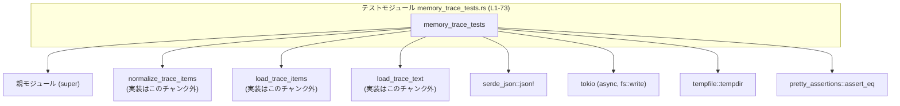

# core/src/memory_trace_tests.rs コード解説

## 0. ざっくり一言

`core/src/memory_trace_tests.rs` は、メモリトレース用の JSON ログを扱う 3 つの関数

- `normalize_trace_items`
- `load_trace_items`
- `load_trace_text`

の振る舞いをテストで仕様化しているモジュールです（core/src/memory_trace_tests.rs:L1-73）。  
主に「JSON 構造の正規化」「JSONL 形式の読み込み」「UTF-8 BOM（UTF-8-SIG）の除去」を確認しています。

---

## 1. このモジュールの役割

### 1.1 概要

このモジュールは次の問題を解決するために存在しています。

- **問題**  
  メモリトレースの JSON ログが、ラッパー付き (`response_item` + `payload`) や JSONL 形式などバラついた形で保存されており、そのままでは処理しにくい。

- **提供する機能（テストが確認している仕様）**
  - `normalize_trace_items` が
    - `response_item.payload` ラッパーを剥がす
    - `role: "tool"` の message を除外する
    - `type: "function_call"` を保持する  
    少なくともこの動作をすることを確認（core/src/memory_trace_tests.rs:L7-38）。
  - `load_trace_items` が
    - 1 行ごとに JSON オブジェクトまたは JSON 配列が並ぶ JSONL テキストから
    - 上記と同様の正規化された message 群を取り出せることを確認（core/src/memory_trace_tests.rs:L41-52）。
  - `load_trace_text` が
    - UTF-8 BOM 付きファイルを読み込み
    - 文字列先頭から BOM を除去して返すことを確認（core/src/memory_trace_tests.rs:L55-72）。

### 1.2 アーキテクチャ内での位置づけ

このファイルはテストモジュールであり、親モジュール（`use super::*;`）で定義されている関数を直接呼び出します（core/src/memory_trace_tests.rs:L1）。  
外部クレートとして `serde_json`, `tokio`, `tempfile`, `pretty_assertions` に依存しています（core/src/memory_trace_tests.rs:L2-3,55-66,71-72）。

テストモジュールと依存関係の概略は次のとおりです。



※ `normalize_trace_items` / `load_trace_items` / `load_trace_text` の実装はこのチャンクには現れません。

### 1.3 設計上のポイント（テストから読み取れる範囲）

- **JSON 仕様のテスト駆動的な定義**  
  - 正規化後に残るべき JSON / 破棄される JSON をテストデータで明示（core/src/memory_trace_tests.rs:L7-29,32-37,43-46,48-51）。
- **役割（role）フィルタリング**  
  - `role: "tool"` の message が結果から取り除かれる一方、`assistant`, `user`, `developer` は残ることを確認（core/src/memory_trace_tests.rs:L15-17,25-27,32-36,48-50）。
- **ラッパー構造の扱い**  
  - `{"type": "response_item", "payload": ...}` のようなラッパーから中身を取り出す一方、
    `{"type": "not_response_item", "payload": ...}` は完全に無視されることを確認（core/src/memory_trace_tests.rs:L8-23,32-36）。
- **JSONL 形式のサポート**  
  - 1 行目が JSON オブジェクト、2 行目が JSON 配列という混在形式でも処理できることを確認（core/src/memory_trace_tests.rs:L43-46）。
- **非同期 I/O と UTF-8 BOM の扱い**  
  - Tokio ベースの非同期テストで、BOM 付きファイルを読み込んだ結果が BOM なしの文字列になることを確認（core/src/memory_trace_tests.rs:L55-72）。

---

## 2. 主要な機能一覧（コンポーネントインベントリー）

### 2.1 このファイルで定義される関数

| 名前 | 種別 | 定義場所 | 役割 / 用途 |
|------|------|----------|-------------|
| `normalize_trace_items_handles_payload_wrapper_and_message_role_filtering` | テスト関数 (`#[test]`) | core/src/memory_trace_tests.rs:L5-39 | `normalize_trace_items` が payload ラッパーを剥がし、`role: "tool"` の message を除外し、`function_call` を保持することを確認する。 |
| `load_trace_items_supports_jsonl_arrays_and_objects` | テスト関数 (`#[test]`) | core/src/memory_trace_tests.rs:L41-53 | `load_trace_items` が JSON オブジェクトと JSON 配列が混在した JSONL テキストを処理し、正規化された message リストを返すことを確認する。 |
| `load_trace_text_decodes_utf8_sig` | 非同期テスト関数 (`#[tokio::test]`) | core/src/memory_trace_tests.rs:L55-72 | `load_trace_text` が UTF-8 BOM 付きファイルを読み込み、先頭 `'['` から始まる文字列（BOM 除去済み）を返すことを確認する。 |

### 2.2 このファイルから呼び出される主な外部関数（テスト対象）

※ いずれも `use super::*;` により親モジュールからインポートされており、このチャンクには定義がありません。

| 名前 | 想定シグネチャ（テストから分かる範囲） | 呼び出し箇所 | 役割 / 用途 |
|------|--------------------------------------|--------------|-------------|
| `normalize_trace_items` | `fn normalize_trace_items(items: Vec<serde_json::Value>, path: &Path) -> Result<Vec<serde_json::Value>, E>` ※`E` は不明 | core/src/memory_trace_tests.rs:L31 | JSON のトレース項目ベクタから、payload ラッパーの除去や role フィルタリングを行い、正規化済み `Vec<Value>` を返す。 |
| `load_trace_items` | `fn load_trace_items(path: &Path, text: &str) -> Result<Vec<serde_json::Value>, E>` ※`E` は不明 | core/src/memory_trace_tests.rs:L47 | JSONL 形式のテキストからトレース項目を読み込み、正規化された `Vec<Value>` を返す。 |
| `load_trace_text` | `async fn load_trace_text(path: &Path) -> Result<String, E>` ※`E` は不明 | core/src/memory_trace_tests.rs:L71 | ファイルから UTF-8 文字列を読み込み、UTF-8 BOM があれば取り除いた `String` を返す。 |

> シグネチャ中の `E` はエラー型を表すプレースホルダであり、実際の型はこのチャンクには現れません。

---

## 3. 公開 API と詳細解説（テスト対象関数）

### 3.1 型一覧（このファイルから見える主要な型）

このファイル内で新しい公開型は定義されていませんが、テスト対象関数が扱う主要な型は次のとおりです。

| 名前 | 種別 | 定義元 | 役割 / 用途 | 根拠 |
|------|------|--------|-------------|------|
| `serde_json::Value` | 構造体（JSON 値） | `serde_json` クレート | JSON オブジェクト・配列などを表現する汎用型。テストでは `serde_json::json!` マクロから生成された値が `Vec<Value>` として渡される（core/src/memory_trace_tests.rs:L7-29,32-37,48-50）。 | core/src/memory_trace_tests.rs:L7-29,32-37,48-50 |
| `std::path::Path` | 構造体（パス参照） | 標準ライブラリ | ファイルパスの参照型。`Path::new("trace.json")` などで生成され、`normalize_trace_items` / `load_trace_items` に渡されている（core/src/memory_trace_tests.rs:L31,47）。 | core/src/memory_trace_tests.rs:L31,47 |
| `String` | 所有文字列 | 標準ライブラリ | `load_trace_text` の戻り値として利用され、`text.starts_with('[')` のように利用されている（core/src/memory_trace_tests.rs:L71-72）。 | core/src/memory_trace_tests.rs:L71-72 |
| `Result<T, E>` | 列挙体 | 標準ライブラリ | テストで `.expect("...")` が呼ばれていることから、各関数が `Result` を返すことが分かる（core/src/memory_trace_tests.rs:L31,47,71）。 | core/src/memory_trace_tests.rs:L31,47,71 |

### 3.2 関数詳細（公開 API の推定仕様）

以下では、テストから読み取れる範囲で 3 関数の仕様を整理します。  
いずれも **実装はこのチャンクには存在せず、親モジュールに定義されています**。

---

#### `normalize_trace_items(items: Vec<serde_json::Value>, path: &Path) -> Result<Vec<serde_json::Value>, E>`

**概要**

- メモリトレースから得られた JSON 項目（`Vec<Value>`）を正規化する関数です。
- 少なくとも次の動作を行うことがテストから分かります（core/src/memory_trace_tests.rs:L7-38）。
  - `{"type": "response_item", "payload": ...}` というラッパーから `payload` 内の要素を取り出す。
  - `type: "message"` のうち `role: "tool"` のものを結果から除外する。
  - `type: "function_call"` の要素は保持する。
  - `type: "not_response_item"` のような別種のラッパーは無視する。

**引数**

| 引数名 | 型 | 説明 |
|--------|----|------|
| `items` | `Vec<serde_json::Value>` | 生のトレース項目のリスト。`response_item` ラッパーや `message` / `function_call` などが含まれる（core/src/memory_trace_tests.rs:L7-29）。 |
| `path` | `&Path` | 元トレースのファイルパス。テストでは `"trace.json"` が渡されています（core/src/memory_trace_tests.rs:L31）。エラーメッセージなどに利用されている可能性がありますが、用途はこのチャンクからは分かりません。 |

**戻り値**

- `Result<Vec<serde_json::Value>, E>`
  - `Ok(Vec<Value>)`: 正規化済みの JSON 項目リスト。
    - テストでは、期待値として `Vec<Value>` が比較されていることから、`Ok` の中身が `Vec<Value>` であることが分かります（core/src/memory_trace_tests.rs:L32-38）。
  - `Err(E)`: 何らかのエラー。エラー型 `E` の具体的な中身はこのチャンクからは分かりません。

**内部処理の流れ（テストから分かる部分だけ）**

テスト入力と期待値から推測できる最小限の流れを示します。

1. 入力の各要素 `item` を順に処理する（core/src/memory_trace_tests.rs:L7-29）。
2. `item["type"]` が `"response_item"` の場合:
   - `item["payload"]` を取り出す。
   - `payload` がオブジェクトであれば 1 要素として扱う（1 番目の要素; core/src/memory_trace_tests.rs:L8-11）。
   - `payload` が配列であれば、その各要素を順に処理する（2 番目の要素; core/src/memory_trace_tests.rs:L12-19）。
3. `item["type"]` が `"message"` で、かつ `item["role"]` が
   - `"assistant"` / `"user"` / `"developer"` の場合は結果に含める
     - assistant: core/src/memory_trace_tests.rs:L8-11,32  
       user: core/src/memory_trace_tests.rs:L15,34  
       developer: core/src/memory_trace_tests.rs:L24-27,36
   - `"tool"` の場合は結果から除外する（core/src/memory_trace_tests.rs:L16, expected からは欠落）。
4. `item["type"]` が `"function_call"` の場合は、そのまま結果に含める（core/src/memory_trace_tests.rs:L17,35）。
5. トップレベルの `item["type"]` が `"not_response_item"` のような未知の種類の場合、その `payload` は結果に一切現れない（core/src/memory_trace_tests.rs:L20-23, expected から欠落）。

> 上記のうち、「role が `"assistant"` / `"user"` / `"developer"` 以外の場合の扱い」など、テストに現れないケースについては、このチャンクからは分かりません。

**Examples（使用例）**

テストとほぼ同じ簡易例です。

```rust
use std::path::Path;
use serde_json::json;

// 生のトレース項目（response_item ラッパーや tool ロールを含む）
let items = vec![
    json!({"type": "response_item", "payload": {"type": "message", "role": "assistant", "content": []}}),
    json!({"type": "message", "role": "developer", "content": []}),
];

// 正規化を実行（エラー時は ? で伝播）
let normalized = normalize_trace_items(items, Path::new("trace.json"))?;

// normalized には assistant / developer の message だけが入っていることが期待される
```

**Errors / Panics**

- テストでは `.expect("normalize")` を呼んでいるため、`Result` が `Err` になった場合はテストが panic します（core/src/memory_trace_tests.rs:L31）。
- `Err` になる具体的条件（JSON スキーマ違反、型不一致など）は、このチャンクには現れません。

**Edge cases（エッジケース）**

テストから読み取れる範囲のエッジケース:

- `type` が `"response_item"` 以外のラッパー（例: `"not_response_item"`）  
  → `payload` の中身は無視される（core/src/memory_trace_tests.rs:L20-23, expected から欠落）。
- `payload` が単一オブジェクトの場合と配列の場合  
  → どちらも処理される（core/src/memory_trace_tests.rs:L8-11,12-19）。
- `role: "tool"` の message  
  → 結果から除外される（core/src/memory_trace_tests.rs:L16, expected に登場しない）。
- `type: "function_call"`  
  → 配列の中からでも結果に残る（core/src/memory_trace_tests.rs:L17,35）。

**使用上の注意点**

- `items` の構造がテストで用いられているスキーマから大きく外れる場合の挙動は、このチャンクからは分かりません。
- `Result` の `Err` はテストでは全て `expect` で即 panic させているため、実際の利用コードではエラー処理を明示的に行う必要があります。

---

#### `load_trace_items(path: &Path, text: &str) -> Result<Vec<serde_json::Value>, E>`

**概要**

- JSONL（JSON Lines）形式のテキストからトレース項目を読み込み、正規化された `Vec<Value>` を返す関数です（core/src/memory_trace_tests.rs:L43-47）。
- 少なくとも次の動作を行うことがテストから分かります。
  - 各行が JSON オブジェクトまたは JSON 配列である形式をサポートする。
  - `response_item.payload` を剥がしつつ、`role: "tool"` の message を除外し、`assistant` と `user` の message を残す（core/src/memory_trace_tests.rs:L43-46,48-51）。

**引数**

| 引数名 | 型 | 説明 |
|--------|----|------|
| `path` | `&Path` | 元のトレースファイルのパスを表す。テストでは `"trace.jsonl"` が渡されている（core/src/memory_trace_tests.rs:L47）。エラーメッセージなどに利用される可能性があるが、このチャンクからは不明。 |
| `text` | `&str` | ファイルから読み込んだ JSONL テキスト。テストではリテラル文字列として定義されている（core/src/memory_trace_tests.rs:L43-46）。 |

**戻り値**

- `Result<Vec<serde_json::Value>, E>`
  - `Ok(Vec<Value>)`: 正規化済み JSON 項目。
    - assistant と user の message が含まれることがテストで確認されています（core/src/memory_trace_tests.rs:L48-51）。
  - `Err(E)`: JSON パースやスキーマ不一致などのエラーが想定されますが、詳細はこのチャンクからは分かりません。

**内部処理の流れ（テストから分かる部分だけ）**

1. `text` を行単位で分割する（テストでは 2 行; core/src/memory_trace_tests.rs:L43-46）。
2. 各行を JSON としてパースする。
   - 1 行目: `{"type":"response_item","payload":{"type":"message","role":"assistant","content":[]}}`（core/src/memory_trace_tests.rs:L44）。
   - 2 行目: `[{"type":"message","role":"user","content":[]},{"type":"message","role":"tool","content":[]}]`（core/src/memory_trace_tests.rs:L45）。
3. 1 行目の `response_item` から `payload` を取り出し、`role: "assistant"` の message を結果に含める（core/src/memory_trace_tests.rs:L44,48）。
4. 2 行目の配列から
   - `role: "user"` の message を結果に含める（core/src/memory_trace_tests.rs:L45,50）。
   - `role: "tool"` の message は結果から除外される（core/src/memory_trace_tests.rs:L45, expected から欠落）。

**Examples（使用例）**

```rust
use std::path::Path;

// JSONL 形式の文字列（1 行目: response_item, 2 行目: message の配列）
let text = r#"
{"type":"response_item","payload":{"type":"message","role":"assistant","content":[]}}
[{"type":"message","role":"user","content":[]},{"type":"message","role":"tool","content":[]}]
"#;

// 正規化された項目をロード
let items = load_trace_items(Path::new("trace.jsonl"), text)?;

// items には assistant と user の message のみが含まれる
```

**Errors / Panics**

- テストでは `load_trace_items(...).expect("load")` としているため、`Err` の場合は panic します（core/src/memory_trace_tests.rs:L47）。
- 空行や無効な JSON 行を渡した場合の挙動は、このチャンクからは分かりません。

**Edge cases（エッジケース）**

- JSON オブジェクトと JSON 配列が同じテキスト内で混在していても処理可能（core/src/memory_trace_tests.rs:L43-46）。
- `role: "tool"` の message は結果から除外される（core/src/memory_trace_tests.rs:L45, expected から欠落）。
- 行頭・行末の空白（改行含む）はテスト上存在するため、ある程度の空白は許容されていると考えられます（core/src/memory_trace_tests.rs:L43-46）。

**使用上の注意点**

- `text` はすでにファイルから読み込まれている前提です。テストではファイル I/O をせず、文字列リテラルから直接渡しています（core/src/memory_trace_tests.rs:L43-47）。
- 実運用では `load_trace_text` などでファイルから読み込んだ文字列との組み合わせが想定されますが、その組み合わせ方はこのチャンクには現れません。
- エラーは `Result` で返るため、呼び出し側で適切にエラーハンドリングを行う必要があります。

---

#### `load_trace_text(path: &Path) -> Result<String, E>` （非同期）

**概要**

- 与えられたパスのファイルを非同期に読み込み、UTF-8 文字列として返す関数です。
- 少なくとも UTF-8 BOM (0xEF,0xBB,0xBF) が付いたファイルでも、BOM を取り除いた文字列を返すことがテストで確認されています（core/src/memory_trace_tests.rs:L55-72）。

**引数**

| 引数名 | 型 | 説明 |
|--------|----|------|
| `path` | `&Path` | 読み込むファイルのパス。テストでは一時ディレクトリ内の `trace.json` が使用されています（core/src/memory_trace_tests.rs:L57-58,71）。 |

**戻り値**

- `Result<String, E>`
  - `Ok(String)`: UTF-8 として解釈されたファイル内容。テストでは BOM 除去後の JSON 文字列が返ってきます（core/src/memory_trace_tests.rs:L71-72）。
  - `Err(E)`: ファイルが存在しない、読み込み失敗、エンコーディングエラーなどが想定されますが、詳細はこのチャンクからは分かりません。

**内部処理の流れ（テストから分かる部分だけ）**

1. ファイルをバイト列として読み込む（テストでは `tokio::fs::write` で事前に書き込み; core/src/memory_trace_tests.rs:L59-69）。
2. 先頭 3 バイトが `0xEF, 0xBB, 0xBF`（UTF-8 BOM）の場合、それらをスキップする。
3. 残りを UTF-8 として `String` にデコードして返す。
4. テストでは、返ってきた文字列が `'['` から始まることを確認しており（core/src/memory_trace_tests.rs:L71-72）、BOM が除去されていることが分かる。

**Examples（使用例）**

```rust
use std::path::Path;

// 非同期コンテキスト内で
async fn example() -> Result<(), Box<dyn std::error::Error>> {
    let path = Path::new("trace.json");
    let text = load_trace_text(path).await?; // UTF-8 + BOM を処理

    // text は JSON 文字列として利用可能
    println!("{text}");
    Ok(())
}
```

**Errors / Panics**

- テストでは `.await.expect("decode")` としているため、`Err` が返った場合は panic します（core/src/memory_trace_tests.rs:L71）。
- 非同期関数であるため、Tokio などのランタイム外で `.await` しようとするとコンパイルエラーになります（`#[tokio::test]` によりランタイムが用意されている; core/src/memory_trace_tests.rs:L55）。

**Edge cases（エッジケース）**

- UTF-8 BOM が付いている場合  
  → BOM を除去して返す（core/src/memory_trace_tests.rs:L59-66,71-72）。
- BOM が付いていない場合・その他のエンコーディングについては、このチャンクからは挙動が分かりません。

**使用上の注意点**

- 非同期関数のため、Tokio 等の非同期ランタイム環境内で使用する必要があります（core/src/memory_trace_tests.rs:L55）。
- ファイルのエンコーディングは UTF-8（BOM 付き・無し）を前提としていると考えられますが、テストで確認されているのは UTF-8 BOM のみです。

---

### 3.3 その他の関数（テスト関数）

| 関数名 | 役割（1 行） | 根拠 |
|--------|--------------|------|
| `normalize_trace_items_handles_payload_wrapper_and_message_role_filtering` | `normalize_trace_items` の payload ラッパー処理と role フィルタリングを検証する単体テスト。 | core/src/memory_trace_tests.rs:L5-39 |
| `load_trace_items_supports_jsonl_arrays_and_objects` | `load_trace_items` が JSON オブジェクトと配列の混在する JSONL テキストを処理できることを検証する単体テスト。 | core/src/memory_trace_tests.rs:L41-53 |
| `load_trace_text_decodes_utf8_sig` | `load_trace_text` が UTF-8 BOM を除去して文字列を返すことを検証する非同期テスト。 | core/src/memory_trace_tests.rs:L55-72 |

---

## 4. データフロー

このセクションでは、テストで確認されている範囲のデータフローを示します。

### 4.1 `normalize_trace_items` を用いた正規化フロー

```mermaid
sequenceDiagram
    participant T as test_normalize_trace_items\n(L5-39)
    participant F as normalize_trace_items\n(実装はこのチャンク外)

    T->>T: items = Vec<Value> を構築\n(response_item, message, function_call など; L7-29)
    T->>F: normalize_trace_items(items, Path("trace.json"))\n(L31)
    F-->>T: Result<Vec<Value>, E>
    T->>T: normalized = result.expect(\"normalize\")\n(L31)
    T->>T: expected Vec<Value> を構築\n(L32-37)
    T->>T: assert_eq!(normalized, expected)\n(L38)
```

このフローで、**入力の `items`** にはラッパーや無視されるべき要素（`not_response_item`, `role: "tool"`）が含まれていますが、  
**出力の `normalized`** ではそれらが除去され、`assistant`, `user`, `developer`, `function_call` のみが残ることが確認されています（core/src/memory_trace_tests.rs:L7-38）。

### 4.2 `load_trace_items` を用いた JSONL → 正規化フロー

```mermaid
sequenceDiagram
    participant T as test_load_trace_items\n(L41-53)
    participant F as load_trace_items\n(実装はこのチャンク外)

    T->>T: text = JSONL 文字列を定義\n(1行目: response_item,\n2行目: message配列; L43-46)
    T->>F: load_trace_items(Path(\"trace.jsonl\"), text)\n(L47)
    F-->>T: Result<Vec<Value>, E>
    T->>T: loaded = result.expect(\"load\")\n(L47)
    T->>T: expected Vec<Value> (assistant, user) を構築\n(L48-51)
    T->>T: assert_eq!(loaded, expected)\n(L52)
```

ここでは、**JSON オブジェクト行と JSON 配列行が混在している JSONL** を入力とし、  
`assistant` と `user` の message のみが最終的な出力になることが確認されています（core/src/memory_trace_tests.rs:L43-52）。

### 4.3 `load_trace_text` を用いた UTF-8 BOM 除去フロー

```mermaid
sequenceDiagram
    participant T as test_load_trace_text\n(L55-72)
    participant W as tokio::fs::write
    participant F as load_trace_text\n(実装はこのチャンク外)

    T->>T: dir = tempdir()\n(L57)
    T->>T: path = dir.join(\"trace.json\")\n(L58)
    T->>W: write(&path, [BOM + JSONバイト列])\n(L59-66)
    W-->>T: () (Result Ok)\n(await, L68-69)
    T->>F: load_trace_text(&path).await\n(L71)
    F-->>T: Result<String, E>
    T->>T: text = result.expect(\"decode\")\n(L71)
    T->>T: assert!(text.starts_with('['))\n(BOM除去確認; L72)
```

このフローから、`load_trace_text` が BOM を取り除いた文字列を返すことと、非同期 I/O を利用していることが分かります（core/src/memory_trace_tests.rs:L55-72）。

---

## 5. 使い方（How to Use）

ここでは、テストコードから読み取れる利用方法を整理します。

### 5.1 基本的な使用方法

#### 5.1.1 既にメモリ上にあるトレースを正規化する（`normalize_trace_items`）

```rust
use std::path::Path;
use serde_json::json;

// メモリ上のトレース項目（response_item ラッパー付き）
let raw_items = vec![
    json!({"type": "response_item", "payload": {"type": "message", "role": "assistant", "content": []}}),
    json!({"type": "response_item", "payload": [
        {"type": "message", "role": "user", "content": []},
        {"type": "message", "role": "tool", "content": []},
    ]}),
];

// 正規化処理（テストと同様、Path を渡す）
let normalized = normalize_trace_items(raw_items, Path::new("trace.json"))?;

// normalized には assistant / user のメッセージのみが含まれていることが期待される
```

これは `normalize_trace_items_handles_payload_wrapper_and_message_role_filtering` テストの簡略版です（core/src/memory_trace_tests.rs:L7-38）。

#### 5.1.2 JSONL テキストからトレースを読み込む（`load_trace_items`）

```rust
use std::path::Path;

let text = r#"
{"type":"response_item","payload":{"type":"message","role":"assistant","content":[]}}
[{"type":"message","role":"user","content":[]},{"type":"message","role":"tool","content":[]}]
"#;

let items = load_trace_items(Path::new("trace.jsonl"), text)?;

// items には assistant / user のメッセージのみが残る（tool ロールは除外）
```

テスト `load_trace_items_supports_jsonl_arrays_and_objects` と同じ形式です（core/src/memory_trace_tests.rs:L43-52）。

#### 5.1.3 ファイルからテキストを読み込む（`load_trace_text`）

```rust
use std::path::Path;

// Tokio ランタイム内の非同期コンテキストで
async fn read_trace() -> Result<String, Box<dyn std::error::Error>> {
    let path = Path::new("trace.json");
    let text = load_trace_text(path).await?; // UTF-8 BOM があれば除去される
    Ok(text)
}
```

これは `load_trace_text_decodes_utf8_sig` が確認している使い方と同じです（core/src/memory_trace_tests.rs:L55-72）。

### 5.2 よくある使用パターン

テストから想定できる代表的なパターンを挙げます。

1. **ファイル → 文字列 → トレース項目** という段階的処理  
   （この組み合わせ自体はテストには直接現れませんが、テストされている各関数を連鎖させる自然なパターンです。）

   ```rust
   use std::path::Path;

   async fn load_and_normalize_trace(path: &Path) -> Result<Vec<serde_json::Value>, E> {
       // ファイルから UTF-8 文字列として読み込み（BOM 除去込み）
       let text = load_trace_text(path).await?;

       // JSONL としてパースし、正規化された項目を取得
       let items = load_trace_items(path, &text)?;
       Ok(items)
   }
   ```

   > `load_trace_text` と `load_trace_items` を組み合わせるかどうか、実際のコード構成はこのチャンクには現れませんが、テストで確認されている個々の振る舞いから自然に想定できるパターンです。

2. **既にパース済みの `Vec<Value>` に対して後段で正規化だけを行う**  
   - 上流で `serde_json::from_reader` などを使い、`Vec<Value>` として読み込んでから `normalize_trace_items` に渡すパターンが考えられます。

### 5.3 よくある間違い（想定）

テストの前提から、起こりやすそうな誤用例と正しい例を対比します。

```rust
use serde_json::json;

// 誤り例: response_item ラッパーをそのまま使う
let raw = json!({
    "type": "response_item",
    "payload": {"type": "message", "role": "assistant", "content": []}
});

// このまま raw を message とみなして処理すると、
// テストが前提としている「正規化済みトレース」とは異なる構造になる。

// 正しい例: normalize_trace_items を通してラッパーを剥がす
let normalized = normalize_trace_items(vec![raw], Path::new("trace.json"))?;
// normalized[0] は {"type": "message", "role": "assistant", ...} の形になることが期待される
```

```rust
// 誤り例: JSONL 文字列を serde_json::from_str::<Vec<Value>>() で直接配列として読む
// → 2 行目が配列のため失敗する、あるいはラッパーや tool ロールがそのまま残る可能性がある。

// 正しい例: テストと同様に load_trace_items を使う
let items = load_trace_items(Path::new("trace.jsonl"), text)?;
// response_item ラッパーや role = "tool" の message が除外された形で取得できる
```

### 5.4 使用上の注意点（まとめ）

- **Result の扱い**
  - テストでは `.expect(...)` で即 panic していますが（core/src/memory_trace_tests.rs:L31,47,71）、実際のコードでは `?` 演算子や `match` でエラー処理を行う必要があります。
- **非同期処理**
  - `load_trace_text` は非同期関数であり、Tokio などのランタイム内で `.await` する必要があります（core/src/memory_trace_tests.rs:L55-72）。
- **JSON スキーマ**
  - テストで確認されているのは特定の JSON 構造（`type`, `payload`, `role`, `content`, `function_call` など）だけです。その他のフィールドや未知の `type` の扱いは、このチャンクからは分かりません。
- **role フィルタリング**
  - 少なくとも `role: "tool"` の message が除外される前提でテストが書かれています（core/src/memory_trace_tests.rs:L15-17,45）。この前提に依存するロジックを書く場合は、仕様変更時にこのテストを確認する必要があります。

---

## 6. 変更の仕方（How to Modify）

### 6.1 新しい機能を追加する場合（テスト観点）

新しいトレース形式や role をサポートする機能追加を行う場合、このファイルは**テストの追加・変更ポイント**になります。

1. **親モジュール（super）に機能追加**
   - 例えば、新しい `role`（例: `"system"`）を `normalize_trace_items` で保持する仕様に変更するなど。
   - 実装場所は `use super::*;` の親モジュールであり、このチャンクからは具体的なファイル名は分かりません（core/src/memory_trace_tests.rs:L1）。

2. **本ファイルへのテスト追加**
   - 新しい JSON サンプルを `items` や `text` に追加（core/src/memory_trace_tests.rs:L7-29,43-46 等を参考）。
   - 期待される正規化結果を `expected` ベクタで表現し（core/src/memory_trace_tests.rs:L32-37,48-51）、
     `assert_eq!` で比較するパターンに倣う（core/src/memory_trace_tests.rs:L38,52）。

3. **エッジケースのテスト**
   - 新しい `type` や `role` が追加された場合、削除されるべきか・残すべきかをテストで明示しておくと、将来の変更の安全性が高まります。

### 6.2 既存の機能を変更する場合（仕様変更の影響）

既存の正規化仕様や BOM 処理を変更する場合、影響範囲と注意点は以下のとおりです。

- **role フィルタリングの変更**
  - 例えば `role: "tool"` を残す仕様に変更する場合、
    - `normalize_trace_items_handles_payload_wrapper_and_message_role_filtering` と
    - `load_trace_items_supports_jsonl_arrays_and_objects`  
    の期待値（`expected`）を変更する必要があります（core/src/memory_trace_tests.rs:L32-37,48-51）。

- **ラッパー `response_item` 以外の扱い**
  - 現在テストでは `"not_response_item"` を無視する前提です（core/src/memory_trace_tests.rs:L20-23）。  
    これを扱う仕様に変える場合は、テストを追加・変更して挙動を固定する必要があります。

- **BOM 処理の変更**
  - `load_trace_text` が BOM を除去しない仕様に変更される場合、
    - `load_trace_text_decodes_utf8_sig` の `assert!(text.starts_with('['))` が成り立たなくなります（core/src/memory_trace_tests.rs:L71-72）。
  - 仕様を変えるのであれば、それに合わせて期待条件も変更します。

- **テストの実行環境**
  - `#[tokio::test]` の使用により、Tokio ランタイムに依存したテストになっています（core/src/memory_trace_tests.rs:L55）。  
    もしランタイムを変える場合は、このアトリビュートも変更が必要です。

---

## 7. 関連ファイル

このモジュールと密接に関係するファイル・コンポーネントを示します。

| パス / モジュール | 役割 / 関係 | 根拠 |
|-------------------|------------|------|
| 親モジュール（`super`） | `normalize_trace_items` / `load_trace_items` / `load_trace_text` の実装を提供する。本ファイルは `use super::*;` によりこれらをインポートしている。 | core/src/memory_trace_tests.rs:L1,31,47,71 |
| `serde_json` クレート | `serde_json::json!` で JSON テストデータを構築するために使用される。実際には `Value` 型などを提供する。 | core/src/memory_trace_tests.rs:L7-29,32-37,48-50 |
| `tempfile` クレート | 一時ディレクトリ・一時ファイルを生成し、`load_trace_text` のテストに利用している。 | core/src/memory_trace_tests.rs:L3,57-58 |
| `tokio` クレート | 非同期テスト (`#[tokio::test]`) と `tokio::fs::write` による非同期ファイル書き込みで使用されている。 | core/src/memory_trace_tests.rs:L55,59-69 |
| `pretty_assertions` クレート | `assert_eq!` の拡張版を用いて、`Vec<Value>` 同士の比較を行う際に差分表示を改善している。 | core/src/memory_trace_tests.rs:L2,38,52 |

> 親モジュールの具体的なファイル名（例: `core/src/memory_trace.rs` など）は、このチャンクには現れません。そのため、ここでは「親モジュール（super）」と表記しています。
