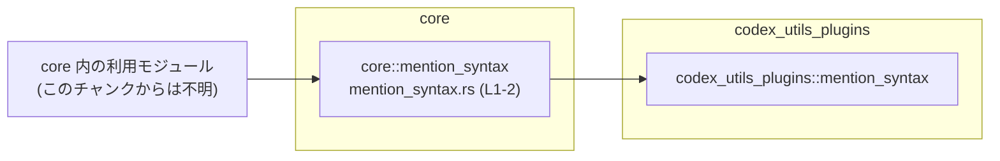
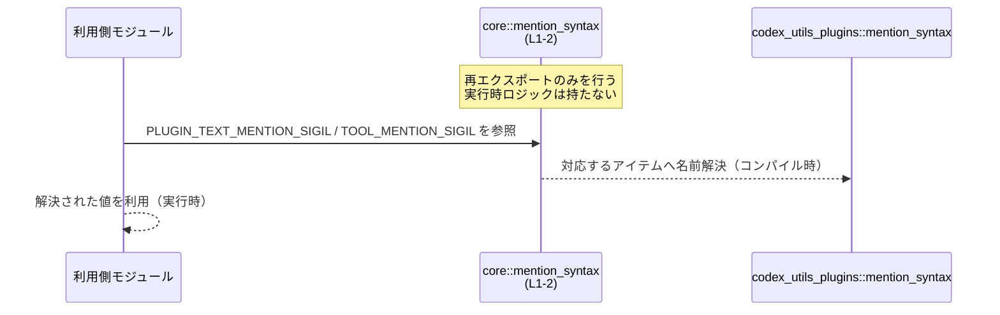

# core/src/mention_syntax.rs コード解説

## 0. ざっくり一言

- 外部クレート `codex_utils_plugins::mention_syntax` に定義された 2 つの公開アイテムを、このクレートからも使えるように **再エクスポート（`pub use`）** するだけの薄いモジュールです（`mention_syntax.rs:L1-2`）。

---

## 1. このモジュールの役割

### 1.1 概要

- このモジュールは、`codex_utils_plugins::mention_syntax` モジュールにある  
  `PLUGIN_TEXT_MENTION_SIGIL` と `TOOL_MENTION_SIGIL` を `pub use` で再公開します（`mention_syntax.rs:L1-2`）。
- これにより、利用側は `codex_utils_plugins` を直接参照せず、`core` クレートの公開 API を通じて同じアイテムにアクセスできます。

### 1.2 アーキテクチャ内での位置づけ

- 依存関係は以下のようになります。



- 利用側モジュール（`U`）は `core::mention_syntax` をインポートし、その内部から `PLUGIN_TEXT_MENTION_SIGIL` / `TOOL_MENTION_SIGIL` にアクセスします。
- 実際の定義やロジックは `codex_utils_plugins::mention_syntax` 側にあります。このファイルには定義本体は含まれていません。

### 1.3 設計上のポイント

コードから読み取れる事実のみを挙げます。

- **責務の分割**
  - 本モジュールは **定義を持たず、再エクスポートだけ** を行います（`mention_syntax.rs:L1-2`）。
  - 実体（値・型・ロジック）はすべて `codex_utils_plugins::mention_syntax` にあり、ここでは公開窓口として振る舞っています。
- **状態**
  - 構造体・列挙体・関数の定義はなく、**実行時の状態を持ちません**（このチャンクにはそうした定義が現れません）。
- **エラーハンドリング**
  - `pub use` はコンパイル時の名前解決のための構文であり、**ランタイムのエラー処理ロジックを含みません**。
- **並行性**
  - このファイルにはスレッド生成やロックなどの並行処理は一切登場しません。
  - 再エクスポートされたアイテムのスレッド安全性は **宣言元（`codex_utils_plugins::mention_syntax` 側）に依存** します。このチャンクからは不明です。

---

## 2. 主要な機能一覧（コンポーネントインベントリー）

このファイルに登場する「機能」はすべて再エクスポートです。

| 名前 | 種別 | 定義形態 | 役割（事実レベル） | 根拠 |
|------|------|----------|--------------------|------|
| `PLUGIN_TEXT_MENTION_SIGIL` | 公開アイテム（型はこのチャンクから不明） | `pub use codex_utils_plugins::mention_syntax::PLUGIN_TEXT_MENTION_SIGIL;` | `codex_utils_plugins::mention_syntax::PLUGIN_TEXT_MENTION_SIGIL` を `core` クレートの公開 API として再エクスポートする | `mention_syntax.rs:L1` |
| `TOOL_MENTION_SIGIL` | 公開アイテム（型はこのチャンクから不明） | `pub use codex_utils_plugins::mention_syntax::TOOL_MENTION_SIGIL;` | `codex_utils_plugins::mention_syntax::TOOL_MENTION_SIGIL` を `core` クレートの公開 API として再エクスポートする | `mention_syntax.rs:L2` |

補足:

- 名前からは「メンション記法（mention syntax）に関係するシジル（接頭記号）」を表す定数である可能性がありますが、**型や具体的な値・意味はこのチャンクには現れません**。

---

## 3. 公開 API と詳細解説

### 3.1 型一覧（構造体・列挙体など）

このファイル内には、構造体・列挙体・型エイリアスなどの **新しい型定義は存在しません**。

- ここで公開しているのは、外部モジュールに定義済みのアイテムをそのまま再公開するものです（`mention_syntax.rs:L1-2`）。

### 3.2 関数詳細（最大 7 件）

- このファイルには関数定義が 0 件です（`functions=0` とメタ情報にあり、かつコードにも `fn` が登場しません）。
- したがって、関数詳細テンプレートを適用できる対象はありません。

### 3.3 その他の関数

- 関数・メソッド・マクロなどの宣言はこのチャンクには存在しません。

---

## 4. データフロー

### 4.1 再エクスポートを介した参照の流れ

このファイルはロジックを持たず、名前解決の窓口として動作します。  
利用側から見た「参照の流れ」は次のようになります。



要点:

- **コンパイル時**
  - `use crate::mention_syntax::PLUGIN_TEXT_MENTION_SIGIL;` などの記述により、コンパイラは `mention_syntax.rs:L1-2` の `pub use` を辿って、定義元 `codex_utils_plugins::mention_syntax` を解決します。
- **実行時**
  - 実際に参照・利用されるのは外部クレート側の定義です。
  - このファイル自体には実行時に評価されるコードはありません。

---

## 5. 使い方（How to Use）

### 5.1 基本的な使用方法

このモジュールの典型的な使い方は、「外部クレートを意識せずに、`core` クレート経由でアイテムを使う」ことです。

```rust
// core クレート内部（あるいは core を利用するクレート）からの利用例
use crate::mention_syntax::{PLUGIN_TEXT_MENTION_SIGIL, TOOL_MENTION_SIGIL};
// または、外部からなら `use core::mention_syntax::...;` のようなパスになる可能性があります
// （正確なクレート名はこのチャンクからは不明です）

fn example_usage() {
    // 型がこのチャンクからは分からないため、ここでは単に束縛するだけにとどめます。
    let text_sigil = PLUGIN_TEXT_MENTION_SIGIL;
    let tool_sigil = TOOL_MENTION_SIGIL;

    // `text_sigil` や `tool_sigil` の具体的な操作（表示・比較など）は
    // 元定義の型に依存するため、このファイル単体からは示せません。
}
```

ポイント:

- 利用側は `codex_utils_plugins` ではなく `crate::mention_syntax` をインポートするだけで済みます。
- これにより、「外部クレートの構成を意識せずに core の API だけを見ればよい」という形にできます。

### 5.2 よくある使用パターン

1. **core 経由での利用**

```rust
use crate::mention_syntax::PLUGIN_TEXT_MENTION_SIGIL;

fn f() {
    let sigil = PLUGIN_TEXT_MENTION_SIGIL;
    // 以降 sigil を使用
}
```

1. **外部クレートを直接使う場合との差**

```rust
// 直接外部クレートからインポートする書き方
use codex_utils_plugins::mention_syntax::PLUGIN_TEXT_MENTION_SIGIL;

// core が提供するラッパーを使う書き方
use crate::mention_syntax::PLUGIN_TEXT_MENTION_SIGIL;
```

- このファイルの存在により、後者のように **core の API に依存させる** ことができます。
- 実際にどちらを使うべきかはプロジェクトの設計方針次第ですが、このファイルがその選択肢を用意しています。

### 5.3 よくある間違い（起こりうる誤用）

実装から推測できる範囲で考えられる誤用を挙げます。

```rust
// 誤りの可能性がある例: 外部クレートへの直接依存
use codex_utils_plugins::mention_syntax::PLUGIN_TEXT_MENTION_SIGIL;

fn f() {
    // これでも動作はしますが、core の公開 API を経由していないため、
    // 将来 core が別の実装に差し替えた場合などに追従が難しくなります。
}
```

```rust
// core 経由の利用（設計上はこちらに統一されている可能性がある）
use crate::mention_syntax::PLUGIN_TEXT_MENTION_SIGIL;

fn f() {
    // core の API 境界を守った利用
}
```

- この「どちらが正しいか」はプロジェクト全体の方針に依存し、**このチャンクだけからは断定できません**。  
  ただし、`pub use` でラッパーを用意していることから、core 経由の利用が想定されている可能性があります。

### 5.4 使用上の注意点（まとめ）

- **型・意味の確認が必要**
  - `PLUGIN_TEXT_MENTION_SIGIL` と `TOOL_MENTION_SIGIL` の型や意味はこのファイルには定義されていません。  
    具体的な型・値・スレッド安全性などを確認するには、`codex_utils_plugins::mention_syntax` の定義を見る必要があります。
- **エラーやパニック**
  - このファイルは単なる再エクスポートであり、**独自のエラーやパニック条件は存在しません**。
- **並行性**
  - このモジュール自体にはスレッド状態やロックはなく、**並行性に関する問題は持ちません**。
  - 再エクスポートされたアイテムがスレッドセーフかどうかは、元定義に依存します。
- **バージョン依存**
  - `codex_utils_plugins` の API 変更（名前変更・削除など）があった場合、`mention_syntax.rs:L1-2` の `pub use` はビルドエラーになる可能性があります。

---

## 6. 変更の仕方（How to Modify）

### 6.1 新しい機能を追加する場合

このファイルに「機能」を追加する場合、想定されるパターンは次の 2 つです。

1. **新しいアイテムを再エクスポートする場合**

   - 手順:
     1. `codex_utils_plugins::mention_syntax` に新しい公開アイテムが追加されたとする（例: `SOME_NEW_SIGIL`）。  
        （このチャンクにはその情報はありませんが、一般的なケースとして記述します）
     2. `core/src/mention_syntax.rs` に以下のような行を追加します。

        ```rust
        pub use codex_utils_plugins::mention_syntax::SOME_NEW_SIGIL;
        ```

     3. これにより、`core` の利用者は `crate::mention_syntax::SOME_NEW_SIGIL` としてアクセスできるようになります。

2. **core 独自のアイテムをここで定義する場合**

   - このファイルは現状 `pub use` のみですが、次のように独自定義を追加することも可能です。

     ```rust
     pub use codex_utils_plugins::mention_syntax::PLUGIN_TEXT_MENTION_SIGIL;
     pub use codex_utils_plugins::mention_syntax::TOOL_MENTION_SIGIL;

     // ここから下は core 独自の定義（例）
     // 型やロジックはプロジェクトの要件に依存するため、このチャンクからは具体例は仮の形になります。
     ```

   - 実際にどのような型・関数を追加するかは別ファイルや仕様に依存し、このチャンクからは分かりません。

### 6.2 既存の機能を変更する場合

このファイルで「変更」として考えられるのは主に `pub use` のターゲットを変えることです。

- **定義元のパスを変更する**

  ```rust
  // 変更前
  pub use codex_utils_plugins::mention_syntax::PLUGIN_TEXT_MENTION_SIGIL;

  // 変更後（例: 別モジュールに移動した場合）
  pub use codex_utils_plugins::new_mention_syntax::PLUGIN_TEXT_MENTION_SIGIL;
  ```

  注意点:

  - 変更後のパスが正しいかどうかは `codex_utils_plugins` 側の構成に依存します。
  - この変更により、core の利用者は同じ名前で別の実装を参照することになりうるため、**意味的な互換性** を確認する必要があります（このチャンクからは判断できません）。

- **アイテムを削除する**

  - `mention_syntax.rs:L1-2` の `pub use` 行を削除すると、それを利用していたコードはコンパイルエラーになります。
  - 削除の影響範囲を確認するには、リポジトリ全体で `PLUGIN_TEXT_MENTION_SIGIL` / `TOOL_MENTION_SIGIL` の使用箇所を検索する必要があります（このチャンクには使用箇所は現れません）。

---

## 7. 関連ファイル

このモジュールと密接に関係するのは、実体を定義している外部モジュールです。

| パス / モジュール | 役割 / 関係 |
|-------------------|------------|
| `codex_utils_plugins::mention_syntax` | `PLUGIN_TEXT_MENTION_SIGIL` と `TOOL_MENTION_SIGIL` の **定義本体** を提供するモジュールです。本ファイルはここから 2 つのアイテムを `pub use` により再エクスポートしています（`mention_syntax.rs:L1-2`）。 |

補足:

- `core` クレート内でどのファイルが `mention_syntax` モジュールを利用しているかは、**このチャンクには現れません**。  
  利用箇所を特定するには、リポジトリ全体で `mention_syntax::PLUGIN_TEXT_MENTION_SIGIL` / `mention_syntax::TOOL_MENTION_SIGIL` を検索する必要があります。
- テストコード（例: `tests/` や `*_test.rs`）との関係も、このチャンクからは分かりません。

---

### Bugs / Security / Contracts / Edge Cases / Tests / パフォーマンス について（このファイルに限定したまとめ）

- **Bugs / Security**
  - このファイルはコンパイル時の再エクスポートのみを行うため、直接的なバグやセキュリティホールを生むロジックは含まれていません。
  - ただし、**実際の値やロジックは外部クレート側にある** ため、セキュリティ要件はそちらに依存します。
- **Contracts / Edge Cases**
  - 再エクスポートされたアイテムの「前提条件」「エッジケース」は元定義に属します。
  - このモジュールとしては、「これら 2 つの名前を core の公開 API として提供する」という契約だけを持ちます。
- **Tests**
  - 通常、この種のファイルは単体テスト対象になることは少なく、利用側のテストで間接的に検証されることが多いです。  
    ただし、このリポジトリ内に実際にテストが存在するかは、このチャンクからは不明です。
- **パフォーマンス / スケーラビリティ**
  - 実行時の処理を一切持たないため、このファイル自身がパフォーマンスやスケーラビリティに与える影響はありません。  
    影響は全て元定義のアイテムと、その利用方法に依存します。
