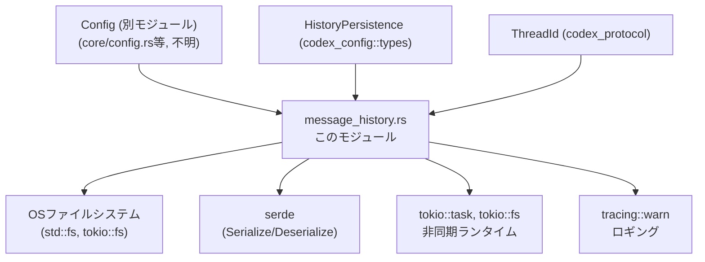
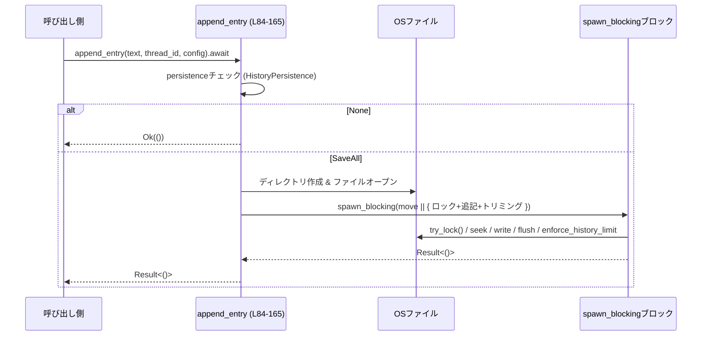
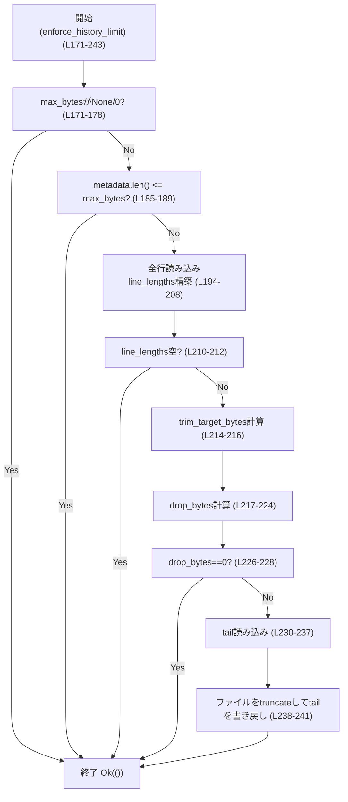
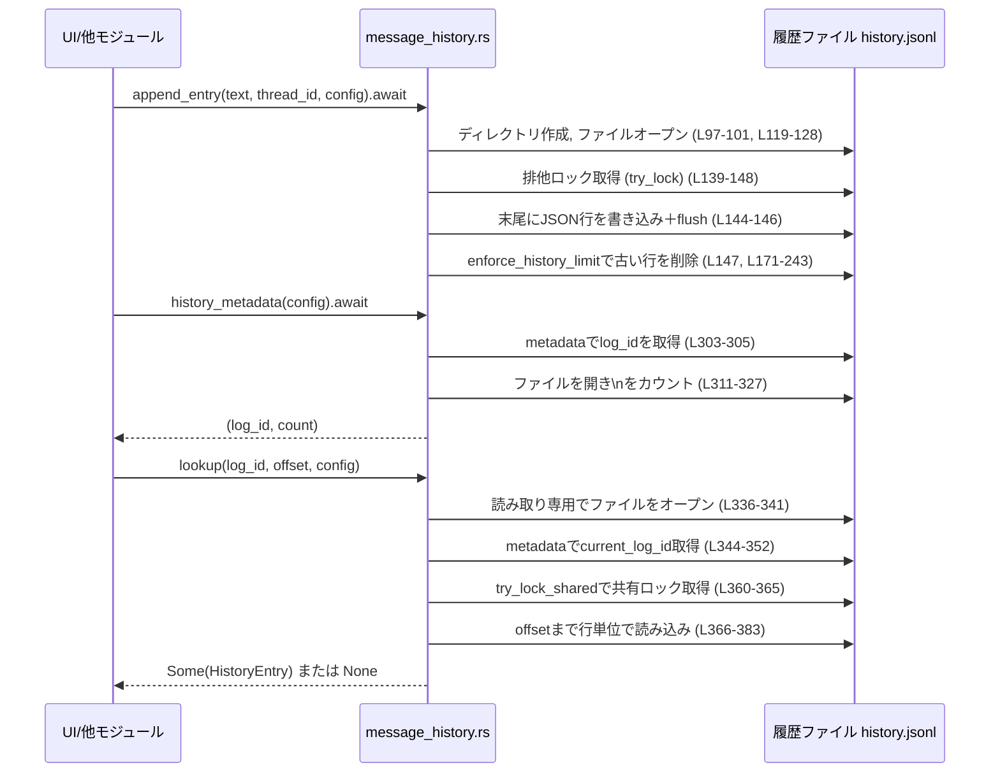

# core/src/message_history.rs コード解説

## 0. ざっくり一言

`~/.codex/history.jsonl` に対する **グローバルなメッセージ履歴（JSON-Lines）を追記・読み出し・トリミングする永続化レイヤ** です（`core/src/message_history.rs` 全体）。  
複数プロセスからの同時アクセスを想定し、**アドバイザリロック＋単一 write(2)** により履歴の整合性を保つ設計になっています（L69-83, L135-161, L358-395）。

---

## 1. このモジュールの役割

### 1.1 概要

このモジュールは **メッセージ履歴ファイル（history.jsonl）** を扱うために存在し、次の機能を提供します。

- 履歴ファイルへの JSONL 形式での追記（`append_entry`）（L69-83, L84-165）
- ファイルサイズの上限に応じた古い行の削除（`enforce_history_limit`）（L167-243）
- 履歴ファイルの識別子（inode/creation time）と行数の取得（`history_metadata`）（L254-264, L303-330）
- ファイル識別子＋オフセットで 1 行を取得するルックアップ（`lookup`）（L266-279, L332-399）
- Unix でのファイル権限を `0o600` に保つ（`ensure_owner_only_permissions`）（L281-295）

履歴は **Append-only の JSON Lines** ファイルとして扱われ、行単位で追加・削除されます（L1-17, L167-170）。

### 1.2 アーキテクチャ内での位置づけ

このモジュールは `Config` から `codex_home` と履歴設定を読み取り、ファイルシステム上の `history.jsonl` を直接操作します（L63-66, L84-93, L133-134, L261-263）。

依存関係の概要は次のとおりです。



> 注: `Config`, `HistoryPersistence`, `ThreadId` の定義はこのファイルには現れません（別モジュール）（L38-41）。

### 1.3 設計上のポイント

コードから読み取れる特徴は次のとおりです。

- **JSON-Lines 形式 & Append-only**
  - 1 メッセージ = 1 JSON 行、末尾に `\n`（L1-8, L109-117）
  - 書き込みは常にファイル末尾に追加し、古い行を削るときも「末尾を残して先頭側を削る」形です（L167-170, L214-224, L238-243）。

- **ロックと並行性**
  - 追記: `File::try_lock` による排他的アドバイザリロック＋リトライ（L135-161, L139-154）。
  - 読み取り: `File::try_lock_shared` による共有ロック＋リトライ（L358-395）。
  - ブロッキング I/O は `tokio::task::spawn_blocking` に閉じ込め、非同期ランタイムをブロックしない設計です（L135-136, L291-292）。

- **サイズ制限**
  - `config.history.max_bytes: Option<usize>` により履歴ファイルの最大サイズを制御（L133-134, L171-183）。
  - 超過時には古い行から削除し、**ハード上限より小さいソフト上限**（`HISTORY_SOFT_CAP_RATIO`）まで縮めます（L167-170, L214-216, L246-252）。

- **セキュリティ**
  - Unix では履歴ファイルの権限を `0o600` に合わせようとします（L281-295）。
  - Windows では権限調整は行わず常に成功とみなします（L297-301）。
  - メッセージ本文中の機密情報検査は `TODO` として未実装です（L95）。

- **エラーハンドリング方針**
  - 追記系: I/O エラーやロック取得失敗時は `Result` の `Err` を返します（L135-161）。
  - メタデータ・読み取り系: エラーは **ログ＋既定値** にフォールバックし、呼び出し側に例外を投げない設計です（`history_metadata` は `(0,0)` や `(log_id,0)` を返す、`lookup` は `None` を返す）（L254-260, L303-330, L336-341, L344-349, L369-371, L379-380, L392-393）。

---

## 2. 主要な機能一覧

- 履歴ファイルパスの生成: `history_filepath` – `Config.codex_home` とファイル名を連結（L63-67）。
- 履歴の追記: `append_entry` – JSON1行を構築し、ロック取得のうえ追記＋サイズ制限（L69-83, L84-165）。
- サイズ制限の適用: `enforce_history_limit` – ファイルの行長を集計し、古い行を削ってソフト上限以下にする（L167-243）。
- ソフト上限バイト数の算出: `trim_target_bytes` – ハード上限と最新行長からトリミング目標を決定（L246-252）。
- メタデータ取得: `history_metadata` – ファイルの識別子と行数を返す（L254-264, L303-330）。
- 履歴エントリ単体の検索: `lookup` – `(log_id, offset)` で 1 行を JSON としてパース（L266-279, L332-399）。
- ファイル権限の調整（Unix）: `ensure_owner_only_permissions` – パーミッションを `0o600` に変更（L281-295）。
- ファイル識別子の算出: `history_log_id` – Unix: inode, Windows: creation_time, その他: `None`（L401-416）。

---

## 3. 公開 API と詳細解説

### 3.1 コンポーネント一覧（型・関数・定数）

#### 型

| 名前 | 種別 | 役割 / 用途 | 定義位置 |
|------|------|------------|----------|
| `HistoryEntry` | 構造体（`Serialize`, `Deserialize`） | 履歴ファイル 1 行分のデータ（セッション ID、タイムスタンプ、テキスト）を表す。JSON-Lines の入出力に使用。 | `core/src/message_history.rs:L56-61` |

> `HistoryEntry` のフィールド: `session_id: String`, `ts: u64`, `text: String`（L57-60）。

#### 定数

| 名前 | 型 | 役割 / 用途 | 定義位置 |
|------|----|------------|----------|
| `HISTORY_FILENAME` | `&'static str` | 履歴ファイル名 `"history.jsonl"` | L47-48 |
| `HISTORY_SOFT_CAP_RATIO` | `f64` | サイズ超過時に削った後のソフト上限の比率（ハード上限×0.8） | L50-51 |
| `MAX_RETRIES` | `usize` | ロック取得の最大試行回数（書き込み・読み取り両方） | L53 |
| `RETRY_SLEEP` | `Duration` | ロック取得リトライ間隔（100ms） | L54 |

#### 関数

| 名前 | 公開 | 役割 / 用途 | 定義位置 |
|------|------|------------|----------|
| `history_filepath(&Config) -> PathBuf` | 非公開 | `Config.codex_home` 以下の `history.jsonl` へのパスを作成 | L63-67 |
| `append_entry(&str, &ThreadId, &Config) -> Result<()>` | `pub async` | 履歴ファイルに 1 行追記し、サイズ制限を適用 | L69-83, L84-165 |
| `enforce_history_limit(&mut File, Option<usize>) -> Result<()>` | 非公開 | ファイルサイズが上限を超えた場合に古い行を削る | L167-243 |
| `trim_target_bytes(u64, u64) -> u64` | 非公開 | ソフト上限バイト数（と最新行長）からトリミング目標サイズを求める | L246-252 |
| `history_metadata(&Config) -> (u64, usize)` | `pub async` | ファイル識別子と行数の取得（メタデータレベル） | L254-264 |
| `lookup(u64, usize, &Config) -> Option<HistoryEntry>` | `pub` | `(log_id, offset)` で履歴エントリを取得 | L266-279 |
| `ensure_owner_only_permissions(&File) -> Result<()>` | 非公開 `async`（Unix） | Unix でファイル権限を `0o600` に調整 | L281-295 |
| `ensure_owner_only_permissions(&File) -> Result<()>` | 非公開 `async`（Windows） | Windows では何もせず成功とする | L297-301 |
| `history_metadata_for_file(&Path) -> (u64, usize)` | 非公開 `async` | 実ファイルパスから `log_id` と行数を取得 | L303-330 |
| `lookup_history_entry(&Path, u64, usize) -> Option<HistoryEntry>` | 非公開 | 実ファイルパス＋`log_id`＋オフセットで 1 行を取得 | L332-399 |
| `history_log_id(&Metadata) -> Option<u64>` | 非公開（Unix/Windows/その他で 3 実装） | ファイルの識別子（inode/creation_time）があれば `Some` で返す | L401-416 |

---

### 3.2 主要関数の詳細

以下では重要度の高い 7 関数をテンプレートに沿って説明します。

---

#### `append_entry(text: &str, conversation_id: &ThreadId, config: &Config) -> Result<()>` （非同期）

**概要**

履歴の 1 行（`HistoryEntry`）を JSON にシリアライズし、`history.jsonl` の末尾に追記します（L109-117, L119-128, L135-148）。  
書き込みは `spawn_blocking` 内で実行され、排他的アドバイザリロック取得後に行われます（L135-139, L139-154）。

**引数**

| 引数名 | 型 | 説明 |
|--------|----|------|
| `text` | `&str` | 保存したいメッセージ本文。UTF-8 文字列として JSON に保存されます（L109-114）。 |
| `conversation_id` | `&ThreadId` | スレッド／会話 ID。`to_string()` で `HistoryEntry.session_id` に保存されます（L110-112）。 |
| `config` | `&Config` | 設定。`codex_home` と `history.persistence`、`history.max_bytes` を参照します（L63-66, L84-93, L133-134）。 |

**戻り値**

- `Ok(())`: 追記が成功したか、履歴保存が無効化されているため何もせず成功扱いとなった場合（L89-92）。
- `Err(std::io::Error)`: ファイル操作／システム時刻／ロック取得などで I/O エラーが発生した場合（L104-107, L119-128, L135-161）。

**内部処理の流れ**

1. `config.history.persistence` をチェックし、`HistoryPersistence::None` なら何もせず `Ok(())` を返す（L84-93）。
2. `config.codex_home` に `HISTORY_FILENAME` を追加してパスを決定し、親ディレクトリを `create_dir_all` で作成（L97-101）。
3. 現在時刻から Unix epoch までの秒数を `ts` として取得（エポック前ならエラー化）（L103-107）。
4. `HistoryEntry { session_id, ts, text }` を構築し、`serde_json::to_string` で JSON にシリアライズし末尾に `\n` を追加（L109-117）。
5. `OpenOptions` でファイルを開く（Unix では `append(true)`＋モード `0o600`）（L119-128）。
6. `ensure_owner_only_permissions` で権限を確認・調整（L130-131）。
7. `history_max_bytes = config.history.max_bytes` を取得してクローズオーバ（L133-134）。
8. `tokio::task::spawn_blocking` でブロッキング処理をオフロード（L135-136）。
   - ループ（`MAX_RETRIES` 回）で `history_file.try_lock()` を試みる（L138-139）。
   - ロック成功時:
     - `SeekFrom::End(0)` でファイル末尾にシーク（L144）。
     - `write_all(line.as_bytes())` → `flush()` で追記を確定（L145-146）。
     - `enforce_history_limit(&mut history_file, history_max_bytes)` を呼び出してサイズ制限（L147）。
   - `WouldBlock` なら `RETRY_SLEEP` 分スリープして再試行（L150-151）。
   - その他エラーなら即 `Err` を返す（L153）。
   - 全リトライ失敗時は `ErrorKind::WouldBlock` のエラーを返す（L157-160）。
9. `spawn_blocking` の結果を `.await??` で待機し、内部エラーがあれば伝播して終了（L161-162）。



**Examples（使用例）**

> `Config` の生成や `ThreadId` の取得方法はこのファイルには無いため、擬似コードとして示します。

```rust
use codex_protocol::ThreadId;
use core::message_history::append_entry;

// 非同期コンテキスト内
async fn log_user_message(thread_id: ThreadId, text: String, config: &Config) -> std::io::Result<()> {
    // 履歴にメッセージを追記する
    append_entry(&text, &thread_id, config).await?;
    Ok(())
}
```

**Errors / Panics**

- エラー条件（`Err(std::io::Error)`）:
  - ディレクトリ作成やファイル作成・オープンの失敗（L97-101, L119-128）。
  - システム時間が Unix epoch より前（L103-107）。
  - JSON シリアライズの失敗（`serde_json::to_string`）（L115-117）。
  - `ensure_owner_only_permissions` 内でのメタデータ取得・権限設定の失敗（L281-295）。
  - ロック取得、`seek`、`write_all`、`flush`、`enforce_history_limit` 内の I/O エラー（L135-154, L171-243）。
  - ロックが `MAX_RETRIES` 内に取得できなかった場合、`ErrorKind::WouldBlock`（L157-160）。

- パニック要因はこのファイル内からは直接は見当たりません。`unwrap` は `enforce_history_limit` 内で使用されていますが（L233）、ここからの戻りは `Result` でラップされています。

**Edge cases（エッジケース）**

- `config.history.persistence == HistoryPersistence::None` の場合:
  - ファイル操作は一切行わず即 `Ok(())` を返します（L84-93）。
- `config.history.max_bytes == None` または `Some(0)` の場合:
  - `enforce_history_limit` 内でそのまま `Ok(())` となるため、サイズ制限は実質無効です（L171-178）。
- システム時刻が異常（epoch 前）:
  - `std::io::Error::other("system clock before Unix epoch: ...")` を返します（L103-107）。
- Windows の場合:
  - `OpenOptions` に `append(true)` を指定していないため、追記前に `SeekFrom::End(0)` で末尾にシークすることにより擬似的に append を実現しています（L119-127, L142-145）。

**使用上の注意点**

- 非同期関数のため、**必ず `.await` が必要** です（L84）。
- ブロッキング I/O は `spawn_blocking` 内に閉じ込められていますが、非常に頻繁に呼び出す場合はスレッドプール負荷に注意が必要です（L135-136）。
- 同一ファイルに対して別プロセスが `try_lock` を使わずに書き込みを行うと、本モジュールの排他制御では整合性を保証できません。
- `text` の内容については「機密情報チェック」が未実装であることがコメントされています（L95）。機密データをそのまま永続化するリスクがあります。

---

#### `enforce_history_limit(file: &mut File, max_bytes: Option<usize>) -> Result<()>`

**概要**

履歴ファイルのサイズが `max_bytes` を超えた場合に、**先頭から古い行を削除してサイズを縮小**します（L167-170, L185-189, L220-224）。  
上限超過時は「ソフト上限」まで削っておくことで、次の書き込みですぐに再トリミングが走るのを避けます（L167-170, L214-216, L246-252）。

**引数**

| 引数名 | 型 | 説明 |
|--------|----|------|
| `file` | `&mut File` | 書き込みロック（排他的ロック）を保持していると想定される履歴ファイルハンドル（L171, L135-148）。 |
| `max_bytes` | `Option<usize>` | ファイルサイズのハード上限。`None` または `Some(0)` の場合は何もしない（L171-178）。 |

**戻り値**

- `Ok(())`: 上限を超えていない、または削除成功時。
- `Err(std::io::Error)`: メタデータ取得・読み取り・書き込み・トランケートの失敗時（L185-189, L191-193, L201-208, L231-241）。

**内部処理の流れ**

1. `max_bytes` が `None` なら即 `Ok(())`（L171-174）。
2. `max_bytes == 0` なら即 `Ok(())`（L176-178）。
3. `max_bytes` を `u64` に変換し、`try_from` に失敗した場合は何もせず `Ok(())`（L180-183）。
4. `file.metadata().len()` で現在のバイト長を取得し、上限以下なら `Ok(())`（L185-189）。
5. `file.try_clone()` で読み取り用 `File` を複製し、先頭にシークする（L191-193）。
6. `BufReader` で全行を読み込み、各行のバイト長（`read_line` の戻り値）を `line_lengths` に蓄積（L194-208）。
7. 行が 0 件なら `Ok(())`（L210-212）。
8. 最終行の長さを `newest_entry_len` とし、`trim_target_bytes(max_bytes, newest_entry_len)` で「トリミング後の目標サイズ」を算出（L214-216）。
9. `current_len > trim_target` かつ最終行以外に対して、古い行から順に `current_len` から差し引き、削除すべきバイト数 `drop_bytes` を決定（L220-224）。
10. `drop_bytes == 0`なら何もしないで `Ok(())`（L226-228）。
11. `BufReader` を `into_inner()` して元のクローンファイルに戻し、`drop_bytes` から末尾までを `tail` バッファに読み込む（L230-237）。
12. 元の `file` を長さ 0 にトランケートし（`set_len(0)`）、先頭にシークして `tail` を書き戻し、`flush()`（L238-241）。
13. `Ok(())` を返す（L243）。



**Examples（使用例）**

`append_entry` から内部的に呼ばれるため、通常は直接呼び出しません（L147）。  
テストやユーティリティとして同期コンテキストで使うとした例は次のとおりです。

```rust
fn shrink_history_if_needed(path: &std::path::Path, max_bytes: usize) -> std::io::Result<()> {
    let mut file = std::fs::OpenOptions::new()
        .read(true)
        .write(true)
        .open(path)?;
    enforce_history_limit(&mut file, Some(max_bytes))
}
```

**Errors / Panics**

- エラー条件:
  - `file.metadata()` に失敗（L185）。
  - `file.try_clone()` に失敗（L191）。
  - `read_line` などの読み込みエラー（L201）。
  - `reader.seek`, `reader.read_to_end`, `file.set_len`, `file.write_all`, `file.flush` のいずれかの失敗（L231, L236-241）。

- パニックの可能性:
  - `usize::try_from(current_len).unwrap_or(0)` で `unwrap_or(0)` を使っているため、ここはパニックしません（L233）。`unwrap_or` は失敗時にデフォルト 0 を返します。

**Edge cases（エッジケース）**

- `max_bytes` が極端に小さい場合:
  - `trim_target_bytes` により、少なくとも最新行のサイズまでは残すようになっています（L214-216, L246-252）。
- ファイルが空の場合:
  - `line_lengths.is_empty()` により即 `Ok(())` で終了（L210-212）。
- 行数が 1 行のみの場合:
  - `last_index = line_lengths.len() - 1` のため、`while current_len > trim_target && idx < last_index` が実質スキップされ、削除は行われません（L214-224）。

**使用上の注意点**

- 排他ロックはこの関数内では取得していません。呼び出し側（`append_entry`）でロックを取得した状態で呼び出す前提です（L135-148, L171）。
- 非同期ではなく同期関数であるため、Tokio ランタイム上から直接呼ぶ場合は `spawn_blocking` などでオフロードする必要があります（実際に `append_entry` 内ではそうしています, L135-136）。

---

#### `history_metadata(config: &Config) -> (u64, usize)` （非同期）

**概要**

履歴ファイルの **識別子 (`log_id`) と行数（エントリ数）** を非同期に取得します（L254-264）。  
ファイルが存在しない・メタデータ取得に失敗した場合は `(0, 0)` を返します（L303-308）。  
ファイルは存在してメタデータ取得だけ成功したが中身を読めない場合には `(log_id, 0)` を返し、履歴ファイルの存在自体は検出可能としています（L311-313, L316-327）。

**引数**

| 引数名 | 型 | 説明 |
|--------|----|------|
| `config` | `&Config` | 履歴ファイルの場所を決める設定。`codex_home` からパスを作ります（L261-263）。 |

**戻り値**

- `(log_id, count)`:
  - `log_id`: `history_log_id` により算出されたファイル識別子（inode / creation_time / 0）（L303-305, L401-416）。
  - `count`: ファイル中の改行文字 `\n` の個数。1 行=1 エントリの前提で行数とみなされます（L317-327）。

**内部処理の流れ**

1. `history_filepath(config)` でファイルパスを構築（L261-263）。
2. `history_metadata_for_file(&path).await` を呼び出し、結果をそのまま返す（L261-263, L303-330）。

`history_metadata_for_file` の詳細:

1. `fs::metadata(path).await` でメタデータ取得:
   - 成功: `history_log_id(&metadata).unwrap_or(0)` で `log_id` を決定（L303-305）。
   - `NotFound`: `(0,0)` を返す（L306）。
   - その他エラー: `(0,0)` を返す（L307-308）。
2. `fs::File::open(path).await` でファイルオープン:
   - 失敗: `(log_id, 0)` を返す（L311-313）。
3. バッファ `[u8; 8192]` を使ってループで読み取り、`b'\n'` の数を数える（L317-324）。
   - 読み取りエラー: `(log_id, 0)` を返す（L325-326）。
4. `(log_id, count)` を返す（L329）。

**Examples（使用例）**

```rust
// 非同期コンテキストより
async fn print_history_stats(config: &Config) {
    let (log_id, count) = history_metadata(config).await;
    if log_id == 0 {
        println!("履歴ファイルは存在しないか、メタデータを取得できませんでした");
    } else {
        println!("履歴ID: {}, エントリ数: {}", log_id, count);
    }
}
```

**Errors / Panics**

- エラーは **すべてこの関数内で握りつぶされ**、返り値の `(log_id, count)` にエンコードされます（L303-308, L311-313, L320-327）。
- パニックを起こすコード（`unwrap` 等）は存在しません。

**Edge cases（エッジケース）**

- ファイルが存在しない:
  - `(0, 0)` を返します（L306）。
- メタデータ取得のみ成功し、オープンで失敗:
  - `(log_id, 0)` を返します（L311-313）。例えば権限不足など。
- 読み取り途中でエラー:
  - `(log_id, 0)` を返します（L320-327）。

**使用上の注意点**

- `log_id == 0` は「識別子が取得できなかった」ことを意味します。ファイルが存在しない場合だけでなく、`history_log_id` が `None` を返す環境（非 Unix/Windows）でも起こりえます（L413-416）。
- 行数は `\n` のカウントに依存するため、最後の行に改行が無い場合は 1 行として数えられません。

---

#### `lookup(log_id: u64, offset: usize, config: &Config) -> Option<HistoryEntry>`

**概要**

`history_metadata` で取得した `log_id` と行番号 `offset` を使って、履歴ファイルの 1 行を `HistoryEntry` として取得します（L266-279）。  
`log_id` が一致しない・I/O エラー・JSON パースエラー等のあらゆる失敗時に `None` を返します（L352-356, L336-341, L344-349, L369-371, L379-380, L392-393）。

**引数**

| 引数名 | 型 | 説明 |
|--------|----|------|
| `log_id` | `u64` | ファイル識別子。`0` の場合は識別子チェックをスキップ（L352-355）。 |
| `offset` | `usize` | 0 ベースの行番号。0 が最初のエントリを表します（L366-383）。 |
| `config` | `&Config` | 履歴ファイルのパスを決定するための設定（L276-278）。 |

**戻り値**

- `Some(HistoryEntry)`: 指定された `log_id` と `offset` に対応する行が存在し、JSON としてパース成功した場合（L375-383）。
- `None`: 任意の理由による失敗（識別子不一致、行が存在しない、I/O エラー、JSON パースエラー、ロック取得失敗等）（L336-341, L344-349, L352-356, L369-371, L379-380, L392-393, L398-399）。

**内部処理の流れ**

1. `history_filepath(config)` でパスを作る（L276-278）。
2. `lookup_history_entry(&path, log_id, offset)` を呼び、結果をそのまま返す（L276-279）。

`lookup_history_entry` の詳細:

1. `OpenOptions::new().read(true).open(path)` でファイルをオープン。失敗した場合は `tracing::warn` ログを出し `None`（L336-341）。
2. `file.metadata()` を取得。失敗した場合も `warn` ログ＋`None`（L344-349）。
3. `history_log_id(&metadata)?` から `current_log_id` を取得（`None` の場合は即 `None`）（L352）。
4. `log_id != 0 && current_log_id != log_id` なら `None`（ファイルが別物と判断）（L354-355）。
5. ロック取得ループ（最大 `MAX_RETRIES` 回）（L360-361）:
   - `file.try_lock_shared()` を呼ぶ（L361）。
   - 成功した場合（L363-387）:
     - `BufReader::new(&file)` を作り、`lines().enumerate()` で 0 から順に行を読む（L365-367）。
     - `idx == offset` の行に到達したら `serde_json::from_str::<HistoryEntry>(&line)` でパース（L375-383）。
       - 成功: `Some(entry)` を返す（L376-377）。
       - 失敗: `warn` ログ＋`None`（L379-380）。
     - 最後まで到達しても `offset` に一致する行が無ければ `None`（L385-386）。
   - `TryLockError::WouldBlock` の場合: `RETRY_SLEEP` だけスリープし再試行（L388-390）。
   - その他エラー: `warn` ログ＋`None`（L391-393）。
6. 全てのリトライでロックが取れなかった場合も `None` を返す（L398-399）。

**Examples（使用例）**

```rust
fn load_entry_by_index(config: &Config, log_id: u64, index: usize) {
    match lookup(log_id, index, config) {
        Some(entry) => {
            println!("[{}] {}: {}", entry.ts, entry.session_id, entry.text);
        }
        None => {
            eprintln!("エントリが見つからないか、読み取りに失敗しました");
        }
    }
}
```

**Errors / Panics**

- 戻り値の `Option` で成功/失敗を表し、エラー内容は `tracing::warn!` ログにのみ出力されます（L336-341, L344-349, L369-371, L379-380, L392-393）。
- パニック要因になる箇所は見当たりません（`?` は `Option` に対する早期リターンにのみ使用, L352）。

**Edge cases（エッジケース）**

- `log_id == 0`:
  - 現在のファイルの `current_log_id` が何であっても照合せずに使用します（L354-355）。  
    これは「識別子未検証」での読み取りに相当します。
- `offset` が行数以上の場合:
  - 行を最後まで読んだ後、`None` を返します（L366-386）。
- ロックが `MAX_RETRIES` 回試行しても取得できない場合:
  - `None` を返します（L360-361, L388-390, L398-399）。

**使用上の注意点**

- `log_id` には **直前に `history_metadata` で得た値** を渡すことで、「同じ履歴ファイルに対する読み取り」であることを確認できます（L254-264, L303-305）。
- `log_id` が一致しない場合に `None` を返すため、`None` だけでは「offset が範囲外」か「ファイルが別物になった」のかを区別できません。
- 非同期 API ではなく同期関数です。Tokio ランタイム上から使用する場合は、ドキュコメントのとおり `spawn_blocking` でラップすることが推奨されています（L273-275）。

---

#### `history_metadata_for_file(path: &Path) -> (u64, usize)` （非公開・非同期）

*すでに `history_metadata` の中で触れたため簡潔に整理します。*

**概要**

具体的なパスから履歴ファイルの `log_id` と行数を取得する内部ヘルパーです（L303-330）。

**使用上の注意点**

- `path` の存在チェックも内部で行い、存在しない場合は `(0,0)` を返します（L303-308）。
- 非公開関数であり、外部からは `history_metadata` を通じて利用されます（L261-263）。

---

#### `lookup_history_entry(path: &Path, log_id: u64, offset: usize) -> Option<HistoryEntry>`

*すでに `lookup` の中で詳細に説明したので要点のみまとめます。*

**概要**

ファイルパスを直接受け取り、`log_id` が一致することを確認しつつ `offset` 行目をパースして返す内部関数です（L332-399）。

**並行性**

- `try_lock_shared` を用いた共有ロックで、**書き込みと並行して安全な読み取り**を目指しています（L360-365）。

---

#### `ensure_owner_only_permissions(file: &File) -> Result<()>` （Unix / Windows）

**概要**

- Unix 版: 履歴ファイルのパーミッションを `0o600` に強制し、所有者のみ読み書き可能にします（L281-295）。
- Windows 版: 何もしないで成功とみなします（L297-301）。

**引数**

| 引数名 | 型 | 説明 |
|--------|----|------|
| `file` / `_file` | `&File` | 対象の履歴ファイル。Unix 版では `metadata()` や `try_clone()` に使用されます（L285-292）。 |

**戻り値**

- いずれも `Result<()>`。Unix 版は I/O エラーを返す可能性があります（L285-293）。

**内部処理の流れ（Unix）**

1. `file.metadata()` から `permissions().mode()` を取得し、`& 0o777` で下位 9 ビットのみを見る（L285-286）。
2. 現在モードが `0o600` でなければ、`set_mode(0o600)` により更新（L287-289）。
3. 権限更新は `spawn_blocking` 内で行い、ブロッキング I/O を非同期ランタイムから切り離します（L290-292）。
4. いずれも成功すれば `Ok(())` を返します（L294）。

**Edge cases / 注意点**

- 権限変更に失敗した場合、`append_entry` もエラーになります（L130-131）。
- `metadata.permissions().mode()` は Unix 特有の API であり、`#[cfg(unix)]` ガードで保護されています（L283-287）。
- Windows では権限の扱いが異なるため、ここでは何も行っていません（L297-301）。

---

#### `trim_target_bytes(max_bytes: u64, newest_entry_len: u64) -> u64`

**概要**

サイズ制限で使う「トリミング後の目標バイト数」を計算します（L246-252）。  
`soft_cap = max_bytes * 0.8` を計算し、**少なくとも `newest_entry_len` バイトは残す**ように調整しています（L246-252）。

---

### 3.3 その他の関数

| 関数名 | 役割（1 行） | 定義位置 |
|--------|--------------|----------|
| `history_filepath(config: &Config) -> PathBuf` | `config.codex_home` に `HISTORY_FILENAME` を追加して履歴ファイルパスを生成します。 | L63-67 |
| `history_log_id(metadata: &Metadata) -> Option<u64>`（Unix） | `metadata.ino()` を用いて inode を識別子として返します。 | L401-405 |
| `history_log_id(metadata: &Metadata) -> Option<u64>`（Windows） | `metadata.creation_time()` を識別子として返します。 | L407-411 |
| `history_log_id(_metadata: &Metadata) -> Option<u64>`（その他） | 対応 OS 以外では常に `None` を返し、識別子を利用しません。 | L413-416 |

---

## 4. データフロー

ここでは「メッセージを履歴に追記し、その後に特定の行を読み出す」典型的なフローを説明します。

1. 呼び出し側が `append_entry(text, &thread_id, &config).await` を呼び出す。
2. `append_entry` が JSON 行を構築して `history.jsonl` に追記し、必要なら `enforce_history_limit` で古い行を削除（L84-165, L167-243）。
3. 別のタイミングで `history_metadata(&config).await` を呼び、`(log_id, count)` を取得（L254-264）。
4. UI や別コンポーネントが、選択したインデックス `offset` と `log_id` を使って `lookup(log_id, offset, &config)` を呼び、該当行を `HistoryEntry` として取得（L266-279, L332-399）。



---

## 5. 使い方（How to Use）

### 5.1 基本的な使用方法

典型的な利用フローは次のようになります。

```rust
use codex_protocol::ThreadId;
use core::message_history::{append_entry, history_metadata, lookup};

// 非同期コンテキスト（Tokio上など）
async fn example(config: &Config, thread_id: ThreadId) -> std::io::Result<()> {
    // 1. メッセージを履歴に追記する
    append_entry("こんにちは", &thread_id, config).await?;

    // 2. メタデータを取得する
    let (log_id, count) = history_metadata(config).await;
    if log_id == 0 || count == 0 {
        return Ok(());
    }

    // 3. 最後のメッセージを読み出す（0ベースのoffset）
    let offset = count - 1;
    if let Some(entry) = lookup(log_id, offset, config) {
        println!("最後のメッセージ: [{}] {}", entry.ts, entry.text);
    }

    Ok(())
}
```

### 5.2 よくある使用パターン

- **履歴ビューアの実装**
  - `history_metadata` で行数を取得し、ページング UI 用に `(log_id, offset)` を使って `lookup` を繰り返し呼び出す。
- **履歴保存無効化**
  - `Config.history.persistence = HistoryPersistence::None` にすると、`append_entry` は何もしない（L84-93）。  
    デバッグ用途やプライバシーのために履歴保存を止めたい場合に利用可能です。

### 5.3 よくある間違い

```rust
// 間違い例: 非同期関数をawaitせずに使用
// append_entry("msg", &thread_id, &config); // コンパイルエラー

// 正しい例: 必ず .await をつける
append_entry("msg", &thread_id, &config).await?;

// 間違い例: log_id を検証せずに固定値0のみを使う
let entry = lookup(0, offset, &config); // ファイルのすり替え検出ができない

// より安全な例: history_metadata で得た log_id を使う
let (log_id, count) = history_metadata(&config).await;
let entry = lookup(log_id, offset, &config);
```

### 5.4 使用上の注意点（まとめ）

- **非同期/同期の混在**
  - 書き込み系（`append_entry`, `history_metadata`）は `async`、読み取り系の `lookup` は同期関数です（L84, L261, L276）。  
    非同期コンテキストから `lookup` を呼ぶ場合は `spawn_blocking` などでラップすることが推奨されています（L273-275）。
- **log_id の扱い**
  - `history_metadata` で得た `log_id` を `lookup` に渡すことで、履歴ファイルのローテーションや削除・再作成などを検出できます（L254-260, L354-355）。
- **履歴サイズ**
  - サイズ上限を設定した場合、古い履歴は自動的に削除されるため、「過去に必ず残っている」とは限りません（L167-170, L220-224）。
- **権限と機密性**
  - Unix では `0o600` に保とうとしますが、Windows やその他 OS では実際のアクセス制御は OS の設定に依存します（L281-295, L297-301）。
  - `text` の内容に対する機密情報マスキングは実装されていない点に注意が必要です（L95）。

---

## 6. 変更の仕方（How to Modify）

### 6.1 新しい機能を追加する場合

例: 履歴の検索機能（テキストマッチ）を追加したい場合の大まかな手順です。

1. **パス・ファイル操作の利用**
   - 既存の `history_filepath` を利用してパスを取得する（L63-67）。
2. **読み取り API の再利用**
   - ロック処理や JSON パースは `lookup_history_entry` を参考にすると、既存のロギング・エラーハンドリングと整合性が取れます（L332-399）。
3. **非同期か同期かの選択**
   - 長時間のスキャンを行う場合は非同期 API (`tokio::fs`) を用いるか、`spawn_blocking` で同期処理をオフロードするパターンを踏襲します（L135-136, L303-330）。
4. **公開 API への接続**
   - 新しい関数を `pub` とする場合は、このモジュールから外部へ公開される API 群に追加することを検討します（L84, L261, L276）。

### 6.2 既存の機能を変更する場合

- **影響範囲の確認**
  - `append_entry` / `history_metadata` / `lookup` はすべて公開 API であり、外部モジュールから直接呼ばれている可能性があります（L84-165, L261-264, L276-279）。
- **契約の維持**
  - 履歴フォーマット（1 行 = 1 JSON、末尾 `\n`）は前提として他のツールからも利用される可能性があるため、変更には注意が必要です（L1-8, L109-117）。
  - `history_metadata` の返り値 `(0,0)` の意味（ファイルが存在しない/情報取得失敗）や `(log_id, 0)` の取り扱いを変えると、呼び出し側のロジックに影響します（L254-260, L303-330）。
- **OS ごとの挙動**
  - `history_log_id` や `ensure_owner_only_permissions` は `cfg` により OS ごとに挙動が変わるため、新しい OS サポートを追加する際は 3 実装すべてを見直す必要があります（L281-295, L297-301, L401-416）。

---

## 7. 関連ファイル

| パス | 役割 / 関係 |
|------|------------|
| `core/src/message_history_tests.rs` | 本モジュール向けのテストコード。`mod tests;` のみ参照されており、中身はこのチャンクには現れません（L418-420）。 |
| `core/src/config.rs` 等（推定） | `Config` 型の定義元。`codex_home` と `history` 設定を提供しますが、このチャンクには定義がありません（L38, L63-66, L84-93, L133-134, L261-263）。 |
| `codex_config::types` | `HistoryPersistence` の定義元。`SaveAll` / `None` など履歴保存ポリシーを決めます（L39, L84-93）。 |
| `codex_protocol` | `ThreadId` 型の定義元。履歴エントリの `session_id` に変換されます（L41, L110-112）。 |

---

## 補足: 挙動上の論点・注意事項（Bugs/Security 観点）

- **フィールド名とドキュメントの不一致**
  - ファイル冒頭のコメントでは JSON スキーマのフィールド名として `"conversation_id"` が示されていますが（L3-8, L16-17）、`HistoryEntry` のフィールド名は `session_id` になっています（L57-60）。
  - このファイル内には `#[serde(rename = "...")]` や `#[serde(alias = "...")]` といった属性は存在せず、**どのフィールド名でシリアライズ／デシリアライズされるかは、この定義からは `session_id` としか読み取れません**（L56-61, L375-383）。
  - したがって、「既存の `conversation_id` を持つ履歴ファイルとの互換性」が実際に保たれているかどうかは、このチャンクだけでは判断できません。

- **機密情報の保存**
  - `// TODO: check text for sensitive patterns` とコメントされており（L95）、現状ではメッセージ本文 `text` がそのままディスクに保存されます（L109-114）。  
    機密情報（アクセストークンなど）が含まれる場合の扱いは、現時点では明示的には制御されていません。

- **ロック実装の依存**
  - `File::try_lock` / `File::try_lock_shared` の実装はこのファイルには存在せず、外部のトレイト拡張に依存していると考えられます（L71-72, L273-275, L139-154, L360-365）。  
    具体的なロックの性質（プロセス間／スレッド間の可視性）は、そのトレイト実装側の仕様に従います。

以上が、このファイル単体から読み取れる範囲での構造と挙動の整理です。
