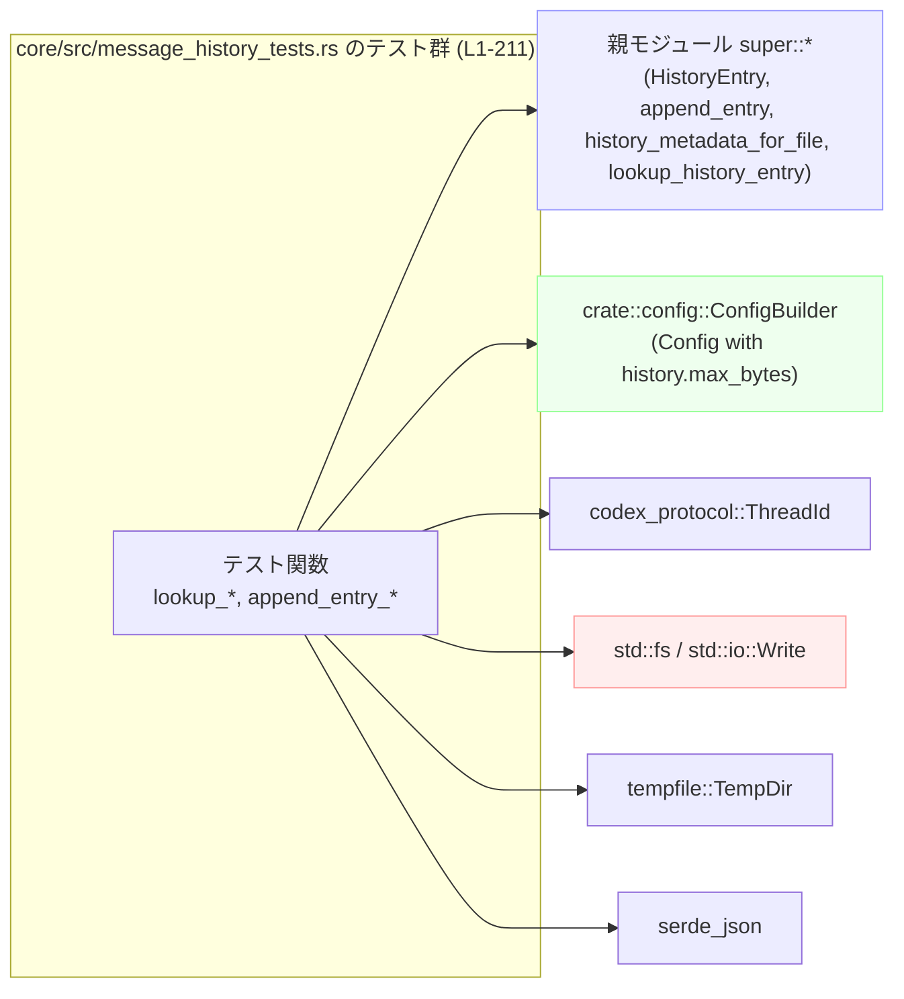
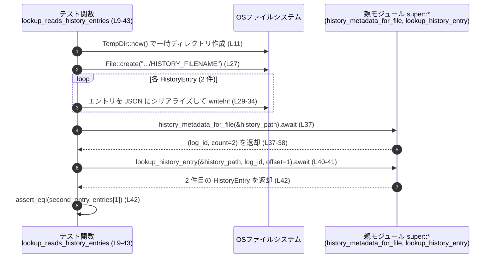
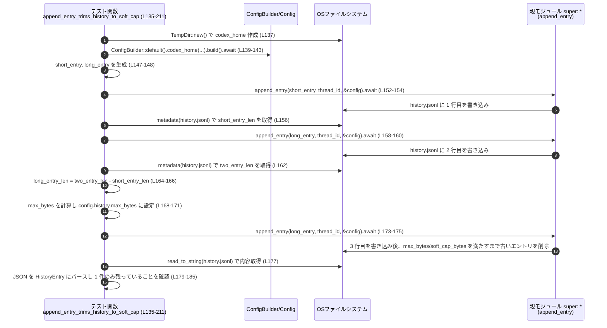

# core/src/message_history_tests.rs コード解説

## 0. ざっくり一言

`core/src/message_history_tests.rs` は、メッセージ履歴をファイルに保存・読み出しするモジュール（`super::*`）に対して、**履歴の読み出し**と**サイズ制限に基づくトリミング（削除）**の挙動を検証する非同期テスト群を定義しているファイルです（`core/src/message_history_tests.rs:L1-211`）。

---

## 1. このモジュールの役割

### 1.1 概要

このテストモジュールは、親モジュール（`super::*`）が提供する履歴関連 API のうち、以下の点を検証します。

- JSONL 形式の履歴ファイルから、メタデータ（件数・ログ ID）と個々のエントリを正しく読み出せること（`lookup_reads_history_entries`、`lookup_uses_stable_log_id_after_appends`、`core/src/message_history_tests.rs:L9-86`）。
- `Config` に設定された `history.max_bytes` と `HISTORY_SOFT_CAP_RATIO` に従って、履歴ファイルが**ハード上限**および**ソフト上限**までトリミングされること（`append_entry_trims_history_when_beyond_max_bytes`、`append_entry_trims_history_to_soft_cap`、`core/src/message_history_tests.rs:L88-211`）。

### 1.2 アーキテクチャ内での位置づけ

このファイルは「テスト側」から親モジュールの公開 API を呼び出して挙動を確認する位置付けです。依存関係は以下の通りです。

- 親モジュール（`super::*`）  
  - 型・定数: `HistoryEntry`, `HISTORY_FILENAME`, `HISTORY_SOFT_CAP_RATIO` など（いずれもこのチャンクには定義なし）。
  - 関数: `history_metadata_for_file`, `lookup_history_entry`, `append_entry`（実装はこのチャンクには現れません）。
- 設定関連: `crate::config::ConfigBuilder`（`core/src/message_history_tests.rs:L2, L92-96, L139-143`）
- 会話 ID: `codex_protocol::ThreadId`（`core/src/message_history_tests.rs:L3, L98, L145`）
- ファイルシステム: `std::fs::File`, `std::fs::OpenOptions`, `std::fs::metadata`, `std::fs::read_to_string`（`core/src/message_history_tests.rs:L5, L61-81, L109, L119, L132, L156, L162, L187`）
- 一時ディレクトリ: `tempfile::TempDir`（`core/src/message_history_tests.rs:L7, L11, L47, L90, L137`）
- JSON シリアライズ: `serde_json`（`core/src/message_history_tests.rs:L32, L65, L79, L123, L181`）

依存関係の概略図です。



> 親モジュール `MH` の実装はこのチャンクには現れないため、正確な型や内部処理は不明です。

### 1.3 設計上のポイント（テストとしての特徴）

- すべてのテストは `#[tokio::test]` + `async fn` で定義されており、**非同期 API**（`history_metadata_for_file`, `append_entry` など）をテストする前提になっています（`core/src/message_history_tests.rs:L9, L45, L88, L135`）。
- 実際のファイルシステムを使うが、`tempfile::TempDir` で一時ディレクトリを生成し、**各テスト間でファイルが干渉しない**ようにしています（`core/src/message_history_tests.rs:L11, L47, L90, L137`）。
- JSON Lines（1 行 1 JSON）形式の履歴ファイルを前提に、`serde_json::to_string` / `from_str` を使ってエントリをシリアライズ／デシリアライズしています（`core/src/message_history_tests.rs:L29-34, L62-67, L76-81, L121-124, L179-182`）。
- エラーハンドリングはテストらしく `.expect(...)` とアサーションで行い、条件を満たさない場合は即座に panic してテスト失敗とする方針です（`core/src/message_history_tests.rs` 全体に多数）。

---

## 2. 主要な機能一覧（このファイル内のテスト関数）

このファイルで定義されているテスト関数と役割の一覧です。

| 関数名 | 役割 / 検証内容 | 定義位置 |
|--------|----------------|----------|
| `lookup_reads_history_entries` | JSONL ファイルからのエントリ件数取得とオフセット指定での読み出しが正しいことを検証 | `core/src/message_history_tests.rs:L9-43` |
| `lookup_uses_stable_log_id_after_appends` | 履歴ファイルに追記があっても、以前取得した `log_id` で新しいエントリが参照できる（ログ ID が安定）ことを検証 | `core/src/message_history_tests.rs:L45-86` |
| `append_entry_trims_history_when_beyond_max_bytes` | `history.max_bytes` を超える追記時に、古いエントリが削除され、ファイルサイズが上限以下に収まることを検証 | `core/src/message_history_tests.rs:L88-133` |
| `append_entry_trims_history_to_soft_cap` | ハード上限だけでなく `HISTORY_SOFT_CAP_RATIO` に基づくソフト上限までより積極的にトリミングされることを検証 | `core/src/message_history_tests.rs:L135-211` |

---

## 3. 公開 API と詳細解説

このファイル自体は**テスト専用モジュール**であり、本番コードの公開 API を定義してはいません。ただし、テストを通じて以下の親モジュール API の挙動が読み取れます。

- `history_metadata_for_file`
- `lookup_history_entry`
- `append_entry`
- 定数 `HISTORY_FILENAME`, `HISTORY_SOFT_CAP_RATIO`
- 型 `HistoryEntry`

### 3.1 型・関数インベントリー

#### このファイル内で定義される関数

| 名前 | 種別 | 役割 / 用途 | 定義位置 |
|------|------|-------------|----------|
| `lookup_reads_history_entries` | 非同期テスト関数 | 手動で作成した履歴ファイルからメタデータと個別エントリを読む API を検証 | `core/src/message_history_tests.rs:L9-43` |
| `lookup_uses_stable_log_id_after_appends` | 非同期テスト関数 | ログ ID の安定性（追記後も同じ log_id で新エントリにアクセス可能）を検証 | `core/src/message_history_tests.rs:L45-86` |
| `append_entry_trims_history_when_beyond_max_bytes` | 非同期テスト関数 | ハードバイト上限 (`history.max_bytes`) に達したときのトリミング挙動を検証 | `core/src/message_history_tests.rs:L88-133` |
| `append_entry_trims_history_to_soft_cap` | 非同期テスト関数 | ソフトキャップ (`HISTORY_SOFT_CAP_RATIO` × max_bytes) に基づくより強いトリミング挙動を検証 | `core/src/message_history_tests.rs:L135-211` |

#### 親モジュール・他モジュールから利用している主なコンポーネント

> 型や正確なシグネチャはこのチャンクには現れないため、「用途」と「テストから読み取れる挙動」のみを記載します。

| 名前 | 種別 | 役割 / 用途 | このファイルでの使用箇所 |
|------|------|-------------|--------------------------|
| `HistoryEntry` | 構造体（`super::*` からインポート） | 履歴ファイルの 1 行（1 メッセージ）を表すレコード。テストでは `session_id`, `ts`, `text` フィールドを持つと仮定して JSON シリアライズ／デシリアライズを行っている | 作成・比較: `core/src/message_history_tests.rs:L14-25, L50-59`; パース: `L121-124, L179-182` |
| `HISTORY_FILENAME` | 定数（`super::*` からインポート） | 履歴ファイルのファイル名。テストでは `temp_dir.path().join(HISTORY_FILENAME)` でパスを生成 | `core/src/message_history_tests.rs:L12, L48` |
| `HISTORY_SOFT_CAP_RATIO` | 定数（`super::*` からインポート） | `history.max_bytes` に対するソフトキャップ比率。`soft_cap_bytes = (max_bytes as f64) * HISTORY_SOFT_CAP_RATIO` として使用 | `core/src/message_history_tests.rs:L195-197` |
| `history_metadata_for_file` | 非同期関数（`super::*`） | 履歴ファイルのメタデータ `(log_id, count)` を返す。テストから、少なくとも「エントリ件数」を返し、`log_id` は後続の `lookup_history_entry` で使用される識別子であることが読み取れる | 呼び出し: `core/src/message_history_tests.rs:L37, L69` |
| `lookup_history_entry` | 非同期関数（`super::*`） | `(path, log_id, offset)` を渡すと、指定オフセットの `HistoryEntry` を返す。テストから、`offset` は 0 ベースであり、返されるエントリが `HistoryEntry` と比較できることが分かる | 呼び出し: `core/src/message_history_tests.rs:L40-42, L83-85` |
| `append_entry` | 非同期関数（`super::*`） | 履歴ファイル（`Config` の `codex_home` 配下の `"history.jsonl"`）に新しいエントリを追記し、必要に応じて古いエントリを削除してサイズ制限を守る。テストから、トリミングの挙動が読み取れる | 呼び出し: `core/src/message_history_tests.rs:L105-107, L115-117, L152-154, L158-160, L173-175` |
| `ConfigBuilder` | 構造体（`crate::config`） | `codex_home` などを設定し、`.build().await` で `Config` を構築するビルダー。テストでは `history.max_bytes` を直接書き換えている | 使用: `core/src/message_history_tests.rs:L92-96, L139-143, L112-113, L168-171, L188-191` |
| `ThreadId` | 構造体（`codex_protocol`） | 会話（スレッド）の識別子。`ThreadId::new()` で新規作成し、`append_entry` に渡している | 使用: `core/src/message_history_tests.rs:L3, L98, L145` |

---

### 3.2 関数詳細（テスト関数およびテスト対象 API）

#### 3.2.1 `lookup_reads_history_entries()`

```rust
#[tokio::test]
async fn lookup_reads_history_entries() { /* ... */ }
```

**概要**

手動で JSONL 履歴ファイルを作成し、そのファイルに対して  

- `history_metadata_for_file` が正しい件数を返すこと  
- `lookup_history_entry` がオフセット指定で期待した `HistoryEntry` を返すこと  

を検証します（`core/src/message_history_tests.rs:L9-43`）。

**引数**

- なし（テスト関数）

**戻り値**

- `impl Future<Output = ()>`（テスト関数のため、戻り値は使用しません）

**内部処理の流れ**

1. 一時ディレクトリを作成し、`HISTORY_FILENAME` を結合して履歴ファイルパスを決定（`core/src/message_history_tests.rs:L11-12`）。
2. `HistoryEntry` を 2 件作成し、`Vec<HistoryEntry>` に格納（`core/src/message_history_tests.rs:L14-25`）。
3. `std::fs::File::create` でファイルを作成し、`serde_json::to_string` + `writeln!` により 1 行 1 エントリで JSON を書き込む（`core/src/message_history_tests.rs:L27-35`）。
4. `history_metadata_for_file(&history_path).await` を呼び、返ってきた `count` が `entries.len()` と等しいことを確認（`core/src/message_history_tests.rs:L37-38`）。
5. `lookup_history_entry(&history_path, log_id, 1)` を呼び、返ってきたエントリが `entries[1]`（2 件目）と一致することを確認（`core/src/message_history_tests.rs:L40-42`）。

**Examples（使用例）**

このテスト自体が使用例になっています。履歴ファイルを読み出すコードフローの最小例を抽出すると以下のようになります。

```rust
// 履歴ファイルのメタデータを取得する                          // core/src/message_history_tests.rs:L37
let (log_id, count) = history_metadata_for_file(&history_path).await;

// 特定オフセットのエントリを取得する                           // core/src/message_history_tests.rs:L40-42
let entry = lookup_history_entry(&history_path, log_id, 1)
    .expect("fetch history entry");
```

**Errors / Panics**

- 本テスト内では、ファイル作成・書き込み・シリアライズ失敗時に `.expect(...)` により panic します（`core/src/message_history_tests.rs:L11, L27, L32-34`）。
- `history_metadata_for_file` と `lookup_history_entry` は `.await` 後に直接使用され、エラー型は `.expect` でメッセージに変換されています。テストからは「`Result` を返す（もしくは panic しうる）」以上の詳細は分かりません。

**Edge cases（エッジケース）**

- 空ファイルや壊れた JSON 行などのケースはこのテストでは扱っていません（このチャンクには現れない）。
- `offset = 1` （2 件目）という境界に近い正のオフセットはテストされていますが、`offset = 0` や範囲外オフセットの挙動は不明です。

**使用上の注意点**

- `history_metadata_for_file` と `lookup_history_entry` を組み合わせる場合、**同じパス**と**同じ `log_id`** を使う前提になっています（`core/src/message_history_tests.rs:L37-41`）。
- このテストからは、「`log_id` を取得した後にファイルを変更しない」ケースでの使用例のみが分かります。変更されるケースは次のテストで検証されています。

---

#### 3.2.2 `lookup_uses_stable_log_id_after_appends()`

**概要**

初期状態の履歴ファイルから `log_id` を取得した後、ファイルにエントリを追記しても、**同じ `log_id`** とオフセットを用いて新しいエントリを取得できることを検証します（`core/src/message_history_tests.rs:L45-86`）。

**引数・戻り値**

- いずれもテスト関数のため省略（`async fn`、`#[tokio::test]`）。

**内部処理の流れ**

1. 一時ディレクトリと履歴ファイルパスを用意（`core/src/message_history_tests.rs:L47-48`）。
2. 初期エントリ `initial` と追記用エントリ `appended` を `HistoryEntry` として構築（`core/src/message_history_tests.rs:L50-59`）。
3. `initial` のみを JSONL としてファイルに書き込み（`core/src/message_history_tests.rs:L61-67`）。
4. `history_metadata_for_file(&history_path).await` で `(log_id, count)` を取得し、`count == 1` を確認（`core/src/message_history_tests.rs:L69-70`）。
5. `std::fs::OpenOptions::new().append(true)` でファイルを追記モードで開き、`appended` を 2 行目として書き込む（`core/src/message_history_tests.rs:L72-81`）。
6. `lookup_history_entry(&history_path, log_id, 1)` で 2 件目（`offset=1`）を取得し、`appended` と一致することを確認（`core/src/message_history_tests.rs:L83-85`）。

**Errors / Panics**

- ファイル I/O やシリアライズに失敗した場合は `.expect(...)` で panic します（`core/src/message_history_tests.rs:L61-67, L72-81`）。
- `lookup_history_entry` がエラーを返した場合も `.expect("lookup appended history entry")` で panic します（`core/src/message_history_tests.rs:L83-84`）。

**Edge cases**

- `log_id` はファイルの追記後でも有効であることが前提となっていますが、「ログローテーション」や「ファイル削除」などで `log_id` が無効になるケースは、このテストからは分かりません。
- 複数回の追記や大量エントリのケースはこのテストでは扱っていません。

**使用上の注意点**

- このテストから、`log_id` は「**ファイルのバージョンではなく、ファイル（ログ）の論理 ID**」として扱われていることが読み取れます。ファイルに追記があっても `log_id` を再取得し直す必要はない設計と想定されます（テストからの推測）。

---

#### 3.2.3 `append_entry_trims_history_when_beyond_max_bytes()`

**概要**

`Config` の `history.max_bytes` を超える追記を行ったとき、**古いエントリが削除され、ファイルサイズが上限以下になる**ことを確認するテストです（`core/src/message_history_tests.rs:L88-133`）。

**内部処理の流れ**

1. 一時ディレクトリを `codex_home` として取得（`core/src/message_history_tests.rs:L90`）。
2. `ConfigBuilder::default().codex_home(...).build().await` で `Config` を構築（`core/src/message_history_tests.rs:L92-96`）。
3. `ThreadId::new()` で会話 ID を生成（`core/src/message_history_tests.rs:L98`）。
4. 200 文字の短い文字列 2 つ（`entry_one`, `entry_two`）を作成（`core/src/message_history_tests.rs:L100-101`）。
5. `codex_home/path` に `"history.jsonl"` を結合して履歴ファイルパスを決定（`core/src/message_history_tests.rs:L103`）。
6. `append_entry(&entry_one, &conversation_id, &config).await` で 1 件目を追記（`core/src/message_history_tests.rs:L105-107`）。
7. ファイルサイズ `first_len` を取得し、`limit_bytes = first_len + 10` を計算（`core/src/message_history_tests.rs:L109-110`）。
8. `config.history.max_bytes = Some(limit_bytes as usize)` に設定（`core/src/message_history_tests.rs:L112-113`）。
9. `append_entry(&entry_two, &conversation_id, &config).await` で 2 件目を追記（`core/src/message_history_tests.rs:L115-117`）。
10. ファイルを読み取り、各行を `HistoryEntry` にパースして `Vec<HistoryEntry>` を得る（`core/src/message_history_tests.rs:L119-124`）。
11. エントリ数が 1 であること、唯一のエントリの `text` が `entry_two` であること、ファイルサイズが `limit_bytes` 以下であることをアサート（`core/src/message_history_tests.rs:L126-132`）。

**テストから読み取れる `append_entry` の契約**

- 2 件分のサイズが `limit_bytes` を超える状況で 2 件目を追加すると、**新しいエントリを残し、古いエントリを削除**する（`core/src/message_history_tests.rs:L126-131`）。
- トリミング後のファイルサイズは `history.max_bytes`（ここでは `limit_bytes`）以下である（`core/src/message_history_tests.rs:L132`）。

**Edge cases**

- `history.max_bytes` が `None` の場合の挙動は、このテストからは不明です。
- 1 件分のサイズ自体が `max_bytes` を超えるケースはテストされていません。

**使用上の注意点**

- テストでは `Config` を生成したあとに `config.history.max_bytes` を**可変参照で後から変更**しています（`core/src/message_history_tests.rs:L112-113`）。`append_entry` は呼び出し時点の `Config` の値に従う設計であることが前提になります。
- `history.jsonl` というファイル名はこのテストでハードコードされており（`core/src/message_history_tests.rs:L103`）、親モジュール側の `HISTORY_FILENAME` と一致している必要がありますが、その紐づけはこのチャンクには現れません。

---

#### 3.2.4 `append_entry_trims_history_to_soft_cap()`

**概要**

`max_bytes` を超える追記時に、**ハードキャップ（max_bytes）だけでなく、ソフトキャップ (`HISTORY_SOFT_CAP_RATIO * max_bytes`) を満たすまで、より多くの古いエントリを削除する**挙動を検証するテストです（`core/src/message_history_tests.rs:L135-211`）。

**内部処理の流れ**

1. `codex_home` と `Config`、`conversation_id` を前テストと同様に準備（`core/src/message_history_tests.rs:L137-145`）。
2. `short_entry`（200 文字）と `long_entry`（400 文字）を作成（`core/src/message_history_tests.rs:L147-148`）。
3. `append_entry(short_entry)` を呼び、1 件目を書き込む（`core/src/message_history_tests.rs:L152-154`）。
4. 1 件目時点のファイルサイズ `short_entry_len` を取得（`core/src/message_history_tests.rs:L156`）。
5. `append_entry(long_entry)` を呼び、2 件目を書き込む（`core/src/message_history_tests.rs:L158-160`）。
6. 2 件目まで書き込んだ時点のファイルサイズ `two_entry_len` を取得（`core/src/message_history_tests.rs:L162`）。
7. `long_entry_len = two_entry_len - short_entry_len` を計算し、長いエントリ 1 件あたりのおおよそのサイズを得る（`core/src/message_history_tests.rs:L164-166`）。
8. `max_bytes = 2 * long_entry_len + short_entry_len / 2` に設定し、`config.history.max_bytes` に反映（`core/src/message_history_tests.rs:L168-171`）。
9. 3 件目として再度 `append_entry(long_entry)` を呼び出す（`core/src/message_history_tests.rs:L173-175`）。
10. ファイルから `HistoryEntry` を読み出し、エントリ数が 1 で、唯一のエントリの `text` が `long_entry` であることを確認（`core/src/message_history_tests.rs:L177-185`）。
11. 切り詰め後のファイルサイズ `pruned_len` と `max_bytes` を比較し、`pruned_len <= max_bytes` を確認（`core/src/message_history_tests.rs:L187-193`）。
12. `soft_cap_bytes = floor(max_bytes * HISTORY_SOFT_CAP_RATIO).clamp(1, max_bytes)` を計算（`core/src/message_history_tests.rs:L195-197`）。
13. `len_without_first = 2 * long_entry_len`（最初の短いエントリだけを削除した場合のサイズ）を定義し、これが `max_bytes` 以下である一方で `soft_cap_bytes` より大きいことを確認（`core/src/message_history_tests.rs:L198-207`）。
14. 実際の `pruned_len` が `long_entry_len`（長いエントリ 1 件ぶん）であり、`soft_cap_bytes.max(long_entry_len)` 以内であることを確認（`core/src/message_history_tests.rs:L209-210`）。

**テストから読み取れる `append_entry` の契約**

- `max_bytes` を超えた場合、単に「超過分だけ削る」のではなく、**ソフトキャップ**までサイズを落とすように、複数の古いエントリを削除する。
- 「最初のエントリを削除するだけでは `max_bytes` は満たされるが `soft_cap_bytes` は満たされない」状況では、さらにエントリを削除し、最終的に**長いエントリ 1 件だけ残る**ようなトリミングを行う（`core/src/message_history_tests.rs:L200-207, L209`）。
- トリミング後のサイズは、少なくとも長いエントリ 1 件ぶんのサイズは確保されるよう設計されている（`pruned_len <= soft_cap_bytes.max(long_entry_len)`、`core/src/message_history_tests.rs:L210`）。

**Edge cases**

- `HISTORY_SOFT_CAP_RATIO` の具体的な値はこのチャンクには現れませんが、テストは `0 < HISTORY_SOFT_CAP_RATIO <= 1` かつ、「1 よりかなり小さい値」であることを前提にしていると考えられます（ただし、正確な値は不明）。
- すべてのエントリが 1 件分のサイズより大きく、ソフトキャップがそれより小さいような極端な設定の挙動は不明です。

**使用上の注意点**

- `max_bytes` と `HISTORY_SOFT_CAP_RATIO` の組み合わせによっては、**一度トリミングが走ると多数の古い履歴が削除される**可能性があります。このテストは、そうした「積極的な削除」ポリシーを確認するものになっています。
- 長期的な履歴保存を重視する場合、`HISTORY_SOFT_CAP_RATIO` の値や `history.max_bytes` の設定値に注意が必要です（値自体は別ファイルに定義されており、このチャンクからは参照できません）。

---

#### 3.2.5 `history_metadata_for_file(path)`（テスト対象 API）

**概要**

履歴ファイルのパスを受け取り、少なくとも `(log_id, count)` という 2 要素タプルを返す非同期関数です。テストから、`count` が履歴エントリ件数に一致し、`log_id` が `lookup_history_entry` の呼び出しに使用される識別子であることが読み取れます（`core/src/message_history_tests.rs:L37-38, L69-70`）。

**引数 / 戻り値**

- 型定義はこのチャンクには現れませんが、テスト上は以下のように扱われています。
  - 引数: ファイルパス参照（`&history_path`、`history_path` は `PathBuf`）（`core/src/message_history_tests.rs:L37, L69`）
  - 戻り値: `(log_id, count)` タプル  
    - `log_id`: 型不明だが、`lookup_history_entry` の第 2 引数として使用（`core/src/message_history_tests.rs:L40, L83`）。  
    - `count`: 整数型であり、`entries.len()` やリテラル `1` と比較されている（`core/src/message_history_tests.rs:L38, L70`）。

**Errors / Panics**

- テストでは `.await` の結果を直接タプルに束縛しており、`Result` かどうかは不明です。呼び出し側で `.expect` は使用していないため、エラー発生時の挙動はこのチャンクからは分かりません。

**使用上の注意点**

- このテストからは、「呼び出し前にファイルが存在し、正しい JSONL フォーマットである」前提で使用されていることが分かります。存在しないファイルや破損したファイルでどう振る舞うかは不明です。

---

#### 3.2.6 `lookup_history_entry(path, log_id, offset)`（テスト対象 API）

**概要**

履歴ファイルパス・ログ ID・オフセットを受け取り、履歴エントリを 1 件返す関数です。テストから、`HistoryEntry` を返し、オフセットは 0 ベースであると読み取れます（`core/src/message_history_tests.rs:L40-42, L83-85`）。

**引数**

| 引数名 | 型（推定） | 説明 |
|--------|-----------|------|
| `path` | `&Path` 相当 | 履歴ファイルのパス（`&PathBuf` から借用で渡される） |
| `log_id` | 型不明 | `history_metadata_for_file` から返されたログ識別子 |
| `offset` | 整数型 | 返すエントリの 0 ベースオフセット（テストでは 1 のみ使用） |

**戻り値**

- `Result<HistoryEntry, E>` のようなエラー付き戻り値であると推測されますが、型 `E` はこのチャンクからは不明です。テストでは `lookup_history_entry(...).expect("...")` として使用されています（`core/src/message_history_tests.rs:L40-41, L83-84`）。

**Edge cases**

- 範囲外の `offset`（負の値や、`count` 以上）の挙動はテストされていません。
- `log_id` が古くなっている（ファイルのローテーションなど）ケースについても、このチャンクからは不明です。

**使用上の注意点**

- テストでは常に `log_id` を `history_metadata_for_file` から取得した直後、もしくは追記後に再利用する形で使用しています。`log_id` を長期間保存して再利用することがサポートされているかどうかは、親モジュールの実装を確認する必要があります。

---

#### 3.2.7 `append_entry(text, thread_id, config)`（テスト対象 API）

**概要**

会話 ID とテキスト、および設定を受け取り、履歴ファイルに新しいエントリを追記する非同期関数です。テストから、`history.max_bytes` と `HISTORY_SOFT_CAP_RATIO` に基づいて古いエントリを削除するトリミング処理を含むことが読み取れます（`core/src/message_history_tests.rs:L105-107, L115-117, L152-154, L158-160, L173-175`）。

**引数（テストから推定される使い方）**

| 引数名 | 型（推定） | 説明 |
|--------|-----------|------|
| `text` | `&str` 相当 | 履歴に保存するメッセージ本文（`String` から借用） |
| `thread_id` | `&ThreadId` | 会話スレッドの ID |
| `config` | `&Config`（型名はこのチャンクには出てこない） | `ConfigBuilder` から構築された設定。`config.history.max_bytes` などを参照 |

**戻り値**

- 非同期に `Result<(), E>` などを返すことが推測されますが、エラー型 `E` は不明です。テストでは `.await.expect("write ... entry")` として使用されています（`core/src/message_history_tests.rs:L105-107, L115-117, L152-154, L158-160, L173-175`）。

**内部処理の流れ（テストから推測される外部挙動）**

1. `config` の `codex_home` 配下に `"history.jsonl"` を作成／オープンし、エントリを JSONL 形式で追記する。
2. 追記後のファイルサイズが `history.max_bytes` を超える場合、最古のエントリから順に削除してサイズを削減する。
3. サイズ削減の目標は
   - **ハードキャップ**: `history.max_bytes`
   - **ソフトキャップ**: `HISTORY_SOFT_CAP_RATIO * history.max_bytes`
   であり、ソフトキャップを満たすまでより積極的にトリミングを行う（`core/src/message_history_tests.rs:L195-207`）。

※ 上記 1〜3 は、すべてテスト結果から読み取れる**外部挙動**であり、内部実装の詳細（アルゴリズムやデータ構造）はこのチャンクには現れません。

**Errors / Panics**

- テストでは `.expect(...)` によってエラーを panic に変換しているため、関数自体がどのようなエラー型を返すかは不明です。

**Edge cases**

- `history.max_bytes` が設定されていない (`None`) 場合のトリミング有無は不明です。
- `max_bytes` が 1 行分のサイズよりも小さい場合、「1 行も残せない」状況でどう振る舞うかは、このチャンクからは分かりません。

**使用上の注意点**

- `Config` を生成した後で `config.history.max_bytes` を変更しても、その変更が `append_entry` に反映される前提で設計されています（テストの書き方からの推測、`core/src/message_history_tests.rs:L112-113, L168-171`）。
- ファイル I/O は（少なくともテストから見る限り）`history.jsonl` という固定ファイル名を使っています。`codex_home` を変更すると履歴の保存先も変わる設計であると読み取れます。

---

### 3.3 その他の関数・メソッド

このファイル内では、以下の補助的な API も使用されていますが、いずれも標準的な用途です。

| 関数名 / メソッド | 役割（1 行） | 出現箇所 |
|-------------------|--------------|----------|
| `TempDir::new` | 一時ディレクトリを作成し、テスト終了時に自動削除されるパスを提供 | `core/src/message_history_tests.rs:L11, L47, L90, L137` |
| `ConfigBuilder::default().codex_home(...).build().await` | 実行時設定 `Config` を構築するビルダー。非同期に読み込みを行う | `core/src/message_history_tests.rs:L92-96, L139-143` |
| `ThreadId::new` | 新規スレッド ID を生成 | `core/src/message_history_tests.rs:L98, L145` |

---

## 4. データフロー

### 4.1 代表的シナリオ: 履歴ファイルの読み出し（`lookup_reads_history_entries`, L9-43）

このシナリオでは、テストが手動で JSONL ファイルを作成し、その後 `history_metadata_for_file` と `lookup_history_entry` を使ってデータを取得する流れを示します。



### 4.2 代表的シナリオ: append_entry によるトリミング（`append_entry_trims_history_to_soft_cap`, L135-211）



> `MH` の内部でどのようにエントリ削除やファイル再書き込みを行っているかは、このチャンクには現れていません。

---

## 5. 使い方（How to Use）

このファイルはテストですが、アプリケーションコードから履歴 API を利用する際の参考パターンになります。

### 5.1 基本的な使用方法（append_entry）

テストから抽出した、履歴への追記の基本フロー例です。

```rust
use crate::config::ConfigBuilder;                  // 設定ビルダー
use codex_protocol::ThreadId;                      // 会話ID
use tempfile::TempDir;                             // 一時ディレクトリ（実アプリでは任意のパス）

#[tokio::main]
async fn main() -> anyhow::Result<()> {
    // codex_home を準備する                                      // core/src/message_history_tests.rs:L90, L137
    let codex_home = TempDir::new()?;             
    // Config を構築する                                          // core/src/message_history_tests.rs:L92-96
    let mut config = ConfigBuilder::default()
        .codex_home(codex_home.path().to_path_buf())
        .build()
        .await?;

    // 必要であれば最大バイト数を設定する                         // core/src/message_history_tests.rs:L112-113
    config.history.max_bytes = Some(10_000);

    // 会話IDを用意する                                           // core/src/message_history_tests.rs:L98, L145
    let conversation_id = ThreadId::new();

    // 履歴に1件追記する                                           // core/src/message_history_tests.rs:L105-107
    append_entry("hello", &conversation_id, &config).await?;

    Ok(())
}
```

### 5.2 履歴の読み出しパターン

テストに基づく、履歴の読み出しパターンです。

```rust
// パスは Config の codex_home から求める                       // core/src/message_history_tests.rs:L103, L150
let history_path = codex_home.path().join("history.jsonl");

// メタデータを取得して件数と log_id を知る                     // core/src/message_history_tests.rs:L37
let (log_id, count) = history_metadata_for_file(&history_path).await;

// 0..count の範囲でオフセットを指定して個別エントリを取得
for offset in 0..count {
    let entry = lookup_history_entry(&history_path, log_id, offset)
        .expect("failed to lookup history entry");
    println!("#{}: {}", offset, entry.text);
}
```

### 5.3 よくある使用パターンと注意点

- **サイズ制限付き履歴**
  - テストのように `config.history.max_bytes` に値を設定しておくと、`append_entry` が自動的に古い履歴を削除してくれる設計になっています（`core/src/message_history_tests.rs:L112-113, L168-171`）。
- **パスの決定**
  - テストでは `HISTORY_FILENAME` と `"history.jsonl"` の両方が使用されています（`core/src/message_history_tests.rs:L12, L48, L103, L150`）。アプリケーション側では、親モジュールが期待するファイル名（`HISTORY_FILENAME`）を一貫して使う必要があります。

### 5.4 よくある間違い（テストから推測される注意点）

```rust
// 誤りの可能性: Config を生成した後で history.max_bytes を設定していない
let config = ConfigBuilder::default()
    .codex_home(codex_home.path().to_path_buf())
    .build()
    .await?;
// config.history.max_bytes = None のまま append_entry を呼ぶと
// サイズ制限が効かない可能性がある（挙動はこのチャンクからは不明）

// 正しいパターン（テストが行っているもの）:
let mut config = /* 上と同様に生成 */;
config.history.max_bytes = Some(10_000);  // 上限を設定
append_entry("...", &conversation_id, &config).await?;
```

> `max_bytes` 未設定時の挙動はこのチャンクからは分からないため、サイズ制限を期待する場合は必ず設定しておく必要があります。

---

## 6. 変更の仕方（How to Modify）

### 6.1 新しいテストケースを追加する場合

このファイルはテスト専用のため、新機能や新しい挙動を追加したい場合は、まず**親モジュール（`super::*`）側の実装**を変更し、それに対応するテストをこのファイルに追加する形になります。

典型的な手順:

1. 親モジュールの API 仕様を確認し、新しい挙動（例: `max_bytes` が極端に小さい場合のエラー処理など）を設計する。
2. このファイルに新しい `#[tokio::test]` 関数を追加し、
   - `TempDir` と `ConfigBuilder` で環境を準備（`core/src/message_history_tests.rs:L90-96, L137-143` を参考）。
   - 必要なエントリを `append_entry` や手動 JSONL 書き込みで作成。
   - 期待する挙動を `assert_eq!` や `assert!` で検証。
3. テストが通るように親モジュールの実装を調整する。

### 6.2 既存のテストを変更する場合の注意点

- **行動契約の変更に注意**  
  例えば、`append_entry_trims_history_to_soft_cap` は現在、「ソフトキャップまで積極的に削る」という挙動を前提にしています（`core/src/message_history_tests.rs:L195-210`）。ここを変更すると、トリミングポリシー自体の仕様変更になるため、親モジュールの利用者への影響が大きくなります。
- **`HISTORY_FILENAME` の変更**  
  ファイル名を変更する場合、このテストファイル内で `"history.jsonl"` とハードコードしている部分（`core/src/message_history_tests.rs:L103, L150`）との整合性も確認する必要があります。
- **非同期 API のシグネチャ変更**  
  `append_entry` や `history_metadata_for_file` の戻り値型を変えると、`.await` や `.expect(...)` の書き方も変わる可能性があります。このファイル内の呼び出し箇所（`core/src/message_history_tests.rs:L37, L69, L105-107, L115-117, L152-154, L158-160, L173-175`）を一括で確認する必要があります。

---

## 7. 関連ファイル

このテストモジュールと密接に関係するファイル・モジュールです（パスはこのチャンクからは正確には分からないため、分かる範囲で記述します）。

| パス / モジュール | 役割 / 関係 |
|-------------------|------------|
| 親モジュール `super::*`（ファイル名はこのチャンクには現れない） | `HistoryEntry`, `HISTORY_FILENAME`, `HISTORY_SOFT_CAP_RATIO`, `history_metadata_for_file`, `lookup_history_entry`, `append_entry` など、本体の履歴管理ロジックを提供する |
| `crate::config::ConfigBuilder` を含むモジュール | `Config` の構築と、`history.max_bytes` や `codex_home` といった設定値を提供する |
| `codex_protocol::ThreadId` を定義しているモジュール | 会話スレッド ID の生成と管理を行い、履歴エントリと会話を紐付けるために使用される |
| `tempfile` クレート | テスト用に一時ディレクトリ／ファイルを提供する |
| `serde_json` | 履歴エントリを JSON 形式でシリアライズ／デシリアライズするために使用される |

---

## 8. 補足: バグ・セキュリティ・エッジケース・性能など

### 8.1 バグになりうる点・セキュリティ観点（このチャンクから分かる範囲）

- このファイルはテスト用であり、`TempDir` を用いて一時ディレクトリを利用しているため、本番環境のセキュリティリスクはほぼ含まれていません（`core/src/message_history_tests.rs:L11, L47, L90, L137`）。
- JSON パースやファイル I/O に失敗した場合は `.expect(...)` で即座に panic してテスト失敗となるため、静かに失敗状態を見逃すというタイプのバグは起こりにくい設計です。

### 8.2 契約とエッジケースの整理（テストが保証していること）

- `history_metadata_for_file` は、正常な JSONL ファイルに対して件数を正しく返す（`core/src/message_history_tests.rs:L37-38`）。
- `lookup_history_entry` は
  - 0 ベースの `offset` を受け取り（`offset = 1` のケースがテストされている）、
  - 対応する `HistoryEntry` を返す（`core/src/message_history_tests.rs:L40-42, L83-85`）。
- `append_entry` は
  - `history.max_bytes` を超える場合に古いエントリを削除し、
  - ソフトキャップ `HISTORY_SOFT_CAP_RATIO * max_bytes` までサイズを減らすポリシーを持つ（`core/src/message_history_tests.rs:L195-210`）。

これら以外のエッジケース（壊れた JSON、非常に小さい `max_bytes`、存在しないファイルなど）は、このチャンクには現れないため不明です。

### 8.3 性能とスケーラビリティ（テストから見える範囲）

- テストでは数件のエントリしか扱っておらず、大規模な履歴ファイルに対する性能やトリミングコストはこのチャンクからは判断できません。
- ただし、テストコード側は `std::fs::read_to_string` や `metadata` 等の**同期 I/O** を `#[tokio::test]` の中で呼び出しています（`core/src/message_history_tests.rs:L119, L132, L156, L162, L187`）。これはテストでのみ使われているため問題になる可能性は低いですが、本番コード側で同様の同期 I/O を多用する場合は非同期ランタイム上のブロッキングに注意が必要です。

### 8.4 観測性（ログ・メトリクス）

- このテストファイルには、ログ出力やメトリクスに関するコードは含まれていません（このチャンクには現れない）。
- 親モジュール側でのログ出力や統計情報の収集の有無は、別ファイルを確認する必要があります。

---

このチャンクから読み取れる範囲では以上です。内部実装（親モジュール）については、対応するソースファイルのコードを併せて確認する必要があります。
