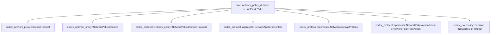
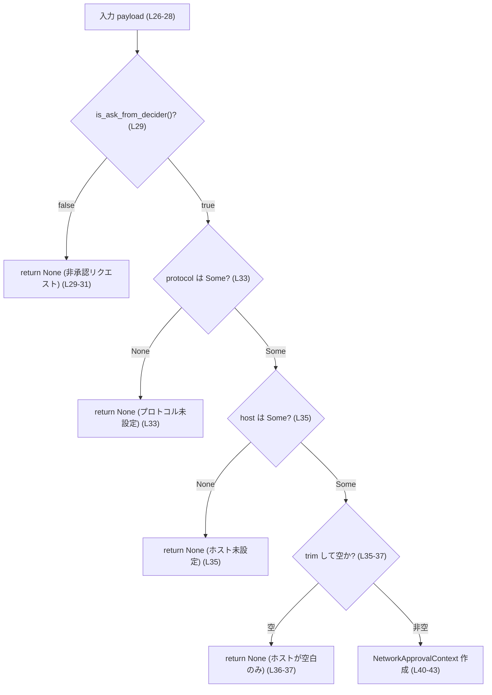
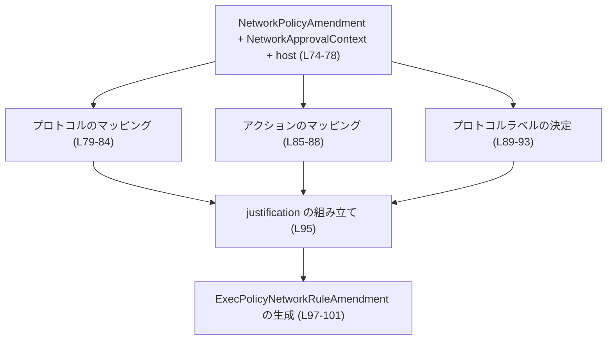
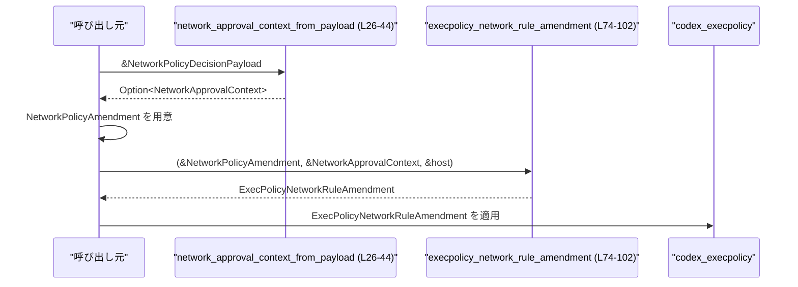
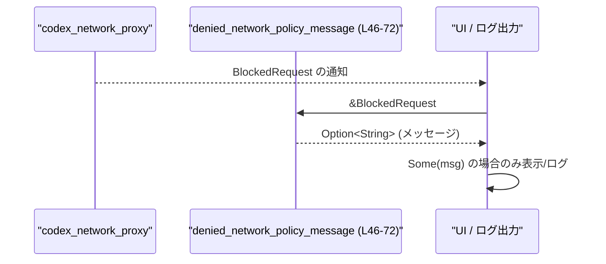

# core/src/network_policy_decision.rs

## 0. ざっくり一言

ネットワークアクセスに関するポリシー決定情報を、  
「プロキシ側の BlockedRequest / 決定ペイロード」と「実行ポリシー（execpolicy）」の表現のあいだで **変換・整形するユーティリティ**をまとめたモジュールです。

---

## 1. このモジュールの役割

### 1.1 概要

- このモジュールは、ネットワークポリシー決定に関する **文字列やペイロードを安全に解釈し、型付きのコンテキストや説明文、execpolicy 用ルール** に変換するために存在します。
- 主な機能は:
  - `NetworkPolicyDecisionPayload` から `NetworkApprovalContext` を生成する前処理  
  - `BlockedRequest` からユーザに見せるエラーメッセージ文を生成する処理  
  - `NetworkPolicyAmendment` / `NetworkApprovalContext` から execpolicy 用の `ExecPolicyNetworkRuleAmendment` を生成する処理  
  です（core/src/network_policy_decision.rs:L26-44, L46-72, L74-102）。

### 1.2 アーキテクチャ内での位置づけ

このモジュールは、複数の crate にまたがる型の変換ハブとして機能しています。

- 入力側
  - `codex_network_proxy::BlockedRequest`（core/src/network_policy_decision.rs:L3）
  - `codex_protocol::network_policy::NetworkPolicyDecisionPayload`（L9）
  - `codex_protocol::approvals::{NetworkApprovalContext, NetworkApprovalProtocol, NetworkPolicyAmendment, NetworkPolicyRuleAction}`（L5-L8）
- 出力側
  - `codex_network_proxy::NetworkPolicyDecision`（L4）
  - `ExecPolicyNetworkRuleAmendment`（L11-L16）
  - `String` ベースの説明メッセージ（L46-L72）

依存関係の概要は次の通りです。



- いずれの外部型の定義も、このファイル内には存在しません（`BlockedRequest` や `NetworkPolicyDecisionPayload` などの定義は別 crate にあります）。

### 1.3 設計上のポイント

- **責務の分割**
  - 文字列 `"deny"`, `"ask"` を `NetworkPolicyDecision` に変換する小さなヘルパー関数 `parse_network_policy_decision` を切り出し（L18-24）、他の処理から再利用しています（L46-51）。
  - execpolicy 用の変換結果は独自の構造体 `ExecPolicyNetworkRuleAmendment` にまとめています（L11-16）。
- **入力バリデーション**
  - `NetworkPolicyDecisionPayload` からコンテキストを生成する際に、  
    - decider からの「ask」でない場合  
    - プロトコルが未指定  
    - ホストが空または空白のみ  
    の場合は `None` を返して無効扱いとすることで、防御的な設計になっています（L26-38）。
  - `BlockedRequest` についても、決定が `"deny"` でない場合はメッセージ自体を生成しません（L46-53）。
- **エラーハンドリング方針**
  - いずれの関数も panic を起こさず、**不正・不足入力は `Option::None` として呼び出し元に返す**方針です（L26-44, L46-72）。
- **状態を持たない**
  - グローバル状態や内部キャッシュはなく、すべての関数は純粋関数（入力 → 出力）として実装されています。
  - そのため、スレッド安全性（並行呼び出し）について特別な注意は不要です。

---

## 2. 主要な機能一覧

- NetworkPolicyDecision 文字列のパース: `"deny"`, `"ask"` を `NetworkPolicyDecision` に変換します（L18-24）。
- NetworkApprovalContext 生成: `NetworkPolicyDecisionPayload` から、検証済みの `NetworkApprovalContext` を生成します（L26-44）。
- ブロック理由メッセージ生成: `BlockedRequest` から、人間向けのブロックメッセージ文字列を生成します（L46-72）。
- Execpolicy 用ルール変換: `NetworkPolicyAmendment` と `NetworkApprovalContext` から `ExecPolicyNetworkRuleAmendment` を生成します（L74-102）。

---

## 3. 公開 API と詳細解説

### 3.1 型一覧（構造体・列挙体など）

このファイル内で定義されている型は 1 つです。

| 名前 | 種別 | 役割 / 用途 | 定義位置 |
|------|------|-------------|----------|
| `ExecPolicyNetworkRuleAmendment` | 構造体 | execpolicy に渡すネットワークルール（プロトコル・決定・説明文）をまとめた内部用データ | `core/src/network_policy_decision.rs:L11-16` |

フィールドの詳細:

- `protocol: ExecPolicyNetworkRuleProtocol`  
  execpolicy 側のネットワークプロトコル種別（HTTP, HTTPS, SOCKS5 など）を表します（L13）。
- `decision: ExecPolicyDecision`  
  execpolicy 側の決定（Allow / Forbidden など）を表します（L14）。
- `justification: String`  
  ルールの人間向け説明文（例: `"Allow https_connect access to example.com"`）です（L15, L95）。

#### コンポーネントインベントリー（関数）

このファイル内の関数一覧です。

| 名前 | 可視性 | 役割 / 用途 | 定義位置 |
|------|--------|-------------|----------|
| `parse_network_policy_decision` | 非公開 (`fn`) | `"deny"`, `"ask"` という文字列を `NetworkPolicyDecision` に変換する小ヘルパー | `core/src/network_policy_decision.rs:L18-24` |
| `network_approval_context_from_payload` | `pub(crate)` | `NetworkPolicyDecisionPayload` から検証済みの `NetworkApprovalContext` を生成 | `core/src/network_policy_decision.rs:L26-44` |
| `denied_network_policy_message` | `pub(crate)` | `BlockedRequest` から「なぜブロックされたか」の人間向けメッセージを生成 | `core/src/network_policy_decision.rs:L46-72` |
| `execpolicy_network_rule_amendment` | `pub(crate)` | `NetworkPolicyAmendment` と `NetworkApprovalContext` から execpolicy 用ルールを構築 | `core/src/network_policy_decision.rs:L74-102` |

### 3.2 関数詳細

#### `parse_network_policy_decision(value: &str) -> Option<NetworkPolicyDecision>`

**概要**

- `"deny"` または `"ask"` という文字列を、`codex_network_proxy::NetworkPolicyDecision` の対応する列挙値に変換します（L18-22）。
- それ以外の文字列は `None` として扱います（L22-23）。

**引数**

| 引数名 | 型 | 説明 |
|--------|----|------|
| `value` | `&str` | ポリシー決定を表す文字列（想定される値は `"deny"` または `"ask"`） |

**戻り値**

- `Option<NetworkPolicyDecision>`  
  - `Some(NetworkPolicyDecision::Deny)` または `Some(NetworkPolicyDecision::Ask)`  
  - その他の文字列の場合は `None`（L22-23）。

**内部処理の流れ**

1. `match value` で文字列を分岐します（L19）。
2. `"deny"` の場合 `Some(NetworkPolicyDecision::Deny)` を返します（L20）。
3. `"ask"` の場合 `Some(NetworkPolicyDecision::Ask)` を返します（L21）。
4. それ以外は `_ => None` として `None` を返します（L22-23）。

**Examples（使用例）**

```rust
use codex_network_proxy::NetworkPolicyDecision;

fn example() {
    // "deny" は Deny に変換される
    let d = parse_network_policy_decision("deny");
    assert_eq!(d, Some(NetworkPolicyDecision::Deny));

    // "ask" は Ask に変換される
    let a = parse_network_policy_decision("ask");
    assert_eq!(a, Some(NetworkPolicyDecision::Ask));

    // その他は None
    let unknown = parse_network_policy_decision("allow");
    assert!(unknown.is_none());
}
```

**Errors / Panics**

- panic する可能性はありません。すべての入力に対して `Some(...)` か `None` を返します。

**Edge cases（エッジケース）**

- 空文字列 `""` は `_` パターンにマッチし `None` を返します（L22-23）。
- 大文字混じり `"Deny"` などはそのまま `None` です。大文字小文字の正規化などは行っていません。

**使用上の注意点**

- この関数は **非常に限定された文字列** だけを扱います。呼び出し側で文字列の正規化（小文字化など）をしていない場合、`None` になるケースが多くなりえます。
- `denied_network_policy_message` では、この関数を `and_then` で利用し、`"deny"` 以外の値は「拒否」とみなされません（L46-51）。

---

#### `network_approval_context_from_payload(payload: &NetworkPolicyDecisionPayload) -> Option<NetworkApprovalContext>`

**概要**

- `NetworkPolicyDecisionPayload` から、  
  「decider からの承認問い合わせであり、プロトコルとホストが正しく指定されている場合」に限って  
  `NetworkApprovalContext` を生成します（L26-44）。

**引数**

| 引数名 | 型 | 説明 |
|--------|----|------|
| `payload` | `&NetworkPolicyDecisionPayload` | ネットワークポリシー決定に関する生のペイロード。定義はこのチャンクには存在しませんが、`is_ask_from_decider`, `protocol`, `host` フィールド/メソッドを持つことが分かります（L29, L33, L35）。 |

**戻り値**

- `Option<NetworkApprovalContext>`  
  - 条件を満たせば `Some(NetworkApprovalContext { host, protocol })` を返します（L40-43）。
  - 条件を満たさない場合は `None` を返します（L29-31, L33, L35-38）。

**内部処理の流れ**

1. `payload.is_ask_from_decider()` が `false` の場合、すぐに `None` を返します（L29-31）。  
   → decider からの承認問い合わせでないペイロードは扱わない。
2. `let protocol = payload.protocol?;` で、`payload.protocol` が `None` の場合は `None` を返します（L33）。  
   → `protocol` は `Option<NetworkApprovalProtocol>` であると推測できますが、型定義はこのチャンクにはありません。
3. `let host = payload.host.as_deref()?.trim();` で、`host` が `None` の場合は `None` を返し（L35）、  
   さらに `trim()` して前後の空白を除去した文字列を得ます（L35）。
4. トリム後の `host` が空文字列の場合は `None` を返します（L36-37）。
5. 上記すべての条件を満たした場合に `NetworkApprovalContext { host: host.to_string(), protocol }` を生成して返します（L40-43）。

**Mermaid（関数フロー）**



**Examples（使用例）**

```rust
use codex_protocol::approvals::NetworkApprovalContext;
use codex_protocol::network_policy::NetworkPolicyDecisionPayload;

fn handle_payload(payload: &NetworkPolicyDecisionPayload) {
    if let Some(ctx) = network_approval_context_from_payload(payload) {
        // ここで ctx.host / ctx.protocol を使って承認フローを続ける
        println!("Approve? host={}, protocol={:?}", ctx.host, ctx.protocol);
    } else {
        // 承認対象ではない、またはペイロードが不正
        println!("No approval context derived from payload");
    }
}
```

**Errors / Panics**

- `?` 演算子は `Option` に対してのみ使われており（L33, L35）、`None` の場合はこの関数が `None` を返すだけです。
- `unwrap` などは使用しておらず、panic の可能性はありません。

**Edge cases（エッジケース）**

- `is_ask_from_decider()` が `false` の場合:  
  → 無条件で `None` を返します（L29-31）。
- `protocol` が `None` の場合:  
  → `?` により `None` を返します（L33）。
- `host` が `None` の場合:  
  → `as_deref()?` により `None` を返します（L35）。
- `host` が `"   "` のような空白のみの場合:  
  → `trim()` 後に空文字となり `None` を返します（L35-37）。
- `host` に前後の空白が含まれている場合:  
  → `trim()` により空白除去された値が `NetworkApprovalContext.host` に保存されます（L35, L40-41）。

**使用上の注意点**

- この関数は **承認フローに乗せてよいかどうかを判定するゲート** の役割を果たします。  
  `None` が返ってきた場合は、「承認不要」または「入力不備」のいずれかであると解釈するのが自然です。
- `NetworkApprovalContext` の `host` はトリム済みの非空文字列であることが保証されます（L35-37, L40-41）。  
  これを前提として、後続処理では追加の空チェックを省略できます。

---

#### `denied_network_policy_message(blocked: &BlockedRequest) -> Option<String>`

**概要**

- `BlockedRequest` の内容に基づいて、  
  「ネットワークアクセスがポリシーによりブロックされた理由」を説明する人間向けメッセージを生成します（L46-72）。
- ブロックの決定が `"deny"` でない場合は `None` を返し、メッセージを生成しません（L51-53）。

**引数**

| 引数名 | 型 | 説明 |
|--------|----|------|
| `blocked` | `&BlockedRequest` | ブロックされたリクエストの情報。定義はこのチャンクにはありませんが、少なくとも `decision`, `host`, `reason` フィールドを持ち、`decision` は `as_deref()` で `Option<&str>` 化できることが分かります（L47-50, L55, L60）。 |

**戻り値**

- `Option<String>`  
  - 拒否決定 (`NetworkPolicyDecision::Deny`) の場合に、人間向けメッセージを `Some(String)` として返します（L51, L69-71）。
  - それ以外の場合は `None` を返し、「メッセージを出すべき状況ではない」とみなします（L51-53）。

**内部処理の流れ**

1. `blocked.decision.as_deref().and_then(parse_network_policy_decision)` で、  
   - `blocked.decision` が `None` または `"deny"`/`"ask"` 以外の文字列なら `None`  
   - `"deny"` なら `Some(NetworkPolicyDecision::Deny)`  
   として `decision` を得ます（L47-50, L18-24）。
2. `decision` が `Some(NetworkPolicyDecision::Deny)` でない場合は `None` を返します（L51-53）。
3. `let host = blocked.host.trim();` でホスト文字列をトリムします（L55）。
4. トリムされた `host` が空文字列なら、汎用メッセージ `"Network access was blocked by policy."` を返します（L56-58）。
5. それ以外の場合、`blocked.reason.as_str()` を `match` して詳細な理由を選びます（L60-67）。
6. `"Network access to \"{host}\" was blocked: {detail}."` という形式でメッセージを組み立て、`Some` で返します（L69-71）。

**詳細メッセージのマッピング**

- `"denied"` → `"domain is explicitly denied by policy and cannot be approved from this prompt"`（L61）
- `"not_allowed"` → `"domain is not on the allowlist for the current sandbox mode"`（L62）
- `"not_allowed_local"` → `"local/private network addresses are blocked by the sandbox policy"`（L63）
- `"method_not_allowed"` → `"request method is blocked by the current network mode"`（L64）
- `"proxy_disabled"` → `"network proxy is disabled"`（L65）
- 上記以外 → `"request is blocked by network policy"`（L66）

**Examples（使用例）**

```rust
use codex_network_proxy::BlockedRequest;

fn show_block_message(blocked: &BlockedRequest) {
    if let Some(msg) = denied_network_policy_message(blocked) {
        // ユーザ向けにメッセージを表示
        eprintln!("{msg}");
    }
}
```

**Errors / Panics**

- panic する可能性はありません。`as_deref` / `trim` / `as_str` / `format!` 以外に危険な操作は行っていません。
- `blocked.reason` がどのような値でも、`match` にデフォルトパターン `_` があるため安全です（L66）。

**Edge cases（エッジケース）**

- `blocked.decision` が `None` または `"deny"` 以外の文字列のとき:  
  → `parse_network_policy_decision` が `None` を返し、結果としてこの関数も `None` を返します（L47-51）。
- `blocked.decision` が `"ask"` のとき:  
  → `NetworkPolicyDecision::Ask` となり、`decision != Some(NetworkPolicyDecision::Deny)` によって `None` になります（L51-53）。
- `blocked.host` が `"   "` のように空白のみのとき:  
  → `trim()` 後に空文字となり、汎用メッセージ `"Network access was blocked by policy."` を返します（L55-58）。
- `blocked.reason` が空文字や想定外の値のとき:  
  → `_` パターンの `"request is blocked by network policy"` が使用されます（L66）。

**使用上の注意点**

- この関数は **「deny」判定に限定して説明メッセージを返します**。  
  `None` が返ってきた場合、  
  - 「deny ではない」  
  - 「決定文字列が不明」  
  のどちらかです。
- `host` をメッセージにそのまま含めるため（L69-71）、UI 側で HTML や Markdown に埋め込む際には、必要に応じてエスケープ処理を行うことが望ましいです（セキュリティ上の観点）。

---

#### `execpolicy_network_rule_amendment(

    amendment: &NetworkPolicyAmendment,
    network_approval_context: &NetworkApprovalContext,
    host: &str,
) -> ExecPolicyNetworkRuleAmendment`

**概要**

- プロトコル・ルールアクション・ホスト情報にもとづき、  
  execpolicy クレートが理解できる形の `ExecPolicyNetworkRuleAmendment` を構築します（L74-102）。
- `NetworkApprovalProtocol` と `NetworkPolicyRuleAction` を、それぞれ `ExecPolicyNetworkRuleProtocol` と `ExecPolicyDecision` にマッピングします（L79-88）。

**引数**

| 引数名 | 型 | 説明 |
|--------|----|------|
| `amendment` | `&NetworkPolicyAmendment` | 承認結果に基づくポリシー変更。`action` フィールドを持つことが分かります（L85-87）。 |
| `network_approval_context` | `&NetworkApprovalContext` | ホスト・プロトコル情報を含むコンテキスト。`protocol` フィールドを持つことが分かります（L79-83, L89-93）。 |
| `host` | `&str` | 説明文中に埋め込むホスト名。`network_approval_context.host` と同じ値であることが期待されますが、この関数自体は検証しません（L95）。 |

**戻り値**

- `ExecPolicyNetworkRuleAmendment`  
  - `protocol`: execpolicy 用のプロトコル種別（L79-84）。
  - `decision`: execpolicy 用の Allow / Forbidden などの決定（L85-88）。
  - `justification`: `"Allow https_connect access to example.com"` のような説明文（L95, L97-101）。

**内部処理の流れ**

1. `network_approval_context.protocol` を `match` し、execpolicy 用の `ExecPolicyNetworkRuleProtocol` に変換します（L79-84）。
2. `amendment.action` を `match` し、  
   - `Allow` → `(ExecPolicyDecision::Allow, "Allow")`  
   - `Deny` → `(ExecPolicyDecision::Forbidden, "Deny")`  
   に変換します（L85-88）。
3. 再度 `network_approval_context.protocol` を `match` し、  
   - `Http` → `"http"`  
   - `Https` → `"https_connect"`  
   - `Socks5Tcp` → `"socks5_tcp"`  
   - `Socks5Udp` → `"socks5_udp"`  
   という文字列ラベルを決定します（L89-93）。
4. `format!("{action_verb} {protocol_label} access to {host}")` で説明文 `justification` を作成します（L95）。
5. 得られた `protocol`, `decision`, `justification` を使って `ExecPolicyNetworkRuleAmendment` 構造体を生成し、返します（L97-101）。

**Mermaid（関数フロー）**



**Examples（使用例）**

```rust
use codex_protocol::approvals::{NetworkApprovalContext, NetworkPolicyAmendment, NetworkPolicyRuleAction, NetworkApprovalProtocol};

fn build_execpolicy_rule(amendment: &NetworkPolicyAmendment, ctx: &NetworkApprovalContext) {
    let rule = execpolicy_network_rule_amendment(amendment, ctx, &ctx.host);

    // ここで rule を execpolicy サブシステムに渡して保存・適用するなどの処理を行う
    println!("Execpolicy rule: {:?}", rule);
}
```

**Errors / Panics**

- すべての `match` は `NetworkApprovalProtocol` と `NetworkPolicyRuleAction` の既存のバリアントを網羅しており（L79-84, L85-88, L89-93）、`_` パターンは使われていません。
- 現在の列挙体のバリアントが変更されない限り、panic することはありません。

**Edge cases（エッジケース）**

- `host` に空文字列を渡した場合も、そのまま `"… access to "` の形で説明文が生成されます（L95）。  
  この関数自体は空チェックを行いません。
- `NetworkApprovalContext.protocol` に未知のバリアントが追加された場合、この関数を修正しないとコンパイルエラーになります（`match` の網羅性チェック）。

**使用上の注意点**

- `host` 引数は、呼び出し側でトリム済みかつ非空であることを前提にしているように見えます。  
  実際、`network_approval_context_from_payload` は非空を保証しますが（L35-37）、`execpolicy_network_rule_amendment` 自体は検証していません。
- もし `NetworkApprovalProtocol` に新たなバリアントを追加した場合、  
  - `protocol` マッピング（L79-84）  
  - `protocol_label` マッピング（L89-93）  
  の両方に対して変更が必要です。

---

### 3.3 その他の関数

このファイルには補助的な関数として `parse_network_policy_decision` が存在しますが（L18-24）、すでに詳細を説明しました。  
その他に小さいラッパー関数はありません。

---

## 4. データフロー

### 4.1 代表的シナリオ 1: ペイロードから execpolicy ルールまで

`NetworkPolicyDecisionPayload` から承認コンテキストを取り出し、それをもとに execpolicy 用ルールに変換する流れです。



- `network_approval_context_from_payload` により、ペイロードが承認対象かつ妥当な場合にのみ `NetworkApprovalContext` が得られます（L26-44）。
- その後、ユーザの選択などから得た `NetworkPolicyAmendment` と合わせて、`execpolicy_network_rule_amendment` に渡され、execpolicy ルールが構築されます（L74-102）。

### 4.2 代表的シナリオ 2: BlockedRequest からメッセージ出力



- `BlockedRequest` が `"deny"` 決定のときのみ、ユーザ向けメッセージが生成されます（L47-53）。
- ホストや理由に応じた詳細が文字列として返されます（L55-71）。

---

## 5. 使い方（How to Use）

### 5.1 基本的な使用方法

承認フローとブロックメッセージ生成の両方を組み合わせた典型的な利用イメージです。

```rust
use codex_protocol::network_policy::NetworkPolicyDecisionPayload;
use codex_protocol::approvals::{NetworkPolicyAmendment, NetworkPolicyRuleAction};
use codex_network_proxy::BlockedRequest;

// 設定や依存オブジェクトを用意する（詳細な型定義はこのファイル外）
fn handle_network_decision(payload: &NetworkPolicyDecisionPayload) {
    // 1. ペイロードから承認コンテキストを抽出
    if let Some(ctx) = network_approval_context_from_payload(payload) {
        // 2. たとえばユーザが「許可」を選んだと仮定
        let amendment = NetworkPolicyAmendment {
            // 他のフィールドは省略（実際の定義は別ファイル）
            action: NetworkPolicyRuleAction::Allow,
        };

        // 3. execpolicy 用ルールを構築
        let rule = execpolicy_network_rule_amendment(&amendment, &ctx, &ctx.host);

        // 4. rule を execpolicy サブシステムに適用するなどの処理を行う
        println!("Applying rule: {:?}", rule);
    }
}

// ブロックされたリクエストを受け取った場合の処理例
fn log_blocked_request(blocked: &BlockedRequest) {
    if let Some(msg) = denied_network_policy_message(blocked) {
        eprintln!("{msg}");
    }
}
```

### 5.2 よくある使用パターン

- **承認ダイアログ連携**
  - `network_approval_context_from_payload` で `NetworkApprovalContext` を得て、  
    `ctx.host` や `ctx.protocol` をダイアログに表示し、ユーザの選択に応じて `NetworkPolicyAmendment` を構築する。
  - その結果を `execpolicy_network_rule_amendment` に渡して実行ポリシーを更新する。
- **ログ／UI 向けメッセージ生成**
  - `BlockedRequest` を受け取ったタイミングで `denied_network_policy_message` を呼び、  
    `Some(msg)` の場合のみ UI やログに表示する。

### 5.3 よくある間違い

```rust
// 間違い例: None を考慮せずに unwrap してしまう
fn bad_handle(payload: &NetworkPolicyDecisionPayload) {
    let ctx = network_approval_context_from_payload(payload).unwrap(); // ペイロードが不正だと panic
}

// 正しい例: Option を明示的に扱う
fn good_handle(payload: &NetworkPolicyDecisionPayload) {
    if let Some(ctx) = network_approval_context_from_payload(payload) {
        // 承認対象として扱う
        println!("Approval for host {}", ctx.host);
    } else {
        // 承認不要または不正ペイロード
    }
}
```

```rust
// 間違い例: host をトリムせずにそのまま表示
fn bad_message(blocked: &BlockedRequest) {
    // denied_network_policy_message を使わず、自前でメッセージ構築してしまう
    println!("Blocked: {}", blocked.host); // 前後に空白が残る可能性
}

// 正しい例: denied_network_policy_message を使う
fn good_message(blocked: &BlockedRequest) {
    if let Some(msg) = denied_network_policy_message(blocked) {
        println!("{msg}");
    }
}
```

### 5.4 使用上の注意点（まとめ）

- **契約（前提条件）**
  - `execpolicy_network_rule_amendment` に渡す `host` は、  
    可能であれば `network_approval_context_from_payload` によって検証済みの `NetworkApprovalContext.host` を使用することが自然です（L35-37, L40-41）。
- **エラー扱い**
  - すべての関数は `Option` を返し、`None` は「処理対象外」または「入力不備」を意味します。  
    呼び出し側で `None` を適切に解釈する必要があります。
- **セキュリティ上の注意**
  - 生成されるメッセージはプレーンテキスト想定ですが、`host` をそのまま埋め込んでいるため（L69-71）、  
    HTML やリッチテキスト表示に利用する場合はエスケープ処理が推奨されます。
- **パフォーマンス面**
  - 実装は文字列操作と列挙体マッチのみであり、  
    ネットワーク I/O や重い計算は行っていません。大量のリクエストに対しても、ボトルネックになる可能性は低いです。

---

## 6. 変更の仕方（How to Modify）

### 6.1 新しい機能を追加する場合

- **新しい NetworkApprovalProtocol / NetworkRuleProtocol の追加**
  1. `codex_protocol::approvals::NetworkApprovalProtocol` にバリアントを追加した場合、  
     - `execpolicy_network_rule_amendment` 内の `protocol` マッピング（L79-84）  
     - `protocol_label` マッピング（L89-93）  
     の両方に対応する分岐を追加する必要があります。
- **新しいブロック理由コードの追加**
  1. `BlockedRequest.reason` に新しい理由コードを導入したら、  
     `denied_network_policy_message` の `match blocked.reason.as_str()` にも対応する分岐を追加できます（L60-67）。
  2. 追加しない場合でも `_` パターンにフォールバックしますが、  
     より具体的なメッセージを出したい場合はここを拡張することになります。

### 6.2 既存の機能を変更する場合

- **"deny"/"ask" 文字列仕様の変更**
  - 仕様上 `"Deny"` など大文字混じりを許可したい場合は、  
    `parse_network_policy_decision` 内で `value` を小文字化するなどの変換を追加する必要があります（L18-24）。
  - その変更は `denied_network_policy_message` の判定ロジックにもそのまま影響します（L47-51）。
- **承認対象条件の変更**
  - たとえば「host が空でも承認できる」よう仕様を変えるなら、  
    `network_approval_context_from_payload` の `host.is_empty()` チェック（L36-37）を見直す必要があります。
- **影響範囲の確認**
  - これらの関数は crate 内で `pub(crate)` として公開されているため、  
    他モジュールから参照されている可能性があります。  
    変更時には `rg "network_approval_context_from_payload"` などで呼び出し元を確認することが望ましいです。

---

## 7. 関連ファイル

| パス | 役割 / 関係 |
|------|------------|
| `core/src/network_policy_decision.rs` | 本モジュール本体。ネットワークポリシー決定の解釈とメッセージ生成、execpolicy ルール変換を行います。 |
| `core/src/network_policy_decision_tests.rs` | `#[cfg(test)]` 付きで `mod tests;` として読み込まれるテストモジュールです（L104-106）。内容はこのチャンクには現れません。 |
| `codex_network_proxy`（crate） | `BlockedRequest`, `NetworkPolicyDecision` を提供し、本モジュールから参照されます（L3-4）。 |
| `codex_protocol::network_policy`（crate） | `NetworkPolicyDecisionPayload` を提供します（L9）。 |
| `codex_protocol::approvals`（crate） | `NetworkApprovalContext`, `NetworkApprovalProtocol`, `NetworkPolicyAmendment`, `NetworkPolicyRuleAction` を提供します（L5-8）。 |
| `codex_execpolicy`（crate） | `Decision` および `NetworkRuleProtocol` を提供し、本モジュールで `ExecPolicyDecision` / `ExecPolicyNetworkRuleProtocol` として使用されます（L1-2, L13-14, L79-84, L85-88）。 |

---

## 付録: 根拠付きまとめ（行番号）

- `NetworkApprovalContext.host` が非空かつトリム済みであることの保証:  
  `payload.host.as_deref()?.trim()` → `if host.is_empty() { return None; }` → `host.to_string()` （L35-37, L40-41）。
- deny 決定のみメッセージを返すこと:  
  `decision != Some(NetworkPolicyDecision::Deny) { return None; }` （L47-53）。
- 汎用ブロックメッセージのフォールバック:  
  `if host.is_empty() { return Some("Network access was blocked by policy.".to_string()); }` （L55-58）。
- execpolicy 用ルール変換のマッピング:  
  `NetworkApprovalProtocol` → `ExecPolicyNetworkRuleProtocol`（L79-84）、  
  `NetworkPolicyRuleAction` → `ExecPolicyDecision`（L85-88）、  
  `NetworkApprovalProtocol` → `protocol_label` 文字列（L89-93）、  
  `justification` の組み立て（L95）。  
- テストモジュールの存在: `#[cfg(test)] #[path = "network_policy_decision_tests.rs"] mod tests;`（L104-106）。

この範囲で読み取れる限り、panic や未チェックの unsafe 操作は存在せず、  
エラーや不正入力はすべて `Option::None` として呼び出し元に返される設計になっています。
