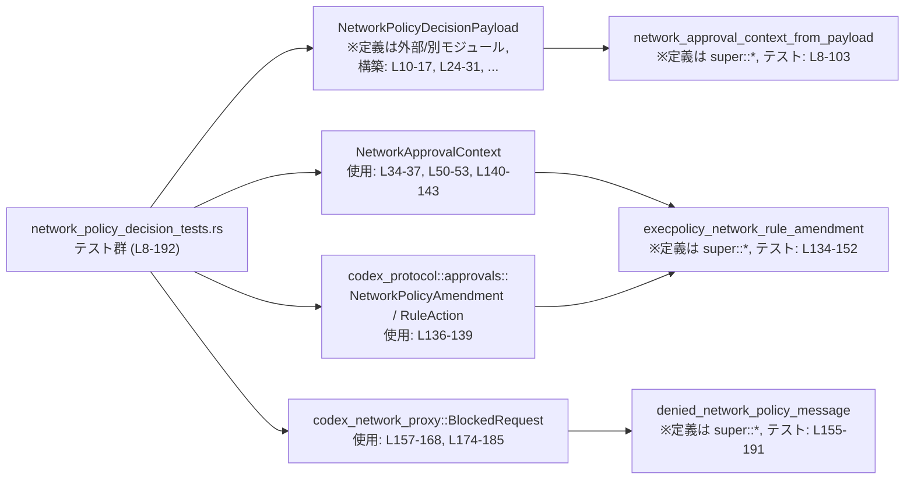
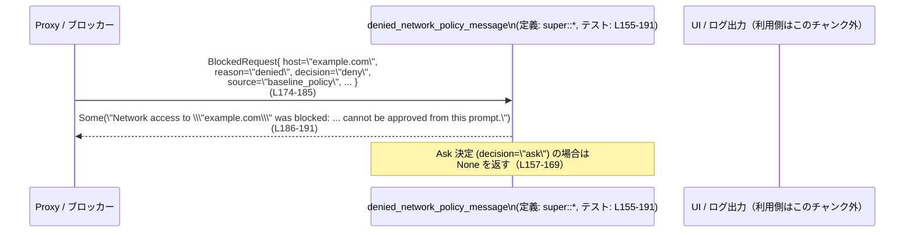

# core/src/network_policy_decision_tests.rs コード解説

## 0. ざっくり一言

このファイルは、ネットワークポリシー関連のコア関数（承認コンテキスト生成・実行ポリシー変換・拒否メッセージ生成・JSONデシリアライズ）が、想定どおりに振る舞うことを検証するテスト群を定義しています。

---

## 1. このモジュールの役割

### 1.1 概要

このテストモジュールは、`super::*` でインポートされるネットワークポリシー決定ロジックに対して、次の点を検証します。

- `NetworkPolicyDecisionPayload` から `NetworkApprovalContext` を生成する条件（Ask / Deny、プロトコルの扱い）  
  （`core/src/network_policy_decision_tests.rs:L8-103`）
- JSON から `NetworkPolicyDecisionPayload` をデシリアライズする際のプロトコル別名（`https_connect` / `http-connect`）のマッピング  
  （`core/src/network_policy_decision_tests.rs:L105-132`）
- `NetworkPolicyAmendment` と `NetworkApprovalContext` から、実行ポリシー用の `ExecPolicyNetworkRuleAmendment` を生成する際のプロトコル・アクション・説明文の対応  
  （`core/src/network_policy_decision_tests.rs:L134-153`）
- `BlockedRequest` からエンドユーザー向けの拒否メッセージを生成する条件（deny 決定かどうか、denylist かどうか）  
  （`core/src/network_policy_decision_tests.rs:L155-192`）

### 1.2 アーキテクチャ内での位置づけ

このテストファイルから見える依存関係を簡略化すると、次のようになります。



- ここで B, D, E は本体ロジック（`super::*`）にある関数であり、このチャンクには実装は現れていません。
- テストは外部クレート `codex_network_proxy` と `codex_protocol` の型を利用して、本体ロジックの振る舞いを間接的に検証しています（`core/src/network_policy_decision_tests.rs:L2-5`）。

### 1.3 設計上のポイント

コード（テスト）から読み取れる設計上の特徴は次のとおりです。

- **条件付きコンテキスト生成**  
  `network_approval_context_from_payload` は、Ask 決定かつ Decider 由来で、特定のプロトコルのときのみ `Some(context)` を返し、それ以外は `None` を返すことが期待されています  
  （`core/src/network_policy_decision_tests.rs:L8-20, L22-103`）。
- **Option による存在有無の表現**  
  `NetworkPolicyDecisionPayload` → `NetworkApprovalContext`、`BlockedRequest` → メッセージ生成の双方で `Option` が使われ、  
  「メッセージ／コンテキストが存在しない」ケースを型安全に表現しています  
  （`core/src/network_policy_decision_tests.rs:L19, L97, L169`）。
- **serde による JSON デシリアライズ**  
  `NetworkPolicyDecisionPayload` は `serde_json::from_str` でデシリアライズ可能であり、`protocol` フィールドの文字列には alias（`https_connect`, `http-connect`）が許容され、内部では `NetworkApprovalProtocol::Https` に正規化される想定です  
  （`core/src/network_policy_decision_tests.rs:L105-132`）。
- **実行ポリシーへの写像と説明文生成**  
  `execpolicy_network_rule_amendment` は、ポリシーの `Deny` アクションと SOCKS5 UDP プロトコルを、実行ポリシー用の `Forbidden` 決定と `Socks5Udp` プロトコルに変換し、  
  さらに `"Deny socks5_udp access to example.com"` という説明文を組み立てることがテストされています  
  （`core/src/network_policy_decision_tests.rs:L134-152`）。
- **denylist とユーザー操作可能なブロックの区別**  
  `denied_network_policy_message` は、`decision:"deny"`, `source:"baseline_policy"`, `reason:"denied"` の組み合わせのときに、  
  「このプロンプトからは承認できない」旨を含む明示的なメッセージを返すことが検証されており、  
  セキュリティ上重要な「ユーザーが上書きできないブロック」を明確に区別する設計になっています  
  （`core/src/network_policy_decision_tests.rs:L172-191`）。

---

## 2. 主要な機能一覧

このテストファイルから見える、モジュールが提供している主要機能（※実装は `super::*` 側）は次のとおりです。

- `NetworkPolicyDecisionPayload` から `NetworkApprovalContext` への変換:
  - Ask 決定・Decider 由来で、HTTP/HTTPS/SOCKS5(TCP/UDP) プロトコルに対して承認コンテキストを生成する機能  
    （`core/src/network_policy_decision_tests.rs:L22-103`）。
- `NetworkPolicyDecisionPayload` の JSON デシリアライズ:
  - `protocol` フィールドで `https_connect` / `http-connect` という文字列を `NetworkApprovalProtocol::Https` にマッピングする機能  
    （`core/src/network_policy_decision_tests.rs:L105-132`）。
- `NetworkPolicyAmendment` + `NetworkApprovalContext` → `ExecPolicyNetworkRuleAmendment`:
  - プロトコルとアクションを実行ポリシー表現へ変換し、人間可読な justification 文字列を組み立てる機能  
    （`core/src/network_policy_decision_tests.rs:L134-152`）。
- `BlockedRequest` から拒否メッセージを生成:
  - deny 決定のうち、baseline policy による denylist ブロックをユーザーに向けて明示的に説明するメッセージを生成する機能  
    （`core/src/network_policy_decision_tests.rs:L155-192`）。

---

## 3. 公開 API と詳細解説

> 注意: 以下の関数・型の実装はこのファイルには含まれておらず、テストコードから観測できる振る舞いのみを記述しています。実装詳細は `super::*` 側のコードを参照する必要があります。

### 3.1 型一覧（構造体・列挙体など）

| 名前 | 種別 | 定義元（推定） | 役割 / 用途 | 根拠 |
|------|------|----------------|-------------|------|
| `NetworkPolicyDecisionPayload` | 構造体 | 本クレート内（`super::*` 経由） | ネットワークアクセスに対する決定内容（decision, source, protocol, host, reason, port）を保持するペイロード。JSON からのデシリアライズ対象。 | フィールド初期化: `decision`, `source`, `protocol`, `host`, `reason`, `port`（`core/src/network_policy_decision_tests.rs:L10-17, L24-31`）; JSONデシリアライズ: `serde_json::from_str::<NetworkPolicyDecisionPayload>`（`L107-131`） |
| `NetworkPolicyDecision` | 列挙体 | 本クレート内 | ネットワークポリシーの決定（例: `Ask`, `Deny`）を表す列挙体。 | `NetworkPolicyDecision::Deny` / `Ask` の使用（`core/src/network_policy_decision_tests.rs:L11, L25, L41, L57, L73, L89`） |
| `NetworkDecisionSource` | 列挙体 | `codex_network_proxy` | 決定の出所（Decider 等）を表す列挙体。 | `NetworkDecisionSource::Decider` の使用（`core/src/network_policy_decision_tests.rs:L12, L26, L42, L58, L74, L90`） |
| `NetworkApprovalProtocol` | 列挙体 | 本クレート内 | HTTP/HTTPS/SOCKS5(TCP/UDP) など、承認対象のネットワークプロトコルを表現する。 | `Http`, `Https`, `Socks5Tcp`, `Socks5Udp` の各バリアント利用（`core/src/network_policy_decision_tests.rs:L27, L43, L59, L75, L91`）; JSON からの alias マッピング（`L118-131`） |
| `NetworkApprovalContext` | 構造体 | 本クレート内 | 承認に必要な最小限の情報（`host`, `protocol`）を保持するコンテキスト。 | 初期化: `host`, `protocol`（`core/src/network_policy_decision_tests.rs:L34-37, L50-53, L82-85, L98-101, L140-143`） |
| `NetworkPolicyAmendment` | 構造体 | `codex_protocol::approvals` | ポリシールールの変更（action, host）を表現する。 | 初期化: `action`, `host`（`core/src/network_policy_decision_tests.rs:L136-139`） |
| `NetworkPolicyRuleAction` | 列挙体 | `codex_protocol::approvals` | ポリシールールのアクション（例: `Deny`）を表す。 | `NetworkPolicyRuleAction::Deny` の使用（`core/src/network_policy_decision_tests.rs:L137`） |
| `ExecPolicyNetworkRuleAmendment` | 構造体 | 本クレート内（推定） | 実行ポリシーエンジン向けのネットワークルール変更を表現（protocol, decision, justification）。 | 比較対象としての初期化（`core/src/network_policy_decision_tests.rs:L147-151`） |
| `ExecPolicyNetworkRuleProtocol` | 列挙体 | 本クレート内（推定） | 実行ポリシーにおけるネットワークプロトコル表現。 | `ExecPolicyNetworkRuleProtocol::Socks5Udp` の使用（`core/src/network_policy_decision_tests.rs:L148`） |
| `ExecPolicyDecision` | 列挙体 | 本クレート内（推定） | 実行ポリシーの最終決定（例: `Forbidden`）を表す。 | `ExecPolicyDecision::Forbidden` の使用（`core/src/network_policy_decision_tests.rs:L149`） |
| `BlockedRequest` | 構造体 | `codex_network_proxy` | ブロックされたネットワークリクエストの詳細（host, reason, client, method, mode, protocol, decision, source, port, timestamp）を保持する。 | 初期化における全フィールド指定（`core/src/network_policy_decision_tests.rs:L157-168, L174-185`） |

### 3.2 関数詳細（主要 3 件）

#### `network_approval_context_from_payload(payload: &NetworkPolicyDecisionPayload) -> Option<NetworkApprovalContext>`（シグネチャはテストからの推定）

**概要**

- ネットワークポリシー決定ペイロードから、承認 UI などで利用する `NetworkApprovalContext` を生成する関数と解釈できます。
- テストから、Ask 決定かつ Decider 由来で、対応するプロトコルのときにのみコンテキストを返すことが分かります  
  （`core/src/network_policy_decision_tests.rs:L8-20, L22-103`）。

**引数**

| 引数名 | 型 | 説明 |
|--------|----|------|
| `payload` | `&NetworkPolicyDecisionPayload` | 決定内容と接続先情報（host, protocol など）を含む入力ペイロード。 |

**戻り値**

- `Option<NetworkApprovalContext>`  
  - `Some(context)` : Ask 決定かつ Decider 由来で、HTTP/HTTPS/SOCKS5(TCP/UDP) のいずれかのプロトコルが指定されている場合に返る想定です。<br>テストでは、`host` と `protocol` がそのままコピーされたコンテキストが期待されています（`core/src/network_policy_decision_tests.rs:L24-38, L40-54, L72-86, L88-102`）。
  - `None` : 少なくとも `decision: Deny` の場合には `None` が返ることがテストで確認されています（`core/src/network_policy_decision_tests.rs:L10-19`）。その他の条件（source や protocol が `None` の場合など）はこのチャンクからは不明です。

**テストから分かる振る舞い**

- `decision != Ask` の場合はコンテキストは生成されない  
  - `decision: NetworkPolicyDecision::Deny` のペイロードに対して `None` が返る（`core/src/network_policy_decision_tests.rs:L10-19`）。
- Ask 決定で `source: NetworkDecisionSource::Decider` かつ以下のプロトコルのときに `Some` が返る:
  - `NetworkApprovalProtocol::Http`（`L24-38`）
  - `NetworkApprovalProtocol::Https`（`L40-54, L56-70`）
  - `NetworkApprovalProtocol::Socks5Tcp`（`L72-86`）
  - `NetworkApprovalProtocol::Socks5Udp`（`L88-102`）
- 生成される `NetworkApprovalContext` は、少なくとも以下の2フィールドを持ち、それぞれ `payload` の値がコピーされます。
  - `host`: `payload.host` の文字列（例: `"example.com"`）  
    （`core/src/network_policy_decision_tests.rs:L35, L51, L83, L99`）
  - `protocol`: `payload.protocol` の `NetworkApprovalProtocol` バリアント  
    （`core/src/network_policy_decision_tests.rs:L36, L52, L84, L100`）

**Examples（使用例）**

テストに近い形での利用例です。

```rust
// Ask 決定・Decider 由来・HTTPS のペイロードを構築する
let payload = NetworkPolicyDecisionPayload {
    decision: NetworkPolicyDecision::Ask,                 // Ask 決定
    source: NetworkDecisionSource::Decider,               // Decider からの決定
    protocol: Some(NetworkApprovalProtocol::Https),       // HTTPS
    host: Some("example.com".to_string()),                // 接続先ホスト
    reason: Some("not_allowed".to_string()),              // ブロック理由（文字列）
    port: Some(443),                                      // ポート番号
};

// 承認コンテキストを取得する
if let Some(ctx) = network_approval_context_from_payload(&payload) {
    // ctx.host == "example.com"
    // ctx.protocol == NetworkApprovalProtocol::Https
    // ここでユーザーに承認ダイアログを表示するなどの処理が可能になる
} else {
    // 承認コンテキストが得られない場合の処理
}
```

**Errors / Panics**

- この関数自体は `Option` を返すため、エラーは戻り値で表現され、panic を起こす根拠はこのチャンクにはありません。
- 並行性（マルチスレッド）に関する情報もこのチャンクには現れません。

**Edge cases（エッジケース）**

- **Deny 決定**:  
  `decision: Deny` の場合は必ず `None` になるべきことがテストされています  
  （`core/src/network_policy_decision_tests.rs:L10-19`）。
- **Ask + Decider + 対応プロトコル**:  
  HTTP/HTTPS/SOCKS5(TCP/UDP) の場合に `Some` になることがテストされています（`L24-102`）。
- **その他の組み合わせ**（推論不可）:
  - `source` が `Decider` 以外の場合
  - `protocol` が `None` または上記以外の場合
  - `host` が `None` の場合  
  これらについては、このチャンクにはテストがなく、挙動は不明です。

**使用上の注意点**

- 戻り値が `Option<NetworkApprovalContext>` であるため、`unwrap()` で強制的に取り出すと `None` の場合に panic します。  
  `if let Some(ctx) = ...` や `match` を用いて安全に扱うことが推奨されます。
- Ask 決定・Decider 由来でない場合は `None` になりうるため、呼び出し側は「承認 UI を出さない」という分岐を用意する必要があります。
- セキュリティ観点では、`None` を「自動許可」と誤解しないことが重要です。テストからは、そのような扱いは読み取れません。

---

#### `execpolicy_network_rule_amendment(amendment: &NetworkPolicyAmendment, ctx: &NetworkApprovalContext, root_host: &str) -> ExecPolicyNetworkRuleAmendment`（シグネチャはテストからの推定）

**概要**

- ポリシー変更（`NetworkPolicyAmendment`）と承認コンテキスト（`NetworkApprovalContext`）、およびルールの対象となるホスト名（`root_host`）から、  
  実行ポリシーエンジン向けの `ExecPolicyNetworkRuleAmendment` を生成する関数と解釈できます  
  （`core/src/network_policy_decision_tests.rs:L134-152`）。

**引数**

| 引数名 | 型 | 説明 |
|--------|----|------|
| `amendment` | `&NetworkPolicyAmendment` | アクション（Deny 等）と対象ホストを含む論理ポリシー変更。 |
| `ctx` | `&NetworkApprovalContext` | 接続先ホストとプロトコルを含む承認コンテキスト。 |
| `root_host` | `&str`（推定） | justification 文字列に含めるホスト名。テストでは `"example.com"` が渡されています。 |

**戻り値**

- `ExecPolicyNetworkRuleAmendment`  
  テストでは、以下のフィールドが設定されることが確認されています（`core/src/network_policy_decision_tests.rs:L147-151`）:
  - `protocol`: `ExecPolicyNetworkRuleProtocol::Socks5Udp`
  - `decision`: `ExecPolicyDecision::Forbidden`
  - `justification`: `"Deny socks5_udp access to example.com"`  

  このことから、少なくとも以下のマッピングが行われると考えられます（コードからは断定できませんが、テストから暗に期待されています）。

**テストから分かる振る舞い**

- 入力:
  - `amendment.action == NetworkPolicyRuleAction::Deny`（`L136-138`）
  - `ctx.protocol == NetworkApprovalProtocol::Socks5Udp`（`L140-143`）
  - `root_host == "example.com"`（`L146`）
- 出力:
  - `protocol` が `ExecPolicyNetworkRuleProtocol::Socks5Udp` に設定される（`L148`）。
  - `decision` が `ExecPolicyDecision::Forbidden` に設定される（`L149`）。
  - `justification` が `"Deny socks5_udp access to example.com"` に設定される（`L150`）。

**Examples（使用例）**

```rust
// ポリシー変更（このホストへのアクセスを拒否する）
let amendment = NetworkPolicyAmendment {
    action: NetworkPolicyRuleAction::Deny,               // Deny アクション
    host: "example.com".to_string(),                     // ポリシー対象ホスト
};

// 対象アクセスのコンテキスト（Socks5 UDP 経由で example.com へ）
let context = NetworkApprovalContext {
    host: "example.com".to_string(),
    protocol: NetworkApprovalProtocol::Socks5Udp,
};

// 実行ポリシーエンジン向けルールに変換する
let exec_rule = execpolicy_network_rule_amendment(&amendment, &context, "example.com");

// exec_rule.protocol == ExecPolicyNetworkRuleProtocol::Socks5Udp
// exec_rule.decision == ExecPolicyDecision::Forbidden
// exec_rule.justification == "Deny socks5_udp access to example.com"
```

**Errors / Panics**

- テストからは `Result` 型や `panic` を示す記述はなく、この関数が失敗を返すかどうかは不明です。
- 渡された値に基づき純粋に新しい構造体を生成している（少なくともテストケースではそのように見える）ため、 Rust の所有権・借用に関する複雑な挙動や並行性の問題は、このチャンクからは読み取れません。

**Edge cases（エッジケース）**

- `action` が `Deny` 以外の場合の挙動は、このチャンクにはテストが存在せず不明です。
- `protocol` が `Socks5Udp` 以外の場合の mapping もテストからは分かりません。
- `amendment.host` と `ctx.host`、`root_host` が一致しない場合の扱いも不明です。

**使用上の注意点**

- セキュリティ上、`Deny` アクションが確実に `Forbidden` などの実行時拒否にマッピングされることが重要です。  
  テストはこの点を 1 ケース（Socks5Udp）について検証しています。
- justification 文字列はログや UI にそのまま出る可能性が高いため、ユーザー／オペレータに誤解を与えない内容になっているか、本体コード側を確認する必要があります。

---

#### `denied_network_policy_message(blocked: &BlockedRequest) -> Option<String>`（シグネチャはテストからの推定）

**概要**

- ブロックされたネットワークリクエスト (`BlockedRequest`) から、ユーザー向けの説明メッセージを生成する関数です。
- 少なくとも「Decider による Ask ブロック」と「baseline policy による denylist ブロック」を区別して扱うことがテストされています  
  （`core/src/network_policy_decision_tests.rs:L155-192`）。

**引数**

| 引数名 | 型 | 説明 |
|--------|----|------|
| `blocked` | `&BlockedRequest` | ブロックされたリクエストの詳細（host, reason, protocol, decision, source 等）を含む構造体。 |

**戻り値**

- `Option<String>`  
  - `Some(message)` : baseline policy による denylist ブロックなど、ユーザーからの承認では覆せないブロックであることを明示するメッセージが返るケースがあります（`core/src/network_policy_decision_tests.rs:L172-191`）。
  - `None` : 単に Ask 状態でブロックされているだけの場合など、明示的な denylist メッセージを出さないケースが想定されます（`core/src/network_policy_decision_tests.rs:L157-169`）。

**テストから分かる振る舞い**

1. **Ask 決定の場合: メッセージは返さない**

   ```rust
   let blocked = BlockedRequest {
       host: "example.com".to_string(),
       reason: "not_allowed".to_string(),
       protocol: "http".to_string(),
       decision: Some("ask".to_string()),               // Ask
       source: Some("decider".to_string()),             // Decider origin
       // 省略: 他フィールド
   };
   assert_eq!(denied_network_policy_message(&blocked), None);
   ```

   （`core/src/network_policy_decision_tests.rs:L157-169`）

   → Ask 状態でのブロック（ユーザーがまだ何も決めていない／決める余地がある）では、denylist 専用のメッセージは返さない挙動が期待されています。

2. **baseline policy による denylist ブロック: 明示的メッセージを返す**

   ```rust
   let blocked = BlockedRequest {
       host: "example.com".to_string(),
       reason: "denied".to_string(),                    // denylist 由来を示す文字列
       protocol: "http".to_string(),
       decision: Some("deny".to_string()),              // Deny
       source: Some("baseline_policy".to_string()),     // baseline_policy 由来
       // 省略
   };
   assert_eq!(
       denied_network_policy_message(&blocked),
       Some(
           "Network access to \"example.com\" was blocked: domain is explicitly denied by policy and cannot be approved from this prompt.".to_string()
       )
   );
   ```

   （`core/src/network_policy_decision_tests.rs:L174-191`）

   → denylist によるブロックは、「このプロンプトから承認することはできない」旨を含むメッセージとしてユーザーに伝えられます。

**Examples（使用例）**

```rust
// プロキシ層などから渡される BlockedRequest
fn handle_blocked(blocked: &BlockedRequest) {
    if let Some(msg) = denied_network_policy_message(blocked) {
        // baseline policy による denylist のように、ユーザーが上書きできないブロックの場合
        eprintln!("{msg}");                             // エラーログや UI に表示する
    } else {
        // Ask 状態など、ユーザーが判断できるケース
        // ここでは別の UI を出す、あるいは何もせずに上位に委ねる等の処理が考えられます
    }
}
```

**Errors / Panics**

- 関数自体は `Option<String>` を返し、内部で `Result` を扱っている様子はテストからは見えません。
- テストでは `assert_eq!` による比較のみで、panic を起こすケースは `expect()` を使った JSON デシリアライズ部分に限られます（`core/src/network_policy_decision_tests.rs:L117, L130`）。  
  `denied_network_policy_message` 自体が panic するかどうかは不明です。

**Edge cases（エッジケース）**

- **Ask 決定 (`decision: "ask"`)**: `None` が返る（`L157-169`）。
- **Deny 決定 + baseline_policy + reason "denied"**:  
  特定のメッセージが `Some(...)` として返る（`L174-191`）。
- **その他の組み合わせ**:
  - `decision: "deny"` かつ `source` が `"decider"` の場合などは、このチャンクにはテストがなく挙動は分かりません。
  - `reason` が `"denied"` 以外の文字列の扱いも不明です。

**使用上の注意点**

- 戻り値は `Option<String>` であり、`None` を返すことが十分あり得るため、`unwrap()` は避け、`if let Some(msg)` などで扱う必要があります。
- セキュリティ上重要なのは、「ユーザーが上書きできない denylist ブロック」に対しては、必ず明示的なメッセージをユーザーに示し、誤った期待（「承認すれば通るはず」など）を持たせないことです。  
  テストは baseline policy + denylist のケースについて、そのことを保証しています。

---

### 3.3 その他の関数（テスト関数）

このファイル内で定義されているテスト関数一覧です。

| 関数名 | 役割（1 行） | 根拠 |
|--------|--------------|------|
| `network_approval_context_requires_ask_from_decider` | Deny 決定の場合に承認コンテキストが生成されないこと（`None`）を検証します。 | `core/src/network_policy_decision_tests.rs:L8-20` |
| `network_approval_context_maps_http_https_and_socks_protocols` | Ask 決定 + Decider 由来で、HTTP/HTTPS/SOCKS5(TCP/UDP) の各プロトコルに対して `NetworkApprovalContext` が正しく生成されることを検証します。 | `core/src/network_policy_decision_tests.rs:L22-103` |
| `network_policy_decision_payload_deserializes_proxy_protocol_aliases` | JSON の `protocol` フィールドで `https_connect` / `http-connect` と指定された場合に、`NetworkApprovalProtocol::Https` としてデシリアライズされることを検証します。 | `core/src/network_policy_decision_tests.rs:L105-132` |
| `execpolicy_network_rule_amendment_maps_protocol_action_and_justification` | `NetworkPolicyAmendment::Deny` + `NetworkApprovalProtocol::Socks5Udp` が、`ExecPolicyDecision::Forbidden` + `ExecPolicyNetworkRuleProtocol::Socks5Udp` + 適切な justification 文字列に変換されることを検証します。 | `core/src/network_policy_decision_tests.rs:L134-152` |
| `denied_network_policy_message_requires_deny_decision` | `decision: "ask"` のブロックに対しては、denylist 用のメッセージが返らない (`None`) ことを検証します。 | `core/src/network_policy_decision_tests.rs:L155-170` |
| `denied_network_policy_message_for_denylist_block_is_explicit` | baseline policy による denylist ブロックに対して、明示的な拒否メッセージが返ることを検証します。 | `core/src/network_policy_decision_tests.rs:L172-191` |

---

## 4. データフロー

ここでは代表的なシナリオとして、「denylist によるネットワークブロックがユーザー向けメッセージに変換される流れ」を整理します。

1. ネットワークプロキシ層がポリシー判定の結果として `BlockedRequest` を生成します。  
   （構築例は `core/src/network_policy_decision_tests.rs:L174-185`）
2. コアロジック内の `denied_network_policy_message` が、この `BlockedRequest` を受け取り、  
   denylist によるブロックかどうかを判定します。
3. denylist ブロックであれば、ユーザー向けの説明メッセージ（`Some(String)`）を生成して返します。  
   そうでなければ `None` を返します（`core/src/network_policy_decision_tests.rs:L186-191`）。
4. 実際のアプリケーションでは、このメッセージが UI やログに表示されると考えられますが、このチャンクには利用箇所は現れません。



このフローにより、「ポリシーにより明示的に denylist 登録されているため、このプロンプトから承認できない」というセキュリティ上重要な情報が、明確なメッセージとしてユーザーに伝わる設計であることが確認できます。

---

## 5. 使い方（How to Use）

### 5.1 基本的な使用方法

テストコードを踏まえた、典型的な利用フローをまとめます。

#### 例: 決定ペイロード → 承認コンテキスト → 実行ポリシールール

```rust
// ネットワーク決定ペイロード（サーバ側の Decider から受信したものなど）
let payload = NetworkPolicyDecisionPayload {
    decision: NetworkPolicyDecision::Ask,                 // ユーザーに確認したい (Ask)
    source: NetworkDecisionSource::Decider,               // Decider 由来
    protocol: Some(NetworkApprovalProtocol::Https),
    host: Some("example.com".to_string()),
    reason: Some("not_allowed".to_string()),
    port: Some(443),
};

// 承認コンテキストに変換
if let Some(ctx) = network_approval_context_from_payload(&payload) {
    // ポリシー変更（ここでは example.com を拒否する例）
    let amendment = NetworkPolicyAmendment {
        action: NetworkPolicyRuleAction::Deny,
        host: ctx.host.clone(),
    };

    // 実行ポリシーエンジン向けルールに変換
    let exec_rule =
        execpolicy_network_rule_amendment(&amendment, &ctx, &ctx.host);

    // exec_rule をポリシーエンジンに適用するなどの処理
}
```

- `payload` から `NetworkApprovalContext` が得られない場合（`None`）は、承認 UI を出さない、あるいは別のフローをとる必要があります。

### 5.2 よくある使用パターン

1. **JSON 経由での決定ペイロード受信**

   ```rust
   // 外部から JSON として渡される決定ペイロード
   let json = r#"{
       "decision":"ask",
       "source":"decider",
       "protocol":"https_connect",                        // alias
       "host":"example.com",
       "reason":"not_allowed",
       "port":443
   }"#;

   // serde_json でデシリアライズ
   let payload: NetworkPolicyDecisionPayload =
       serde_json::from_str(json).expect("payload should deserialize");

   // payload.protocol は Some(NetworkApprovalProtocol::Https) になっていることが期待されます
   ```

   （`core/src/network_policy_decision_tests.rs:L107-118` に対応）

2. **ブロックされたリクエストに対するメッセージ生成**

   ```rust
   // baseline policy による denylist ブロック
   let blocked = BlockedRequest {
       host: "example.com".to_string(),
       reason: "denied".to_string(),
       client: None,
       method: Some("GET".to_string()),
       mode: None,
       protocol: "http".to_string(),
       decision: Some("deny".to_string()),
       source: Some("baseline_policy".to_string()),
       port: Some(80),
       timestamp: 0,
   };

   if let Some(msg) = denied_network_policy_message(&blocked) {
       println!("{msg}");                                 // ユーザーに明示
   }
   ```

   （`core/src/network_policy_decision_tests.rs:L174-191` に対応）

### 5.3 よくある間違い

テストから推測できる、起こりやすい誤用例と正しい例です。

```rust
// 間違い例: Ask 決定でも必ず承認コンテキストがあると思い込み、unwrap してしまう
let ctx = network_approval_context_from_payload(&payload).unwrap(); // payload が Deny だと panic

// 正しい例: Option をパターンマッチで扱う
if let Some(ctx) = network_approval_context_from_payload(&payload) {
    // ctx を利用
} else {
    // 承認コンテキストがない場合の処理
}
```

```rust
// 間違い例: どの BlockedRequest に対してもメッセージが返ると仮定し、unwrap する
let msg = denied_network_policy_message(&blocked).unwrap(); // Ask 決定の場合などに panic しうる

// 正しい例: Option を安全に扱う
if let Some(msg) = denied_network_policy_message(&blocked) {
    eprintln!("{msg}");
}
```

### 5.4 使用上の注意点（まとめ）

- **Option の扱い**  
  - `network_approval_context_from_payload` と `denied_network_policy_message` はともに `Option` を返すため、`unwrap()` は避け、`if let` / `match` で扱う必要があります。
- **JSON デシリアライズ**  
  - `NetworkPolicyDecisionPayload` の `protocol` は `https_connect` / `http-connect` などの alias も受け入れますが、それ以外の文字列の扱いはこのチャンクからは不明です。  
    未知の文字列が来る可能性がある場合は、エラー処理を入れるべきです。
- **セキュリティ上の意味づけ**  
  - baseline policy による denylist ブロックは、ユーザー操作で上書きできないことをメッセージで明示的に伝えます（`core/src/network_policy_decision_tests.rs:L189-190`）。  
    呼び出し側はこのメッセージを無視したり書き換えたりしないよう注意する必要があります。
- **並行性**  
  - このテストファイルにはスレッドや非同期処理は登場せず、共有可変状態もありません。  
    実装側がスレッドセーフかどうかは、このチャンクだけでは判断できません。

---

## 6. 変更の仕方（How to Modify）

### 6.1 新しい機能を追加する場合

例として、新しいネットワークプロトコルを `NetworkApprovalProtocol` に追加する場合の観点を挙げます（実装ファイルはこのチャンクには現れません）。

1. **プロトコル列挙体の拡張（実装側）**  
   - `NetworkApprovalProtocol` に新しいバリアントを追加し、必要であれば `serde` のデシリアライズ設定も追加します。  
     （既存の alias は `core/src/network_policy_decision_tests.rs:L107-131` から確認できます。）
2. **承認コンテキスト変換ロジックの更新**  
   - `network_approval_context_from_payload` が、新しいプロトコルを許可対象として扱う場合、対応する分岐を実装側に追加します。
3. **テストの追加**  
   - `network_approval_context_maps_http_https_and_socks_protocols` と同様のパターンで、新プロトコル向けのテストケースを追加し、  
     `NetworkApprovalContext` に正しく反映されることを確認します。
4. **実行ポリシールールのマッピング**  
   - 新プロトコルに対応した `ExecPolicyNetworkRuleProtocol` のバリアント、および `execpolicy_network_rule_amendment` 内のマッピングを実装し、  
     justification 文字列のフォーマットもテスト（`core/src/network_policy_decision_tests.rs:L147-151` を参考）で確認します。

### 6.2 既存の機能を変更する場合

既存の振る舞いを変更する際の注意点です。

- **Ask / Deny の扱いを変更する場合**
  - `network_approval_context_from_payload` の「Ask でのみコンテキストを生成する」という前提を変える場合、`network_approval_context_requires_ask_from_decider` のテスト（`core/src/network_policy_decision_tests.rs:L8-20`）を合わせて変更する必要があります。
- **denylist メッセージの文言や条件を変更する場合**
  - `denied_network_policy_message_for_denylist_block_is_explicit` の期待文字列（`L186-190`）と条件（`decision:"deny"`, `source:"baseline_policy"`, `reason:"denied"`）を見直し、  
    どの条件でユーザーに「承認不可」であることを伝えるか、セキュリティ観点を踏まえて慎重に設計する必要があります。
- **JSON フォーマットを変更する場合**
  - `protocol` の文字列値や alias を変える場合、`network_policy_decision_payload_deserializes_proxy_protocol_aliases`（`L105-132`）のテストケースを更新し、  
    既存クライアントとの互換性に注意する必要があります。

---

## 7. 関連ファイル

このテストファイルから参照されている型・モジュールと、その関係をまとめます。

| パス / モジュール | 役割 / 関係 |
|------------------|------------|
| `super::*` | このテストファイルと同一モジュール階層にある本体ロジック（`network_approval_context_from_payload`, `execpolicy_network_rule_amendment`, `denied_network_policy_message` など）の実装をインポートしています（`core/src/network_policy_decision_tests.rs:L1`）。具体的なファイル名はこのチャンクからは分かりません。 |
| `codex_network_proxy::BlockedRequest` | ネットワークプロキシ層から渡されるブロック情報の構造体。`denied_network_policy_message` の入力として用いられています（`core/src/network_policy_decision_tests.rs:L2, L157-168, L174-185`）。 |
| `codex_network_proxy::NetworkDecisionSource` | 決定の出所（Decider 等）を表す列挙体。`NetworkPolicyDecisionPayload` の `source` フィールドとして使用されています（`core/src/network_policy_decision_tests.rs:L3, L12, L26, L42, L58, L74, L90`）。 |
| `codex_protocol::approvals::NetworkPolicyAmendment` | ネットワークポリシーの変更（amendment）を表す構造体。`execpolicy_network_rule_amendment` の入力として使用されています（`core/src/network_policy_decision_tests.rs:L4, L136-139`）。 |
| `codex_protocol::approvals::NetworkPolicyRuleAction` | ポリシーアクション（Deny 等）を表す列挙体。`NetworkPolicyAmendment` の `action` フィールドで使用されています（`core/src/network_policy_decision_tests.rs:L5, L137`）。 |
| `serde_json` | JSON 文字列から `NetworkPolicyDecisionPayload` をデシリアライズするために使用されています（`core/src/network_policy_decision_tests.rs:L107-131`）。 |
| `pretty_assertions::assert_eq` | テスト内で構造体や列挙体の値を分かりやすく比較するためのアサーションマクロとして使われています（`core/src/network_policy_decision_tests.rs:L6`）。 |

このチャンクには、本体ロジックの実装ファイル名やさらに下位のユーティリティの情報は現れていません。そのため、より詳細な挙動を確認するには、`super::*` の実体となるファイルを参照する必要があります。
