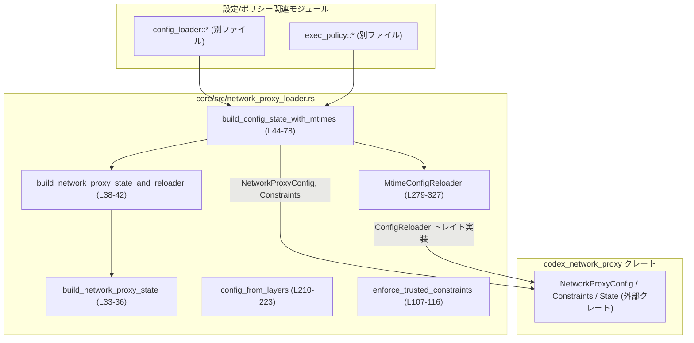
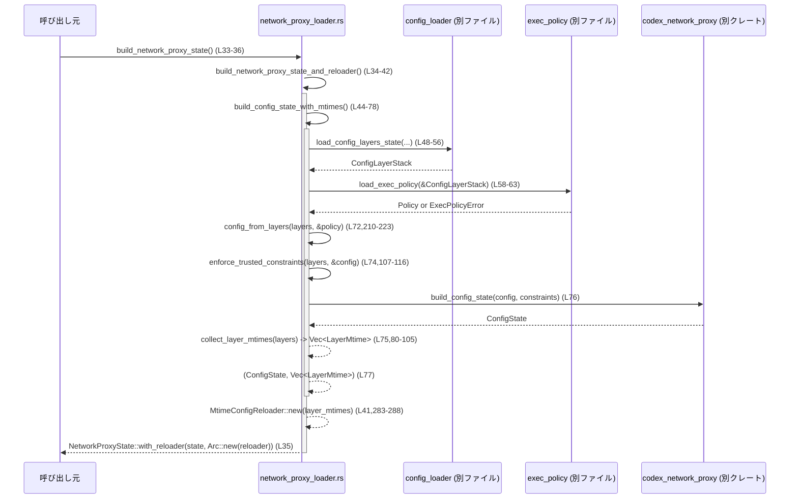

# core/src/network_proxy_loader.rs

## 0. ざっくり一言

Codex の設定レイヤと実行ポリシーから **ネットワークプロキシの設定状態 (`ConfigState` / `NetworkProxyState`) を構築し、設定ファイルの mtime を監視してホットリロードするモジュール**です（`build_network_proxy_state*`, `MtimeConfigReloader`。`network_proxy_loader.rs:L33-42,L279-327`）。

---

## 1. このモジュールの役割

### 1.1 概要

- Codex の設定レイヤ（system / user / project など）を読み込み、`NetworkProxyConfig` を組み立てます（`config_from_layers`。`network_proxy_loader.rs:L210-223`）。
- 「信頼できるレイヤ（system など）」だけから **強制的なネットワーク制約**（有効／無効、許可・拒否ドメインなど）を抽出し、ユーザー設定をこれらの制約に対して検証します（`enforce_trusted_constraints`, `network_constraints_from_trusted_layers`。`network_proxy_loader.rs:L107-135`）。
- 上記から `ConfigState` を生成し、mtime ベースのリローダ（`MtimeConfigReloader`）と組み合わせて `NetworkProxyState` を作ります（`build_network_proxy_state*`。`network_proxy_loader.rs:L33-42,L44-78`）。
- 各設定レイヤのファイル mtime を監視し、変更があれば再読み込みする非同期リローダを提供します（`MtimeConfigReloader`。`network_proxy_loader.rs:L266-327`）。

### 1.2 アーキテクチャ内での位置づけ

このモジュールは「設定レイヤ／exec policy」と「codex_network_proxy のランタイム」の間で設定と制約を統合するファサードとして機能しています。



- `build_network_proxy_state` は外部（例: サーバ起動コード）から呼ばれるエントリポイントで、内部で `build_network_proxy_state_and_reloader` を利用しています（`network_proxy_loader.rs:L33-36`）。
- `build_config_state_with_mtimes` が設定ロード～制約検証～`ConfigState` 構築までのパイプラインを一括で担当します（`network_proxy_loader.rs:L44-78`）。
- `MtimeConfigReloader` は `ConfigReloader` トレイト（外部クレート）を実装し、ネットワークプロキシ側から再読み込み用に利用される前提です（`network_proxy_loader.rs:L19,L304-327`）。

### 1.3 設計上のポイント

- **責務分割**
  - 設定値の構築 (`config_from_layers`) と、制約の構築／検証 (`enforce_trusted_constraints`) を関数レベルで分割しています（`network_proxy_loader.rs:L107-116,L210-223`）。
  - TOML からのパースとプロファイル選択を `NetworkTablesToml` と関連関数に閉じ込めています（`network_proxy_loader.rs:L177-207`）。
- **信頼境界**
  - 制約抽出は「ユーザー制御レイヤ」を明示的に除外しており、システム／管理側設定だけから制約を構築します（`is_user_controlled_layer`, `network_constraints_from_trusted_layers`。`network_proxy_loader.rs:L118-135,L257-263`）。
- **エラーハンドリング**
  - すべての公開関数は `anyhow::Result` を返し、`context` でメッセージを補強しています（`build_config_state_with_mtimes`, `network_tables_from_toml` など。`network_proxy_loader.rs:L44-56,L183-188`）。
  - exec policy のパース失敗時は、空ポリシーにフォールバックしつつ warn ログを出す設計です（`network_proxy_loader.rs:L58-70`）。
- **並行性**
  - mtime 情報は `tokio::sync::RwLock` で保護され、読み取りは多数並列、書き込みは排他的に行う構造です（`network_proxy_loader.rs:L279-301`）。
- **安全性（Rust 言語的観点）**
  - `unsafe` ブロックは存在せず、`Result` / `Option` によるエラー／欠損値の扱いを徹底しています。
  - ファイル mtime 取得失敗は `Option` で表現し、panic することなく「リロードが必要」かどうかの判定に使っています（`LayerMtime::new`, `needs_reload`。`network_proxy_loader.rs:L272-276,L290-301`）。

---

## 2. 主要な機能一覧

- ネットワークプロキシ状態の構築: 設定レイヤと exec policy から `ConfigState` / `NetworkProxyState` を構成します（`build_network_proxy_state*`。`network_proxy_loader.rs:L33-42`）。
- 設定レイヤからの mtime 収集: 各設定ファイルの最終更新時刻を `LayerMtime` として収集します（`collect_layer_mtimes`。`network_proxy_loader.rs:L80-105`）。
- 信頼されたレイヤからのネットワーク制約抽出: system 等のレイヤから `NetworkProxyConstraints` を構築します（`network_constraints_from_trusted_layers`。`network_proxy_loader.rs:L118-135`）。
- ネットワーク設定テーブル（TOML）のパースと適用: `NetworkTablesToml` へのデシリアライズと `NetworkProxyConfig` への適用を行います（`network_tables_from_toml`, `apply_network_tables`。`network_proxy_loader.rs:L183-207`）。
- exec policy によるドメイン許可／拒否ルールの適用: `Policy` から許可・拒否ドメインを取得し、設定に反映します（`apply_exec_policy_network_rules`。`network_proxy_loader.rs:L226-245`）。
- mtime ベースの設定リローダ: ファイル更新検知と再構築を行う `MtimeConfigReloader` を提供し、`ConfigReloader` トレイトを実装します（`network_proxy_loader.rs:L279-327`）。

---

## 3. 公開 API と詳細解説

### 3.1 型一覧（構造体・列挙体など）

| 名前 | 種別 | 公開範囲 | 役割 / 用途 | 定義位置 |
|------|------|----------|-------------|----------|
| `NetworkTablesToml` | 構造体 | crate 内（非 pub） | TOML の `default_permissions` / `[permissions]` テーブルを一時的に保持し、ネットワーク設定プロファイルの選択に用います。 | `network_proxy_loader.rs:L177-181` |
| `LayerMtime` | 構造体 | モジュール内（非 pub） | 各設定レイヤのパスと mtime（`SystemTime`）を保持し、再読み込みが必要かどうかの判定に使用します。 | `network_proxy_loader.rs:L266-270` |
| `MtimeConfigReloader` | 構造体 | `pub` | 設定レイヤ群の mtime を監視し、変更検知時に `ConfigState` を再構築するリローダ実装です。`ConfigReloader` トレイトを実装しています。 | `network_proxy_loader.rs:L279-281,304-327` |

※ 列挙体は本ファイル内には定義されていません。

---

### 3.2 関数詳細（重要な 7 件）

#### `build_network_proxy_state() -> Result<NetworkProxyState>`

**概要**

- ネットワークプロキシの状態とリローダをまとめた `NetworkProxyState` を構築する、外部向けの最上位エントリポイントです（`network_proxy_loader.rs:L33-36`）。

**引数**

なし。

**戻り値**

- `Result<NetworkProxyState>`  
  設定の読み込みや制約検証に成功した場合は `NetworkProxyState`、いずれかの段階で失敗すると `anyhow::Error` を返します（`network_proxy_loader.rs:L33-36`）。

**内部処理の流れ**

1. `build_network_proxy_state_and_reloader()` を await し、`(ConfigState, MtimeConfigReloader)` を取得します（`network_proxy_loader.rs:L34`）。
2. 返ってきたリローダを `Arc` で包みつつ `NetworkProxyState::with_reloader` に渡して、新しい `NetworkProxyState` を生成します（`network_proxy_loader.rs:L35`）。

**Examples（使用例）**

```rust
use std::sync::Arc;
use anyhow::Result;
use core::network_proxy_loader::build_network_proxy_state; // 正確なパスは実際の crate 構成に依存

#[tokio::main]
async fn main() -> Result<()> {
    // ネットワークプロキシ状態を構築する（設定ロード + 制約検証 + リローダ初期化）
    let proxy_state = build_network_proxy_state().await?;

    // ここで proxy_state を codex_network_proxy のサーバ起動処理などに渡す想定です
    // （このファイル内には具体的な利用例は定義されていません）

    Ok(())
}
```

（`build_network_proxy_state` の呼び出し構造は `network_proxy_loader.rs:L33-36` から分かります）

**Errors / Panics**

- `build_network_proxy_state_and_reloader()` に準じます（詳細はそちらのセクション参照）。  
- 本関数自身には panic を起こすコードはありません（`network_proxy_loader.rs:L33-36`）。

**Edge cases（エッジケース）**

- `CODEX_HOME` が解決できない等、下位層で想定外の状態があると `Err` になります（間接的に `build_config_state_with_mtimes` が失敗。`network_proxy_loader.rs:L44-56`）。

**使用上の注意点**

- Rust の `async fn` であるため、Tokio 等の非同期ランタイムの中で `.await` する必要があります。
- 返される `NetworkProxyState` が内部でリローダを保持していることから、設定変更を反映したい場合は、`NetworkProxyState` 側の API（このファイルには定義なし）を通じて再読み込みが行われる前提です。

---

#### `build_network_proxy_state_and_reloader() -> Result<(ConfigState, MtimeConfigReloader)>`

**概要**

- `ConfigState` と、その状態を更新するための `MtimeConfigReloader` を同時に構築します（`network_proxy_loader.rs:L38-42`）。

**引数**

なし。

**戻り値**

- `Result<(ConfigState, MtimeConfigReloader)>`  
  初期構築に成功すると `(ConfigState, MtimeConfigReloader)` のタプル、失敗すると `anyhow::Error` を返します。

**内部処理の流れ**

1. `build_config_state_with_mtimes()` を await し、`(ConfigState, Vec<LayerMtime>)` を取得します（`network_proxy_loader.rs:L40,L44-78`）。
2. `LayerMtime` のベクタから `MtimeConfigReloader::new` でリローダを構築し、`(state, reloader)` を返却します（`network_proxy_loader.rs:L41,L283-288`）。

**Examples（使用例）**

```rust
use anyhow::Result;
use core::network_proxy_loader::build_network_proxy_state_and_reloader;

#[tokio::main]
async fn main() -> Result<()> {
    let (config_state, reloader) = build_network_proxy_state_and_reloader().await?;

    // reloader は ConfigReloader トレイト実装としてどこかに登録される想定です。
    // 例: Arc で包んで NetworkProxyState::with_reloader に渡すなど。
    Ok(())
}
```

**Errors / Panics**

- `build_config_state_with_mtimes()` が返すエラーをそのまま伝播します（`?` 演算子）。`network_proxy_loader.rs:L40,L44-78`。
- 本関数自身に panic の要因となる操作はありません。

**Edge cases**

- 設定レイヤが 0 件の場合など、`build_config_state_with_mtimes` 側の挙動に依存します。コードからは、レイヤが 0 件でもエラーとせず進むかどうかは `load_config_layers_state` / `build_config_state` の実装に依存しており、このチャンクからは不明です。

**使用上の注意点**

- `MtimeConfigReloader` は `ConfigReloader` トレイトを実装しているため、通常は `Arc<dyn ConfigReloader>` などに包んで利用される想定です（`NetworkProxyState::with_reloader` の引数から推測。`network_proxy_loader.rs:L35`）。

---

#### `build_config_state_with_mtimes() -> Result<(ConfigState, Vec<LayerMtime>)>`

**概要**

- Codex の設定レイヤを読み込み、ネットワークプロキシ設定と信頼制約を構成し、それを `ConfigState` に変換すると同時に、各レイヤの mtime 一覧を返します（`network_proxy_loader.rs:L44-78`）。

**引数**

なし。

**戻り値**

- `Result<(ConfigState, Vec<LayerMtime>)>`  
  成功時: `(network_proxy_state, 各レイヤのmtime情報)`  
  失敗時: エラー内容に応じた `anyhow::Error`。

**内部処理の流れ（アルゴリズム）**

1. `find_codex_home()` で `CODEX_HOME` を解決し、失敗時は `"failed to resolve CODEX_HOME"` というコンテキスト付きでエラーにします（`network_proxy_loader.rs:L45`）。
2. CLI オーバーライドを空ベクタ（`Vec::new()`）として用意し、`LoaderOverrides::default()` を生成します（`network_proxy_loader.rs:L46-47`）。
3. `load_config_layers_state` を非同期で呼び出し、設定レイヤスタック (`ConfigLayerStack`) を構築します。失敗時は `"failed to load Codex config"` というメッセージを付与します（`network_proxy_loader.rs:L48-56`）。
4. `load_exec_policy(&config_layer_stack)` を await し、`exec_policy` をロードします（`network_proxy_loader.rs:L58-63`）。
   - 成功: `(policy, None)` を得る。
   - `ExecPolicyError::ParsePolicy` の場合: `codex_execpolicy::Policy::empty()` を使用し、警告として `warning` に格納する。
   - それ以外のエラー: その場で `Err(err.into())` として返す。
5. `warning` が `Some` の場合、`tracing::warn!` で parse 失敗の詳細をログに出します（`network_proxy_loader.rs:L65-70`）。
6. `config_from_layers(&config_layer_stack, &exec_policy)` を呼び、`NetworkProxyConfig` を構築します（`network_proxy_loader.rs:L72`）。
7. `enforce_trusted_constraints` で信頼レイヤから制約を抽出し、構築した `config` がその制約に違反していないか検証します（`network_proxy_loader.rs:L74,L107-116`）。
8. `collect_layer_mtimes` で各レイヤの設定ファイルパスから mtime 情報を収集します（`network_proxy_loader.rs:L75,L80-105`）。
9. `build_config_state(config, constraints)` を呼び出して `ConfigState` を構築し、`(state, layer_mtimes)` を返します（`network_proxy_loader.rs:L76-77`）。

**Examples（使用例）**

通常は他の関数内部から利用されるため、直接使う例は次のようになります。

```rust
use anyhow::Result;
use core::network_proxy_loader::build_config_state_with_mtimes; // 実際には非 pub なので同モジュール内でのみ使用可

#[tokio::main]
async fn main() -> Result<()> {
    // ConfigState と、レイヤごとの mtime 情報を構築する
    let (state, layer_mtimes) = build_config_state_with_mtimes().await?;

    // layer_mtimes は新しい MtimeConfigReloader の初期値になります
    println!("Loaded {} layer mtimes", layer_mtimes.len());

    Ok(())
}
```

※ 実際には `build_config_state_with_mtimes` は `pub` ではないため、同モジュール内の関数からのみ呼び出されます（`network_proxy_loader.rs:L44`）。

**Errors / Panics**

- 以下の場合に `Err` を返します。
  - `find_codex_home` で `CODEX_HOME` が解決できない（`network_proxy_loader.rs:L45`）。
  - `load_config_layers_state` の失敗（`network_proxy_loader.rs:L48-56`）。
  - `load_exec_policy` が `ExecPolicyError::ParsePolicy` 以外のエラーを返した場合（`network_proxy_loader.rs:L58-63`）。
  - `config_from_layers` 内の TOML デシリアライズやパースに失敗した場合（`network_proxy_loader.rs:L72,L183-188,L190-200,L203-207,L210-223`）。
  - `enforce_trusted_constraints` で制約に違反している、あるいは制約構築時にエラーが発生した場合（`network_proxy_loader.rs:L74,L107-116,L118-135`）。
  - `build_config_state` が失敗した場合（外部クレートの実装に依存し、このチャンクからは詳細不明。`network_proxy_loader.rs:L76`）。
- panic を直接引き起こすコード（`unwrap` / `expect` など）は含まれていません。

**Edge cases**

- exec policy のパースが失敗した場合でも、空のポリシーにフォールバックして処理を継続します。  
  → この場合、exec policy 由来のネットワークドメインルールは適用されませんが、信頼制約 (`enforce_trusted_constraints`) は依然として適用されます（`network_proxy_loader.rs:L58-70`）。
- 設定レイヤの一部が `collect_layer_mtimes` でパスを取得できないケース（例: 未対応の `ConfigLayerSource` バリアント）は mtime 監視の対象外になります（`network_proxy_loader.rs:L87-101`）。

**使用上の注意点**

- この関数を変更する場合、**処理順序**（設定ロード → exec policy ロード → 設定構築 → 制約検証 → ConfigState 構築）に依存する前提条件があるため、順番を入れ替えると安全性上の意味が変わる可能性があります（`network_proxy_loader.rs:L44-77`）。
- `load_exec_policy` のエラー扱い（parse error だけが警告＋フォールバック）にはセキュリティ上の意味があります。より厳密な動作に変えたい場合は、この条件分岐を見直す必要があります（`network_proxy_loader.rs:L58-63`）。

---

#### `config_from_layers(layers: &ConfigLayerStack, exec_policy: &codex_execpolicy::Policy) -> Result<NetworkProxyConfig>`

**概要**

- 全ての有効な設定レイヤを走査し、ネットワーク関連の設定を順に適用した上で、exec policy 由来の許可／拒否ドメインルールを上書き適用して `NetworkProxyConfig` を構築します（`network_proxy_loader.rs:L210-223`）。

**引数**

| 引数名 | 型 | 説明 |
|--------|----|------|
| `layers` | `&ConfigLayerStack` | 設定レイヤのスタック。`get_layers` で走査されます（`network_proxy_loader.rs:L211,215-218`）。 |
| `exec_policy` | `&codex_execpolicy::Policy` | 事前にロードされた実行ポリシー。ネットワークドメインルールのみ利用します（`network_proxy_loader.rs:L212,226-245`）。 |

**戻り値**

- `Result<NetworkProxyConfig>`  
  すべてのレイヤのパースと適用が成功した場合は完成した `NetworkProxyConfig`、いずれかで失敗した場合は `anyhow::Error`。

**内部処理の流れ**

1. `NetworkProxyConfig::default()` で空の設定を作成します（`network_proxy_loader.rs:L214`）。
2. `layers.get_layers(ConfigLayerStackOrdering::LowestPrecedenceFirst, false)` で、低い優先度から高い優先度へ順にレイヤを取得します（`network_proxy_loader.rs:L215-218`）。
3. 各レイヤについて以下を行います（`network_proxy_loader.rs:L219-221`）。
   - `network_tables_from_toml(&layer.config)?` で `NetworkTablesToml` にデシリアライズ。
   - `apply_network_tables(&mut config, parsed)?` でネットワーク設定を `config` に適用。
4. 最後に `apply_exec_policy_network_rules(&mut config, exec_policy)` を呼び、exec policy 由来の許可／拒否ドメインを上書き適用します（`network_proxy_loader.rs:L222,226-245`）。
5. `Ok(config)` を返します（`network_proxy_loader.rs:L223`）。

**Examples（使用例）**

```rust
fn build_config_example(
    layers: &ConfigLayerStack,
    exec_policy: &codex_execpolicy::Policy,
) -> anyhow::Result<codex_network_proxy::NetworkProxyConfig> {
    // 設定レイヤ + exec policy から NetworkProxyConfig を構築する
    let config = config_from_layers(layers, exec_policy)?;
    Ok(config)
}
```

（`config_from_layers` の使われ方は `build_config_state_with_mtimes` から確認できます。`network_proxy_loader.rs:L72`）

**Errors / Panics**

- 各レイヤごとの TOML デシリアライズが失敗した場合（`network_tables_from_toml` 内で `try_into()` が失敗）、  
  `"failed to deserialize network tables from config"` というコンテキスト付きの `Err` になります（`network_proxy_loader.rs:L183-188,219`）。
- `selected_network_from_tables` が `default_permissions` と `[permissions]` の不整合でエラーを返した場合も `Err` になります（`network_proxy_loader.rs:L190-200,L203-207`）。
- panic 要因は含まれていません。

**Edge cases**

- どのレイヤでも `default_permissions` が設定されていない場合、`selected_network_from_tables` は常に `Ok(None)` を返し、`NetworkProxyConfig` はデフォルト値のままになります（`network_proxy_loader.rs:L190-193,L203-207`）。
- exec policy 側が許可／拒否ドメインを大量に持つ場合、`apply_exec_policy_network_rules` でその全てを `upsert_network_domain` するため、初期化コストが増加します（`network_proxy_loader.rs:L226-245`）。

**使用上の注意点**

- レイヤ適用順は `LowestPrecedenceFirst` で固定されており、後ろのレイヤが前のレイヤを上書きする前提になっています（`network_proxy_loader.rs:L215-217`）。
- exec policy のネットワークドメイン設定は、レイヤ由来のドメイン設定を上書きする形で適用されるため、**「ポリシーは常に最終的な権威」**という契約を暗黙に持っています（`network_proxy_loader.rs:L222-245`）。

---

#### `enforce_trusted_constraints(layers: &ConfigLayerStack, config: &NetworkProxyConfig) -> Result<NetworkProxyConstraints>`

**概要**

- 信頼できる設定レイヤから構築した `NetworkProxyConstraints` を用いて、現在の `NetworkProxyConfig` が制約に違反していないか検証し、問題なければ制約オブジェクトを返します（`network_proxy_loader.rs:L107-116`）。

**引数**

| 引数名 | 型 | 説明 |
|--------|----|------|
| `layers` | `&ConfigLayerStack` | 信頼制約を抽出するために参照する設定レイヤ群（`network_proxy_loader.rs:L108,118-135`）。 |
| `config` | `&NetworkProxyConfig` | すでに構築済みのネットワークプロキシ設定。制約との整合性検証対象です（`network_proxy_loader.rs:L109-112`）。 |

**戻り値**

- `Result<NetworkProxyConstraints>`  
  構築と検証に成功した場合は `NetworkProxyConstraints` を返し、制約違反または構築途中のエラーがあれば `anyhow::Error` を返します。

**内部処理の流れ**

1. `network_constraints_from_trusted_layers(layers)?` で信頼制約を構築します（`network_proxy_loader.rs:L111,118-135`）。
2. `validate_policy_against_constraints(config, &constraints)` を呼び出し、`config` が制約に合致しているか検証します（`network_proxy_loader.rs:L112`）。
3. 検証結果が `Err(NetworkProxyConstraintError)` の場合、`NetworkProxyConstraintError::into_anyhow` で `anyhow::Error` に変換し、`.context("network proxy constraints")` を付与します（`network_proxy_loader.rs:L112-114`）。
4. 問題なければ `Ok(constraints)` を返します（`network_proxy_loader.rs:L115`）。

**Examples（使用例）**

```rust
fn enforce_example(
    layers: &ConfigLayerStack,
    config: &NetworkProxyConfig,
) -> anyhow::Result<codex_network_proxy::NetworkProxyConstraints> {
    let constraints = enforce_trusted_constraints(layers, config)?;
    Ok(constraints)
}
```

**Errors / Panics**

- `network_constraints_from_trusted_layers` 内のエラー（TOML パースやプロファイル解決失敗など）をそのまま `Err` として返します（`network_proxy_loader.rs:L111,118-135,183-200`）。
- `validate_policy_against_constraints` が `NetworkProxyConstraintError` を返した場合、  
  `"network proxy constraints"` というコンテキスト付きの `anyhow::Error` になります（`network_proxy_loader.rs:L112-114`）。
- panic を起こすような処理はありません。

**Edge cases**

- 信頼できるレイヤから何のネットワーク設定も得られなかった場合、`NetworkProxyConstraints::default()` のまま検証が行われます（`network_proxy_loader.rs:L121,118-135`）。  
  この「デフォルト制約」がどのような意味を持つかは `NetworkProxyConstraints` の実装に依存し、このチャンクからは不明です。

**使用上の注意点**

- `is_user_controlled_layer` によって「ユーザー制御レイヤ」が除外されるため、**ユーザー側の設定では緩められない制約**として機能します（`network_proxy_loader.rs:L118-135,L257-263`）。
- 新しい `ConfigLayerSource` バリアントを追加した場合、それがユーザー制御かどうかに応じて `is_user_controlled_layer` を更新する必要があります。

---

#### `MtimeConfigReloader::needs_reload(&self) -> bool`

**概要**

- 現在保持している各設定レイヤの mtime と、実際のファイルの最新 mtime を比較し、再読み込みが必要かどうかを判定します（`network_proxy_loader.rs:L290-301`）。

**引数**

| 引数名 | 型 | 説明 |
|--------|----|------|
| `&self` | `&MtimeConfigReloader` | 内部の `RwLock<Vec<LayerMtime>>` にアクセスします（`network_proxy_loader.rs:L279-281,L290-292`）。 |

**戻り値**

- `bool`  
  少なくとも 1 つのレイヤで「ファイル状態が変化した」と判定された場合は `true`、それ以外は `false` を返します（`network_proxy_loader.rs:L292-300`）。

**内部処理の流れ**

1. `self.layer_mtimes.read().await` で読み取りロックを取得します（`network_proxy_loader.rs:L291`）。
2. `guard.iter().any(|layer| { ... })` で、各 `LayerMtime` について以下を判定します（`network_proxy_loader.rs:L292`）。
   1. `std::fs::metadata(&layer.path).ok()` で現在のファイルメタデータを取得（失敗時は `None`）（`network_proxy_loader.rs:L293`）。
   2. `metadata.and_then(|m| m.modified().ok())` で最新 mtime を取得し、`layer.mtime`（以前の mtime）と組にします（`network_proxy_loader.rs:L294`）。
   3. 以下のパターンマッチで変化を判定します（`network_proxy_loader.rs:L294-299`）。
      - `(Some(new_mtime), Some(old_mtime))` かつ `new_mtime > old_mtime` → `true`
      - `(Some(_), None)` → `true`（以前は mtime なし、今は存在）
      - `(None, Some(_))` → `true`（以前は存在したが、今は取得できない）
      - `(None, None)` → `false`
3. `any` の結果をそのまま返します（`network_proxy_loader.rs:L292-301`）。

**Examples（使用例）**

```rust
async fn check_reload_needed(reloader: &MtimeConfigReloader) -> anyhow::Result<()> {
    if reloader.needs_reload().await {
        println!("Config reload is needed");
    } else {
        println!("Config is up-to-date");
    }
    Ok(())
}
```

（`needs_reload` はこのモジュール内で `maybe_reload` / `reload_now` から利用されています。`network_proxy_loader.rs:L310-325`）

**Errors / Panics**

- 戻り値は `bool` であり、エラーを返しません。
- `metadata` / `modified` からのエラーはすべて `ok()` で握りつぶされ、`Option` として扱われるため、panic にはなりません（`network_proxy_loader.rs:L293-295`）。

**Edge cases**

- ファイルが削除された場合: 以前は `Some(old_mtime)` だったものが現在 `None` になり、`true`（リロード必要）と判定されます（`network_proxy_loader.rs:L294-299`）。
- ファイルが新規作成された場合: 以前 `None` で現在 `Some(new_mtime)` なら `true` です。
- システム時計の巻き戻し等により、`new_mtime <= old_mtime` になった場合、変化ありとは判定されません（`network_proxy_loader.rs:L295`）。この挙動は OS とファイルシステムのタイムスタンプ解像度にも依存します。

**使用上の注意点**

- 内部で `std::fs::metadata` を呼び出しており、これは **ブロッキング I/O** です。Tokio ランタイム上で多数並列に呼び出すとパフォーマンスに影響する可能性があります（`network_proxy_loader.rs:L293`）。
- `RwLock` の読み取りロックを保持したままファイル I/O を行っているため、他のスレッド／タスクが書き込みロックを取得するのが若干遅れる可能性があります。ただし読み取りロックは複数同時に許可されます（`network_proxy_loader.rs:L291-292`）。

---

#### `ConfigReloader for MtimeConfigReloader::maybe_reload(&self) -> Result<Option<ConfigState>>`

**概要**

- 現在の設定ファイル群に変更があった場合にのみ `ConfigState` を再構築して返す、条件付きリロードメソッドです（`network_proxy_loader.rs:L304-320`）。

**引数**

| 引数名 | 型 | 説明 |
|--------|----|------|
| `&self` | `&MtimeConfigReloader` | 内部の mtime 情報と `build_config_state_with_mtimes` を利用して、必要に応じて設定を再構築します（`network_proxy_loader.rs:L310-318`）。 |

**戻り値**

- `Result<Option<ConfigState>>`  
  - `Ok(None)` : リロード不要（ファイル変更なし）。
  - `Ok(Some(state))` : リロードが実行され、新しい `ConfigState` が返された。
  - `Err(e)` : 設定の再構築中にエラーが発生した。

**内部処理の流れ**

1. `needs_reload().await` で変更の有無をチェックし、`false` の場合は即座に `Ok(None)` を返します（`network_proxy_loader.rs:L311-313,L290-301`）。
2. 変更がある場合は `build_config_state_with_mtimes().await?` で新しい `(ConfigState, Vec<LayerMtime>)` を構築します（`network_proxy_loader.rs:L315,L44-78`）。
3. `self.layer_mtimes.write().await` で書き込みロックを取得し、内部の `layer_mtimes` を新しい値で置き換えます（`network_proxy_loader.rs:L316-317`）。
4. `Ok(Some(state))` を返します（`network_proxy_loader.rs:L318`）。

**Examples（使用例）**

```rust
use anyhow::Result;
use codex_network_proxy::ConfigState;

async fn periodic_reload(reloader: &MtimeConfigReloader) -> Result<()> {
    if let Some(new_state) = reloader.maybe_reload().await? {
        // new_state をどこかに反映する
        println!("Config reloaded");
    }
    Ok(())
}
```

（この例のように `Option<ConfigState>` を扱うパターンが想定されます）

**Errors / Panics**

- `build_config_state_with_mtimes` の全てのエラーをそのまま `Err` として返します（`network_proxy_loader.rs:L315,L44-78`）。
- panic は発生しないように記述されています。

**Edge cases**

- `needs_reload()` 判定の直後に、別のプロセスが設定ファイルをさらに変更した場合、  
  その変更は今回のリロードには含まれない可能性があります。これは「チェック→リロード」の間に時間があるためで、コードからもそのような race を防ぐ仕組みは見当たりません（`network_proxy_loader.rs:L310-318`）。
- `build_config_state_with_mtimes` がエラーを返した場合、内部の `layer_mtimes` は更新されず、次回の `maybe_reload` で再度試行されます（`network_proxy_loader.rs:L315-317`）。

**使用上の注意点**

- 戻り値が `Option` であることから、呼び出し側は「何もせず return」ではなく、`Some(state)` のときだけ状態を差し替える必要があります。
- 高頻度で呼び出す場合、`needs_reload` によるファイルシステムアクセスの負荷を考慮する必要があります（`network_proxy_loader.rs:L290-301`）。

---

### 3.3 その他の関数

補助的な関数や内部で完結している関数の一覧です。

| 関数名 | 役割（1 行） | 定義位置 |
|--------|--------------|----------|
| `collect_layer_mtimes(stack: &ConfigLayerStack) -> Vec<LayerMtime>` | 有効な設定レイヤから設定ファイルパスを抽出し、それぞれの `LayerMtime` を生成して集約します。 | `network_proxy_loader.rs:L80-105` |
| `network_constraints_from_trusted_layers(layers: &ConfigLayerStack) -> Result<NetworkProxyConstraints>` | ユーザー制御レイヤを除外しながら各レイヤのネットワーク設定を読み取り、`NetworkProxyConstraints` を構築します。 | `network_proxy_loader.rs:L118-135` |
| `apply_network_constraints(network: NetworkToml, constraints: &mut NetworkProxyConstraints)` | `NetworkToml` の各フィールドを `NetworkProxyConstraints` に上書き／マージします（ドメインは `overlay_network_domain_permissions` を利用）。 | `network_proxy_loader.rs:L138-175` |
| `network_tables_from_toml(value: &toml::Value) -> Result<NetworkTablesToml>` | `toml::Value` から `NetworkTablesToml` へデシリアライズします。 | `network_proxy_loader.rs:L183-188` |
| `selected_network_from_tables(parsed: NetworkTablesToml) -> Result<Option<NetworkToml>>` | `default_permissions` で指定されたプロファイルを `[permissions]` から解決し、その `network` セクションを返します。 | `network_proxy_loader.rs:L190-200` |
| `apply_network_tables(config: &mut NetworkProxyConfig, parsed: NetworkTablesToml) -> Result<()>` | `selected_network_from_tables` から得た `NetworkToml` を `NetworkProxyConfig` に適用します。 | `network_proxy_loader.rs:L203-207` |
| `apply_exec_policy_network_rules(config: &mut NetworkProxyConfig, exec_policy: &codex_execpolicy::Policy)` | exec policy の `compiled_network_domains` から許可／拒否ドメインを取り出し、`upsert_network_domain` で設定に適用します。 | `network_proxy_loader.rs:L226-245` |
| `upsert_network_domain(config: &mut NetworkProxyConfig, host: String, permission: NetworkDomainPermission)` | ドメイン名を正規化しつつ許可／拒否権限を更新します。 | `network_proxy_loader.rs:L247-255` |
| `is_user_controlled_layer(layer: &ConfigLayerSource) -> bool` | `User` / `Project` / `SessionFlags` を「ユーザー制御レイヤ」として判定します。 | `network_proxy_loader.rs:L257-263` |
| `LayerMtime::new(path: PathBuf) -> LayerMtime` | パスに対する mtime を取得し、`LayerMtime` を生成します（取得失敗時は `None`）。 | `network_proxy_loader.rs:L272-276` |
| `MtimeConfigReloader::new(layer_mtimes: Vec<LayerMtime>) -> Self` | 初期 mtime 情報をもつ `MtimeConfigReloader` を生成します。 | `network_proxy_loader.rs:L283-288` |
| `ConfigReloader for MtimeConfigReloader::source_label(&self) -> String` | このリローダの識別ラベルとして `"config layers"` を返します。 | `network_proxy_loader.rs:L306-308` |
| `ConfigReloader for MtimeConfigReloader::reload_now(&self) -> Result<ConfigState>` | `build_config_state_with_mtimes` を必ず実行して、`ConfigState` と内部 mtime を更新して返します。 | `network_proxy_loader.rs:L321-325` |

---

## 4. データフロー

ここでは、「初回構築」と「変更検知時のリロード」という 2 つの代表的なフローを説明します。

### 4.1 初回構築フロー

`build_network_proxy_state` を通じて `NetworkProxyState` を構築する流れです（`network_proxy_loader.rs:L33-42,L44-78`）。



**要点**

- **設定データフロー**: TOML → `NetworkTablesToml` → `NetworkToml` → `NetworkProxyConfig` → `ConfigState`（`network_proxy_loader.rs:L183-188,L190-207,L210-223,L76`）。
- **制約データフロー**: `ConfigLayerStack`（信頼レイヤのみ）→ `NetworkProxyConstraints` → `validate_policy_against_constraints` → `ConfigState`（`network_proxy_loader.rs:L118-135,L107-116,L76`）。
- exec policy のネットワークルールは `config_from_layers` 内で最後に適用されるため、レイヤ設定よりも優先します。

### 4.2 変更検知リロードフロー

`ConfigReloader::maybe_reload` の呼び出しによる再読み込みの流れです（`network_proxy_loader.rs:L290-301,L310-319`）。

```mermaid
sequenceDiagram
    participant Runtime as プロキシランタイム
    participant R as MtimeConfigReloader (L279-327)
    participant NPL as network_proxy_loader.rs

    Runtime->>R: maybe_reload() (L310-319)
    activate R
    R->>R: needs_reload() (L311,290-301)
    alt 変更なし
        R-->>Runtime: Ok(None) (L312-313)
    else 変更あり
        R->>NPL: build_config_state_with_mtimes() (L315,44-78)
        NPL-->>R: (ConfigState, Vec<LayerMtime>)
        R->>R: layer_mtimes.write().await; *guard = new (L316-317)
        R-->>Runtime: Ok(Some(ConfigState)) (L318)
    end
    deactivate R
```

**要点**

- `needs_reload` の判定は mtime の比較のみで行い、エラーはすべて `Option` に吸収して「変化あり／なし」の判定材料としています（`network_proxy_loader.rs:L290-301`）。
- 実際の再構築処理は初回構築と同じ `build_config_state_with_mtimes` を使い、**同じロジックで状態を再現**します（`network_proxy_loader.rs:L44-78,L315`）。

---

## 5. 使い方（How to Use）

### 5.1 基本的な使用方法

このファイルから直接利用される主な公開 API は `build_network_proxy_state` および `build_network_proxy_state_and_reloader` です（`network_proxy_loader.rs:L33-42`）。

```rust
use std::sync::Arc;
use anyhow::Result;
use core::network_proxy_loader::{
    build_network_proxy_state,
    build_network_proxy_state_and_reloader,
};
use codex_network_proxy::NetworkProxyState; // 外部クレート

#[tokio::main]
async fn main() -> Result<()> {
    // シンプルなケース: NetworkProxyState を一括構築する
    let state: NetworkProxyState = build_network_proxy_state().await?;

    // より細かく制御したい場合: ConfigState とリローダを個別に取得する
    let (config_state, reloader) = build_network_proxy_state_and_reloader().await?;
    let state2 = NetworkProxyState::with_reloader(config_state, Arc::new(reloader));

    // state / state2 を codex_network_proxy 側のサーバ起動ロジックに渡す前提です。
    Ok(())
}
```

- ここでの `NetworkProxyState::with_reloader` 呼び出しは、このファイル内の `build_network_proxy_state` と同じパターンです（`network_proxy_loader.rs:L35`）。

### 5.2 よくある使用パターン

1. **サーバ起動時に一度だけ構築**

   - 起動時に `build_network_proxy_state` を呼び出し、あとは `NetworkProxyState` に任せるパターンです（`network_proxy_loader.rs:L33-36`）。
   - この場合、リロードは `NetworkProxyState` 側の仕組みによって行われる前提です（このチャンクには定義なし）。

2. **独自のリロードループを組む**

   - `build_network_proxy_state_and_reloader` で `(ConfigState, MtimeConfigReloader)` を取得し、`MtimeConfigReloader` を適宜 `maybe_reload` するパターンです（`network_proxy_loader.rs:L38-42,L304-320`）。

   ```rust
   async fn reload_loop(reloader: Arc<MtimeConfigReloader>) -> anyhow::Result<()> {
       loop {
           if let Some(new_state) = reloader.maybe_reload().await? {
               // new_state をどこかに反映
           }
           tokio::time::sleep(std::time::Duration::from_secs(5)).await;
       }
   }
   ```

### 5.3 よくある間違い

```rust
// 間違い例: 非同期ランタイムの外で await を使おうとしている
// let state = build_network_proxy_state().await; // コンパイルエラー

// 正しい例: Tokio などの async ランタイム内で await する
#[tokio::main]
async fn main() -> anyhow::Result<()> {
    let state = build_network_proxy_state().await?;
    Ok(())
}
```

```rust
// 間違い例: maybe_reload の戻り値 Option を無視している
async fn wrong_reload(reloader: &MtimeConfigReloader) -> anyhow::Result<()> {
    // これでは reloader が new_state を返しても何もしない
    reloader.maybe_reload().await?;
    Ok(())
}

// 正しい例: Some の時だけ状態を更新する
async fn correct_reload(reloader: &MtimeConfigReloader) -> anyhow::Result<()> {
    if let Some(new_state) = reloader.maybe_reload().await? {
        // new_state への切り替え処理
    }
    Ok(())
}
```

（`maybe_reload` のシグネチャから、`Option<ConfigState>` をきちんと扱う必要があることが分かります。`network_proxy_loader.rs:L310-319`）

### 5.4 使用上の注意点（まとめ）

- **非同期コンテキストの前提**  
  - `build_network_proxy_state*` および `MtimeConfigReloader` のメソッドは `async` であり、Tokio 等のランタイムが必要です（`network_proxy_loader.rs:L33-42,L290-301,L310-325`）。
- **ファイル I/O のブロッキング**  
  - `needs_reload` は内部で `std::fs::metadata` を直接呼び出しており、非同期ランタイム上ではブロッキング I/O になります（`network_proxy_loader.rs:L293`）。高頻度に呼ぶ場合は負荷に注意が必要です。
- **信頼制約の前提**  
  - 制約は `is_user_controlled_layer` によって「ユーザー制御でないレイヤ」からのみ構築されています（`network_proxy_loader.rs:L118-135,L257-263`）。新しいレイヤ種別を導入する際は、この信頼境界を崩さないようにする必要があります。
- **エラー時の挙動**  
  - exec policy の parse error のみが「警告＋フォールバック」扱いで、それ以外のエラーは即座に失敗となります（`network_proxy_loader.rs:L58-63`）。運用上、ポリシーファイルの書式エラーがあってもサービスを止めたくない設計と解釈できますが、そのぶん制約が弱まる可能性があります。

---

## 6. 変更の仕方（How to Modify）

### 6.1 新しい機能を追加する場合

1. **新しい制約項目を追加したい場合**
   - 対応するフィールドを `NetworkProxyConstraints` / `NetworkToml`（いずれも外部クレート）側に追加する必要があります。
   - 本ファイルでは `apply_network_constraints` にロジックを追加し、`NetworkToml` から新フィールドを `constraints` に反映します（`network_proxy_loader.rs:L138-175`）。
   - 制約検証は `validate_policy_against_constraints` が行うため、その実装も更新する必要があります（外部クレート、`network_proxy_loader.rs:L112`）。

2. **新しい `ConfigLayerSource` バリアントを扱いたい場合**
   - `collect_layer_mtimes` に新バリアントのファイルパス決定ロジックを追加します（`network_proxy_loader.rs:L87-101`）。
   - そのレイヤが「ユーザー制御」か「信頼レイヤ」かに応じて、`is_user_controlled_layer` を更新します（`network_proxy_loader.rs:L257-263`）。
   - 必要に応じてテスト（`mod tests`）を更新します（`network_proxy_loader.rs:L329-331`）。

3. **別種のリロードトリガーを追加したい場合**
   - 例えば inotify 等のファイル監視に切り替える場合は、`MtimeConfigReloader` に新しいフィールドやメソッドを追加し、`needs_reload` の実装を差し替えることが考えられます（`network_proxy_loader.rs:L279-301`）。
   - ただし `ConfigReloader` トレイトのインターフェース（`source_label`, `maybe_reload`, `reload_now`）は維持する必要があります（`network_proxy_loader.rs:L304-327`）。

### 6.2 既存の機能を変更する場合

- **`build_config_state_with_mtimes` の処理順を変える場合**
  - 設定構築 → 制約検証 → `ConfigState` という順序には意味があります（制約検証は `ConfigState` ではなく `NetworkProxyConfig` に対して行っている）。  
    この順序変更は、制約違反時のエラー位置やメッセージに影響を与えます（`network_proxy_loader.rs:L72-76,L107-116`）。
- **exec policy のエラー扱いを厳格にしたい場合**
  - 現状、`ExecPolicyError::ParsePolicy` は警告ログ＋空ポリシーにフォールバックしています（`network_proxy_loader.rs:L58-63`）。  
    これを「すべてのエラーで失敗」に変える場合は、この `match` 式の分岐を修正します。
- **ドメインマージロジックを変更したい場合**
  - レイヤからのドメイン設定と exec policy からの設定は両方 `upsert_network_domain` を通じて統合されています（`network_proxy_loader.rs:L226-245,L247-255`）。  
    優先順位やマージポリシーを変える場合は、この呼び出し順や `upsert_domain_permission` の実装（外部クレート）を見直す必要があります。
- **mtime の扱いを変更する場合**
  - `LayerMtime::new` と `needs_reload` を合わせて変更する必要があります。  
    例えば「ファイル削除はリロード不要」としたい場合は、`(None, Some(_))` を `false` と判定する等の変更が必要です（`network_proxy_loader.rs:L272-276,L294-299`）。

変更時には、関連するテスト（`network_proxy_loader_tests.rs`）を必ず確認／更新する必要があります（`network_proxy_loader.rs:L329-331`）。

---

## 7. 関連ファイル

このモジュールと密接に関係するファイル・クレートです（いずれもこのチャンクには定義がなく、挙動の詳細は不明です）。

| パス / クレート | 役割 / 関係 |
|-----------------|------------|
| `crate::config`（例: `find_codex_home`, `resolve_permission_profile`） | Codex のホームディレクトリ解決や、権限プロファイルの解決を提供します。`build_config_state_with_mtimes` や `selected_network_from_tables` から利用されています（`network_proxy_loader.rs:L45,L198-199`）。 |
| `crate::config_loader`（`CloudRequirementsLoader`, `ConfigLayerStack`, `load_config_layers_state`など） | 設定レイヤの読み込みとスタック管理を行うモジュールです。`build_config_state_with_mtimes` で設定をロードする際に使用されています（`network_proxy_loader.rs:L48-56,L80-105,L118-135,L210-223`）。 |
| `crate::exec_policy`（`load_exec_policy`, `ExecPolicyError`, `format_exec_policy_error_with_source`） | 実行ポリシー（exec policy）のロードとエラー整形を担当します。ネットワークドメインルールの適用やログ出力に使用されています（`network_proxy_loader.rs:L58-70`）。 |
| `codex_network_proxy` クレート | `NetworkProxyConfig`, `NetworkProxyConstraints`, `ConfigState`, `NetworkProxyState`, `ConfigReloader` トレイトなど、本モジュールが構築／利用するネットワークプロキシ側の型や関数を提供します（`network_proxy_loader.rs:L19-27,L76,L279-327`）。 |
| `codex_config::permissions_toml` | `NetworkToml`, `PermissionsToml`, `overlay_network_domain_permissions` など、権限設定の TOML 表現とドメインマージロジックを提供します（`network_proxy_loader.rs:L16-18,L138-175`）。 |
| `network_proxy_loader_tests.rs` | 本モジュールのテストコードが置かれていると推測されますが、このチャンクには内容が含まれていません（`network_proxy_loader.rs:L329-331`）。 |

このレポートは、`core/src/network_proxy_loader.rs` に現れているコードのみを根拠として記述しています。他ファイルや外部クレートの詳細挙動については、このチャンクからは分からないため、必要に応じて元のソースコードやドキュメントを参照する必要があります。
