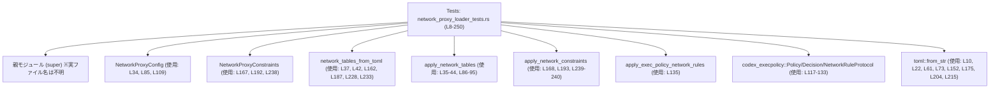
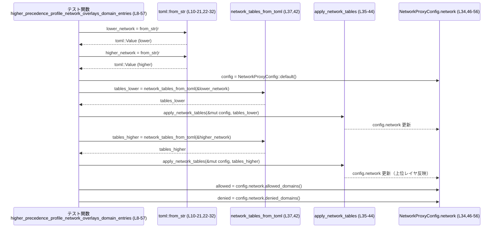
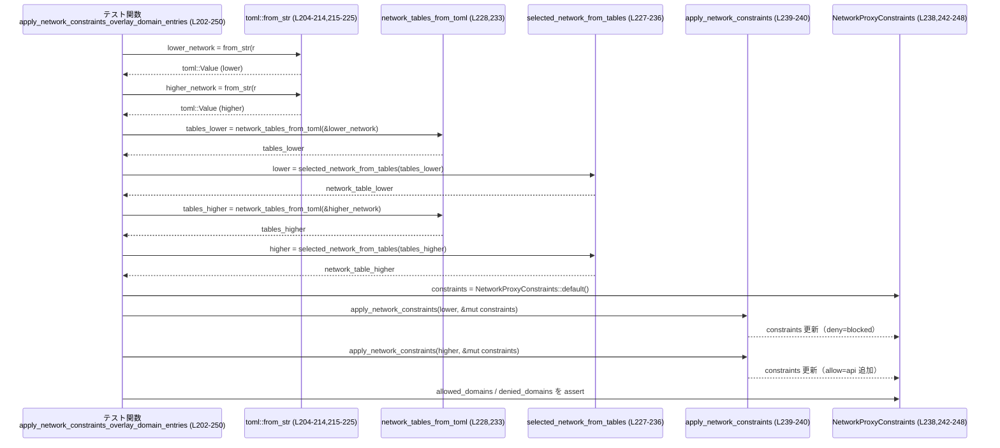

core/src/network_proxy_loader_tests.rs コード解説
================================================

## 0. ざっくり一言

- ネットワークプロキシ設定ローダの **TOML からの読み込み・レイヤリング** と、実行ポリシー (`codex_execpolicy`) や `NetworkProxyConstraints` への **反映ロジックの契約（振る舞い）** を検証する単体テスト群です（`core/src/network_proxy_loader_tests.rs:L8-250`）。
- ドメインごとの allow/deny、`dangerously_allow_all_unix_sockets` フラグなどが、複数レイヤ・ExecPolicy からどのようにマージされるべきかを確認しています。

---

## 1. このモジュールの役割

### 1.1 概要

- このモジュールは **ネットワークアクセス許可設定のレイヤリングの仕様が守られているか** を検証するために存在し、次の動作をテストしています。
  - 複数のプロフィール（TOML）を **優先度順に重ねたときのドメイン allow/deny のマージ**（`core/src/network_proxy_loader_tests.rs:L8-105`）。
  - ExecPolicy のネットワークルールが、既存の allow/deny リストをどのように **上書き・拡張** するか（`L107-148`）。
  - `NetworkProxyConstraints` に対して、プロフィールやレイヤからの情報がどのように **転写・レイヤリング** されるか（`L150-250`）。

### 1.2 アーキテクチャ内での位置づけ

このファイルは `use super::*;` により、親モジュール（おそらく `network_proxy_loader` 相当）に定義された公開 API をテストしています（`core/src/network_proxy_loader_tests.rs:L1`）。

主な依存関係を図示すると次のようになります。



※ 親モジュールの具体的なファイルパス・型定義は、このチャンクには現れません。

### 1.3 設計上のポイント

コードから読み取れる特徴は次のとおりです。

- **レイヤリング前提のテスト構成**
  - 「lower」「higher」と名付けた TOML ネットワーク設定を順に適用し、優先度の高いレイヤがどのように下位を上書き・統合するかを集中的に検証しています（`L8-57`, `L59-105`, `L202-250`）。
- **ExecPolicy と設定ファイルの統合**
  - `codex_execpolicy::Policy` のネットワークルールが、既存の allow/deny リストをどのように変更するかをテストしています（`L107-148`）。
- **Result/Option ベースのエラー処理を `expect` で強制成功**
  - `toml::from_str(...).expect("...")` や `network_tables_from_toml(...).expect("...")` など、失敗時に panic する形でテストを簡潔に書いています（`L10-21`, `L22-32`, `L37`, `L42`, `L162-165` など）。
- **状態管理はミュータブル構造体に集約**
  - `NetworkProxyConfig` および `NetworkProxyConstraints` を `mut` で保持し、適用関数呼び出しごとに状態が更新される前提になっています（`L34`, `L85`, `L109`, `L167`, `L192`, `L238`）。
- **安全性・並行性**
  - `unsafe` やスレッド/async 関連の要素はなく、すべて同期的なテストです。
- **可読性向上のためのアサート**
  - `pretty_assertions::assert_eq` を利用し、テスト失敗時に差分が見やすいようにしています（`L6`, `L46-56` など）。

### 1.4 コンポーネント一覧（このファイルに現れる主な要素）

| 名前 | 種別 | 定義/使用箇所 | 役割 / 説明 |
|------|------|---------------|-------------|
| `higher_precedence_profile_network_overlays_domain_entries` | 関数（`#[test]`） | 定義: `core/src/network_proxy_loader_tests.rs:L8-57` | 異なるレイヤのドメインリストが「和集合」としてマージされる挙動をテストします。 |
| `higher_precedence_profile_network_overrides_matching_domain_entries` | 関数（`#[test]`） | 定義: `L59-105` | 同一ドメインに対して上位レイヤの allow/deny が下位レイヤを上書きする挙動をテストします。 |
| `execpolicy_network_rules_overlay_network_lists` | 関数（`#[test]`） | 定義: `L107-148` | ExecPolicy のネットワークルールが設定済み allow/deny リストをどのように変更するかをテストします。 |
| `apply_network_constraints_includes_allow_all_unix_sockets_flag` | 関数（`#[test]`） | 定義: `L150-171` | TOML の `dangerously_allow_all_unix_sockets` フラグが `NetworkProxyConstraints` にコピーされることをテストします。 |
| `apply_network_constraints_skips_empty_domain_sides` | 関数（`#[test]`） | 定義: `L173-200` | 片側のみドメインが設定されている場合、もう一方は `None` のままになることをテストします。 |
| `apply_network_constraints_overlay_domain_entries` | 関数（`#[test]`） | 定義: `L202-250` | 複数レイヤのネットワーク設定から `NetworkProxyConstraints` へのレイヤリング挙動をテストします。 |
| `NetworkProxyConfig` | 構造体（定義は他ファイル） | 使用: `L34`, `L85`, `L109` | `network` フィールドを通じてドメイン allow/deny リストを保持する設定オブジェクトとして使われています。 |
| `NetworkProxyConstraints` | 構造体（定義は他ファイル） | 使用: `L167-170`, `L192-199`, `L238-249` | 実際のプロキシに渡す制約（allowed/denied ドメイン、UNIX ソケット許可フラグなど）を保持するオブジェクトとして使われています。 |
| `network_tables_from_toml` | 関数（定義は他ファイル） | 使用: `L37`, `L42`, `L162`, `L187`, `L228`, `L233` | TOML (`toml::Value`) からネットワークテーブル情報を構築する関数で、`expect` が呼ばれていることから失敗可能であると分かります。 |
| `selected_network_from_tables` | 関数（定義は他ファイル） | 使用: `L161-165`, `L186-190`, `L227-236` | 複数存在しうるネットワークテーブルから「選択された」テーブルを返す関数です。戻り値は 2 段階の `expect` から Option/Result ライクであることが分かります。 |
| `apply_network_tables` | 関数（定義は他ファイル） | 使用: `L35-44`, `L86-95` | `NetworkProxyConfig` にネットワークテーブルを適用する関数で、`expect` から失敗可能であると分かります。 |
| `apply_exec_policy_network_rules` | 関数（定義は他ファイル） | 使用: `L135` | ExecPolicy のネットワークルールを `NetworkProxyConfig` に反映する関数です。 |
| `apply_network_constraints` | 関数（定義は他ファイル） | 使用: `L168`, `L193`, `L239-240` | 選択されたネットワークテーブルから `NetworkProxyConstraints` へ値を流し込む関数です。 |
| `Policy` | 構造体（外部 crate） | 使用: `L117-133` | ExecPolicy オブジェクト。`empty` コンストラクタと `add_network_rule` メソッドが使われています。 |
| `Decision` | 列挙体（外部 crate） | 使用: `L122`, `L130` | ネットワークルールの決定（Allow / Forbidden）を表します。 |
| `NetworkRuleProtocol` | 列挙体（外部 crate） | 使用: `L121`, `L129` | ネットワークルールのプロトコル (Http / Https) を表します。 |
| `toml::Value` / `toml::from_str` | 型 / 関数（外部 crate） | 使用: `L10-21`, `L22-32`, `L61-72`, `L73-83`, `L152-160`, `L175-185`, `L204-214`, `L215-225` | TOML 設定のパースと保持に使用されています。 |

---

## 2. 主要な機能一覧

このテストモジュールが検証している主な機能は次のとおりです。

- **ネットワークドメインリストのレイヤリング**
  - 複数のプロフィール（lower/higher）からのドメイン allow/deny の **統合（和集合）と上書き** の挙動（`L8-57`, `L59-105`）。
- **ExecPolicy によるネットワークルールのオーバーレイ**
  - 既存の `allowed_domains` / `denied_domains` に対して、ExecPolicy のルールがどのように影響するか（`L107-148`）。
- **NetworkProxyConstraints へのマッピング**
  - TOML の `dangerously_allow_all_unix_sockets` フラグが `NetworkProxyConstraints` に反映されること（`L150-171`）。
  - allow/deny のどちらか一方のみが設定された場合、もう一方は `None` のままに保つこと（`L173-200`）。
  - 複数レイヤを順に適用したときの `NetworkProxyConstraints` のレイヤリング挙動（`L202-250`）。

---

## 3. 公開 API と詳細解説

### 3.1 型一覧（構造体・列挙体など）

※ ここでは **このファイルから利用されている型** をまとめます。定義そのものは他ファイル／他 crate にあります。

| 名前 | 種別 | 役割 / 用途 | 根拠 |
|------|------|-------------|------|
| `NetworkProxyConfig` | 構造体 | `.network` フィールドを通じて `allowed_domains`, `denied_domains` のような設定を保持し、`default()` で初期化される設定オブジェクトとして使われています。 | 使用例: `let mut config = NetworkProxyConfig::default();`（`L34`, `L85`, `L109`）と、`config.network.allowed_domains()` / `denied_domains()` の呼び出し（`L46-56`, `L97-104`, `L137-147`）。 |
| `NetworkProxyConstraints` | 構造体 | ネットワーク制約（allowed/denied ドメインリストや `dangerously_allow_all_unix_sockets` フラグ）を保持するオブジェクト。`default()` で初期化されます。 | 使用例: `let mut constraints = NetworkProxyConstraints::default();`（`L167`, `L192`, `L238`）と、`constraints.allowed_domains`, `constraints.denied_domains`, `constraints.dangerously_allow_all_unix_sockets` へのアクセス（`L170`, `L195-199`, `L242-248`）。 |
| `Policy` | 構造体（`codex_execpolicy`） | 実行ポリシーのネットワークルールを保持するオブジェクト。`Policy::empty()` で空ポリシーを生成し、`add_network_rule` でルールを追加しています。 | 使用例: `let mut exec_policy = Policy::empty();`（`L117`）, `.add_network_rule(...).expect("...")`（`L118-125`, `L126-133`）。 |
| `Decision` | 列挙体（`codex_execpolicy`） | ネットワークルールの決定（許可 / 禁止）を表現します。テストでは `Allow` と `Forbidden` が使われています。 | 使用例: `Decision::Allow`（`L122`）, `Decision::Forbidden`（`L130`）。 |
| `NetworkRuleProtocol` | 列挙体（`codex_execpolicy`） | ネットワークルールの対象プロトコルを表現します。テストでは `Https` と `Http` が使われています。 | 使用例: `NetworkRuleProtocol::Https`（`L121`）, `NetworkRuleProtocol::Http`（`L129`）。 |
| `toml::Value` | 構造体（外部 crate） | TOML 設定ツリーを表現する型です。各テストでインメモリの TOML を構築するのに使われています。 | 使用例: `let lower_network: toml::Value = toml::from_str(r#"..."#)?;`（`L10-21`, `L22-32`, `L61-72`, `L73-83`, `L152-160`, `L175-185`, `L204-214`, `L215-225`）。 |

### 3.2 関数詳細（テスト関数）

以下では、このファイルに定義されている 6 つのテスト関数を詳細に説明します。

#### `higher_precedence_profile_network_overlays_domain_entries()`

**概要**

- lower/higher 2 つのネットワークプロフィールを順に適用した際、**互いに異なるドメインエントリは和集合としてマージされる**ことを検証するテストです（`core/src/network_proxy_loader_tests.rs:L8-57`）。

**引数**

- なし（テスト関数であり、引数を取りません）。

**戻り値**

- なし（戻り値型は `()`）。

**内部処理の流れ**

1. `lower_network` TOML を `toml::from_str` でパース（`L10-21`）。
   - `permissions.workspace.network.domains` に `lower.example.com = "allow"`, `blocked.example.com = "deny"` が定義されています（`L16-18`）。
2. `higher_network` TOML を同様にパース（`L22-32`）。
   - `higher.example.com = "allow"` のみ定義（`L28-29`）。
3. `NetworkProxyConfig::default()` で空の設定を作成（`L34`）。
4. lower のネットワークテーブルを `apply_network_tables` で適用（`L35-39`）。
5. higher のネットワークテーブルを同じ `config` に適用（`L40-44`）。
6. 最終的な `config.network.allowed_domains()` が `["lower.example.com", "higher.example.com"]` になることを検証（`L46-52`）。
7. `config.network.denied_domains()` が `["blocked.example.com"]` のみであることを検証（`L53-56`）。

**Examples（使用例）**

テスト本体がそのまま使用例になっています。簡略化すると次のような流れです。

```rust
// TOML から lower / higher を読み込む
let lower_network: toml::Value = toml::from_str(r#"...lower..."#).expect("parse");
let higher_network: toml::Value = toml::from_str(r#"...higher..."#).expect("parse");

// 空の設定を用意
let mut config = NetworkProxyConfig::default();

// lower を適用
apply_network_tables(
    &mut config,
    network_tables_from_toml(&lower_network).expect("lower deserialize"),
).expect("lower apply");

// higher を適用
apply_network_tables(
    &mut config,
    network_tables_from_toml(&higher_network).expect("higher deserialize"),
).expect("higher apply");

// 結果を確認
assert_eq!(
    config.network.allowed_domains(),
    Some(vec!["lower.example.com".to_string(), "higher.example.com".to_string()])
);
assert_eq!(
    config.network.denied_domains(),
    Some(vec!["blocked.example.com".to_string()])
);
```

**Errors / Panics**

- `toml::from_str(...).expect("...")` がパース失敗時に panic します（`L10-21`, `L22-32`）。
- `network_tables_from_toml(...).expect("...")` がデシリアライズ失敗時に panic します（`L37`, `L42`）。
- `apply_network_tables(...).expect("...")` が適用失敗時に panic します（`L39`, `L44`）。

**Edge cases（エッジケース）**

- lower と higher のドメインが重複していないケースを扱っています。
- テストから読み取れる契約として、**下位レイヤで deny されたドメインは、上位レイヤで同じドメインが扱われない限り保持される**ことが確認されています（`blocked.example.com` が deny のまま残る: `L53-56`）。

**使用上の注意点**

- 実際の利用コードでは `expect` ではなく、`Result`/`Option` を適切に扱うエラーハンドリングが必要と考えられます（本テストからは実装側の詳細は分かりません）。
- レイヤリング順序が結果に影響するため、**優先度の低い設定から高い設定へ順に適用する**ことが前提になっています（ここでは lower → higher）。

---

#### `higher_precedence_profile_network_overrides_matching_domain_entries()`

**概要**

- lower と higher で **同じドメインキーが異なる allow/deny を持つ場合、優先度の高いプロフィールが完全に上書きする**ことを検証するテストです（`L59-105`）。

**内部処理の流れ**

1. `lower_network` には `shared.example.com = "deny"`, `other.example.com = "allow"` を定義（`L61-70`）。
2. `higher_network` には `shared.example.com = "allow"` を定義（`L73-81`）。
3. `NetworkProxyConfig::default()` を生成し、lower → higher の順に `apply_network_tables` で適用（`L85-95`）。
4. 最終的な `allowed_domains()` が `["other.example.com", "shared.example.com"]` であることを検証（`L97-103`）。
5. `denied_domains()` が `None`（deny リストが空扱い）であることを検証（`L104`）。

**テストが示す契約**

- `shared.example.com` は lower で deny、higher で allow ですが、**最終状態では allow 側に入り、deny 側からは消える**ことをこのテストが前提にしています（`L97-104`）。
- deny のドメインが高優先度レイヤで allow として再定義された場合、**deny から除外される**ことが期待されています。

**Edge cases**

- 同じドメインに対して異なる decision（deny → allow）がレイヤをまたいで定義されたケース。
- `denied_domains()` が `None` になることから、「空リスト」ではなく「設定なし」として扱う契約を確認しています（`L104`）。

**使用上の注意点**

- レイヤリングロジックを変更する際、このテストは「**同一ドメインについては上位レイヤの決定が勝つ**」という契約を表現しているため、仕様変更時にはテストの見直しが必要です。

---

#### `execpolicy_network_rules_overlay_network_lists()`

**概要**

- `NetworkProxyConfig` に既に設定された allow/deny リストに対し、ExecPolicy のネットワークルールを適用した際の挙動を検証するテストです（`L107-148`）。
- 特に、ExecPolicy による allow/forbidden が既存のドメイン分類を **上書き・拡張** することを確認しています。

**内部処理の流れ**

1. `NetworkProxyConfig::default()` を生成（`L109`）。
2. `config.network.set_allowed_domains(["config.example.com"])` で初期 allowed を設定（`L110-112`）。
3. `config.network.set_denied_domains(["blocked.example.com"])` で初期 denied を設定（`L113-115`）。
4. `Policy::empty()` で空のポリシーを作成（`L117`）。
5. `add_network_rule("blocked.example.com", Https, Allow)` を追加（`L118-125`）。
6. `add_network_rule("api.example.com", Http, Forbidden)` を追加（`L126-133`）。
7. `apply_exec_policy_network_rules(&mut config, &exec_policy)` を呼び出し、ポリシーを適用（`L135`）。
8. 最終的な `allowed_domains()` が `["config.example.com", "blocked.example.com"]` であることを検証（`L137-143`）。
9. `denied_domains()` が `["api.example.com"]` のみであることを検証（`L144-147`）。

**テストが示す契約**

- **もともと `denied_domains` にあった `blocked.example.com` が、ExecPolicy の Allow ルールによって allowed に移動し、denied からは消える**ことをこのテストが前提としています。
- 新たに Forbidden が設定された `api.example.com` は、denied 側に追加されます。

**Edge cases**

- プロトコル（Http / Https）は ExecPolicy では区別されていますが、最終的な `allowed_domains` / `denied_domains` の比較ではドメイン名のみを見ています（`L120-123`, `L128-131`, `L137-147`）。
  - つまり、このテストだけからは「プロトコルの違いが allow/deny リストにどう反映されるか」は分かりません。
- ExecPolicy による変更が **既存設定を完全に置き換えるのか、部分的に上書きするのか** のうち、ここでは「部分的な上書き」であること（元の `config.example.com` は保持される）を検証しています。

**使用上の注意点**

- セキュリティ観点では、ExecPolicy の Allow が既存の deny を打ち消すことになるため、**ポリシーの優先度** に関する設計が重要です（このテストは「ExecPolicy が優先する」前提になっています）。
- ここでも `add_network_rule(...).expect("...")` により、ルール追加の失敗は panic になります（`L118-125`, `L126-133`）。

---

#### `apply_network_constraints_includes_allow_all_unix_sockets_flag()`

**概要**

- TOML のネットワーク設定に `dangerously_allow_all_unix_sockets = true` が設定されている場合に、`NetworkProxyConstraints` の同名フラグへ正しく反映されることを検証するテストです（`L150-171`）。

**内部処理の流れ**

1. `config` TOML を `toml::from_str` でパース（`L152-160`）。
   - `[permissions.workspace.network]` セクションで `dangerously_allow_all_unix_sockets = true` を設定（`L156-157`）。
2. `network_tables_from_toml(&config)` でネットワークテーブル群に変換し（`L162`）、`selected_network_from_tables(...)` で1つのネットワークテーブルを選択（`L161-165`）。
3. `NetworkProxyConstraints::default()` を生成し（`L167`）、`apply_network_constraints(network, &mut constraints)` を呼び出し（`L168`）。
4. 最終的に `constraints.dangerously_allow_all_unix_sockets == Some(true)` であることを検証（`L170`）。

**Edge cases**

- フラグが設定されている場合のみを扱っています。`false` または未設定の場合の挙動はこのファイルからは分かりません。
- `dangerously_allow_all_unix_sockets` という名称から、**強い制限解除（セキュリティリスクの高い設定）** を示すフラグであることが推測されますが、実際の影響はこのファイルからは分かりません。

**使用上の注意点**

- このフラグは名前の通り危険な設定であることが想定されるため、実際の使用時には **明示的な意図を持って有効化する必要** があると考えられます（テストはフラグの伝搬だけを確認しています）。

---

#### `apply_network_constraints_skips_empty_domain_sides()`

**概要**

- allow 側のドメインだけが設定されている場合に、`NetworkProxyConstraints` の denied 側が `None` のまま保持される（空リストにはしない）ことを検証するテストです（`L173-200`）。

**内部処理の流れ**

1. `config` TOML をパース（`L175-185`）。
   - `permissions.workspace.network.domains` に `managed.example.com = "allow"` を設定（`L181-182`）。
   - deny 側の定義は存在しません。
2. `selected_network_from_tables(network_tables_from_toml(&config))` でネットワークテーブルを選択（`L186-190`）。
3. `NetworkProxyConstraints::default()` を作成し（`L192`）、`apply_network_constraints` を適用（`L193`）。
4. `constraints.allowed_domains == Some(vec!["managed.example.com".to_string()])` を確認（`L195-198`）。
5. `constraints.denied_domains == None` を確認（`L199`）。

**テストが示す契約**

- ドメインリストの一方のみが設定されている場合、**もう一方は Some(vec![]) ではなく None のまま** であることが期待されています。
  - これは、呼び出し側のロジックが「None = 未指定」「Some(empty) = 明示的に空」と区別している可能性を示唆します。

**使用上の注意点**

- `apply_network_constraints` を利用する際、この `None` / 空リストの違いが評価ロジックに影響しうるため、呼び出し元の評価コードがこの契約に沿っている必要があります。

---

#### `apply_network_constraints_overlay_domain_entries()`

**概要**

- lower と higher の 2 つのネットワークテーブルを順に `apply_network_constraints` で適用した場合の **レイヤリング挙動**（allow/deny の和集合と優先度）を検証するテストです（`L202-250`）。

**内部処理の流れ**

1. `lower_network` TOML をパースし、`"blocked.example.com" = "deny"` を設定（`L204-214`, `L210-211`）。
2. `higher_network` TOML をパースし、`"api.example.com" = "allow"` を設定（`L215-225`, `L221-222`）。
3. 両方の TOML から `selected_network_from_tables(network_tables_from_toml(...))` を使ってネットワークテーブルを取得（`L227-236`）。
4. 空の `NetworkProxyConstraints` を生成（`L238`）。
5. lower → higher の順に `apply_network_constraints` を適用（`L239-240`）。
6. 最終的に
   - `constraints.allowed_domains == Some(vec!["api.example.com".to_string()])`（`L242-245`）
   - `constraints.denied_domains == Some(vec!["blocked.example.com".to_string()])`（`L246-248`）
   であることを検証。

**テストが示す契約**

- lower の deny (`blocked.example.com`) は higher で上書きされない限り維持されます。
- higher の allow (`api.example.com`) は、既存の deny に影響を与えず、allowed 側に追加されます。
- ここでは同じドメインの競合がないパターンを扱っており、**レイヤごとの設定が単純に和集合でマージされる**パターンです。

**Edge cases**

- deny のみ／allow のみの lower/higher 組み合わせのうち、「下位が deny、上位が別ドメイン allow」のケースを扱っています。
- 同一ドメインでの競合は、このテストでは扱っていません（競合時の挙動は親モジュールの実装と別テストで決まります）。

**使用上の注意点**

- `apply_network_constraints` の呼び出し順に依存する挙動であることがテストから分かります（`L239-240`）。
  - 仕様として、**優先度の低い制約 → 高い制約** の順で適用することを前提にしていると解釈できます。

---

### 3.3 その他の関数（このファイルから呼び出されるコア API）

定義はこのファイルにはありませんが、本テストを通じて利用されている主要 API をまとめます。

| 関数名 / メソッド名 | 役割（1 行） | 使用箇所 |
|---------------------|--------------|----------|
| `network_tables_from_toml(&toml::Value)` | TOML の設定ツリーからネットワークテーブル群へ変換する関数。戻り値は `expect` が使われていることから失敗可能な型です。 | `L37`, `L42`, `L162`, `L187`, `L228`, `L233` |
| `selected_network_from_tables(...)` | 複数のネットワークテーブルから 1 つを選択する関数。戻り値は 2 段階で `expect` を呼んでいることから、`Result<Option<...>>` のような構造と推測されます。 | `L161-165`, `L186-190`, `L227-236` |
| `apply_network_tables(&mut NetworkProxyConfig, tables, ...)` | ネットワークテーブルを `NetworkProxyConfig` に適用する関数。`expect` から失敗可能であることが分かります。 | `L35-44`, `L86-95` |
| `apply_exec_policy_network_rules(&mut NetworkProxyConfig, &Policy)` | ExecPolicy のネットワークルールを `NetworkProxyConfig` に適用する関数。 | `L135` |
| `apply_network_constraints(network, &mut NetworkProxyConstraints)` | ネットワークテーブルから `NetworkProxyConstraints` に値をコピー/レイヤリングする関数。 | `L168`, `L193`, `L239-240` |
| `NetworkProxyConfig::default()` | 初期状態のネットワークプロキシ設定を生成するコンストラクタ。 | `L34`, `L85`, `L109` |
| `NetworkProxyConstraints::default()` | 初期状態のネットワーク制約オブジェクトを生成するコンストラクタ。 | `L167`, `L192`, `L238` |
| `config.network.allowed_domains()` / `denied_domains()` | 現在の設定における allow/deny ドメインリストを `Option` ライクな形で取得するメソッド。 | `L46-56`, `L97-104`, `L137-147` |
| `config.network.set_allowed_domains(Vec<String>)` / `set_denied_domains(Vec<String>)` | 手動で allow/deny リストを設定するメソッド。 | `L110-115` |
| `Policy::empty()` | 空の ExecPolicy を生成する関連関数。 | `L117` |
| `Policy::add_network_rule(host, protocol, decision, justification)` | ドメインごとのネットワークルールをポリシーに追加するメソッド。`expect` から失敗可能であることが分かります。 | `L118-125`, `L126-133` |

---

## 4. データフロー

### 4.1 プロファイルレイヤリング時のデータフロー

`higher_precedence_profile_network_overlays_domain_entries (L8-57)` を例に、TOML → テーブル → Config へのデータフローを示します。



- 2 つの TOML からそれぞれネットワークテーブルを作成し、**同じ `config` インスタンスに順に適用する**ことでレイヤリングを実現していることが分かります（`L34-44`）。
- 最終的な `allowed_domains` / `denied_domains` によって、レイヤリング結果が検証されています（`L46-56`）。

### 4.2 Constraints レイヤリング時のデータフロー

`apply_network_constraints_overlay_domain_entries (L202-250)` では、2 つのネットワークテーブルから `NetworkProxyConstraints` へのレイヤリングが行われています。



- Config ではなく Constraints に対しても、**複数テーブルを順に適用するパターン**が採用されています（`L238-240`）。

---

## 5. 使い方（How to Use）

### 5.1 基本的な使用方法（テストから読み取れるパターン）

このファイルのテストは、ネットワーク設定ローダを次のような流れで使うことを想定していると読めます。

1. TOML 文字列（またはファイル）から `toml::Value` を得る。
2. `network_tables_from_toml(&toml::Value)` でネットワークテーブル群を生成する。
3. 必要に応じて `selected_network_from_tables(...)` で 1 つのテーブルを選択する。
4. `NetworkProxyConfig` には `apply_network_tables` や `apply_exec_policy_network_rules` を使って設定を流し込む。
5. 実際のプロキシ実装には `NetworkProxyConstraints` を使い、`apply_network_constraints` で必要な情報を転写する。

擬似コードとしてまとめると次のようになります（シグネチャはテストから推測したものを簡略化しています）。

```rust
// 1. TOML から設定を読み込む
let config_toml: toml::Value = toml::from_str(r#"
default_permissions = "workspace"

[permissions.workspace.network]
dangerously_allow_all_unix_sockets = true

[permissions.workspace.network.domains]
"example.com" = "allow"
"blocked.example.com" = "deny"
"#).expect("permissions profile should parse");

// 2. ネットワークテーブルを構築し、選択する
let tables = network_tables_from_toml(&config_toml)
    .expect("permissions profile should deserialize");

let network = selected_network_from_tables(tables)
    .expect("permissions profile should select a network table")
    .expect("network table should be present");

// 3. NetworkProxyConfig に適用する
let mut config = NetworkProxyConfig::default();
apply_network_tables(&mut config, network.clone())
    .expect("network tables should apply");

// 4. ExecPolicy を組み合わせてオーバーレイする
let mut exec_policy = Policy::empty();
exec_policy
    .add_network_rule(
        "blocked.example.com",
        NetworkRuleProtocol::Https,
        Decision::Allow,
        None,
    )
    .expect("allow rule should be valid");
apply_exec_policy_network_rules(&mut config, &exec_policy);

// 5. Constraints を構築する
let mut constraints = NetworkProxyConstraints::default();
apply_network_constraints(network, &mut constraints);

// 6. 最終的な allow/deny 情報を取得する
let allowed = constraints.allowed_domains.clone();
let denied = constraints.denied_domains.clone();
let allow_unix = constraints.dangerously_allow_all_unix_sockets;
```

> 注: `network` の `clone` は実際の型が `Clone` を実装しているかどうか、このファイルからは分かりません。ここでは説明のための擬似コードです。

### 5.2 よくある使用パターン

テストから読み取れる典型的なパターンは次の 3 つです。

1. **複数プロフィールのレイヤリング**
   - lower → higher の順に `apply_network_tables` を呼び出し、上位の設定で下位を上書き・補完する（`L34-44`, `L85-95`）。

2. **ExecPolicy によるポリシーオーバーレイ**
   - 初期設定として TOML 由来の allow/deny を config に設定し、その上に ExecPolicy ルールを `apply_exec_policy_network_rules` で重ねる（`L109-147`）。

3. **Constraints への投影**
   - 実際に使うプロキシ制約用構造体には、選択済みテーブルから `apply_network_constraints` で投影する（`L167-170`, `L192-199`, `L238-248`）。

### 5.3 よくある間違い（起こり得る誤用と正しい形）

このファイルのテストが防ごうとしている／想定している誤用例を、推測の範囲で整理すると次のようになります。

```rust
// 誤りの可能性: Constraints を構築する際に、selected_network_from_tables を忘れる
let tables = network_tables_from_toml(&config_toml).expect("deserialize");
// let network = tables; // 直接 tables を使ってしまう（正しい型ではないかもしれない）

let mut constraints = NetworkProxyConstraints::default();
// apply_network_constraints(tables, &mut constraints); // コンパイルエラーまたは誤った使用

// 正しい例: 必ず selected_network_from_tables を通して単一のネットワークテーブルを取得する
let network = selected_network_from_tables(tables)
    .expect("select network table")
    .expect("network table should be present");
apply_network_constraints(network, &mut constraints);
```

```rust
// 誤りの可能性: allowed/denied の「空」を Some(vec![]) で表現してしまう
constraints.allowed_domains = Some(vec![]); // 「許可はゼロ件」と解釈されるかもしれない
constraints.denied_domains = Some(vec![]);

// 正しい例（このテストが期待する形）: 片側のみ設定されている場合はもう一方を None にする
constraints.allowed_domains = Some(vec!["managed.example.com".to_string()]);
constraints.denied_domains = None;
```

※ 上記はテストの期待値から推測した「ありそうな誤用」であり、実際の実装・コンパイラエラーの詳細はこのファイルからは分かりません。

### 5.4 使用上の注意点（まとめ）

- **エラーハンドリング**
  - 本ファイルではすべて `expect` でエラーを即座に panic としていますが、実際のアプリケーションではユーザー向けエラーとして扱う必要があります（特に TOML パース・デシリアライズ・ポリシー読み込み）。
- **レイヤリング順序**
  - lower → higher の順に適用している点が重要です（`L34-44`, `L85-95`, `L239-240`）。順番が逆になると仕様と異なる結果になる可能性があります。
- **ExecPolicy の優先度**
  - ExecPolicy による Allow が既存の deny を打ち消す挙動がテストされています（`L137-147`）。セキュリティ設計上、どのレイヤが最終決定権を持つかを明確にする必要があります。
- **危険なフラグの扱い**
  - `dangerously_allow_all_unix_sockets` は、名前からして制約をほぼ無効化しうるフラグであり、**デフォルトで有効にすべきではない**種別のオプションと考えられます（テストはフラグの伝搬のみ確認: `L156-157`, `L170`）。

---

## 6. 変更の仕方（How to Modify）

### 6.1 新しい機能を追加する場合

このファイルの観点では、「新しい機能を追加する」とは主に **新しいネットワーク設定項目やレイヤリングルール** を実装し、それをテストで検証することを意味します。

ステップの例:

1. **親モジュールに機能を追加**
   - 例: 新しいフラグ `max_connections` をネットワーク設定に追加し、`network_tables_from_toml` → `apply_network_constraints` まで値が伝わるようにする。
2. **Constraints / Config へのフィールド追加**
   - `NetworkProxyConfig` / `NetworkProxyConstraints` に対応するフィールドを追加（このファイルには定義がないため、対象ファイルを別途確認する必要があります）。
3. **テストケースの追加**
   - このファイルに新しい `#[test]` 関数を追加し、TOML 定義 → `network_tables_from_toml` → `selected_network_from_tables` → `apply_network_constraints` / `apply_network_tables` までの一連の流れを検証します。
   - 既存のテストと同じパターンに従って、`expect` と `assert_eq!` を組み合わせて書くと、一貫したスタイルになります。

### 6.2 既存の機能を変更する場合

レイヤリング仕様や ExecPolicy の優先度など、コアロジックを変更する場合に注意すべき点:

- **影響範囲の確認**
  - `apply_network_tables`, `apply_exec_policy_network_rules`, `apply_network_constraints` の挙動を変えると、このファイルのすべてのテストに影響する可能性があります（`L8-57`, `L59-105`, `L107-148`, `L150-250`）。
- **契約（前提条件・返り値の意味）の維持**
  - 例えば、「同一ドメインに対して上位レイヤが勝つ」（`higher_precedence_profile_network_overrides_matching_domain_entries`: `L59-105`）、「ExecPolicy の Allow が既存の deny を上書きする」（`L107-148`）といった契約を変える場合、意図的な仕様変更であることを明示し、テストもそれに合わせて更新する必要があります。
- **Option vs 空リストの扱い**
  - `apply_network_constraints_skips_empty_domain_sides`（`L173-200`）は `None` / `Some(vec![])` の意味の違いに関する契約テストです。この挙動を変えるかどうかは慎重に検討する必要があります。
- **テストの追加・修正**
  - 新しいエッジケース（例: allow と deny の両方に同じドメインが異なるレイヤにまたがって設定される）をサポートする場合は、対応するテストケースを追加して契約を明文化することが有用です。

---

## 7. 関連ファイル

このモジュールと密接に関係すると思われるファイル・crate をまとめます。

| パス / クレート名 | 役割 / 関係 |
|-------------------|------------|
| （推測）`core/src/network_proxy_loader.rs` | このテストが `use super::*;` で参照している親モジュール。`NetworkProxyConfig`, `NetworkProxyConstraints`, `network_tables_from_toml`, `selected_network_from_tables`, `apply_network_tables`, `apply_exec_policy_network_rules`, `apply_network_constraints` などの実装が含まれていると考えられます（ただし、このチャンクには具体的なパスは現れません）。 |
| `codex_execpolicy` クレート | `Policy`, `Decision`, `NetworkRuleProtocol` を提供し、ExecPolicy のネットワークルールを定義・適用するために使われています（`L3-5`, `L117-133`, `L135`）。 |
| `toml` クレート | TOML 文字列のパース (`toml::from_str`) と設定ツリー (`toml::Value`) を提供します（`L10-21`, `L22-32`, `L61-72`, `L73-83`, `L152-160`, `L175-185`, `L204-214`, `L215-225`）。 |
| `pretty_assertions` クレート | `assert_eq!` マクロの差分表示を改善し、テスト失敗時の可読性を向上させるために使われています（`L6`, および各 `assert_eq!` 呼び出し）。 |

---

このファイルは、ネットワークプロキシ設定ローダおよび関連する ExecPolicy / Constraints ロジックの **レイヤリング仕様とセキュリティ上重要なフラグの扱い** を明示的にテストする契約テスト集として位置づけられます。  
実装側の変更時には、ここで示されている期待値（特に allow/deny の優先度と `None` の扱い）を基準として互換性や仕様変更の影響を検討することが重要です。
