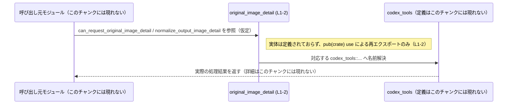

# core/src/original_image_detail.rs

## 0. ざっくり一言

このモジュールは、別モジュール／クレートらしき `codex_tools` が提供する `can_request_original_image_detail` と `normalize_output_image_detail` を、クレート内で再エクスポート（`pub(crate) use`）するだけの薄い窓口モジュールです（根拠: `original_image_detail.rs:L1-2`）。

---

## 1. このモジュールの役割

### 1.1 概要

- このモジュールは、`codex_tools` で定義されている 2 つのアイテム  
  `can_request_original_image_detail` / `normalize_output_image_detail` を  
  `pub(crate)` で再エクスポートします（根拠: `original_image_detail.rs:L1-2`）。
- これにより、クレート内部の他モジュールからは `codex_tools` に直接依存せずに、  
  `crate::original_image_detail::...` 経由でこれらのアイテムを利用できる構造になっています。

> ※両アイテムの「中身」（関数か型か、そのシグネチャや処理内容）は、このチャンクには現れていません。

### 1.2 アーキテクチャ内での位置づけ

このモジュールは、クレート内部の利用側コードと `codex_tools` との間に位置する、  
名前解決用の薄い仲介レイヤとして機能していると解釈できます。


- `original_image_detail` 自身はロジックを持たず、名前の再エクスポートのみを行います（根拠: `original_image_detail.rs:L1-2`）。

### 1.3 設計上のポイント

- **責務の分割**
  - このモジュールは **「API の窓口」** という単一の責務を持ち、処理ロジックは一切含みません（根拠: `original_image_detail.rs:L1-2`）。
- **状態管理**
  - フィールドや構造体定義が存在しないため、状態は一切持ちません（根拠: `original_image_detail.rs:L1-2`）。
- **可視性制御**
  - 両アイテムは `pub(crate)` で再エクスポートされており、**クレート内部には公開するが外部クレートには公開しない** という方針であることが読み取れます（根拠: `original_image_detail.rs:L1-2`）。
- **安全性・エラーハンドリング・並行性**
  - このモジュール自体には処理がないため、所有権・エラーハンドリング・並行性に関するロジックは一切含まれません。
  - これらの性質はすべて `codex_tools` 側の実装に依存します（`codex_tools` のコードはこのチャンクには現れません）。

---

## 2. 主要な機能一覧

このモジュールが提供する機能は、次の 2 つの再エクスポートに集約されます。

- `codex_tools::can_request_original_image_detail` の crate 内再エクスポート  
  （根拠: `original_image_detail.rs:L1-1`）
- `codex_tools::normalize_output_image_detail` の crate 内再エクスポート  
  （根拠: `original_image_detail.rs:L2-2`）

### 2.1 コンポーネントインベントリー

このチャンクから確認できる「公開されるアイテム」の一覧です（アイテムの**種別やシグネチャは不明**です）。

| 名前 | 種別 | 定義場所（元） | このモジュールでの扱い | 可視性 | 根拠 |
|------|------|----------------|------------------------|--------|------|
| `can_request_original_image_detail` | 不明（関数／型など） | `codex_tools::can_request_original_image_detail` | `pub(crate) use` による再エクスポート | crate 内公開 (`pub(crate)`) | `original_image_detail.rs:L1-1` |
| `normalize_output_image_detail` | 不明（関数／型など） | `codex_tools::normalize_output_image_detail` | `pub(crate) use` による再エクスポート | crate 内公開 (`pub(crate)`) | `original_image_detail.rs:L2-2` |

> 種別（関数・構造体・トレイトなど）は `use` 宣言からは判別できないため、「不明」としています。

---

## 3. 公開 API と詳細解説

### 3.1 型一覧（構造体・列挙体など）

このファイル内で新たに定義されている構造体・列挙体はありません（根拠: `original_image_detail.rs:L1-2`）。

| 名前 | 種別 | 役割 / 用途 | 根拠 |
|------|------|-------------|------|
| （なし） | - | このファイルには型定義が存在しません | `original_image_detail.rs:L1-2` |

### 3.2 アイテム詳細（再エクスポートされる API）

このセクションでは、`pub(crate) use` で再公開されている 2 つのアイテムについて、  
**このモジュール側から分かる範囲のみ** をテンプレートに沿って整理します。

---

#### `can_request_original_image_detail`（シグネチャはこのチャンクには現れない）

**概要**

- `codex_tools::can_request_original_image_detail` を、そのまま `pub(crate)` で再エクスポートするアイテムです（根拠: `original_image_detail.rs:L1-1`）。
- このモジュール経由で利用することで、呼び出し側は `codex_tools` への直接依存を避けることができます（一般的な再エクスポートの効果であり、コードから導かれる構造）。

**引数**

- 具体的な引数リストや型情報は、このチャンクには一切現れません。
- 実際のシグネチャは `codex_tools` 側の定義に依存します（このチャンクからは不明）。

**戻り値**

- 戻り値の型や意味も、このチャンクからは不明です。
- こちらも `codex_tools` 側の定義を参照する必要があります。

**内部処理の流れ（アルゴリズム）**

- このモジュールには関数本体が存在せず、`use` による再エクスポートだけが記述されています（根拠: `original_image_detail.rs:L1-1`）。
- そのため、「`original_image_detail` モジュール側の内部処理」というものは存在せず、
  - 呼び出しはコンパイラの名前解決により **直接 `codex_tools::can_request_original_image_detail` に紐づきます。**
- 実際の処理ロジック（アルゴリズム）は `codex_tools` 側にのみ存在し、このチャンクからは読み取れません。

**Examples（使用例）**

このモジュール経由でアイテムを利用する際の、**名前解決レベルの例**のみ示します。  
実際の引数や戻り値は不明なため、「呼び出しそのもの」はコメントとして表現します。

```rust
// 仮に core クレートのルートから `mod original_image_detail;` されているとすると、
// このようにインポートして利用できます。
// （このモジュール構成自体は一般的な例であり、実際のクレート構成はこのチャンクからは分かりません）
use crate::original_image_detail::can_request_original_image_detail;

fn example() {
    // 実際のシグネチャは codex_tools 側に依存します。
    // 以下は「このモジュール経由で名前解決される」というイメージを示すダミーコードです。

    // let result = can_request_original_image_detail(/* 引数不明 */);
    // println!("{:?}", result);
}
```

**Errors / Panics**

- このモジュール側にはロジックがないため、  
  **このモジュール固有のエラー発生条件や `panic!` は存在しません。**
- 実際にどのようなエラーが返されうるか、あるいは panic しうるかは、  
  `codex_tools::can_request_original_image_detail` の実装に依存します（このチャンクには現れません）。

**Edge cases（エッジケース）**

- 同様に、このモジュール側でのエッジケースは存在しません。
- どのような入力が許容され、どのような境界値でエラーになるか等は、`codex_tools` 側のコントラクト次第です。

**使用上の注意点**

- このモジュールは単なる再エクスポートであり、**安全性・エラー・並行性の性質はすべて元のアイテムに従います。**
- 利用者は `codex_tools` 側のドキュメントや型シグネチャを確認した上で、このモジュール経由で呼び出す必要があります。
- クレート内で `codex_tools` への直接依存を避けたい場合に、このモジュール経由で呼び出す構成が有効です。

---

#### `normalize_output_image_detail`（シグネチャはこのチャンクには現れない）

**概要**

- `codex_tools::normalize_output_image_detail` を `pub(crate)` で再エクスポートするアイテムです（根拠: `original_image_detail.rs:L2-2`）。
- こちらも同様に、クレート内部の利用コードが `codex_tools` に直接依存せずに済むようにする窓口です。

**引数・戻り値・内部処理**

- `can_request_original_image_detail` と同様、具体的なシグネチャおよび処理ロジックはこのチャンクには現れません。
- `original_image_detail` モジュールにはロジックがなく、名前解決のみが行われます（根拠: `original_image_detail.rs:L2-2`）。

**Examples（使用例）**

```rust
// 一般的なモジュール構成を仮定したインポート例です。
// 実際の引数・戻り値は codex_tools 側の定義に依存します。
use crate::original_image_detail::normalize_output_image_detail;

fn example_normalize() {
    // let normalized = normalize_output_image_detail(/* 引数不明 */);
    // println!("{:?}", normalized);
}
```

**Errors / Panics / Edge cases / 使用上の注意点**

- このモジュール側でのロジックはないため、  
  エラー・panic・エッジケース・スレッド安全性などはすべて `codex_tools` 側に依存します。
- 利用時の注意点も `codex_tools::normalize_output_image_detail` の仕様に従います。

---

### 3.3 その他の関数

- このファイル内で新たに定義されている関数やメソッドはありません（根拠: `original_image_detail.rs:L1-2`）。
- 存在するのは 2 つの `pub(crate) use` 宣言のみです。

---

## 4. データフロー

このモジュールはロジックを持たないため、実行時のデータフローではなく、  
**コンパイル時の名前解決・依存関係**の観点でのフローを示します。



要点:

- **このモジュール内では、実行時の処理は一切行われません。**
- 呼び出し元が `original_image_detail::...` を参照すると、  
  コンパイラの名前解決により `codex_tools::...` が実体として利用されます（根拠: `original_image_detail.rs:L1-2`）。
- データの形や流れ（型・所有権・エラーパスなど）は、`codex_tools` 側の実装に依存します。

---

## 5. 使い方（How to Use）

### 5.1 基本的な使用方法

このモジュールの主な役割は「**別モジュールのアイテムを crate 内で再公開する**」ことです。  
一般的な利用パターンの例を示します（クレート構成は仮定です）。

```rust
// 仮に core クレートのルートに mod original_image_detail; がある場合の例です。
// 実際の構成はこのチャンクからは不明ですが、一般的な利用イメージを示します。

use crate::original_image_detail::{
    can_request_original_image_detail,
    normalize_output_image_detail,
};

fn main_logic() {
    // ここでは「名前の経路」だけに注目します。
    // 実際のシグネチャは codex_tools 側に依存するため、呼び出しはコメントのみです。

    // let can = can_request_original_image_detail(/* 引数不明 */);
    // let normalized = normalize_output_image_detail(/* 引数不明 */);

    // println!("{:?} {:?}", can, normalized);
}
```

- このようにインポートすることで、呼び出し側は `codex_tools` という名前を意識せずに済みます。

### 5.2 よくある使用パターン

このモジュールの性質上、考えられるパターンは次のようなものです（一般的な再エクスポートの使い方）。

1. **クレート内部の共通窓口として利用する**
   - 他のモジュールからは常に `crate::original_image_detail::...` を使う。
   - 外部ライブラリや内部モジュールの構成変更を、このファイルで吸収しやすくなります。

2. **将来の差し替えポイントとして利用する**
   - 現在は単なる再エクスポートですが、将来的に wrapper 関数などを追加しても、  
     呼び出し側のコードを変えずにふるまいを変更できる構造になります。
   - この点も一般的なパターンであり、コード自体から読み取れるのは「再エクスポートされている」という事実のみです。

### 5.3 よくある間違い（想定されるもの）

このファイルの内容から直接読み取れる誤用は多くありませんが、再エクスポート構造においてありがちな点を挙げます。

- `codex_tools` から **直接インポート** してしまう
  - 例: `use codex_tools::can_request_original_image_detail;`
  - そうすると、「`original_image_detail` モジュール経由で依存をまとめる」という意図が崩れてしまう可能性があります。
- このファイルを変更せずに `codex_tools` 側の API が変わると、  
  クレート内の多くの箇所でコンパイルエラーが発生する可能性があります。

### 5.4 使用上の注意点（まとめ）

- このモジュールはロジックを持たないため、**性能・安全性・並行性に関する考慮はすべて `codex_tools` 側に委ねられています。**
- 利用者は、ここではなく `codex_tools` のドキュメント・型定義を見て、  
  どのようなエラーが起きうるか・どのようなスレッドセーフティを持つかを判断する必要があります。
- 再エクスポートを前提にクレート内コードを書いている場合、  
  `pub(crate)` → `pub` や、アイテム名の変更といった可視性の変更は広範囲な影響を及ぼす可能性があります。

---

## 6. 変更の仕方（How to Modify）

### 6.1 新しい機能を追加する場合

このファイルで行える主な拡張は、「再エクスポートするアイテムを増やす」か、  
「薄いラッパー関数を定義する」ことです。

1. **`codex_tools` の別アイテムを再エクスポートしたい場合**
   - このファイルに行を追加します。

   ```rust
   pub(crate) use codex_tools::新しいアイテム名;
   ```

   - これにより、クレート内の他のモジュールは `crate::original_image_detail::新しいアイテム名` を利用できます。

2. **将来的にふるまいを一部上書きしたい場合**
   - 再エクスポートではなく、ラッパー関数を定義する形に変更することが考えられます。
   - ただし、現状このファイルには関数定義がないため、実際にどう変更するかは  
     `codex_tools` のシグネチャを確認した上で設計する必要があります。

### 6.2 既存の機能を変更する場合

このファイルで既存機能を変更する際の注意点を列挙します。

- **可視性の変更**
  - `pub(crate)` を `pub` に変更すると、外部クレートからもアクセス可能になります。
  - API の公開範囲が広がるため、バージョニングや互換性の観点で慎重な判断が必要です。
- **再エクスポートの削除**
  - 行を削除すると、`crate::original_image_detail::...` に依存している全ての呼び出し元がコンパイルエラーになります。
  - 事前にクレート内の利用箇所を検索し、影響範囲を確認する必要があります。
- **元のアイテム名の変更**
  - `codex_tools` 側の名前が変わった場合、このファイルも更新しないとビルドエラーになります。
  - その意味で、このファイルは「クレート内と `codex_tools` の API の間の契約ポイント」として機能します。

---

## 7. 関連ファイル

このチャンクから判明している関連モジュール／クレートは次のとおりです。

| パス / 名前 | 役割 / 関係 |
|-------------|------------|
| `codex_tools` | `can_request_original_image_detail` と `normalize_output_image_detail` を定義しているモジュール／クレート。`original_image_detail` はこれらを `pub(crate) use` で再エクスポートしている（根拠: `original_image_detail.rs:L1-2`）。 |
| （不明） | `original_image_detail` モジュールを `use` している他のモジュールは、このチャンクには現れません。そのため、具体的な利用箇所やテストコードは不明です。 |

---

### まとめ（安全性・エラー・並行性の観点）

- **安全性 (Ownership / Borrowing)**  
  このモジュールにはデータや関数本体が存在しないため、所有権・借用に関する追加の制約やリスクはありません。  
  すべては `codex_tools` 側の実装に依存します。

- **エラーハンドリング**  
  エラー型・エラー発生条件・`Result`/`Option` の扱いも、このモジュールからは一切読み取れません。  
  利用者は `codex_tools` の API 定義を確認する必要があります。

- **並行性**  
  このモジュール自体は状態を持たないため、スレッドセーフティや `Send` / `Sync` などに関して追加の考慮は不要です。  
  並行性に関するすべての性質も `codex_tools` 側に依存します。

このように、`core/src/original_image_detail.rs` は **「codex_tools 由来の original image detail 関連 API を、crate 内向けに束ねるための再エクスポートモジュール」** と整理できます。
