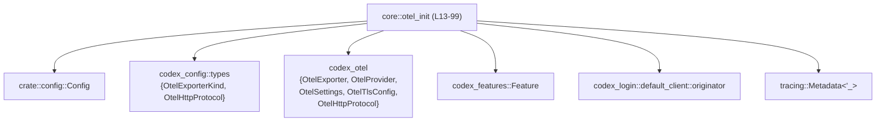
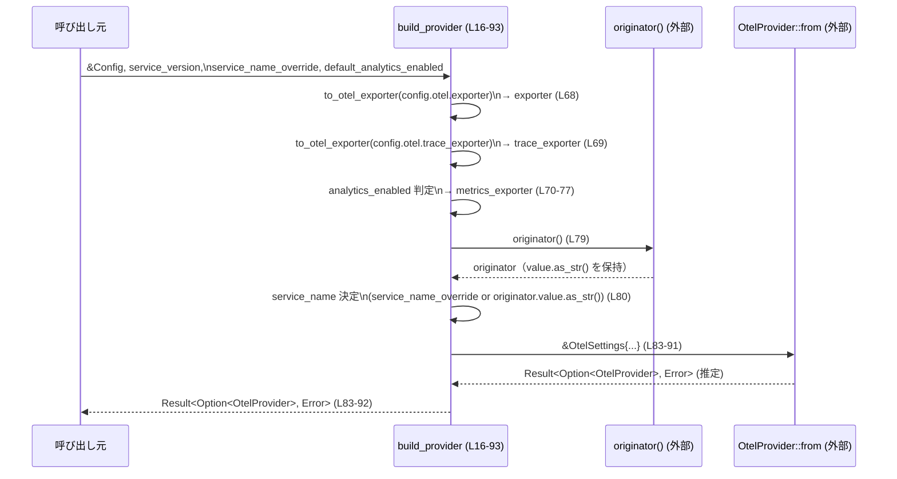

# core/src/otel_init.rs コード解説

## 0. ざっくり一言

アプリケーション設定 `Config` から OpenTelemetry 用の `OtelProvider` を構築し、Codex 自身が発行したイベントだけを OTEL に流すための `tracing` メタデータフィルタを提供するモジュールです（根拠: `build_provider`, `codex_export_filter` の公開定義。core/src/otel_init.rs:L16-21,95-98）。

---

## 1. このモジュールの役割

### 1.1 概要

- このモジュールは **アプリケーション設定から OTEL エクスポート設定を組み立てる** ために存在し、`codex_otel::OtelProvider` を生成する関数 `build_provider` を提供します（根拠: core/src/otel_init.rs:L13-15,L16-21,L83-92）。
- さらに、`tracing` のメタデータを見て **Codex (`codex_otel` モジュール) 由来のイベントだけを OTEL に送るためのフィルタ関数** `codex_export_filter` を提供します（根拠: コメントと実装。core/src/otel_init.rs:L95-98）。

### 1.2 アーキテクチャ内での位置づけ

このモジュールは「設定 → OTEL プロバイダ」の変換層に位置づけられ、複数の外部クレートに依存しています。

- 設定入力: `crate::config::Config`（根拠: core/src/otel_init.rs:L1,L17）
- OTEL 型: `codex_otel::{OtelExporter, OtelProvider, OtelSettings, OtelTlsConfig, OtelHttpProtocol}`（根拠: core/src/otel_init.rs:L6-10,L21,L36-37,L54-55,L83-92）
- 設定用 enum: `codex_config::types::{OtelExporterKind as Kind, OtelHttpProtocol as Protocol}`（根拠: core/src/otel_init.rs:L2-3,L22,L31-33）
- フィーチャフラグ: `codex_features::Feature`（根拠: core/src/otel_init.rs:L4,L81）
- デフォルトのサービス識別情報: `codex_login::default_client::originator`（根拠: core/src/otel_init.rs:L5,L79-80）
- ロギングメタデータ: `tracing::Metadata<'_>`（根拠: core/src/otel_init.rs:L97）



### 1.3 設計上のポイント

- **純粋関数的 / 無状態**  
  - このモジュールはグローバル状態を持たず、`build_provider` も `codex_export_filter` も引数から結果を計算するだけです（根拠: グローバル変数や `static mut` が存在しない。core/src/otel_init.rs:L1-99）。
- **設定 enum からランタイム enum への変換をクロージャで集約**  
  - `to_otel_exporter` クロージャで `Kind`（設定側のエクスポーター種別）を `OtelExporter`（ランタイム側）へ変換し、トレース／メトリクス／汎用の 3 箇所で再利用しています（根拠: core/src/otel_init.rs:L22-25,L36-48,L50-65,L68-75）。
- **メトリクスエクスポートは analytics フラグでゲート**  
  - `metrics_exporter` は `config.analytics_enabled.unwrap_or(default_analytics_enabled)` が `true` のときのみ設定され、それ以外は `OtelExporter::None` になります（根拠: core/src/otel_init.rs:L70-77）。
- **OTEL 全体の有効／無効は `OtelProvider::from` に委譲**  
  - ドキュメントコメントに「OTEL export is disabled のときは `None` を返す」とありますが、この関数内では `Option` を明示的に生成せず、`OtelProvider::from` の戻り値をそのまま返しています。そのため「有効／無効」の判定ロジックは `OtelProvider::from` 側にあります（根拠: コメントと戻り値。core/src/otel_init.rs:L13-15,L21,L83-92）。
- **`tracing` との統合**  
  - `codex_export_filter` は `tracing::Metadata` の `target` を見て `starts_with("codex_otel")` かどうかを判定する単純なフィルタです（根拠: core/src/otel_init.rs:L95-98）。

---

## 2. 主要な機能一覧

- OTEL プロバイダ構築: `Config` から `OtelSettings` を組み立て、`OtelProvider` を生成する（根拠: core/src/otel_init.rs:L16-21,L83-92）。
- メトリクスエクスポーターの有効化制御: `analytics_enabled` と `default_analytics_enabled` に基づいてメトリクス送信を有効／無効にする（根拠: core/src/otel_init.rs:L70-77）。
- Codex 由来イベントだけを OTEL に流すフィルタ: `tracing::Metadata` の `target` が `"codex_otel"` プレフィックスかどうかで判定（根拠: core/src/otel_init.rs:L95-98）。

### 2.1 コンポーネント一覧（関数・クロージャ）

| 名前 | 種別 | 公開 | 役割 / 用途 | 定義位置（根拠） |
|------|------|------|-------------|-------------------|
| `build_provider` | 関数 | 公開 | `Config` から OTEL エクスポート設定を構築し、`OtelProvider` を返す | core/src/otel_init.rs:L16-21,L68-92 |
| `codex_export_filter` | 関数 | 公開 | `tracing::Metadata` の target に基づき、Codex 由来イベントのみを OTEL に流すフィルタ述語 | core/src/otel_init.rs:L95-98 |
| `to_otel_exporter` | ローカルクロージャ | 非公開 | `OtelExporterKind`（設定側 enum）を `OtelExporter`（実行時 enum）へ変換する共通ロジック | core/src/otel_init.rs:L22-66 |

---

## 3. 公開 API と詳細解説

### 3.1 型一覧（構造体・列挙体など）

このファイル内で定義はされていませんが、公開 API やコア処理に登場する主要型を整理します。

| 名前 | 種別 | 定義元（推定） | 役割 / 用途 | 登場位置（根拠） |
|------|------|----------------|-------------|-------------------|
| `Config` | 構造体 | `crate::config` | アプリケーション全体の設定。OTEL 設定 (`otel`)、分析フラグ (`analytics_enabled`)、機能フラグ (`features`)、`codex_home` などを保持 | core/src/otel_init.rs:L1,L17,L68-75,L81,L86-87 |
| `OtelExporterKind` (`Kind`) | 列挙体 | `codex_config::types` | 設定ファイル側の OTEL エクスポーター種別。`None`/`Statsig`/`OtlpHttp{...}`/`OtlpGrpc{...}` バリアントを持つ | core/src/otel_init.rs:L2,L22-25,L50-54 |
| `OtelHttpProtocol` (`Protocol`) | 列挙体 | `codex_config::types` | HTTP 経由 OTLP エクスポート時のプロトコル種別 (`Json` / `Binary`) を表す設定用 enum | core/src/otel_init.rs:L3,L31-33 |
| `OtelExporter` | 列挙体 | `codex_otel` | 実行時のエクスポーター定義。`None`/`Statsig`/`OtlpHttp{...}`/`OtlpGrpc{...}` バリアントを持つ | core/src/otel_init.rs:L6,L23-24,L36-48,L54-65,L68-77 |
| `OtelHttpProtocol` | 列挙体 | `codex_otel` | 実行時の HTTP プロトコル設定 (`Json` / `Binary`) | core/src/otel_init.rs:L7,L32-33 |
| `OtelProvider` | 構造体 or 型エイリアス | `codex_otel` | OTEL のトレーサ／メーターをまとめて扱うプロバイダ的な型。`OtelSettings` から構築される | core/src/otel_init.rs:L8,L21,L83-92 |
| `OtelSettings` | 構造体 | `codex_otel` | OTEL 初期化に必要な設定（サービス名・バージョン・エクスポーター種別など）をまとめた構造体 | core/src/otel_init.rs:L9,L83-91 |
| `OtelTlsConfig` (`OtelTlsSettings`) | 構造体 | `codex_otel` | TLS 設定（CA 証明書・クライアント証明書・秘密鍵）を表す構造体 | core/src/otel_init.rs:L10,L43-47,L60-64 |
| `Feature` | 列挙体 | `codex_features` | 機能フラグを識別する enum。ここでは `Feature::RuntimeMetrics` の有効／無効がチェックされる | core/src/otel_init.rs:L4,L81 |
| `tracing::Metadata<'_>` | 構造体 | `tracing` クレート | ログ／スパンメタデータ。`target()` でターゲット名を取得できる | core/src/otel_init.rs:L97 |

※ これらの型の詳細定義はこのチャンクには現れないため、「どのフィールドを持つか」などは使用箇所から読み取れる範囲に限定しています。

---

### 3.2 関数詳細

#### `build_provider(config: &Config, service_version: &str, service_name_override: Option<&str>, default_analytics_enabled: bool) -> Result<Option<OtelProvider>, Box<dyn Error>>`

**概要**

- アプリケーション設定 `Config` とサービス情報から `OtelSettings` を組み立て、`OtelProvider::from` を呼び出して OTEL プロバイダを構築する関数です（根拠: core/src/otel_init.rs:L16-21,L83-92）。
- OTEL エクスポートが無効化されている場合は `Ok(None)` を返す設計であり、その判定は `OtelProvider::from` に委ねられています（コメントより。根拠: core/src/otel_init.rs:L13-15,L83-92）。

**引数**

| 引数名 | 型 | 説明 |
|--------|----|------|
| `config` | `&Config` | アプリケーション設定。OTEL エクスポート設定 (`config.otel.*`)、`analytics_enabled`、`features`、`codex_home` などを含む（根拠: core/src/otel_init.rs:L17,L68-75,L81,L86-87）。 |
| `service_version` | `&str` | サービスのバージョン文字列。`OtelSettings.service_version` にそのまま格納されます（根拠: core/src/otel_init.rs:L18,L85）。 |
| `service_name_override` | `Option<&str>` | サービス名を上書きするためのオプション。`None` の場合は `originator().value.as_str()` が使われます（根拠: core/src/otel_init.rs:L19,L79-80）。 |
| `default_analytics_enabled` | `bool` | `config.analytics_enabled` が `None` の場合に用いるデフォルトの分析有効フラグ（根拠: core/src/otel_init.rs:L20,L70-73）。 |

**戻り値**

- `Result<Option<OtelProvider>, Box<dyn Error>>`  
  - `Ok(Some(provider))`: OTEL プロバイダの構築に成功した場合。  
  - `Ok(None)`: OTEL エクスポートが無効化されている場合（コメントより。実際の判定は `OtelProvider::from` 内部。根拠: core/src/otel_init.rs:L13-15,L83-92）。  
  - `Err(e)`: 設定不備などにより `OtelProvider::from` がエラーを返した場合と考えられます（このチャンクには具体的条件は現れません。根拠: 戻り値型と `OtelProvider::from` 呼び出しのみ。core/src/otel_init.rs:L21,L83-92）。

**内部処理の流れ（アルゴリズム）**

1. **設定 enum → ランタイム enum への変換クロージャ定義**  
   - `to_otel_exporter: &Kind -> OtelExporter` を定義し、`Kind` の各バリアントを `OtelExporter` に変換します（根拠: core/src/otel_init.rs:L22-25,L36-48,L50-65）。  
   - `OtlpHttp` / `OtlpGrpc` の場合は `endpoint`・`headers`・`tls` を clone し、TLS 設定も `OtelTlsSettings` に写し替えます（根拠: core/src/otel_init.rs:L36-48,L54-65）。

2. **各エクスポーター設定の生成**  
   - `exporter` ← `config.otel.exporter` を `to_otel_exporter` で変換（根拠: core/src/otel_init.rs:L68）。  
   - `trace_exporter` ← `config.otel.trace_exporter` を変換（根拠: core/src/otel_init.rs:L69）。  
   - `metrics_exporter` は `analytics_enabled` と `default_analytics_enabled` に基づき、`true` の場合にだけ `config.otel.metrics_exporter` を変換し、`false` の場合は `OtelExporter::None` を設定します（根拠: core/src/otel_init.rs:L70-77）。

3. **サービス名とランタイムメトリクスフラグの決定**  
   - `originator()` を呼び出し、返された値の `value.as_str()` をデフォルトサービス名として使用（根拠: core/src/otel_init.rs:L79-80）。  
   - `service_name_override` が `Some` の場合はその値を優先し、`None` の場合は上記のデフォルトを選択します（根拠: `unwrap_or` 呼び出し。core/src/otel_init.rs:L80）。  
   - ランタイムメトリクスの有効／無効は `config.features.enabled(Feature::RuntimeMetrics)` で判定されます（根拠: core/src/otel_init.rs:L81）。

4. **`OtelSettings` の構築と `OtelProvider::from` 呼び出し**  
   - 上記で決定した値をもとに `OtelSettings` を構築し（`service_name`, `service_version`, `codex_home`, `environment`, 各 exporter, `runtime_metrics`）、それへの参照を `OtelProvider::from` に渡します（根拠: core/src/otel_init.rs:L83-91）。  
   - その戻り値 `Result<Option<OtelProvider>, Box<dyn Error>>` をそのまま呼び出し元に返します（根拠: `return` キーワードがなく末尾式として返されている。core/src/otel_init.rs:L83-92）。

**Examples（使用例）**

`build_provider` を使って OTEL プロバイダを初期化する典型的な例です。  
`Config` の構築方法や `OtelProvider` の具体的な利用方法はこのチャンクにないため擬似的なものにとどめます。

```rust
use crate::config::Config;                   // Config 型をインポートする（定義は別モジュール）
use crate::otel_init::build_provider;        // build_provider 関数をインポートする
use codex_otel::OtelProvider;                // 戻り値型として使用する（定義は codex_otel 側）

// OTEL 初期化用の関数例
fn init_otel(
    config: &Config,                         // 既に読み込まれているアプリケーション設定
) -> Result<Option<OtelProvider>, Box<dyn std::error::Error>> {
    let service_version = "1.2.3";           // サービスバージョンを文字列で指定する
    let service_name_override = None;        // サービス名を上書きしない（originator() に委ねる）
    let default_analytics_enabled = true;    // analytics_enabled が None のときに true を採用する

    // Config から OTEL プロバイダを構築する
    let provider = build_provider(
        config,                              // 設定
        service_version,                     // バージョン
        service_name_override,              // サービス名オーバーライド
        default_analytics_enabled,          // 分析デフォルトフラグ
    )?;                                      // エラーなら呼び出し元に伝播し、成功なら中身を取り出す

    // 呼び出し元で provider（Option<OtelProvider>）を利用できるようにそのまま返す
    Ok(provider)
}
```

この例では、OTEL の有効／無効を `OtelProvider::from` に委ねつつ、`Config` と関数引数から必要な設定を組み立てています。

**Errors / Panics**

- 本関数内では、`unwrap_or` など安全なメソッドのみを使用しており、明示的な `panic!` や `unwrap` はありません（根拠: core/src/otel_init.rs:L70-73,L80）。  
  → このファイルの範囲では **panic の可能性は見えません**。
- `Err` が返る条件は `OtelProvider::from` の実装に依存しており、このチャンクには定義がないため詳細は不明です（根拠: `Result` の生成元が `OtelProvider::from` のみであること。core/src/otel_init.rs:L21,L83-92）。
  - 一般的には「無効なエンドポイント URL」「TLS 証明書のパース失敗」などが考えられますが、これは **一般論であり、このコードからは断定できません**。

**Edge cases（エッジケース）**

- `config.analytics_enabled` が `None` の場合  
  - `default_analytics_enabled` が使用されます。`true` ならメトリクスエクスポート有効、`false` なら `OtelExporter::None` になります（根拠: `unwrap_or(default_analytics_enabled)`。core/src/otel_init.rs:L70-77）。
- `config.analytics_enabled = Some(false)` の場合  
  - `default_analytics_enabled` に関係なくメトリクスエクスポートは無効 (`OtelExporter::None`) になります（根拠: `if` 条件。core/src/otel_init.rs:L70-77）。
- `service_name_override = None` の場合  
  - `originator().value.as_str()` がサービス名としてそのまま使われます（根拠: `unwrap_or(originator.value.as_str())`。core/src/otel_init.rs:L79-80）。
- `service_name_override = Some("my-service")` の場合  
  - `originator()` の結果に関係なく `"my-service"` がサービス名になります（根拠: Option::unwrap_or の仕様と呼び出し。core/src/otel_init.rs:L79-80）。
- `Kind::None` が設定された場合  
  - `to_otel_exporter` により `OtelExporter::None` に変換されます。トレース・メトリクス・汎用のどの exporter に対しても同様です（根拠: core/src/otel_init.rs:L22-23,L68-69,L74）。
- TLS 設定 `tls` が `None` の場合  
  - `tls.as_ref().map(...)` により `None` のまま `OtelExporter` に渡されます（根拠: core/src/otel_init.rs:L43,L60）。

**使用上の注意点**

- **Config 側 enum のバリアントと対応が 1:1**  
  - `Kind` のバリアント追加時には、このクロージャの `match` がコンパイルエラーを起こし、対応漏れが検出されます（根拠: 網羅的 `match`。core/src/otel_init.rs:L22-66）。新バリアント追加時は必ず本ファイルの更新が必要です。
- **TLS やヘッダなどセンシティブ情報の複製**  
  - `headers` や TLS の秘密鍵などを `clone` しているため、メモリ上に複数のコピーが存在することになります（根拠: core/src/otel_init.rs:L37-41,L43-47,L55-59,L60-64）。  
    セキュリティ上、メモリ残留に敏感な環境では、Config 側のライフサイクルと合わせて注意が必要です。
- **`originator()` のエラー処理はここでは行っていない**  
  - このコードは `originator()` がエラーを返さない API であることを前提にしています（根拠: 戻り値をそのまま使用している。core/src/otel_init.rs:L79-80）。  
    もし `originator()` が panic する可能性がある API であれば、その対策は `codex_login` 側で行われている必要があります（このチャンクからは不明）。
- **並行性**  
  - 関数は引数から新しい設定値を組み立てて返すだけで、共有可変状態を持ちません。従って、この関数自体はスレッドセーフに呼び出せる構造になっています（根拠: グローバル状態や `static mut` の不在、および `clone` のみの使用。core/src/otel_init.rs:L1-99）。

---

#### `codex_export_filter(meta: &tracing::Metadata<'_>) -> bool`

**概要**

- `tracing` の `Metadata` の `target` フィールドを見て、`"codex_otel"` で始まるイベントかどうかを判定するフィルタ関数です（根拠: core/src/otel_init.rs:L95-98）。
- Codex 自身が所有する OTEL 関連イベントのみをエクスポート対象とするために使われます（根拠: コメント。core/src/otel_init.rs:L95-96）。

**引数**

| 引数名 | 型 | 説明 |
|--------|----|------|
| `meta` | `&tracing::Metadata<'_>` | ログ／スパンのメタデータ。`target()` メソッドでイベントのターゲット名（通常はモジュールパスや指定されたターゲット文字列）を取得します（根拠: core/src/otel_init.rs:L97-98）。 |

**戻り値**

- `bool`  
  - `true`: `meta.target()` が `"codex_otel"` で始まる場合。  
  - `false`: それ以外のイベント。

**内部処理の流れ**

1. `meta.target()` でターゲット文字列の参照を取得します（根拠: core/src/otel_init.rs:L98）。
2. `starts_with("codex_otel")` を呼び出し、接頭辞一致を判定します（根拠: core/src/otel_init.rs:L98）。
3. その結果をそのまま返します。

**Examples（使用例）**

`tracing_subscriber` のようなクレートと組み合わせてフィルタとして使う一般的な例です。  
※ このプロジェクトが実際にこのコード例と同じ形で使っているかどうかは、このチャンクからは分かりません。

```rust
use crate::otel_init::codex_export_filter;          // フィルタ関数をインポートする
use tracing_subscriber::filter::filter_fn;          // Metadata -> bool を受け取るフィルタ（外部クレートの一般的な例）

fn init_tracing() {
    // codex_otel 由来のイベントだけを通すフィルタを作成する
    let filter = filter_fn(|meta| codex_export_filter(meta)); // Metadata を受け取り、bool を返す

    // ここで作成した filter を tracing_subscriber に組み込む、といった使い方が想定できる
    // 具体的なサブスクライバ構成はこのプロジェクトの他コードに依存するため、このチャンクからは不明
}
```

**Errors / Panics**

- この関数内でエラーを返す処理や `panic!` は存在しません（根拠: core/src/otel_init.rs:L95-98）。
- `Metadata::target()` と `str::starts_with` は通常 panic しないので、この関数は panic を起こさないと考えられます。

**Edge cases（エッジケース）**

- ターゲットが `"codex_otel"` の場合  
  - `starts_with("codex_otel")` は `true` を返します（根拠: starts_with の仕様とコード。core/src/otel_init.rs:L98）。
- ターゲットが `"codex_otel::something"` の場合  
  - プレフィックス一致のため `true` になります。`codex_otel` 配下のモジュールで発行されたイベントを全て通します（根拠: core/src/otel_init.rs:L98）。
- ターゲットが `"other_module"` の場合  
  - `"codex_otel"` で始まらないため `false` になります（根拠: core/src/otel_init.rs:L98）。
- ターゲットが `"codex_otel_extra"` のような別モジュール名でも `"codex_otel"` で始まっていれば `true` になります。  
  - つまり、「厳密に `codex_otel` モジュールだけ」ではなく、「名前がそのプレフィックスを持つすべてのターゲット」が対象になります（根拠: `starts_with` 使用。core/src/otel_init.rs:L98）。

**使用上の注意点**

- このフィルタは **ターゲット文字列ベース** であり、ログレベルやスパン名など他のメタデータは考慮しません（根拠: core/src/otel_init.rs:L98）。
- `codex_otel` 以外のモジュールから OTEL にイベントを送りたい場合、このフィルタをそのまま使うと除外されてしまうため、プレフィックス文字列を変更するか、より柔軟な条件に書き換える必要があります。
- 関数自体は完全に純粋で副作用がなく、共有状態にも触れないため、複数スレッドからの同時呼び出しも問題にならない構造です（根拠: core/src/otel_init.rs:L97-98）。

---

### 3.3 その他の関数（補助ロジック）

| 関数 / クロージャ名 | 役割（1 行） | 定義位置（根拠） |
|----------------------|-------------|-------------------|
| `to_otel_exporter` | `OtelExporterKind` から `OtelExporter` への変換ロジックを一箇所に集約したローカルクロージャ | core/src/otel_init.rs:L22-66 |

---

## 4. データフロー

このモジュールにおける代表的な処理は「`Config` から `OtelProvider` を構築する」フローです。

1. 呼び出し元（例: アプリケーションの初期化コード）が `Config` を読み込む。
2. 呼び出し元が `build_provider` に `&Config` とサービス情報を渡す。
3. `build_provider` 内で、OTEL 関連の設定を `OtelExporter` / `OtelSettings` に変換する。
4. `OtelProvider::from` が `OtelSettings` を受け取り、`Result<Option<OtelProvider>, Error>` を返す。
5. 呼び出し元は `Option<OtelProvider>` を確認して、必要ならグローバル登録などを行う。



`codex_export_filter` は、`tracing` のイベント発行時に `Metadata` を受け取り `bool` を返すフィルタとしてこのフローの外側で利用される想定です（根拠: 関数シグネチャとコメント。core/src/otel_init.rs:L95-98）。

---

## 5. 使い方（How to Use）

### 5.1 基本的な使用方法

**OTEL プロバイダの初期化**

```rust
use crate::config::Config;                        // アプリケーションの Config 型
use crate::otel_init::build_provider;            // 本モジュールの build_provider
use codex_otel::OtelProvider;                    // OTEL プロバイダ型（定義は codex_otel 側）

fn init_otel_from_config(
    config: &Config,                             // 設定は既に読み込まれているとする
) -> Result<Option<OtelProvider>, Box<dyn std::error::Error>> {
    let service_version = "1.0.0";               // サービスバージョンを指定
    let service_name_override = None;            // サービス名を上書きしない
    let default_analytics_enabled = true;        // analytics_enabled が None のとき true を採用

    // Config から OTEL プロバイダを構築
    let provider = build_provider(
        config,                                  // 設定
        service_version,                         // サービスバージョン
        service_name_override,                   // サービス名オーバーライド
        default_analytics_enabled,               // 分析デフォルト
    )?;                                          // エラーはそのまま呼び出し元へ伝播

    // Option<OtelProvider> を呼び出し元に返す
    Ok(provider)
}
```

**Codex 由来イベントのみを OTEL に流すフィルタの設定例**

```rust
use crate::otel_init::codex_export_filter;       // フィルタ関数
use tracing_subscriber::filter::filter_fn;       // Metadata -> bool を受け取るフィルタ（外部クレートの一般的な例）

fn init_tracing_with_codex_filter() {
    // codex_otel 由来のイベントだけを通すフィルタを生成
    let filter = filter_fn(|meta| codex_export_filter(meta)); // Metadata を渡して bool を返す

    // 生成した filter を tracing_subscriber のレイヤやサブスクライバに組み込んで使用する
    // （具体的な構成はアプリケーション側の設計に依存し、このチャンクには現れません）
}
```

### 5.2 よくある使用パターン

- **すべての OTEL エクスポートを無効化したい場合**  
  - `Config` 側の `otel.exporter` / `otel.trace_exporter` / `otel.metrics_exporter` をすべて `Kind::None` に設定すると、`to_otel_exporter` により `OtelExporter::None` に変換されます（根拠: core/src/otel_init.rs:L22-23,L68-69,L74）。  
  - さらに OTEL 全体を完全に無効とするかどうかは `OtelProvider::from` の実装に依存します（このチャンクからは不明）。
- **メトリクスだけを analytics フラグで制御したい場合**  
  - `config.analytics_enabled = Some(false)` にすれば、メトリクスエクスポーターのみ `OtelExporter::None` になりますが、トレース用の `exporter` / `trace_exporter` はそのままです（根拠: core/src/otel_init.rs:L68-69,L70-77）。

### 5.3 よくある間違い（起こりうる混乱）

コードから推測できる「勘違いしやすそうな点」を挙げます。

```rust
// 誤解の例（期待と実際の動作のズレ）
// analytics_enabled を false にすれば OTEL 全体が無効になる、と考えてしまう
// 実際にはメトリクスエクスポーターにだけ影響し、トレース用 exporter はそのままです。
// 根拠: exporter と trace_exporter は analytics_enabled に依存せずに設定される。L68-69,L70-77
```

- OTEL 全体の有効／無効を制御したい場合は、`analytics_enabled` だけでなく、`Config` 側の exporter 設定や（あれば）別のフラグも確認する必要があります。

### 5.4 使用上の注意点（まとめ）

- `Config` 内の OTEL 関連フィールド（`otel.exporter` など）が **未初期化でないこと** が前提です（このチャンク内では常に存在する前提で参照されています。根拠: core/src/otel_init.rs:L68-69,L74,L86-87）。
- TLS 関連の秘密鍵や証明書を `clone` しているため、**メモリ上のコピー数が増える** 点に留意する必要があります（根拠: core/src/otel_init.rs:L43-47,L60-64）。
- `build_provider` が返す `Option<OtelProvider>` が `None` 場合、OTEL が無効であることを意味するとコメントされていますが、その判定は `OtelProvider::from` に依存しています（根拠: core/src/otel_init.rs:L13-15,L83-92）。

---

## 6. 変更の仕方（How to Modify）

### 6.1 新しい機能を追加する場合

- **新しい OTEL エクスポーター種別を追加する場合**
  1. `codex_config::types::OtelExporterKind` に新しいバリアント（例: `OtlpKafka { ... }`）を追加する（この定義は別ファイルにあります）。
  2. 本ファイルの `to_otel_exporter` の `match kind` にそのバリアントを追加し、対応する `OtelExporter` バリアントを生成するロジックを書く（根拠: core/src/otel_init.rs:L22-25,L36-48,L50-65）。
  3. 必要に応じて `OtelExporter` 側にも新バリアントを追加し、`OtelProvider::from` がそれを扱えるようにする（この部分は本チャンクには現れません）。
- **新しい Feature フラグで挙動を変えたい場合**
  1. `codex_features::Feature` に新しいバリアントを追加する。
  2. `config.features.enabled(Feature::XXX)` のような形で、本ファイルに条件分岐を追加する（根拠: 既存の RuntimeMetrics フラグ使用。core/src/otel_init.rs:L81）。

### 6.2 既存の機能を変更する場合

- **メトリクスエクスポートの制御ロジックを変更したい場合**
  - `analytics_enabled` と `default_analytics_enabled` の扱いを変えたい場合は、`metrics_exporter` を決定している `if` ブロック（core/src/otel_init.rs:L70-77）を変更する必要があります。
  - 影響範囲として、メトリクスが OTEL に送信される／されない条件が変わるため、メトリクス関連の監視やテストも確認する必要があります。
- **サービス名の決定方法を変えたい場合**
  - 現在は `service_name_override.unwrap_or(originator.value.as_str())` で決定されています（根拠: core/src/otel_init.rs:L79-80）。
  - 別のデフォルト値（例: `config` 内の別フィールド）を使いたい場合は、ここでのロジックを変更します。
- **テスト戦略（このファイルにテストは含まれていない）**
  - このチャンクにはテストコードが存在しません（根拠: core/src/otel_init.rs:L1-99）。
  - 変更時には少なくとも次のケースをテストすることが実務上有用です（一般的な指針であり、このリポジトリに特定のテストがあると主張するものではありません）:
    - `Kind` の各バリアントが期待通りの `OtelExporter` に変換されるか。
    - `analytics_enabled` が `Some(true)` / `Some(false)` / `None` ＋ `default_analytics_enabled` の組み合わせで、`metrics_exporter` が期待通りになるか。
    - `service_name_override` の有無でサービス名が適切に切り替わるか。
    - `codex_export_filter` がターゲットごとに正しい `bool` を返すか。

---

## 7. 関連ファイル

このモジュールと密接に関連する型・モジュール（ファイルパスはこのチャンクには明示されていないため、モジュール名のみ記載します）。

| モジュール / 型 | 役割 / 関係 |
|-----------------|------------|
| `crate::config::Config` | アプリケーション全体の設定を表す型。OTEL 設定や `analytics_enabled`、`features` などを保持し、本モジュールの主要な入力となります（根拠: core/src/otel_init.rs:L1,L17,L68-75,L81,L86-87）。 |
| `codex_config::types::OtelExporterKind` | OTEL エクスポーター設定の enum。`to_otel_exporter` の入力として利用されます（根拠: core/src/otel_init.rs:L2,L22-25,L50-54）。 |
| `codex_config::types::OtelHttpProtocol` | HTTP 経由 OTEL エクスポート時のプロトコル設定 enum。`Protocol::Json/Binary` として参照されます（根拠: core/src/otel_init.rs:L3,L31-33）。 |
| `codex_otel::OtelExporter` | 実行時のエクスポーター種別を表す enum。`Kind` からの変換先として用いられます（根拠: core/src/otel_init.rs:L6,L23-24,L36-48,L54-65,L68-77）。 |
| `codex_otel::{OtelProvider, OtelSettings, OtelTlsConfig, OtelHttpProtocol}` | OTEL の初期化・設定に必要な主要型群。本モジュールはこれらを組み立てて `OtelProvider::from` を呼び出します（根拠: core/src/otel_init.rs:L7-10,L21,L36-37,L54-55,L83-92）。 |
| `codex_features::Feature` | 機能フラグ enum。本モジュールではランタイムメトリクスの有効／無効に使用されています（根拠: core/src/otel_init.rs:L4,L81）。 |
| `codex_login::default_client::originator` | デフォルトのサービス識別情報を取得する関数。`service_name` のデフォルト値決定に用いられます（根拠: core/src/otel_init.rs:L5,L79-80）。 |
| `tracing::Metadata<'_>` | ログ／トレースイベントのメタデータ型。`codex_export_filter` でターゲット名を確認するために使用されます（根拠: core/src/otel_init.rs:L97-98）。 |

以上のように、このファイルは Config と OTEL 実装の間をつなぐ薄い変換層として機能し、設定値を安全にコピー・変換して `OtelProvider` を構築する役割を担っています。
