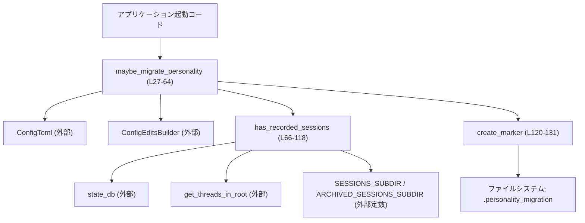
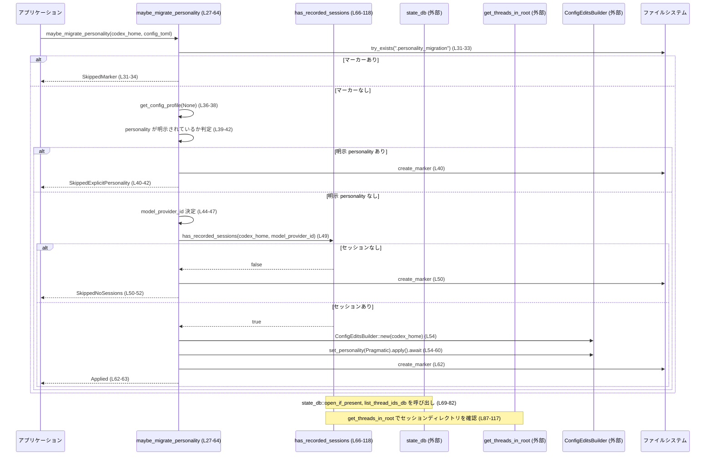

# core\src\personality_migration.rs コード解説

## 0. ざっくり一言

- このモジュールは、ユーザー設定に「personality（性格プロファイル）」が未設定の場合に、**一度だけ自動的に `Personality::Pragmatic` を設定するかどうかを判定し、必要なら書き込む「マイグレーション」処理**を提供します（`maybe_migrate_personality`）。  
  根拠: `maybe_migrate_personality` 内で `set_personality(Some(Personality::Pragmatic))` を呼び出しているため（`personality_migration.rs:L54-56`）。

---

## 1. このモジュールの役割

### 1.1 概要

このモジュールは次の問題を解決するために存在しています。

- **問題**: 既存ユーザーの設定には `personality` が明示的に設定されていない場合があり、そのままでは新しい既定の `Personality` を適用できない。  
- **機能**:
  - `.personality_migration` というマーカー・ファイルの有無により、マイグレーションが既に実行済みかどうかを判定する（`PERSONALITY_MIGRATION_FILENAME`, `create_marker`。`personality_migration.rs:L17`, `L120-131`）。
  - 明示的な `personality` が設定されていない場合に限り、セッション履歴の有無に基づいて、`Personality::Pragmatic` を設定するかどうかを決定する（`maybe_migrate_personality`, `has_recorded_sessions`。`personality_migration.rs:L27-64`, `L66-118`）。
  - マイグレーションの最終結果を `PersonalityMigrationStatus` で呼び出し元に返す（`personality_migration.rs:L19-25`, `L27-64`）。

### 1.2 アーキテクチャ内での位置づけ

このモジュールは、設定ファイルとセッション情報ストレージの間で動作する、**スタートアップ時の一回限りの設定マイグレーション層**という位置づけになっています。

- 設定関連:
  - `ConfigToml` から現在のプロファイル情報を取得します（`personality_migration.rs:L36-38`）。
  - `ConfigEditsBuilder` を通じて `personality` を設定して永続化します（`personality_migration.rs:L54-60`）。
- セッション情報関連:
  - `state_db`（データベース）が存在すればそこからスレッドIDを 1 件だけ取得しようとします（`personality_migration.rs:L69-82`）。
  - ファイルベースのセッション・ディレクトリ (`SESSIONS_SUBDIR`, `ARCHIVED_SESSIONS_SUBDIR`) を走査して、セッションが存在するかを確認します（`personality_migration.rs:L87-117`）。
- ファイルシステム:
  - `.personality_migration` ファイルの存在確認と新規作成を通じて、マイグレーションの再実行を避けます（`personality_migration.rs:L31-33`, `L120-129`）。

全体像を簡略化した依存関係図は次のとおりです（このチャンクのコード範囲: `personality_migration.rs:L1-135`）。



### 1.3 設計上のポイント

コードから読み取れる設計上の特徴は次のとおりです。

- **一度きりのマイグレーション制御**  
  - `.personality_migration` ファイルの存在でマイグレーション実行済みかを判定し、再実行を避ける構造です（`personality_migration.rs:L17`, `L31-33`, `L120-129`）。
- **明示設定の尊重**  
  - すでに `ConfigToml` または `config_profile` に `personality` が設定されている場合は、マイグレーションを行わずにマーカーだけを残します（`personality_migration.rs:L36-42`）。
- **セッション有無に基づく条件付きマイグレーション**  
  - セッション履歴が 1 件でも存在する場合のみ `Personality::Pragmatic` を自動設定し、セッションがない場合は何も変更せずマーカーだけを作成します（`personality_migration.rs:L49-52`, `L66-118`）。
- **非同期 I/O を前提**  
  - すべての I/O（ファイル・DB・セッション一覧取得）は `async` 関数で行われ、Tokio ランタイムを前提としています（`personality_migration.rs:L27`, `L66`, `L120`, `L32`, `L69-82`, `L87-99`, `L104-116`）。
- **エラー伝搬方針**  
  - 設定読み取りやマイグレーション処理失敗時には `io::Error` として呼び出し元に伝搬します（`personality_migration.rs:L36-38`, `L54-60`）。  
  - マーカー作成時の `AlreadyExists` は正常扱いになっており、冪等な設計になっています（`personality_migration.rs:L120-129`）。

---

## 2. 主要な機能一覧

このモジュールが提供する主な機能と行範囲です。

- **`maybe_migrate_personality`**:  
  起動時などに呼び出され、マーカー・ファイル、設定の明示有無、セッション有無に基づき、`Personality::Pragmatic` を設定するかどうかを判定し、結果ステータスを返します。  
  根拠: `personality_migration.rs:L27-64`。

- **`has_recorded_sessions`**:  
  データベースおよびセッション・ディレクトリを確認し、少なくとも 1 セッションが存在するかを `bool` で返します。  
  根拠: `personality_migration.rs:L66-118`。

- **`create_marker`**:  
  `.personality_migration` ファイルを新規作成し、すでに存在する場合は成功として扱うことでマイグレーションの実行済みマーカーを永続化します。  
  根拠: `personality_migration.rs:L17`, `L120-131`。

---

## 3. 公開 API と詳細解説

### 3.1 型一覧（構造体・列挙体など）

このモジュール内で定義される主な型・定数は次のとおりです。

| 名前 | 種別 | 公開範囲 | 役割 / 用途 | 位置（行） |
|------|------|----------|-------------|------------|
| `PERSONALITY_MIGRATION_FILENAME` | 定数 `&'static str` | `pub` | マイグレーション済みを示すマーカー・ファイル名（`.personality_migration`） | `personality_migration.rs:L17` |
| `PersonalityMigrationStatus` | `enum` | `pub` | マイグレーションの実行結果を表現するステータス | `personality_migration.rs:L19-25` |

`PersonalityMigrationStatus` のバリアント一覧:

| バリアント | 意味（コードから読み取れる範囲） | 根拠 |
|-----------|----------------------------------|------|
| `SkippedMarker` | マーカー・ファイルが既に存在したため、マイグレーション処理をスキップしたことを示す | `personality_migration.rs:L31-34` |
| `SkippedExplicitPersonality` | 設定に `personality` が明示されていたため、デフォルト付与を行わずマーカーだけ作成したことを示す | `personality_migration.rs:L36-42` |
| `SkippedNoSessions` | セッションが 0 件だったため、デフォルト付与を行わずマーカーだけ作成したことを示す | `personality_migration.rs:L49-52` |
| `Applied` | `Personality::Pragmatic` を設定に書き込み、マーカーも作成したことを示す | `personality_migration.rs:L54-63` |

### 3.2 関数詳細

#### `maybe_migrate_personality(codex_home: &Path, config_toml: &ConfigToml) -> io::Result<PersonalityMigrationStatus>`

**概要**

- マイグレーション済みか、明示的な `personality` があるか、セッションが存在するかを順に判定し、必要であれば `Personality::Pragmatic` を設定して永続化します（`personality_migration.rs:L27-63`）。
- 実行結果を `PersonalityMigrationStatus` として返し、失敗時には `io::Error` を返します（`personality_migration.rs:L30`, `L36-38`, `L54-60`）。

**引数**

| 引数名 | 型 | 説明 |
|--------|----|------|
| `codex_home` | `&Path` | Codex のホームディレクトリへのパス。マーカー・ファイルやセッション・ストレージ、設定ファイルのベースディレクトリとして使用されます（`personality_migration.rs:L31`, `L49`, `L66-89`, `L104-105`, `L120`）。 |
| `config_toml` | `&ConfigToml` | 現在の設定を表す構造体。プロファイルの取得や `personality`, `model_provider` の参照に使われます（`personality_migration.rs:L36-39`, `L44-47`）。 |

**戻り値**

- `Ok(PersonalityMigrationStatus)`  
  - マイグレーション処理が正常に完了した場合に、その結果ステータスを返します（`personality_migration.rs:L31-34`, `L40-42`, `L50-52`, `L62-63`）。
- `Err(io::Error)`  
  - プロファイル取得や設定変更・永続化、セッション確認、マーカー作成などの I/O 処理が失敗した場合に返されます（`personality_migration.rs:L32`, `L36-38`, `L49-50`, `L54-60`, `L62`）。

**内部処理の流れ（アルゴリズム）**

1. **マーカー・ファイルの存在チェック**  
   - `codex_home/.personality_migration` の存在を `tokio::fs::try_exists` で確認し、存在する場合は `SkippedMarker` で終了します（`personality_migration.rs:L31-34`）。
2. **設定プロフィールの取得**  
   - `config_toml.get_config_profile(None)` を呼び、失敗時には `io::ErrorKind::InvalidData` でエラー変換して返します（`personality_migration.rs:L36-38`）。
3. **明示的な personality の有無を判定**  
   - `config_toml.personality` または `config_profile.personality` がどちらか一方でも `Some(_)` なら、`create_marker` を呼び、`SkippedExplicitPersonality` を返します（`personality_migration.rs:L39-42`）。
4. **モデルプロバイダ ID の決定**  
   - `config_profile.model_provider` → `config_toml.model_provider` → `"openai"` の順で優先しつつ、`model_provider_id` を決定します（`personality_migration.rs:L44-47`）。
5. **セッション有無の判定**  
   - `has_recorded_sessions(codex_home, model_provider_id.as_str())` を呼び、結果が `false` の場合は `create_marker` を呼んだ上で `SkippedNoSessions` を返します（`personality_migration.rs:L49-52`）。
6. **Personality の設定と永続化**  
   - `ConfigEditsBuilder::new(codex_home)` を用いて編集ビルダーを作成し、`set_personality(Some(Personality::Pragmatic))` → `apply().await` の順に呼びます（`personality_migration.rs:L54-57`）。
   - `apply()` のエラーは `io::Error::other` に変換されます（`personality_migration.rs:L58-60`）。
7. **マーカーの作成と `Applied` の返却**  
   - `create_marker` を呼んでマイグレーション済みを記録し、最後に `Applied` を返します（`personality_migration.rs:L62-63`）。

**Examples（使用例）**

アプリケーション起動時に、ホームディレクトリと読み込んだ設定を渡してマイグレーションを実行する例です。

```rust
use std::path::PathBuf;                                   // PathBuf 型の利用
use std::io;                                              // io::Result 用
use codex_config::config_toml::ConfigToml;                // ConfigToml 型（外部クレート）
use core::personality_migration::maybe_migrate_personality;
use core::personality_migration::PersonalityMigrationStatus;

#[tokio::main]                                            // Tokio ランタイムを起動
async fn main() -> io::Result<()> {                       // main も io::Result を返す
    let codex_home = PathBuf::from("/path/to/codex_home"); // Codex ホームディレクトリのパス

    // ここでは ConfigToml の読み込み処理は省略（別モジュールで行われる前提）
    let config_toml: ConfigToml = load_config(&codex_home)?; // 仮の関数 load_config を想定

    let status = maybe_migrate_personality(&codex_home, &config_toml).await?; // マイグレーション実行

    match status {
        PersonalityMigrationStatus::Applied => {
            eprintln!("Personality migration applied");   // デフォルト personality が設定された
        }
        other => {
            eprintln!("Personality migration skipped: {:?}", other); // スキップ理由を表示
        }
    }

    Ok(())
}

// ※ load_config はこのファイルには定義されていないため、ここでは仮の関数として示しています。
```

**Errors / Panics**

- **`Err(io::Error)` となる条件（コードから読み取れる範囲）**
  - `tokio::fs::try_exists(&marker_path).await` が I/O エラーを返した場合（`personality_migration.rs:L31-33`）。
  - `config_toml.get_config_profile(None)` がエラーを返した場合。  
    → `io::ErrorKind::InvalidData` でラップされます（`personality_migration.rs:L36-38`）。
  - `has_recorded_sessions` 内の I/O エラーが伝搬してきた場合（`personality_migration.rs:L49` と `L66-118` の `?` から推測されますが、厳密な理由は `has_recorded_sessions` 内部の説明参照）。
  - `ConfigEditsBuilder::apply().await` がエラーを返した場合。  
    → `io::Error::other` を使用して `failed to persist personality migration: {err}` というメッセージに変換されます（`personality_migration.rs:L54-60`）。
  - `create_marker` 内の I/O エラーが伝搬した場合（`personality_migration.rs:L40`, `L50`, `L62`, `L120-130`）。

- **Panics**
  - この関数内で `panic!` や `unwrap` 等は使用されておらず、明示的なパニック条件はありません（`personality_migration.rs:L27-64`）。

**Edge cases（エッジケース）**

- **すでにマーカーが存在する場合**  
  - 一切のプロファイル取得やセッション確認を行わず、即座に `SkippedMarker` を返します（`personality_migration.rs:L31-34`）。
- **`config_toml` または `config_profile` に `personality` が設定されている場合**  
  - セッション有無に関係なく、`create_marker` の呼び出しのみ行われ、`SkippedExplicitPersonality` を返します（`personality_migration.rs:L39-42`）。
- **`model_provider` がどこにも設定されていない場合**  
  - `"openai"` 文字列がデフォルトとされます（`personality_migration.rs:L44-47`）。  
  - `"openai"` の意味（どのプロバイダを指すか）はこのチャンクからは分かりません。
- **セッションが全く存在しない場合**  
  - `has_recorded_sessions` が `false` を返した場合、`SkippedNoSessions` となり、personality は変更されません（`personality_migration.rs:L49-52`）。
- **マーカーの作成競合**  
  - 他プロセスが同時にマーカーを作成した場合でも、`create_marker` は `AlreadyExists` を正常扱いするため、エラーとはなりません（`personality_migration.rs:L120-129`）。

**使用上の注意点**

- この関数は `async` なので、**Tokio などの非同期ランタイム内で `.await` 付きで呼び出す必要**があります（`personality_migration.rs:L27`）。
- 戻り値の `PersonalityMigrationStatus` を見れば、マイグレーションが実行されたか、どの条件でスキップされたかを判断できます。ログやテレメトリ出力に利用しやすい設計になっています（`personality_migration.rs:L19-25`, `L31-34`, `L40-42`, `L50-52`, `L62-63`）。
- `io::Result` を返すため、呼び出し側では `?` を使うか、明示的にエラー処理を書く必要があります。
- 設定に明示的な `personality` が存在する場合は **絶対に上書きしない** 仕様なので、「既存設定を尊重する」ことを前提としたマイグレーションに適しています（`personality_migration.rs:L39-42`）。

---

#### `has_recorded_sessions(codex_home: &Path, default_provider: &str) -> io::Result<bool>`

**概要**

- データベースおよびファイルベースのセッションストアを確認し、**セッションが少なくとも 1 件存在するか**を判定するヘルパー関数です（`personality_migration.rs:L66-118`）。
- `true` の場合は「何らかの記録済みセッションあり」、`false` の場合は「セッションなし」と解釈できます（呼び出し元 `maybe_migrate_personality` の使い方から）（`personality_migration.rs:L49-52`）。

**引数**

| 引数名 | 型 | 説明 |
|--------|----|------|
| `codex_home` | `&Path` | Codex ホームディレクトリ。DB やセッションディレクトリの場所を決定するために使用されます（`personality_migration.rs:L69`, `L72`, `L88`, `L104-105`）。 |
| `default_provider` | `&str` | モデルプロバイダ ID。DB オープンなどに渡されます（`personality_migration.rs:L69`, `L94-96`, `L111-113`）。 |

**戻り値**

- `Ok(true)`  
  - データベースまたはセッションディレクトリから 1 件以上のセッションが検出された場合（`personality_migration.rs:L69-85`, `L87-102`, `L104-117`）。
- `Ok(false)`  
  - 上記すべてで 1 件もセッションが見つからなかった場合（`personality_migration.rs:L87-102`, `L104-117`）。
- `Err(io::Error)`  
  - `state_db::open_if_present`, `state_db::list_thread_ids_db`, `get_threads_in_root` などにおける I/O エラーが `?` によって伝搬した場合（`personality_migration.rs:L69-82`, `L87-99`, `L104-116`）。

**内部処理の流れ**

1. **allowed_sources の初期化**  
   - `let allowed_sources: &[SessionSource] = &[];` として空のスライスを渡します（`personality_migration.rs:L67`）。  
   - この空スライスの意味（「すべて許可」なのか「何も許可しない」のか）は、このチャンクからは分かりません。
2. **state_db によるセッション検出**  
   - `state_db::open_if_present(codex_home, default_provider).await` を呼び、DB が存在すれば `Some(ctx)` を受け取ります（`personality_migration.rs:L69`）。
   - さらに `state_db::list_thread_ids_db` を呼び、`page_size = 1` でスレッド ID を 1 件だけ取得しようとします（`personality_migration.rs:L70-80`）。
   - `ids` が `Some` かつ非空なら `Ok(true)` を返します（`personality_migration.rs:L70-83`）。
3. **SESSIONS_SUBDIR の確認**  
   - `get_threads_in_root` を `SESSIONS_SUBDIR` ディレクトリに対して、`page_size = 1` で呼び出します（`personality_migration.rs:L87-99`）。
   - 戻り値 `sessions.items` が非空であれば `Ok(true)` を返します（`personality_migration.rs:L100-101`）。
4. **ARCHIVED_SESSIONS_SUBDIR の確認**  
   - 同様に `ARCHIVED_SESSIONS_SUBDIR` に対して `get_threads_in_root` を呼び出し（`personality_migration.rs:L104-116`）、戻り値 `archived_sessions.items` の空／非空で最終結果を決めます（`personality_migration.rs:L117`）。

**Examples（使用例）**

`maybe_migrate_personality` 以外でも、単独で「セッションがあるかどうか」の判定に使うコード例です。

```rust
use std::path::PathBuf;                                   // PathBuf の利用
use std::io;                                              // io::Result
use core::personality_migration::has_recorded_sessions;   // 関数は pub ではないため、実際には同モジュール内やテストからのみ利用可能

// ※ 実際のコードでは has_recorded_sessions は非公開関数なので、
//    テストモジュールなどからのみ直接呼び出せます（`personality_migration.rs:L66` には pub がない）。

async fn check_sessions() -> io::Result<bool> {
    let codex_home = PathBuf::from("/path/to/codex_home"); // ホームディレクトリ
    let default_provider = "openai";                       // デフォルトのモデルプロバイダ ID（例）

    let has_sessions = super::has_recorded_sessions(&codex_home, default_provider).await?; 
    Ok(has_sessions)
}
```

**Errors / Panics**

- **`Err(io::Error)` となる条件**
  - `state_db::open_if_present`, `state_db::list_thread_ids_db`, `get_threads_in_root` が返すエラーが `?` を通じてそのまま呼び出し元に伝搬します（`personality_migration.rs:L69-82`, `L87-99`, `L104-116`）。
  - 具体的にどのようなエラーが発生しうるかは、これら外部関数の実装がこのチャンクには存在しないため不明です。
- **Panics**
  - この関数内には `panic!` や `unwrap` は存在せず、明示的なパニック条件は確認できません（`personality_migration.rs:L66-118`）。

**Edge cases（エッジケース）**

- **state_db が存在しない場合**  
  - `state_db::open_if_present` が `None` を返すと推測されます（`if let Some(state_db_ctx) = ...` から推測、`personality_migration.rs:L69`）。  
  - その場合は DB 側のチェックをスキップし、ファイルベースのセッションを確認します（`personality_migration.rs:L87-117`）。
- **DB にセッションが 0 件だが、ファイルベースには存在する場合**  
  - DB 側の `ids` が空でも `Ok(true)` は返されず（`!ids.is_empty()` 条件、`personality_migration.rs:L82-84`）、その後のファイルベースチェックで検出されます。
- **allowed_sources が空スライスであることの影響**  
  - `allowed_sources` は常に `&[]` で固定されており（`personality_migration.rs:L67`）、この意味は外部関数の仕様次第です。  
  - 少なくとも、この関数内では他の値が渡されるケースはありません。
- **セッションディレクトリが存在しない場合**  
  - この場合に `get_threads_in_root` がどう振る舞うかは、外部関数の実装がこのチャンクにはないため不明です。  
  - ただし `?` が使われていることから、必要に応じて `io::Error` が返りうると考えられます（`personality_migration.rs:L87-99`, `L104-116`）。

**使用上の注意点**

- `page_size` を 1 に固定しているため、**存在確認だけを目的とした最小限の走査**になっています（`personality_migration.rs:L73`, `L89`, `L106`）。
- この関数は `pub` ではないため、**モジュール外から直接呼び出すことはできません**（`personality_migration.rs:L66` に `pub` がない）。  
  利用は `maybe_migrate_personality` などモジュール内の関数に限定されます。

---

#### `create_marker(marker_path: &Path) -> io::Result<()>`

**概要**

- 与えられたパスに対してマーカー・ファイルを新規作成し、すでに存在している場合は成功 (`Ok(())`) とみなす補助関数です（`personality_migration.rs:L120-131`）。
- マイグレーションの再実行を避けるためのフラグファイル作成に利用されます（`personality_migration.rs:L31`, `L40`, `L50`, `L62`）。

**引数**

| 引数名 | 型 | 説明 |
|--------|----|------|
| `marker_path` | `&Path` | 作成するマーカー・ファイルの絶対パスまたは相対パス。`.personality_migration` などを想定（`personality_migration.rs:L120`, `L31`）。 |

**戻り値**

- `Ok(())`  
  - ファイルが新規作成された場合、またはすでにファイルが存在していた場合（`personality_migration.rs:L127-128`）。
- `Err(io::Error)`  
  - それ以外の I/O エラーが発生した場合（`personality_migration.rs:L127-130`）。

**内部処理の流れ**

1. **OpenOptions の設定と open の実行**
   - `OpenOptions::new().create_new(true).write(true).open(marker_path).await` を実行し、新規作成のみ許可します（`personality_migration.rs:L121-125`）。
2. **マッチングによるエラー処理**
   - `Ok(mut file)` の場合: `file.write_all(b"v1\n").await` で中身に `"v1\n"` を書き込み、その `Result` をそのまま返します（`personality_migration.rs:L127`）。
   - `Err(err)` かつ `err.kind() == io::ErrorKind::AlreadyExists` の場合: `Ok(())` を返し、既存ファイルを許容します（`personality_migration.rs:L128`）。
   - 上記以外のエラーの場合: そのまま `Err(err)` を返します（`personality_migration.rs:L129-130`）。

**Examples（使用例）**

`maybe_migrate_personality` を模したテスト用コード例です。

```rust
use std::path::PathBuf;                                   // PathBuf 型
use std::io;                                              // io::Result
use core::personality_migration::PERSONALITY_MIGRATION_FILENAME;

// create_marker 自体はこのファイル内で非公開なので、
// 実際にはテストモジュール内から `super::create_marker` のように呼び出します。

async fn create_marker_example() -> io::Result<()> {
    let codex_home = PathBuf::from("/path/to/codex_home"); // ホームディレクトリ
    let marker_path = codex_home.join(PERSONALITY_MIGRATION_FILENAME); // マーカーのパスを構築

    super::create_marker(&marker_path).await               // マーカー作成を試みる
}
```

**Errors / Panics**

- **`Err(io::Error)` となる条件**
  - ファイルシステムがファイル新規作成や書き込みを拒否した場合（例: パーミッションエラー、ディスクフルなど）。  
    具体的な理由は OS 依存であり、このチャンクには書かれていません。
  - `write_all` のエラーもそのまま `io::Error` として返されます（`personality_migration.rs:L127`）。
- **Panics**
  - この関数には `panic!` や `unwrap` は使用されておらず、明示的なパニック条件はありません（`personality_migration.rs:L120-131`）。

**Edge cases（エッジケース）**

- **同時実行 / 競合作成**
  - ふたつのプロセスが同時に `create_marker` を実行しようとした場合、一方は `Ok(mut file)`、もう一方は `AlreadyExists` になる可能性があります。  
    後者は `Ok(())` として扱われるため、**競合してもどちらも成功**として扱われます（`personality_migration.rs:L128`）。
- **ディレクトリが存在しない場合**
  - `marker_path` の親ディレクトリが存在しない場合にどうなるかは OS 次第ですが、通常は `open` がエラーになり、そのまま `Err(io::Error)` として返されます（`personality_migration.rs:L121-125`）。

**使用上の注意点**

- ファイル内容として `"v1\n"` が書かれている点から、将来的にバージョンを増やす可能性があると推測できますが、**コード上にはバージョン分岐などは存在しません**（`personality_migration.rs:L127`）。
- `create_new(true)` を使用しているため、**既存ファイルの内容が書き換えられることはありません**（`personality_migration.rs:L121-123`）。

### 3.3 その他の関数

- このモジュールには、上記 3 つ以外の関数定義は存在しません（`personality_migration.rs:L27-131` を通しで確認）。

---

## 4. データフロー

ここでは、「セッションがあり、personality が未設定のユーザーに対してマイグレーションが適用される」典型シナリオのデータフローを説明します。

1. アプリケーション起動コードが `maybe_migrate_personality` を呼び出す（`personality_migration.rs:L27`）。
2. `maybe_migrate_personality` が `.personality_migration` の存在を確認し、なければ次へ進む（`personality_migration.rs:L31-34`）。
3. 設定プロフィールの取得と `personality` が未設定であることの確認を行う（`personality_migration.rs:L36-42`）。
4. `model_provider` を決定し、`has_recorded_sessions` に渡してセッション有無を判定する（`personality_migration.rs:L44-49`, `L66-118`）。
5. セッションが 1 件でも存在する場合、`ConfigEditsBuilder` により `Personality::Pragmatic` を設定し、ディスクに永続化する（`personality_migration.rs:L54-60`）。
6. 最後に `create_marker` でマーカーを作成し、`Applied` を返す（`personality_migration.rs:L62-63`）。

この流れをシーケンス図にすると次のようになります。



---

## 5. 使い方（How to Use）

### 5.1 基本的な使用方法

典型的には、**アプリケーションの起動時**に一度だけ `maybe_migrate_personality` を呼び、結果をログなどに記録する形で利用します。

```rust
use std::path::PathBuf;                                   // PathBuf 型
use std::io;                                              // io::Result 型
use codex_config::config_toml::ConfigToml;                // ConfigToml 型（外部）
use core::personality_migration::{
    maybe_migrate_personality,
    PersonalityMigrationStatus,
    PERSONALITY_MIGRATION_FILENAME,
};

#[tokio::main]                                            // Tokio ランタイムを起動
async fn main() -> io::Result<()> {
    let codex_home = PathBuf::from("/path/to/codex_home"); // Codex ホームディレクトリ

    // 設定ファイルの読み込み（ここでは仮の関数）
    let config_toml: ConfigToml = load_config(&codex_home)?; // 実装は別モジュール

    let status = maybe_migrate_personality(&codex_home, &config_toml).await?; // マイグレーション実行

    match status {
        PersonalityMigrationStatus::Applied => {
            println!("Personality migration applied.");
        }
        PersonalityMigrationStatus::SkippedMarker => {
            println!("Personality migration already processed (marker found).");
        }
        PersonalityMigrationStatus::SkippedExplicitPersonality => {
            println!("Personality explicitly configured; migration skipped.");
        }
        PersonalityMigrationStatus::SkippedNoSessions => {
            println!("No sessions found; personality left unset.");
        }
    }

    Ok(())
}
```

- 上記コードでは、**結果ステータスに応じたログ出力**を行うことで、マイグレーションの状態を確認できます。  
  `PersonalityMigrationStatus` の各バリアントは `maybe_migrate_personality` の分岐に直接対応しています（`personality_migration.rs:L31-34`, `L39-42`, `L49-52`, `L62-63`）。

### 5.2 よくある使用パターン

1. **起動時に一度だけ実行するパターン**
   - アプリケーションの最初期の初期化処理に組み込むことで、**全体として一回限り**のマイグレーションとなります。
   - `.personality_migration` マーカーが存在すればスキップされるため、再起動ごとに呼び出しても冪等です（`personality_migration.rs:L31-34`）。

2. **テストでステータスを検証するパターン**
   - 一時ディレクトリを `codex_home` として使用し、条件を変えながら `maybe_migrate_personality` を呼び出して、各ステータスを返す条件を確認する、といったテストが考えられます。
   - 実際に `#[cfg(test)] mod tests;` が指定されており、このモジュール専用のテストファイルが存在します（`personality_migration.rs:L133-135`）。

### 5.3 よくある間違い

```rust
// 間違い例: 非同期ランタイム外で .await を使用している
// fn main() {
//     let codex_home = PathBuf::from("/path/to/codex_home");
//     let config_toml: ConfigToml = load_config(&codex_home).unwrap();
//     let status = maybe_migrate_personality(&codex_home, &config_toml).await.unwrap(); // コンパイルエラー
// }

// 正しい例: tokio::main マクロで非同期ランタイム内から呼び出す
#[tokio::main]
async fn main() -> std::io::Result<()> {
    // ...
    let status = maybe_migrate_personality(&codex_home, &config_toml).await?;
    // ...
    Ok(())
}
```

- `maybe_migrate_personality` は `async fn` であるため、**同期 `main` から直接 `.await` することはできません**（`personality_migration.rs:L27`）。
- また `Result` を返すので、`unwrap()` による強制的な成功前提よりも、`?` または明示的なエラー処理が推奨されます。

### 5.4 使用上の注意点（まとめ）

- **実行タイミング**  
  - `.personality_migration` は一度作成されると以降のマイグレーションをスキップするため、**いつマーカーを作成するか**は重要です。  
    本コードでは「明示 personality がある場合」と「セッションがない場合」にもマーカーを作成しています（`personality_migration.rs:L40-42`, `L50-52`）。
- **副作用の有無**  
  - `Personality::Pragmatic` の設定（およびその永続化）は、セッションがあり、かつ personality が未設定の場合にのみ発生します（`personality_migration.rs:L39-42`, `L49-56`）。
- **スレッド／プロセス間の競合**  
  - マーカー作成は `create_new(true)` と `AlreadyExists` の許容により、複数プロセスから同時に呼ばれても安全に動作する設計です（`personality_migration.rs:L121-123`, `L128`）。
  - ただし、**ConfigEditsBuilder の内部がスレッドセーフかどうか**はこのチャンクからは分かりません。
- **セキュリティ面の注意**  
  - このモジュールは主に設定とメタデータファイルへのアクセスのみを行っており、ユーザー入力のパースなどは行っていません。  
    したがって、直接的な入力検証の責務は持っていませんが、**マーカーのパスが外部から任意に変更されない前提**があります（`personality_migration.rs:L31`, `L120`）。

---

## 6. 変更の仕方（How to Modify）

### 6.1 新しい機能を追加する場合

例: 新しい personality を条件付きで設定するマイグレーションを追加する場合。

1. **マーカーの設計**
   - バージョンを分けたい場合は、`PERSONALITY_MIGRATION_FILENAME` のファイル名か、`create_marker` が書き込む内容（`"v1\n"`）を拡張する可能性があります（`personality_migration.rs:L17`, `L127`）。
   - 新しいマイグレーションごとに別のマーカーを用意するか、単一マーカーで複数バージョンを扱うかを決める必要があります（コードには現状その仕組みはありません）。

2. **条件分岐の追加**
   - `maybe_migrate_personality` 内に新しい条件を追加する場合、既存の 4 つのステータスと挙動の整合性に注意する必要があります（`personality_migration.rs:L31-52`, `L62-63`）。
   - 必要なら `PersonalityMigrationStatus` に新しいバリアントを追加し、呼び出し側のハンドリングも拡張します（`personality_migration.rs:L19-25`）。

3. **セッション検出ロジックの拡張**
   - 例えば「特定の `SessionSource` のみを対象にする」などの拡張が必要な場合、`allowed_sources` の値や `ThreadListConfig` の構造を変更することになります（`personality_migration.rs:L67`, `L92-97`, `L109-114`）。
   - 外部の `SessionSource` や `ThreadListConfig` の仕様に依存するため、それらの定義ファイルも合わせて確認する必要があります（このチャンクには定義がありません）。

### 6.2 既存の機能を変更する場合

- **マーカー作成タイミングの変更**
  - 現状では「明示 personality あり」「セッション無し」のケースでもマーカーを作成しています（`personality_migration.rs:L40-42`, `L50-52`）。
  - この挙動を変える場合、再度マイグレーションを行いたいシナリオとの兼ね合いを慎重に検討する必要があります。

- **デフォルト personality の変更**
  - `Personality::Pragmatic` を別のバリアントに変更する場合は、単に `set_personality(Some(...))` の引数を変更すればよいですが（`personality_migration.rs:L54-56`）、既存ユーザーの体験が変わるためプロダクト仕様としての検討が必要です。

- **エラーハンドリングの変更**
  - 現状、`ConfigEditsBuilder::apply()` のエラーは `io::Error::other` で文字列化されています（`personality_migration.rs:L58-60`）。
  - より詳細なエラー型にしたい場合は、`maybe_migrate_personality` の戻り値型を `io::Result` 以外に変更する必要があり、API 互換性に影響します。

- **影響範囲の確認**
  - 公開 API は `maybe_migrate_personality` と `PersonalityMigrationStatus` および定数 `PERSONALITY_MIGRATION_FILENAME` です（`personality_migration.rs:L17`, `L19-25`, `L27-64`）。
  - これらを変更する場合は、モジュール外からの利用箇所（呼び出し元）をすべて再確認し、コンパイルエラーと挙動の変化をチェックする必要があります。

---

## 7. 関連ファイル

このモジュールと密接に関係するファイル・モジュールは次のとおりです（ただし、このチャンクの外にあり中身は不明です）。

| パス / モジュール | 役割 / 関係（推測を含む場合は明記） |
|-------------------|--------------------------------------|
| `crate::config::edit::ConfigEditsBuilder` | 設定の編集と永続化を行うビルダー。`set_personality` と `apply` を提供し、personality マイグレーションの実体を書き込む役割を持ちます（`personality_migration.rs:L54-57`）。内部実装はこのチャンクには現れません。 |
| `codex_config::config_toml::ConfigToml` | 設定ファイルのデータ構造。`get_config_profile`, `personality`, `model_provider` などを提供し、マイグレーション条件の判定に使われます（`personality_migration.rs:L36-39`, `L44-47`）。 |
| `codex_protocol::config_types::Personality` | personality の列挙体（と推測されます）。`Pragmatic` バリアントが使用されています（`personality_migration.rs:L55`）。定義内容はこのチャンクにはありません。 |
| `codex_protocol::protocol::SessionSource` | セッションのソース種別を表す型と推測されます。`allowed_sources: &[SessionSource]` として利用されています（`personality_migration.rs:L67`）。 |
| `codex_rollout::state_db` | セッション情報を格納するデータベース層。`open_if_present`, `list_thread_ids_db` を通じてセッション有無の確認に利用されます（`personality_migration.rs:L69-82`）。 |
| `crate::rollout::list::{ThreadListConfig, ThreadListLayout, ThreadSortKey, get_threads_in_root}` | ファイルベースのセッション一覧取得ロジック。`has_recorded_sessions` がセッションディレクトリからスレッド一覧を取る際に使用します（`personality_migration.rs:L4-7`, `L87-99`, `L104-116`）。 |
| `crate::rollout::{SESSIONS_SUBDIR, ARCHIVED_SESSIONS_SUBDIR}` | セッションおよびアーカイブセッションディレクトリのパス名を表す定数。`has_recorded_sessions` の引数に使用されています（`personality_migration.rs:L2-3`, `L88`, `L104-105`）。 |
| `core\src\personality_migration_tests.rs` | このモジュール用のテストコードが格納されているファイル。`#[cfg(test)]` と `#[path = "personality_migration_tests.rs"]` の指定により読み込まれます（`personality_migration.rs:L133-135`）。内容はこのチャンクには現れません。 |

以上が、このファイル `core\src\personality_migration.rs` に基づいて読み取れる客観的な構造と挙動の解説です。
