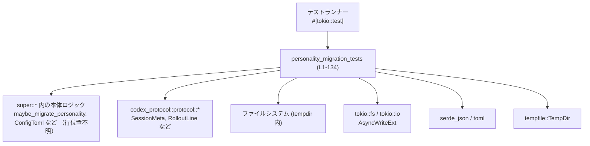
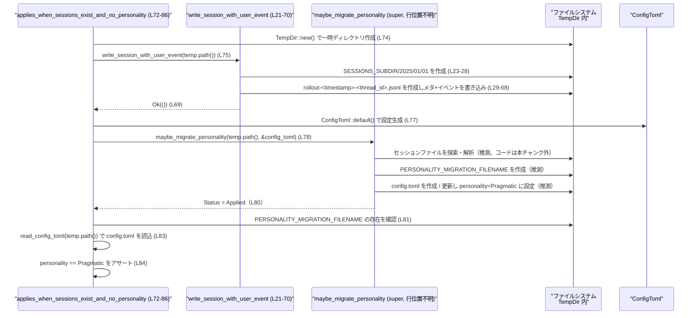

# core/src/personality_migration_tests.rs コード解説

## 0. ざっくり一言

`maybe_migrate_personality` の挙動（設定ファイル `config.toml` の `personality` を、既存セッションやマーカー有無に応じてどう扱うか）を、実際のファイル I/O を伴う非同期テストで検証するモジュールです。

---

## 1. このモジュールの役割

### 1.1 概要

- このモジュールは、**パーソナリティ設定のマイグレーション処理**（`maybe_migrate_personality`）が、以下の条件下で正しく動作するかを検証します。
  - セッションが存在し、`personality` が未設定
  - マーカー・ファイルが存在する
  - `personality` が明示的に設定済み
  - セッションが存在しない
- 実ファイルシステム上（`tempfile::TempDir`）にセッション JSONL と `config.toml` を生成し、**非同期 I/O と実データに近い形**でテストしています。

### 1.2 アーキテクチャ内での位置づけ

このモジュールは `super::*` からインポートされた本体ロジックに対するテストです。依存関係を簡略化すると次のようになります。



- `super::*` からは、少なくとも次のシンボルが利用されています（定義場所・詳細はこのチャンクには現れません）。
  - `maybe_migrate_personality`
  - `PERSONALITY_MIGRATION_FILENAME`
  - `SESSIONS_SUBDIR`
  - `ConfigToml`
  - `Personality`
  - `PersonalityMigrationStatus`
  - `ConfigEditsBuilder`
  - `create_marker`
  - `io`（`io::Result`, `io::Error`, `io::ErrorKind`）

### 1.3 設計上のポイント

- **責務の分離**
  - テストから共通処理（`config.toml` 読み込み、セッション JSONL の書き込み）をヘルパ関数に切り出しています。
    - `read_config_toml`（L16-19）
    - `write_session_with_user_event`（L21-70）
- **I/O と並行性**
  - すべてのテスト関数は `#[tokio::test]` かつ `async fn` で実装され、Tokio ランタイム上で非同期 I/O を行います（L72, L88, L101, L124）。
  - 各テストは独立した `TempDir` を使用し、ファイル競合が起こらない構造になっています。
- **エラーハンドリング**
  - テスト関数の戻り値は `io::Result<()>` であり、I/O やパースエラーは `?` でそのままテスト失敗として伝播します（例: L74, L75, L83）。
  - アサーションには `pretty_assertions::assert_eq` を使用し、差分表示を分かりやすくしています（例: L80, L96, L113-116）。

---

## 2. 主要な機能一覧（コンポーネントインベントリー）

### 2.1 ローカル定義コンポーネント一覧

| 名称 | 種別 | 役割 / 用途 | 定義位置 |
|------|------|------------|----------|
| `TEST_TIMESTAMP` | 定数 | テストで使用する固定タイムスタンプ文字列 | `core/src/personality_migration_tests.rs:L14` |
| `read_config_toml` | 非公開 async 関数 | `codex_home/config.toml` を読み込み `ConfigToml` にパースするヘルパ | `core/src/personality_migration_tests.rs:L16-19` |
| `write_session_with_user_event` | 非公開 async 関数 | セッションメタ＋ユーザーイベントを含む JSONL ファイルを `SESSIONS_SUBDIR` 配下に書き出すヘルパ | `core/src/personality_migration_tests.rs:L21-70` |
| `applies_when_sessions_exist_and_no_personality` | `#[tokio::test]` 非同期テスト | セッションあり・`personality` 未設定時にマイグレーションが適用され、`Pragmatic` が設定されることを検証 | `core/src/personality_migration_tests.rs:L72-86` |
| `skips_when_marker_exists` | `#[tokio::test]` 非同期テスト | マーカー・ファイルがある場合にマイグレーションがスキップされ、`config.toml` が生成されないことを検証 | `core/src/personality_migration_tests.rs:L88-99` |
| `skips_when_personality_explicit` | `#[tokio::test]` 非同期テスト | `personality` が明示的に設定済みの場合に、値を変更せずスキップされることを検証 | `core/src/personality_migration_tests.rs:L101-122` |
| `skips_when_no_sessions` | `#[tokio::test]` 非同期テスト | セッションが存在しない場合にマイグレーションがスキップされることを検証 | `core/src/personality_migration_tests.rs:L124-134` |

### 2.2 外部依存コンポーネント（このチャンクに定義は無いもの）

※ 定義はこのファイルには現れず、挙動はテストコードから読み取れる範囲のみです。

| 名称 | 由来 | 用途 / 期待される契約（テストから読み取れる範囲） |
|------|------|----------------------------------------------|
| `maybe_migrate_personality` | `super::*` | `codex_home` と `ConfigToml` を受け取り、`PersonalityMigrationStatus` を返すマイグレーション処理。セッション有無・マーカー有無・既存 `personality` に応じて動作が変わる（L78, L94, L111, L128）。 |
| `ConfigToml` | `super::*` | 設定ファイル表現。`Default` 実装を持ち、`personality` フィールドを含む（L77, L93, L127, L83, L110, L119）。 |
| `Personality` | `super::*` | パーソナリティの種類を表す列挙体。少なくとも `Pragmatic` と `Friendly` バリアントが存在（L84, L105, L120）。 |
| `PersonalityMigrationStatus` | `super::*` | マイグレーション結果の状態。少なくとも `Applied`, `SkippedMarker`, `SkippedExplicitPersonality`, `SkippedNoSessions` が存在（L80, L96, L113-116, L130）。 |
| `ConfigEditsBuilder` | `super::*` | `config.toml` を編集・書き込みするビルダー。`new().set_personality().apply().await` という非同期チェーンで利用される（L104-108）。 |
| `create_marker` | `super::*` | パスを受け取り、マーカー・ファイル（`PERSONALITY_MIGRATION_FILENAME`）を作成する非同期関数と推測される（L91）。 |
| `PERSONALITY_MIGRATION_FILENAME` | `super::*` | マイグレーション済みを示すマーカー・ファイル名（L81, L91, L117, L131）。 |
| `SESSIONS_SUBDIR` | `super::*` | セッション保存用サブディレクトリ名。`codex_home/SESSIONS_SUBDIR/年/月/日` の形で使用される（L23-27）。 |

---

## 3. 公開 API と詳細解説

このファイル自体は公開 API を提供しておらず、すべてテスト用の非公開関数・テスト関数です。ただし、テストを通じて本体 API の契約が分かるため、その点も併せて記述します。

### 3.1 型一覧（構造体・列挙体など）

このファイル内で新たに定義されている構造体・列挙体はありません。

外部型のみを利用しています（`ConfigToml`, `Personality`, `PersonalityMigrationStatus`, `SessionMetaLine` など）。

### 3.2 関数詳細（6 件）

#### `read_config_toml(codex_home: &Path) -> io::Result<ConfigToml>`（L16-19）

**概要**

- `codex_home/config.toml` を非同期で読み込み、`ConfigToml` にパースするヘルパ関数です。

**引数**

| 引数名 | 型 | 説明 |
|--------|----|------|
| `codex_home` | `&Path` | `config.toml` が存在する（または作成される）べきディレクトリのパス |

**戻り値**

- `io::Result<ConfigToml>`  
  - 成功時: パース済みの `ConfigToml` インスタンス  
  - 失敗時: I/O エラー、もしくは TOML パースエラーを `io::ErrorKind::InvalidData` としてラップした `io::Error`（L18）

**内部処理の流れ**

1. `codex_home.join("config.toml")` で設定ファイルパスを構築（L17）。
2. `tokio::fs::read_to_string` で非同期にファイル内容を読み込み（L17）、UTF-8 文字列として取得。
3. `toml::from_str` により `ConfigToml` へデシリアライズ（L18）。
4. TOML パース失敗時は `io::ErrorKind::InvalidData` の `io::Error` に変換して返却（L18）。

**Examples（使用例）**

```rust
// 一時ディレクトリ上の config.toml を読む（テスト中のパターン）
let temp = TempDir::new()?;                           // 一時ディレクトリを作成
// ... ここで何らかの方法で config.toml を書き込む ...
let cfg = read_config_toml(temp.path()).await?;       // 非同期に読み込んで ConfigToml を取得
assert!(cfg.personality.is_some());                   // フィールドの内容を検証
```

**Errors / Panics**

- `Err(io::Error)` となる条件:
  - `config.toml` が存在しない・アクセスできない・読み取り不可（`read_to_string`）(L17)。
  - TOML 形式が不正で `toml::from_str` が失敗した場合（L18）。

**Edge cases（エッジケース）**

- `config.toml` が空ファイルの場合:
  - TOML として不正扱いとなる可能性があり、その場合 `InvalidData` エラーになります（L18）。
- サイズの大きなファイル:
  - 特別な制御は無く、`read_to_string` で全読み込みします。

**使用上の注意点**

- この関数は**非同期**関数のため、Tokio などの非同期ランタイム上で `.await` する必要があります（L16）。
- `io::ErrorKind::InvalidData` として TOML エラーがまとめて扱われるため、TOML エラーと純粋な I/O エラーを区別したい場合は別途ハンドリングが必要です。

---

#### `write_session_with_user_event(codex_home: &Path) -> io::Result<()>`（L21-70）

**概要**

- `codex_home/SESSIONS_SUBDIR/2025/01/01` 以下に、セッションメタ情報と 1 件のユーザーイベントから成る JSONL ファイルを作成するテスト用ヘルパ関数です。

**引数**

| 引数名 | 型 | 説明 |
|--------|----|------|
| `codex_home` | `&Path` | セッションディレクトリ（`SESSIONS_SUBDIR` 配下）を作成する基準ディレクトリ |

**戻り値**

- `io::Result<()>`  
  - 成功時: `Ok(())`  
  - 失敗時: ディレクトリ作成・ファイル作成・ JSON シリアライズ・書き込みのいずれかで発生した `io::Error`

**内部処理の流れ**

1. 新規のスレッド ID を生成（`ThreadId::new()`、L22）。
2. `codex_home/SESSIONS_SUBDIR/2025/01/01` という日付ベースのディレクトリパスを構築し（L23-27）、`tokio::fs::create_dir_all` で階層をまとめて作成（L28）。
3. `rollout-{TEST_TIMESTAMP}-{thread_id}.jsonl` というファイル名を組み立て（L29）、`tokio::fs::File::create` でファイルを生成（L30）。
4. セッションメタ情報 (`SessionMetaLine`) を構築（L32-50）:
   - ID, タイムスタンプ、`SessionSource::Cli` などを設定。
   - Git 情報は `None`。
5. 上記メタを `RolloutLine::SessionMeta` としてラップ（L51-54）。
6. ユーザーメッセージイベント (`UserMessageEvent`) を `RolloutLine::EventMsg` として構築（L55-63）。
7. 両者を `serde_json::to_string` でシリアライズし、末尾に改行を付与して `write_all` で JSONL として書き込み（L65-68）。
8. 最後に `Ok(())` を返す（L69）。

**Examples（使用例）**

```rust
// テスト内でセッションファイルを準備する
let temp = TempDir::new()?;                                          // 一時ディレクトリ
write_session_with_user_event(temp.path()).await?;                   // セッション JSONL を作成
// ここで maybe_migrate_personality を呼び出すなどの検証を行う
```

**Errors / Panics**

- `Err(io::Error)` となる典型的条件:
  - ディレクトリ作成に失敗（パーミッションなど）（L28）。
  - ファイル作成に失敗（L30）。
  - `serde_json::to_string` の失敗を `?` で伝播（L65, L67）。  
    - このとき、`serde_json::Error` を `io::Error` に変換する何らかの仕組みが前提になっていますが、その実装はこのチャンクには現れません。
  - ファイル書き込みに失敗（L65-68）。

**Edge cases（エッジケース）**

- ディレクトリが既に存在する場合:
  - `create_dir_all` は既存ディレクトリにも成功を返す設計であり、このコードも特別な分岐は行っていません（L28）。
- 同じスレッド ID が衝突する可能性:
  - `ThreadId::new()` の具体的挙動はこのチャンクには現れませんが、通常は衝突しない前提のランダム ID もしくはユニーク ID です。

**使用上の注意点**

- この関数はテスト用であり、**JSONL 形式を暗黙に決め打ち**しています。フォーマットが本番コードと変わった場合は、このヘルパも合わせて更新する必要があります。
- タイムスタンプは `TEST_TIMESTAMP` に固定されているため、時刻依存のロジックをテストするのには適していません（L14, L36, L51, L56）。
- `serde_json::Error` → `io::Error` の変換前提について:
  - もし実際にその変換が提供されていない場合、このコードはコンパイルエラーとなります。
  - 変換がどのように実現されているかは、このチャンクからは分かりません。

---

#### `applies_when_sessions_exist_and_no_personality() -> io::Result<()>`（L72-86）

**概要**

- セッションが存在し、かつ `config.toml` の `personality` が未設定 (`ConfigToml::default()`) の場合に、`maybe_migrate_personality` が
  - `PersonalityMigrationStatus::Applied` を返す
  - マーカー・ファイルを作成する
  - `config.toml` に `Personality::Pragmatic` を書き込む  
 ことを検証するテストです。

**内部処理の流れ**

1. 一時ディレクトリを作成（L74）。
2. `write_session_with_user_event` でセッション JSONL を作成（L75）。
3. `ConfigToml::default()` で personality 未設定の設定値を生成（L77）。
4. `maybe_migrate_personality` を呼び出し、ステータスを取得（L78）。
5. ステータスが `Applied` であることを検証（L80）。
6. マーカー・ファイル（`PERSONALITY_MIGRATION_FILENAME`）が存在することを検証（L81）。
7. `read_config_toml` で `config.toml` を読み込み、`personality` が `Some(Personality::Pragmatic)` であることを検証（L83-84）。

**テストから読み取れる `maybe_migrate_personality` の契約**

- 前提:
  - `codex_home` 配下にセッションファイルが存在する。
  - `config_toml.personality` は `None`（`ConfigToml::default()` によると推定）。
- 期待される動作（このテストが保証しようとしている内容）:
  - **セッションの存在**を検出し、マイグレーションを適用する。
  - `PersonalityMigrationStatus::Applied` を返す。
  - マーカー・ファイル `PERSONALITY_MIGRATION_FILENAME` を作成する。
  - `config.toml` を作成または更新し、`personality` を `Pragmatic` に設定する。

**使用上の注意点**

- テストでは `ConfigToml::default()` が「personality 未設定」の状態であると仮定しています（L77）。この仮定が変わるとテスト意味も変わります。

---

#### `skips_when_marker_exists() -> io::Result<()>`（L88-99）

**概要**

- マーカー・ファイルが既に存在する場合、`maybe_migrate_personality` が
  - `PersonalityMigrationStatus::SkippedMarker` を返す
  - `config.toml` を作成しない  
 ことを検証します。

**内部処理の流れ**

1. 一時ディレクトリを作成（L90）。
2. `create_marker` でマーカー・ファイルを作成（L91）。
3. `ConfigToml::default()` を生成（L93）。
4. `maybe_migrate_personality` を呼び出しステータス取得（L94）。
5. ステータスが `SkippedMarker` であることを検証（L96）。
6. `codex_home/config.toml` が存在しないことを検証（L97）。

**テストから読み取れる契約**

- 前提:
  - `codex_home/PERSONALITY_MIGRATION_FILENAME` が既に存在する。
- 期待される動作:
  - マイグレーション処理は**即座にスキップされる**。
  - ステータスは `SkippedMarker`。
  - `config.toml` は新規作成されない。

**使用上の注意点**

- 本体側で「マーカーがある場合は何も変更しない」という契約を前提にしているため、将来的に挙動を変えるときは、このテストの意味も合わせて見直す必要があります。

---

#### `skips_when_personality_explicit() -> io::Result<()>`（L101-122）

**概要**

- `config.toml` に `personality` が明示的に設定されている場合に、`maybe_migrate_personality` が
  - `PersonalityMigrationStatus::SkippedExplicitPersonality` を返す
  - マーカー・ファイルを作成する
  - 既存の `personality` 値を変更しない  
 ことを検証します。

**内部処理の流れ**

1. 一時ディレクトリを作成（L103）。
2. `ConfigEditsBuilder::new(temp.path())` からビルダーを生成し、`set_personality(Some(Personality::Friendly))` でフレンドリーに設定（L104-105）。
3. `.apply().await` で `config.toml` に書き込み。エラー時には `io::Error::other` でラップして返す（L106-108）。
4. `read_config_toml` で現状の設定を読み込み（L110）。
5. `maybe_migrate_personality` を呼び出しステータス取得（L111）。
6. ステータスが `SkippedExplicitPersonality` であることを検証（L113-116）。
7. マーカー・ファイルが作成されていることを検証（L117）。
8. `config.toml` を再度読み込み、`personality` が `Friendly` のままであることを検証（L119-120）。

**テストから読み取れる契約**

- 前提:
  - `config.toml.personality` が `Some(...)`（ここでは `Friendly`）。
- 期待される動作:
  - マイグレーションは**適用されず**、ステータスは `SkippedExplicitPersonality`。
  - マーカー・ファイルは作成される。
  - `config.toml` の `personality` フィールドは変化しない。

**使用上の注意点**

- 本体の設計として、「ユーザーが明示的に設定したパーソナリティはマイグレーションで上書きしない」というポリシーをこのテストが固定しています。

---

#### `skips_when_no_sessions() -> io::Result<()>`（L124-134）

**概要**

- セッションが存在しない場合、`maybe_migrate_personality` が
  - `PersonalityMigrationStatus::SkippedNoSessions` を返す
  - マーカー・ファイルを作成する
  - `config.toml` を作成しない  
 ことを検証します。

**内部処理の流れ**

1. 一時ディレクトリを作成（L126）。
2. `ConfigToml::default()` を生成（L127）。
3. セッションを一切作成せずに `maybe_migrate_personality` を呼び出す（L128）。
4. ステータスが `SkippedNoSessions` であることを検証（L130）。
5. マーカー・ファイルが存在することを検証（L131）。
6. `config.toml` が存在しないことを検証（L132）。

**テストから読み取れる契約**

- 前提:
  - `codex_home` 配下にセッションファイルが存在しない。
- 期待される動作:
  - マイグレーションは実行されず、ステータスは `SkippedNoSessions`。
  - マーカー・ファイルは作成される。
  - `config.toml` は作成されない。

**使用上の注意点**

- 「セッションが一つも無い環境では personality を勝手に設定しない」というポリシーをテストが前提としています。

---

### 3.3 その他の関数

上記 6 関数以外に、このファイル内で定義されている関数はありません。

---

## 4. データフロー

ここでは、代表的なシナリオとして `applies_when_sessions_exist_and_no_personality`（L72-86）におけるデータフローを説明します。

### 4.1 処理の要点

- テストは一時ディレクトリに対して
  1. セッション JSONL を書き込む。
  2. デフォルト設定 `ConfigToml::default()` を用意する。
  3. `maybe_migrate_personality` を呼ぶ。
  4. 結果のステータスと生成されたファイル（マーカー、`config.toml`）を検証する。
- `maybe_migrate_personality` の内部実装はこのチャンクにはありませんが、テストからは「セッションの存在 → personality を Pragmatic に設定」という因果が読み取れます。

### 4.2 シーケンス図



---

## 5. 使い方（How to Use）

このファイルはテスト専用ですが、**マイグレーション処理の期待される使い方**と、テストヘルパの使い方の両方の観点で説明します。

### 5.1 基本的な使用方法（マイグレーション処理の呼び出し）

テストが示している典型的な呼び出しフローは次の通りです。

```rust
// 設定やセッションが置かれるホームディレクトリ
let codex_home = tempdir.path();                         // TempDir を例に使用

// 1. 必要に応じてセッションファイルを作成する（テストではヘルパを利用）
write_session_with_user_event(codex_home).await?;        // L21-70

// 2. ConfigToml を用意する
let config_toml = ConfigToml::default();                 // L77 など

// 3. マイグレーション処理を呼び出す
let status = maybe_migrate_personality(codex_home, &config_toml).await?;

// 4. 結果に応じて挙動を確認・利用する
match status {
    PersonalityMigrationStatus::Applied => {
        // personality が Pragmatic に設定されたことを期待（L80, L84）
    }
    PersonalityMigrationStatus::SkippedMarker => { /* 既に済み */ }
    PersonalityMigrationStatus::SkippedExplicitPersonality => { /* 既存設定尊重 */ }
    PersonalityMigrationStatus::SkippedNoSessions => { /* 何もしない */ }
}
```

### 5.2 よくある使用パターン（テストケース別）

テストから読み取れる「シナリオ別の使い方」は以下の通りです。

1. **セッションあり & personality 未設定 → 適用**（L72-86）
   - セッションファイルを作成 (`write_session_with_user_event`)。
   - `ConfigToml::default()` を渡す。
   - ステータス `Applied`、`personality=Pragmatic` を期待。

2. **マーカーあり → スキップ**（L88-99）
   - `create_marker` により先にマーカー・ファイルを立てる。
   - `ConfigToml::default()` を渡しても `SkippedMarker` を期待。
   - `config.toml` は生成されないことを確認。

3. **personality 明示 → スキップ（ただしマーカーは作成）**（L101-122）
   - `ConfigEditsBuilder` で personality を `Friendly` として保存。
   - `maybe_migrate_personality` は `SkippedExplicitPersonality` を返し、値は変えないがマーカーは作成。

4. **セッション無し → スキップ（マーカーのみ）**（L124-134）
   - セッション作成を一切行わない。
   - `SkippedNoSessions` を期待。
   - `config.toml` は生成されず、マーカーのみ作成。

### 5.3 よくある間違い（推測されるもの）

このチャンクから推測できる、注意すべき誤用例です。

```rust
// 間違い例: マーカー存在時に再度マイグレーション結果を書き換えることを期待する
create_marker(&codex_home.join(PERSONALITY_MIGRATION_FILENAME)).await?;
let cfg = ConfigToml::default();
let status = maybe_migrate_personality(&codex_home, &cfg).await?;
// ここで personality が変更されることを期待するのはテスト契約と矛盾する

// 正しい理解: ステータスは SkippedMarker で personality は変更されない（L88-99）
```

```rust
// 間違い例: セッションが無い環境で personality が自動設定されると思い込む
let cfg = ConfigToml::default();
let status = maybe_migrate_personality(&codex_home, &cfg).await?;
// この場合、status は SkippedNoSessions で personality は決まらない（L124-134）
```

### 5.4 使用上の注意点（まとめ）

- `maybe_migrate_personality` は、**初回実行時にマーカーを作る**設計であるとテストから読み取れます。
  - マーカーがある状態を「マイグレーション済み」と見なす。
- `personality` が `Some` の場合は、マイグレーションによる書き換えを行わず、ユーザー設定を優先する（L101-122）。
- セッションが存在しない環境で personality を自動設定しない（L124-134）。  
  → ユーザビリティよりも、**既存データに基づいてのみマイグレーションする**ことを重視している設計と解釈できます。

---

## 6. 変更の仕方（How to Modify）

### 6.1 新しい機能（テストケース）を追加する場合

1. **どこに書くか**
   - このファイル `personality_migration_tests.rs` に、新しい `#[tokio::test] async fn` を追加するのが自然です。
2. **既存ヘルパーの再利用**
   - セッションが必要なケースは `write_session_with_user_event`（L21-70）を再利用すると、フォーマットの一貫性を保てます。
   - 設定ファイルの読み書きには `ConfigEditsBuilder` および `read_config_toml`（L16-19）を使用します。
3. **ステータスの分岐追加**
   - `PersonalityMigrationStatus` に新しいバリアントを追加した場合は、そのバリアントを期待するテストケースをここに追加すると、契約が明確になります。

### 6.2 既存の機能（マイグレーションロジック）を変更する場合

実際のマイグレーション処理は `super::*` 側にあります。このファイルを変更する際の注意点は以下の通りです。

- **影響範囲の確認**
  - `PersonalityMigrationStatus` の仕様を変える、もしくはバリアントを追加・削除する場合:
    - 本ファイル内の比較箇所（L80, L96, L113-116, L130）を全て確認する必要があります。
  - マーカー・ファイルの扱いを変える場合:
    - `skips_when_marker_exists`（L88-99）と `skips_when_no_sessions`（L124-134）のアサーションを見直す必要があります。
- **契約の維持**
  - 「明示的な personality は上書きしない」「セッションが無い場合は何もしない」等の契約を変える場合、テストの期待結果を慎重に更新する必要があります。
- **テストの拡充**
  - エラーケース（I/O 失敗、パース失敗など）をハンドリングするロジックを本体に追加する場合は、同様の TempDir + 実ファイル I/O を用いたテストを追加することでカバレッジを高められます。

---

## 7. 関連ファイル

このモジュールと密接に関係するが、このチャンクには定義が現れないコンポーネントをまとめます。

| パス / モジュール | 役割 / 関係 |
|------------------|------------|
| `super` モジュール（具体的ファイル名はこのチャンクには現れません） | `maybe_migrate_personality`, `ConfigToml`, `Personality`, `PersonalityMigrationStatus`, `ConfigEditsBuilder`, `create_marker`, `PERSONALITY_MIGRATION_FILENAME`, `SESSIONS_SUBDIR`, `io` など、本体ロジックと共通型定義を提供します（L1, L16-19, L21-27, L77-78, L93-94, L104-108 など）。 |
| `codex_protocol::protocol` | セッションメタ・イベントの型 (`SessionMeta`, `SessionMetaLine`, `RolloutLine`, `RolloutItem`, `EventMsg`, `UserMessageEvent`, `SessionSource`) を提供し、セッションファイルフォーマットを規定しています（L3-9, L32-63）。 |
| `tokio::fs`, `tokio::io::AsyncWriteExt` | 非同期ファイル I/O（ディレクトリ作成、ファイル作成、書き込み）を行うためのランタイム機能を提供します（L17, L28, L30, L65-68）。 |
| `tempfile::TempDir` | テスト時に孤立した一時ディレクトリを提供し、実ファイルシステムへ副作用を限定します（L74, L90, L103, L126）。 |
| `serde_json`, `toml` | 各種設定・セッションオブジェクトのシリアライズ／デシリアライズに利用されています（L17-18, L65-67）。 |

---

### 潜在的な問題・安全性に関する補足（このチャンクから読み取れる範囲）

- エラー型の変換:
  - `write_session_with_user_event` 内で `serde_json::to_string(&meta_line)?` などの記述があります（L65-67）。
  - 戻り値型が `io::Result<()>` であるため、`serde_json::Error` から `io::Error` への変換がどこかで提供されている前提です。
  - その変換の実装はこのチャンクには現れないため、**実際のコードベースでこの部分がどのように満たされているかを確認する必要があります**。
- 並行実行時の安全性:
  - 各テストは独立した `TempDir` を使うため、テスト同士でファイルパスが衝突するリスクは低い構造になっています。
  - `ThreadId::new()` によってファイル名側も一意性が高いことが期待されます（L22, L29）。
