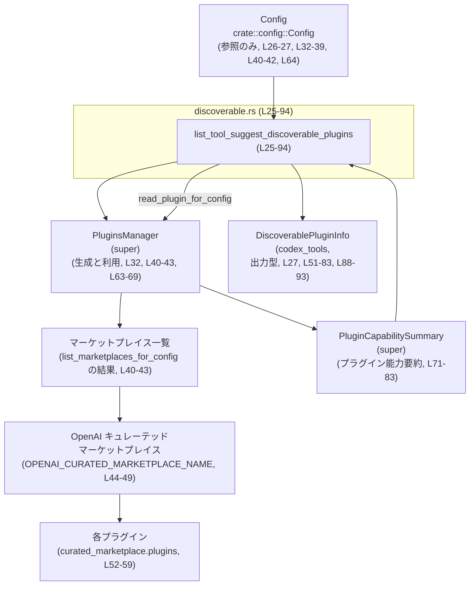
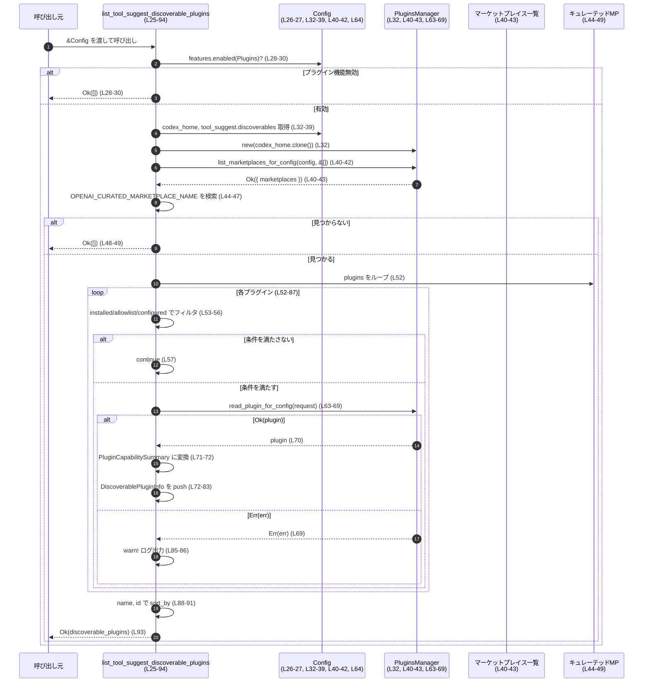

# core/src/plugins/discoverable.rs

## 0. ざっくり一言

ツールサジェスト機能向けに、「まだインストールされていないが候補として表示したいプラグイン」の一覧を生成するヘルパー関数を提供するモジュールです（core/src/plugins/discoverable.rs:L14-23, L25-94）。

---

## 1. このモジュールの役割

### 1.1 概要

- このモジュールは、ツールサジェスト機能でユーザーに提案する「ディスカバラブル（おすすめ）プラグイン」を列挙する役割を持ちます（core/src/plugins/discoverable.rs:L25-27）。
- OpenAI キュレーテッドマーケットプレイス内のプラグインのうち、許可リスト（allowlist）と設定ファイルに基づいて候補を選び、`DiscoverablePluginInfo` の一覧として返します（core/src/plugins/discoverable.rs:L14-23, L33-39, L44-52, L72-83）。
- プラグイン機能が無効な場合や対象マーケットプレイスが見つからない場合は、空の一覧を返します（core/src/plugins/discoverable.rs:L28-30, L44-49）。

### 1.2 アーキテクチャ内での位置づけ

`Config` と `PluginsManager` を利用してマーケットプレイスとプラグイン情報を取得し、それをツールサジェスト機能用の軽量な情報 (`DiscoverablePluginInfo`) に変換する位置づけです（core/src/plugins/discoverable.rs:L32-43, L63-83）。



> 図は `list_tool_suggest_discoverable_plugins` の中で `Config` と `PluginsManager` がどのように協調して `DiscoverablePluginInfo` の一覧を生成するかを表現しています。

### 1.3 設計上のポイント

- **機能フラグでの早期終了**  
  プラグイン機能が無効な場合は、プラグイン列挙処理を一切行わずに空の `Vec` を返します（core/src/plugins/discoverable.rs:L28-30）。  
- **許可リスト + 設定に基づくフィルタリング**  
  固定の許可リスト `TOOL_SUGGEST_DISCOVERABLE_PLUGIN_ALLOWLIST` と、設定ファイル由来の `configured_plugin_ids` の両方を用いて、候補にするプラグインを選別します（core/src/plugins/discoverable.rs:L14-23, L33-39, L52-56）。
- **マーケットプレイスの限定**  
  OpenAI キュレーテッドマーケットプレイス（`OPENAI_CURATED_MARKETPLACE_NAME`）に属するプラグインのみを対象にします（core/src/plugins/discoverable.rs:L44-49）。
- **エラーハンドリングの方針**  
  - マーケットプレイス一覧取得の失敗は `anyhow::Context` でメッセージを付与して呼び出し元に伝播します（core/src/plugins/discoverable.rs:L40-43）。  
  - 個々のプラグイン読み込み失敗は `warn!` ログ出力のみにとどめ、他のプラグイン候補列挙は継続します（core/src/plugins/discoverable.rs:L63-69, L85-86）。
- **状態を持たない純粋関数的な構造**  
  関数内で `PluginsManager` はローカルに生成され、外部に状態を保持しません（core/src/plugins/discoverable.rs:L32）。並行性に関わる共有状態や `async` は使用していません。

---

## 2. 主要な機能一覧

- ディスカバラブルプラグイン列挙: ツールサジェストに使用する候補プラグイン (`DiscoverablePluginInfo`) の一覧を生成する（core/src/plugins/discoverable.rs:L25-94）。

### コンポーネントインベントリ

このファイル内で定義される主なコンポーネントと行範囲です。

| 名前 | 種別 | 行範囲 | 役割 / 用途 |
|------|------|--------|-------------|
| `TOOL_SUGGEST_DISCOVERABLE_PLUGIN_ALLOWLIST` | `const &[&str]` | `core/src/plugins/discoverable.rs:L14-23` | ツールサジェストにおいて「デフォルトで発見候補として扱う」プラグイン ID の固定リスト。インストール済みでない場合に限り候補となる（L52-56）。 |
| `list_tool_suggest_discoverable_plugins` | 関数（`pub(crate)`） | `core/src/plugins/discoverable.rs:L25-94` | 設定とマーケットプレイス情報に基づき、ツールサジェスト用のディスカバラブルプラグイン一覧を生成して返す。 |
| `tests` | モジュール（`#[cfg(test)]`） | `core/src/plugins/discoverable.rs:L96-98` | テストコードを `discoverable_tests.rs` に外出しするためのモジュール宣言。このチャンクには実装は含まれていません。 |

---

## 3. 公開 API と詳細解説

### 3.1 型一覧（構造体・列挙体など）

このファイル内で新たに定義される構造体・列挙体はありません。外部からインポートして利用している主な型は次のとおりです。

| 名前 | 定義元（モジュール） | 行範囲（利用） | 役割 / 用途 |
|------|----------------------|----------------|-------------|
| `Config` | `crate::config` | `core/src/plugins/discoverable.rs:L26-27, L32-39, L40-42, L64` | 全体設定。プラグイン機能の有効フラグ・`codex_home` パス・ツールサジェスト設定 (`tool_suggest.discoverables`) を提供する。 |
| `ToolSuggestDiscoverableType` | `codex_config::types` | `core/src/plugins/discoverable.rs:L10, L37` | `discoverable.kind` がプラグインかどうかを判定するために使用される列挙型と思われますが、このチャンクには定義がありません。 |
| `Feature` | `codex_features` | `core/src/plugins/discoverable.rs:L11, L28` | 機能フラグ用の列挙体。ここでは `Feature::Plugins` でプラグイン機能が有効かチェックしています。 |
| `DiscoverablePluginInfo` | `codex_tools` | `core/src/plugins/discoverable.rs:L12, L27, L51-83, L88-93` | ツールサジェストに露出するプラグイン情報の結果型。`id`, `name`, `description`, `has_skills`, `mcp_server_names`, `app_connector_ids` フィールドが存在することが、初期化コードから読み取れます（L72-83）。 |
| `PluginsManager` | `super` | `core/src/plugins/discoverable.rs:L8, L32, L40-43, L63-69` | プラグインマーケットプレイスや個々のプラグインを読み取るための管理クラス。ここではマーケットプレイス一覧取得とプラグイン読み込みに使用されています。 |
| `PluginCapabilitySummary` | `super` | `core/src/plugins/discoverable.rs:L6, L71-83` | 読み込んだプラグインの能力・メタ情報を集約した型。`config_name`, `display_name`, `description`, `has_skills`, `mcp_server_names`, `app_connector_ids` などを持つことが、利用箇所から分かります（L72-82）。 |
| `PluginReadRequest` | `super` | `core/src/plugins/discoverable.rs:L7, L65-68` | プラグイン読み込み要求。`plugin_name` と `marketplace_path` を指定する構造体であることが利用コードから分かります。 |

> `ToolSuggestDiscoverableType`, `PluginsManager`, `PluginCapabilitySummary`, `PluginReadRequest` の定義本体は、このチャンクには現れないため詳細は不明です。

---

### 3.2 関数詳細

#### `list_tool_suggest_discoverable_plugins(config: &Config) -> anyhow::Result<Vec<DiscoverablePluginInfo>>`

**概要**

- プラグイン機能が有効であれば、OpenAI キュレーテッドマーケットプレイス内のプラグインから、ツールサジェストに表示すべきディスカバラブルプラグイン一覧を生成します（core/src/plugins/discoverable.rs:L28-30, L44-52, L72-83）。
- デフォルト許可リストと設定ファイル中の `discoverables` を参照し、まだインストールされていないプラグインのみを候補にします（core/src/plugins/discoverable.rs:L14-23, L33-39, L52-56）。

**シグネチャと引数**

| 引数名 | 型 | 説明 |
|--------|----|------|
| `config` | `&Config` | 全体設定への共有参照。プラグイン機能フラグ、`codex_home` パス、`tool_suggest.discoverables` などを参照します（core/src/plugins/discoverable.rs:L26-27, L32-39, L40-42, L64）。 |

**戻り値**

- `Ok(Vec<DiscoverablePluginInfo>)`  
  - ツールサジェスト用に表示する候補プラグインの一覧。空配列の可能性もあります（core/src/plugins/discoverable.rs:L28-30, L44-49, L51, L93）。
- `Err(anyhow::Error)`  
  - マーケットプレイス一覧の取得に失敗した場合など、`?` で伝播されたエラー（core/src/plugins/discoverable.rs:L40-43）。

**内部処理の流れ（アルゴリズム）**

1. **プラグイン機能フラグをチェック**  
   `config.features.enabled(Feature::Plugins)` が `false` の場合は、空の `Vec` を返して処理を終了します（core/src/plugins/discoverable.rs:L28-30）。  

2. **`PluginsManager` の生成**  
   `config.codex_home.clone()` を渡して `PluginsManager::new` を生成します（core/src/plugins/discoverable.rs:L32）。  
   - ここで `codex_home` の値は `Config` から取得しています（L32）。

3. **設定から「ディスカバラブルなプラグイン ID」を抽出**  
   - `config.tool_suggest.discoverables.iter()` で設定中の discoverable 定義を走査します（core/src/plugins/discoverable.rs:L33-36）。  
   - `discoverable.kind == ToolSuggestDiscoverableType::Plugin` のものに絞り（L37）、  
   - `discoverable.id.as_str()` で文字列 ID を取り出します（L38）。  
   - それらを `HashSet<&str>` に収集し、`configured_plugin_ids` として保持します（L39）。  

4. **マーケットプレイス一覧の取得とフィルタ**  
   - `plugins_manager.list_marketplaces_for_config(config, &[])` を呼び出し（core/src/plugins/discoverable.rs:L40-41）、`?` でエラーを伝播します（L42）。  
   - 成功時には `.marketplaces` フィールドを取り出します（L43）。  
   - その中から `marketplace.name == OPENAI_CURATED_MARKETPLACE_NAME` を満たすものだけを `find` で取得し（L44-46）、存在しない場合は空の `Vec` を返します（L47-49）。  

5. **プラグインごとのフィルタリング**  
   - 対象マーケットプレイスの `plugins` をループし（core/src/plugins/discoverable.rs:L52）、各プラグインについて以下の条件を評価します（L53-56）。  
   - `plugin.installed` が `true` の場合は候補から除外して `continue` します（L53-57）。  
   - そうでない場合でも、  
     - `TOOL_SUGGEST_DISCOVERABLE_PLUGIN_ALLOWLIST` に ID が含まれず（L54）、かつ  
     - `configured_plugin_ids` にも含まれていない場合（L55）  
     は `continue` し、候補から除外します（L56-57）。  
   - 結果として「未インストール」かつ「許可リストまたは設定で指定されている」プラグインのみが次のステップへ進みます。

6. **プラグイン情報の読み込みと `DiscoverablePluginInfo` への変換**  
   - フィルタを通過したプラグインについて、`plugin.id` と `plugin.name` をクローンしてローカル変数に保持します（core/src/plugins/discoverable.rs:L60-61）。  
   - `PluginsManager::read_plugin_for_config` を次のリクエストで呼び出します（L63-68）。  
     - `PluginReadRequest { plugin_name, marketplace_path: curated_marketplace.path.clone() }`（L65-68）。  
   - `match` で結果を分岐します（L69）。  
     - `Ok(plugin)` の場合:  
       - `plugin.plugin` を `PluginCapabilitySummary` に `into()` で変換し（L71）、  
       - その内容をもとに `DiscoverablePluginInfo` を生成して `discoverable_plugins` ベクタに `push` します（L72-83）。  
     - `Err(err)` の場合:  
       - `warn!` ログを出力し（L85-86）、該当プラグインは候補に含めないままループ継続します。

7. **結果のソートと返却**  
   - 収集した `discoverable_plugins` を `name` 昇順、同名の場合は `id` 昇順でソートします（core/src/plugins/discoverable.rs:L88-91）。  
   - ソート後のベクタを `Ok(discoverable_plugins)` として返します（L93）。

**Examples（使用例）**

この関数は `pub(crate)` のためクレート内部でのみ利用できます（core/src/plugins/discoverable.rs:L25）。以下は擬似的な利用例です（`Config` の具体的な構築方法はこのチャンクには現れないため省略します）。

```rust
use crate::config::Config;
use crate::plugins::discoverable::list_tool_suggest_discoverable_plugins;
use codex_tools::DiscoverablePluginInfo;

fn show_tool_suggestions(config: &Config) -> anyhow::Result<()> {
    // ディスカバラブルプラグイン一覧を取得する                          // core/src/plugins/discoverable.rs:L25-27 に対応
    let plugins: Vec<DiscoverablePluginInfo> =
        list_tool_suggest_discoverable_plugins(config)?; // エラー時は?で呼び出し元に伝播

    // 取得したプラグイン候補を UI などに表示する
    for plugin in plugins {
        println!("{} - {}", plugin.name, plugin.description);
    }

    Ok(())
}
```

**Errors / Panics**

- **`Err` になるケース**  
  - `PluginsManager::list_marketplaces_for_config(config, &[])` がエラーを返した場合（core/src/plugins/discoverable.rs:L40-42）。  
    - このエラーには `"failed to list plugin marketplaces for tool suggestions"` というコンテキストメッセージが付与されます（L42）。  
  - `PluginsManager::new` などの内部でパニック・エラーが起こる可能性については、このチャンクからは分かりません。

- **`Err` にならないが情報が欠落しうるケース**  
  - 個々の `read_plugin_for_config` 呼び出しで `Err` が返った場合は、ログに `warn!` を出力しつつ処理を継続し、そのプラグインを結果から除外します（core/src/plugins/discoverable.rs:L63-69, L85-86）。  
  - そのため、一部プラグインの読み込みに失敗しても関数全体は `Ok` を返し、成功した分だけが結果に含まれます。

- **Panics**  
  - この関数内には明示的な `panic!` 呼び出しはありません。  
  - 標準ライブラリや他モジュールでのパニックの可能性（例えば `PluginsManager` 内部）は、このチャンクからは判断できません。

**Edge cases（エッジケース）**

- **プラグイン機能が無効 (`Feature::Plugins` が false)**  
  - 早期に `Ok(Vec::new())` を返し、一切の I/O やマーケットプレイス操作は行いません（core/src/plugins/discoverable.rs:L28-30）。  
- **マーケットプレイス一覧取得に失敗**  
  - エラーが `?` でそのまま上位に伝播し、ディスカバラブルプラグインは一切返されません（core/src/plugins/discoverable.rs:L40-43）。  
- **OpenAI キュレーテッドマーケットプレイスが存在しない**  
  - `find` が `None` となり、空の `Vec` を返します（core/src/plugins/discoverable.rs:L44-49）。  
- **対象マーケットプレイスにプラグインが存在しない**  
  - `curated_marketplace.plugins` が空であれば `for` ループは 0 回で終了し、そのまま空の `Vec` が返ります（core/src/plugins/discoverable.rs:L51-52, L88-93）。  
- **すべてのプラグインがすでにインストール済み**  
  - 全件 `plugin.installed == true` により `continue` となり、結果は空の `Vec` になります（core/src/plugins/discoverable.rs:L52-57）。  
- **許可リストにも設定にも含まれない未インストールプラグイン**  
  - `!allowlist.contains(id) && !configured_plugin_ids.contains(id)` により除外されます（core/src/plugins/discoverable.rs:L54-56）。  
- **`read_plugin_for_config` の一部失敗**  
  - 失敗したプラグインは結果から欠落しますが、他のプラグインは列挙されます（core/src/plugins/discoverable.rs:L63-69, L85-86）。  
- **同名プラグインの存在**  
  - `sort_by` で `name` → `id` の順にソートするため、同名でも `id` によって安定した順序になります（core/src/plugins/discoverable.rs:L88-91）。

**使用上の注意点**

- **I/O とパフォーマンス**  
  - `list_marketplaces_for_config` や `read_plugin_for_config` の実装によってはファイルシステムやネットワークへのアクセスが含まれる可能性があり、呼び出しコストが高い可能性があります（core/src/plugins/discoverable.rs:L40-43, L63-69）。  
  - 頻繁に呼び出す場合は、結果をキャッシュするなどの上位レイヤーでの対策が必要になる場合がありますが、このファイルにはキャッシュ処理は実装されていません。  
- **エラーの取り扱い方針**  
  - マーケットプレイス一覧取得のエラーは「致命的」とみなされている一方で、個々のプラグイン読み込みエラーは「非致命的」としてログのみでスキップされます（core/src/plugins/discoverable.rs:L40-43, L63-69, L85-86）。  
  - 呼び出し側は「候補一覧が部分的に欠落している可能性がある」ことを前提とする必要があります。  
- **並行性**  
  - この関数は同期関数であり、`async`/`await` やスレッド共有状態を使用していません（関数シグネチャおよび本体にそのような記述は存在しません、core/src/plugins/discoverable.rs:L25-94）。  
  - `PluginsManager` が内部でどのような並行処理を行うかはこのチャンクからは不明ですが、関数自体はシングルスレッド前提で記述されています。  
- **セキュリティ上の観点**  
  - 許可リスト `TOOL_SUGGEST_DISCOVERABLE_PLUGIN_ALLOWLIST` によって、デフォルトで提示されるプラグインは限定されています（core/src/plugins/discoverable.rs:L14-23, L52-56）。  
  - 追加で `configured_plugin_ids` を通じ、設定ファイルからも候補を許可していますが、ここでの ID は `Config` 由来であり、直接の外部入力は受け付けていません（core/src/plugins/discoverable.rs:L33-39）。  
  - プラグインの実行やパーミッション管理そのものはこの関数の責務外であり、このチャンクからは分かりません。

### 3.3 その他の関数

このファイルには、上記以外の関数定義はありません（core/src/plugins/discoverable.rs:L1-98 を通覧しても他の `fn` 定義は存在しません）。

---

## 4. データフロー

ここでは、`list_tool_suggest_discoverable_plugins` 呼び出し時にデータがどのように流れるかを整理します。

### 処理シナリオ概要

1. `Config` から機能フラグ・`codex_home`・ツールサジェスト設定を参照します（core/src/plugins/discoverable.rs:L28-39）。
2. `PluginsManager` を通じてマーケットプレイス一覧を取得し、目的のマーケットプレイスを特定します（core/src/plugins/discoverable.rs:L32, L40-49）。
3. 対象マーケットプレイスに含まれるプラグイン一覧をループし、条件に合うプラグインのみ `read_plugin_for_config` で詳細情報を取得し、`DiscoverablePluginInfo` に変換します（core/src/plugins/discoverable.rs:L52-83）。
4. 収集した結果をソートして返します（core/src/plugins/discoverable.rs:L88-93）。

### シーケンス図（`list_tool_suggest_discoverable_plugins` 全体: L25-94）



---

## 5. 使い方（How to Use）

### 5.1 基本的な使用方法

クレート内部のコードから、この関数を呼び出してツールサジェスト用の候補一覧を取得する流れの例です。

```rust
use crate::config::Config;
use crate::plugins::discoverable::list_tool_suggest_discoverable_plugins;
use codex_tools::DiscoverablePluginInfo;

fn update_tool_suggestions_ui(config: &Config) -> anyhow::Result<()> {
    // ディスカバラブルなプラグイン候補を取得する                        // core/src/plugins/discoverable.rs:L25-27
    let candidates: Vec<DiscoverablePluginInfo> =
        list_tool_suggest_discoverable_plugins(config)?;

    // 取得した候補を UI やログなどに反映する
    for plugin in candidates {
        println!(
            "Suggest plugin: {} ({})",
            plugin.name, plugin.id
        );
    }

    Ok(())
}
```

この例では、`list_tool_suggest_discoverable_plugins` がエラーになった場合は `?` 演算子により呼び出し元にエラーを伝播します（core/src/plugins/discoverable.rs:L40-43）。

### 5.2 よくある使用パターン

1. **起動時に一度だけ候補を構築してキャッシュする**  
   - アプリケーション起動時にこの関数を呼び出して結果をキャッシュし、その後はキャッシュ済み一覧を UI で利用するパターン。  
   - これは `PluginsManager` が内部で I/O を行っている可能性に配慮したパターンです（core/src/plugins/discoverable.rs:L40-43, L63-69）。

2. **設定変更後に再評価する**  
   - `Config.tool_suggest.discoverables` を変更した後に、この関数を再度呼び出して候補一覧を更新するパターン（core/src/plugins/discoverable.rs:L33-39）。  

### 5.3 よくある間違い

```rust
// 間違い例: プラグイン機能が無効でも結果を前提に処理してしまう
fn show_suggestions_wrong(config: &Config) -> anyhow::Result<()> {
    let plugins = list_tool_suggest_discoverable_plugins(config)?;
    // プラグイン機能無効でも plugins が空になるだけなので、
    // 「空なら機能が壊れている」と判断してしまうと誤り。
    if plugins.is_empty() {
        // 誤ってエラー扱いしてしまう
        return Err(anyhow::anyhow!("no suggestions"));
    }
    Ok(())
}

// 正しい例: プラグイン機能の有効/無効を config から判断する
fn show_suggestions_correct(config: &Config) -> anyhow::Result<()> {
    if !config.features.enabled(codex_features::Feature::Plugins) {
        // プラグイン機能無効なら、そもそもサジェスト UI を表示しない など
        return Ok(());
    }

    let plugins = list_tool_suggest_discoverable_plugins(config)?;
    // 空であっても「候補がない」状態として扱う
    // ...
    Ok(())
}
```

上記のように、関数は「空の結果」をさまざまな理由で返すため（機能無効、MP 不在、全件フィルタアウトなど）、単に `is_empty()` だけで異常と決めつけないほうが安全です（core/src/plugins/discoverable.rs:L28-30, L44-49, L52-57）。

### 5.4 使用上の注意点（まとめ）

- `Config` の `Feature::Plugins` が無効な場合、本関数は空の結果を返すのみであり、エラーにはなりません（core/src/plugins/discoverable.rs:L28-30）。  
- マーケットプレイス一覧取得に失敗した場合のみ `Err` が返ります（core/src/plugins/discoverable.rs:L40-43）。  
- 個別プラグインの読み込み失敗は `warn!` ログに記録されるだけで、外部からは検知しづらい設計になっています（core/src/plugins/discoverable.rs:L63-69, L85-86）。  
- 関数自体は並行性を持ちませんが、I/O を伴う可能性があるため高頻度での呼び出しには注意が必要です（core/src/plugins/discoverable.rs:L40-43, L63-69）。

---

## 6. 変更の仕方（How to Modify）

### 6.1 新しい機能を追加する場合

1. **新しいディスカバラブル種別を扱いたい場合**  
   - 現在は `discoverable.kind == ToolSuggestDiscoverableType::Plugin` のものだけを対象としています（core/src/plugins/discoverable.rs:L37）。  
   - 別種別も扱う場合は、このフィルタ条件を拡張する必要があります。  
   - その際、`DiscoverablePluginInfo` にマッピング可能な情報が取得できるかどうかも確認する必要があります（core/src/plugins/discoverable.rs:L72-83）。

2. **別のマーケットプレイスを対象にしたい場合**  
   - `OPENAI_CURATED_MARKETPLACE_NAME` でマーケットプレイス名を固定しています（core/src/plugins/discoverable.rs:L5, L44-47）。  
   - 別マーケットプレイスも対象にするなら、  
     - ここでの `find` 条件を拡張する  
     - もしくは複数マーケットプレイスからプラグインを集約するロジックを追加する  
     などの対応が必要です。

3. **許可リストを動的に拡張したい場合**  
   - 現在の許可リストはコンパイル時固定の `const` です（core/src/plugins/discoverable.rs:L14-23）。  
   - 動的な設定やリモート構成に基づいて許可リストを拡張したい場合は、  
     - `TOOL_SUGGEST_DISCOVERABLE_PLUGIN_ALLOWLIST` のみを使うのではなく、  
     - 上位レイヤーで「設定由来の許可リスト」を `configured_plugin_ids` に反映するなどの設計が考えられます。

### 6.2 既存の機能を変更する場合

- **影響範囲の確認方法**
  - `list_tool_suggest_discoverable_plugins` がどこから呼ばれているかを検索し、UI やツールサジェストの仕様への影響を把握します（このチャンク単体では呼び出し元は不明です）。  
- **前提条件・返り値の契約**
  - 「マーケットプレイス取得エラーのみ `Err` で、それ以外は空の `Vec` も含めて `Ok`」という契約を変える場合、呼び出し側のエラーハンドリング全体を見直す必要があります（core/src/plugins/discoverable.rs:L28-30, L40-49, L52-57）。  
- **テスト**
  - テストは `discoverable_tests.rs` に定義されています（core/src/plugins/discoverable.rs:L96-98）。  
  - 仕様変更時には、このテストファイルを確認・更新して期待する動作がカバーされているか確認する必要がありますが、具体的なテスト内容はこのチャンクには現れません。

---

## 7. 関連ファイル

このモジュールと密接に関係する（とコードから読み取れる）ファイル・モジュールです。

| パス / モジュール | 役割 / 関係 |
|------------------|------------|
| `core/src/plugins/discoverable_tests.rs` | `#[path = "discoverable_tests.rs"]` によって参照されるテストコード。`list_tool_suggest_discoverable_plugins` の仕様を検証していると考えられますが、このチャンクには内容は含まれていません（core/src/plugins/discoverable.rs:L96-98）。 |
| `crate::config` モジュール | `Config` 型を提供し、プラグイン機能フラグ・`codex_home`・ツールサジェスト設定などを保持します（core/src/plugins/discoverable.rs:L9, L26-27, L32-39, L40-42, L64）。具体的なファイルパスは、このチャンクからは分かりません。 |
| `codex_config::types` モジュール | `ToolSuggestDiscoverableType` を提供し、設定上の「ディスカバラブル種別」を表現します（core/src/plugins/discoverable.rs:L10, L37）。 |
| `codex_features` クレート | `Feature::Plugins` などの機能フラグを定義し、プラグイン機能の有効/無効判定に使用されています（core/src/plugins/discoverable.rs:L11, L28）。 |
| `codex_tools` クレート | ツールおよびプラグイン関連の型を提供し、ここでは `DiscoverablePluginInfo` の結果型を使用しています（core/src/plugins/discoverable.rs:L12, L27, L51-83, L88-93）。 |
| `super` モジュール (`PluginsManager`, `PluginCapabilitySummary`, `PluginReadRequest`, `OPENAI_CURATED_MARKETPLACE_NAME`) | プラグインマーケットプレイス管理とプラグイン読み込み、能力サマリ変換、およびターゲットとなるマーケットプレイス名を提供します（core/src/plugins/discoverable.rs:L5-8, L32, L40-49, L63-71）。具体的なファイル構成はこのチャンクには現れません。 |

この情報をもとに、`list_tool_suggest_discoverable_plugins` がどの設定とどのプラグイン管理ロジックに依存しているかを把握できるようになっています。
