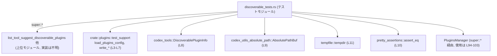
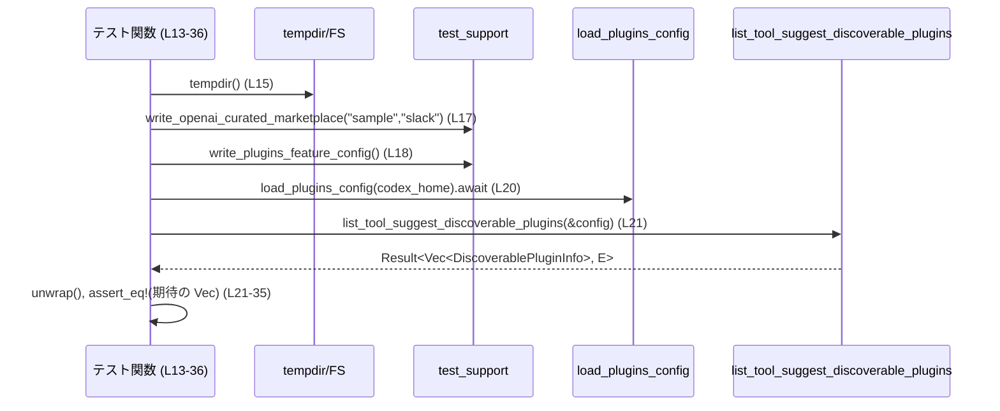
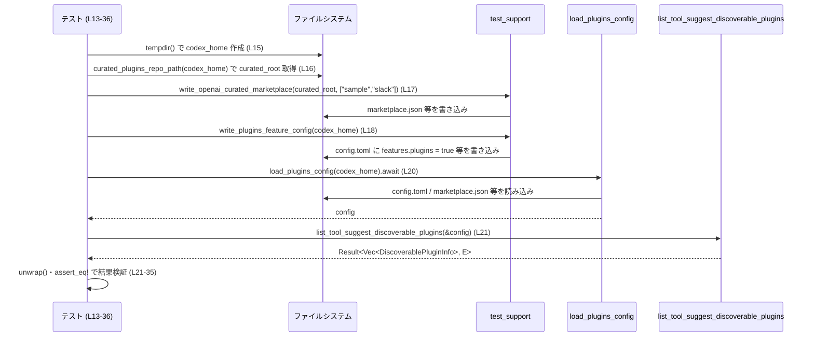

# core/src/plugins/discoverable_tests.rs コード解説

## 0. ざっくり一言

`list_tool_suggest_discoverable_plugins` と関連コンポーネントの挙動を検証する **非同期統合テスト集** です。  
主に「キュレーテッド・マーケットプレイスからどのプラグインが発見可能（discoverable）として提示されるか」という条件を確認しています。

---

## 1. このモジュールの役割

### 1.1 概要

このテストモジュールは、上位モジュールで定義されているとみられる `list_tool_suggest_discoverable_plugins` 関数の挙動を検証します（`use super::*;` によりインポートされています。`core/src/plugins/discoverable_tests.rs:L1`）。

テストから分かる機能は次の通りです。

- キュレーテッドなプラグイン・マーケットプレイスから、**未インストールのプラグインのみ** を discoverable として返すこと（`list_tool_suggest_discoverable_plugins_returns_uninstalled_curated_plugins`、`L13-36`）。
- プラグイン機能が設定で無効化されている場合、discoverable プラグイン一覧が **空になること**（`L38-54`）。
- プラグインの `description` が **正規化（余分な空白の削除）** されること（`L56-84`）。
- すでに **インストール済みのキュレーテッド・プラグインを除外** すること（`L86-109`）。
- 設定ファイルの `[tool_suggest].discoverables` に明示的に指定した **プラグイン ID を含める** こと（`L111-142`）。

### 1.2 アーキテクチャ内での位置づけ

このファイルは `core::plugins` モジュール配下にあり、以下のコンポーネントと協調してテストを行っています。

- 上位モジュールからインポートされる本体コード（`super::*`、`L1`）
  - 例: `list_tool_suggest_discoverable_plugins`, `PluginsManager` など（実際の定義はこのチャンクには現れません）。
- テスト用ユーティリティ群（`crate::plugins::test_support::*`、`L3-L7`）
- 型定義 `DiscoverablePluginInfo`（`codex_tools` クレート由来、`L8`）
- 絶対パス用ラッパー `AbsolutePathBuf`（`L9`）
- 一時ディレクトリ作成 `tempdir`（`L11`）
- Tokio ランタイムを用いた非同期テスト（`#[tokio::test]` 属性、`L13,38,56,86,111`）

依存関係を簡略化した図は次の通りです。



> 上図は、このチャンク（`core/src/plugins/discoverable_tests.rs:L1-142`）内で確認できる依存関係のみを表現しています。

### 1.3 設計上のポイント

コードから読み取れる設計上の特徴は次の通りです。

- **統合テスト志向**
  - テストごとに `tempdir()` で一時ディレクトリを作成し（`L15,40,58,88,113`）、その中に
    - キュレーテッド・マーケットプレイスの JSON（`write_openai_curated_marketplace`、`L17,42,60,90,115`）
    - 設定ファイル `config.toml`（`write_plugins_feature_config` または `write_file`、`L18,44-48,61,91,116-124`）
    - インストール情報（`write_curated_plugin_sha`、`L91`）
    を書き込み、実際のファイル構成に近い環境を作っています。
- **非同期 I/O 前提**
  - 設定読み込み `load_plugins_config` が `async` であり、すべてのテストが `async fn` として定義されています（`L20,50,70,105,126`）。
- **エラー発生はテスト失敗として扱う**
  - `tempdir().expect("tempdir should succeed")`（`L15,40,58,88,113`）
  - `list_tool_suggest_discoverable_plugins(&config).unwrap()`（`L21,51,71,106,127`）
  - `AbsolutePathBuf::try_from(...).expect("marketplace path")`（`L97-100`）
  - `install_plugin(...).await.expect("plugin should install")`（`L94-103`）
  といった呼び出しで、失敗時には panic によりテストを失敗させます。
- **比較のための値オブジェクト**
  - `DiscoverablePluginInfo` のインスタンスを明示的に構築し、`assert_eq!` でベクタ全体を比較しています（`L25-34,75-82,131-140`）。

---

## 2. 主要な機能一覧

### 2.1 コンポーネントインベントリー（このファイルで定義／使用される主な要素）

#### 2.1.1 このファイル内で定義される関数

| 名前 | 種別 | 役割 / 用途 | 行範囲（根拠） |
|------|------|-------------|----------------|
| `list_tool_suggest_discoverable_plugins_returns_uninstalled_curated_plugins` | `async fn` テスト | 未インストールのキュレーテッド・プラグインが discoverable として返ることを検証します。 | `core/src/plugins/discoverable_tests.rs:L13-36` |
| `list_tool_suggest_discoverable_plugins_returns_empty_when_plugins_feature_disabled` | `async fn` テスト | プラグイン機能が設定で無効化されている場合に空リストを返すことを検証します。 | `core/src/plugins/discoverable_tests.rs:L38-54` |
| `list_tool_suggest_discoverable_plugins_normalizes_description` | `async fn` テスト | プラグイン JSON の `description` が空白を正規化して格納されることを検証します。 | `core/src/plugins/discoverable_tests.rs:L56-84` |
| `list_tool_suggest_discoverable_plugins_omits_installed_curated_plugins` | `async fn` テスト | インストール済みのキュレーテッド・プラグインが discoverable 一覧から除外されることを検証します。 | `core/src/plugins/discoverable_tests.rs:L86-109` |
| `list_tool_suggest_discoverable_plugins_includes_configured_plugin_ids` | `async fn` テスト | 設定 `[tool_suggest].discoverables` で指定したプラグイン ID が discoverable 一覧に含まれることを検証します。 | `core/src/plugins/discoverable_tests.rs:L111-142` |

#### 2.1.2 外部コンポーネント（このチャンクで使用されるが、定義は別ファイル）

| 名前 | 種別 | 用途（このチャンクで観測できる範囲） | 使用箇所（根拠） |
|------|------|---------------------------------------|------------------|
| `list_tool_suggest_discoverable_plugins` | 関数（戻り値は `Result<Vec<DiscoverablePluginInfo>, E>` 型と推測可能） | 設定から discoverable なプラグイン一覧を取得します。テストでは `.unwrap()` により `Vec<DiscoverablePluginInfo>` を取り出しています。実装はこのチャンクには現れません。 | `core/src/plugins/discoverable_tests.rs:L21,51,71,106,127` |
| `PluginsManager` | 構造体（詳細不明） | `.new(...).install_plugin(...)` を通じてプラグインをインストールするために使用されています。 | `core/src/plugins/discoverable_tests.rs:L94-103` |
| `PluginInstallRequest` | 構造体 | `install_plugin` に渡すリクエスト。`plugin_name` と `marketplace_path` を持つことが分かります。 | `core/src/plugins/discoverable_tests.rs:L2,95-101` |
| `DiscoverablePluginInfo` | 構造体 | discoverable プラグインの情報（`id`, `name`, `description`, `has_skills`, `mcp_server_names`, `app_connector_ids`）を表現し、`assert_eq!` の比較対象として使用されます。 | `core/src/plugins/discoverable_tests.rs:L8,25-34,75-82,131-140` |
| `load_plugins_config` | `async fn` | 一時ディレクトリに書き込まれた設定とプラグイン情報を読み込み、`list_tool_suggest_discoverable_plugins` に渡す `config` を構築します。型の詳細はこのチャンクには現れません。 | `core/src/plugins/discoverable_tests.rs:L3,20,50,70,105,126` |
| `write_openai_curated_marketplace` | 関数 | キュレーテッド・マーケットプレイスの JSON を所定のルート配下に生成します。第二引数のスライスでプラグイン名一覧を指定します。 | `core/src/plugins/discoverable_tests.rs:L6,17,42,60,90,115` |
| `write_plugins_feature_config` | 関数 | プラグイン機能を有効化する設定ファイルを一時ディレクトリに出力します。 | `core/src/plugins/discoverable_tests.rs:L7,18,61,92` |
| `write_curated_plugin_sha` | 関数 | キュレーテッド・プラグインのバージョン情報などを一時ディレクトリに書き込む関数と推測されますが、詳細なフォーマットはこのチャンクには現れません。 | `core/src/plugins/discoverable_tests.rs:L4,91` |
| `write_file` | 関数 | 任意のパスに任意の内容のファイルを書き出します。ここでは `config.toml` や `plugin.json` を直接記述するために使用しています。 | `core/src/plugins/discoverable_tests.rs:L5,44-48,62-68,116-124` |
| `curated_plugins_repo_path` | 関数 | `codex_home` から見たキュレーテッド・プラグインリポジトリのルートディレクトリを返します。 | `core/src/plugins/discoverable_tests.rs:L16,41,59,89,114` |
| `AbsolutePathBuf` | 構造体 | OS 依存の絶対パス表現をラップするとみられます。ここではマーケットプレイス JSON のパスを `try_from` で生成しています。 | `core/src/plugins/discoverable_tests.rs:L9,97-100` |

> これら外部コンポーネントの実際の実装は **このチャンクには現れません**。記述はすべて呼び出し側コードから読み取れる事実に基づきます。

### 2.2 主要な機能（テストが検証する契約）

- 未インストールのキュレーテッド・プラグインのみを discoverable として返す（`slack` のみが返る、`L13-36`）。
- プラグイン機能が無効化された設定では discoverable 一覧は空になる（`L38-54`）。
- プラグイン JSON の `description` は余分な改行・スペースを除去して 1 行に正規化される（`"Plugin with extra spacing"` になる、`L56-84`）。
- インストール済みのキュレーテッド・プラグインは discoverable 一覧から除外される（`L86-109`）。
- 設定 `[tool_suggest].discoverables` の `type = "plugin", id = "<id>"` で明示的に指定したプラグイン ID は discoverable 一覧に含まれる（`L111-142`）。

---

## 3. 公開 API と詳細解説

このファイル自体はテストモジュールであり、外部に公開される API はありませんが、テスト関数が検証する **契約（contract）** と **データ構造の使い方** を整理します。

### 3.1 型一覧（このチャンクに出てくる主な型）

| 名前 | 種別 | 役割 / 用途 | 根拠 |
|------|------|-------------|------|
| `DiscoverablePluginInfo` | 構造体 | discoverable プラグインの情報（`id`, `name`, `description`, `has_skills`, `mcp_server_names`, `app_connector_ids`）を保持します。テストでは期待値としてベクタに格納され、`assert_eq!` で比較されます。 | `core/src/plugins/discoverable_tests.rs:L8,25-34,75-82,131-140` |
| `PluginInstallRequest` | 構造体 | `PluginsManager::install_plugin` に渡されるリクエスト。プラグイン名とマーケットプレイス JSON の絶対パスを指定します。 | `core/src/plugins/discoverable_tests.rs:L2,95-101` |
| `AbsolutePathBuf` | 構造体 | 絶対パスの検証付き表現。`try_from(PathBuf)` により生成されています。 | `core/src/plugins/discoverable_tests.rs:L9,97-100` |

> これらの型のフィールド定義やメソッドは **このチャンクには現れません**。上記は利用側コードから読み取れるフィールド名・メソッド名のみを列挙しています。

### 3.2 関数詳細（テスト関数）

以下では、各テスト関数が検証している振る舞いを詳細に説明します。

---

#### `list_tool_suggest_discoverable_plugins_returns_uninstalled_curated_plugins()`

**概要**

未インストールのキュレーテッド・プラグインが、`list_tool_suggest_discoverable_plugins` によって discoverable として返されることを検証する非同期テストです（`core/src/plugins/discoverable_tests.rs:L13-36`）。

**引数**

- なし（テスト関数であり、外部から引数を受け取りません）。

**戻り値**

- `()`（単位型）。戻り値を直接利用せず、`assert_eq!` による検証が成功すればテスト成功となります。

**内部処理の流れ**

1. 一時ディレクトリ `codex_home` を作成（`tempdir().expect("tempdir should succeed")`、`L15`）。
2. `curated_root` としてキュレーテッド・プラグインリポジトリのルートパスを取得（`L16`）。
3. `write_openai_curated_marketplace` で、`sample` と `slack` の 2 つのプラグインエントリを持つマーケットプレイスを生成（`L17`）。
4. `write_plugins_feature_config` でプラグイン機能を有効化する設定を書き込み（`L18`）。
5. `load_plugins_config(codex_home.path()).await` で設定を読み込み、`config` を取得（`L20`）。
6. `list_tool_suggest_discoverable_plugins(&config).unwrap()` を呼び出し、discoverable プラグイン一覧を取得（`L21`）。
7. 期待される `DiscoverablePluginInfo` ベクタと `assert_eq!` で比較（`L23-35`）。
   - 結果には `slack@openai-curated` のみが含まれることを期待しています。



**Errors / Panics**

- `tempdir()` が失敗した場合、`expect("tempdir should succeed")` により panic します（`L15`）。
- `list_tool_suggest_discoverable_plugins` が `Err` を返した場合、`unwrap()` により panic します（`L21`）。
- 期待するベクタと実際の結果が異なる場合、`assert_eq!` によりテストが失敗します（`L23-35`）。

**Edge cases（エッジケース）**

- このテストでは「2 つのキュレーテッドプラグインのうち 1 つのみが返る」ケースを検証しています。
  - `sample` が返らず、`slack` のみが返る理由（例えば config での指定の有無など）は、テストコードだけからは断定できません（実装はこのチャンクには現れません）。

**使用上の注意点**

- `list_tool_suggest_discoverable_plugins` の戻り値は `Result` であり、実使用コードでは `unwrap()` ではなく適切なエラーハンドリングを行う必要があります。
- テストでは一時ディレクトリを使用しているため、並列実行時にも他テストとのファイルシステム衝突は起こりにくい構成になっています。

---

#### `list_tool_suggest_discoverable_plugins_returns_empty_when_plugins_feature_disabled()`

**概要**

プラグイン機能が設定で無効化されている場合、discoverable プラグイン一覧が空のベクタになることを検証するテストです（`L38-54`）。

**内部処理の流れ**

1. 一時ディレクトリと `curated_root` をセットアップ（`L40-41`）。
2. `write_openai_curated_marketplace` で `slack` のみを含むマーケットプレイスを生成（`L42`）。
3. `write_file` で `config.toml` にプラグイン機能を無効化する設定を書き込み（`L44-48`）。

   ```toml
   [features]
   plugins = false
   ```

4. 設定を読み込み（`load_plugins_config`、`L50`）、`list_tool_suggest_discoverable_plugins(&config).unwrap()` を呼び出し（`L51`）。
5. 返り値が `Vec::<DiscoverablePluginInfo>::new()` に等しいことを `assert_eq!` で確認（`L53`）。

**Errors / Panics**

- `tempdir()` 失敗時の `expect`、`list_tool_suggest_discoverable_plugins` 失敗時の `unwrap()` の挙動は前テストと同様です（`L40,51`）。

**Edge cases**

- プラグイン機能無効時に「空ベクタが返る」という契約が示されています。
  - `None` や `Err` ではなく、**成功として空ベクタを返す** 振る舞いである点が重要です。

---

#### `list_tool_suggest_discoverable_plugins_normalizes_description()`

**概要**

`plugin.json` に記述された説明文 `description` が、余分な空白や改行を除去して正規化されることを検証するテストです（`L56-84`）。

**内部処理の流れ**

1. 一時ディレクトリ、`curated_root` のセットアップ（`L58-59`）。
2. `write_openai_curated_marketplace` により `slack` プラグインを登録（`L60`）。
3. `write_plugins_feature_config` でプラグイン機能を有効化（`L61`）。
4. `write_file` で `plugins/slack/.codex-plugin/plugin.json` を直接書き換え（`L62-68`）。

   ```json
   {
     "name": "slack",
     "description": "  Plugin\n   with   extra   spacing  "
   }
   ```

5. 設定読み込み → `list_tool_suggest_discoverable_plugins` 呼び出し（`L70-71`）。
6. 期待値として、`description: Some("Plugin with extra spacing".to_string())` を持つ `DiscoverablePluginInfo` を構築し（`L73-82`）、`assert_eq!` で比較。

**Errors / Panics**

- `write_file` が失敗した場合の挙動はこのチャンクからは分かりませんが、`expect` は使われていないため、この関数内で panic は発生していません（I/O エラー時の扱いは `write_file` 実装に依存します）。
- それ以外の `expect` / `unwrap` は前テストと同様です（`L58,70-71`）。

**Edge cases**

- 複数スペースや改行を含む説明文が **単一スペースで連結された 1 行の文章** に変換されることを前提としています。
- 空文字や `description` フィールド自体が存在しない場合の挙動は、このチャンクには現れません。

---

#### `list_tool_suggest_discoverable_plugins_omits_installed_curated_plugins()`

**概要**

キュレーテッド・マーケットプレイスに存在するプラグインであっても、すでにインストール済みであれば、discoverable 一覧から除外されることを検証するテストです（`L86-109`）。

**内部処理の流れ**

1. `codex_home` と `curated_root` をセットアップ（`L88-89`）。
2. `write_openai_curated_marketplace` で `slack` を登録（`L90`）。
3. `write_curated_plugin_sha` でキュレーテッドプラグインのバージョン情報などを設定（`L91`）。
4. `write_plugins_feature_config` でプラグイン機能を有効化（`L92`）。
5. `PluginsManager::new(codex_home.path().to_path_buf())` でマネージャを作成（`L94`）。
6. `install_plugin` に `PluginInstallRequest` を渡して `slack` をインストール（`L95-103`）。
7. 再度設定を読み込み（`load_plugins_config`、`L105`）、`list_tool_suggest_discoverable_plugins` を呼び出し（`L106`）。
8. 結果が空ベクタであることを `assert_eq!` で確認（`L108`）。

**Errors / Panics**

- `AbsolutePathBuf::try_from` が失敗した場合、`expect("marketplace path")` により panic します（`L97-100`）。
- `install_plugin(...).await.expect("plugin should install")` により、プラグインインストールが失敗すると panic します（`L94-103`）。
- `list_tool_suggest_discoverable_plugins` からの `Err` は `unwrap()` によって panic します（`L106`）。

**Edge cases**

- 同一プラグインがインストール済みである場合に限り除外されることが、このテストから読み取れる契約です。
- 複数バージョンや異なるマーケットプレイスソースが混在する場合の扱いは、このチャンクには現れません。

---

#### `list_tool_suggest_discoverable_plugins_includes_configured_plugin_ids()`

**概要**

設定ファイルの `[tool_suggest].discoverables` セクションで指定されたプラグイン ID が、discoverable 一覧に含まれることを検証するテストです（`L111-142`）。

**内部処理の流れ**

1. `codex_home` と `curated_root` をセットアップ（`L113-114`）。
2. `write_openai_curated_marketplace` で `sample` プラグインを登録（`L115`）。
3. `write_file` で `config.toml` に次のような設定を書き込み（`L116-124`）。

   ```toml
   [features]
   plugins = true

   [tool_suggest]
   discoverables = [{ type = "plugin", id = "sample@openai-curated" }]
   ```

4. 設定を読み込み（`L126`）、`list_tool_suggest_discoverable_plugins` を呼び出し（`L127`）。
5. `id: "sample@openai-curated"` を持つ `DiscoverablePluginInfo` が 1 件だけ返ることを `assert_eq!` で確認（`L129-141`）。

**Errors / Panics**

- `tempdir()` 失敗と `list_tool_suggest_discoverable_plugins` の `Err` は前テストと同様に panic に繋がります（`L113,127`）。

**Edge cases**

- `discoverables` のエントリには `type = "plugin"` と `id = "<plugin-id>"` を持つ TOML テーブルを使用することが示されています。
- 複数の discoverables を指定した場合や、無効な `id` を指定した場合の挙動は、このチャンクには現れません。

---

### 3.3 その他の関数

このファイル内に定義される関数は上記 5 つのみであり、補助的なローカル関数・ヘルパー関数は定義されていません。

外部から利用される補助関数（`write_file`, `write_openai_curated_marketplace` など）は `crate::plugins::test_support` モジュールに属し、その実装はこのチャンクには現れません。

---

## 4. データフロー

代表的なシナリオとして、「未インストールのキュレーテッド・プラグインを discoverable として取得する」テスト（`list_tool_suggest_discoverable_plugins_returns_uninstalled_curated_plugins (L13-36)`）のデータフローを整理します。

1. テスト関数が `tempdir()` で一時ディレクトリ `codex_home` を作成。
2. `curated_plugins_repo_path(codex_home)` により、キュレーテッド・マーケットプレイス用のルートディレクトリ `curated_root` を取得。
3. `write_openai_curated_marketplace(&curated_root, &["sample", "slack"])` により、マーケットプレイス JSON が `curated_root` 配下に生成される。
4. `write_plugins_feature_config(codex_home)` により、`config.toml` にプラグイン機能を有効化する設定が書き込まれる。
5. `load_plugins_config(codex_home)` により、ファイルシステム上の設定・マーケットプレイス情報などを統合して `config` オブジェクトが構築される。
6. `list_tool_suggest_discoverable_plugins(&config)` が `config` を解析し、discoverable なプラグインの `Vec<DiscoverablePluginInfo>` を返す。
7. テストコードがそのベクタと期待値を比較する。



> `load_plugins_config` や `list_tool_suggest_discoverable_plugins` の内部データフローはこのチャンクには現れませんが、少なくとも「ファイルシステムから設定・マーケットプレイス情報を読み取り、`DiscoverablePluginInfo` のベクタを構築する」という流れが推測できます。

---

## 5. 使い方（How to Use）

このファイルはテストモジュールであり、実アプリケーションコードから直接呼び出すものではありませんが、**`list_tool_suggest_discoverable_plugins` をどのように用いるか** の参考になります。

### 5.1 基本的な使用方法（テスト文脈）

テストコードを簡略化した例です。`list_tool_suggest_discoverable_plugins` の呼び出し手順が分かります。

```rust
use crate::plugins::test_support::{
    load_plugins_config,                // 設定を非同期に読み込む
    write_openai_curated_marketplace,   // テスト用マーケットプレイスを生成する
    write_plugins_feature_config,       // plugins 機能を有効化する設定を書く
};
use tempfile::tempdir;
use codex_tools::DiscoverablePluginInfo;

// #[tokio::test] 属性付きで非同期テストとして実行
#[tokio::test]
async fn example_use_list_tool_suggest_discoverable_plugins() {
    let codex_home = tempdir().expect("tempdir should succeed");                  // 一時ディレクトリを作成
    let curated_root = crate::plugins::curated_plugins_repo_path(codex_home.path()); // curated_root を取得
    write_openai_curated_marketplace(&curated_root, &["sample"]);                // sample プラグインを登録
    write_plugins_feature_config(codex_home.path());                             // plugins 機能を有効化する設定を書く

    let config = load_plugins_config(codex_home.path()).await;                   // 設定を読み込む
    let discoverable_plugins =
        list_tool_suggest_discoverable_plugins(&config).unwrap();                // discoverable 一覧を取得

    assert!(!discoverable_plugins.is_empty());                                   // 何らかのプラグインが返ることを確認
}
```

> 実アプリケーションでは、`unwrap()` の代わりに `?` 演算子や `match` によるエラーハンドリングを行うことが推奨されます。

### 5.2 よくある使用パターン

このチャンクから読み取れる `list_tool_suggest_discoverable_plugins` の代表的な呼び出しパターンは次の通りです。

- `load_plugins_config` などで **設定オブジェクトを構築し、その参照を渡す**。
- 戻り値 `Result<Vec<DiscoverablePluginInfo>, E>` の **成功時の値（`Vec`）を使って UI や CLI に候補を表示** する（テストでは `assert_eq!` による検証に利用）。

### 5.3 よくある間違い（このチャンクから推測できる範囲）

- **プラグイン機能を無効化したまま呼び出す**

  - 誤用例（テスト `list_tool_suggest_discoverable_plugins_returns_empty_when_plugins_feature_disabled` に相当、`L38-54`）:

    ```rust
    // config.toml: [features] plugins = false
    let config = load_plugins_config(codex_home.path()).await;
    let discoverable_plugins = list_tool_suggest_discoverable_plugins(&config).unwrap();
    // discoverable_plugins は常に空になる
    ```

  - プラグイン機能を利用したい場合は、`[features] plugins = true` が必要です。

- **インストール済みプラグインを discoverable に期待する**

  - `list_tool_suggest_discoverable_plugins_omits_installed_curated_plugins` から、インストール済みのキュレーテッド・プラグインは一覧から除外されることが分かります（`L86-109`）。
  - 「インストール済みも含めてすべてのプラグインを列挙したい」という用途には、この関数は適していない可能性があります（別の API が存在するかどうかはこのチャンクには現れません）。

### 5.4 使用上の注意点（まとめ）

- **非同期実行環境**
  - `list_tool_suggest_discoverable_plugins` を利用するコードは、Tokio などの非同期ランタイム上から呼び出す前提（`#[tokio::test]` で利用されていることから、非同期の呼び出し元が一般的であると考えられます）。
- **エラーハンドリング**
  - テストでは `unwrap()` を用いており、エラーはテスト失敗として扱いますが、実用コードでは `Result` を適切に扱う必要があります。
- **設定とファイル構造への依存**
  - 挙動は `config.toml`、マーケットプレイス JSON、インストール済みプラグイン情報（SHAやインストールディレクトリ）など、ファイルシステム上の状態に強く依存します。
  - テストコードでは `test_support` のユーティリティがこの構造をセットアップしています。

---

## 6. 変更の仕方（How to Modify）

### 6.1 新しい機能を追加する場合（テストの観点）

`list_tool_suggest_discoverable_plugins` に新しい仕様を追加した場合、それを検証するテストをこのファイルに追加するのが自然です。

一般的な手順は次の通りです。

1. **シナリオの整理**
   - 例: 「特定のタグ付きプラグインのみを discoverable とする」など。
2. **必要なファイル構成の決定**
   - どのプラグインをマーケットプレイスに登録するか（`write_openai_curated_marketplace`）。
   - どのような設定を `config.toml` に書くか（`write_plugins_feature_config` / `write_file`）。
3. **テスト関数の追加**
   - `#[tokio::test]` 属性を付け、既存テストと同様に `tempdir()` で一時ディレクトリを用意する。
   - `load_plugins_config` → `list_tool_suggest_discoverable_plugins` の流れで結果を取得し、期待値と比較する。
4. **エッジケースの検証**
   - 必要に応じて、設定が欠けている場合や不正な値が含まれる場合の挙動もテストする。

### 6.2 既存の機能を変更する場合

`list_tool_suggest_discoverable_plugins` の仕様を変更するときは、以下の点に注意する必要があります。

- **影響範囲の確認**
  - このファイルの 5 つのテストはそれぞれ異なる前提（プラグイン機能 ON/OFF、インストール済みかどうか、description のフォーマット、tool_suggest 設定）をカバーしています。
  - 仕様変更がどの前提に関わるかを整理し、対応するテストを更新または追加する必要があります。
- **契約の維持・変更点の明示**
  - 例えば「プラグイン機能無効時も一部のプラグインは返す」という仕様に変える場合、`list_tool_suggest_discoverable_plugins_returns_empty_when_plugins_feature_disabled`（`L38-54`）の期待値を変更する必要があります。
- **テストサポートコードとの整合性**
  - `test_support` のユーティリティ（`write_openai_curated_marketplace`, `write_plugins_feature_config` など）の振る舞いを変更した場合、このファイルのすべてのテストに影響が出ます。
  - これらの関数定義は別ファイルにあり、このチャンクには現れませんので、変更前にそちらの実装も確認する必要があります。

---

## 7. 関連ファイル

このチャンクから参照されている関連モジュール・ファイルは次の通りです（正確なファイルパスは一部不明ですが、モジュールパスから推測できる範囲で整理します）。

| パス / モジュール | 役割 / 関係 |
|-------------------|------------|
| `core/src/plugins/discoverable_*.rs`（正確なファイル名は不明） | `use super::*`（`L1`）により、このテストが対象としている本体コード（`list_tool_suggest_discoverable_plugins`, `PluginsManager` など）が定義されていると考えられます。実際のファイル名はこのチャンクには現れません。 |
| `crate::plugins::test_support` | テスト専用ユーティリティモジュール。`load_plugins_config`, `write_openai_curated_marketplace`, `write_plugins_feature_config`, `write_curated_plugin_sha`, `write_file` を提供します（`L3-L7`）。 |
| `codex_tools` クレート | `DiscoverablePluginInfo` 型を提供します（`L8`）。discoverable プラグイン情報の共通表現と考えられます。 |
| `codex_utils_absolute_path` クレート | `AbsolutePathBuf` 型を提供します（`L9`）。絶対パス表現・検証用のユーティリティです。 |
| `tempfile` クレート | テスト用の一時ディレクトリ作成に使用されています（`L11`）。 |
| `pretty_assertions` クレート | `assert_eq!` を差分表示付きに差し替えるために使用されています（`L10`）。 |

> 実際の本体実装（`list_tool_suggest_discoverable_plugins` および `PluginsManager` の定義）はこのチャンクには現れません。その挙動については、ここで説明したテストコードが **期待している契約の一部** を示しているにとどまります。
