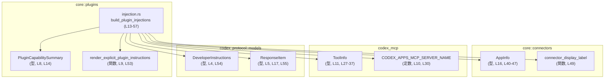
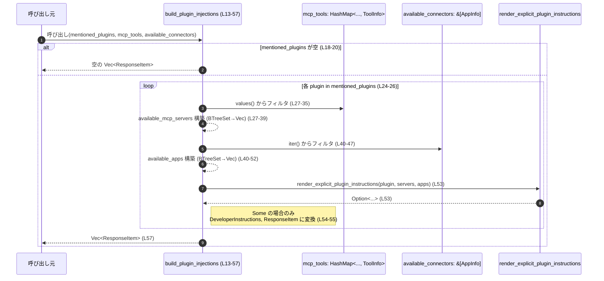
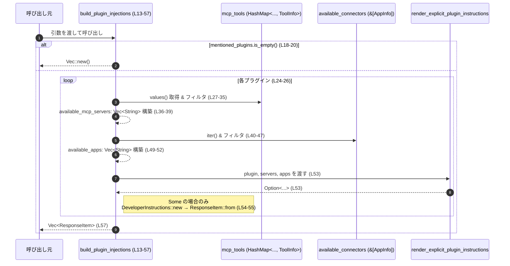

# core/src/plugins/injection.rs コード解説

## 0. ざっくり一言

- 言及されたプラグイン一覧から、利用可能な MCP サーバーとアプリケーションを紐付けて `ResponseItem` のリスト（開発者向けインストラクション）を構築する関数を提供するモジュールです（`build_plugin_injections`; `core/src/plugins/injection.rs:L13-17, L24-57`）。

---

## 1. このモジュールの役割

### 1.1 概要

- このモジュールは、  
  **入力:** ユーザーから「言及されたプラグイン」の一覧、MCP ツール定義、コネクタ定義  
  **出力:** プラグインごとの `ResponseItem` の一覧  
  という変換を行う関数 `build_plugin_injections` を提供します（`core/src/plugins/injection.rs:L13-17`）。
- 各プラグインについて、関連する MCP サーバーと有効なアプリケーションを検出し、`render_explicit_plugin_instructions` を用いて説明文を生成し、`DeveloperInstructions` → `ResponseItem` に変換しています（`core/src/plugins/injection.rs:L27-39, L40-55`）。

### 1.2 アーキテクチャ内での位置づけ

このモジュールは「プラグイン機能」サブシステムの一部として、他モジュール・外部クレートと次のように連携します。



※ 行番号は `core/src/plugins/injection.rs` 内の位置を示します。

### 1.3 設計上のポイント

- **ステートレスな純粋関数**  
  グローバル状態や可変参照を持たず、引数に対して決定的な結果を返す関数として実装されています（`&` 参照のみを受け取り、内部での変更は行っていません; `core/src/plugins/injection.rs:L13-17, L24-57`）。
- **早期リターン**  
  `mentioned_plugins` が空なら即座に空の `Vec` を返し、不要な計算を避けます（`core/src/plugins/injection.rs:L18-20`）。
- **重複除去とソート**  
  MCP サーバー名・アプリ名は一度 `BTreeSet<String>` に格納してから `Vec` に変換しており、重複が取り除かれ、ソートされた順序で並びます（`core/src/plugins/injection.rs:L27-39, L40-52`）。
- **フィルタ条件の明示化**  
  - MCP ツール: 特定サーバー名 `CODEX_APPS_MCP_SERVER_NAME` を除外しつつ、そのツールが対象プラグインの `display_name` を持つものだけを選びます（`core/src/plugins/injection.rs:L27-35`）。
  - コネクタ: `is_enabled` が `true` かつ `plugin_display_names` に対象プラグインの `display_name` を含むものだけを選びます（`core/src/plugins/injection.rs:L40-47`）。
- **オプションな結果の扱い**  
  `filter_map` を使い、`render_explicit_plugin_instructions` から `None` が返されたプラグインは静かにスキップされます（`core/src/plugins/injection.rs:L26, L53-56`）。

---

## 2. 主要な機能一覧

- `build_plugin_injections`: 言及されたプラグインと、MCP ツールおよび利用可能コネクタの情報から、プラグインごとの `ResponseItem` を生成する関数です（`core/src/plugins/injection.rs:L13-17, L24-57`）。

---

## 3. 公開 API と詳細解説

### 3.1 型一覧（構造体・列挙体など）

このモジュール自身は新しい型を定義していませんが、外部型を引数・戻り値として利用します。

| 名前 | 種別 | 役割 / 用途 | 定義元モジュール | コード位置 |
|------|------|-------------|------------------|------------|
| `PluginCapabilitySummary` | 外部型（詳細不明） | 各プラグインに関する情報を表す型。少なくとも `display_name` フィールドを持ち、フィルタのキーとして使用されています。 | `crate::plugins` | `core/src/plugins/injection.rs:L8, L14, L34, L47` |
| `connectors::AppInfo` | 外部型（詳細不明） | コネクタ（アプリ）に関する情報を表す型。少なくとも `is_enabled` と `plugin_display_names` フィールドを持ちます。 | `crate::connectors` | `core/src/plugins/injection.rs:L16, L40-47` |
| `ToolInfo` | 外部型（詳細不明） | MCP ツールに関する情報を表す型。少なくとも `server_name` と `plugin_display_names` フィールドを持ちます。 | `codex_mcp` | `core/src/plugins/injection.rs:L11, L15, L27-37` |
| `DeveloperInstructions` | 外部型（詳細不明） | `render_explicit_plugin_instructions` の結果から生成される値を保持する型。`new` という関連関数を持ちます。 | `codex_protocol::models` | `core/src/plugins/injection.rs:L4, L54` |
| `ResponseItem` | 外部型（詳細不明） | 呼び出し元に返されるレスポンス要素。`From<DeveloperInstructions>` と思われる変換を通じて生成されていますが、詳細な定義はこのチャンクには現れません。 | `codex_protocol::models` | `core/src/plugins/injection.rs:L5, L17, L55` |
| `CODEX_APPS_MCP_SERVER_NAME` | 定数 | 特定の MCP サーバー名。ここではフィルタ条件として「除外対象」として使われます。 | `codex_mcp` | `core/src/plugins/injection.rs:L10, L30` |
| `connector_display_label` | 関数 | `AppInfo` から表示用ラベル（`String`）を生成する関数。ここではアプリ名のラベル化に使用されています。 | `crate::connectors` | `core/src/plugins/injection.rs:L49` |

> `DeveloperInstructions` や `ResponseItem` の内部構造はこのチャンクには現れないため、「どのようなフィールドを持つか」は不明です。

### 3.2 関数詳細

#### `build_plugin_injections(mentioned_plugins: &[PluginCapabilitySummary], mcp_tools: &HashMap<String, ToolInfo>, available_connectors: &[connectors::AppInfo]) -> Vec<ResponseItem>`

**概要**

- 言及されたプラグイン一覧 `mentioned_plugins` を走査し、それぞれに対して：
  - 関連する MCP サーバー（`ToolInfo`）を探索
  - 関連する有効なアプリ（`AppInfo`）を探索  
  したうえで `render_explicit_plugin_instructions` を呼び出し、生成されたインストラクションを `ResponseItem` として収集します（`core/src/plugins/injection.rs:L24-57`）。
- プラグインが 1 つも言及されていない場合は、空の `Vec` を返します（`core/src/plugins/injection.rs:L18-20`）。

**引数**

| 引数名 | 型 | 説明 | コード位置 |
|--------|----|------|------------|
| `mentioned_plugins` | `&[PluginCapabilitySummary]` | 処理対象となるプラグインの一覧。スライスの共有参照として受け取り、内容を書き換えません。空の場合は即座に空のベクタを返します。 | `core/src/plugins/injection.rs:L14, L18-20, L24-26` |
| `mcp_tools` | `&HashMap<String, ToolInfo>` | 利用可能な MCP ツールを表すマップ。値を走査して、対象プラグインに紐づく MCP サーバーを抽出します。 | `core/src/plugins/injection.rs:L15, L27-37` |
| `available_connectors` | `&[connectors::AppInfo]` | 利用可能なコネクタ（アプリ）の一覧。`is_enabled` 等でフィルタリングし、対象プラグインに紐づくアプリを抽出します。 | `core/src/plugins/injection.rs:L16, L40-52` |

**戻り値**

- 型: `Vec<ResponseItem>`（`core/src/plugins/injection.rs:L17, L57`）
- 各要素は 1 つのプラグインに対応する `ResponseItem` です。  
  ただし、`render_explicit_plugin_instructions` が `None` を返したプラグインは結果に含まれません（`filter_map` を使用しているため; `core/src/plugins/injection.rs:L26, L53-56`）。

**内部処理の流れ（アルゴリズム）**

1. **空チェックと早期リターン**  
   `mentioned_plugins.is_empty()` をチェックし、空であれば `Vec::new()` を返します（`core/src/plugins/injection.rs:L18-20`）。
2. **プラグインごとのループ**  
   `mentioned_plugins.iter().filter_map(|plugin| { ... })` により、各プラグインを 1 つずつ処理します（`core/src/plugins/injection.rs:L24-26`）。
3. **MCP サーバーの抽出**（`available_mcp_servers`）  
   - `mcp_tools.values()` を走査し（`core/src/plugins/injection.rs:L27-28`）、
   - 次の条件を満たすものだけを残します（`core/src/plugins/injection.rs:L29-35`）:
     - `tool.server_name != CODEX_APPS_MCP_SERVER_NAME`
     - `tool.plugin_display_names.iter().any(|plugin_name| plugin_name == &plugin.display_name)`
   - `tool.server_name.clone()` でサーバー名を文字列として収集し（`core/src/plugins/injection.rs:L36`）、
   - `BTreeSet<String>` に `collect` して重複を除去・ソートし（`core/src/plugins/injection.rs:L37-38`）、
   - 最後に `Vec<String>` に変換します（`core/src/plugins/injection.rs:L39`）。
4. **アプリケーションの抽出**（`available_apps`）  
   - `available_connectors.iter()` を走査し（`core/src/plugins/injection.rs:L40-41`）、
   - 次の条件を満たすコネクタのみ残します（`core/src/plugins/injection.rs:L42-47`）:
     - `connector.is_enabled`
     - `connector.plugin_display_names.iter().any(|plugin_name| plugin_name == &plugin.display_name)`
   - 残ったコネクタを `connectors::connector_display_label` で表示用ラベルに変換し（`core/src/plugins/injection.rs:L49`）、
   - こちらも `BTreeSet<String>` に一旦格納し、`Vec<String>` に変換します（`core/src/plugins/injection.rs:L50-52`）。
5. **インストラクション生成と `ResponseItem` 化**  
   - `render_explicit_plugin_instructions(plugin, &available_mcp_servers, &available_apps)` を呼び出します（`core/src/plugins/injection.rs:L53`）。
   - この戻り値に対して `.map(DeveloperInstructions::new)` を適用し（`core/src/plugins/injection.rs:L54`）、
   - さらに `.map(ResponseItem::from)` を適用しています（`core/src/plugins/injection.rs:L55`）。  
     `filter_map` のクロージャ戻り値であることから、この呼び出し全体は `Option<ResponseItem>` を返します（`core/src/plugins/injection.rs:L26, L53-55`）。
   - `None` の場合は該当プラグインは結果から除外されます。
6. **最終的な収集**  
   - `filter_map` の結果を `.collect()` して `Vec<ResponseItem>` にまとめ、返却します（`core/src/plugins/injection.rs:L57`）。

**処理フロー図**



**Examples（使用例）**

> 型の詳細定義はこのチャンクには現れないため、概念的な例です。`ToolInfo` や `AppInfo` の具体的な初期化方法は、各型の定義元に依存します。

```rust
use std::collections::HashMap;                                  // HashMap を使用するためにインポート
use crate::plugins::injection::build_plugin_injections;         // 対象関数
use crate::plugins::PluginCapabilitySummary;                    // プラグイン情報の型（定義は別モジュール）
use crate::connectors::AppInfo;                                 // コネクタ情報の型（定義は別モジュール）
use codex_mcp::ToolInfo;                                        // MCP ツール情報の型
use codex_protocol::models::ResponseItem;                       // 戻り値となるレスポンス要素

fn build_for_request(
    mentioned_plugins: Vec<PluginCapabilitySummary>,            // あるリクエストで言及されたプラグインの一覧
    mcp_tools: HashMap<String, ToolInfo>,                        // 事前にロードされた MCP ツール一覧
    connectors: Vec<AppInfo>,                                    // 事前にロードされたコネクタ一覧
) -> Vec<ResponseItem> {
    // 共有参照を渡して ResponseItem の一覧を生成する
    build_plugin_injections(
        &mentioned_plugins,                                      // プラグイン一覧のスライス参照
        &mcp_tools,                                              // MCP ツール一覧の参照
        &connectors,                                             // コネクタ一覧の参照
    )                                                            // Vec<ResponseItem> が返る
}
```

**Errors / Panics（エラー / パニック）**

- この関数は `Result` や `Option` を返さず、常に `Vec<ResponseItem>` を返します（`core/src/plugins/injection.rs:L17, L57`）。
- 関数本体には `panic!` 呼び出しや `unwrap` / 添字アクセスなど、典型的なパニック要因は含まれていません（`core/src/plugins/injection.rs:L18-57`）。
- 内部で使用しているのは標準ライブラリのイテレータ操作とコレクション生成のみであり、通常の前提のもとでは明示的なパニック条件は見当たりません。  
  （メモリアロケーション失敗などのシステムレベルの異常は、一般論としてはありえますが、この関数では特別なハンドリングは行っていません。）

**Edge cases（エッジケース）**

- **`mentioned_plugins` が空**  
  - 即座に空の `Vec` を返し、MCP ツールやコネクタにはアクセスしません（`core/src/plugins/injection.rs:L18-20`）。
- **対応する MCP ツールがないプラグイン**  
  - `available_mcp_servers` は空の `Vec` になります（`core/src/plugins/injection.rs:L27-39`）。
  - その場合の最終的な挙動（`render_explicit_plugin_instructions` が `Some` を返すか `None` を返すか）は、このチャンクからは分かりません（`core/src/plugins/injection.rs:L53-55`）。
- **対応する有効なコネクタがないプラグイン**  
  - `available_apps` は空の `Vec` になります（`core/src/plugins/injection.rs:L40-52`）。
  - これも同様に、最終的な `ResponseItem` 生成の有無は `render_explicit_plugin_instructions` の実装に依存し、このチャンクには現れません。
- **プラグイン名に対応するツール・コネクタが複数存在**  
  - サーバー名・アプリ名は一度 `BTreeSet<String>` に格納されるため、同一文字列は 1 回のみ出現します（`core/src/plugins/injection.rs:L37-39, L50-52`）。
  - `BTreeSet` の性質により、結果のベクタは昇順ソートされた順番で並びます。
- **`plugin_display_names` の比較**  
  - 比較は `==` で行われているため（`core/src/plugins/injection.rs:L34, L47`）、`Eq` / `PartialEq` 実装に基づく完全一致が必要です。
  - 大文字・小文字の扱いなどは、`String` / `&str` の比較仕様に従いますが、このチャンク内で特別な正規化などは行っていません。

**使用上の注意点**

- **結果が空の意味の解釈**  
  - `mentioned_plugins` が空だったのか、プラグインごとにすべて `render_explicit_plugin_instructions` が `None` を返したのか、戻り値だけからは区別できません（`core/src/plugins/injection.rs:L18-20, L24-26, L53-56`）。
  - 呼び出し側で必要であれば、`mentioned_plugins` が空でないことを事前に確認する等のロジックが必要です。
- **フィルタ条件の前提**  
  - MCP ツール・コネクタは、`plugin_display_names` に `plugin.display_name` が含まれている前提で紐付けされています（`core/src/plugins/injection.rs:L32-35, L45-47`）。
  - 別名・ローカライズ済み名称・エイリアスなどを扱う場合は、この一致条件を見直す必要があります。
- **特定サーバー名の除外**  
  - `CODEX_APPS_MCP_SERVER_NAME` に一致するサーバーは常に除外されます（`core/src/plugins/injection.rs:L30`）。
  - このサーバーも対象に含めたい場合は、この条件を変更する必要があります。
- **並行性と安全性**  
  - 関数内部では共有参照からの読み取りとローカル変数の構築のみを行っており、`unsafe` ブロックもありません（`core/src/plugins/injection.rs:L13-57`）。
  - したがって、この関数自体は「与えられた引数を読み取るだけの純粋関数」として扱えますが、スレッド安全性の最終的な可否は、`ToolInfo` / `AppInfo` など引数型の `Send` / `Sync` 実装に依存します（このチャンクには現れません）。
- **テストに関して**  
  - このファイル内にはテストコード（`#[test]` 付き関数やテストモジュール）は存在しません（`core/src/plugins/injection.rs` 全体）。  
    テストが存在する場合は別ファイル・別モジュールで定義されていると考えられますが、このチャンクからは場所は分かりません。

### 3.3 その他の関数

- このモジュール内には、`build_plugin_injections` 以外の関数定義はありません（`core/src/plugins/injection.rs:L13-57`）。

---

## 4. データフロー

この関数の代表的な処理シナリオとして、「一連のプラグイン言及情報から `ResponseItem` を生成するフロー」を示します。

1. 呼び出し元が、`mentioned_plugins`・`mcp_tools`・`available_connectors` を構築して `build_plugin_injections` に渡します（`core/src/plugins/injection.rs:L13-17`）。
2. 関数内部で、プラグインごとに MCP ツールとコネクタのリストをフィルタリングし、ラベル化された `Vec<String>` として準備します（`core/src/plugins/injection.rs:L27-52`）。
3. それらを `render_explicit_plugin_instructions` に渡し、結果を `DeveloperInstructions` と `ResponseItem` に変換して収集します（`core/src/plugins/injection.rs:L53-57`）。



---

## 5. 使い方（How to Use）

### 5.1 基本的な使用方法

> ここでは、「事前に読み込んだ MCP ツール・コネクタ定義」と「あるリクエストで言及されたプラグイン一覧」から `ResponseItem` を生成する、典型的な呼び出し例を示します。

```rust
use std::collections::HashMap;                                  // HashMap 型を使用
use crate::plugins::injection::build_plugin_injections;         // 本モジュールの関数
use crate::plugins::PluginCapabilitySummary;                    // プラグイン情報
use crate::connectors::AppInfo;                                 // コネクタ情報
use codex_mcp::ToolInfo;                                        // MCP ツール情報
use codex_protocol::models::ResponseItem;                       // 戻り値の要素型

fn handle_request(
    mentioned_plugins: Vec<PluginCapabilitySummary>,            // リクエストで検出されたプラグイン
    mcp_tools: HashMap<String, ToolInfo>,                        // 起動時などにロード済みの MCP ツール
    connectors: Vec<AppInfo>,                                    // 起動時などにロード済みのコネクタ
) -> Vec<ResponseItem> {
    // 共有参照を渡して ResponseItem を生成する
    let items = build_plugin_injections(
        &mentioned_plugins,                                      // スライス参照に変換
        &mcp_tools,                                              // HashMap への参照
        &connectors,                                             // コネクタ一覧への参照
    );                                                           // Vec<ResponseItem> が返る

    items                                                        // 呼び出し元にそのまま返す
}
```

- `mcp_tools` と `connectors` は共有参照で渡しているため、この関数を複数回呼び出す場合でも、同じデータ構造を再利用できる設計になっています（`core/src/plugins/injection.rs:L15-16`）。

### 5.2 よくある使用パターン

- **一度ロードした定義を使い回すパターン**  
  - アプリケーション起動時に MCP ツールとコネクタの一覧を読み込み、リクエストごとに `mentioned_plugins` だけ変えて `build_plugin_injections` を呼ぶ、という使い方が自然です。  
    これは関数が引数をすべて共有参照として受け取ることから読み取れます（`core/src/plugins/injection.rs:L14-16`）。
- **「何もプラグインがない」ときの処理**  
  - 事前に `mentioned_plugins` が空であることが分かっている場合、この関数を呼ぶ必要はありません。呼んだとしても空のベクタが返ります（`core/src/plugins/injection.rs:L18-20`）。

### 5.3 よくある間違い

コードから推測できる範囲で、起こりやすそうな誤用例と正しい使い方を示します。

```rust
// 誤りの可能性: plugin_display_names を設定していない ToolInfo/AppInfo を渡す
// その場合、build_plugin_injections 内のフィルタ条件にマッチせず、期待した結果が得られない。
//
// tool.plugin_display_names や connector.plugin_display_names に
// PluginCapabilitySummary::display_name が含まれている必要があります（L32-35, L45-47）。

// 正しい前提: MCP ツール・コネクタを構築する時点で、
// 対応する PluginCapabilitySummary::display_name を plugin_display_names に登録しておく。
```

- `plugin_display_names` の設定漏れなど、**前段のデータ構築時のミス**により、この関数の戻り値が空になりうる点に注意が必要です（`core/src/plugins/injection.rs:L32-35, L45-47`）。

### 5.4 使用上の注意点（まとめ）

- `mentioned_plugins` が空でもエラーにはならず、空の結果が返るため、呼び出し側で「本当にプラグインが検出されなかったのか」を区別したい場合は別途フラグ管理が必要です（`core/src/plugins/injection.rs:L18-20`）。
- MCP ツール・コネクタのフィルタは `display_name` の完全一致に基づくため、名前の正規化（大文字小文字の扱いなど）はこの関数の外側で行う必要があります（`core/src/plugins/injection.rs:L34, L47`）。
- `CODEX_APPS_MCP_SERVER_NAME` を持つツールは必ず除外されるため、この挙動が意図したものであることを設計として確認する必要があります（`core/src/plugins/injection.rs:L30`）。
- 関数は純粋であり、副作用（ログ出力や I/O）はこのチャンクには存在しません（`core/src/plugins/injection.rs:L13-57`）。

---

## 6. 変更の仕方（How to Modify）

### 6.1 新しい機能を追加する場合

例えば、「プラグインごとに追加のメタ情報をインストラクションに含めたい」など、この関数の出力に情報を追加したい場合の入口は次のとおりです。

1. **MCP サーバー関連の拡張**  
   - 追加のフィルタ条件や属性を利用したい場合は、`available_mcp_servers` 構築部分（`core/src/plugins/injection.rs:L27-39`）を拡張します。
2. **アプリ関連の拡張**  
   - アプリごとの追加情報が必要であれば、`available_apps` 構築部分（`core/src/plugins/injection.rs:L40-52`）で `connector_display_label` の代わりに別の変換ロジックを使用する、あるいはラベル以外の情報を保持するように変更します。
3. **インストラクション生成の拡張**  
   - 生成に関するロジックは `render_explicit_plugin_instructions` にカプセル化されているため、この関数を拡張・変更するのが自然です（`core/src/plugins/injection.rs:L9, L53`）。
   - このファイル側では引数として渡すデータを増やす（例: 新しいベクタを構築して渡す）などの変更になります。

### 6.2 既存の機能を変更する場合

- **フィルタ条件の変更**  
  - MCP ツールのフィルタ条件を変えたい場合は、`tool.server_name != CODEX_APPS_MCP_SERVER_NAME` や `tool.plugin_display_names` 周り（`core/src/plugins/injection.rs:L29-35`）を確認します。
  - コネクタ側では `connector.is_enabled` と `connector.plugin_display_names` の条件（`core/src/plugins/injection.rs:L42-47`）がキーになります。
- **順序や重複に関する契約**  
  - 現状は `BTreeSet` を使用することで、重複を排除しソートされた順序が保証されています（`core/src/plugins/injection.rs:L37-39, L50-52`）。
  - もし「定義順のまま」「重複も含める」といった挙動に変えたい場合は、`BTreeSet` を `Vec` に変更するなど、データ構造レベルでの変更が必要です。
- **影響範囲の把握**  
  - `build_plugin_injections` は `pub(crate)` として公開されているため、同一クレート内の複数箇所から呼ばれている可能性があります（`core/src/plugins/injection.rs:L13`）。
  - 実際の呼び出し箇所はこのチャンクには現れないため、IDE 等でシンボルの参照検索を行い、契約（「どのような入力を期待し、どのような出力を前提としているか」）を確認した上で変更する必要があります。
- **テストの更新**  
  - このファイル内にテストはないため、テストが存在する場合は別ファイル（例: `tests` モジュールなど）になります。  
    変更時は、それらのテストを拡張・追加して、エッジケース（対応するツール・コネクタが無い場合など）をカバーすることが望ましいですが、具体的なテストコードはこのチャンクからは分かりません。

---

## 7. 関連ファイル

このモジュールと密接に関係するモジュール／型は次のとおりです。

| パス（モジュール） | 役割 / 関係 |
|--------------------|------------|
| `crate::plugins` | `PluginCapabilitySummary` 型および `render_explicit_plugin_instructions` 関数を提供し、本モジュールの主要な入力とインストラクション生成ロジックを担っています（`core/src/plugins/injection.rs:L8-9, L14, L53`）。 |
| `crate::connectors` | `AppInfo` 型と `connector_display_label` 関数を提供し、プラグインとコネクタ（アプリ）との対応付けに使用されています（`core/src/plugins/injection.rs:L7, L16, L40-52`）。 |
| `codex_mcp` | `ToolInfo` 型と `CODEX_APPS_MCP_SERVER_NAME` 定数を提供し、プラグインと MCP サーバーとの対応付け、および特定サーバーの除外に利用されています（`core/src/plugins/injection.rs:L10-11, L15, L27-37`）。 |
| `codex_protocol::models` | `DeveloperInstructions` および `ResponseItem` 型を提供し、本モジュールの最終的な出力形式を決定します（`core/src/plugins/injection.rs:L4-5, L17, L54-55`）。 |

> テストコードや補助ユーティリティは、このチャンクには現れません。そのため、テストの所在や詳細な設計意図は、このファイル単独からは分かりません。
