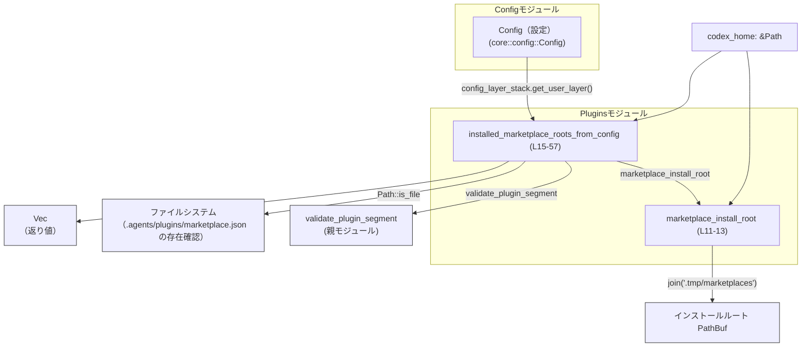

# core/src/plugins/installed_marketplaces.rs コード解説

## 0. ざっくり一言

Codex の設定から「インストール済みマーケットプレイス」のディレクトリ一覧を解釈し、存在確認と名前検証を行ったうえで `AbsolutePathBuf` のリストとして返すユーティリティモジュールです（core/src/plugins/installed_marketplaces.rs:L9-57）。

---

## 1. このモジュールの役割

### 1.1 概要

- このモジュールは **設定ファイルに記述されたマーケットプレイス定義** から、実際にインストールされているマーケットプレイスのルートディレクトリを抽出するために存在します（L15-57）。
- Codex のホームディレクトリ配下にある `.tmp/marketplaces` 以下を基準に、マーケットプレイスごとのディレクトリを解決します（L9, L11-12, L29, L48）。
- マーケットプレイス名の検証や設定フォーマットのチェックを行い、不正なものはログに警告を出したうえで無視します（L25-27, L33-38, L40-46）。

### 1.2 アーキテクチャ内での位置づけ

このモジュールは「プラグイン／マーケットプレイス」に関するモジュール階層の一部であり、`Config` とファイルシステムの間に位置して、**設定 → 実パス** への変換を担っています。



- `Config` からユーザーレイヤの設定を取得し、`marketplaces` テーブルを読む（L19-27）。
- `validate_plugin_segment`（親モジュールからインポート）を用いてマーケットプレイス名の妥当性を検証します（L40）。
- ファイルシステム上で `.agents/plugins/marketplace.json` の存在を確認し、存在するものだけを結果に含めます（L48-51）。
- 変換したパスは `AbsolutePathBuf` 型に変換され、ソートして返されます（L53-56）。

### 1.3 設計上のポイント

- **ステートレス設計**  
  - グローバル状態や内部可変状態を持たず、関数は入力（`&Config`, `&Path`）から出力を計算するだけです（L15-18）。
- **安全性（Rust 言語的）**  
  - `unsafe` ブロックは使用されておらず、標準ライブラリと他 crate の安全な API のみで実装されています（L1-57）。
  - 引数はすべて不変参照であり、共有可変状態は扱っていません（L11, L15-18）。
- **エラーハンドリング方針**  
  - 設定が足りない・フォーマットが違う・名前が不正・パス変換に失敗した場合などは、例外や panic ではなく「警告ログ＋無視」または「空ベクタを返す」という方針です（L19-28, L33-38, L40-46, L53）。
  - 関数の戻り値には `Result` を用いず、呼び出し側は「結果が空ベクタになりうる」ことを前提に扱う必要があります（L15-18, L56-57）。
- **並行性**  
  - モジュール自体は共有状態を持たないため、この関数群は通常スレッド間で安全に共有できます（引数が適切に同期されていれば）。（根拠: すべてローカル変数と不変参照のみ、L15-56）
- **観測可能性（ログ）**  
  - 不正な設定に対して `tracing::warn` による警告ログを出力しており、設定ミスを発見しやすくしています（L5, L26, L33-38, L40-46）。

---

## 2. 主要な機能一覧

- `INSTALLED_MARKETPLACES_DIR` 定数: マーケットプレイスのインストールルートのサブディレクトリ文字列 `.tmp/marketplaces` を提供します（L9）。
- `marketplace_install_root`: Codex ホームディレクトリから、マーケットプレイスのインストールルート `PathBuf` を組み立てます（L11-13）。
- `installed_marketplace_roots_from_config`:  
  Config から「有効かつインストール済みのマーケットプレイス」のルートディレクトリ一覧を抽出し、`Vec<AbsolutePathBuf>` として返します（L15-57）。

---

## 3. 公開 API と詳細解説

### 3.0 コンポーネント一覧（インベントリー）

| 名称 | 種別 | 公開範囲 | 役割 / 概要 | 根拠行 |
|------|------|----------|-------------|--------|
| `INSTALLED_MARKETPLACES_DIR` | 定数 `&'static str` | `pub` | Codex ホーム配下のマーケットプレイスインストールディレクトリ名 `.tmp/marketplaces` | core/src/plugins/installed_marketplaces.rs:L9 |
| `marketplace_install_root` | 関数 | `pub` | Codex ホームディレクトリからインストールルートの `PathBuf` を構築する | core/src/plugins/installed_marketplaces.rs:L11-13 |
| `installed_marketplace_roots_from_config` | 関数 | `pub(crate)` | Config からインストール済みマーケットプレイスのルートを検出し、`Vec<AbsolutePathBuf>` を返す | core/src/plugins/installed_marketplaces.rs:L15-57 |

※ このモジュール内で新しい構造体や列挙体の定義はありません（L1-57）。

### 3.1 型一覧（構造体・列挙体など）

このファイル内には新規定義された構造体・列挙体はありません。外部から利用している主な型は次のとおりです。

| 名前 | 種別 | 役割 / 用途 | 根拠行 |
|------|------|-------------|--------|
| `Config` | 構造体（crate 外部定義） | 設定全体を表す型。ここではユーザーレイヤ設定と `marketplaces` テーブルへのアクセスに使われます。詳細定義はこのチャンクには現れません。 | core/src/plugins/installed_marketplaces.rs:L1, L16 |
| `AbsolutePathBuf` | 構造体（外部 crate） | `PathBuf` から変換されるパス型。`try_from` によって生成されます。具体的な性質はこのチャンクには現れません。 | core/src/plugins/installed_marketplaces.rs:L2, L53 |
| `Path`, `PathBuf` | 構造体（標準ライブラリ） | パスの参照型と所有型。ホームディレクトリやインストールルートの表現に使用されます。 | core/src/plugins/installed_marketplaces.rs:L3-4, L11-13, L18, L29, L48-51 |

### 3.2 関数詳細

#### `marketplace_install_root(codex_home: &Path) -> PathBuf`

**概要**

Codex ホームディレクトリ (`codex_home`) の下にあるマーケットプレイス用インストールルートディレクトリ `.tmp/marketplaces` を表す `PathBuf` を返します（L9, L11-13）。

**引数**

| 引数名 | 型 | 説明 | 根拠行 |
|--------|----|------|--------|
| `codex_home` | `&Path` | Codex のホームディレクトリを表すパスへの不変参照 | core/src/plugins/installed_marketplaces.rs:L11 |

**戻り値**

- 型: `PathBuf`（所有権を持つパス）
- 意味: `codex_home` と `.tmp/marketplaces` の結合結果のパス（L11-13）。

**内部処理の流れ**

1. モジュール定数 `INSTALLED_MARKETPLACES_DIR`（`.tmp/marketplaces`）を参照します（L9, L11）。
2. `codex_home.join(INSTALLED_MARKETPLACES_DIR)` を呼び出し、`codex_home` 配下の `.tmp/marketplaces` へのパスを作成します（L12）。
3. 生成した `PathBuf` をそのまま返します（L12-13）。

**Examples（使用例）**

```rust
use std::path::Path;
use core::plugins::installed_marketplaces::marketplace_install_root;

fn main() {
    // Codex ホームディレクトリ（例として絶対パスを仮定）
    let codex_home = Path::new("/opt/codex"); // &Path 型

    // マーケットプレイスのインストールルートを取得する
    let install_root = marketplace_install_root(codex_home);

    // 結果は "/opt/codex/.tmp/marketplaces" のような PathBuf になる
    println!("{}", install_root.display());
}
```

※ `Config` など、このモジュール外の初期化方法はこのチャンクには現れないため、コメントで省略しています。

**Errors / Panics**

- この関数内には `Result` や `panic!` 呼び出しはなく、標準ライブラリの `Path::join` も通常は panic しないため、想定されるエラー・panic  はありません（L11-13）。
- ファイルシステムへのアクセスは行っておらず、単にパスを組み立てるだけです。

**Edge cases（エッジケース）**

- `codex_home` が相対パスであっても、そのパスに `.tmp/marketplaces` を結合した結果を返します（L11-12）。  
  絶対／相対で扱いが変わるのは呼び出し側の文脈になります。
- `codex_home` が空の `Path` の場合も、`join` の仕様に従って `.tmp/marketplaces` のパスを返します（L11-12）。

**使用上の注意点**

- この関数はファイルシステム上にディレクトリの存在を保証しません。返されるパスが実際に存在するかは呼び出し側で必要に応じて確認する必要があります（L11-13）。
- 並行性に関しては、引数と戻り値が純粋なデータであるため、複数スレッドから同じ `codex_home` を渡して呼び出しても問題が生じることはありません。

---

#### `installed_marketplace_roots_from_config(config: &Config, codex_home: &Path) -> Vec<AbsolutePathBuf>`

**概要**

Codex の `Config` と `codex_home` をもとに、ユーザーレイヤの設定に記述されたマーケットプレイス定義から、**実際にインストール済みで有効なマーケットプレイスのルートディレクトリ** を列挙し、`Vec<AbsolutePathBuf>` として返します（L15-57）。

**引数**

| 引数名 | 型 | 説明 | 根拠行 |
|--------|----|------|--------|
| `config` | `&Config` | 全体設定への不変参照。ユーザーレイヤおよび `marketplaces` 設定を取得するために使われます。 | core/src/plugins/installed_marketplaces.rs:L15-16, L19-23 |
| `codex_home` | `&Path` | Codex ホームディレクトリへの不変参照。インストールルートの基準パスとして使用します。 | core/src/plugins/installed_marketplaces.rs:L15, L17-18, L29 |

**戻り値**

- 型: `Vec<AbsolutePathBuf>`
- 意味:  
  - 設定上「マーケットプレイス」として定義されており、
  - 名前の検証に通過し、
  - ファイルシステム上で `.agents/plugins/marketplace.json` が存在し、
  - `AbsolutePathBuf::try_from` による変換に成功した  
  すべてのマーケットプレイスルートディレクトリを、パス順にソートして格納したベクタです（L30-56）。

**内部処理の流れ（アルゴリズム）**

```mermaid
flowchart TD
  A["開始 (L15)"] --> B["config_layer_stack.get_user_layer() (L19)"]
  B -->|None| Z["空 Vec を返す (L20-21)"]
  B -->|Some(user_layer)| C["user_layer.config.get(\"marketplaces\") (L22)"]
  C -->|None| Z
  C -->|Some(value)| D["value.as_table() (L25)"]
  D -->|None| E["warn!(\"invalid marketplaces config: expected table\") (L26)"] --> Z
  D -->|Some(marketplaces)| F["default_install_root = marketplace_install_root(codex_home) (L29)"]
  F --> G["marketplaces.iter().filter_map(...) (L30-52)"]
  G --> H["AbsolutePathBuf::try_from(path).ok() (L53)"]
  H --> I["Vec<AbsolutePathBuf> に collect (L54)"]
  I --> J["ソート sort_unstable_by(left.as_path().cmp(right.as_path())) (L55)"]
  J --> K["roots を返す (L56-57)"]
```

1. `config.config_layer_stack.get_user_layer()` を呼び出し、ユーザーレイヤ設定を取得します。存在しなければ空のベクタを即座に返します（L19-21）。
2. ユーザーレイヤの `config` から `"marketplaces"` キーを取得し、存在しなければ空ベクタを返します（L22-24）。
3. `"marketplaces"` の値を `as_table()` でテーブルとして解釈します。テーブルでなければ警告ログを出し、空ベクタを返します（L25-27）。
4. `marketplace_install_root(codex_home)` を呼び出して、デフォルトのインストールルートを求めます（L29）。
5. `marketplaces` の各エントリ（`(marketplace_name, marketplace)`）について、次の `filter_map` を行います（L30-52）。
   - 値がテーブルでない場合は警告ログを出し、`None` を返してスキップします（L33-38）。
   - `validate_plugin_segment(marketplace_name, "marketplace name")` で名前検証し、エラーなら詳細付きで警告を出してスキップします（L40-46）。
   - `default_install_root.join(marketplace_name)` でマーケットプレイス用のディレクトリパスを作成します（L48）。
   - `path.join(".agents/plugins/marketplace.json").is_file()` でマーケットプレイス定義ファイルの存在を確認し、存在しなければ `None` を返します（L48-51）。
   - ファイルが存在する場合は `Some(path)` を返します（L51-52）。
6. `filter_map` の結果として得られた `PathBuf` のイテレータに対し、`AbsolutePathBuf::try_from(path).ok()` で変換に成功したものだけを残します（L53）。
7. 変換に成功した `AbsolutePathBuf` を `collect::<Vec<_>>()` でベクタに収集します（L54）。
8. `roots.sort_unstable_by(|left, right| left.as_path().cmp(right.as_path()))` によりパス順にソートします（L55）。
9. ソート済みの `roots` を返します（L56-57）。

**Examples（使用例）**

この例では、`Config` の具体的な生成方法はこのファイルには現れないため、コメントで省略しています。

```rust
use std::path::Path;
use core::config::Config;
use core::plugins::installed_marketplaces::installed_marketplace_roots_from_config;

fn main() {
    // Config の構築方法は別モジュールに依存するため、省略
    let config: Config = /* Config をロードする */ unimplemented!();

    // Codex ホームディレクトリ
    let codex_home = Path::new("/opt/codex");

    // インストール済みマーケットプレイスのルート一覧を取得
    let roots = installed_marketplace_roots_from_config(&config, codex_home);

    // 取得したパスを出力
    for root in roots {
        println!("installed marketplace at {}", root.as_path().display());
    }
}
```

**Errors / Panics**

この関数は `Result` を返さず、エラーに相当する状況を次のように扱います。

- **ユーザーレイヤがない**  
  - `config.config_layer_stack.get_user_layer()` が `None` の場合、ログ出力も行わずに空の `Vec` を返します（L19-21）。
- **`marketplaces` 設定が無い**  
  - `user_layer.config.get("marketplaces")` が `None` の場合も、空の `Vec` を返します（L22-24）。
- **`marketplaces` がテーブルでない**  
  - `as_table()` に失敗した場合、`warn!("invalid marketplaces config: expected table")` を出力し、空の `Vec` を返します（L25-27）。
- **各エントリの不正**  
  - エントリ値がテーブルでない場合:  
    `warn!(marketplace_name, "ignoring invalid configured marketplace entry")` を出力し、そのエントリを無視します（L33-38）。
  - マーケットプレイス名が `validate_plugin_segment` により不正と判定された場合:  
    `warn!(marketplace_name, error = %err, "ignoring invalid configured marketplace name")` を出力し、そのエントリを無視します（L40-46）。
  - `.agents/plugins/marketplace.json` が存在しない場合:  
    `.is_file()` が `false` のため、そのエントリは結果に含められません（L48-51）。
  - `AbsolutePathBuf::try_from(path)` が `Err` を返した場合:  
    `.ok()` によって `None` に変換され、そのエントリは結果に含められません（L53）。

**panic の可能性**

- この関数内に `panic!` 呼び出しはなく、使用している標準 API も通常は panic を起こさない設計のものです（L15-57）。
- したがって、このチャンクから読み取れる範囲では、意図的な panic は含まれていません。

**Edge cases（エッジケース）**

- **ユーザーレイヤが存在しない場合**  
  - 結果は空 `Vec` になり、ログ出力は行われません（L19-21）。
- **`marketplaces` キー自体が存在しない場合**  
  - 結果は空 `Vec` になり、ログ出力は行われません（L22-24）。
- **`marketplaces` がテーブル以外（文字列や配列など）の場合**  
  - 警告ログ `invalid marketplaces config: expected table` が 1 回出力され、結果は空 `Vec` になります（L25-27）。
- **テーブル内の一部エントリが不正**  
  - 不正エントリだけがログとともに無視され、他の正しいエントリは引き続き処理されます（L33-38, L40-46）。
- **`marketplace.json` が存在しないマーケットプレイス**  
  - 設定上は存在していても、該当ディレクトリに `.agents/plugins/marketplace.json` がなければ結果に含まれません（L48-51）。
- **全エントリが何らかの理由で無効またはファイル無し**  
  - 戻り値は空 `Vec` になりうることに注意が必要です（L30-54）。

**使用上の注意点**

- **戻り値が空の意味**  
  - 「マーケットプレイスが 0 件」という意味だけでなく、「設定が無い／誤っている／ファイルが無い」など複数の要因がありえます（L19-28, L48-53）。  
    呼び出し側で必要なら、`tracing::warn` のログと合わせて原因を診断する必要があります。
- **設定変更時の挙動**  
  - 設定に誤りがある場合でもこの関数はエラーを返さないため、本番環境では「気づかずにマーケットプレイスが認識されない」可能性があります。ログ監視が重要です（L26, L33-38, L40-46）。
- **並行性**  
  - 関数は `&Config` と `&Path` の不変参照しか使用せず、内部状態を持たないため、同じ `Config` を複数スレッドで共有しつつこの関数を呼び出すこと自体は、Rust の所有権ルール上安全にコンパイルされます（L15-18）。
  - ただし `Config` の内部実装がスレッドセーフかどうかは、このチャンクには現れません。
- **観測性（ログ）**  
  - 不正な設定に対しては `warn!` ログが出力されるため、ログメッセージ（例: `"invalid marketplaces config: expected table"`, `"ignoring invalid configured marketplace entry"`, `"ignoring invalid configured marketplace name"）を監視することで設定ミスを検出できます（L26, L33-38, L40-46）。

### 3.3 その他の関数

このモジュールには、上記 2 つ以外の関数は定義されていません（L11-57）。

---

## 4. データフロー

ここでは、`installed_marketplace_roots_from_config` を呼び出して「インストール済みマーケットプレイス一覧」を取得する典型的なフローを示します。

```mermaid
sequenceDiagram
    participant Caller as 呼び出し側コード
    participant Conf as Config
    participant Func as installed_marketplace_roots_from_config (L15-57)
    participant FS as ファイルシステム

    Caller->>Func: &Conf, &Path codex_home
    Note right of Func: user_layer を取得 (L19)
    Func->>Conf: config_layer_stack.get_user_layer()
    Conf-->>Func: Option<user_layer>

    alt user_layer が None (L19-21)
        Func-->>Caller: 空 Vec<AbsolutePathBuf>
    else user_layer が Some
        Note right of Func: marketplaces を取得 (L22-24)
        Func->>Conf: user_layer.config.get("marketplaces")
        Conf-->>Func: Option<marketplaces_value>

        alt marketplaces が None
            Func-->>Caller: 空 Vec<AbsolutePathBuf>
        else marketplaces が Some
            Note right of Func: as_table でテーブル化 (L25-27)
            Func->>Func: marketplaces_value.as_table()

            alt テーブル化失敗
                Func->>Func: warn!("invalid marketplaces config...") (L26)
                Func-->>Caller: 空 Vec<AbsolutePathBuf>
            else テーブル化成功
                Note right of Func: 各エントリを走査 (L30-52)
                loop marketplace ごと
                    Func->>Func: 値がテーブルか検証 (L33-38)
                    Func->>Func: validate_plugin_segment(name, "marketplace name") (L40-46)
                    Func->>FS: path.join(\".agents/plugins/marketplace.json\").is_file() (L48-51)
                    FS-->>Func: bool
                    Note right of Func: 条件を満たす path のみ保持
                end
                Note right of Func: AbsolutePathBuf::try_from で変換 (L53)
                Func->>Func: roots.sort_unstable_by(...) (L55)
                Func-->>Caller: Vec<AbsolutePathBuf> (L56-57)
        end
    end
```

要点:

- 設定が無い／不正な場合は早期に空ベクタを返し、エラー伝播は行いません（L19-28）。
- ファイルシステムアクセスは `.is_file()` による存在確認のみであり、失敗は `bool` で吸収されます（L49-51）。
- 変換失敗（`AbsolutePathBuf::try_from`）も silently ignore され、結果から除外されます（L53）。

---

## 5. 使い方（How to Use）

### 5.1 基本的な使用方法

典型的なフローは「Config の用意 → Codex ホームパスの用意 → `installed_marketplace_roots_from_config` 呼び出し → 結果の利用」です。

```rust
use std::path::Path;
use core::config::Config;
use core::plugins::installed_marketplaces::{
    marketplace_install_root,
    installed_marketplace_roots_from_config,
};

fn main() {
    // Config のロード（詳細は別モジュールに依存するため省略）
    let config: Config = /* 設定を読み込む */ unimplemented!();

    // Codex ホームディレクトリ
    let codex_home = Path::new("/opt/codex");

    // インストールルート（全マーケットプレイスの親ディレクトリ）を把握したい場合
    let install_root = marketplace_install_root(codex_home);
    println!("marketplaces install root: {}", install_root.display());

    // 実際にインストールされているマーケットプレイスのルート一覧
    let roots = installed_marketplace_roots_from_config(&config, codex_home);

    for root in roots {
        println!("installed marketplace at {}", root.as_path().display());
    }
}
```

### 5.2 よくある使用パターン

1. **UI や CLI で「利用可能なマーケットプレイス一覧」を表示する**  
   - `installed_marketplace_roots_from_config` を呼び出して、返ってきた `AbsolutePathBuf` を元にメタデータを読み込み、一覧画面や CLI 出力に使うパターンが想定されます（このチャンクにはメタデータ読み込みロジックは現れません）。

2. **マーケットプレイスごとのプラグイン探索の起点として使う**  
   - 返された各ルートを起点に、下位ディレクトリの `.agents/plugins` などをたどるコードから呼ばれることが想定されます（L48-51）。

### 5.3 よくある間違い

```rust
use std::path::Path;
use core::config::Config;
use core::plugins::installed_marketplaces::installed_marketplace_roots_from_config;

// 間違い例: Config の user_layer や marketplaces が未設定なのに、
// 戻り値が空であることを「マーケットプレイスが存在しない」と決めつける
fn list_marketplaces_wrong(config: &Config) {
    let codex_home = Path::new("/opt/codex");
    let roots = installed_marketplace_roots_from_config(config, codex_home);

    if roots.is_empty() {
        println!("マーケットプレイスは 0 件です（設定も問題ない）");
        // 実際には設定ミスやファイル欠如の可能性もある（L19-28, L48-53）
    }
}

// 正しい例: 空の理由をログや設定と合わせて診断する前提で扱う
fn list_marketplaces_correct(config: &Config) {
    let codex_home = Path::new("/opt/codex");
    let roots = installed_marketplace_roots_from_config(config, codex_home);

    if roots.is_empty() {
        println!("マーケットプレイスが認識されていません。");
        println!("設定やログ (warn レベル) を確認してください。");
        // L26, L33-38, L40-46 の warn! ログがヒントになる
    } else {
        for root in roots {
            println!("installed marketplace at {}", root.as_path().display());
        }
    }
}
```

### 5.4 使用上の注意点（まとめ）

- **空ベクタの扱い**  
  - 戻り値が空であっても、「マーケットプレイスが存在しない」以外に「Config が未設定／誤設定」「`marketplace.json` が存在しない」「パス変換に失敗した」など複数の原因がありえます（L19-28, L48-53）。
- **設定検証の責任分担**  
  - このモジュールは主要な構造（テーブルかどうか、名前の妥当性）の検証とファイル存在チェックを行いますが（L25-27, L33-38, L40-46, L48-51）、設定全体の検証を完全に代替するものではありません。
- **ログ監視**  
  - 不正な設定に対する検出手段として `tracing::warn` ログが用意されているため、本番環境などでは warn レベルのログ監視が重要です（L5, L26, L33-38, L40-46）。
- **並行呼び出し**  
  - モジュール自身は共有状態を持たず、不変参照のみを扱うため、他の部分が適切に同期されている限り、並行に呼び出しても安全な構造になっています（L15-18）。

---

## 6. 変更の仕方（How to Modify）

### 6.1 新しい機能を追加する場合

例: 「別のディレクトリ構造にも対応したい」「`marketplace.json` 以外のファイル名を認識したい」など。

1. **インストールパスのルールを増やす**  
   - `.agents/plugins/marketplace.json` 以外の場所も探索したい場合は、`installed_marketplace_roots_from_config` 内の `path.join(".agents/plugins/marketplace.json").is_file()` 部分（L48-51）を拡張します。
2. **設定項目を拡張する**  
   - `"marketplaces"` テーブルに追加情報（例: 別パス指定）を持たせる場合は、`marketplaces` の各エントリ値（`marketplace`）の扱いを `filter_map` クロージャ内（L32-52）に追加する形になります。
3. **検証ルールの追加**  
   - 名前以外の検証（例: バージョン、署名など）を行いたい場合は、`validate_plugin_segment` の呼び出し部分（L40-46）の前後にロジックを追加するのが自然です。  
     検証ロジック自体を共通化したいなら、親モジュール側の `validate_plugin_segment` や別ユーティリティ関数を拡張することになります（`validate_plugin_segment` の定義はこのチャンクには現れません）。

### 6.2 既存の機能を変更する場合

- **インストールディレクトリ名を変えたい場合**  
  - `INSTALLED_MARKETPLACES_DIR` を変更します（L9）。  
    これにより `marketplace_install_root` および `installed_marketplace_roots_from_config` で使用されるベースディレクトリが一括で変わります（L11-12, L29）。
- **`marketplace.json` ファイル名や位置を変えたい場合**  
  - `path.join(".agents/plugins/marketplace.json")` の文字列を変更します（L49）。
  - 影響範囲として、マーケットプレイスを「インストール済み」と認識する条件が変わることに注意が必要です。
- **エラーハンドリング方針を変えたい場合**  
  - 現状は「警告ログ＋無視」または「空ベクタ返却」です（L19-28, L33-38, L40-46, L53）。  
    これを `Result` 返却に切り替える場合は、関数シグネチャを `Result<Vec<AbsolutePathBuf>, Error>` のように変更し、各 `return Vec::new()` や `warn!` 箇所で適切なエラー型を組み立てる必要があります。
- **影響範囲の確認方法**  
  - この関数は `pub(crate)` であるため、同一 crate 内のどこから呼ばれているかを検索し、返り値が空 `Vec` であることを前提にしているコードの挙動への影響を確認する必要があります（L15）。

---

## 7. 関連ファイル

このモジュールと密接に関係するファイル・モジュールは次のとおりです（ただし内容はこのチャンクには現れません）。

| パス / モジュール | 役割 / 関係 |
|-------------------|------------|
| `crate::config::Config` | `Config` 型を提供し、`config_layer_stack.get_user_layer()` や `user_layer.config.get("marketplaces")` を通じてマーケットプレイス設定を読み出す役割を担います（core/src/plugins/installed_marketplaces.rs:L1, L16, L19-23）。 |
| `super::validate_plugin_segment` | マーケットプレイス名の検証を行う関数です。ここでは `validate_plugin_segment(marketplace_name, "marketplace name")` として呼び出されており、名前が不正な場合は `Err` を返すことが前提になっています（core/src/plugins/installed_marketplaces.rs:L7, L40-46）。 |
| `codex_utils_absolute_path::AbsolutePathBuf` | `PathBuf` からの変換を行う型であり、インストール済みマーケットプレイスルートを `AbsolutePathBuf` として表現するために利用されています（core/src/plugins/installed_marketplaces.rs:L2, L53）。 |

このチャンクにはテストコード（例: `mod tests` や別ファイルのテスト）は現れていないため、テストの所在や内容は不明です。
