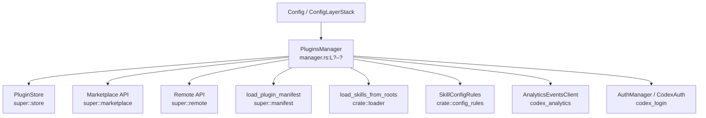
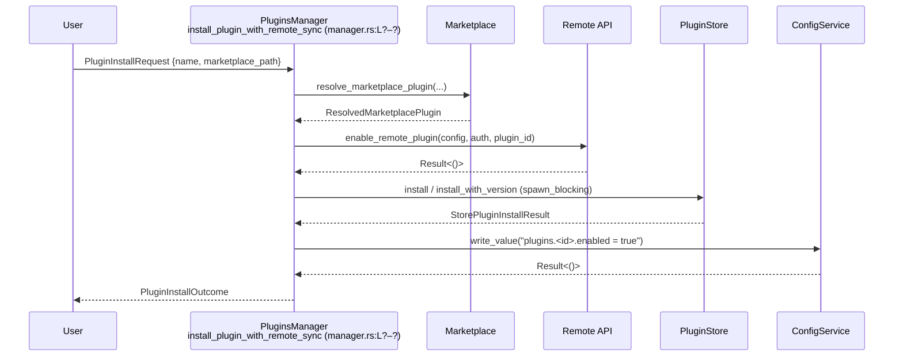
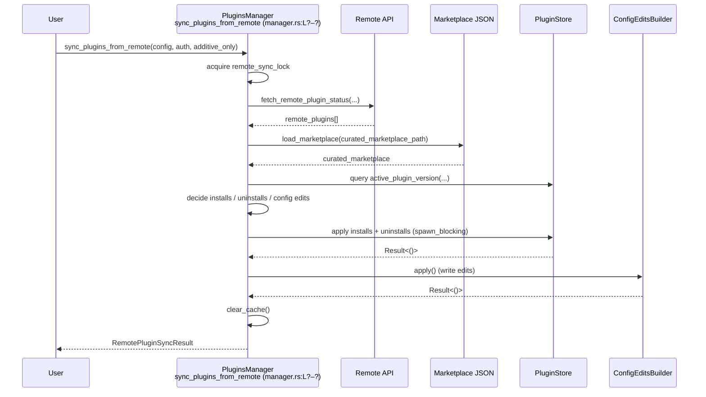

# core/src/plugins/manager.rs

## 0. ざっくり一言

Codex のプラグイン（マーケットプレイス・ローカルキャッシュ・設定ファイル・リモート API）をまとめて管理する「プラグイン管理モジュール」です。  
インストール／アンインストール、リモート同期、マーケットプレイス一覧取得、プラグイン詳細読み出し、MCP サーバー・アプリ設定の解決などの中核ロジックを提供します。

> 行番号について  
> このインターフェースからは正確な行番号を取得できないため、本レポートでは根拠位置を `manager.rs:L?–?` のように記載します。正確な行番号は実ソースで確認する必要があります。

---

## 1. このモジュールの役割

### 1.1 概要

このモジュールは **プラグインのライフサイクルと可視化** を扱います。

- ユーザー設定 (`config.toml`) とマーケットプレイス定義から、**有効なプラグイン集合を解決してロード** します。
- プラグインの **インストール／アンインストール** をローカルキャッシュ（`PluginStore`）とユーザー設定の両方に反映します。
- ChatGPT バックエンドと連携して、**リモートで有効化されたプラグイン状態をローカルと同期** します。
- プラグインのスキル・MCP サーバー・アプリコネクタなどの能力情報を集約し、別モジュールから取得できるようにします。

### 1.2 アーキテクチャ内での位置づけ

主要コンポーネントの関係を簡略図で示します。



- `PluginsManager` が中心となり、ファイルシステム（プラグインキャッシュ・マーケットプレイス JSON・config.toml）、リモート API、スキルローダ、設定ルール、分析用イベントクライアントを束ねています。
- 同じファイル内のトップレベル関数（`load_plugins_from_layer_stack` など）は、`PluginsManager` の内部処理や他モジュールからの再利用を支えます。

### 1.3 設計上のポイント

コードから読み取れる特徴を箇条書きで整理します。

- **状態管理の分離**
  - プラグインのバイナリやアセットは `PluginStore` が管理し（キャッシュディレクトリ）、
  - 有効・無効などのユーザー設定は `config.toml` の `plugins.*` で管理します（`configured_*` 系関数）。  
  （例: `configured_plugins_from_stack` / `configured_plugins_from_codex_home` `manager.rs:L?–?`）
- **機能フラグによる制御**
  - `Config.features.enabled(Feature::Plugins)` が `false` の場合、多くの処理が早期リターンしてプラグイン機能を無効化します。  
    （`plugins_for_config_with_force_reload`, `featured_plugin_ids_for_config` など `manager.rs:L?–?`）
- **キャッシュと同期**
  - ロード済みプラグイン (`PluginLoadOutcome`) と「おすすめプラグイン ID」リストを `RwLock` でキャッシュし、必要に応じて `clear_cache` で破棄します。
  - キュレーテッド／非キュレーテッドプラグインキャッシュのリフレッシュと、リモート状態との同期を別スレッドもしくは `spawn_blocking` で行います。
- **並行性制御**
  - リモートプラグイン同期は `remote_sync_lock: Mutex<()>` で **一度に 1 実行** に制限されています。
  - リポジトリ同期（キュレーテッド）や非キュレーテッドキャッシュ更新は OS スレッドで実行し、`AtomicBool` や `NonCuratedCacheRefreshState` で同時実行を防いでいます。
- **エラーハンドリング**
  - `PluginInstallError`, `PluginUninstallError`, `PluginRemoteSyncError` などのエラー型で失敗理由を分類し、`thiserror` で人間可読なメッセージを提供します。
  - `is_invalid_request` メソッドでクライアントエラー（ユーザー入力の問題）を判別できるようにしています。
- **安全性（Rust 言語的な意味）**
  - I/O を伴う操作は `tokio::task::spawn_blocking` や `std::thread::spawn` にオフロードし、非同期ランタイムをブロックしないようにしています。
  - `RwLock` のポイズン（パニック後の汚染）時には `err.into_inner()` でロック内部の値を取り出して処理を継続しています。

---

## 2. 主要な機能一覧

このモジュールが提供する代表的な機能です。

- プラグインのロード
  - `plugins_for_config` / `load_plugins_from_layer_stack`: 設定から有効なプラグインを読み込み、スキル・MCP サーバー・アプリを解決します。
- プラグイン一覧・詳細
  - `list_marketplaces_for_config`: 利用可能なマーケットプレイスとそのプラグイン一覧を返します。
  - `read_plugin_for_config`: 単一プラグインの詳細（スキル・MCP サーバー・アプリ・インストール状態）を返します。
- インストール・アンインストール
  - `install_plugin` / `install_plugin_with_remote_sync`: マーケットプレイス上のプラグインをローカルにインストールし、設定を更新します。
  - `uninstall_plugin` / `uninstall_plugin_with_remote_sync`: プラグインをローカルキャッシュと設定から削除します。
- リモート同期
  - `sync_plugins_from_remote`: ChatGPT などのリモート状態とローカルプラグイン状態を同期します。
  - `featured_plugin_ids_for_config`: リモートから「おすすめプラグイン ID」を取得し、キャッシュします。
- 起動時タスク
  - `maybe_start_plugin_startup_tasks_for_config`: 起動時にキュレーテッドリポジトリ同期・リモート同期・おすすめ ID キャッシュウォームアップを開始します。
  - `maybe_start_non_curated_plugin_cache_refresh_for_roots`: 非キュレーテッドプラグインキャッシュ更新のバックグラウンドスレッドを起動します。
- テレメトリ・能力情報
  - `plugin_telemetry_metadata_from_root`, `installed_plugin_telemetry_metadata`: プラグインの能力サマリ（スキル有無、MCP サーバー、アプリ ID）を収集します。
  - `From<PluginDetail> for PluginCapabilitySummary`: 読み出し結果を能力サマリに変換します。
- MCP / アプリ設定読み出し
  - `load_plugin_mcp_servers`, `load_mcp_servers_from_file`: MCP サーバー設定 JSON を読み込み・正規化します。
  - `load_plugin_apps`: アプリコネクタ ID を JSON から読み込みます。

---

## 3. 公開 API と詳細解説

### 3.1 型一覧（構造体・列挙体など）

#### ドメイン・結果型

| 名前 | 種別 | 公開範囲 | 役割 / 用途 | 定義位置 |
|------|------|----------|-------------|----------|
| `PluginInstallRequest` | 構造体 | `pub` | プラグインインストール要求（プラグイン名とマーケットプレイスのパス） | `manager.rs:L?–?` |
| `PluginReadRequest` | 構造体 | `pub` | プラグイン詳細読み出し要求 | `manager.rs:L?–?` |
| `PluginInstallOutcome` | 構造体 | `pub` | インストール結果（`PluginId`, バージョン, インストール先, 認証ポリシー） | `manager.rs:L?–?` |
| `PluginReadOutcome` | 構造体 | `pub` | プラグイン詳細読み出し結果（所属マーケットプレイスなどを含む） | `manager.rs:L?–?` |
| `PluginDetail` | 構造体 | `pub` | プラグインの詳細（スキル・MCP サーバー・アプリ・状態など） | `manager.rs:L?–?` |
| `ConfiguredMarketplace` | 構造体 | `pub` | 設定・ディスク上から見えるマーケットプレイス 1 件の情報 | `manager.rs:L?–?` |
| `ConfiguredMarketplacePlugin` | 構造体 | `pub` | マーケットプレイス内のプラグイン 1 件の設定と状態 | `manager.rs:L?–?` |
| `ConfiguredMarketplaceListOutcome` | 構造体 | `pub` | マーケットプレイス一覧と、列挙時に発生したエラーの集約 | `manager.rs:L?–?` |
| `RemotePluginSyncResult` | 構造体 | `pub` | リモート同期の結果（インストール／有効化／無効化／アンインストールされた ID） | `manager.rs:L?–?` |
| `PluginMcpFile` | 構造体 | `struct`（内部） | MCP 設定 JSON の読み取り用構造体 | `manager.rs:L?–?` |
| `PluginAppFile` | 構造体 | `struct`（内部） | アプリ設定 JSON の読み取り用構造体 | `manager.rs:L?–?` |
| `PluginAppConfig` | 構造体 | `struct`（内部） | 単一アプリの設定（`id` のみ） | `manager.rs:L?–?` |
| `ResolvedPluginSkills` | 構造体 | 内部 | ロード済みスキル集合＋無効スキルのパス＋エラー有無フラグ | `manager.rs:L?–?` |
| `PluginMcpDiscovery` | 構造体 | 内部 | MCP サーバー名→`McpServerConfig` のマップ | `manager.rs:L?–?` |

#### エラー型

| 名前 | 種別 | 公開範囲 | 役割 / 用途 | 定義位置 |
|------|------|----------|-------------|----------|
| `PluginRemoteSyncError` | enum | `pub` | リモート同期処理全体のエラー原因を表す | `manager.rs:L?–?` |
| `PluginInstallError` | enum | `pub` | プラグインインストール（ローカル・リモート連携含む）のエラー | `manager.rs:L?–?` |
| `PluginUninstallError` | enum | `pub` | プラグインアンインストールのエラー | `manager.rs:L?–?` |

#### マネージャ

| 名前 | 種別 | 公開範囲 | 役割 / 用途 | 定義位置 |
|------|------|----------|-------------|----------|
| `PluginsManager` | 構造体 | `pub` | プラグインのロード／同期／インストール等をまとめるファサード | `manager.rs:L?–?` |

#### 内部キャッシュ・キー型

| 名前 | 種別 | 公開範囲 | 役割 / 用途 | 定義位置 |
|------|------|----------|-------------|----------|
| `FeaturedPluginIdsCacheKey` | 構造体 | 内部 | おすすめプラグイン ID キャッシュのキー（Base URL、アカウント ID 等） | `manager.rs:L?–?` |
| `CachedFeaturedPluginIds` | 構造体 | 内部 | キャッシュ済みおすすめプラグイン ID と TTL | `manager.rs:L?–?` |
| `NonCuratedCacheRefreshState` | 構造体 | 内部 | 非キュレーテッドプラグインキャッシュ更新の状態（リクエストされたルートなど） | `manager.rs:L?–?` |

---

### 3.2 関数詳細（主要 7 件）

#### 1. `PluginsManager::plugins_for_config_with_force_reload(&self, config: &Config, force_reload: bool) -> PluginLoadOutcome`

**概要**

- 設定 (`Config`) とローカル `PluginStore` から、現在有効なプラグインのロード結果 (`PluginLoadOutcome`) を構築します。
- キャッシュ済み結果があり `force_reload == false` の場合はキャッシュを返し、そうでなければ再ロードします。  
  （定義: `manager.rs:L?–?`）

**引数**

| 引数名 | 型 | 説明 |
|--------|----|------|
| `&self` | `&PluginsManager` | マネージャインスタンス |
| `config` | `&Config` | 現在の構成（設定レイヤスタックや機能フラグを含む） |
| `force_reload` | `bool` | `true` の場合、キャッシュを無視して再ロードする |

**戻り値**

- `PluginLoadOutcome`  
  - ロードされた各プラグインのルートディレクトリ、スキル、MCP サーバー、エラー情報などを含むオブジェクトです（型定義は他モジュール）。

**内部処理の流れ**

1. `config.features.enabled(Feature::Plugins)` を確認し、`false` の場合は `PluginLoadOutcome::default()` を返します。
2. `force_reload == false` かつ `cached_enabled_outcome()` が `Some` の場合、そのキャッシュをそのまま返します。
3. `load_plugins_from_layer_stack(&config.config_layer_stack, &self.store, self.restriction_product)` を呼び出してプラグインをロードします。
4. `log_plugin_load_errors(&outcome)` でロードエラーを `warn!` ログに出力します。
5. `cached_enabled_outcome: RwLock<Option<PluginLoadOutcome>>` に新しい結果を保存し、そのクローンを返します。

**Examples（使用例）**

```rust
// Config は別途読み込まれていると仮定する
let manager = PluginsManager::new(codex_home_path);        // マネージャ生成
let outcome = manager.plugins_for_config(&config);         // キャッシュ利用してロード
for plugin in outcome.plugins() {                          // ロード済みプラグイン一覧にアクセス
    println!("plugin: {} at {:?}", plugin.config_name, plugin.root);
}
```

**Errors / Panics**

- この関数自体は `Result` を返さず、内部で発生したエラーは `LoadedPlugin.error` フィールドとログに記録されます。
- `RwLock` のポイズンが発生した場合でも、`err.into_inner()` を用いて内部値を取得して処理を続行するため、明示的なパニックは起こしません（他のコードがパニックしていない限り）。

**Edge cases（エッジケース）**

- プラグイン機能が無効 (`Feature::Plugins` が無効) の場合は常に空の `PluginLoadOutcome` を返します。
- プラグイン ID が不正、プラグインディレクトリが存在しない、マニフェスト JSON が壊れている場合などは、該当プラグインに `error` がセットされ、`warn!` ログが出ます。

**使用上の注意点**

- プラグインのインストールやアンインストール後にすぐ最新状態を反映したい場合は、`force_reload = true` で呼び出すか、別途 `clear_cache` を呼んでから利用する必要があります。
- ロード処理はディスク I/O を伴うため、高頻度に `force_reload = true` で呼ぶとパフォーマンスに影響します。

---

#### 2. `PluginsManager::featured_plugin_ids_for_config(&self, config: &Config, auth: Option<&CodexAuth>) -> Result<Vec<String>, RemotePluginFetchError>`

**概要**

- リモートサービスから「おすすめプラグイン ID」のリストを取得します。
- キャッシュ TTL（3 時間）内は `FeaturedPluginIdsCacheKey` に基づいてローカルキャッシュを返します。  
  （定義: `manager.rs:L?–?`）

**引数**

| 引数名 | 型 | 説明 |
|--------|----|------|
| `config` | `&Config` | ChatGPT のベース URL や機能フラグを含む構成 |
| `auth` | `Option<&CodexAuth>` | 認証情報。`None` の場合、リモートアクセスは失敗する可能性があります |

**戻り値**

- `Ok(Vec<String>)`  
  - おすすめプラグイン ID（`PluginId::as_key()` 形式の文字列と推測できますが、厳密なフォーマットはこのファイル内では不明）。
- `Err(RemotePluginFetchError)`  
  - 認証エラー、HTTP エラー、ステータス異常、JSON デコードエラーなど。

**内部処理の流れ**

1. プラグイン機能が無効なら `Ok(Vec::new())` を返します。
2. `featured_plugin_ids_cache_key(config, auth)` でキャッシュキーを構築します（Base URL・アカウント ID・ユーザー ID・ワークスペースフラグ）。
3. `cached_featured_plugin_ids(&cache_key)` を確認し、ヒットすればそれを返します。
4. キャッシュミスの場合、`fetch_remote_featured_plugin_ids(config, auth, self.restriction_product).await` を呼び出してリモートから取得します。
5. 取得結果を `write_featured_plugin_ids_cache(cache_key, &featured_plugin_ids)` でキャッシュし、そのベクタを返します。

**Examples（使用例）**

```rust
let manager = PluginsManager::new(codex_home_path);
let auth = auth_manager.auth().await;                      // CodexAuth を取得

let ids = manager
    .featured_plugin_ids_for_config(&config, auth.as_ref())
    .await?;

println!("featured plugins: {:?}", ids);
```

**Errors / Panics**

- 認証がない、無効、またはサーバーエラーの場合は `RemotePluginFetchError` として返されます。
- キャッシュ処理で `RwLock` がポイズンされても `into_inner` によって値を取り出し、処理を継続します。

**Edge cases（エッジケース）**

- 認証がない (`auth == None`) 場合、`fetch_remote_featured_plugin_ids` の実装によっては `AuthRequired` エラーになる可能性があります（このファイルでは詳細不明）。
- キャッシュキーが変わる（ベース URL / アカウント / ユーザー / ワークスペースフラグ）と、それまでのキャッシュは破棄されます。

**使用上の注意点**

- 起動時のウォームアップ用途で `maybe_start_plugin_startup_tasks_for_config` からバックグラウンドで呼ばれています。アプリケーション側で何度も呼ぶ場合、キャッシュにより外部 API トラフィックは抑制されます。
- 認証モードやネットワーク状態に依存するため、UI や上位ロジックでは失敗時も gracefully degrade できるようにするのが前提と考えられます。

---

#### 3. `PluginsManager::install_resolved_plugin(&self, resolved: ResolvedMarketplacePlugin) -> Result<PluginInstallOutcome, PluginInstallError>`

**概要**

- マーケットプレイスから解決済みのプラグイン (`ResolvedMarketplacePlugin`) をローカル `PluginStore` にインストールし、`config.toml` に `enabled = true` で記録します。  
  （定義: `manager.rs:L?–?`）

**引数**

| 引数名 | 型 | 説明 |
|--------|----|------|
| `resolved` | `ResolvedMarketplacePlugin` | マーケットプレイス定義とローカルパスが解決されたプラグイン |

**戻り値**

- `Ok(PluginInstallOutcome)`  
  - `plugin_id`, `plugin_version`, `installed_path`, `auth_policy` を含みます。
- `Err(PluginInstallError)`  
  - マーケットプレイス定義不正、ローカルストアエラー、設定書き込みエラー、スレッド結合エラーなど。

**内部処理の流れ**

1. 認証ポリシーを `auth_policy` に退避。
2. キュレーテッドマーケットプレイス（`OPENAI_CURATED_MARKETPLACE_NAME`）なら `read_curated_plugins_sha` でバージョン文字列を取得します。取得できなければ `PluginStoreError::Invalid` を生成してエラーにします。
3. `PluginStore` をクローンし、`tokio::task::spawn_blocking` 内で:
   - キュレーテッドプラグインなら `store.install_with_version(...)`
   - そうでなければ `store.install(...)`
   を実行します。
4. `ConfigService::new_with_defaults(self.codex_home.clone())` で設定サービスを作成し、`write_value` で `plugins.<plugin_id>.enabled = true` を書き込む（マージ戦略は `MergeStrategy::Replace`）。
5. `analytics_events_client` があれば、`plugin_telemetry_metadata_from_root` を使って `track_plugin_installed` を送信します。
6. 全て成功すれば `PluginInstallOutcome` を返します。

**Examples（使用例）**

通常は `install_plugin` か `install_plugin_with_remote_sync` 経由で呼ばれます。

```rust
let manager = PluginsManager::new(codex_home_path);
let request = PluginInstallRequest {
    plugin_name: "sample-plugin".to_string(),
    marketplace_path: some_marketplace_path,
};

let outcome = manager.install_plugin(request).await?;
println!("installed: {} at {}", outcome.plugin_id.as_key(), outcome.installed_path.display());
```

**Errors / Panics**

- `PluginInstallError` の内訳:
  - `Marketplace`: マーケットプレイス定義の不正・NotFound 等。
  - `Store`: ディスク I/O やパス不正などストア関連のエラー。
  - `Config`: `ConfigService` の書き込みエラー。
  - `Remote`: この関数経由では到達しませんが、`install_plugin_with_remote_sync` からは発生し得ます。
  - `Join`: `spawn_blocking` したスレッドがパニックした場合など。
- パニック条件はこのファイルからは明示されていませんが、`spawn_blocking` 内でのパニックは `JoinError` として扱われます。

**Edge cases（エッジケース）**

- キュレーテッドプラグインでローカルに SHA 情報が存在しない場合、「local curated marketplace sha is not available」で失敗します。
- 設定ファイル書き込みが失敗した場合（パーミッション・ディスクフル等）、ストアのインストール自体は完了している可能性がありますが、`enabled` 設定は反映されていません。

**使用上の注意点**

- 直接この関数を呼ぶのではなく、`install_plugin` / `install_plugin_with_remote_sync` を通して利用することを前提とした設計です（解決処理も含めて行われる）。
- インストール後のプラグインロードキャッシュは自動ではクリアされないため、すぐに反映したい場合は `clear_cache` → `plugins_for_config_with_force_reload` の流れが必要です。

---

#### 4. `PluginsManager::sync_plugins_from_remote(&self, config: &Config, auth: Option<&CodexAuth>, additive_only: bool) -> Result<RemotePluginSyncResult, PluginRemoteSyncError>`

**概要**

- リモート（ChatGPT 側）のプラグイン状態とローカルのキャッシュ・設定を同期します。
- 目前では **キュレーテッドマーケットプレイスのみ** を対象としており、リモート側で `enabled = false` のプラグインは「アンインストール」と同義に扱われます。  
  （定義: `manager.rs:L?–?`）

**引数**

| 引数名 | 型 | 説明 |
|--------|----|------|
| `config` | `&Config` | 構成（機能フラグ・config レイヤ・ネットワーク設定など） |
| `auth` | `Option<&CodexAuth>` | リモート同期に必要な認証情報 |
| `additive_only` | `bool` | `true` の場合、ローカルからのアンインストールは行わず、追加・有効化のみ行う |

**戻り値**

- `Ok(RemotePluginSyncResult)`  
  - `installed_plugin_ids`, `enabled_plugin_ids`, `uninstalled_plugin_ids` などの差分情報。
- `Err(PluginRemoteSyncError)`  
  - 認証・HTTP エラー、ローカルマーケットプレイス未整備、ストアエラー、設定エラーなど。

**内部処理の流れ（要約）**

1. `remote_sync_lock: Mutex<()>` を `lock().await` し、このインスタンス上での同期処理を排他制御します。
2. プラグイン機能が無効なら `RemotePluginSyncResult::default()` を返します。
3. `fetch_remote_plugin_status(config, auth).await` でリモート側のプラグイン状態を取得します。
4. `configured_plugins_from_stack` でユーザー設定上のプラグインを取得します。
5. キュレーテッドマーケットプレイス JSON を `load_marketplace` で読み出し、`PluginId` やソースパス、現在の有効状態・インストール状態をローカル側の基準とします。
6. リモートから返されたプラグイン一覧とローカルキュレーテッドリストを突き合わせて：
   - リモートで有効かつローカル未インストール → インストール予定としてキューに追加。
   - リモートで有効でローカルが無効 → 設定で `enabled = true` に変更。
   - `additive_only == false` でリモートに存在しないローカルプラグイン → アンインストール予定に追加。
7. `spawn_blocking` で `PluginStore::install_with_version` / `uninstall` をまとめて実行。
8. `ConfigEditsBuilder` で `config.toml` 内の `plugins.*` 設定を更新。
9. いずれかでエラーが発生した場合は `clear_cache()` を呼び、適切な `PluginRemoteSyncError` を返します。
10. 成功時も最後に `clear_cache()` してから結果を返します。

**Examples（使用例）**

```rust
let manager = PluginsManager::new(codex_home_path);
let auth = auth_manager.auth().await;

let result = manager
    .sync_plugins_from_remote(&config, auth.as_ref(), /*additive_only=*/ false)
    .await?;

println!("installed from remote: {:?}", result.installed_plugin_ids);
println!("uninstalled because remote no longer has them: {:?}", result.uninstalled_plugin_ids);
```

**Errors / Panics**

- 主な `PluginRemoteSyncError` バリアント例:
  - `AuthRequired`, `UnsupportedAuthMode`, `AuthToken`, `Request`, `UnexpectedStatus`, `Decode`: リモート通信関連。
  - `LocalMarketplaceNotFound`: ローカルにキュレーテッドマーケットプレイスが見つからない。
  - `UnknownRemoteMarketplace`: リモートがローカルとは異なるマーケットプレイス名を返した。
  - `DuplicateRemotePlugin`: リモート側で同一プラグイン名が重複している。
  - `UnknownRemotePlugin`: （この関数では直接使っていませんが、型として定義されています）
  - `Marketplace`, `Store`, `Config`, `Join`: 下層モジュールでの失敗。
- ログとしては、ローカルに存在しないリモートプラグイン・重複エントリなどを `warn!` で出力します。

**Edge cases（エッジケース）**

- リモートがローカルに存在しないプラグインを返した場合、そのプラグイン名は警告ログに出ますが同期対象にはなりません（無視されます）。
- `additive_only = true` の場合、リモートで無効化されたプラグインもローカルからは削除されません（`uninstalls` を行わない）。
- プロダクト制約（`restriction_product`）に合致しないプラグインは同期対象から除外されます。

**使用上の注意点**

- この処理は I/O が多く比較的重いので、短時間に何度も実行することはパフォーマンス上避ける必要があると考えられます。
- 一度の同期処理中は `remote_sync_lock` により同一 `PluginsManager` からの追加同期がブロックされます。上位層ではタイムアウトやキャンセルの戦略を検討する必要があります。
- キュレーテッドマーケットプレイスがローカルに存在しない場合は同期自体が行えません（`LocalMarketplaceNotFound`）。

---

#### 5. `PluginsManager::list_marketplaces_for_config(&self, config: &Config, additional_roots: &[AbsolutePathBuf]) -> Result<ConfiguredMarketplaceListOutcome, MarketplaceError>`

**概要**

- `config` と追加マーケットプレイスルートから、利用可能なマーケットプレイスとそのプラグイン一覧を構築します。
- プラグインごとに「インストール済みか」「有効か」を判定し、`ConfiguredMarketplacePlugin` にまとめます。  
  （定義: `manager.rs:L?–?`）

**引数**

| 引数名 | 型 | 説明 |
|--------|----|------|
| `config` | `&Config` | ユーザー設定。`config_layer_stack` とプラグイン機能フラグを含む |
| `additional_roots` | `&[AbsolutePathBuf]` | 呼び出し側が指定する追加マーケットプレイスルート |

**戻り値**

- `Ok(ConfiguredMarketplaceListOutcome)`  
  - `marketplaces`: 有効なプラグインを一つ以上含むマーケットプレイスのみ。
  - `errors`: `list_marketplaces` 実行中に発生したエラーのリスト。
- `Err(MarketplaceError)`  
  - `PluginsDisabled` やマーケットプレイス列挙時のエラーなど。

**内部処理の流れ**

1. プラグイン機能が無効なら空の `ConfiguredMarketplaceListOutcome` を返します。
2. `configured_plugin_states(config)` で「インストール済みプラグイン key 集合」と「有効プラグイン key 集合」を取得します。
3. `marketplace_roots(config, additional_roots)` で探索対象ルートを構築し、`list_marketplaces` を呼び出します。
4. 各マーケットプレイスのプラグインを走査し、
   - プラグインキー `<name>@<marketplace_name>` が既に `seen_plugin_keys` に存在すればスキップ（重複回避）。
   - `restriction_product_matches` によりプロダクト制約に合わないものを除外。
   - 残ったものを `ConfiguredMarketplacePlugin` に変換（`installed` / `enabled` をセット）。
5. プラグインが 1 つもないマーケットプレイスは除外し、残りを `ConfiguredMarketplace` として `marketplaces` に収集します。
6. キュレーテッドマーケットプレイスについては、`MarketplaceInterface.display_name` を `OPENAI_CURATED_MARKETPLACE_DISPLAY_NAME` に差し替えます。

**Examples（使用例）**

```rust
let manager = PluginsManager::new(codex_home_path);
let additional_roots = vec![]; // 追加マーケットプレイスがない場合
let outcome = manager.list_marketplaces_for_config(&config, &additional_roots)?;

for marketplace in outcome.marketplaces {
    println!("Marketplace: {}", marketplace.name);
    for plugin in marketplace.plugins {
        println!(
            "  {} (installed: {}, enabled: {})",
            plugin.id, plugin.installed, plugin.enabled
        );
    }
}
```

**Errors / Panics**

- `MarketplaceError::PluginsDisabled`: プラグイン機能が無効な場合。
- `MarketplaceError` の他のバリアントは `list_marketplaces` 内部の挙動に依存します（このファイルでは詳細不明）。

**Edge cases（エッジケース）**

- 同一 `<plugin>@<marketplace>` キーを持つプラグインが複数マーケットプレイスファイルに存在する場合、最初のものだけが採用されます（後続はシンプルにスキップ）。
- プロダクト制約により、マーケットプレイスに定義されていても一覧に現れないプラグインがあります。

**使用上の注意点**

- `additional_roots` と `installed_marketplace_roots_from_config`、キュレーテッドリポジトリルートがまとめて探索されるため、同じマーケットプレイスを重複指定しないようにすることが望ましいです（ただし内部でソート＋`dedup` しています）。

---

#### 6. `PluginsManager::read_plugin_for_config(&self, config: &Config, request: &PluginReadRequest) -> Result<PluginReadOutcome, MarketplaceError>`

**概要**

- 単一プラグインの詳細情報を返します。マーケットプレイス定義とローカル設定を参照して、
  - インストール・有効状態
  - スキル一覧・無効スキルパス
  - MCP サーバー名一覧
  - アプリコネクタ ID 一覧
  などを含む `PluginReadOutcome` を構築します。  
  （定義: `manager.rs:L?–?`）

**引数**

| 引数名 | 型 | 説明 |
|--------|----|------|
| `config` | `&Config` | 現在の設定（config レイヤスタックを含む） |
| `request` | `&PluginReadRequest` | プラグイン名とマーケットプレイスパス |

**戻り値**

- `Ok(PluginReadOutcome)`  
  - 表示名（キュレーテッドの場合は固定表示名に置き換え）・パス・`PluginDetail` を含みます。
- `Err(MarketplaceError)`  
  - プラグイン機能無効、マーケットプレイスファイル不正、プラグイン未定義、パス不正、マニフェスト不正など。

**内部処理の流れ**

1. プラグイン機能が無効なら `MarketplaceError::PluginsDisabled` を返します。
2. `load_marketplace(request.marketplace_path)` でマーケットプレイス定義を取得します。
3. `plugins` から `plugin.name == request.plugin_name` のエントリを検索。見つからなければ `MarketplaceError::PluginNotFound`。
4. プロダクト制約に一致しない場合も `PluginNotFound` として扱います（非公開の形）。
5. `PluginId::new(plugin.name, marketplace.name)` を生成し、失敗したら `InvalidPlugin` エラーに変換します。
6. `configured_plugin_states(config)` でインストール済み／有効プラグインキー集合を取得します。
7. `plugin.source` からソースパス（ローカルディレクトリ）を取り出し、存在するディレクトリか検証します。
8. `load_plugin_manifest` で `.codex-plugin/plugin.json` を読み込みます。失敗時は `InvalidPlugin`。
9. `skill_config_rules_from_stack` + `load_plugin_skills` でスキルと無効パスを解決します。
10. `load_plugin_apps` でアプリコネクタ ID を取得します。
11. `plugin_mcp_config_paths` + `load_mcp_servers_from_file` で MCP サーバー名一覧を収集し、ソート＋重複排除します。
12. 以上を `PluginDetail` に詰めて `PluginReadOutcome` を返します。

**Examples（使用例）**

```rust
let request = PluginReadRequest {
    plugin_name: "sample-plugin".to_string(),
    marketplace_path: curated_marketplace_path,
};

let outcome = manager.read_plugin_for_config(&config, &request)?;

println!("Plugin {}:", outcome.plugin.name);
println!("  installed: {}", outcome.plugin.installed);
println!("  enabled: {}", outcome.plugin.enabled);
println!("  skills: {}", outcome.plugin.skills.len());
println!("  mcp servers: {:?}", outcome.plugin.mcp_server_names);
```

**Errors / Panics**

- `MarketplaceError::PluginNotFound`：プラグイン名が存在しない／プロダクト制約で非公開。
- `MarketplaceError::InvalidPlugin`：ID 不正、ディレクトリ不在、マニフェスト不正など。
- その他 `load_marketplace` 由来の `MarketplaceError`。

**Edge cases（エッジケース）**

- スキルロード中にエラーがあっても、`load_plugin_skills` はエラーを記録しつつ可能なスキルを返す設計になっており、`ResolvedPluginSkills.had_errors` を通じて後段が「部分的にロードされた」ことを判別できます。
- MCP / アプリ設定ファイルの JSON が壊れている場合は、そのファイルをスキップし `warn!` ログを残します。

**使用上の注意点**

- この関数は「現在の設定レイヤスタック」を前提にインストール／有効状態を判断します。別の設定プロファイルを想定する場合は、呼び出し前に `Config` を適切に構築する必要があります。

---

#### 7. `pub(crate) fn load_plugins_from_layer_stack(config_layer_stack: &ConfigLayerStack, store: &PluginStore, restriction_product: Option<Product>) -> PluginLoadOutcome`

**概要**

- ユーザー設定レイヤスタックから `plugins.*` セクションを読み出し、各プラグインを `load_plugin` でロードして `PluginLoadOutcome` を組み立てます。
- MCP サーバー名の重複に対しては、あとから読み込んだプラグインを「重複」とみなし、警告を出してスキップします。  
  （定義: `manager.rs:L?–?`）

**引数**

| 引数名 | 型 | 説明 |
|--------|----|------|
| `config_layer_stack` | `&ConfigLayerStack` | ユーザー／システムなど複数レイヤの設定スタック |
| `store` | `&PluginStore` | ローカルプラグインストア |
| `restriction_product` | `Option<Product>` | プロダクト制約（対象プロダクト以外のスキルを除外するため） |

**戻り値**

- `PluginLoadOutcome`  
  - `plugins()` で `LoadedPlugin` のリストを参照可能。

**内部処理の流れ**

1. `skill_config_rules_from_stack` でスキルの無効化ルールを構築します。
2. `configured_plugins_from_stack(config_layer_stack)` で `plugins.*` の設定を `HashMap<String, PluginConfig>` に変換します。
3. プラグインキーでソートして determinisitc な順序で処理します。
4. 各 `(configured_name, plugin)` について `load_plugin(configured_name, &plugin, store, restriction_product, &skill_config_rules)` を呼んで `LoadedPlugin` を得ます。
5. `loaded_plugin.mcp_servers.keys()` を走査し、同じ MCP サーバー名が既に `seen_mcp_server_names` に存在する場合は `warn!` を出します（重複のスキップは `load_plugin` 側でも行われています）。
6. `PluginLoadOutcome::from_plugins(plugins)` を返します。

**Examples（使用例）**

`PluginsManager::plugins_for_config_with_force_reload` から内部的に利用されることを想定しており、外部から直接使うのは crate 内部コードです。

```rust
let outcome = load_plugins_from_layer_stack(
    &config.config_layer_stack,
    &manager.store,
    manager.restriction_product,
);
for plugin in outcome.plugins() {
    println!("loaded plugin: {}", plugin.config_name);
}
```

**使用上の注意点**

- 設定は「ユーザー設定レイヤ（user layer）」のみに保存される仕様であり、それ以外のレイヤの `plugins` 情報は無視されます（`configured_plugins_from_stack` の実装より）。
- MCP サーバー名の競合はログ上で発見できるものの、「どのプラグインが有効か」は `load_plugin` の中での挙動に依存します（このファイルでは、より後から読み込んだファイルが既存定義を上書きするときにも警告を出していることが確認できます）。

---

### 3.3 その他の関数・メソッド一覧（概要）

公開 API（または crate 内から直接利用される可能性が高いもの）のみ抜粋します。

| 関数 / メソッド名 | 役割（1 行） | 定義位置 |
|-------------------|-------------|----------|
| `PluginsManager::new` / `new_with_restriction_product` | `PluginsManager` の初期化。プロダクト制約を設定可能 | `manager.rs:L?–?` |
| `PluginsManager::set_analytics_events_client` | 分析イベント送信用クライアントを登録 | `manager.rs:L?–?` |
| `PluginsManager::plugins_for_config` | キャッシュ利用版 `plugins_for_config_with_force_reload(false)` | `manager.rs:L?–?` |
| `PluginsManager::clear_cache` | プラグインロード結果とおすすめ ID のキャッシュをクリア | `manager.rs:L?–?` |
| `PluginsManager::effective_skill_roots_for_layer_stack` | プラグインキャッシュに触れずに有効スキルルートのみを解決 | `manager.rs:L?–?` |
| `PluginsManager::install_plugin` | ローカル解決＋インストール（リモート同期なし） | `manager.rs:L?–?` |
| `PluginsManager::install_plugin_with_remote_sync` | リモート側を先に有効化し、その後ローカルインストール | `manager.rs:L?–?` |
| `PluginsManager::uninstall_plugin` | プラグイン ID 文字列のパース＋ローカルアンインストール | `manager.rs:L?–?` |
| `PluginsManager::uninstall_plugin_with_remote_sync` | リモート側を先に無効化し、その後ローカルアンインストール | `manager.rs:L?–?` |
| `PluginsManager::maybe_start_plugin_startup_tasks_for_config` | 起動時にキュレーテッド同期・リモート同期・おすすめ ID キャッシュウォームアップを非同期開始 | `manager.rs:L?–?` |
| `PluginsManager::maybe_start_non_curated_plugin_cache_refresh_for_roots` | 非キュレーテッドプラグインキャッシュ更新スレッドを必要に応じて起動 | `manager.rs:L?–?` |
| `PluginsManager::marketplace_roots` | マーケットプレイス探索ルートを構築（追加ルート＋設定＋キュレーテッド） | `manager.rs:L?–?` |
| `PluginInstallError::is_invalid_request` | ユーザー入力由来のエラーかどうかを判別 | `manager.rs:L?–?` |
| `PluginUninstallError::is_invalid_request` | アンインストール要求が不正 ID かどうかを判別 | `manager.rs:L?–?` |
| `load_plugin_apps` | プラグインルートからアプリコネクタ ID を解決 | `manager.rs:L?–?` |
| `plugin_telemetry_metadata_from_root` | プラグインルートからテレメトリ用能力情報を構築 | `manager.rs:L?–?` |
| `load_plugin_mcp_servers` | プラグインルートから MCP サーバー設定を読み出し | `manager.rs:L?–?` |
| `installed_plugin_telemetry_metadata` | インストール済みプラグイン ID からテレメトリメタデータを取得 | `manager.rs:L?–?` |

内部ヘルパー（`refresh_*`, `configured_*`, `load_plugin`, `normalize_plugin_mcp_*` など）は、主に上記公開 API の実装を支える役割です。

---

## 4. データフロー

ここでは代表的な 2 つのシナリオのデータフローを示します。

### 4.1 プラグインのインストール（リモート同期付き）

`PluginsManager::install_plugin_with_remote_sync` を中心としたフローです。  
（概略: `manager.rs:L?–?`）



要点:

- マーケットプレイス上のプラグインを名前から解決し、リモート側を先に有効化してからローカルインストールします。
- ローカルインストールは `spawn_blocking` 経由で行われるため、非同期ランタイムのブロッキングは避けられます。
- 設定ファイルへの書き込みが最後に行われ、以降のプラグインロードに影響します。

### 4.2 リモートとの状態同期

`PluginsManager::sync_plugins_from_remote` のフローです。  
（概略: `manager.rs:L?–?`）



要点:

- リモート状態とローカル・キュレーテッドマーケットプレイスを突き合わせます。
- ストア更新と設定更新は別々に行われ、どちらかでエラーが起きた場合でもキャッシュはクリアされます。
- `remote_sync_lock` により、この同期処理の並列実行は防止されています。

---

## 5. 使い方（How to Use）

### 5.1 基本的な使用方法

代表的なコードフロー（インスタンス生成 → プラグイン一覧取得 → 詳細表示）です。

```rust
use std::path::PathBuf;
use std::sync::Arc;
use core::plugins::manager::{
    PluginsManager, PluginReadRequest, PluginInstallRequest
};
use codex_login::AuthManager;

// 1. PluginsManager の初期化
let codex_home = PathBuf::from("/path/to/codex_home");         // CODEX_HOME のルート
let manager = Arc::new(PluginsManager::new(codex_home));       // プラグインマネージャ

// 2. Config / Auth はアプリケーション側で構築済みとする
let config: Config = /* ... */;
let auth_manager: Arc<AuthManager> = /* ... */;

// 3. 起動時タスクを開始（任意）
manager.maybe_start_plugin_startup_tasks_for_config(&config, auth_manager.clone());

// 4. マーケットプレイスとプラグイン一覧
let marketplaces = manager
    .list_marketplaces_for_config(&config, &[])
    .expect("failed to list marketplaces");

// 5. あるプラグインの詳細を読む
if let Some(first_marketplace) = marketplaces.marketplaces.first() {
    if let Some(first_plugin) = first_marketplace.plugins.first() {
        let request = PluginReadRequest {
            plugin_name: first_plugin.name.clone(),
            marketplace_path: first_marketplace.path.clone(),
        };
        let plugin_detail = manager
            .read_plugin_for_config(&config, &request)
            .expect("failed to read plugin");

        println!("plugin {} has {} skills",
                 plugin_detail.plugin.name,
                 plugin_detail.plugin.skills.len());
    }
}

// 6. プラグインのインストール（例）
let install_request = PluginInstallRequest {
    plugin_name: "example".to_string(),
    marketplace_path: /* 対応する marketplace path */,
};
let install_outcome = manager.install_plugin(install_request).await?;
println!("installed {}", install_outcome.plugin_id.as_key());
```

### 5.2 よくある使用パターン

1. **設定変更後にプラグイン能力を再評価したい場合**

```rust
// 設定再ロード後
manager.clear_cache();                                      // 古い結果をクリア
let outcome = manager.plugins_for_config(&config);          // 新しい設定でロード
let roots = outcome.effective_skill_roots();                // 有効スキルのルートだけ欲しい場合
```

1. **バックグラウンドで非キュレーテッドキャッシュを更新**

```rust
let roots: Vec<AbsolutePathBuf> = /* 非キュレーテッドマーケットプレイスルート */;
manager.maybe_start_non_curated_plugin_cache_refresh_for_roots(&roots);
// 実際のキャッシュ更新は別スレッドで行われる
```

1. **テレメトリ用の能力情報を取得**

```rust
let plugin_id = PluginId::parse("sample@openai-curated")?;
let metadata = installed_plugin_telemetry_metadata(codex_home.as_path(), &plugin_id);
// metadata.capability_summary から has_skills, mcp_server_names, app_connector_ids などを参照
```

### 5.3 よくある間違い

```rust
// 間違い例: プラグイン機能が無効なのにプラグイン一覧を信頼する
config.features.disable(Feature::Plugins);
// plugins_for_config は空を返すが、これを「プラグインが存在しない」と解釈してしまう

// 正しい例: 機能フラグを確認した上で結果を使う
if config.features.enabled(Feature::Plugins) {
    let outcome = manager.plugins_for_config(&config);
    // ...
}
```

```rust
// 間違い例: PluginsManager を Arc で管理せずに起動時タスクを起動
let manager = PluginsManager::new(codex_home);
// manager は move されてしまうため、他箇所で使いづらくなる可能性

// 正しい例: Arc<PluginsManager> を共有しながら起動時タスクで move する
let manager = Arc::new(PluginsManager::new(codex_home));
manager.maybe_start_plugin_startup_tasks_for_config(&config, auth_manager.clone());
```

### 5.4 使用上の注意点（まとめ）

- **前提条件**
  - 多くの API は `Feature::Plugins` が有効であることを前提とします。無効時は空の結果や `PluginsDisabled` エラーになります。
  - `PluginsManager` は `codex_home` 以下のファイル構成（`config.toml`、プラグインキャッシュ、キュレーテッドリポジトリなど）が正しく配置されていることを前提としています。
- **並行性**
  - リモート同期は `remote_sync_lock` によりシリアライズされ、同時実行されません。
  - キャッシュは `RwLock` で保護され、読取優先で複数スレッドからアクセスできます。
  - OS スレッドと `tokio` ランタイムを混在させており、`spawn_blocking` を用いてブロッキング I/O を切り離しています。
- **エラーハンドリング**
  - インストール・アンインストール・リモート同期はそれぞれ専用のエラー型を持ち、上位層で `is_invalid_request` によりクライアント入力エラーを判定できます。
  - マニフェストや JSON 設定ファイルが壊れている場合、該当プラグイン／設定はスキップされ、`warn!` ログに記録されます。
- **セキュリティ上の観点（このモジュールから読み取れる範囲）**
  - MCP サーバーの `cwd` が相対パスで指定されている場合、プラグインルートからの絶対パスに正規化されます（`normalize_plugin_mcp_server_value`）。これにより、実行ディレクトリが予期せず外部に向くことを防いでいます。
  - 不明な MCP トランスポートタイプや `oauth.callbackPort` はログ警告の対象となり、後者は無視される設計です。

---

## 6. 変更の仕方（How to Modify）

### 6.1 新しい機能を追加する場合

例: 「リモートから別種のプラグインメタデータを同期する機能」を追加する場合。

1. **エラー型の追加**
   - 新しいリモート API 連携が必要な場合は、`PluginRemoteSyncError` に対応バリアントを追加するか、別のエラー型を定義します（`manager.rs:L?–?`）。
2. **`PluginsManager` にメソッドを追加**
   - 非同期処理であれば `remote_sync_lock` を使うかどうかを検討し、既存の `sync_plugins_from_remote` と同様のパターン（`spawn_blocking` と `ConfigEditsBuilder` の組み合わせ）を踏襲すると、整合性が保ちやすいです。
3. **キャッシュ戦略の検討**
   - おすすめ ID のようにキャッシュが有効な場合は、`featured_plugin_ids_cache` と同様の `RwLock<Option<T>>`＋TTL 戦略を再利用できます。
4. **テレメトリとの連携**
   - 新機能がプラグインのインストール状態に影響する場合は、`analytics_events_client` からのトラッキングが必要かを検討します。

### 6.2 既存の機能を変更する場合

変更時に確認すべき点を箇条書きで整理します。

- **影響範囲の把握**
  - `install_*` / `uninstall_*` / `sync_plugins_from_remote` は設定ファイル・プラグインストア・リモート API の 3 点を同時に扱うため、いずれかの仕様変更は他 2 つに波及します。
  - `load_plugins_from_layer_stack` や `load_plugin` の変更は、プラグインロード結果を使用するすべての機能（スキル実行・能力一覧・テレメトリなど）に影響します。
- **契約（前提条件・返り値）の維持**
  - 例: `PluginRemoteSyncResult` の各フィールドは「今回の同期で変化した ID のみ」を返す設計になっているように見えます（コード上、push される条件が限定的）。これを変える場合は、呼び出し側の想定も同時に確認する必要があります。
- **テスト**
  - ファイル末尾で `#[cfg(test)] mod tests;` により `manager_tests.rs` が参照されています（内容はこのチャンクには含まれません）。仕様変更後はこのテストモジュールも合わせて更新・実行する必要があります。
- **ログと観測性**
  - `warn!` / `info!` ログメッセージは運用上の監視に使われる可能性があります。エラー条件や警告条件を変える際は、既存の監視やアラートに影響しないかを確認することが推奨されます。

---

## 7. 関連ファイル

このモジュールと密接に関係する他モジュール（ファイルパスは正確には不明ですが、モジュール名から推定できる範囲を記述します）。

| モジュール / パス（推定） | 役割 / 関係 |
|---------------------------|------------|
| `super::store` | `PluginStore`, `PluginStoreError`, `PluginInstallResult` を定義し、プラグインのローカルキャッシュ（インストール／アンインストール／バージョン問い合わせ）を担います。 |
| `super::marketplace` | `MarketplaceInterface`, `MarketplaceError`, `MarketplacePluginSource` などを定義し、マーケットプレイス JSON の読み出しとプラグイン解決を提供します。 |
| `super::remote` | `enable_remote_plugin`, `uninstall_remote_plugin`, `fetch_remote_plugin_status`, `fetch_remote_featured_plugin_ids` など、リモート API との通信ロジックを提供します。 |
| `super::manifest` | `PluginManifestInterface` と `load_plugin_manifest` を提供し、`.codex-plugin/plugin.json` の読み出しとバリデーションを行います。 |
| `super::startup_sync` | `start_startup_remote_plugin_sync_once` を定義し、起動時のリモート同期タスクを起動します。 |
| `crate::config` | `Config`, `ConfigService`, `ConfigServiceError`, `CONFIG_TOML_FILE` などを含み、ユーザー設定の読み書きを担います。 |
| `crate::config_loader::ConfigLayerStack` | 設定レイヤスタックの表現。`load_plugins_from_layer_stack` などが利用します。 |
| `crate::config_rules` | `SkillConfigRules`, `resolve_disabled_skill_paths`, `skill_config_rules_from_stack` を提供し、スキルの有効・無効判定ルールを扱います。 |
| `crate::loader` | `SkillRoot`, `load_skills_from_roots` を提供し、スキルファイルの実際の読み込み・パースを行います。 |
| `codex_login` | `AuthManager`, `CodexAuth` など認証関連。リモート同期／おすすめ ID 取得に利用されます。 |
| `codex_analytics` | `AnalyticsEventsClient` を提供し、プラグインのインストール／アンインストールイベントを計測します。 |

以上が、このチャンクから読み取れる `core/src/plugins/manager.rs` の公開 API とコアロジック、並行性・エラー・データフローの概要です。
