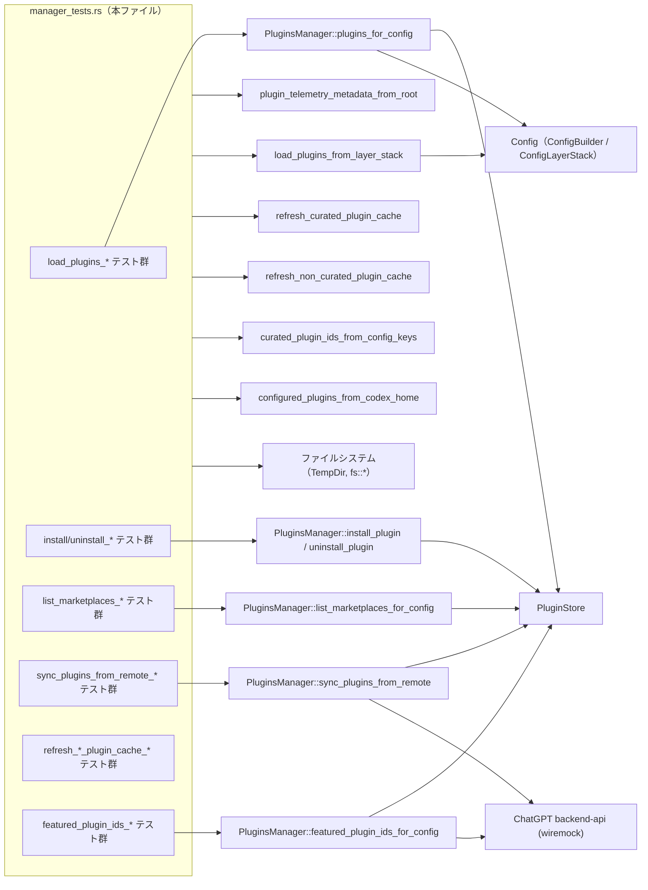
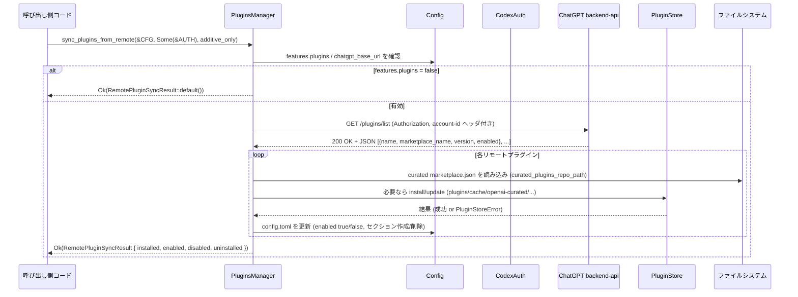

# core/src/plugins/manager_tests.rs コード解説

## 0. ざっくり一言

`core/src/plugins/manager_tests.rs` は、`PluginsManager` および関連ユーティリティ（マーケットプレース連携・リモート同期・キャッシュ更新など）の **期待される挙動を網羅的に検証する統合テスト群** です。

---

## 1. このモジュールの役割

### 1.1 概要

- このモジュールは、プラグイン管理周りの **公開 API の仕様をテストで固定する役割** を持ちます。
- 主な対象は `PluginsManager` と、その周辺の関数群です（インストール／アンインストール、マーケットプレース列挙、リモート同期、キャッシュ更新など）。
- テストでは、一時ディレクトリとテスト用マーケットプレース・プラグインリポジトリを実際に作成し、ファイルシステムや HTTP（mock）も含めた **エンドツーエンドに近い挙動** を確認しています。

### 1.2 アーキテクチャ内での位置づけ

このテストモジュールが依存している主なコンポーネントの関係を簡略化した図です。



> 図は、テストからどの公開 API が呼ばれ、どの周辺コンポーネントに影響するかを示しています。

### 1.3 設計上のポイント（テストから読み取れる仕様）

※ いずれも実装ではなく、**テストが前提としている契約** です。

- **機能フラグ `features.plugins`**
  - `features.plugins = false` のとき:
    - `plugins_for_config` は `PluginLoadOutcome::default()` を返す。
    - `list_marketplaces_for_config` は空リストを返す。
    - `read_plugin_for_config` は `MarketplaceError::PluginsDisabled` を返す。
    - `sync_plugins_from_remote` は `RemotePluginSyncResult::default()` を返す。
- **プラグインキーの形式**
  - `"[plugins.\"<name>@<marketplace>\"]"` の形式のみ有効。
  - 例: `sample-plugin@debug`、`linear@openai-curated`。
  - 不正なキー（例: `"sample"`）は、`LoadedPlugin.error` にエラーメッセージを設定し、実効的な貢献はゼロになる。
- **有効／無効の扱い**
  - `enabled = false` のプラグインは `plugins()` には残るが、
    - `effective_skill_roots` / `effective_mcp_servers` / `effective_apps`
    - `capability_summaries`
    には影響しない（いわゆる「無効だが存在はする」状態）。
- **スキル設定のレイヤ**
  - スキルの enable/disable は **ユーザー設定レイヤ（codex_home の config.toml）だけ** を見る。
  - プロジェクトの `.codex/config.toml` に書いた `[[skills.config]]` は、プラグイン読み込み時には無視される。
- **マーケットプレース検出**
  - ローカルリポジトリ配下の `.agents/plugins/marketplace.json`。
  - インストール済みマーケットプレース (`marketplace_install_root` 配下)。
  - curated リポジトリ (`curated_plugins_repo_path`)。
  - `known_marketplaces.json` が壊れている場合は、config の情報を優先する。
- **重複エントリの解決**
  - 同じマーケットプレース名・プラグイン名が複数の `marketplace.json` に現れる場合、**最初に見つかったものが採用される**。
- **キャッシュ更新**
  - curated プラグイン:
    - 現在の SHA と異なる `local` ディレクトリを、SHA ディレクトリに置き換える。
  - 非 curated プラグイン:
    - `local` ディレクトリを manifest の `version` ディレクトリに置き換える。
  - すでに最新の場合は `false` を返して何もしない。
- **ネットワーク連携**
  - `sync_plugins_from_remote`/`featured_plugin_ids_for_config` は `chatgpt_base_url` 以下の `backend-api` を叩く。
  - 認証情報 (`CodexAuth`) がある場合は、`authorization` と `chatgpt-account-id` ヘッダーを送る。
  - `PluginsManager::new_with_restriction_product` で指定した `Product` に応じて `platform` クエリパラメータ（`chat` or `codex`）を付与。

---

## 2. 主要な機能一覧（テストがカバーする機能）

このモジュールが主に検証している機能を列挙します。

- プラグインロード:
  - `PluginsManager::plugins_for_config` の挙動
    - デフォルトスキル・MCP サーバ・アプリの読み込み
    - スキルの無効化／未知スキル名の無視
    - manifest で指定された skills/mcpServers/apps パスの優先ルール
    - プラグイン無効時の扱い
    - project レイヤの config を無視すること
- キャパビリティサマリ:
  - `PluginCapabilitySummary` の生成ロジック
    - 説明文の 1 行化・長さ制限
    - 有効でない／貢献がないプラグインのフィルタリング
    - effective apps の connector ID 重複除去
- インストール／アンインストール:
  - `PluginsManager::install_plugin`
  - `PluginsManager::uninstall_plugin`
  - config.toml への `[plugins."name@marketplace"]` 追記・削除
  - キャッシュディレクトリの作成・削除
  - manifest の `version` 利用 (非 curated)
- マーケットプレース一覧:
  - `list_marketplaces_for_config`
    - enabled フラグの反映
    - features.plugins が false のときの空返却
    - `policy.products = []` のプラグイン除外
    - curated / インストール済み / ローカル repo の統合
    - `known_marketplaces.json` が壊れている場合のフォールバック
    - 重複プラグインの「先勝ち」ルール
    - config にあるがキャッシュが無いプラグインを、未インストールとして扱うこと
- リモート同期:
  - `sync_plugins_from_remote`
    - feature 無効時の no-op
    - remote 状態との整合（有効化／無効化／アンインストール）
    - `additive_only` フラグによる挙動差
    - 未知プラグインの無視
    - インストール失敗時のロールバック（既存状態を維持）
    - duplicate local plugin entry の「先勝ち」ルール
- featured プラグイン取得:
  - `featured_plugin_ids_for_config`
    - `Product` に応じた `platform` クエリパラメータ（`chat` or `codex`）
    - 認証ヘッダの有無
- キャッシュ更新:
  - `refresh_curated_plugin_cache`
  - `refresh_non_curated_plugin_cache`
  - `curated_plugin_ids_from_config_keys` / `configured_plugins_from_codex_home`
  - 既に最新状態なら何もしない契約
  - 無関係な壊れた manifest を無視すること

---

## 3. 公開 API と詳細解説

### 3.1 型一覧（主な外部型）

※ このファイル自体は型定義を持ちませんが、テストから見える主要な型を整理します。

| 名前 | 種別 | 役割 / 用途 |
|------|------|-------------|
| `PluginsManager` | 構造体（推定） | プラグインの読み込み、インストール、アンインストール、マーケットプレース一覧、リモート同期などの中心的なサービス。 |
| `PluginLoadOutcome` | 構造体 | `plugins_for_config` の結果。`plugins()` や `capability_summaries()`、`effective_skill_roots()` などを提供。 |
| `LoadedPlugin` | 構造体 | 単一プラグインの状態（config 名、manifest 名・説明、enabled、skill_roots、mcp_servers、apps、error 等）を表現。 |
| `PluginCapabilitySummary` | 構造体 | UI 表示向けの軽量な「プラグイン能力サマリ」。スキル有無・MCP サーバ名・アプリ ID など。 |
| `AppConnectorId` | 新タイプ or 構造体 | アプリコネクタ（外部サービス連携）の識別子。`AppConnectorId(String)` のように使用。 |
| `McpServerConfig` | 構造体 | MCP サーバの設定（transport, enabled, scopes 等）。テストでは `StreamableHttp` のみ使用。 |
| `McpServerTransportConfig` | 列挙体 | MCP サーバの接続方式。ここでは `StreamableHttp { url, bearer_token_env_var, ... }` を使用。 |
| `PluginId` | 構造体 | `<name>@<marketplace>` 形式のプラグイン ID。`PluginId::new`, `PluginId::parse`, `as_key()` など。 |
| `ConfiguredMarketplace` | 構造体 | 一つのマーケットプレース（名前、パス、interface、plugins）。 |
| `ConfiguredMarketplacePlugin` | 構造体 | マーケットプレース内の一つのプラグインエントリ。インストール状態や enabled 状態などを持つ。 |
| `MarketplacePluginSource` | 列挙体 | プラグインのソース。テストでは `Local { path: AbsolutePathBuf }` のみ登場。 |
| `MarketplacePluginPolicy` | 構造体 | インストール・認証ポリシー、および対象プロダクト (`products`) を表現。 |
| `MarketplacePluginInstallPolicy` | 列挙体 | インストールポリシー。テストでは `Available` のみ使用。 |
| `MarketplacePluginAuthPolicy` | 列挙体 | 認証タイミング。`OnInstall` / `OnUse` など。 |
| `PluginInstallRequest` | 構造体 | `install_plugin` に渡すリクエスト（`plugin_name` と `marketplace_path`）。 |
| `PluginInstallOutcome` | 構造体 | インストール結果（`plugin_id`, `plugin_version`, `installed_path`, `auth_policy`）。 |
| `RemotePluginSyncResult` | 構造体 | リモート同期の結果（インストール・有効化・無効化・アンインストールされた plugin ID の一覧）。 |
| `MarketplaceError` | 列挙体 | マーケットプレース関連のエラー。`PluginsDisabled` など。 |
| `PluginRemoteSyncError` | 列挙体 | リモート同期処理のエラー。`Store(PluginStoreError)` など。 |
| `PluginStoreError` | 列挙体 | プラグインストア操作時のエラー。`Invalid(String)` など。 |
| `PluginStore` | 構造体 | プラグインキャッシュの物理管理（コピー・削除など）。 |
| `Config` | 構造体 | アプリケーション設定（features, plugins, marketplaces, chatgpt_base_url など）。 |
| `ConfigBuilder` | 構造体 | `Config` を非同期に組み立てるビルダー。 |
| `ConfigLayerStack` | 構造体 | 複数の設定レイヤ（ユーザ、プロジェクト等）を積み重ねたもの。 |
| `ConfigLayerEntry` | 構造体 | 一つのレイヤ（source と内容）のエントリ。 |
| `ConfigLayerSource` | 列挙体 | 設定ファイルの出自。ここでは `Project { dot_codex_folder }` を使用。 |
| `CodexAuth` | 構造体 | ChatGPT / Codex 用の認証情報。HTTP ヘッダ生成に利用。 |
| `Product` | 列挙体 | プラットフォーム種別。テストでは `Product::Chatgpt`, `Product::Codex`。 |
| `MarketplaceInterface` | 構造体 | マーケットプレース UI 表示用の追加情報（`display_name` など）。 |

※ 行番号はこのインターフェースから取得できないため省略しています。

---

### 3.2 関数詳細（主な公開 API の仕様：テストからの推定）

ここでは、本テストが仕様を固定している主な「本番コード側の関数／メソッド」について整理します。  
**注意**: いずれも実装を見ていないため、挙動は **テストの期待値から読み取れる範囲** に限定します。

#### `PluginsManager::plugins_for_config(&self, config: &crate::config::Config) -> PluginLoadOutcome`

**概要**

- 現在の設定 (`Config`) に基づいて、利用可能なプラグインを読み込み、`PluginLoadOutcome` を返す関数です。
- features.plugins のオン／オフ、個々のプラグインの enabled フラグ、skills 設定、manifest 内のパス指定などを解釈します。

**引数**

| 引数名 | 型 | 説明 |
|--------|----|------|
| `self` | `&PluginsManager` | プラグイン管理オブジェクト。`codex_home` に紐づく。 |
| `config` | `&Config` | `ConfigBuilder` などで生成された現在の設定。`features.plugins` や `[plugins]` セクションを含む。 |

**戻り値**

- `PluginLoadOutcome`  
  読み込んだプラグインに関する詳細情報（`plugins()`, `capability_summaries()`, `effective_skill_roots()`, `effective_mcp_servers()`, `effective_apps()` など）を持ちます。

**内部処理の流れ（テストから推定）**

1. `features.plugins` を確認し、`false` の場合は `PluginLoadOutcome::default()` を返す。  
   （`load_plugins_returns_empty_when_feature_disabled` より）
2. `codex_home/plugins/cache/**` 以下のプラグインディレクトリを探索し、`.codex-plugin/plugin.json` を読み込んで manifest を解釈する。
3. 各プラグインについて、config の `[plugins."<name>@<marketplace>"]` エントリを参照し、`enabled` フラグ・無効化スキル指定を解釈する。
   - スキル:
     - `[[skills.config]]` の `name = "plugin:skill"` で disable 指定されたものは、そのスキルの `SKILL.md` のパスを `disabled_skill_paths` に入れる。
     - 未知のスキル名は無視する。  
       （`load_plugins_resolves_disabled_skill_names_against_loaded_plugin_skills` / `load_plugins_ignores_unknown_disabled_skill_names` より）
   - enabled = false の場合:
     - `LoadedPlugin` は `enabled = false` で `plugins()` には残るが、`skill_roots`, `mcp_servers`, `apps` は空とみなされる。  
       （`load_plugins_preserves_disabled_plugins_without_effective_contributions` より）
4. manifest 内の `skills`, `mcpServers`, `apps` のパス指定を解釈し、コンポーネントを読み込む。
   - `"./custom-skills/"` のように `./` で始まる相対パスのみ特別扱いし、デフォルトパスより優先。
   - `"custom-skills"` のように `./` なしのパスは無視し、デフォルトパス（`skills/`, `.mcp.json`, `.app.json`）を使う。  
     （`load_plugins_uses_manifest_configured_component_paths` / `load_plugins_ignores_manifest_component_paths_without_dot_slash` より）
5. `plugins()` の各 `LoadedPlugin` をもとに、`capability_summaries()` を構築する。
   - enabled かつエラーなしで、skills / mcp_servers / apps のどれかを持つプラグインのみサマリに含める。  
     （`capability_index_filters_inactive_and_zero_capability_plugins` より）
   - description は manifest の description から生成するが、  
     - 改行やタブ・連続空白は 1 つのスペースに正規化する。
     - 長さは `MAX_CAPABILITY_SUMMARY_DESCRIPTION_LEN` (= 1024) で切り詰める。  
       （`capability_summary_sanitizes_plugin_descriptions_to_one_line`, `capability_summary_truncates_overlong_plugin_descriptions` より）
6. `effective_*` 系の集約値を計算する。
   - `effective_apps()` は複数プラグイン間で connector ID を重複排除する。  
     （`effective_apps_dedupes_connector_ids_across_plugins` より）

**Examples（使用例）**

テストで行っている最小構成の例を簡略化したものです。

```rust
use tempfile::TempDir;
use crate::config::CONFIG_TOML_FILE;
use crate::plugins::PluginsManager;

// 一時ホームディレクトリを作成
let codex_home = TempDir::new().unwrap();

// プラグインファイル群を codex_home/plugins/cache/... に配置済みと仮定

// config.toml を書き出す
std::fs::write(
    codex_home.path().join(CONFIG_TOML_FILE),
    r#"[features]
plugins = true

[plugins."sample@test"]
enabled = true
"#,
).unwrap();

// 設定を読み込む
let config = load_config_blocking(codex_home.path(), codex_home.path());

// プラグインをロード
let outcome = PluginsManager::new(codex_home.path().to_path_buf())
    .plugins_for_config(&config);

// 有効なスキルルートや MCP サーバを取得
let skill_roots = outcome.effective_skill_roots();
let mcp_servers = outcome.effective_mcp_servers();
```

**Errors / Panics**

- features.plugins = false の場合でもエラーではなく、`PluginLoadOutcome::default()` を返す設計です。
- 不正なプラグインキー（`"sample"` のように `@` を含まない）は、`LoadedPlugin.error` に  
  `"invalid plugin key`sample`; expected <plugin>@<marketplace>"` のようなメッセージを設定し、実効的な貢献は発生しません。
- テストからは `plugins_for_config` 自体が panic するケースは確認できません。

**Edge cases（エッジケース）**

- **プラグイン機能無効 (`features.plugins = false`)**  
  → すべてのプラグイン機能が無効化され、`PluginLoadOutcome::default()` を返す。
- **enabled = false のプラグイン**  
  → `plugins()` には 1 件として現れるが、実効的な skill/MCP/app は 0。capability_summaries にも出ない。
- **未知のスキル名を disable した場合**  
  → `disabled_skill_paths` は空のまま。`has_enabled_skills` は true のまま。
- **project レイヤだけに config がある場合**  
  → `load_plugins_from_layer_stack` を使ったテストでは、`PluginLoadOutcome::default()` となる（ユーザ config を見ないため）。  

**使用上の注意点**

- `plugins_for_config` の結果だけを見るのではなく、`features.plugins` フラグと組み合わせて解釈する必要があります。
- project レイヤの `.codex/config.toml` に書いた plugin 設定は無視されるため、**ユーザ設定ファイル（codex_home/config.toml）側にプラグイン設定を置く前提** です。
- プラグインキーは必ず `<name>@<marketplace>` 形式にする必要があります。

---

#### `PluginsManager::install_plugin(&self, request: PluginInstallRequest) -> impl Future<Output = Result<PluginInstallOutcome, E>>`

**概要**

- マーケットプレース定義 (`marketplace.json`) を読み取り、指定されたプラグインを **ローカルキャッシュにインストール** し、`config.toml` に `[plugins."name@marketplace"]` エントリを追加する関数です。

**引数**

| 引数名 | 型 | 説明 |
|--------|----|------|
| `self` | `&PluginsManager` | プラグイン管理オブジェクト。 |
| `request` | `PluginInstallRequest` | インストール対象プラグイン名と、そのプラグインが定義されている `marketplace.json` のパス。 |

**戻り値**

- `Result<PluginInstallOutcome, E>`  
  - 成功時:  
    - `plugin_id`: `<name>@<marketplace>`  
    - `plugin_version`: curated 以外は manifest の `version`。manifest に version がない場合は `"local"`。  
    - `installed_path`: `codex_home/plugins/cache/<marketplace>/<name>/<version>`。  
    - `auth_policy`: marketplace の `policy.authentication` が指定されていればそれに従い、なければ `OnInstall`（テストより）。

**内部処理の流れ（テストから推定）**

1. `marketplace_path` の `marketplace.json` を読み込み、`name` と `plugins` 配列から対象プラグイン定義を探す。
2. プラグインソースが `Local` かつ `path: "./sample-plugin"` のような相対パスで指定されている場合、  
   **マーケットプレースファイルのディレクトリからの相対パス** でプラグインルートを特定する。
3. manifest (`.codex-plugin/plugin.json`) を読み込み、`name` と `version` を取得する。
   - curated でない場合、`version` が存在すればそれを、なければ `"local"` を用いる。
4. プラグインを `codex_home/plugins/cache/<marketplace>/<name>/<version>` にコピーする。
5. `config.toml` に `[plugins."name@marketplace"]` セクションを追記し、`enabled = true` を設定する。
6. `PluginInstallOutcome` を返却する。

**Examples（使用例）**

```rust
let codex_home = tempfile::tempdir().unwrap();
let repo_root = codex_home.path().join("repo");

// repo/.agents/plugins/marketplace.json に local ソースのプラグイン定義があると仮定
let manager = PluginsManager::new(codex_home.path().to_path_buf());
let outcome = manager.install_plugin(PluginInstallRequest {
    plugin_name: "sample-plugin".to_string(),
    marketplace_path: AbsolutePathBuf::try_from(
        repo_root.join(".agents/plugins/marketplace.json"),
    ).unwrap(),
}).await.unwrap();

// インストールされたパス
println!("installed at {}", outcome.installed_path);
```

**Errors / Panics**

- テストからは、`install_plugin` 自体のエラーケースは直接検証されていません。
- manifest の `version` が無い場合もエラーにせず `"local"` として扱われます（`install_plugin_updates_config_with_relative_path_and_plugin_key`）。

**Edge cases**

- manifest に `version` があり、curated でない場合は **そのバージョンをディレクトリ名に使用** する。  
  （`install_plugin_uses_manifest_version_for_non_curated_plugins` より）
- marketplace の `policy.authentication` が `"ON_USE"` の場合、`auth_policy` が `MarketplacePluginAuthPolicy::OnUse` になる。

**使用上の注意点**

- `marketplace.json` に定義されていないプラグイン名を指定した場合の挙動は、テストからは不明です（エラーになると考えられますが、このファイルからは断定できません）。
- install しただけでは `features.plugins` が false の場合、プラグイン機能は有効になりません。

---

#### `PluginsManager::uninstall_plugin(&self, key: String) -> impl Future<Output = Result<(), E>>`

**概要**

- 指定されたプラグインキー（`<name>@<marketplace>`）に対応する **キャッシュディレクトリを削除し、config.toml からエントリを削除** する関数です。

**引数**

| 引数名 | 型 | 説明 |
|--------|----|------|
| `key` | `String` | プラグインキー（`"sample-plugin@debug"` のような形式）。 |

**戻り値**

- `Result<(), E>`  
  - 成功時: `Ok(())`。指定プラグインが存在しない場合もエラーにせず成功することがテストから読み取れます。

**内部処理の流れ（テストから推定）**

1. プラグインキーを解析して `<name>` と `<marketplace>` に分解する。
2. `codex_home/plugins/cache/<marketplace>/<name>` ディレクトリを削除する（存在しなければ何もしない）。
3. `config.toml` から `[plugins."key"]` セクションを削除する（存在しなければ何もしない）。

**Examples（使用例）**

```rust
let manager = PluginsManager::new(codex_home.to_path_buf());

// 初回アンインストール（実際に削除）
manager.uninstall_plugin("sample-plugin@debug".to_string())
    .await
    .unwrap();

// 2回目（すでに削除済みでもエラーにならない）
manager.uninstall_plugin("sample-plugin@debug".to_string())
    .await
    .unwrap();
```

**Errors / Panics**

- テストでは、存在しないプラグインをアンインストールしても `unwrap()` が成功しているため、**idempotent** な設計であると読み取れます。

**Edge cases**

- キャッシュディレクトリが存在しない状態での呼び出し → 何も起きないが成功扱い。
- config.toml にプラグインセクションが無い状態での呼び出し → 何も起きないが成功扱い。

**使用上の注意点**

- プラグインキーの形式が不正な場合の挙動は、このテストからは分かりません。
- アンインストール後の `plugins_for_config` や `list_marketplaces_for_config` の結果を信頼する前に、再度 `Config` を読み直す必要があります（テストでは `fs::read_to_string` で確認後、必要に応じて `load_config` し直しています）。

---

#### `PluginsManager::list_marketplaces_for_config(&self, config: &Config, repo_roots: &[AbsolutePathBuf]) -> Result<MarketplacesSummary, MarketplaceError>`

**概要**

- 現在の設定と、指定されたリポジトリ・インストールディレクトリをもとに、**利用可能なマーケットプレースとそれぞれのプラグイン一覧** を返す関数です。

**引数**

| 引数名 | 型 | 説明 |
|--------|----|------|
| `config` | `&Config` | features.plugins や `[marketplaces.*]` を含む設定。 |
| `repo_roots` | `&[AbsolutePathBuf]` | ローカルリポジトリのルートパス一覧。各ルート配下の `.agents/plugins/marketplace.json` を探索する。 |

**戻り値**

- `Result<MarketplacesSummary, MarketplaceError>`  
  - 成功時: `.marketplaces` フィールドに `ConfiguredMarketplace` の一覧。
  - 失敗時: 何らかの `MarketplaceError`（詳細はこのファイルからは不明）。

**内部処理の流れ（テストから推定）**

1. `features.plugins` を確認し、`false` の場合は空のマーケットプレース一覧を返す。  
   （`list_marketplaces_returns_empty_when_feature_disabled` より）
2. 引数 `repo_roots` に対して、それぞれの `.agents/plugins/marketplace.json` を読み込み、マーケットプレース定義を構築。
3. `config.marketplaces.*` セクションからインストール済みマーケットプレースルート (`marketplace_install_root`) を取得し、そこにも `.agents/plugins/marketplace.json` があればマーケットプレースとして追加。
4. curated リポジトリ (`curated_plugins_repo_path`) に `openai-curated` のマーケットプレースが存在すれば、それも追加。
5. 各マーケットプレース内のプラグインについて:
   - `Config` 内の `[plugins."name@marketplace"]` セクションを参照し、enabled / disabled を決定。
   - `plugins/cache/<marketplace>/<name>` 以下のディレクトリが存在するかで、installed フラグを決定。
   - `policy` や `interface` は marketplace.json の記述を反映。
   - `policy.products` が `[]` のプラグインは一覧に含めない。  
     （`list_marketplaces_excludes_plugins_with_explicit_empty_products` より）
6. 重複プラグインの処理:
   - 同じ `<marketplace>/<name>` が複数の marketplace.json に現れた場合、**探索順で最初に見つかったもの** を使い、以降は無視する。  
     （`list_marketplaces_uses_first_duplicate_plugin_entry` より）
7. `known_marketplaces.json` も参照するが、ファイルが壊れている場合（不正 JSON）は無視し、config に基づいてマーケットプレースを検出する。  
   （`list_marketplaces_uses_config_when_known_registry_is_malformed` より）

**Examples（使用例）**

```rust
let config = load_config(codex_home, &repo_root).await;
let manager = PluginsManager::new(codex_home.to_path_buf());

// 複数リポジトリをスキャン
let summary = manager
    .list_marketplaces_for_config(
        &config,
        &[
            AbsolutePathBuf::try_from(repo_root_a.clone()).unwrap(),
            AbsolutePathBuf::try_from(repo_root_b.clone()).unwrap(),
        ],
    )?
    .marketplaces;

// 特定マーケットプレースのプラグイン一覧を参照
for marketplace in summary {
    println!("Marketplace {}", marketplace.name);
    for plugin in marketplace.plugins {
        println!(
            "  {} (installed={}, enabled={})",
            plugin.id, plugin.installed, plugin.enabled
        );
    }
}
```

**Errors / Panics**

- features.plugins = false の場合もエラーではなく空リストを返します。
- known_marketplaces.json が壊れていてもエラーにはせず、config ベースで検出を続行します。

**Edge cases**

- **config にあるがキャッシュが無いプラグイン**  
  → `installed = false`, `enabled` は config の設定どおり。  
    （`list_marketplaces_marks_configured_plugin_uninstalled_when_cache_is_missing` より）
- **config にはマーケットプレースが無いがインストールルートだけ存在する**  
  → そのルート配下のマーケットプレースは一覧に含まれない。  
    （`list_marketplaces_ignores_installed_roots_missing_from_config` より）
- **`policy.products = []` が指定されたプラグイン**  
  → そのマーケットプレースの plugins 配列から除外される。

**使用上の注意点**

- `repo_roots` の順序が、重複プラグインの「どちらが採用されるか」に影響します。
- 設定とキャッシュの整合性が崩れた場合（config はあるがキャッシュが無い等）も、一覧としては出てきますが、installed フラグを確認する必要があります。

---

#### `PluginsManager::sync_plugins_from_remote(&self, config: &Config, auth: Option<&CodexAuth>, additive_only: bool) -> Result<RemotePluginSyncResult, PluginRemoteSyncError>`

**概要**

- ChatGPT backend (`/backend-api/plugins/list`) を呼び出し、**リモート側のプラグイン有効状態とローカルのキャッシュ／config を同期** する関数です。

**引数**

| 引数名 | 型 | 説明 |
|--------|----|------|
| `config` | `&Config` | `chatgpt_base_url` や features.plugins を含む設定。 |
| `auth` | `Option<&CodexAuth>` | 認証情報。Some の場合、Authorization ヘッダ等を付与してリモートを呼び出す。 |
| `additive_only` | `bool` | true の場合、**既存のプラグインを削除しない** モードで同期を行う。 |

**戻り値**

- `Result<RemotePluginSyncResult, PluginRemoteSyncError>`  
  - `RemotePluginSyncResult` は以下の 4 つのベクタを持つ:
    - `installed_plugin_ids`
    - `enabled_plugin_ids`
    - `disabled_plugin_ids`
    - `uninstalled_plugin_ids`

**内部処理の流れ（テストから推定）**

1. `features.plugins` を確認し、`false` の場合は `RemotePluginSyncResult::default()` を返す。  
   （`sync_plugins_from_remote_returns_default_when_feature_disabled` より）
2. `config.chatgpt_base_url` に `/plugins/list` を付加した URL へ GET を行う。
   - `auth` が Some の場合、`authorization` と `chatgpt-account-id` ヘッダを付与する（wiremock の検証より）。
3. レスポンスは JSON 配列で、各要素は `{ "name", "marketplace_name", "version", "enabled" }` を持つ。
4. `marketplace_name` が `openai-curated` のプラグインについて:
   - curated リポジトリ (`curated_plugins_repo_path`) の marketplace.json と照合し、該当プラグインの local source パスを特定。
   - そのプラグインがローカルにインストールされていなければ、`PluginStore` を通じて `plugins/cache/openai-curated/<name>/<SHA or version>` にインストールする。
   - `enabled` が true の場合:
     - config.toml の `[plugins."name@openai-curated"]` を `enabled = true` で作成／更新。
   - `enabled` が false の場合:
     - `additive_only = false` のとき:
       - ローカルキャッシュからプラグインを削除し、config.toml の該当セクションも削除。
     - `additive_only = true` のとき:
       - キャッシュ・config ともに削除せず、enabled だけ更新（既存設定を温存）。
5. リモートレスポンスに現れない curated プラグインは、「リモートでは不要」とみなし、`additive_only = false` の場合にアンインストール＋config 削除の対象となる。  
   （`sync_plugins_from_remote_ignores_unknown_remote_plugins` では、逆にローカルのみのものが uninstalled として扱われることが確認されます）
6. 各操作の結果（install/enable/disable/uninstall）を `RemotePluginSyncResult` にまとめて返す。

**Examples（使用例）**

```rust
let mut config = load_config(codex_home, codex_home).await;
config.chatgpt_base_url = "https://api.openai.com/backend-api/".to_string();
let manager = PluginsManager::new(codex_home.to_path_buf());

let auth = CodexAuth::create_dummy_chatgpt_auth_for_testing();

let result = manager
    .sync_plugins_from_remote(&config, Some(&auth), /*additive_only*/ false)
    .await?;

println!("Installed: {:?}", result.installed_plugin_ids);
println!("Enabled:   {:?}", result.enabled_plugin_ids);
println!("Uninstalled: {:?}", result.uninstalled_plugin_ids);
```

**Errors / Panics**

- curated プラグインのインストール時に、source パスがディレクトリでない場合、`PluginStoreError::Invalid("plugin source path is not a directory"...)` が発生し、これが `PluginRemoteSyncError::Store` にラップされて返る。  
  （`sync_plugins_from_remote_keeps_existing_plugins_when_install_fails` より）
- インストール失敗時も、既存のプラグインや config の状態は変更されないことがテストで保証されています。

**Edge cases**

- **additive_only = true**  
  → リモートで無効になったプラグインもアンインストールされず、config のエントリも削除されない。enabled フラグの更新のみ行う。  
  （`sync_plugins_from_remote_additive_only_keeps_existing_plugins`）
- **リモートから未知のプラグインが返ってきた場合**  
  → curated marketplace.json に存在しない `name` のプラグインは無視される。  
    ローカルにしか存在しないプラグインは、リモートに見えない場合にアンインストール対象になる。  
    （`sync_plugins_from_remote_ignores_unknown_remote_plugins`）

**使用上の注意点**

- `chatgpt_base_url` の末尾に `/backend-api/` を含めた形で設定する必要があります（テストでは `"{server_uri}/backend-api/"`）。
- `additive_only` を誤って `false` にすると、リモートで無効化されたプラグインがローカルから削除されるため、挙動の違いに注意が必要です。

---

#### `PluginsManager::featured_plugin_ids_for_config(&self, config: &Config, auth: Option<&CodexAuth>) -> Result<Vec<String>, MarketplaceError>`

**概要**

- ChatGPT backend の `/backend-api/plugins/featured` を呼び出し、**現在のプラットフォーム（Codex / ChatGPT）の featured プラグイン ID の一覧** を取得する関数です。

**引数**

| 引数名 | 型 | 説明 |
|--------|----|------|
| `config` | `&Config` | `chatgpt_base_url` と features.plugins を含む設定。 |
| `auth` | `Option<&CodexAuth>` | 認証情報。ChatGPT アカウントで呼ぶ場合は Some。 |

**戻り値**

- `Result<Vec<String>, MarketplaceError>`  
  - 成功時: `["plugin-one", "plugin-two", ...]` のような plugin ID の配列。

**内部処理の流れ（テストから推定）**

1. `features.plugins` を確認し、false の場合の挙動はテストからは読み取れません（おそらくエラーまたは空配列）。
2. `new_with_restriction_product` の第 2 引数で渡された `Product` に応じて、`platform` クエリパラメータを決定。
   - `Some(Product::Chatgpt)` → `platform=chat`
   - `None` → `platform=codex`
3. `config.chatgpt_base_url` をベースに、`/plugins/featured?platform=...` へ GET を行う。
4. `auth` が Some の場合は `authorization`・`chatgpt-account-id` ヘッダを付与する。
5. レスポンスは `["id1", "id2", ...]` の JSON 配列として返り、それをそのまま `Vec<String>` として返却する。

**Examples（使用例）**

```rust
let mut config = load_config(codex_home, codex_home).await;
config.chatgpt_base_url = "https://api.openai.com/backend-api/".to_string();

// ChatGPT 用に制約されたマネージャ
let manager = PluginsManager::new_with_restriction_product(
    codex_home.to_path_buf(),
    Some(Product::Chatgpt),
);

let auth = CodexAuth::create_dummy_chatgpt_auth_for_testing();
let featured_ids = manager
    .featured_plugin_ids_for_config(&config, Some(&auth))
    .await?;

println!("Featured plugins for ChatGPT: {:?}", featured_ids);
```

**Errors / Panics**

- テストでは 200 OK のケースのみ検証されており、HTTP エラーや JSON パースエラー時の挙動は不明です。

**Edge cases**

- `restriction_product` が None の場合は `platform=codex` がデフォルトとなります。  
  （`featured_plugin_ids_for_config_defaults_query_param_to_codex` より）

**使用上の注意点**

- `featured_plugin_ids_for_config` は **インストールや有効化は行わず、ID の列挙だけ** を行う関数です。
- 実際にそのプラグインを使えるかどうかは、別途 `sync_plugins_from_remote` や `install_plugin` の結果と組み合わせて判断する必要があります。

---

#### `refresh_curated_plugin_cache(codex_home: &Path, current_sha: &str, plugin_ids: &[PluginId]) -> Result<bool, PluginStoreError>`

**概要**

- curated プラグイン（`openai-curated` など）について、**現在の SHA に合わせてローカルキャッシュを再インストール／整理** する関数です。

**引数**

| 引数名 | 型 | 説明 |
|--------|----|------|
| `codex_home` | `&Path` | Codex ホームディレクトリ。キャッシュは `plugins/cache/openai-curated` 配下。 |
| `current_sha` | `&str` | 現在有効な curated プラグインの SHA。 |
| `plugin_ids` | `&[PluginId]` | 対象とする curated プラグイン ID のリスト。 |

**戻り値**

- `Result<bool, PluginStoreError>`  
  - `Ok(true)` : 何らかの変更（インストール／削除）が行われた。
  - `Ok(false)` : すべて既に最新であり、何もする必要がなかった。

**内部処理の流れ（テストから推定）**

1. `plugin_ids` の各 `PluginId` について、`marketplace` が `openai-curated` であることを前提に処理する。
2. `plugins/cache/openai-curated/<name>/` ディレクトリを確認し、
   - `local` ディレクトリが存在する場合:
     - curated リポジトリ (`curated_plugins_repo_path`) から `<name>` のプラグインを読み込み、`<current_sha>` ディレクトリとして再インストール。
     - `local` ディレクトリを削除する。
   - `<current_sha>` ディレクトリが存在しない場合:
     - curated リポジトリから再インストールし、`<current_sha>` ディレクトリを作成。
   - `<current_sha>` ディレクトリが既に存在する場合:
     - 何もしない。
3. 少なくとも 1 つのプラグインに対して再インストールや削除が行われた場合に `true` を返す。

**Examples（使用例）**

```rust
let plugin_id = PluginId::new("slack".to_string(), "openai-curated".to_string()).unwrap();
let changed = refresh_curated_plugin_cache(
    codex_home.path(),
    TEST_CURATED_PLUGIN_SHA,
    &[plugin_id],
).expect("refresh should succeed");

if changed {
    println!("curated cache updated");
}
```

**Errors / Panics**

- curated リポジトリからのコピーに失敗した場合などは `PluginStoreError` が返される可能性がありますが、このファイルでは具体的なエラーケースは検証されていません。

**Edge cases**

- すでに `<current_sha>` ディレクトリが存在し、`local` ディレクトリも無い場合 → `false` を返す（no-op）。  
  （`refresh_curated_plugin_cache_returns_false_when_configured_plugins_are_current` より）
- キャッシュが全く無くても、curated リポジトリがあれば新規インストールされる。  
  （`refresh_curated_plugin_cache_reinstalls_missing_configured_plugin_with_current_sha`）

**使用上の注意点**

- `plugin_ids` の取得には通常 `curated_plugin_ids_from_config_keys(configured_plugins_from_codex_home(...))` を用いる想定です。
- curated リポジトリの状態（`write_openai_curated_marketplace` に相当する marketplace.json とプラグインディレクトリ）が整っていない場合、エラーとなる可能性があります。

---

#### `refresh_non_curated_plugin_cache(codex_home: &Path, repo_roots: &[AbsolutePathBuf]) -> Result<bool, PluginStoreError>`

**概要**

- 非 curated プラグイン（ローカル repo ベースの `debug` など）について、manifest の `version` に合わせて **`local` キャッシュをバージョン付きディレクトリに置き換える／再インストールする** 関数です。

**引数**

| 引数名 | 型 | 説明 |
|--------|----|------|
| `codex_home` | `&Path` | Codex ホームディレクトリ。 |
| `repo_roots` | `&[AbsolutePathBuf]` | 非 curated プラグインが格納されているローカルリポジトリのルート。 |

**戻り値**

- `Result<bool, PluginStoreError>`  
  - `true`: 何か変更あり。
  - `false`: すべて既に最新。

**内部処理の流れ（テストから推定）**

1. `repo_roots` の各ルートについて `.agents/plugins/marketplace.json` を読み込み、non-curated プラグインの一覧を取得。
2. 各プラグインについて `.codex-plugin/plugin.json` を読み込み、`version` を取得。
   - `version` が空白のみ（例: `"   "`）など、無効な場合はそのプラグインを無視する。
3. config.toml 内の `[plugins."name@marketplace"]` を参照し、**configured なプラグインのみ** を対象とする。
4. `plugins/cache/<marketplace>/<name>/` を確認し、
   - `local` ディレクトリが存在する場合:
     - manifest version 用ディレクトリ（例: `1.2.3`）に再インストールし、`local` を削除。
   - version ディレクトリが存在しない場合:
     - manifest version ディレクトリを作成してインストール。
   - version ディレクトリが既に存在する場合:
     - 何もしない。
5. いずれかのプラグインで変更があった場合に `true` を返す。

**Edge cases**

- 無効な version を持つプラグイン（`"   "` など）であっても、config に含まれていなければ無視される。  
  （`refresh_non_curated_plugin_cache_ignores_invalid_unconfigured_plugin_versions` より）
- すでに version ディレクトリがあり、`local` がない場合は `false`（no-op）を返す。

**使用上の注意点**

- この関数は「configured なプラグインのみ」対象とするため、config.toml に不要なプラグインが残っていると、その分もキャッシュが維持されます。
- キャッシュの構造は `plugins/cache/<marketplace>/<plugin>/<version>` であることが前提です。

---

### 3.3 その他の関数（このテストファイル内）

#### テスト用ヘルパー関数

| 関数名 | 役割（1 行） |
|--------|--------------|
| `write_plugin_with_version(root, dir_name, manifest_name, manifest_version)` | テスト用プラグインディレクトリを作り、`.codex-plugin/plugin.json` に name と任意の version を書き込む。`skills/` と `.mcp.json` も作成。 |
| `write_plugin(root, dir_name, manifest_name)` | `write_plugin_with_version` の version なし（`None`）版。 |
| `plugin_config_toml(enabled, plugins_feature_enabled) -> String` | `features.plugins` と `[plugins."sample@test"].enabled` を持つ簡易な TOML 文字列を生成。 |
| `load_plugins_from_config(config_toml, codex_home) -> PluginLoadOutcome` | `config.toml` を書き出し、`load_config_blocking` 経由で Config をロードして `plugins_for_config` を呼ぶユーティリティ。 |
| `load_config(codex_home, cwd) -> Config` (async) | `ConfigBuilder` を使って非同期に Config を構築。 |
| `load_config_blocking(codex_home, cwd) -> Config` | 単一スレッドの Tokio ランタイムを作成し、`load_config` を同期的に実行。 |

#### 主なテスト関数（概要）

テスト関数は多数あるため、テーマごとにまとめて記載します。

- **プラグインロード関連**
  - `load_plugins_loads_default_skills_and_mcp_servers`  
   : デフォルトパス (`skills/`, `.mcp.json`, `.app.json`) から skills/MCP/app が読み込まれ、`LoadedPlugin` と `PluginCapabilitySummary` が期待どおりになることを確認。
  - `load_plugins_resolves_disabled_skill_names_against_loaded_plugin_skills`  
   : `[[skills.config]]` で指定した `plugin:skill` 名が実際の SKILL ファイルに対応している場合、そのパスが `disabled_skill_paths` に入り、`has_enabled_skills = false` になることを確認。
  - `load_plugins_ignores_unknown_disabled_skill_names`  
   : 未知のスキル名を disable しても `disabled_skill_paths` が空のままで、サマリには skills を持つプラグインとして現れることを確認。
  - `load_plugins_uses_manifest_configured_component_paths` / `load_plugins_ignores_manifest_component_paths_without_dot_slash`  
   : manifest の `skills`, `mcpServers`, `apps` が `./` で始まる場合のみ有効で、それ以外はデフォルトパスが使われることを確認。
  - `load_plugins_preserves_disabled_plugins_without_effective_contributions`  
   : enabled = false のプラグインが `plugins()` に残りつつ、effective skill/mcp/app が空になることを確認。
  - `load_plugins_returns_empty_when_feature_disabled`  
   : features.plugins = false で `PluginLoadOutcome::default()` になることを確認。
  - `load_plugins_rejects_invalid_plugin_keys`  
   : 不正なプラグインキーに対して `error` フィールドにメッセージが設定され、effective contributions が 0 になることを確認。
  - `load_plugins_ignores_project_config_files`  
   : project レイヤの config のみが与えられた場合に、プラグインがロードされず `PluginLoadOutcome::default()` になることを確認。

- **キャパビリティ／サマリ関連**
  - `plugin_telemetry_metadata_uses_default_mcp_config_path`  
   : manifest に mcpServers パスがない場合、`.mcp.json` を読み込んだ `PluginCapabilitySummary` が生成されることを確認。
  - `capability_summary_sanitizes_plugin_descriptions_to_one_line`  
   : manifest description からのサマリ description が、改行・タブ・連続空白を 1 行に整形することを確認。
  - `capability_summary_truncates_overlong_plugin_descriptions`  
   : サマリ description の最大長が `MAX_CAPABILITY_SUMMARY_DESCRIPTION_LEN` であることを確認。
  - `effective_apps_dedupes_connector_ids_across_plugins`  
   : 複数プラグインに同じ `AppConnectorId` があっても、`effective_apps()` で重複が取り除かれることを確認。
  - `capability_index_filters_inactive_and_zero_capability_plugins`  
   : enabled でかつ skills/MCP/app いずれかを持つプラグインのみサマリに含まれることを確認。

- **マーケットプレース／インストール関連**
  - `install_plugin_updates_config_with_relative_path_and_plugin_key`  
   : `install_plugin` が `plugins/cache/<marketplace>/<name>/<version>` にプラグインをコピーし、config.toml に `[plugins."name@marketplace"]` を追記することを確認。
  - `install_plugin_uses_manifest_version_for_non_curated_plugins`  
   : 非 curated プラグインで manifest version があれば、それがディレクトリ名と `plugin_version` に使われることを確認。
  - `uninstall_plugin_removes_cache_and_config_entry`  
   : アンインストールでキャッシュと config エントリが削除されること、2 回目のアンインストールも成功することを確認。
  - `list_marketplaces_includes_enabled_state`  
   : 落とし込み済みのプラグインと config の enabled 状態が `ConfiguredMarketplacePlugin.enabled` に正しく反映されることを確認。
  - `list_marketplaces_returns_empty_when_feature_disabled`  
   : features.plugins = false の場合、マーケットプレース一覧が空になることを確認。
  - `list_marketplaces_excludes_plugins_with_explicit_empty_products`  
   : `policy.products = []` のプラグインが一覧から除外されることを確認。
  - `list_marketplaces_includes_curated_repo_marketplace`  
   : curated リポジトリの `openai-curated` マーケットプレースが自動的に一覧に含まれることを確認。
  - `list_marketplaces_includes_installed_marketplace_roots` / `list_marketplaces_uses_config_when_known_registry_is_malformed` / `list_marketplaces_ignores_installed_roots_missing_from_config` / `list_marketplaces_uses_first_duplicate_plugin_entry` / `list_marketplaces_marks_configured_plugin_uninstalled_when_cache_is_missing`  
   : インストールルート・known registry・重複エントリ・キャッシュ欠如などの各パターンでの一覧生成ロジックを検証。

- **read_plugin_for_config 関連**
  - `read_plugin_for_config_returns_plugins_disabled_when_feature_disabled`  
   : features.plugins = false の場合に `MarketplaceError::PluginsDisabled` が返ることを確認。
  - `read_plugin_for_config_uses_user_layer_skill_settings_only`  
   : project レイヤの `[[skills.config]]` を無視し、ユーザ設定の skill 有効/無効のみを反映することを確認。

- **リモート同期（sync_plugins_from_remote）関連**  
  前述の 3.2 の説明と対応するテストが多数存在します。

- **featured プラグイン関連**
  - `featured_plugin_ids_for_config_uses_restriction_product_query_param`  
   : Product = Chatgpt のとき `platform=chat` クエリと認証ヘッダが付与されることを wiremock で検証。
  - `featured_plugin_ids_for_config_defaults_query_param_to_codex`  
   : restriction_product = None のとき `platform=codex` が付与されることを確認。

- **キャッシュ更新関連**
  - curated: `refresh_curated_plugin_cache_*` / `curated_plugin_ids_from_config_keys_reads_latest_codex_home_user_config`。
  - non-curated: `refresh_non_curated_plugin_cache_*`。

---

## 4. データフロー

### 4.1 代表的な処理フロー: リモート同期 (`sync_plugins_from_remote`)

リモート状態に基づいてプラグインを同期する際の典型的なデータフローを、テストシナリオに沿って示します。



要点:

- **Config → PM → HTTP → PluginStore → FS** という多段階の流れになっており、  
  エラーが発生した場合（例えば PluginStoreError）、既存の状態を壊さないことがテストで確認されています。
- `additive_only` フラグにより、「ローカルからアンインストールするかどうか」の分岐が存在します。

---

## 5. 使い方（How to Use）

### 5.1 基本的な使用方法

テストから読み取れる、`PluginsManager` を利用した基本的なフローは以下のようになります。

```rust
use crate::config::ConfigBuilder;
use crate::plugins::PluginsManager;
use crate::config::CONFIG_TOML_FILE;

// 1. codex_home（ユーザ設定・プラグインキャッシュのルート）を決める
let codex_home = std::path::PathBuf::from("/path/to/codex_home");

// 2. config.toml を用意（features.plugins や [plugins] セクションなど）
std::fs::write(
    codex_home.join(CONFIG_TOML_FILE),
    r#"[features]
plugins = true

[plugins."sample@debug"]
enabled = true
"#,
)?;

// 3. Config をロード
let config = ConfigBuilder::default()
    .codex_home(codex_home.clone())
    .fallback_cwd(Some(codex_home.clone()))
    .build()
    .await?;

// 4. PluginsManager を初期化
let manager = PluginsManager::new(codex_home.clone());

// 5. プラグインをロードし、能力サマリを参照
let outcome = manager.plugins_for_config(&config);
for summary in outcome.capability_summaries() {
    println!(
        "Plugin {} (skills={}, mcp_servers={:?}, apps={:?})",
        summary.display_name,
        summary.has_skills,
        summary.mcp_server_names,
        summary.app_connector_ids,
    );
}

// 6. マーケットプレース一覧を取得
let marketplaces = manager
    .list_marketplaces_for_config(&config, &[])
    .unwrap()
    .marketplaces;
```

### 5.2 よくある使用パターン

1. **プラグインのインストール → 有効化**

   ```rust
   let manager = PluginsManager::new(codex_home.clone());

   // ローカル repo の marketplace.json から "sample-plugin" をインストール
   let outcome = manager.install_plugin(PluginInstallRequest {
       plugin_name: "sample-plugin".to_string(),
       marketplace_path: AbsolutePathBuf::try_from(
           repo_root.join(".agents/plugins/marketplace.json"),
       )?,
   }).await?;

   println!("Installed {} at {}", outcome.plugin_id.as_key(), outcome.installed_path);

   // config を再ロードして plugins_for_config を呼び直す
   let config = load_config(codex_home.as_path(), &repo_root).await;
   let load_outcome = manager.plugins_for_config(&config);
   ```

2. **リモート状態にプラグインを合わせる（一括同期）**

   ```rust
   let mut config = load_config(codex_home.as_path(), codex_home.as_path()).await;
   config.chatgpt_base_url = "https://api.openai.com/backend-api/".to_string();

   let auth = CodexAuth::create_dummy_chatgpt_auth_for_testing();
   let result = manager
       .sync_plugins_from_remote(&config, Some(&auth), /*additive_only*/ false)
       .await?;

   println!("Enabled plugins: {:?}", result.enabled_plugin_ids);
   ```

3. **キャッシュのリフレッシュ（起動時）**

   ```rust
   // curated プラグイン
   let curated_ids = curated_plugin_ids_from_config_keys(
       configured_plugins_from_codex_home(codex_home.as_path(), "...", "..."),
   );
   refresh_curated_plugin_cache(codex_home.as_path(), current_sha, &curated_ids)?;

   // 非 curated プラグイン
   refresh_non_curated_plugin_cache(codex_home.as_path(), &repo_roots)?;
   ```

### 5.3 よくある間違い

```rust
// 間違い例: features.plugins を false にしたままプラグインを期待する
std::fs::write(
    codex_home.join(CONFIG_TOML_FILE),
    r#"[features]
plugins = false

[plugins."sample@debug"]
enabled = true
"#,
)?;

// この状態で plugins_for_config を呼んでも、PluginLoadOutcome::default() となり
// プラグインは一切有効にならない
let config = load_config_blocking(codex_home.as_path(), codex_home.as_path());
let outcome = PluginsManager::new(codex_home.clone()).plugins_for_config(&config);
assert!(outcome.plugins().is_empty()); // テストでもこの挙動が確認されている
```

```rust
// 正しい例: features.plugins を true にしてからプラグインを有効化する
std::fs::write(
    codex_home.join(CONFIG_TOML_FILE),
    r#"[features]
plugins = true

[plugins."sample@debug"]
enabled = true
"#,
)?;
```

### 5.4 使用上の注意点（まとめ）

- **前提条件**
  - `features.plugins = true` でなければ、プラグイン関連 API は基本的に no-op またはエラー (`PluginsDisabled`) になります。
  - プラグインキーは `<name>@<marketplace>` 形式でなければなりません。
- **禁止事項 / 注意**
  - project レイヤ (`.codex/config.toml` in repo) のみでプラグイン設定を制御しようとしても、読み込みには使われません（ユーザ設定のみを見る設計）。
  - `sync_plugins_from_remote` の `additive_only = false` では、ローカル環境からプラグインが削除されるため、想定外のアンインストールに注意が必要です。
- **エラー・例外**
  - リモート同期時に PluginStoreError が発生した場合、既存のプラグインや config は変更されないように設計されています（テストより）。
- **パフォーマンス**
  - `load_config_blocking` は毎回新しい Tokio ランタイム（current_thread）を構築するため、頻繁に呼び出す用途には向きません。

---

## 6. 変更の仕方（How to Modify）

このファイルはテストコードであり、**本体の実装を変更する際に守るべき仕様** が詰まっています。

### 6.1 新しい機能を追加する場合

- 例: `PluginsManager` に新しい API を追加し、それをマーケットプレースに反映したい場合。

1. **実装側ファイルの特定**
   - 通常は `core/src/plugins/manager.rs` など（このファイルからは正確なパスは分かりませんが、`super::*` の先を参照することになります）。
2. **仕様の整理**
   - 既存のテストを読み、機能フラグ、config レイヤ、エラーハンドリングなどの既存の約束事を把握します。
3. **テスト追加**
   - この `manager_tests.rs` に、新しい機能を検証するテストを追加します。
   - なるべく既存のパターン（TempDir で codex_home を作成し、ファイルを書き込み、`PluginsManager` を呼ぶ）に倣うと、挙動の一貫性を保ちやすくなります。
4. **エッジケースのテスト**
   - features.plugins が false の場合
   - config に不整合がある場合（キー形式が不正、キャッシュ欠如など）
   - リモートとの通信に関わる場合は wiremock を使って HTTP レベルで検証する

### 6.2 既存の機能を変更する場合

- 例: capability サマリの生成ロジックを変更したい場合。

- **影響範囲の確認**
  - 対象となる API (`plugins_for_config`, `capability_summaries` など) をテストがどのように使っているか、このファイル内を検索します。
  - 同じ関数名が複数のテストで使われている場合、それぞれが別の側面（エッジケース）を検証しています。
- **契約の把握**
  - 例えば description の長さ制限 (`MAX_CAPABILITY_SUMMARY_DESCRIPTION_LEN`) を変更する場合、関連するテスト（サマリの整形・トランケーション）も同時に更新する必要があります。
- **テストの更新**
  - 期待値を変えた場合、既存テストが失敗するようになりますので、新たな仕様に合わせて修正します。
  - 逆に、仕様を壊してしまった場合もテストが教えてくれるため、このファイルは後方互換性の指標として重要です。

---

## 7. 関連ファイル

このテストモジュールと密接に関係すると思われるファイル・モジュールです（テストコードから参照されているものに基づく）。

| パス / モジュール | 役割 / 関係 |
|-------------------|------------|
| `core/src/plugins/manager.rs`（推定） | `PluginsManager` 本体や、`install_plugin`/`uninstall_plugin`/`sync_plugins_from_remote` などの実装。`super::*` でインポートされている。 |
| `core/src/plugins/test_support.rs` | `write_file`, `write_openai_curated_marketplace`, `write_curated_plugin_sha_with`, `TEST_CURATED_PLUGIN_SHA` など、テスト用の補助関数・定数を提供。 |
| `core/src/plugins/store.rs`（推定） | `PluginStore` や `PluginStoreError` の実装。キャッシュのコピー・削除処理を担当。 |
| `core/src/config/mod.rs` / `ConfigBuilder` | `Config` の生成ロジック。`codex_home` や `fallback_cwd` などを設定できる。 |
| `core/src/config_loader/*.rs` | `ConfigLayerStack`, `ConfigLayerEntry`, `ConfigRequirements`, `ConfigRequirementsToml` など、複数レイヤの設定読み込み処理。 |
| `curated_plugins_repo_path` 定義ファイル | curated プラグインリポジトリのルートを決定するロジック。 |
| `marketplace_install_root` 定義ファイル | インストール済みマーケットプレースのルートを決定するロジック。 |
| `codex_login::CodexAuth` 実装 | ChatGPT/Codex 用の認証情報を扱う構造体。HTTP ヘッダの生成など。 |
| `wiremock` による HTTP モック関連 | リモート API（`/backend-api/plugins/list`, `/backend-api/plugins/featured`）のインタフェース仕様をテストから読み取るために使われている。 |

このファイルは、これら実装モジュールの「仕様書」として読むことができ、プラグイン管理機能を安全に拡張・変更する際の基準になります。
