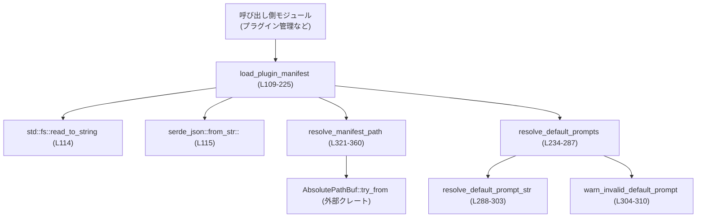
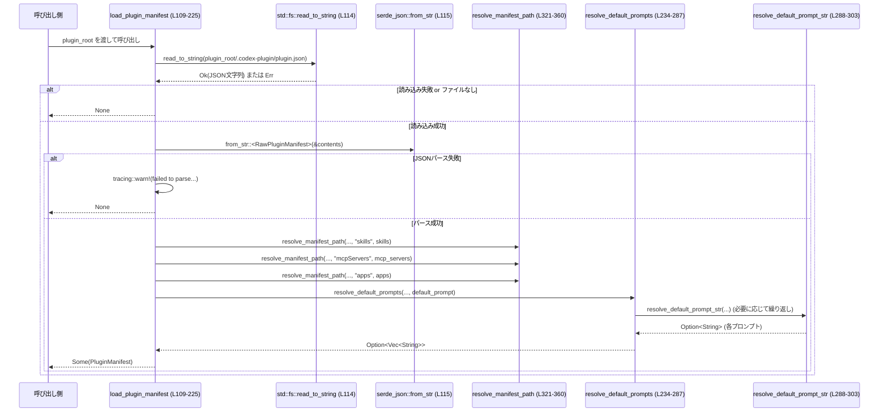

# core/src/plugins/manifest.rs 解説レポート

## 0. ざっくり一言

`plugin_root/.codex-plugin/plugin.json` からプラグインのマニフェストを読み込み、  
パスの正規化や `defaultPrompt` のバリデーションを行ったうえで内部表現 `PluginManifest` に変換するモジュールです。

---

## 1. このモジュールの役割

### 1.1 概要

このモジュールは、**プラグインごとの設定ファイル（plugin.json）** を安全に読み取り、  
アプリケーション内部で扱いやすい構造体に変換する役割を持ちます。

具体的には次の問題を解決します。

- JSON マニフェストを Rust 構造体へデシリアライズする（`Raw*` 型）【core/src/plugins/manifest.rs:L10-29, L61-95】
- マニフェスト内のパス文字列を、検証済みの絶対パス (`AbsolutePathBuf`) に変換する【core/src/plugins/manifest.rs:L321-360】
- `interface.defaultPrompt` など UI 用フィールドの形式・長さを検証しつつ、内部表現に落とし込む【core/src/plugins/manifest.rs:L96-108, L234-303】
- 無効な値はログに警告を出して無視しつつ、モジュールの呼び出し側にはシンプルな `Option` ベースの API を提供する【core/src/plugins/manifest.rs:L219-224, L304-310】

### 1.2 アーキテクチャ内での位置づけ

このモジュールは「プラグイン管理」まわりの中で、**マニフェストファイルのパースと正規化** を担当する部品です。

外部との主な関係は次の通りです。

- 呼び出し側（プラグインローダ等）が `load_plugin_manifest` を呼び出す【L109-225】
- ファイルシステムから `plugin.json` を読み込む（`std::fs::read_to_string`）【L114】
- JSON を `RawPluginManifest` にデシリアライズ（`serde_json::from_str`）【L115-125】
- パス系フィールドを `resolve_manifest_path` で検証・絶対パス化【L206-214, L321-360】
- `interface.defaultPrompt` を `resolve_default_prompts` で整形【L163, L234-287】



### 1.3 設計上のポイント

- **Raw 型と公開型の分離**  
  - JSON デシリアライズ用の `RawPluginManifest`, `RawPluginManifestInterface` と、  
    アプリ内部で使う `PluginManifest`, `PluginManifestInterface` を分けています【L10-29, L30-37, L44-60, L61-95】。
- **入力検証と正規化を一箇所に集約**  
  - パスの検証は `resolve_manifest_path` に集約し、`./` 起点・`..` 禁止などの制約を一元化【L321-360】。
  - `defaultPrompt` の形式・文字数チェックは `resolve_default_prompts`/`resolve_default_prompt_str` に集約【L234-303】。
- **エラーを Option とログで扱う方針**  
  - マニフェストの読み込み失敗や一部フィールドの不正値は、`None` や `None` フィールドとして扱い、  
    必要な箇所では `tracing::warn!` でログを残します【L219-224, L304-310, L333-350, L355-357】。
- **状態を持たない純粋な関数**  
  - すべての関数は引数に基づいて値を返すだけで、内部に共有状態を持ちません。  
    そのため並行呼び出し時もデータ競合は発生しません（Rust の所有権システムとあわせて後述）。

---

## 2. 主要な機能一覧

- plugin.json の存在チェックと読み込み: ファイルがあれば文字列として読み込む【L109-115】
- Raw マニフェスト (`RawPluginManifest`) への JSON デシリアライズ【L115-125】
- PluginManifest への変換（名前・バージョン・説明・パス・インターフェイス）【L126-216】
- skills / mcpServers / apps の相対パスを安全な絶対パスに変換【L206-214, L321-360】
- interface 情報（displayName, URLs, capabilities など）の変換【L136-185】
- defaultPrompt（文字列 or 配列）の正規化・検証・制限（最大 3 個、最大 128 文字）【L8-9, L96-108, L234-303】
- 不正な defaultPrompt やパスに対する警告ログ出力【L247-270, L275-283, L291-299, L304-310, L333-350, L355-357】
- JSON Value の型を人間可読な文字列に変換（ログメッセージ用）【L311-319】
- マニフェスト読み込みと defaultPrompt/バージョン処理のテスト【L361-472】

---

## 3. 公開 API と詳細解説

### 3.1 型一覧（構造体・列挙体など）

| 名前 | 種別 | 公開範囲 | 役割 / 用途 | 定義箇所 |
|------|------|----------|-------------|-----------|
| `RawPluginManifest` | 構造体 | モジュール内(private) | JSON から直接デシリアライズされるマニフェストの生データ。パスはまだ文字列のまま保持します。 | `core/src/plugins/manifest.rs:L10-29` |
| `PluginManifest` | 構造体 | `pub(crate)` | 呼び出し側に返すマニフェスト。名前・バージョン・説明・正規化済みパス・インターフェイス情報をまとめて保持します。 | `core/src/plugins/manifest.rs:L30-37` |
| `PluginManifestPaths` | 構造体 | `pub` | skills / mcpServers / apps の 3 種類のパスを、検証済み `AbsolutePathBuf` として保持します。 | `core/src/plugins/manifest.rs:L38-43` |
| `PluginManifestInterface` | 構造体 | `pub` | プラグインの UI メタデータ（表示名、説明、リンク、defaultPrompt、アイコン等）を保持します。 | `core/src/plugins/manifest.rs:L44-60` |
| `RawPluginManifestInterface` | 構造体 | モジュール内(private) | JSON の `interface` 部分をそのままデシリアライズする構造体。パスは文字列、defaultPrompt は Raw 形式。 | `core/src/plugins/manifest.rs:L61-95` |
| `RawPluginManifestDefaultPrompt` | 列挙体 | モジュール内(private) | `defaultPrompt` が文字列・配列・その他のいずれの形で来ても扱えるようにするための Raw 形式。`serde(untagged)` を利用。 | `core/src/plugins/manifest.rs:L96-102` |
| `RawPluginManifestDefaultPromptEntry` | 列挙体 | モジュール内(private) | `defaultPrompt` 配列の個々の要素（文字列 or 不正値）を表現する Raw 形式。 | `core/src/plugins/manifest.rs:L103-108` |

> 補足: `PluginManifest` 自体は `pub(crate)` のため crate 内からのみ使用されますが、  
> その一部である `PluginManifestPaths` と `PluginManifestInterface` は `pub` で公開されています【L38-60】。

### 3.2 関数詳細（主要 5 件）

#### `load_plugin_manifest(plugin_root: &Path) -> Option<PluginManifest>`  

**定義箇所**: `core/src/plugins/manifest.rs:L109-225`

**概要**

- 指定された `plugin_root`（プラグインのルートディレクトリ）配下の  
  `PLUGIN_MANIFEST_PATH`（例: `.codex-plugin/plugin.json`）を読み込み、  
  バリデーション済みの `PluginManifest` を返します。
- ファイルが存在しない・読めない・JSON が不正な場合は `None` を返します。

**引数**

| 引数名 | 型 | 説明 |
|--------|----|------|
| `plugin_root` | `&Path` | プラグインのルートディレクトリ。テストからは `demo-plugin` ディレクトリが渡されています【L391-399, L411-419, L445-453, L461-469】。 |

**戻り値**

- `Option<PluginManifest>`  
  - `Some(manifest)`: マニフェストが正常に読み込めた場合【L202-216】  
  - `None`: ファイルが存在しない・読めない、または JSON パースに失敗した場合【L111-115, L219-224】

**内部処理の流れ**

1. `manifest_path = plugin_root.join(PLUGIN_MANIFEST_PATH)` でマニフェストパスを作成【L110】。
2. `manifest_path.is_file()` が `false` なら `None` を返す（ログなし）【L111-113】。
3. `fs::read_to_string(&manifest_path).ok()?` で内容を読み込み、失敗時は `None`（ログなし）【L114】。
4. `serde_json::from_str::<RawPluginManifest>(&contents)` で JSON をパース【L115】。
   - 失敗した場合は `tracing::warn!` でログを出し `None`【L218-224】。
5. `RawPluginManifest` から以下の変換を行う【L117-125, L126-216】:
   - `name`:
     - マニフェストの `name` が空白のみなら、`plugin_root` のディレクトリ名を採用【L126-131】。
     - それ以外は JSON の `name` をそのまま使用（トリムしない）【L126-131】。
   - `version`:
     - `trim()` で前後の空白を除去し、空なら `None` とする【L132-135】。
   - `interface`:
     - `RawPluginManifestInterface` から `PluginManifestInterface` を構築【L136-185】。
     - `default_prompt` を `resolve_default_prompts` で正規化【L163】。
     - アイコンやスクリーンショットのパスを `resolve_interface_asset_path` で変換【L165-184】。
     - いずれのフィールドも空であれば `interface` 全体を `None` にする【L186-201】。
   - `paths`:
     - `skills`, `mcpServers`, `apps` の各文字列パスを `resolve_manifest_path` で検証・絶対パス化【L206-214】。

**Examples（使用例）**

典型的な使用例（crate 内）:

```rust
use std::path::Path;
use crate::plugins::manifest::load_plugin_manifest; // 実際のパスは crate 構成による

fn load_single_plugin(plugin_root: &Path) {
    if let Some(manifest) = load_plugin_manifest(plugin_root) {
        // プラグイン名とバージョンを使用
        println!("Loaded plugin: {} ({:?})", manifest.name, manifest.version);

        // skills パスがあれば利用
        if let Some(skills_path) = &manifest.paths.skills {
            println!("skills path = {}", skills_path);
            // skills 用の追加読み込み処理など…
        }
    } else {
        // マニフェストがない or 無効な場合
        println!("No valid manifest for plugin at {}", plugin_root.display());
    }
}
```

**Errors / Panics**

- **パニック**:  
  - プロダクションコードでは `expect`/`unwrap` は使用しておらず、パニックは発生しません。
- **`None`（エラー相当）になる条件**:
  - `plugin_root.join(PLUGIN_MANIFEST_PATH)` がファイルでない【L111-113】。
  - ファイル読み込み (`read_to_string`) に失敗【L114】。
  - JSON が `RawPluginManifest` としてパースできない（構文エラーなど）【L115, L218-224】。

**Edge cases（エッジケース）**

- `plugin_root` が存在しない / 権限がない  
  → `is_file()` が `false` となり `None`。ログは出ません【L111-113】。
- `name` フィールドが空文字 or 空白のみ  
  → `plugin_root` の末尾ディレクトリ名を `name` に使用【L126-131】。
- `version` が `" 1.2.3 "` のように空白を含む  
  → `"1.2.3"` にトリムされて保持されます【L132-135, L460-471】。
- `interface` セクションが存在しても、すべてのフィールドが空 / デフォルト  
  → `interface` 全体が `None` になります【L186-201】。

**使用上の注意点**

- `plugin_root` は **プラグインディレクトリ** を指す必要があります。  
  テストでは `tempdir()/demo-plugin` が渡されており、`.codex-plugin` ではない点に注意【L392-399, L412-419, L445-453, L461-469】。
- マニフェストが単に存在しない状況も正常ケースとして扱われます（`None` を返す）。  
  「エラー」とみなしたい場合は、呼び出し側で `None` を検知してログなどを出す必要があります。
- 読み込みやパース失敗時のログは、**JSON パース失敗時のみ** `tracing::warn!` が出ます【L218-224】。  
  「ファイルがない」「読めない」ケースは静かに `None` となる点に注意が必要です。

---

#### `resolve_manifest_path(plugin_root: &Path, field: &'static str, path: Option<&str>) -> Option<AbsolutePathBuf>`

**定義箇所**: `core/src/plugins/manifest.rs:L321-360`

**概要**

- マニフェスト内のパス文字列（例: `"./skills"`）を検証し、  
  安全な絶対パス `AbsolutePathBuf` に変換します。
- パスは必ず `./` から始まる相対パスであり、`..` やその他の特殊コンポーネントを含んではいけません。

**引数**

| 引数名 | 型 | 説明 |
|--------|----|------|
| `plugin_root` | `&Path` | プラグインのルートディレクトリ。 |
| `field` | `&'static str` | ログ用に使用される「フィールド名」（例: `"skills"` や `"interface.logo"`）【L206-214, L165-183】。 |
| `path` | `Option<&str>` | マニフェストから読み取ったパス文字列。`None` の場合は何もせず `None` を返します【L328】。 |

**戻り値**

- `Option<AbsolutePathBuf>`  
  - `Some(abs_path)`: パスが有効で絶対パスに解決できた場合【L354-360】  
  - `None`: パスが無効 or 変換に失敗した場合（その際は `tracing::warn!` で理由を記録）【L329-351, L355-357】

**内部処理の流れ**

1. `path` が `None` なら `None`【L328】。
2. 空文字列なら `None`（ログは出さない）【L329-331】。
3. 文字列が `"./"` で始まっているか確認し、そうでなければ警告を出し `None`【L332-335】。
4. `"./"` を取り除いた `relative_path` が空なら `./` だけなので警告を出し `None`【L336-338】。
5. `Path::new(relative_path).components()` を走査し、以下を確認【L341-352】:
   - `Component::Normal`（通常のパス要素）だけを許可して `normalized` に追加【L343】。
   - `Component::ParentDir`（`..`）が含まれていれば警告を出して `None`【L344-347】。
   - その他（`CurDir` や `RootDir` など）が含まれても警告を出して `None`【L348-351】。
6. `plugin_root.join(normalized)` を `AbsolutePathBuf::try_from` で絶対パスに変換【L354-360】。
   - 失敗した場合は警告を出し `None`【L355-357】。

**Examples（使用例）**

```rust
use std::path::Path;
use codex_utils_absolute_path::AbsolutePathBuf;
use crate::plugins::manifest::resolve_manifest_path;

fn example_resolve_paths(plugin_root: &Path) {
    // 正常なケース: "./skills" を絶対パスに変換
    let skills = resolve_manifest_path(plugin_root, "skills", Some("./skills"));
    assert!(skills.is_some());

    // NG: 絶対パスは拒否される
    let bad = resolve_manifest_path(plugin_root, "skills", Some("/etc/passwd"));
    assert!(bad.is_none()); // ログに警告が出る

    // NG: ".." を含むパスも拒否される
    let traversal = resolve_manifest_path(plugin_root, "skills", Some("./../secret"));
    assert!(traversal.is_none()); // ログに警告が出る
}
```

**Errors / Panics**

- パニックは発生しません。
- `None` となる条件（エラー相当）:
  - `path` が `None` または `""`【L328-331】。
  - `path` が `"./"` で始まらない【L332-335】。
  - `path` が `"./"` だけ【L336-338】。
  - `relative_path` に `..`（親ディレクトリ）や `.`（カレントディレクトリ）、ルートコンポーネントなどが含まれる【L341-352】。
  - `AbsolutePathBuf::try_from` に失敗（`plugin_root` が相対パスなど）【L354-360】。

**Edge cases（エッジケース）**

- `"./."` や `"./foo/./bar"` など `.` を含むパス  
  → `Component::CurDir` が現れるため、「plugin root 内にとどまる必要がある」という警告を出して `None`【L348-351】。
- `"./foo/../bar"`  
  → `Component::ParentDir` で「`..` を含んではいけない」という警告を出して `None`【L344-347】。
- `"skills"`（`./` なし）  
  → 「path must start with `./`」という警告を出して `None`【L332-335】。

**使用上の注意点**

- マニフェストを書く側は、**必ず `"./..."` 形式の相対パス**を使用する必要があります。
- この関数は **パス・トラバーサル対策** として `..` や絶対パスを拒否するので、  
  外部から供給されるマニフェストを安全に扱う前提になっています。
- `plugin_root` 自体が絶対パスでない場合、`AbsolutePathBuf::try_from` が失敗する可能性があります【L354-360】。

---

#### `resolve_default_prompts(plugin_root: &Path, value: Option<&RawPluginManifestDefaultPrompt>) -> Option<Vec<String>>`

**定義箇所**: `core/src/plugins/manifest.rs:L234-287`

**概要**

- `interface.defaultPrompt` フィールド（文字列 or 文字列配列）の値を正規化して、  
  使いやすい `Vec<String>` に変換します。
- 文字列の正規化（空白の圧縮・トリム）、最大長のチェック、最大個数の制限（3 個）を行います。

**引数**

| 引数名 | 型 | 説明 |
|--------|----|------|
| `plugin_root` | `&Path` | ログ出力時にマニフェストパスを表示するために使用されます【L247-270, L275-283】。 |
| `value` | `Option<&RawPluginManifestDefaultPrompt>` | デシリアライズされた `defaultPrompt` の Raw 値（`String` or `List` or `Invalid`）。 |

**戻り値**

- `Option<Vec<String>>`  
  - `Some(vec)`: 少なくとも 1 つ以上の有効なプロンプトが抽出できた場合【L273】  
  - `None`: フィールドが存在しない、またはすべて不正で無視された場合【L238, L273, L275-285】

**内部処理の流れ**

1. `value?` によって、`None` の場合は即座に `None` を返す【L238】。
2. `match` で 3 パターンを処理【L238-286】:
   - `String(prompt)`:
     - `resolve_default_prompt_str` を `"interface.defaultPrompt"` というフィールド名で呼び、  
       成功すれば 1 要素だけの `Vec` に包んで返す【L239-242】。
   - `List(values)`:
     - 空の `prompts` ベクタを用意【L244】。
     - 各要素に対して:
       - すでに `prompts.len() >= MAX_DEFAULT_PROMPT_COUNT`（3）なら警告を出してループを中断【L245-252】。
       - 要素が `String(prompt)` の場合:
         - `"interface.defaultPrompt[{index}]"` をフィールド名として `resolve_default_prompt_str` を呼び、  
           成功したものだけを `prompts` に追加【L255-262】。
       - 要素が `Invalid(value)` の場合:
         - `json_value_type(value)` で型名を取得し、「文字列を期待した」という警告を出す【L263-270】。
     - `prompts` が空でなければ `Some(prompts)` を返し、空なら `None`【L273】。
   - `Invalid(value)`:
     - 「文字列 or 文字列の配列を期待した」という警告を出し `None`【L275-285】。

**Examples（使用例）**

テストが代表的なパターンを示しています【L391-441, L443-457】。

- 文字列のみ:

```rust
// plugin.json (抜粋)
// "defaultPrompt": "  Summarize   my inbox  "

// 読み込み後:
assert_eq!(
    interface.default_prompt,
    Some(vec!["Summarize my inbox".to_string()])
);
```

- 配列かつ一部不正・長すぎ・空文字を含むケース【L410-441】:

```rust
// defaultPrompt: [
//   " Summarize my inbox ",  // OK -> "Summarize my inbox"
//   123,                     // NG 型不一致 -> 警告 + 無視
//   "<129文字以上>",          // NG 長すぎ -> 警告 + 無視
//   "   ",                   // NG 空 -> 警告 + 無視
//   "Draft the reply  ",     // OK -> "Draft the reply"
//   "Find   my next action", // OK -> "Find my next action"
//   "Archive old mail"       // 4 個め -> 上限 3 個のため無視 + 警告
// ]

assert_eq!(
    interface.default_prompt,
    Some(vec![
        "Summarize my inbox".to_string(),
        "Draft the reply".to_string(),
        "Find my next action".to_string(),
    ])
);
```

**Errors / Panics**

- パニックは発生しません。
- `None`（エラー相当）となる主なケース:
  - フィールドが存在しない【L238】。
  - すべてのエントリが空文字・長さ超過・型不一致で無視された場合【L273】。
  - `defaultPrompt` 自体がオブジェクトなど、文字列や配列ではない形で渡された場合【L275-285】。

**Edge cases（エッジケース）**

- レガシー形式（単一文字列）もサポートされており、テストで確認されています【L391-408】。
- 空白だけの文字列（例: `"   "`）は空とみなされて無視されます【L288-293】。
- プロンプトは最大 3 個までしか保持されません（`MAX_DEFAULT_PROMPT_COUNT` = 3）【L8, L245-252】。
- 1 つも有効なプロンプトがない場合、`interface.default_prompt` は `None` になります【L273】。

**使用上の注意点**

- 呼び出し側は `Option<Vec<String>>` として扱う必要があります。  
  「`Some` かつ空配列」とはなりません。
- defaultPrompt の値がユーザー入力に近い場合、**文字数制限（128 文字）や件数制限（3 件）** を事前に UI などで案内するとよいでしょう【L9, L294-299】。
- 不正な値はログに警告を出したうえで silently ignore されるため、  
  「設定が効かない」といった問題調査にはログが重要になります【L247-270, L275-283】。

---

#### `resolve_default_prompt_str(plugin_root: &Path, field: &str, prompt: &str) -> Option<String>`

**定義箇所**: `core/src/plugins/manifest.rs:L288-303`

**概要**

- 1 つの defaultPrompt 文字列を正規化・検証して `String` として返します。
- 空白の圧縮（複数空白 → 1 つの半角空白）と両端トリム、文字数上限チェックを行います。

**引数**

| 引数名 | 型 | 説明 |
|--------|----|------|
| `plugin_root` | `&Path` | ログ出力用に使用されます【L291, L295-299】。 |
| `field` | `&str` | ログメッセージ用のフィールド名（配列の場合はインデックス付き）【L256-257】。 |
| `prompt` | `&str` | 元のプロンプト文字列。 |

**戻り値**

- `Option<String>`  
  - `Some(normalized)`: 有効なプロンプト（空でなく長さ <= 128）【L302-302】  
  - `None`: 空 or 長さ超過で無視された場合【L291-293, L295-301】

**内部処理の流れ**

1. `prompt.split_whitespace().collect::<Vec<_>>().join(" ")` によって  
   - 連続する空白を 1 つの半角空白にまとめ、
   - 先頭末尾の空白も削除した新しい文字列を作成【L289】。
2. 正規化後の文字列が空なら  
   - 「prompt must not be empty」という警告を出して `None`【L291-293】。
3. `.chars().count()` が `MAX_DEFAULT_PROMPT_LEN`（128）を超えるなら  
   - 「最大 128 文字まで」という警告を出して `None`【L294-301】。
4. 条件を満たす場合は `Some(prompt)` を返す【L302-302】。

**Examples（使用例）**

```rust
use std::path::Path;
use crate::plugins::manifest::resolve_default_prompt_str;

let root = Path::new("/plugins/demo");

// 正常なケース
let p = resolve_default_prompt_str(root, "interface.defaultPrompt", "  Summarize   my inbox  ");
assert_eq!(p.as_deref(), Some("Summarize my inbox"));

// 空白だけのケース
let empty = resolve_default_prompt_str(root, "interface.defaultPrompt", "   ");
assert!(empty.is_none());

// 長すぎるケース
let too_long = "x".repeat(129); // MAX_DEFAULT_PROMPT_LEN + 1
let long = resolve_default_prompt_str(root, "interface.defaultPrompt", &too_long);
assert!(long.is_none());
```

**Errors / Panics**

- パニックは発生しません。
- `None` となる条件:
  - 正規化後に空文字になる（空白のみ）【L291-293】。
  - 文字数が 128 文字を超える【L294-301】。

**Edge cases（エッジケース）**

- タブ・改行などを含む場合でも、`split_whitespace` により 1 つの空白に置き換えられます【L289】。
- Unicode 文字も `.chars().count()` ベースでカウントされるため、  
  絵文字などを含む場合も 128 文字制限は「Unicode スカラ値の個数」で評価されます【L294-299】。

**使用上の注意点**

- 元の文字列の長さに対する事前チェックは行っていないため、  
  非常に長い文字列が渡されても一旦は正規化処理を行います（ただし 128 超過なら結果は捨てられます）。
- フィールド名 `field` はログの可読性に影響するだけで、バリデーションには関与しません。

---

#### `warn_invalid_default_prompt(plugin_root: &Path, field: &str, message: &str)`

**定義箇所**: `core/src/plugins/manifest.rs:L304-310`

**概要**

- defaultPrompt 関連の値が不正なときに、マニフェストファイルのパスつきで警告ログを出力します。
- 実際のバリデーションロジックは持たず、メッセージの整形に専念します。

**引数**

| 引数名 | 型 | 説明 |
|--------|----|------|
| `plugin_root` | `&Path` | マニフェストファイルのパスを作成するために使用されます【L305】。 |
| `field` | `&str` | 不正だったフィールド名（例: `"interface.defaultPrompt[2]"`）【L247-270】。 |
| `message` | `&str` | 具体的なエラーメッセージ（例: `"prompt must not be empty"`）【L291, L295-299】。 |

**戻り値**

- なし（`()`）。副作用として `tracing::warn!` を呼び出します【L306-309】。

**内部処理の流れ**

1. `plugin_root.join(PLUGIN_MANIFEST_PATH)` でマニフェストファイルのパスを作成【L305】。
2. `tracing::warn!` マクロで `path` フィールドとともにメッセージを出力【L306-309】。

ログ例（フォーマット上のイメージ）:

```text
WARN ignoring interface.defaultPrompt[2]: prompt must not be empty
```

※ 実際のフォーマットは `tracing` の設定に依存します。

**Errors / Panics**

- パニックは発生しません。
- ログ出力のみ行うユーティリティです。

**使用上の注意点**

- この関数は defaultPrompt 専用です。他のフィールドの検証では直接使われていません。
- ログの粒度やメッセージ内容を変更したい場合は、ここを修正することで一括で変更できます。

---

#### `json_value_type(value: &JsonValue) -> &'static str`

**定義箇所**: `core/src/plugins/manifest.rs:L311-319`

**概要**

- `serde_json::Value` の種類（null / boolean / number / string / array / object）を  
  英単語の &str として返します。
- 主にエラーメッセージ（ログ）中で「期待した型と実際の型」を示すために使用されます【L268-281】。

**引数**

| 引数名 | 型 | 説明 |
|--------|----|------|
| `value` | `&JsonValue` | 型名を知りたい JSON 値。 |

**戻り値**

- `&'static str`  
  - `"null"`, `"boolean"`, `"number"`, `"string"`, `"array"`, `"object"` のいずれか【L312-319】。

**使用例**

```rust
use serde_json::json;
use crate::plugins::manifest::json_value_type;

let v = json!(123);
assert_eq!(json_value_type(&v), "number");

let v = json!({"x": 1});
assert_eq!(json_value_type(&v), "object");
```

---

### 3.3 その他の関数

| 関数名 | 役割（1 行） | 定義箇所 |
|--------|--------------|-----------|
| `resolve_interface_asset_path(plugin_root, field, path)` | interface 用のパス（composerIcon, logo, screenshots）に対して、`resolve_manifest_path` を呼び出す薄いラッパーです【L165-183, L227-233】。 | `core/src/plugins/manifest.rs:L227-233` |
| （テスト用）`write_manifest(plugin_root, version, interface)` | テスト用に `.codex-plugin/plugin.json` を生成するユーティリティです【L370-385】。 | `core/src/plugins/manifest.rs:L370-385` |
| （テスト用）`load_manifest(plugin_root)` | テスト用に `load_plugin_manifest` をラップし、`Option` を `expect` で unwrap します【L387-388】。 | `core/src/plugins/manifest.rs:L387-388` |

---

## 4. データフロー

### 4.1 代表的な処理シナリオ

「プラグインのルートディレクトリからマニフェストを読み込み、  
`PluginManifest` として呼び出し側に渡す」までの流れは次の通りです。

1. 呼び出し側が `load_plugin_manifest(plugin_root)` を呼ぶ【L109-225】。
2. `load_plugin_manifest` が `plugin_root/.codex-plugin/plugin.json` を読み込む【L110-115】。
3. JSON を `RawPluginManifest` にデシリアライズ【L115-125】。
4. `RawPluginManifest` から `PluginManifest` に変換する過程で:
   - skills / mcpServers / apps のパスを `resolve_manifest_path` で検証【L206-214, L321-360】。
   - interface セクションを展開し、`resolve_default_prompts` で defaultPrompt を処理【L136-185, L163, L234-287】。
5. 正常に処理できれば `Some(PluginManifest)` を返し、問題があればログを出した上で `None` を返す【L202-216, L218-224】。

### 4.2 シーケンス図

以下は、`load_plugin_manifest` 呼び出し時の主要なやり取りを示します。



※ この図は `load_plugin_manifest`（L109-225）、`resolve_default_prompts`（L234-287）、`resolve_default_prompt_str`（L288-303）、`resolve_manifest_path`（L321-360）の範囲をカバーします。

---

## 5. 使い方（How to Use）

### 5.1 基本的な使用方法

単一プラグインのマニフェストを読み込む典型的なフローです。

```rust
use std::path::Path;
use core::plugins::manifest::{load_plugin_manifest, PluginManifest}; // 実際のパスは crate に依存

fn main() -> std::io::Result<()> {
    // プラグインのルートディレクトリを決める
    let plugin_root = Path::new("/opt/myapp/plugins/demo-plugin");

    // マニフェストを読み込む
    if let Some(manifest) = load_plugin_manifest(plugin_root) {
        // 名前とバージョン
        println!("Plugin: {} ({:?})", manifest.name, manifest.version);

        // skills パスがあれば使用
        if let Some(skills) = &manifest.paths.skills {
            println!("skills manifest at: {}", skills);
            // skills ファイルの読み込み処理など…
        }

        // interface 情報があれば UI などに表示
        if let Some(interface) = &manifest.interface {
            if let Some(display_name) = &interface.display_name {
                println!("Display name: {}", display_name);
            }
            if let Some(prompts) = &interface.default_prompt {
                println!("Default prompts:");
                for p in prompts {
                    println!("- {}", p);
                }
            }
        }
    } else {
        eprintln!("No valid manifest for {}", plugin_root.display());
    }

    Ok(())
}
```

### 5.2 よくある使用パターン

1. **複数プラグインの一括ロード**

```rust
use std::fs;
use std::path::Path;
use core::plugins::manifest::load_plugin_manifest;

fn load_all_plugins(root_dir: &Path) {
    if let Ok(entries) = fs::read_dir(root_dir) {
        for entry in entries.flatten() {
            let plugin_root = entry.path();
            if let Some(manifest) = load_plugin_manifest(&plugin_root) {
                println!("Loaded plugin: {}", manifest.name);
            }
        }
    }
}
```

- `load_plugin_manifest` は I/O を伴うので、大量プラグインのロード時はまとめて並列化するなどの工夫が考えられます（ただし I/O 帯域とのバランスに注意）。

1. **UI 層で defaultPrompt を使う**

```rust
use std::path::Path;
use core::plugins::manifest::load_plugin_manifest;

fn default_prompt_for_ui(plugin_root: &Path) -> Vec<String> {
    load_plugin_manifest(plugin_root)
        .and_then(|m| m.interface)
        .and_then(|iface| iface.default_prompt)
        .unwrap_or_else(|| Vec::new())
}
```

- `Option` を連鎖して扱うことで、「マニフェストなし / interface なし / defaultPrompt なし」のどのケースにも対応できます。

### 5.3 よくある間違い

```rust
use std::path::Path;
use core::plugins::manifest::load_plugin_manifest;

// 間違い例: plugin_root に .codex-plugin ディレクトリを渡している
fn wrong_usage() {
    let plugin_root = Path::new("/opt/myapp/plugins/demo-plugin/.codex-plugin");
    let manifest = load_plugin_manifest(plugin_root);
    // 実際のファイルパスは "/opt/.../.codex-plugin/.codex-plugin/plugin.json" になり、
    // おそらく存在しないため None が返る
}

// 正しい例: プラグインのルートディレクトリを渡す
fn correct_usage() {
    let plugin_root = Path::new("/opt/myapp/plugins/demo-plugin");
    let manifest = load_plugin_manifest(plugin_root);
    // "/opt/.../demo-plugin/.codex-plugin/plugin.json" が参照される
}
```

```rust
use core::plugins::manifest::resolve_manifest_path;

// 間違い例: マニフェストに絶対パスや "../" を書いてしまう
// skills: "/etc/passwd" や "./../other"
//
// → resolve_manifest_path が警告を出し、None になり、呼び出し側は
//   skills パスが「設定されていない」ように見える。

// 正しい例: "./skills" のように必ず "./" から始まる相対パスを使う
```

### 5.4 使用上の注意点（まとめ）

- **前提条件**
  - `plugin_root` はプラグインのルートディレクトリを指す必要があります【L110, L370-377】。
  - マニフェストのパスフィールドは `"./..."` 形式で記述する必要があります【L332-335】。
- **エラーの扱い**
  - ファイルがない・読めない場合は単に `None` が返るだけで、ログは出ません【L111-114】。
  - JSON パースエラー・パスや defaultPrompt の不正値は `tracing::warn!` でログに記録されます【L218-224, L247-270, L275-283, L333-350, L355-357】。
- **並行性**
  - 全ての関数は共有状態を持たず、`&Path` / `String` / `Vec` などのローカルデータだけを扱います。
  - Rust の所有権と借用ルールのもとで、複数スレッドから同時に `load_plugin_manifest` を呼んでもデータ競合は発生しません（`tracing` の内部はスレッドセーフと想定されます）。
- **性能**
  - `load_plugin_manifest` は呼び出しのたびにファイルを読み込み JSON をパースします。  
    多数のプラグインを頻繁にロードする場合は、結果のキャッシュを上位レイヤーで検討する余地があります。

---

## 6. 変更の仕方（How to Modify）

### 6.1 新しい機能を追加する場合

#### 例: マニフェストに新しい top-level フィールドを追加したい

1. **Raw 型にフィールドを追加**  
   - `RawPluginManifest` に `#[serde(default)]` 付きでフィールドを追加します【L10-29】。
2. **内部型へのマッピング**  
   - `PluginManifest` に対応するフィールドを追加し【L30-37】、
   - `load_plugin_manifest` 内で `RawPluginManifest` からコピー・変換します【L117-125, L202-216】。
3. **バリデーションロジックが必要なら関数を追加**  
   - パスであれば `resolve_manifest_path` のような関数を再利用／追加します【L321-360】。
4. **テストを追加**  
   - `tests` モジュールに新しいテストケースを用意し【L361-472】、JSON の例を `write_manifest` で生成して検証します【L370-385】。

#### 例: interface に新しい URL フィールドを追加したい

1. `RawPluginManifestInterface` に `#[serde(default)]` 付きでフィールドを追加【L61-95】。
2. `PluginManifestInterface` に対応フィールドを追加【L44-60】。
3. `load_plugin_manifest` の interface 変換部分で新フィールドをコピー【L136-185】。
4. `has_fields` 判定に新フィールドを追加して、空の interface が `None` になる条件を調整【L186-199】。

### 6.2 既存の機能を変更する場合の注意点

- **契約の確認（前提条件・返り値）**
  - `load_plugin_manifest` が「失敗時 `None` を返す」という契約は、呼び出し側やテストが前提にしているので【L387-388】、  
    例外的にパニックや Result ベースに変更する場合は広い影響範囲を確認する必要があります。
  - `resolve_manifest_path` の「`./` 始まり」「`..` 禁止」という制約はセキュリティにも関わるため【L332-338, L343-351】、  
    緩める場合は設計レベルでの検討が必要です。
- **エッジケース**
  - `defaultPrompt` に関するテストは複数存在し【L391-441, L443-457】、  
    仕様（空白の扱い・長さ制限・型の許容範囲・上限個数）をドキュメント代わりに確認できます。
- **テスト・使用箇所の再確認**
  - `plugin_manifest_reads_trimmed_version` テストは、バージョンのトリム仕様を前提にしています【L459-471】。
  - 仕様変更時は既存テストが何を前提にしているかを確認し、必要に応じてテストの更新も行う必要があります。

---

## 7. 関連ファイル・コンポーネント

| パス / コンポーネント | 役割 / 関係 |
|------------------------|------------|
| `core/src/plugins/manifest.rs` | 本モジュール本体。plugin.json の読み込みと正規化処理を提供します。 |
| `codex_utils_plugins::PLUGIN_MANIFEST_PATH` | マニフェストファイルの相対パス（例: `.codex-plugin/plugin.json`）を定義する外部クレートの定数です【L1-2, L110, L305】。 |
| `codex_utils_absolute_path::AbsolutePathBuf` | 絶対パスを表現する型。`resolve_manifest_path` で plugin_root からの絶対パスを表現するのに使用されます【L1, L38-43, L57-59, L321-360】。 |
| `pretty_assertions`（テスト依存） | テスト内で `assert_eq!` の出力を見やすくするために用いられています【L366】。 |
| `tempfile::tempdir`（テスト依存） | 一時ディレクトリを作成して、マニフェスト読み込みのテスト環境を構築しています【L369, L392, L412, L445, L461】。 |

---

## 安全性・セキュリティ・エッジケースのまとめ

- **メモリ安全性**
  - `unsafe` ブロックは存在せず、すべて安全な Rust のみで書かれています。
  - 所有権・借用の観点では、引数は `&Path` の参照であり、関数内では新たな `String` や `Vec` を生成して返すだけです。
- **パスセキュリティ**
  - `resolve_manifest_path` が `./` 起点・`..` 禁止・特殊コンポーネント禁止の制約を設けることで、  
    マニフェスト経由のパストラバーサルを防いでいます【L332-352】。
- **エラーハンドリング**
  - 重大なエラー（JSON パース失敗、パスや defaultPrompt の不正）は `tracing::warn!` でログされます【L218-224, L247-270, L275-283, L333-350, L355-357】。
  - ファイルが存在しない・読めない場合はログを出さず `None` となるため、  
    「プラグインが単に存在しない」のと「読み込みエラー」が区別されない点には注意が必要です。
- **テストでカバーされているエッジケース**
  - レガシーな単一文字列の `defaultPrompt` を受け付けること【L391-408】。
  - 配列形式の defaultPrompt に対する:
    - 空白の正規化
    - 型不一致値の無視
    - 長さ超過の無視
    - 上限 3 件の制限【L410-441】
  - defaultPrompt がオブジェクトの場合に interface.default_prompt が `None` になること【L443-457】。
  - version 文字列のトリム動作【L459-471】。

以上が、本モジュール `core/src/plugins/manifest.rs` の構造・データフロー・安全性に関する客観的な整理です。
