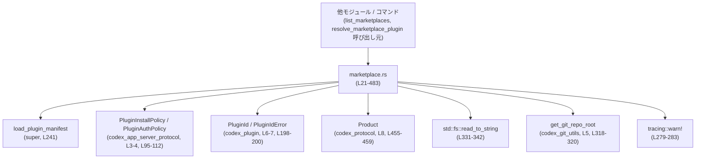
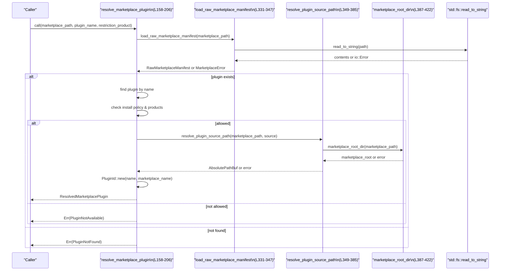
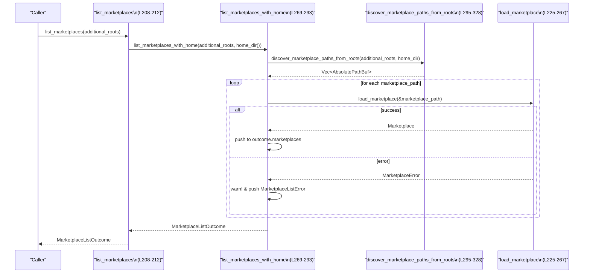

# core/src/plugins/marketplace.rs コード解説

## 0. ざっくり一言

ローカルディスク上の `marketplace.json` を読み取り、**マーケットプレースとそのプラグイン一覧を解決・検証・列挙するためのユーティリティモジュール**です。  
プラグインのインストール可否や認証ポリシー、プロダクト制限などのメタデータもここで扱います。

---

## 1. このモジュールの役割

### 1.1 概要

このモジュールは、**ローカルのマーケットプレース定義ファイル (`.agents/plugins/marketplace.json`) を読む**ことで、次のような機能を提供します。

- マーケットプレースファイルの読み込みと構造体 (`Marketplace`, `MarketplacePlugin`) への変換  
  （`load_marketplace`・`load_raw_marketplace_manifest`）  
- 複数のルートディレクトリからのマーケットプレース探索と一覧取得  
  （`list_marketplaces`）  
- ルートディレクトリが正しいマーケットプレース構造かの検証  
  （`validate_marketplace_root`）  
- 指定プラグインの有無・インストール可否・プロダクト制限をチェックして解決  
  （`resolve_marketplace_plugin`）

### 1.2 アーキテクチャ内での位置づけ

このモジュールは「core のプラグインサブシステム」の一部であり、次のコンポーネントと連携します。

- 上位モジュール: `super::load_plugin_manifest`, `super::PluginManifestInterface`（親モジュール側で定義。詳細はこのチャンクには現れません）`core/src/plugins/marketplace.rs:L1-2`
- 外部プロトコル型: `PluginInstallPolicy`, `PluginAuthPolicy`（アプリサーバープロトコル）`core/src/plugins/marketplace.rs:L3-4, L95-112`
- プラグインIDとプロダクト定義: `PluginId`, `Product` `core/src/plugins/marketplace.rs:L6-8, L198-200, L455-459`
- ファイルシステム・ホームディレクトリ・Git リポジトリルート探索 `core/src/plugins/marketplace.rs:L10-13, L295-325`
- ログ出力: `tracing::warn!` による読み込み失敗の通知 `core/src/plugins/marketplace.rs:L279-283`

依存関係を簡略化した図です。



### 1.3 設計上のポイント

- **純粋なデータ変換層**  
  - JSON から `RawMarketplaceManifest` 系の内部構造体へデシリアライズし、そこから公開用の `Marketplace` / `MarketplacePlugin` へ変換しています`core/src/plugins/marketplace.rs:L225-267, L425-466`。
- **厳格なパス検証**  
  - プラグインのローカルパスは `./` 始まりで、かつ `.` や `..` や絶対パスを含まないことを検証し、マーケットプレースルート外へのパストラバーサルを防いでいます`core/src/plugins/marketplace.rs:L349-383`。
- **マーケットプレース位置の制約**  
  - `marketplace.json` は `<root>/.agents/plugins/marketplace.json` の位置にあることを強制し、それ以外は `InvalidMarketplaceFile` として扱います`core/src/plugins/marketplace.rs:L387-422`。
- **エラーの明示的な分類**  
  - IO エラー・JSON 不正・プラグイン未発見・インストール不可・プラグインID不正などを `MarketplaceError` として区別します`core/src/plugins/marketplace.rs:L114-148`。
- **キャッシュ非使用（常にディスク読み込み）**  
  - `resolve_marketplace_plugin` のコメントにあるとおり、マーケットプレースファイルは毎回ディスクから読み込み、インメモリキャッシュは使っていません`core/src/plugins/marketplace.rs:L156-163`。
- **同期処理のみ**  
  - 非同期 (`async`) やスレッドは使っておらず、すべて同期的な関数で構成されています。

---

## 2. 主要な機能一覧

- マーケットプレースファイルの読み込みとパース: `load_raw_marketplace_manifest`, `load_marketplace`
- 指定プラグインの解決とインストール可否チェック: `resolve_marketplace_plugin`
- マーケットプレースルートの検証（`<root>/.agents/plugins/marketplace.json` の存在・妥当性確認）: `validate_marketplace_root`
- ホームディレクトリおよび追加ルートからのマーケットプレース探索と一覧取得: `list_marketplaces`
- プラグイン ローカルソースパスの検証・解決: `resolve_plugin_source_path`
- マーケットプレース インターフェース情報の解決（display_name のみ）: `resolve_marketplace_interface`

---

## 3. 公開 API と詳細解説

### 3.1 型一覧（コンポーネントインベントリー: 型）

| 名前 | 種別 | 公開範囲 | 行範囲 | 役割 / 用途 |
|------|------|----------|--------|-------------|
| `ResolvedMarketplacePlugin` | 構造体 | `pub` | `core/src/plugins/marketplace.rs:L21-26` | プラグインID・実際のソースパス・認証ポリシーをまとめた解決済みプラグイン情報 |
| `Marketplace` | 構造体 | `pub` | `L28-34` | 単一マーケットプレースの名前・パス・インターフェース・プラグイン一覧を表す |
| `MarketplaceListError` | 構造体 | `pub` | `L36-40` | マーケットプレース一覧取得時に個々のマーケットプレース読み込みに失敗した際のエラー情報 |
| `MarketplaceListOutcome` | 構造体 | `pub` | `L42-46` | 成功したマーケットプレース一覧と、読み込みに失敗したエラー一覧を同時に保持 |
| `MarketplaceInterface` | 構造体 | `pub` | `L48-51` | マーケットプレース自体の表示名（任意）を保持 |
| `MarketplacePlugin` | 構造体 | `pub` | `L53-59` | マーケットプレース内の単一プラグインを表す（名前・ソース・ポリシー・インターフェース） |
| `MarketplacePluginSource` | enum | `pub` | `L61-64` | プラグインのソース種別（現状はローカルパスのみ） |
| `MarketplacePluginPolicy` | 構造体 | `pub` | `L66-73` | プラグインのインストールポリシー・認証ポリシー・プロダクト制限をまとめる |
| `MarketplacePluginInstallPolicy` | enum | `pub` | `L75-84` | プラグインのインストール可否（利用不可 / 利用可能 / デフォルトインストール） |
| `MarketplacePluginAuthPolicy` | enum | `pub` | `L86-93` | 認証がインストール時か利用時かを表す |
| `MarketplaceError` | enum | `pub` | `L114-148` | このモジュール全体で発生しうるエラーを表現 |
| `RawMarketplaceManifest` | 構造体 | private | `L425-431` | JSON のマーケットプレースルートに対応する内部用構造体 |
| `RawMarketplaceManifestInterface` | 構造体 | private | `L434-439` | JSON 版のマーケットプレースインターフェース |
| `RawMarketplaceManifestPlugin` | 構造体 | private | `L441-449` | JSON 版のプラグイン要素 |
| `RawMarketplaceManifestPluginPolicy` | 構造体 | private | `L452-459` | JSON 版のプラグインポリシー |
| `RawMarketplaceManifestPluginSource` | enum | private | `L462-466` | JSON 版のプラグインソース（タグ付き enum） |

### 3.1.1 コンポーネントインベントリー: 関数 / impl

| 名前 | 種別 | 公開範囲 | 行範囲 | 役割 |
|------|------|----------|--------|------|
| `impl From<MarketplacePluginInstallPolicy> for PluginInstallPolicy` | impl | `pub` (トレイト) | `L95-103` | 内部ポリシーを外部プロトコルの `PluginInstallPolicy` に変換 |
| `impl From<MarketplacePluginAuthPolicy> for PluginAuthPolicy` | impl | `pub` (トレイト) | `L105-112` | 内部ポリシーを外部プロトコルの `PluginAuthPolicy` に変換 |
| `MarketplaceError::io` | 関数（関連メソッド） | private | `L150-154` | IO エラー用のヘルパーコンストラクタ |
| `resolve_marketplace_plugin` | 関数 | `pub` | `L158-206` | 指定マーケットプレースとプラグイン名から、解決済みプラグイン情報を返す |
| `list_marketplaces` | 関数 | `pub` | `L208-212` | 追加ルートとホームディレクトリからマーケットプレース一覧を構築 |
| `validate_marketplace_root` | 関数 | `pub` | `L214-223` | 指定ルートが正しいマーケットプレース構造か検証し、名前を返す |
| `load_marketplace` | 関数 | `pub(crate)` | `L225-267` | 単一マーケットプレースファイルを読み込み、`Marketplace` に変換 |
| `list_marketplaces_with_home` | 関数 | private | `L269-293` | ホームディレクトリを含めたマーケットプレース列挙の実装本体 |
| `discover_marketplace_paths_from_roots` | 関数 | private | `L295-328` | ホーム＋追加ルート＋Git ルートから `marketplace.json` のパス候補を列挙 |
| `load_raw_marketplace_manifest` | 関数 | private | `L331-347` | JSON ファイルを読み込み `RawMarketplaceManifest` にデシリアライズ |
| `resolve_plugin_source_path` | 関数 | private | `L349-385` | JSON のローカルプラグインパスを検証し、絶対パスに解決 |
| `marketplace_root_dir` | 関数 | private | `L387-422` | `marketplace.json` のパスからマーケットプレースルート (`<root>`) を求める |
| `resolve_marketplace_interface` | 関数 | private | `L468-478` | JSON 版インターフェースから公開用インターフェースを組み立てる |

---

### 3.2 関数詳細（主要 API・コアロジック）

#### `resolve_marketplace_plugin(marketplace_path: &AbsolutePathBuf, plugin_name: &str, restriction_product: Option<Product>) -> Result<ResolvedMarketplacePlugin, MarketplaceError>`（L158-206）

**概要**

指定されたマーケットプレースファイルからプラグインを検索し、  

- プラグインが存在するか  
- インストール可能か（ポリシー）  
- 指定された `restriction_product` とプロダクト制限が一致するか  
をチェックしたうえで、解決済みの `ResolvedMarketplacePlugin` を返します`core/src/plugins/marketplace.rs:L158-205`。

**引数**

| 引数名 | 型 | 説明 |
|--------|----|------|
| `marketplace_path` | `&AbsolutePathBuf` | 読み込むマーケットプレース JSON ファイルの絶対パス（`<root>/.agents/plugins/marketplace.json` を指す想定） |
| `plugin_name` | `&str` | 検索対象のプラグイン名（マーケットプレース内で一意） |
| `restriction_product` | `Option<Product>` | プラグインが許可されるプロダクト。`Some` の場合のみプロダクト制限を適用し、`None` の場合はすべて許可 |

**戻り値**

- `Ok(ResolvedMarketplacePlugin)`  
  プラグインID・ソースパス・認証ポリシーを含む解決済みプラグイン情報。
- `Err(MarketplaceError)`  
  - `MarketplaceNotFound` / `InvalidMarketplaceFile`: マーケットプレースファイルの読み込み・パースに失敗した場合`L331-347`。
  - `PluginNotFound`: 指定名のプラグインが存在しない場合`L170-175`。
  - `PluginNotAvailable`: インストール不可ポリシーか、プロダクト制限により禁止されている場合`L191-196`。
  - `InvalidPlugin`: `PluginId::new` によるプラグインID生成が失敗した場合`L198-200`。

**内部処理の流れ**

1. `load_raw_marketplace_manifest(marketplace_path)` で JSON を読み込み `RawMarketplaceManifest` に変換`L163, L331-347`。
2. `marketplace.plugins` から `plugin_name` に一致するプラグインを検索`L165-168`。見つからなければ `PluginNotFound` を返す`L170-175`。
3. 見つかったプラグインから `name`, `source`, `policy` を取り出す`L177-182`。
4. インストールポリシーとプロダクト制限を評価`L183-190`:
   - `policy.products` が `None` の場合は無条件に許可。
   - `Some([])` の場合は常に不許可。
   - `Some(products)` の場合、`restriction_product` が `Some` かつ `matches_product_restriction` によって許可されるかどうかを判定。
5. インストールポリシーが `NotAvailable` または `product_allowed == false` の場合、`PluginNotAvailable` を返す`L191-196`。
6. `PluginId::new(name, marketplace_name)` でプラグインIDを生成し、`PluginIdError::Invalid` を `MarketplaceError::InvalidPlugin` に変換`L198-200`。
7. `resolve_plugin_source_path` でプラグインのローカルソースパスを絶対パスに解決`L203-204, L349-385`。
8. 以上を `ResolvedMarketplacePlugin` として返す`L201-205`。

**Examples（使用例）**

マーケットプレースから特定プラグインを解決し、そのパスを取得する例です。

```rust
use codex_utils_absolute_path::AbsolutePathBuf;
use codex_protocol::protocol::Product;
use crate::plugins::marketplace::{
    resolve_marketplace_plugin, MarketplaceError, ResolvedMarketplacePlugin,
};

fn install_plugin_example() -> Result<(), MarketplaceError> {
    // ルートディレクトリ（AbsolutePathBuf）はプロジェクト側で用意していると仮定
    let marketplace_path = AbsolutePathBuf::try_from(
        "/path/to/root/.agents/plugins/marketplace.json"
    ).expect("absolute path");

    // ここでは Product 制限なしで解決
    let resolved: ResolvedMarketplacePlugin =
        resolve_marketplace_plugin(&marketplace_path, "my-plugin", None)?;

    println!("Plugin ID: {}", resolved.plugin_id);
    println!("Source path: {}", resolved.source_path);

    // resolved.source_path を使ってインストール処理を行う（別モジュールの責務）
    Ok(())
}
```

**Errors / Panics**

- この関数内に `panic!` や `unwrap` はなく、すべて `Result` によるエラーハンドリングです。
- 主な `Err`:
  - ファイルが存在しない / 読めない / JSON として不正 → `MarketplaceNotFound` / `InvalidMarketplaceFile` `L331-347`。
  - プラグインが存在しない → `PluginNotFound` `L170-175`。
  - プラグインがインストール不可 or プロダクト制限で禁止 → `PluginNotAvailable` `L191-196`。
  - プラグイン名から合法な `PluginId` を生成できない → `InvalidPlugin` `L198-200`。

**Edge cases（エッジケース）**

- `policy.products` が `None` のプラグインは、どの `restriction_product` に対しても許可されます`L184-185`。
- `policy.products` が `Some([])`（空配列）の場合、どのプロダクトからもインストール不可になります`L186`。
- `restriction_product` が `None` の場合、`policy.products` に関する制限は無視されます（`None => true`）`L184-185`。
- マーケットプレース JSON 内に同名プラグインが複数ある場合の挙動は、`into_iter().find(...)` により最初に見つかったものが使われます`L165-168`。

**使用上の注意点**

- `marketplace_path` は `AbsolutePathBuf` であり、`<root>/.agents/plugins/marketplace.json` であることが前提です。そうでない場合は `InvalidMarketplaceFile` を返す可能性があります（`marketplace_root_dir` 判定で失敗）`L387-422`。
- ここではプラグインの「インストール動作」までは行わず、あくまで **メタデータとパスの解決** に限定されています。
- 複数スレッドから同時に呼び出すことは可能ですが、裏側ではファイル読み込みが行われるため、同一ファイルに対する同時更新がある環境では TOCTOU 的な問題（読み込み中にファイル内容が変わる可能性）がある点には注意が必要です。

---

#### `list_marketplaces(additional_roots: &[AbsolutePathBuf]) -> Result<MarketplaceListOutcome, MarketplaceError>`（L208-212）

**概要**

ホームディレクトリと、追加で指定されたルートディレクトリ群から `marketplace.json` を探索し、  
読み込めたマーケットプレースを一覧として返します`core/src/plugins/marketplace.rs:L208-212, L269-293, L295-328`。  
読み込みに失敗したマーケットプレースについても、エラー情報を `MarketplaceListOutcome.errors` に蓄積します。

**引数**

| 引数名 | 型 | 説明 |
|--------|----|------|
| `additional_roots` | `&[AbsolutePathBuf]` | 追加で探索対象とするルートディレクトリ（各ルートの直下および Git リポジトリルート以下で `marketplace.json` を探します） |

**戻り値**

- `Ok(MarketplaceListOutcome)`  
  - `marketplaces`: 読み込みに成功した `Marketplace` の一覧。
  - `errors`: 失敗したマーケットプレースごとの `MarketplaceListError`（パスとエラーメッセージ）。
- `Err(MarketplaceError)`  
  - `list_marketplaces_with_home` 内で発生しうるエラーですが、実装を見ると `discover_marketplace_paths_from_roots` はエラーを返さないため、実質的に `Err` になるケースはほとんどありません`L269-293`。

**内部処理の流れ**

1. `dirs::home_dir()` からホームディレクトリを取得し、`Option<&Path>` に変換`L211`。
2. `list_marketplaces_with_home(additional_roots, home_dir().as_deref())` を呼び出し`L211, L269-293`。
3. `list_marketplaces_with_home` 内で:
   - `discover_marketplace_paths_from_roots` により探索パスを列挙`L275-276, L295-328`。
   - 各パスに対して `load_marketplace` を呼び、成功したものを `outcome.marketplaces` に push`L275-277, L225-267`。
   - 失敗したものは `tracing::warn!` でログ出力しつつ `outcome.errors` に記録`L278-287`。

**Examples（使用例）**

```rust
use codex_utils_absolute_path::AbsolutePathBuf;
use crate::plugins::marketplace::{list_marketplaces, MarketplaceError};

fn list_all_marketplaces_example() -> Result<(), MarketplaceError> {
    // 追加ルート：Git リポジトリなどを想定
    let repo_root = AbsolutePathBuf::try_from("/path/to/repo")
        .expect("absolute repo root");
    let outcome = list_marketplaces(&[repo_root])?;

    for marketplace in &outcome.marketplaces {
        println!("Marketplace: {} ({})",
            marketplace.name,
            marketplace.path,
        );
        for plugin in &marketplace.plugins {
            println!("  - Plugin: {}", plugin.name);
        }
    }

    // 読み込めなかったマーケットプレースも確認可能
    for error in &outcome.errors {
        eprintln!("Failed marketplace at {}: {}",
            error.path, error.message);
    }

    Ok(())
}
```

**Errors / Panics**

- `list_marketplaces` 自体は `home_dir()` が `None` の場合でも問題なく動作し（ホームを探索しないだけ）、パニックはしません`L269-308`。
- 各 `load_marketplace` 呼び出しのエラーは `MarketplaceListOutcome.errors` に格納されて **集約** されるため、通常は `list_marketplaces` 全体としての `Err` にはなりません`L275-292`。

**Edge cases**

- ホームディレクトリが取得できない場合: ホーム由来のマーケットプレースは探索されませんが、追加ルートの探索は行われます`L301-308`。
- 追加ルートが存在しない / `marketplace.json` がない場合: そのルートは単にスキップされます`L310-327`。
- 同じ `marketplace.json` が複数の経路から見つかった場合: `paths.contains(&path)` により重複を避けています`L314-315, L321-323`。

**使用上の注意点**

- `additional_roots` の各要素は `AbsolutePathBuf` であり、既存のディレクトリであることが望ましいですが、存在しなくても致命的にはなりません（単にファイルが見つからないだけです）。
- 読み込み失敗があっても、成功したマーケットプレース情報は得られる設計になっており、「一部壊れていても全体を止めない」という振る舞いになっています。

---

#### `validate_marketplace_root(root: &Path) -> Result<String, MarketplaceError>`（L214-223）

**概要**

任意のルートパスから `<root>/.agents/plugins/marketplace.json` を組み立て、  
そのファイルが妥当なマーケットプレースかどうかを検証し、マーケットプレース名を返します`core/src/plugins/marketplace.rs:L214-223`。

**引数**

| 引数名 | 型 | 説明 |
|--------|----|------|
| `root` | `&Path` | マーケットプレースルート候補 (`<root>` を指すパス)。絶対パスであることが期待されます。 |

**戻り値**

- `Ok(String)`  
  マーケットプレース名（`RawMarketplaceManifest.name` → `Marketplace.name`）`L221-222, L261-263`。
- `Err(MarketplaceError)`  
  - `InvalidMarketplaceFile`: `root.join(MARKETPLACE_RELATIVE_PATH)` が `AbsolutePathBuf` に変換できない場合、または `marketplace.json` 内容が不正な場合`L215-220, L331-347`。
  - `MarketplaceNotFound`: ファイルが存在しない場合`L335-338`。

**内部処理の流れ**

1. `root.join(MARKETPLACE_RELATIVE_PATH)` で `<root>/.agents/plugins/marketplace.json` を作成`L215-217`。
2. `AbsolutePathBuf::try_from(...)` で絶対パスに変換し、失敗した場合は `InvalidMarketplaceFile` を返す`L215-220`。
3. `load_marketplace(&path)` でマーケットプレースを読み込み`L221, L225-267`。
4. `marketplace.name` を返す`L221-222`。

**使用例**

```rust
use std::path::Path;
use crate::plugins::marketplace::{validate_marketplace_root, MarketplaceError};

fn validate_root_example() -> Result<(), MarketplaceError> {
    let root = Path::new("/path/to/root");
    let name = validate_marketplace_root(root)?;
    println!("Marketplace name: {}", name);
    Ok(())
}
```

**Errors / Panics**

- `root` が相対パスなどで `AbsolutePathBuf::try_from` に失敗すると `InvalidMarketplaceFile` になります`L215-220`。
- 実際の読み込みは `load_marketplace` → `load_raw_marketplace_manifest` → `fs::read_to_string` を通じて行われ、ここでの IO エラーも `MarketplaceError` にラップされます`L225-227, L331-347`。

**Edge cases**

- `root` が存在しないディレクトリでも、`marketplace.json` がそこに存在しない限り `MarketplaceNotFound` として扱われます（`read_to_string` が `NotFound` になる）`L334-339`。

**使用上の注意点**

- 主に「コマンドライン引数で渡されたルートがマーケットプレースかどうか」を検証するのに適した関数です。
- 実際にプラグイン一覧等を利用する場合は、別途 `load_marketplace` や `list_marketplaces` を使う必要があります。

---

#### `load_marketplace(path: &AbsolutePathBuf) -> Result<Marketplace, MarketplaceError>`（L225-267）

**概要**

単一の `marketplace.json` からマーケットプレースを読み込み、  
公開用の `Marketplace` 構造体へ変換する中核関数です`core/src/plugins/marketplace.rs:L225-267`。

**引数**

| 引数名 | 型 | 説明 |
|--------|----|------|
| `path` | `&AbsolutePathBuf` | 解析対象の `marketplace.json` の絶対パス |

**戻り値**

- `Ok(Marketplace)`  
  プラグイン情報が `MarketplacePlugin` として組み立てられたマーケットプレース。
- `Err(MarketplaceError)`  
  - ファイル読み込み・JSON パース・パス解決が失敗した場合。

**内部処理の流れ**

1. `load_raw_marketplace_manifest(path)` で JSON を `RawMarketplaceManifest` に読み込む`L226-227, L331-347`。
2. `marketplace.plugins` をループし、各 `RawMarketplaceManifestPlugin` を処理`L229-259`。
3. 各プラグインについて:
   - `resolve_plugin_source_path(path, source)` でローカルソースパスを絶対パスに解決`L236-237, L349-385`。
   - `MarketplacePluginSource::Local { path: source_path.clone() }` を構築`L237-239`。
   - `load_plugin_manifest(source_path.as_path())` を呼びだし、`manifest.interface` を取得（Optional）`L240-241`。この関数の詳細はこのチャンクには現れません。
   - マーケットプレース JSON に `category` がある場合、プラグインマニフェスト側のカテゴリを上書き（マーケットプレース側が優先）`L242-247`。
   - `MarketplacePluginPolicy` にポリシーをコピーし、`MarketplacePlugin` を `plugins` ベクタに push`L249-258`。
4. 最後に `Marketplace { name, path: path.clone(), interface, plugins }` を構築し返す`L261-266`。

**Examples（使用例）**

```rust
use codex_utils_absolute_path::AbsolutePathBuf;
use crate::plugins::marketplace::{load_marketplace, Marketplace, MarketplaceError};

fn load_single_marketplace_example() -> Result<(), MarketplaceError> {
    let path = AbsolutePathBuf::try_from(
        "/path/to/root/.agents/plugins/marketplace.json"
    ).expect("absolute path");

    let marketplace: Marketplace = load_marketplace(&path)?;
    println!("Marketplace: {}", marketplace.name);
    println!("Plugins: {}", marketplace.plugins.len());
    Ok(())
}
```

**Errors / Panics**

- エラーはすべて `MarketplaceError` で返されます。
  - JSON パースエラー → `InvalidMarketplaceFile` `L343-346`。
  - ローカルソースパスが不正（`./` で始まらない、空、`..` を含むなど） → `InvalidMarketplaceFile`（`resolve_plugin_source_path` 内）`L353-377`。
  - `marketplace.json` が `<root>/.agents/plugins/` 直下にない場合 → `InvalidMarketplaceFile`（`marketplace_root_dir` 内）`L387-422`。
- `load_plugin_manifest` の失敗時の扱いはこのチャンクには現れません（戻り値の型が不明）。ただし `and_then(|manifest| manifest.interface)` を使っていることから、`Option` または `Result` 経由で `interface` を取得していると推測できます`L240-241`。詳細な挙動はコードからは断定できません。

**Edge cases**

- プラグインマニフェストにカテゴリが書いてあっても、マーケットプレース JSON にカテゴリがある場合は後者が優先されます`L242-247`。
- インターフェース情報（`PluginManifestInterface`）が取得できなかった場合は `None` のままになり、呼び出し側で null-safe に扱う必要があります`L240-241, L257-258`。

**使用上の注意点**

- `path` は必ず `AbsolutePathBuf` であり、`marketplace_root_dir` の検証に通る必要があります。
- プラグイン数が多い場合、`load_plugin_manifest` をプラグインごとに呼ぶため、読み込みコストが比例して増加します。頻繁に呼ぶ場合は、上位レイヤでキャッシュを検討することができます（このモジュール自体はキャッシュを持ちません）。

---

#### `discover_marketplace_paths_from_roots(additional_roots: &[AbsolutePathBuf], home_dir: Option<&Path>) -> Vec<AbsolutePathBuf>`（L295-328）

**概要**

ホームディレクトリと追加ルート群から `marketplace.json` の存在するパスを探索し、重複を除いて列挙します`core/src/plugins/marketplace.rs:L295-328`。

**引数**

| 引数名 | 型 | 説明 |
|--------|----|------|
| `additional_roots` | `&[AbsolutePathBuf]` | 追加探索ルートのリスト |
| `home_dir` | `Option<&Path>` | ホームディレクトリ。`None` の場合はホーム探索をスキップ |

**戻り値**

- `Vec<AbsolutePathBuf>`: 見つかった全 `marketplace.json` の絶対パス（重複なし）。

**内部処理の流れ**

1. 空の `paths: Vec<AbsolutePathBuf>` を用意`L299`。
2. ホームディレクトリがある場合:
   - `home.join(MARKETPLACE_RELATIVE_PATH)` を作成し`L302`。
   - それがファイルであれば `AbsolutePathBuf::try_from` により絶対パスへ変換し `paths` に追加`L303-307`。
3. 各 `additional_roots` について:
   - `<root>/.agents/plugins/marketplace.json` を直接チェックし、ファイルがあれば `paths` に追加（重複は除外）`L313-317`。
   - それ以外の場合、`get_git_repo_root(root.as_path())` で Git ルートを探し`L318-320`。
   - Git ルートが見つかれば、そこから同様に `<repo_root>/.agents/plugins/marketplace.json` をチェックし、存在すれば `paths` に追加（重複除外）`L321-323`。
4. `paths` を返す`L328`。

**Errors / Panics**

- この関数は `Result` ではなく、失敗する操作は内部で丸め込まれています。
- `AbsolutePathBuf::try_from` が失敗した場合は `if let Ok(path)` でスキップされるため、パニックせずに単に候補から除外されます`L303-307`。

**使用上の注意点**

- Git ルート探索は `get_git_repo_root` に委譲されており、その実装次第で挙動が変わりますが、このチャンクには現れません。
- 同じファイルがホーム・追加ルート・Git ルートから複数回見つかっても、`paths.contains(&path)` により重複が防がれます`L314-315, L321-323`。

---

#### `load_raw_marketplace_manifest(path: &AbsolutePathBuf) -> Result<RawMarketplaceManifest, MarketplaceError>`（L331-347）

**概要**

`marketplace.json` を文字列として読み込み、`serde_json::from_str` により内部用の `RawMarketplaceManifest` にデシリアライズします`core/src/plugins/marketplace.rs:L331-347`。

**引数**

| 引数名 | 型 | 説明 |
|--------|----|------|
| `path` | `&AbsolutePathBuf` | マニフェスト JSON ファイルの絶対パス |

**戻り値**

- `Ok(RawMarketplaceManifest)`  
  JSON から構造体に変換されたマーケットプレース定義。
- `Err(MarketplaceError)`  
  IO エラーまたは JSON パースエラー。

**内部処理の流れ**

1. `fs::read_to_string(path.as_path())` でファイルを読み込み`L334`。
2. エラーが `io::ErrorKind::NotFound` の場合は `MarketplaceNotFound { path }` にマップ`L335-338`。
3. それ以外の IO エラーは `MarketplaceError::io("failed to read marketplace file", err)` にマップ`L339-341, L150-154`。
4. 読み込んだ文字列を `serde_json::from_str` でパースし、失敗すれば `InvalidMarketplaceFile { path, message }` にマップ`L343-346`。

**使用上の注意点**

- 読み込むファイルは UTF-8 系列を前提としており、`from_str` でパースできない形式の JSON だと `InvalidMarketplaceFile` になります。
- ファイルの存在チェックを別に行っておらず、`read_to_string` のエラー種別で NotFound を識別する設計になっています`L334-341`。

---

#### `resolve_plugin_source_path(marketplace_path: &AbsolutePathBuf, source: RawMarketplaceManifestPluginSource) -> Result<AbsolutePathBuf, MarketplaceError>`（L349-385）

**概要**

プラグインのローカルソースパス（JSON）を、  

- `./` から始まる相対パスであること  
- `..` や `.` などを含まずマーケットプレースルートを超えないこと  
を検証した上で、絶対パスに変換する関数です`core/src/plugins/marketplace.rs:L349-385`。

**引数**

| 引数名 | 型 | 説明 |
|--------|----|------|
| `marketplace_path` | `&AbsolutePathBuf` | 対応する `marketplace.json` の絶対パス |
| `source` | `RawMarketplaceManifestPluginSource` | JSON からデシリアライズしたプラグインソース（現状 `Local { path: String }` のみ） |

**戻り値**

- `Ok(AbsolutePathBuf)`  
  `<root>` からの絶対パスに解決されたプラグインソースパス。
- `Err(MarketplaceError::InvalidMarketplaceFile)`  
  ソースパスが不正な場合。

**内部処理の流れ**

1. `RawMarketplaceManifestPluginSource::Local { path }` をパターンマッチで展開`L353-354`。
2. `path.strip_prefix("./")` を使って `./` の有無をチェックし、なければ `InvalidMarketplaceFile`（"must start with `./`"）を返す`L355-360`。
3. `path` が空文字列なら `InvalidMarketplaceFile`（"must not be empty"）を返す`L361-365`。
4. `Path::new(path)` から `relative_source_path` を作り、`components()` を走査して `Component::Normal(_)` 以外が含まれていないか確認`L368-372`。  
   - `..` や `.`、`RootDir` などが含まれていると `InvalidMarketplaceFile`（"must stay within the marketplace root"）を返す`L373-377`。
5. `marketplace_root_dir(marketplace_path)?` でマーケットプレースルート `<root>` を取得`L382, L387-422`。
6. `<root>.join(relative_source_path)` でプラグインの絶対パスを構築し `Ok` で返す`L382`。

**Security / Safety 上のポイント**

- `strip_prefix("./")` と `components()` による検証により、  
  **マーケットプレースルートの外部ファイルを指す相対パス（例: `"../.."`）を拒否** しています`L355-377`。
- これにより、マーケットプレース JSON による任意ファイルアクセスのリスクが軽減されています。

**使用上の注意点**

- 新たなソース種別（例: Git URL, HTTP URL）を追加する場合は、`RawMarketplaceManifestPluginSource` とこの関数の `match` を拡張する必要があります`L462-466, L353-384`。
- `marketplace_root_dir` の実装によって `<root>` の定義が固定されているため、`marketplace.json` の置き場所を変えたい場合はそちらも変更する必要があります`L387-422`。

---

#### `marketplace_root_dir(marketplace_path: &AbsolutePathBuf) -> Result<AbsolutePathBuf, MarketplaceError>`（L387-422）

**概要**

`marketplace.json` の絶対パスから `<root>/.agents/plugins/marketplace.json` という構造を前提に、  
`<root>` となるディレクトリを返します`core/src/plugins/marketplace.rs:L387-422`。

**内部処理の流れ**

1. `plugins_dir = marketplace_path.parent()` を取得し、無ければエラー`L390-395`。
2. `dot_agents_dir = plugins_dir.parent()` を取得し、無ければエラー`L396-400`。
3. `marketplace_root = dot_agents_dir.parent()` を取得し、無ければエラー`L402-407`。
4. `plugins_dir` のディレクトリ名が `"plugins"` であることを確認`L409-410`。
5. `dot_agents_dir` のディレクトリ名が `".agents"` であることを確認`L410-415`。
6. いずれかが一致しなければ `InvalidMarketplaceFile`（"must live under `<root>/.agents/plugins/`"）を返す`L416-419`。
7. 条件を満たせば `Ok(marketplace_root)` を返す`L422`。

**使用上の注意点**

- `marketplace.json` の場所は固定的に `<root>/.agents/plugins/marketplace.json` と決め打ちしており、  
  他の場所からこの関数を呼ぶと必ず `InvalidMarketplaceFile` になります。
- ルートディレクトリ構成の契約として、このディレクトリ構造を守る必要があります。

---

### 3.3 その他の関数・補助 API

| 関数名 | 行範囲 | 役割（1 行） |
|--------|--------|--------------|
| `MarketplaceError::io` | `L150-154` | IO エラーを `"context: source"` 形式のメッセージでラップするヘルパー |
| `list_marketplaces_with_home` | `L269-293` | ホームディレクトリを含めたマーケットプレース一覧処理の共通実装 |
| `resolve_marketplace_interface` | `L468-478` | `RawMarketplaceManifestInterface` から `MarketplaceInterface` を生成（display_name が無ければ `None`） |
| `impl From<MarketplacePluginInstallPolicy>` | `L95-103` | 外部の `PluginInstallPolicy` 型へ値を対応付ける |
| `impl From<MarketplacePluginAuthPolicy>` | `L105-112` | 外部の `PluginAuthPolicy` 型へ値を対応付ける |

---

## 4. データフロー

ここでは代表的な 2 つのシナリオについて、データの流れを示します。

### 4.1 プラグイン解決フロー（`resolve_marketplace_plugin`）

`resolve_marketplace_plugin` で指定プラグインを解決する際の呼び出し関係です。



### 4.2 マーケットプレース一覧取得フロー（`list_marketplaces`）



---

## 5. 使い方（How to Use）

### 5.1 基本的な使用方法

典型的なフローは次のようになります。

1. 追加ルート（プロジェクトルート等）を `AbsolutePathBuf` で用意。
2. `list_marketplaces` でマーケットプレース一覧を取得。
3. 必要なマーケットプレースを選び、その `path` を使って `resolve_marketplace_plugin` でプラグインを解決。

```rust
use codex_utils_absolute_path::AbsolutePathBuf;
use codex_protocol::protocol::Product;
use crate::plugins::marketplace::{
    list_marketplaces, resolve_marketplace_plugin,
    MarketplaceError, ResolvedMarketplacePlugin,
};

fn main_flow_example() -> Result<(), MarketplaceError> {
    // 1. 追加ルートを指定（例: Git リポジトリのルート）
    let project_root = AbsolutePathBuf::try_from("/path/to/project")
        .expect("absolute project root");

    // 2. マーケットプレース一覧を取得
    let outcome = list_marketplaces(&[project_root])?;
    if outcome.marketplaces.is_empty() {
        eprintln!("No marketplaces found");
        return Ok(());
    }

    // 3. 最初のマーケットプレースから特定プラグインを解決
    let marketplace = &outcome.marketplaces[0];
    let plugin = resolve_marketplace_plugin(
        &marketplace.path,
        "my-plugin",
        Some(Product::default()), // Product の詳細はこのチャンクには現れません
    )?;

    println!(
        "Resolved plugin {} at {}",
        plugin.plugin_id, plugin.source_path
    );
    Ok(())
}
```

※ `Product::default()` 等の具体的なコンストラクタは、このチャンクには現れないため疑似コードです。

### 5.2 よくある使用パターン

1. **ルートディレクトリの事前検証＋読み込み**

```rust
use std::path::Path;
use codex_utils_absolute_path::AbsolutePathBuf;
use crate::plugins::marketplace::{
    validate_marketplace_root, load_marketplace, MarketplaceError,
};

fn load_if_valid(root: &Path) -> Result<(), MarketplaceError> {
    // まず root がマーケットプレースかどうか検証
    let name = validate_marketplace_root(root)?;
    println!("Valid marketplace root: {name}");

    // 検証と同じパスから marketplace.json を読み込む
    let path = AbsolutePathBuf::try_from(
        root.join(".agents/plugins/marketplace.json")
    ).expect("absolute marketplace path");

    let marketplace = load_marketplace(&path)?;
    println!("Loaded {} plugins", marketplace.plugins.len());
    Ok(())
}
```

1. **エラーを無視して「使えるものだけ」列挙**

```rust
use codex_utils_absolute_path::AbsolutePathBuf;
use crate::plugins::marketplace::{list_marketplaces, MarketplaceError};

fn list_only_successful() -> Result<(), MarketplaceError> {
    let roots: Vec<AbsolutePathBuf> = vec![]; // 追加ルートなし
    let outcome = list_marketplaces(&roots)?;

    for m in &outcome.marketplaces {
        println!("OK marketplace: {}", m.name);
    }

    // outcome.errors に何らかの失敗があってもここでは無視
    Ok(())
}
```

### 5.3 よくある間違い

```rust
use std::path::Path;
use codex_utils_absolute_path::AbsolutePathBuf;
use crate::plugins::marketplace::{validate_marketplace_root, MarketplaceError};

// 間違い例: 相対パスの root をそのまま渡している
fn wrong_example() -> Result<(), MarketplaceError> {
    let root = Path::new("relative/path"); // 相対パス
    // ↓ AbsolutePathBuf::try_from が失敗し、InvalidMarketplaceFile になる可能性が高い
    let _ = validate_marketplace_root(root)?;
    Ok(())
}

// 正しい例: 絶対パスに解決してから渡す
fn correct_example() -> Result<(), MarketplaceError> {
    let root = std::env::current_dir()?.join("relative/path");
    let root_abs = root.canonicalize()?; // OS 依存だが、一般に絶対パスを得られる
    let _name = validate_marketplace_root(&root_abs)?;
    Ok(())
}
```

```rust
use codex_utils_absolute_path::AbsolutePathBuf;
use crate::plugins::marketplace::{resolve_marketplace_plugin, MarketplaceError};

// 間違い例: marketplace.json ではなくルートディレクトリを渡している
fn wrong_resolve_example(root: AbsolutePathBuf) -> Result<(), MarketplaceError> {
    // root は `<root>` だが、resolve_marketplace_plugin は marketplace.json のパスを期待する
    let _ = resolve_marketplace_plugin(&root, "plugin-name", None)?; // 誤用
    Ok(())
}

// 正しい例: `<root>/.agents/plugins/marketplace.json` を作って渡す
fn correct_resolve_example(root: AbsolutePathBuf) -> Result<(), MarketplaceError> {
    let marketplace_path = root.join(".agents/plugins/marketplace.json");
    let _ = resolve_marketplace_plugin(&marketplace_path, "plugin-name", None)?;
    Ok(())
}
```

### 5.4 使用上の注意点（まとめ）

- **パスの前提条件**
  - `resolve_marketplace_plugin`, `load_marketplace`, `load_raw_marketplace_manifest` などの関数は、`AbsolutePathBuf` で **完全修飾されたファイルパス** を前提としています。
- **ディレクトリ構成の契約**
  - `marketplace_root_dir` により、`marketplace.json` は必ず `<root>/.agents/plugins/marketplace.json` に置かれている必要があります`L387-422`。
- **プラグインソースのセキュリティ**
  - プラグインのローカルソースパスは `./` 始まりかつ `..` を含まないことが強制されており、これに反すると `InvalidMarketplaceFile` になります`L355-377`。
- **エラーの扱い**
  - `list_marketplaces` は「個々のマーケットプレース読み込みエラーを収集しつつ、成功したものは返す」設計のため、全体が失敗したかのように扱うと情報を取りこぼします。
- **並行性**
  - すべて同期的な関数であり、内部に共有可変状態は持たないため、複数スレッドから呼び出してもデータ競合は発生しません。ただし、同じファイルへの同時読み書きがある環境では、ファイル内容が変化するタイミングに依存する挙動になる可能性があります。

---

## 6. 変更の仕方（How to Modify）

### 6.1 新しい機能を追加する場合

**例: 新しいプラグインソース種別（例: Git リポジトリ）を追加したい場合**

1. **JSON 側の拡張**
   - `RawMarketplaceManifestPluginSource` に新たなバリアントを追加（例: `Git { url: String }`）`core/src/plugins/marketplace.rs:L462-466`。
2. **内部表現の拡張**
   - 公開用の `MarketplacePluginSource` にも対応するバリアントを追加`L61-64`。
3. **パス解決ロジックの追加**
   - `resolve_plugin_source_path` の `match` を拡張し、新バリアントに対する解決ロジック（URL 検証やクローン先ディレクトリ計算など）を追加`L353-384`。
4. **ロード処理の対応**
   - `load_marketplace` 内での `source` の扱いを更新し、新バリアントを `MarketplacePluginSource` にマッピング`L229-259`。
5. **テスト**
   - `marketplace_tests.rs`（`mod tests` で指定）に新ケースを追加することが推奨されます`L481-483`。テスト内容はこのチャンクには現れません。

### 6.2 既存の機能を変更する場合

- **影響範囲の確認**
  - `resolve_marketplace_plugin` を変更する場合は、プラグインのインストールポリシー・プロダクト制限ロジックに依存する上位コードを確認する必要があります`L183-190`。
  - `marketplace_root_dir` の挙動を変えると、すべてのパス解決に影響し、既存のマーケットプレースディレクトリ構成が無効になる可能性があります`L387-422`。
- **契約・前提条件の維持**
  - エラー型 `MarketplaceError` のバリアントを削除・変更すると、呼び出し側の `match` がコンパイルエラーになるため、慎重なリファクタリングが必要です`L114-148`。
  - プラグインソースパスの検証ロジックを緩めると、セキュリティ上のリスク（任意ファイルアクセス）が増える可能性があります`L355-377`。
- **テストとログ**
  - `tracing::warn!` によるログメッセージやエラーメッセージの文言変更は、上位のログ解析ツールに影響する場合があります`L279-283`。
  - 変更時には `marketplace_tests.rs` を確認し、必要に応じてテストケースを更新するのが望ましいですが、具体的なテスト内容はこのチャンクからは分かりません`L481-483`。

---

## 7. 関連ファイル

| パス / モジュール | 役割 / 関係 |
|------------------|------------|
| `core/src/plugins/marketplace_tests.rs` | `#[cfg(test)] mod tests;` で参照されるテストモジュール。マーケットプレースロジックのユニットテストが定義されていると推測されますが、このチャンクには内容は現れません`core/src/plugins/marketplace.rs:L481-483`。 |
| `core/src/plugins/mod.rs`（想定） | `use super::PluginManifestInterface;` や `load_plugin_manifest` が定義されている親モジュール。プラグインマニフェストのロード処理を提供しますが、このチャンクには定義が現れません`L1-2`。 |
| `codex_app_server_protocol` | `PluginInstallPolicy`, `PluginAuthPolicy` を定義する外部クレート。 このモジュールのポリシー enum からの `From` 実装で利用されます`L3-4, L95-112`。 |
| `codex_plugin` | `PluginId`, `PluginIdError` を提供し、プラグインIDの生成・検証に使用されます`L6-7, L198-200`。 |
| `codex_protocol::protocol::Product` | プロダクト制限の判定に用いられる型。`matches_product_restriction` メソッドの詳細はこのチャンクには現れません`L8, L184-190, L455-459`。 |
| `codex_utils_absolute_path::AbsolutePathBuf` | 絶対パスを表すユーティリティ型。マーケットプレースファイル・プラグインソースパスの安全な取り扱いに使われています`L9, L215-220, L295-307`。 |
| `codex_git_utils::get_git_repo_root` | 追加ルートから Git リポジトリルートを探索するために使用されます`L5, L318-320`。 |

---

### Bugs / Security 備考（このチャンクから読み取れる範囲）

- **Security 強化点**
  - ローカルプラグインパスの検証（`./` プレフィックスと `Component::Normal` チェック）により、マーケットプレース JSON から任意の絶対パスや上位ディレクトリを参照できないようにしています`L355-377`。
  - `marketplace_root_dir` によるパス構造の固定も、ファイルツリー外へのアクセス経路を制限する効果があります`L387-422`。
- **潜在的な注意点**
  - ファイルの存在チェック (`path.is_file()`) と `AbsolutePathBuf::try_from` / `load_marketplace` の呼び出しの間にレースコンディションがあり、ファイル削除等が行われると IO エラーになる可能性がありますが、これは通常の TOCTOU であり、エラーとしてハンドリングされています`L301-307, L334-341`。
  - `PluginsDisabled` エラーはこのモジュール内では使われておらず、他のモジュールから発生しうる契約上のエラーとして定義されていると考えられますが、具体的な使用箇所はこのチャンクには現れません`L143-144`。
