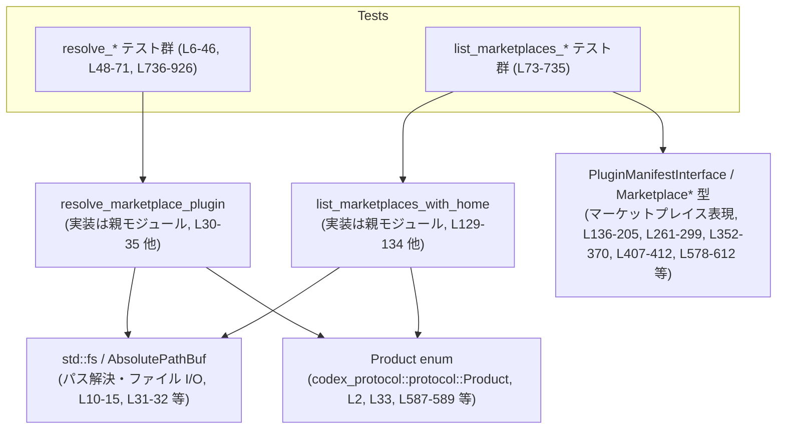
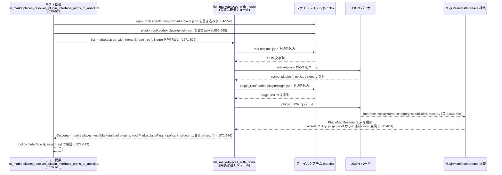

# core/src/plugins/marketplace_tests.rs

## 0. ざっくり一言

このファイルは、プラグイン・マーケットプレイス周りの公開 API  
`resolve_marketplace_plugin` と `list_marketplaces_with_home` の挙動を、  
実際の JSON ファイルとディレクトリ構造を用いて検証するテスト群です  
（`use super::*;` より、実装は親モジュールにあります。`core/src/plugins/marketplace_tests.rs:L1`）。

---

## 1. このモジュールの役割

### 1.1 概要

- このモジュールは、マーケットプレイス設定ファイル（`marketplace.json`）から
  - プラグインの解決（パス・ポリシー・利用可能な Product）  
  - マーケットプレイス一覧取得（home ディレクトリ + 各リポジトリ）
- に関する振る舞いとエラー処理の契約を、テストを通して定義しています  
  （例: `resolve_marketplace_plugin_finds_repo_marketplace_plugin` など `core/src/plugins/marketplace_tests.rs:L6-46`）。

### 1.2 アーキテクチャ内での位置づけ

このファイル自体はテスト専用であり、実装は親モジュールにあります（`use super::*;` `core/src/plugins/marketplace_tests.rs:L1`）。  
テストから見える依存関係は次のようになります。



> 行番号は `core/src/plugins/marketplace_tests.rs:Lxx-yy` を指します。

### 1.3 設計上のポイント（テストから読み取れる契約）

- **ファイルシステムを用いた実エンドツーエンド検証**  
  - `tempfile::tempdir` で一時ディレクトリを作成し（`L8, L50, L75, ...`）、`std::fs` により `.git` や `.agents/plugins/marketplace.json` を実際に作成してテストしています（例: `L10-15, L79-83`）。
- **JSON スキーマとデフォルト値の契約**  
  - `policy`、`interface`、`plugins[].source.path` などの JSON 構造と、その省略時のデフォルト挙動をテストで固定しています（例: `L544-548, L578-588, L623-637, L648-656`）。
- **安全なパス解決のルール**  
  - `source.path` は `"./"` で始まる相対パスのみを許可し、`"../"` や `"assets/icon.png"` 等は拒否または無視するというルールを検証しています  
    （`resolve_marketplace_plugin_rejects_non_relative_local_paths` `L736-771`、  
    `list_marketplaces_ignores_plugin_interface_assets_without_dot_slash` `L659-734`）。
- **Product ごとの利用可否**  
  - `policy.products` により、どの Product（`Product::Codex`, `Product::Chatgpt`, `Product::Atlas` 等）に対してプラグインが有効かを制御する契約をテストしています  
    （`L587-589, L823-852, L896-925`）。
- **エラー報告の内容とフォーマット**  
  - エラーメッセージ文字列を `assert_eq!` で検証しており、文字列内容まで含めて API 契約になっています  
    （例: プラグイン未発見 `L67-70`、不正パス `L764-770`、disallowed product `L849-852, L922-925`）。
  - `list_marketplaces_with_home` は、失敗したマーケットプレイスの `path` と `"invalid marketplace file"` を含む `message` を errors 配列に積むことが契約になっています（`L498-522`）。
- **リポジトリ単位の重複排除**  
  - 同一 Git リポジトリ内の複数の root パスから呼び出しても、マーケットプレイスは一件にまとまることを確認しています（`list_marketplaces_dedupes_multiple_roots_in_same_repo` `L314-371`）。

---

## 2. 主要な機能一覧（テストが対象とする機能）

テストから読み取れる、対象モジュールの主要機能を列挙します。

- マーケットプレイス内プラグイン解決 (`resolve_marketplace_plugin`)
  - 名前と Product に基づいてプラグインを選択し、パスと認証ポリシーを返す  
    （`L6-46, L48-71, L736-771, L773-814, L816-887, L889-925`）。
- プラグイン未定義時のエラー報告
  - 指定した `name` のプラグインが存在しない場合、わかりやすいエラーメッセージを返す  
    （`resolve_marketplace_plugin_reports_missing_plugin`, `L48-71`）。
- マーケットプレイス一覧の取得 (`list_marketplaces_with_home`)
  - 複数のリポジトリ root と任意の home ディレクトリから、利用可能なマーケットプレイス一覧を構築する  
    （`L73-207, L209-312, L314-371`）。
- 同名マーケットプレイスの区別
  - home と repo で同じ `"name"` を持つマーケットプレイスを、別エントリとして保持する  
    （`list_marketplaces_keeps_distinct_entries_for_same_name`, `L209-312`）。
- 同一リポジトリ内複数 root の重複排除
  - 同じ `.git` を共有する root を重複として扱い、マーケットプレイスを一つにまとめる  
    （`list_marketplaces_dedupes_multiple_roots_in_same_repo`, `L314-371`）。
- マーケットプレイス表示名の読み取り
  - `"interface.displayName"` を `MarketplaceInterface.display_name` に反映する  
    （`list_marketplaces_reads_marketplace_display_name`, `L381-412`）。
- マーケットプレイス読み込み失敗時のスキップ／エラー収集
  - 不正な marketplace.json（パス制約違反・JSON 不正など）をスキップしつつ、エラー情報を収集する  
    （`L415-470, L472-523`）。
- プラグインの policy と Product サポートの解釈
  - `"policy"` オブジェクトの `installation`・`authentication`・`products` を解析し、既定値も含めて `MarketplacePluginPolicy` に反映する  
    （`L544-548, L578-589, L623-637, L648-656, L669-681, L726-733`）。
- プラグインマニフェスト (`plugin.json`) の読み取りと interface マージ
  - プラグインごとの `.codex-plugin/plugin.json` から UI 用のメタ情報（displayName, capabilities, assets 等）を読み取り、マーケットプレイス定義と統合する  
    （`list_marketplaces_resolves_plugin_interface_paths_to_absolute` `L525-613`、  
      `list_marketplaces_ignores_plugin_interface_assets_without_dot_slash` `L659-734`）。
- ローカルプラグインパスの安全な制約
  - `source.path` が `"./"` で始まる相対パスでなければエラーにすることで、ディレクトリトラバーサルを防ぐ  
    （`resolve_marketplace_plugin_rejects_non_relative_local_paths` `L736-771`）。

---

## 3. 公開 API と詳細解説

このファイルには API の定義はありませんが、テストから利用されている公開 API と構造体を整理します。

### 3.1 型一覧（構造体・列挙体など）

> 型名がこのファイルに現れないものは、「型名不明」とし、構造だけ記述します。

| 名前 | 種別 | 役割 / 用途 | 根拠 |
|------|------|-------------|------|
| `Product` | 列挙体 | Codex / ChatGPT / Atlas など、プロダクト種別を表す。プラグインの対応 Product を指定・フィルタするのに使用。 | インポートと使用箇所 `L2, L33, L587-589, L842-846` |
| `ResolvedMarketplacePlugin` | 構造体 | `resolve_marketplace_plugin` の成功時戻り値。プラグイン ID・ソースパス・認証ポリシーを保持。 | 比較でフィールド構造が明示 `L37-45` |
| `PluginId` | 構造体 | プラグインを識別する ID。`name` と `marketplace` 名から生成され、`as_key()` で `"name@marketplace"` 形式の文字列を返す。 | `PluginId::new(...).unwrap()` `L40-41`、`resolved.plugin_id.as_key()` `L886-887` |
| `Marketplace` | 構造体 | マーケットプレイス 1 件を表す。`name`, `path`, `interface`, `plugins` フィールドを持つ。 | 期待値で構造が明示 `L139-171, L172-204, L352-369, L407-412` |
| `MarketplacePlugin` | 構造体 | マーケットプレイス内のプラグイン定義。`name`, `source`, `policy`, `interface` を持つ。 | 期待値で構造が明示 `L146-170, L179-203, L268-279, L285-296, L357-368, L578-612, L706-723` |
| `MarketplacePluginSource::Local` | 列挙体の変種 | ローカルプラグインソース。`path: AbsolutePathBuf` を持ち、マーケットプレイスファイルからの相対パスでプラグインディレクトリを指す。 | `MarketplacePluginSource::Local { path: ... }` `L148-150, L181-183, L270-272, L288-289, L359-361, L579-581, L707-722` |
| `MarketplacePluginPolicy` | 構造体 | プラグインインストール・認証・対応 Product のポリシー。`installation`, `authentication`, `products` フィールド。 | `policy: MarketplacePluginPolicy { ... }` `L151-155, L184-188, L273-277, L290-294, L362-366, L578-589, L648-656, L726-733` |
| `MarketplacePluginInstallPolicy` | 列挙体 | プラグインインストール可否ポリシー。ここでは `Available` のみ登場。 | `MarketplacePluginInstallPolicy::Available` `L152, L185, L274, L291, L363, L580, L650, L727` |
| `MarketplacePluginAuthPolicy` | 列挙体 | 認証ポリシー。ここでは `OnInstall` が使用される。`ResolvedMarketplacePlugin` の `auth_policy` と `MarketplacePluginPolicy.authentication` に使われる。 | `MarketplacePluginAuthPolicy::OnInstall` `L43, L153, L186, L275, L292, L364, L584, L654, L731` |
| `MarketplaceInterface` | 構造体 | マーケットプレイスレベルの表示情報。ここでは `display_name: Option<String>` のみ使用。 | `MarketplaceInterface { display_name: ... }` `L407-412` |
| `PluginManifestInterface` | 構造体 | プラグイン UI 用メタ情報。表示名・説明・カテゴリ・capabilities・各種 URL・アイコン／ロゴ／スクリーンショットのパスを含む。 | 比較で全フィールドが明示 `L591-611, L706-723` |
| `AbsolutePathBuf` | 構造体 | 絶対パスを表す型。`try_from` で `Path` から生成され、`display()` で表示用文字列を作る。 | 使用箇所多数 `L31-32, L42-43, L129-132, L141-143, L175-176, L255-256, L266-267, L283-284, L340-344, L354-361, L498-501, L571-573, L604-610, L641-643, L699-701, L759-760, L803-805, L842-844, L879-881, L915-917` |
| （型名不明: list_marketplaces_with_home 戻り値） | 構造体 | `list_marketplaces_with_home` の `Ok` 値。`marketplaces: Vec<Marketplace>` と `errors: Vec<...>` フィールドを持つ。 | `let marketplaces = ... .unwrap().marketplaces;` `L129-135` など、`let outcome = ... .unwrap(); outcome.marketplaces; outcome.errors;` `L503-515` |
| （型名不明: errors 要素） | 構造体 | マーケットプレイス読み込みエラー情報。`path: AbsolutePathBuf` と `message: String` を持つ。 | `outcome.errors[0].path`・`outcome.errors[0].message` `L514-519` |

### 3.2 関数詳細（主要 API）

ここでは、テストから仕様が読み取れる 2 つの公開 API について説明します。  
実際のシグネチャや完全な実装はこのファイルには存在しないため、**テストから分かる契約の範囲**に限定して記述します。

---

#### `resolve_marketplace_plugin(marketplace_path: &AbsolutePathBuf, name: &str, product: Option<Product>) -> Result<ResolvedMarketplacePlugin, E>`

※ 戻り値エラー型 `E` はこのチャンクには現れませんが、`Display` を実装していることが `to_string()` から分かります（`L67-69, L764-770, L849-852, L922-925`）。

**概要**

- 指定されたマーケットプレイスファイル (`marketplace.json`) から、
  - 名前が `name` のプラグインを探し、
  - `product` で指定された Product に対して利用可能かをチェックし、
  - 成功時には `ResolvedMarketplacePlugin` を返します（`L30-35, L60-65, L301-307, L761-762, L803-808, L842-847, L879-884, L915-920`）。

**引数**

| 引数名 | 型 | 説明 | 根拠 |
|--------|----|------|------|
| `marketplace_path` | `&AbsolutePathBuf` | 読み込む `marketplace.json` の絶対パス。 | 変数 `marketplace_path` に代入して使用 `L759-760`、他の呼び出し `L30-32, L60-62, L301-303, L803-805, L842-844, L879-881, L915-917` |
| `name` | `&str` | 解決対象となるプラグイン名（例: `"local-plugin"`）。 | リテラル `"local-plugin"`, `"default-plugin"` などが渡されている `L32, L62, L303, L761, L805, L844, L881, L917` |
| `product` | `Option<Product>` | Product フィルタ。`Some(Product::Codex)` のように指定され、対応していない Product の場合はエラーになります。 | `Some(Product::Codex)` 等の使用 `L33, L63, L304, L761-762, L806, L845-846, L882, L918` |

**戻り値**

- `Ok(ResolvedMarketplacePlugin)`  
  - `plugin_id`: `"name@marketplace_name"` の ID。`PluginId::new(name, marketplace_name)` で構築（`L40-41`）。  
  - `source_path`: マーケットプレイスファイルのディレクトリからの相対パスを絶対パスに解決したもの（`L42-43, L309-311, L811-812`）。
  - `auth_policy`: `MarketplacePluginAuthPolicy`。policy が省略された場合も `OnInstall` になっています（`L43`）。
- `Err(E)`  
  - プラグイン未発見、パス不正、Product 不一致などのケースでエラーになります（`L60-65, L67-70, L759-762, L764-770, L842-847, L849-852, L915-920, L922-925`）。

**内部処理の流れ（テストから読み取れる契約）**

テスト内容から推測されるアルゴリズムは次の通りです（実装そのものではなく契約としての挙動です）。

1. `marketplace_path` の JSON ファイルを読み込み、少なくとも以下の構造を持つオブジェクトとしてパースする（`L14-26, L55-57, L743-755, L780-799, L823-838, L862-875, L896-911`）。
   - `"name": "<marketplace-name>"`
   - `"plugins": [ { "name": "...", "source": { "source": "local", "path": "<path>" }, "policy": { ... }? } ... ]`
2. `"plugins"` 配列を先頭から走査し、`"name" == name` の最初の要素を選択する（`resolve_marketplace_plugin_uses_first_duplicate_entry` `L773-814` が「最初のエントリ」を使用することを確認）。
3. 見つからない場合は、エラー  
   - メッセージ: `plugin`<name>` was not found in marketplace `<marketplace-name>`'`（`L67-70`）。
4. 見つかったプラグインの `source` が `"source": "local"` の場合:
   - `"path"` が `"./"` で始まるか確認し、そうでなければエラー  
     - メッセージ: `invalid marketplace file`<path>`: local plugin source path must start with`./``（`L759-770`）。
   - `"./foo"` のような相対パスをマーケットプレイスファイルの親ディレクトリからのパスとして解釈し、`AbsolutePathBuf` で絶対化する（`L42-43, L309-311, L811-812`）。
5. `policy.products` の扱い:
   - `"policy": {"products": ["CHATGPT"]}` の場合、`products` は `Some(vec![Product::Chatgpt])` として解釈される（`L823-835, L587-589`）。
   - `product` 引数が `Some(p)` で、`products` が存在し、かつその中に `p` が含まれない場合はエラー  
     - メッセージ: `plugin`<name>` is not available for install in marketplace `<marketplace-name>`'`（`L842-852, L915-925`）。
   - `policy` 自体が `{}` やフィールド未指定の場合、`products` は `None` と扱われ、どの Product に対しても許可される（`L862-873, L879-887`）。
   - `products: []`（空配列）の場合は、「どの Product にも利用不可」と解釈され、上記と同じエラーメッセージになります（`L896-911, L915-925`）。
6. 認証ポリシー (`auth_policy`) は、`ResolvedMarketplacePlugin` に対して常に `OnInstall` になります。  
   - JSON に `policy.authentication` がない場合でも `OnInstall` となっているため、デフォルト値であると考えられます（`L39-45`）。

**Examples（使用例）**

テストを簡略化した使用例です。モジュールパスは `use super::*;` によって導入されているため、この例でも同様に仮定します。

```rust
// 一時ディレクトリに marketplace.json を作成する（テストと同様のやり方）     // テストと同じように tempdir を使う
let tmp = tempfile::tempdir()?;                                               // 一時ディレクトリ
let repo_root = tmp.path().join("repo");                                      // リポジトリルート
std::fs::create_dir_all(repo_root.join(".git"))?;                             // .git を作成
std::fs::create_dir_all(repo_root.join(".agents/plugins"))?;                  // プラグインディレクトリを作成

// 最小限の marketplace.json を書き込む                                   // プラグイン local-plugin を定義
std::fs::write(
    repo_root.join(".agents/plugins/marketplace.json"),
    r#"{
  "name": "codex-curated",
  "plugins": [
    {
      "name": "local-plugin",
      "source": {
        "source": "local",
        "path": "./plugin"
      }
    }
  ]
}"#,
)?;

// resolve_marketplace_plugin を呼び出す                                   // プラグインの解決
let marketplace_path =
    AbsolutePathBuf::try_from(repo_root.join(".agents/plugins/marketplace.json"))?;
let resolved = resolve_marketplace_plugin(&marketplace_path, "local-plugin", Some(Product::Codex))?;

// 戻り値を利用する                                                        // 結果の利用例
println!("plugin id: {}", resolved.plugin_id.as_key());                      // "local-plugin@codex-curated"
println!("path: {}", resolved.source_path);                                  // /tmp/.../repo/plugin
```

**Errors / Panics**

- `Err` になる条件（テストから確認できるもの）:
  - 当該 `name` のプラグインが `"plugins"` 配列に存在しない場合  
    → メッセージ: `plugin`<name>` was not found in marketplace `<marketplace-name>`'`（`L67-70`）。
  - `source.source == "local"` で `path` が `"./"` で始まらない場合  
    → メッセージ: `invalid marketplace file`<path>`: local plugin source path must start with`./``（`L764-770`）。
  - `policy.products` によって、この Product に対して利用不可と明示されている場合  
    → メッセージ: `plugin`<name>` is not available for install in marketplace `<marketplace-name>`'`（`L849-852, L922-925`）。
- Panics:
  - テストでは `.unwrap()` を多用しているため、`Result` が `Err` の場合に panic しますが、これはテストコード側の挙動です（例: `L30-35, L60-65, L301-307`）。  
    呼び出し側が本番コードの場合は、`?` や `match` で明示的にエラー処理する必要があります。

**Edge cases（エッジケース）**

- `plugins` に同じ `name` を持つエントリが複数ある場合:
  - 「最初のエントリ」が使用されます（`resolve_marketplace_plugin_uses_first_duplicate_entry` `L773-814`）。
- `policy.products` が省略または `{}` の場合:
  - どの Product に対しても利用可能と見なされます（`L862-873, L879-887`）。
- `policy.products` が空配列 `[]` の場合:
  - 常に「利用不可」扱いです（`L896-911, L915-925`）。
- `product` 引数が `None` のケースは、このチャンクには現れません。  
  挙動は不明です（テストがないため）。

**使用上の注意点**

- `marketplace_path` は、実在する JSON ファイルを指している必要があります。  
  テストでは事前に `fs::write` で作成しています（例: `L14-26, L55-57, L743-755`）。
- `"source": {"source": "local", "path": ...}` の `path` は必ず `"./"` で始まる相対パスにする必要があります（`L750-752, L764-770`）。  
  これは、リポジトリ外へのパス（`"../..."`）を禁止するためのセキュリティ上の制約と考えられます。
- エラーメッセージはテストで文字列一致が検証されているため、メッセージ文言を変更すると既存テストが失敗します（`L67-70, L764-770, L849-852, L922-925`）。
- 並行性について:
  - このチャンクにはマルチスレッド利用例や `Send`/`Sync` に関する記述はありません。  
    `resolve_marketplace_plugin` がスレッドセーフかどうかは、このファイルからは判断できません。

---

#### `list_marketplaces_with_home(roots: &[AbsolutePathBuf], home_dir: Option<&Path>) -> Result<Outcome, E>`

※ 戻り値 `Outcome` はこのファイルには型名が現れませんが、`{ marketplaces: Vec<Marketplace>, errors: Vec<ErrorLike> }` という構造を持つことが分かります（`L129-135, L254-259, L340-348, L400-405, L458-466, L503-515`）。

**概要**

- 複数のリポジトリルート（`roots`）と、オプションの home ディレクトリから、
  - 各 `.agents/plugins/marketplace.json` を読み込み、
  - マーケットプレイス (`Marketplace`) の一覧と、
  - 失敗したマーケットプレイスのエラー情報 (`errors`) を収集して返します（`L73-207, L209-312, L314-371, L373-413, L415-470, L472-523, L525-613, L615-657, L659-734`）。

**引数**

| 引数名 | 型 | 説明 | 根拠 |
|--------|----|------|------|
| `roots` | `&[AbsolutePathBuf]` | スキャン対象のリポジトリルートの配列。各ルートの直下に `.git` と `.agents/plugins/marketplace.json` が存在すると想定されます。 | 呼び出し例 `&[AbsolutePathBuf::try_from(repo_root.clone()).unwrap()]` `L129-131, L255-256, L341-343, L401-402, L458-462, L503-507, L571-573, L641-643, L699-701` |
| `home_dir` | `Option<&Path>` | 任意の home ディレクトリ。指定されると、home 側のマーケットプレイスが `roots` とは別に先頭側に追加されます。 | `Some(&home_root)` の呼び出し `L131-132, L256-257`、`None` の呼び出し `L345-346, L402-403, L463-464, L508-509, L572-573, L643-644, L701-702` |

**戻り値**

- `Ok(Outcome)`  
  - `Outcome.marketplaces: Vec<Marketplace>`  
    - 成功したマーケットプレイスの一覧。  
      - home ディレクトリがある場合、home 側が先に並びます（`L136-205, L261-299`）。
      - 同名マーケットプレイスでも、異なる `path` を持つ場合は別エントリとして保持します（`L210-215, L261-299`）。
      - 同一リポジトリ内の複数 root による重複は 1 件にまとめられます（`L318-319, L340-348, L350-370`）。
  - `Outcome.errors: Vec<ErrorLike>`  
    - ロードに失敗したマーケットプレイスのエラー情報。  
      - 各要素は `path: AbsolutePathBuf` と `message: String` を持ちます（`L514-519`）。
- `Err(E)`  
  - 少なくとも、全体処理の前提を満たさない致命的なエラー（ディレクトリが存在しない、など）があれば `Err` になり得ますが、このチャンクには `Err` ケースのテストはありません。

**内部処理の流れ（テストから読み取れる契約）**

1. `roots` から、Git リポジトリ単位で一意な root を抽出する。
   - `repo_root` と `nested_root = repo_root.join("nested/project")` の両方を渡してもマーケットプレイスは一つだけになるため、同一 `.git` 直下の root をまとめて扱っていると考えられます（`L317-323, L340-348, L350-370`）。
2. `home_dir` があれば、`home_dir.join(".agents/plugins/marketplace.json")` を優先的に読み込む。
   - `list_marketplaces_returns_home_and_repo_marketplaces` では、`home_root` 側の marketplace が `Vec` の先頭に来ていることが確認できます（`L136-171`）。
3. 各リポジトリ root について、`root.join(".agents/plugins/marketplace.json")` を読み込む。
4. 読み込みに成功し、かつ内容が妥当な場合:
   - JSON をパースし、`Marketplace` 構造に変換する:
     - `name`: `"name"` フィールド（`L84-86, L108-109, L224-225, L240-241, L326-327, L383-384, L428-429, L485-486, L536-537, L625-626, L671-672`）。
     - `path`: 読み込んだ marketplace ファイルの絶対パス（`L141-143, L175-176, L266-267, L283-284, L354-355`）。
     - `interface.display_name`: `"interface.displayName"` の値（`L383-386, L407-412`）。
     - `plugins`: `"plugins"` 配列を `MarketplacePlugin` に変換。
5. プラグインごとに、次の情報を構築する:
   - `name`: `"plugins[].name"`（`L88-89, L95-96, L111-112, L118-119, L227-228, L243-244, L329-330, L389-390, L431-432, L447-448, L539-540, L628-629, L674-675`）。
   - `source`: `"source": {"source": "local", "path": ...}` を `MarketplacePluginSource::Local { path: AbsolutePathBuf }` に変換。  
     パスは `"./"` で始まる場合のみ受理されます（`L91-92, L98-99, L114-115, L120-121, L230-231, L246-247, L332-333, L392-393, L434-435, L450-451, L542-543, L631-632, L677-678`）。
   - `policy`: `"policy"` オブジェクトがあればそれを解釈し、なければ既定値を用いる。
     - `"installation": "AVAILABLE"` → `MarketplacePluginInstallPolicy::Available`（`L544-546, L578-581`）。
     - `"authentication": "ON_INSTALL"` → `MarketplacePluginAuthPolicy::OnInstall`（`L546-547, L582-585`）。
     - `"products": ["CODEX", "CHATGPT", "ATLAS"]` → `Some(vec![Product::Codex, Product::Chatgpt, Product::Atlas])`（`L547-548, L587-589`）。
     - `"installPolicy"` / `"authPolicy"` という **トップレベルのレガシーフィールド** は無視し、既定値 `Available` / `OnInstall` を使う（`L628-635, L648-656`）。
     - `policy` 自体が存在しない場合も、同じ既定値が使われることが `L669-681, L726-733` から分かります。
   - `interface`: プラグインマニフェスト (`.codex-plugin/plugin.json`) が存在すれば、そこから `PluginManifestInterface` を読み取り、マーケットプレイス側の情報と統合する。
     - `"displayName"`, `"capabilities"` などの文字列フィールドをそのままマッピング（`L558-565, L591-599`）。
     - `"category"` はプラグインマニフェストに `"Productivity"` と書かれていても、マーケットプレイス側の `"category": "Design"` で上書きされることがテストから読み取れます（`L549, L561, L591-599`）。
     - `"composerIcon"`, `"logo"`, `"screenshots"` の値が `"./"` で始まる相対パスなら、プラグインルート (`plugins/demo-plugin`) からの絶対パスに変換します（`L563-565, L604-610`）。
     - `"./"` で始まらない場合は **無視** され、対応フィールドは `None` や空配列になります（`L685-695, L706-723`）。
6. JSON の解析に失敗した場合:
   - 該当マーケットプレイスは `marketplaces` から除外され（スキップ）、`errors` に `{ path, message }` が追加されます。  
     - `message` は `"invalid marketplace file"` を含む文字列であることがテストで確認されています（`L498-501, L514-519`）。
   - `"path"` が `"./"` で始まらないプラグインなどによる **検証エラー** も「マーケットプレイスのロードエラー」として扱われ、該当マーケットプレイスをスキップすることが `L415-470` から推測されます。

**Examples（使用例）**

基本的な使用例として、単一リポジトリからマーケットプレイス一覧を取得するパターンです。

```rust
// 1. リポジトリルートを準備する（テストと同じ方式）                    // リポジトリ環境の準備
let tmp = tempfile::tempdir()?;                                              // 一時ディレクトリ
let repo_root = tmp.path().join("repo");
std::fs::create_dir_all(repo_root.join(".git"))?;                            // .git を作成
std::fs::create_dir_all(repo_root.join(".agents/plugins"))?;                 // plugins ディレクトリを作成

// 2. marketplace.json を書き込む                                        // 最小限の marketplace.json
std::fs::write(
    repo_root.join(".agents/plugins/marketplace.json"),
    r#"{
  "name": "codex-curated",
  "plugins": [
    {
      "name": "local-plugin",
      "source": { "source": "local", "path": "./plugin" }
    }
  ]
}"#,
)?;

// 3. list_marketplaces_with_home を呼び出す                             // マーケットプレイス一覧取得
let roots = [AbsolutePathBuf::try_from(repo_root.clone())?];
let outcome = list_marketplaces_with_home(&roots, /*home_dir*/ None)?;

// 4. 結果を利用する                                                     // マーケットプレイス一覧の利用
for marketplace in &outcome.marketplaces {
    println!("marketplace: {} ({})", marketplace.name, marketplace.path);    // 名前とパスを表示
    for plugin in &marketplace.plugins {
        println!("  plugin: {}", plugin.name);                               // プラグイン名を表示
    }
}

// 5. ロードエラーの確認                                                  // エラー一覧の確認
for err in &outcome.errors {
    eprintln!("failed to load {}: {}", err.path, err.message);
}
```

**Errors / Panics**

- `Err` になる条件（このチャンクでは確認できない）:
  - 戻り値はテストで常に `.unwrap()` されており（`L129-135, L254-259, L340-348, L400-405, L458-466, L503-510, L571-576, L641-646, L699-704`）、`Err` ケースのテストが存在しません。  
    致命的な I/O エラーなどで `Err` が返る可能性はありますが、詳細はコードからは分かりません。
- 正常終了 (`Ok`) だが `Outcome.errors` にエラーが含まれる条件:
  - marketplace.json が壊れている（`"{not json"` のように非 JSON）場合（`L498-501, L503-510, L512-522`）。
  - プラグインの定義が検証に失敗する（例: `source.path` が `"./"` で始まらない）場合も、`list_marketplaces_skips_marketplaces_that_fail_to_load` から同様の扱いであることが推測されます（`L442-455, L458-466, L468-470`）。  
    ただし、このケースで `errors` に記録されるかどうかは、このチャンクでは明示されていません。

**Edge cases（エッジケース）**

- **home + repo の両方に同名マーケットプレイスが存在**:
  - 別々の `Marketplace` として保持され、home 側が先に来ます（`L73-83, L105-127, L129-135, L136-205`）。
- **同一 Git リポジトリを指す複数の root を渡した場合**:
  - マーケットプレイスは 1 件にまとまります（`L316-323, L340-348, L350-370`）。
- **マーケットプレイス JSON にレガシーフィールド `installPolicy` / `authPolicy` がある場合**:
  - これらは無視され、`policy` オブジェクトが存在しない扱いとなり、`Available` / `OnInstall` がデフォルトになります（`L628-635, L648-656`）。
- **プラグインマニフェストの asset パスが `"./"` で始まらない場合**:
  - `composer_icon`, `logo`, `screenshots` はすべて未設定 (`None`) または空配列になります（`L685-695, L706-723`）。

**使用上の注意点**

- 各 `root` には `.git` ディレクトリが必要です（`L79-80, L217-218, L320-321, L378-379, L421-424, L478-481, L530-531, L620-621, L665-666, L740-741, L777-778, L820-821, L859-860, L893-894`）。  
  `.git` がない場合、同一リポジトリ判定が正しく行えない可能性があります。
- `source.path` が `"./"` で始まらないプラグインが 1 つでも含まれるマーケットプレイスは、**丸ごとスキップされる** 可能性があります（`L442-455, L458-470`）。  
  設定ファイルを編集する際は、全プラグインのパス制約に注意が必要です。
- JSON パースエラーなどの「部分的な失敗」は `Outcome.errors` に集約されるため、呼び出し側は `errors` を必ず確認する必要があります（`L512-522`）。
- 並行性:
  - テストは単一スレッドで実行されており、`list_marketplaces_with_home` のスレッドセーフ性はこのチャンクからは分かりません。

### 3.3 その他の関数（テスト関数）

このファイルに定義されているのはすべてテスト関数です（`#[test]` 属性 `L6, L48, L73, ...`）。主な目的と対象機能は次の通りです。

| 関数名 | 役割（1 行） | 対象 API / 機能 | 根拠 |
|--------|--------------|------------------|------|
| `resolve_marketplace_plugin_finds_repo_marketplace_plugin` | 単一 repo の marketplace からローカルプラグインを解決できることを検証。 | `resolve_marketplace_plugin` | `L6-46` |
| `resolve_marketplace_plugin_reports_missing_plugin` | 指定プラグインが見つからない場合のエラーメッセージを検証。 | `resolve_marketplace_plugin` | `L48-71` |
| `list_marketplaces_returns_home_and_repo_marketplaces` | home と repo の両方の marketplace が別エントリとして返ることを検証。 | `list_marketplaces_with_home` | `L73-207` |
| `list_marketplaces_keeps_distinct_entries_for_same_name` | 同名 marketplace でも path が異なれば別エントリとして扱われることを検証。 | `list_marketplaces_with_home`, `resolve_marketplace_plugin` | `L209-312` |
| `list_marketplaces_dedupes_multiple_roots_in_same_repo` | 同一リポジトリ内の複数 root を重複排除することを検証。 | `list_marketplaces_with_home` | `L314-371` |
| `list_marketplaces_reads_marketplace_display_name` | `interface.displayName` が `MarketplaceInterface.display_name` にマッピングされることを検証。 | `list_marketplaces_with_home` | `L373-413` |
| `list_marketplaces_skips_marketplaces_that_fail_to_load` | 不正な marketplace をスキップし、妥当なものだけが返ることを検証。 | `list_marketplaces_with_home` | `L415-470` |
| `list_marketplaces_reports_marketplace_load_errors` | marketplace ロードエラーが `errors` に収集されることを検証。 | `list_marketplaces_with_home` | `L472-523` |
| `list_marketplaces_resolves_plugin_interface_paths_to_absolute` | プラグインマニフェストの asset パスが絶対パスに解決されることを検証。 | `list_marketplaces_with_home` | `L525-613` |
| `list_marketplaces_ignores_legacy_top_level_policy_fields` | レガシーフィールド `installPolicy` / `authPolicy` が無視されることを検証。 | `list_marketplaces_with_home` | `L615-657` |
| `list_marketplaces_ignores_plugin_interface_assets_without_dot_slash` | `"./"` で始まらない asset パスが無視されることを検証。 | `list_marketplaces_with_home` | `L659-734` |
| `resolve_marketplace_plugin_rejects_non_relative_local_paths` | `"../"` など相対でないローカルパスをエラーにすることを検証。 | `resolve_marketplace_plugin` | `L736-771` |
| `resolve_marketplace_plugin_uses_first_duplicate_entry` | 同名プラグインが複数あっても最初のエントリを使うことを検証。 | `resolve_marketplace_plugin` | `L773-814` |
| `resolve_marketplace_plugin_rejects_disallowed_product` | Product が許可 Product に含まれない場合のエラーを検証。 | `resolve_marketplace_plugin` | `L816-853` |
| `resolve_marketplace_plugin_allows_missing_products_field` | `products` フィールド省略時は全 Product で許可されることを検証。 | `resolve_marketplace_plugin` | `L855-887` |
| `resolve_marketplace_plugin_rejects_explicit_empty_products` | `products: []` の場合は全 Product で禁止されることを検証。 | `resolve_marketplace_plugin` | `L889-925` |

---

## 4. データフロー

ここでは、代表的なシナリオとして  
**プラグインマニフェストを含むマーケットプレイスの読み込み**（`list_marketplaces_resolves_plugin_interface_paths_to_absolute`）におけるデータフローを説明します（`L525-613`）。

### 処理の要点（テストから読み取れる範囲）

1. テストが `repo_root` と `plugin_root` を作成し、`marketplace.json` および `plugin.json` を書き込みます（`L528-533, L534-552, L555-568`）。
2. `list_marketplaces_with_home(&[repo_root], None)` を呼び出します（`L571-575`）。
3. 関数内部で:
   - `marketplace.json` が読み込まれ、`"plugins[0]"` の `source.path` から `plugin_root` ディレクトリを特定します（`L542-543`）。
   - `plugin_root.join(".codex-plugin/plugin.json")` が読み込まれ、`interface` 情報が `PluginManifestInterface` に変換されます（`L555-568, L591-611`）。
   - `policy` 情報は marketplace 側の `"policy"` から構築され、`products` は `Product` 列挙体に変換されます（`L544-548, L578-589`）。
4. 戻り値 `marketplaces[0].plugins[0]` から、Policy と Interface が期待通りの形で取得できます（`L578-612`）。

### シーケンス図



---

## 5. 使い方（How to Use）

テストコードは、そのまま **API の具体的な使い方** の良いサンプルになっています。  
ここでは、典型的な利用フローを短く整理します。

### 5.1 基本的な使用方法

#### マーケットプレイス一覧を取得し、プラグインを解決する

```rust
// 準備: リポジトリ root と marketplace.json を用意する                     // 環境準備はテストと同様
let tmp = tempfile::tempdir()?;                                              // 一時ディレクトリ
let home_root = tmp.path().join("home");
let repo_root = tmp.path().join("repo");

std::fs::create_dir_all(repo_root.join(".git"))?;                            // .git
std::fs::create_dir_all(home_root.join(".agents/plugins"))?;                 // home 側 plugins
std::fs::create_dir_all(repo_root.join(".agents/plugins"))?;                 // repo 側 plugins

// home 側 marketplace.json の作成                                         // home と repo に同名 marketplace を作る
std::fs::write(
    home_root.join(".agents/plugins/marketplace.json"),
    r#"{
  "name": "codex-curated",
  "plugins": [
    { "name": "shared-plugin", "source": { "source": "local", "path": "./home-shared" } }
  ]
}"#,
)?;

// repo 側 marketplace.json の作成
std::fs::write(
    repo_root.join(".agents/plugins/marketplace.json"),
    r#"{
  "name": "codex-curated",
  "plugins": [
    { "name": "shared-plugin", "source": { "source": "local", "path": "./repo-shared" } }
  ]
}"#,
)?;

// マーケットプレイス一覧取得                                            // home + repo からマーケットプレイスを取得
let roots = [AbsolutePathBuf::try_from(repo_root.clone())?];
let outcome = list_marketplaces_with_home(&roots, Some(&home_root))?;

// home 側 / repo 側 marketplace を区別して扱う                         // 一覧を走査
for marketplace in &outcome.marketplaces {
    println!("marketplace {} at {}", marketplace.name, marketplace.path);
}

// 特定のプラグインを解決（repo 側を想定）                               // resolve_marketplace_plugin で個別解決
let marketplace_path =
    AbsolutePathBuf::try_from(repo_root.join(".agents/plugins/marketplace.json"))?;
let resolved =
    resolve_marketplace_plugin(&marketplace_path, "shared-plugin", Some(Product::Codex))?;
println!("plugin path: {}", resolved.source_path);
```

### 5.2 よくある使用パターン

- **home のみ / repo のみでの利用**
  - home のみで使う場合は `roots` を空にし、`home_dir` にのみパスを渡す形が自然ですが、  
    このチャンクにはそのパターンのテストはありません（挙動は不明です）。
  - repo のみで使う場合は、テストと同様に `list_marketplaces_with_home(&[repo_root], None)` とします（`L340-348, L350-370`）。
- **Product ごとのプラグイン解決**
  - `resolve_marketplace_plugin` に `Some(Product::Codex)` のように Product を渡し、`policy.products` と整合しているプラグインのみを許可します（`L823-835, L842-852`）。
  - Product を変えることで、ChatGPT 専用プラグインを Codex からは見えなくする、といった制御が可能です。

### 5.3 よくある間違い（テストから推測されるもの）

```rust
// 間違い例: source.path に "../plugin" のようなパスを指定している
// marketplace.json 内:
// "source": { "source": "local", "path": "../plugin-1" }

// -> resolve_marketplace_plugin はエラーを返す
let err = resolve_marketplace_plugin(&marketplace_path, "local-plugin", Some(Product::Codex))
    .unwrap_err(); // テストでは unwrap_err している (L761-762)

// 正しい例: "./plugin-1" のように "./" から始まる相対パスを使う
// "source": { "source": "local", "path": "./plugin-1" }
let resolved = resolve_marketplace_plugin(&marketplace_path, "local-plugin", Some(Product::Codex))?;
```

```rust
// 間違い例: products を空配列にしてしまう (L896-911)
"policy": {
  "products": []
}

// -> どの Product に対しても「利用不可」と解釈される
let err = resolve_marketplace_plugin(&marketplace_path, "disabled-plugin", Some(Product::Codex))
    .unwrap_err(); // メッセージ: "is not available for install..." (L915-925)

// 正しい例1: products フィールドを省略 (L862-873)
// -> 全ての Product で利用可能になる
"policy": {}

// 正しい例2: 対応 Product を明示
"policy": {
  "products": ["CODEX", "CHATGPT"]
}
```

### 5.4 使用上の注意点（まとめ）

- **パスの安全性**
  - `source.path` およびプラグインマニフェストの asset パスは `"./"` で始まる相対パスのみが許可・利用されます（`L750-752, L764-770, L563-565, L604-610, L685-695, L706-723`）。  
    これにより、設定ファイルから任意の絶対パスを指定してリポジトリ外ファイルにアクセスすることを防いでいます。
- **Product 制御**
  - `policy.products` の指定は「サポートする Product のホワイトリスト」です。  
    - 省略 → 全 Product 可（`L862-873, L879-887`）  
    - 空配列 → 全 Product 不可（`L896-911, L915-925`）  
    - 一部指定 → その Product 以外はエラー（`L823-835, L842-852`）
- **エラーの取り扱い**
  - `list_marketplaces_with_home` は部分的な失敗を `errors` に集約する設計になっているため（`L503-515`）、  
    呼び出し側で `errors` を無視すると、意図せず一部のマーケットプレイスが読み込まれていないことに気づきにくくなります。
- **テストが API 契約を固定している点**
  - エラーメッセージ文言やデフォルトポリシー値などが `assert_eq!` で直接チェックされているため、  
    後方互換性を意識した変更が必要です。

---

## 6. 変更の仕方（How to Modify）

このファイルはテスト専用であり、**実装コードの変更に合わせて**テストを調整する必要があります。

### 6.1 新しい機能を追加する場合

例として、「プラグインに新しいポリシーフィールドを追加する」ケースを考えます。

1. 親モジュール（`use super::*;` でインポートされている側）の構造体・パーサを拡張する。  
   - 例: `MarketplacePluginPolicy` に新フィールドを追加し、`marketplace.json` から読み取るよう実装する（実装ファイルはこのチャンクからは不明）。
2. このテストファイルに、新フィールドを含む JSON を書き込むテストを追加する。
   - `fs::write` される JSON に新フィールドを追加し、戻り値の `MarketplacePlugin` や `ResolvedMarketplacePlugin` から値を検証します（既存テストのパターンに倣う）。
3. 既存のテストを確認し、新しいフィールドの追加が既存契約に影響しないかを検証する。
   - 特に `policy` の既定値周りは既存テスト (`L615-657, L659-734`) と整合している必要があります。

### 6.2 既存の機能を変更する場合

- **エラーメッセージを変更する場合**:
  - `resolve_marketplace_plugin_reports_missing_plugin` などで文字列比較している箇所（`L67-70, L764-770, L849-852, L922-925`）をすべて探し、  
    期待値を新メッセージに合わせて更新する必要があります。
- **パス制約や Product 制御ロジックを変更する場合**:
  - パス制約の緩和／強化 → `resolve_marketplace_plugin_rejects_non_relative_local_paths` `L736-771`、`list_marketplaces_skips_marketplaces_that_fail_to_load` `L415-470` を見直す必要があります。
  - Product 制御 → `resolve_marketplace_plugin_rejects_disallowed_product` `L816-853`、`resolve_marketplace_plugin_allows_missing_products_field` `L855-887`、`resolve_marketplace_plugin_rejects_explicit_empty_products` `L889-925` を調整します。
- **マーケットプレイス読み込みエラーの扱いを変更する場合**:
  - `list_marketplaces_skips_marketplaces_that_fail_to_load` `L415-470` と  
    `list_marketplaces_reports_marketplace_load_errors` `L472-523` が挙動の契約を定義しているため、  
    どのタイプのエラーを `errors` に記録し、どのタイプを単にスキップするのかを整理し直す必要があります。

---

## 7. 関連ファイル

このチャンクから参照されるが、定義が現れないファイル／モジュールをまとめます。

| パス | 役割 / 関係 |
|------|------------|
| （親モジュール: `super`、正確なファイルパスは不明） | `use super::*;` により、`resolve_marketplace_plugin`, `list_marketplaces_with_home`, 各種 Marketplace 関連型を提供しています（`L1`）。実装は core 内の別ファイルに存在しますが、このチャンクからは特定できません。 |
| `codex_protocol::protocol::Product` | Product 列挙体の定義元。プラグインが対応するプロダクト種別（`CODEX`, `CHATGPT`, `ATLAS` 等）を表します（`L2, L587-589, L842-846`）。 |
| `pretty_assertions` クレート | `assert_eq!` の差分表示を改善するためのテスト補助クレートです（`L3`）。 |
| `tempfile` クレート | `tempdir()` により、一時ディレクトリを作成してテストごとの隔離されたファイルシステム環境を提供します（`L4, L8, L50, L75, L211, L316, L375, L417, L474, L527, L617, L661, L738, L775, L818, L857, L891`）。 |

> 実装ファイル（例: `core/src/plugins/marketplace.rs` のようなもの）は、このチャンクには現れません。そのため、型や関数の正確なモジュールパスは「不明」としています。
