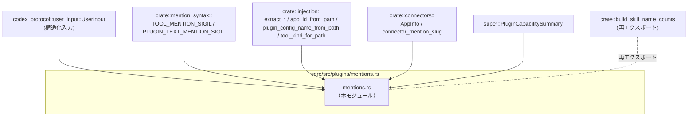
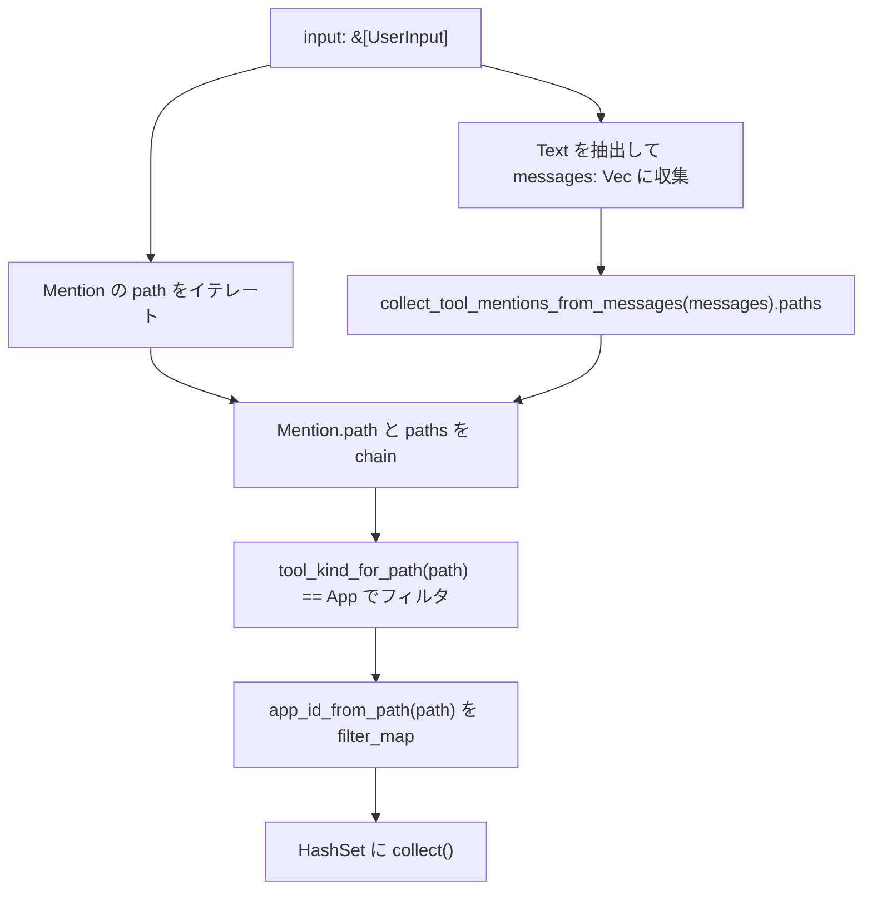
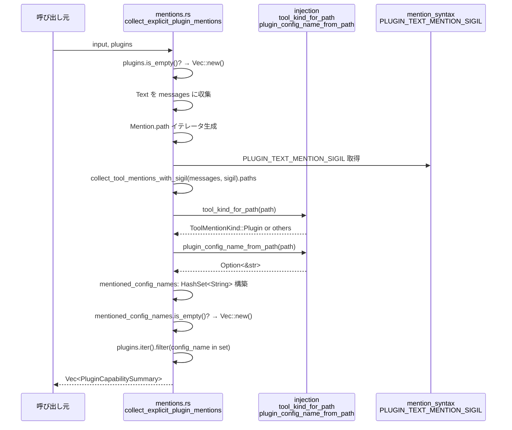
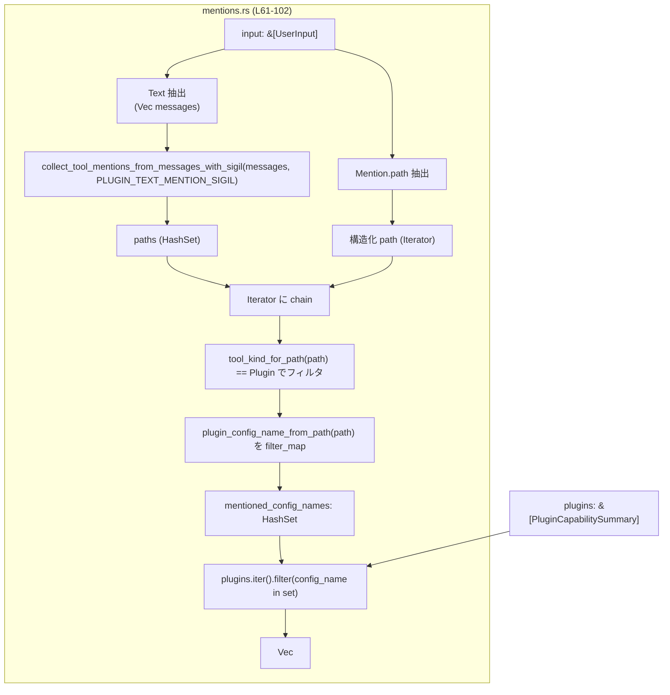

# core/src/plugins/mentions.rs コード解説

---

## 0. ざっくり一言

ユーザー入力（テキストや明示的メンション）から、ツール／アプリ／プラグイン／コネクタに対するメンションを抽出し、ID や設定名ごとの集合・集計を行う補助モジュールです（`core/src/plugins/mentions.rs:L17-115`）。

---

## 1. このモジュールの役割

### 1.1 概要

- このモジュールは **ユーザーのメッセージ内の「ツール・プラグイン・コネクタ」メンションを解析し、後段処理で使いやすい形に集約する** 役割を持ちます（`L22-24`, `L40-58`, `L62-102`, `L106-115`）。
- ツールやプラグインのメンションは、  
  - 構造化入力（`UserInput::Mention`）  
  - テキスト内のシギル付きプレーンテキスト（`$...` / `@...`）  
  の両方から収集されます（`L41-47`, `L52-55`, `L70-76`, `L79-88`）。
- 抽出されたメンションは、  
  - アプリ ID（`collect_explicit_app_ids`）  
  - プラグイン設定名（`collect_explicit_plugin_mentions`）  
  - コネクタのスラッグごとの出現回数（`build_connector_slug_counts`）  
  として利用されます。

### 1.2 アーキテクチャ内での位置づけ

このモジュールは、プロトコル層の `UserInput` と、ツール／プラグイン／コネクタを扱う内部モジュール群の間に位置する「テキスト解析＋フィルタ」層として機能します。



- `UserInput` からテキスト・メンション情報を受け取り（`L40-47`, `L49-55`, `L70-76`, `L79-83`）、  
- `crate::injection` のヘルパーでパス解析・種別判定を行い（`L33`, `L56-57`, `L86-90`）、  
- その結果をアプリ ID・プラグイン設定名などに変換して返します。
- `build_connector_slug_counts` はコネクタ情報（`connectors::AppInfo`）を受けて、メンション用スラッグごとの出現数を集計します（`L106-115`）。

### 1.3 設計上のポイント

- **状態を持たない純粋関数中心**  
  - すべての関数は引数のみを入力とし、グローバル状態を参照・更新しません（`L22-24`, `L26-38`, `L40-58`, `L62-102`, `L106-115`）。
  - スレッドセーフであり、どの関数も `unsafe` を使用していません（このファイルに `unsafe` は存在しません）。
- **集合型 (`HashSet`) を用いた重複排除**  
  - メンションされたツール名・パスは `HashSet<String>` として保持され、自然と重複排除されます（`L17-20`, `L30-37`, `L78-91`）。
- **ツール種別ごとのフィルタリング**  
  - `tool_kind_for_path` と `ToolMentionKind` を利用して、アプリとプラグインを明確に区別しています（`L7`, `L56-57`, `L89-90`）。
- **シギル（先頭記号）によるプラグイン／ツールの区別**  
  - 通常のツールメンションには `TOOL_MENTION_SIGIL`（例: `$`）、  
    プラグインのプレーンテキストリンクには `PLUGIN_TEXT_MENTION_SIGIL`（例: `@`）を使っています（`L12-13`, `L22-24`, `L84-88`）。
- **明示的メンションがない場合の早期終了**  
  - プラグイン一覧が空、またはメンションが 0 件のときは早期に空コレクションを返し、無駄な処理を避けています（`L66-68`, `L93-95`）。

---

## 2. 主要な機能一覧

- ツールメンション収集: テキストメッセージからツールメンションの名前・パス集合を作成します（`collect_tool_mentions_from_messages`, `L22-24`）。
- アプリ ID の収集: ユーザー入力からアプリ型ツールの ID 集合を抽出します（`collect_explicit_app_ids`, `L40-58`）。
- プラグインメンションの収集: `plugin://...` や `@plugin/...` 形式のプラグインメンションからプラグイン能力情報を抽出します（`collect_explicit_plugin_mentions`, `L61-102`）。
- スキル名出現回数の集計（再エクスポート）: 別モジュールにある `build_skill_name_counts` を再公開します（`L104`）。
- コネクタスラッグ出現回数の集計: コネクタ情報配列からメンションスラッグごとの出現回数を計測します（`build_connector_slug_counts`, `L106-115`）。

---

## 3. 公開 API と詳細解説

### 3.0 コンポーネントインベントリー

| 名前 | 種別 | 役割 / 用途 | ソース位置 |
|------|------|-------------|-----------|
| `CollectedToolMentions` | 構造体 | テキストから抽出したツールメンションのプレーン名とパスの集合を保持する | `core/src/plugins/mentions.rs:L17-20` |
| `collect_tool_mentions_from_messages` | 関数 | メッセージ列からデフォルトシギル（ツール用）でツールメンションを収集する | `core/src/plugins/mentions.rs:L22-24` |
| `collect_tool_mentions_from_messages_with_sigil` | 関数（プライベート） | 任意のシギルを使ってメッセージ列からツールメンションを収集する共通ロジック | `core/src/plugins/mentions.rs:L26-38` |
| `collect_explicit_app_ids` | 関数 | `UserInput` からアプリ種別ツールの ID を `HashSet<String>` として抽出する | `core/src/plugins/mentions.rs:L40-58` |
| `collect_explicit_plugin_mentions` | 関数 | `UserInput` とプラグイン一覧から、明示的にメンションされたプラグインのサマリを返す | `core/src/plugins/mentions.rs:L61-102` |
| `build_skill_name_counts` | 再エクスポート | スキル名ごとの出現回数集計ロジック（定義は別ファイル）を再公開する | `core/src/plugins/mentions.rs:L104` |
| `build_connector_slug_counts` | 関数 | コネクタ情報から `connector_mention_slug` 単位の件数を集計する | `core/src/plugins/mentions.rs:L106-115` |
| `tests` モジュール | モジュール | テストコード（`mentions_tests.rs`）へのパス指定と条件付きコンパイル | `core/src/plugins/mentions.rs:L117-119` |

### 3.1 型一覧（構造体・列挙体など）

| 名前 | 種別 | 役割 / 用途 | 主なフィールド | ソース位置 |
|------|------|-------------|----------------|-----------|
| `CollectedToolMentions` | 構造体 | テキストメッセージから抽出したツールメンション情報を保持するシンプルなコンテナです。 | `plain_names: HashSet<String>`（プレーンなツール名）、`paths: HashSet<String>`（`tool://...` 等のパス文字列）（`L17-20`） | `core/src/plugins/mentions.rs:L17-20` |
| `PluginCapabilitySummary` | 構造体（別モジュール） | プラグインの能力・設定を表すサマリ型です。ここでは `config_name` フィールドが使用されています（`L99`）。詳細な定義はこのチャンクには現れません。 | 少なくとも `config_name: String` を持つことが読み取れます（`L99`）。その他のフィールドは不明です。 | 定義は別ファイル（ここには未掲載） |

### 3.2 関数詳細

#### `collect_tool_mentions_from_messages(messages: &[String]) -> CollectedToolMentions`

**概要**

- テキストメッセージ列から、**デフォルトのツール用シギル**（`TOOL_MENTION_SIGIL`）を用いてツールメンションを抽出し、プレーン名とパスの集合を返します（`L22-24`）。
- 実装は `collect_tool_mentions_from_messages_with_sigil` への薄いラッパーです。

**引数**

| 引数名 | 型 | 説明 |
|--------|----|------|
| `messages` | `&[String]` | ユーザー入力などのテキストメッセージ配列。各要素にツールメンションが含まれている可能性があります。 |

**戻り値**

- `CollectedToolMentions`（`L17-20`）  
  - `plain_names`: メッセージ中に現れたツールのプレーンな名前（例: `tool_name`）。重複は排除されます。  
  - `paths`: シギル付きの完全なパス（例: `tool://namespace/tool_name`）。重複は排除されます。

**内部処理の流れ**

1. `TOOL_MENTION_SIGIL` をシギルとして `collect_tool_mentions_from_messages_with_sigil` を呼び出します（`L22-24`）。
2. その戻り値をそのまま返します。

**Examples（使用例）**

```rust
use crate::plugins::mentions::collect_tool_mentions_from_messages;

// ユーザーメッセージ例（$ が TOOL_MENTION_SIGIL だと仮定）
let messages = vec![
    "Please use $tool://app/my_app for this task.".to_string(),
    "Also consider $tool://app/another_app".to_string(),
];

// メンションを抽出する
let mentions = collect_tool_mentions_from_messages(&messages);

// 結果（plain_names/paths）は HashSet なので順序は未定義
assert!(mentions.paths.contains("tool://app/my_app"));
assert!(mentions.paths.contains("tool://app/another_app"));
```

※ 実際のシギルやパス形式は `TOOL_MENTION_SIGIL` と `extract_tool_mentions_with_sigil` の実装に依存し、このチャンクからは詳細は分かりません。

**Errors / Panics**

- 明示的な `Result` や `panic!` はありません（`L22-24`）。
- 使用しているのは `HashSet` への挿入のみであり、通常はパニックしません。OOM などのランタイムレベルの失敗を除き、安全に呼び出せます。

**Edge cases（エッジケース）**

- `messages` が空のとき: ループは一度も回らず、`plain_names` / `paths` ともに空の `HashSet` が返されます（`L30-37` の呼び出し先挙動に準じます）。
- メッセージ内にツールメンションが 1 つも無いとき: `extract_tool_mentions_with_sigil` が空を返すため、結果の集合も空になると考えられます（`L33-36`）。
- 同じメンションが複数メッセージに重複して現れた場合: `HashSet` により自動的に重複排除され、1 回として数えられます（`L30-37`）。

**使用上の注意点**

- この関数は **シギルに依存** してメンションを認識します。シギルが変わる場合は `collect_tool_mentions_from_messages_with_sigil` を直接使う必要があります（`L26-29`）。
- 戻り値は集合であり **順序が保証されない** ため、順序に意味を持たせたい場合は別途ソートなどが必要です。

---

#### `collect_tool_mentions_from_messages_with_sigil(messages: &[String], sigil: char) -> CollectedToolMentions`

**概要**

- 任意のシギル文字を用いて、テキストメッセージからツールメンションのプレーン名・パスを収集します（`L26-38`）。
- プラグイン専用シギル `PLUGIN_TEXT_MENTION_SIGIL` を扱うためにも利用されています（`L84-88`）。

**引数**

| 引数名 | 型 | 説明 |
|--------|----|------|
| `messages` | `&[String]` | メンション抽出対象のメッセージ配列。 |
| `sigil` | `char` | メンションの先頭記号（例: `$`, `@`）。この文字を用いたメンションのみが抽出対象になります。 |

**戻り値**

- `CollectedToolMentions`  
  - `plain_names`: `mentions.plain_names()` から得られるプレーン名集合を `String` として格納（`L34-35`）。  
  - `paths`: `mentions.paths()` から得られるパス集合を `String` として格納（`L35`）。

**内部処理の流れ**

1. `plain_names` と `paths` の空の `HashSet` を作成します（`L30-31`）。
2. 各 `message` について `extract_tool_mentions_with_sigil(message, sigil)` を呼び出します（`L32-33`）。
3. 返された `mentions` から
   - `plain_names()` イテレータを `plain_names` に追加（`L34`）
   - `paths()` イテレータを `paths` に追加（`L35`）
4. ループ後、`CollectedToolMentions { plain_names, paths }` を返します（`L37`）。

**Examples（使用例）**

```rust
use crate::plugins::mentions::collect_tool_mentions_from_messages_with_sigil;
use crate::mention_syntax::PLUGIN_TEXT_MENTION_SIGIL;

// @ が PLUGIN_TEXT_MENTION_SIGIL の場合の例
let messages = vec![
    "See @plugin://demo/my_plugin for details".to_string(),
];

let mentions = collect_tool_mentions_from_messages_with_sigil(
    &messages,
    PLUGIN_TEXT_MENTION_SIGIL, // '@' と仮定
);

assert!(mentions.paths.contains("plugin://demo/my_plugin"));
```

**Errors / Panics**

- この関数自体にはパニックの可能性は見当たりません（`L26-38`）。
- `extract_tool_mentions_with_sigil` の内部挙動はこのチャンクには現れないため、そこでパニックが起きるかどうかは不明です。

**Edge cases**

- `sigil` がメッセージ内で一度も使われていない場合、返り値は空の集合です。
- 同じメンションが複数メッセージに現れても、`HashSet` により重複排除されます。

**使用上の注意点**

- 引数 `sigil` とメッセージ内の実際のシギルが一致していなければメンションは検出されません。
- プラグイン用に `PLUGIN_TEXT_MENTION_SIGIL` を使うケースと、通常ツール用に `TOOL_MENTION_SIGIL` を使うケースがあり、混同しないようにする必要があります（`L12-13`, `L22-24`, `L84-88`）。

---

#### `collect_explicit_app_ids(input: &[UserInput]) -> HashSet<String>`

**概要**

- ユーザー入力列（`UserInput`）から、**アプリ種別ツール** の明示的メンションを抽出し、そのアプリ ID を `HashSet<String>` として返します（`L40-58`）。
- 構造化された `UserInput::Mention` と、テキスト中のツールメンションの両方を対象とします。

**引数**

| 引数名 | 型 | 説明 |
|--------|----|------|
| `input` | `&[UserInput]` | ユーザー入力の配列。`Text`・`Mention` など複数のバリアントを含むことができます（`L41-47`, `L49-55`）。 |

**戻り値**

- `HashSet<String>`  
  - アプリ種別ツールの「アプリ ID」を表す文字列集合です。  
  - 重複 ID は 1 度だけ含まれます。

**内部処理の流れ（アルゴリズム）**

1. `input` から `UserInput::Text { text, .. }` のみを抽出し、`messages: Vec<String>` として収集します（`L41-47`）。
2. 再度 `input` をイテレートし、`UserInput::Mention { path, .. }` バリアントの `path` を抽出します（`L49-54`）。
3. そのイテレータに、`collect_tool_mentions_from_messages(&messages).paths` を `chain` で連結し、テキスト内メンションのパスも含めます（`L55`）。
4. 各 `path` について `tool_kind_for_path(path.as_str())` が `ToolMentionKind::App` であるものだけにフィルタリングします（`L56-57`）。
5. アプリ種別 `path` を `app_id_from_path(path.as_str())` でアプリ ID に変換します。`Option<&str>` を `filter_map` で `String` に変換しつつ `None` を除外します（`L57-57`）。
6. 最終的な `HashSet<String>` として `collect()` します（`L58`）。

**Mermaid フローチャート（コード範囲: `core/src/plugins/mentions.rs:L40-58`）**



**Examples（使用例）**

```rust
use codex_protocol::user_input::UserInput;
use crate::plugins::mentions::collect_explicit_app_ids;

let inputs = vec![
    UserInput::Text { text: "Use $app://my_app".to_string(), /* 他フィールドは省略 */ },
    UserInput::Mention { path: "app://another_app".to_string(), /* 他フィールドは省略 */ },
];

// 明示的にメンションされたアプリ ID を収集
let app_ids = collect_explicit_app_ids(&inputs);

// 具体的な ID 形式は app_id_from_path の実装に依存する点に注意
assert!(app_ids.contains("my_app") || app_ids.contains("app://my_app")); // 形式は不明
assert!(app_ids.contains("another_app") || app_ids.contains("app://another_app"));
```

※ `app_id_from_path` が実際にどのような文字列を返すかは、このチャンクからは判断できません（`L8`, `L57`）。

**Errors / Panics**

- `Result` を返さず、内部に `unwrap` なども無いため、通常の入力ではパニックしません（`L40-58`）。
- `tool_kind_for_path` / `app_id_from_path` の内部実装でパニックする可能性は、このチャンクからは不明です。

**Edge cases**

- `input` が空:  
  - `messages` も空、`Mention` も存在しないため、結果の `HashSet` は空です（`L41-47`, `L49-58`）。
- `input` に `Text` はあるがメンションが含まれない場合:  
  - `collect_tool_mentions_from_messages` の `paths` が空になり、`Mention` も無ければ結果は空の集合です。
- `tool_kind_for_path(path)` が `ToolMentionKind::App` 以外を返す場合:  
  - その `path` はアプリ ID 集合に含まれません（`L56-57`）。
- `app_id_from_path` が `None` を返す場合:  
  - `filter_map` によりそのエントリはドロップされます（`L57`）。

**使用上の注意点**

- この関数は **「アプリ種別」と判定されたメンションのみ** を返すので、プラグインや他種別のツール ID を取得したい場合は別の処理が必要です（`L56-57`）。
- 戻り値は `HashSet` であり、順序を必要とする用途（ログ順、時系列など）にはそのまま使えません。
- `UserInput` の他のバリアント（例: 画像、ファイルなど）は `_ => None` によって無視されます（`L45-46`, `L53-54`）。

---

#### `collect_explicit_plugin_mentions(input: &[UserInput], plugins: &[PluginCapabilitySummary]) -> Vec<PluginCapabilitySummary>`

**概要**

- `UserInput` と利用可能な `PluginCapabilitySummary` 一覧から、**ユーザーが明示的にメンションしたプラグイン** を抽出し、そのサマリ情報を `Vec` として返します（`L61-102`）。
- 構造化された `UserInput::Mention` と、テキスト中の `plugin://...` / プラグイン用シギル付きリンクの両方を扱います（`L70-76`, `L79-88`）。

**引数**

| 引数名 | 型 | 説明 |
|--------|----|------|
| `input` | `&[UserInput]` | ユーザー入力の配列。プラグインに関するテキストやメンションを含む可能性があります。 |
| `plugins` | `&[PluginCapabilitySummary]` | 利用可能なプラグイン一覧。ここに含まれるもののうち、ユーザーがメンションしたものだけが返されます（`L62-68`, `L97-101`）。 |

**戻り値**

- `Vec<PluginCapabilitySummary>`  
  - `plugins` 配列から、メンションされた `config_name` を持つ要素のみを抽出したベクタです（`L97-101`）。
  - 要素は `plugins.iter()` の順序を保ったままフィルタされます。

**内部処理の流れ（アルゴリズム）**

1. `plugins` が空なら、早期に `Vec::new()` を返します（`L66-68`）。
2. `input` から `UserInput::Text { text, .. }` の `text` を抽出し、`messages: Vec<String>` に収集します（`L70-76`）。
3. `input` から `UserInput::Mention { path, .. }` の `path` を抽出するイテレータを構築します（`L79-83`）。
4. そのイテレータに、`collect_tool_mentions_from_messages_with_sigil(&messages, PLUGIN_TEXT_MENTION_SIGIL).paths` を `chain` で連結します（`L84-88`）。
   - コメントに「プラグインのプレーンテキストリンクはデフォルトの `$` ではなく `@` を使う」とあります（`L85-86`）。
5. 得られた `path` 群から
   - `tool_kind_for_path(path.as_str()) == ToolMentionKind::Plugin` でプラグイン種別のみにフィルタ（`L89-90`）。
   - `plugin_config_name_from_path(path.as_str())` を `filter_map` で `String` に変換しつつ `None` を除外（`L90`）。
6. その結果を `HashSet<String>` として `mentioned_config_names` に収集します（`L78-91`）。
7. `mentioned_config_names` が空なら、`Vec::new()` を返します（`L93-95`）。
8. `plugins.iter()` をフィルタし、`mentioned_config_names` に `plugin.config_name.as_str()` が含まれる要素のみを `cloned()` して `Vec` に収集します（`L97-101`）。

**Mermaid シーケンス図（コード範囲: `core/src/plugins/mentions.rs:L61-102`）**



**Examples（使用例）**

```rust
use codex_protocol::user_input::UserInput;
use crate::plugins::mentions::collect_explicit_plugin_mentions;
use crate::plugins::PluginCapabilitySummary;

let inputs = vec![
    UserInput::Text {
        text: "Check @plugin://demo/my_plugin".to_string(),
        // 他フィールドは省略
    },
    UserInput::Mention {
        path: "plugin://demo/other_plugin".to_string(),
        // 他フィールドは省略
    },
];

// 利用可能なプラグイン一覧（config_name の値は plugin_config_name_from_path に対応する必要がある）
let plugins = vec![
    PluginCapabilitySummary { config_name: "demo/my_plugin".to_string(), /* ... */ },
    PluginCapabilitySummary { config_name: "demo/other_plugin".to_string(), /* ... */ },
];

let mentioned = collect_explicit_plugin_mentions(&inputs, &plugins);

// mentioned には、ユーザーが明示的にメンションしたプラグインのサマリのみが含まれる
assert!(mentioned.iter().any(|p| p.config_name == "demo/my_plugin"));
assert!(mentioned.iter().any(|p| p.config_name == "demo/other_plugin"));
```

※ `PluginCapabilitySummary` の完全な定義はこのチャンクには現れません。

**Errors / Panics**

- 明示的なエラー戻り値やパニックはありません（`L61-102`）。
- 内部で使用している `tool_kind_for_path` / `plugin_config_name_from_path` / `collect_tool_mentions_from_messages_with_sigil` のパニック可能性は不明です。

**Edge cases**

- `plugins` が空:  
  - すぐに `Vec::new()` を返します（`L66-68`）。入力にメンションがあっても結果は必ず空です。
- メンションはあるが、`plugin_config_name_from_path` が `None` を返す場合:  
  - 当該エントリは `mentioned_config_names` に含まれません（`L90`）。
- `mentioned_config_names` が空:  
  - 何もメンションされなかった、またはパスを設定名に変換できなかった場合、空の `Vec` が返ります（`L93-95`）。
- `plugins` の `config_name` と `mentioned_config_names` が一致しない場合:  
  - そのプラグインは返り値に含まれません（`L97-101`）。

**使用上の注意点**

- `plugins` 引数には「ユーザーに利用させたいプラグイン一覧」のみを渡す想定です。ここに含まれないプラグインは、たとえメンションされていても返り値に現れません。
- `config_name` の整合性が重要です。`plugin_config_name_from_path` が返す名前と `PluginCapabilitySummary.config_name` が一致しないとマッチしません（`L90`, `L99`）。
- 戻り値の順序は入力 `plugins` の順序を保ちます。メンションされた順番ではありません。

---

#### `build_connector_slug_counts(connectors: &[connectors::AppInfo]) -> HashMap<String, usize>`

**概要**

- コネクタ情報配列から、`connector_mention_slug` ごとの出現回数をカウントし、`HashMap<String, usize>` として返します（`L106-115`）。
- これはコネクタのメンション頻度集計やランキングなどに利用できる補助関数です。

**引数**

| 引数名 | 型 | 説明 |
|--------|----|------|
| `connectors` | `&[connectors::AppInfo]` | コネクタの情報配列。各要素についてスラッグが計算されます（`L106-112`）。 |

**戻り値**

- `HashMap<String, usize>`  
  - キー: `connector_mention_slug(connector)` が返すスラッグ文字列（`L111-112`）。  
  - 値: そのスラッグが `connectors` スライス内に何回現れたか（`L110-112`）。

**内部処理の流れ**

1. 空の `HashMap<String, usize>` を `counts` として生成します（`L109`）。
2. 各 `connector` について
   - `slug = connectors::connector_mention_slug(connector)` を計算します（`L111`）。
   - `counts.entry(slug).or_insert(0)` で該当キーのカウンタを取得し、1 加算します（`L112`）。
3. 最終的な `counts` を返します（`L114`）。

**Examples（使用例）**

```rust
use crate::connectors::AppInfo;
use crate::plugins::mentions::build_connector_slug_counts;

// AppInfo の具体的なフィールドはこのチャンクには現れないためダミー例
let connectors: Vec<AppInfo> = vec![
    /* 同じスラッグになるコネクタが複数あると仮定 */
];

let counts = build_connector_slug_counts(&connectors);

// "google_drive" スラッグのコネクタが 3 つあれば counts["google_drive"] == 3 となる
```

**Errors / Panics**

- デフォルトの `HashMap` 操作のみを使用しており（`L109-112`）、通常の範囲ではパニックしません。
- `connector_mention_slug` の実装はこのチャンクには現れないため、そこでのパニック可能性は不明です。

**Edge cases**

- `connectors` が空:  
  - ループが実行されず、空の `HashMap` が返されます。
- 同じスラッグに対応するコネクタが複数ある場合:  
  - カウントがその個数分だけ増加します。
- 異なる `connector` が同じスラッグを返すロジックの場合:  
  - 意図通りに「スラッグ単位」で集計されます。

**使用上の注意点**

- キーはスラッグ文字列であり、`AppInfo` の ID やパスそのものではありません。用途に応じてどのレベルの単位で集計したいかを確認する必要があります。
- 戻り値 `HashMap` は順序を持たないため、ランキングなどに使う場合は別途ソートが必要です。

---

#### `build_skill_name_counts`（再エクスポート）

**概要**

- `pub(crate) use crate::build_skill_name_counts;` により、クレートルートに定義されている `build_skill_name_counts` 関数を、このモジュール名空間からも利用できるようにしています（`L104`）。
- 定義本体はこのチャンクには現れず、挙動は不明です。

**使用上の注意点**

- 利用する際は `crate::build_skill_name_counts` と同一の API が `crate::plugins::mentions::build_skill_name_counts` からも参照できると考えられますが、正確なシグネチャ・挙動は元の定義ファイルを参照する必要があります。

---

### 3.3 その他の関数

このファイルには上記以外に補助関数はありません。  
`collect_tool_mentions_from_messages_with_sigil` は内部でのみ使用されるヘルパー関数ですが、機能的には重要なため 3.2 で詳細を説明しました。

---

## 4. データフロー

ここでは代表的なシナリオとして、**ユーザー入力からプラグインメンションを抽出し、該当プラグインの能力サマリを取得する** 流れを説明します。

1. 呼び出し元が `input: &[UserInput]` と `plugins: &[PluginCapabilitySummary]` を用意し、`collect_explicit_plugin_mentions` を呼びます（`L62-65`）。
2. 関数内部で `input` からテキストとメンションパスを抽出し、`collect_tool_mentions_from_messages_with_sigil` を用いてプラグイン用シギル付きテキストからもパスを取得します（`L70-76`, `L84-88`）。
3. `tool_kind_for_path` によってプラグイン種別のパスだけに絞り込んだ後、`plugin_config_name_from_path` で設定名を抽出します（`L89-90`）。
4. 得られた設定名の集合 `mentioned_config_names` と `plugins` の `config_name` を照合し、一致するものだけを `Vec<PluginCapabilitySummary>` として返します（`L78-91`, `L97-101`）。

### データフロー図（プラグインメンション抽出）



---

## 5. 使い方（How to Use）

### 5.1 基本的な使用方法

典型的なフローは、ユーザー入力からアプリ ID とプラグインメンションを抽出し、コネクタやスキルの利用状況を集計する形になります。

```rust
use codex_protocol::user_input::UserInput;
use crate::plugins::mentions::{
    collect_explicit_app_ids,
    collect_explicit_plugin_mentions,
    build_connector_slug_counts,
    build_skill_name_counts, // 再エクスポート
};
use crate::plugins::PluginCapabilitySummary;
use crate::connectors::AppInfo;

// 1. ユーザー入力とプラグイン一覧・コネクタ一覧を用意する
let user_inputs: Vec<UserInput> = /* ... */;
let available_plugins: Vec<PluginCapabilitySummary> = /* ... */;
let available_connectors: Vec<AppInfo> = /* ... */;

// 2. アプリ ID の集合を抽出する
let app_ids = collect_explicit_app_ids(&user_inputs);

// 3. プラグインメンションから利用対象プラグイン一覧を抽出する
let mentioned_plugins = collect_explicit_plugin_mentions(&user_inputs, &available_plugins);

// 4. コネクタのスラッグごとのカウントを集計する
let connector_counts = build_connector_slug_counts(&available_connectors);

// 5. スキル名出現回数の集計（定義は別ファイル）
let skill_counts = build_skill_name_counts(/* 引数は定義側に依存 */);
```

### 5.2 よくある使用パターン

1. **アプリ／プラグインの利用判定**

   - `collect_explicit_app_ids` と `collect_explicit_plugin_mentions` を組み合わせ、ユーザーがどのアプリ・プラグインを明示的に指定したかを判定する。
   - これに基づき、呼び出すバックエンドサービスやプラグインセットを決定する。

2. **人気コネクタの集計**

   - `build_connector_slug_counts` でコネクタスラッグごとの出現回数を集計し、ダッシュボードやランキング表示に利用する。

3. **メンション検出ロジックの共通化**

   - 他のモジュールでメンション検出を行いたい場合は、`collect_tool_mentions_from_messages_with_sigil` を再利用し、異なるシギルや文法に対応させることができます（`L26-38`）。

### 5.3 よくある間違い

```rust
// 間違い例: plugins が空でもメンションがあれば返ってくると思っている
let mentioned_plugins = collect_explicit_plugin_mentions(&user_inputs, &[]);
// => 実際には plugins.is_empty() により必ず空 Vec が返る（L66-68）

// 正しい例: 利用可能なプラグイン一覧を渡す必要がある
let mentioned_plugins = collect_explicit_plugin_mentions(&user_inputs, &available_plugins);
```

```rust
// 間違い例: app_ids の順序に意味があると想定している
let app_ids = collect_explicit_app_ids(&user_inputs);
// HashSet なので順序は未定義

// 正しい扱い: 順序が必要なら別途ソートする
let mut app_ids_vec: Vec<_> = app_ids.into_iter().collect();
app_ids_vec.sort();
```

### 5.4 使用上の注意点（まとめ）

- **スレッド安全性**:  
  このモジュール内にはグローバル可変状態や `unsafe` はなく、関数はすべて純粋な計算に近い形で実装されています（`L22-24`, `L26-38`, `L40-58`, `L62-102`, `L106-115`）。複数スレッドから同時に呼び出しても問題はありません。

- **エラー処理**:  
  いずれの関数も `Result` を返さず、入力が妥当であればパニックする可能性は低いです。パス解析に失敗した場合は `Option` を `filter_map` で落とす設計になっています（`L57`, `L90`）。

- **依存関数の挙動**:  
  パス解析や種別判定は `crate::injection` 側の実装に依存しており、このチャンクからは詳細が分かりません。仕様変更時はそちらの挙動も確認する必要があります（`L7-11`, `L33`, `L56-57`, `L86-90`）。

- **性能面**:  
  入力サイズに対してほぼ線形時間で動作し、`HashSet` / `HashMap` を用いた重複排除・集計のみを行っています。非常に大きな入力でない限り、性能上の問題は起きにくい設計です。

---

## 6. 変更の仕方（How to Modify）

### 6.1 新しい機能を追加する場合

例: **新しいツール種別（例: `ToolMentionKind::Service`）のメンションを収集したい場合**

1. `crate::injection` 側で `ToolMentionKind` に新種別を追加し、`tool_kind_for_path` が新種別を返すようにします（このチャンクには実装は現れません）。
2. 本モジュールに、新種別専用の収集関数（例: `collect_explicit_service_ids`）を定義します。
   - `collect_explicit_app_ids` の実装を参考にし、`ToolMentionKind::App` 部分を `ToolMentionKind::Service` に変更する形で実装できます（`L40-58`）。
3. 必要であれば、新しいシギルを導入し、`collect_tool_mentions_from_messages_with_sigil` を利用してテキストからのメンションを収集します（`L26-38`）。

### 6.2 既存の機能を変更する場合

- **アプリ ID / プラグイン設定名のパス仕様を変更する場合**
  - パス解析は `app_id_from_path` / `plugin_config_name_from_path` に委譲されているため、基本的にはそちらを変更します（`L8`, `L10`, `L57`, `L90`）。
  - ただし、`collect_explicit_*` 関数の「何を明示的メンションとみなすか」の契約（前提条件）が変わる場合は、このファイル内のフィルタ条件も併せて確認します（`L56-57`, `L89-90`）。

- **テキストメンションのシギルを変更する場合**
  - デフォルトツールメンションシギル: `TOOL_MENTION_SIGIL`（`L13`, `L22-24`）
  - プラグインプレーンテキストシギル: `PLUGIN_TEXT_MENTION_SIGIL`（`L12`, `L84-88`）
  - シギルの変更自体は `mention_syntax` モジュール側で行われる可能性が高いですが、本モジュールでの利用箇所（`collect_*_with_sigil` 呼び出し）も合わせて確認する必要があります。

- **契約・前提条件の確認ポイント**
  - 「明示的メンション」とは、`UserInput::Mention` およびテキスト中の指定シギル付きリンクである、という契約になっています（`L41-47`, `L49-55`, `L70-76`, `L79-88`）。
  - この定義を変えると、後続のロジック（どのアプリ・プラグインを有効化するかなど）にも影響するため、影響範囲の確認が必要です。

---

## 7. 関連ファイル

| パス / モジュール | 役割 / 関係 |
|------------------|------------|
| `codex_protocol::user_input::UserInput` | ユーザー入力の構造化表現です。本モジュールでは `Text` および `Mention` バリアントを利用してメンション情報を取得します（`core/src/plugins/mentions.rs:L4`, `L41-47`, `L49-55`, `L70-76`, `L79-83`）。 |
| `crate::injection::extract_tool_mentions_with_sigil` | テキストから指定シギル付きツールメンションを抽出するヘルパーです。メンションのプレーン名・パスを提供します（`L9`, `L33-36`）。 |
| `crate::injection::tool_kind_for_path` | メンションパスから `ToolMentionKind`（App / Plugin 等）を判定します。アプリ／プラグインのフィルタに使用されます（`L11`, `L56-57`, `L89-90`）。 |
| `crate::injection::app_id_from_path` | メンションパスからアプリ ID を抽出します。`collect_explicit_app_ids` で使用されます（`L8`, `L57`）。 |
| `crate::injection::plugin_config_name_from_path` | プラグインメンションパスから設定名（`config_name`）を抽出します。`collect_explicit_plugin_mentions` で使用されます（`L10`, `L90`）。 |
| `crate::mention_syntax::{TOOL_MENTION_SIGIL, PLUGIN_TEXT_MENTION_SIGIL}` | ツール／プラグインメンションに使うシギルを定義するモジュールです。テキストメンション解析の前提となります（`L12-13`, `L22-24`, `L84-88`）。 |
| `crate::connectors::{AppInfo, connector_mention_slug}` | コネクタ情報と、その情報からメンション用スラッグを計算するヘルパーです。`build_connector_slug_counts` で使用されます（`L6`, `L106-112`）。 |
| `crate::build_skill_name_counts` | スキル名出現回数を集計する関数です。本モジュールから再エクスポートされています（`L104`）。定義はこのチャンクには現れません。 |
| `core/src/plugins/mentions_tests.rs` | テストモジュール。`#[path = "mentions_tests.rs"]` により、このファイルに関連するテストが格納されていることが分かりますが、内容はこのチャンクには現れません（`L117-119`）。 |

---

### Bugs / Security に関する観察（このチャンクから読み取れる範囲）

- **潜在的なバグ要因**
  - `plugins` が空のときに即座に空 `Vec` を返す設計のため、呼び出し側が「プラグイン一覧の渡し忘れ」に気付かない可能性があります（`L66-68`）。ただしこれは設計上の選択であり、このチャンクだけからは意図は不明です。
  - `config_name` の一致に依存しているため、パス→設定名変換とプラグイン一覧の定義がずれると、ユーザーがメンションしても検出されない可能性があります（`L90`, `L99`）。

- **セキュリティ上の観点**
  - このモジュールはユーザー入力を扱いますが、行っているのは文字列の解析と集合操作のみであり、外部システムへの直接的なアクセスやコード実行は含まれていません（`L22-24`, `L26-38`, `L40-58`, `L62-102`, `L106-115`）。
  - したがって、このチャンクだけを見る限り、典型的なコードインジェクションやリモートコード実行のリスクは低いと考えられます。ただし、`plugin://...` や `tool://...` が後続でどのように解釈・実行されるかは別モジュールに依存し、このチャンクからは判断できません。

- **テスト**
  - `#[cfg(test)]` と `#[path = "mentions_tests.rs"]` により、このモジュール専用のテストが存在することが分かりますが、内容はこのチャンクには現れません（`L117-119`）。  
    テストがどの程度のエッジケースをカバーしているかは不明です。

以上が、本チャンク（`core/src/plugins/mentions.rs`）に基づいて確認できる構造・データフロー・契約・エッジケース・安全性に関する情報です。
