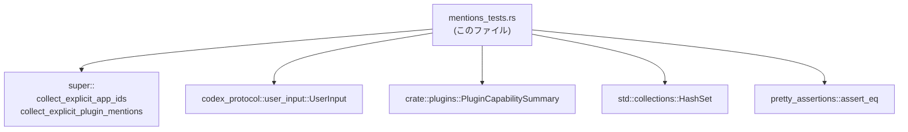
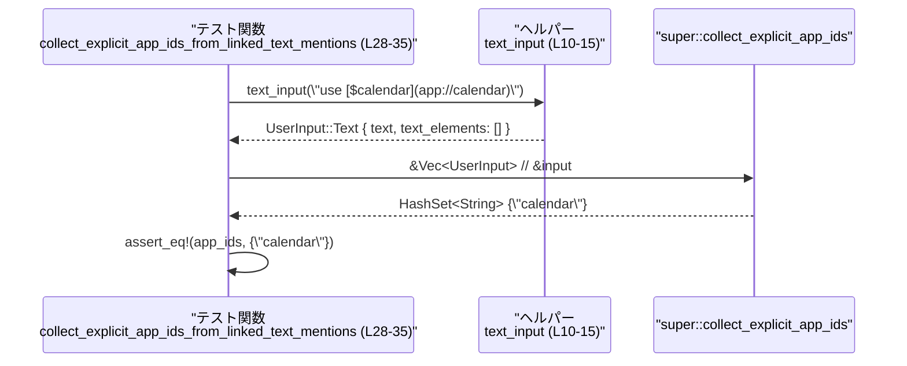
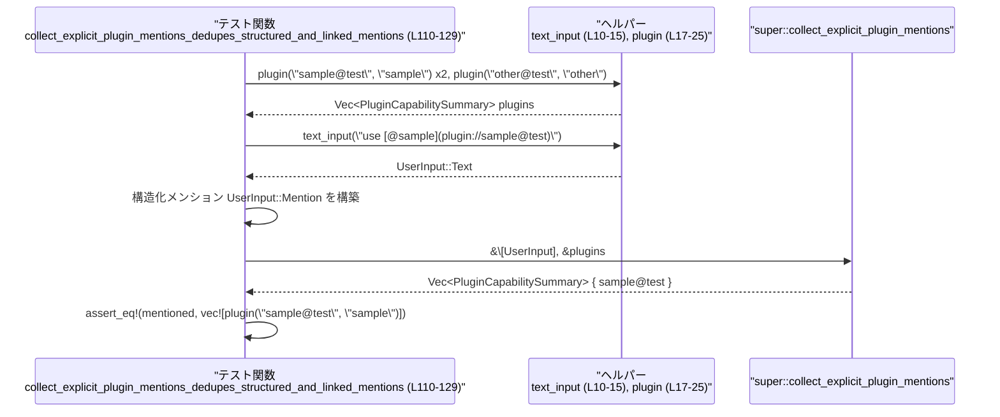

# core/src/plugins/mentions_tests.rs

## 0. ざっくり一言

ユーザー入力から **アプリ ID** と **プラグイン明示指定** を抽出する関数  
`collect_explicit_app_ids` / `collect_explicit_plugin_mentions` の挙動をテストするモジュールです。

---

## 1. このモジュールの役割

### 1.1 概要

- このファイルは、ユーザー入力 (`UserInput`) から
  - `app://…` 形式のアプリ ID を集める関数
  - `plugin://…` 形式のプラグインを集める関数
- が、期待どおりに動作するかを検証するテストを提供します  
  （関数本体は `super::collect_explicit_app_ids` / `super::collect_explicit_plugin_mentions` として別モジュールにあります）。

### 1.2 アーキテクチャ内での位置づけ

このテストモジュールが依存している主なコンポーネントと関係は次のとおりです。



- `super::…` は親モジュール側に定義された本番ロジックであり、このチャンクには実装が現れません（`core/src/plugins/mentions_tests.rs:L6-8`）。
- `UserInput` はユーザーの入力（テキストや構造化メンション）を表す型です（`L3`）。
- `PluginCapabilitySummary` はプラグインのメタ情報を表す型です（`L8`）。

### 1.3 設計上のポイント

- **ヘルパー関数による入力生成**
  - `text_input` で `UserInput::Text` を生成し、テストでの入力構築を簡略化しています（`L10-15`）。
  - `plugin` で `PluginCapabilitySummary` を生成し、比較しやすい値を作っています（`L17-25`）。
- **スキームごとのフィルタ挙動をテスト**
  - `app://` 以外（`mcp://`, `skill://`, ファイルパスなど）を無視することを確認します（`L52-75`）。
  - `plugin://` 以外や、テキスト側の表記 (`$` / `@`) による違いを確認します（`L77-155`）。
- **重複排除（dedupe）のテスト**
  - テキスト由来のメンションと `UserInput::Mention` の両方があっても、重複なく扱うことを検証しています（`L37-50`, `L110-129`）。
- **エラーや並行性**
  - テストからは、対象関数は `Result` ではなくコレクション型を直接返す前提で使われており（`L32`, `L47`, `L72`, `L84`, `L102`, `L117`, `L135`, `L149`）、明示的なエラー制御や並行処理は行っていません。

---

## 2. 主要な機能一覧

このモジュール（テスト）がカバーしている主な振る舞いは次のとおりです。

- アプリ ID 抽出:
  - `app://…` スキームのリンク・メンションから ID（例: `"calendar"`）だけを抽出することの検証（`L28-35`, `L37-50`）。
- アプリ ID フィルタリング:
  - `mcp://`, `skill://`, パス形式 (`/tmp/file.txt`) は抽出対象外であることの検証（`L52-75`）。
- プラグイン明示指定（plugin://）の抽出:
  - `UserInput::Mention` の `plugin://…` を元に、対応する `PluginCapabilitySummary` を特定することの検証（`L77-93`）。
- プラグインの Markdown 風リンクからの抽出:
  - `[@sample](plugin://sample@test)` のようなテキストからプラグインを抽出することの検証（`L95-108`）。
- プラグイン抽出時の重複排除:
  - テキストと構造化メンションの両方に同じプラグインが現れても、1 つだけ返すことの検証（`L110-129`）。
- プラグイン抽出のフィルタリング:
  - `plugin://` 以外（`app://`, `skill://`, ファイルパス）を無視することの検証（`L131-143`）。
  - テキスト側が `$sample` のように `$` で始まる場合は、たとえ `plugin://` でもプラグインとして扱わないことの検証（`L145-155`）。

---

## 3. 公開 API と詳細解説

### 3.1 型一覧（構造体・列挙体など）

このファイル自体には新しい型定義はありませんが、テスト対象となるロジックで重要な型を整理します。

| 名前 | 種別 | 定義場所（モジュール） | 説明 | 根拠 |
|------|------|-------------------------|------|------|
| `UserInput` | 列挙体（推定） | `codex_protocol::user_input` | ユーザーの入力を表す型。ここでは `Text` と `Mention` というバリアントが使われています。 | `core/src/plugins/mentions_tests.rs:L3, L10-15, L41-45, L58-69, L85-88, L120-123` |
| `PluginCapabilitySummary` | 構造体 | `crate::plugins` | プラグインの構成名・表示名などを持つメタ情報。テストでは比較対象・入力として利用されています。 | `core/src/plugins/mentions_tests.rs:L8, L17-25, L79-82, L97-100, L112-115, L133, L147` |

> `UserInput` と `PluginCapabilitySummary` はこのチャンクには定義が現れず、インポートのみです（`L3`, `L8`）。内部構造はテストに現れるフィールドから分かる範囲に限って説明しています。

### 3.2 関数詳細（コア API のテスト対象）

ここでは、本番コード側で定義されていると考えられる 2 つの関数と、このテストで頻用されるヘルパー 1 つを取り上げます。  
※本番関数の実装はこのファイルには存在しないため、「内部処理」はテストから読み取れる挙動のみに限定します。

---

#### `collect_explicit_app_ids(inputs: &[UserInput]) -> HashSet<String>`（テスト対象）

**概要**

- ユーザー入力列から **アプリケーションの ID** を明示的に指定したものだけを集め、`HashSet<String>` として返す関数です。
- テキスト中の Markdown 風リンク (`[$calendar](app://calendar)`) と構造化メンション (`UserInput::Mention`) の両方を対象にし、重複は排除されます。
- `app://` スキーム以外のパスは無視されます。

> このシグネチャはテストでの呼び出し方法に基づくものであり、実際の定義はこのチャンクには現れません（`core/src/plugins/mentions_tests.rs:L6, L28-35, L37-50, L52-75`）。

**引数**

| 引数名 | 型 | 説明 |
|--------|----|------|
| `inputs` | `&[UserInput]`（とみなせる） | ユーザー入力のスライス。テキスト（`UserInput::Text`）やメンション（`UserInput::Mention`）を含みます。呼び出し側では `&Vec<UserInput>` や `&[UserInput; N]` を渡しています（`L28-32`, `L39-45`, `L54-70`）。 |

**戻り値**

- 型: `HashSet<String>`（`std::collections::HashSet`）
- 意味:
  - 抽出された **アプリ ID** の集合です。
  - テストでは `"calendar"` という文字列だけが含まれる集合と比較しています（`L34`, `L49`）。

**内部処理の流れ（テストから分かる挙動）**

実装はこのチャンクにはありませんが、テストから次のような契約が読み取れます。

1. テキスト (`UserInput::Text`) 中から、`app://…` 形式のリンクを検出し、そこから ID を取り出す。  
   - 例: `"use [$calendar](app://calendar)"` から `"calendar"` を抽出（`L28-35`）。
2. `UserInput::Mention { path, .. }` のうち `path` が `app://…` で始まるものも抽出対象にする（`L37-50`）。
3. テキスト由来と構造化メンション由来の ID は重複を取り除いて 1 度だけ返す（`L37-50`）。
4. `mcp://`, `skill://`, `/tmp/file.txt` など **`app://` 以外のスキームやパスはすべて無視** する（`L52-75`）。

**Examples（使用例）**

テストと同様の使い方を簡略化して示します。

```rust
use std::collections::HashSet;                            // HashSet を利用する
use codex_protocol::user_input::UserInput;                // UserInput 型を利用する

// ユーザー入力を組み立てる（テキスト + 構造化メンション）          // app://calendar を 2 通りで指定
let inputs = vec".into(),   // Markdown 風リンクに app://calendar を含める
        text_elements: Vec::new(),                        // このテストでは空でよい
    },
    UserInput::Mention {                                  // 構造化メンション
        name: "calendar".into(),                          // 表示名
        path: "app://calendar".into(),                    // app スキームのパス
    },
];

// テストと同様に、スライスとして関数に渡す                          // &Vec<_> は &[_] に自動変換される
let app_ids = super::collect_explicit_app_ids(&inputs);

// "calendar" だけが 1 回だけ含まれていることを期待する              // 重複は排除されている
assert_eq!(app_ids, HashSet::from(["calendar".to_string()]));
```

> 上記の `super::collect_explicit_app_ids` という呼び出し方は、このテストファイル内と同じ前提で書いています（`core/src/plugins/mentions_tests.rs:L32, L47, L72`）。

**Errors / Panics**

- テストでは、常に `HashSet<String>` を直接受け取り、エラー型や `Option` は扱っていません（`L32`, `L47`, `L72`）。
- したがって、少なくとも **テスト観点では** エラーを返さず、常に空または非空の集合を返す前提で使用されています。
- 実装が見えないため、特定の入力で panic する可能性があるかどうかは、このチャンクからは分かりません。

**Edge cases（エッジケース）**

テストで明示的にカバーされているケース:

- `app://` スキームを持つリンクのみ抽出される  
  - `[$calendar](app://calendar)` → `"calendar"` を 1 つ抽出（`L28-35`）。
- テキストと構造化メンションの両方に同じ ID があっても 1 つだけ返す  
  - `Text` + `Mention` の両方に `"app://calendar"` → `"calendar"` が 1 つ（`L37-50`）。
- `app://` ではないスキームはすべて無視される  
  - `mcp://docs`, `skill://team/skill`, `/tmp/file.txt` → 結果は空集合（`L52-75`）。

**使用上の注意点**

- `app://` 以外のスキームや単なるファイルパスを渡しても、この関数では ID として扱われないことがテストから分かります（`L52-75`）。
- テキストと構造化メンションの両方を渡した場合、同じ ID は 1 度しか返らない前提でテストされています（`L37-50`）。
- 入力は参照（`&[UserInput]`）で渡されているため、Rust の型システム上、呼び出し側の `Vec<UserInput>` はこの関数によって変更されないことが保証されます（`L32`, `L47`, `L72`）。

---

#### `collect_explicit_plugin_mentions(inputs: &[UserInput], plugins: &[PluginCapabilitySummary]) -> Vec<PluginCapabilitySummary>`（テスト対象）

**概要**

- ユーザー入力列の中から **プラグインの明示的な指定** を見つけ、対応する `PluginCapabilitySummary` のリストを返す関数です。
- 情報源は
  - 構造化メンション (`UserInput::Mention`)
  - テキスト中の Markdown 風リンク (`[@sample](plugin://sample@test)`)
  の両方です。
- スキームが `plugin://` のものだけが対象となり、テキスト側のラベルが `$` で始まるものはプラグインとして扱われません。

> このシグネチャもテストでの呼び出しに基づくもので、実際の定義はこのチャンクにはありません（`core/src/plugins/mentions_tests.rs:L7, L77-93, L95-108, L110-129, L131-143, L145-155`）。

**引数**

| 引数名 | 型 | 説明 |
|--------|----|------|
| `inputs` | `&[UserInput]` | ユーザー入力のスライス。`Mention` やテキストを含みます（`L84-89`, `L102-105`, `L117-125`, `L136-138`, `L149-151`）。 |
| `plugins` | `&[PluginCapabilitySummary]` | 利用可能なプラグインの一覧。ここから、入力と一致するプラグインだけが返されます（`L77-82`, `L95-100`, `L112-115`, `L133`, `L147`）。 |

**戻り値**

- 型: `Vec<PluginCapabilitySummary>`
- 意味:
  - 明示的に指定されたプラグインに対応する `PluginCapabilitySummary` のリストです。
  - テストでは `vec![plugin("sample@test", "sample")]` との比較を行っています（`L92`, `L107`, `L128`）。

**内部処理の流れ（テストから分かる挙動）**

実装はこのチャンクにはありませんが、テストから次の挙動が読み取れます。

1. `UserInput::Mention { path, .. }` のうち `path` が `plugin://…` で始まるものを検出し、その ID（例: `"sample@test"`）に対応するプラグインを `plugins` から探す（`L77-93`）。
2. テキスト (`UserInput::Text`) 中の Markdown 風リンク `[@sample](plugin://sample@test)` からも、同様にプラグイン ID を取得し、`plugins` から対応するプラグインを取得する（`L95-108`）。
3. テキスト由来と構造化メンション由来が重複していても、同じプラグインは 1 回だけ返す（`L110-129`）。
4. `app://`, `skill://`, `/tmp/file.txt` など **`plugin://` 以外のスキームやパスはプラグインとして扱わない**（`L131-143`）。
5. テキスト側のラベルが `$sample` のように `$` で始まる場合は、たとえパスが `plugin://sample@test` であってもプラグインとして扱わない（`L145-155`）。

**Examples（使用例）**

テストと同様の状況を簡略化して示します。

```rust
use codex_protocol::user_input::UserInput;                // UserInput 型
use crate::plugins::PluginCapabilitySummary;             // PluginCapabilitySummary 型

// 利用可能なプラグイン一覧を用意する                          // 実際には別途ロードされている想定
let plugins = vec![
    PluginCapabilitySummary {
        config_name: "sample@test".into(),               // 内部 ID
        display_name: "sample".into(),                   // 表示名
        description: None,
        has_skills: true,
        mcp_server_names: Vec::new(),
        app_connector_ids: Vec::new(),
    },
];

// ユーザー入力に、プラグインを指す構造化メンションを含める        // plugin:// スキームを利用
let inputs = vec![
    UserInput::Mention {
        name: "sample".into(),                           // 表示名
        path: "plugin://sample@test".into(),             // plugin スキームのパス
    },
];

// テストと同様に関数を呼び出す                                   // &Vec<_> は &[_] に変換される
let mentioned = super::collect_explicit_plugin_mentions(&inputs, &plugins);

// "sample@test" に対応するプラグインだけが返される              // 順序はこのテストでは 1 要素のみ
assert_eq!(mentioned, plugins);
```

**Errors / Panics**

- テストでは、戻り値として `Vec<PluginCapabilitySummary>` を直接受け取り、エラー型は扱っていません（`L84`, `L102`, `L117`, `L135`, `L149`）。
- 少なくともテストの前提では、「見つからない」「フォーマットが不正」といった状況もエラーではなく、単に結果が空のベクタになる、あるいは一致するものだけが返る、という形で扱われているように見えます。
  - 例: `plugin://` 以外のパスしかない場合、空の `Vec` が返ることをテストしています（`L131-143`）。
- 実装が見えないため、特定の入力で panic するかどうかは、このチャンクからは分かりません。

**Edge cases（エッジケース）**

テストで明示されているエッジケース:

- `plugin://` 以外のパスはすべて無視される  
  - `app://`, `skill://`, `/tmp/file.txt` が含まれても結果は空の `Vec`（`L131-143`）。
- テキスト側の表記が `$sample` の場合は無視される  
  - `"use [$sample](plugin://sample@test)"` → 結果は空の `Vec`（`L145-155`）。
- テキストと構造化メンションの両方で同一プラグインが指定されても 1 回だけ返る（`L110-129`）。

**使用上の注意点**

- プラグイン抽出は `plugin://` スキームに限定されていることがテストで保証されています（`L77-93`, `L131-143`）。
- テキスト中のラベルが `$` で始まるリンクは、アプリや他の用途向けとみなされ、プラグインとして使われないことがテストされています（`L145-155`）。
- 第二引数として渡す `plugins` に何を含めるかによって、最終的に返されるプラグインが決まります。  
  ただし、このチャンクには「`plugins` に含まれない ID を指した場合」の挙動を確認するテストはありません。

---

#### `text_input(text: &str) -> UserInput`（テスト用ヘルパー）

**概要**

- 与えられた文字列から `UserInput::Text` を構築する、テスト用のヘルパー関数です（`core/src/plugins/mentions_tests.rs:L10-15`）。

**引数**

| 引数名 | 型 | 説明 |
|--------|----|------|
| `text` | `&str` | ユーザー入力として扱うテキスト。Markdown 風リンクを含めることができます。 |

**戻り値**

- 型: `UserInput`
- 内容: `UserInput::Text { text: text.to_string(), text_elements: Vec::new() }`  
  - `text_elements` は空の `Vec` で初期化されます（`L11-14`）。

**内部処理の流れ**

1. 引数 `&str` を `String` に変換して `text` フィールドにセット（`L12`）。
2. `text_elements` フィールドを空の `Vec` で初期化（`L13`）。
3. `UserInput::Text` を構築して返す（`L11-14`）。

**Examples（使用例）**

```rust
use codex_protocol::user_input::UserInput;                // UserInput 型

// Markdown 風リンクを含むテキストから UserInput を構築する        // app://calendar を含む
let input: UserInput = text_input("use [$calendar](app://calendar)");

// テストでは、この UserInput を配列に入れて使用する               // collect_explicit_app_ids の入力に使われる
let inputs = vec![input];
let app_ids = super::collect_explicit_app_ids(&inputs);
```

**Errors / Panics, Edge cases, 使用上の注意点**

- この関数は単に構造体を構築するだけであり、`Result` を返さず、特別なエラーパスは存在しません（`L10-15`）。
- どのような文字列を渡しても `String::from` と空の `Vec` の生成に成功する限りは問題なく `UserInput::Text` が得られます。

### 3.3 その他の関数（コンポーネントインベントリ）

このファイル内で定義されているすべての関数（テスト含む）の一覧です。

| 名前 | 種別 | 位置 | 役割 / 用途 |
|------|------|------|-------------|
| `text_input` | ヘルパー関数 | `mentions_tests.rs:L10-15` | テキストから `UserInput::Text` を生成するテスト用ユーティリティ。 |
| `plugin` | ヘルパー関数 | `mentions_tests.rs:L17-25` | 簡易な `PluginCapabilitySummary` を生成するテスト用ユーティリティ。 |
| `collect_explicit_app_ids_from_linked_text_mentions` | テスト関数 | `mentions_tests.rs:L28-35` | テキスト中の `app://` リンクからアプリ ID が抽出されることを検証。 |
| `collect_explicit_app_ids_dedupes_structured_and_linked_mentions` | テスト関数 | `mentions_tests.rs:L37-50` | テキストと構造化メンション両方に同じアプリがあっても重複なく ID を返すことを検証。 |
| `collect_explicit_app_ids_ignores_non_app_paths` | テスト関数 | `mentions_tests.rs:L52-75` | `app://` 以外のスキームやパスが無視され、結果が空になることを検証。 |
| `collect_explicit_plugin_mentions_from_structured_paths` | テスト関数 | `mentions_tests.rs:L77-93` | 構造化メンション（`plugin://` パス）からプラグインを特定できることを検証。 |
| `collect_explicit_plugin_mentions_from_linked_text_mentions` | テスト関数 | `mentions_tests.rs:L95-108` | テキスト中の `[@sample](plugin://…)` からプラグインを特定できることを検証。 |
| `collect_explicit_plugin_mentions_dedupes_structured_and_linked_mentions` | テスト関数 | `mentions_tests.rs:L110-129` | テキストと構造化メンションの重複が 1 度だけ返されることを検証。 |
| `collect_explicit_plugin_mentions_ignores_non_plugin_paths` | テスト関数 | `mentions_tests.rs:L131-143` | `plugin://` 以外のスキームをすべて無視することを検証。 |
| `collect_explicit_plugin_mentions_ignores_dollar_linked_plugin_mentions` | テスト関数 | `mentions_tests.rs:L145-155` | テキスト側が `$sample` のようなラベルの場合はプラグインとして扱わないことを検証。 |

---

## 4. データフロー

### 4.1 アプリ ID 抽出のデータフロー

テスト `collect_explicit_app_ids_from_linked_text_mentions` における処理の流れです（`mentions_tests.rs:L28-35`）。



要点:

- テスト関数がヘルパー `text_input` を使って `UserInput::Text` を生成します（`L28-32`, `L10-15`）。
- そのベクタへの参照を `collect_explicit_app_ids` に渡し、戻り値の `HashSet<String>` をアサートします（`L32-34`）。

### 4.2 プラグイン抽出のデータフロー

テスト `collect_explicit_plugin_mentions_dedupes_structured_and_linked_mentions` における処理の流れです（`mentions_tests.rs:L110-129`）。



要点:

- プラグイン一覧 `plugins` を `plugin` ヘルパーで構築します（`L112-115`, `L17-25`）。
- テキストと構造化メンションの両方に同じプラグインを含めて関数を呼び出し、戻り値が 1 要素だけであることを検証します（`L117-129`）。

---

## 5. 使い方（How to Use）

ここでは、このテストから読み取れる **本番 API の典型的な使い方** を整理します。  
関数本体は別モジュールにありますが、呼び出し方はテストと同じです。

### 5.1 基本的な使用方法

#### アプリ ID の抽出

```rust
use std::collections::HashSet;                            // HashSet を利用
use codex_protocol::user_input::UserInput;                // UserInput 型
// super::collect_explicit_app_ids はこのテストと同じモジュール階層を仮定 // mentions_tests.rs:L6

// ユーザー入力: Markdown 風リンクを含むテキストのみ                  // [$calendar](app://calendar)
let inputs = vec".into(),   // app://calendar を含むテキスト
        text_elements: Vec::new(),                        // このユースケースでは空でよい
    },
];

// アプリ ID を抽出する                                                 // &Vec<_> を &[_] として渡す
let app_ids: HashSet<String> = super::collect_explicit_app_ids(&inputs);

// ID セットを利用する                                                 // 例えばロギングやフィルタリングなど
assert!(app_ids.contains("calendar"));
```

#### プラグインの抽出

```rust
use codex_protocol::user_input::UserInput;                // UserInput 型
use crate::plugins::PluginCapabilitySummary;             // PluginCapabilitySummary 型

// 利用可能なプラグイン一覧                                           // 実際にはどこかでロードされている
let plugins = vec![
    PluginCapabilitySummary {
        config_name: "sample@test".into(),               // プラグイン ID
        display_name: "sample".into(),                   // 表示名
        description: None,
        has_skills: true,
        mcp_server_names: Vec::new(),
        app_connector_ids: Vec::new(),
    },
];

// ユーザー入力: テキスト中に @sample を含む Markdown 風リンク         // mentions_tests.rs:L95-108 と同種
let inputs = vec".into(),
        text_elements: Vec::new(),
    },
];

// プラグインの明示指定を抽出                                         // inputs と plugins を両方渡す
let mentioned: Vec<PluginCapabilitySummary> =
    super::collect_explicit_plugin_mentions(&inputs, &plugins);

// 抽出されたプラグインに応じた処理を行う                              // 実際には呼び出しや説明表示など
assert_eq!(mentioned.len(), 1);
assert_eq!(mentioned[0].config_name, "sample@test");
```

### 5.2 よくある使用パターン

- **テキストのみからの抽出**
  - ユーザーが Markdown 風のリンクだけでアプリやプラグインを指定するパターン（`L28-35`, `L95-108`, `L131-143`, `L145-155`）。
- **テキスト + 構造化メンションの併用**
  - 上位レイヤで `UserInput::Mention` を生成しておきつつ、テキスト中のリンクもパースして両方を見るパターン（`L37-50`, `L110-129`）。
- **フィルタリング用途**
  - 入力全体から「どの app ID / plugin が明示的に指定されたか」を抽出し、その ID に対応する処理だけ実行するといった用途が想定されますが、これはこのチャンクから直接は読み取れないため、詳細は不明です。

### 5.3 よくある間違い（テストから想定されるもの）

テストが明示的に防いでいる誤用と、その正しい使い方を対比します。

#### 1. プラグインを `$` でリンクしてしまう

```rust
// 誤り例: プラグインを $ 記号でリンクしている                       // mentions_tests.rs:L145-155 相当
let inputs = vec".into(),
        text_elements: Vec::new(),
    },
];
let mentioned = super::collect_explicit_plugin_mentions(&inputs, &plugins);
// mentioned は空になることがテストで確認されている                 // プラグインとして扱われない
```

```rust
// 正しい例: プラグインは @ 記号でリンクする                          // mentions_tests.rs:L95-108 相当
let inputs = vec".into(),
        text_elements: Vec::new(),
    },
];
let mentioned = super::collect_explicit_plugin_mentions(&inputs, &plugins);
// "sample@test" のプラグインが 1 つ抽出される
```

#### 2. `app://` 以外をアプリ ID 抽出に期待する

```rust
// 誤り例: mcp:// や skill:// を app ID として扱おうとする            // mentions_tests.rs:L52-75 相当
let inputs = vec".into(),
        text_elements: Vec::new(),
    },
];
let app_ids = super::collect_explicit_app_ids(&inputs);
// テストでは、app_ids は空であることが確認されている               // app:// 以外は対象外
```

```rust
// 正しい例: app:// スキームを使う                                    // mentions_tests.rs:L28-35 相当
let inputs = vec".into(),
        text_elements: Vec::new(),
    },
];
let app_ids = super::collect_explicit_app_ids(&inputs);
// "calendar" が抽出される
```

### 5.4 使用上の注意点（まとめ）

- **スキーム依存**
  - アプリ ID 抽出は `app://` スキームに依存していることがテストで保証されています（`L52-75`）。
  - プラグイン抽出は `plugin://` スキームと、テキスト側の `@` ラベルの組み合わせに依存しています（`L95-108`, `L145-155`）。
- **重複排除**
  - テキストと構造化メンションの両方に同じターゲットが登場しても、重複しない集合／リストとして扱われる前提でテストされています（`L37-50`, `L110-129`）。
- **未知のケース**
  - このチャンクには、`plugins` に存在しない ID を指した場合や、複数の異なるプラグインが同時に指定された場合の挙動を確認するテストはありません。そのため、そのような場合の順序や扱いについては不明です。

---

## 6. 変更の仕方（How to Modify）

このファイルはテスト専用です。  
本番ロジックの変更に合わせて、このテストもどのように変更すべきかを整理します。

### 6.1 新しい機能を追加する場合（テスト観点）

- **新しいスキームやフォーマットをサポートする場合**
  - 例: 新しいスキーム `app2://` を導入する場合、そのスキームを持つリンクやメンションを入力とするテスト関数を追加します。
  - 追加先: 類似のテストの近くに新しい `#[test]` 関数を作成し、`text_input` / `plugin` ヘルパーを再利用すると一貫したスタイルになります。
- **複数プラグイン・複数 app ID を同時に扱う挙動を追加する場合**
  - その組み合わせに対する期待される ID セット／プラグインリストを `assert_eq!` で検証するテストを追加します。

### 6.2 既存の機能を変更する場合（テストを直す視点）

- **スキームの扱いを変える場合**
  - もし `mcp://` や `skill://` も対象に含めるように仕様変更するなら、`collect_explicit_app_ids_ignores_non_app_paths`（`L52-75`）や `collect_explicit_plugin_mentions_ignores_non_plugin_paths`（`L131-143`）の期待値 (`assert_eq!`) を仕様に合わせて更新する必要があります。
- **ラベル記法（`$` / `@`）の扱いを変える場合**
  - `$sample` をプラグインとして扱う仕様に変更した場合、`collect_explicit_plugin_mentions_ignores_dollar_linked_plugin_mentions`（`L145-155`）のテストを変更または削除する必要があります。
- **重複排除の仕様を変える場合**
  - もし「テキストと構造化メンションで二重指定された場合に両方を返す」などの仕様に変えるなら、重複排除をチェックしているテスト（`L37-50`, `L110-129`）を仕様に合わせて更新します。

---

## 7. 関連ファイル

このテストモジュールと密接に関係するモジュール・型は次のとおりです。  
（ファイルパス自体はこのチャンクからは判別できないため、モジュール名で記載します。）

| モジュール / 型 | 役割 / 関係 |
|----------------|------------|
| `super::collect_explicit_app_ids` | このテストでアプリ ID 抽出ロジックの対象となっている関数。本番コード側で定義されており、このチャンクには実装が現れません（`core/src/plugins/mentions_tests.rs:L6, L28-35, L37-50, L52-75`）。 |
| `super::collect_explicit_plugin_mentions` | プラグイン抽出ロジックのテスト対象となっている関数。本番コード側で定義されています（`L7, L77-93, L95-108, L110-129, L131-143, L145-155`）。 |
| `codex_protocol::user_input::UserInput` | ユーザー入力を表す型。`Text` と `Mention` バリアントがこのテストで使われています（`L3, L10-15, L41-45, L58-69, L85-88, L120-123`）。 |
| `crate::plugins::PluginCapabilitySummary` | プラグインの情報（config 名、表示名など）を表す型であり、`collect_explicit_plugin_mentions` の第二引数と戻り値の要素として使われます（`L8, L17-25, L79-82, L97-100, L112-115, L133, L147`）。 |
| `pretty_assertions::assert_eq` | 標準の `assert_eq!` と互換のインターフェースを持つアサートマクロ。差分を見やすくするために利用されています（`L4`, および全テストの `assert_eq!` 呼び出し）。 |

このチャンクには、本番ロジック（ユーザー入力文字列のパースや ID の抽出アルゴリズム）の実装は現れていません。そのため、セキュリティ上の配慮（入力サイズやエスケープ処理など）、パフォーマンス特性、ログ出力などの観点については、このファイル単体からは評価できません。
