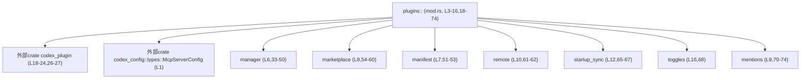
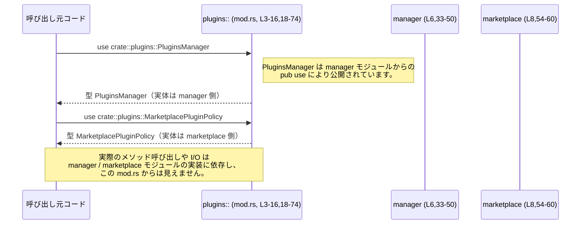

# core/src/plugins/mod.rs

## 0. ざっくり一言

- プラグイン機能一式（マーケットプレイス、マニフェスト、リモート同期、トグルなど）の **公開 API を一か所に集約するファサードモジュール** です（`mod` と `pub use` のみで構成、`core/src/plugins/mod.rs:L3-16,L18-74`）。
- 実際の処理ロジックは `manager` / `marketplace` / `manifest` / `remote` などのサブモジュールや外部クレート `codex_plugin` にあり、このファイルはそれらを再エクスポートして利用しやすくしています（`core/src/plugins/mod.rs:L6-8,L18-27,L33-62`）。

---

## 1. このモジュールの役割

### 1.1 概要

- このモジュールは **プラグインの読み込み・管理・マーケットプレイス連携などに関する API を集約する窓口** として存在しています。
- 具体的には、  
  - 外部クレート `codex_plugin` が定義するプラグイン ID・テレメトリ・ロード結果などの型を再エクスポートし（`core/src/plugins/mod.rs:L18-27`）、  
  - 内部サブモジュール `manager`, `marketplace`, `manifest`, `remote`, `startup_sync`, `toggles`, `mentions` などが提供する管理機能・エラー型・ユーティリティ関数を再エクスポートします（`core/src/plugins/mod.rs:L33-68,L70-74`）。
- これにより、**利用側コードは `crate::plugins` を import するだけで、プラグイン関連の主要機能にアクセス**できる構造になっています。

### 1.2 アーキテクチャ内での位置づけ

このファイルから読み取れる依存関係（＝どのモジュールのシンボルを公開しているか）を図示します。



- `plugins::` モジュールが **上位のファサード** であり、実際のビジネスロジックは各サブモジュールと `codex_plugin` に分散していることが分かります（`core/src/plugins/mod.rs:L3-16,L18-27,L33-68,L70-74`）。

### 1.3 設計上のポイント

コードから読み取れる設計上の特徴は次の通りです。

- **ファサード／集約モジュール**
  - `mod XXX` でサブモジュールを宣言しつつ（`core/src/plugins/mod.rs:L3-13,L16`）、  
    `pub use` / `pub(crate) use` で必要なシンボルだけを集約的に公開しています（`core/src/plugins/mod.rs:L18-24,L26-27,L29-32,L33-68,L70-74`）。
- **外部クレートに対する型固定**
  - `LoadedPlugin` と `PluginLoadOutcome` は `codex_plugin` のジェネリック型に `McpServerConfig` を適用した **型エイリアス** になっており、コア側として「プラグインの設定型は `McpServerConfig` を使う」という前提を固定しています（`core/src/plugins/mod.rs:L1,L26-27`）。
- **責務分割**
  - モジュール名と再エクスポートされる名前から、責務が分かれていることが読み取れます：
    - `manager`：プラグイン・マーケットプレイスのインストール／読み込み／同期管理（`PluginsManager`, `PluginInstallRequest` など、`core/src/plugins/mod.rs:L33-50`）
    - `marketplace`：マーケットプレイスのポリシーとバリデーション（`MarketplacePluginPolicy`, `validate_marketplace_root` など、`core/src/plugins/mod.rs:L54-60`）
    - `manifest`：マニフェストのインターフェースとロード（`PluginManifestInterface`, `load_plugin_manifest` など、`core/src/plugins/mod.rs:L51-53`）
    - `remote`, `startup_sync`：リモートリポジトリからの取得と同期（`RemotePluginFetchError`, `sync_openai_plugins_repo` など、`core/src/plugins/mod.rs:L61-62,L65-67`）
    - `toggles`：プラグインの有効化候補収集（`core/src/plugins/mod.rs:L68`）
    - `mentions`：メッセージからのプラグイン／ツール参照解析（`core/src/plugins/mod.rs:L70-74`）
- **安全性・エラー・並行性に関する情報**
  - このファイル自体には `unsafe` ブロックやスレッド／非同期関連の記述（`async`, `tokio` など）は存在せず、**Rust の通常のモジュール再エクスポートのみ**が行われています（`core/src/plugins/mod.rs:L1-74`）。
  - エラー型と思われる名前（`PluginInstallError`, `MarketplaceError`, `RemotePluginFetchError` など）が多数再エクスポートされていますが、**具体的なエラー条件やエラーハンドリング方針はこのチャンクには現れません**（`core/src/plugins/mod.rs:L38-39,L43,L54-55,L61`）。

---

## 2. 主要な機能一覧

このファイルが公開する（あるいはクレート内に公開する）主要機能を、名前と役割レベルで整理します。挙動の詳細はサブモジュール側の実装が必要ですが、このチャンクでは名前と所在のみ把握できます。

- プラグイン識別・テレメトリ関連型の公開  
  - `AppConnectorId`, `PluginId`, `PluginCapabilitySummary`, `PluginTelemetryMetadata`, `PluginIdError`, `EffectiveSkillRoots` など（`core/src/plugins/mod.rs:L18-24`）
- プラグインロード結果の型エイリアス  
  - `LoadedPlugin = codex_plugin::LoadedPlugin<McpServerConfig>`（`core/src/plugins/mod.rs:L26`）  
  - `PluginLoadOutcome = codex_plugin::PluginLoadOutcome<McpServerConfig>`（`core/src/plugins/mod.rs:L27`）
- プラグインの自動検出・インジェクション（クレート内向け）  
  - `list_tool_suggest_discoverable_plugins`（`core/src/plugins/mod.rs:L29`）  
  - `build_plugin_injections`（`core/src/plugins/mod.rs:L30`）
- ローカルマーケットプレイスのインストールディレクトリ管理  
  - `INSTALLED_MARKETPLACES_DIR`, `marketplace_install_root`（`core/src/plugins/mod.rs:L31-32`）
- プラグイン・マーケットプレイス管理（詳細 API 群）  
  - `PluginsManager` と関連する `PluginInstallRequest`, `PluginInstallOutcome`, `PluginDetail`, `PluginReadRequest`, `PluginReadOutcome`, `PluginUninstallError`, `PluginRemoteSyncError` など（`core/src/plugins/mod.rs:L33-50`）  
  - OpenAI キュレートマーケットプレイス関連の名前 `OPENAI_CURATED_MARKETPLACE_NAME`, `RemotePluginSyncResult` など（`core/src/plugins/mod.rs:L36,L46`）
- プラグインマニフェスト関連  
  - `PluginManifestInterface`（公開）、`PluginManifestPaths`, `load_plugin_manifest`（クレート内向け）（`core/src/plugins/mod.rs:L51-53`）
- マーケットプレイスポリシーとバリデーション  
  - `MarketplaceError`, `MarketplaceListError`, `MarketplacePluginPolicy`, `MarketplacePluginAuthPolicy`, `MarketplacePluginInstallPolicy`, `MarketplacePluginSource`, `validate_marketplace_root`（`core/src/plugins/mod.rs:L54-60`）
- リモートマーケット情報の取得  
  - `RemotePluginFetchError`, `fetch_remote_featured_plugin_ids`（`core/src/plugins/mod.rs:L61-62`）
- プラグインの説明レンダリング（クレート内向け）  
  - `render_explicit_plugin_instructions`, `render_plugins_section`（`core/src/plugins/mod.rs:L63-64`）
- 起動時のリポジトリ同期（クレート内向け）  
  - `curated_plugins_repo_path`, `read_curated_plugins_sha`, `sync_openai_plugins_repo`（`core/src/plugins/mod.rs:L65-67`）
- プラグイン有効化候補収集  
  - `collect_plugin_enabled_candidates`（`core/src/plugins/mod.rs:L68`）
- メッセージからのプラグイン／ツールメンション解析（クレート内向け）  
  - `build_connector_slug_counts`, `build_skill_name_counts`, `collect_explicit_app_ids`, `collect_explicit_plugin_mentions`, `collect_tool_mentions_from_messages`（`core/src/plugins/mod.rs:L70-74`）

---

## 3. 公開 API と詳細解説

### 3.1 型一覧（構造体・列挙体など）

このファイルから見える主要な型・エイリアス・エラー型等の一覧です。**型の中身やメソッドはこのチャンクには現れません**。

| 名前 | 種別 | 可視性 | 定義元 | 役割 / 用途（名前と文脈から） | 根拠 |
|------|------|--------|--------|-------------------------------|------|
| `McpServerConfig` | 構造体（外部クレート） | - | `codex_config::types` | MCP サーバー設定を表す設定型 | `core/src/plugins/mod.rs:L1` |
| `AppConnectorId` | 型（外部クレート） | `pub` | `codex_plugin` | プラグインまたはコネクタを識別する ID と推測されますが、詳細不明 | `core/src/plugins/mod.rs:L18` |
| `EffectiveSkillRoots` | 型（外部クレート） | `pub` | `codex_plugin` | 「スキルのルート集合」を表す型と推測されますが、詳細不明 | `core/src/plugins/mod.rs:L19` |
| `PluginCapabilitySummary` | 型（外部クレート） | `pub` | `codex_plugin` | プラグインの機能概要を保持する型と推測されますが、詳細不明 | `core/src/plugins/mod.rs:L20` |
| `PluginId` | 型（外部クレート） | `pub` | `codex_plugin` | プラグインを一意に識別する ID 型 | `core/src/plugins/mod.rs:L21` |
| `PluginIdError` | エラー型（外部クレート） | `pub` | `codex_plugin` | `PluginId` の生成・パースに失敗したことを表すエラーと推測されますが、詳細不明 | `core/src/plugins/mod.rs:L22` |
| `PluginTelemetryMetadata` | 型（外部クレート） | `pub` | `codex_plugin` | プラグインに関するテレメトリ用メタデータを保持する型と推測されますが、詳細不明 | `core/src/plugins/mod.rs:L23` |
| `LoadedPlugin` | 型エイリアス | `pub` | `codex_plugin` | `codex_plugin::LoadedPlugin<McpServerConfig>` へのエイリアス。プラグインロード済みインスタンスを表す汎用型と推測されますが、中身は不明 | `core/src/plugins/mod.rs:L1,L26` |
| `PluginLoadOutcome` | 型エイリアス | `pub` | `codex_plugin` | `codex_plugin::PluginLoadOutcome<McpServerConfig>` へのエイリアス。ロード処理の結果（成功／失敗など）を表す型と推測されますが、中身は不明 | `core/src/plugins/mod.rs:L1,L27` |
| `ConfiguredMarketplace` | 型 | `pub` | `manager` | 設定済みマーケットプレイスを表す型と推測されますが、詳細不明 | `core/src/plugins/mod.rs:L33` |
| `ConfiguredMarketplaceListOutcome` | 型 | `pub` | `manager` | マーケットプレイス一覧取得の結果を表す型と推測されますが、詳細不明 | `core/src/plugins/mod.rs:L34` |
| `ConfiguredMarketplacePlugin` | 型 | `pub` | `manager` | マーケットプレイス上のプラグイン情報を表す型と推測されますが、詳細不明 | `core/src/plugins/mod.rs:L35` |
| `OPENAI_CURATED_MARKETPLACE_NAME` | 定数 | `pub` | `manager` | OpenAI キュレートマーケットプレイスの名前文字列と推測されますが、値は不明 | `core/src/plugins/mod.rs:L36` |
| `PluginDetail` | 型 | `pub` | `manager` | プラグインの詳細情報を表す型と推測されますが、詳細不明 | `core/src/plugins/mod.rs:L37` |
| `PluginInstallError` | エラー型 | `pub` | `manager` | プラグインインストール失敗のエラー型と推測されますが、詳細不明 | `core/src/plugins/mod.rs:L38` |
| `PluginInstallOutcome` | 型 | `pub` | `manager` | プラグインインストール結果（成功時情報など）を表す型と推測されますが、詳細不明 | `core/src/plugins/mod.rs:L39` |
| `PluginInstallRequest` | 型 | `pub` | `manager` | プラグインインストール要求内容を表す型と推測されますが、詳細不明 | `core/src/plugins/mod.rs:L40` |
| `PluginReadOutcome` | 型 | `pub` | `manager` | プラグイン情報読み出し処理の結果を表す型と推測されますが、詳細不明 | `core/src/plugins/mod.rs:L41` |
| `PluginReadRequest` | 型 | `pub` | `manager` | プラグイン情報読み出し要求を表す型と推測されますが、詳細不明 | `core/src/plugins/mod.rs:L42` |
| `PluginRemoteSyncError` | エラー型 | `pub` | `manager` | リモート同期失敗のエラー型と推測されますが、詳細不明 | `core/src/plugins/mod.rs:L43` |
| `PluginUninstallError` | エラー型 | `pub` | `manager` | プラグインアンインストール失敗のエラー型と推測されますが、詳細不明 | `core/src/plugins/mod.rs:L44` |
| `PluginsManager` | 型 | `pub` | `manager` | プラグインとマーケットプレイスの統括的な管理を行う型と推測されますが、メソッドは不明 | `core/src/plugins/mod.rs:L45` |
| `RemotePluginSyncResult` | 型 | `pub` | `manager` | リモートプラグイン同期処理の結果を表す型と推測されますが、詳細不明 | `core/src/plugins/mod.rs:L46` |
| `PluginManifestInterface` | 型 | `pub` | `manifest` | プラグインマニフェストのインターフェースを表す型と推測されますが、詳細不明 | `core/src/plugins/mod.rs:L51` |
| `PluginManifestPaths` | 型 | `pub(crate)` | `manifest` | マニフェスト関連ファイルパス集合を表す型と推測されますが、詳細不明 | `core/src/plugins/mod.rs:L52` |
| `MarketplaceError` | エラー型 | `pub` | `marketplace` | マーケットプレイス関連の汎用エラー型と推測されますが、詳細不明 | `core/src/plugins/mod.rs:L54` |
| `MarketplaceListError` | エラー型 | `pub` | `marketplace` | マーケットプレイス一覧取得エラーと推測されますが、詳細不明 | `core/src/plugins/mod.rs:L55` |
| `MarketplacePluginAuthPolicy` | 型 | `pub` | `marketplace` | プラグインごとの認可ポリシーを表す型と推測されますが、詳細不明 | `core/src/plugins/mod.rs:L56` |
| `MarketplacePluginInstallPolicy` | 型 | `pub` | `marketplace` | プラグインインストールポリシーを表す型と推測されますが、詳細不明 | `core/src/plugins/mod.rs:L57` |
| `MarketplacePluginPolicy` | 型 | `pub` | `marketplace` | 認可・インストールなどを含んだ総合ポリシー型と推測されますが、詳細不明 | `core/src/plugins/mod.rs:L58` |
| `MarketplacePluginSource` | 型 | `pub` | `marketplace` | プラグインの配布元（ソース）を表す型と推測されますが、詳細不明 | `core/src/plugins/mod.rs:L59` |
| `RemotePluginFetchError` | エラー型 | `pub` | `remote` | リモートからのプラグイン情報取得時のエラー型と推測されますが、詳細不明 | `core/src/plugins/mod.rs:L61` |

※ 上記の「役割 / 用途」は**名前と周辺の文脈のみを根拠とした推測**であり、実際の型定義はこのチャンクには含まれていません。

### 3.2 関数詳細（最大 7 件）

このファイル自体には関数定義がなく、すべて他モジュールの関数を再エクスポートしています。そのため、**関数シグネチャ・戻り値・内部処理はこのチャンクからは確認できません**。  
ここでは「どのモジュールから再エクスポートされているか」だけを明示します。

#### `load_plugin_mcp_servers(...) -> ...`（シグネチャ不明）

**概要**

- `manager` モジュール由来の関数で、この `mod.rs` から公開されています（`core/src/plugins/mod.rs:L49`）。
- 名前から、MCP サーバー向けプラグインのロード処理を行う関数と推測されますが、**シグネチャ・具体的挙動はこのチャンクにはありません**。

**引数**

| 引数名 | 型 | 説明 |
|--------|----|------|
| - | - | このファイルには関数シグネチャが存在しないため不明です。 |

**戻り値**

- 不明（`core/src/plugins/mod.rs` には戻り値の型情報がありません）。

**内部処理の流れ**

- 実装がこのチャンクには含まれていないため不明です。

**Examples（使用例）**

- 安全にコンパイル可能な使用例を記述するために必要な情報（引数型・戻り値型・メソッドなど）が不足しているため、このファイル単体からは示せません。

**Errors / Panics**

- `PluginLoadOutcome` や `RemotePluginSyncError` など関連しそうな型名はありますが、どのような条件で `Err` になるか等は不明です。

**Edge cases / 使用上の注意点**

- プラグインロード処理であることから、ファイルシステム／ネットワーク I/O や設定の妥当性チェックが関与すると推測できますが、詳細は `manager` モジュールの実装が無いと判断できません。

#### `load_plugin_apps(...) -> ...`（シグネチャ不明）

- `manager` モジュール由来で、アプリケーション向けプラグインのロードに関わる関数名です（`core/src/plugins/mod.rs:L48`）。
- 上記 `load_plugin_mcp_servers` と同様、シグネチャ・挙動は不明です。

#### `validate_plugin_segment(...) -> ...`

- `codex_plugin` クレート由来の関数で、このモジュールから公開されています（`core/src/plugins/mod.rs:L24`）。
- 「plugin segment」のバリデーションを行う関数名ですが、どのような入力・エラーを扱うかは不明です。

#### `validate_marketplace_root(...) -> ...`

- `marketplace` モジュール由来の関数で、マーケットプレイスのルートディレクトリ等を検証する関数名です（`core/src/plugins/mod.rs:L60`）。
- 実際の入力（パスか URL か等）・戻り値はこのチャンクには現れません。

#### `sync_openai_plugins_repo(...) -> ...`

- `startup_sync` モジュール由来の関数で、OpenAI プラグインリポジトリの同期を行うと推測される名前です（`core/src/plugins/mod.rs:L67`）。
- ネットワーク I/O やファイル書き込みなどが関わる可能性がありますが、具体的なエラー処理や並行性は不明です。

#### `collect_plugin_enabled_candidates(...) -> ...`

- `toggles` モジュール由来の関数で、プラグインの有効化候補を収集する処理を表す名前です（`core/src/plugins/mod.rs:L68`）。
- 設定やテレメトリ情報などから候補を集める可能性がありますが、詳細は不明です。

#### `fetch_remote_featured_plugin_ids(...) -> ...`

- `remote` モジュール由来の関数で、リモート側で「featured」扱いされているプラグイン ID を取得する処理名です（`core/src/plugins/mod.rs:L62`）。
- どのようなプロトコル／API を叩くか、エラー時の挙動などはこのチャンクには含まれていません。

> 上記 7 関数はいずれも **再エクスポートされていることだけが事実** であり、  
> シグネチャ・内部アルゴリズム・エラー条件・スレッド安全性についてはこのチャンクからは判断できません。

### 3.3 その他の関数・再エクスポート

このファイルが再エクスポートしているその他の関数・定数の一覧です（役割は名前からの推測を含みます）。

| 名前 | 種別 | 可視性 | 定義元 | 役割（名前と文脈からの説明） | 根拠 |
|------|------|--------|--------|-------------------------------|------|
| `list_tool_suggest_discoverable_plugins` | 関数 | `pub(crate)` | `discoverable` | ツールサジェスト用に「発見可能」なプラグイン一覧を構築する処理と推測 | `core/src/plugins/mod.rs:L3,L29` |
| `build_plugin_injections` | 関数 | `pub(crate)` | `injection` | プラグインのインジェクション情報を構築する処理と推測 | `core/src/plugins/mod.rs:L4,L30` |
| `INSTALLED_MARKETPLACES_DIR` | 定数 | `pub` | `installed_marketplaces` | マーケットプレイスインストールディレクトリのパス定数と推測 | `core/src/plugins/mod.rs:L5,L31` |
| `marketplace_install_root` | 関数 | `pub` | `installed_marketplaces` | マーケットプレイスのインストールルートパスを返す処理と推測 | `core/src/plugins/mod.rs:L5,L32` |
| `installed_plugin_telemetry_metadata` | 関数 | `pub` | `manager` | インストール済みプラグインのテレメトリメタデータ取得と推測 | `core/src/plugins/mod.rs:L47` |
| `plugin_telemetry_metadata_from_root` | 関数 | `pub` | `manager` | ルートディレクトリからテレメトリメタデータを構築する処理と推測 | `core/src/plugins/mod.rs:L50` |
| `load_plugin_manifest` | 関数 | `pub(crate)` | `manifest` | プラグインマニフェストファイルを読み込む処理と推測 | `core/src/plugins/mod.rs:L53` |
| `fetch_remote_featured_plugin_ids` | 関数 | `pub` | `remote` | 特集プラグイン ID のリモート取得と推測 | `core/src/plugins/mod.rs:L62` |
| `render_explicit_plugin_instructions` | 関数 | `pub(crate)` | `render` | プラグインの利用手順などの説明文をレンダリングする処理と推測 | `core/src/plugins/mod.rs:L63` |
| `render_plugins_section` | 関数 | `pub(crate)` | `render` | プラグイン一覧セクションのレンダリングと推測 | `core/src/plugins/mod.rs:L64` |
| `curated_plugins_repo_path` | 関数 | `pub(crate)` | `startup_sync` | キュレートプラグインリポジトリのパス取得と推測 | `core/src/plugins/mod.rs:L65` |
| `read_curated_plugins_sha` | 関数 | `pub(crate)` | `startup_sync` | キュレートリポジトリの SHA 取得と推測 | `core/src/plugins/mod.rs:L66` |
| `build_connector_slug_counts` | 関数 | `pub(crate)` | `mentions` | コネクタスラグの出現回数計測と推測 | `core/src/plugins/mod.rs:L70` |
| `build_skill_name_counts` | 関数 | `pub(crate)` | `mentions` | スキル名の出現回数計測と推測 | `core/src/plugins/mod.rs:L71` |
| `collect_explicit_app_ids` | 関数 | `pub(crate)` | `mentions` | メッセージから明示的に言及されたアプリ ID を収集すると推測 | `core/src/plugins/mod.rs:L72` |
| `collect_explicit_plugin_mentions` | 関数 | `pub(crate)` | `mentions` | メッセージからプラグイン言及を収集すると推測 | `core/src/plugins/mod.rs:L73` |
| `collect_tool_mentions_from_messages` | 関数 | `pub(crate)` | `mentions` | メッセージからツール言及を抽出すると推測 | `core/src/plugins/mod.rs:L74` |

---

## 4. データフロー（依存関係レベル）

このファイルには実際の関数呼び出しコードは含まれていないため、**実行時の処理フローを正確にたどることはできません**。  
ここでは、「呼び出し元コードがどのようにこのモジュールを経由してサブモジュールの型・関数にアクセスするか」という**名前解決レベルのフロー**を示します。



- 他モジュールは `crate::plugins` を import することで、実装の所在（`manager`, `marketplace` など）を意識せずに型・関数を利用できる構造になっています（`core/src/plugins/mod.rs:L33-60`）。
- 実際のデータフロー（プラグイン設定がどのように読み込まれ、どの関数がどの順に呼ばれるか）は、このチャンクでは**不明**です。

---

## 5. 使い方（How to Use）

### 5.1 基本的な使用方法（モジュールとしての使い方）

この `mod.rs` が担っているのは「API の集約」であり、利用側は「どのサブモジュール由来か」を意識せずに `crate::plugins` から型や関数を import できます。

```rust
// coreクレート内の別モジュールから plugins サブシステムを利用する例
use crate::plugins::{
    PluginsManager,          // manager モジュール由来（L45）
    PluginId,                // codex_plugin 由来（L21）
    MarketplacePluginPolicy, // marketplace モジュール由来（L58）
};

fn configure_plugins(manager: PluginsManager, plugin_id: PluginId) {
    // PluginsManager のメソッドや MarketplacePluginPolicy の詳細は
    // この mod.rs からは分からないため、ここでは型の受け渡しのみを示しています。
}
```

- 上のコードのように、**利用側は `crate::plugins` に対してだけ依存し、内部構造（manager / marketplace / manifest 等）に直接依存しない**設計を取りやすくなります。

### 5.2 よくある使用パターン（想定されるもの）

このチャンクから安全に言えるのは、次のようなパターンです。

- **外部クレート／上位モジュールからの利用**
  - `PluginsManager`, `PluginInstallRequest`, `MarketplacePluginPolicy` などを `use crate::plugins::...` で import する（`core/src/plugins/mod.rs:L33-45,L54-60`）。
- **クレート内のユーティリティからの利用**
  - クレート内部コードは `pub(crate)` 再エクスポート（`list_tool_suggest_discoverable_plugins`, `render_plugins_section`, `collect_tool_mentions_from_messages` など）を経由して、共通処理を呼び出す（`core/src/plugins/mod.rs:L29-30,L63-64,L70-74`）。

具体的なメソッド呼び出しや戻り値の扱いについては、実際の実装がこのチャンクには無いため説明できません。

### 5.3 よくある間違い（起こり得るもの）

コードから推測できる範囲での注意点です。

- **`pub(crate)` 再エクスポートをクレート外から使おうとする**
  - 例：`collect_tool_mentions_from_messages` や `render_plugins_section` は `pub(crate)` で再エクスポートされているため、**クレート外からは参照できません**（`core/src/plugins/mod.rs:L63-64,L70-74`）。
  - クレート外のコードからこれらを直接呼ぶとコンパイルエラーになります。
- **サブモジュールに直接依存する**
  - `core/src/plugins/mod.rs` はファサードとして設計されているため、上位コードが `crate::plugins::manager::...` など **サブモジュールに直接依存するよりも、`crate::plugins` 経由で必要な型・関数だけを使う方が変更に強い**構造になります。
  - ただし、これは再エクスポートの存在（`core/src/plugins/mod.rs:L33-50`）からの構造的推測であり、プロジェクト全体の方針はこのチャンクだけでは断定できません。

### 5.4 使用上の注意点（まとめ）

**安全性 / エラー / 並行性の観点で、この mod.rs から言えることと、言えないことを整理します。**

- 言えること
  - このファイルには `unsafe` キーワードや `static mut`、`Send`/`Sync` の明示的な実装は存在せず、**コンパイル時安全性を損なう要素は現れていません**（`core/src/plugins/mod.rs:L1-74`）。
  - 多数の「〜Error」型が公開されており、プラグイン管理処理が Result ベースでエラーを返している可能性が高いことは読み取れます（`PluginInstallError`, `MarketplaceError`, `RemotePluginFetchError` など、`core/src/plugins/mod.rs:L38,L54,L61`）。
- 言えないこと
  - 個々の関数がどのような条件で `Err` を返すか、panic する可能性があるか、非同期 I/O を行うか、スレッドプールを使うかといった **具体的なエラー条件・並行性モデルはこのチャンクからは不明**です。
  - プラグインコードの実行によるセキュリティリスク（任意コード実行、サンドボックスの有無等）についても、実装が見えないため評価できません。

---

## 6. 変更の仕方（How to Modify）

### 6.1 新しい機能を追加する場合

この `mod.rs` は主に「モジュール宣言」と「再エクスポート」で構成されているため、新しい機能を追加する場合の典型的な流れは次のようになります。

1. **サブモジュールを追加する**
   - 例：`core/src/plugins/new_feature.rs` を作成し、そこに新機能の実装を追加する。
   - `mod new_feature;` をこのファイルに追加してモジュールを登録する（`mod discoverable;` などと同じ形式、`core/src/plugins/mod.rs:L3-13,L16` を参考）。

2. **公開するシンボルを選び、再エクスポートする**
   - クレート外からも使わせたい場合は `pub use new_feature::NewType;` のように `pub use` を追加する。
   - クレート内限定でよい場合は `pub(crate) use new_feature::helper_fn;` のように `pub(crate)` を使う（`core/src/plugins/mod.rs:L29-30,L52-53,L63-67,L70-74` が既存例）。

3. **API の粒度を検討する**
   - 他の再エクスポートと同様に、「何をファサードから見せるか」を慎重に選ぶことで、内部実装の変更耐性を高められます。
   - 具体的な指針（例：全型を再エクスポートするか、入口だけにとどめるか）は、このチャンクからは分かりませんが、既存の公開範囲（`PluginsManager` など主要な型のみを公開）を参考にできます（`core/src/plugins/mod.rs:L33-50`）。

### 6.2 既存の機能を変更する場合

このファイルはビジネスロジックを持たないため、変更時の主な注意点は **API の可視性と場所の変更が利用側に与える影響** です。

- **再エクスポートの削除・変更**
  - 例：`pub use manager::PluginDetail;` を削除・`pub(crate)` に変更すると、これまで `crate::plugins::PluginDetail` を使っていたコードがコンパイルエラーになります（`core/src/plugins/mod.rs:L37`）。
  - 影響範囲を確認するには、プロジェクト全体で `PluginDetail` を検索する必要があります（このチャンクには他の使用箇所が現れません）。

- **可視性の変更**
  - `pub` → `pub(crate)` への変更はクレート外 API の縮小につながります。逆に `pub(crate)` → `pub` は API 拡大となり、外部仕様として維持する責任が生じます。
  - 例：`collect_plugin_enabled_candidates` は現在 `pub` で、外部からも利用可能です（`core/src/plugins/mod.rs:L68`）。これを `pub(crate)` に変更すると、クレート外ユーザーが使えなくなります。

- **型エイリアスの基底型変更**
  - `LoadedPlugin = codex_plugin::LoadedPlugin<McpServerConfig>` のような型エイリアスの中身を変更すると、**利用側には見えないようでいて、型互換性を失う可能性**があります（`core/src/plugins/mod.rs:L1,L26`）。
  - そのため、基底型の変更（例：`McpServerConfig` を別の設定型に変更）は、影響範囲を慎重に確認する必要があります。

---

## 7. 関連ファイル

このモジュールと密接に関係するファイル・ディレクトリです。ここに列挙するファイル名はすべて、`mod` 宣言や `use` から直接読み取れるものに限ります。

| パス | 役割 / 関係 | 根拠 |
|------|------------|------|
| `core/src/plugins/discoverable.rs` | `list_tool_suggest_discoverable_plugins` を定義するモジュールと推測されます（クレート内向け API）。 | `mod discoverable;`（`core/src/plugins/mod.rs:L3`）, `pub(crate) use discoverable::list_tool_suggest_discoverable_plugins;`（`core/src/plugins/mod.rs:L29`） |
| `core/src/plugins/injection.rs` | `build_plugin_injections` を定義するモジュールと推測されます。 | `mod injection;`（`L4`）, `pub(crate) use injection::build_plugin_injections;`（`L30`） |
| `core/src/plugins/installed_marketplaces.rs` | `INSTALLED_MARKETPLACES_DIR`, `marketplace_install_root` を定義するモジュール。インストール先ディレクトリ管理に関与。 | `mod installed_marketplaces;`（`L5`）, `pub use installed_marketplaces::...;`（`L31-32`） |
| `core/src/plugins/manager.rs` | プラグインとマーケットプレイスの管理機能（`PluginsManager` や各種 Outcome/Error 型、ロード関数）を定義する中核モジュールと推測されます。 | `mod manager;`（`L6`）, `pub use manager::...;`（`L33-50`） |
| `core/src/plugins/manifest.rs` | プラグインマニフェストのインターフェースとロード処理を提供するモジュールと推測されます。 | `mod manifest;`（`L7`）, `pub use manifest::PluginManifestInterface;`（`L51`）, `pub(crate) use manifest::...;`（`L52-53`） |
| `core/src/plugins/marketplace.rs` | マーケットプレイスのエラー型・ポリシー・ソース情報などを提供するモジュールと推測されます。 | `mod marketplace;`（`L8`）, `pub use marketplace::...;`（`L54-60`） |
| `core/src/plugins/remote.rs` | リモートプラグイン情報取得関連のモジュールと推測されます。 | `mod remote;`（`L10`）, `pub use remote::...;`（`L61-62`） |
| `core/src/plugins/render.rs` | プラグイン説明等のレンダリングユーティリティを提供するモジュールと推測されます（クレート内向け）。 | `mod render;`（`L11`）, `pub(crate) use render::...;`（`L63-64`） |
| `core/src/plugins/startup_sync.rs` | 起動時のプラグインリポジトリ同期に関するモジュールと推測されます。 | `mod startup_sync;`（`L12`）, `pub(crate) use startup_sync::...;`（`L65-67`） |
| `core/src/plugins/store.rs` | 何らかのストレージ関連処理を持つと推測されますが、この mod.rs からは API が再エクスポートされていないため詳細不明です。 | `mod store;`（`core/src/plugins/mod.rs:L13`） |
| `core/src/plugins/toggles.rs` | `collect_plugin_enabled_candidates` を定義するモジュールと推測されます。 | `mod toggles;`（`L16`）, `pub use toggles::collect_plugin_enabled_candidates;`（`L68`） |
| `core/src/plugins/mentions.rs` | メッセージからのプラグイン・ツールメンション解析ユーティリティを提供するモジュールと推測されます（クレート内向け）。 | `mod mentions;`（`L9`）, `pub(crate) use mentions::...;`（`L70-74`） |
| `core/src/plugins/test_support.rs` | テスト専用のサポートコードを提供するモジュールと推測されます（テストコンフィグ時のみ有効）。 | `#[cfg(test)] pub(crate) mod test_support;`（`core/src/plugins/mod.rs:L14-15`） |
| 外部クレート `codex_plugin` | プラグインのコア型・エラー型・バリデーション関数などを提供するクレート。 | `pub use codex_plugin::...;`（`core/src/plugins/mod.rs:L18-24,L26-27`） |
| 外部クレート `codex_config::types` | `McpServerConfig` 設定型を提供するクレート。 | `use codex_config::types::McpServerConfig;`（`core/src/plugins/mod.rs:L1`） |

---

### テスト・セキュリティ・パフォーマンスに関する補足（このファイルに基づく範囲）

- **Tests**
  - `#[cfg(test)] pub(crate) mod test_support;` により、テスト専用モジュールが存在することが分かります（`core/src/plugins/mod.rs:L14-15`）。
  - テストの具体的な内容やカバレッジは、このチャンクには含まれていません。

- **Bugs / Security**
  - このファイルはロジックを持たないため、単体で明らかなバグやセキュリティホールは読み取れません。
  - プラグインロード・リモート同期・マーケットプレイスアクセスなどは一般にセキュリティクリティカルですが、実際の防御策（検証、サンドボックス、署名検証など）がどうなっているかはサブモジュールの実装を見ないと判断できません。

- **Performance / Scalability**
  - I/O やネットワーク呼び出しの有無・頻度などパフォーマンスに関わる情報は、この mod.rs だけからは分かりません。
  - 実際のスケーラビリティは `manager`, `remote`, `startup_sync` などの実装に依存します。

このレポートは、あくまで `core/src/plugins/mod.rs` に現れている事実（モジュール構成と再エクスポート）に基づいた説明です。  
プラグインシステムの具体的な挙動やエッジケースを理解するには、それぞれのサブモジュールのコードを併せて参照する必要があります。
