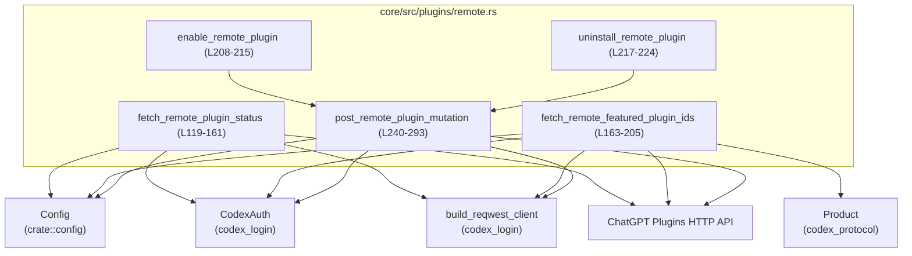
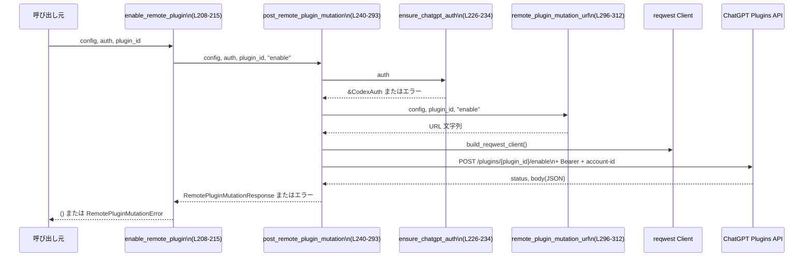

# core/src/plugins/remote.rs コード解説

## 0. ざっくり一言

ChatGPT の「リモートプラグイン」を HTTP API 経由で操作するためのモジュールです。  
プラグイン一覧・おすすめプラグイン ID の取得と、プラグインの有効化・アンインストールを行い、すべて型付きの `Result` と専用エラーで返します（`core/src/plugins/remote.rs:L9-12, L119-205, L208-224`）。

---

## 1. このモジュールの役割

### 1.1 概要

このモジュールは **ChatGPT リモートプラグインの同期と状態変更** を扱います。

- リモートプラグインの状態一覧を取得し、`RemotePluginStatusSummary` として返します（`/plugins/list` エンドポイント、`core/src/plugins/remote.rs:L119-161`）。
- 「おすすめプラグイン」の ID 一覧を取得します（`/plugins/featured`、`core/src/plugins/remote.rs:L163-205`）。
- 特定プラグインの **有効化** および **アンインストール** を行います（`/plugins/{id}/enable` / `uninstall`、`core/src/plugins/remote.rs:L208-224, L240-293`）。
- 通信エラーや認証エラーなどは `RemotePluginFetchError` / `RemotePluginMutationError` として詳細な理由付きで返します（`core/src/plugins/remote.rs:L29-82, L84-117`）。

### 1.2 アーキテクチャ内での位置づけ

このモジュールは以下のコンポーネントと連携します。

- 設定値 `Config`（`crate::config::Config`）から ChatGPT ベース URL を取得（`core/src/plugins/remote.rs:L119-131, L163-169, L296-302`）。
- 認証情報 `CodexAuth` を用いて Bearer トークンとアカウント ID を取得（`core/src/plugins/remote.rs:L133-135, L140-141, L179-186, L246-251, L256-257`）。
- `build_reqwest_client` で HTTP クライアントを構築し、非同期 HTTP 通信を行う（`core/src/plugins/remote.rs:L132, L170, L248`）。
- `Product` からプラットフォーム名を取得し、`/plugins/featured` のクエリパラメータに利用（`core/src/plugins/remote.rs:L163-167, L173-176`）。
- 外部の ChatGPT Plugins HTTP API に対して GET/POST リクエストを送信（`core/src/plugins/remote.rs:L136-152, L171-197, L252-268`）。

依存関係を Mermeid で表すと次のようになります。



### 1.3 設計上のポイント（根拠付き）

- **明確なエラー型での失敗表現**  
  - フェッチ系とミューテーション系でエラー型を分離（`RemotePluginFetchError`, `RemotePluginMutationError`）し、原因別のバリアントを用意しています（認証不足・HTTP ステータス異常・JSON デコード失敗など）（`core/src/plugins/remote.rs:L29-82, L84-117`）。
- **認証モードの厳密なチェック**  
  - プラグイン一覧取得・ミューテーションでは ChatGPT 認証（`is_chatgpt_auth`）のみを許可し、それ以外は `UnsupportedAuthMode` で失敗させています（`core/src/plugins/remote.rs:L123-128, L226-232`）。
  - 特集プラグイン ID 取得では、ChatGPT 認証であれば Bearer を付与し、それ以外の認証（または None）は「認証なし」として扱います（`core/src/plugins/remote.rs:L179-186`）。
- **HTTP タイムアウトの明示指定**  
  - フェッチ・ミューテーションごとに異なる `Duration` を定数として指定し、リクエストに `.timeout(...)` で適用しています（`core/src/plugins/remote.rs:L10-12, L137-139, L177, L253-255`）。
- **URL 組み立ての安全性**  
  - `Url::parse` と `path_segments_mut` を使ってパスを構築し、ベース URL が不正な場合は専用エラーに変換します（`core/src/plugins/remote.rs:L296-312`）。
- **非同期・スレッドセーフな構造**  
  - すべての I/O は `async fn` と `reqwest` による非同期 HTTP で行われ、モジュール内には共有可変状態がありません（`core/src/plugins/remote.rs:L119, L163, L208, L217, L240`）。
  - `unsafe` ブロックや `unwrap` によるパニックはなく、`unwrap_or_default` でボディ読み取り失敗時は空文字列にフォールバックします（`core/src/plugins/remote.rs:L152, L197, L268`）。

---

## 2. 主要な機能一覧 ＋ コンポーネントインベントリー

### 2.1 コンポーネント一覧（行番号付き）

| 名前 | 種別 | 公開範囲 | 行範囲 | 役割 |
|------|------|----------|--------|------|
| `DEFAULT_REMOTE_MARKETPLACE_NAME` | 定数 &str | モジュール内 | L9 | marketplace 名のデフォルト値 |
| `REMOTE_PLUGIN_FETCH_TIMEOUT` | 定数 `Duration` | モジュール内 | L10 | プラグイン一覧取得のタイムアウト |
| `REMOTE_FEATURED_PLUGIN_FETCH_TIMEOUT` | 定数 `Duration` | モジュール内 | L11 | 特集プラグイン取得のタイムアウト |
| `REMOTE_PLUGIN_MUTATION_TIMEOUT` | 定数 `Duration` | モジュール内 | L12 | ミューテーションのタイムアウト |
| `RemotePluginStatusSummary` | 構造体 | `pub(crate)` | L14-20 | リモートプラグインの名前・マーケットプレイス・有効フラグのサマリ |
| `RemotePluginMutationResponse` | 構造体 | モジュール内 | L22-27 | ミューテーション API のレスポンス（id と enabled） |
| `RemotePluginMutationError` | 列挙体 | `pub` | L29-82 | プラグイン有効化/アンインストール時のエラー要因 |
| `RemotePluginFetchError` | 列挙体 | `pub` | L84-117 | プラグイン一覧/特集 ID 取得時のエラー要因 |
| `fetch_remote_plugin_status` | 関数（async） | `pub(crate)` | L119-161 | `/plugins/list` からプラグイン状態一覧を取得 |
| `fetch_remote_featured_plugin_ids` | 関数（async） | `pub` | L163-205 | `/plugins/featured` からおすすめプラグイン ID を取得 |
| `enable_remote_plugin` | 関数（async） | `pub(crate)` | L208-215 | 指定プラグインを有効化 |
| `uninstall_remote_plugin` | 関数（async） | `pub(crate)` | L217-224 | 指定プラグインをアンインストール |
| `ensure_chatgpt_auth` | 関数 | モジュール内 | L226-234 | ChatGPT 認証であることを検証し、`RemotePluginMutationError` で失敗を返す |
| `default_remote_marketplace_name` | 関数 | モジュール内 | L236-238 | serde のデフォルト値として marketplace 名を生成 |
| `post_remote_plugin_mutation` | 関数（async） | モジュール内 | L240-293 | 実際にミューテーション HTTP POST を行い、レスポンス検証まで行う中核処理 |
| `remote_plugin_mutation_url` | 関数 | モジュール内 | L296-312 | ベース URL と `plugin_id`, `action` を組み合わせたミューテーション URL を生成 |

### 2.2 主要機能の一覧（機能レベル）

- リモートプラグイン一覧取得: `fetch_remote_plugin_status`（`core/src/plugins/remote.rs:L119-161`）
- リモート特集プラグイン ID 取得: `fetch_remote_featured_plugin_ids`（`core/src/plugins/remote.rs:L163-205`）
- リモートプラグイン有効化: `enable_remote_plugin`（`core/src/plugins/remote.rs:L208-215`）
- リモートプラグインのアンインストール: `uninstall_remote_plugin`（`core/src/plugins/remote.rs:L217-224`）
- ChatGPT 認証の検証: `ensure_chatgpt_auth`（`core/src/plugins/remote.rs:L226-234`）
- プラグインミューテーションリクエスト送信とレスポンス検証: `post_remote_plugin_mutation`（`core/src/plugins/remote.rs:L240-293`）
- ミューテーション用 URL 生成: `remote_plugin_mutation_url`（`core/src/plugins/remote.rs:L296-312`）

---

## 3. 公開 API と詳細解説

### 3.1 型一覧（構造体・列挙体など）

| 名前 | 種別 | 役割 / 用途 | 根拠 |
|------|------|-------------|------|
| `RemotePluginStatusSummary` | 構造体 (`pub(crate)`) | リモートプラグインの名前・マーケットプレイス名・有効状態を表すサマリ。プラグイン一覧レスポンスの各要素として利用されます。`marketplace_name` は `default_remote_marketplace_name` をデフォルトとするフィールドです。 | `core/src/plugins/remote.rs:L14-20, L17-18` |
| `RemotePluginMutationResponse` | 構造体 | ミューテーション API の JSON レスポンスをパースするための内部用型。`id` と `enabled` を保持します。`camelCase` でデシリアライズされます。 | `core/src/plugins/remote.rs:L22-27` |
| `RemotePluginMutationError` | 列挙体 (`pub`) | プラグイン有効化/アンインストール処理の失敗理由を表すエラー型。認証不足、URL 不正、HTTP エラー、JSON パースエラー、レスポンス内容不整合などを区別します。 | `core/src/plugins/remote.rs:L29-82` |
| `RemotePluginFetchError` | 列挙体 (`pub`) | プラグイン一覧・特集 ID 取得時の失敗理由を表すエラー型。認証不足（一覧同期時）、HTTP エラー、JSON パースエラーなどを区別します。 | `core/src/plugins/remote.rs:L84-117` |

### 3.2 関数詳細（7件）

#### `fetch_remote_plugin_status(config: &Config, auth: Option<&CodexAuth>) -> Result<Vec<RemotePluginStatusSummary>, RemotePluginFetchError>`

**概要**

ChatGPT アカウントに紐づくリモートプラグインの状態一覧を取得し、`RemotePluginStatusSummary` のベクタとして返します。ChatGPT 認証が必須です（`core/src/plugins/remote.rs:L119-161`）。

**引数**

| 引数名 | 型 | 説明 |
|--------|----|------|
| `config` | `&Config` | ChatGPT ベース URL（`chatgpt_base_url`）などを含む設定。ここでは `chatgpt_base_url` を利用して API エンドポイントを組み立てます（L130-131）。 |
| `auth` | `Option<&CodexAuth>` | 認証情報。`Some` かつ `is_chatgpt_auth()` が `true` の場合のみ利用可能です（L123-128）。 |

**戻り値**

- `Ok(Vec<RemotePluginStatusSummary>)`: `/plugins/list` から取得した JSON を `Vec<RemotePluginStatusSummary>` としてデコードできた場合（L157-160）。
- `Err(RemotePluginFetchError)`: 認証不足、トークン取得失敗、HTTP 通信エラー、ステータス異常、JSON デコード失敗などの場合。

**内部処理の流れ**

1. `auth` が `Some` であるかをチェックし、`None` の場合は `RemotePluginFetchError::AuthRequired` を返します（L123-125）。
2. `auth.is_chatgpt_auth()` が `true` かを確認し、`false` の場合は `UnsupportedAuthMode` を返します（L126-128）。
3. `config.chatgpt_base_url` の末尾スラッシュを削除し、`/plugins/list` を結合して完全な URL 文字列を作成します（L130-131）。
4. `build_reqwest_client()` で HTTP クライアントを生成します（L132）。
5. `auth.get_token()` で Bearer トークンを取得し、IO エラーは `RemotePluginFetchError::AuthToken` に変換します（L133-135）。
6. GET リクエストを組み立て、タイムアウトと Bearer 認証、必要なら `chatgpt-account-id` ヘッダを設定します（L136-142）。
7. `.send().await` でリクエストを送信し、`reqwest::Error` は `RemotePluginFetchError::Request { url, source }` に変換します（L144-150）。
8. レスポンスステータスとボディ文字列を取得します。ボディ取得に失敗した場合は空文字列にフォールバックします（`unwrap_or_default`、L151-152）。
9. ステータスが成功 (`2xx`) でない場合、`UnexpectedStatus { url, status, body }` を返します（L153-155）。
10. 成功の場合、ボディを `serde_json::from_str` で `Vec<RemotePluginStatusSummary>` にパースし、失敗時は `Decode { url, source }` を返します（L157-160）。

**Examples（使用例）**

```rust
use crate::config::Config;
use codex_login::CodexAuth;
use core::plugins::remote::{fetch_remote_plugin_status, RemotePluginFetchError};

// リモートプラグイン一覧を取得する非同期関数の例
async fn list_remote_plugins_example(
    config: &Config,                // ChatGPT ベース URL を含む設定
    auth: &CodexAuth,               // ChatGPT 認証済みの CodexAuth
) -> Result<(), RemotePluginFetchError> {
    // Some(&auth) を渡して認証必須の API を呼び出す
    let plugins = fetch_remote_plugin_status(config, Some(auth)).await?; // エラー時は RemotePluginFetchError

    for plugin in plugins {         // 取得したプラグイン一覧をループ
        println!(
            "name={}, marketplace={}, enabled={}",
            plugin.name,           // プラグイン名
            plugin.marketplace_name, // マーケットプレイス名（デフォルト: "openai-curated"）
            plugin.enabled,        // 有効フラグ
        );
    }

    Ok(())                         // 正常終了
}
```

**Errors / Panics**

- `RemotePluginFetchError::AuthRequired`  
  `auth` が `None` の場合（L123-125）。
- `RemotePluginFetchError::UnsupportedAuthMode`  
  `auth.is_chatgpt_auth()` が `false` の場合（L126-128）。
- `RemotePluginFetchError::AuthToken(std::io::Error)`  
  `auth.get_token()` が失敗した場合（L133-135）。
- `RemotePluginFetchError::Request { url, source: reqwest::Error }`  
  リクエスト送信時に `reqwest::Error` が発生した場合（L144-150）。
- `RemotePluginFetchError::UnexpectedStatus { url, status, body }`  
  HTTP ステータスが成功 (`2xx`) 以外の場合（L151-155）。
- `RemotePluginFetchError::Decode { url, source: serde_json::Error }`  
  レスポンスボディの JSON パースに失敗した場合（L157-160）。

この関数自身はパニックを起こしません（`panic!` や `unwrap()` は使用していません。`unwrap_or_default` のみです、L152）。

**Edge cases（エッジケース）**

- `auth = None` の場合: 即座に `AuthRequired` が返ります（L123-125）。
- ChatGPT 以外の認証モード: `UnsupportedAuthMode` で失敗します（L126-128）。
- ボディ読み取りに失敗した場合: 空文字列として扱われ、結果として `Decode` エラーになる可能性があります。元の IO エラーは失われます（L151-152, L157-160）。
- JSON 形式が想定と異なる場合（配列でない、フィールド欠如など）: `serde_json::Error` による `Decode` エラーとなります（L157-160）。

**使用上の注意点**

- ChatGPT 認証が必須であり、API キー認証等は `UnsupportedAuthMode` になります（L126-128）。
- エラーには URL とステータス・ボディが含まれるため、ログ出力時にボディに含まれる情報の扱いに注意が必要です（`UnexpectedStatus` バリアント、L104-109, L155）。
- 高頻度で呼び出すと、その都度ネットワークアクセスが発生します。キャッシュ戦略が必要な場合は、呼び出し側で結果を保持する必要があります（このファイル内にはキャッシュ処理はありません）。

---

#### `fetch_remote_featured_plugin_ids(config: &Config, auth: Option<&CodexAuth>, product: Option<Product>) -> Result<Vec<String>, RemotePluginFetchError>`

**概要**

ChatGPT の「特集」リモートプラグイン ID 一覧を取得します。  
`platform` クエリパラメータに `Product` に応じた値を指定し、レスポンス JSON を `Vec<String>` として返します（`core/src/plugins/remote.rs:L163-205`）。

**引数**

| 引数名 | 型 | 説明 |
|--------|----|------|
| `config` | `&Config` | ChatGPT ベース URL を含む設定（L168-169）。 |
| `auth` | `Option<&CodexAuth>` | 認証情報。ChatGPT 認証であれば Bearer / account-id が付与されますが、必須ではありません（L179-186）。 |
| `product` | `Option<Product>` | プラットフォーム識別用。指定がなければ `Product::Codex` が使われ、`.to_app_platform()` の結果が `platform` クエリにセットされます（L173-176）。 |

**戻り値**

- `Ok(Vec<String>)`: 特集プラグイン ID の一覧を JSON からパースできた場合（L202-205）。
- `Err(RemotePluginFetchError)`: トークン取得エラー、HTTP 通信エラー、ステータス異常、JSON デコード失敗などの場合。

**内部処理の流れ**

1. `config.chatgpt_base_url` と `/plugins/featured` を組み合わせて URL を構築（L168-169）。
2. `build_reqwest_client()` で HTTP クライアントを生成（L170）。
3. `product.unwrap_or(Product::Codex).to_app_platform()` を `platform` クエリパラメータとして設定（L173-176）。
4. タイムアウトを `REMOTE_FEATURED_PLUGIN_FETCH_TIMEOUT` に設定（L177）。
5. `auth.filter(|auth| auth.is_chatgpt_auth())` によって ChatGPT 認証のみを残し、存在する場合のみ Bearer と `chatgpt-account-id` ヘッダを付加（L179-186）。
6. `.send().await` でリクエスト送信し、エラーは `RemotePluginFetchError::Request` へ変換（L189-195）。
7. ステータスとボディ文字列を取得し、失敗時はボディを空文字列にフォールバック（L196-197）。
8. ステータスが成功以外なら `UnexpectedStatus { url, status, body }` を返す（L198-200）。
9. 成功時は `serde_json::from_str` で `Vec<String>` にパースし、失敗時は `Decode { url, source }` を返す（L202-205）。

**Examples（使用例）**

```rust
use crate::config::Config;
use codex_login::CodexAuth;
use codex_protocol::protocol::Product;
use core::plugins::remote::{fetch_remote_featured_plugin_ids, RemotePluginFetchError};

// 特集プラグイン ID を取得する例
async fn fetch_featured_example(
    config: &Config,               // Config
    maybe_auth: Option<&CodexAuth> // 認証は任意
) -> Result<Vec<String>, RemotePluginFetchError> {
    // Product を明示せずに呼び出す（デフォルトで Product::Codex が使われる）
    let ids = fetch_remote_featured_plugin_ids(config, maybe_auth, None).await?;
    Ok(ids)                        // Vec<String>（各要素が plugin_id）
}
```

**Errors / Panics**

- `RemotePluginFetchError::AuthToken`  
  ChatGPT 認証が渡され、`get_token()` が失敗した場合（L179-183）。
- `RemotePluginFetchError::Request`  
  リクエスト送信時の `reqwest::Error`（L189-195）。
- `RemotePluginFetchError::UnexpectedStatus`  
  非成功ステータスコードの場合（L196-200）。
- `RemotePluginFetchError::Decode`  
  JSON パース失敗時（L202-205）。

`auth` が `None` または ChatGPT 以外の認証モードであっても、エラーにはなりません。認証ヘッダを付けずに呼び出すだけです（L179-186）。  
パニックは発生しません（`panic!` / `unwrap` は使用していません。`unwrap_or_default` のみ、L197）。

**Edge cases**

- `product = None`: 常に `Product::Codex` が選択されます（L173-176）。
- 認証が ChatGPT 以外: `auth.filter` により認証ヘッダが付かず、実質「認証なし」リクエストになります（L179-186）。
- ボディ読み取り失敗: 空文字列扱いになり、その後 `Decode` エラーになる可能性があります（L196-197, L202-205）。

**使用上の注意点**

- 認証は任意ですが、アカウントに依存した特集結果が必要な場合は ChatGPT 認証を渡す必要があります（L179-186）。
- こちらもエラーにレスポンスボディが含まれるため、ログ出力などでの情報露出に注意が必要です（L198-200）。

---

#### `enable_remote_plugin(config: &Config, auth: Option<&CodexAuth>, plugin_id: &str) -> Result<(), RemotePluginMutationError>`

**概要**

指定した `plugin_id` のリモートプラグインを「有効化」するためのラッパー関数です。内部で `post_remote_plugin_mutation` を `"enable"` アクションで呼び出します（`core/src/plugins/remote.rs:L208-215`）。

**引数**

| 引数名 | 型 | 説明 |
|--------|----|------|
| `config` | `&Config` | ミューテーション URL のベースとなる `chatgpt_base_url` を含む設定（L209）。 |
| `auth` | `Option<&CodexAuth>` | ChatGPT 認証が必須です。`None` や非 ChatGPT 認証の場合はエラーになります（`ensure_chatgpt_auth`、L226-232）。 |
| `plugin_id` | `&str` | 有効化対象のプラグイン ID（L211, L213）。 |

**戻り値**

- `Ok(())`: リモート側で有効化が成功し、レスポンス検証も通った場合（`post_remote_plugin_mutation` が `Ok` を返した場合）。
- `Err(RemotePluginMutationError)`: 認証不足、URL 不正、HTTP エラー、JSON デコードエラー、レスポンス内容の不整合など。

**内部処理の流れ**

1. `post_remote_plugin_mutation(config, auth, plugin_id, "enable")` を呼び出し、結果を待機（L213）。
2. 結果が `Err` の場合、そのまま `RemotePluginMutationError` が返されます。
3. `Ok` の場合、返り値（`RemotePluginMutationResponse`）は破棄され、`Ok(())` が返されます（L214）。

**Errors / Edge cases**

- エラー条件はすべて `post_remote_plugin_mutation` に委譲されます（詳細後述、L240-293）。
- `auth = None` や非 ChatGPT 認証の場合は `AuthRequired` / `UnsupportedAuthMode`（L226-232）。

**使用上の注意点**

- `plugin_id` がリモートに存在しない場合など、HTTP エラーやレスポンス不一致により `UnexpectedStatus` / `UnexpectedPluginId` / `UnexpectedEnabledState` となる可能性があります（L55-81, L278-290）。
- 実際の有効化状態は `post_remote_plugin_mutation` 内で `parsed.enabled == true` かどうか検証されていますが、この関数の戻り値は `()` なので、詳細情報が必要な場合は `post_remote_plugin_mutation` の利用を検討する必要があります。

---

#### `uninstall_remote_plugin(config: &Config, auth: Option<&CodexAuth>, plugin_id: &str) -> Result<(), RemotePluginMutationError>`

**概要**

指定した `plugin_id` のリモートプラグインをアンインストールするラッパー関数です。`post_remote_plugin_mutation` を `"uninstall"` アクションで呼び出します（`core/src/plugins/remote.rs:L217-224`）。

仕様は `enable_remote_plugin` とほぼ同じで、`action` だけが異なります（L222）。

**使用上の注意点**

- `post_remote_plugin_mutation` が `expected_enabled = action == "enable"` としているため、`"uninstall"` の場合 `expected_enabled` は `false` となります（L278）。リモートレスポンスの `enabled` フラグが `false` でない場合、`UnexpectedEnabledState` が返されます（L285-290）。

---

#### `ensure_chatgpt_auth(auth: Option<&CodexAuth>) -> Result<&CodexAuth, RemotePluginMutationError>`

**概要**

プラグインミューテーションで使用する認証情報について、「存在すること」と「ChatGPT 認証モードであること」を検証し、満たさない場合は対応する `RemotePluginMutationError` を返します（`core/src/plugins/remote.rs:L226-234`）。

**引数**

| 引数名 | 型 | 説明 |
|--------|----|------|
| `auth` | `Option<&CodexAuth>` | 認証情報。`Some` かつ `is_chatgpt_auth() == true` でなければなりません。 |

**戻り値**

- `Ok(&CodexAuth)`: 検証を通過した場合、`CodexAuth` への参照を返します（L233-234）。
- `Err(RemotePluginMutationError)`:
  - `AuthRequired`（`auth = None` の場合、L227-229）。
  - `UnsupportedAuthMode`（ChatGPT 認証でない場合、L230-232）。

**使用上の注意点**

- ミューテーション系 API でのみ使われており、フェッチ系 (`fetch_remote_plugin_status` など) では独自に同様のチェックを行っています（L123-128, L246）。
- フェッチ系に対応する `RemotePluginFetchError` とエラー型が異なるため、共通化していません。呼び出し側で `RemotePluginMutationError` を扱えるコンテキストでのみ利用できます。

---

#### `post_remote_plugin_mutation(config: &Config, auth: Option<&CodexAuth>, plugin_id: &str, action: &str) -> Result<RemotePluginMutationResponse, RemotePluginMutationError>`

**概要**

プラグイン有効化やアンインストールなど、指定された `action` に基づいてリモートプラグインの状態を変更する中核関数です。HTTP POST を行い、レスポンスの `id` や `enabled` フラグが期待どおりかまで検証します（`core/src/plugins/remote.rs:L240-293`）。

**引数**

| 引数名 | 型 | 説明 |
|--------|----|------|
| `config` | `&Config` | `chatgpt_base_url` からミューテーション URL を構築します（L241, L247-248, L296-302）。 |
| `auth` | `Option<&CodexAuth>` | ChatGPT 認証。`ensure_chatgpt_auth` で検証されます（L246-247）。 |
| `plugin_id` | `&str` | 対象プラグインの ID（L243, L247, L279-283, L286-290）。 |
| `action` | `&str` | `"enable"` や `"uninstall"` といったアクション文字列。URL パス最後のセグメントとして使われます（L244, L247-248, L300-311）。 |

**戻り値**

- `Ok(RemotePluginMutationResponse)`: HTTP レスポンスが成功であり、レスポンス JSON の `id` と `enabled` が期待どおりだった場合（L273-293）。
- `Err(RemotePluginMutationError)`: 認証不足、URL 不正、HTTP エラー、ステータス異常、JSON デコード失敗、レスポンス内容の不整合など。

**内部処理の流れ**

1. `ensure_chatgpt_auth(auth)` で認証検証。失敗時は `AuthRequired` / `UnsupportedAuthMode`（L246, L226-232）。
2. `remote_plugin_mutation_url(config, plugin_id, action)` で URL を生成し、`InvalidBaseUrl` / `InvalidBaseUrlPath` エラーをマッピング（L247, L296-312）。
3. `build_reqwest_client()` で HTTP クライアント生成（L248）。
4. `auth.get_token()` でトークン取得。失敗時は `AuthToken` エラー（L249-251）。
5. POST リクエストを構築し、タイムアウト／Bearer 認証／`chatgpt-account-id` ヘッダを設定（L252-258）。
6. `.send().await` でリクエスト送信。失敗時は `Request { url, source }`（L260-266）。
7. ステータスとボディを取得し、ボディ取得失敗時は空文字列にフォールバック（L267-268）。
8. ステータスが成功でない場合、`UnexpectedStatus { url, status, body }`（L269-271）。
9. 成功時はボディを `RemotePluginMutationResponse` にデコード。失敗時は `Decode { url, source }`（L273-277）。
10. `expected_enabled = action == "enable"` とし、`parsed.id` と `plugin_id` が一致するかチェック。一致しない場合 `UnexpectedPluginId`（L278-283）。
11. `parsed.enabled` が `expected_enabled` かどうかをチェック。一致しない場合 `UnexpectedEnabledState`（L285-290）。
12. すべて問題なければ `Ok(parsed)` を返します（L293）。

**Errors / Panics**

- `AuthRequired`, `UnsupportedAuthMode`（L226-232, L246）。
- `InvalidBaseUrl`, `InvalidBaseUrlPath`（L296-307, L301-302）。
- `AuthToken`, `Request`, `UnexpectedStatus`, `Decode`（L249-251, L260-271, L273-277）。
- `UnexpectedPluginId`, `UnexpectedEnabledState`（L278-283, L285-290）。

パニックはありません（`unwrap` は使用されず、`unwrap_or_default` のみに依存、L268）。

**Edge cases**

- `action` が `"enable"` 以外の場合、`expected_enabled` は `false` に固定されます（L278）。  
  たとえば `"uninstall"` の場合、レスポンスの `enabled` が `false` でないと `UnexpectedEnabledState` になります（L285-290）。
- レスポンス JSON が `{"id": "...", "enabled": ...}` でない場合（フィールド名違い、型違い）は `Decode` エラー（L273-277）。
- レスポンスボディが取得できない場合、空文字列を `serde_json::from_str` しようとして `Decode` エラーになります。元の IO エラーは保持されません（L267-268）。

**使用上の注意点**

- API の仕様変更（例えば `enabled` フラグの意味変更、追加フィールドのみの変更など）によって `UnexpectedPluginId` / `UnexpectedEnabledState` が発生する可能性があります。  
- エラーには URL とステータス、ボディ全文が含まれており、ログ等に出力する場合は情報の機密性に注意が必要です（L55-60, L269-271）。

---

#### `remote_plugin_mutation_url(config: &Config, plugin_id: &str, action: &str) -> Result<String, RemotePluginMutationError>`

**概要**

`Config` の `chatgpt_base_url` をもとに、`/plugins/{plugin_id}/{action}` 形式のミューテーション URL を安全に組み立てます（`core/src/plugins/remote.rs:L296-312`）。

**引数**

| 引数名 | 型 | 説明 |
|--------|----|------|
| `config` | `&Config` | `chatgpt_base_url` を含む設定（L297, L301）。 |
| `plugin_id` | `&str` | URL パスの 1 セグメントとして追加されるプラグイン ID（L298-299, L309）。 |
| `action` | `&str` | URL パスの最終セグメントとして追加されるアクション文字列（L299-300, L310）。 |

**戻り値**

- `Ok(String)`: パースとパス操作が成功した場合、完全な URL 文字列（例: `https://.../plugins/my_plugin/enable`）。
- `Err(RemotePluginMutationError)`:
  - `InvalidBaseUrl`: `Url::parse` が失敗した場合（L301-302）。
  - `InvalidBaseUrlPath`: `path_segments_mut` がエラーを返した場合（L304-306）。

**内部処理の流れ**

1. `config.chatgpt_base_url.trim_end_matches('/')` を `Url::parse` し、URL としてパースします。失敗した場合は `InvalidBaseUrl` に変換します（L301-302）。
2. `path_segments_mut()` を取得し、`Err(())` の場合は `InvalidBaseUrlPath` に変換します（L304-306）。
3. 末尾が空セグメントの場合 `pop_if_empty()` で削除し（L307）、`plugins`, `plugin_id`, `action` の順にセグメントを追加します（L308-310）。
4. 最終的に `url.to_string()` で文字列に変換し、返します（L312）。

**使用上の注意点**

- `chatgpt_base_url` が HTTP(S) でない場合や、パスセグメントを持てないスキームである場合には `InvalidBaseUrlPath` になる可能性があります（L304-306）。
- `plugin_id` や `action` にスラッシュなどの特殊文字が含まれる場合も、`path_segments_mut().push` 経由で 1 セグメントとして扱われるため、URL エンコードはライブラリに委ねられています。

---

### 3.3 その他の関数

| 関数名 | 役割（1 行） | 根拠 |
|--------|--------------|------|
| `default_remote_marketplace_name() -> String` | `RemotePluginStatusSummary.marketplace_name` フィールドの serde デフォルト値として `DEFAULT_REMOTE_MARKETPLACE_NAME` を返します。 | `core/src/plugins/remote.rs:L17-18, L236-238` |

---

## 4. データフロー

代表的なシナリオとして、「プラグインを有効化する」場合のデータフローを示します。

1. 呼び出し元が `enable_remote_plugin(config, Some(auth), plugin_id)` を呼ぶ（L208-215）。
2. `enable_remote_plugin` は `post_remote_plugin_mutation(config, auth, plugin_id, "enable")` を呼び出す（L213）。
3. `post_remote_plugin_mutation` 内で認証チェック (`ensure_chatgpt_auth`) と URL 生成 (`remote_plugin_mutation_url`) が行われる（L246-247）。
4. `build_reqwest_client` で HTTP クライアントを作成し、`POST /plugins/{plugin_id}/enable` リクエストを送信（L248-258, L252-255）。
5. レスポンスステータス・ボディを検査し、JSON パースと `id`・`enabled` の検証を行った上で結果を返します（L267-293）。



このフローから分かるように、状態はすべてローカル変数と HTTP リクエスト／レスポンス間で完結しており、モジュール内で共有状態を持っていません。

---

## 5. 使い方（How to Use）

### 5.1 基本的な使用方法

`Config` と `CodexAuth` が既に用意されている前提で、一覧取得と有効化を行う例です。

```rust
use crate::config::Config;                            // Config 型をインポート
use codex_login::CodexAuth;                           // 認証情報を表す型
use core::plugins::remote::{
    fetch_remote_plugin_status,
    enable_remote_plugin,
    RemotePluginFetchError,
    RemotePluginMutationError,
};

// リモートプラグインを一覧取得して、最初のものを有効化する例
async fn sync_and_enable_first(
    config: &Config,                                  // ChatGPT ベース URL などを含む設定
    auth: &CodexAuth,                                 // ChatGPT 認証済みの認証情報
) -> Result<(), Box<dyn std::error::Error>> {
    // プラグイン一覧を取得（認証必須）
    let plugins = fetch_remote_plugin_status(config, Some(auth)).await?; // Err は RemotePluginFetchError

    if let Some(first) = plugins.first() {            // 最初のプラグインがあれば
        // そのプラグインを有効化する
        enable_remote_plugin(config, Some(auth), &first.name).await?; // Err は RemotePluginMutationError
    }

    Ok(())                                            // 正常終了
}
```

### 5.2 よくある使用パターン

1. **特集プラグイン ID を、認証なしで取得する**

```rust
use crate::config::Config;
use codex_protocol::protocol::Product;
use core::plugins::remote::{fetch_remote_featured_plugin_ids, RemotePluginFetchError};

async fn get_featured_ids_without_auth(
    config: &Config,
) -> Result<Vec<String>, RemotePluginFetchError> {
    // 認証なし (None)、デフォルト Product::Codex
    fetch_remote_featured_plugin_ids(config, None, None).await
}
```

1. **プロダクトごとに特集プラグイン ID を取得する**

```rust
async fn get_featured_for_product(
    config: &Config,
    auth: &CodexAuth,
    product: Product,
) -> Result<Vec<String>, RemotePluginFetchError> {
    // 認証あり、Product を明示
    fetch_remote_featured_plugin_ids(config, Some(auth), Some(product)).await
}
```

1. **プラグインのアンインストール**

```rust
use core::plugins::remote::uninstall_remote_plugin;

async fn uninstall_plugin(
    config: &Config,
    auth: &CodexAuth,
    plugin_id: &str,
) -> Result<(), RemotePluginMutationError> {
    uninstall_remote_plugin(config, Some(auth), plugin_id).await
}
```

### 5.3 よくある間違い

**誤用例: 認証情報を渡さずにミューテーション API を呼ぶ**

```rust
// 誤り: auth に None を渡しているため、AuthRequired エラーになる
async fn wrong_usage(config: &Config, plugin_id: &str) {
    // 戻り値を無視しているが、内部では Err(RemotePluginMutationError::AuthRequired)
    let _ = enable_remote_plugin(config, None, plugin_id).await;
}
```

**正しい例: ChatGPT 認証を必ず渡す**

```rust
async fn correct_usage(config: &Config, auth: &CodexAuth, plugin_id: &str)
    -> Result<(), RemotePluginMutationError>
{
    // Some(auth) を渡し、ChatGPT 認証が前提
    enable_remote_plugin(config, Some(auth), plugin_id).await
}
```

### 5.4 使用上の注意点（まとめ）

- **認証モードの前提**  
  - プラグイン一覧取得 (`fetch_remote_plugin_status`) とミューテーション (`enable_remote_plugin` / `uninstall_remote_plugin`) は ChatGPT 認証が必須です（L123-128, L226-232）。
  - 特集プラグイン ID 取得 (`fetch_remote_featured_plugin_ids`) は認証任意ですが、ChatGPT 認証のみが有効な認証として扱われます（L179-186）。
- **エラー情報の扱い**  
  - 多くのエラーにレスポンスボディ全体が文字列として含まれます（`UnexpectedStatus` など、L55-60, L104-109, L269-271）。ログへの出力時はボディに含まれる情報の機密性に注意が必要です。
- **非同期コンテキスト**  
  - すべての公開関数が `async fn` であり、非同期ランタイム上で実行されることを前提とします（L119, L163, L208, L217, L240）。同期コードから呼び出す場合は、上位で適切に `.await` を処理できる環境が必要です。
- **ボディ読み取りエラーの扱い**  
  - レスポンスボディ取得に失敗すると空文字列として扱われ、その後の JSON パースで `Decode` エラーになります（L152, L197, L268）。元の IO エラーは失われるため、エラー原因の切り分けがやや粗くなります。

---

## 6. 変更の仕方（How to Modify）

### 6.1 新しい機能を追加する場合

例として「新しい種類のプラグイン操作（例: 一時的無効化）を追加する」場合を考えます。

1. **アクションの追加**  
   - 新しい操作が `/plugins/{plugin_id}/{action}` 形式のエンドポイントで提供される場合、`post_remote_plugin_mutation` に新しい `action` 文字列を渡すラッパー関数を定義する形が自然です（`enable_remote_plugin` / `uninstall_remote_plugin` に倣う、L208-224, L240-293）。
2. **エラー契約の確認**  
   - 新しい操作のレスポンスが `id` / `enabled` をどのように返すかに応じて、`expected_enabled = action == "enable"`（L278）などのロジックを調整する必要が生じる可能性があります。
3. **URL の組み立て**  
   - 既存の `remote_plugin_mutation_url` を再利用することで、ベース URL 不正時のエラー処理 (`InvalidBaseUrl`, `InvalidBaseUrlPath`) を統一できます（L296-312）。

### 6.2 既存の機能を変更する場合

変更時には以下の点に注意する必要があります。

- **エラー型との整合性**  
  - 公開 API の戻り値として `RemotePluginFetchError` / `RemotePluginMutationError` を使用しているため、エラーの種類やバリアントを変更すると、呼び出し側のマッチ分岐に影響します（L29-82, L84-117）。
- **契約（前提条件・事後条件）**
  - `fetch_remote_plugin_status`: ChatGPT 認証が前提（L123-128）。
  - `post_remote_plugin_mutation`:  
    - 認証は ChatGPT モードであること（L226-232, L246）。  
    - レスポンスの `id` がリクエストした `plugin_id` と一致すること、`enabled` が `action` に応じた期待値であること（L278-290）。  
    これらの検査は現在エラーとして扱われているため、仕様変更の際にはエラー扱いを維持するかどうかを検討する必要があります。
- **外部依存の確認**
  - `build_reqwest_client`, `CodexAuth`, `Product::to_app_platform` など外部クレートの API が変更された場合には、ここでの利用方法も合わせて見直す必要があります（L132, L170, L248, L173-176, L133-135, L179-183, L249-251）。
- **テスト**  
  - このファイル内には `#[cfg(test)]` ブロックやテスト関数は存在しません（`core/src/plugins/remote.rs:L1-313` にはテストコードが現れません）。変更時には別ファイルのテスト、あるいは新規テストの追加が必要になると考えられます。

---

## 7. 関連ファイル

| パス / モジュール | 役割 / 関係 | 根拠 |
|------------------|------------|------|
| `crate::config::Config` | `chatgpt_base_url` を提供し、本モジュールの HTTP エンドポイント組み立てに使用されます。 | `core/src/plugins/remote.rs:L1, L119-131, L163-169, L296-302` |
| `codex_login::CodexAuth` | ChatGPT 認証情報を表し、トークン取得やアカウント ID 取得、`is_chatgpt_auth` による認証モード判定に使われます。 | `core/src/plugins/remote.rs:L2, L123-128, L133-135, L140-141, L179-186, L226-232, L249-251, L256-257` |
| `codex_login::default_client::build_reqwest_client` | `reqwest` ベースの HTTP クライアントを構築するヘルパー関数。本モジュールのすべての HTTP 通信で利用されます。 | `core/src/plugins/remote.rs:L3, L132, L170, L248` |
| `codex_protocol::protocol::Product` | プラットフォーム種別を表す型で、`.to_app_platform()` によって `/plugins/featured` の `platform` クエリ値を決定します。 | `core/src/plugins/remote.rs:L4, L163-167, L173-176` |
| `serde` / `serde_json` | JSON のデシリアライズに利用され、レスポンスボディから `RemotePluginStatusSummary` や `RemotePluginMutationResponse`, `Vec<String>` への変換を行います。 | `core/src/plugins/remote.rs:L5, L14-27, L157-160, L202-205, L273-277` |
| `url::Url` | ベース URL とパスセグメントの組み立てに利用されます。URL の妥当性検証も兼ねています。 | `core/src/plugins/remote.rs:L7, L296-312` |

このモジュールは、外部サービス（ChatGPT Plugins API）への HTTP アクセスを一手に引き受ける役割を持ち、エラーや URL 組み立て、認証チェックなどを集中管理している構造になっています。
