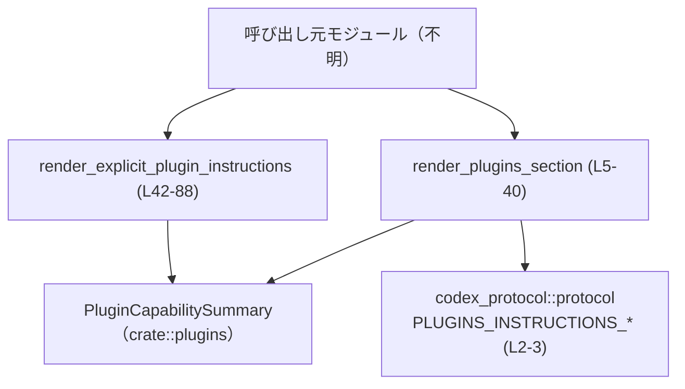
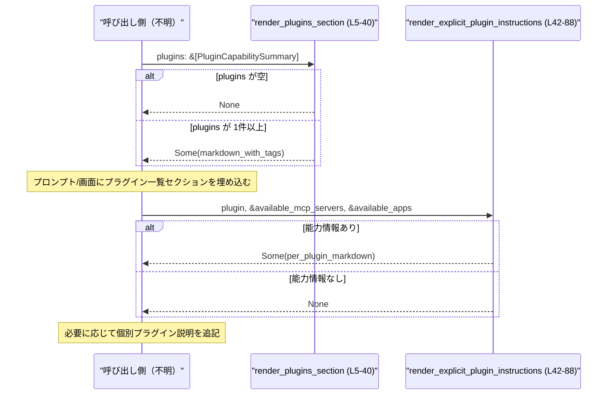

# core\src\plugins\render.rs コード解説

## 0. ざっくり一言

このファイルは、プラグインのメタデータから **Markdown 形式の説明文** を組み立てるユーティリティです。  
セッション全体のプラグイン一覧セクションと、個別プラグイン向けの説明文の 2 種類を生成します（core\src\plugins\render.rs:L5-40, L42-88）。

---

## 1. このモジュールの役割

### 1.1 概要

- このモジュールは、`PluginCapabilitySummary` の配列や 1 件の情報から、  
  人間（および LLM）向けの **説明テキスト（Markdown）** を構築するために存在します（core\src\plugins\render.rs:L5-24, L47-77）。
- セッション全体の「Plugins」セクションを生成する関数と、特定プラグインの能力を説明する短いテキストを生成する関数を提供します（core\src\plugins\render.rs:L5-40, L42-88）。
- 出力は `Option<String>` として返され、入力に応じて「何も書かない」という選択肢を表現します（core\src\plugins\render.rs:L5, L42, L81-83）。

### 1.2 アーキテクチャ内での位置づけ

依存関係とおおまかな位置づけは以下の通りです。

- このモジュールは `crate::plugins::PluginCapabilitySummary` 型に依存します（core\src\plugins\render.rs:L1, L5, L43）。
- 出力には `codex_protocol::protocol` が定義するタグ定数  
  `PLUGINS_INSTRUCTIONS_OPEN_TAG` / `PLUGINS_INSTRUCTIONS_CLOSE_TAG` を使用します（core\src\plugins\render.rs:L2-3, L37-39）。
- 実際の呼び出し元モジュールはこのチャンクには現れないため不明です。



※ `Caller`（呼び出し元）の具体名・所在は、このチャンクには現れません。

### 1.3 設計上のポイント

- **ステートレスな純関数**
  - どちらの関数も、引数だけから新しい `String` を組み立てて返し、副作用（I/O やグローバル状態の変更）は行いません（core\src\plugins\render.rs:L10-39, L47-87）。
  - そのため、並行に何度呼び出しても安全に使用できる設計になっています。

- **Option による「出力なし」の表現**
  - `plugins` が空の場合は `None` を返す（core\src\plugins\render.rs:L5-8）。
  - 個別プラグイン用でも、能力情報が一切ない場合は `None` を返す（core\src\plugins\render.rs:L81-83）。
  - これにより、呼び出し側は「何も表示しない」という分岐を簡潔に扱えます。

- **Markdown テンプレート的な構造**
  - 行を `Vec<String>` に積み上げ、最後に `join("\n")` で連結するスタイルです（core\src\plugins\render.rs:L10-14, L16-23, L25-27, L36, L47-50, L52-57, L59-67, L70-77, L85-87）。
  - 固定文と、`PluginCapabilitySummary` や MCP/App 名からの動的な部分を混ぜています。

- **プロトコル用タグでの囲い**
  - プラグイン一覧セクションは、`PLUGINS_INSTRUCTIONS_OPEN_TAG` と `PLUGINS_INSTRUCTIONS_CLOSE_TAG` で囲まれます（core\src\plugins\render.rs:L37-39）。
  - これにより、外部のプロトコル／パーサがこのセクションを機械的に検出・抽出しやすくなっています。

---

## 2. 主要な機能一覧（コンポーネントインベントリー）

### 2.1 関数・モジュール一覧

| 名前 | 種別 | 役割 / 用途 | 根拠行 |
|------|------|-------------|--------|
| `render_plugins_section` | 関数 | セッションで利用可能なプラグイン一覧と「How to use plugins」説明を Markdown として生成し、プロトコル用タグで囲んで返す | core\src\plugins\render.rs:L5-40 |
| `render_explicit_plugin_instructions` | 関数 | 特定の 1 プラグインのスキル/MCP サーバー/アプリを説明する短い Markdown テキストを生成する | core\src\plugins\render.rs:L42-88 |
| `tests` | モジュール | このファイル用のテストを `render_tests.rs` から読み込むテストモジュール | core\src\plugins\render.rs:L90-92 |

### 2.2 外部型・定数一覧

| 名前 | 種別（推定） | 役割 / 用途 | 定義の所在 / 備考 | 根拠行 |
|------|--------------|-------------|--------------------|--------|
| `PluginCapabilitySummary` | 構造体（フィールドアクセスから推定） | プラグインの表示名・説明・スキル有無などのメタ情報を保持する | `crate::plugins` モジュールで定義。具体的なフィールド構成はこのチャンクには現れません | core\src\plugins\render.rs:L1, L5, L43, L52 |
| `PLUGINS_INSTRUCTIONS_OPEN_TAG` | 定数（文字列系と推定） | プラグイン説明セクションの開始を示すタグ文字列 | `codex_protocol::protocol` に定義。具体的な値や型はこのチャンクには現れません | core\src\plugins\render.rs:L2, L37-39 |
| `PLUGINS_INSTRUCTIONS_CLOSE_TAG` | 定数（文字列系と推定） | プラグイン説明セクションの終了を示すタグ文字列 | 同上 | core\src\plugins\render.rs:L2, L37-39 |

---

## 3. 公開 API と詳細解説

### 3.1 型一覧（このファイルで定義される型）

このファイル内では、新しい構造体・列挙体などの型定義はありません。  
利用している `PluginCapabilitySummary` やタグ定数は、すべて他モジュールで定義されています（core\src\plugins\render.rs:L1-3）。

### 3.2 関数詳細

#### `render_plugins_section(plugins: &[PluginCapabilitySummary]) -> Option<String>`（core\src\plugins\render.rs:L5-40）

**概要**

- セッション内で有効なプラグイン一覧と、その使い方を説明する Markdown セクションを構築します。
- プラグインが 1 つ以上ある場合のみ、特定のオープン/クローズタグに囲まれた文字列を `Some` で返します。プラグインが 0 件なら `None` を返します（core\src\plugins\render.rs:L6-8）。

**引数**

| 引数名 | 型 | 説明 | 根拠行 |
|--------|----|------|--------|
| `plugins` | `&[PluginCapabilitySummary]` | セッションで利用可能なプラグインの一覧。各要素から表示名と説明を参照して Markdown の箇条書きを生成します。 | core\src\plugins\render.rs:L5, L16-23 |

**戻り値**

- `Option<String>`  
  - `Some(markdown)`：プラグインが 1 件以上あり、Markdown で構成した「Plugins」セクションを持つ場合（core\src\plugins\render.rs:L10-14, L16-27, L36-39）。
  - `None`：`plugins` が空スライスの場合（core\src\plugins\render.rs:L6-8）。

**内部処理の流れ（アルゴリズム）**

1. `plugins` が空かどうかをチェックし、空なら `None` を返す（core\src\plugins\render.rs:L6-8）。
2. `lines: Vec<String>` を初期化し、次の 3 行を追加する（core\src\plugins\render.rs:L10-14）。
   - `"## Plugins"`
   - プラグインの概念と一覧の意味を説明する英語の文章
   - `"### Available plugins"`
3. `plugins.iter().map(..)` で各プラグインを走査し、以下の形式の行を `lines` に追加する（core\src\plugins\render.rs:L16-23）。
   - `plugin.description` が `Some` の場合: `"-`display_name`: description"`
   - `None` の場合: `"-`display_name`"`
4. `"### How to use plugins"` 行を追加し（core\src\plugins\render.rs:L25）、さらに生の文字列リテラルで複数行の箇条書きを 1 つの行として追加する（core\src\plugins\render.rs:L26-33）。
5. `lines.join("\n")` で全行を改行区切りの 1 つの `String` にまとめ、`body` とする（core\src\plugins\render.rs:L36）。
6. `format!` で `{PLUGINS_INSTRUCTIONS_OPEN_TAG}\n{body}\n{PLUGINS_INSTRUCTIONS_CLOSE_TAG}` の形に組み立て、`Some` で包んで返す（core\src\plugins\render.rs:L37-39）。

**Examples（使用例）**

呼び出し側で、プラグイン一覧セクションをプロンプトに追加する簡単な例です。

```rust
use crate::plugins::{render_plugins_section, PluginCapabilitySummary};

fn build_prompt(plugins: &[PluginCapabilitySummary]) -> String {
    let mut prompt = String::new(); // ベースとなるプロンプト

    if let Some(section) = render_plugins_section(plugins) { // プラグインがあればセクションを生成
        prompt.push_str(&section);                          // 生成された Markdown を追加
        prompt.push('\n');                                  // 必要なら改行を追加
    }

    prompt
}
```

**Errors / Panics**

- この関数は `Result` ではなく `Option` を返します。  
  明示的なエラー型は持たず、エラー相当の状況（プラグイン 0 件）は `None` で表現します（core\src\plugins\render.rs:L6-8）。
- 関数内に `panic!` などの明示的なパニック要因はありません（core\src\plugins\render.rs 全体）。
- `format!` や `String` 操作は、通常の環境ではメモリ不足などを除きパニックしない前提と考えられますが、そのような低レベルの失敗はこのチャンクからは判断できません。

**Edge cases（エッジケース）**

- `plugins` が空スライス
  - 即座に `None` を返し、ヘッダ行すら生成しません（core\src\plugins\render.rs:L6-8）。
- `plugin.description` が `None`
  - 該当プラグインの行は `"-`display_name`"` の形式となり、説明文なしで表示されます（core\src\plugins\render.rs:L19-22）。
- `plugin.display_name` や `description` に改行や Markdown 特殊文字が含まれる場合
  - エスケープ処理は行われず、そのまま埋め込まれます（core\src\plugins\render.rs:L20-22）。  
    そのため、Markdown レイアウトやレンダリング結果に影響する可能性があります。
- 非 ASCII 文字列
  - Rust の `String` と `format!` を使用しているため、UTF-8 文字列もそのまま扱えます（core\src\plugins\render.rs:L10-14, L20-22）。

**使用上の注意点**

- `Option<String>` で返るため、呼び出し側は `None` の場合を必ず考慮する必要があります。  
  例えば `unwrap()` を使うと、プラグインが 0 件のときにパニックが発生します。
- `PluginCapabilitySummary` のフィールドはエスケープされないため、  
  ユーザー入力など潜在的に不正な Markdown/指示を含むデータを表示したくない場合は、  
  呼び出し前にサニタイズする必要があります（core\src\plugins\render.rs:L20-22）。
- 関数は読み取り専用でスレッドセーフに設計されていますが、  
  渡す `plugins` スライス自体のスレッド安全性（`Send` / `Sync`）はこのチャンクからは不明です。

---

#### `render_explicit_plugin_instructions(

    plugin: &PluginCapabilitySummary,
    available_mcp_servers: &[String],
    available_apps: &[String],
) -> Option<String>`（core\src\plugins\render.rs:L42-88）

**概要**

- 特定のプラグインについて、利用可能なスキル / MCP サーバー / アプリを説明する短い Markdown テキストを生成します。
- プラグインに少なくとも 1 つの能力情報（スキル有り、MCP サーバーあり、アプリあり）がある場合にのみ `Some` を返し、何も情報がない場合は `None` を返します（core\src\plugins\render.rs:L81-83）。

**引数**

| 引数名 | 型 | 説明 | 根拠行 |
|--------|----|------|--------|
| `plugin` | `&PluginCapabilitySummary` | 対象となる 1 つのプラグインのメタ情報。表示名やスキル有無を参照します。 | core\src\plugins\render.rs:L42-50, L52 |
| `available_mcp_servers` | `&[String]` | このプラグインに由来し、セッション内で利用可能な MCP サーバー名のリスト。 | core\src\plugins\render.rs:L44-45, L59-67 |
| `available_apps` | `&[String]` | このプラグインに由来し、セッション内で利用可能なアプリ名のリスト。 | core\src\plugins\render.rs:L45-46, L70-77 |

**戻り値**

- `Option<String>`  
  - `Some(markdown)`：以下のいずれかが真で、少なくとも 1 行の能力情報がある場合（core\src\plugins\render.rs:L52-57, L59-67, L70-77, L85-87）。
    - `plugin.has_skills == true`
    - `available_mcp_servers` が非空
    - `available_apps` が非空
  - `None`：上記がすべて偽であり、ヘッダ行以外に何も追加されない場合（core\src\plugins\render.rs:L81-83）。

**内部処理の流れ（アルゴリズム）**

1. `lines` を、見出し `"Capabilities from the`display_name`plugin:"` 1 行だけを持つ `Vec<String>` として初期化します（core\src\plugins\render.rs:L47-50）。
2. `plugin.has_skills` が真なら、スキルの接頭辞ルール（`display_name:` が付く）を説明する行を追加します（core\src\plugins\render.rs:L52-56）。
3. `available_mcp_servers` が非空なら、各 MCP サーバー名を `` `name` `` の形式に変換し、`,` 区切りで 1 行にまとめて追加します（core\src\plugins\render.rs:L59-67）。
4. `available_apps` が非空なら、同様にアプリ名を `` `name` `` 形式で列挙した行を追加します（core\src\plugins\render.rs:L70-77）。
5. `lines.len() == 1`（初期のヘッダ行のみ）であれば、能力情報が何もないと判断して `None` を返します（core\src\plugins\render.rs:L81-83）。
6. そうでなければ、「Use these plugin-associated capabilities ...」の行を追加し（core\src\plugins\render.rs:L85）、`lines.join("\n")` を `Some` で返します（core\src\plugins\render.rs:L85-87）。

**Examples（使用例）**

ユーザーが特定のプラグイン名を指定した場合に、そのプラグインの能力説明を追加する例です。

```rust
use crate::plugins::{render_explicit_plugin_instructions, PluginCapabilitySummary};

fn describe_plugin(
    plugin: &PluginCapabilitySummary,
    mcp_servers: &[String],
    apps: &[String],
) -> Option<String> {
    render_explicit_plugin_instructions(plugin, mcp_servers, apps)
}

// 呼び出し例（呼び出し元で Option を処理）
fn print_plugin_instructions(
    plugin: &PluginCapabilitySummary,
    mcp_servers: &[String],
    apps: &[String],
) {
    if let Some(text) = describe_plugin(plugin, mcp_servers, apps) {
        println!("{text}");
    } else {
        println!("No explicit capabilities to describe for this plugin.");
    }
}
```

**Errors / Panics**

- `Result` ではなく `Option` を返し、エラー型は持ちません。
  - 能力情報がまったくない場合を `None` として表現します（core\src\plugins\render.rs:L81-83）。
- 関数内には明示的な `panic!` 誘発コードはなく、`format!`／`join` の正常な使用に留まっています（core\src\plugins\render.rs:L47-77, L85-87）。

**Edge cases（エッジケース）**

- `plugin.has_skills == false` かつ `available_mcp_servers` と `available_apps` がすべて空
  - 見出し行以外は追加されず、`lines.len() == 1` となるため `None` が返されます（core\src\plugins\render.rs:L47-50, L81-83）。
- MCP サーバー名／アプリ名にカンマや改行、バッククォートが含まれる場合
  - 文字列はそのまま `` `name` `` に埋め込まれ、エスケープ処理は行われません（core\src\plugins\render.rs:L61-66, L72-77）。
  - そのため、Markdown 表現として想定外の表示になる可能性があります。
- 非 ASCII 名称
  - `String` ベースの処理のため、UTF-8 文字列も問題なく処理できます（core\src\plugins\render.rs:L59-67, L70-77）。

**使用上の注意点**

- "能力情報がない" 場合は `None` が返るため、呼び出し側が `unwrap()` を使うとパニックの可能性があります。
- `available_mcp_servers` や `available_apps` に外部から渡される文字列は、Markdown やシステム指示を含み得ます。  
  必要に応じて、事前にフィルタやエスケープを行うべきです。
- 関数は純粋に文字列を生成するだけで、共有状態にアクセスしないため、並行実行に起因するレースコンディションはありません。

### 3.3 その他の関数

このファイルには、上記 2 つ以外の関数定義はありません（core\src\plugins\render.rs 全体を確認）。

---

## 4. データフロー

ここでは、「セッション開始時にプラグイン一覧をレンダリングし、ユーザーが特定プラグインを指定した際に個別説明を追加する」シナリオを例に、データフローを示します。

1. コアロジックが `PluginCapabilitySummary` の一覧を収集し、`render_plugins_section` に渡します。
2. 返ってきた `Option<String>` をプロンプトや画面の一部として埋め込みます。
3. ユーザーが特定のプラグインを指名した場合、その `PluginCapabilitySummary` と MCP/アプリのリストを `render_explicit_plugin_instructions` に渡し、追加の説明を生成します。



呼び出し側の具体的なモジュール名やプロンプト組み立てロジックは、このチャンクには現れません。

---

## 5. 使い方（How to Use）

### 5.1 基本的な使用方法

セッションのプロンプトにプラグイン一覧セクションを追加し、ユーザーが特定プラグインを指定したときに個別説明も加える例です。

```rust
use crate::plugins::{
    render_plugins_section,
    render_explicit_plugin_instructions,
    PluginCapabilitySummary,
};

fn build_session_prompt(
    plugins: &[PluginCapabilitySummary],
    focus_plugin: Option<(&PluginCapabilitySummary, Vec<String>, Vec<String>)>,
) -> String {
    let mut prompt = String::new(); // ベースのプロンプト

    // 1. セッション全体のプラグイン一覧セクション
    if let Some(section) = render_plugins_section(plugins) {
        prompt.push_str(&section);
        prompt.push_str("\n\n");
    }

    // 2. 特定プラグインの能力説明（任意）
    if let Some((plugin, mcp_servers, apps)) = focus_plugin {
        if let Some(extra) =
            render_explicit_plugin_instructions(plugin, &mcp_servers, &apps)
        {
            prompt.push_str(&extra);
            prompt.push('\n');
        }
    }

    prompt
}
```

### 5.2 よくある使用パターン

- **パターン 1: セッション開始時に一度だけ一覧を生成して使い回す**
  - `render_plugins_section` の結果をキャッシュし、同じセッション内では同一の説明を再利用する。
  - 関数がステートレスであるため、キャッシュせず都度呼び出しても挙動は変わりません。

- **パターン 2: ユーザーの選択/言及に応じて個別説明を追加**
  - ユーザーが「X プラグインを使ってほしい」と言ったターンでだけ  
    `render_explicit_plugin_instructions` を呼び、追加説明を提示する。
  - 能力情報がなければ `None` となるので、その場合は追加しないだけでよいです。

### 5.3 よくある間違い

この実装から推測できる、起こり得る誤用とその修正例です。

```rust
use crate::plugins::render_plugins_section;

// 間違い例: None を考慮せずに unwrap している
fn build_prompt_wrong(plugins: &[PluginCapabilitySummary]) -> String {
    let section = render_plugins_section(plugins).unwrap(); // plugins が空ならパニック
    section
}

// 正しい例: None を安全に処理する
fn build_prompt_right(plugins: &[PluginCapabilitySummary]) -> String {
    render_plugins_section(plugins).unwrap_or_default() // 何もない場合は空文字列
}
```

- `Option<String>` を返す関数に対して `unwrap()` を使うと、  
  プラグインが 0 件のケースでパニックが発生します（core\src\plugins\render.rs:L6-8, L81-83）。
- 安全な代替としては、`unwrap_or_default` や `if let Some(..)` を使って `None` を明示的に処理する方法があります。

### 5.4 使用上の注意点（まとめ）

- 両関数とも `Option<String>` を返すため、`None` を正しく扱うことが前提条件です。
- プラグイン名・説明・MCP/アプリ名はエスケープされずに Markdown に埋め込まれます。  
  これらの文字列が外部ソース由来の場合、Markdown／プロンプトインジェクション対策が必要になる場合があります。
- 並行性の観点では、このモジュールは状態を持たず、`&` 参照と所有された `String` のみを扱っているため、  
  呼び出し自体はスレッドセーフです（引数の型が `Send`/`Sync` である前提）。

---

## 6. 変更の仕方（How to Modify）

### 6.1 新しい機能を追加する場合

例として、「プラグイン一覧セクションに別のサブセクションを追加する」変更を考えます。

1. **`render_plugins_section` の `lines` 構築部分を確認**
   - 初期 3 行（見出しと説明）＋プラグイン一覧＋「How to use plugins」セクションが順に積み上がっています（core\src\plugins\render.rs:L10-14, L16-23, L25-33）。
2. **追加したい位置を決めて `lines.push` もしくは `lines.extend` を挿入**
   - 例えばプラグイン一覧の後に統計情報を挿入する場合は、`lines.extend(..)` の直後に挿入します（core\src\plugins\render.rs:L16-23 の後）。
3. **タグでの囲いを維持する**
   - 返り値の `format!` は `{PLUGINS_INSTRUCTIONS_OPEN_TAG}\n{body}\n{PLUGINS_INSTRUCTIONS_CLOSE_TAG}` の構造に依存するため、この部分は変更せずに `body` の中身だけを拡張するのが安全です（core\src\plugins\render.rs:L37-39）。
4. **`render_tests.rs` のテストを追加・更新**
   - テスト内容はこのチャンクには現れませんが、既存テストがこのレンダリング内容に依存している可能性が高いため、必要に応じて更新します（core\src\plugins\render.rs:L90-92）。

### 6.2 既存の機能を変更する場合

- **`None` 返却条件の変更**
  - `plugins` が空でも空セクションを返したい、などの要件変更がある場合は、  
    `render_plugins_section` の `if plugins.is_empty()` 部分を変更し（core\src\plugins\render.rs:L6-8）、  
    呼び出し側全体での前提（「None なら未表示」）が変わる影響範囲を確認する必要があります。
- **`render_explicit_plugin_instructions` の `lines.len() == 1` ロジック**
  - ヘッダ行以外に無条件で新しい行を追加すると、この判定条件も更新しないと、  
    「能力情報がなくても常に `Some` を返す」など、契約が崩れる可能性があります（core\src\plugins\render.rs:L47-50, L81-83）。
- **文言の変更**
  - 英文メッセージを変更する場合は、プロダクト仕様やユーザー向けドキュメントと整合性を取る必要があります（core\src\plugins\render.rs:L11-13, L25-33, L47-50, L52-56, L61-62, L72-73, L85）。
- **安全性/セキュリティの観点**
  - 将来的に Markdown インジェクション対策としてエスケープ処理を導入する場合は、  
    `format!` で埋め込む箇所（display_name, description, server/app 名）を一元的にラップするユーティリティ関数を導入すると、変更範囲を局所化できます（core\src\plugins\render.rs:L20-22, L61-66, L72-77）。

---

## 7. 関連ファイル

| パス / モジュール | 役割 / 関係 | 根拠 |
|-------------------|------------|------|
| `core\src\plugins\render_tests.rs` | 本ファイルのテストコードを格納すると指定されているファイル。`#[path = "render_tests.rs"]` で参照されます。 | core\src\plugins\render.rs:L90-92 |
| `crate::plugins::PluginCapabilitySummary` | プラグインの表示名・説明・スキル有無を保持する構造体と推定される型。本ファイルの関数引数として使用されます。 | core\src\plugins\render.rs:L1, L5, L43, L52 |
| `codex_protocol::protocol` | プラグイン説明用のオープン/クローズタグ定数 `PLUGINS_INSTRUCTIONS_OPEN_TAG` / `PLUGINS_INSTRUCTIONS_CLOSE_TAG` を提供する外部モジュール。 | core\src\plugins\render.rs:L2-3, L37-39 |

これら以外の呼び出し元や、`PluginCapabilitySummary` の定義ファイルは、このチャンクには現れないため不明です。

---

### Bugs / Security（このファイルから読み取れる範囲）

- 現時点のコードから明らかなロジックバグは確認できません（条件分岐と返却値の関係が素直です）。
- セキュリティ上の観点では、**プラグイン名・説明・MCP/アプリ名がエスケープされずに Markdown／プロンプトに挿入される** 点が特徴です（core\src\plugins\render.rs:L20-22, L61-66, L72-77）。
  - これらが信頼できないソースから来る場合、Markdown インジェクションやプロンプトインジェクションのリスクがあります。
  - 対策としては、呼び出し側でサニタイズを行うか、将来的にここにエスケープ処理を追加することが考えられます（設計上の一般論であり、このチャンクには具体的対策コードは存在しません）。
