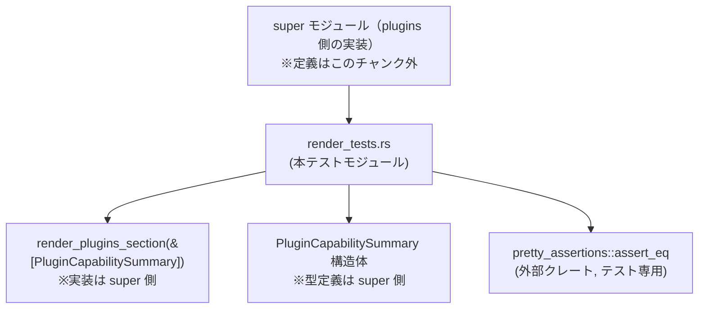
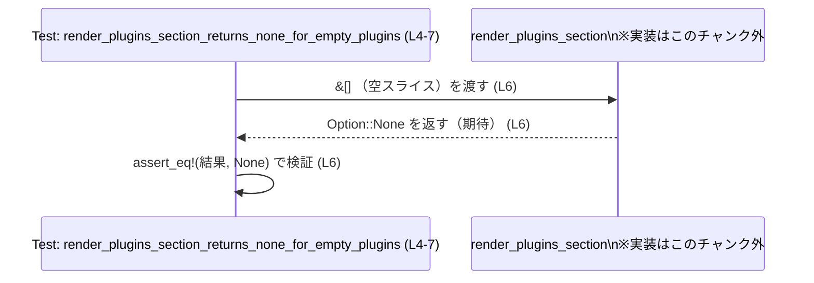
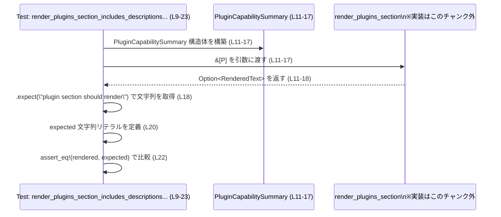

# core/src/plugins/render_tests.rs

## 0. ざっくり一言

`render_plugins_section` 関数の挙動を検証するための **ユニットテスト専用モジュール** です。  
空のプラグイン一覧と、1 件のプラグインを含む一覧に対して、期待されるレンダリング結果をチェックします（render_tests.rs:L4-7, L9-23）。

---

## 1. このモジュールの役割

### 1.1 概要

- このモジュールは、プラグイン一覧を説明テキストに変換する `render_plugins_section` の振る舞いを検証するために存在します（render_tests.rs:L5-6, L11-18）。
- 主に次の 2 点をテストしています。
  - プラグインが 0 件の場合は何もレンダリングしない（`None` を返す）（render_tests.rs:L4-7）。
  - 1 件のプラグインがある場合に、説明文と「プラグインの使い方」ガイダンスを含んだテキストを返す（render_tests.rs:L9-23）。

### 1.2 アーキテクチャ内での位置づけ

このファイルは `core::plugins`（正確なモジュール名はこのチャンクには現れません）の下にあり、テスト用サブモジュールとして `super::*` から実装をインポートしています（render_tests.rs:L1）。



- `use super::*;` により、`render_plugins_section` と `PluginCapabilitySummary` をテスト側から直接呼び出しています（render_tests.rs:L1）。
- 比較には外部クレート `pretty_assertions::assert_eq` を使用し、差分表示を分かりやすくしています（render_tests.rs:L2）。

### 1.3 設計上のポイント

- **テストのみ定義**  
  - 本ファイル自身には公開 API やビジネスロジックはなく、すべて `#[test]` 関数です（render_tests.rs:L4, L9）。
- **入力・出力契約の明示**  
  - 「空の入力 → `None`」「1 件のプラグイン → 具体的な説明テキスト」という契約をテストで固定しています（render_tests.rs:L5-7, L11-22）。
- **Option による存在有無の表現**  
  - `render_plugins_section` の戻り値が `None` と比較されていることから、`Option` 型が使われていることが分かります（render_tests.rs:L6）。  
    これにより「セクションを出さない」という状態を明示的に表現しています。
- **panic ベースのテスト失敗**  
  - `.expect("plugin section should render")` を使用し、`None` が返ってきた場合にテストを失敗（panic）させています（render_tests.rs:L18）。

---

## 2. コンポーネント一覧（インベントリー）

### 2.1 本ファイル内で定義されている関数

| 名前 | 種別 | 役割 / 用途 | 定義位置 |
|------|------|-------------|----------|
| `render_plugins_section_returns_none_for_empty_plugins` | テスト関数 (`#[test]`) | プラグイン一覧が空のときに `render_plugins_section` が `None` を返すことを検証する | render_tests.rs:L4-7 |
| `render_plugins_section_includes_descriptions_and_skill_naming_guidance` | テスト関数 (`#[test]`) | 1 件のプラグインから期待される説明テキストとガイダンスを正しくレンダリングすることを検証する | render_tests.rs:L9-23 |

### 2.2 本ファイルから参照される外部コンポーネント（定義はこのチャンク外）

| 名前 | 種別 | 役割 / 用途 | 参照位置 |
|------|------|-------------|----------|
| `render_plugins_section` | 関数（推定） | `&[PluginCapabilitySummary]` を受け取り、プラグインセクションを表す `Option` を返す | render_tests.rs:L6, L11 |
| `PluginCapabilitySummary` | 構造体（推定） | プラグインの名前・説明・スキル有無などのメタデータを保持する | render_tests.rs:L11-17 |
| `PluginCapabilitySummary::default` | 関連関数 | 未指定フィールドをデフォルト値で補うために使用 | render_tests.rs:L16 |
| `pretty_assertions::assert_eq` | マクロ | テスト時の差分表示を改善した `assert_eq!` 互換マクロ | render_tests.rs:L2, L6, L22 |
| `Option::expect` | メソッド | `Option` が `Some` であることを前提に値を取り出し、`None` の場合に panic させる | render_tests.rs:L18 |

> `render_plugins_section` の正確なシグネチャはこのチャンクには現れませんが、`None` リテラルとの比較と `.expect(...)` の呼び出しから、戻り値が `Option<文字列っぽい型>` であることが分かります（render_tests.rs:L6, L18, L20）。

### 2.3 型一覧（外部型）

本ファイル内で型定義はありませんが、以下の外部型が使われています。

| 名前 | 種別 | 役割 / 用途 | 根拠 |
|------|------|-------------|------|
| `PluginCapabilitySummary` | 構造体（推定） | プラグインの設定名 (`config_name`)、表示名 (`display_name`)、説明 (`description`)、スキル有無 (`has_skills`) などを保持する | フィールド初期化と struct 更新構文から（render_tests.rs:L11-17） |
| `Option<T>` | 列挙体 | `render_plugins_section` の戻り値の有無を表す。`None` 比較と `.expect` から使用が分かる | render_tests.rs:L6, L18 |
| `String` / `&str` | 文字列型 | プラグイン名・説明・レンダリング結果のテキストとして使用 | フィールドの `.to_string()` と `expected` リテラルから（render_tests.rs:L11-15, L20） |

---

## 3. 公開 API と詳細解説

このファイル自身はテストモジュールであり、**公開 API を定義していません**。  
以下では、テスト関数を対象に詳細テンプレートを適用し、「何を保証しているか」を整理します。

### 3.1 型一覧（構造体・列挙体など）

本ファイル内で新たに定義されている型はありません。  
`PluginCapabilitySummary` などの型定義は上位モジュールにあり、このチャンクには現れません。

### 3.2 関数詳細

#### `render_plugins_section_returns_none_for_empty_plugins()`

**概要**

- プラグイン一覧が空のとき、`render_plugins_section` が `None` を返すことを検証するテストです（render_tests.rs:L4-7）。

**引数**

- なし（テスト関数のため）。

**戻り値**

- `()`（ユニット）。  
  ただし、アサーションに失敗した場合はテストが失敗します。

**内部処理の流れ**

1. `render_plugins_section(&[])` を呼び出し、空のプラグインスライスを渡します（render_tests.rs:L6）。
2. 戻り値が `None` であることを `assert_eq!` で検証します（render_tests.rs:L6）。

**Errors / Panics**

- `render_plugins_section(&[])` が `None` 以外を返した場合、`assert_eq!` によりテストが失敗（panic）します（render_tests.rs:L6）。
- 他に明示的なエラー処理はありません。

**Edge cases（エッジケース）**

- このテスト自体が「空入力（プラグイン 0 件）」というエッジケースを対象としています（render_tests.rs:L6）。
- それ以外のケース（プラグイン 1 件以上）については、この関数では扱いません。

**使用上の注意点**

- `render_plugins_section` の実装を変更しても、**空スライス時にはセクションを生成しない**（＝`None` を返す）という契約を維持する必要があります。  
  この契約を破るとこのテストが失敗します（render_tests.rs:L6）。
- 「セクションを表示しない」という状態を `Option` で表現している点が前提条件です。

---

#### `render_plugins_section_includes_descriptions_and_skill_naming_guidance()`

**概要**

- プラグインが 1 件ある場合に、プラグインの説明と一連の「プラグインの使い方」ガイダンスを含んだテキストを `render_plugins_section` が生成することを検証するテストです（render_tests.rs:L9-23）。

**引数**

- なし（テスト関数のため）。

**戻り値**

- `()`（ユニット）。  
  期待と異なるテキストが生成された場合は、`assert_eq!` によりテストが失敗します。

**内部処理の流れ（アルゴリズム）**

1. `PluginCapabilitySummary` のインスタンスを 1 件だけ含むスライスを準備します（render_tests.rs:L11-17）。
   - `config_name`: `"sample@test"`（render_tests.rs:L12）。
   - `display_name`: `"sample"`（render_tests.rs:L13）。
   - `description`: `Some("inspect sample data")`（render_tests.rs:L14）。
   - `has_skills`: `true`（render_tests.rs:L15）。
   - その他のフィールドは `PluginCapabilitySummary::default()` から補われます（render_tests.rs:L16）。
2. そのスライスへの参照を `render_plugins_section` に渡し、戻り値の `Option` に対して `.expect("plugin section should render")` を呼び出して `String`（などの文字列型）を取り出します（render_tests.rs:L11-18）。
3. ハードコードした期待文字列 `expected` を定義します（render_tests.rs:L20）。  
   - `<plugins_instructions>` タグで囲まれたブロック全体。
   - 「Plugins」「Available plugins」「How to use plugins」といった見出し。
   - プラグインリスト項目 `- \`sample\`: inspect sample data`。
   - プラグインの使い方に関する箇条書き（Discovery, Skill naming, Trigger rules, Relationship to capabilities, Preference, Missing/blocked）など。
4. `assert_eq!(rendered, expected);` によって、生成された文字列が期待どおりであることを検証します（render_tests.rs:L22）。

**Examples（使用例）**

このテスト自体が、`render_plugins_section` の典型的な使用例になっています。

```rust
// テストコードから簡略化した使用例（render_tests.rs:L11-18 をベース）
// プラグインのメタデータを 1 件だけ用意する
let plugins = [PluginCapabilitySummary {
    config_name: "sample@test".to_string(),          // 設定名
    display_name: "sample".to_string(),              // 表示名
    description: Some("inspect sample data".to_string()), // 説明
    has_skills: true,                                // スキルを持つかどうか
    ..PluginCapabilitySummary::default()             // その他はデフォルト値
}];

// プラグインセクションのレンダリングを試みる
let rendered = render_plugins_section(&plugins)      // &[_] を渡す
    .expect("plugin section should render");         // None の場合は panic（テストでは失敗扱い）
```

> 正確な返り値の型（`Option<String>` など）はこのチャンクにはありませんが、`None` との比較（render_tests.rs:L6）と文字列リテラルとの比較（render_tests.rs:L20-22）から、文字列を含む `Option` であることが分かります。

**Errors / Panics**

- `render_plugins_section` が `None` を返した場合：
  - `.expect("plugin section should render")` が panic を発生させ、テストは失敗します（render_tests.rs:L18）。
- `rendered` と `expected` が一致しない場合：
  - `assert_eq!` により panic し、差分が表示されます（render_tests.rs:L22）。

**Edge cases（エッジケース）**

このテストは、次のような点について暗黙的に挙動を固定しています（ただしコードから分かる範囲に限ります）。

- **description が `Some(...)` のプラグイン**  
  - 説明文がプラグイン名とともにリストに含まれること（`- \`sample\`: inspect sample data`）（render_tests.rs:L20）。
- **has_skills = true のプラグイン**  
  - 「Skill naming」のガイダンス文を生成していること（render_tests.rs:L20）。  
    （実装との直接の関連付けはこのチャンクにはありませんが、少なくとも文言を固定しています。）

`description = None` / `has_skills = false` など、他の組み合わせの挙動はこのテストからは分かりません（このチャンクには現れません）。

**使用上の注意点**

- `render_plugins_section` の実装を変更する際、  
  - タグ構造（`<plugins_instructions>`〜`</plugins_instructions>`）  
  - 各見出しや箇条書きの文言  
  に変更が入ると、このテストの `expected` を更新しない限りテストが失敗します（render_tests.rs:L20-22）。
- テキストのフォーマット（改行文字 `\n` の位置など）も厳密に比較されるため、テンプレートの細かい変更にも敏感です（render_tests.rs:L20）。

### 3.3 その他の関数

- 本ファイルには上記 2 つのテスト関数以外の関数はありません。

---

## 4. データフロー

ここでは、代表的なテストシナリオにおけるデータの流れを整理します。

### 4.1 空プラグイン一覧の場合



- 入力: `&[]` （要素数 0 の `PluginCapabilitySummary` スライス）（render_tests.rs:L6）。
- 期待される出力: `None`（render_tests.rs:L6）。
- 解釈: プラグインが 1 件も有効でない場合、プラグインセクション自体をレンダリングしない、という契約をテストで固定しています。

### 4.2 1 件のプラグインがある場合



- 入力: 1 要素の `PluginCapabilitySummary` スライス（render_tests.rs:L11-17）。
- 中間状態: `render_plugins_section` が `Some(レンダリング済みテキスト)` を返し、`.expect` で中身の文字列を取り出します（render_tests.rs:L11-18）。
- 出力: `<plugins_instructions>` で囲まれた説明テキスト（render_tests.rs:L20-22）。

---

## 5. 使い方（How to Use）

### 5.1 基本的な使用方法（テストから読み取れる範囲）

テストから分かる `render_plugins_section` の基本的な使い方は次のとおりです。

```rust
// プラグインのメタデータを用意する（render_tests.rs:L11-17 を簡略化）
let plugins = [PluginCapabilitySummary {
    config_name: "sample@test".to_string(),              // 設定名
    display_name: "sample".to_string(),                  // 表示名
    description: Some("inspect sample data".to_string()),// 説明
    has_skills: true,                                    // スキルを持つ
    ..PluginCapabilitySummary::default()                 // その他はデフォルト
}];

// プラグインセクションのレンダリングを試みる
if let Some(section) = render_plugins_section(&plugins) { // &[_] を渡す（render_tests.rs:L11）
    println!("{}", section);                             // レンダリング結果を利用
} else {
    // 空スライスのときと同様、セクションは生成されない（render_tests.rs:L6）
}
```

> 注意: `render_plugins_section` の実際のシグネチャや戻り値の型はこのチャンクにはないため、上記はテストの呼び出し方法にもとづく使用例です。

### 5.2 よくある使用パターン（テストから推測できる範囲）

- **UI／プロンプト生成前のフィルタリング**  
  - プラグインが 0 件のとき、セクションを生成しないため、上位コードでは `None` をチェックしてから表示する／しないを決める設計が想定されます（render_tests.rs:L6）。
- **説明用テキストの埋め込み**  
  - セクションは `<plugins_instructions>` タグで囲まれているので（render_tests.rs:L20）、他のテンプレートと組み合わせて使用されることが考えられますが、具体的な利用箇所はこのチャンクには現れません。

### 5.3 よくある間違い（起こりうるもの）

テストコードから想定できる誤用例を、あくまで推測ではなく契約に沿って挙げます。

```rust
// 誤りの可能性がある例: 空スライスなのに unwrap してしまう
let rendered = render_plugins_section(&[])
    .unwrap(); // 空スライス時には None が返る契約なので（render_tests.rs:L6）、ここで panic する

// 契約に沿った例: None を考慮する
if let Some(rendered) = render_plugins_section(&[]) {
    // ここには来ない想定（render_tests.rs:L6）
    println!("{}", rendered);
}
```

### 5.4 使用上の注意点（まとめ）

- `render_plugins_section` の戻り値は `Option` であり、**常に Some が返るとは限りません**（render_tests.rs:L6, L18）。
- 空のプラグインリストを渡すと `None` になる契約がテストで固定されているため（render_tests.rs:L6）、上位コードでは `None` を許容する設計で扱う必要があります。
- 生成されるテキストのフォーマット（タグ・見出し・箇条書き文言・改行位置）はテストの `expected` 文字列と厳密に一致する必要があり、テンプレート変更時にはテストの更新が必須です（render_tests.rs:L20-22）。

---

## 6. 変更の仕方（How to Modify）

### 6.1 新しい機能を追加する場合（このテストの観点）

- 新しい振る舞い（例: プラグインの別種別、追加フィールドに応じた出力など）を `render_plugins_section` に追加する場合は、
  1. まず実装側（super モジュール）の `render_plugins_section` と `PluginCapabilitySummary` を変更する（このチャンクには定義なし）。
  2. その新しいケースをカバーするテスト関数を、本ファイルに追加する。  
     例えば「`has_skills = false` の場合の出力」など。
  3. 既存テキスト契約に影響がある場合は、`expected` 文字列の更新を行う（render_tests.rs:L20）。

### 6.2 既存の機能を変更する場合

- **テキスト内容を変更する場合**
  - 「Plugins」「How to use plugins」などの見出しや箇条書きの文言を変更すると、このテストの `expected` が不一致となりテスト失敗します（render_tests.rs:L20-22）。
  - 仕様変更であれば、**実装と同時にテストの期待文字列も更新**する必要があります。
- **空一覧時の挙動を変更する場合**
  - `render_plugins_section(&[])` の返り値を `Some("")` のように変更すると、`render_plugins_section_returns_none_for_empty_plugins` が失敗します（render_tests.rs:L6）。
  - これは契約変更にあたるため、上位コードの期待も含め慎重な検討が必要です。このチャンクだけでは上位の影響範囲は分かりません。

---

## 7. 関連ファイル

このモジュールと密接に関係するコンポーネントは、コードから次のように読み取れます。

| パス / モジュール | 役割 / 関係 |
|-------------------|------------|
| `super` モジュール（正確なファイルパスはこのチャンクには現れません） | `render_plugins_section` 関数と `PluginCapabilitySummary` 型の実装を提供する。`use super::*;` により本テストモジュールから参照されています（render_tests.rs:L1, L6, L11-17）。 |
| `pretty_assertions` クレート | `assert_eq!` の差分表示を改善したテスト専用クレート。`use pretty_assertions::assert_eq;` として導入されています（render_tests.rs:L2）。 |

> `render_plugins_section` や `PluginCapabilitySummary` の具体的な定義が含まれるファイル（例: `core/src/plugins/render.rs` など）は、このチャンクには現れないため特定できません。
