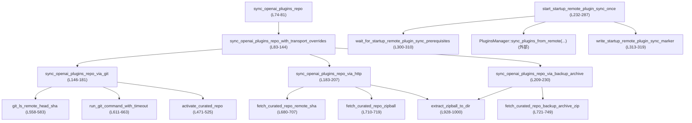
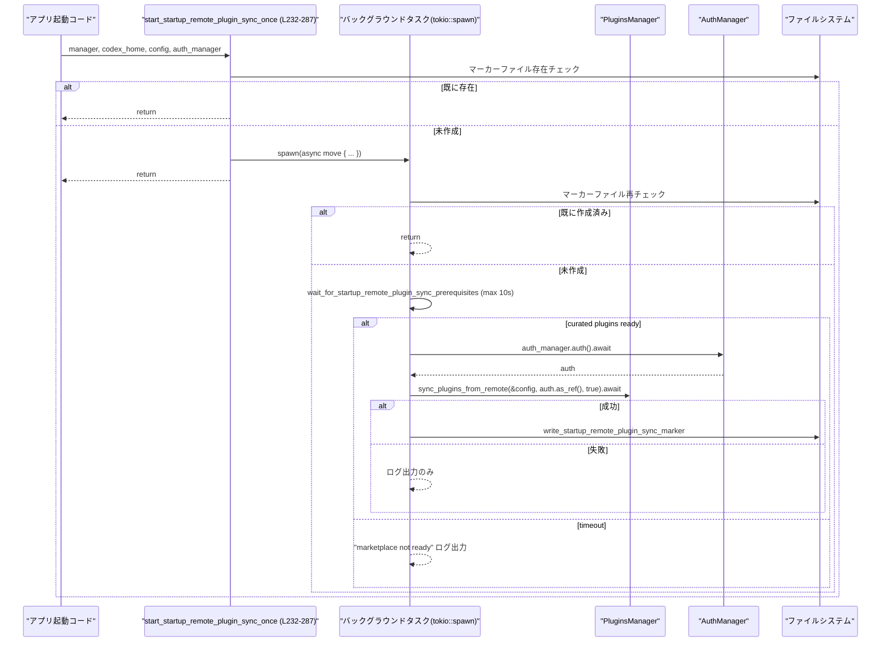

# core/src/plugins/startup_sync.rs コード解説

## 0. ざっくり一言

- OpenAI の「curated plugins」リポジトリをローカルに同期し、起動時にリモートのプラグイン設定を一度だけ同期するためのモジュールです。
- Git → GitHub HTTP → バックアップアーカイブの 3 段階フォールバックと、メトリクス／ログ出力、タイムアウト制御を行います。

---

## 1. このモジュールの役割

### 1.1 概要

このモジュールは **Codex のプラグインマーケットプレイス起動処理**を担当し、次の問題を解決します。

- curated plugins の Git リポジトリ（`openai/plugins`）をローカルディレクトリに同期する（Git / HTTP / バックアップアーカイブ）  
  （`sync_openai_plugins_repo` 他, `startup_sync.rs:L74-230`）
- Codex アプリサーバ起動時に、リモート API からプラグイン定義を一度だけ同期する  
  （`start_startup_remote_plugin_sync_once`, `startup_sync.rs:L232-287`）

### 1.2 アーキテクチャ内での位置づけ

主要な依存関係は次の通りです。

- 外部依存
  - GitHub API / zipball (`reqwest::Client`, `build_reqwest_client`, `startup_sync.rs:L680-719`)
  - ChatGPT バックアップアーカイブ API (`CURATED_PLUGINS_BACKUP_ARCHIVE_API_URL`, `startup_sync.rs:L27-28,721-749`)
  - ローカル `git` バイナリ（`Command::new(git_binary)`, `startup_sync.rs:L146-167,558-567`）
- 同一クレート内
  - `PluginsManager`：リモートからのプラグイン同期呼び出し先（`start_startup_remote_plugin_sync_once`, `startup_sync.rs:L232-285`）
  - `Config`：プラグイン同期設定を含む構成（`startup_sync.rs:L18,232-236`）
- 他クレート
  - `AuthManager`：認証情報取得（`startup_sync.rs:L19,232-237,256`）
  - `codex_otel`：メトリクス出力（`startup_sync.rs:L9-10,433-459`）

依存関係の概略を Mermaid で示します。



### 1.3 設計上のポイント

- **多段フォールバック構造**  
  - Git → GitHub HTTP → バックアップアーカイブの順で同期を試行します（`startup_sync.rs:L89-141`）。
  - バックアップアーカイブは「初回ブートストラップ専用」であり、ローカルスナップショットが存在するときは利用しません（`has_local_curated_plugins_snapshot`, `startup_sync.rs:L110-119,293-298`）。
- **ファイルシステムの安全性**  
  - zip 展開時に `entry.enclosed_name()` とパスコンポーネントの検査でディレクトリトラバーサルを防ぎます（`startup_sync.rs:L940-960`）。
  - バックアップアーカイブの `.git/HEAD` も `validate_backup_archive_git_ref` でパス検証します（`startup_sync.rs:L780-805`）。
- **エラーハンドリング**  
  - ネットワーク・プロセス・ファイル操作はほぼすべて `Result<_, String>` でラップし、詳細な文脈付きメッセージを返します（例: `sync_openai_plugins_repo_via_git`, `startup_sync.rs:L146-181`）。
  - HTTP レスポンスはステータスコードとボディを検査し、非 2xx の場合はエラー文字列に埋め込みます（`startup_sync.rs:L841-852,856-872,875-889,892-910`）。
- **並行性**  
  - 起動時のリモートプラグイン同期は `tokio::spawn` でバックグラウンドタスクとして非同期実行し、呼び出し側をブロックしません（`startup_sync.rs:L243-286`）。
  - Git コマンドは独自のタイムアウト付きループで監視され、ハングを防ぎます（`run_git_command_with_timeout`, `startup_sync.rs:L611-663`）。
- **可観測性**  
  - 成功／失敗を transport ごとにカウンターメトリクスへ送信（`emit_curated_plugins_startup_sync_metric`, `startup_sync.rs:L433-459`）。
  - 重要な分岐で `tracing::warn` / `tracing::info` ログを出力します（例: `startup_sync.rs:L97-101,L248-283`）。

---

## 2. 主要な機能一覧

- curated plugins のローカルパス解決: Codex ホームディレクトリからリポジトリ配置場所を計算（`curated_plugins_repo_path`, `startup_sync.rs:L62-64`）
- curated plugins の最新 SHA 同期:
  - `sync_openai_plugins_repo`: GitHub / Git / バックアップアーカイブ経由でローカルスナップショットを更新（`startup_sync.rs:L74-81`）
- 起動時のリモートプラグイン同期:
  - `start_startup_remote_plugin_sync_once`: アプリサーバ起動時に一度だけ `PluginsManager::sync_plugins_from_remote` を実行（`startup_sync.rs:L232-287`）
- GitHub HTTP アクセスユーティリティ:
  - リポジトリ情報取得・zipball ダウンロード・パブリック API アクセス（`startup_sync.rs:L680-719,L721-749,L841-872`）
- zip アーカイブ展開処理:
  - パス検証付きで zip をローカルディレクトリに展開（`extract_zipball_to_dir`, `startup_sync.rs:L928-1000`）
- Git 実行ラッパ:
  - タイムアウト付きプロセス実行と出力の検証（`run_git_command_with_timeout`, `ensure_git_success`, `startup_sync.rs:L611-663,L665-678`）

### 2.1 コンポーネント一覧（型・関数）

#### 型一覧

| 名前 | 種別 | 役割 / 用途 | 定義位置 |
|------|------|-------------|----------|
| `GitHubRepositorySummary` | 構造体 (`Deserialize`) | GitHub API `/repos/{owner}/{repo}` の `default_branch` のみを保持 | `startup_sync.rs:L42-45` |
| `GitHubGitRefSummary` | 構造体 (`Deserialize`) | GitHub API `/git/ref/heads/...` の `object` フィールド | `startup_sync.rs:L47-50` |
| `GitHubGitRefObject` | 構造体 (`Deserialize`) | 上記 `object.sha` を保持 | `startup_sync.rs:L52-55` |
| `CuratedPluginsBackupArchiveResponse` | 構造体 (`Deserialize`) | バックアップアーカイブ API の `download_url` を保持 | `startup_sync.rs:L57-60` |

#### 関数一覧（概要）

主なもののみ抜粋します（全関数は表の後半で補足）。

| 関数名 | 可視性 | 役割（1 行） | 定義位置 |
|--------|--------|--------------|----------|
| `curated_plugins_repo_path` | `pub(crate)` | Codex ホームから curated plugins リポジトリパスを構築 | `L62-64` |
| `read_curated_plugins_sha` | `pub(crate)` | 保存されているローカルの curated plugins SHA を読み込む | `L66-68` |
| `sync_openai_plugins_repo` | `pub(crate)` | curated plugins を Git/HTTP/バックアップから同期する高レベル API | `L74-81` |
| `sync_openai_plugins_repo_with_transport_overrides` | `fn` | 上記の実装本体。git/http/export のフォールバックを制御 | `L83-144` |
| `sync_openai_plugins_repo_via_git` | `fn` | git バイナリを使って shallow clone し、リポジトリを更新 | `L146-181` |
| `sync_openai_plugins_repo_via_http` | `fn` | GitHub HTTP API + zipball でリポジトリを取得 | `L183-207` |
| `sync_openai_plugins_repo_via_backup_archive` | `fn` | ChatGPT の export アーカイブ経由でリポジトリを構築 | `L209-230` |
| `start_startup_remote_plugin_sync_once` | `pub(super)` | 起動時リモートプラグイン同期を一度だけキックする | `L232-287` |
| `wait_for_startup_remote_plugin_sync_prerequisites` | `async fn` | curated plugins がローカルに揃うまで最大 10 秒待つ | `L300-310` |
| `prepare_curated_repo_parent_and_temp_dir` | `fn` | 親ディレクトリ作成＋古い一時ディレクトリ削除＋新規 TempDir 作成 | `L321-345` |
| `remove_stale_curated_repo_temp_dirs` | `fn` | 古い `plugins-clone-*` 一時ディレクトリのクリーンアップ | `L348-430` |
| `run_git_command_with_timeout` | `fn` | 汎用 git コマンド実行＋タイムアウト監視 | `L611-663` |
| `fetch_curated_repo_remote_sha` | `async fn` | GitHub API から HEAD SHA を取得 | `L680-707` |
| `extract_zipball_to_dir` | `fn` | zipball を安全にディレクトリに展開 | `L928-1000` |

その他の補助関数は §3.3 で一覧にします。

---

## 3. 公開 API と詳細解説

### 3.1 型一覧

上記の型はすべて GitHub / バックアップ API のレスポンスボディの一部をデシリアライズするためにのみ使用されます。いずれも内部利用のみで、呼び出し側が直接使うことは想定されていません（`startup_sync.rs:L42-60`）。

### 3.2 関数詳細（重要 7 関数）

#### `sync_openai_plugins_repo(codex_home: &Path) -> Result<String, String>`

**概要**

- curated plugins リポジトリをローカルに同期するためのエントリポイントです。
- 実装は `sync_openai_plugins_repo_with_transport_overrides` への委譲で、transport や URL はデフォルト定数で固定されています（`startup_sync.rs:L74-81`）。

**引数**

| 引数名 | 型 | 説明 |
|--------|----|------|
| `codex_home` | `&Path` | Codex ホームディレクトリのルートパス。`.tmp/plugins` 等のサブディレクトリがこの配下に作成されます。 |

**戻り値**

- `Ok(String)`：同期したバージョン識別子。Git 経由・HTTP 経由の場合は HEAD の SHA、バックアップアーカイブのみ成功した場合は git SHA または `"export-backup"` 文字列です（`startup_sync.rs:L225-227`）。
- `Err(String)`：すべてのフォールバックが失敗した場合の詳細メッセージ。

**内部処理の流れ**

1. `sync_openai_plugins_repo_with_transport_overrides` を `git`, `GITHUB_API_BASE_URL`, `CURATED_PLUGINS_BACKUP_ARCHIVE_API_URL` で呼び出します（`startup_sync.rs:L75-80`）。
2. 戻り値をそのまま呼び出し元に返します。

**Examples（使用例）**

```rust
use std::path::Path;
use crate::plugins::startup_sync::sync_openai_plugins_repo; // モジュールパスは crate 構成に応じて調整

fn main() -> Result<(), String> {
    // Codex のホームディレクトリを指定する
    let codex_home = Path::new("/var/lib/codex"); // 実環境に合わせて変更

    // curated plugins を同期し、取得した SHA をログに出す
    let sha = sync_openai_plugins_repo(codex_home)?;         // 失敗時は Err(String)
    println!("curated plugins synced to {sha}");             // 成功時の SHA（または export バージョン）

    Ok(())
}
```

**Errors / Panics**

- `Err(String)` になる代表例（`startup_sync.rs:L89-141`）:
  - git 経由での同期が失敗し、HTTP・バックアップも失敗した場合。
  - バックアップアーカイブを使うべきだが、API 応答が不正（`download_url` 欠如など）の場合。
- この関数自身が panic するコードは含みません。

**Edge cases**

- `codex_home` が存在しない場合でも、内部で必要なディレクトリを `create_dir_all` するため、基本的には動作します（`startup_sync.rs:L321-333`）。
- ネットワーク到達性がなく、既存のローカルスナップショットも存在しない場合はエラーになります。

**使用上の注意点**

- 複数プロセス／スレッドから同時に呼び出す場合、ファイルシステムの状態を共有するため競合しうります。特に `.tmp/plugins` 以下の書き換えが互いに干渉する可能性があります。
- 実行には git バイナリおよび外部ネットワーク（GitHub, ChatGPT バックエンド）へのアクセスが必要です。

---

#### `sync_openai_plugins_repo_with_transport_overrides(...) -> Result<String, String>`

```rust
fn sync_openai_plugins_repo_with_transport_overrides(
    codex_home: &Path,
    git_binary: &str,
    api_base_url: &str,
    backup_archive_api_url: &str,
) -> Result<String, String>
```

**概要**

- transport・URL を切り替え可能な形で curated plugins の同期を行います。
- Git → GitHub HTTP → export archive の順にフォールバックし、各ステップでメトリクスを記録します（`startup_sync.rs:L83-144`）。

**引数**

| 引数名 | 型 | 説明 |
|--------|----|------|
| `codex_home` | `&Path` | Codex ホームディレクトリ |
| `git_binary` | `&str` | 使用する git コマンド（例 `"git"`） |
| `api_base_url` | `&str` | GitHub API のベース URL |
| `backup_archive_api_url` | `&str` | バックアップアーカイブ API の URL |

**戻り値**

- 成功時: 同期したバージョン識別子（SHA または `"export-backup"`）
- 失敗時: どの段階でどう失敗したかをすべて連結したエラーメッセージ

**内部処理の流れ**

1. `sync_openai_plugins_repo_via_git` を実行。成功したら `"git"`/`"success"` をメトリクスに記録して終了（`startup_sync.rs:L89-94`）。
2. git が失敗した場合:
   - `"git"`/`"failure"` をメトリクスに記録し、WARN ログ（`startup_sync.rs:L96-101`）。
   - `sync_openai_plugins_repo_via_http` を実行（`startup_sync.rs:L102-107`）。
3. HTTP が成功した場合:
   - `"http"`/`"success"` を記録して終了。
4. HTTP も失敗した場合:
   - `"http"`/`"failure"` を記録（`startup_sync.rs:L109-110`）。
   - `has_local_curated_plugins_snapshot` を確認（`startup_sync.rs:L110-119`）:
     - 既にローカルスナップショットがある場合: export archive にはフォールバックせず、その旨をログ出力してエラーを返す。
     - ローカルスナップショットがない場合: export archive 経由の同期を試行（`sync_openai_plugins_repo_via_backup_archive`, `startup_sync.rs:L127-130`）。
5. export archive の成功／失敗に応じて `"export_archive"`/`"success"` or `"failure"` をメトリクスに記録し、結果を返す（`startup_sync.rs:L131-138`）。

**Examples（使用例）**

テストやツールから transport を差し替えたい場合のイメージです。

```rust
use std::path::Path;
use crate::plugins::startup_sync::sync_openai_plugins_repo_with_transport_overrides;

fn main() -> Result<(), String> {
    let codex_home = Path::new("/tmp/codex-home");
    // 例: 社内ミラー用の GitHub エンドポイントを指定する
    let api_base = "https://github.my-company.com/api/v3";

    let sha = sync_openai_plugins_repo_with_transport_overrides(
        codex_home,
        "git",
        api_base,
        "https://chatgpt.com/backend-api/plugins/export/curated",
    )?;

    println!("Synced curated plugins to {sha}");
    Ok(())
}
```

**Errors / Panics**

- 本関数自体は panic を起こしません。
- エラー文字列には、どの transport でどのようなエラーが起きたかが埋め込まれます（`startup_sync.rs:L116-118,L135-137`）。

**Edge cases**

- ローカルスナップショットが存在する場合、HTTP まで失敗しても **export archive は試さずに終了**する点が重要です（`startup_sync.rs:L110-119`）。
- `git_binary` や URL が完全に不正でも、各ステップで適切にエラーが返却されます。

**使用上の注意点**

- export archive は「古いスナップショット」の可能性が高いため、設計としても既存スナップショットを上書きしないようになっています。
- カスタムの `git_binary` を渡す場合、想定外のバイナリが指定されないよう呼び出し元で制限する必要があります。

---

#### `sync_openai_plugins_repo_via_git(codex_home: &Path, git_binary: &str) -> Result<String, String>`

**概要**

- `git ls-remote` → shallow clone → HEAD SHA 照合 → manifest 検証 →入れ替え という手順で curated plugins を同期します（`startup_sync.rs:L146-181`）。

**引数**

| 引数名 | 型 | 説明 |
|--------|----|------|
| `codex_home` | `&Path` | Codex ホームディレクトリ |
| `git_binary` | `&str` | 実行する git コマンド名またはパス |

**戻り値**

- `Ok(remote_sha)`：同期された HEAD SHA。
- `Err(String)`：git コマンドエラー、SHA 不一致、manifest 不在など。

**内部処理の流れ**

1. `curated_plugins_repo_path` と SHA ファイルパスを計算（`startup_sync.rs:L147-148`）。
2. `git_ls_remote_head_sha` でリモート HEAD SHA を取得（`startup_sync.rs:L149`）。
3. `read_local_git_or_sha_file` でローカル SHA を取得し、同じならクローンをスキップ（`startup_sync.rs:L150-153`）。
4. `prepare_curated_repo_parent_and_temp_dir` で一時ディレクトリを作成（`startup_sync.rs:L156`）。
5. `run_git_command_with_timeout` で shallow clone を実行し、`ensure_git_success` で終了コードを検証（`startup_sync.rs:L157-168`）。
6. `git_head_sha` でクローンされたリポジトリの HEAD SHA を取得し、リモートと一致するか確認（`startup_sync.rs:L170-175`）。
7. `.agents/plugins/marketplace.json` が存在するか `ensure_marketplace_manifest_exists` で検証（`startup_sync.rs:L177`）。
8. `activate_curated_repo` で既存リポジトリをバックアップしつつ新リポジトリと入れ替え（`startup_sync.rs:L178`）。
9. `write_curated_plugins_sha` で SHA をファイルに保存（`startup_sync.rs:L179`）。

**Errors / Panics**

- 代表的なエラー条件:
  - `git ls-remote` が空出力や異常フォーマット → エラー（`startup_sync.rs:L570-581`）。
  - `git clone` の exit code 非 0 → `ensure_git_success` でエラー（`startup_sync.rs:L168,L665-677`）。
  - クローン後の HEAD SHA がリモートと不一致 → 明示的にエラー（`startup_sync.rs:L170-175`）。
  - `marketplace.json` が存在しない → エラー（`startup_sync.rs:L461-468`）。
- panic を直接起こすコードはありません。

**Edge cases**

- 既存リポジトリがない状態でも動作し、単純にクローンして配置します。
- `repo_path.parent()` が取得できない場合は明示的にエラーとなります（`startup_sync.rs:L321-327`）。
- タイムアウト (`CURATED_PLUGINS_GIT_TIMEOUT` = 30s) を超える git コマンドは kill / wait されます（`startup_sync.rs:L611-663`）。

**使用上の注意点**

- git コマンドは同期実行であり、呼び出しスレッドをブロックします。UI スレッドなどから直接呼び出すべきではありません。
- ネットワーク環境が不安定な場合、タイムアウトエラーが発生する可能性があります。

---

#### `sync_openai_plugins_repo_via_http(codex_home: &Path, api_base_url: &str) -> Result<String, String>`

**概要**

- GitHub HTTP API と zipball を用いて curated plugins を同期します。内部で専用の tokio ランタイム（current-thread）を生成し、非同期処理を同期関数としてラップしています（`startup_sync.rs:L183-207`）。

**引数**

| 引数名 | 型 | 説明 |
|--------|----|------|
| `codex_home` | `&Path` | Codex ホームディレクトリ |
| `api_base_url` | `&str` | GitHub API のベース URL（末尾の `/` は任意） |

**戻り値**

- `Ok(remote_sha)`：GitHub API から取得した HEAD SHA。
- `Err(String)`：ランタイム作成失敗、HTTP エラー、zip 展開エラーなど。

**内部処理の流れ**

1. current-thread の tokio ランタイムを生成（`startup_sync.rs:L189-192`）。
2. `fetch_curated_repo_remote_sha` を `block_on` して HEAD SHA を取得（`startup_sync.rs:L193`）。
3. 既存 SHA ファイルを `read_sha_file` で読み込み、同じでかつリポジトリディレクトリが存在すればそのまま戻る（`startup_sync.rs:L194-198`）。
4. `prepare_curated_repo_parent_and_temp_dir` で一時ディレクトリを作成（`startup_sync.rs:L200`）。
5. `fetch_curated_repo_zipball` で zipball バイト列を取得（`startup_sync.rs:L201`）。
6. `extract_zipball_to_dir` で一時ディレクトリに展開（`startup_sync.rs:L202`）。
7. `ensure_marketplace_manifest_exists` → `activate_curated_repo` → `write_curated_plugins_sha` の順に処理（`startup_sync.rs:L203-205`）。

**Errors / Panics**

- tokio ランタイム生成の失敗は `Err(String)` に変換されます（`startup_sync.rs:L189-192`）。
- GitHub API からのレスポンスが JSON として不正な場合や必要フィールド欠如はエラー（`startup_sync.rs:L685-692,L698-705`）。
- zip 展開中の I/O エラーや不正エントリはエラー（`startup_sync.rs:L928-999`）。
- panic を直接起こすコードはありません。

**Edge cases**

- `api_base_url` の末尾の `/` は `trim_end_matches('/')` で削除されるため、`"https://api.github.com/"` / `"https://api.github.com"` どちらも許容（`startup_sync.rs:L681`）。
- ローカル SHA が存在してもリポジトリディレクトリが存在しない場合は re-sync します（`startup_sync.rs:L196-197`）。

**使用上の注意点**

- 関数内で新しい tokio ランタイムを作成するため、既存のマルチスレッドランタイムと併用する場合はスレッド数に注意が必要です。
- この関数を tokio の async 文脈から呼ぶときは、さらに同期関数でラップするか、ブロッキングスレッドで実行する必要があります。

---

#### `sync_openai_plugins_repo_via_backup_archive(...) -> Result<String, String>`

```rust
fn sync_openai_plugins_repo_via_backup_archive(
    codex_home: &Path,
    backup_archive_api_url: &str,
) -> Result<String, String>
```

**概要**

- ChatGPT バックエンドの export アーカイブ API から curated plugins の zip を取得し、ローカルスナップショットを構築します（`startup_sync.rs:L209-230`）。
- GitHub が利用できない場合の最終手段として利用されます。

**引数・戻り値**

- `codex_home`: Codex ホームディレクトリ。
- `backup_archive_api_url`: export アーカイブメタデータの URL。
- 戻り値はエクスポートの git SHA（HEAD または参照解決）か `"export-backup"`。

**内部処理の流れ**

1. tokio current-thread ランタイム生成（`startup_sync.rs:L215-218`）。
2. 一時ディレクトリ作成（`prepare_curated_repo_parent_and_temp_dir`, `startup_sync.rs:L219`）。
3. `fetch_curated_repo_backup_archive_zip` で zip バイト列取得（`startup_sync.rs:L220-222`）。
4. `extract_zipball_to_dir` で展開（`startup_sync.rs:L223`）。
5. `ensure_marketplace_manifest_exists` で manifest の存在を確認（`startup_sync.rs:L224`）。
6. `read_extracted_backup_archive_git_sha` で `.git/HEAD` からバージョン識別子を読む（`startup_sync.rs:L225-226,751-778`）。
   - 読めない場合のフォールバックとして `"export-backup"` を使用（`startup_sync.rs:L226`）。
7. `activate_curated_repo` で本番パスに入れ替え、`write_curated_plugins_sha` で SHA を保存（`startup_sync.rs:L227-228`）。

**Errors / Panics**

- export メタデータ JSON に `download_url` が含まれない場合はエラー（`startup_sync.rs:L731-740`）。
- `.git/HEAD` が空文字列の場合や、`refs/` 外の参照を指している場合はエラー（`startup_sync.rs:L765-770,L780-805`）。
- panic はありません。

**Edge cases**

- `.git` ディレクトリが存在しないアーカイブの場合、`read_extracted_backup_archive_git_sha` は `Ok(None)` を返し、結果的に `"export-backup"` が採用されます（`startup_sync.rs:L751-755,L225-227`）。
- `HEAD` が `ref:` で始まる場合のみ参照解決を行い、パス検証も実施するため、悪意あるパス（`../../` 等）を含む参照は拒否されます（`startup_sync.rs:L772-775,L780-805`）。

**使用上の注意点**

- この経路は `sync_openai_plugins_repo_with_transport_overrides` 内からのみ呼ばれる想定であり、既存ローカルスナップショットがある場合には呼ばれません（`startup_sync.rs:L110-119`）。

---

#### `start_startup_remote_plugin_sync_once(manager: Arc<PluginsManager>, codex_home: PathBuf, config: Config, auth_manager: Arc<AuthManager>)`

**概要**

- アプリサーバ起動時に「リモートプラグイン同期」を一度だけ非同期タスクとして実行する関数です（`startup_sync.rs:L232-287`）。
- 同期結果に応じてマーカーファイルを作成し、次回以降の起動で再実行されないようにします。

**引数**

| 引数名 | 型 | 説明 |
|--------|----|------|
| `manager` | `Arc<PluginsManager>` | プラグイン管理ロジックを持つマネージャ |
| `codex_home` | `PathBuf` | Codex ホームディレクトリ |
| `config` | `Config` | プラグイン同期用設定を含む構成 |
| `auth_manager` | `Arc<AuthManager>` | 認証情報の取得に使用 |

**戻り値**

- 戻り値は `()` で、起動直後に即座に返ります。実際の同期処理はバックグラウンドタスクで行われます（`tokio::spawn`, `startup_sync.rs:L243`）。

**内部処理の流れ**

1. `startup_remote_plugin_sync_marker_path` からマーカーファイルパスを計算し、存在する場合は即 return（`startup_sync.rs:L238-241,L289-291`）。
2. `tokio::spawn` で async ブロックを起動（`startup_sync.rs:L243`）。
3. 非同期側で再度マーカーファイルの有無をチェック（リレーサー対策）（`startup_sync.rs:L244-246`）。
4. `wait_for_startup_remote_plugin_sync_prerequisites` で curated plugins のローカルスナップショットが揃うまで最大 10 秒待機（`startup_sync.rs:L248-252,L300-310`）。
   - 揃わない場合は WARN ログを出して終了。
5. `auth_manager.auth().await` で認証情報（多分トークン等）を取得（`startup_sync.rs:L256`）。
6. `manager.sync_plugins_from_remote(&config, auth.as_ref(), true).await` を呼び出し、結果に応じてログ出力（`startup_sync.rs:L257-267`）。
7. 成功時: `write_startup_remote_plugin_sync_marker` でマーカーファイル `".tmp/app-server-remote-plugin-sync-v1"` を書き込み（`startup_sync.rs:L269-276,313-319`）。
8. 失敗時: WARN ログを出し、マーカーは作らない（`startup_sync.rs:L279-283`）。

**Examples（使用例）**

```rust
use std::sync::Arc;
use std::path::PathBuf;
use crate::plugins::startup_sync::start_startup_remote_plugin_sync_once;
use crate::plugins::PluginsManager;
use crate::config::Config;
use codex_login::AuthManager;

fn start_server() {
    let codex_home = PathBuf::from("/var/lib/codex");    // Codex ホーム
    let plugins_manager = Arc::new(PluginsManager::new(/* ... */)); // 仮
    let config = Config::load(/* ... */);                // 仮
    let auth_manager = Arc::new(AuthManager::new(/* ... */)); // 仮

    // tokio ランタイム内で呼び出すことが前提
    start_startup_remote_plugin_sync_once(
        plugins_manager,
        codex_home,
        config,
        auth_manager,
    );

    // この時点でサーバ起動処理を続行してよい
}
```

**Errors / Panics**

- この関数自体は `Result` を返さず、内部の失敗はすべて `tracing::warn` ログに記録されます（`startup_sync.rs:L248-253,L269-277,L279-283`）。
- `tokio::spawn` の失敗はここでは検出しません（通常、ランタイムが存在しない場合はコンパイル／実行時エラーになります）。
- panic を直接起こすコードはありません。

**Edge cases**

- マーカーファイルが壊れていても「存在する」なら同期はスキップされます（中身は `"ok\n"` ですが内容検証はしていません, `startup_sync.rs:L313-319`）。
- 複数プロセスがほぼ同時に起動した場合、マーカーファイルチェックは排他制御付きではないため、**同時に複数の同期タスクが走る可能性があります**（`startup_sync.rs:L238-241,L243-246`）。

**使用上の注意点**

- 呼び出しには tokio ランタイムが必要です（`tokio::spawn`, `startup_sync.rs:L243`）。
- 起動時に一度だけ呼び出す設計になっているため、繰り返し呼び出しは通常不要です。
- 同期結果を待つ必要がある場合は、現状のインターフェースでは不可能であり、API 拡張が必要です。

---

#### `extract_zipball_to_dir(bytes: &[u8], destination: &Path) -> Result<(), String>`

**概要**

- 与えられた zip アーカイブを `destination` 以下に展開する関数です（`startup_sync.rs:L928-1000`）。
- パス検証を行い、zip エントリが extraction ルートを飛び出さないことを保証します。

**引数**

| 引数名 | 型 | 説明 |
|--------|----|------|
| `bytes` | `&[u8]` | zip アーカイブの生バイト列 |
| `destination` | `&Path` | 展開先ディレクトリ |

**戻り値**

- `Ok(())`：全ファイル展開成功。
- `Err(String)`：ディレクトリ作成・ファイル作成・読み書きなどの I/O エラー、または不正な zip エントリ。

**内部処理の流れ**

1. `destination` を `create_dir_all` で作成（`startup_sync.rs:L929-934`）。
2. `ZipArchive::new` でアーカイブオブジェクトを作成（`startup_sync.rs:L936-938`）。
3. 各エントリに対して:
   - `entry.enclosed_name()` で安全なパスを取得できなければエラー（`startup_sync.rs:L940-949`）。
   - 相対パスの先頭コンポーネントを 1 つ消費（GitHub zip のルートディレクトリをスキップ, `startup_sync.rs:L951-953`）。
   - 残りの `Normal` コンポーネントだけで `output_relative` を構築（`startup_sync.rs:L956-960`）。
   - 空パスならスキップ（`startup_sync.rs:L962-963`）。
   - ディレクトリの場合は `create_dir_all`、ファイルの場合は `File::create` + `std::io::copy` で書き込み（`startup_sync.rs:L966-996`）。
   - 最後に `apply_zip_permissions` でパーミッションを調整（`startup_sync.rs:L997-997,1003-1016`）。

**Errors / Panics**

- 不正な zip エントリ（`enclosed_name()` が `None`）は即エラーとなります（`startup_sync.rs:L944-948`）。
- I/O エラーはすべて `Err(String)` に変換されます（`startup_sync.rs:L969-972,L977-983,L985-995`）。
- panic は使用していません。

**Edge cases**

- zip のルートディレクトリ名は無視されるため、`plugins-main/*` のような階層でも安定して同じ配置になります。
- ディレクトリエントリが無くても、ファイルの親ディレクトリは自動的に作成されます（`startup_sync.rs:L977-983`）。

**使用上の注意点**

- `destination` が既に存在する場合、中身は上書きされますが、既存ファイルの削除は行いません（同名ファイルがあると `File::create` で上書き, `startup_sync.rs:L985-989`）。
- 非 unix 環境では `apply_zip_permissions` が no-op である点に注意が必要です（`startup_sync.rs:L1018-1023`）。

---

### 3.3 その他の関数（一覧）

補助関数をまとめます（いずれも内部利用のみ）。

| 関数名 | 役割（1 行） | 定義位置 |
|--------|--------------|----------|
| `curated_plugins_repo_path` | Codex ホームから `.tmp/plugins` パスを返す | `L62-64` |
| `read_curated_plugins_sha` | `.tmp/plugins.sha` から SHA を読み込む | `L66-68` |
| `curated_plugins_sha_path` | SHA ファイルのパスを構築する | `L70-72` |
| `startup_remote_plugin_sync_marker_path` | 起動同期マーカーのファイルパスを返す | `L289-291` |
| `has_local_curated_plugins_snapshot` | ローカルに curated plugins スナップショットが存在するか判定 | `L293-298` |
| `wait_for_startup_remote_plugin_sync_prerequisites` | `has_local_curated_plugins_snapshot` が true になるかタイムアウトまでポーリング | `L300-310` |
| `write_startup_remote_plugin_sync_marker` | マーカーファイル `"ok\n"` を非同期で書き込む | `L313-319` |
| `prepare_curated_repo_parent_and_temp_dir` | 親ディレクトリ作成 & 古い temp ディレクトリを削除し、新しい `TempDir` を返す | `L321-345` |
| `remove_stale_curated_repo_temp_dirs` | `plugins-clone-*` で始まる古いディレクトリを `max_age` 超過で削除 | `L348-430` |
| `emit_curated_plugins_startup_sync_metric` | transport/status 付きメトリクスを送るラッパ | `L433-439` |
| `emit_curated_plugins_startup_sync_final_metric` | 「最終結果」メトリクスを送るラッパ | `L441-447` |
| `emit_curated_plugins_startup_sync_counter` | 実際に `codex_otel::global()` からカウンタを増やす | `L449-458` |
| `ensure_marketplace_manifest_exists` | `.agents/plugins/marketplace.json` の存在検証 | `L461-468` |
| `activate_curated_repo` | 旧リポジトリをバックアップしつつ新リポジトリと入れ替え | `L471-525` |
| `write_curated_plugins_sha` | SHA ファイルを書き出す | `L527-542` |
| `read_local_git_or_sha_file` | `.git` ディレクトリの HEAD か SHA ファイルからローカルバージョンを読む | `L544-556` |
| `git_ls_remote_head_sha` | `git ls-remote ... HEAD` でリモート SHA を取得 | `L558-583` |
| `git_head_sha` | ローカルリポジトリの HEAD SHA を取得 | `L585-608` |
| `run_git_command_with_timeout` | タイムアウト付きで git コマンドを実行し、出力を取得 | `L611-663` |
| `ensure_git_success` | `Output.status` の成功を検証し、失敗時は stderr を含んだエラー文字列にする | `L665-678` |
| `fetch_curated_repo_remote_sha` | GitHub API からデフォルトブランチと HEAD SHA を取得 | `L680-707` |
| `fetch_curated_repo_zipball` | GitHub API の zipball エンドポイントから zip バイト列を取得 | `L710-719` |
| `fetch_curated_repo_backup_archive_zip` | export アーカイブメタデータと zip バイト列を取得 | `L721-749` |
| `read_extracted_backup_archive_git_sha` | 展開済み `.git/HEAD` から SHA または参照を読み取る | `L751-778` |
| `validate_backup_archive_git_ref` | `refs/` 以下・相対パス・通常コンポーネントのみであることを検証 | `L780-805` |
| `read_git_ref_sha` | loose refs or `packed-refs` から指定参照の SHA を解決 | `L808-839` |
| `fetch_github_text` / `fetch_github_bytes` | GitHub 認証付き（Accept, バージョンヘッダ）HTTP GET | `L841-872` |
| `fetch_public_text` / `fetch_public_bytes` | 一般公開 API への HTTP GET（バックアップ用） | `L875-910` |
| `github_request` | GitHub API 用の `RequestBuilder` を構築 | `L913-919` |
| `read_sha_file` | 任意のファイルからトリム済み非空文字列として SHA を読み取る | `L921-925` |
| `apply_zip_permissions` | zip に埋め込まれた Unix モードをファイルに適用（または no-op） | `L1003-1016,L1018-1023` |

---

## 4. データフロー

### 4.1 curated plugins 同期フロー（Git → HTTP → Export）

curated plugins の同期における典型的なデータフローです。

```mermaid
sequenceDiagram
    participant Caller as "呼び出し元"
    participant Sync as "sync_openai_plugins_repo (L74-81)"
    participant Impl as "sync_openai_plugins_repo_with_transport_overrides (L83-144)"
    participant Git as "sync_openai_plugins_repo_via_git (L146-181)"
    participant Http as "sync_openai_plugins_repo_via_http (L183-207)"
    participant Export as "sync_openai_plugins_repo_via_backup_archive (L209-230)"

    Caller->>Sync: codex_home
    Sync->>Impl: codex_home, git, api_base_url, backup_url

    alt git 成功
        Impl->>Git: codex_home, git
        Git-->>Impl: Ok(remote_sha)
        Impl-->>Sync: Ok(remote_sha)
        Sync-->>Caller: Ok(remote_sha)
    else git 失敗
        Impl->>Http: codex_home, api_base_url
        alt HTTP 成功
            Http-->>Impl: Ok(remote_sha)
            Impl-->>Caller: Ok(remote_sha)
        else HTTP 失敗 & ローカル snapshot 有
            Impl-->>Caller: Err("git ...; http ...; export skipped ...")
        else HTTP 失敗 & ローカル snapshot 無
            Impl->>Export: codex_home, backup_url
            Export-->>Impl: Ok(export_version) / Err(export_err)
            Impl-->>Caller: Ok(export_version) or Err("git ...; http ...; export ...")
        end
    end
```

要点（根拠行番号付き）:

- Git → HTTP → Export の順に試行（`startup_sync.rs:L89-141`）。
- ローカル snapshot の有無で export へのフォールバック可否を制御（`startup_sync.rs:L110-119`）。
- 各段階の成功／失敗をメトリクスに記録（`startup_sync.rs:L91-93,L96,L104-106,L109-113,L131-133`）。

### 4.2 起動時リモートプラグイン同期フロー



根拠:

- マーカーファイル二重チェック（`startup_sync.rs:L238-241,L244-246`）。
- 事前条件の待機とタイムアウト（`startup_sync.rs:L248-252,L300-310`）。
- `sync_plugins_from_remote` の呼び出しとログ（`startup_sync.rs:L257-267`）。
- マーカーファイル書き込み処理（`startup_sync.rs:L269-277,L313-319`）。

---

## 5. 使い方（How to Use）

### 5.1 基本的な使用方法

典型的には、アプリケーション起動時に次の 2 ステップを行います。

1. curated plugins リポジトリをローカルに同期。  
2. 起動完了後にリモートプラグイン同期をバックグラウンドで走らせる。

```rust
use std::path::{Path, PathBuf};
use std::sync::Arc;
use crate::plugins::startup_sync::{
    sync_openai_plugins_repo,
    start_startup_remote_plugin_sync_once,
};
use crate::plugins::PluginsManager;
use crate::config::Config;
use codex_login::AuthManager;

// tokio ランタイム上で動く前提
async fn start_app() -> Result<(), String> {
    let codex_home = PathBuf::from("/var/lib/codex");        // Codex ホーム
    let config = Config::load(/* ... */);                    // 仮のロード処理
    let plugins_manager = Arc::new(PluginsManager::new(/*...*/));
    let auth_manager = Arc::new(AuthManager::new(/*...*/));

    // 1. curated plugins をローカルに同期（同期処理）
    let sha = sync_openai_plugins_repo(Path::new(&codex_home))?;
    println!("curated plugins synced to {sha}");

    // 2. リモートプラグイン同期をバックグラウンドで起動
    start_startup_remote_plugin_sync_once(
        plugins_manager,
        codex_home,
        config,
        auth_manager,
    );

    // サーバ本体の起動などを続ける
    Ok(())
}
```

### 5.2 よくある使用パターン

- **同期オプションなしでの単純同期**: `sync_openai_plugins_repo` をそのまま呼ぶ。
- **テスト用の transport 差し替え**: `sync_openai_plugins_repo_with_transport_overrides` にモック API サーバやダミー git バイナリを渡す（`startup_sync.rs:L83-88`）。
- **CLI ツールからの一回限り同期**: CLI コマンド内で `sync_openai_plugins_repo` を呼び、結果の SHA を標準出力に出す。

### 5.3 よくある間違い

```rust
// 間違い例: tokio ランタイム外で start_startup_remote_plugin_sync_once を呼ぶ
fn main() -> Result<(), String> {
    // tokio::spawn は動かない環境
    // start_startup_remote_plugin_sync_once(...); // 実行時エラーになる可能性

    Ok(())
}

// 正しい例: tokio ランタイム上で呼び出す
#[tokio::main]
async fn main() -> Result<(), String> {
    // 必要なオブジェクトを初期化
    // ...

    start_startup_remote_plugin_sync_once(
        plugins_manager,
        codex_home,
        config,
        auth_manager,
    );

    Ok(())
}
```

```rust
// 間違い例: Codex ホームではないパスを渡す
let codex_home = Path::new("/tmp"); // 他用途の一時ディレクトリ

// 正しい例: Codex 用に確保した専用ディレクトリを渡す
let codex_home = Path::new("/var/lib/codex");
```

### 5.4 使用上の注意点（まとめ）

- **前提条件**
  - `sync_openai_plugins_repo` 系は外部ネットワークと git バイナリへのアクセスを前提とします。
  - `start_startup_remote_plugin_sync_once` は tokio ランタイム上での実行が必要です。
- **並行性**
  - 複数プロセスからの同時実行を完全にシリアライズする仕組みはなく、まれに重複した同期が走る可能性があります（`startup_sync.rs:L238-246`）。
- **エラー処理**
  - ほとんどの関数が `Result<_, String>` を返すため、呼び出し側で `?` を用いて伝播するか、ログ出力などで確実に扱う必要があります。
- **性能面の注意**
  - git clone, HTTP ダウンロード、zip 展開はいずれも I/O 重い処理です。頻繁に呼び出すと起動時間やレスポンスに影響します。
  - Git/HTTP リクエストにはそれぞれ 30 秒のタイムアウトが設定されており（`startup_sync.rs:L34-36,L611-663,L875-910`）、最悪ケースでの待ち時間を考慮する必要があります。

---

## 6. 変更の仕方（How to Modify）

### 6.1 新しい機能を追加する場合

例: 新しい transport（例えば社内キャッシュサーバ経由）を追加する場合。

1. **HTTP/Git ラッパの追加**
   - 新 transport 用のダウンロード関数を既存の `fetch_*` 系と同様の形式で追加します（`startup_sync.rs:L841-872,L875-910` を参考）。
2. **フォールバックチェーンへの組み込み**
   - `sync_openai_plugins_repo_with_transport_overrides` に分岐を追加し、新 transport をどの順番で試みるか決めます（`startup_sync.rs:L89-141`）。
3. **メトリクスラベルの拡張**
   - `emit_curated_plugins_startup_sync_metric` / `emit_curated_plugins_startup_sync_final_metric` に新しい `transport` 文字列を渡すよう変更します（`startup_sync.rs:L433-447`）。

### 6.2 既存の機能を変更する場合

- **影響範囲の確認**
  - curated plugins 同期まわりの変更は、少なくとも次の関数に影響します：  
    `sync_openai_plugins_repo*`, `prepare_curated_repo_parent_and_temp_dir`, `activate_curated_repo`, `ensure_marketplace_manifest_exists`, `extract_zipball_to_dir`（`startup_sync.rs:L74-230,L321-345,L461-525,L928-1000`）。
- **契約（前提条件・返り値）の確認**
  - `sync_openai_plugins_repo` の戻り値は「バージョン識別子の String」であり、少なくとも既存呼び出し側では SHA を前提としている可能性があります。型や意味を変える場合は呼び出し箇所の確認が必要です。
- **テストとログ**
  - 変更後は `mod tests`（`startup_sync.rs:L1026-1028`）内のテストや、ログメッセージが依存している文字列などを再確認する必要があります。

---

## 7. 関連ファイル

| パス | 役割 / 関係 |
|------|------------|
| `core/src/plugins/mod.rs` など | `super::PluginsManager` を定義していると思われます（このチャンクには定義が現れません） |
| `core/src/config.rs` | `Config` 型の定義と読み込みロジック（`startup_sync.rs:L18,232-236`） |
| `codex_login/src/lib.rs` / `default_client.rs` | `AuthManager` と `build_reqwest_client` を提供（`startup_sync.rs:L19-20,256,683,717,724`） |
| `codex_otel` クレート | メトリクス API `global()`, `CURATED_PLUGINS_STARTUP_SYNC_METRIC` 等（`startup_sync.rs:L9-10,L449-458`） |
| `core/src/plugins/startup_sync_tests.rs` | 本モジュールのテストコード。内容はこのチャンクには現れず不明（`startup_sync.rs:L1026-1028`） |

---

### バグ・セキュリティ観点の要点（まとめ）

- **zip 展開の安全性**: `entry.enclosed_name()` とパスコンポーネントの検査により、zip 内のパスが extraction ルート外に出ないようにしています（`startup_sync.rs:L940-960`）。
- **git ref の安全性**: バックアップアーカイブの `.git/HEAD` 参照は `refs/` 以下・相対パス・通常コンポーネントのみを許容し、`packed-refs` も安全にパースします（`startup_sync.rs:L780-805,L808-839`）。
- **外部プロセス実行**: `run_git_command_with_timeout` はタイムアウト時にプロセスを kill し、ハングを防止します（`startup_sync.rs:L611-663`）。
- **競合の可能性**: マーカーファイルの存在チェックと作成はファイルロックを伴わないため、複数プロセス同時起動で重複同期が走る可能性がありますが、その挙動はコードから読み取れる事実です（`startup_sync.rs:L238-246,L269-276`）。

このチャンク内では、明らかな論理バグやメモリ安全性の問題は確認されませんでした。挙動の詳細は、実際の呼び出し側コードやテストコード（`startup_sync_tests.rs`）と合わせて検証する必要があります。
